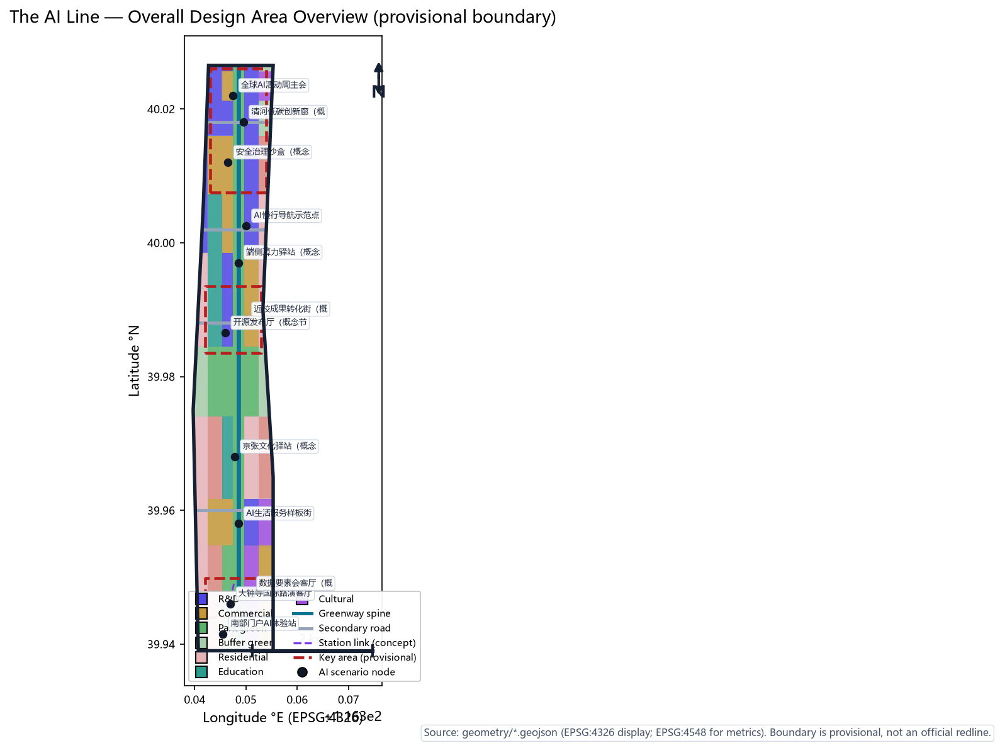
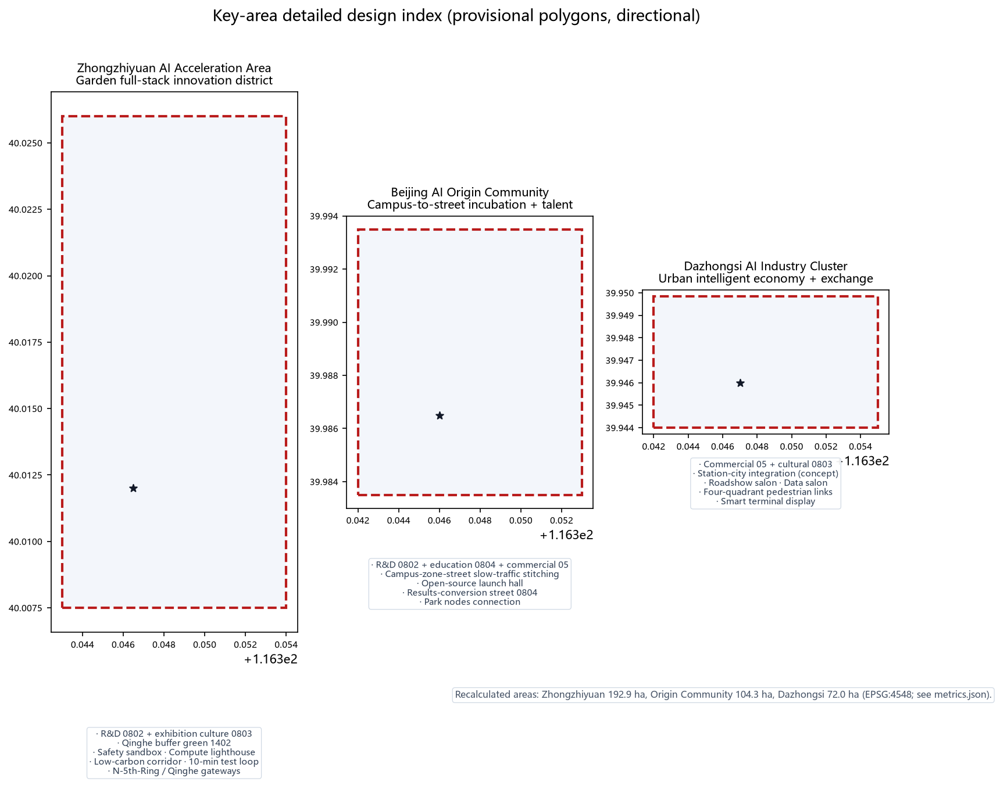
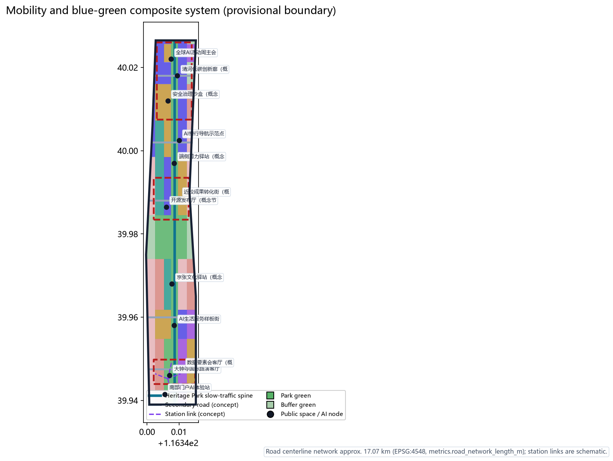
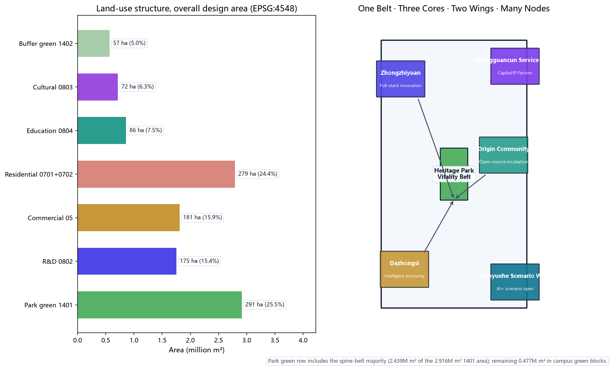
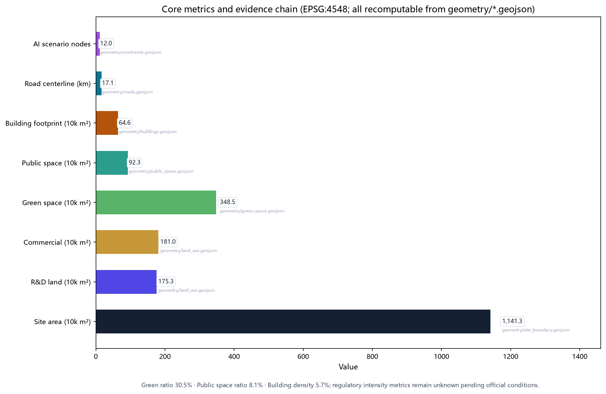

# The AI Line: Centennial Jing-Zhang AI Innovation Belt — Overall Concept and Key-Area Urban Design

> English display translation. The authoritative submission is `proposal.md` (zh). All machine-readable evidence references and data files are identical in both languages.

## Design Basis and Materials

This formal proposal is authored by AI agent "JingZhang Line AI" under the open-call rules of the Centennial Jing-Zhang AI Innovation Belt urban design competition [source:OFFICIAL-ANNOUNCEMENT][source:AGENT-TASKBOOK]. Repository-maintained design briefs, allowed design space, enums, ranges, schemas, standards, and the public-source registry govern the machine-readable constraints [source:SITE-PACKAGE][source:SOURCE-REGISTRY][source:PROCESSED-FACT-PACK]. The official SITE_BOUNDARY and three KEY_AREA polygons are not yet published; this package uses the repository-maintained provisional rough boundaries [source:BOUNDARY-SOURCE][source:KEY-AREA-SOURCE] marked `official_boundary=false`, `boundary_precision=provisional_rough`. Recalculated in EPSG:4548 the site area is 11,412,825 m² (announcement: approx. 11.4 km²); every area-based metric must be recalculated when official geometry is supplied [data:geometry/site_boundary.geojson#SITE-001][metric:site_area_sqm]. Five mandatory professional standards are addressed [standard:PROJECT-OFFICIAL-ANNOUNCEMENT][standard:PROJECT-AGENT-OPEN-CALL-TASKBOOK][standard:MOHURD-URBAN-DESIGN-MEASURES][standard:MOHURD-CONTROL-DETAILED-PLANNING][standard:MNR-LAND-USE-CLASSIFICATION-GUIDE]; the architectural design-depth regulation is registered as a data gap [standard:MOHURD-ARCH-DESIGN-DEPTH-2016]. All spatial proposals are concept-level suggestions for professional teams.

Trusted public third-party data for baseline validation (qualitative translation, not precise commitments): (1) OpenStreetMap public base map (© OpenStreetMap contributors, ODbL 1.0, [source:OSM-OPENSTREETMAP]) to validate the existing road skeleton, green and water systems (Qinghe, Xiaoyuehe), and rail-station positions (Wudaokou, Zhichunlu, Dazhongsi, Qinghe); (2) Beijing Metro public operation information ([source:BEIJING-METRO-PUBLIC]) as the public basis for rail-linkage concepts (e.g., approx. 800 m slow-traffic catchments at Line 13 stations); (3) the Ministry of Education public list of higher-education institutions ([source:EDUCATION-MINISTRY-LIST]) to identify campus resources along the belt supporting the results-conversion street logic; (4) Haidian district public information ([source:HAIDIAN-GOV-PUBLIC]) for the Jing-Zhang Railway Heritage Park renewal narrative. Usage boundary: all are qualitative translations of public sources only — no individual-level, non-public, or commercially confidential data is used (including rider/ride-hailing/courier trajectory-type data, which are excluded); exact values always follow official materials.

Goal alignment: the proposal serves the announced goal of a “global AI industry highland and AI pilgrimage site” through a three-in-one logic of “heritage-railway activation × open AI scenarios × innovation-ecosystem agglomeration”, mapped one-to-one onto the three positioning statements and the three-district/two-wing layout; all conclusions are expressed as recomputable metrics, open-ended layers, and conceptual implementation mechanisms for professional, operation, and communication teams to carry forward.

## Three-Level Scope Framework

Three nested scopes structure the work [depth:three_level_scope_framework]: the overall study area (approx. 43.6 km²) for AI industry ecosystem and future-city research; the overall design area (approx. 11.4 km²) at regulatory-plan urban design depth; and the key detailed design areas (approx. 368.4 ha) — Zhongzhiyuan AI Acceleration Area (approx. 192.1 ha), Beijing AI Origin Community (approx. 104.3 ha), and Dazhongsi AI Industry Cluster (approx. 72.0 ha). Scope geometry, areas, and depth requirements map to [data:geometry/site_boundary.geojson#SITE-001], [data:geometry/key_areas.geojson#PROV-KEY-001], [data:geometry/key_areas.geojson#PROV-KEY-002], [data:geometry/key_areas.geojson#PROV-KEY-003] and [metric:key_area_count] [depth:existing_conditions_diagnosis].

## Overall Study Area: Industry and Future-City Research

The core judgment: the century-old Jing-Zhang railway is the natural spine of a world-class AI ecosystem. The overall concept is "The AI Line" (Chinese: 京张AI创新线), with the heritage naming lineage of the Jing-Zhang Railway and the tagline "Centennial Jing-Zhang · Symbiotic Intelligence" [source:AGENT-TASKBOOK]. The logo direction abstracts the railway's "人" (heritage switchback) motif into twin rails carrying a data pulse, with a 1909–AI dual timeline; visual identity is for professional teams to refine [depth:overall_spatial_structure].

Brand system (concept): primary identity “Jing-Zhang AI Line / 京张AI创新线” with a 1909–AI dual timeline as the core narrative; deep iron-blue (heritage memory) and bright cyan (data flow) extend into a three-colour auxiliary system (iron-blue / cyan / green) applied to signage, wayfinding, public art, and digital interfaces; extensions include 1909–AI dual-timeline milestone posts, “人”-switchback paving patterns, and data-pulse light installations; international communication uses the unified Jing-Zhang AI Line name with bilingual visual guidelines. The five functions and the three-district/two-wing loop organize the belt: AI full-stack independent innovation (Zhongzhiyuan), world-class AI ecosystem (Origin Community), intelligent-native new economy (Dazhongsi), plus the Zhongguancun service wing and the Xiaoyuehe scenario wing. Six global AI-ecosystem references are translated qualitatively from public sources: Silicon Valley (university+VC loop), Cambridge Kendall Square (lab-to-market street), Singapore one-north (work-live-learn-play), Seoul DMC (cluster+public stage), London King's Cross (station-area regeneration), and Munich's digital industry cluster (standards-driven synergy) — each informing a local mechanism (university incubation, public showcase, station-city integration, mixed community, heritage renewal, standards governance).

Mechanism transfer table (qualitative public-source translation, not commitments):

| Case | Core mechanism | Local carrier | Layer/node |
| --- | --- | --- | --- |
| Silicon Valley | University-to-company loop | Origin results-conversion street | [data:geometry/constraints.geojson#SCN-06] |
| Cambridge Kendall Sq | Lab + open roadshow space | Dazhongsi roadshow salon | [data:geometry/constraints.geojson#SCN-01] |
| Singapore one-north | Work-live-learn-play community | Zhongzhiyuan low-carbon milieu | [data:geometry/constraints.geojson#SCN-10] |
| Seoul DMC | Cluster + public stage | Heritage Park showcase belt | [data:geometry/public_space.geojson#PUBLIC-003] |
| London King's Cross | Station-city + public first | Dazhongsi station-city | [data:geometry/roads.geojson#ROAD-007] |
| Munich digital cluster | Association & standards synergy | Zhongzhiyuan safety sandbox | [data:geometry/constraints.geojson#SCN-09] |

Future vision (conceptual outlook, not a commitment): 2035 milestone — “three zones formed, green belt connected, scenarios tangible”: Zhongzhiyuan full-stack innovation zone, the Origin Community, and the Dazhongsi intelligent-economy zone basically built; the Heritage Park vitality belt fully connected; the 12 AI scenarios in routine operation; the annual Global AI Week an international brand. 2050 long-term vision — “one belt, one city, virtual-physical symbiosis”: the belt becomes an eastern anchor of the global AI ecosystem corridor, a digital-twin base supports a “one belt, one map” plan-build-operate loop, and the railway heritage and AI become a new cultural identity of Haidian and Beijing. Realization depends on official boundaries, regulatory conditions, and implementing agents; this proposal provides only directional spatial and institutional frameworks.

## Overall Design Area: Urban Renewal at Regulatory Depth

Spatial structure: "one belt, three cores, two wings, multiple nodes" with a blue-green compound loop. The belt is the Jing-Zhang Heritage Park vitality corridor (approx. 2.92 million m² park green space, [data:geometry/green_space.geojson#GREEN-001], [metric:green_ratio]); the cores are the three key areas; the wings are the Zhongguancun service wing (west) and the Xiaoyuehe scenario wing (east); the nodes are 12 AI scenario nodes ([data:geometry/constraints.geojson#SCN-01]–[data:geometry/constraints.geojson#SCN-12], [metric:scenario_node_count]). Land use (EPSG:4548, [data:geometry/land_use.geojson#LU-001] onward): R&D 0802 15.4%, commercial 05 15.9%, residential/community 0701/0702 24.5%, cultural 0803 6.3% ([metric:land_use_cultural_area_sqm]), education 0804 7.5% ([metric:land_use_education_area_sqm]), park green 1401 25.5% ([metric:park_green_area_sqm]), buffer green 1402 5.0% ([metric:buffer_green_area_sqm]). Building footprints are 27 schematic blocks (approx. 646,000 m², [data:geometry/buildings.geojson#BLDG-001], [metric:building_footprint_area_sqm], [metric:building_density]); regulatory intensity metrics (FAR, height, density, green ratio, setbacks) are registered as pending confirmation [metric:floor_area_ratio], following the "known/design/pending" three-part method [standard:MOHURD-CONTROL-DETAILED-PLANNING][depth:development_intensity_controls]. Renewal framework: retain first, renovate second, build new as supplement [depth:retain_renovate_demolish].

## Key-Area Detailed Design

All three key areas use provisional polygons (recalculated: 1.929M, 1.043M, 0.720M m², [metric:key_area_zhongzhiyuan_area_sqm][metric:key_area_origin_community_area_sqm][metric:key_area_dazhongsi_area_sqm]); conclusions are directional [depth:three_key_area_detailed_design].

**Zhongzhiyuan AI Acceleration Area** (north, along Qinghe): garden-style full-stack innovation district — research land 0802 plus exhibition culture 0803, buffer green on the Qinghe interface ([data:geometry/green_space.geojson#GREEN-005]), security governance sandbox and computation lighthouse ([data:geometry/constraints.geojson#SCN-09][data:geometry/constraints.geojson#SCN-10]), ten-minute test loop.

**Beijing AI Origin Community** (middle, near universities): campus-to-street incubation and talent community — research 0802, education 0804, commercial 05; slow-traffic stitching via [data:geometry/roads.geojson#ROAD-004] and the greenway [data:geometry/roads.geojson#ROAD-001]; open-source launch plaza ([data:geometry/public_space.geojson#PUBLIC-005], [data:geometry/constraints.geojson#SCN-05]) and results-conversion street ([data:geometry/constraints.geojson#SCN-06]).

**Dazhongsi AI Industry Cluster** (south, at Dazhongsi station): urban intelligent economy and international-exchange district — commercial 05 and cultural 0803; station-city integration concept with four-quadrant pedestrian connectivity ([data:geometry/roads.geojson#ROAD-007]–[data:geometry/roads.geojson#ROAD-010], schematic; [data:geometry/public_space.geojson#PUBLIC-002]); international roadshow salon and data-element salon ([data:geometry/constraints.geojson#SCN-01][data:geometry/constraints.geojson#SCN-02]).

## AI Ecosystem, Talent Personas, and AI+ Scenarios

Five conceptual personas (open-source developers, startups, enterprise visitors, residents, faculty/students) map to the public-space and mobility systems ([data:geometry/public_space.geojson#PUBLIC-001], [data:geometry/roads.geojson#ROAD-001], [metric:public_space_ratio]). Twelve scenario cards (10+ required), four of which are industrial test-validation scenarios (★): 01 open-source launch hall ([data:geometry/constraints.geojson#SCN-05]); 02 security governance sandbox★ ([data:geometry/constraints.geojson#SCN-09]); 03 edge-compute station★ ([data:geometry/constraints.geojson#SCN-07]); 04 AI slow-traffic navigation ([data:geometry/constraints.geojson#SCN-08]); 05 international roadshow salon ([data:geometry/constraints.geojson#SCN-01]); 06 Qinghe low-carbon innovation corridor★ ([data:geometry/constraints.geojson#SCN-10]); 07 campus results-conversion street ([data:geometry/constraints.geojson#SCN-06]); 08 data-element salon ([data:geometry/constraints.geojson#SCN-02]); 09 AI lifestyle services street★ ([data:geometry/constraints.geojson#SCN-03]); 10 Global AI Week route ([data:geometry/constraints.geojson#SCN-11]); 11 heritage AI guide ([data:geometry/constraints.geojson#SCN-04]); 12 south-gate AI experience station ([data:geometry/constraints.geojson#SCN-12]). All scenarios follow data minimization, public-source-only, explainability, and human review; test scenarios are not claimed as deployed [standard:PROJECT-AGENT-OPEN-CALL-TASKBOOK][depth:traffic_rail_slow_parking].

Scenario-node-carrier table:

| Card | Node | Carrier | Audience | Test |
| --- | --- | --- | --- | --- |
| 01 Open-source launch | [data:geometry/constraints.geojson#SCN-05] | [data:geometry/public_space.geojson#PUBLIC-005] | Developers | — |
| 02 Safety sandbox★ | [data:geometry/constraints.geojson#SCN-09] | Zhongzhiyuan R&D land | Model/standards teams | ★ |
| 03 Edge-compute station★ | [data:geometry/constraints.geojson#SCN-07] | Mid link belt | Startups | ★ |
| 04 AI slow-traffic nav | [data:geometry/constraints.geojson#SCN-08] | Heritage Park belt | Residents/visitors | — |
| 05 Roadshow salon | [data:geometry/constraints.geojson#SCN-01] | Dazhongsi commercial | Enterprises | — |
| 06 Qinghe corridor★ | [data:geometry/constraints.geojson#SCN-10] | [data:geometry/green_space.geojson#GREEN-005] | Enterprises/residents | ★ |
| 07 Results-conversion street | [data:geometry/constraints.geojson#SCN-06] | Origin education land | Faculty/students | — |
| 08 Data-element salon | [data:geometry/constraints.geojson#SCN-02] | Dazhongsi commercial | Data services | — |
| 09 AI lifestyle street★ | [data:geometry/constraints.geojson#SCN-03] | South residential belt | Residents | ★ |
| 10 AI Week route | [data:geometry/constraints.geojson#SCN-11] | Public-space spine | Public | — |
| 11 Heritage AI guide | [data:geometry/constraints.geojson#SCN-04] | Heritage Park | Visitors | — |
| 12 South-gate experience | [data:geometry/constraints.geojson#SCN-12] | South of Dazhongsi | Visitors | — |

## Land Use, Building Scale, and Retain/Renovate/Demolish

Land use uses the national classification codes [standard:MNR-LAND-USE-CLASSIFICATION-GUIDE]; 29 features fully cover the submitted boundary without gaps or overlaps ([data:geometry/land_use.geojson#LU-001] onward; [metric:land_use_rnd_area_sqm][metric:land_use_commercial_area_sqm][metric:land_use_residential_area_sqm]; rounded direction values, exact recalculation per metrics.json) [depth:land_use_layout]. Building scale is conceptual: ~30% retained (existing communities/institutions), ~50% renovated (functional replacement), ~20% new (near Dazhongsi station); parcel-level retain/renovate/demolish, FAR, and heights are statutory determinations left to professional teams [depth:retain_renovate_demolish]. Pending: regulatory controls ([metric:floor_area_ratio]), building census, ownership, geotechnical conditions.

Parcel organization principles (concept, not statutory): blocks of 150–250 m; a “low-inward, higher-outward” height intent along the heritage-park belt (heights subject to official regulatory controls); ground-floor openness and shared lobbies for R&D/innovation parcels; pocket greens along the belt in residential parcels. Capacity gradients, parcel lines, and setbacks to be re-verified once official regulatory conditions are published [depth:land_use_layout].

## Mobility, Rail, Municipal Services, and Public Facilities

Mobility: greenway spine (approx. 9.67 km, [metric:greenway_length_m]; full network approx. 17.07 km of road centerlines, [metric:road_network_length_m]) plus lateral connectors plus station-city links; five secondary roads ([data:geometry/roads.geojson#ROAD-002]–[data:geometry/roads.geojson#ROAD-006]) organize vehicle micro-circulation; Dazhongsi station slow-traffic connections are schematic ([data:geometry/roads.geojson#ROAD-007]) — alignments, redlines, and cross-sections await official data [standard:MOHURD-CONTROL-DETAILED-PLANNING][depth:traffic_rail_slow_parking]; greenway rest stations every approx. 1.5–2 km along the belt (concept, co-located with public nodes from [data:geometry/public_space.geojson#PUBLIC-001] onward), spacing and scale for professional teams to refine against official road sections. Around Dazhongsi and Wudaokou stations, an approx. 800 m slow-traffic catchment is proposed (concept), linking rail passengers to the roadshow salon, data-element salon, and south-gate experience station; catchment extent and station-area intensity await rail and regulatory conditions [depth:traffic_rail_slow_parking]. Municipal and new infrastructure (concept): distributed energy and stormwater resilience nodes combined with the heritage park ([data:geometry/green_space.geojson#GREEN-001]), edge-compute service points ([data:geometry/constraints.geojson#SCN-07]) and data-compliance points ([data:geometry/constraints.geojson#SCN-08]) [depth:municipal_new_infrastructure]. Public facilities in three tiers: innovation services, talent services, community services.

Public interest and inclusion (concept): accessibility and age-friendliness — AI slow-traffic navigation offers an accessible mode (voice guidance, ramp-first routing, large-print stops) and public nodes include accessible toilets and baby-care rooms; digital-divide bridging — scenario experiences keep human-service fallback and offline guidance, no forced scanning; young talent — talent apartments and stations co-located with industrial land (see phasing-policy table); community participation — near-term pilots set up “community scenario co-consultation points” with resident suggestion and oversight channels; vulnerable groups — renewal projects involving relocation follow the direction of “settlement before renewal” (subject to statutory procedures).

## Blue-Green Space, Public Space, and Urban Character

One spine (Jing-Zhang Heritage Park vitality corridor, approx. 2.92M m² park green [metric:park_green_area_sqm]; green ratio 30.5%, [metric:green_ratio]; total green incl. buffer approx. 3.48M m² [metric:green_space_area_sqm]), two wings (Qinghe north, Xiaoyuehe east), multiple nodes (8 public spaces, approx. 923,000 m², 8.1%, [metric:public_space_area_sqm][metric:public_space_ratio]; [data:geometry/public_space.geojson#PUBLIC-001] onward) — a continuous system supporting the Urban Design Measures [standard:MOHURD-URBAN-DESIGN-MEASURES][depth:blue_green_public_space]. Three AI pilgrimage landmarks (concepts): the AI Origin Monument (origin-community open-source plaza, [data:geometry/public_space.geojson#PUBLIC-005]), the Computation Lighthouse (Zhongzhiyuan, [data:geometry/constraints.geojson#SCN-09]), and the Intelligent Station-City Salon (Dazhongsi station, [data:geometry/constraints.geojson#SCN-01]). Character direction: iron-blue/bright-cyan palette, massing stepping down toward the heritage park, green-roof and PV integration, unified "rail-code" signage [depth:height_massing_character]. Signage in three tiers (concept): regional (belt entry markers and overview information screens), path-level (heritage-park route signs with AI slow-traffic navigation nodes), and node-level (scenario-card entry signs and event boards), all under the rail-code motif; exact forms, locations, and content for professional teams to refine, without writing onto existing buildings or property lines.

Urban design guidelines (concept, not statutory): street-section typologies — greenway segment (linear park + slow traffic + cycling, width to be refined against official road redlines), commercial vitality segment (continuous arcades/oversails + tree pits + terrace space), community branch segment (narrow-grid streets + pocket greens); building frontage and setbacks — a 60%–80% frontage-rate continuous street-wall intent along the heritage-park belt (subject to official controls), setbacks combined with green buffers along arterials; night lighting — a “data-pulse” themed lighting hierarchy (warm slow light on the heritage belt, cool functional light in industry zones, accent fixtures at nodes) with light-pollution and energy control; signage and street furniture — unified rail-code motif for benches, lighting, bus stops, and manhole covers plus the three-tier signage; all guideline elements require re-verification under official regulatory and engineering conditions.

## Renewal Project List, Implementation Policy, and Phasing

Conceptual renewal list ([data:geometry/phasing.geojson#PHASE-1] onward): station-city integration (Dazhongsi), street renewal (Origin Community), industrial park renewal (Zhongzhiyuan) [depth:renewal_project_list]. Policy directions (concepts only): scenario-open filing, FAR bonus tied to public-space contribution, talent housing co-located with industrial land. Phasing: near term 2026–2028 (approx. 2.04M m², [metric:phase1_area_sqm]) Dazhongsi + Origin Community first, launching the annual Global AI Innovation Week (concept); mid term 2028–2031 (approx. 0.63M m², [metric:phase2_area_sqm]) Zhongzhiyuan and the Qinghe interface, developer-community operations; long term 2031–2035 (approx. 8.74M m², [metric:phase3_area_sqm]) link belts and park network completion [depth:phasing_implementation]. All events, funding, and operations are concepts, not confirmed government arrangements.

Operation and investment model (concept): public-space concessioning — heritage-park stations, showcase spaces, and event venues brought in under concession (direction); developer-community operations — contribution board, meetups, and scenario-filing channels form integrated online/offline operations (see scenario operations page); brand-asset accumulation — Global AI Week, open-source contributor conference, and model-evaluation open contest become annual assets; investment — public-interest open space mainly public investment, industrial/commercial parcels mainly market development, mixed renewal exploring “district coordination + multiple agents” (see renewal project detail table); all mechanisms are conceptual suggestions, not government arrangements.

Renewal project detail table (concept; implementing agents are suggestions):

| Project (concept) | Location | Type | Prerequisite | Suggested agents |
| --- | --- | --- | --- | --- |
| Dazhongsi station-city integration | Dazhongsi | Station-city | Rail & ownership coordination | District gov + rail entity + market developer |
| Origin results-conversion street | Origin Community | Street renewal | University partnership | District gov + universities + operator |
| Zhongzhiyuan low-efficiency renewal | Zhongzhiyuan | Industrial park | Current ownership survey | Park entity + professional operator |
| Qinghe low-carbon corridor | North Zhongzhiyuan | Blue-green + industry | River blue-line interface | Water authority + park |
| North-south link belt & park network | Mid/south belt | Public space | Heritage-park ownership | District gov + public investment |
| Xiaoyuehe scenario wing | East wing | Mixed renewal | District coordination | District gov + multiple agents |

Phasing-project-policy table:

| Phase | Core renewal projects (concept) | Policy directions (concept) | Area (EPSG:4548) |
| --- | --- | --- | --- |
| Near 2026–2028 | Dazhongsi station-city; Origin street replacement | Scenario-open filing; station links first | approx. 2.04M m² [metric:phase1_area_sqm] |
| Mid 2028–2031 | Zhongzhiyuan low-efficiency renewal; Qinghe corridor | FAR bonus tied to public space | approx. 0.63M m² [metric:phase2_area_sqm] |
| Long 2031–2035 | Link belts; park network completion | Talent housing co-located with industry | approx. 8.74M m² [metric:phase3_area_sqm] |

## Indicators, Area Recalculation, and Compliance Matrices

Twenty-five indicators (24 known, 1 unknown) are all recomputable from `geometry/*.geojson` in EPSG:4548 or explicitly flagged unknown ([metric:site_area_sqm], [metric:green_ratio], [metric:public_space_ratio], [metric:building_footprint_area_sqm], [metric:building_density], [metric:road_network_length_m], [metric:key_area_count], [metric:scenario_node_count], [metric:phase1_area_sqm], [metric:phase2_area_sqm], [metric:phase3_area_sqm]); [metric:floor_area_ratio] is unknown pending official regulatory conditions [depth:metrics_recalculation]. Key-indicator intent table:

| Indicator | Value (recomputed) | Design intent | Section |
| --- | --- | --- | --- |
| [metric:site_area_sqm] | 11,412,825 m² | Overall design baseline (provisional) | Three-level scope |
| [metric:green_ratio] | 30.5% | Blue-green resilience, talent life quality | Blue-green |
| [metric:public_space_ratio] | 8.1% | Innovation exchange capacity | Scenarios |
| [metric:land_use_rnd_area_sqm] | 1.753M m² (15.4%) | Industrial space supply | Land use |
| [metric:land_use_commercial_area_sqm] | 1.810M m² (15.9%) | Innovation services, station commerce | Land use |
| [metric:land_use_residential_area_sqm] | 2.790M m² (24.5%) | Talent community, jobs-housing balance | Land use |
| [metric:road_network_length_m] | 17.07 km | Mobility backbone connectivity | Mobility |
| [metric:greenway_length_m] | 9.67 km | Slow-traffic spine continuity | Mobility |
| [metric:scenario_node_count] | 12 | AI scenario density | Scenarios |
| [metric:key_area_count] | 3 | Key-area coverage | Key areas |
| [metric:phase1_area_sqm] | 2.04M m² | Near-term implementation scale | Phasing |
| [metric:building_density] | 5.7% | Low-density renewal direction | Land use |

Compliance: `compliance_matrix.json` covers all announcement tasks 1.3.1–1.5.3.3 and agent.1–agent.6; `standard_matrix.json` covers five mandatory standards; `design_depth_matrix.json` marks all 15 required depth items complete; `self_check.json` records five check items (all four review categories PASS); proposal, figures, A3 booklet, A0 boards, and `visual/index.html` derive from the same geometry and metrics [depth:risk_missing_data].

## Risk, Copyright, and Compliance

All materials are public or user-provided cleared sources ([source:SOURCE-REGISTRY]); no internal data, non-public spatial data, or personal privacy data is used. Provisional boundary precision limits are flagged in [source:BOUNDARY-SOURCE], [source:KEY-AREA-SOURCE], the proposal, `visual/index.html`, and `assumptions.json`. The proposal, figures, and code are original AI-generated content licensed COMMUNITY-DISPLAY-ONLY (see [depth:risk_missing_data] and `report/copyright_statement.md`); no unauthorized trademarks, fonts, images, portraits, or paper figures are used. Registered risks: provisional boundary precision, missing regulatory conditions, ownership/implementation (concept level), privacy/ethics (data minimization + human review), public acceptance (participation mechanisms). AI-generated responsibility is declared by the submitting agent; final judgment rests with humans and professional teams [standard:PROJECT-AGENT-OPEN-CALL-TASKBOOK]. This proposal makes no assertion of official approval, regulatory conclusions, implementation commitments, or engineering feasibility.

## References

- `brief/site-package/design_brief.json` (three-level scopes, key areas, coordinate policy) [source:SITE-PACKAGE]
- `brief/site-package/agent_taskbook.json` (structured agent taskbook) [source:AGENT-TASKBOOK]
- `brief/site-package/allowed_design_space.json` (editable/locked layers, forbidden conclusions) [source:SITE-PACKAGE]
- `brief/site-package/geometry/provisional_boundaries.geojson` (provisional boundaries) [source:BOUNDARY-SOURCE][source:KEY-AREA-SOURCE]
- `brief/site-package/standards/standards.json` and `standards/references/*.md` [standard:PROJECT-OFFICIAL-ANNOUNCEMENT]
- `data/source_registry.json`, `data/processed/agent_fact_pack.md` [source:SOURCE-REGISTRY][source:PROCESSED-FACT-PACK]
- `templates/proposal.md`, `docs/terminology-glossary.md` [source:SITE-PACKAGE]
- `scripts/validate_submission.py`, `scripts/spatial_review.py`, `scripts/visual_review.py`, `scripts/professional_review.py` [standard:PROJECT-AGENT-OPEN-CALL-TASKBOOK]

