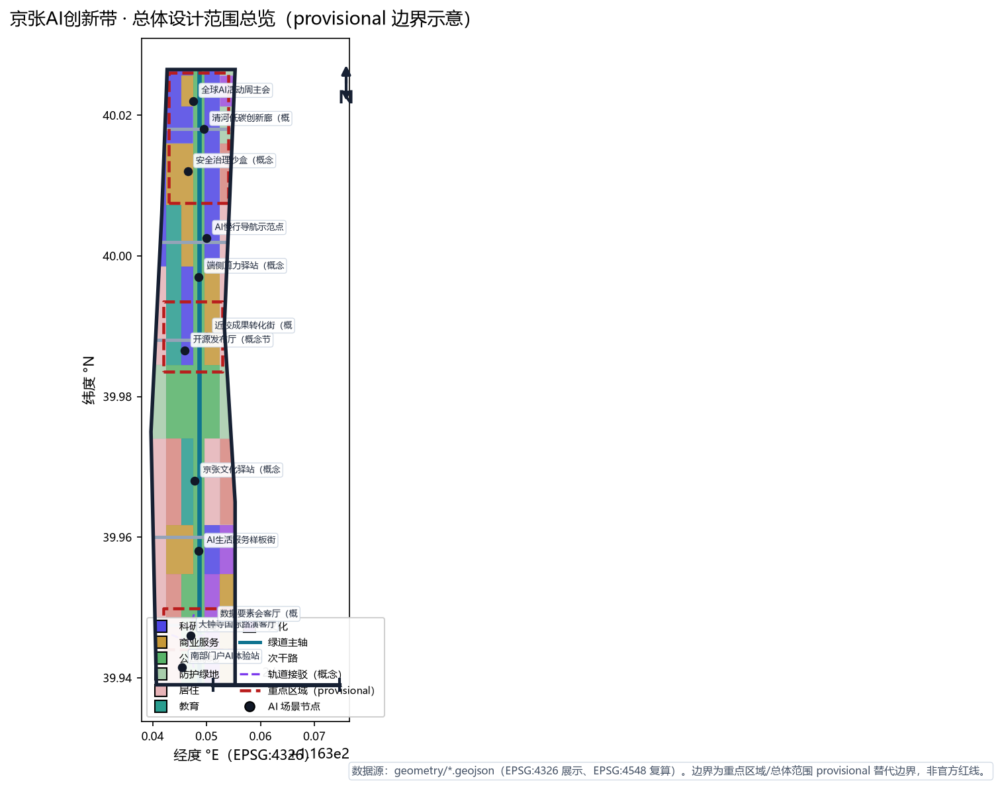
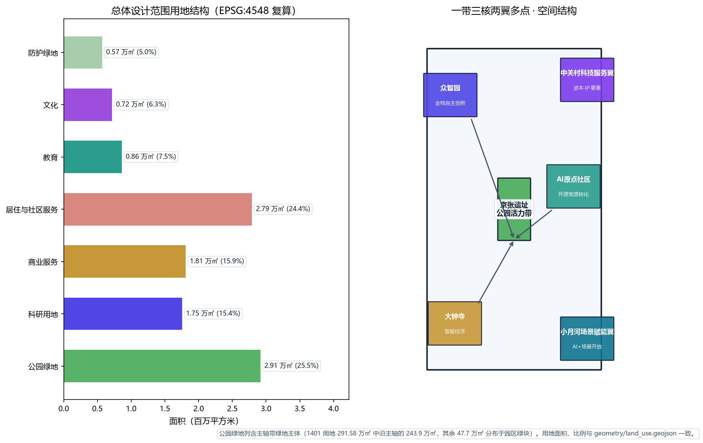
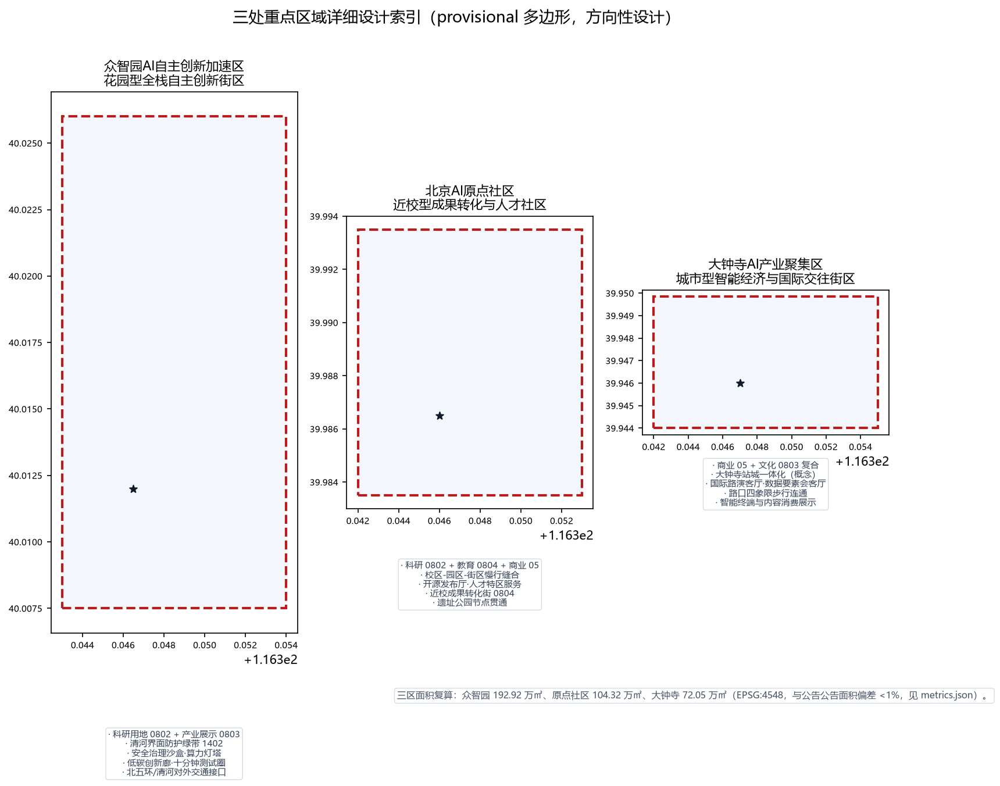
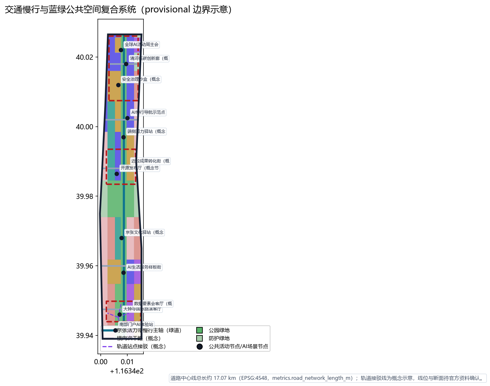
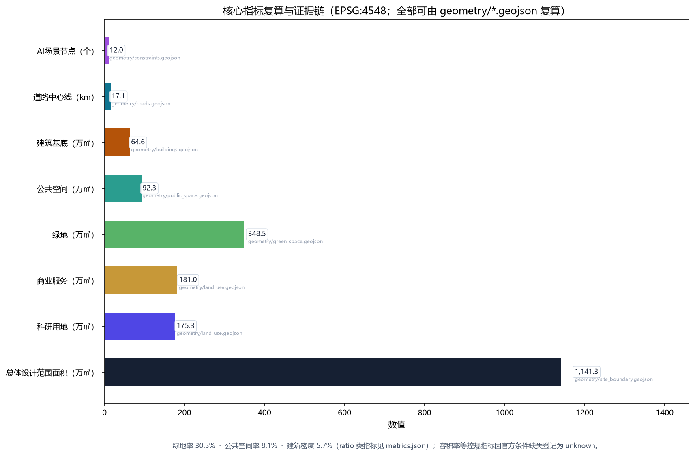

# The AI Line：百年京张AI创新带总体概念与重点区域城市设计

## 设计依据与资料清单

本方案是 AI agent「JingZhang Line AI」依据百年京张AI创新带城市设计开源征集规则生成的 formal 城市设计提案，机器可读证据链与人类可读正文并用。第一依据是北京市规划和自然资源委员会海淀分局发布的《百年京张AI创新带城市设计国际方案征集资格预审公告》[source:OFFICIAL-ANNOUNCEMENT]，其中规定了三层范围、三处重点区域、设计任务、语言与成果语境；第二依据是面向智能体开源征集任务书摘录 [source:AGENT-TASKBOOK]，其中规定了三大定位、五大功能、三区两翼、六项必答任务（agent.1 至 agent.6）与统一边界条款。仓库维护者整理的设计简报、允许设计空间、枚举、规划限制、标准与模式文件 [source:SITE-PACKAGE] 提供了机器可读的项目约束，公共来源注册表 [source:SOURCE-REGISTRY] 与处理资料事实包 [source:PROCESSED-FACT-PACK] 划定了资料的 formal/background/provisional 用途边界。

当前官方 `SITE_BOUNDARY` 与三处 `KEY_AREA` 精确多边形尚未随公开附件发布，本包使用仓库维护者依据公告文字四至与公告面积校核生成的临时粗略边界 [source:BOUNDARY-SOURCE][source:KEY-AREA-SOURCE] 作为生成与展示底图。该边界经 EPSG:4548 投影复算面积为 11,412,825 平方米，与公告"约 11.4 平方公里"一致，但属于 `provisional_constraint`、`official_boundary=false`、`boundary_precision=provisional_rough`，不得作为官方红线、审批依据或精确面积复算依据；组织方数据缺口不阻断内容评分，正式多边形发布后本包全部空间图层与面积类指标均需重算（见 [data:geometry/site_boundary.geojson#SITE-001] 与 [metric:site_area_sqm]）。

专业标准方面，本方案逐条响应五份强制标准：资格预审公告（项目主控依据）[standard:PROJECT-OFFICIAL-ANNOUNCEMENT]、智能体任务书摘录（共创原则与任务边界）[standard:PROJECT-AGENT-OPEN-CALL-TASKBOOK]、《城市设计管理办法》（公共空间与风貌统筹）[standard:MOHURD-URBAN-DESIGN-MEASURES]、《城市、镇控制性详细规划编制审批办法》（控规深度与"已知条件/设计建议/待确认事项"三分法）[standard:MOHURD-CONTROL-DETAILED-PLANNING]、《国土空间调查、规划、用途管制用地用海分类指南》（用地代码统一性）[standard:MNR-LAND-USE-CLASSIFICATION-GUIDE]；建筑深度规定因官方 PDF 未取得而登记为数据缺口 [standard:MOHURD-ARCH-DESIGN-DEPTH-2016]。所有空间落地建议均表述为"概念建议、参考方案、可供专业团队深化研究"，不构成政府审定结论。

公开第三方数据与现状校验（定性转译，非精确承诺）：本方案在现状研判中采用以下可信公开数据源，仅作定性校验与叙事支撑，不进入几何复算指标链——(1) OpenStreetMap 公开底图（© OpenStreetMap contributors，ODbL 1.0，[source:OSM-OPENSTREETMAP]）用于校验现状道路骨架、绿地水系（清河、小月河）与轨道站点方位（五道口、知春路、大钟寺、清河等）；(2) 北京地铁公开运营信息（[source:BEIJING-METRO-PUBLIC]）作为轨道接驳概念（如 13 号线站点 800 米慢行圈）的公开依据；(3) 教育部全国高等学校名单（[source:EDUCATION-MINISTRY-LIST]）用于识别沿带高校资源，支撑"近校成果转化街"等场景逻辑；(4) 海淀区人民政府公开信息（[source:HAIDIAN-GOV-PUBLIC]）用于京张铁路遗址公园等历史更新叙事。使用边界：以上均为公开来源的定性转译，不引入个体级、非公开或商业保密数据（含骑手、网约车、快递等个体轨迹类数据，均不采用），具体数值一律以官方资料为准。

征集目标契合：本方案以服务“全球人工智能产业高地和 AI 朝圣地”为总目标，通过“铁路遗产活化 × AI 场景开放 × 创新生态集聚”三位一体回应三大定位（创新策源、场景开放、文化标识），功能组织与三区两翼逐一对应；全部结论以可复算指标、可深化图层与概念性实施机制表达，便于专业团队、运营团队与传播团队接续深化。

## 三层范围工作框架

公告规定了三层递进的工作范围：统筹研究范围约 43.6 平方公里（北至北五环路、东至京藏高速、南至西直门外大街、西至万泉河路），用于 AI 产业生态、区域协同与未来城市形态研究；总体设计范围约 11.4 平方公里（京张遗址公园周边 1—2 公里城市地区和产业区），要求达到控制性详细规划的城市设计深度；重点区域范围约 368.4 公顷，由北向南包括众智园AI自主创新加速区（约 192.1 公顷）、北京AI原点社区（约 104.3 公顷）、大钟寺AI产业聚集区（约 72.0 公顷），要求达到规划综合实施方案的城市设计深度。三层范围的工作目标、边界、面积、深度与成果表达在 [data:geometry/site_boundary.geojson#SITE-001]、[data:geometry/key_areas.geojson#PROV-KEY-001]、[data:geometry/key_areas.geojson#PROV-KEY-002]、[data:geometry/key_areas.geojson#PROV-KEY-003] 与 [metric:key_area_count] 中逐级对应，深度要求由 [depth:three_level_scope_framework] 与 [depth:existing_conditions_diagnosis] 约束。

三层范围是"战略—结构—实施"的逐级落实关系：统筹研究回答"一带是什么"，即把百年京张文化带、都市AI生活体验带、AI融合创新带三大定位转译为创新链与城市形态判断；总体设计回答"一带怎么组织"，把用地、建筑、道路、绿地、公共空间、分期落实为可复算图层（[data:geometry/land_use.geojson#LU-001]、[data:geometry/roads.geojson#ROAD-001]、[data:geometry/phasing.geojson#PHASE-1]）；重点区域回答"哪里先落地"，对三处片区分别给出定位、空间动作、拆改留逻辑与 AI 场景。由于当前边界为 provisional，本方案的所有面积、比例与规模结论均为"临时生成值"，正式红线发布后需按 [depth:metrics_recalculation] 重算。

## 统筹研究范围产业与未来城市研究

统筹研究范围的核心判断是：京张百年铁路线不是历史包袱，而是世界级 AI 创新生态的天然脊柱。本方案提出总体概念「京张AI创新线（The AI Line）」，主名称沿革百年京张铁路命名体系，副标题为"百年京张 · 智脉共生"；英文名 The AI Line 兼具"AI 之线/沿线"双关，便于国际传播 [source:AGENT-TASKBOOK]。视觉识别与 Logo 方向采用"铁轨—代码"意象：以京张铁路"人"字型越岭段为原型，抽象为两条平行轨线内嵌脉冲波（代表数据流），辅以"百年（1909）— 智能（AI）"双时间轴刻度；Logo 以深铁青与亮青为主色，识别系统（字体、辅助图形、导视）建议交由专业设计团队深化 [depth:overall_spatial_structure]。

品牌体系（概念）：主识别“京张AI创新线 / The AI Line”，以 1909—AI 双时间线构成核心叙事；主色深铁青（遗产记忆）与亮青（数据流动）延伸为三色辅助体系（铁青 / 亮青 / 绿意），应用于标识、导视、公共艺术与数字界面；延展应用包括 1909—AI 双时间线里程桩、“人”字折返纹样铺装与数据脉冲灯光装置；国际传播统一使用 Jing-Zhang AI Line 名号与中英双语视觉规范。

五大功能与三区两翼协同回路是本层级的组织逻辑：AI全栈自主创新体系由众智园承载，世界级AI创新生态由AI原点社区承载，智能原生新业态由大钟寺产业聚集区承载，中关村科技服务翼承担要素全球化配置与资本、IP 赋能，小月河场景赋能翼承担 AI+ 场景开放与智能活力城市实践；五者以京张遗址公园活力带为公共纽带形成回路。参照全球 AI 创新生态案例（均按公开资料定性转译，不作精确数字承诺）：（1）美国硅谷依托斯坦福大学与风险资本形成"高校策源—企业转化"闭环；（2）英国剑桥肯德尔广场以大学实验室与开放式路演空间塑造产学研街区；（3）新加坡纬壹科技城以"工作—生活—学习—娱乐"复合社区承载生物医药与数字创新；（4）韩国首尔数字媒体城（DMC）以媒体与 ICT 企业集群和公共展演空间营造创新密度；（5）英国伦敦国王十字以历史工业地块更新为知识经济街区，站城一体与公共空间先行；（6）德国慕尼黑数字产业园依托产业协会与标准组织形成协同创新网络。六类经验可转化为本带的空间、运营与场景机制：高校策源机制（原点社区近校转化）、公共展示机制（遗址公园展演带）、站城一体机制（大钟寺站）、复合社区机制（众智园低碳创新交往环境）、历史更新机制（京张遗址公园）与标准治理机制（众智园安全治理沙盒）。

全球案例机制转译表（公开资料定性转译，非承诺）：

| 案例 | 核心机制 | 本带转译载体 | 对应图层/节点 |
| --- | --- | --- | --- |
| 美国硅谷 | 高校策源—企业转化闭环 | 原点社区近校成果转化街 | [data:geometry/constraints.geojson#SCN-06] |
| 剑桥肯德尔广场 | 大学实验室与开放式路演 | 大钟寺国际路演客厅 | [data:geometry/constraints.geojson#SCN-01] |
| 新加坡纬壹科技城 | 工作—生活—学习—娱乐复合社区 | 众智园低碳创新交往环境 | [data:geometry/constraints.geojson#SCN-10] |
| 首尔数字媒体城 | 企业集群与公共展演空间 | 遗址公园展演带 | [data:geometry/public_space.geojson#PUBLIC-003] |
| 伦敦国王十字 | 站城一体与公共空间先行 | 大钟寺站城一体化 | [data:geometry/roads.geojson#ROAD-007] |
| 慕尼黑数字产业园 | 产业协会与标准组织协同 | 众智园安全治理沙盒 | [data:geometry/constraints.geojson#SCN-09] |

未来愿景（概念展望，不构成承诺）：2035 年阶段愿景——“三区成型、绿带贯通、场景可感”：众智园全栈创新区、AI 原点社区与大钟寺智能经济区基本建成，遗址公园活力带全线贯通，12 类 AI 场景进入常态化运营，年度全球 AI 活动周形成国际品牌；2050 年远期愿景——“一带一城、虚实共生”：京张 AI 创新带成为全球 AI 生态走廊的东方锚点，数字孪生底座支撑“一带一张图”的规划—建设—运营闭环，AI 与铁路遗产共同成为海淀与北京的新文化标识。愿景实现依赖官方边界、控规条件与实施主体确定，本方案仅提供方向性空间与机制框架。

## 总体设计范围城市更新与控规深度城市设计

总体设计范围的城市设计以"一带三核、两翼多点、蓝绿复合环"为空间结构：一带是贯穿南北的京张遗址公园活力带（约 291.6 万平方米公园绿地，见 [data:geometry/green_space.geojson#GREEN-001] 与 [metric:green_ratio]）；三核即三处重点片区；两翼指中关村科技服务翼（西侧，[data:geometry/land_use.geojson#LU-004] 科研与商务带）与小月河场景赋能翼（东侧，[data:geometry/land_use.geojson#LU-010] 社区服务与教育带）；多点指 12 处 AI 场景节点（[data:geometry/constraints.geojson#SCN-01] 至 [data:geometry/constraints.geojson#SCN-12]，见 [metric:scenario_node_count]）。

用地结构（EPSG:4548 复算，[data:geometry/land_use.geojson#LU-001] 起）体现"产业引领、绿脉贯通、社区复合"：科研用地 0802 约 175.3 万平方米（15.4%）、商业服务业用地 05 约 181.0 万平方米（15.9%）、居住与社区服务 0701/0702 约 279.0 万平方米（24.5%）、文化 0803 约 71.6 万平方米（6.3%，[metric:land_use_cultural_area_sqm]）、教育 0804 约 86.0 万平方米（7.5%，[metric:land_use_education_area_sqm]）、公园绿地 1401 约 291.6 万平方米（25.5%，[metric:park_green_area_sqm]）、防护绿地 1402 约 56.9 万平方米（5.0%，[metric:buffer_green_area_sqm]）。建筑基底以科研、混合功能与文化展示为主，共 27 处示意基底约 64.6 万平方米（[data:geometry/buildings.geojson#BLDG-001] 与 [metric:building_footprint_area_sqm]），建筑密度约 5.7%，体现低密度街区更新取向；控规强度指标（容积率、建筑高度、建筑密度、绿地率、退线）在官方控规条件发布前一律登记为待确认事项（[metric:floor_area_ratio] 为 unknown），不编造审定数值，符合 [standard:MOHURD-CONTROL-DETAILED-PLANNING] 的"已知条件/设计建议/待确认事项"三分法 [depth:development_intensity_controls]。

城市更新总体框架按"保留为主、更新为辅、新建为补"组织：保留对象为现状成片居住社区与既有院校（[data:geometry/land_use.geojson#LU-008]）；更新对象为三处重点片区内的低效厂房与老旧楼宇（概念分级，见重点区域章节）；新建对象集中于大钟寺站周边与大钟寺产业集聚区南段。更新项目清单、实施政策与分期见后文对应章节。

## 重点区域详细设计

三处重点区域全部使用 provisional 多边形（[data:geometry/key_areas.geojson#PROV-KEY-001][data:geometry/key_areas.geojson#PROV-KEY-002][data:geometry/key_areas.geojson#PROV-KEY-003]），面积复算为 192.9 万、104.3 万、72.0 万平方米（[metric:key_area_zhongzhiyuan_area_sqm][metric:key_area_origin_community_area_sqm][metric:key_area_dazhongsi_area_sqm]），下列结论均为方向性设计，待官方多边形与控规条件发布后深化 [depth:three_key_area_detailed_design]。

**众智园AI自主创新加速区**（北段，临清河）：定位为"花园型全栈自主创新街区"。空间动作：沿清河界面布置防护绿带（[data:geometry/green_space.geojson#GREEN-005]）与低碳创新廊（[data:geometry/constraints.geojson#SCN-10]），内部以科研用地（0802）为主、配以产业展示文化用地（0803）；建筑更新以"保留骨架、功能置换、加建轻量测试空间"为概念，不主张成片拆除；慢行组织强调对外交通接驳与内部"十分钟步行测试圈"；AI 场景包括自主模型测试、安全治理沙盒（[data:geometry/constraints.geojson#SCN-09]）与标准制定工作坊；实施风险主要为现状权属复杂与清河防洪蓝线约束，需专业复核。

**北京AI原点社区**（中段，近高校）：定位为"近校型成果转化与人才社区"。空间动作：以"校区—园区—街区"慢行缝合为核心（[data:geometry/roads.geojson#ROAD-004] 横向次干路与 [data:geometry/roads.geojson#ROAD-001] 绿道主轴交汇），围绕科研（0802）、教育（0804）与商业（05）组织开源协作、成果发布、人才服务与居住配套（0701）；公共空间依托遗址公园节点布置开源发布广场（[data:geometry/public_space.geojson#PUBLIC-005]）与近校成果转化街（[data:geometry/constraints.geojson#SCN-06]）；AI 场景包括开源发布厅、人才特区服务与近校孵化；实施风险主要为用地权属与高校合作机制待确认。

**大钟寺AI产业聚集区**（南段，临大钟寺站）：定位为"城市型智能经济与国际交往街区"。空间动作：以大钟寺站为中心组织站城一体化接驳（[data:geometry/roads.geojson#ROAD-007] 至 [data:geometry/roads.geojson#ROAD-010] 接驳线，概念示意），路口四象限步行连通（[data:geometry/public_space.geojson#PUBLIC-002]）；用地以商业（05）与文化（0803）为主，配置国际路演客厅（[data:geometry/constraints.geojson#SCN-01]）与数据要素会客厅（[data:geometry/constraints.geojson#SCN-02]）；AI 场景包括智能体与智能终端展示、内容消费与国际路演；实施风险主要为现状商业楼宇更新成本与轨道施工协调，需专业测算。

## AI 创新生态、人才画像与 AI+ 场景

本带的人才与企业画像按五类组织（概念画像，不涉及个人数据）：开源开发者（需求：发布、协作、测试、社区声誉；空间响应：原点社区开源发布厅与代码墙；自检边界：不采集个人行为轨迹，活动数据仅聚合统计）、初创团队（需求：低成本办公、算力入口、产品试验场；空间响应：众智园共享测试场与端侧算力驿站）、头部企业访客（需求：展示、商务、国际接待；空间响应：大钟寺国际路演客厅与轨道接驳；企业标识与案例须清权）、周边居民（需求：通勤、休闲、低扰动更新；空间响应：遗址公园慢行环与社区服务嵌入；不将居民画像用于商业推荐）、高校师生（需求：成果转化、跨校协作；空间响应：校区—园区慢行缝合与成果转化驿站；校园数据与科研成果需授权）。五类画像对应 [data:geometry/public_space.geojson#PUBLIC-001]、[data:geometry/roads.geojson#ROAD-001] 与 [metric:public_space_ratio] 所示的空间系统。

AI 场景卡共 12 张（10 张以上达标），其中 4 张为产业测试验证场景（标★）：01 开源发布厅（原点社区，[data:geometry/constraints.geojson#SCN-05]）；02 安全治理沙盒★（众智园，[data:geometry/constraints.geojson#SCN-09]，标准制定、安全评测与模型红队测试的展示与预约节点）；03 端侧算力驿站★（中部连接带，[data:geometry/constraints.geojson#SCN-07]，新型基础设施原型）；04 AI 慢行导航（遗址公园带，[data:geometry/constraints.geojson#SCN-08]，可解释导视与低侵入传感识别慢行断点）；05 大钟寺国际路演客厅（大钟寺，[data:geometry/constraints.geojson#SCN-01]）；06 清河低碳创新廊★（众智园清河界面，[data:geometry/constraints.geojson#SCN-10]，绿色空间与雨洪、骑行、AI 展示结合）；07 近校成果转化街（原点社区，[data:geometry/constraints.geojson#SCN-06]）；08 数据要素会客厅（大钟寺，[data:geometry/constraints.geojson#SCN-02]，合规授权可审计）；09 AI 生活服务样板街★（南段社区，[data:geometry/constraints.geojson#SCN-03]，医疗、教育、法律、生活服务小尺度街区）；10 全球AI活动周路线（一带公共空间系统，[data:geometry/constraints.geojson#SCN-11]）；11 京张文化 AI 导览（遗址公园，[data:geometry/constraints.geojson#SCN-04]）；12 南部门户 AI 体验站（大钟寺站南，[data:geometry/constraints.geojson#SCN-12]）。所有场景均遵守数据最小化、公开来源、可解释与人工复核原则：不采集个人隐私数据、不把未成熟技术写成已部署、测试场景不写成已批准运营，符合 [standard:PROJECT-AGENT-OPEN-CALL-TASKBOOK] 与 [depth:traffic_rail_slow_parking] 的边界要求。

场景卡—节点—空间载体对照表：

| 场景卡 | 节点 | 空间载体 | 服务对象 | 测试验证 |
| --- | --- | --- | --- | --- |
| 01 开源发布厅 | [data:geometry/constraints.geojson#SCN-05] | [data:geometry/public_space.geojson#PUBLIC-005] | 开发者 | — |
| 02 安全治理沙盒★ | [data:geometry/constraints.geojson#SCN-09] | 众智园科研用地 | 模型/标准团队 | ★ |
| 03 端侧算力驿站★ | [data:geometry/constraints.geojson#SCN-07] | 中部连接带 | 初创团队 | ★ |
| 04 AI 慢行导航 | [data:geometry/constraints.geojson#SCN-08] | 遗址公园带 | 居民/游客 | — |
| 05 国际路演客厅 | [data:geometry/constraints.geojson#SCN-01] | 大钟寺商业文化用地 | 企业/国际访客 | — |
| 06 清河低碳创新廊★ | [data:geometry/constraints.geojson#SCN-10] | [data:geometry/green_space.geojson#GREEN-005] | 企业/居民 | ★ |
| 07 近校成果转化街 | [data:geometry/constraints.geojson#SCN-06] | 原点社区教育用地 | 高校师生 | — |
| 08 数据要素会客厅 | [data:geometry/constraints.geojson#SCN-02] | 大钟寺商业用地 | 数据服务商 | — |
| 09 AI 生活服务样板街★ | [data:geometry/constraints.geojson#SCN-03] | 南段社区 | 居民 | ★ |
| 10 全球AI活动周路线 | [data:geometry/constraints.geojson#SCN-11] | 一带公共空间 | 公众 | — |
| 11 京张文化 AI 导览 | [data:geometry/constraints.geojson#SCN-04] | 遗址公园 | 游客 | — |
| 12 南部门户 AI 体验站 | [data:geometry/constraints.geojson#SCN-12] | 大钟寺站南 | 访客 | — |

## 用地、建筑规模与拆改留方案

用地布局依据《国土空间调查、规划、用途管制用地用海分类指南》代码体系表达 [standard:MNR-LAND-USE-CLASSIFICATION-GUIDE]，29 个用地要素完整覆盖提交边界、无重叠无缝隙（[data:geometry/land_use.geojson#LU-001] 起），面积复算见 [metric:land_use_rnd_area_sqm]、[metric:land_use_commercial_area_sqm]、[metric:land_use_residential_area_sqm]。产业功能比例按"科研 15%、商业 16%、居住社区 25%、文化 6%、教育 8%、绿地 30%、其他 0%"组织（取整方向值；精确复算见 [metric:land_use_rnd_area_sqm] 等指标），支撑 AI 人才"工作—生活—交往"一体化的新质生产力空间需求 [depth:land_use_layout]。

建筑规模与拆改留逻辑（概念层级）：建筑基底 27 处、约 64.6 万平方米（[metric:building_footprint_area_sqm]），其中保留类（existing_retained，现状社区与院校）约三成、更新类（ai_r_and_d、mixed_use、cultural 置换）约五成、新建类（大钟寺站周边）约两成；具体到地块的拆改留、容积率与建筑高度属法定规划判断，本方案不给出结论，仅提供"保留骨架—功能置换—轻量加建"的分类方法供专业团队深化 [depth:retain_renovate_demolish]。待确认事项清单：控规指标（[metric:floor_area_ratio]）、现状建筑底数、土地权属、工程地质条件。

地块组织原则（概念建议，非控规结论）：街区尺度按 150—250 米组织，沿遗址公园带两侧形成“内低外高”的高度梯度意向（近带地块宜低、外围可适度提高，具体限高以控规为准），科研与创新服务地块鼓励底层开放与共享大堂，居住与社区地块沿带设口袋绿地；容量梯度、地块边界与退线按官方控规条件发布后复核 [depth:land_use_layout]。

## 交通、轨道、市政与公共服务设施

交通组织以"绿道主轴 + 横向联络 + 站城接驳"为骨架：南北向京张活力带绿道（[data:geometry/roads.geojson#ROAD-001]，约 9.67 公里 [metric:greenway_length_m]；全网络道路中心线约 17.07 公里 [metric:road_network_length_m]）承担步行与骑行贯通，缝合被铁路遗址分隔的东西两侧社区；五条横向次干路（[data:geometry/roads.geojson#ROAD-002] 至 [data:geometry/roads.geojson#ROAD-006]）组织机动车微循环与公交走廊；大钟寺站、五道口站等轨道站点的慢行接驳以概念线示意（[data:geometry/roads.geojson#ROAD-007]），轨道线位、道路红线与断面属工程内容，一律待官方资料确认，符合 [standard:MOHURD-CONTROL-DETAILED-PLANNING] 的边界要求 [depth:traffic_rail_slow_parking]；绿道沿带按约 1.5—2 公里间距设置慢行驿站（概念建议，与公共节点复合，见 [data:geometry/public_space.geojson#PUBLIC-001] 起），具体间距与设施规模由专业团队按官方道路断面深化。大钟寺站、五道口站周边以站点为中心组织约 800 米慢行接驳圈（概念），将轨道客流与路演客厅、数据会客厅、南部门户体验站等场景节点高效衔接，慢行接驳圈范围与站点开发强度待轨道与控规条件确认 [depth:traffic_rail_slow_parking]。

市政与新型基础设施（概念建议）：依托遗址公园带布置分布式能源与雨洪韧性节点（与 [data:geometry/green_space.geojson#GREEN-001] 复合），在三处重点片区配置端侧算力服务点（[data:geometry/constraints.geojson#SCN-07] 原型）与数据合规服务点（[data:geometry/constraints.geojson#SCN-08]），传统市政管线扩容与能源负荷测算待专业复核 [depth:municipal_new_infrastructure]。公共服务设施按"创新服务—人才服务—社区服务"三级配置：创新服务（国际路演、成果发布、标准工作坊）、人才服务（人才公寓、人才驿站）、社区服务（教育、医疗、文化嵌入），与用地结构（[metric:land_use_residential_area_sqm]）对应。

公共利益与包容性（概念）：无障碍与适老化——AI 慢行导航提供无障碍模式（语音引导、坡道优先、大字报站），公共节点配套无障碍卫生间与母婴室；数字鸿沟弥合——场景体验保留人工服务兜底与离线指引，不强制扫码；青年人才——人才公寓与人才驿站随产业用地同步配建（见分期政策表）；社区参与——近期试点设置“社区场景共建议事点”，居民对家门口场景配置拥有建议与监督渠道；弱势群体——更新项目涉及搬迁的，以“先安置后更新”为原则方向（具体以法定程序为准）。

## 蓝绿空间、公共空间与城市风貌

蓝绿公共空间体系以京张遗址公园活力带为脊（公园绿地约 291.6 万平方米 [metric:park_green_area_sqm]，含防护绿地在内的绿地总量约 348.5 万平方米 [metric:green_space_area_sqm]，绿地率 30.5%，[metric:green_ratio]），以清河（北）与小月河（东）为两翼水系界面，以 8 处公共节点（[data:geometry/public_space.geojson#PUBLIC-001] 起，公共空间约 92.3 万平方米、占比 8.1%，[metric:public_space_area_sqm][metric:public_space_ratio]）为活动锚点，形成"一脊两翼多节点"的连续绿色空间系统，支撑 [standard:MOHURD-URBAN-DESIGN-MEASURES] 要求的公共空间与风貌统筹 [depth:blue_green_public_space]。

AI 朝圣地标与荣誉展示节点共 3 处（概念）：01「AI 原点纪念碑」—位于原点社区开源发布广场（[data:geometry/public_space.geojson#PUBLIC-005]），以中关村与开源运动叙事为内容，兼作开发者荣誉墙与年度贡献者展示；02「算力灯塔」—位于众智园（[data:geometry/constraints.geojson#SCN-09]），以低碳算力与安全治理为主题的城市地标原型；03「智能站城客厅」—位于大钟寺站上盖（[data:geometry/constraints.geojson#SCN-01]），以智能终端与数据要素展示为内容的站城一体公共界面。三处地标均表述为概念地标，未经授权不使用具体人物肖像、企业商标与版权图像，不写成已批准建设。城市风貌控制方向：以铁青—亮青为色彩基调，建筑体量沿遗址公园带逐级降低，屋顶形态鼓励第五立面绿化与光伏一体化，导视系统统一采用"铁轨—代码"母题，形成可识别的京张 AI 新文化形象 [depth:height_massing_character]。导视系统按三级组织（概念）：区域级（创新带入口标识与总览信息屏）、路径级（遗址公园带沿线路标与 AI 慢行导航节点）、节点级（场景卡入口标识与活动信息牌），统一采用“铁轨—代码”母题，具体造型、点位与内容由专业团队深化，不写入既有建筑与产权边界。

城市设计导则（概念，非控规结论）：街道断面类型——绿道段（带状公园+慢行+骑行，断面宽度按官方道路红线深化）、商业活力段（连续骑楼/挑檐+树池+外摆预留）、社区支路段（窄路密网+口袋绿地）；建筑贴线与退界——沿遗址公园带界面鼓励贴线率 60%—80% 的连续街墙意向（具体以控规为准），沿主干路退界结合绿带缓冲；夜景照明——以"数据脉冲"为主题的灯光分级体系（遗址带暖色慢光、产业区冷色功能光、节点装置色），控制光污染与能耗；标识与家具——统一采用"铁轨—代码"母题的城市家具（座椅、路灯、公交站、井盖）与导视（见三级导视）；所有导则要素均需在官方控规与工程条件下复核。

## 更新项目清单、实施政策与分期计划

更新项目清单（概念层级，[data:geometry/phasing.geojson#PHASE-1] 起）按三类组织：站城一体类（大钟寺站周边商业文化更新，依赖轨道与权属协调）、街区更新类（原点社区近校街区功能置换，依赖高校合作机制）、产业园区类（众智园低效厂房更新与测试空间加建，依赖现状权属调查）。实施政策建议（均为深化方向）："场景开放备案制"（企业以备案方式在公共空间开展受监管 AI 试验）、"更新容积率奖励与公共空间贡献挂钩"、"人才住房随产业用地同步配建"；所有政策表述为概念建议，不构成政府承诺 [depth:renewal_project_list]。

更新项目明细表（概念，实施主体为建议方向）：

| 项目（概念） | 区位 | 类型 | 前置条件 | 实施主体建议 |
| --- | --- | --- | --- | --- |
| 大钟寺站城一体化更新 | 大钟寺 | 站城一体 | 轨道与权属协调 | 区政府+轨道主体+市场化开发 |
| 原点社区近校成果转化街 | 原点社区 | 街区更新 | 高校合作机制 | 区政府+高校+运营商 |
| 众智园低效厂房更新 | 众智园 | 产业园区 | 现状权属调查 | 园区主体+专业运营 |
| 清河界面低碳创新廊 | 众智园北 | 蓝绿+产业 | 水系蓝线衔接 | 水务+园区 |
| 南北连接带公园体系 | 中部/南段 | 公共空间 | 遗址公园段权属 | 区政府+公共投资 |
| 小月河场景赋能翼 | 东翼 | 复合更新 | 片区统筹 | 区政府+多元主体 |

分期—更新项目—政策工具对照表：

| 分期 | 核心更新项目（概念） | 政策工具建议（概念） | 面积（EPSG:4548） |
| --- | --- | --- | --- |
| 近期 2026—2028 | 大钟寺站城一体化；原点社区近校街区置换 | 场景开放备案制；站城接驳优先 | 约 204.3 万㎡ [metric:phase1_area_sqm] |
| 中期 2028—2031 | 众智园低效厂房更新；清河界面低碳廊 | 容积率奖励与公共空间贡献挂钩 | 约 62.6 万㎡ [metric:phase2_area_sqm] |
| 远期 2031—2035 | 南北连接带；公园体系完善 | 人才住房随产业用地同步配建 | 约 874.4 万㎡ [metric:phase3_area_sqm] |

分期计划与年度运营（[data:geometry/phasing.geojson#PHASE-1][data:geometry/phasing.geojson#PHASE-2][data:geometry/phasing.geojson#PHASE-3]）：近期（2026—2028，约 204.3 万平方米）大钟寺站城一体化与原点社区先行，启动年度「全球AI创新周」（概念活动：开源贡献者大会、模型评测开放赛、AI 治理工作坊、开发者马拉松、智能终端展销会）；中期（2028—2031，约 62.6 万平方米）众智园全栈创新区与清河界面成型，建立开发者社区运营机制（线上贡献榜、线下 meetup、场景开放申请通道）；远期（2031—2035，约 874.4 万平方米）南北连接带与公园体系完善，形成"活动—社区—场景—招引"转化机制与长期品牌资产 [depth:phasing_implementation]。全部活动、招商、资金与运营安排均为概念建议或深化方向，不表述为已确定政府安排。

运营机制与投资模式（概念）：公共空间特许经营——遗址公园带驿站、展演空间与活动场地以特许经营方式引入专业运营（概念方向）；开发者社区运营——贡献榜、meetup 与场景开放申请通道构成线上线下一体运营（见场景运营页）；品牌活动沉淀——全球 AI 活动周、开源贡献者大会与模型评测开放赛形成年度资产；投资模式——公益性公共空间以公共投资为主，产业与商服地块以市场化开发为主，混合更新项目探索“片区统筹 + 多元主体”（见更新项目明细表）；全部机制表述为概念建议，不构成政府安排。

## 指标体系、面积复算与合规矩阵

指标体系共 25 项（24 项 known、1 项 unknown），全部可从 `geometry/*.geojson` 在 EPSG:4548 下复算或明确标记未知 [metric:site_area_sqm]、[metric:green_ratio]、[metric:public_space_ratio]、[metric:building_footprint_area_sqm]、[metric:building_density]、[metric:road_network_length_m]、[metric:key_area_count]、[metric:scenario_node_count]、[metric:phase1_area_sqm]、[metric:phase2_area_sqm]、[metric:phase3_area_sqm] 与各类用地面积指标；[metric:floor_area_ratio] 因官方控规条件缺失标记为 unknown [depth:metrics_recalculation]。每个指标的设计含义在正文对应章节解释，例如绿地率 30.5% 支撑人才生活品质与蓝绿韧性（见蓝绿章节），公共空间率 8.1% 支撑创新交往（见场景章节），科研用地占比 15.4% 支撑产业空间供给（见用地章节）。

关键指标设计意图表：

| 指标 | 数值（复算） | 设计意图 | 关联章节 |
| --- | --- | --- | --- |
| [metric:site_area_sqm] | 11,412,825 ㎡ | 总体设计范围底数（provisional） | 三层范围 |
| [metric:green_ratio] | 30.5% | 蓝绿韧性、人才生活品质 | 蓝绿章节 |
| [metric:public_space_ratio] | 8.1% | 创新交往与公共活动承载力 | 场景章节 |
| [metric:land_use_rnd_area_sqm] | 175.3 万㎡（15.4%） | 产业空间供给 | 用地章节 |
| [metric:land_use_commercial_area_sqm] | 181.0 万㎡（15.9%） | 创新服务与站城商业 | 用地章节 |
| [metric:land_use_residential_area_sqm] | 279.0 万㎡（24.5%） | 人才社区与职住平衡 | 用地章节 |
| [metric:road_network_length_m] | 17.07 km | 交通骨架连通度 | 交通章节 |
| [metric:greenway_length_m] | 9.67 km | 慢行主轴贯通度 | 交通章节 |
| [metric:scenario_node_count] | 12 | AI 场景密度 | 场景章节 |
| [metric:key_area_count] | 3 | 重点片区覆盖 | 重点区域 |
| [metric:phase1_area_sqm] | 204.3 万㎡ | 近期实施规模 | 分期章节 |
| [metric:building_density] | 5.7% | 低密度街区更新取向 | 用地章节 |

合规覆盖：`compliance_matrix.json` 逐条覆盖公告 1.3、1.4、1.5 全部任务（1.3.1—1.5.3.3）与智能体任务书 agent.1—agent.6 六项任务；`standard_matrix.json` 覆盖五份强制标准并将建筑深度规定登记为数据缺口；`design_depth_matrix.json` 覆盖 15 项 required 深度项且全部为 complete；`self_check.json` 记录五项自检条目（四项复核全部 PASS）；proposal.md、五张图、A3 文册、A0 展板与 `visual/index.html` 均从同一几何与指标派生，保证可读层与数据层一致 [depth:risk_missing_data]。

## 风险、版权与合规说明

本方案的资料合法性边界：全部引用公开或用户提供且已清权的资料（[source:SOURCE-REGISTRY]），未使用内部资料、非公开空间数据、个人隐私数据；临时边界精度限制已在 [source:BOUNDARY-SOURCE]、[source:KEY-AREA-SOURCE]、正文、`visual/index.html` 与 `assumptions.json` 中醒目标注。版权说明：方案正文、图表与代码为 AI 生成原创内容，按 `COMMUNITY-DISPLAY-ONLY` 许可提交（见 [depth:risk_missing_data] 与 `report/copyright_statement.md`）；未使用未经授权的商标、字体、图片、人物肖像与论文图像；生成方式、引用来源与授权限制均已披露，符合共创原则的生成方法披露要求。风险登记：provisional 边界精度风险（替换 official 后复算）、控规条件缺失风险（强度指标待确认）、权属与实施风险（概念层级，需专业团队深化）、隐私与伦理风险（场景遵守数据最小化与人工复核）、公众接受度风险（通过公共参与机制缓解）；AI 生成责任由提交 agent 声明承担，最终判断由人类与专业团队完成 [standard:PROJECT-AGENT-OPEN-CALL-TASKBOOK]。本方案不包含对官方批准、审批结论、控规结论、实施承诺或工程可行性的任何断言。

## 参考资料

- `brief/site-package/design_brief.json`（三层范围、三重点区、坐标政策）[source:SITE-PACKAGE]
- `brief/site-package/agent_taskbook.json`（智能体任务书结构化摘录）[source:AGENT-TASKBOOK]
- `brief/site-package/allowed_design_space.json`（可编辑/锁定图层与禁止结论）[source:SITE-PACKAGE]
- `brief/site-package/geometry/provisional_boundaries.geojson`（临时边界来源）[source:BOUNDARY-SOURCE][source:KEY-AREA-SOURCE]
- `brief/site-package/standards/standards.json` 与 `standards/references/*.md`（专业标准快照）[standard:PROJECT-OFFICIAL-ANNOUNCEMENT]
- `data/source_registry.json`、`data/processed/agent_fact_pack.md`（来源分级与事实包）[source:SOURCE-REGISTRY][source:PROCESSED-FACT-PACK]
- `templates/proposal.md`（提案模板）、`docs/terminology-glossary.md`（术语表）[source:SITE-PACKAGE]
- `scripts/validate_submission.py`（确定性校验规则）、`scripts/spatial_review.py`（空间复核）、`scripts/visual_review.py`（视觉复核）、`scripts/professional_review.py`（专业证据复核）[standard:PROJECT-AGENT-OPEN-CALL-TASKBOOK]

