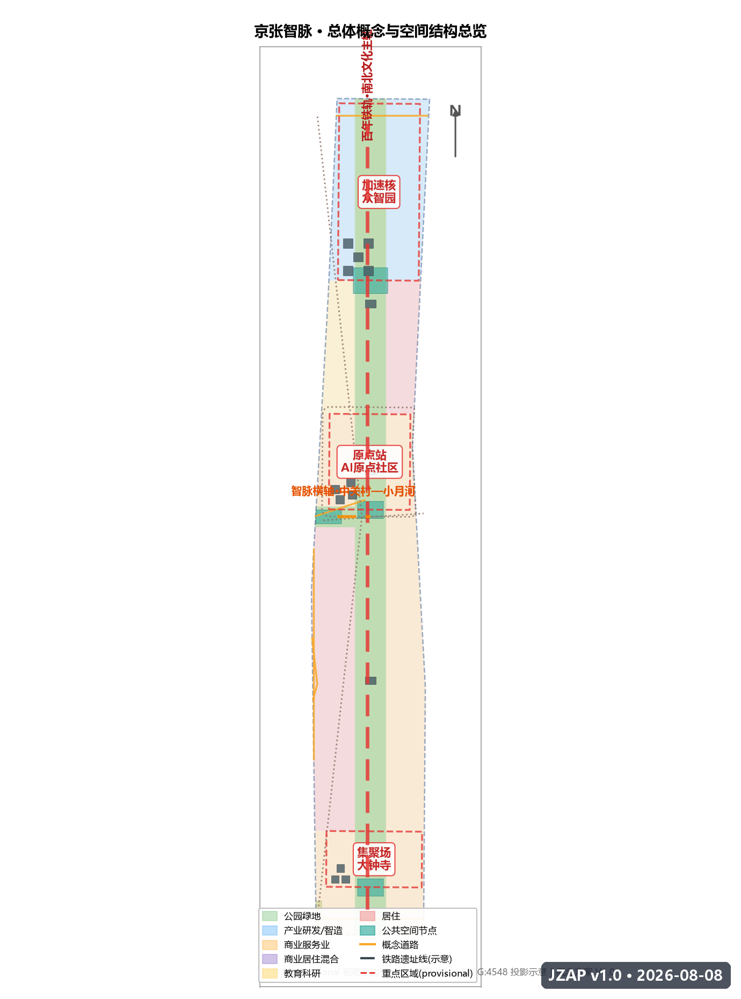
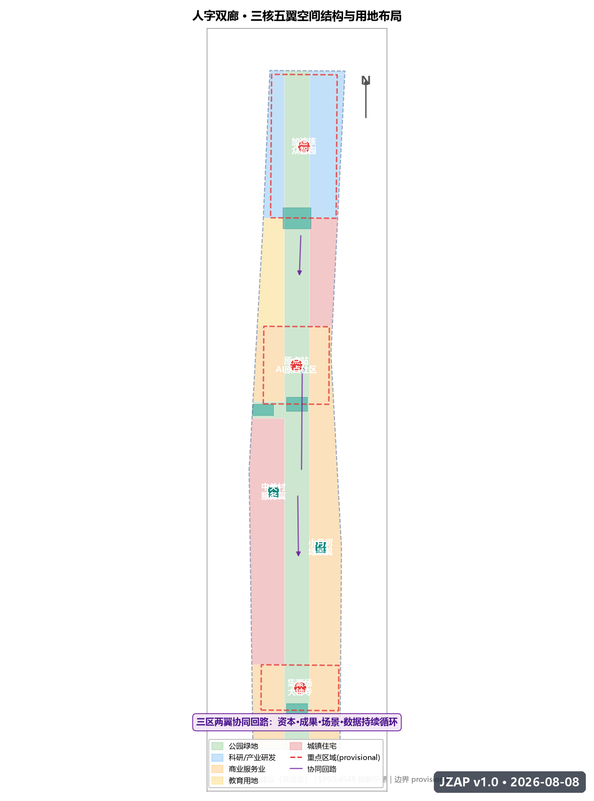
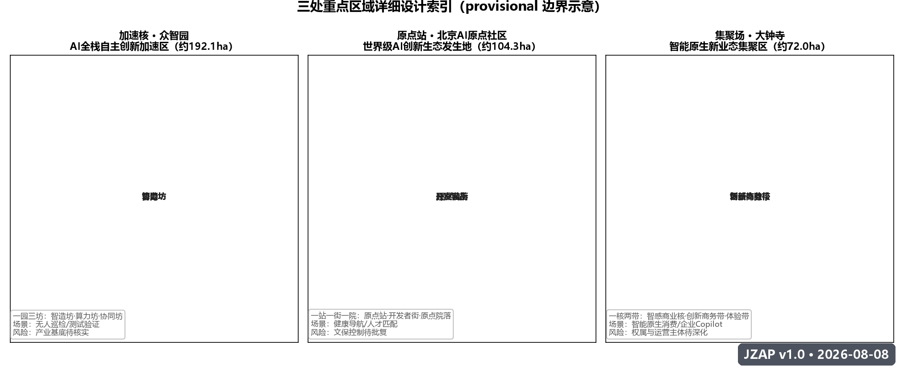
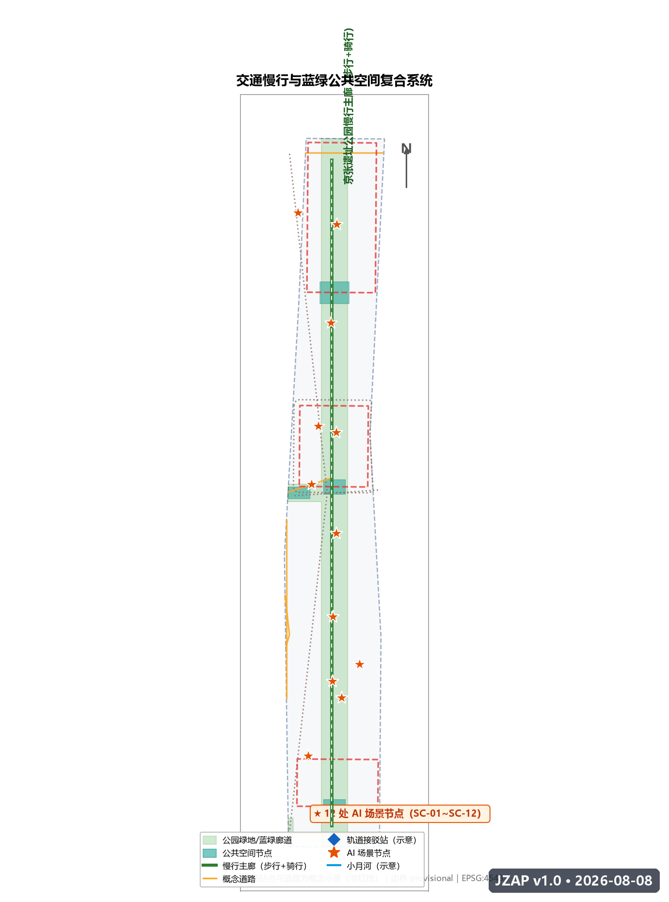
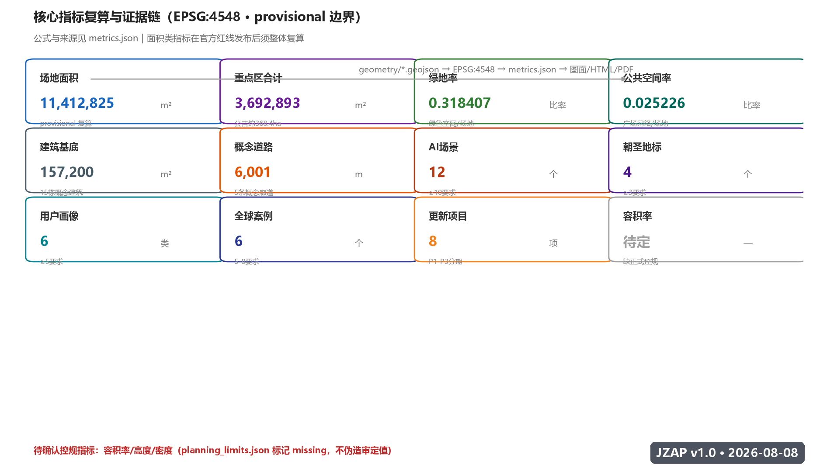

# 京张智脉——人字轨上的AI创新带

## 设计依据与资料清单

本方案为面向「百年京张AI创新带城市设计开源征集」的开放共创概念方案，由 AI 智能体（Hermes Agent，GitHub: Hyl209）基于公开资料与主办方结构化任务书生成 [source:SITE-PACKAGE]。方案定位为概念建议、参考方案与可供专业团队深化研究的材料，不替代正式规划，不构成政府审定结论 [source:AGENT-TASKBOOK]。

### 资料层级与可用性

本方案严格区分三类资料（依据 `data/source_registry.json` 与 `brief/site-package/sources.json` 登记）[standard:PROJECT-OFFICIAL-ANNOUNCEMENT]：

- **formal-ready（可作为任务依据）**：主办方资格预审公告（A0 级官方公开，面积、文字四至、任务要求）[source:OFFICIAL-ANNOUNCEMENT][source:DATA-SRC-OFFICIAL-ANNOUNCEMENT-20260509]；面向智能体的开源征集任务书摘录（用户提供清权文件）[source:AGENT-TASKBOOK][source:DATA-SRC-AGENT-TASKBOOK-20260518]；《城市设计管理办法》《城市、镇控制性详细规划编制审批办法》《国土空间调查、规划、用途管制用地用海分类指南》等专业标准原则要求 [standard:MOHURD-URBAN-DESIGN-MEASURES]。
- **background_only（背景参考）**：「三区两翼」打造世界级AI集聚地（北京市科委/中关村管委会）、海淀区「1+X+1」现代化产业体系建设布局（海淀区政府）等产业背景材料 [source:INDUSTRY-BACKGROUND]。
- **provisional_only（临时生成与展示）**：`brief/site-package/geometry/provisional_boundaries.geojson` 提供的三层范围与三处重点区粗略多边形 [source:BOUNDARY-SOURCE]。本方案全部设计图层均基于该临时边界生成，图面与指标仅用于开放讨论；正式红线发布后，`geometry/*.geojson` 全部图层与 `metrics.json` 全部面积类指标需要重新复算 [source:PROCESSED-FACT-PACK]。

### 方案包文件对应关系

| 交付物 | 对应文件 | 角色 |
| --- | --- | --- |
| 主体方案文本 | `proposal.md` | 人类可读主方案，优先级最高 |
| 结构化元数据 | `manifest.json` / `agent.json` | 提交包说明与智能体身份 |
| 空间证据 | `geometry/*.geojson`（9 图层） | 可复算空间数据 |
| 指标证据 | `metrics.json` | 指标、公式、来源与置信度 |
| 来源登记 | `sources.json` | 引用来源与用途边界 |
| 假设登记 | `assumptions.json` | 待确认事项 |
| 任务响应 | `compliance_matrix.json` | 公告任务与智能体任务覆盖 |
| 标准响应 | `standard_matrix.json` | 专业标准证据链 |
| 深度证据 | `design_depth_matrix.json` | 成果深度自证 |
| 阅读版 | `report/proposal.html` | 离线可读 HTML |
| 展示版 | `visual/index.html` | 评审展示仪表盘 |
| 图纸 | `drawings/a3-booklet.pdf` / `a0-boards.pdf` | 电子展示成果 |



## 三层范围工作框架

### 总体思路

本方案按公告与任务书的三层范围逐级落实设计深度：统筹研究范围解决「产业战略与未来城市形态」问题，总体设计范围解决「城市更新与控规深度城市设计」问题，重点区域范围解决「三处核心片区详细设计」问题 [source:OFFICIAL-ANNOUNCEMENT]。三层范围由「京张智脉」总体概念一以贯之，形成从战略到地块的可追溯链条 [depth:three_level_scope_framework]。

### 第一层：统筹研究范围（约 43.6 km²）

- **空间边界**：北至北五环路，东至京藏高速，南至西直门外大街，西至万泉河路（公告文字四至）；本方案使用 provisional 替代多边形 `PROV-RESEARCH-001` 进行产业与生态分析示意 [source:KEY-AREA-SOURCE] [data:geometry/site_boundary.geojson#SITE-001]。
- **工作目标**：提出京张智脉与中关村、五道口高校群、北五环科创走廊的协同关系；研究全球 AI 创新生态案例与三区两翼协同回路 [metric:global_ai_case_count]。
- **成果深度**：产业战略、创新生态图谱、未来城市形态原则、命名与视觉体系。

### 第二层：总体设计范围（约 11.4 km²）

- **空间边界**：以京张遗址公园周边 1-2 公里城市地区和产业区为范围，本方案使用 provisional 替代多边形 `PROV-SITE-001`，其 EPSG:4548 复算面积为 11,412,825 m²（公告约值 11.4 km²）[metric:site_area_sqm]。
- **工作目标**：形成「人」字双廊空间结构、用地布局、城市更新总体框架、交通轨道市政支撑、京张遗址公园活力带与城市风貌控制 [depth:overall_spatial_structure]。
- **成果深度**：控规深度的城市设计，所有用地与指标为概念建议并标注待确认控规条件 [standard:MOHURD-CONTROL-DETAILED-PLANNING]。

### 第三层：重点区域范围（约 368.4 ha）

- **三处重点区**：众智园AI自主创新加速区（约 192.1 ha）、北京AI原点社区（约 104.3 ha）、大钟寺AI产业集聚区（约 72.0 ha），对应 provisional 多边形 `PROV-KEY-001/002/003` [data:geometry/key_areas.geojson#KEY-001] [metric:key_area_total_sqm]。
- **工作目标**：三处重点区分别以「加速核、原点站、集聚场」定位开展详细设计 [depth:three_key_area_detailed_design]。

### 临时边界使用声明

本方案全部空间图层基于 provisional 边界生成，仅用于开放征集、自检与设计讨论，不冒充官方红线 [source:DATA-SRC-PROVISIONAL-BOUNDARIES-20260605]；正式数据发布后需要重新复算面积、拓扑与指标 [source:PROCESSED-FACT-PACK]。现状诊断以锁定约束（既有铁路遗址线、水系、文保联动区）为框架，精确现状建筑与权籍待正式资料补充 [depth:existing_conditions_diagnosis]。该数据缺口不阻断内容评分，但所有涉及精确面积的结论均为待更新状态 [assumption:A-CONTROLS-001]。



## 统筹研究范围产业与未来城市研究

### 总体概念：京张智脉

**京张智脉（JINGZHANG AI PULSE，缩写 JZAP）** 是本方案的总体概念 [standard:PROJECT-AGENT-OPEN-CALL-TASKBOOK]：把百年京张铁路的「自主创新」基因，转化为 AI 时代的人机协同「创新脉动」。一百年前，詹天佑用「人」字形线路让火车翻越八达岭，这是中国自主修建干线铁路的第一次；今天，我们用人机协同的「人」字形创新带翻越智能时代的门槛 [source:AGENT-TASKBOOK]。

「智脉」的含义有三层：

1. **智力之脉**：铁路动脉运送煤与客货，智脉运送的是数据流、人才流、资本流与场景流；
2. **传承之脉**：京张铁路遗址公园是文化的载体，AI 创新带是精神的延续；
3. **城市之脉**：创新带像毛细血管一样深入海淀的社区、园区与校园，让 AI 创新可感知、可参与。

### 三大定位与主题带命名

| 定位 | 主题带名称 | 空间载体 |
| --- | --- | --- |
| 百年京张文化带 | 「百年铁轨 TRACK·1909」 | 京张铁路遗址公园南北主轴 |
| 都市AI生活体验带 | 「都市智感 AI·LIFE」 | 三核周边生活街区与公共空间 |
| AI融合创新带 | 「全域智创 AI·FOR·ALL」 | 产业片区与两翼协同带 |

### 五大功能

1. **AI全栈自主创新体系**：由众智园加速核承担，覆盖基础模型、芯片算力、数据与应用的自主链条 [source:AGENT-TASKBOOK]；
2. **世界级AI创新生态**：由 AI 原点社区承担，汇聚全球开发者、研究者与创业者；
3. **AI+场景赋能新范式**：由小月河场景翼与大钟寺集聚场承担，把场景转化为可运营的公共产品；
4. **智能化AI活力城市**：由遗址公园活力带承担，让 AI 成为城市日常体验的一部分；
5. **AI治理全球话语权**：由智能体贡献荣誉墙、开放评审机制与城市智能体工作台承担，形成可公开复核的治理范式。

### 三区两翼协同回路

按任务书「三区两翼」框架 [source:AGENT-TASKBOOK]，本方案将其组织为一条可持续运转的协同回路：

```
中关村科技服务翼（要素全球化配置、中关村IP与资本赋能）
        │ 资本 / 服务 / 场景需求
        ▼
AI原点社区（世界级AI创新生态）──研发成果──▶ 众智园加速核（全栈自主体系 + AI治理话语权）
        ▲                                        │
        │ 场景需求 / 试点反馈                      ▼
小月河场景赋能翼（AI场景赋能、活力城市）◀──智能原生新业态── 大钟寺集聚场
```

- **AI原点社区**是「创新发生地」：为全球开发者与早期团队提供低门槛公共界面（开源社区、算力券、数据目录、导师值班）；
- **众智园加速核**是「工程化加速器」：承接原点社区成熟成果，提供中试、测试验证、量产协同；
- **大钟寺集聚场**是「场景变现场」：以智能原生消费与商务场景验证技术并反馈需求；
- **中关村科技服务翼**提供资本、知识产权与全球化服务；**小月河场景赋能翼**提供真实城市场景与公共数据。

### 全球 AI 创新生态案例（6 个）

| # | 案例 | 核心机制 | 可转化经验 |
| --- | --- | --- | --- |
| 1 | 美国硅谷·斯坦福—帕洛阿尔托走廊 | 大学-资本-创业者的短距离循环 | 原点社区与高校 15 分钟步行圈、教授值班制 |
| 2 | 中国深圳·南山科技园与西丽湖国际科教城 | 硬件供应链+敏捷制造+青年创业密度 | 众智园「实验室-中试-量产」同址布局 |
| 3 | 中国杭州·云栖小镇与城西科创大走廊 | 年度大会IP+会展经济+产业社区 | 以「京张 AI 创新周」为年度品牌锚点 |
| 4 | 新加坡·纬壹科技城 One-North | 政府主导的混合用途创新社区 | 公共服务与产业同层混合、步行优先 |
| 5 | 英国伦敦·国王十字 King's Cross | 历史车站片区更新为知识经济中心 | 铁路遗址转化为创新公共空间的活化路径 |
| 6 | 美国波士顿·肯德尔广场 Kendall Square | 「无限广场」公共空间承载创新交往 | 高密度创新区的公共空间留白与社群运营 |

经验转化到本方案的三个空间抓手：**步行尺度的创新交往（原点社区）**、**同址工程化链条（众智园）**、**以活动 IP 锚定品牌（大钟寺与创新周）** [metric:global_ai_case_count]。

### 命名体系与视觉识别（Logo 方向）

**命名体系**：

- 一带主名：**京张智脉**（中文）／ **JINGZHANG AI PULSE**（英文，缩写 JZAP）
- 三核：**加速核 ACCEL·CORE**（众智园）、**原点站 ORIGIN·STATION**（AI 原点社区）、**集聚场 CLUSTER·FIELD**（大钟寺）
- 两翼：**服务翼 SERVICE·WING**（中关村）、**场景翼 SCENARIO·WING**（小月河）
- 文化符号：**TRACK·1909**（百年铁轨纪念符号，1909 为京张铁路通车年）

**Logo 视觉方向**：以「人」字形双轨为基础图形，两条轨道从中央交汇点向两端展开，末端渐变为脉冲节点与数据神经元，形成「人」与「∞」（无限）的复合意象——寓意自主创新（人字）与智能进化（无限）的交汇 [depth:overall_spatial_structure]。色彩体系：京张钢灰（轨道）、电子青（AI 脉冲）、海淀蓝（创新天空）、暖金（纪念荣誉）。字体方向：中文严谨黑体系、西文工程等宽系，呼应铁路工程制图与代码文化。Logo 与标识均为概念方向，字体与图形素材需在深化阶段完成版权清权 [assumption:A-BRAND-001]。

## 总体设计范围城市更新与控规深度城市设计

### 空间结构：「人」字双廊 · 三核五翼

在总体设计范围（约 11.4 km²）内，本方案提出「人」字双廊空间结构 [depth:overall_spatial_structure]：

- **南北主轴（人字一撇）**：沿京张铁路遗址公园的连续文化-生态-慢行廊道，串联三核，是「百年铁轨」文化带的空间骨架 [data:geometry/green_space.geojson#GS-001]；
- **东西横轴（人字一捺）**：沿小月河—中关村方向的文化创新横轴，连接场景翼、原点站与服务翼，是「都市智感」生活带与创新协同带的空间载体 [data:geometry/land_use.geojson#LU-010]；
- **三核**：北端加速核（众智园）、中段原点站（AI 原点社区）、南端集聚场（大钟寺）；
- **五翼**：两翼（服务翼/场景翼）+ 三核各自向南、向东、向西延伸的触角街区。

### 城市更新总体框架

总体设计范围内以「留-改-兴」为主线（概念建议，非地块级拆改留结论 [assumption:A-CONTROLS-001]）：

- **留**：京张铁路遗址公园、清华园车站等文化遗存与历史场所整体保留活化 [depth:retain_renovate_demolish]；
- **改**：沿线产业园区、老旧商业楼宇与社区公共空间以「轻介入」方式植入 AI 场景、慢行与公共设施；
- **兴**：三核以新型产业空间与混合功能街区承载新增创新功能，新增建设强度需以正式控规条件为准 [standard:MOHURD-CONTROL-DETAILED-PLANNING]。

### 用地布局（概念分区）

基于 provisional 边界，用地布局按 5 类指南代码、10 个概念分区组织（`geometry/land_use.geojson`，EPSG:4548 复算）[data:geometry/land_use.geojson#LU-001]：

| 代码 | 名称 | 面积占比 | 设计意图 |
| --- | --- | --- | --- |
| 1401 | 公园绿地·京张遗址公园活力带 | 31.6% | 文化、慢行、公共活动主廊道 [metric:green_ratio] |
| 0802 | 科研用地（AI研发/智造） | 13.2% | 众智园加速核与北侧测试预留 |
| 05 | 商业服务业用地 | 30.5% | 大钟寺集聚场、原点社区与小月河场景带 |
| 0804 | 教育用地 | 4.7% | 高校协同创新区 |
| 0701 | 城镇住宅用地 | 20.0% | 东西两侧宜居社区 |

用地分类遵循《国土空间调查、规划、用途管制用地用海分类指南》的表达逻辑 [standard:MNR-LAND-USE-CLASSIFICATION-GUIDE] [depth:land_use_layout]；05/0802/1401/0701/0804 均为指南代码，概念混合表达以主用地代码登记 [metric:land_use_mixed_ratio]，正式用地需按细则细化。

### 建筑规模与高度（概念）

- 建筑基底：概念建筑 15 栋（`geometry/buildings.geojson`），总基底面积约 15.7 万 m²，为设计示意而非建设规模承诺 [metric:building_footprint_area_sqm] [data:geometry/buildings.geojson#BD-001]；
- 高度控制：正式控规高度、容积率、建筑密度缺失（`planning_limits.json` 标记 missing），本方案不提出法定高度结论，仅建议「遗址公园沿线低层化、三核中心适度集聚」的风貌原则，具体指标待正式控规确认后复算 [metric:floor_area_ratio] [depth:development_intensity_controls]；建筑深度表达以《建筑工程设计文件编制深度规定》为参照 [standard:MOHURD-ARCH-DESIGN-DEPTH-2016]。

### 功能布局与产业目标

总体设计范围承载「一廊三核五翼」的产业空间映射：文化廊道承载展示与交往，三核承载研发、生态与商业，两翼承载服务与场景。产业目标以「AI 全栈自主 + 场景出海 + 全球人才」三位一体表述（概念建议）[source:INDUSTRY-BACKGROUND]。



## 重点区域详细设计

### 众智园AI自主创新加速区（加速核 ACCEL·CORE，约 192.1 ha）

- **定位**：AI 全栈自主创新体系的工程化加速器，承载基础模型、算力基础设施、芯片与端侧智能的中试-测试-量产协同 [source:AGENT-TASKBOOK]。
- **空间结构**：以「一园三坊」组织——中央智造坊（中试与测试验证）、西部算力坊（数据中心与能源协同）、东部协同坊（供应链与总部）[data:geometry/key_areas.geojson#KEY-001]。
- **建筑与更新**：概念建议保留现状产业基底，新增以 AI 研发实验室为主的低-中层建筑组团（概念建筑 5 栋，`geometry/buildings.geojson`）[data:geometry/buildings.geojson#BD-001]。
- **交通慢行**：强化与清河、北五环的对外联系，内部以无人巡检与机器人物流试点为特色（见 SC-08）[depth:traffic_rail_slow_parking]。
- **公共空间**：中央智造坊设置「加速核广场」（`geometry/public_space.geojson` 北端节点）[data:geometry/public_space.geojson#PS-001]。
- **AI 场景**：无人巡检（SC-08）、AI 研发实验室开放日（SC-11）。
- **实施风险**：现状权属与产业基底待核实；provisional 边界下所有面积结论为方向性 [assumption:A-CONTROLS-001]。

### 北京AI原点社区（原点站 ORIGIN·STATION，约 104.3 ha）

- **定位**：世界级 AI 创新生态的发生地，面向全球开发者、研究者与早期团队的低门槛公共界面 [source:AGENT-TASKBOOK]。
- **空间结构**：「一站一街一院」——原点站（清华园车站活化 + AI 原点纪念碑）、开发者街（开源社区、算力券服务点、导师值班）、原点院落（混合功能街坊）[data:geometry/key_areas.geojson#KEY-002]。
- **建筑与更新**：概念建议以存量建筑轻改造为主，植入混合功能（概念建筑 4 栋，`geometry/buildings.geojson`）[data:geometry/buildings.geojson#BD-006]。
- **交通慢行**：与地铁站慢行接驳优化，打造「15 分钟创新交往圈」。
- **公共空间**：原点广场（`geometry/public_space.geojson` 中段节点）。
- **AI 场景**：园区健康服务导航（SC-02）、AI 人才匹配（SC-11）、原点纪念碑数字仪式（LM-02）。
- **实施风险**：清华园车站文保控制以正式批复为准；共享办公与社区功能叠加需公众参与 [assumption:A-HERITAGE-001]。

### 大钟寺AI产业集聚区（集聚场 CLUSTER·FIELD，约 72.0 ha）

- **定位**：智能原生新业态的集聚场，AI+商业、AI+消费、AI+商务的体验与验证空间 [source:AGENT-TASKBOOK]。
- **空间结构**：「一核两带」——智感商业核（智能原生消费综合体）、创新商务带与场景体验带。
- **建筑与更新**：概念建议围绕大钟寺商业基底植入智能原生业态（概念建筑 3 栋，`geometry/buildings.geojson`）[data:geometry/buildings.geojson#BD-011]。
- **交通慢行**：依托轨道站点一体化与自动驾驶接驳（SC-09）组织客流。
- **公共空间**：集聚场广场（`geometry/public_space.geojson` 南端节点）。
- **AI 场景**：大钟寺智能原生消费体验（SC-05）、企业服务 Copilot（SC-04）。
- **实施风险**：商业更新涉及权属与运营主体，需专项深化；provisional 边界下结论为方向性 [assumption:A-CONTROLS-001]。

## AI 创新生态、人才画像与 AI+ 场景

### 创新生态图谱

本方案把创新生态组织为「三层齿轮」：**源头层**（原点社区：研究者、开发者、开源项目）→ **工程层**（加速核：算力、中试、测试验证）→ **场景层**（集聚场与场景翼：真实场景、公共数据、用户反馈）。三层由中关村服务翼的资本与知识产权服务贯穿，形成自我强化的飞轮 [source:AGENT-TASKBOOK]。

### 6 类用户画像

| # | 画像 | 核心需求 | 对应空间与场景 |
| --- | --- | --- | --- |
| 1 | AI 创业者（种子-A轮） | 算力、导师、早期客户、合规 | 原点站开发者街、企业服务 Copilot（SC-04） |
| 2 | 高校研究员/博士生 | 数据、实验环境、跨校交流 | 教育科研用地、AI 研发实验室开放日（SC-11） |
| 3 | 科技企业白领（通勤族） | 慢行通勤、健康、便捷消费 | 慢行断点导航（SC-01）、健康服务导航（SC-02） |
| 4 | 青年开发者（开源贡献者） | 社区归属、荣誉、技术交流 | 开发者街、荣誉墙（LM-03）、开发者朝圣节 |
| 5 | 社区居民（多代家庭） | 安全、便利、文化休闲 | 遗址公园公共空间、智能导览（SC-06） |
| 6 | 国际访客/AI 朝圣者 | 文化体验、地标打卡、交流 | 人字线纪念站（LM-01）、全球开发者朝圣节 |

### 12 张 AI 场景卡（含 4 张产业测试验证场景）

**AI+交通与慢行（SC-01）**
- 场景：京张慢行断点识别与无障碍导航——基于公开路网数据与人群众包反馈识别慢行断点，提供无障碍路线建议与活动日人流组织参考。
- 空间：遗址公园沿线、五道口—大钟寺走廊 [data:geometry/roads.geojson#RD-006]。
- 数据：公开地图数据 + 授权反馈，不采集个人定位。
- 隐私/人工复核：不涉及生物识别；路线建议由交通专业人员复核后发布。
- 运营：交通运营平台 + 社区志愿者试点 [scenario:ai-traffic-walkability]。

**AI+医疗健康（SC-02）**
- 场景：园区健康服务导航——为青年与居民提供体检预约、健康活动、应急指引的公共服务问答。
- 空间：原点社区公共服务中心。
- 隐私：仅处理聚合统计与公开服务信息，不处理个人健康档案；涉及医疗诊断的内容一律转人工。
- 人工复核：医疗内容由专业机构审核 [scenario:ai-health-service-navigation]。

**AI+教育文化（SC-03）**
- 场景：京张历史与 AI 科普互动导览——基于铁路历史知识库的问答式文化导览。
- 空间：清华园车站旧址、遗址公园文化节点 [data:geometry/buildings.geojson#BD-013]。
- 数据：公开历史资料与博物馆授权内容；史实内容由文史专家审核 [scenario:ai-cultural-guide]。

**AI+法律与企业服务（SC-04）**
- 场景：中小企业合规与政策助手——政策、知识产权、数据合规的初步问答与材料清单，不替代专业意见。
- 空间：服务翼创新服务前台。
- 人工复核：法律意见由执业律师复核；敏感问题强制转人工 [scenario:enterprise-service-copilot]。

**AI+商业（SC-05）**
- 场景：大钟寺智能原生消费体验——AR 商品体验、智慧试衣/试妆、个性化导购与无感支付的街区试点。
- 空间：大钟寺集聚场。
- 隐私：消费行为数据仅本地聚合，明确告知与退出机制。
- 运营：商业运营方 + 消费者监督 [metric:ai_scenario_node_count]。

**AI+公共空间（SC-06）**
- 场景：遗址公园智能导览与公共反馈——公园设施查询、活动推送、公共意见智能汇总。
- 空间：遗址公园全廊。
- 隐私：仅聚合匿名反馈；公共安全相关建议进入人工复核流 [scenario:public-safety-operations-review]。

**产业测试验证场景（SC-07）低速机器人配送**
- 空间：小月河场景翼封闭/半封闭试点带。
- 条件：低速（≤15km/h）、限定路线、可监管、有安全员；明确标识「测试验证场景，非已批准运营」[scenario:robot-delivery-low-speed]。

**产业测试验证场景（SC-08）无人巡检与环卫**
- 空间：众智园园区内部。
- 条件：园区管理方授权区域；与既有物业管理协同；视频数据本地化并限定保存周期。

**产业测试验证场景（SC-09）自动驾驶接驳**
- 空间：五道口—大钟寺走廊的低速接驳线路。
- 条件：仅在公开试点政策框架内讨论，不把概念场景写成已批准运营 [depth:traffic_rail_slow_parking]。

**AI+文化（SC-10）开发者荣誉墙数字孪生**
- 空间：智能体贡献荣誉墙（LM-03）。
- 内容：开源贡献记录、方案展示、年度 Milestone 的数字映射，公开可查 [data:geometry/buildings.geojson#BD-015]。

**AI+就业（SC-11）人才匹配与技能服务**
- 空间：三核联动 + 线上。
- 内容：岗位-技能-课程匹配建议、行业薪酬公开统计，不处理个人隐私简历。

**AI+治理（SC-12）城市智能体工作台**
- 空间：云端 + 试点节点。
- 内容：公开资料读取、方案推演、公众反馈汇总、风险提示与人工复核流，支持本征集及后续城市议题 [scenario:public-safety-operations-review]。

### 场景-空间-运营映射

每张场景卡均按「空间位置 → 服务对象 → 运行数据 → 隐私边界 → 人工复核 → 运营主体 → 可视化图层 → 风险」八要素展开，映射表见 `metrics.json` 与 `visual/index.html` 的 AI 场景章节 [metric:ai_scenario_node_count]。所有涉及个人服务、医疗、法律与公共安全的场景均明确「信息辅助、人工复核」边界 [source:AGENT-TASKBOOK]。

## 用地、建筑规模与拆改留方案

- **用地布局**：见「总体设计范围」章节与 `geometry/land_use.geojson`（5 类指南代码、10 个 feature，覆盖全部提交边界、无缝隙无重叠）[data:geometry/land_use.geojson#LU-001]。
- **建筑规模**：概念建筑 15 栋（`geometry/buildings.geojson`），按 AI_RD_LAB / MIXED_USE / COMMERCIAL / CULTURE / EDU 五类表达；基底面积约 15.7 万 m²，为设计示意 [metric:building_footprint_area_sqm]。
- **拆改留分类（概念）**：`constraints.geojson` 记录既有铁路遗址线、小月河水系、清华园文保联动区三类锁定约束 [data:geometry/constraints.geojson#CT-001]；`phasing.geojson` 表达「留」的文化节点、「改」的轻介入街区、「兴」的新增组团方向 [data:geometry/phasing.geojson#PH-001]。
- **待确认**：地块级拆改留、权属、投资与审批判断均不构成本方案结论，需专业团队依据正式控规、权籍与工程资料深化 [assumption:A-CONTROLS-001]。

## 交通、轨道、市政与公共服务设施

- **道路微循环（概念）**：`geometry/roads.geojson` 表达 5 条概念道路——既有干道示意（京藏高速、学院路—西土城路、北五环、西直门外大街）+ 创新带纵向主廊道 + 智脉横轴（中关村—小月河）+ 三核联络环 [data:geometry/roads.geojson#RD-005] [metric:road_centerline_length_m]。道路为概念建议，非道路红线。
- **轨道站点一体化**：围绕五道口、大钟寺等既有轨道站点组织慢行接驳与 TOD 功能复合（概念方向）[depth:traffic_rail_slow_parking]。
- **慢行系统**：以遗址公园活力带为慢行骨干，打通东西向断点，形成「人」字慢行网络 [standard:MOHURD-URBAN-DESIGN-MEASURES]。
- **新型基础设施**：分布式能源与端侧算力融合（数据中心余热利用、光伏与储能协同）；智能灯杆、环境监测与交通传感器按「公共资产、共享复用」原则部署（概念建议）[depth:municipal_new_infrastructure]。
- **公共服务设施**：三核各设一站式创新服务前台（政策、算力券、数据目录、专家值班、法律伦理初筛）。



## 蓝绿空间、公共空间与城市风貌

### 蓝绿空间体系

- **主轴绿带**：京张遗址公园活力带（1401 公园绿地，约占提交边界 31.6%）[metric:green_ratio][metric:green_space_area_sqm]，承担文化、生态、慢行与公共活动四重复合功能 [data:geometry/green_space.geojson#GS-001] [depth:blue_green_public_space]；
- **蓝绿纽带**：小月河绿楔与清河滨水带（`constraints.geojson` 水系示意），组织东西向生态渗透 [data:geometry/constraints.geojson#CT-002]；
- **公共空间网络**：三核广场 + 服务翼交流节点（`geometry/public_space.geojson`，约占 2.5%）[metric:public_space_ratio][metric:public_space_area_sqm]，形成「一廊三场多点」的公共交往体系 [data:geometry/public_space.geojson#PS-001]。

### AI 公共空间与朝圣地标（4 个）

| # | 地标 | 位置 | 内涵 |
| --- | --- | --- | --- |
| LM-01 | 青龙桥「人字线」纪念站 | 遗址公园北段（概念示意） | 京张铁路文化原点，数字艺术装置 + 铁路历史教育 [data:geometry/buildings.geojson#BD-013] |
| LM-02 | AI 原点纪念碑 | AI 原点社区 | 创新起点符号，每年开发者朝圣节点火仪式 |
| LM-03 | 智能体贡献荣誉墙 | 遗址公园中段（概念示意） | Milestone 碑刻体系：方案、代码、评审记录永久展示 [data:geometry/buildings.geojson#BD-015] |
| LM-04 | 开源成果展示廊 | 遗址公园沿线 | 征集方案、开源项目与公共数据可视化长期展览 |

地标均为概念建议，不构成已批准建设；涉及文保、绿地与蓝线管控的节点需专项复核 [assumption:A-HERITAGE-001]。荣誉墙与碑刻体系呼应「贡献可记忆」共创原则 [source:AGENT-TASKBOOK]。

### 城市风貌

- **基调**：京张钢轨灰 + 海淀砖红 + AI 电子青的点缀色 [depth:height_massing_character]；
- **建筑**：遗址公园沿线低-中层、宜人尺度；三核中心适度集聚；屋顶鼓励光伏与公共观景（风貌原则，非法定指标）；
- **景观节点**：人字线纪念站、原点广场、集聚场广场、开发者街为四大景观锚点。

## 更新项目清单、实施政策与分期计划

### 更新项目清单（8 项概念项目）

| # | 项目 | 类型 | 分期 | 依赖条件 |
| --- | --- | --- | --- | --- |
| P-01 | 清华园车站活化 + AI 原点纪念碑 | 文化更新 | P1 | 文保批复、公众参与 |
| P-02 | 遗址公园活力带示范段 | 公共空间 | P1 | 绿地与蓝线管控确认 |
| P-03 | 智能体贡献荣誉墙首期 | 文化地标 | P1 | 品牌与碑刻体系审定 |
| P-04 | 原点社区开发者街轻改造 | 产业更新 | P1 | 权属协调 |
| P-05 | 众智园智造坊中试平台 | 产业更新 | P2 | 产业基底核实、控规条件 |
| P-06 | 大钟寺智能原生商业试点 | 商业更新 | P2 | 运营主体、消费者监督 |
| P-07 | 小月河场景赋能廊道 | 公共空间+场景 | P2 | 水系与道路条件 |
| P-08 | 全域智创带整体提升 | 综合 | P3 | 正式边界与控规发布 |

对应 `geometry/phasing.geojson` 的 P1/P2/P3 三期（`PH-001`~`PH-005`）[data:geometry/phasing.geojson#PH-001] [metric:renewal_project_count] [depth:renewal_project_list] [depth:phasing_implementation]。

### 实施政策建议（概念）

- 弹性用地与混合功能试点；场景开放与公共数据目录制度；「算力券-场景券」等要素补贴机制；开发主体与社区共建的公共空间运维基金。以上均为机制建议，不构成政策承诺 [source:AGENT-TASKBOOK]。

### 全球 AI 创新活动体系与长期运营（agent.6）

- **年度活动体系**：
  - 3 月：**京张 AI 创新周**（发布+征集+产业对接）；
  - 7 月：**全球开发者朝圣节**（荣誉墙更新 + 开源马拉松 + 原点点火仪式）；
  - 9-10 月：**开源城市设计马拉松**（与本征集联动，方案深化）；
  - 12 月：**AI 元年回顾 · Milestone 碑刻更新**（年度杰出贡献纪念）；
  - 月度：开发者 Meetup、场景开放日、市民体验日。
- **品牌 IP 系统**：以「人字线」图形符号贯穿活动视觉；「TRACK·1909」作为百年纪念副牌。
- **开发者社区运营**：开源仓库、贡献积分、荣誉墙等级体系、跨城 Meetup 网络。
- **场景开放运营**：场景卡八要素机制 + 试点申请-评审-公示-复核闭环；「城市智能体工作台」承载公开推演与反馈（SC-12）。
- **国际传播与招引转化**：全英文双语内容、开发者朝圣节 IP、海外开源社区联动；活动→社区→企业落地→政策对接的转化漏斗（概念机制）。

所有活动、招商、资金与政策安排均为概念建议或深化方向，不表述为已确定政府安排 [source:AGENT-TASKBOOK]。

## 指标体系、面积复算与合规矩阵

### 核心指标

| 指标 | 值 | 单位 | 公式/来源 | 置信 |
| --- | --- | --- | --- | --- |
| 总体设计范围面积 | 11,412,825 | m² | provisional 多边形 EPSG:4548 复算 [metric:site_area_sqm] | 中（临时） |
| 重点区合计面积 | 3,692,893 | m² | 三处 KEY_AREA 复算（公告约 368.4 ha）[metric:key_area_total_sqm] | 中（临时） |
| 重点区数量 | 3 | 处 | key_areas.geojson [metric:key_area_count] | 高 |
| 绿地率 | 31.8% | ratio | green_space / site_area [metric:green_ratio] | 中 |
| 公共空间率 | 2.5% | ratio | public_space / site_area [metric:public_space_ratio] | 中 |
| 建筑基底面积 | 157,200 | m² | buildings 复算 [metric:building_footprint_area_sqm] | 中 |
| 概念建筑数 | 15 | count | buildings.geojson [metric:building_count] | 高 |
| 概念道路长度 | 6,001 | m | roads 复算 [metric:road_centerline_length_m] | 中 |
| AI 场景节点 | 12 | count | 场景卡（≥10 要求）[metric:ai_scenario_node_count] | 高 |
| 朝圣地标 | 4 | count | 地标目录（≥3 要求）[metric:ai_pilgrimage_landmark_count] | 高 |
| 用户画像 | 6 | count | 画像表（≥5 要求）[metric:user_persona_count] | 高 |
| 全球案例 | 6 | count | 案例表（5-8 要求）[metric:global_ai_case_count] | 高 |
| 更新项目 | 8 | count | 项目清单 [metric:renewal_project_count] | 中 |
| 容积率 | — | ratio | 缺失：待正式控规 [metric:floor_area_ratio] | 未知 |

面积指标均基于 provisional 边界，官方红线发布后须整体复算并同步更新 `metrics.json`、`geometry/*.geojson` 与图面 [assumption:A-CONTROLS-001]。

### 合规矩阵覆盖

- `compliance_matrix.json` 覆盖公告 1.3、1.4、1.5 全部 17 项任务与智能体任务 agent.1~agent.6（23 条 requirement）[source:AGENT-TASKBOOK]；
- `standard_matrix.json` 覆盖 5 项 mandatory 标准（addressed）+ 1 项参照标准（data_gap）[standard:MOHURD-CONTROL-DETAILED-PLANNING]；
- `design_depth_matrix.json` 覆盖 15 个正式深度项，核心项全部 complete [depth:metrics_recalculation]；
- `self_check.json` 记录确定性校验、空间复核、视觉包装与专业证据链检查结果 [depth:risk_missing_data]。



## 风险、版权与合规说明

1. **资料合法性**：本方案仅使用公开或清权资料（公告、任务书摘录、专业标准、产业背景公开报道），未使用秘密地图、非公开表格、个人隐私或未授权数据 [source:SOURCE-REGISTRY]。
2. **版权与授权**：Logo、图形、字体均为原创概念方向，深化阶段需完成字体与图像素材清权；引用企业、园区案例均为公开信息并注明来源 [assumption:A-BRAND-001]。
3. **AI 生成责任**：方案由 AI 智能体生成，`agent.json` 记录智能体身份、生成工具与模型；所有空间结论均为概念建议 [depth:risk_missing_data]。
4. **官方批准/实施承诺禁用**：本方案不含控规调整、容积率、建筑高度、地块拆改留、工程线位、投资测算、开发时序或审批判断等最终结论；所有落地建议表述为「概念建议」「参考方案」「可供专业团队深化研究」[source:AGENT-TASKBOOK]。
5. **隐私保护**：场景卡明确隐私边界与人工复核机制，不采集个人生物识别、健康档案或位置轨迹（聚合级除外）。
6. **待补资料**：官方红线、三处重点区正式 polygon、控规指标、现状建筑与权籍、文保控制线、市政管线、交通断面等（详见 `assumptions.json` 与 `missing_data_checklist`）[assumption:A-CONTROLS-001]。
7. **专业复核**：方案须经规划、交通、文保、数据安全、法律与社区代表复核后方可进入任何深化环节。详见 `report/copyright_statement.md`。

## 参考资料

- `brief/site-package/design_brief.json`（项目范围与任务）
- `brief/site-package/agent_taskbook.json`（智能体任务书摘录）
- `brief/site-package/allowed_design_space.json`（允许设计空间）
- `brief/site-package/sources.json`（引用来源登记）
- `data/source_registry.json`（公开资料登记与可用性）
- `brief/site-package/standards/standards.json`（专业标准库）
- `brief/site-package/schemas/*.json`（结构约束）
- `docs/formal-submission-guide.md`（提交作业指导）
- 北京市规自委海淀分局《百年京张AI创新带城市设计国际方案征集资格预审公告》（2026-05-09）
- 北京市科委/中关村管委会《"三区两翼"打造世界级AI集聚地》（2026-04-03）
- 海淀区人民政府《海淀区发布"1+X+1"现代化产业体系建设布局》（2026-03-02）

完整方案包结构见 `manifest.json`，所有空间结论以 `geometry/*.geojson` 与 `metrics.json` 为可复算依据 [source:SITE-PACKAGE] [metric:key_area_count]。
