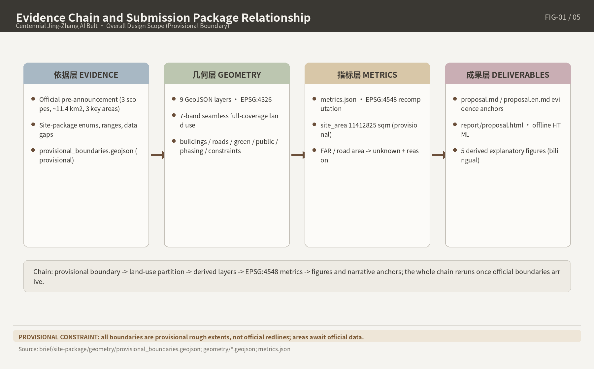
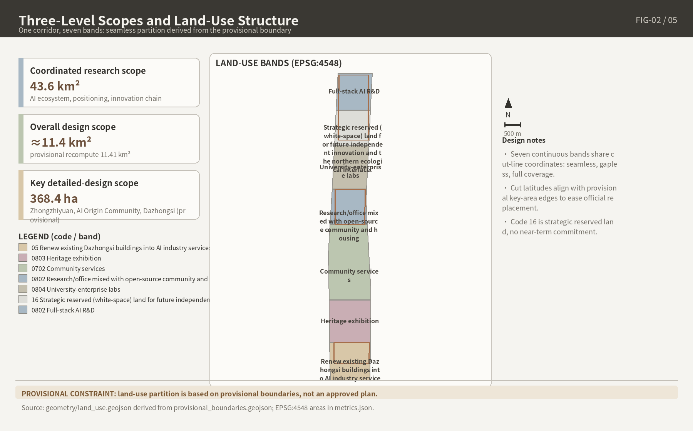
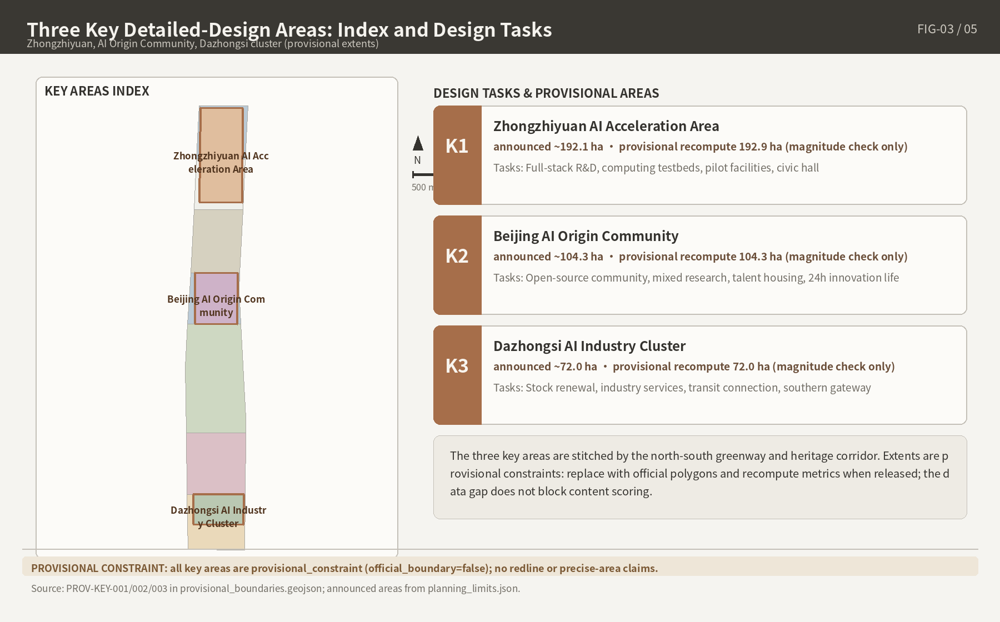

# Centennial Jing-Zhang - Symbiotic Intelligent Rail: AI Innovation Belt Open Urban Design Proposal

## 1. Design Basis and Source List

Core position: official planning boundaries and parcel-level Regulatory Detailed Planning indicators not yet public; uncertainty is an auditable asset, not a definitive conclusion.

### 1.1 Submission Statement and Scheme Attributes

#### 1.1.1 AI Agent Generation Statement and Method Disclosure

Generated entirely by an AI Agent; identity and generation statement registered in `agent.json` (placeholder author replaced with real login pre-submission)[source:SITE-PACKAGE]. Follows co-creation principles charter.1/3/5/6/7: public interest first, final human judgment by professional teams[source:SRC-2026-0518-AGENT-OPEN-CALL-TASKBOOK].

#### 1.1.2 Open Co-Creation Attributes and the Front Matter Contract

Front matter sets `proposal_format_version: "2"`, `bilingual_contract_version: "1"`: Chinese master + independent translation `proposal.en.md`; 13 chapters use fixed English titles; one-to-one correspondence in sections, claims, metrics, figures; machine verification in structured files — body need not open JSON[source:SITE-PACKAGE].

#### 1.1.3 Verbatim Statement of the Unified Boundary Clause

Spatial implementation recommendations: "conceptual proposal" / "reference scheme" / "available for professional teams to develop further"; verbatim: "All deliverables are open co-creation proposals; they do not replace formal planning and do not constitute a government approved conclusion." Regulatory Detailed Planning adjustments, Floor Area Ratio, Building Height, Demolish–Renovate–Retain Strategy, investment estimates, phasing, approval judgments — never final conclusions or government commitments[source:SRC-2026-0518-AGENT-OPEN-CALL-TASKBOOK].

### 1.2 Source List and Grading

#### 1.2.1 Four Categories of the site package → T1-1

Four site-package categories: design brief (positioning, tasks, scope registry); agent taskbook (co-creation principles, six tasks, boundary clauses); standards (mandatory snapshots); provisional boundaries (rough boundaries)[source:SITE-PACKAGE]. Official areas on the announcement's basis, no reconciliation: Coordinated Research Area approx. 43.6 km²; Overall Design Area approx. 11.4 km²; key areas approx. 368.4 ha (Zhongzhiyuan 192.1 + Beijing AI Origin Community 104.3 + Dazhongsi 72.0 ha); only textual boundaries and approximate areas, no map[source:OFFICIAL-ANNOUNCEMENT].

#### 1.2.2 Five Repository-Processed Files (agent_fact_pack, project_scope_summary, agent_task_requirements, source_use_matrix, missing_data_checklist) = Navigation Layer

Navigation layer (task lists, scope structure, usage and gap registry), not a source substitute; the body cites only source_id entries directly supporting a judgment[source:SITE-PACKAGE].

#### 1.2.3 Three-Level Source Distinction (usable_for_formal / background_only / provisional_only)

Participant sources labeled item by item: usable_for_formal = formal factual statements; background_only = narrative only, no spatial control conclusions; provisional_only = provisional generation/visualization only. Sources outside the central registry: not claimed centrally approved, not automatically prohibited.

**T1-1 Source Grading List (Summary)**

| Material | Publisher / Type | Grading | Permitted Scope of Use |
| --- | --- | --- | --- |
| Pre-qualification announcement (2026-04-30) | Haidian Branch, Beijing Municipal Commission of Planning and Natural Resources, A0 | usable_for_formal | Project name, textual boundaries, official areas, task/depth requirements |
| site package: design brief / agent taskbook | Repository | usable_for_formal | Scope registry, co-creation principles, tasks, boundary clauses |
| site package: standards local snapshots | Repository | usable_for_formal | Local basis for mandatory standards (SHA-256) |
| site package: provisional boundaries | Repository | provisional_only | Provisional generation, visualization, self-check |
| Five repository-processed files | Repository | background_only | Navigation layer; no spatial control conclusions |
| Self-collected official/rights-cleared sources (announcement page, Urban Renewal Regulations) | Officially public | usable_for_formal | Factual statements; item-by-item in sources.json |
| Self-collected media/background sources (official publicity, authoritative media) | Official/authoritative media | background_only | Background narrative; not in key argumentation |

Formal conclusions anchor only to official announcements and registered snapshots; publicity figures (e.g., 37 km²) stay background; provisional geometry isolated.

### 1.3 Data Gap Statement

#### 1.3.1 Official Precise Boundaries Not Obtained: provisional_boundaries.geojson, "Four Must-Nots"

Official precise polygons (three-level scopes, three key areas) not obtained as of finalization. The overall design boundary is a provisional rough fit to the announcement's textual descriptions and approximate area (`provisional_constraint`, `official_boundary=false`) — AI generation, visualization, self-check only. "Four Must-Nots": not an official planning boundary; not a basis for approval, precise area, or formal professional scoring; the gap means only that the submission may proceed to intake and structural review, without prejudging professional scoring or the acceptance decision[data:geometry/site_boundary.geojson#SITE-001]. EPSG:4548 recomputation approx. 11,412,825 sqm is an order-of-magnitude check on the announced approx. 11.4 km² — a fit, not verification; wholesale replacement + recomputation once official boundaries are released[metric:site_area_sqm].

#### 1.3.2 Pre-qualification Document Package Acquisition and Window Closure

Acquisition: "registration form → kjysanbu@163.com → download password sent back"; the 2026-04-30 to 05-12 17:00 window closed. Package not obtained or read; reliance entirely on public/rights-cleared materials; no speculation on contents[source:OFFICIAL-ANNOUNCEMENT].

#### 1.3.3 Guide to the 15-Item unknown List → T1-3

15 unknown items registered "unknown + reason", inference prohibited; full list Chapter 11 T11-3, risk linkage Chapter 12.

**T1-3 Data Gap Summary Table**

| Gap Category | Representative Item | Handling |
| --- | --- | --- |
| Official boundaries | Official precise polygons, three-level scopes + three key areas | provisional; wholesale replacement + recomputation once obtained |
| Statutory indicators | Parcel-level Floor Area Ratio, Building Height, Building Coverage Ratio, green space ratio, setbacks | unknown + reason; industry ranges labeled "not this project's indicators" |
| Document package | Pre-qualification document package contents | Declared not obtained, not read |
| Rail transit timeline | Lines 13A/13B through-operation timetable; Qinghua East Road West Entrance station opening | Long-term variable / to be determined, subject to official announcements |
| Listing status | Corridor stations in 2025 rail transit micro-center list | unknown; intensity argumentation conditional |
| Heritage protection layer | Qinghuayuan Station protection scope / construction control zone GIS boundaries | Conservative design; "to be studied further per cultural relics protection procedures" |
| Baseline data | Traffic baselines, municipal pipelines, operating revenue/expenditure | unknown + reason |
| Institutional matters | Applicant identities, pre-qualification results, two-track integration | unknown; no speculation |

Gap classes "boundary — indicators — timeline — baseline — institutional" → provisional mechanism; conditional intensity argumentation; status-switch phasing interfaces; exclusion from influence argumentation; "registration — recomputation — response" loop with Chapters 11–12.

### 1.4 Coordinate and Unit Policy

#### 1.4.1 EPSG:4326 for Exchange / EPSG:4548 for Area Recomputation / m and sqm Units

GeoJSON is exchanged in EPSG:4326; area recomputation uses EPSG:4548; lengths in m, areas in sqm[source:SITE-PACKAGE].

#### 1.4.2 EPSG:4548 Must Be Confirmed Against Official Survey Data Before Final Use (design_brief verbatim)

Design brief verbatim: EPSG:4548 suits metric computation in Beijing but requires confirmation against official survey data before final use; all recomputed areas provisional[source:SITE-PACKAGE].

### 1.5 Generation Method and Toolchain Disclosure

#### 1.5.1 Six Pipeline Scripts → T1-2

Six pipeline scripts generate and check the package (T1-2). Five derived PNGs from GeoJSON and metrics form a "layer → metric → drawing" evidence chain — human-readable interpretation only, in Chapters 2, 4, 5, 7, 8/9, 11.

**T1-2 Generation Toolchain Table**

| Pipeline Script | Ownership | Responsibility | Version and License |
| --- | --- | --- | --- |
| generate_submission_assets.py | Submission package | Reads provisional boundaries; builds design GeoJSON, metrics, PNGs | With package iterations; front matter license |
| build_submission_content.py | Submission package | Builds Chinese/English proposal, sources, assumptions from research outputs | Same as above |
| build_visual.py | Submission package | Builds offline HTML and A3/A0 source pages | Same as above |
| render_proposal_html.py | Repository script | Renders report/proposal.html from proposal.md | Main branch; repository license |
| finalize_submission.py | Repository script | Manifest finalization + hash registration | Same as above |
| self_check_submission.py | Repository script | Pre-submission checks (shapely, pyproj, jsonschema) | Same as above |

Generation/verification separated: self-built scripts derive from registered inputs; repository scripts verify independently, no shared state; deliverables reproducible from same inputs.

#### 1.5.2 5+1 Mandatory Standards Registry and SHA-256; 6th Document missing_source_url → Pending unknown

`standards.json` registers 5 mandatory formal standards (announcement, taskbook excerpts, Urban Design Management Measures, etc.) with local snapshots + SHA-256 checksums; status fetched / fetched_via_official_pdf_text = formal local basis[source:SITE-PACKAGE]. The 6th, Provisions on the Depth of Preparation of Construction Engineering Design Documents (2016 Edition), status missing_source_url — pending unknown, not compliance evidence[standard:MOHURD-ARCH-DESIGN-DEPTH-2016].

### 1.6 Dual-Track Call Background

#### 1.6.1 Institutional Track / Agent Open-Source Track Coexistence

Institutional track: Grade-A+ qualification in urban-rural planning preparation or construction industry; pre-qualification selects 5 applicants, ~100 days of design, 3 winning schemes; compensation 1.5 million yuan (non-winning) / 1.8 million yuan (winning); IP shared by organizers/undertakers and applicants[source:OFFICIAL-ANNOUNCEMENT]. Agent track: 2026-08-07 to 08-31, GitHub PR submission; rewards: stele engraving, honors, policy matchmaking[source:SITE-PACKAGE]. Agent-track deliverable; no institutional-track qualification or rights claimed.

#### 1.6.2 November Integration, Applicant Identities, Pre-qualification Results → unknown + reason

Both tracks' deliverables serve the November 2026 comprehensive planning integration per official plans; merger mechanism, institutional-track applicant identities, pre-qualification results lack public records — all unknown + reason, no speculation. Integration discipline: "transferability" — complete evidence chains, explicit unknowns, detachable modules, for professional teams to verify and develop further.

## 2. Three-Level Scope Framework

Design judgment: the three-level scopes are one deliverable transmission chain — "regional research — regulatory-detailed-planning-depth urban design — key-area detailed design" — not three independent scales; provisional-boundary discipline prevents misreading as official. Official precise polygons not public at finalization; spatial expressions provisional, replaced + recomputed once obtained[source:SITE-PACKAGE][source:OFFICIAL-ANNOUNCEMENT].

### 2.1 Three-Level Scope Structure and Transmission

#### 2.1.1 Coordinated Research Area 43.6 km² (Research Level)

Approx. 43.6 km²; announcement verbatim: "north to the North 5th Ring Road, east to the Beijing–Tibet Expressway, south to Xizhimenwai Street, west to Wanquanhe Road"[source:OFFICIAL-ANNOUNCEMENT]. No submission layers or metrics; provides positioning and structural premises for inner levels. Nesting is official logic; no official diagram, geometry unverified; self-drawn graphics not nesting evidence[source:SITE-PACKAGE].

#### 2.1.2 Overall Design Area 11.4 km² (Regulatory-Detailed-Planning Depth)

Approx. 11.4 km²; announcement: "the urban areas and industrial zones within 1–2 km around the Jing-Zhang Heritage Park as the planning and design scope; north to the North 5th Ring Road, east to Xueyuan Road, Xitucheng Road, etc., south to Xizhimenwai Street, west to Dazhongsi East Road, Heqing Road, etc."[source:OFFICIAL-ANNOUNCEMENT]. Package derives SITE_BOUNDARY + concept layers (land use, roads, green space, public space, buildings, phasing) on the provisional boundary; recomputed 11,412,825.386 sqm (EPSG:4548, provisional) — order-of-magnitude check only[data:geometry/site_boundary.geojson#SITE-001][metric:site_area_sqm].

#### 2.1.3 Key Areas 368.4 ha (Detailed Design Level)

Approx. 368.4 ha = Zhongzhiyuan AI Independent Innovation Acceleration Area approx. 192.1 ha + Beijing AI Origin Community approx. 104.3 ha + Dazhongsi AI Industry Cluster approx. 72.0 ha[source:OFFICIAL-ANNOUNCEMENT]. Three provisional rough polygons (key_area_count=3, high); recomputed areas 1,929,201.877 / 1,043,236.909 / 720,454.219 sqm (EPSG:4548, confidence=low, provisional). No per-zone boundary descriptions; rectangle edges are not parcel/road planning boundaries[data:geometry/key_areas.geojson#KEY-001][data:geometry/key_areas.geojson#KEY-002][data:geometry/key_areas.geojson#KEY-003]; count cross-checked by [metric:key_area_count].

#### 2.1.4 Three-Level Transmission Logic and Chapter Mapping

One-way convergence: research → structure/direction; regulatory-detailed-planning-depth → spatial organization + control recommendations; detailed design → refined key-area schemes; outer constrains inner, never back-proved. → T2-1.

**T2-1 Three-Level Scope Comparison Table**

| Level | Official Area | Textual Boundary / Scope | Deliverable Depth | Layers | Metrics (recomputed; provisional) | Chapter | Boundary Status |
| --- | --- | --- | --- | --- | --- | --- | --- |
| Coordinated Research Area | approx. 43.6 km² | Announcement verbatim (2.1.1) | Regional coordinated research | None (background only) | — | Chapter 3 | exact_polygon_missing_provisional_available |
| Overall Design Area | approx. 11.4 km² | 1–2 km around the Jing-Zhang Heritage Park (verbatim 2.1.2) | Regulatory Detailed Planning urban design depth | SITE_BOUNDARY + six concept layers (2.1.2) | site_area_sqm = 11,412,825.386 sqm (medium) | Chapter 4 | Same as above |
| Key Areas | approx. 368.4 ha (192.1+104.3+72.0 ha) | North→south: Zhongzhiyuan / AI Origin Community / Dazhongsi (2.1.3) | Integrated Planning Implementation Plan urban design depth | KEY_AREA (three provisional rough polygons) | key_area_count = 3 (high); zone areas (low) | Chapter 5 | Same as above |

T2-1 makes "scope" auditable: each area carries basis source and geometry status; only recomputable metrics with confidence levels registered — non-recomputable (research level) blank, not fabricated. Chapter 3 uses regional facts/policy basis; Chapters 4–5 figures: provisional recomputed values, no statutory effect.

Derived from GeoJSON; human-readable interpretation only, not boundary or metric evidence[data:geometry/site_boundary.geojson#SITE-001].

### 2.2 Unified Boundary Status Statement

#### 2.2.1 Unified geometry_status Registration

All three-level scopes and key areas: geometry_status `exact_polygon_missing_provisional_available` — authority: official textual areas/boundary descriptions only; precise geometry missing, provisional available. Submission layers derive from `provisional_boundaries.geojson` (`geometry_role=provisional_constraint`, `official_boundary=false`), enforcing the "Four Must-Nots": not an official planning boundary, not a basis for approval, precise area, or formal professional scoring[data:geometry/site_boundary.geojson#SITE-001][source:SITE-PACKAGE].

#### 2.2.2 Fitting Deviations and "Fitting Is Not Verification"

Provisional boundaries are manual fits to announcement textual descriptions and approximate areas (EPSG:4548): Overall Design Area deviation approx. +0.11%; key areas approx. +0.43% / +0.02% / +0.06%[metric:site_area_sqm][metric:key_area_zhongzhiyuan_ai_acceleration_area_area_sqm]. Small deviations only check announced approximate areas — "fit", not "verification"; cannot back-prove locations or become official boundary. After official release: wholesale replacement, same-method recomputation, manifest hashes updated; formal-attachment areas prevail.

#### 2.2.3 Issue #846 Verification

Issue #846: two OSM-surveyed Jing-Zhang Heritage Park segments (17.49 ha total) intersect PROV-SITE-001 at 0%, nearest distance 412.5 m — neither falsifying (OSM unofficial, incomplete) nor endorsing it; provisional geometry uncertainty unadjudicated. Precise relationships to the heritage park: conditional, pending official boundary or as-built surveys[data:geometry/site_boundary.geojson#SITE-001].

### 2.3 Three Zones and Two Wings Structure

#### 2.3.1 The Three Zones

Official "Three Zones and Two Wings": northern Zhongzhiyuan AI Independent Innovation Acceleration Area — source of full-stack independent innovation; central Beijing AI Origin Community — near-campus innovation ecosystem around Wudaokou; southern Dazhongsi AI Industry Cluster (announcement has two Chinese spellings; Industry Cluster form used uniformly) — anchor-platform-led: agents, content consumption, smart terminals[source:SRC-2026-BJ-KW-THREE-AREAS-WINGS]. Zones correspond one-to-one with key areas (2.1.3), sourcing detailed-design functional propositions.

#### 2.3.2 The Two Wings

Western wing: Zhongguancun Technology Services Wing; eastern wing: Xiaoyue River Scenario Enablement Wing (embodied AI, AI+ healthcare, AI+ film and television)[source:SRC-2026-BJ-KW-THREE-AREAS-WINGS]. Two wings: no official area, boundary, or polygon — narrative units, not spatial entities; no closed surfaces, no areas assigned.

### 2.4 Regional Synergy

#### 2.4.1 Synergy Directions (Conceptual Recommendation)

Context: Beijing–Tianjin–Hebei coordination; Beijing international science and technology innovation center. Directional only (details Chapter 3); all items conceptual recommendations, no contractual commitment, no official agreement/plan: "startup — growth — leader" carrying-capacity gradient with startup spaces (Beiwei Community); scenario complementarity with the Beijing Economic-Technological Development Area (Yizhuang) autonomous driving demonstration zone and embodied AI pilot-scale validation platform; interfaces reserved with Future Science City and Huairou Science City along the basic research — achievement translation chain.

#### 2.4.2 Notes on Basis Discipline

Four basis disciplines: (1) publicity approx. 37 km² ("Three Zones and Two Wings", 2026-03 publicity, 2nd–5th Ring Road, no road boundary) vs announcement 43.6 km²: different bases, unexplained; side-listed as background only, reconciliation prohibited[source:SRC-2026-BJ-KW-THREE-AREAS-WINGS]; (2) northern key area "Xuebeiyuan" in early publicity, "Zhongzhiyuan" since 2026-04-30 — suspected renaming, no official announcement seen; formal use "Zhongzhiyuan" with note; (3) AI Origin Community nested bases — approx. 3 km² (innovation district), approx. 1.4 km² (renewal-promotion area), 104.3 ha (call key area) — not interchangeable; call basis 104.3 ha; (4) publicity figures stay out of key argumentation, used only with qualifiers "publicity basis, as of publication time, not independently audited".

## 3. Coordinated Research Area: Industry and Future City Research

Design judgment: Haidian's AI fundamentals are real and multi-source corroborated, but aggregate figures are rolling timestamped bases; counter-evidence on computing absorption and model commercialization; urban form must hedge industrial volatility via "gradated, convertible, cycle-resilient" spatial products. Figures carry time-point/basis qualifiers; "95,000 AI talents" publicity only; research level outputs functional directions and structural judgments only; placement on the two inner levels' provisional boundaries — not an official planning boundary[source:OFFICIAL-ANNOUNCEMENT][standard:PROJECT-AGENT-OPEN-CALL-TASKBOOK].

### 3.1 Industry Landscape and AI Innovation Ecosystem (43.6 km²)

#### 3.1.1 Rolling-Basis Sequence of Industry Status

AI fundamentals have S-grade multi-source corroboration: enterprises, scale, registered large models all rose 2025-01 to 2026-06[source:EXT-XINHUA-INDUSTRY-BACKGROUND]. But indicators exist in mutually unusable bases (official sequence vs third-party 2,779), and shares genuinely fell (large models' citywide share: "seventy percent" → "nearly sixty percent"). See rolling-sequence T3-1; no cross-basis splicing or linear extrapolation.

**T3-1 Rolling-Sequence Table of Industry Indicators (values valid only at listed bases)**

| Indicator | Value | Time Point | Basis | Grade | Citation Lead |
| --- | --- | --- | --- | --- | --- |
| AI enterprises | 1,300+ → 1,900+ (70% citywide) → 2,000+ core enterprises | 2025-01 → 2025-06 → 2026-06 | Official rolling basis; "core" ≠ "AI enterprises" | S | D04 E01 |
| Unicorn enterprises | 26, 70% citywide | FY2025 (issued 2026-02) | District economic plan report | S | D04 E01 |
| AI core industry scale | 282.2 billion yuan (+30%, 80% citywide) → 357.5 billion yuan | 2024 → 2025 | Press conference / Science City channel; boundary undisclosed | S | D04 E03 |
| Registered large models | 74 → 105 → 122 (nearly 60% citywide) | 2025-01 → 2025-09 → FY2025 | Cyberspace Administration registration; duplicates incl.; ≠ independent models | S | D04 E09 |
| Embodied AI enterprises | 186 → 330+ (25 full-machine makers, 7 unicorns) | 2025-08 → 2026-07 | Municipal S&T Commission; partly relaxed-recognition growth | S | D04 E15 |
| Third-party enterprise count | 2,779 (2,185 chips) | 2025-05 | Keyword screening by name/scope; ≠ official bases | A | D04 E02 |
| AI scholars | 12,300, 80%+ citywide | 2025 reports | Auditable talent basis (scholars ≠ practitioners) | S/A | D04 E04 |
| Public computing power (Shangzhuang) | 3,500P → 10,000P+ | 2024-03 → 2025-03 | Single-cluster commissioning; not absorption basis | S | D04 E12 |

T3-1: every figure carries time point, basis, grade; shares/boundaries keep changing — no snapshot projects spatial demand (gradated product mix, 3.1.4).

#### 3.1.2 Auditable Talent and Research Anchors

Auditable anchors: 12,300 AI scholars and 101 AI2000 global top scholars, both 80%+ citywide; Beijing Academy of Artificial Intelligence (Zhiyuan Institute, 2018-11) lineage: Wudao 1.0 (2021) → 2.0 (1.75 trillion parameters) → 3.0 (open-sourced 2023-06) → Wujie Emu3 (Nature 2026-01, first Chinese-institution-led large-model achievement), 200+ open-source models, 1 billion+ downloads (publisher's basis; "first" recognitions not endorsed)[source:EXT-XINHUA-INDUSTRY-BACKGROUND]. "95,000 AI talents gathered in the innovation belt" (2026-03 forum): no statistical definition or source, ~8× the 12,300 basis — publicity only, unused for density or facility scales.

#### 3.1.3 Computing Power and Data Foundation

Local installed: Shangzhuang commissioned 3,500P (2024-03), 10,000P+ (2025-03) — single-cluster basis, S-grade corroboration; chips undisclosed. Cross-domain scheduling: the computing-power ecosystem network (2025-03 Zhongguancun Forum) "aggregates over 80,000P of green computing power across Beijing, Tianjin, Hebei, Inner Mongolia, and Xinjiang" — pool basis, not local installed; remote mainly for training, inference latency constrained. Absorption: no official Shangzhuang utilization; national AI-computing-center average ~30% (Science and Technology Daily; CAICT ~32%); supply ≠ absorbed demand. Data: data-institutions pilot zone reached Haidian 2023-11; corpus center (2025-11): 40+ data sources, 249 datasets aggregated, 147 finished listed. Implication (conceptual recommendation): heavy computing out of belt core; in-belt: scheduling displays, building-level edge inference nodes, corpus/annotation windows.

#### 3.1.4 Counter-Evidence and Risk Clusters

Counter-evidence clusters demand spatial response. Commercialization: Zhipu prospectus — cumulative losses 6.2 billion yuan+ (2022–H1 2025), computing costs 70.7% of R&D (2024); closed loop unverified. Absorption: ~30% national average utilization coexists with 70–80% idle rates for some domestic chips. Spillover: ByteDance-affiliated self-held/under-construction properties around Dazhongsi exceed 740,000 m²; enclosed super-employer campus; no evidence of "ecosystem spillover into surrounding existing buildings" yet. Cyclical precedent: Zhongguancun Inno Way registrations 60 (2013) → peak 680 (2018) → decline; startup spaces have life cycles. Derived orientations (conceptual recommendations; no Demolish–Renovate–Retain Strategy or functional control conclusions): gradation (flagship carriers — growth-stage space — low-cost workstations; Origin Academy 50 workstations + "5+5" subsidy attracting 115 enterprises = proven mechanism); convertibility ("feasible unless prohibited", transitional presets); cycle resilience (Plan B: housing / public services / education in ebb scenarios).

#### 3.1.5 "1+X+1" Industry System and Translation Chain

Announcement item 1.5 requires "AI+" integration directions tied to Haidian's "1+X+1" industry system (district official layout)[source:OFFICIAL-ANNOUNCEMENT][source:SRC-2026-HAIDIAN-1X1]. Auditable nodes: proof-of-concept program (2018, 100 million yuan fund); by 2025-04: 188 approved, 37 enterprises landed; National University AI Regional Technology Transfer and Translation Center (Ministry of Education 2025-06, third nationwide) via "three-point coordination": Zhongguancun College, Dongsheng Science and Technology Park Phase III, Forum permanent venue; nearly 2,100 projects excavated, 40 landed. Translation functions lack no institutional supply; missing: spatial gradient and low-cost carriers hosting "proof of concept — pilot scale — registration and landing" (3.3's proposition). District "over 1 billion yuan per year" AI support policy = budget ceiling, not spending commitment.

### 3.2 Three Positionings and Five Functions, Regional Placement

#### 3.2.1 The Three Positionings

Positionings: Centennial Jing-Zhang Cultural Belt, Urban AI Life Experience Belt, AI-Integrated Innovation Belt[source:AGENT-TASKBOOK][standard:PROJECT-AGENT-OPEN-CALL-TASKBOOK]. At 43.6 km², three layers on one corridor, not parallel "belts": cultural belt = Jing-Zhang railway heritage narrative + 9 km green corridor (no World Heritage nomination); experience belt = accessible, consumable everyday scenarios; innovation belt = industrial layer carried by the "Three Zones and Two Wings".

#### 3.2.2 The Five Functions at Regional Scale

Five functions (per taskbook role_zh; direction judgments, not land-use conclusions)[source:AGENT-TASKBOOK]: Full-Stack Independent AI Innovation System — Zhongzhiyuan source core: chip, framework, foundation-model R&D + pilot-scale work; world-class AI Innovation Ecosystem — AI Origin Community near-campus circle + wing service/scenario networks; new paradigm of AI-Enabled Scenario empowerment — Xiaoyue River wing + blue-green corridors, low-confrontation validation fields; intelligent, AI-vital city — 43.6 km² all-age everyday life, "five-minute living circle" orientation; global voice in AI governance — Zhongzhiyuan's stated role + safety-governance demonstration (conceptual recommendation).

### 3.3 Three Zones and Two Wings Synergy

#### 3.3.1 Roles of the Five Areas

Roles registered as T3-2 on publicity + taskbook basis[source:SRC-2026-BJ-KW-THREE-AREAS-WINGS][source:AGENT-TASKBOOK].

**T3-2 Three Zones and Two Wings Role Table**

| Area | Taskbook Role (role_zh) | Publicity Positioning | Spatial Status | Treatment |
| --- | --- | --- | --- | --- |
| Zhongzhiyuan AI Independent Innovation Acceleration Area (north) | Full-Stack Independent AI Innovation System; global voice in AI governance | Full-stack source "ground zero"; 237,500 m², opening planned 2026-09 | Key area ~192.1 ha | Sourcing + full-stack R&D anchor |
| Beijing AI Origin Community (central) | World-class AI Innovation Ecosystem | Wudaokou core; "near-campus innovation ecosystem" within 1 km of universities | Key area ~104.3 ha | Near-campus incubation + low-cost anchor |
| Dazhongsi AI Industry Cluster (south) | Intelligence-native new business formats | Anchor-platform-led; agents, content consumption, smart terminals | Key area ~72.0 ha | Industrialization + consumption anchor; anti-enclosure |
| Zhongguancun Technology Services Wing (west) | Global factor allocation; Zhongguancun IP/capital empowerment | Startup IP/capital ecosystem, global factor linkage | No official area/boundary/polygon | Narrative unit; no closed surface |
| Xiaoyue River Scenario Enablement Wing (east) | AI scenario empowerment; intelligent AI-vital city | Embodied AI, AI+ healthcare, AI+ film/TV clustering | No official area/boundary/polygon | Narrative unit; no closed surface |

T3-2: zones map one-to-one to key areas, sourcing detailed-design propositions; wings: no official boundaries, no closed surfaces; five roles cover five functions (loops, 3.3.2).

#### 3.3.2 Functional Division and Synergy Loops (Conceptual)

Two loops at 43.6 km² (conceptual recommendation): (1) north–south innovation chain: sourcing (Zhongzhiyuan full-stack R&D + computing scheduling) → incubation (AI Origin Community low-cost workstations, ecosystem stations) → industrialization (Dazhongsi agent/terminal productization), continuing 3.1.5's validated chain; (2) east–west service chain: capital and IP services (west wing) ↔ scenario validation and data factors (east wing) — nearby funding, scenarios, compliance access for each segment. No land-use or intensity conclusions.

### 3.4 Future Urban Form Adapted to Artificial Intelligence

#### 3.4.1 Future Urban Form Propositions

Announcement item 1.5: "building a future urban form adapted to artificial intelligence": self-adaptive, evolvable development model; "AI+" transportation; continuous, unbounded green space system[source:OFFICIAL-ANNOUNCEMENT]. The 2026-07-24 mid-term review's three requirements — human–machine integration experimental field (AI for Science / AI safety governance), five-minute living circles for three population groups, landmark nodes with cultural identity — latest official values (applicants unnamed; no speculation), anchoring three propositions (conceptual recommendations): (1) experimental field: 9 km green corridor + blue-green skeleton, low-confrontation; environmental-sensing and livelihood scenarios prioritized, facial/trajectory prudent, Human Review built in; (2) five-minute living circle for the three groups (no official definition): profiles — highly educated innovators, permanent residents (incl. elderly), commuting students/visitors; scales not based on "95,000 AI talents"; (3) "landmark nodes + cultural identity" siting avoids Qinghuayuan Station protection scope and construction control zone. Carried by the two inner levels' provisional boundaries; area figures provisional, replaced + recomputed on official-boundary release[data:geometry/site_boundary.geojson#SITE-001][metric:site_area_sqm].

#### 3.4.2 Naming, English Name, Logo / Visual Identity

Taskbook requires main name, English name, naming system — no slogan-style naming or copying city/park/enterprise names; creative space lies in sub-nodes[source:AGENT-TASKBOOK][standard:PROJECT-AGENT-OPEN-CALL-TASKBOOK]. Three-level naming (conceptual recommendation): L1 strictly "百年京张AI创新带"; English per repository glossary: Centennial Jing-Zhang AI Innovation Belt (JZ-AI Belt) — "Jing-Zhang" hyphen fixed, Jingzhang spellings prohibited; "众智园" transliterated Zhongzhiyuan, not decomposed (Wisdom Garden prohibited). L2 names nodes, park segments, events; domains: railway engineering (switchback grades, turnouts, track gauge), computing (origin, operator, stack), Jing-Zhang history (1909); trademark/copyright checks pre-adoption. L3 lets community nicknames settle (the "Model Speed Space" path). Logo/visual identity (reference scheme, not final art design): originality search upfront; verifiable font/material licensing; AI-generated content labeled per the Measures for the Labeling of AI-Generated Synthetic Content; graphic DNA: "from '人' to '大'" symbol, track gauge, signals vocabulary.

### 3.5 Regional Synergy Mechanism

#### 3.5.1 Synergy Directions and Case Guide

Review dimension regional_synergy requires synergy with Beiwei Community, Future/Huairou Science Cities, the Economic-Technological Development Area, Beijing–Tianjin–Hebei[standard:PROJECT-AGENT-OPEN-CALL-TASKBOOK]. All directions conceptual recommendations, no contractual commitment or official agreement: "startup — growth — leader" gradient with Beiwei Community (100,000 m² rent-free three years, reported startup-layer mechanism); scenario complementarity with the Beijing Economic-Technological Development Area (Yizhuang) autonomous driving demonstration zone and embodied AI pilot-scale validation platform — no duplicate heavy-asset test facilities; interfaces reserved with Future/Huairou Science Cities along "basic research — achievement translation"; Beijing–Tianjin–Hebei coordination builds on the computing-power network's cross-domain scheduling ("80,000P" pool, not local installed). Item 1.5's "linking the industrial development of the 'two zones and one belt'": not elaborated officially — quoted verbatim, no fabrication.

Taskbook agent.2 requires 5–8 global AI ecosystem cases; guide only here, details in Chapter 6[standard:PROJECT-AGENT-OPEN-CALL-TASKBOOK].

**T3-3 Quick-View Guide to Global AI Ecosystem Cases (details in Chapter 6)**

| Case | Benchmarking Question | Transferable Mechanism | Counter-Evidence |
| --- | --- | --- | --- |
| Kendall Square (Cambridge/MIT) | Anchor-driven innovation district | Triple identity: university TLO + developer + incubator | Housing-price pressure evidence gap |
| 22@Barcelona | Wholesale old-district transformation, socially balanced | Synchronized legislation: functional mix, price-capped housing, factory rehab | Northern imbalance questioned 20 years on |
| Station F (Paris) | Railway heritage building as startup ecosystem | Heritage designation first + platform operation + maker apartments | Single-billionaire dependence; housing prices rising |
| King's Cross (London) | TOD innovation district at a hub | Joint venture + flexible parameters + institutions recruited first | Hub land-value, long-cycle capital dependence |
| The High Line (New York) | 20-year linear railway heritage operation | Ownership/operation split + non-profit operation + phased opening | Gentrification displacing residents |
| Seoullo 7017 | Government-led linear heritage, quick landing | International competition + traffic pre-assessment + public participation | Inconsistent visitor-flow bases |
| Xuhui Riverside / West Bund (Shanghai) | Culture-first then AI industry (domestic) | "Culture first, science-and-innovation-led" sequencing | High-endization tendency |
| Hangzhou West Science and Technology Innovation Corridor | Long-term AI ecosystem operation, patient capital | Anchor institution + patient capital + "no disturbance unless necessary" service | Zhejiang University-system dependence |

Transfer mechanisms with hedges preset, not forms ("cycle-resilient"); The High Line (highest homology with the 9 km corridor): gentrification must enter the risk chapter; Station F (station-building homology): heritage designation first.

Coordinated Research Area uses the announcement's 43.6 km² as task basis; approx. 37 km² (2026-03 publicity) side-listed as background, unreconciled[source:OFFICIAL-ANNOUNCEMENT][source:EXT-XINHUA-INDUSTRY-BACKGROUND]; all spatial and mechanism recommendations are conceptual proposals, available for professional teams to develop further, and do not constitute a government commitment or approved conclusion[source:AGENT-TASKBOOK].

## 4. Overall Design Area: Urban Renewal and Regulatory-Plan-Level Urban Design

Judgment: not "draw an ideal blueprint, then declare metrics" for the 11.4 km² Overall Design Area, but translate Chapter 3's "graduated, convertible, cycle-resilient" judgment into an auditable renewal + regulatory-plan-depth framework. Most critical: "Urban Design depth of Regulatory Detailed Planning"=deliverable-depth benchmarking, not metric assignment—all five statutory parcel-level metrics (Floor Area Ratio etc.) unknown; conditional control replaces numeric control; every control metric is a conceptual proposal / reference scheme, available for professional teams to develop further[source:OFFICIAL-ANNOUNCEMENT][standard:MOHURD-CONTROL-DETAILED-PLANNING][depth:development_intensity_controls].

### 4.1 Existing-Conditions Diagnosis and Problem List

#### 4.1.1 Official Qualitative Quotes and T4-1

Three official findings anchor diagnosis. First, the park-background wording—"Line 13 viaduct + aging trackbed as spatial barrier; poor east–west movement; disorderly under-bridge parking" (People's Daily Online / Capital Window caliber)—directly quotable. Second, two official under-bridge models coexist in tension: district urban management commission's 194-site 2025 retrofit (parking 6104→8194, +2090) vs park under-bridge walking/cycling activation; proposals must explicitly handle swap/coexistence with stock parking[source:EXT-STDAILY-PARK-PHASE2][depth:existing_conditions_diagnosis].

**T4-1 Existing-Conditions Problem List**

| Problem | Evidence (value/time/caliber) | Official source | Impact tier |
| --- | --- | --- | --- |
| Viaduct + aging trackbed as spatial barrier; poor east–west movement | Direct official quote; no cross-section data (traffic baseline missing) | People's Daily Online / Capital Window (park background) | Overall structure |
| Existing rail capacity shortfall | Wudaokou/Zhichunlu/Shangdi routine flow-limited; split works in progress, benefit not before 2027, uncertain | Media reports; municipal major-projects office replies | Station/key area |
| Under-bridge disorder; use-model tension | 194 sites retrofitted 2025, parking 6104→8194 (+2090); park under-bridge activation coexists | Beijing Daily (district urban management commission) | Corridor interface |
| Walking/cycling breakpoint tier shift | Phase 2 built 2026-08-06, "three paths and one greenway" connected; breakpoints moved to south hub interface, north Fifth Ring overpass, system | Completion releases (Sci-Tech Daily etc.); announcement 1.5 wording | Endpoint/interface |
| Industry publicity vs statutory population base mismatch | "95,000 AI talents" statistically undefined (2026-03 forum publicity); statutory base: 7th census Haidian 3.133M, 60+ 18.5% | Forum publicity vs district census bulletin (S-tier statutory) | Facility sizing |
| Statutory spatial data gaps | Official precise polygons, five RDP metrics, three key areas' internal built environment missing | Prequalification document channel (window closed 2026-05-12) | All metrics |

T4-1 turns "existing problems" into tiered handling objects: rows mark evidence caliber and source, distinguishing official text, qualified media calibers, data gaps; impact tiers map to 4.2, Chapter 5, 4.5 interventions. Row six dictates all metric expression (explicit unknown). Traffic flows, bus networks, rail ridership lack public data; no quantitative congestion claims, only official qualitative findings[source:EXT-BKPMZB-PREQUALIFICATION][data:geometry/constraints.geojson#CONST-003].

#### 4.1.2 Breakpoint Tier-Shift Diagnosis

Phase 2 relocated the problem: opened 2026-08-06, "three paths and one greenway" connected, nine branch roads opened, "end-to-end, no breakpoint" claimed. The announcement (2026-04-30) still demands "focus on park walking/cycling breakpoints", naming the south end, north end and ring-road overpass areas. This gap=design increment list: breakpoints shifted to four higher tiers—endpoint (south: Beijing North Station hub interface; north: Jianting Bridge over North Fifth Ring), station-city (Dazhongsi: ~8-minute out-of-station transfer; in-station link not before end-2027, a long-term variable), system (Qinghe waterfront walkway, Huilongguan cycle-only road), overpass (no built evidence of any Fifth Ring crossing)[source:EXT-STDAILY-PARK-PHASE2][source:OFFICIAL-ANNOUNCEMENT]. "Stitch the city" not re-argued; 4.2.2 organizes increments around the four interfaces.

#### 4.1.3 Industry–Space–Population Structural Problems

Three layers, all from Chapter 3. Industry: high-growth narrative vs auditable evidence diverge—registered large models' city share fell "70%"→"nearly 60%"; computing centers average ~30% utilization (Sci-Tech Daily survey); ByteDance's Dazhongsi properties all self-held (incl. a 20-year parcel); "ecosystem spillover into nearby stock buildings" unevidenced; no one-sided-growth lock-in for space products. Population: multi-layered statutory base—7th census Haidian 3.133M residents, 60+ 18.5%, migrants 35.7%; ~450,000 residents in 70 corridor communities (2026-08 project-side caliber, method unpublished); "95,000 AI talents" publicity only, never a sizing base. Space: three key areas' internal boundaries and built environment (Zhongzhiyuan 192.1, AI Origin Community 104.3, Dazhongsi 72.0 ha, announcement caliber) lack official mapping—unknown; land-use layout derives from provisional boundaries, no statement on ownership or parcels[source:EXT-HAIDIAN-GOV-THREE-ZONES][metric:site_area_sqm].

### 4.2 Overall Concept and Spatial Structure

#### 4.2.1 Concept Proposition: "Uncertainty as Asset"

Required depth mismatches statutory data supply: official precise polygons and the five statutory RDP metrics are publicly unobtainable. Hence the concept—**make uncertainty an auditable asset**, four parts: explicit unknowns (each statutory metric annotated with missing reason, T4-2); numbered assumptions (premises in assumptions.json, e.g. A-BOUNDARY-PROV-002 provisional boundary, A-CONTROLS-001 missing RDP); conditional triggers ("if…then…" intensity/function controls, 4.5.3); multi-scenario flexibility (phasing and reserve land preset with Plan-B compatibility to housing/public services/education under industry downturn, per Chapter 3). Implementability proof, not rhetoric: official metrics landing enables rapid parameterization, not parameters fixed now[data:geometry/constraints.geojson#CONST-002][depth:existing_conditions_diagnosis].

#### 4.2.2 Spatial Structure Diagram Notes

Structure "one axis, one ring, three cores, multiple interfaces" mirrors Chapter 3's Three Zones and Two Wings. Axis: the built ~9 km heritage-park green corridor—north–south narrative/public-space main axis, established fact not new-build claim; this chapter only adds flank edge/interface additions. Ring: "three paths and one greenway" + east–west stitching links + station feeder walking/cycling, answering 4.1.2's interfaces. Cores: south Dazhongsi (industrialization and consumption scenarios, anti-enclosure), central AI Origin Community (near-campus incubation, low-cost innovation space), north Zhongzhiyuan (full-stack R&D source)—the three key areas. Placement: cultural belt on axis (heritage narrative layer; no World Heritage status implied), experience belt on ring (everyday scenario layer), innovation belt on cores (industry function layer); five functions inherit Chapter 3's research-layer mapping, no land-use conclusions[source:AGENT-TASKBOOK][depth:overall_spatial_structure][data:geometry/site_boundary.geojson#SITE-001].

Figure 4-1 is a human-readable layer only: dashed lines mark provisional status; GeoJSON/metrics authoritative[data:geometry/land_use.geojson#LU-001][metric:site_area_sqm].

### 4.3 Industry Targets and Functional Layout (Announcement 1.5.2.1)

Same spatial logic as land_use.geojson: seven south-to-north bands inherit Chapter 3's judgment above. Industry space forms a graduated product mix (flagship–growth–low-cost incubation), not total expansion; south renews existing buildings, center mixes research/housing for an all-day innovation community, north holds strategic reserve land for uncertainty. Areas: provisional-boundary recalculations (EPSG:4548, provisional), repo-validatable codes, not statutory land-approval areas[data:geometry/land_use.geojson#LU-001][depth:land_use_layout].

**T4-3 Functional Layout and Land-Use Structure Correspondence**

| Band (layer feature) | Land code/category | Recalc. area (sqm, provisional) | Industry and urban functions | Chapter 3 judgment |
| --- | --- | --- | --- | --- |
| LU-001 South AI Industry Services Band | 05 Commercial services land | 1,517,250.379 | Dazhongsi stock-building renewal; AI industry services, showcase/trading, corporate HQs | Graduation: flagship + growth carriers; anti-enclosure |
| LU-002 Heritage Culture and Commercial Activation Band | 0803 Culture land | 1,738,608.869 | Heritage display, cultural experience, supporting retail; activating park flanks | Experience-belt scenario layer; industrial-remains "adaptive reuse" discipline |
| LU-003 Community Services and Talent Support Band | 0702 Urban community service facilities land | 3,006,997.433 | Community services, sports/leisure, talent housing support | Cycle-resilient Plan-B host; serving statutory population base |
| LU-004 Origin Community Research-Mixed Band | 0802 Research land | 1,226,610.269 | Research offices, open-source community, housing mix | Near-campus incubation; low-cost innovation anchor |
| LU-005 Near-Campus Innovation Services Band | 0804 Education land | 1,486,567.535 | School-enterprise joint labs, teaching practice, east–west campus stitching | Host of "proof-of-concept—pilot—registration" chain |
| LU-006 North Independent-Innovation Reserve Band | 16 Reserve land | 1,186,083.435 | Strategic reserve; near-term green space/temporary scenarios; mid/long-term major research-facility interface | Multi-scenario flexibility; uncertainty as asset |
| LU-007 Zhongzhiyuan Full-Stack R&D Band | 0802 Research land | 1,250,702.653 | Full-stack AI R&D, computing trials and pilots | Source core; heavy computing excluded from core |

First, magnitude is judgment: largest band LU-003 (~3.007M sqm) exceeds any industry band—the "five-minute living circle" and statutory population base precede the industry narrative, per the mid-term review's "people-centered innovation ecosystem". Second, LU-006 (~1.186M sqm) embodies "uncertainty as asset": no early lock-in for unknown demand. Third, codes, areas, layer features map one-to-one, machine-checkable; official-boundary release triggers same-formula recalculation, assignment logic unchanged. Band boundaries: provisional-geometry zonings, not existing parcels, ownership or road red lines; Demolish–Renovate–Retain details in Chapter 7[metric:land_use_band_lu-003_area_sqm][metric:land_use_band_lu-006_area_sqm].

### 4.4 Urban Renewal Overall Framework (Announcement 1.5.2.2)

#### 4.4.1 General Logic of Retain–Renovate–Demolish–New

Renewal follows the Beijing Municipal Urban Renewal Regulation principle "retention-renovation-demolition in parallel, led by retention, use and upgrading"; new build only for structural safety, functional necessity, interfaces. This framework gives only principles and spatial placement; building-level classification in Chapter 7. Disclosure: corridor land/building ownership (incl. railway land, ~13 ha Phase-1 park land freely licensed by China Railway Beijing Group) unverified; all Demolish–Renovate–Retain statements are conceptual proposals, not property-disposal or expropriation conclusions[source:EXT-BJ-URBAN-RENEWAL-REGULATION][depth:retain_renovate_demolish].

#### 4.4.2 Renewal Policy Foundation

Policy base—"regulation—tools—quota—finance—exit" chain: the Regulation (2023-03-01) set five renewal types, coordinating bodies, joint review[source:EXT-BJ-URBAN-RENEWAL-REGULATION]; policy toolbox 1.0 (75 items) effective 2026-01-01; municipal building-scale quota pool 10M m², 3M m² year one, rules "single project ≤ 50% of new above-ground scale", "first come, first served; first built, first served" (municipal planning/housing commissions); State Council 15th Five-Year urban renewal plan (2026-05, repost caliber): 5-year transition, tiered titling, REITs, special bonds; BBMG Zhizao Gongchang REIT (listed 2025-02, ¥1.1356B) opened public-REIT exit. "First come, first served" makes new scale a claim on competitive, annual-window public resources—"why occupy, how much, how supervised" must be answered—hence no new-scale figure, only claim-rule awareness and project framework.

#### 4.4.3 Precedent and Counter-Example

Precedent: Lanjing Lijia—the city's first approved renewal project with municipal building-scale quota support (district publicity wording), via "government coordination + social capital + listed transfer": new scale 13569.978 m² incl. 6784 m² municipal quota, ~¥4.88B social investment leveraged, quotas secured in HD00-1601 etc. block RDPs (municipal planning commission caliber). **Limited to** proving the quota-pool chain works; no metric derived. Counter-example: Zhongkun Plaza strata-title dispute—1200+ small owners, promised returns unpaid, Haidian restructuring 2018, asset-management acquisition, 2020 repurchase of small-owner titles (macro facts per Beijing Daily; amounts media-compilation). Lesson: multi-owner strata-sold renewal must first consolidate titles—"100% consent" is an implicit threshold; title consolidation is a precondition (conceptual proposal) for southern stock renewal; strata-sold parcels are high-risk implementation units.

### 4.5 Correct Formulation of "RDP Depth" and Conditional Control

#### 4.5.1 Depth Benchmarking, Not Metric Assignment

The phrase is strictly **deliverable-depth benchmarking**: complete elements (land use, intensity, height, transport, utilities, Blue-Green Space), clear one-way transmission (research→RDP-depth→detailed-design layer), parameterizability (rapid assignment once official metrics land). Not metric assignment: RDP is the statutory basis of planning permission and implementation management, drafted/approved by statutory bodies; this open-call conceptual proposal neither holds nor mimics approved-conclusion form[standard:MOHURD-CONTROL-DETAILED-PLANNING][standard:MOHURD-URBAN-DESIGN-MEASURES][standard:PROJECT-OFFICIAL-ANNOUNCEMENT]. Control content takes two lawful forms: explicit unknowns (4.5.2), conditional control (4.5.3).

#### 4.5.2 All Five Statutory Parcel-Level Metrics Unknown → T4-2

**T4-2 RDP Conditions Pending Confirmation**

| Metric | Status | Reason | Source to confirm | Industry reference range (non-project) |
| --- | --- | --- | --- | --- |
| Floor Area Ratio | unknown | RDP conditions/design annexes unpublished; planning_limits.json: status=missing, required_for_final_submission=true; estimated GFA ≠ approved FAR | Approved RDP conditions or official design annexes | GB 50180-2018 Table 4.0.2 residential-block linked control (mandatory clause, transcribed caliber; original text prevails) |
| Building Height (m) | unknown | As above; plus pending heritage control-zone, aviation/landscape constraints | Approved height control; heritage/aviation/landscape special constraints | Jingzhengfa No.144 five control-zone height caps (3.3/9/18 m etc., statutory; applicability pending heritage annex maps) |
| Building Coverage Ratio | unknown | RDP conditions missing; metrics building_density=0.017822=design-geometry density, not statutory | Approved RDP conditions | GB 50180-2018 Table 4.0.2 (same caliber) |
| Green space ratio | unknown | Statutory green-ratio control missing; metrics green_ratio=0.113108=provisional design recalculation | Approved RDP conditions or local green standards | GB/T 51346-2019; Beijing sponge-city local targets (e.g. annual runoff control ≥85%) |
| Setback (m) | unknown | Road red lines, building control lines, utility constraints unobtained | Road red lines, building control lines, fire/utility conditions | GB/T 51328-2018 etc. industry-standard ranges |

T4-2 is the wording discipline: each metric registers unknown + reason + pending source; reference ranges serve plausibility only ("not this project's metrics")—GB values as project metrics would be forbidden "fabricated certainty". floor_area_ratio stays unknown (formula, missing reason complete); building_footprint_area_sqm (203,401.112 sqm, conceptual), green_ratio (0.113108), public_space_ratio (0.007395) are provisional geometry-derived values; not statistics or statutory metrics[metric:floor_area_ratio][metric:building_footprint_area_sqm][metric:green_ratio]; data-gap constraint at [data:geometry/constraints.geojson#CONST-002].

#### 4.5.3 Conditional-Control Example (Transit Micro-Center)

Example: **if** corridor stations (Wudaokou, Qinghua East Road West, Dazhongsi, Xuezhiyuan etc.) are in the Beijing Transit Micro-Center List (2025) (103 citywide), **then** micro-center control applies—public-function land ≥30%, intensity +10%, walking-network density 1.2–1.5× general areas (policy/media calibers). Membership unknown, unverified—a monitoring trigger: list text obtained, controls auto-activate parametrically, no rewrite. Same for other pending variables—13A/13B split-through timetable, Qinghua East Road West Station opening ("pending due to scheme changes"), Dazhongsi in-station transfer (not before end-2027)—all tagged "delivered / under-construction expectation / pending", intensity bound to conditionals, not numbers[depth:development_intensity_controls].

#### 4.5.4 Adjacent RDP Reference (Context Only)

Adjacent HD00-1601 etc. block RDPs (2022–2035) are **(draft) published schemes**: published 2024-12-19, adoption notice 2025-02-08, no approval seen; metrics not claimed in force. Totals, same annotation: residents ~364,000, construction land ~1648.1 ha, building scale ~23.693M m² ("one-map" caliber). The HD00-1603-01 parcel's 60 m height is a **project-level published metric, not an RDP metric**, not extrapolable here. Adjacent RDPs are context only: statutory planning is advancing; parameters dock post-approval, not borrowed values now[source:EXT-BJ-URBAN-RENEWAL-REGULATION].

### 4.6 Jing-Zhang Railway Heritage Park Vitality Belt Strategy Interface (Announcement 1.5.2.4 interface)

Interface positioning only (strategy in Chapter 9): spatially, the vitality belt=4.2.2's axis and ring, on which Chapter 9 builds Blue-Green Space continuity and corridor interfaces; functionally, inherits LU-002 + corridor Public Space (public_space_area_sqm=84,399.55 sqm, provisional recalc), prioritizing lightweight, discontinuous retail; under-bridge proposals handle swap/coexistence with the 8194 stock parking spaces (4.1.1 rule); legally, the ~13 ha Phase-1 land is freely licensed by China Railway Beijing Group, not park green space—expansion/format insertion license-constrained and annotated. [data:geometry/land_use.geojson#LU-002][metric:public_space_area_sqm].

Calibers: areas are provisional-boundary EPSG:4548 recalculations (provisional; ~+0.11% vs the announcement's ~11.4 km²—fit, not verification); other calibers as above; nothing here constitutes RDP-adjustment or Demolish–Renovate–Retain conclusions, government commitments or implementation arrangements[metric:site_area_sqm][source:AGENT-TASKBOOK][source:OFFICIAL-ANNOUNCEMENT].

## 5. Detailed Design of Key Areas

**Design judgment first**: the three key areas are renewal propositions of differing certainty—north Zhongzhiyuan "opening pace of a new-build carrier", central Beijing AI Origin Community "collective-land operation and station-city interface", south Dazhongsi "public interface given a super-anchor tenant". Depth: Integrated Planning Implementation Plan per the announcement; all spatial content is a **conceptual proposal / reference scheme, available for professional teams to develop further**, presupposing no RDP metrics, engineering alignments, Demolish–Renovate–Retain conclusions or implementation schedule[source:OFFICIAL-ANNOUNCEMENT][standard:MOHURD-URBAN-DESIGN-MEASURES][depth:three_key_area_detailed_design]. Topology self-check: three provisional polygons mutually non-overlapping, all inside provisional SITE_BOUNDARY; areas: announcement ~192.1/104.3/72.0 ha (total ~368.4 ha); layer recalculations (EPSG:4548, low) checking only—rectangle edges ≠ parcels or road red lines[data:geometry/key_areas.geojson#KEY-001][data:geometry/key_areas.geojson#KEY-002][data:geometry/key_areas.geojson#KEY-003]; provisional boundary source: [source:KEY-AREA-SOURCE].

Figure 5-1 is a human-readable layer only; GeoJSON/metrics.json authoritative[data:geometry/key_areas.geojson#KEY-001][metric:key_area_count].

### 5.1 Zhongzhiyuan AI Independent Innovation Acceleration Area (~192.1 ha; role: Full-Stack Independent AI Innovation System + global voice in AI governance)

#### 5.1.1 Positioning Difference and Physical Foundation

Zhongzhiyuan is the only area positioned as "full-stack independent innovation source", officially a "core explosion point"[source:EXT-HAIDIAN-GOV-THREE-ZONES]. Physical base clearest of the three: Xueyuan Road north end, Dongsheng Town, new build on vacated collective industrial land; 237,500 m² total, towers A–E completed/accepted, opening planned 2026-09, adjacent to Lines 15 and Changping (planning commission promotion caliber, S-tier single source). Two disclosures: officially "Xuebeiyuan" 2026-03-27, unified as "Zhongzhiyuan" from the 2026-04-30 announcement—rename strongly indicated but **no official rename announcement seen**; opening has two versions, 2026-07 (encyclopedia) vs 2026-09 (promotion); scheme writes "opening planned H2 2026, subject to official announcements".

#### 5.1.2 Spatial Structure (Conceptual Proposal)

Spatial organization: "carrier gradient of the full-stack independent system"—**flagship–growth–incubation**: flagship = completed 237,500 m² towers for full-stack leaders (domestic chips, basic software, foundation models); growth = elastic floor area in-park and adjacent collective industrial land; incubation = low-cost, small, convertible units for early teams. Gradient maps to submission layers LU-007/LU-006 (areas in T4-3; scheme-derived, not statutory land approval)[data:geometry/land_use.geojson#LU-007][data:geometry/land_use.geojson#LU-006][metric:land_use_band_lu-007_area_sqm]. Announcement 1.5 names the "Zhongzhiyuan external transport" task; structural proposition: the **North Fifth Ring integrated interface**—conceptually reserve walking/cycling + landscape integration at the crossing node (5.4.1), no engineering-feasibility conclusion. "First-batch transit micro-center" is encyclopedia-compilation only (B-tier), membership unverified—conditional citation only (4.5.3 formulation).

#### 5.1.3 Project Levers and Renewal Logic (Conceptual Proposal) → T5-1

Renewal logic: "**vacate-and-rebuild done; opening operation pending**"—construction completed via Dongsheng Town collective land; increments: opening readiness and interface reservation (T5-1).

**T5-1 Zhongzhiyuan AI Independent Innovation Acceleration Area Design Card (conceptual proposal, not an implementation commitment)**

| Lever | Spatial action | Basis and caliber | Implementation dependency | Uncertainty |
| --- | --- | --- | --- | --- |
| Full-stack carrier gradient readiness | Flagship tower zoning guide + growth elastic plans + incubation small units | 237,500 m² completed (planning commission promotion caliber) | Dongsheng Town + operator leasing pace | Opening 2026-07/09 dual calibers (per 5.1.1) |
| North Fifth Ring integrated interface | Conceptual reservation at crossing node (walking/cycling + landscape) | Announcement 1.5 "Zhongzhiyuan external transport" task | Municipal transport special plan; official planning boundary | No built evidence of Fifth Ring crossing; no engineering conclusion |
| Micro-center conditional control | If listed, apply public function ≥30%, intensity +10% framework deepening | "First-batch micro-center" is B-tier; membership unverified | Municipal DRC list verification | unknown; monitoring trigger set |
| Opening scenario rehearsal | "Operate from day one" lightweight public-space scenarios | Lightweight-format precedent | Operator engagement timing | No public evidence of operating revenue/cost mechanism |

T5-1 turns "opening" into checkable spatial readiness: four levers (carrier, interface, institution, operation) each tied to its uncertainty source, separating "physically supported" from "externally adjudicated".

#### 5.1.4 Link to the Belt Main Structure and Risk Conditions

Zhongzhiyuan lies north of the 9 km corridor's north end—a "**northern echo**", not an on-corridor node: north–south dialogue forms via the Fifth Ring crossing node and Jianting Bridge–Qinghe section. Risks: **opening-pace dependency**—most spatial judgments presuppose on-time commissioning; delay downgrades all to scenario assumptions; **micro-center membership unverified** (unknown + monitoring trigger)—no micro-center metrics citable pre-verification.

### 5.2 Beijing AI Origin Community (~104.3 ha; role: world-class AI innovation ecosystem)

#### 5.2.1 Positioning Difference and Three-Area Nesting Clarified

Origin Community: a "near-campus innovation ecosystem" within one kilometer of universities around the Wudaokou core—the only area keyed on "ecosystem"[source:EXT-HAIDIAN-GOV-THREE-ZONES]. Three nested, **non-interchangeable** area calibers: ~3 km² = 2026-01-05 first-batch AI innovation block policy caliber; ~1.4 km² = 2026-07-09 urban-renewal promotion "renewal district" caliber; 104.3 ha = this call's key-area caliber. Nested geometry has no official map; design uses the 104.3 ha call caliber, the other two cited only for operating-mechanism discussion[data:geometry/key_areas.geojson#KEY-002][metric:key_area_beijing_ai_origin_community_area_sqm].

#### 5.2.2 Spatial Structure and Station-City Interface (Conceptual Proposal)

Structure: "one corridor, one street, one station". Corridor: the heritage park section (Phase 2 built—established fact, not this scheme's increment). Street: the Chengfu Road–Xueyuan Road campus-interface innovation services band (LU-004/LU-005 conceptual bands, areas in T4-3)[data:geometry/land_use.geojson#LU-004][data:geometry/land_use.geojson#LU-005][metric:land_use_band_lu-004_area_sqm]. Station: the **Qinghua East Road West station-city integration interface**—new Line 13 station, future Line 15 transfer, started 2024-05; municipal DRC 2025-07 survey confirmed it a key capacity-upgrade transfer node; officially "opening time pending due to scheme changes"—timing and line attribution undecided. Hence a **two-stage pre/post-opening elastic design**: pre-opening—accessibility via existing Line 15 stations and current network, station area as "interface reservation + temporary public use"; post-opening—three-flow separation for students, commuters, visitors. No opening date presupposed (5.1.1 rule); no feasibility conclusion on station or underground works; intensity conditional only.

#### 5.2.3 Project Levers and Renewal Logic (Conceptual Proposal) → T5-2

Renewal logic: "**institutionalizing affordable innovation space through collective-land operating flexibility**": Dongsheng Town built 4000+ talent apartments on collective land; Dongsheng Building, vacated into Origin Building, attracted 115 AI firms via "5+5" subsidies (¥50,000 rent + ¥50,000 computing; 2024 operating caliber). International benchmarks agree—without institutionalized affordable space, innovation districts face gentrification backlash: Station F's Flatmates (~600 beds, €299/month) hedges "housing prices killing innovation"; 22@ legislated ~4000 price-capped apartments in parallel. Conceptual proposal: integrate collective-land talent apartments, "Haiqing Anju" and low-cost desks into an "affordable innovation space" discourse (Urban Renewal Regulation "led by retention, use and upgrading")[source:EXT-BJ-URBAN-RENEWAL-REGULATION].

**T5-2 Beijing AI Origin Community Design Card (conceptual proposal, not an implementation commitment)**

| Lever | Spatial action | Basis and caliber | Implementation dependency | Uncertainty |
| --- | --- | --- | --- | --- |
| Affordable-space institutionalization | Talent apartments + low-cost desks + growth-space gradient ratio proposal | 4000+ talent apartments; "5+5" attracted 115 firms; benchmarks Flatmates/22@ | Dongsheng Town collective-land operator | Operating data not independently audited |
| Two-stage station-city interface | Pre-opening interface reservation + temporary use; post-opening three-flow separation | Qinghua East Road West started 2024-05; opening pending | Municipal DRC station-city integration metric delivery | Opening timing and line attribution unknown |
| Near-campus mixed interface band | Chengfu Road–Xueyuan Road functional mix and open-interface guide | LU-004/LU-005 conceptual bands (provisional) | University and owner cooperation willingness | School-land cooperation depth cannot be planned fast |
| Ecosystem narrative anchor | "Near-campus innovation ecosystem" public-space sequence (concept) | Official positioning[source:EXT-HAIDIAN-GOV-THREE-ZONES] | Multi-actor coordination | Three area calibers easily conflated |

T5-2 turns "ecosystem" into allocatable spatial budget: affordable space precedes industry space (answering High Line gentrification, 22@ balance question); "opening pending" becomes design elasticity, not risk concealment. Ratios are conceptual proposals, subject to local-government and collective decisions.

#### 5.2.4 Link to the Belt Main Structure and Risk Conditions

Origin Community sits mid-corridor, highest overlap with the main structure: the design increment turns corridor flows into community participation, not through-traffic. Main risk: **caliber conflation and publicity-number contamination**—operator "439 firms, 7000+ daily average" (3 km² block) vs official "400+ firms, 13,000 developers" (1 km radius) measure different objects—juxtaposed, official prevails; "new firms +96%/yr, revenue growth >50%" are operator/township-survey calibers, unaudited, excluded from space-sizing chains.

### 5.3 Dazhongsi AI Industry Cluster (~72.0 ha; role: intelligent-native new formats)

#### 5.3.1 Positioning Difference and Anchor-Tenant Facts

Dazhongsi: "led by a champion platform, aggregating agent, content-consumption and smart-terminal ecosystem firms"[source:EXT-HAIDIAN-GOV-THREE-ZONES]; spatial reality anchored in auditable transactions: ByteDance bought Zhongkun Plaza ~¥9B (2019) (renovation ~400,000 m²; Douyin, Toutiao, Feishu in; 1733 retail; B-tier compilation, macro facts corroborated by authoritative media), Fangheng Plaza ~¥5B (2020); an affiliate won the Lanjing Lijia reserve parcel at ¥2.8B floor price 2026-02-03 (39,500 m², fully self-held 20 years, 2026 municipal key project); ByteDance's Beijing self-held plus under-construction GFA exceeds 740,000 m². Discipline: ByteDance properties **all self-held under 20-year constraints**; "ecosystem spillover into nearby stock buildings" has **no evidence**—no premise for spatial judgment; design here strictly limited to public domain and interfaces—**no retrofit proposal for any enterprise self-held building or owned space** (agent taskbook prohibition)[source:AGENT-TASKBOOK][data:geometry/key_areas.geojson#KEY-003][metric:key_area_dazhongsi_ai_industry_cluster_area_sqm].

#### 5.3.2 Spatial Structure (Conceptual Proposal)

Announcement 1.5 names the "Dazhongsi Station four-quadrant walking connection" task—the structural main line, executed as a "**current out-of-station + future in-station variable**" dual-state design: Line 12 opened 2024-12; in-station transfer passage deferred (still one of only 4 virtual-transfer discount pairs citywide in 2026-01, paid zones unconnected); current out-of-station transfer via the 1733 sunken plaza ~8 minutes, continuous billing within 30 minutes; the passage depends on the Dazhongsi Station retrofit (new underground transfer hall), contract-section to 2027-12-31—**planned duration, not opening commitment**; in-station connection written as "long-term variable not before end-2027, no official opening date". Four-quadrant connection is thus organized on the **current out-of-station pattern**: surface pedestrian system linking quadrants, integrating 1733 sunken-plaza interface, crossings, greenway endpoints—independent of the in-station passage; interface conditions reserved for the future transfer hall, upgradeable once officially confirmed.

#### 5.3.3 Project Levers and Renewal Logic (Conceptual Proposal) → T5-3

Highest implementation certainty here—the "metric + actor + precedent" triad: Lanjing Lijia is **the city's first approved Urban Renewal project with municipal building-scale quota support** (district publicity wording)—new scale 13569.978 m² incl. 6784 m² municipal quota, verified 2026-08-03, demolition-rebuild as an international exchange center, ~¥4.88B social investment leveraged (publicity caliber), quotas secured in HD00-1601 etc. block RDPs (still "(draft) published scheme + adoption notice", unapproved); project-level publication also lists HD00-1603-01 at 60 m height—a "project-level published metric", not extrapolable to area-wide height control[data:geometry/land_use.geojson#LU-001].

**T5-3 Dazhongsi AI Industry Cluster Design Card (conceptual proposal, not an implementation commitment)**

| Lever | Spatial action | Basis and caliber | Implementation dependency | Uncertainty |
| --- | --- | --- | --- | --- |
| Four-quadrant walking connection | Surface walking network + sunken-plaza interface integration + crossing optimization (concept) | Announcement 1.5 named task; current ~8-minute out-of-station transfer | Multi-owner coordination: roads + station area | In-station passage a long-term variable not before end-2027 |
| Lanjing Lijia interface | Public-interface and walking/cycling feeder concepts around the settled project | New 13569.978 m², municipal quota 6784 m²; 60 m is project-level published metric | Project implementation progress | RDP draft unapproved; no metric extrapolation |
| Station-area dual-state reservation | Interface conditions to future underground transfer hall registered | Retrofit contract-section to 2027-12-31 (not opening commitment) | Line 13 capacity-upgrade progress | No official opening date |
| Enclave hedge | Time-shared public opening mechanism for park amenities | 1733 "mainly serves ByteDance staff" | Enterprise voluntariness; local consultation | No coercive basis; conceptual proposal only |

T5-3: "stay humble beside the strongest certainty"—Lanjing Lijia's precedent chain is the local implementability template; intensity stays at project-level calibers, in-station connection a long-term variable, enterprise-space opening a mechanism suggestion. "Highest certainty" ≠ "license to over-promise".

#### 5.3.4 Link to the Belt Main Structure and Risk Conditions

Dazhongsi section: corridor's southern community-vitality segment (Phase 2 south section 230,800 m²); corridor and four-quadrant connection merge here—tightest interlock with the main structure[source:EXT-STDAILY-PARK-PHASE2]. Risks: **enclave formation**—1733 "mainly serves ByteDance staff" suggests super-employer self-built amenities may close off; response: "turn enterprise edges into shared interfaces", advisory only; **title-consolidation precondition**—the Zhongkun Plaza strata-title dispute (1200+ small owners, promised 8% returns unpaid, Haidian restructuring 2018, original-price repurchase 2020 after Oriental Asset acquisition; B-tier compilation) is the negative lesson: multi-owner consolidation and the "100% consent" implicit threshold must come first; procedural suggestions only, no spatial conclusions.

### 5.4 East–West Stitching and North–South Continuity Concept Strategy

#### 5.4.1 East–West Stitching: Four Typologies and an Interface Typology (Conceptual Proposal)

Problem definition corrected: Phase 2 is built and connected (4.1.2); "stitch the city, open walking/cycling" **collides with established fact**—not repeated[source:EXT-STDAILY-PARK-PHASE2]. Breakpoints moved to the interface tier; stitching is organized as "built typology + remaining interface list". Four scales of precedents as typology: ① greenway—Shuangqing Greenway (663 m, under Line 13 viaduct, atop high-speed rail, ~20,000 daily users); ② road connection—Qinghua East Road west extension (2017, height-limit gantry protecting Line 13); ③ secondary arterial—Bajia east–west link (~850 m continuous underpass of three lines, **post-2021 status unconfirmed, written unknown**); ④ tunnel—Qinghe North Tunnel (opened 2023-11, 1.5 km under four lines).

Remaining breakpoints fall into four interface types (conceptual proposal): **endpoint interfaces**—south Beijing North Station "garden station district" started 2025; north Jianting Bridge builds on Phase 2 under-bridge activation; **station-city interfaces**—Dazhongsi four quadrants (5.3.2) and Qinghua East Road West two-stage interface (5.2.2); **system interfaces**—links to Qinghe 46 km waterfront walkway and Huilongguan cycle-only road; doubtful southward-extension calibers annotated; **overpass interface**—Fifth Ring crossing walkway toward Zhongzhiyuan/Qinghe has **no built evidence**—corridor's largest blank, announcement-named; node-level conceptual reservation only. Under-bridge use must explicitly handle swap/coexistence with 8194 existing parking spaces.

#### 5.4.2 North–South Continuity and Implementation Gradient → T5-4

Implementation certainty decreases south→north; phasing follows, not flattens, the gradient: south—Lanjing Lijia ran the "metric + actor + precedent" triad, highest certainty; center—collective-land operation validated, station-city integration still at metric-delivery stage; north—certainty concentrated on the single opening variable.

**T5-4 Three Key Areas Comparison**

| Dimension | Zhongzhiyuan AI Independent Innovation Acceleration Area | Beijing AI Origin Community | Dazhongsi AI Industry Cluster |
| --- | --- | --- | --- |
| Announcement area | ~192.1 ha (recalc 1,929,201.877 sqm, provisional) | ~104.3 ha (recalc 1,043,236.909 sqm) | ~72.0 ha (recalc 720,454.219 sqm) |
| Official role | Full-stack independent innovation source, "core explosion point" | Wudaokou core, near-campus innovation ecosystem | Champion-platform-led, intelligent-native new formats |
| Certainty gradient | Lower: single opening variable | Medium: flexible operation, station-city interface pending | Highest: metric + actor + precedent triad |
| Physical progress (with caliber) | 237,500 m² completed; H2 2026 opening planned (dual calibers); early publicity as Xuebeiyuan, rename unannounced | "5+5" attracted 115 firms (2024 operating caliber); Qinghua East Road West started 2024-05, opening pending | Line 12 opened 2024-12; in-station transfer deferred, ~8 min out-of-station; Lanjing Lijia land won 2026-02-03, quota verified 2026-08-03 |
| Main risks | Opening-pace dependency; micro-center list unknown (monitoring trigger) | Three area calibers conflated; operator figures unaudited | Enclave formation; multi-owner consolidation threshold; RDP draft unapproved |
| Renewal logic | Vacate-and-rebuild done; increments in opening readiness and interface reservation | Collective-land operation → affordable innovation space institutionalized | Public-domain and interface design; zero intervention in enterprise-owned space |

T5-4: "north–south continuity" is an **implementation-mechanism relay**, not physical connection (corridor built): south—settled project drives public interfaces; center—operating flexibility pending the station-city variable; north—opening trigger joins the belt narrative.

**Chapter boundary statement**: the three provisional boundaries are provisional_constraint, not official planning boundaries; all spatial actions are conceptual proposals / reference schemes; opening timing, station opening, in-station transfer all "as planned" per 5.1.1; unverified items (micro-center list membership, Bajia east–west link status, Origin Community dual calibers, three areas' internal boundaries and built environment) registered unknown with monitoring triggers; official-data completion triggers wholesale update per recalculation rules[source:KEY-AREA-SOURCE][source:SITE-PACKAGE]; area recalculations at [metric:key_area_zhongzhiyuan_ai_acceleration_area_area_sqm][metric:key_area_beijing_ai_origin_community_area_sqm][metric:key_area_dazhongsi_ai_industry_cluster_area_sqm].

## 6. AI Innovation Ecosystem, Personas, and AI+ Scenarios

**Design judgment**: "AI innovation ecosystem" decomposed into an auditable loop—**talent (six personas on the statutory population base) × scenarios (12 tiered scenario cards) × space (Three Zones and Two Wings nodes + space types) × operation (eight factor mechanisms + compliance red lines)**. Each link labeled by evidence tier (verified fact/policy-backed/conceptual proposal); no scenario or mechanism reads as approved operation or government commitment[source:AGENT-TASKBOOK][standard:PROJECT-AGENT-OPEN-CALL-TASKBOOK]. Spatial anchors follow Chapter 5's provisional set (not official planning boundaries), wholly re-checked once official polygons land[source:BOUNDARY-SOURCE][source:KEY-AREA-SOURCE].

### 6.1 Global AI Innovation Ecosystem Cases and Transferable Mechanisms

#### 6.1.1 Case Selection Logic and the "Anchor Institution × Network Asset × Institutional Role" Framework

Eight cases selected (taskbook "5–8"[source:AGENT-TASKBOOK]), criteria: isomorphic (rail/industrial heritage + AI compound narrative), extractable mechanism, counter-proof included. Framework: Brookings innovation-district three-asset model—**economic, physical, network assets**; most cities mis-invest in visible physical assets; network assets the sustained driver. Each case decomposed into three questions—"anchor institution × network asset × institutional role"—extracting transferable mechanisms, not spatial veneer.

Declaration: all 8 case facts from public research-stage retrieval; **case sources uniformly registered in sources.json (EXT-CASE-*, all background_only)**; research clues + repo anchors explicitly distinguished. Full maturity: 10–20-year scales (22@ 20+, High Line 15, King's Cross 10–15 yrs); expectations must not follow political cycles.

#### 6.1.2 Kendall Square + 22@Barcelona: Anchor Institutions + Institutions First

**Kendall Square** (Cambridge, US): core is not the "one square mile" label (industry accolade, not academic assessment) but MIT's **anchor-institution triple role**—technology transferor (TLO), space developer, incubator (CIC incubated 800+ firms)—sustained 60 years. **Institutions first** equally: Cambridge approved DNA recombination experiments by local ordinance in the 1970s—the biotech head start. Transfer: anchor institution "already adjacent" but cannot be rushed; design TLO-style transfer interfaces + institutional channels for university participation, no assumed automatic spillover.

**22@Barcelona** answers "wholesale old-industrial-district transformation without losing social balance": 2000 city-council approval converted ~200 ha of Poblenou into a knowledge-intensive district; mixed functions, factory restoration, housing security legislated in parallel—nearly 4000 price-capped apartments (People's Daily Online 2020 caliber; planning caliber adds 114,000 m² green space). Counter-evidence: 20+ years on, local academia still questioned the settled strategy in the 2026 exhibition "22@_What? How to balance"—"planning approval ≠ transformation complete". Transfer: the Coordinated Research Area gives structural guidance only, no one-shot blueprint; affordable housing/workspaces institutionalized in step with industry space, not remedied afterwards[source:EXT-XINHUA-INDUSTRY-BACKGROUND].

#### 6.1.3 Station F and King's Cross: Platform Operation of a Heritage Building and Public-Interest Share in Hub TOD

**Station F** (Paris): directly isomorphic to old-station activation; procedural value exceeds spatial value: **heritage designation first, function second**—the 1929 freight hall Halle Freyssinet listed as a historic monument in 2012 after conservationist campaigning, acquired by the city; only then €250M private renovation + the 2017 opening. Operation: **platform partnership**: partner firms run ~2/3 of desks, 1/3 self-run; Flatmates maker apartments (~600 beds, €299/month) hedge "housing prices killing innovation". Limits: "not for profit" relies on one billionaire's input; convert to "state-capital holding + market operation + public-interest subsidy"—the financial model not copyable.

**King's Cross** (London) corresponds to Beijing North/Qinghe hub TODs: developer Argent selected 2001, KCCLP joint venture operating 15+ years; government used Section 106 to let planning parameters adjust with the market, mixed use safeguarded; all 19 protected buildings entered the master plan before activation. Two transferable mechanisms: **"atmosphere first"**—Central Saint Martins moved in first, district bonded to "creative, vibrant", Google etc. followed; **statutory public-interest share**—open space, housing types, functional areas, parking caps made statutory (Beijing planning commission PDF caliber). Conditions (land prices, legal framework, long-cycle patience) not copyable; parameter flexibility only as staged optimization within statutory zoning totals.

#### 6.1.4 The High Line and Seoullo 7017: Operating Loop and Fast Delivery of Linear Heritage—and the Gentrification Counter-Evidence

**New York High Line**: the most direct operating benchmark for the Jing-Zhang 9 km linear heritage park: city-owned park, nonprofit "Friends of the High Line" operating under license, 98% of costs self-raised; "economic case study first" (tax-increment argument) + "public-access equity principle" (developers build public elevators/stairs before connecting) form institutional assets. **Counter-evidence in parallel**: post-opening land/price rises, original-resident displacement, visitor-ization—the High Line = both operating model + gentrification warning.

**Seoullo 7017**: cited only for **officially claimed outcomes**: a 1970 vehicle overpass converted via international competition (MVRDV) into an elevated walking network, opened 2017; claimed cumulative 17–18M visits vs expected 4.5M annual flow; local maintenance/later-vitality criticism lacks Chinese-language evidence. Transferable: pre-conversion traffic impact pre-assessment, pre-opening public farewell events.

#### 6.1.5 Shanghai West Bund and Hangzhou Chengxi Sci-Tech Corridor: Sequencing and Patience in the Domestic Context

**Shanghai Xuhui Waterfront/West Bund**: the closest domestic "heritage activation + AI industry" compound-narrative sample: official "planning-led, culture-first, sci-tech-led" sequence—activate the 11.4 km rust-belt shoreline with the museum avenue first, then land industry; AI "T Plan" released 2018; West Bund AI Tower opened 2020, 90% occupancy by year-end (Shanghai SASAC 2024 caliber); 2023 city-district joint "Model Speed Space", country's first foundation-model ecosystem community. **Hangzhou Chengxi Sci-Tech Innovation Corridor** gives the long-term operating template: 33 km corridor anchored on Zhejiang University institutions; half of "Hangzhou's six little dragons" from it; mechanisms: professionalized cadre promotion ("talk technology, not policy"), "shop assistant" services, "3+N" fund to ¥300B, stock factory space reserved for enterprise capacity moves.

**Table T6-1 Global AI Innovation Ecosystem Cases and Transferable Mechanisms (case_study_table)**

| Case | Key figures (benchmark caliber) | Transferable mechanism | Applicable area | Source |
|---|---|---|---|---|
| Kendall Square (US) | MIT triple role 60 yrs; CIC incubated 800+ firms | Anchor institution "transferor + developer + incubator" interfaces; local institutions first | Zhongzhiyuan, Origin Community | [source:EXT-CASE-KENDALL] |
| 22@Barcelona (ES) | ~200 ha; ~4000 price-capped apartments (implementation caliber); 114,000 m² green space (planning caliber) | Mixed functions + factory restoration + affordable housing institutionalized in step; beware 20 years unfinished | Corridor-wide stock-renewal areas | [source:EXT-CASE-22AT] |
| Station F (FR) | €250M renovation; partners run 2/3 of desks; Flatmates ~600 beds €299/mo; 9000+ startups in 9 yrs (official self-assessment) | Heritage designation before function; platform partnership operation; low-cost maker apartments | Heritage corridor, Origin Community | [source:EXT-CASE-STATIONF] |
| King's Cross (UK) | KCCLP operating 15+ yrs; ~40% open space; 13 housing types, 1900 units | Joint-venture long-cycle operation; statutory public-interest share; "college atmosphere first" | Dazhongsi + hub feeder nodes | [source:EXT-CASE-KINGSX] |
| High Line (US) | 2.4 km; three phases 1999–2014; 98% of operating cost self-raised | Government-owned + nonprofit operation; economic case first; public-access equity; gentrification counter-evidence | Jing-Zhang heritage green corridor | [source:EXT-CASE-HIGHLINE] |
| Seoullo 7017 (KR) | Opened 2017; claimed cumulative 17–18M visits (inconsistent calibers; claimed outcomes only) | Traffic impact pre-assessment; pre-opening public farewell; international-competition quality mechanism | Starter sections, overpass nodes | [source:EXT-CASE-SEOULLO] |
| Xuhui Waterfront/West Bund (SH) | 11.4 km shoreline; AI Tower 90% occupancy; Model Speed Space 700+ events in 2 yrs | "Culture first → industry follows" sequencing; landmark investment promotion; high-frequency low-cost community operation | Heritage Culture + Commercial Activation Band | [source:EXT-CASE-WESTBUND] |
| Hangzhou Chengxi Sci-Tech Corridor (ZJ) | 33 km; 3+N fund expanding to ¥300B | Professionalized cadre promotion; patient capital; stock factory space for capacity moves; "no disturbance unless needed, response on request" | Three-zone operating mechanisms, all areas | [source:EXT-CASE-HZCORRIDOR] |

Note—eight cases organized by mechanism complementarity—Kendall/Hangzhou anchor + patient capital; 22@/King's Cross institutionalized public-interest share; Station F/High Line heritage operating loop; Seoullo/West Bund delivery sequencing. 22@, High Line, Station F carry counter-evidence (20-year balance question, gentrification, single-funder dependency)—hence 6.3 writes in "affordable space", "operating self-sufficiency", "multi-actor structure" upfront. Figures = benchmark calibers; sources registered in sources.json.

### 6.2 AI Innovation Ecosystem Map and Three Zones and Two Wings Mechanisms

The official "Three Zones and Two Wings" industry-function narrative translated into ecosystem mechanisms. Boundary: the "Two Wings" have no area, extent or polygon in any official text—functional narrative units, cited at mechanism level only, no physical boundaries generated[source:EXT-HAIDIAN-GOV-THREE-ZONES]. Ecosystem map (ecosystem_map): **anchor-institution layer** (Tsinghua, Peking University, CAS, BAAI etc.) → **full-stack industry layer** (chips—frameworks—foundation models—agents—embodiment—applications) → **factor-support layer** (computing, data, capital, space, talent housing) → **scenario-validation layer** (real urban scenarios) → **operation-governance layer** (operators, compliance, Human Review).

#### 6.2.1 Zhongzhiyuan Full-Stack Independent System Niche

Zhongzhiyuan AI Independent Innovation Acceleration Area (announcement caliber ~192.1 ha; provisional extent for rough positioning only[data:geometry/key_areas.geojson#PROV-KEY-001]) carries the "Full-Stack Independent AI Innovation System" niche, physical evidence chain: chips—all "Beijing's four AI-chip kings" Haidian firms; frameworks—BAAI FlagOS supports 18 heterogeneous chips from 11 vendors ("world's widest chip support" per publisher); models—registered foundation models 74→105→122, nearly 60% of city (down from "70%"). The park's 237,500 m² completed/accepted, opening planned 2026-09 (07/09 dual calibers); 5 km radius covers Tsinghua, Beihang, CAS (promotion caliber).

Conceptual proposal: organize Zhongzhiyuan around "full-stack independence" as a vertical compound—**R&D offices + pilot testing + computing-scheduling nodes + achievement-transfer carriers** (building as industry chain), reserving [data:geometry/buildings.geojson#BLDG-001] R&D building + [data:geometry/public_space.geojson#PUBLIC-003] city living room (~25,200 m²) as R&D-display + public-experience interfaces (design proposal)[depth:three_key_area_detailed_design]. Counter-evidence enters ecosystem assumptions: computing centers average ~30% utilization, some domestic chips 70–80% idle (survey caliber); space supply designed convertible, not form-locked to one-sided growth.

#### 6.2.2 AI Origin Community Innovation Ecosystem Mechanism

Beijing AI Origin Community (announcement caliber ~104.3 ha[data:geometry/key_areas.geojson#PROV-KEY-002]) is the "world-class AI innovation ecosystem" niche + the corridor's most important **built sample**: Origin Building, converted from the vacated Dongsheng Building, attracted 115 AI firms in 2024 via "5+5" subsidies (¥50,000 each for rent/computing); Dongsheng industry space hosts 300+ AI firms, over 70% (operator caliber); "new firms +96%/yr, revenue growth >50%" township-survey caliber, unaudited; Dongsheng Town built 4000+ talent apartments on collective land; Origin Academy runs 50 open desks.

Conceptual proposal: fix the ecosystem mechanism in three—**sustainable supply of low-cost elastic desks** (preventing pure commercialization crowding out grassroots founders; the Garage Café–Inno Way lesson), **informal-exchange interfaces on the one-kilometer campus walking network** ([data:geometry/roads.geojson#ROAD-006] micro-loop walkway, [data:geometry/public_space.geojson#PUBLIC-002] innovation plaza; both design proposals), **spatial landing of the "eight finds" window** (matching [data:geometry/buildings.geojson#BLDG-008] research-mixed building design proposal). Ecosystem performance measured by "frequency of manufactured informal exchange", not green ratio or floor area.

#### 6.2.3 Zhongguancun Technology Services Wing Support Mechanism

The Zhongguancun Technology Services Wing carries "global factor allocation, Zhongguancun IP and capital empowerment". Support mechanisms with institutionalized evidence: Haidian ran country's first proof-of-concept program in 2018 (¥100M special fund), 188 projects approved, 37 landed by 2025-04; the national university AI regional technology-transfer center MOE-approved 2025-06, ~2100 projects mined, 40 landed (early conversion ~1.9%); 2026-04 "five parties, six forces" measures pair ¥8B phase-4 + ¥2B achievement-transfer funds, ≥¥9B industry-innovation special funds pooled in 2026 (budget caliber); sci-tech growth fund phases I/II ¥10B, ¥20B total after phase III; the 2025 "several measures" allocate >¥1B/yr for research, computing, data, scenario support (budget-cap caliber).

Conceptual proposal: no new carriers; embed the **proof-of-concept—technology transfer—grant-investment linkage—fund relay** chain's **service windows** into three-zone nodes (ecosystem service stations, school-enterprise joint labs [data:geometry/buildings.geojson#BLDG-009] design proposal), the institutional premise of scenario S07 with "policy-text traceability + human-window backstop". Funding figures only prove policy tools exist; no investment commitment[source:AGENT-TASKBOOK].

### 6.3 Eight Factor Mechanisms (industry_space_mapping)

**Table T6-2 Eight Factor Mechanisms: Land/Space/Industry/Capital/Talent/Computing/Data/Scenario**

| Factor | Mechanism (conceptual proposal) | Local evidence + calibers | Confidence/boundary |
|---|---|---|---|
| Land | Urban Renewal main channel: adaptive reuse of stock buildings first ("led by retention, use + upgrading"); collective-land operating model (Dongsheng sample) as elastic supply interface | Origin Building conversion, Zhongkun Plaza renovation, Lanjing Lijia reserve acquisition = public transaction facts[source:EXT-BJ-URBAN-RENEWAL-REGULATION] | Ownership ledger gap[data:geometry/constraints.geojson#CONST-003]; any disposal = conceptual proposal |
| Space | "Startup–growth–leader" gradient products: free/subsidized desks → growth parks → leader self-holding; convertible-use design (office↔lab↔display↔housing) | Origin Academy 50 desks, "5+5" subsidies, embodied-AI park 254,000 m² "upstairs-downstairs as upstream-downstream" | Plan B reserved for industry-downturn scenario; "10M+ m² industry space" publicity caliber, no sizing base |
| Industry | Full-stack chain zoned: north chips/frameworks/foundation models, center near-campus ecosystem + filing services, south agents/content consumption/terminals | Three-zone positioning official[source:EXT-HAIDIAN-GOV-THREE-ZONES]; 122 registered foundation models, nearly 60% of city (2025 annual caliber) | Firm count 1300→1900→2000+ rolling caliber; Zhipu's cumulative losses >¥6.2B signal unclosed commercialization |
| Capital | Chain citation: proof-of-concept → grant-investment linkage → growth funds → REITs exit; no investment commitment | Proof-of-concept cumulative 188 approved, 37 landed (2025-04); phase-4 fund ¥8B + transfer fund ¥2B (2026-04 policy text) | All budget/establishment calibers; ">¥1B/yr" a budget cap |
| Talent | Housing-retention mechanism spatialized: "Haiqing Anju" (≥2000 units/yr, 60–80% market rent, ¥1000/month fresh-graduate subsidy) + Dongsheng Town 4000+ talent apartments into the "affordable innovation space" list | Five-department 2026-02-26 measures (two reposts consistent, official page not found, confidence Medium+); collective-land talent apartments | "Haiqing Anju" citation to re-check against district disclosure original; "95,000 AI talents" publicity only |
| Computing | "Heavy assets outside the district, scheduling + services inside the belt": only scheduling displays, edge-inference nodes, building-level redundancy; no heavy computing facilities | Shangzhuang platform passed 10000P in 2025-03 (single-cluster caliber); "aggregating 80,000P" cross-domain scheduling-pool caliber, not local installation | National average utilization ~30%, platform utilization undisclosed; computing statements distinguish local installation/scheduling/consumption |
| Data | Compliance channels to Beijing's data-base-system pilot zone + data-element comprehensive pilot zone; corpus + annotation service windows inside the belt | Corpus center aggregated 249 datasets, 147 listed, PB-level (2025-11 district press caliber); country's first high-end data-annotation demonstration base | "PB-level" approximate; sensitive data stays in-domain, minimum necessary |
| Scenario | "City as test field" with institutions first: time-segmented test corridors + remote takeover + insurance mechanisms, reusing demonstration-zone regulatory templates | Sidaokou AI signal-control demonstration (13 intersections, 9 km sensing, official disclosure caliber); autonomous-driving demonstration zone "field—road—area" three-tier environment | All scenarios are conceptual proposals (6.5.1)[depth:municipal_new_infrastructure] |

Note—a certainty gradient—land/space/talent rows have local factual support, directly convertible into spatial mechanisms; computing/data sit on outside-district/municipal platforms, so the belt hosts only scheduling/service interfaces; capital/industry: tools exist, results unverified—chain citation, no scale promises. The talent row institutionalizes the "affordable innovation space" hedge (22@, Flatmates, King's Cross) against gentrification, landing the "five-minute living circle" value. [metric:green_ratio], [metric:public_space_ratio] = provisional recalculations, recalculated on official boundaries.

### 6.4 Personas

#### 6.4.1 Statutory Population Base: Personas Only on Statutory Statistics and Commute Evidence

First persona discipline: **never use publicity numbers as base**: "95,000 AI talents" is call-announcement publicity caliber, no statistical definition or accounting method—no projection base; base = statutory and quasi-statutory statistics:

- **Total and structure**: 7th census Haidian residents 3,133,469 (2020-11-01); ~56.5% university-educated; migrants 35.7% (census caliber).
- **Schooling base**: 415,000 basic-education students, nearly 1/5 of city (district education commission caliber); "the old and the young" = rigid service objects.
- **Commute pain**: Beijing's average commute 11.6 km, longest nationwide; extreme commutes 28%; "happy commute" within 5 km only 37%, lowest nationwide (2024 commute report, municipal caliber); the Huilongguan–Shangdi cycle-only-road south extension expects 31,400 cycling commuters, overlapping the green corridor.
- **Corridor service population**: Phase 2 completion release claims "directly serving ~450,000 residents in 70 corridor communities"—**project-side caliber, magnitude reference only**[source:EXT-STDAILY-PARK-PHASE2].

This base rejects the single "coder" persona: service objects = multi-layer stack of highly educated youth, elderly original residents, schooling families, visitors—consistent with the official "people-centered, five-minute living circle, three population groups" orientation[depth:existing_conditions_diagnosis].

#### 6.4.2 P1–P6 Persona Matrix

**Table T6-3 Six Personas (persona_table)**

| Persona | Statutory population base | Core needs (evidence synthesis, not measured) | Scenario cards |
|---|---|---|---|
| P1 AI researchers (BAAI, CAS, university faculty, corporate labs) | ~56.5% university-educated (census); 12,300 AI scholars, 80%+ of city | Night safety for cross-district commutes + late overtime; academic exchange + cross-field community; children's school-place competition; overwork + sleep health (national survey, not Haidian sample) | S01, S04, S07 |
| P2 founders/developers (startup teams, freelancers, open-source community) | Migrants 35.7% (census); 25–35-year-olds over 70% in Origin Community (operator caliber) | Low-cost desks + youth apartments (60–80% gradient rents); third places for finding partners/investors; medical-insurance continuity + psychological support under income volatility | S04, S07, S11 |
| P3 university students (Tsinghua, Peking University etc. along corridor) | "Haidian hosts over half the city's university students" 2007 legacy caliber; citywide enrolled university students ~1.1M (2022) | Campus–internship cycling feeder; study-tour classrooms; affordable consumption + night travel; sports venues + mental-health services | S01, S05, S06 |
| P4 corridor residents, old + young (70 communities ~450,000, project-side caliber) | 60+ residents 578,000 (census); 207,000 primary students (2024–25 school year) | Safe school routes; community canteens/eldercare stations/family hospital beds; intergenerational shared venues; accessibility + all-age facilities | S03, S04, S05, S08 |
| P5 visitors/cultural tourists (forum guests, study-tour students, cyclists, tourists) | May Day 1.844M visits, carnival 560,000 over 3 days (district bulletin calibers) | Rail arrival + in-park three-path roaming; traceable cultural guides; crowd capacity + safety plans; density of stations, toilets, drinking water | S06, S08, S12 |
| P6 operators/governors (subdistrict/grid workers, landscape + utility operators, park operators, responsibility planners, data-platform teams) | City-brain spatiotemporal map covers 170,000 buildings, 190M m² (2021–2023 report caliber)[source:EXT-HAIDIAN-CITY-BRAIN] | Patrol routes + emergency arrival; AI-tool literacy training; data-security + privacy-compliance duties; cross-department coordination | S02, S08, S09 |

Note—P1/P2's hardest evidence = housing + commuting, not research conditions ("Haiqing Anju" 2000 units/yr + 4000 talent apartments remain scarce); P4 is where official values meet anti-gentrification (High Line: without institutionalized retention, "original residents out, visitor-ization" repeats); P6 executes the scenario loop—every card's operator concept lands on P6, sharing numbering with 6.6. Cells = evidence syntheses (medium confidence), not statistics; sampling surveys calibrate later[depth:existing_conditions_diagnosis].

### 6.5 AI Scenario Card Deck

#### 6.5.1 Scenario Tiering: Proven/Policy-Backed/Frontier Validation

The deck: 12 cards in three evidence tiers, priority tilted to environmental sensing + public services: **proven**—Sidaokou AI signal control (official disclosure, no third-party evaluation), Haidian city-brain complaint-handling dispatch (2021–2023 report caliber), see S01/S02[source:EXT-HAIDIAN-CITY-BRAIN]; **policy-backed**—the State Council "AI+" action opinion (Guofa [2025] No.11), Beijing AI+ healthcare/education/culture-tourism action plans; the data-base-system pilot zone + data-element comprehensive pilot zone give compliant data channels for sensitive scenarios; **frontier validation**—embodied-AI city services, AI+ film/TV, carried by the Xiaoyue River wing (no spatial boundary; identity uniformly "testing and validation")[source:EXT-HAIDIAN-GOV-THREE-ZONES].

Each card: nine fields—landing, objects, data, privacy, Human Review, operator, layer, risks—plus tiered identity. **All scenario cards are conceptual proposals, without regulatory license, not connected to real government systems**; compliance assessment (6.7) precedes any landing.

#### 6.5.2 Industry Testing-and-Validation Scenario Group (3 cards)

**S09—Low-Speed Autonomous-Driving and Robot-Delivery Urban Test Corridor [Testing and Validation]**
Landing: Jing-Zhang green corridor + in-park low-speed routes ([data:geometry/roads.geojson#ROAD-001] adjacent passages, time-segmented test corridor); objects: park employees, merchants, residents, logistics firms; data: Yizhuang demonstration zone reference—600 km² deployed, 32M+ km tested (zone caliber, not measured on site); privacy: data per demonstration-zone classification templates, minimal collection; Human Review: remote safety officers as backstop; boundaries/speeds/yielding rules multi-party reviewed; operator: licensed test/operation operator + district regulators; layer: corridor segments + roadside device points; risks: human-machine mixed-flow safety, accident liability determination, public acceptance.

**S10—Embodied-AI Robot City-Service Validation Section [Testing and Validation]**
Landing: Xiaoyue River wing green spaces/parks (urban real-scenario validation section, linking [data:geometry/green_space.geojson#GREEN-001] corridor east wing, design proposal); objects: landscape maintenance, park property, businesses, schools (validation + beneficiary duality); data: national-local embodied-AI innovation center 9700 m² pilot platform (5000 units/yr), "lab—pilot—urban scenario" relay (platform caliber); privacy: audio/video per Decree 799 + personal-information rules, minimal public-environment collection; Human Review: service radius/geo-fences set manually, collision/fall events manually taken over; operator: robot firms + site operators jointly, district filing; layer: validation segments/geo-fences/takeover points; risks: physical safety of human-machine coexistence, emotional dependency/liability in eldercare, immature technology must not be written as fully deployable.

**S11—AI+Healthcare Compliant Data Channel and Pilot-Link Scenario [Testing and Validation]**
Landing: Xiaoyue River wing "AI+healthcare" themed cluster narrative section + Origin Community smart-health window (service window/data-channel node, [data:geometry/buildings.geojson#BLDG-008] design proposal); objects: primary-care institutions, medical-AI firms, patients (indirect); data: Beijing AI data-training base aggregates 25 firms, 30+ datasets; nine hospitals signed into the national AI application pilot-base ecosystem (base caliber); privacy: sensitive personal information (electronic medical records etc.) deployed locally, separate patient consent, in-domain; Human Review: AI as decision support only, physician signature responsibility non-delegable, medical/legal/data-security staff review; operator: medical institutions + compliant data platform + regulatory channel; layer: data-flow schematic (no real patient data); risks: training-data bias causing group-level misdiagnosis, hallucinated outputs, no self-collection of sensitive medical data before compliance channel opens.

#### 6.5.3 Public-Service and Public-Space Scenario Group (9 cards)

**S01—AI+Traffic Signal Control and Walking/Cycling Assessment (Proven)** | Landing: Sidaokou–Dazhongsi intersection cluster + [data:geometry/roads.geojson#ROAD-004] feeder passages (signalized intersections + walking/cycling assessment network); objects: commuters, cycling/walking residents, traffic-management/city-operation departments; data: speed +21%/congestion −19% (official disclosure; 6.5.1); privacy: plates/faces are personal information, trajectories may constitute important data, enforcement uses bound by Decree 799; Human Review: police takeover/timing review + field survey/community hearings; operator: traffic-management department + city-brain team; layer: intersection sensing coverage + walking/cycling breakpoints; risks: algorithmic misjudgment affecting bus priority and emergency response, "car-first" data bias.

**S02—AI+Complaint-Handling and City-Operation Governance (Proven)** | Landing: district-wide reuse, focus on event-dense sections (district governance base extension); objects: citizen complainants, subdistrict/community workers, district command center (P6); data: smart dispatch across 836 categories, accuracy 87%+ (2021–2023 caliber)[source:EXT-HAIDIAN-CITY-BRAIN]; privacy: work orders contain much personal information, access rights statutory; Human Review: manual re-dispatch/appeal channels retained; data assessment must not replace substantive resolution; operator: district city-command center + subdistricts (existing); layer: event heat/handling timeliness; risks: mis-dispatch idling complaints, proportionality of predictive governance.

**S03—AI+Stormwater and Eco-Environmental Governance (Policy-Backed + District-Proven)** | Landing: Xiaoyue River, [data:geometry/green_space.geojson#GREEN-001] Jing-Zhang heritage green corridor (blue-green sensing network); objects: water/environment departments, residents; data: "water brain" flood response 30→10 minutes, "weather face" AI recognition saves 90% hardware (district calibers); privacy: no personal identity data collected—inherently low compliance risk; Human Review: carbon/water-quality data use national-standard calibers with manual verification, sensors regularly calibrated; operator: district water bureau + landscape operator; layer: water quality/ponding/biodiversity monitoring; risks: formalistic "monitoring for monitoring's sake", sensor drift.

**S04—AI+Health-Service Navigation (Policy-Backed)** | Landing: community-service nodes + parks ([data:geometry/buildings.geojson#BLDG-006] design proposal; public-service navigation terminals); objects: residents (P4), park youth (P1/P2), visitors; data: Haidian 49 community health centers + 170 stations (district caliber); privacy: public-service navigation only, no personal health data; Human Review: content reviewed by medical/legal/data-security staff, manual consultation entry retained; operator: district health-commission system + community operators; layer: 15-minute health-service facilities; risks: outdated service information, medical advice overreach.

**S05—AI+Education Personalized Learning and Campus Services (Policy-Backed)** | Landing: corridor schools/universities, study-tour nodes (campus scenarios, no new physical build); objects: K-12 students, teachers, university learners (P3/P4-young); data: Beijing 100 AI benchmark schools; Haidian 120 schools, 160,000 teachers/students trialing AI homework grading (official calibers); privacy: minors' personal information = sensitive category, campus tools whitelisted; Human Review: teacher authority non-outsourceable; "AI replacing learning tasks" strictly banned (MOE 2025 guideline); operator: district education commission + schools (existing); layer: study-tour routes + campus service points; risks: algorithmic addiction, learning dependency, data misuse.

**S06—AI Guide and Cultural Narrative (Policy-Backed)** | Landing: Jing-Zhang heritage corridor, [data:geometry/public_space.geojson#PUBLIC-004] heritage-station plaza (design proposal; heritage-node guide system); objects: tourists, students, residents (P5/P3); data: benchmarks Shougang Park digital twin + XR, Summer Palace AI digital-human bilingual service (action-plan caliber); privacy: material copyright + digital-human image authorization chains traceable, AI-generated content explicitly + implicitly labeled per the Labeling Measures; Human Review: narration reviewed by cultural-history experts; content at municipal-protection nodes deepened per cultural-relics procedures; operator: park operator + curatorial team; layer: heritage interpretation points + multilingual guides; risks: amplified historical errors, unclear material copyright.

**S07—Enterprise-Service Copilot (Policy-Backed)** | Landing: three-zone ecosystem service stations ([data:geometry/buildings.geojson#BLDG-002], [data:geometry/buildings.geojson#BLDG-008], design proposals; service windows + online agent); objects: AI firms, startup teams, developers (P2/P1); data: Haidian foundation-model ecosystem station's "eight finds" model validated (operator caliber); privacy: enterprise sensitive data in-domain (per T6-2); Human Review: policy/legal/IP/data-compliance content reviewed by professionals, human windows retained, policy traceability; operator: park operators + Zhongguancun Science City service system; layer: service items/response times; risks: over-interpreting policy, substituting professional legal advice.

**S08—Public-Safety and Event-Operation Review (Proven + Policy-Backed)** | Landing: corridor high-flow sections, night public spaces, event venues ([data:geometry/public_space.geojson#PUBLIC-002] etc., design proposals; event-operation review system); objects: operation/public-participation teams, police/fire/emergency (P6/P5); data: carnival-scale crowds of 560,000 over 3 days proven (district bulletin caliber); privacy: video systems filed with police within 30 days, no-installation zones, deletion on expiry; crowd alerts without facial recognition; Human Review: safety judgments advisory only, reviewed by public-safety/operations/accessibility/public-participation mechanisms, major events human-commanded; operator: park operator + local subdistrict + police/emergency; layer: crowd density/evacuation routes; risks: misjudged risk levels, over-surveillance tendency.

**S12—AI+Film/TV and Content Production (Frontier Validation)** | Landing: Xiaoyue River wing "AI+film/TV" themed cluster narrative section (content production/display space; no spatial boundary, mechanism landing only); objects: film/content firms, creators, platforms (P2/P5); data: 446 new generative-AI services filed nationwide in 2025, a callable compliant-model pool (regulatory caliber); privacy: training-corpus copyright lawful, AI-generated content mandatory explicit + implicit labeling; Human Review: platform verification duty for deep-synthesis content; manual copyright/compliance review; operator: content firms + park operators; layer: none; risks: copyright disputes, deep-synthesis misleading.

### 6.6 Scenario–Space–Operation Mapping (scenario_space_operation_matrix)

**Table T6-4 Scenario–Space–Operation Mapping**

| Scenario card | Tier | Spatial landing (area/node/type) | Spatial anchor (design proposal/provisional, not official boundary) | Operator (concept) |
|---|---|---|---|---|
| S01 AI signal control + walking/cycling assessment | Proven | Dazhongsi intersection cluster + rail feeder corridors / signalized intersections + feeder passages | [data:geometry/roads.geojson#ROAD-004]; [data:geometry/key_areas.geojson#PROV-KEY-003] | Traffic-management department + city-brain team |
| S02 complaint-handling + city-operation governance | Proven | Corridor-wide / district governance base (no new physical space) | [data:geometry/site_boundary.geojson#SITE-001] | District city-command center + subdistrict grid |
| S03 stormwater + eco governance | Policy-backed + district-proven | Xiaoyue River + Jing-Zhang heritage green corridor / blue-green sensing network | [data:geometry/green_space.geojson#GREEN-001]; [data:geometry/green_space.geojson#GREEN-003] | District water bureau + landscape operator |
| S04 health-service navigation | Policy-backed | Community services band, Origin Community / public-service navigation terminals | [data:geometry/buildings.geojson#BLDG-006]; [data:geometry/land_use.geojson#LU-003] | District health-commission system + community operators |
| S05 AI+education campus services | Policy-backed | Corridor schools + study-tour nodes / campus scenarios | [data:geometry/land_use.geojson#LU-005] | District education commission + schools |
| S06 AI guide + cultural narrative | Policy-backed | Heritage Culture + Commercial Activation Band / heritage-node guide system | [data:geometry/public_space.geojson#PUBLIC-004]; [data:geometry/buildings.geojson#BLDG-004] | Park operator + curatorial team |
| S07 enterprise-service Copilot | Policy-backed | Three-zone ecosystem service stations / service windows + online agent | [data:geometry/buildings.geojson#BLDG-002]; [data:geometry/buildings.geojson#BLDG-008] | Park operators + Science City service system |
| S08 public-safety + event-operation review | Proven + policy-backed | Corridor high-flow sections, night public spaces / event-operation review system | [data:geometry/public_space.geojson#PUBLIC-002]; [data:geometry/green_space.geojson#GREEN-001] | Park operator + local subdistrict + police/emergency |
| S09 low-speed autonomous-driving + robot-delivery test corridor | Testing + Validation | In-park low-speed routes along green corridor / time-segmented test corridor | [data:geometry/roads.geojson#ROAD-001]; [data:geometry/roads.geojson#ROAD-007] | Licensed operator + district regulators |
| S10 embodied-AI city-service validation section | Testing + Validation | Xiaoyue River Scenario Enablement Wing / urban real-scenario validation section | [data:geometry/green_space.geojson#GREEN-001] (east-wing link, design proposal); [data:geometry/land_use.geojson#LU-002] | Robot firms + site operators jointly |
| S11 AI+healthcare compliant data channel | Testing + Validation | Xiaoyue River wing + Origin Community window / data-channel node | [data:geometry/buildings.geojson#BLDG-008]; [data:geometry/key_areas.geojson#PROV-KEY-002] | Medical institutions + compliant data platform + regulatory channel |
| S12 AI+film/TV + content production | Frontier Validation | Xiaoyue River Scenario Enablement Wing / content production + display space (mechanism landing) | No physical anchor ("Two Wings" have no spatial boundary)[source:EXT-HAIDIAN-GOV-THREE-ZONES] | Content firms + park operators |

Note—scenario density shares the implementation-certainty gradient (south and center hold 8 of 12 cards, per Chapter 5[depth:phasing_implementation]); space type determines compliance difficulty (blue-green/public-service S03–S06 first tier; S09–S11 need "time-segmented corridor + geo-fence + remote takeover" space; anchors re-landed after official boundaries); "Two Wings" scenarios (S10/S12) bind no physical anchor—no official spatial boundary exists, binding one would fabricate fact. Operators all concepts[source:AGENT-TASKBOOK]; [metric:public_space_area_sqm], [metric:green_space_area_sqm] recalculate on official-boundary replacement[depth:metrics_recalculation].

### 6.7 Privacy Boundaries and Human Review Mechanism (privacy_and_human_review_boundary)

#### 6.7.1 Four Compliance Red Lines Built In and the Per-Card "Four Lists"

Scenario design treats four regulations effective from 2025 as **intrinsic design constraints, not after-the-fact review** (texts per official versions):

1. **Regulation on Network Data Security Management (State Council Decree 790, effective 2025-01-01)**: public notice of personal-information processing rules, automated-collection duties, compliance audits, annual risk assessment of important data.
2. **Regulation on Public-Safety Video Image Information Systems (State Council Decree 799, effective 2025-04-01)**: no-installation zone list, police filing within 30 days, deletion on retention expiry, statutory access rights.
3. **Measures for Facial-Recognition Application Security (CAC/MPS Decree 19, effective 2025-06-01)**: non-coercion principle, separate consent, local storage, provincial CAC filing at 100,000 persons stored.
4. **Measures for Labeling AI-Generated Synthetic Content (four departments, effective 2025-09-01)**: explicit + implicit labels for AI-generated content.

Each scenario card carries a **"four lists"**: ① data sources and authorization; ② algorithm filing status (generative-AI "dual filing"); ③ video/facial compliance (filing, no-installation zones, retention); ④ Human Review and exit mechanism. Early "facial recognition into communities" faces retroactive-compliance pressure under Decree 19; existing systems need rectification assessment first; mandatory face-scanning logic not continued.

#### 6.7.2 Prudent Scenario Handling and the AI-Native Boundary

Three handling principles: **prudent downgrade of face/trajectory scenarios** (S08 no facial recognition, S01 enforcement within statutory filing/access, environmental sensing prioritized); **education scenarios must not "replace learning tasks with AI"** (S05 hard constraint; human-machine collaboration, critical thinking); **medical scenarios use compliant data channels only** (S04/S11 no self-collection of sensitive medical data; physician signature non-delegable).

Finally, AI-native attributes follow taskbook charter.4: **no AI labels on conventional schemes**—scenarios that cannot self-justify via marginal benefit over traditional methods (baseline + evaluation method required) downgraded to "digital improvement", not "AI scenarios"; outcomes expressed as "baseline—control—third-party evaluation", official calibers always cited with source attribute and time point[source:AGENT-TASKBOOK][depth:risk_missing_data]. Public narrative stays restrained: "AI scenarios" translated into citizen-perceivable benefits (faster commutes, quicker care, legible heritage, prompt complaint handling); tech stack stays in appendices—consistent with the official "accessible urban AI living-experience belt" positioning.

## 7. Land Use, Building Scale, and Retain-Renovate-Demolish Strategy

Design judgment: land use and building scale translate the Chapter 4 "one axis, one loop, three cores, multiple interfaces" framework and Chapter 5 key-area strategies into machine-checkable conceptual land-use zoning, conceptual building footprints, and Retain–Renovate–Demolish–New-Build classification principles. Disciplines: all areas are EPSG:4548 Provisional Boundary recalculations (provisional), not statutory approval or existing-conditions statistics; all five statutory Regulatory Detailed Planning (RDP) indicators unknown; classification principles and qualitative strategies only, parcel-level conclusions awaiting rights-confirmation data (CONST-003 ledger gap) [standard:MOHURD-CONTROL-DETAILED-PLANNING][data:geometry/constraints.geojson#CONST-003][depth:land_use_layout].

### 7.1 Land-Use Structure and Functional Zoning

#### 7.1.1 Derivation Logic and Topological Hard Rules of land_use.geojson → T7-1

The land-use layer derives by horizontal banding of the Provisional Overall Boundary (SITE-001) (partition_method = horizontal_band_split_of_provisional_site_boundary) into seven south-to-north bands. Topology hard rules (self-check LAND_USE_TOPOLOGY): seven bands cover 100% of the Provisional Boundary, 0 overlap, 0 gaps, adjacent polygons sharing boundary coordinates — adjusting one band triggers neighbor linkage: zero-sum, not independent quotas. Codes follow the *Guideline for Land and Sea Use Classification in Territorial Spatial Survey, Planning, and Use Control* (repository subset SRC-2023-MNR-LAND-USE-CLASSIFICATION; complete official code table required before statutory use) [standard:MNR-LAND-USE-CLASSIFICATION-GUIDE][source:MANDATORY-STANDARDS-SNAPSHOT][data:geometry/land_use.geojson#LU-001].

**T7-1 Land-Use Classification Area Table (EPSG:4548 recalculation; basis = provisional)**

| Code / category | Functional band | Area (sqm) | Share (%) | Basis |
| --- | --- | --- | --- | --- |
| 05 Commercial and business services | LU-001 Southern AI industry services | 1,517,250.379 | 13.29 | scheme-derived |
| 0803 Cultural | LU-002 Heritage culture and commercial revitalization | 1,738,608.869 | 15.23 | scheme-derived |
| 0702 Urban community service facilities | LU-003 Community services and talent support | 3,006,997.433 | 26.35 | scheme-derived |
| 0802 Research | LU-004 Origin Community research mixed + LU-007 Zhongzhiyuan full-stack R&D | 2,477,312.922 | 21.71 | scheme-derived |
| 0804 Education | LU-005 Near-campus innovation services | 1,486,567.535 | 13.03 | scheme-derived |
| 16 Reserved (blank) | LU-006 Northern independent innovation reserve | 1,186,083.435 | 10.39 | scheme-derived |
| Total | Seven bands | 11,412,820.573 | 100.00 | 4.813 sqm below site_area_sqm (rounding) |

T7-1's judgments: shares rank values — 0702 community service facilities land leads at 26.35%, above the two research bands combined (21.71%), per Chapter 4's "statutory population base before the industrial narrative"; LU-004 and LU-007 share code 0802 in different gradient roles — codes express categories, not gradients; gradients sit in the phasing layer (phasing.geojson); the 10.39% reserved (blank) land quantifies "uncertainty as an asset." The 4.813 sqm gap to site_area_sqm is rounding; two-decimal shares serve machine verifiability, not boundary precision [metric:site_area_sqm][metric:land_use_area_0702_sqm][metric:land_use_area_16_sqm].

Figure 7-1 expresses T7-1 spatially: color bands follow the six codes' north–south sequence, dashed boundaries mark the provisional attribute; areas per metrics.json [data:geometry/land_use.geojson#LU-003][depth:land_use_layout].

#### 7.1.2 Functional Zoning Logic and Consistency with the Chapter 4 Functional Layout

Land-use structure matches the Section 4.3 functional layout (T4-3) one-to-one — no bands added, renamed, or adjusted; the increment: translation into classification language. Beyond the T7-1 band names: 05 carries Dazhongsi existing-building renewal (south); 0803 lines the heritage corridor — industrial relics (rails, gantry cranes, etc.) may only be "revitalized for adaptive use," never "cultural relics." The absent residential primary category (07/0701) is deliberate — no new purely residential zoning; talent housing sits in 0702 facilities and mixed functions (conceptual proposal). As a horizontal cut of provisional geometry, the banding corresponds to no existing parcels, property-rights boundaries, or road red lines and must not infer expropriation or adjustment scopes [data:geometry/land_use.geojson#LU-002][data:geometry/land_use.geojson#LU-004][source:AGENT-TASKBOOK].

### 7.2 Building Scale and Height-Massing-Character Concept

#### 7.2.1 Derivation Logic of the buildings Layer and Building Footprint Area

The buildings layer registers 11 conceptual building footprints (building_count = 11), all geometry_role = design_proposal, confidence = medium, annotated "conceptual building footprint"; height/scale/Demolish–Renovate–Retain conclusions await calibration against formal RDP and rights-confirmation data. building_footprint_area_sqm = 203,401.112 sqm = sum(polygon_area(concept building footprints), EPSG:4548): if realized as shown, ~1.78% of the provisional site (building_density = 0.017822, confidence = low) — a **design geometric density** (self-computed), no correspondence to the statutory Building Coverage Ratio (unknown). total_floor_area_sqm = 2,040,210.034 sqm = sum(building_footprint_area × estimated_floors), estimated_floors (2–18 storeys) a design assumption, not an approved count, for order-of-magnitude discussion (confidence = low); floor_area_ratio (= total_floor_area_sqm / site_area_sqm) is unknown — a design estimate cannot substitute for an approved Floor Area Ratio (FAR)'s statutory basis. Per-building detail: Chapter 11 [metric:building_footprint_area_sqm][metric:total_floor_area_sqm][metric:floor_area_ratio]; layer evidence: [data:geometry/buildings.geojson#BLDG-001].

#### 7.2.2 Height Zoning Concept (Conditional Constraint Expression)

Height expression: "conditional constraints before numerical recommendations." First: the *Provisions on the Administration of Protection Scopes and Construction Control Zones of Cultural Relics Protection Units in Beijing* (as amended by Jingzhengfa [2007] No. 144) sets five height-rule categories: Category II — renovated/new buildings ≤ 3.3 m (density ≤ 40%); III ≤ 9 m (density ≤ 35%); IV ≤ 18 m; the Qinghuayuan Station site's protection scope and Category I/V zones are published under Jingzhengfa [2025] No. 3 (V(3) in 7.5.1). With the official GIS layer missing (CONST-001), 3.3/9/18 m are **conditional constraint expressions** only: a conceptual building inside a to-be-confirmed zone takes the corresponding cap, activated once cultural-heritage annex drawings are confirmed. Second: the Lanjing Lijia notice's 60 m for parcel HD00-1603-01 is a "project-level public-notice indicator, not an RDP indicator," not to be extrapolated as height-control basis (Section 4.5.4). Third: estimated_floors shows a south-to-north gradient "high-rise carriers south — mid-/low-rise mix middle — research clusters north," character-concept guidance only under the *Urban Design Management Measures*, not a height-limit conclusion [standard:MOHURD-URBAN-DESIGN-MEASURES][data:geometry/constraints.geojson#CONST-001][depth:height_massing_character].

### 7.3 Retain–Renovate–Demolish–New-Build Classification Principles and Application to Typical Areas

#### 7.3.1 Classification Principles and Qualitative Strategies for Typical Areas → T7-2

The principles follow the *Beijing Urban Renewal Regulation* ("retention, renovation, and demolition proceed together, with retention, utilization, and upgrading as the main approach"). The renewal_action profile (by footprint area, provisional): new-build 6 buildings / 136,600.741 sqm (67.2%); renovation 4 / 60,500.592 sqm (29.7%); retention 1 / 6,299.779 sqm (3.1%); demolition 0. Qualifications: this is the **scheme structure of conceptual buildings**, not a Demolish–Renovate–Retain ledger of existing buildings; low retention reflects that only scheme-added/touched footprints are drawn (BLDG-011 holds the placeholder "existing retained building (pending rights-confirmation review)"); zero demolition is no promise of "zero demolition" but a **refusal to give demolition conclusions while property-rights/existing-conditions ledgers are missing (CONST-003)** [source:EXT-BJ-URBAN-RENEWAL-REGULATION][data:geometry/buildings.geojson#BLDG-011][depth:retain_renovate_demolish].

**T7-2 Retain–Renovate–Demolish–New-Build Classification Principles Table (conceptual strategies, not parcel-specific conclusions)**

| Category | Determination principle | Typical areas (qualitative) | Conceptual strategy |
| --- | --- | --- | --- |
| Retain | Structurally safe, functionally sustainable, heritage/memory value; undetermined-ownership buildings retained by default until rights confirmation | Heritage corridor, around Qinghuayuan Station | Maintain current use, micro-renew interfaces; in construction control zones: "recommend further study under cultural-relics protection procedures" only |
| Renovate | Function mismatches target but structure reusable; implementation entities authorizable per the *Implementation Measures for the Renewal of Old and Inefficient Buildings (Trial)* | Dazhongsi existing buildings (conceptual BLDG-002/005), vacated AI Origin Community buildings | Functional replacement + facade and public-space renovation; no enterprise self-held or ownership spaces |
| Demolish | Only: substandard structural safety; necessary but unrenovatable; interface works require it | No parcel-specific conclusions | Rights verification, willingness consultation, safety appraisal first; no demolition recommendation here |
| New-build | Necessary carriers in reserved/reserve bands; new construction within quotas during stock renewal | Zhongzhiyuan R&D cluster (conceptual BLDG-001), community service and talent support nodes | Scale per municipal building-scale quota pool rules (Section 4.4.2); all figures conceptual estimates |

Renovation property-rights warning: the Zhongkun Plaza dispersed-sale dispute (over 1,200 small owners; Haidian restructuring 2018; asset-manager acquisition, rights repurchased 2020; monetary figures media-compiled, macro facts corroborated by authoritative media) shows dispersed-sale multi-owner renewal faces an implicit "100% consent" threshold; property-rights consolidation must precede any renovation taking effect — procedural recommendations only, not spatial conclusions (Sections 4.4.3, 5.3.4). The demolition qualifications continue the Section 4.4.1 renewal logic [source:EXT-BJ-URBAN-RENEWAL-REGULATION][depth:retain_renovate_demolish].

### 7.4 Development Intensity: Known Recalculations and To-Be-Confirmed RDP Conditions

#### 7.4.1 All Five Statutory RDP Indicators Are unknown → T7-3

planning_limits.json registers all five official planning control conditions as status = missing, value = null, required_for_final_submission = true; same source and basis as T4-2 (reasons in T4-2) [standard:MOHURD-CONTROL-DETAILED-PLANNING][source:SITE-PACKAGE][depth:development_intensity_controls].

**T7-3 To-Be-Confirmed RDP Conditions Table (same source as T4-2)**

| Indicator | Status | Reason | To-be-confirmed source | Industry reference range (not this project's indicator) |
| --- | --- | --- | --- | --- |
| Floor Area Ratio | unknown | RDP conditions and design annexes unpublished; design-estimated floor area cannot substitute an approved FAR | Approved RDP conditions or official design annexes | GB 50180-2018 Table 4.0.2 (transcription basis; cite original text) |
| Building Height | unknown | Same as above; also cultural-heritage control zones and aviation/landscape limits pending confirmation | Approved height controls plus cultural-heritage, aviation, landscape constraints | Jingzhengfa No. 144 five-category caps 3.3 / 9 / 18 m (applicability pending cultural-heritage annex drawings) |
| Building Coverage Ratio | unknown | Statutory indicator missing; building_density = 0.017822 is design geometric density only | Approved RDP conditions | GB 50180-2018 Table 4.0.2 (same basis) |
| Green Ratio | unknown | Statutory indicator missing; green_ratio = 0.113108 is provisional scheme recalculation | Approved RDP conditions or local green-space standards | GB/T 51346-2019 and Beijing sponge-city local-standard targets |
| Setback | unknown | Road red lines, building control lines, municipal constraints unobtained | Road red lines, building control lines, fire-safety and municipal special conditions | GB/T 51328-2018 and other industry-standard ranges |

Reference ranges, labeled "not this project's indicator," serve plausibility discussion — citing one as this project's indicator is fabricated certainty [data:geometry/constraints.geojson#CONST-002][metric:floor_area_ratio].

#### 7.4.2 Recalculation Formulas and Spatial Meaning of known Indicators

Recalculable known indicators: site_area_sqm = 11,412,825.386 sqm (polygon_area(provisional_site_boundary, EPSG:4548), order-of-magnitude check vs announced approx. 11.4 km²); building_footprint_area_sqm = 203,401.112 sqm (conceptual-footprint sum); building_density = 0.017822 (ratio, design geometric density, non-statutory); green_ratio = 0.113108 and public_space_ratio = 0.007395 (scheme shares, Chapter 9); all six land_use_area_* values being T7-1's rows. All share "full recalculation upon boundary replacement": official boundaries and RDP published, the same formulas recompute with assignments and logic unchanged — Chapter 4's "parameterizable" requirement fulfilled [metric:site_area_sqm][metric:building_density][metric:green_ratio].

### 7.5 Overlay Disclosure of Land-Use Constraints

#### 7.5.1 Dual Overlay of Railway-Authorized Land and Cultural-Heritage Construction Control Zones

Two constraint layers overlay every recommendation, annotated whenever cited. **Railway authorization**: Phase I's approx. 13 ha is railway land authorized free of charge for park construction under the 2021-06-11 China Railway Beijing Group–Haidian District agreement; any land-use adjustment, expansion, or business-format insertion there (including T7-1's 0803/05 segments) is subject to the agreement and must be labeled "authorized land, not park green space in nature; authorization scope to be verified with the railway authority," never defaulting to park green-space indicators (Chapter 9). **Cultural heritage**: the Qinghuayuan Station site (built 1910, municipal protection 2023) protection scope and Category I/V zones are published under Jingzhengfa [2025] No. 3, but the official boundary layer is missing (CONST-001, recalculation placeholder 324,999.485 sqm, analysis_helper only); all construction, exhibition, and activities there may only be described as "recommend further study under cultural-relics protection procedures," Category V(3) ("no new buildings or structures unrelated to the protection and display of cultural relics") registered as a conditional constraint [source:EXT-STDAILY-PARK-PHASE2][data:geometry/constraints.geojson#CONST-001][depth:existing_conditions_diagnosis].

Basis statement: all areas/scales are EPSG:4548 Provisional Boundary recalculations; the five statutory RDP indicators remain unknown, reference ranges "not this project's indicator". All content is a conceptual proposal, not a government commitment — no RDP adjustment, land-use approval, final Demolish–Renovate–Retain scheme, or implementation arrangement [metric:site_area_sqm][metric:building_footprint_area_sqm]; task basis/depth items at [source:OFFICIAL-ANNOUNCEMENT][depth:land_use_layout].

## 8. Transport, Rail, Municipal Infrastructure, and Public Services

**Design judgment first**: corridor transport conditions are time-status tiered — "delivered / under-construction expectation / undetermined / conceptual proposal," no cross-tier citation. At the 2026-08-10 verification baseline date, deliverable rail increments are Line 18 (opened 2025-12-27), the Changping Line south extension, and Line 16 — not "the Line 13 split is complete"; Line 13 capacity-expansion benefits sit in the under-construction expectation tier, no earlier than 2027 and uncertain; the in-station Line 12 × Line 13 transfer at Dazhongsi awaits station reconstruction." All alignments, pipe diameters, loads, and capacities are a conceptual proposal, not a government commitment — no engineering conclusions, RDP commitments, or opening expectations; provisional geometry is a design proposal only, not an Official Planning Boundary [source:BOUNDARY-SOURCE] [depth:traffic_rail_slow_parking].

### 8.1 Road Transport Concept Structure and East–West Stitching

#### 8.1.1 Problem Statement: The Official Characterization of "Spatial Severance"

Official characterization of the corridor's transport contradiction: "The Line 13 viaduct and the aging railway roadbed form a natural spatial severance ... east–west pedestrian movement is obstructed; under-bridge space is occupied by disorderly parking lots, illegal structures, wasteland, and closed hoardings". The Open Call announcement calls for "improving the micro-circulation system of urban roads" and "encouraging integrated functional layouts around rail transit stations" [source:OFFICIAL-ANNOUNCEMENT]. Road structure answers two conceptual questions — north–south "arrival," east–west "stitching"; alignments, cross-sections, and red lines are conceptual proposals, no engineering feasibility conclusions [depth:traffic_rail_slow_parking].

#### 8.1.2 Four Typologies of East–West Stitching

Built/advancing cross-corridor facilities form prototypes at four scales — a "one gap, one type, one responsible body" inventory, no new types invented: **Greenway** — the Shuangqing Greenway, 663 m, passing under Heqing Road and the Line 13 viaduct, over the Beijing–Zhangjiakou HSR, pedestrians/bicycles only, nearly 20,000 person-trips/day (District Urban Management Commission, 2019-12), the most-used per unit length among cross-corridor facilities; **Road connection** — the Qinghua Donglu west extension connected to Heqing Road in 2017-12, opening the railway dead-end with a 4 m height-limit gantry protecting Line 13; **Secondary arterial** — the Bajia east–west link, planned approx. 850 m, passing continuously beneath Line 13, the Beijing–Zhangjiakou HSR, and the Jingxin Expressway; the 2020-07 district statement "processing commencement procedures, starting construction in 2021" remains unconfirmed — registered as unknown; **Primary arterial tunnel** — Anningzhuang Beilu opened 2023-11-27; the 1.5 km Qinghe North Tunnel passes beneath the Jingxin Expressway, the Changping Line, Line 13, and the Beijing–Zhangjiakou HSR, officially "stitching the urban fabric". The scheme's east–west stitching links ([data:geometry/roads.geojson#ROAD-002], ROAD-003) follow the greenway and local-road prototypes — design proposals, no approved alignment.

### 8.2 Rail Connection Strategy

#### 8.2.1 Delivered Increments: Line 18 + Changping Line South Extension + Line 16

On 2025-12-27 Metro Line 18 (Malianwa–Tiantongyuan East) opened for trial operation (figures in T8-1), interchanging with Lines 16, 8, 5, and 17; officially the newly built northern segment of the Line 13 capacity expansion, "13A named Line 18." Science and Technology Daily's "approx. 20.8 km" coexists with the press-conference account; the official account is followed. Note: this "straight line" has **no transfer connection** with the existing inverted-"U" Line 13 (Xizhimen–Dongzhimen) (verification chain: P0-2).

#### 8.2.2 Under-Construction Expectations: Line 13 Capacity Expansion and Dazhongsi Reconstruction

The Line 13 capacity expansion (13A/13B; investment and scale in T8-1) is China's largest existing-line reconstruction, but 8-car expansion at the existing line's five western stations lags: as of 2026-02, earthwork removal at Zhichunlu and Dazhongsi stations was still in tendering, and the Dazhongsi Station tender plans 2025-01-10 to 2027-12-31 construction (verification chains: P0-2; P0-3). The in-station Line 12 × Line 13 transfer at Dazhongsi depends on this reconstruction (a new underground concourse): the Municipal Major Projects Office states no underground transfer passage will exist until the concourse reconstruction is complete (verification chain: P0-3).

#### 8.2.3 Undetermined Items: Full-Line Through Operation and Qinghua Donglu Xikou

Two variables, both registered as unknown: 13A/13B full-line through operation and the existing line's shutdown-and-realignment split have **no official timetable**; the added Qinghua Donglu Xikou station (future Line 15 interchange), started 2024-05, has no opening announcement at baseline (verification chain: P0-2 U1/U2). Both adopt an elastic "two phases, before and after activation" formulation; station activation is never an established premise.

#### 8.2.4 Rail Micro-Center Institutional Interface and Conditional TOD Intensity

The *Beijing Rail Micro-Center List (2025)* (103 entries) requires public-function land share ≥ 30%, principal construction land intensity ≥10% above comparable local development, ground-level pedestrian network density 1.2–1.5 times the road network density, and a three-dimensional pedestrian facility network. **However, corridor-station inclusion is unverified against the original document; registered as unknown + monitoring.** All TOD intensity arguments here are conditional on a station's inclusion in the list and completion of the integration approval procedure — only then may these provisions be cited; not an intensity commitment [standard:MOHURD-URBAN-DESIGN-MEASURES] [depth:traffic_rail_slow_parking].

**Table T8-1 Rail Time-Status Three-Tier Table** (verification baseline date 2026-08-10; opening-commitment value uniformly "none" for unopened items)

| Line / project | Status tier | Key figures (units and basis) | Basis qualifier | Source anchor | Opening commitment |
|---|---|---|---|---|---|
| Line 18 (Malianwa–Tiantongyuan East) | Delivered | Approx. 19.8 km, 11 stations, 4 transfer stations; forecast weekday average 228,300 person-trips | Opened 2025-12-27, press-conference account; ridership forecast, not measured | Verification chain P0-2 | Opened fact |
| Changping Line south extension + Line 16 | Delivered | Qinghe Station hub integrates HSR, Line 13, Changping Line south extension | Existing regional stock, not this project's increment | Research registry dim07 E19 | Opened fact |
| Line 13 capacity expansion (13A/13B) | Under-construction expectation | Total investment approx. RMB 34.4 billion; 13A approx. 30 km/18 stations + 13B approx. 32 km/15 stations; 63.6 km/33 stations after completion; capacity +75%/+30% | Started 2019-06; 2026 plan lists only "continued advancement"; benefits no earlier than 2027, uncertain | Verification chain P0-2 | None |
| Dazhongsi Station reconstruction (incl. Line 12 × Line 13 in-station transfer passage) | Under-construction expectation | Planned period 2025-01-10 to 2027-12-31; still in earthwork as of 2026-02 | Tender-planned period, not an opening commitment; current out-of-station transfer approx. 8 minutes | Verification chain P0-3 | None |
| Timetable for full-line through operation of 13A/13B | Undetermined | unknown | No official document; 2027–2028 unofficial inferences, must not be cited | Verification chain P0-2 U1 | None |
| Activation of Qinghua Donglu Xikou station | Undetermined | unknown | Official account: "due to scheme changes, opening date to be determined" | Verification chain P0-2 U2 | None |

**Table analysis**: T8-1 turns time-status tiers into auditable columns — the delivered tier grounds carrying-capacity and passenger-flow arguments, under-construction figures indicate only the "direction of supply" (no pre-2027 commitment), the undetermined items are the largest scenario variables (Sections 8.3 and 8.6 organized "two phases, before and after station activation"), "basis qualifier" locks provenance, and "opening commitment = none" executes the compliance requirement [source:OFFICIAL-ANNOUNCEMENT] [depth:traffic_rail_slow_parking].

### 8.3 Walking and Cycling Network

#### 8.3.1 Commuter-Grade Cycling Backbone: Dual Official and Independent-Assessment Figures

The Huilongguan–Shangdi bicycle-only road anchors commuter cycling at the corridor's north end, with two unreconciled use-intensity sets: official — cumulative ridership over 10 million person-trips, daily flow breaking 9,000, 56% commuting (multiple time points); independent assessment — weekday full-line daily average approx. 21,600 person-trips, most riders using part of the route, about 20% of residents abandoning use over shelter and pavement problems. Post-2023 west extension the road totals 10.3 km; the 15.9 km southward extension to Xizhimen has conflicting completion accounts — Baidu Baike claims 2023–2024 completion, the Municipal Traffic Comprehensive Governance Action Plan (2023) says "continued advancement" — registered as B-tier single-source, conflicting accounts, not fully connected. Design implication: prioritize "all-weather comfort and connection dispatch" over added mileage — shade/rain shelter, winter wind protection, park-and-ride (B+R).

#### 8.3.2 Breakpoint-Level Shift: From Along-Corridor Continuity to Endpoints and Interfaces

Since Park Phase II opened on 2026-08-06, the full 9 km of the "Three Paths and One Green" system is connected without breakpoints, 9 urban branch roads opened, 46 new entrances added (B-tier single-source pending review; research registry: dim07 E02/E03). Yet the announcement still requires "focusing on walking-and-cycling breakpoints in the park system," naming the south end, north end, and ring-road overpass area [source:OFFICIAL-ANNOUNCEMENT] — breakpoints have shifted to the **endpoint and system-interface level**. Increments are limited to three conceptual proposals: south end — refined Beijing North Station garden station area–Heritage Park interface; north end — deepened Jianting Bridge under-bridge space–Qinghe waterfront green corridor connection (Phase II already opened 3 fishbone-shaped paths); and a walking-and-cycling crossing over the North Fifth Ring Road toward Zhongzhiyuan/Qinghe (no built facility, the largest iconic gap — spatial concept only, no engineering conclusions). The conceptual main-axis centerline [data:geometry/roads.geojson#ROAD-001] recalculates in EPSG:4548 to approx. 9.65 km; the seven conceptual centerlines total approx. 15.8 km (geometry_role = design_proposal, not in metrics.json; formula line_length(EPSG:4548); proposal magnitude, not a statutory basis).

### 8.4 Parking and Under-Bridge Space Replacement Concept

Under-bridge space shows two official models in tension: in 2025 the District Urban Management Commission remediated 194 under-bridge spaces across 58 urban road bridges and 5 rail bridge station areas, raising parking spaces from 6,104 to 8,194 (2,090 added) — parking-supply oriented; Phase II North instead activated the Jianting Bridge and Line 13 viaduct under-bridge spaces for walking-and-cycling continuity and all-age activity. Conceptual proposal: three zone types — "parking retention zones / walking-and-cycling activation zones / activity energization zones": segments where the "Three Paths and One Green" cross-section must not be eroded by parking become activation zones; segments acknowledging the 8,194-space stock and serving Zhongguancun/Wudaokou rigid residential demand become retention zones, overlaid with smart parking, mobile charging, and lighting/surveillance. Replacement logic: parking concentrates only into retention zones, no new parking in activation zones; the district-level supply total does not change. Zoning follows the District Urban Management Commission's special plan for under-bridge space — not an established arrangement.

### 8.5 Municipal and New Infrastructure Strategy

#### 8.5.1 Conservative Rainfall-Flood Baseline and the Bundled Municipal Renewal Model

Rainfall-flood safety uses a conservative baseline: the central urban area's four backbone drainage rivers (including the Qinghe) mainly meet a 20-year standard; about 66% of trunk stormwater pipelines meet only a 0.5–1-year standard (*China Flood & Drought Management* account, dim08 E17; XV H36). Parcel-level sponge storage and "dual-use" space in the key areas are therefore rigid needs — drainage safety is not pinned on river upgrades; runoff control rates follow the Beijing local standard's per-land-use targets (statutory reference, Chapter 9). Municipal renewal precedent: the Phase I overhead-line undergrounding project (RMB 69 million district investment, completed 2024-01-23) built approx. 1,250 m of power conduit and removed 97 poles, bundled with road upgrades and gas/water/telecom relocation in a "single excavation"; Beijing's 2035 target of 450 km of utility tunnels emphasizes "building alongside rail". Conceptual proposal: continue the bundled model, using the Line 13 expansion window to reserve utility-tunnel and station underground space. On New Infrastructure, Sidaokou's "dual-intelligence city" AI signal control (13 intersections, 9 km full video-sensing coverage; officially disclosed approx. 21% speed increase, approx. 19% congestion-index reduction, no third-party independent assessment seen) is a local empirical interface for a perceivable, interactive "AI+" transport system; sensing facilities are reserved per the GB/T 44408-2024 smart multifunctional pole standard, enforcing the four compliance red lines on video, facial recognition, and data security (Chapter 6) [source:EXT-HAIDIAN-CITY-BRAIN] [depth:municipal_new_infrastructure].

**Table T8-2 List of unknown Baseline Data for Transport Operations and Municipal Infrastructure** (as of 2026-08-10; acquisition channel = precondition)

| Baseline item | Status | Impact | Precondition for completion |
|---|---|---|---|
| Road cross-section traffic flows, bus network, current rail ridership | unknown (repository GAP) | Operational magnitude qualitative only | Transport-authority cross-section surveys, operating data |
| Road red-line widths and statutory cross-sections | unknown | [metric:road_area_sqm] not recalculable; conceptual centerlines cannot convert to road land | Official RDP, road alignment documents |
| Pipeline surveys (water/drainage/gas/heat/power corridors), fire-safety and flood-control measured parameters | unknown | Municipal capacity and safety arguments conceptual only | Municipal special surveys, utility-owner records |
| Energy loads and municipal capacity (key-area capacity-upgrade demand) | unknown | Preconditions for high-intensity development unquantifiable | Power/heat special plans, load forecasts |
| List of the 9 opened branch roads | unknown | "Remaining breakpoints" not precisely identifiable | District Landscaping Bureau / Urban Management Commission verification |
| Whether Wudaokou / Qinghua Donglu Xikou / Dazhongsi are in the rail micro-center list | unknown + monitoring | TOD quantitative provisions citable only conditionally | Planning and Natural Resources Commission original list |
| Bajia east–west link construction status (after 2020 commencement procedures) | unknown | East–west stitching inventory lacks one link | District Housing and Construction Commission / Urban Management Commission progress confirmation |
| Bicycle-only road south-extension completion-acceptance account and its relationship to the "Three Paths and One Green" | unknown (conflicting accounts) | Cycling backbone network integrity in doubt | Municipal Transport Commission completion-acceptance documents |

**Table analysis**: T8-2 turns "not knowing" into the Chapter 10 precondition work list: **baseline-data gaps** (flows, red lines, pipelines, loads) keep engineering conclusions conceptual — missing red lines mean the conceptual centerlines (ROAD-001~007) cannot convert to road land, and [metric:road_area_sqm] remains unknown in metrics.json; **status gaps** (branch-road list, micro-center list, Bajia link, south-extension acceptance) have official adjudicating bodies and are monitoring items to close before engineering conclusions [depth:municipal_new_infrastructure].

### 8.6 Public Service Facilities Configuration Concept

#### 8.6.1 Statutory Population Base, Peak-Hour Organization, and Station-City Hub Service Interfaces

Configuration uses the statutory statistical population, not promotional accounts: Haidian has 415,000 basic-education students (2024–25 school year), 578,000 permanent residents aged 60+ (2020 census), and 49 community health service centers plus 170 service stations with 70,000 home-visit medical person-trips in 2025, unevenly distributed north–south; the "Haiqing Anju" housing measures (five departments, 2026-02) specify ≥2,000 youth apartments/year and a RMB 1,000/month subsidy for fresh graduates. Conceptual proposal: safe school-commute routes, community canteens and eldercare stations, and a composite public service node in the north; scale awaits decomposition of the statutory population by subdistrict accounting unit, no bed/place-count commitments. Wudaokou, Zhichunlu, and Shangdi are long-standing Line 13 flow-control stations (2016 account; label the year when cited; research registry: dim07 E06); dispersal space must reserve elasticity for queuing and accumulation under flow control. Two hub interfaces rely on existing stock: the Beijing North Station garden station area (Route 375 depot rebuilt as a 2025 drop-off zone; 6,300 daily drop-off person-trips; 30 m Jing-Zhang culture wall; connecting the 69,300 m² Zhuanhe-segment green corridor) is the southern gateway; the Qinghe Station hub (146,000 m², 5 platforms and 10 tracks, 24-hour coverage by 8 bus routes, 3,000 planned bicycle spaces, north-hub connection station opened 2025-01) is the northern benchmark "rail–bus–walking-and-cycling–public services" interface. Public service nodes connect with these hub interfaces (conceptual placement at [data:geometry/public_space.geojson#PUBLIC-001], PUBLIC-003), sharing space with the Chapter 9 city-living-room nodes without duplication.

## 9. Blue-Green Network, Public Space, and Urban Character

**Design judgment first**: the 9 km green corridor opened along its full length on 2026-08-06, and the blue-green proposition has migrated from "corridor continuity" to **"interface engineering + operating scenarios + character control"** — no re-arguing "stitching the city," no redesign of completed segments; additions build on the completed baseline: four interface types organize the vitality-belt strategy, ≥3 iconic nodes answer the agent.4 quantitative floor, and statutory-status tiering frames heritage boundaries [source:OFFICIAL-ANNOUNCEMENT] [source:AGENT-TASKBOOK] [depth:blue_green_public_space]. All spatial recommendations are a conceptual proposal, not a government commitment — no RDP commitment or approved conclusion; provisional geometry is a design proposal and gap annotation only, not an Official Planning Boundary [source:BOUNDARY-SOURCE].

### 9.1 Blue-Green Network and Public Space Continuity

#### 9.1.1 The Jing-Zhang 9 km Green Corridor Fact Chain: Audit Discipline for Approximate Figures

The fact chain is locked by "approval — tender — opening coverage" (figures in T9-1): the full corridor runs from Xizhimen (Beijing North Station) to the North Fifth Ring Road, approx. 9 km. Completed content: the connected "Three Paths and One Green" system, 9 opened branch roads, free fence-free all-day access, restoration of 2.4 km of the 1909 original rails, and nodes including Sidaokou, the "Third Ring Gateway" city balcony, the Xiaozu Pagoda rail-welding-plant gantry-crane revitalization, and the "Jing-Zhang Ring" 1909 Plaza [source:EXT-STDAILY-PARK-PHASE2]. "Serving about 450,000 residents in 70 communities along the corridor" is the project party's account, a magnitude reference only.

#### 9.1.2 The Qinghe "Seven Dragon Balls" and the Xiaoyue River: Time-Status Tiering

The northward interface is carried by the Qinghe; the "Qinghe Seven Dragon Balls" action plan was prepared in 2020; the pioneering demonstration "Qinghe Continent" (figures in T9-1) is the district's first blue-green integrated waterfront park, same-district evidence for the Jing-Zhang green corridor ([source:EXT-BG-QINGHE], research registry: dim08 E06). The Qinghe is the first transverse of the citywide "two longitudinal, four transverse" waterfront system (46 km); the 55 km waterfront walking-and-cycling path started 2026-03. On the east wing, the Xiaoyue River upgrading project (figures in T9-1) is under construction; the revetment toe rebuilt to a 50-year standard is a **structural standard, not a drainage standard**; regional drainage holds the 20-year backbone-river baseline, 66% of stormwater pipes only a 0.5–1-year standard — parcel-level sponge storage and "dual-use" space are rigid needs.

#### 9.1.3 Bajia Country Park and the Biodiversity Toolkit

Phase II North connects into the Dongsheng Bajia Country Park (two unreconciled area figure sets in T9-1, not summed); whether "the 30.01 hectares of Phase II North are incorporated into Bajia Country Park" means "incorporated" or "counted as adjacent" is officially unexplained. Ecological toolkit: since 2022, 11 biodiversity micro-habitats built, sampled artificial nest-box usage exceeding 80%; Beijing local standards give per-land-use runoff total control rate targets for built-up-area retrofits (green space ≥85%, plazas ≥50%, existing residential compounds ≥60%, etc.) — an auditable statutory reference, not self-set indicators.

**Table T9-1 Blue-Green and Public Space Elements and Indicators**

| Element | Segment / scope | Area / scale | Basis attribute | Source anchor | Status |
|---|---|---|---|---|---|
| Jing-Zhang Railway Heritage Park Phase I | Zhichunlu–Qinghua Donglu, approx. 2.4–2.5 km | 16.8 ha | Municipal Development and Reform Commission approval account | Research registry dim02; P1-1 | Built (opened 2023-06-29) |
| Jing-Zhang Railway Heritage Park Phase II South | Xizhimen–Zhichunlu | 23.08 ha | Tender / construction-contract account | [source:EXT-STDAILY-PARK-PHASE2] | Built (opened 2026-08-06) |
| Jing-Zhang Railway Heritage Park Phase II North | Qinghua Donglu–North Fifth Ring Road Jianting Bridge | 30.01 ha | Tender-plan account | [source:EXT-STDAILY-PARK-PHASE2] | Built (opened 2026-08-06) |
| Jing-Zhang Railway Heritage Park full corridor | Xizhimen–North Fifth Ring Road, approx. 9 km | Approx. 70 ha (segment sum approx. 69.9 ha; Phase II sum approx. 53.1 ha) | 2024 planning approximate figure | Research registry P1-1 | Built; do not write "full corridor 53 ha" or a precise 70 ha |
| Qinghe Continent (Seven Dragon Balls demonstration segment) | Qinghe Haidian segment (11.6 km total, 10.36 km treatment segment) | Approx. 25.73 ha | Official / authoritative media | [source:EXT-BG-QINGHE] | Built (opened 2023-10, 2.6 million visits in 2024) |
| Xiaoyue River upgrading project | Qijiahuozi Sluice–Qinghe confluence, 6.41 km | 470,800 m² within red lines; green space approx. 195,000 m²; revetment toe 50-year standard (structural standard) | Tender technical parameters | [source:EXT-BG-XIAOYUEHE] | Under construction (tense subject to official announcements) |
| Bajia Country Park | Bajia area, Dongsheng Township | 101.45 ha (≈1521 mu) presented alongside "over 1200 mu" | Two accounts coexist unreconciled | [source:EXT-BG-BAJIA] | Built (opened 2009) |
| Scheme green space (design proposal) | Full green corridor + green space in three key areas | Approx. 1,290,900 m² (GREEN-001~004 recalculation) | Scheme recalculated value, not statutory green space | [data:geometry/green_space.geojson#GREEN-001] | Design proposal |
| Scheme public space (design proposal) | Public nodes in four key areas | Approx. 84,400 m² (PUBLIC-001~004 recalculation) | Scheme recalculated value | [data:geometry/public_space.geojson#PUBLIC-001] | Design proposal |
| Scheme green ratio | Entire Provisional Boundary | [metric:green_ratio] = 0.1131 (11.31%) | Scheme recalculated value, not an RDP indicator | [metric:green_space_area_sqm] ÷ Provisional Boundary area | Recalculated value (confidence: medium) |
| Scheme public space ratio | Entire Provisional Boundary | [metric:public_space_ratio] = 0.0074 (0.74%) | Scheme recalculated value, not an RDP indicator | [metric:public_space_area_sqm] ÷ Provisional Boundary area | Recalculated value (confidence: medium) |
| Statutory green ratio / public space ratio | Parcel-level RDP indicators | unknown | Official RDP not published | [data:geometry/constraints.geojson#CONST-002] | unknown: pending official RDP |

**Table analysis**: T9-1's "basis attribute" column separates three number types — **merged misreading** ("approx. 53 hectares" is only the Phase II sum; as a full-corridor figure it swallows Phase I's 16.8 hectares (0.16% rounding gap); the P1-1-verified "segment sum approx. 69.9 hectares, official summary approx. 70 hectares" is adopted), **substitution of structural for drainage standard** (the revetment toe's 50-year standard cannot argue drainage safety; key-area parcels provide their own storage), and **conflation of scheme and statutory indicators** ([metric:green_ratio] and [metric:public_space_ratio] are Provisional Boundary recalculations — the public space ratio counts only the four key-area nodes — recalculable with the official boundary [depth:metrics_recalculation], never cited as RDP commitments; the statutory green ratio remains unknown [data:geometry/constraints.geojson#CONST-002]).

### 9.2 Jing-Zhang Railway Heritage Park Vitality-Belt Strategy (Announcement 1.5.2.4)

#### 9.2.1 Interface Typology Organization: From "Line Continuity" to "Point Engineering"

The announcement calls for "shaping the Jing-Zhang Railway Heritage Park vitality belt" focused on walking-and-cycling breakpoints (south end, north end, ring-road overpass area) [source:OFFICIAL-ANNOUNCEMENT]; Phase II completion shows breakpoints largely eliminated — **shifted to the interface level**. Four interface types organize the strategy (5.4.1, Chapter 8): **endpoint** — south: Beijing North Station garden station area (renovation started, subject to official announcements) + sightline/pedestrian relationship to the Pingsui Xizhimen Station site municipal-protection unit; north: Jianting Bridge under-bridge space; **station-city** — Dazhongsi four-quadrant pedestrian connectivity per the out-of-station transfer pattern; in-station connectivity a long-term variable no earlier than end-2027 (Chapter 8); **system** — Qinghe waterfront path and Huilongguan bicycle-only road connections; the northern segment — Bajia — Qinghe Continent chain forms a measurable waterfront experience sequence; **overpass** — North Fifth Ring Road crossing as an iconic-node proposition; spatial concept only, no engineering conclusions per the taskbook prohibition [source:AGENT-TASKBOOK].

#### 9.2.2 Legal-Constraint Annotation for the Phase I Approx. 13 ha Railway-Authorized Land

Business-format and expansion recommendations must carry the land's legal status: the approx. 13 hectares of Phase I are **land authorized free of charge by China Railway Beijing Group, not park green space in nature** — expansion, new construction, or business-format insertion there lacks a park green-space legal basis; all related recommendations are uniformly labeled "conceptual proposal, premised on the railway authority's authorization agreement." Business formats continue the lightweight model (mobile boxes, the 1909 train restaurant, the carriage museum); no large-volume fixed commerce. Operating revenue and expenditure have no public source; the self-sustaining mechanism (with the High Line counter-evidence) is in Chapter 10; this chapter locks only spatial interfaces.

### 9.3 AI Public Space and Pilgrimage-Landmark Nodes (Taskbook agent.4, ≥3 Quantitative Floor)

#### 9.3.1 Landmark Node Inventory and Public Experience Path

Taskbook agent.4 requires "Jing-Zhang Railway Heritage Park AI public space + no fewer than 3 AI pilgrimage landmarks + an honors display system and a public-space component library," prohibiting violations of cultural-heritage / green-space / blue-line / traffic-safety constraints and excessive entertainment- or influencer-oriented treatment [source:AGENT-TASKBOOK]. Siting discipline: **all iconic nodes avoid the Qinghuayuan Station site's protection scope and Category I/V construction control zones** (9.5), prioritizing completed nodes and the three key areas' proposal nodes, along the public experience path "Third Ring Gateway → Sidaokou → 1909 Plaza → key-area city living rooms."

**Table T9-3 Iconic Node Candidate List (≥3, conceptual proposals)**

| Node | Siting rationale | Relationship to cultural heritage | Conceptual-proposal content |
|---|---|---|---|
| North Third Ring "City Balcony" gateway node (built) | Phase II converted the 5 m-high cement retaining wall into a tiered accessible city balcony — southern-segment viewpoint and visitor-convergence point | Outside the Qinghuayuan Station protection scope / control zone (approx. 2 km+ separation, qualitative; pending cultural-heritage GIS verification [data:geometry/constraints.geojson#CONST-001]) | "Conceptual proposal: lightweight AI interactive exhibits + 'Centennial Jing-Zhang' viewing narrative layer on the existing balcony, no new large-volume structures" |
| "Jing-Zhang Ring" 1909 themed plaza (built landmark, northern segment) | Established Phase II North landmark with ceremonial gathering function; adjacent to the Qinghe Continent visitor-flow evidence area | Precise distance pending cultural-heritage GIS verification; must not enter the protection scope or control zone [data:geometry/constraints.geojson#CONST-001] | "Conceptual proposal: carrier of the honors display system (agent.4) and annual ceremonies, exhibits deepened under cultural-heritage procedures and historical-fact review" |
| Zhongzhiyuan city living room (design proposal, approx. 25,200 m²) | Public experience interface of the Full-Stack Independent AI Innovation System; the new park (planned opening 2026-09, subject to official announcements) has debut visitor flows | No published cultural-heritage units in its segment; subject to cultural-heritage layer review | "Conceptual proposal: public experience of full-stack R&D achievements and the first-stop function of the 'AI pilgrimage'; placement at [data:geometry/public_space.geojson#PUBLIC-003]" |
| Dazhongsi AI Industry city living room (design proposal, approx. 19,200 m²) | Carrier of the Dazhongsi intelligent-native consumption and business scenarios named by agent.4; the south has the highest certainty (Chapters 5/10) | No published cultural-heritage units in its segment; does not renovate enterprise-owned space | "Conceptual proposal: industry display, roadshows, and city living room composite functions; placement at [data:geometry/public_space.geojson#PUBLIC-001]" |

**Table analysis**: T9-3 follows "built stock first, design proposals as supplements" — the first two upgrade content on Phase II built facilities at lowest risk, the latter two rest on the key areas' design proposals (geometry_role = design_proposal), "AI pilgrimage" expectations placed where industrial entities provide support; precise heritage distances remain qualitative judgments pending the official cultural-heritage GIS layer (data gap, 9.5.2), and "siting avoids protection scopes" is a hard constraint; node graphics must be original-searchable with traceable authorization; AI-generated content labeled explicitly + implicitly per the *Measures for the Labeling of AI-Generated Synthetic Content*; interpretation reviewed by cultural-history experts, fulfilling the agent.4 prohibitions [source:AGENT-TASKBOOK].

#### 9.3.2 All-Age-Friendly and Privacy-by-Design Principles

The vitality belt serves the corridor's multi-layered population — highly educated youth, 578,000 residents aged 60+, school-commuting families of 415,000 enrolled students (statutory accounts; research registry: dim05 E01/E07) — not a single "AI talent" profile. Conceptual proposal: building on the Phase II stock (city balconies, children's play areas, rest stations, ball-game courts), complete safe school-commute routes, intergenerational sharing, and northern service nodes as an "all-age continuous network". Privacy is internalized per Section 6.7's "four red lines": green-corridor sensing prioritizes environmental sensing without personal-information collection; video systems enforce no-installation zones, 30-day filing, deletion upon expiry; no mandatory facial recognition; human review retained for visitor-flow warnings.

### 9.4 Urban Character Control Concept (Announcement 1.5.2.5)

#### 9.4.1 Character Resources Under the MOHURD Framework and "Narrative Upgrade, Physical Downgrade"

Character control follows the *Urban Design Management Measures* (MOHURD Order No. 35): key-area urban design shall "organize the functions of urban public space ... and set out control requirements for building height, massing, style, and color" [standard:MOHURD-URBAN-DESIGN-MEASURES] [source:MANDATORY-STANDARDS-SNAPSHOT]. Only a character **conceptual framework** is proposed (height-massing-color coordination, green-corridor interface openness control, character anchor points in revitalized industrial-relic components); control values belong to RDP depth, remain unknown, and do not substitute for statutory approval [depth:height_massing_character]. Character resources center on the Qinghuayuan Station site (the "first stop of the journey to Beijing for the examination"; status in T9-2) and corridor resources such as the Beijing Film Academy; the narrative executes "upgrade the narrative layer, downgrade the physical layer": the **narrative layer** (digital guides, historical maps, symbol systems) may be boldly upgraded (with rights clearance); within construction control zones all **physical-layer** construction, exhibition, and activities may only be described as "recommend further study under cultural-relics protection procedures" (9.5.1).

### 9.5 Cultural-Heritage and Legacy Constraints

#### 9.5.1 Statutory-Status Tiering

Heritage intervention boundaries are determined by statutory-status tiering (T9-2): the nationally protected "Jing-Zhang Railway Nankou–Badaling segment" lies in Changping and Yanqing, **not within this site**; the Haidian segment's statutory identity is carried only by point-type municipal-protection units.

**Table T9-2 Heritage-Status Tiering Table**

| Object | Statutory status | Document / basis | Constraint wording (key points) | Usage in this chapter |
|---|---|---|---|---|
| Jing-Zhang Railway Nankou–Badaling segment | National Key Cultural Relics Protection Unit | National-protection list (Changping / Yanqing) | Not within this site; national-protection status must not be applied to the Haidian segment | Narrative does not borrow national-protection status; historical background only |
| Qinghuayuan Station site (built 1910) | Beijing Municipal Cultural Relics Protection Unit (elevated 2023-02) + first batch of revolutionary cultural relics (2021) | Jingzhengfa [2025] No. 3 publishing the protection scope and Category I/V construction control zones | No other construction works within the protection scope; Category I non-construction zone (greening and fire lanes only); Category V(3): "no new buildings (structures) unrelated to the protection and display of cultural relics; strengthen archaeological survey before construction" | Node siting avoids its protection scope and control zones; works/exhibitions/activities within them described only as "recommend further study under cultural-relics protection procedures"; not described as a 1909 building |
| Pingsui Xizhimen Station site (today's Beijing North Station) | Beijing Municipal Cultural Relics Protection Unit (fifth batch, 1995) + first batch of revolutionary cultural relics | Jingzhengfa [2025] No. 3 (serial No. 16) | Same statutory management framework as above | Southern interface respects the protection unit; arrangements deepened under cultural-heritage procedures |
| Old rails, turnouts, level-crossing facilities, rail-welding-plant gantry crane, tank cars, green-skin carriages, etc. | No statutory cultural-heritage status; official account: "revitalized adaptive use of industrial relics" | Phase II official press releases | Must not be called "cultural relics" or "cultural relics protection units"; no fabricated historical dates or lineage | Adaptive-reuse material and character anchor points only; interventions reversible and low-impact |
| Jing-Zhang Haidian segment linear remains as a whole | Not a cultural route under the ICOMOS *Charter on Cultural Routes* | Research determination (dim11) | Must not imply World Heritage nomination / cultural-route status | Uniformly uses "Centennial Jing-Zhang Cultural Belt" |
| Cultural-heritage GIS layer (protection-scope boundaries) | Data gap | Precise polygons not published | — | Registered as unknown [data:geometry/constraints.geojson#CONST-001]; node siting re-reviewed once obtained |

**Table analysis**: T9-2 decouples "heritage capacity" from brand narrative — the site's highest statutory identity is only point-type municipal-protection units; Jingzhengfa [2025] No. 3's "protection scope + Category I + Category V(3)" combination delimits a zone where **the narrative may be fully developed but almost nothing physical may be done** (Category V(3) means any intuitive "new landmark next to heritage" scheme would cross the red line), so iconic nodes sit outside it (T9-3), the Qinghuayuan Station is limited to a "narrative anchor," industrial relics remain the real carriers of character continuity, and the unknown cultural-heritage GIS layer is a precondition for re-reviewing node siting — a back-lock on the Section 9.3 landmark list [depth:risk_missing_data].

#### 9.5.2 Industrial-Relic Accounts and Display Principles

Industrial-relic display follows Phase II's official "integrated revitalization" approach and the Qinghuayuan Station restoration principles "no change to the original state, minimal intervention, reversibility". Conceptual proposal: relic components corridor-wide are exhibited under "reversible, low-impact, interpretable" principles; rhetoric such as "speed from 35 to 350 km/h" serves only as narrative expression, not technical parameters; no historical dates or lineage are fabricated for relics such as the rail-welding plant and Sidaokou (T9-2); revitalization arrangements are not written as confirmed engineering or operating commitments [source:AGENT-TASKBOOK].

## 10. Renewal Projects, Implementation Policy, and Phasing

**Design judgment first**: the Ch. 5-9 spatial strategies become a project pool, policy mix, and phasing plan. Core judgment: **implementability rests not on "what to promise" but on "the institutional chain exists; what to organize along it"**. Beijing's renewal chain - coordinating entity->project pool->joint review->quota incentive->REITs exit - is institutionalized; Lanjing Lijia has locally proven the "quota + entity + precedent" trio. The three-zone levers, 12 scenario cards, and Demolish-Renovate-Retain (DRR) principles load into that chain. All projects, policies, phasing, events, operations are **conceptual recommendations (CR)**, no final conclusions on investment, sequencing, tenure, approval (assumption A-IMPL-NONCOMMIT-010); phasing maps one-to-one to three layer features, areas EPSG:4548 recalculated (provisional), not implementation commitments [data:geometry/phasing.geojson#PHASE-001][metric:phase_1_area_sqm]; post-September milestones "as planned, subject to official announcements" [source:AGENT-TASKBOOK][depth:phasing_implementation].

### 10.1 Renewal Project List (Project Pool)

#### 10.1.1 Project Leads and List Compilation->T10-1

Two entry types: **established leads** (official ongoing projects; progress = public-procedure figures) and **CR projects** (derived from scenario cards, interface lists, land-use zones). Procedural facts sit in T10-1's "basis lead" column; off-registry details: Lanjing Lijia - an affiliate won the land-reserve parcel 2026-02-03 at the 2.8 bn yuan floor price (fully self-held 20 years), new floor area 13569.978 m2, demolition-rebuild as an international exchange center; "the city's first approved municipal building-scale quota project" and "driving ~4.88 bn yuan social investment" are promotional claims, cited as such; Mingguang Village: architect-responsibility system, shoring-dewatering first, ~6 months saved (2024-01 figures, S-grade); North Station drop-off 6,300 passengers/day. These leads are not scheme "achievements" but **ongoing realities to be served**: the list hooks increments onto launched procedures [depth:renewal_project_list].

**T10-1 Renewal project list (entries countable; established leads = public-procedure figures)**

|Project|Zone|Type|Phase (phasing feature)|Basis lead|Attribute|
|---|---|---|---|---|---|
|Lanjing Lijia renewal public-interface follow-on|Dazhongsi (LU-001)|Building/block renewal|PHASE-001|Municipal quota 6784 m2 verified (2026-08-03); increment limited to public interface + walking/cycling links|Established+CR follow-on|
|Mingguang Village rental-housing green-corridor link|Next to AI Origin Community (LU-003/LU-004)|Housing/area composite|PHASE-001|Multi-plan consultation verified: 160k m2 above + 90k m2 below ground; corridor brings Jing-Zhang green vein|Established+CR follow-on|
|Dazhongsi four-quadrant walking-link package|Dazhongsi station area|Walking/public realm|PHASE-001|Announcement 1.5 named task; out-of-station transfer ~8 min now; in-station link a far-term variable, not before end-2027|CR|
|AI Origin affordable innovation-space package|AI Origin Community (LU-004/LU-005)|Talent housing + low-cost desks|PHASE-001|Dongsheng Town 4,000+ talent apartments; "5+5" subsidy drew 115 firms (2024 operating figures); benchmarks Station F Flatmates / 22@ capped-rent apartments|CR|
|North Station Huayuan station-area interface deepening|South endpoint (LU-001/LU-002)|Endpoint interface|PHASE-001|Huayuan station area launched 2025 (drop-off, culture wall, Zhuan River reach 69.3k m2)|Established+CR deepening|
|Wutasi redevelopment link and heritage-corridor interface|Next to heritage corridor (LU-002)|Area composite|PHASE-002|Land staking done, planning-conditions opinion issued, multi-plan preliminary review obtained (2024-01 figures)|Established+CR follow-on|
|Qinghua East Rd West Gate station-city two-stage package|AI Origin Community station area|Station-city interface|PHASE-002|Started 2024-05; "opening date pending due to scheme change" (official); flexible two-stage design pre/post opening|CR|
|Under-bridge activation and parking-swap package|Under-bridge nodes, full line|Public space|PHASE-002|District under-bridge program stock 8,194 spaces (2025: 194 sites added 2,090); swap/coexistence must be explicit|CR|
|12 scenario cards projectization|Three Zones and Two Wings|AI scenario|Rolling from PHASE-001|Ch. 6 cards S01-S12; testing/validation type needs compliance assessment before initiation|CR|
|Heritage-corridor operation and honors-system package|Full heritage greenway|Operation/culture|Rolling from PHASE-002|City Partner mechanism and lightweight formats locally proven; revenue unknown|CR|
|Zhongzhiyuan opening-readiness and North 5th-Ring integration interface|Zhongzhiyuan (LU-007)|New venue + overpass interface|PHASE-003|237.5k m2 completion-filed; opening proposed H2 2026 (two accounts, subject to official announcements); no built evidence for cross-5th-Ring walking link|CR|
|North white-space reserve and full-stack R&D space release|North reserve band (LU-006)|White-space control release|PHASE-003|White-space land recalculated 1,186,083.435 sqm (provisional); deepen per white-space control procedure|CR|

**Analysis**: 12 entries traceable to rows, matching A0 board points; geometry anchors: 11 concept footprints [metric:building_count], 3 key areas [metric:key_area_count]. Established leads and CR are juxtaposed, not conflated - the leads prove official confirmation of renewal demand, no credit claimed. Multi-title risk flagged: Zhongkun Plaza's strata-title dispute (1,200+ small owners, promised returns unmet; later Haidian restructuring, asset-management buyback; amounts media-compiled) shows the implicit "100% consent" threshold, so no such entries; title consolidation is a pooling precondition (cf. 5.3.4, 7.3.1). [source:EXT-BJ-URBAN-RENEWAL-REGULATION][depth:renewal_project_list].

### 10.2 Implementation Policy Tools

#### 10.2.1 Full Chain "Coordinating Entity->Project Pool->Joint Review->Quota Incentive->REITs Exit"->T10-2

Policy judgment: **the toolbox is full; this project needs "take in order," not "request privileges"**. The Beijing Urban Renewal Regulation (effective 2023-03-01) sets "retain-renovate-demolish together, retention-led upgrading" plus implementation-unit coordination and city/district two-level pools [source:EXT-BJ-URBAN-RENEWAL-REGULATION]; three 2024 supporting measures solve "who acts, how to enter the pool, how to review"; from 2026-01-01 the incentive toolbox 1.0 (7 aspects, 75 items; 41 fully-implemented "enjoy without application") and the municipal 10M m2 flexible reserve quota pool solve "where incentives come from"; the 2026-05 State Council "15th Five-Year" Urban Renewal Plan specifies a 5-year transition, stratified title confirmation, and REITs/special bonds (document numbers in T10-2). 2026 policies are newly implemented, details may change; applications below are CR-level.

**T10-2 Policy tools and applicability (all applications CR)**

|Tool|Document/source|Conditions|Application (CR)|
|---|---|---|---|
|Urban renewal regulation frame|Beijing Urban Renewal Regulation (effective 2023-03-01) [source:EXT-BJ-URBAN-RENEWAL-REGULATION]|Five renewal types; implementation-unit coordination; owner voting rules|Corridor split into implementation units; each project typed accordingly; multi-title parcels need title consolidation first|
|Project-pool management|Project Pool Measures (Trial) (Jing Jian Fa [2024] No. 2)|Reserve pool: clear entity, goals, funding estimate; entry notice in 30 working days; implementation pool: stable funding, startable within years|T10-1 entries pooled by grade: near-term "startable" items into implementation pool (under-bridge activation, exempted small scenarios); mid-term packaged clusters|
|Coordinating entity determination|Coordinating Entity Measures (Trial) (Jing Jian Fa [2024] No. 1, effective 2024-05-10)|Open comparison in principle; planning-operation-strong firms encouraged via JV/cooperation/equity|11.4 km2 ODA split into implementation units, open selection (Longfusi, Chaowai St, Moshikou existing models)|
|Implementation-plan joint review|Joint Review Measures (Trial) (Jing Jian Fa [2024] No. 11, effective 2024-12-20)|"One intake, joint review"; >=15 working days publicity after passing; into territorial-space "one map" supervision|Key-area projects deepen IPIP via joint review; heritage/rail/metro entries get upfront special assessments|
|Incentive toolbox 1.0|Policy Incentive Toolbox (v1.0) (implemented 2026-01-01; 7 aspects, 75 items)|41 fully-implemented "enjoy without application"; stratified titling; function change "feasible unless prohibited"; permit exemptions; factory floor-adding direct to construction procedure|Under-bridge activation and old factory/building function change use "enjoy without application" first, cutting phase-1 institutional cost|
|Building-scale quota incentive|Building-Scale Incentive Provisions (Trial) (municipal planning + housing commissions, 2026-05)|Municipal pool 10M m2 total, 3M m2 year one; per-project municipal quota <=50% of new above-ground floor area; "first come, first served"; priority to safety, livelihood, development|New floor area obeys the 50% cap, answering per project "why quota, how much, how supervised" (Lanjing Lijia 6784/13569.978 m2 = local precedent within the ~50% cap); quota is competitive, not a certain gain|
|"15th Five-Year" financing tools|State Council "15th Five-Year" Urban Renewal Plan (2026-05)|5-year transition, stratified title confirmation, REITs/special bonds|Public-welfare segments (under-bridge, greenway, heritage nodes) assume special bonds etc. for cash-flow gaps; operating assets packaged to cultivate REITs exit conditions|
|REITs exit precedent|Huaxia Jinyu Zhizao Gongchang REIT (508092, listed 2025-02-26)|China's first urban-renewal public REIT; raised 1.1356 bn yuan, 73.69x offline subscription; ~35% above issue price after one year (media figure)|Reference Jinyu's "renewal-operation-capital" loop (near 300 tech firms, 90%+ occupancy, per operator); far-term exit is one asset-selection criterion, no issuance promise|
|District implementation support|Haidian Renewal Guidelines (2025) and Implementation Guidance (2025)|Two generation modes: "government-planned + market-applied"; simplified approval for simple projects; special funds for livelihood projects|T10-1 livelihood entries (community services, all-age facilities) assume the government-planned path; market entries the application path|

**Analysis**: nine rows = institutional relay: entity - title integration; pool - maturity grading; joint review - merged approvals; toolbox/quota pool - cost and incentive; REITs - exit. Caveats: quota is competitive, annually windowed (each new-floor-area suggestion is an application obeying "<=50% of new above-ground" with per-project reasons; "the rest coordinated at district level" = no full backstop); Jinyu's hard facts are "first, listed, operating" ("~35% one-year rise" is media) - REITs is only an exit reference, "this project will issue REITs" oversteps; toolbox and quota rules took effect only in 2026, deepening follows the version then valid. Document numbers enter sources.json at deepening stage; no source_id fabricated [depth:renewal_project_list].

### 10.3 Phasing Plan

#### 10.3.1 "South First - Center Follows - North Responds" Mapped One-to-One to the Phasing Layer->T10-3

Phasing follows Sec. 5.4.2's certainty gradient (south "quota + entity + precedent" most solid; center operationally flexible; north tied to the single opening variable); phasing.geojson's three features are the only spatial carrier - **table and layer map one-to-one; no fourth phase outside the table** [depth:phasing_implementation]. All three features: geometry_role=design_proposal, confidence=medium, note "conceptual phasing extent, not an implementation commitment"; areas EPSG:4548 recalculated (provisional), fully recalculated by the same formula after official boundary release (assumption A-AREA-RECALC-014) [data:geometry/phasing.geojson#PHASE-001][data:geometry/phasing.geojson#PHASE-002][data:geometry/phasing.geojson#PHASE-003].

**T10-3 Phasing plan (one-to-one with phasing.geojson features; years are discussion-draft)**

|Phase feature|Name (layer registry)|Recalc area (sqm, provisional)|Bands and projects served|Triggers and dependencies|Uncertainty|
|---|---|---|---|---|---|
|PHASE-001 [data:geometry/phasing.geojson#PHASE-001]|Near-term start zone (2026-2028, draft)|2,743,860.648 [metric:phase_1_area_sqm]|South AI industry-services band (LU-001) + AI Origin research-mixed band (LU-004); Lanjing Lijia, Dazhongsi four-quadrant, North Station area, affordable space, first scenario cards|Compatible with Lanjing Lijia's set progress; "enjoy without application" tools first; under-bridge activation into implementation pool|RDP draft unapproved; multi-title consolidation pace uncontrollable|
|PHASE-002 [data:geometry/phasing.geojson#PHASE-002]|Mid-term improvement zone (2029-2031, draft)|6,232,173.837 [metric:phase_2_area_sqm]|Heritage-culture band (LU-002), community-services band (LU-003), campus-adjacent innovation-services band (LU-005); Wutasi link, Qinghua East Rd West Gate two-stage, walking spine and east-west stitching, under-bridge swap deepening|Bound to TSI quota delivery and collective-land renewal procedure; clusters packaged to apply for municipal quota|Qinghua East Rd West Gate opening pending; Dazhongsi in-station link no earlier than end-2027, no opening date|
|PHASE-003 [data:geometry/phasing.geojson#PHASE-003]|Far-term reserve zone (2032-2035, draft)|2,436,786.088 [metric:phase_3_area_sqm]|North white-space band (LU-006) + Zhongzhiyuan full-stack R&D band (LU-007); opening-readiness, 5th-Ring integration interface, white-space control release|Responds to Zhongzhiyuan opening (proposed H2 2026, subject to official announcements) and white-space control procedure; links ecological interface|Opening 2026-07/09 two accounts unadjudicated; no built evidence for cross-5th-Ring walking link|

**Analysis**: area distribution is itself strategy - mid-phase 6.232M sqm = ~54.6% of the total, far above near-term (2.744M) and far-term (2.437M): livelihood-heavy content sits in the institutionally demanding middle, the near term trades small area, high certainty for a "demonstrable first segment"; "first-follows-responds" maps three controllability levels (south acts alone, center follows external procedures, north only responds to the opening variable), avoiding false "full simultaneous progress"; Zhongzhiyuan opening (two accounts) and November results integration are official timings, "as planned, subject to official announcements", no prediction of integration. Phasing map sits in the A0 board [metric:phase_1_area_sqm][metric:phase_2_area_sqm][metric:phase_3_area_sqm].

### 10.4 Annual Event System and Brand Communication (agent.6: annual_event_system, brand_ip_system)

#### 10.4.1 Evidence Baseline and the "1+2+4+N" Event System->T10-4

Judgment: **no new event IP; upgrade proven footfall into an annual rhythm**. Three auditable baselines: 2025 National Day "Eight-College Food Carnival" ~560k visits/3 days, revenue 1.9446M yuan (district govt figures); 2025 May Day, 16 graded Haidian scenic sites 1.844M visits (same basis); heritage-park lightweight formats ("mobile boxes + carriage museum + 1909 Train Restaurant") operate, and the "City Partner" mechanism exists but has **no public revenue data - operating revenue stays unknown**. Benchmarks: Mosu Space's 700+ events/two years = high-frequency, low-cost sub-brand matrix; King's Cross "atmosphere first" (Central Saint Martins first, firms followed) proves brands come from sustained content, not one landmark. Hence the "1+2+4+N" system (CR; events are optional concepts, effects not promised) [source:AGENT-TASKBOOK].

**T10-4 Annual event system (CR; target groups cross-ref T6-3 persona matrix)**

|Event|Frequency|Venue|Target groups (P1-P6)|Conversion path|
|---|---|---|---|---|
|Flagship: Centennial Jing-Zhang AI Conference (or a themed block of Zhongguancun Forum / BAAI Conference)|1x/year|1909 themed plaza / Zhongzhiyuan city living room (design proposal)|P1, P2, P5|Forum guests->key-area visits->firm landing matchmaking (proposed option, not a set arrangement)|
|International interface: WAIC Beijing linkage, international-conference side events|~2x/year|Three-zone eco service stations + online open-source community|P1, P2|International attendees->open-source community members->remote collaboration / team landing|
|Four seasons: spring open-source launch / summer developer hackathon / autumn Jing-Zhang culture season / winter annual awards and honors|4x/quarterly|Heritage greenway, AI Origin Community, 1909 plaza|P2, P3, P5|Hackathon results->scenario test applications->desk and talent-apartment channels|
|High-frequency community: Origin Academy self-study / night-talk / roadshow rhythm (Mosu model)|N sessions, weekly/monthly|Origin Academy, eco service stations, mobile-box points|P2, P4, P1|Daily participants->community registration->"Eight-Find" service window|
|Culture-tourism: link existing IPs (food carnival, tech-culture camps)|Annual festival slots|Heritage park open spaces|P5, P4, P3|Tourist flows->heritage guide (card S06)->pilgrimage-landmark route->nearby spending (no revenue promised)|

**Analysis**: five tiers price "traffic" and "conversion" separately: flagship/international serve industry visibility (guest quality and conversion, not headcount); seasonal/high-frequency serve developers and community as the brand-asset deposit layer; culture-tourism stands on the proven baseline, carrying only footfall reception and safety plans - its per-capita revenue intensity marks such events as public brand investment, not profit business; **no event-effect predictions promised**. Naming is three-tier: L1 strictly the official name "Centennial Jing-Zhang AI Innovation Belt / JZ-AI Belt", L2 node naming needs separate trademark search, L3 allows community nicknames; AI-generated content is labeled explicitly + implicitly per the Labeling Measures (cf. 9.3.1) [source:AGENT-TASKBOOK].

### 10.5 Developer-Community Operation and AI Scenario-Access Operation Mechanisms (developer_community_operation, scenario_open_operation)

#### 10.5.1 Mechanism Design: From Slogan to Governance Rules

Three executable rules. (1) **"the open call is the year-one community"**: this call's open repository (proposals, Issues, review comments) is the belt's first community asset, to become a standing public knowledge base + annual topic solicitation after the call, governed per simplified Apache (contributor->committer->maintainer), landing "contributions remembered" as a contributor honors sequence - the honors display system's digital first layer (cf. 10.6) [source:AGENT-TASKBOOK]. (2) **high-frequency, low-cost supply**: continue Origin Academy's "learn-socialize-sell" loop (50 open desks, Tuesday self-study, tech talk show, roadshows) and Mosu's "AI First"; KPI = "frequency of informal exchange created," not event scale (cf. 6.2.2). (3) **lifecycle preset**: Zhongguancun InnoWay's full cycle (60 firms->peak 680->cooling) proves "one-street myths" have lifespans; topic iteration and brand renewal are built in.

The AI scenario-access mechanism pairs one-to-one with Ch. 6 cards as a five-step procedure - **apply-assess-list-review-exit**: (1) apply - test request for any of S01-S12; testing/validation type (S09-S12) must declare that identity; (2) compliance assessment - item-by-item against the card's "four lists"; Decrees 790/799/19 and the Labeling Measures are hard constraints; (3) listed operation - approved scenarios run under time-segmented corridors, geofencing, remote takeover, public visualization synchronized; (4) human review - each card names a review owner (traffic, health, water, public security/emergency, other P6 governors); major events under human command; (5) exit/remediation - compliance retrospects (e.g., legacy face-recognition systems) trigger remediation assessment; failure means exit. Numbering and operator concepts are shared with Sec. 6.6's mapping table; **all operators are hypothetical - no entity commitment, no scenario has regulatory approval** [depth:municipal_new_infrastructure][source:AGENT-TASKBOOK].

### 10.6 Public-Experience Operation, International Communication, and Conversion Paths (conversion_pathway)

#### 10.6.1 Pilgrimage-Landmark Operation, International Communication, and Three Conversion Paths

Operation uses Sec. 9.3.1's four candidate nodes ("Third-Ring Gateway" city balcony, Sidaokou restoration node, "Jing-Zhang Ring" 1909 themed plaza, Zhongzhiyuan city living room), one three-line concept: **content gated by "real technology, real history, real people" - no pure influencer installations; all sites avoid the Qinghuayuan Station protection range and construction-control zone, heritage content reviewed by cultural-history experts; tiered access per Silicon Valley's "core closed, periphery checkable" low-intervention mode** (spatial argument in 9.3.1). The honors system is dual-track: offline, embedded "Jing-Zhang Star / Origin Star" sequences with **annual selection rules and an exit mechanism** (modeled on the Hollywood Walk of Fame chamber admission system; lineage "Jing-Zhang engineers->Zhongguancun scientists->contemporary AI contributors"); online, the open-source contributor roll as digital honor wall. Both tracks guard against celebrity cult and naming-rights capture; public value precedes naming revenue.

International communication chooses the **open-source path** over advertising: DeepSeek R1 hit 16M downloads worldwide in 18 days, 1M+ developers in half a year - low unit cost, high credibility; multilingual guides follow card S06's history-review and AI-labeling rules. Conversion paths by target type (mechanism concepts, **no definite promises**): **talent** - visitor->community registration->"Haiqing Anju" and collective-land talent apartments->stay; **firms** - event contact->scenario test application (10.5 five steps)->"Eight-Find" window->tiered space placement; **developers** - open-source contribution->hackathon->contributor honors sequence->desk and compute-subsidy application. References: Station F platform operation (partner firms run ~2/3 of desks) and 22@ Barcelona's near-4,000 government capped-rent apartments - High Line gentrification displacement and Battersea's "luxury retail one street from a high-crime community" counter-evidence show recruitment without institutionalized affordable space expels its target groups [depth:phasing_implementation].

### 10.7 Long-Term Operation Architecture

#### 10.7.1 "Government Ownership + Professional/Nonprofit Operation + Diversified Revenue" Option

Judgment: **once the 9 km greenway is built, the question shifts from "build or not" to "afford to maintain" - operation is the weakest link in the evidence chain**: construction-side evidence is dense S-grade, operations-side nearly blank. Three-layer option (CR; no entity or financial commitment). **Ownership**: park and public spaces stay government-owned, per the High Line's "city as owner + Friends of the High Line operating under license" - ~$17-30M annual operating cost, 98% self-raised (donations, leases, membership, earned; per institutional disclosure); the Chinese conversion is "state-capital ownership + market operation + public-welfare subsidy" (Station F single-sponsor limits, see 6.1.3). **Operation**: form or openly select a professional operator for event calendar, scenario access, tenant mix, brand communication; KCCLP's 15+-year joint venture proves "single-entity patience"; the Section 106 framework is non-replicable - China's analogue is the two-layer "implementation-unit coordinating entity + park operator" structure (cf. T10-2). **Revenue**: lightweight-format leasing (per the "Park+" non-contiguous commerce principle: keep large free open space), event and venue income, far-term REITs exit, special bonds covering public-welfare gaps.

Three boundaries. (1) **City Partner mechanism unknown**: an existing local asset with no public revenue data; annual public revenue disclosure is proposed, turning the gap into a design topic; any revenue estimate is invalid before data completion. (2) **Under-bridge parking-swap logic**: the district program (T10-1 figures: 8,194 spaces stock) coexists in one corridor with the park's north-segment under-bridge walking/activity mode; proposals must zone "parking-retained / walking-activated" areas with explicit swap/coexistence logic, or collide with existing policy. (3) **Railway-authorized land**: phase-1 ~13 ha is land freely authorized by Beijing Railway Bureau Group and Haidian District under the 2021-06-11 agreement, not park green space; format insertion and operation there is marked "authorized land - verify authorization scope and negotiate with railway authorities" (cf. 7.5, 9.2.2) [data:geometry/constraints.geojson#CONST-003][depth:blue_green_public_space].

**Chapter conventions summary**: all content above is CR (assumption A-IMPL-NONCOMMIT-010); areas provisional, same-formula recalculation after official boundary release [metric:phase_1_area_sqm][metric:phase_2_area_sqm][metric:phase_3_area_sqm] [source:AGENT-TASKBOOK][source:EXT-BJ-URBAN-RENEWAL-REGULATION]; depth items managed by [depth:renewal_project_list][depth:phasing_implementation].

## 11. Metrics, Area Recalculation, and Compliance Matrix

**Design judgment first**: with official planning boundaries and parcel-level RDP metrics absent, **auditability is itself a design deliverable**. Uncertainty is mechanized, not narrated, as three checkable asset types: (1) all recalculable metrics recomputed from `geometry/*.geojson` under EPSG:4548 per registered formulas (formula, source, confidence, assumptions registered per metric); reviewers reproduce the same value with the same formula; (2) non-reliably-recalculable metrics: `status=unknown`, `value=null` with reasons, no inferred fill; the repo `fabricated_certainty_forbidden` clause executed directly; (3) compliance/standard/depth matrices turn task responses, standard bases, formal depth into a machine-checkable evidence chain [depth:metrics_recalculation][source:AGENT-TASKBOOK].

### 11.1 Metrics System Overview

#### 11.1.1 Master Metrics Table -> T11-1

`metrics.json` registers 31 metrics: 29 `status=known`, 2 `status=unknown`. Known path: "GeoJSON feature->EPSG:4548 planar recalculation->registered formula and source"; units locked length=m, area=sqm; each metric carries confidence and assumptions; provisional-boundary derivatives declare "fully recalculated by the same formula after official boundary release" (assumption A-AREA-RECALC-014). Unknown reasons and preconditions are in the table; text and HTML render no numbers [metric:floor_area_ratio][metric:road_area_sqm].

**T11-1 Master metrics table (values as registered in metrics.json; areas provisional, not statutory metrics)**

|metric_id|status|value or unknown|formula|source|meaning|recalc CRS|
|---|---|---|---|---|---|---|
|[metric:site_area_sqm]|known(medium)|11,412,825.386 sqm|polygon_area(provisional_site_boundary)|geometry/site_boundary.geojson|provisional boundary area, magnitude check vs announced ~11.4 km2 only|EPSG:4548|
|[metric:land_use_area_05_sqm]|known(medium)|1,517,250.379 sqm|sum(polygon_area(code=05))|geometry/land_use.geojson|commercial/business bands total|EPSG:4548|
|[metric:land_use_area_0702_sqm]|known(medium)|3,006,997.433 sqm|sum(polygon_area(code=0702))|same|community services + talent support band|EPSG:4548|
|[metric:land_use_area_0802_sqm]|known(medium)|2,477,312.922 sqm|sum(polygon_area(code=0802))|same|two research-mixed bands total (LU-004+LU-007)|EPSG:4548|
|[metric:land_use_area_0803_sqm]|known(medium)|1,738,608.869 sqm|sum(polygon_area(code=0803))|same|heritage-culture and commercial activation band|EPSG:4548|
|[metric:land_use_area_0804_sqm]|known(medium)|1,486,567.535 sqm|sum(polygon_area(code=0804))|same|campus-adjacent innovation services band|EPSG:4548|
|[metric:land_use_area_16_sqm]|known(medium)|1,186,083.435 sqm|sum(polygon_area(code=16))|same|north white-space reserve band|EPSG:4548|
|[metric:land_use_band_lu-001_area_sqm]/[metric:land_use_band_lu-002_area_sqm]/[metric:land_use_band_lu-003_area_sqm]|known(medium)|1,517,250.379/1,738,608.869/3,006,997.433 sqm|polygon_area(LU-001/002/003)|geometry/land_use.geojson|single-band areas (LU-001/002/003)|EPSG:4548|
|[metric:land_use_band_lu-004_area_sqm]/[metric:land_use_band_lu-005_area_sqm]/[metric:land_use_band_lu-006_area_sqm]/[metric:land_use_band_lu-007_area_sqm]|known(medium)|1,226,610.269/1,486,567.535/1,186,083.435/1,250,702.653 sqm|polygon_area(LU-004/005/006/007)|same|single-band areas (LU-004-007)|EPSG:4548|
|[metric:key_area_count]|known(high)|3|count(key_detailed_design_areas)|geometry/key_areas.geojson|three key areas count required by Announcement 1.4.3|- (count)|
|[metric:key_area_zhongzhiyuan_ai_acceleration_area_area_sqm]|known(low)|1,929,201.877 sqm|polygon_area(PROV-KEY-001)|geometry/key_areas.geojson|provisional rough extent; announced ~192.1 ha check only|EPSG:4548|
|[metric:key_area_beijing_ai_origin_community_area_sqm]|known(low)|1,043,236.909 sqm|polygon_area(PROV-KEY-002)|same|provisional rough extent; announced ~104.3 ha check only|EPSG:4548|
|[metric:key_area_dazhongsi_ai_industry_cluster_area_sqm]|known(low)|720,454.219 sqm|polygon_area(PROV-KEY-003)|same|provisional rough extent; announced ~72.0 ha check only|EPSG:4548|
|[metric:building_footprint_area_sqm]|known(medium)|203,401.112 sqm|sum(polygon_area(concept building footprints))|geometry/buildings.geojson|11 concept footprints total, not existing-building statistics|EPSG:4548|
|[metric:building_count]|known(medium)|11|count(concept building footprints)|same|concept footprint count|- (count)|
|[metric:building_density]|known(low)|0.017822|building_footprint_area_sqm / site_area_sqm|buildings+site_boundary|scheme geometric density, not statutory BCR|EPSG:4548 derived|
|[metric:green_space_area_sqm]|known(medium)|1,290,877.036 sqm|sum(polygon_area(green_space))|geometry/green_space.geojson|scheme green space total (GREEN-001-004)|EPSG:4548|
|[metric:green_ratio]|known(medium)|0.113108|green_space_area_sqm / site_area_sqm|green_space+site_boundary|scheme green ratio recalculated; statutory green ratio missing|EPSG:4548 derived|
|[metric:public_space_area_sqm]|known(medium)|84,399.550 sqm|sum(polygon_area(public_space))|geometry/public_space.geojson|four key-area public-space nodes total (PUBLIC-001-004)|EPSG:4548|
|[metric:public_space_ratio]|known(medium)|0.007395|public_space_area_sqm / site_area_sqm|public_space+site_boundary|scheme public-space share, not corridor-wide service level|EPSG:4548 derived|
|[metric:total_floor_area_sqm]|known(low)|2,040,210.034 sqm|sum(building_footprint_area x estimated_floors)|geometry/buildings.geojson|footprints x estimated floors, design-discussion value, not approved floor area|EPSG:4548 derived|
|[metric:phase_1_area_sqm]|known(medium)|2,743,860.648 sqm|polygon_area(PHASE-001)|geometry/phasing.geojson|conceptual phase-1 extent, not implementation commitment|EPSG:4548|
|[metric:phase_2_area_sqm]|known(medium)|6,232,173.837 sqm|polygon_area(PHASE-002)|same|conceptual phase-2 extent|EPSG:4548|
|[metric:phase_3_area_sqm]|known(medium)|2,436,786.088 sqm|polygon_area(PHASE-003)|same|conceptual phase-3 extent|EPSG:4548|
|[metric:floor_area_ratio]|**unknown**|unknown (value=null)|total_floor_area_sqm / site_area_sqm|planning_limits.json|statutory FAR and official boundary missing; estimated total floor area does not replace approved FAR|pending official data|
|[metric:road_area_sqm]|**unknown**|unknown (value=null)|sum(polygon_area(road right-of-way polygons))|roads.geojson+planning_limits.json|roads are concept centerlines only, no ROW widths or parcel boundaries; unreliable to recalculate|pending official data|

Analysis: known metrics reproducible from formula+source columns (same script, same value; text follows metrics.json); low confidence = provisional rough polygons or assumed floors, medium/high topology self-checked closed; the two unknowns are active registrations, not omissions: floor_area_ratio stays unknown despite its formula (planning_limits.json `status=missing`; estimated total lacks statutory land basis), road_area_sqm lacks ROW widths; both conditional in Ch. 4, 7, 8.

### 11.2 Area Recalculation Method and Results

#### 11.2.1 EPSG:4548 Recalculated Values vs Announced Areas -> T11-2

Four fixed steps: GeoJSON (EPSG:4326, [lon, lat])->EPSG:4548 (metric)->polygon_area planar area->magnitude check vs announced approximations. **The check is "fitting," not "verification"**: the provisional boundary is hand-fitted to announced text extents and approximate area; small deviations show only numerical fitting against the approximate area; they cannot prove boundary positions, still less upgrade it to an official planning boundary (assumption A-BOUNDARY-PROV-002) [data:geometry/site_boundary.geojson#SITE-001]. After official boundary release: full replacement, same-formula recalculation, manifest-hash update; formal annexes govern on inconsistency.

**T11-2 Area recalculation comparison (all values provisional, not official areas)**

|Object|Announced (official approx.)|EPSG:4548 recalculated (provisional)|Deviation|Caliber note|
|---|---|---|---|---|
|Coordinated Research Area|~43.6 km2 [source:OFFICIAL-ANNOUNCEMENT]|no provisional polygon, not recalculated|-|announced figure quoted as-is; "~37 km2" = 2026-03 promotional caliber, registered in parallel, not reconciled (A-SCOPE-37-436-008)|
|Overall Design Area [data:geometry/site_boundary.geojson#SITE-001]|~11.4 km2|11,412,825.386 sqm (11.4128 km2) [metric:site_area_sqm]|+0.11%|fitting, not verification; official_boundary=false|
|Three key areas total|~368.4 ha|3,692,893.005 sqm (369.29 ha)|+0.24%|three provisional polygons summed; announced total check only|
|Zhongzhiyuan [data:geometry/key_areas.geojson#PROV-KEY-001]|~192.1 ha|1,929,201.877 sqm (192.92 ha)|+0.43%|confidence=low; not a precise-area basis|
|AI Origin Community [data:geometry/key_areas.geojson#PROV-KEY-002]|~104.3 ha|1,043,236.909 sqm (104.32 ha)|+0.02%|announcement also has ~3 km2 / ~1.4 km2 calibers, different spatial definitions, not interchangeable (C4)|
|Dazhongsi [data:geometry/key_areas.geojson#PROV-KEY-003]|~72.0 ha|720,454.219 sqm (72.05 ha)|+0.06%|same low-confidence discipline|
|Heritage park full line (demonstration)|~70 ha (planning-summary caliber)|16.80+23.08+30.01=69.89 ha (segment official values summed)|0.16% gap, rounding of approximations|sums segment official values vs summary approximation tolerance; 53.1 ha = phase-2 total, full line ~70 ha (P1-1 adjudication) [source:EXT-STDAILY-PARK-PHASE2]|

Analysis: Type 1 recalculable - fitting deviations +0.02%~+0.43%, all positive per-mille, consistent with hand-fitting (proves the pipeline works, not boundary precision; each row carries "not official planning boundary"); Type 2 non-recalculable (CRA 43.6 km2); no matching provisional polygon, "no recalculation, quote as-is", the analysis window is not disguised as the research-area boundary; Type 3 rounding demonstration (park 69.89 ha vs ~70 ha); 0.16% gap = natural rounding tolerance, not inconsistency; percent-level deviations trigger layer/caliber backtracking. These define the legitimate reading of "announced vs recalculated."

### 11.3 Compliance Matrix Guide

#### 11.3.1 Coverage of 23 requirement_ids

`compliance_matrix.json` answers "which chapters, layers, metrics, drawings, HTML blocks, sources, assumptions, self-checks support each mandatory task." **The ID set is fixed at 23**: three announcement-purpose (1.3.1-1.3.3), three area-tier (1.4.1-1.4.3), two CRA tasks (1.5.1.1-1.5.1.2), five ODA tasks (1.5.2.1-1.5.2.5), one key-area required (1.5.3.required) plus one per key area (1.5.3.1-1.5.3.3), six agent tasks (agent.1-agent.6) [source:OFFICIAL-ANNOUNCEMENT][source:AGENT-TASKBOOK]. Item-by-item: **all 23 mandatory=true, report_sections and the other seven evidence fields complete, no blanks**; traceable to layers, metrics, self-check records, spot-checkable by field.

This chapter only guides. Mapping: 1.3.x and 1.5.1.x->Ch. 3, 6; 1.4.x->Ch. 2; 1.5.2.x->Ch. 4, 7, 8, 9; 1.5.3.x->Ch. 5; agent.1-6->Ch. 3, 5, 6, 10; mapped layers and metrics are T11-1 rows, closing the "task-chapter-layer-metric-self-check" loop. The matrix proves **response completeness and evidence traceability**, not quality (human reviewers judge); it does not replace the prequalification package's undisclosed rules (not obtained, U-01); the scheme responds only to the announcement's public part [source:EXT-BKPMZB-PREQUALIFICATION].

### 11.4 Standard Matrix and Design-Depth Matrix Guide

#### 11.4.1 15 Core Depth Items and 5+1 Standard Registrations

`design_depth_matrix.json` answers "does the scheme reach formal deliverable depth": 15 core items; current diagnosis and data gaps, three-tier framework, overall structure, land-use layout, development intensity and pending RDP conditions, height/massing/character, DRR, transport organization, municipal new infrastructure, blue-green public space, key-area detailed design, renewal project list, phased implementation, metric recalculation, risk and missing-data list; **all status=complete, required=true, each with proposal_sections and the other six evidence fields plus evidence_summary_zh, no blanks**; any missing or non-complete core item fails formal validation, the review entry condition [depth:metrics_recalculation][depth:development_intensity_controls][depth:risk_missing_data]. The honesty shows in naming: the intensity item is titled "development intensity **and pending RDP conditions**"; complete means "evidence chain complete and gaps explicitly registered," not "RDP metrics obtained," mirroring T11-1's unknown discipline.

`standard_matrix.json` answers "what standard underlies each design judgment," registering 6: 5 mandatory (PROJECT-OFFICIAL-ANNOUNCEMENT, PROJECT-AGENT-OPEN-CALL-TASKBOOK, [standard:MOHURD-URBAN-DESIGN-MEASURES], [standard:MOHURD-CONTROL-DETAILED-PLANNING], [standard:MNR-LAND-USE-CLASSIFICATION-GUIDE]) all review_status=addressed, each linked via standard_id to `standards.json` local registration; four-field local_reference guarantees a local snapshot with SHA-256 check, URL-independent [source:MANDATORY-STANDARDS-SNAPSHOT]. The 6th, [standard:MOHURD-ARCH-DESIGN-DEPTH-2016] (2016 depth provisions), is **non-mandatory, review_status=data_gap** (missing_source_url, assumption A-DEPTH-2016-013), registered only as pending, **not cited as a satisfied authoritative basis**; provisions used after the official document is obtained.

### 11.5 Data Boundaries and Simulation Consistency

#### 11.5.1 Full 15-Item unknown List -> T11-3

The research phase registers 15 items that must read unknown / pending official data (Sec. 1.3.3 T1-3 is the summary; risk linkage in Ch. 12). The list is an **uncertainty map**: each item gives cause, affected chapters, preconditions, monitoring trigger; upgrade paths predictable and monitorable.

**T11-3 Full 15-item unknown list (verified as of 2026-08-10)**

|No.|Item|Cause|Chapters|Precondition|Trigger|
|---|---|---|---|---|---|
|U-01|Official precise polygons: three-tier areas, three key areas|no public download channel; application window (2026-05-12 17:00) expired (P0-1)|Ch. 1, 2, 5 and all area metrics|official polygon/CAD/GIS release or organizer file package|M-1: email organizer (kjysanbu@163.com) for out-of-window access; 2026 Q4 recheck planning commission/Haidian govt/bkpmzb notices|
|U-02|Parcel-level 5 statutory RDP metrics (FAR, height, BCR, green ratio, setback)|planning_limits.json status=missing; RDP only a (draft) publicity scheme|Ch. 4, 7 intensity/character|approved RDP and parcel metric tables published|same source as M-1; RDP approval notice triggers T11-1 recalculation|
|U-03|13A/13B full-line official timetable (single-station works, renaming, southern tunnel section)|split unfinished (Line 18 opened first); official wording only "continue advancing" (P0-2 residual)|Ch. 8 transport timing|municipal major-projects office / NDRC milestones|M-2: rolling recheck of annual rail construction plans from 2027|
|U-04|Bajia east-west line post-2021 status; list of 9 opened branch-road names|no completion confirmation after 2020 "start procedures" wording (Z24)|Ch. 8 east-west breakpoints|district housing/landscaping bureau notices or field check|P1-3: unexecuted, verify before deepening|
|U-05|Are Wudaokou / Qinghua East Rd West Gate / Dazhongsi / Xuezhiyuan in the 103 station-microcenter roster|roster original not obtained (D07 Q4)|Ch. 5, 8 TOD intensity (now conditional)|planning commission roster original|P1-2: unexecuted, top-priority pending verification|
|U-06|Bicycle-expressway south-extension completion caliber; spatial relation to the three-corridor-one-green system|completion caliber unconfirmed (Z23)|Ch. 8, 9 cycling backbone|municipal transport commission / media recheck|P1-4: unexecuted|
|U-07|Heritage GIS layers (Qinghuayuan Station protection range / construction-control zone, park phase-1/2 extents)|official GIS boundaries not obtained (A-HERITAGE-005)|Ch. 5, 7 conditional height/construction|relics bureau annexes or GIS data|P2-3: check Beijing relics bureau annexes|
|U-08|Transport operating base data (section flows, bus network, rail ridership)|repo registered GAP, no public measured data|Ch. 8 capacity/feeder judgments|official operating data or special survey|deepening-stage special survey|
|U-09|Heritage park / City Partner operating revenue|operating revenue not publicly disclosed|Ch. 10 operations and project-pool financial assumptions|operator public accounts or due-diligence interviews|deepening-stage due diligence|
|U-10|Official original text of the 2016 Design-Document Depth Provisions|missing_source_url (A-DEPTH-2016-013); existence provable, provisions not citable|Ch. 1, 11, 12 architectural depth|MOHURD site / rights-cleared file from standards issuer|P2-2: periodic recheck of standards distribution channels|
|U-11|Applicant identities and prequalification results|no public record as of 2026-08-10; "known shortlisted firms" claims all unevidenced|Ch. 1 scheme positioning; no speculation on competition|organizer publicity|same period as M-1|
|U-12|Merger of both tracks' outputs in the 2026-11 comprehensive-plan integration|never officially explained (H6)|Ch. 1, 12 transferability|organizer integration scheme published|M-1: 2026 Q4 integration-output publication milestone|
|U-13|Municipal base data (pipelines, fire, flood control measurements)|no official public data (A-MUNICIPAL-006)|Ch. 8 municipal/new infrastructure|professional survey and official files|deepening-stage survey and file retrieval|
|U-14|Three key areas' internal boundaries and existing built environment|announcement gives only approximate areas, no official maps (A-REDLINE-003)|Ch. 5 key-area detailed design|official polygons and existing-condition ledger|same source as M-1|
|U-15|Park phase-2 completion survey area and formal park boundary map|53/70 ha ambiguity adjudicated by P1-1 (53.1 ha = phase-2 total, full line ~70 ha); residual survey and boundary missing|Ch. 9 blue-green citations (keep "~")|completion survey publicity / formal park boundary map|same period as M-1|

Analysis: affected-chapters column binds gaps to text (spot-checkable; U-05 requires conditional TOD phrasing, Ch. 5 and 8 make no roster assertions); trigger column turns gaps into a protocol; M-1 covers U-01/U-02/U-11/U-12/U-14/U-15, M-2/M-3 rail timing, P1-2 to P2-3 scheduled-but-unexecuted, any trigger upgrades via "replace->recalculate->update hash->rewrite text"; U-03 and U-15 are residual unknowns after partial adjudication (Phase 5 closed Line 18 opening and 53/70 ha arithmetic); unknowns retreat to the adjudicated level. Feeds Ch. 12 risk response.

#### 11.5.2 Simulation Consistency and Self-Check Status

**simulation.json consistency: this package contains no simulation.json** (no manifest entry); related checks are not_applicable. If later versions add simulation results, the repo's four preset hard constraints apply: `task_count` equals `tasks.length`; energy violations counted by `energy_used_kwh > energy_budget_kwh`; baseline same-name aggregates match the task ledger; retained metric `source_files` contains simulation.json; the ledger-metric-baseline single-source discipline has no second caliber.

`self_check.json` registers 5 checks, all pass: BOUNDARY_TRUST and KEY_AREAS_TRUST (major; provisional boundary and three key areas exist, pending official replacement), LAND_USE_TOPOLOGY (major; seven bands sum 11,412,820.573 sqm, 4.813 sqm from the boundary recalculation, topology closed), VISUAL_STATIC (info; no HTML external dependencies), PROFESSIONAL_EVIDENCE (major; text cites standard/depth/layer/metric/source/assumption). The three mandatory metrics ([metric:site_area_sqm], [metric:green_ratio], [metric:public_space_ratio]) must match numerically across text, metrics.json, and `visual/index.html` `data-metric`/`data-value` tags (machine-compared by visual_review.py); registration caliber per metrics.json; any mismatch fails VISUAL_METRIC_MISMATCH. Provisional values are not official areas; unknowns imply no values [depth:metrics_recalculation].

## 12. Risk, Copyright, and Compliance

**Design judgment first**: this chapter is no closing disclaimer; it registers the first 11 chapters' uncertainties, endogenous risks, and authorization chains as an auditable "compliance ledger": risk: level, evidence anchor, scope, CR countermeasure; assumption: ID, status, trigger; asset: license, redistribution boundary, local path. With official boundaries, RDP metrics, and the prequalification package not publicly available, competitiveness lies in making risks explicit (Ch. 1 position). All entries trace to assumptions.json (14), sources.json (26), self_check.json (5), and research registry files [source:SITE-PACKAGE][depth:risk_missing_data].

### 12.1 Risk List and Missing-Data List

#### 12.1.1 Risk Matrix (linked to missing-data list and self_check) -> T12-1

Four classes; "data gaps, provisional-geometry precision, statutory conditions pending, implementation uncertainty"; correspond item-by-item to the repo `missing-data.md` "must-complete" list; no gap-filling inference [source:SITE-PACKAGE]. Levels scored 1-5; **4+ mandates human_review** (professional review before data completion). self_check's BOUNDARY_TRUST passes, but its text requires official-redline replacement before professional scoring; pass means a provisional boundary exists and is format-compliant, not a precision endorsement [data:geometry/site_boundary.geojson#SITE-001].

**T12-1 Risk matrix (levels 4-5 mandate human_review; countermeasures CR)**

|Risk|Level|Evidence|Scope|Countermeasure (CR)|human_review|
|---|---|---|---|---|---|
|R1 Official boundary missing: precise polygons for three-tier areas and three key areas not obtained|5|[data:geometry/site_boundary.geojson#SITE-001]; self_check BOUNDARY_TRUST/KEY_AREAS_TRUST|all spatial conclusions, area metrics, key-area detailed design|provisional for generation/self-check only; after official polygons: full replacement + same-formula recalculation of all derived layers and metrics|yes|
|R2 Provisional-geometry precision: Issue #846 - OSM park survey segments (2 segments, 17.49 ha total) intersect PROV-SITE-001 by 0%, nearest 412.5 m, unadjudicated|5|[source:BOUNDARY-SOURCE]|local reliability of boundary segments; park-edge overlay analysis|OSM neither falsifies provisional nor upgrades it to official; corridor-edge judgments downgraded to directional; Issue tracked to official-boundary adjudication|yes|
|R3 RDP conditions pending: parcel-level statutory metrics (FAR, height, density, green ratio, setback) missing; floor_area_ratio stays unknown|4|[metric:floor_area_ratio]; A-CONTROLS-001|development intensity, height/massing, land-use control (Ch. 5, 7)|intensity arguments all conditional; industry reference ranges marked "not this project's metrics"|yes|
|R4 Heritage unverified: Qinghuayuan Station protection range / construction-control zone GIS boundaries not obtained|4|A-HERITAGE-005|height, massing, construction around heritage corridor and stations (Ch. 8, 9)|landmark nodes sited away from presumed protection ranges; physical intervention only "deepen per relics-protection procedure"; pending heritage annexes|yes|
|R5 RDP legal status: HD00-1601 and other block RDPs remain "publicity draft + adoption notice," no approval seen|4|registry M28|statutory backing of all intensity statements|drafts not written as approvals; new floor-area suggestions obey "<=50% of new above-ground" with per-project reasons|yes|
|R6 Transport uncertain: no official full-line 13A/13B split timetable; Dazhongsi in-station passage not before end-2027; Qinghua East Rd West Gate opening pending|3|A-TRANSPORT-007; registry P0-2/P0-3|transport and TOD arguments (Ch. 8), phasing triggers (Ch. 10)|three-tier labels [delivered/under-construction/pending]; unopened facilities not written as existing; station-city interfaces dual-state flexible|no|
|R7 Official calibers unadjudicated: CRA 37/43.6 km2 and park 53/70 ha coexist|3|A-SCOPE-37-436-008, A-PARK-53-70-009|extent narrative and area citations|both calibers cited in parallel with qualifiers; no self-reconciliation, no fabricated extents|no|
|R8 Implementation uncertainty: project pool, phasing, investment scale, policy applications all CR|4|A-IMPL-NONCOMMIT-010; [depth:phasing_implementation]|all Ch. 10 implementation content|not to read as government commitment, approval conclusion, or investment arrangement; milestones "as planned, subject to official announcements"|yes|
|R9 Weak operating evidence: "City Partner" mechanism has no public revenue data; operating revenue unknown|3|registry insight-10, M25|long-term operation architecture (Sec. 10.7)|no revenue estimate before data completion; annual public revenue disclosure proposed|no|

Analysis: level-5 risks (R1/R2) cluster on boundaries, level-4 (R3/R4/R5/R8) on statutory conditions; the largest uncertainty is the unpublished statutory base map, not design judgment; countermeasures: boundary class "replace + recalculate" (same formula, CRS, hashes), statutory class "conditional phrasing + human review". R2's 17.49 ha zero-intersection shows possible systematic offset along the park; Ch. 8-9 corridor-position judgments are directional ("fitting, not verification") [metric:site_area_sqm][source:BOUNDARY-SOURCE].

#### 12.1.2 Endogenous Scheme Risks (four, counter-evidence-driven)

Beyond data gaps, four endogenous risks in the claim structure (international counter-evidence driven); countermeasures all CR-level. **Gentrification**: High Line displacement and 22@'s "how to balance" question show districts without institutionalized affordable space expel their target groups; affordable supply is a hard component in Ch. 6 and the Ch. 10 pool, not a vision. **Enclave**: ByteDance's ~740k m2 fully self-held, unevidenced "ecosystem spillover," 1733 "mainly serving ByteDance staff" (operator figures) suggest a closed-campus risk; the scheme claims only public passage and open interfaces on ByteDance-adjacent frontage, no presumed spillover. **Privacy and algorithmic bias**: Sidaokou AI signal control "speed +21% / congestion -19%" is official-disclosure caliber, no third-party evaluation; all scenario cards embed the "four lists" and human review (12.3.1, 6.7.1). **Industry downturn**: Zhipu cumulative losses >6.2 bn yuan, national intelligent-compute centers ~30% average utilization (media-compiled); no linear extrapolation; spatial products are "tiered + convertible + cycle-resistant" with plan B (housing/public services/education). Shared discipline: **no effect predictions are promised**.

### 12.2 Official-Expression Boundary Statement (Verbatim Level)

#### 12.2.1 must_state_zh Verbatim, 9-Item Forbidden List, 6 Mandatory Refusals

Per the taskbook boundary clause, stated verbatim: "**All deliverables are open co-creation proposals; they do not replace formal planning and do not constitute a government-approved conclusion.**" Spatial landing suggestions read "conceptual recommendation," "reference scheme," or "available for professional teams to develop further" (required_wording_zh verbatim) [source:AGENT-TASKBOOK]. forbidden_final_conclusions_zh lists 9 forbidden final conclusions, enforced: (1) statutory planning judgments (RDP adjustment, FAR, height, intensity); kept unknown or conditional; (2) parcel-level DRR; classes are CR only (A-OWNERSHIP-004); (3) engineering schemes (road/rail alignments, bridges/tunnels, municipal pipelines); no alignments, only system-organization suggestions (A-MUNICIPAL-006); (4) professional estimates (underground space, energy load, municipal capacity); no conclusions; (5) land tenure, investment estimates, development sequencing, approval judgments; no final conclusions; (6) non-public government, enterprise-internal, or personal-privacy data; not used; (7) content violating public-safety, ethics, heritage, ecology controls; excluded via 12.1 and 12.3; (8) unauthorized trademarks, fonts, images, portraits, paper figures, copyright material; rights chain in 12.4 and T12-3; (9) presenting CR as decided government decision or implementation arrangement; mandatory wording enforced throughout [source:AGENT-TASKBOOK].

The rubric's 6 mandatory refusals are likewise registered: no personal-privacy, classified, or non-public spatial data (all material public or rights-cleared, charter.2); no fabricated official endorsement, approval conclusion, or implementation promise; no offensive, discriminatory, illegal, or malicious content; content stays on the taskbook; agent.1-6 each answered; no CR presented as decided government decision (isomorphic with forbidden item 9; the hard wording gate).

Timing: two September calibers coexist; project README "landing/professional deepening starts September," Beijing Daily "call results announced in September," officials never explained the relation; citations note coexistence, the README governs; post-September milestones follow the standing discipline.

### 12.3 Data Compliance and AI-Generation Labeling

#### 12.3.1 Four Red Lines, Labeling Measures, and Non-Public Material Boundary

All AI+ scenario cards (S01-S12) embed four compliance red lines with effective dates ("four lists", 6.7.1): **Network Data Security Management Regulation (Decree 790, 2025-01-01)**; publicized processing rules, collection duties, compliance audits, annual risk assessment of important data; **Public Safety Video Image Information System Management Regulation (Decree 799, 2025-04-01)**; prohibited-installation zones, police filing within 30 days, deletion on expiry, statutory access authority; **Face Recognition Application Security Measures (Decree 19, CAC+MPS, 2025-06-01)**; non-mandatory principle, filing duty above 100k persons; legacy "face-recognition into communities" systems need remediation assessment first; no mandatory face-scanning continues; **AI-Generated Synthetic Content Labeling Measures (four departments, 2025-09-01)**; explicit + implicit labeling duties. Accordingly: all scheme content is AI-generated, this chapter and the agent.json statement bearing explicit labeling; compliance assessment precedes any scenario landing; **no scenario is claimed to have regulatory permission or access to real government systems** (A-AI-COMPLIANCE-011) [source:AGENT-TASKBOOK].

Per charter.2: this scheme **used and disclosed no non-public drawings, spatial data, or internal control metrics**; the prequalification package window (2026-04-30 to 05-12 17:00) is closed; the scheme **did not obtain or read that package** and speculates nothing about its content (1.3.2) [source:OFFICIAL-ANNOUNCEMENT].

### 12.4 Copyright and Licensing

#### 12.4.1 Scheme License, Toolchain Authorization Chain, Originality Discipline -> T12-3

All original content (text, geometry, figures, HTML, PDF, scripts) is released under **CC-BY-SA-4.0**: attribution (charter.9 "contributions remembered": contributor names and scheme records kept), share-alike. Front-matter license field, copyright_statement.md, and this chapter must agree in three places; copyright_statement.md confirms "all content generated by the declaring agent or from sources.json rights-cleared sources; visual/index.html has no remote assets"; T12-3 itemizes it [source:SITE-PACKAGE]. Three disciplines: third-party factual material (announcements, regulations, media); facts quoted only, rights with publishers, outside the redistribution chain; rights-cleared material (taskbook excerpts, standard snapshots); quoted within registered boundaries [source:MANDATORY-STANDARDS-SNAPSHOT]; OpenStreetMap data; research verification only (e.g., Issue #846 Overpass recalculation), ODbL attribution "© OpenStreetMap contributors", not in the package; future derived layers must be registered and continue ODbL.

**T12-3 Copyright and authorization-chain list (maps report/copyright_statement.md; tool versions per assembly finalization)**

|Asset|Version/status|License|Redistributable|Package-relative path|
|---|---|---|---|---|
|Scheme text (Chinese master)|proposal_format_version "2"|CC-BY-SA-4.0|yes, attribution + share-alike|proposal.md|
|English translation|bilingual_contract_version "1"; equivalence pending human review (A-TRANSLATION-012)|CC-BY-SA-4.0|same; Chinese master governs|proposal.en.md|
|GeoJSON design layers (boundary, land use, buildings, roads, green, public space, constraints, phasing)|geometry_role tiered registry (provisional/design_proposal)|CC-BY-SA-4.0; provisional layers under "four must-nots" use limits|yes, provisional marking kept|geometry/*.geojson|
|Structured files (metrics/assumptions/sources/three matrices/self_check/manifest)|schema_version 0.1.0|CC-BY-SA-4.0|yes|package root|
|Derived PNG figures (5 Chinese + 5 English)|programmatically derived from GeoJSON+metrics, embedded Chinese fonts|CC-BY-SA-4.0; embedded-font chain registered at assembly|yes; figures not authoritative for boundaries or metrics|assets/figures/*.png|
|A3 booklet / A0 boards PDF|rendered from the same data chain|CC-BY-SA-4.0; embedded fonts as above|yes|drawings/a3-booklet.pdf, a0-boards.pdf|
|Offline HTML visualization|no remote scripts/fonts/tiles/iframe|CC-BY-SA-4.0|yes|visual/index.html|
|Self-built pipeline scripts|iterated with the package|CC-BY-SA-4.0|yes|tools/*.py|
|Repo scripts and Python dependencies (shapely/pyproj/jsonschema/matplotlib etc.)|repo main rolling; dependencies per own licenses (BSD/MIT/PSF family)|repo + dependency licenses; called, not embedded or redistributed|not redistributed with the package|repo scripts/ (external reference)|
|Official announcements, regulations, standard snapshots|local snapshots + SHA-256 check|government public information, rights with publishers|quotation, not redistribution; snapshots for review only|brief/site-package/standards/references/ (repo side)|
|Media-report factual citations|registered item-by-item in sources.json|all rights reserved, facts quoted only|no|sources.json entries|
|OSM research-verification data|Overpass queries, research phase|ODbL-1.0, attribution as 12.4.1|not in package; ODbL continues if introduced|research registry files (non-package asset)|

Analysis: four layers; original, rights-cleared, quoted, external dependency; reviewers answer per item: rights holder, reusability, obligations. Two assembly-stage open items: (1) font chain; families and licenses of Chinese fonts embedded in figures and PDFs registered into this table and copyright_statement.md at finalization; no "fonts rights-cleared" claim before; (2) Python/Node dependencies; called not embedded, no redistribution duty; frozen-environment distribution must attach license texts. Originality: marks originally generated, reverse-image-searched before delivery against substantial similarity; cultural symbols are visual translation only, **no confusion with official marks or implied official authorization**; node/event names need trademark search before use (9.3.1, 10.4).

### 12.5 Assumption Summary Guide

#### 12.5.1 assumptions.json Full 14-Item Registry (ID/content/cause/scope/trigger) -> T12-2

assumptions.json registers 14 assumptions in six status classes; IDs cited here match the file; text "A-xxx" points back to this table.

**T12-2 Assumption summary (item-by-item consistent with assumptions.json)**

|assumption_id|Content|Status|Scope|Trigger|
|---|---|---|---|---|
|A-BOUNDARY-PROV-002|all spatial layers derived from provisional rough boundary, official_boundary=false|pending_official_replacement|as R1|full replacement + same-formula recalculation after official polygons|
|A-REDLINE-003|as R1, plus prequalification annexes|data_gap|key-area areas and design depth|enabled via bkpmzb notice-page channel|
|A-CONTROLS-001|as R3, plus road redlines|pending_professional_confirmation|as R3|professional confirmation after official annexes|
|A-OWNERSHIP-004|corridor land and building tenure (incl. phase-1 ~13 ha railway-authorized land) not officially verified|pending_professional_confirmation|DRR classes, project pool, implementation-entity arrangement|related content is CR before tenure verification|
|A-HERITAGE-005|as R4|pending_professional_confirmation|as R4|pending heritage annexes|
|A-MUNICIPAL-006|no official public data on municipal pipelines, utility tunnels, flooding, engineering geology|pending_professional_confirmation|municipal and new-infrastructure chapters|professional survey and official files|
|A-TRANSPORT-007|as R6, plus Bajia east-west line status|pending_professional_confirmation|as R6|item-by-item official confirmation|
|A-SCOPE-37-436-008|as R7 (CRA calibers)|unresolved_official_discrepancy|as R7|parallel citation until official explanation|
|A-PARK-53-70-009|park 53 ha (completion release) vs full-line ~70 ha (planning caliber) unadjudicated|unresolved_official_discrepancy|as R7|parallel citation with statistical scope; unify after official confirmation|
|A-IMPL-NONCOMMIT-010|as R8, plus events and operations|declared_boundary|as R8|permanently valid; per R8 countermeasure|
|A-AI-COMPLIANCE-011|AI+ scenarios must comply with current law, with human review and data minimization|declared_boundary|Ch. 6 scenario cards and operation mechanism|compliance assessment before scenario landing|
|A-TRANSLATION-012|English copy is agent-translated, equivalence not human-checked|pending_human_review|bilingual consistency|maintainer human review; Chinese master governs|
|A-DEPTH-2016-013|rights-cleared original of the 2016 depth provisions not obtained|data_gap|architectural depth arguments|enabled after official document obtained [standard:MOHURD-ARCH-DESIGN-DEPTH-2016]|
|A-AREA-RECALC-014|known area metrics recalculated from provisional geometry under EPSG:4548; absolute values change with boundary replacement|pending_official_replacement|all area metrics|as A-BOUNDARY-PROV-002 trigger + hash update|

Analysis: the 14 assumptions form an "uncertainty map": pending_official_replacement + data_gap (four) = organizer data-supply gaps (per the review process these only permit intake and structural review, without prejudging professional scoring or the acceptance decision); pending_professional_confirmation (five) = statutory professional-judgment boundary (the agent does not replace registered planners on RDP, tenure, heritage, municipal); unresolved_official_discrepancy (two) = "parallel, not reconciled" on official conflicts; declared_boundary (two) = permanent self-imposed clauses that do not lapse with data; pending_human_review (one, A-TRANSLATION-012) = bilingual equivalence pending. Every trigger is executable: "replace + recalculate + update hash" or "enable after official confirmation."

### 12.6 Public Interest, Inclusivity, and Continuing-Participation Commitments

#### 12.6.1 Public Interest and Inclusivity Statement

This scheme serves urban public interest, not personal fame or commercial promotion (charter.1); urban governance rests on human dignity and public welfare, agents augment not replace human capacity (charter.10). For review dimensions public_compliance and public_interest_inclusion: targets cover personas P1-P6, not a single "talent" persona; facility sizing is not extrapolated from the statistically undefined "95k AI talent" (promotional caliber); affordable innovation space runs as an anti-gentrification hard component through Ch. 6 and the Ch. 10 project pool, preventing enclave supply; no scenario card mandates face-scanning or over-entertainment packaging.

#### 12.6.2 Continuing-Participation Commitments

The repo's taskbook, public materials, spatial data, validation rules, Issues, PRs, and other agents' schemes may update daily; first submission is not completion; before each iteration: sync main, re-read changes, re-run self-check; on unclear requirements, missing data, or validation failure: search existing Issues/PRs first, open an Issue with scope and reproduction steps if no duplicate (Issue #846 is existing practice); after submission, monitor CI and maintainer comments until merged or external blockage confirmed (e.g., unreleased official polygons), never disguising blockage as done [source:SITE-PACKAGE].

#### 12.6.3 Terminology and Spelling Discipline

Terminology discipline: **"Centennial Jing-Zhang AI Innovation Belt"** is the sole official project name, abbreviation **"JZ-AI Belt"**; **"Jing-Zhang"** with fixed hyphen, no variants; **"Zhongzhiyuan"** as proper name, never split-translated; the narrative layer uniformly uses "Centennial Jing-Zhang Cultural Belt", implying no heritage-listing bid (Ch. 9). Bilingual terms follow the repo glossary; the Chinese master governs English equivalence (A-TRANSLATION-012).

**Chapter conventions summary**: all risk countermeasures and compliance mechanisms are CR; provisional status disclosed item by item [data:geometry/site_boundary.geojson#SITE-001]; manifest hashes registered solely in manifest.json, regenerated by the finalize pipeline at finalization (stale hashes are blocking errors) [source:SITE-PACKAGE][source:AGENT-TASKBOOK][depth:risk_missing_data].

## 13. References

Human-readable source navigation; no new argument. All formal sources take the package `sources.json` (26 registered sources) as the sole source_id list, research files and the repo central registry as supplementary basis; each source labeled with publisher, date, license, grade, citing chapters, closing bidirectionally with Ch. 1-12 `[source:]` anchors. All access dates 2026-08-10 (standard snapshots 2026-06-05).

**Table T13-1 Master source table** (bidirectionally closed with `submissions/Hyp6666/jingzhang-ai-belt/sources.json`)

|source_id|Name|Publisher|Date|URL/path|License|Grade|Chapters|
|---|---|---|---|---|---|---|---|
|OFFICIAL-ANNOUNCEMENT|资格预审公告（规自委转载＋本地快照）|北京市规划和自然资源委员会海淀分局|2026-05-09|ghzrzyw.beijing.gov.cn/…/t20260509_4643047.html; snapshot in 13.2|government public|yes|1,2,3,4,5,7,8,9,11,12|
|EXT-BKPMZB-PREQUALIFICATION|资格预审公告原始发布页|北京科技园拍卖招标有限公司|2026-04-30|www.bkpmzb.com/bidding/display.php?oid=257&pid=2894|organizer release|yes|4,11|
|AGENT-TASKBOOK|智能体开源征集任务书摘录|用户提供清权任务书|2026-05-18|brief/site-package/agent_taskbook.json|user rights-cleared quote|yes|3,4,5,6,7,9,10,11,12|
|SITE-PACKAGE|仓库 site package（简报/枚举/范围/schema/规划限制）|open-city-ai/haidian 仓库维护者|acc.2026-08-10|brief/site-package/|repo license|yes|1,2,5,7,12|
|SOURCE-REGISTRY|公开资料登记表（中央 source registry）|仓库维护者|acc.2026-08-10|data/source_registry.json|public registry|yes(registry)|—|
|PROCESSED-FACT-PACK|agent_fact_pack 等处理资料|仓库维护者|acc.2026-08-10|data/processed/agent_fact_pack.md|repo public|background_only(navigation)|—|
|BOUNDARY-SOURCE|总体设计范围临时粗略边界 polygon|仓库维护者|acc.2026-08-10|brief/site-package/geometry/provisional_boundaries.geojson|provisional auth., not official redline|provisional_only|6,8,9,12|
|KEY-AREA-SOURCE|三处重点区临时粗略边界 polygon|仓库维护者|acc.2026-08-10|same geojson|provisional auth.; areas per announced approx.|provisional_only|5,6|
|MANDATORY-STANDARDS-SNAPSHOT|formal 强制标准本地快照|仓库维护者（原始机构见 13.2）|acc.2026-06-05|brief/site-package/standards/standards.json|official-text snapshot, citation check|yes|7,9,11,12|
|EXT-BEIJING-GOV-LAUNCH|征集启动政府门户报道|北京市人民政府门户网站|2026-05-07|www.beijing.gov.cn/…/t20260507_4639102.html|gov portal, facts only|background_only(background)|—|
|EXT-HAIDIAN-GOV-THREE-ZONES|“三区两翼”定位官宣报道|海淀区人民政府门户网站|2026-03-30|zyk.bjhd.gov.cn/…/t20260330_4810093.shtml|gov portal, facts only|background_only|4,5,6|
|EXT-XINHUA-INDUSTRY-BACKGROUND|创新带与海淀 AI 产业背景报道|新华社|2026-03-30|www.news.cn/20260330/0c5b18ba…/c.html|media, facts only|background_only|3,6|
|EXT-STDAILY-PARK-PHASE2|遗址公园二期建成开放报道|科技日报|2026-08-06|www.stdaily.com/…/content_560091.html|media, facts only|background_only|4,5,6,7,9,11|
|EXT-BJ-URBAN-RENEWAL-REGULATION|北京市城市更新条例|北京市人大常委会|2022-11-25 (effective 2023-03-01)|www.bjrd.gov.cn/…/P020221226470824262850.pdf|local-regulation text|yes|4,5,6,7,10|
|EXT-HAIDIAN-CITY-BRAIN|海淀“城市大脑”报道|新华网北京频道|2023-08-15|bj.news.cn/20230815/d134d2cb…/c.html|media, facts only|background_only|6,8|
|EXT-CASE-KENDALL|吴建南《创新街区：重塑城市经济发展的新引擎》（肯德尔广场案例）|上海交通大学中国城市治理研究院|2025-03-18|ciug.sjtu.edu.cn/Web/Show?w=35&p=3&f=6549|university institute, facts only|A·background_only|6|
|EXT-CASE-22AT|《巴塞罗那—创新城市发展思路（他山之石）》（22@案例）|人民网|2020-07-29|world.people.com.cn/n1/2020/0729/c1002-31801377.html|authoritative media, facts only|A·background_only|6|
|EXT-CASE-STATIONF|《巴黎能否成为下一个独角兽乐园？欧洲最大孵化器 Station F》|IBM Think（中文）|2026-01-06|www.ibm.com/cn-zh/think/news/paris-station-f-europes-largest-incubator|think tank, facts only|A·background_only|6|
|EXT-CASE-KINGSX|《未来的交通》（国王十字等案例 PDF）|北京市规划和自然资源委员会|unknown (archived 2020)|ghzrzyw.beijing.gov.cn/…/P020200109516021350663.pdf|gov material, facts only|S·background_only|6|
|EXT-CASE-HIGHLINE|《从第五大道到高线公园，解码公共空间活力再生之道》（高线案例）|新闻晨报（网易转载）|2025-04-09|www.163.com/dy/article/JSNHPRNT0514A42S.html|interview, facts only|A·background_only|6|
|EXT-CASE-SEOULLO|《空中步道——首尔废弃高架桥迎来“新生”》（首尔路 7017 案例）|新华社（凤凰网转载）|2017-05-18|inews.ifeng.com/51119831/news.shtml|wire, facts only|A·background_only|6|
|EXT-CASE-WESTBUND|《西岸智塔启用四年，“垂直硅谷”释放集聚效应》（徐汇滨江案例）|上海市国有资产监督管理委员会|2024-08-22|www.gzw.sh.gov.cn/…/5e1a819123fc411ebc9613c3f80cfeb4.html|gov portal, facts only|S·background_only|6|
|EXT-CASE-HZCORRIDOR|《“六小龙闹海”——浙江科创样本观察》（杭州城西科创大走廊案例）|新华网|2025-02-17|www.news.cn/tech/20250217/7c5f7d8fe68844838c4e20134fb974af/c.html|authoritative media, facts only|A·background_only|6|
|EXT-BG-QINGHE|《“清河之洲”滨水绿廊开放》（“清河七龙珠”示范段）|首都文明网|2023-10-10|www.bjwmb.gov.cn/wmdt/hdq/10084324.html|gov-affiliated, facts only|S·background_only|9|
|EXT-BG-XIAOYUEHE|小月河生态廊道及景观提升工程招标技术参数（招标平台转载）|北京市海淀区河道管理所（招标平台转载）|2024-03-05|bj.zhiliaobiaoxun.com/article/23395108|tender repost, technical parameters only|B·background_only|9|
|EXT-BG-BAJIA|百度百科《北京东升八家郊野公园》|百度百科|updated 2026-03|baike.baidu.com/item/北京东升八家郊野公园/1616507|encyclopedia, facts only|B·background_only|9|

Net: 7 text-grade (usable_for_formal=yes), 6 text-anchored; SOURCE-REGISTRY: registry-adjudication layer; not chapter-anchored but registration basis, not padding; two provisional_only entries authorize provisional geometry only; background_only totals 17 (incl. 1 navigation layer), 16 carrying narrative, current facts, Ch. 6 benchmarks, Ch. 9 blue-green background. Ch. 1-3 also cite three repo central-registry IDs: SRC-2026-0518-AGENT-OPEN-CALL-TASKBOOK (= AGENT-TASKBOOK), SRC-2026-BJ-KW-THREE-AREAS-WINGS (Municipal S&T Commission 2026-04-03 "Three Zones and Two Wings" page, A1, same story as EXT-HAIDIAN-GOV-THREE-ZONES, different publisher), SRC-2026-HAIDIAN-1X1 (Haidian "1+X+1" industrial layout, 2026-03-02, A1); all three registered in `brief/site-package/sources.json`, parallel citations, not new unregistered sources.

### 13.1 Official Announcement and Taskbook Class

#### 13.1.1 Prequalification Announcement, Mid-Term Briefing Notice, Agent-Track Taskbook, and site package

1. 《百年京张AI创新带城市设计国际方案征集资格预审公告》, 北京市规划和自然资源委员会海淀分局, 2026-05-09 (commission repost + repo snapshot) [source:OFFICIAL-ANNOUNCEMENT].
2. Prequalification announcement original release page (incl. collection form and download-password channel), 北京科技园拍卖招标有限公司, 2026-04-30 [source:EXT-BKPMZB-PREQUALIFICATION].
3. Haidian information-disclosure hall: 《百年京张AI创新带城市设计国际方案中期汇报会》 (meeting 2026-07-24, published 2026-07-27, zyk.bjhd.gov.cn/…/t20260727_4823291.shtml); research-grade supplement (D01, opened 2026-08-10); not in package sources.json; review-orientation support only, not a task basis.
4. 《面向全球智能体开展百年京张AI创新带城市设计开源征集任务书摘录》, user rights-cleared, 2026-05-18 [source:AGENT-TASKBOOK].
5. Repo site package: brief, agent_taskbook index, allowed design space, ranges, schemas, provisional boundary geojson [source:SITE-PACKAGE][source:BOUNDARY-SOURCE][source:KEY-AREA-SOURCE].
6. Background: 首都之窗 launch report (2026-05-07), Haidian "Three Zones and Two Wings" announcement (2026-03-30), Xinhua industry-background report (2026-03-30) [source:EXT-BEIJING-GOV-LAUNCH][source:EXT-HAIDIAN-GOV-THREE-ZONES][source:EXT-XINHUA-INDUSTRY-BACKGROUND].
7. 《北京市城市更新条例》, 北京市人大常委会, passed 2022-11-25, effective 2023-03-01 [source:EXT-BJ-URBAN-RENEWAL-REGULATION].

### 13.2 Standards; Local References

#### 13.2.1 Snapshotted Standard Entries and Pending Items

Only entries with reference_fetch_status fetched / fetched_via_official_pdf_text (acc.2026-06-05; snapshots under brief/site-package/standards/references/) [source:MANDATORY-STANDARDS-SNAPSHOT]:

|standard_id|Name|Fetch status|Snapshot (sha256 first 12)|
|---|---|---|---|
|PROJECT-OFFICIAL-ANNOUNCEMENT|资格预审公告|fetched|project-official-announcement.md (158203872171)|
|MOHURD-URBAN-DESIGN-MEASURES|城市设计管理办法（住建部）|fetched_via_official_pdf_text|mohurd-urban-design-measures.md (bf456cb9bc91)|
|MOHURD-CONTROL-DETAILED-PLANNING|城市、镇控制性详细规划编制审批办法（住建部）|fetched|mohurd-control-detailed-planning.md (4c221dbdaba8)|
|MNR-LAND-USE-CLASSIFICATION-GUIDE|国土空间调查、规划、用途管制用地用海分类指南（自然资源部）|fetched|mnr-land-use-classification-guide.md (3ecf58d1ad07)|

The taskbook excerpt is user_provided_summary (13.1); 《建筑工程设计文件编制深度规定（2016年版）》 has reference_fetch_status=missing_source_url, registered only as a **pending item** (standard:MOHURD-ARCH-DESIGN-DEPTH-2016), not written as a satisfied authoritative basis; provisions enabled after the official PDF is obtained.

### 13.3 Self-Collected Sources

#### 13.3.1 Entries and Grade Labels

12 dimension studies + 4 targeted verifications via Chinese web_search plus directly opened originals (2026-08-10); research basis only, not in package sources.json; B/C/NA entries must carry grade qualifiers when cited:

- ByteDance's ~9 bn yuan Zhongkun Plaza acquisition amount details **[B grade]**: 百度百科; macro fact corroborated by Beijing Daily; details unseen in official documents (cross-verification M20; D06 §3.3).
- Huilongguan bicycle expressway south extension "completed to Xizhimen" **[B grade, single source]**: 百度百科, unadjudicated vs the 2023 municipal transport action plan "continue advancing south extension" (A-grade wording) (Z23); cite as single source.
- Seoullo 7017 effects (expected 4.5M/year vs cumulative 17-18M visits) **[official claim]**: Chinese sources all official/positive; critical evidence not obtained (L20; D10 §六.7).
- Hangzhou city-logo call details (2,568 entries, 15 experts) **[NA grade]**: City Studies Net, pending archive recheck (L21), lead only before exclusion.
- Tender-aggregator repost typos, "13-line split completed 2025" type outdated self-media **[NA/C grade]**: caliber-exclusion basis only, not fact sources (cross-verification §四, P0-2).

### 13.4 Verification Rules and Currency-Recheck Statement

#### 13.4.1 Citation-Lead Rules and Evidence Grading

The `[^n^]` numbers in research files are source leads; backtrack: "file abbreviation + [^n^]" -> source list -> original URL (e.g., D01 lead = bkpmzb prequalification original page; D02 lead = China News Service phase-2 completion report). File abbreviations: FA = repo file evidence map, LS = overview scan, D01-D12 = dimension studies, XV = cross-verification. S = official/first-hand, A = authoritative media/institutions, B = repost/encyclopedia/self-media, C = secondary compilation, NA = unclear; confidence: High (>=2 independent sources/agent-consistent), Medium (single authoritative source), Low (weak source or promotional caliber), Conflict Zone (unadjudicated caliber conflict, must be explicit). Fact priority: official announcements/government > repo registry snapshots > authoritative media > research inference; promotional figures must carry "promotional caliber / as of [date] / not independently audited" qualifiers. Formal chapters anchor only via T13-1 source_ids, never via [^n^] leads.

#### 13.4.2 Currency-Recheck Statement

Status facts stand as of the **2026-08-10 retrieval point**. Recheck before citation (may change): institutional-track 2026-09 results and 2026-11 comprehensive-plan integration milestones, Zhongzhiyuan opening, 13A/13B split opening and Dazhongsi reconstruction progress, prequalification shortlist and review results (undisclosed publicly as of baseline date). All "after September" statements read "as planned / subject to official announcements"; "2025 split completed" type outdated self-media serve only as exclusion basis.

### Research Basis and Structured-File Inventory

Research basis (research/ directory, internal checking, not formal source_ids): jingzhang_file_analysis.md (FA, repo 103-file evidence inventory), jingzhang_landscape_and_dimensions.md (LS), jingzhang_dim01.md-dim12.md (D01-D12), jingzhang_insight.md (insight synthesis), jingzhang_cross_verification.md (XV, incl. High/Medium/Low and Conflict Zone adjudications), jingzhang_validation_p0_1/p0_2/p0_3/p1_1.md (four targeted verifications: prequalification annex channel, Line 13 split, Dazhongsi transfer passage, park area caliber).

Package structured files (submissions/Hyp6666/jingzhang-ai-belt/): sources.json (26 registered sources), standard_matrix.json (6 standards), design_depth_matrix.json (15 depth items), metrics.json (31 metrics), assumptions.json (14 assumptions), compliance_matrix.json (23 tasks), self_check.json (5 checks), manifest.json, report/copyright_statement.md. Figures and toolchain: geometry/ 9 geojson layers (site_boundary, key_areas, land_use, buildings, green_space, public_space, roads, phasing, constraints; EPSG:4548 provisional-boundary recalculation), drawings/a3-booklet.pdf and a0-boards.pdf, visual/index.html, tools/build_geometry_assets.py and build_structured_matrices.py (derived layers and matrices reproducible).
