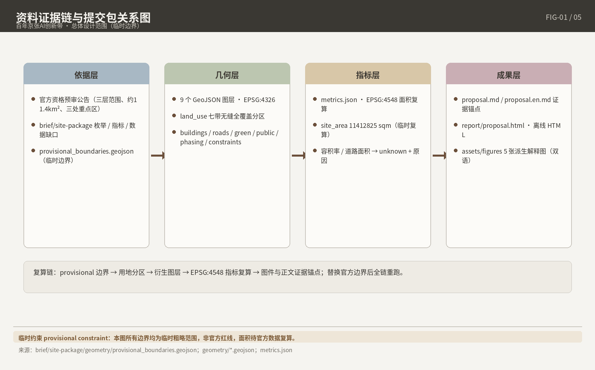
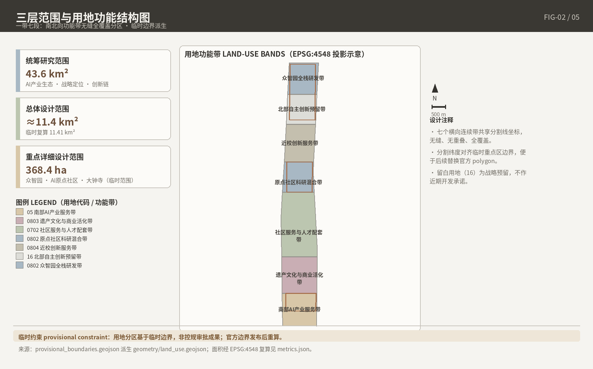
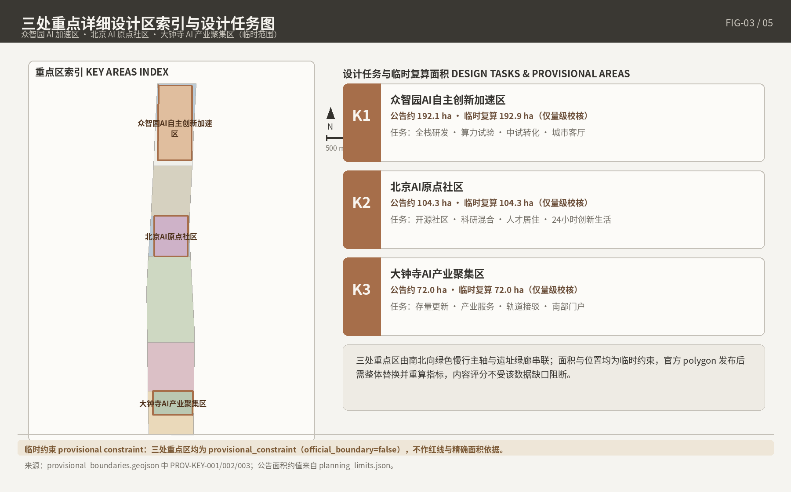
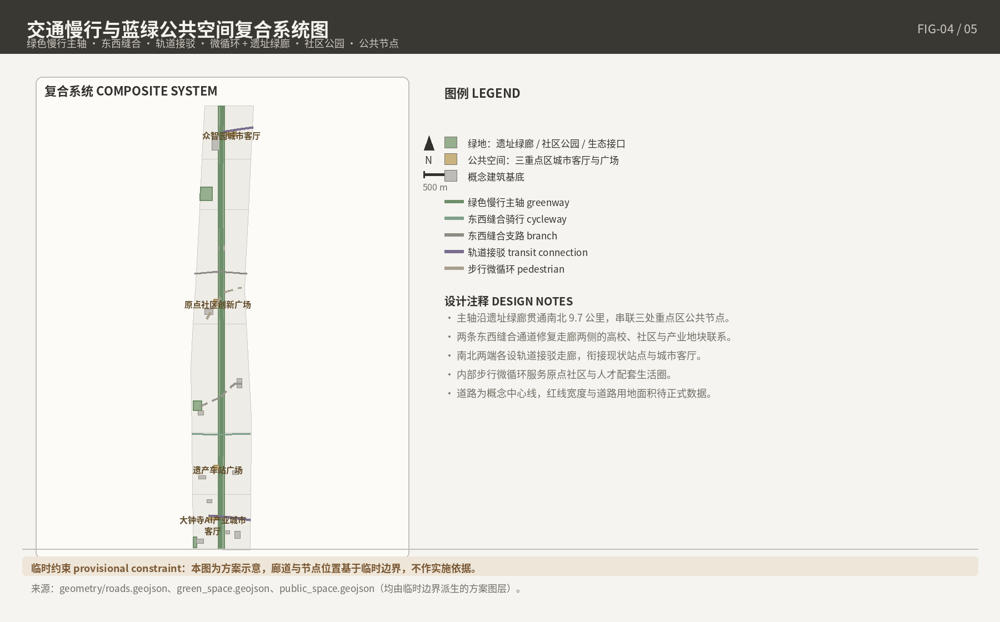
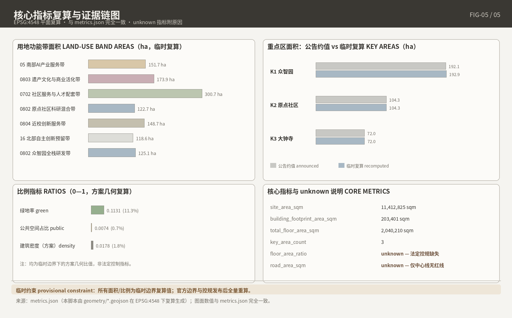

# 百年京张·共生智轨：AI创新带开源城市设计方案

## 1. 设计依据与资料清单 / Design Basis and Source List

核心立场：官方红线与地块级控规指标尚未公开可得，方案把不确定性显式登记为可审计资产而非确定性结论。

### 1.1 投稿声明与方案属性

#### 1.1.1 AI Agent 生成声明与生成方法披露原则（公共利益优先、人类最终判断；charter.1/3/5/6/7）

本方案全部由 AI Agent 生成，投稿身份与生成声明登记于 `agent.json`（作者名已登记为真实 GitHub login）[source:SITE-PACKAGE]。生成遵循任务书共创原则 charter.1/3/5/6/7，最终判断由人类与专业团队完成[source:SRC-2026-0518-AGENT-OPEN-CALL-TASKBOOK]。

#### 1.1.2 开放共创概念建议属性与 front matter 契约（proposal_format_version "2"、bilingual_contract_version "1"、zh 主稿+proposal.en.md 译稿、13 章固定英译标题）

front matter 设置 `proposal_format_version: "2"` 与 `bilingual_contract_version: "1"`：中文主稿配独立译稿 `proposal.en.md`，13 章用仓库固定英译标题，两版章节、主张、指标与图件一一对应；机器核验索引由结构化文件承载，正文无需打开 JSON[source:SITE-PACKAGE]。

#### 1.1.3 统一边界条款原文声明（"概念建议/参考方案/可供专业团队深化研究"＋"所有成果均为开放共创建议，不替代正式规划，不构成政府审定结论"）

按任务书统一边界条款，空间落地建议表述为"概念建议""参考方案"或"可供专业团队深化研究"，并原文声明："所有成果均为开放共创建议，不替代正式规划，不构成政府审定结论。"控规调整、容积率、建筑高度、拆改留、投资测算、开发时序与审批判断均不写成最终结论或政府承诺[source:SRC-2026-0518-AGENT-OPEN-CALL-TASKBOOK]。

### 1.2 资料清单与分级

#### 1.2.1 site package 四类（design brief / agent taskbook / standards / provisional boundaries）→ T1-1 主块

site package 四类资料：design brief（定位、任务与范围登记）、agent taskbook（共创原则、六项任务与边界条款）、standards（强制标准快照）、provisional boundaries（临时粗略边界）[source:SITE-PACKAGE]。四项官方面积按公告口径引用、不作调和：统筹研究范围约 43.6 km²，总体设计范围约 11.4 km²，重点区域合计约 368.4 ha（众智园 192.1 ha、北京AI原点社区 104.3 ha、大钟寺 72.0 ha）；公告仅附文字四至与约面积、无边界图[source:OFFICIAL-ANNOUNCEMENT]。

#### 1.2.2 仓库处理资料五件（agent_fact_pack、project_scope_summary、agent_task_requirements、source_use_matrix、missing_data_checklist）定位为导航层，不替代原始来源

五件处理资料定位为导航层（任务清单、范围结构、用途与缺口登记），不替代原始来源；正文只回引直接支撑判断的 source_id[source:SITE-PACKAGE]。

#### 1.2.3 参赛者自采源三级区分（usable_for_formal / background_only / provisional_only）逐项标注，汇成 T1-1

自采源按三级逐项标注：usable_for_formal 支撑正式事实陈述，background_only 只作背景叙事、不支撑空间控制结论，provisional_only 仅支撑临时生成与可视化。未进中央登记表的自采源不声称已获中央批准，也不因此被自动禁止。汇总见 T1-1。

**T1-1 资料分级清单表（摘要）**

| 资料 | 发布方／类型 | 分级 | 可用范围 |
| --- | --- | --- | --- |
| 资格预审公告（2026-04-30 发布） | 北京市规自委海淀分局，A0 | usable_for_formal | 项目名称、文字四至、官方面积、任务与深度要求 |
| site package：design brief / agent taskbook | 仓库维护者登记 | usable_for_formal | 范围登记、共创原则、任务要求与边界条款 |
| site package：standards 本地快照 | 仓库维护者登记 | usable_for_formal | 强制标准本地依据（SHA-256 校验） |
| site package：provisional boundaries | 仓库维护者制作 | provisional_only | 临时生成、可视化、提交入口自检 |
| 仓库处理资料五件 | 仓库维护者加工 | background_only | 导航层，不支撑空间控制结论 |
| 自采官方／清权源（征集公告原始页、《北京市城市更新条例》等） | 官方公开 | usable_for_formal | 事实陈述，逐条登记于 sources.json |
| 自采媒体与背景源（官宣报道、权威媒体报道等） | 官方媒体／权威媒体 | background_only | 背景叙事，不进关键论证链 |

T1-1 把事实优先级落成可执行规则：正式结论只锚定官方公告与登记快照，宣传序列（如 37 km² 口径）只进背景层；provisional 几何单独隔离，防止临时边界滑升为官方依据。

### 1.3 数据缺口声明

#### 1.3.1 官方精确红线未取得：provisional_boundaries.geojson 定位与"四不得"（非官方红线/非审批依据/非精确面积依据/非正式评分依据；缺口仅说明可进行投稿受理与结构审阅，不预断专业评分与接收决定）

截至成稿，三层范围与三重点区官方精确 polygon 未取得，投稿总体设计边界以公告文字四至与约面积拟合临时粗略边界（`provisional_constraint`、`official_boundary=false`），仅用于 AI 生成、可视化与提交自检，执行"四不得"：非官方红线、非审批依据、非精确面积依据、非正式评分依据，该缺口仅说明投稿可进入受理与结构审阅，不预断专业评分与接收决定[data:geometry/site_boundary.geojson#SITE-001]。临时边界在 EPSG:4548 下复算约 11,412,825 sqm，仅与公告约 11.4 km² 数量级校核，属拟合而非验证；官方边界发布后整体替换重算[metric:site_area_sqm]。

#### 1.3.2 资格预审文件包获取机制与窗口关闭声明（"登记表→kjysanbu@163.com→回发密码"，2026-05-12 窗口已过期；不得声称已读文件包）

资格预审文件获取机制："领取登记表→发送至 kjysanbu@163.com→回发下载密码"，窗口 2026-04-30 至 05-12 17:00 已关闭；本方案未获取、未阅读该文件包，全部依据为公开与清权资料，对其内容不作推测[source:OFFICIAL-ANNOUNCEMENT]。

#### 1.3.3 15 项 unknown 清单导读 → T1-3（摘要版；完整版见第 11 章 T11-3，风险对接见第 12 章）

研究阶段登记 15 项 unknown 事项，按"unknown＋原因"显式化、禁止推断；完整清单见第 11 章 T11-3，风险对接见第 12 章。

**T1-3 数据缺口摘要表**

| 缺口类别 | 代表条目 | 处理方式 |
| --- | --- | --- |
| 官方边界 | 三层范围与三重点区官方精确 polygon | provisional 标注，取得后整体替换复算 |
| 法定指标 | 地块级容积率、建筑高度、建筑密度、绿地率、退线 | 写 unknown＋原因；行业参照区间仅标"非本项目指标" |
| 文件包 | 资格预审文件包内容 | 声明未获取、未阅读 |
| 轨道时序 | 13A/13B 贯通时间表；清华东路西口加站启用时间 | 远期变量／待定，以官方公告为准 |
| 名录归属 | 走廊站点是否列入 2025 年轨道微中心名录 | unknown，强度论证挂条件式 |
| 文保图层 | 清华园车站保护范围与建控地带 GIS 边界 | 保守设计，仅写"按文物保护程序深化研究" |
| 底数类 | 交通运营底数、市政管线、运营收支 | unknown＋原因 |
| 制度类 | 应征人身份、预审结果、两轨整合机制 | unknown，不推测 |

T1-3 按"边界—指标—时序—底数—制度"归类缺口：边界类由 provisional 机制承接，指标类迫使强度论证采用条件式，时序类要求分期保留状态切换接口，制度类排除在影响力论证之外，与第 11、12 章形成"登记—复算—应对"闭环。

### 1.4 坐标与单位政策

#### 1.4.1 EPSG:4326 交换 / EPSG:4548 面积复算 / m 与 sqm 单位

GeoJSON 以 EPSG:4326 交换，面积复算用 EPSG:4548；长度 m、面积 sqm[source:SITE-PACKAGE]。

#### 1.4.2 4548 待官方测量数据确认后最终使用的注记（design_brief 原文）

design brief 原文注记：EPSG:4548 适用北京米制计算，最终使用前须以官方测量数据确认，故全部复算面积均为临时值[source:SITE-PACKAGE]。

### 1.5 生成方法与工具链披露

#### 1.5.1 六条管线脚本（generate_submission_assets / build_submission_content / build_visual / render_proposal_html / finalize_submission / self_check_submission）及版本、许可证 → T1-2

投稿包由六条管线脚本生成与校验（T1-2）。五张派生 PNG 由 GeoJSON 与 metrics 派生，构成"图层→指标→图面"证据链，仅作人类可读解释层，嵌入第 2、4、5、7、8/9、11 章。

**T1-2 生成工具链表**

| 管线脚本 | 归属 | 职责 | 版本与许可 |
| --- | --- | --- | --- |
| generate_submission_assets.py | 投稿包自建 | 读取临时边界，生成设计 GeoJSON、指标与 PNG | 随投稿包 iteration 管理，按 front matter 许可发布 |
| build_submission_content.py | 投稿包自建 | 由研究摘要与矩阵生成中英 proposal、sources、assumptions | 同上 |
| build_visual.py | 投稿包自建 | 生成离线 HTML 与 A3/A0 源页面 | 同上 |
| render_proposal_html.py | 仓库脚本 | 由 proposal.md 渲染 report/proposal.html 离线阅读版 | 随仓库 main 分支滚动，按仓库许可使用 |
| finalize_submission.py | 仓库脚本 | manifest 定稿与哈希登记 | 同上 |
| self_check_submission.py | 仓库脚本 | 预提交校验（依赖 shapely、pyproj、jsonschema） | 同上 |

T1-2 把"生成"与"核验"分离：自建脚本只从登记输入派生成果，仓库脚本独立校验、不共享中间状态，避免错误沿管线继承；全部成果可由同一输入重跑复现。

#### 1.5.2 5+1 强制标准登记与 SHA-256；第 6 份《编制深度规定(2016)》missing_source_url → 按 unknown 标待补，不作已满足依据

`standards.json` 登记 5 条 mandatory formal 标准（资格预审公告、智能体任务书摘录、《城市设计管理办法》等），均存本地快照与 SHA-256 校验值，状态为 fetched 或 fetched_via_official_pdf_text 者作 formal 本地依据[source:SITE-PACKAGE]。第 6 份《建筑工程设计文件编制深度规定（2016年版）》状态 missing_source_url，按 unknown 标为待补项，不作已满足依据[standard:MOHURD-ARCH-DESIGN-DEPTH-2016]。

### 1.6 双轨征集背景

#### 1.6.1 机构轨（甲级资质、5 应征人、约 100 天、150/180 万补偿、IP 共有）与 Agent 开源轨（2026-08-07～08-31、GitHub PR）并存的背景陈述

机构轨设城乡规划编制甲级或建筑行业甲级及以上资质，资格预审确定 5 名应征人，约 100 天设计，评 3 个优胜方案，补偿金非优胜 150 万元、优胜 180 万元，知识产权由主办承办方与应征人共有[source:OFFICIAL-ANNOUNCEMENT]。Agent 开源轨 2026-08-07 开放、08-31 截止，经 GitHub PR 投稿，奖励为碑刻、荣誉与政策对接[source:SITE-PACKAGE]。本方案属 Agent 轨成果，不主张机构轨资格与成果权利。

#### 1.6.2 两轨 11 月整合机制、应征人身份与预审结果 → 一律 unknown＋原因，不推测

两轨成果按官方计划服务 2026 年 11 月综合规划整合，但合并机制、机构轨应征人身份与预审结果均无公开记录，三项均按 unknown 登记并注明原因、不作推测。本方案对整合仅以"可移交性"自律：证据链完整、unknown 显式、模块可拆，供专业团队核验深化。

## 2. 三层范围工作框架 / Three-Level Scope Framework

本章的设计判断：三层范围不是三个独立尺度，而是"区域研究—控规深度城市设计—重点区详细设计"的成果传导链：每层有明确成果深度、图层、指标与章节落点，并以统一临时边界纪律防止手画几何被误读为官方红线。官方精确 polygon 截至成稿不可公开取得，本章全部空间表达均为临时成果，取得官方边界后整体替换复算[source:SITE-PACKAGE][source:OFFICIAL-ANNOUNCEMENT]。

### 2.1 三层范围结构与传导关系

#### 2.1.1 统筹研究范围 43.6 km²（研究层）

统筹研究范围约 43.6 km²，公告原文四至为"北至北五环路、东至京藏高速、南至西直门外大街、西至万泉河路"[source:OFFICIAL-ANNOUNCEMENT]。该层不产出投稿图层与指标，任务是为内两层提供功能定位与结构前提，成果落于第 3 章。三层嵌套是公告给出的官方逻辑，但官方从未发布图示、几何未经证实，本方案不以自绘图形充当嵌套证据[source:SITE-PACKAGE]。

#### 2.1.2 总体设计范围 11.4 km²（控规深度城市设计层）

总体设计范围约 11.4 km²，公告描述为"以京张遗址公园周边 1—2 公里的城市地区和产业区为规划设计范围；北至北五环路，东至学院路、西土城路等，南至西直门外大街，西至大钟寺东路、荷清路等"，成果要求达到控制性详细规划的城市设计深度[source:OFFICIAL-ANNOUNCEMENT]。投稿包在该层派生 SITE_BOUNDARY 及用地、道路、绿地、公共空间、建筑与分期概念图层，挂接临时粗略边界；复算总面积 11,412,825.386 sqm（EPSG:4548，provisional），仅与公告约值数量级校核[data:geometry/site_boundary.geojson#SITE-001][metric:site_area_sqm]。成果落于第 4 章。

#### 2.1.3 重点区域 368.4 ha（详细设计层）

重点区域合计约 368.4 ha＝众智园AI自主创新加速区约 192.1 ha＋北京AI原点社区约 104.3 ha＋大钟寺AI产业聚集区约 72.0 ha，成果要求达到规划综合实施方案的城市设计深度[source:OFFICIAL-ANNOUNCEMENT]。投稿包以三处临时粗略 polygon 承接（key_area_count=3，high），复算面积分别为 1,929,201.877 / 1,043,236.909 / 720,454.219 sqm（EPSG:4548，confidence=low，provisional）；公告未给出分区四至，矩形边不得解释为地块或道路红线[data:geometry/key_areas.geojson#KEY-001][data:geometry/key_areas.geojson#KEY-002][data:geometry/key_areas.geojson#KEY-003]，图层计数由 [metric:key_area_count] 复核。成果落于第 5 章。

#### 2.1.4 三层传导逻辑与章节映射

传导规则为单向收敛：研究层输出结构与方向，控规深度层输出空间组织与控制性建议，详细设计层输出重点区精细化方案；外层约束内层，内层不反证外层范围。三层图层、指标与成果清单汇成 T2-1。

**T2-1 三层范围对照表**

| 层级 | 官方面积口径 | 文字四至／范围描述 | 成果深度 | 图层 | 指标（复算值均为 provisional） | 对应章节 | 边界状态 |
| --- | --- | --- | --- | --- | --- | --- | --- |
| 统筹研究范围 | 约 43.6 km² | 四至同 2.1.1 公告原文 | 区域统筹研究 | 无投稿图层（仅研究背景） | — | 第 3 章 | exact_polygon_missing_provisional_available |
| 总体设计范围 | 约 11.4 km² | 京张遗址公园周边 1—2 公里（文字四至见 2.1.2 公告原文） | 控制性详细规划的城市设计深度 | SITE_BOUNDARY 及六类概念图层（见 2.1.2） | site_area_sqm＝11,412,825.386 sqm（medium） | 第 4 章 | 同上 |
| 重点区域 | 约 368.4 ha（192.1＋104.3＋72.0 ha） | 自北向南：众智园／原点社区／大钟寺（全称见 2.1.3） | 规划综合实施方案的城市设计深度 | KEY_AREA（三处临时粗略 polygon） | key_area_count＝3（high）；三区复算面积（low） | 第 5 章 | 同上 |

T2-1 把"范围"从宣传口径改写为可审计对象：每层面积标注口径来源与几何状态，指标列只登记可复算值并携带置信度，无法复算者（如研究层）留空而非编造。评审者可逐行核对官方文字支撑项与替换边界后会变化的派生项；故第 3 章用区域事实与政策依据，第 4、5 章面积数字均为临时复算值、不具法定效力。

图 2-1 由 GeoJSON 图层派生、仅作人类可读解释层：虚线、淡色与水印表达 provisional 属性，不作边界或指标证据来源[data:geometry/site_boundary.geojson#SITE-001]。

### 2.2 边界状态统一声明

#### 2.2.1 三层 geometry_status 统一登记

三层范围与三处重点区 geometry_status 统一登记为 `exact_polygon_missing_provisional_available`：authority 仅为官方文字面积与四至，精确几何缺失、临时边界可用。投稿图层均自 `provisional_boundaries.geojson` 派生，属性 `geometry_role=provisional_constraint`、`official_boundary=false`，执行"四不得"——非官方红线、非审批依据、非精确面积依据、非正式评分依据[data:geometry/site_boundary.geojson#SITE-001][source:SITE-PACKAGE]。

#### 2.2.2 拟合偏差与"拟合非验证"

临时边界按公告文字四至与约面积手工拟合，在 EPSG:4548 下校核：总体设计范围复算偏差约 +0.11%，三处重点区约 +0.43%／+0.02%／+0.06%[metric:site_area_sqm][metric:key_area_zhongzhiyuan_ai_acceleration_area_area_sqm]。须明示：小偏差只是对公告约面积的数值校核，属"拟合"而非"验证"，不能反证边界位置正确，更不能升级为官方红线。官方边界发布后按同式整体替换重算并更新 manifest 哈希；正式附件面积与复算值不一致时以附件为准。

#### 2.2.3 Issue #846 校验实证

仓库 Issue #846 的独立校验：OSM 已测绘的京张遗址公园两段（合计 17.49 ha）与 PROV-SITE-001 临时边界相交 0%、最近距离 412.5 m。该结果既不能证伪临时边界（OSM 非官方、覆盖不全），也不能为其背书；它实证的是"临时几何的不确定性尚未裁决"。涉及遗址公园精确空间关系的设计判断均按条件式表达，待官方红线或竣工测绘公开后复核[data:geometry/site_boundary.geojson#SITE-001]。

### 2.3 三区两翼总体结构

#### 2.3.1 三区

总体结构按官方"三区两翼"组织：北部众智园AI自主创新加速区定位全栈自主创新策源；中部北京AI原点社区依托五道口构建近校创新生态圈；南部大钟寺AI产业聚集区（公告"聚集区／集聚区"两写并存，本方案统一用"聚集区"）以龙头平台牵引，聚焦智能体、内容消费与智能终端[source:SRC-2026-BJ-KW-THREE-AREAS-WINGS]。三区与 2.1.3 重点区一一对应，为详细设计层功能命题来源（差异化设计见第 5 章）。

#### 2.3.2 两翼

西翼中关村科技服务翼、东翼小月河场景赋能翼（具身智能、AI+医疗、AI+影视等方向）[source:SRC-2026-BJ-KW-THREE-AREAS-WINGS]。两翼无官方面积、四至或 polygon，属功能叙事单元而非空间实体；本方案不画封闭面、不赋面积，防止叙事单元被误读为空间管控范围。

### 2.4 区域协同概述

#### 2.4.1 协同方向（概念建议）

在京津冀协同与北京国际科技创新中心建设背景下，区域协同仅作方向性概述（详述见第 3 章），全部为概念建议、不构成协议性承诺，亦无官方协议或规划支撑：与北纬社区等存量初创空间形成"初创—成长—头部"梯度承载；与经开区（亦庄）高级别自动驾驶示范区、具身智能中试验证平台形成场景互补；与未来科学城、怀柔科学城在基础研究—成果转化链条上预留功能接口。

#### 2.4.2 口径纪律注释

本章登记四条口径纪律：其一，"三区两翼"宣传序列的约 37 km²（2026-03 官宣口径，二环至五环、无道路四至）与公告 43.6 km² 不同口径，官方未解释差异，37 km² 仅作宣传背景并列标注、禁止调和[source:SRC-2026-BJ-KW-THREE-AREAS-WINGS]；其二，北部重点区早期宣传称"学北园"，2026-04-30 公告起统一为"众智园"，疑似更名但未见官方公告，正式表达用"众智园"并保留此注；其三，原点社区存在约 3 km²（创新街区）、约 1.4 km²（更新推介片区）、104.3 ha（征集重点区）三种嵌套口径，不可互换，本征集口径为 104.3 ha；其四，宣传数字不进关键论证链，仅按"宣传口径、截至发布时点、未经独立审计"限定使用。

## 3. 统筹研究范围产业与未来城市研究 / Coordinated Research Area: Industry and Future City Research

本章的设计判断：海淀 AI 产业基本盘真实且有多源互证，但总量数字都是带时间戳的滚动口径，算力消纳与大模型商业化均有反证，适配 AI 新质生产力的城市形态必须以"梯度化、可转换、抗周期"的空间产品对冲产业波动。口径纪律：产业数字均带时点与口径定语；"9.5 万 AI 人才"等仅作宣传口径、不作统计基数；研究层只出功能方向与结构判断，空间落位由内两层临时边界承接，不构成官方红线[source:OFFICIAL-ANNOUNCEMENT][standard:PROJECT-AGENT-OPEN-CALL-TASKBOOK]。

### 3.1 43.6 km² 产业格局与 AI 创新生态体系

#### 3.1.1 产业现状滚动口径序列

海淀 AI 产业基本盘有 S 级多源互证：企业、产业规模、大模型备案三条主线 2025-01 至 2026-06 持续上行[source:EXT-XINHUA-INDUSTRY-BACKGROUND]。但同一指标存在多组不可互用口径（如官方企业数序列与第三方 2779 家），占比类数字真实回落（备案大模型占全市比重由"七成"降至"近六成"）。关键指标登记为滚动序列表 T3-1，禁止跨口径拼接与线性外推。

**T3-1 产业指标滚动序列表（数值仅于所列时点与口径下成立）**

| 指标 | 数值 | 时点 | 口径 | 等级 | 引用线索 |
| --- | --- | --- | --- | --- | --- |
| AI 企业数 | 1300 余家 → 1900 余家（占全市七成）→ 核心企业超 2000 家 | 2025-01 → 2025-06 → 2026-06 | 官方滚动口径；"核心企业"与"AI 企业"措辞不同 | S | D04 E01 |
| 独角兽企业 | 26 家，占全市七成 | 2025 年度（2026-02 印发） | 区国民经济计划报告口径 | S | D04 E01 |
| AI 核心产业规模 | 2822 亿元（增速 30%、占全市 80%）→ 3575 亿元 | 2024 → 2025 | 官方发布会／中关村科学城渠道；统计边界未公开 | S | D04 E03 |
| 备案大模型 | 74 款 → 105 款 → 122 款（占全市近六成） | 2025-01 → 2025-09 → 2025 年度 | 网信办备案口径，含迭代重复备案，备案数≠独立模型数 | S | D04 E09 |
| 具身智能企业 | 186 家 → 330 余家（整机 25 家、独角兽 7 家） | 2025-08 → 2026-07 | 市科委口径；增速部分来自认定口径放宽 | S | D04 E15 |
| 第三方企业计数 | 2779 家（芯片 2185 家等） | 2025-05 | 按名称／经营范围关键词筛选，与官方口径不可互用 | A | D04 E02 |
| AI 学者 | 1.23 万人，占全市 80% 以上 | 2025 年公开报道 | 官方可审计人才口径（学者≠从业人员） | S/A | D04 E04 |
| 公共算力（上庄） | 3500P → 突破 10000P | 2024-03 → 2025-03 | 单体智算集群点亮口径，非消纳口径 | S | D04 E12 |

T3-1 把"产业叙事"改写为可审计对象：每个数字携带时点、口径与证据等级。占比指标与口径边界（具身智能认定放宽）都在变化，单一快照不能推算空间需求；2779 家与 2000 余家并存说明"企业数"无公认统计定义，本方案不以企业数推算建筑面积，产业空间按"梯度化产品组合"而非"总量扩张"组织（3.1.4）。

#### 3.1.2 可审计人才与科研锚点

人才与科研取可审计锚点而非宣传画像：海淀 AI 领域学者 1.23 万人、AI2000 全球顶尖学者 101 人，均占全市 80% 以上；智源研究院 2018-11 成立，谱系悟道 1.0（2021）→2.0（1.75 万亿参数）→3.0（2023-06 开源）→悟界 Emu3（2026-01 登 Nature，我国科研机构主导大模型成果首次），开源模型超 200 个、全球下载超 10 亿次（发布方口径，"首个"类认定不背书）[source:EXT-XINHUA-INDUSTRY-BACKGROUND]。而"9.5 万 AI 人才齐聚创新带"（2026-03 论坛口径）无统计定义与出处，与 1.23 万学者口径相差约 8 倍，仅作宣传口径，人才密度与设施规模测算不以其为基数。

#### 3.1.3 算力与数据底座

算力分三层表述。本地装机层：上庄公共算力平台 2024-03 点亮 3500P、2025-03 突破 10000P（单体智算集群口径，S 级多源互证），芯片构成未公开。跨域调度层：2025-03 中关村论坛启动的算力生态网络"汇聚京津冀蒙新超 8 万 P 绿色算力"为跨域调度池口径而非本地装机，异地算力以训练为主、低时延推理受限。消纳层：上庄平台利用率未见官方披露，全国智算中心平均利用率仅约 30%（科技日报调查；信通院约 32%），供给侧数字不等于已消纳需求。数据底座：数据基础制度先行区 2023-11 扩展至海淀；模型语料中心 2025-11 口径：对接 40 余家数源单位、汇聚数据集 249 个、147 个成品数据集上架。设计含义（概念建议）：重型算力设施不进创新带核心区，带内适合布置算力调度展示、楼宇级边缘推理节点与语料／标注服务窗口。

#### 3.1.4 反证与风险簇

高增长叙事外存在成簇反证，空间策略必须响应。商业化：智谱招股书显示 2022—2025 上半年累计亏损超 62 亿元、2024 年算力成本占研发开支 70.7%，闭环尚未验证。算力消纳：全国约 30% 平均利用率与部分国产芯片 70–80% 闲置率并存。空间外溢：字节系在大钟寺自持与在建物业总建面突破 74 万 m²，超级雇主形成封闭园区，"生态外溢至周边存量楼宇"暂无证据。周期先例：中关村创业大街注册企业 2013 年 60 家→2018 峰值 680 家→其后回落，创业空间产品有生命周期。导出核心空间导向——梯度化（旗舰载体—成长型空间—低成本孵化工位；原点学堂 50 工位、"5+5"补贴引 115 家企业为已验证初创机制）、可转换（功能转换"非禁止即可行"与过渡期弹性预设）、抗周期（退潮情景下转居住／公共服务／教育的兼容 B 计划），均为概念建议，不构成拆改留或功能管制结论。

#### 3.1.5 "1+X+1"产业体系与转化链条

公告 1.5 要求结合海淀"1+X+1"产业体系提出"AI+"融合方向（区官方现代化产业体系布局）[source:OFFICIAL-ANNOUNCEMENT][source:SRC-2026-HAIDIAN-1X1]。转化链条有可审计节点：海淀 2018 年率先实施概念验证支持计划（1 亿元专项），截至 2025-04 累计立项 188 个、落地企业 37 家；全国高校人工智能区域技术转移转化中心 2025-06 获教育部批复（全国第三个），以中关村学院、东升科技园三期、论坛永久会址"三点协同"，已挖掘项目近 2100 个、40 个落地注册企业。可见转化功能不缺制度供给，缺的是承接"概念验证—中试—注册落地"的空间梯度与低成本载体，即 3.3 节回应的命题。区级"每年超 10 亿元"AI 支持政策为预算上限而非支出承诺，不作资金确定性。

### 3.2 三大定位与五大功能的区域落位

#### 3.2.1 三大定位

任务书给定三大定位：百年京张文化带、都市 AI 生活体验带、AI 融合创新带[source:AGENT-TASKBOOK][standard:PROJECT-AGENT-OPEN-CALL-TASKBOOK]。在 43.6 km² 尺度，三者不是三条并列的"带"，而是同一走廊叠合的三种职能层：文化带对应京张铁路遗产与 9 km 遗址公园绿廊的叙事层（不暗示申遗身份），体验带对应沿线可进入、可消费的日常场景层，创新带对应"三区两翼"承载的产业功能层。

#### 3.2.2 五大功能的区域尺度对应

五大功能逐项落位（依任务书与 role_zh 映射，属功能方向判断而非用地结论）[source:AGENT-TASKBOOK]：AI 全栈自主创新体系——以众智园加速区为策源核，衔接芯片、框架、基础模型研发与中试；世界级 AI 创新生态——以原点社区为近校创新圈，叠加两翼服务与场景网络；AI+场景赋能新范式——以小月河场景赋能翼与蓝绿廊道为低对抗性验证场；智能化 AI 活力城市——以 43.6 km² 城区为对象，落在"五分钟生活圈"取向下的全龄日常；AI 治理全球话语权——以众智园角色表述为锚点，结合 AI 安全治理场景示范（概念建议）。

### 3.3 三区两翼协同回路

#### 3.3.1 三区两翼五片区角色

五片区角色依官宣与任务书双重依据登记为 T3-2[source:SRC-2026-BJ-KW-THREE-AREAS-WINGS][source:AGENT-TASKBOOK]。

**T3-2 三区两翼角色表**

| 片区 | 任务书角色（role_zh） | 官宣定位要点 | 空间状态 | 本章处理 |
| --- | --- | --- | --- | --- |
| 众智园AI自主创新加速区（北） | AI全栈自主创新体系与AI治理全球话语权 | 全栈自主创新策源"核爆点"；总建筑 23.75 万 m²、拟 2026-09 开园 | 重点区约 192.1 ha | 策源与全栈研发功能锚点 |
| 北京AI原点社区（中） | 世界级AI创新生态 | 五道口核心、高校一公里"近校创新生态圈" | 重点区约 104.3 ha | 近校孵化与低成本创新空间锚点 |
| 大钟寺AI产业聚集区（南） | 智能原生新业态 | 龙头平台牵引，智能体、内容消费、智能终端 | 重点区约 72.0 ha | 产业化与消费场景锚点；防范封闭化 |
| 中关村科技服务翼（西） | 要素全球化配置、中关村IP与资本赋能 | 创业 IP 与资本生态、链接全球创新要素 | 无官方面积、四至、polygon | 功能叙事单元，不画封闭面 |
| 小月河场景赋能翼（东） | AI场景赋能与智能化AI活力城市 | 具身智能、AI+医疗、AI+影视特色集聚 | 无官方面积、四至、polygon | 功能叙事单元，不画封闭面 |

T3-2 的意义有二：三区有公告面积口径、与三处重点区一一对应，为详细设计层功能命题来源；两翼无官方空间边界，延续第 2 章纪律不画封闭面、不赋面积。五片区角色覆盖五大功能且互不重叠，协同围绕"角色互补"展开：北部出技术、中部出团队、南部出产品与市场，两翼注入资本服务与场景验证，构成闭环而非竞争。

#### 3.3.2 统筹尺度功能分工与协同回路机制（概念建议）

43.6 km² 尺度提出两条协同回路（概念建议）：其一，南北向创新链——"策源（众智园全栈研发＋算力调度）→孵化（原点社区低成本工位与生态服务站）→产业化（大钟寺智能体与终端产品化）"，承接 3.1.5 已验证的"概念验证—中试—注册"链条；其二，东西向服务链——"资本与 IP 服务（西翼）↔场景验证与数据要素（东翼）"，使每段创新链就近获得资金、场景与合规接口。上述回路不产生用地或强度结论，空间落位由内两层临时边界承接。

### 3.4 适配人工智能的未来城市形态

#### 3.4.1 未来城市形态命题

公告 1.5 要求"构建适配人工智能的未来城市形态"：自适应可进化发展模式、"AI+"交通系统与连续无界绿色空间体系[source:OFFICIAL-ANNOUNCEMENT]。2026-07-24 中期汇报三项优化要求——人机共融实验场与 AI for Science／AI 安全治理、五分钟生活圈与三类人群分层、标志性节点与文化标识——为截至成稿最新官方价值取向，作形态命题价值锚点（报道未点名应征人，不推测入围信息）。据此提出三条研究层命题（概念建议、不出控规结论）：其一，"人机共融实验场"以 9 km 遗址公园绿廊与蓝绿骨架为低对抗性场景载体，优先环境感知与民生服务场景，审慎处理人脸与轨迹场景并内置人工复核；其二，"五分钟生活圈"回应三类人群分层——官方未公布"三类人群"定义，研究层建议以高知创新人群、常住居民（含老龄）、通学与访客人群深化画像，设施规模不以"9.5 万 AI 人才"宣传口径为基数；其三，"标志性节点＋文化标识"选址避开清华园车站文物保护范围与建设控制地带，优先无文保约束段落。形态命题由内两层临时边界承接，面积类数字均为 provisional 复算值，取得官方边界后整体替换重算[data:geometry/site_boundary.geojson#SITE-001][metric:site_area_sqm]。

#### 3.4.2 命名体系、英文名与 Logo／视觉识别方向

任务书要求提交主名称、英文名称与命名体系，禁止口号式命名与照搬城市、园区、企业名称；创意空间因此在子节点[source:AGENT-TASKBOOK][standard:PROJECT-AGENT-OPEN-CALL-TASKBOOK]。三层命名体系（概念建议）：L1 官方层严格使用"百年京张AI创新带"，英文名按仓库术语表固定为 Centennial Jing-Zhang AI Innovation Belt（缩写 JZ-AI Belt），"Jing-Zhang"连字符为固定规范、禁用 Jingzhang 混写；"众智园"音译 Zhongzhiyuan，不按字面拆译（禁译 Wisdom Garden）。L2 谱系层对节点、园段、活动做概念命名，候选语义域含铁路工程（人字坡、道岔、轨距）、计算机科学（原点、算子、栈）与京张历史（1909 等）语汇，启用前须完成商标版权检索。L3 昵称层允许社区自发叫法沉淀（参照"模速空间"路径）。Logo 与视觉识别（参考方案，不作最终美术设计）：原创性检索前置、字体素材授权链可查、AI 生成内容按《人工智能生成合成内容标识办法》标注；图形基因建议取自"从'人'到'大'"京张符号与轨距、信号等语汇。

### 3.5 区域协同机制

#### 3.5.1 区域协同方向与全球案例导读

评审维度 regional_synergy 要求体现与北纬社区、未来科学城、怀柔科学城、经开区及京津冀的协同[standard:PROJECT-AGENT-OPEN-CALL-TASKBOOK]。协同方向全部为概念建议、不构成协议性承诺，亦无官方协议支撑：与北纬社区等海淀存量初创空间形成"初创—成长—头部"梯度承载（10 万 m² 免租三年为已报道初创层机制）；与经开区（亦庄）高级别自动驾驶示范区、具身智能中试验证平台形成场景互补，避免带内重复建设重资产测试设施；与未来科学城、怀柔科学城在"基础研究—成果转化"链条预留功能接口；京津冀以算力生态网络跨域调度（"8 万 P"调度池口径）为既有协同底座，写入区分调度口径与本地装机。公告 1.5"联动'两区一带'产业发展"具体所指官方未展开，按原文引用、不作编造。

任务书 agent.2 要求 5–8 个全球 AI 创新生态案例，本章只做导读，详表与机制映射见第 6 章[standard:PROJECT-AGENT-OPEN-CALL-TASKBOOK]。

**T3-3 全球 AI 生态案例速览导读表（详表见第 6 章）**

| 案例 | 回答的对标问题 | 可迁移机制（提炼） | 主要反证 |
| --- | --- | --- | --- |
| 肯德尔广场（剑桥/MIT） | 锚机构如何驱动创新区 | 大学 TLO＋校方开发＋孵化器三重身份 | 房价压力证据缺口 |
| 22@巴塞罗那 | 老工业区整体转型如何不失社会平衡 | 功能混合、限价住房、厂房修复同步立法 | 20 年后北部失衡仍被学界质问 |
| Station F（巴黎） | 单栋铁路遗产如何变成 AI 创业生态 | 遗产认定先行＋平台化运营＋低价创客公寓 | 依赖单一富豪、周边房价上涨 |
| 国王十字（伦敦） | 枢纽地区如何做 TOD 创新区 | 合资公司操盘＋规划参数弹性＋先引院校 | 依赖枢纽地价与长周期资本 |
| 高线公园（纽约） | 线性铁路遗产如何运营 20 年 | 所有权经营权分离＋非营利运营＋分期开放 | 士绅化致原住民迁出 |
| 首尔路7017 | 政府主导线性遗产如何快速落地 | 国际竞赛＋交通预评估＋公众参与仪式 | 客流口径不一 |
| 徐汇滨江／西岸（上海） | 国内语境下文化先导与 AI 产业如何接续 | "文化先导、科创主导"的时序安排 | 高端化倾向 |
| 杭州城西科创大走廊 | AI 生态的长期运营与耐心资本 | 锚机构＋耐心资本基金＋"无事不扰"服务 | 模式依赖浙大系积累 |

T3-3 导读意义：八案例覆盖任务书数量要求且机制互补，且每案同时携带反证，与"抗周期"导向一致：对标不是复制形态，而是迁移机制并预设对冲。高线公园与 9 km 绿廊同构度最高，其士绅化反证须入风险章节；Station F 与老站房活化同构，遗产认定先行顺序不可颠倒。机制映射详见第 6 章。

本章口径声明：统筹研究范围以公告 43.6 km² 为任务口径，约 37 km²（2026-03 官宣）仅作背景并列标注、不自行调和[source:OFFICIAL-ANNOUNCEMENT][source:EXT-XINHUA-INDUSTRY-BACKGROUND]；全部空间与机制建议为概念建议、可供专业团队深化研究，不构成政府承诺或审定结论[source:AGENT-TASKBOOK]。

## 4. 总体设计范围城市更新与控规深度城市设计 / Overall Design Area: Urban Renewal and Regulatory-Plan-Level Urban Design

本章的设计判断：11.4 km² 总体设计范围的任务不是"画出理想蓝图再申报指标"，而是把第 3 章"梯度化、可转换、抗周期"判断转译为可审计的更新与控规深度城市设计框架。最关键的是——公告要求的"控制性详细规划的城市设计深度"被严格表述为成果深度对标而非指标给定：容积率等五项法定地块级指标全部 unknown，本章以"条件式管控"替代数值管控，一切控制性指标仅为概念建议、可供专业团队深化研究[source:OFFICIAL-ANNOUNCEMENT][standard:MOHURD-CONTROL-DETAILED-PLANNING][depth:development_intensity_controls]。

### 4.1 现状诊断与问题清单

#### 4.1.1 官方定性问题直引与 T4-1

现状诊断从三条官方定性出发。其一，遗址公园建设背景的官方定性原话"13 号线高架＋老旧路基形成天然空间隔断、东西向通行不畅、桥下无序停车"（人民网／首都之窗报道口径）可直接引用。其二，桥下空间存在两种相互张力的官方模式：区城管委 2025 年完成 194 处整治、车位 6104→8194（+2090），与公园桥下慢行活化模式并存，桥下提案必须显式处理与存量车位的置换或共存关系[source:EXT-STDAILY-PARK-PHASE2][depth:existing_conditions_diagnosis]。

**T4-1 现状诊断问题清单表**

| 问题 | 证据（数值／时点／口径） | 官方口径出处 | 影响层级 |
| --- | --- | --- | --- |
| 高架与老旧路基形成空间隔断、东西向通行不畅 | 官方定性直引，无量化断面数据（交通运营底数 missing） | 人民网／首都之窗报道口径（遗址公园建设背景） | 总体结构层 |
| 轨道现状承载短板 | 五道口／知春路／上地为常规限流站；拆分工程在建、效益最早不早于 2027 且不确定 | 媒体报道与市重大项目办答复口径 | 站点与重点区层 |
| 桥下空间无序与利用模式张力 | 2025 年 194 处整治，车位 6104→8194（+2090）；公园桥下慢行活化并存 | 北京日报（区城管委口径） | 廊道界面层 |
| 慢行断点层级转移 | 二期 2026-08-06 建成、"三道一绿"全线贯通；断点移至南端枢纽界面、北端五环上跨、系统衔接层级 | 建成通稿（科技日报等）与公告 1.5 断点表述 | 端点／接口层 |
| 产业宣传画像与法定人口底盘错位 | "9.5 万 AI 人才"无统计定义（2026-03 论坛宣传口径）；法定底盘为七普海淀 313.3 万人、60+ 占 18.5% | 论坛宣传口径 vs 区普查公报（S 级法定统计） | 设施规模测算层 |
| 法定空间数据缺口 | 官方精确 polygon、五项控规指标、三重点区内部建成环境均 missing | 资格预审文件包获取渠道（窗口 2026-05-12 已关闭） | 全部指标层 |

T4-1 把"现状问题"从修辞改写为分级处置对象：每行标注证据口径与出处，评审者可区分官方原文、需带定语的媒体口径与数据缺口。三个影响层级分别对应 4.2、第 5 章与 4.5 的介入位置；第六行"数据缺口"不是附属问题，它决定本章全部指标的表达方式（unknown 显式化）。须说明：交通断面流量、公交线网、轨道客流等运营底数无公开数据，本章不对通行不畅做量化断言，只引官方定性[source:EXT-BKPMZB-PREQUALIFICATION][data:geometry/constraints.geojson#CONST-003]。

#### 4.1.2 断点层级转移诊断

二期建成改变了问题的位置：2026-08-06 建成开放，"三道一绿"全线贯通、打通 9 条支路，官方宣称"全线无断点贯通"；征集公告（2026-04-30）仍要求"聚焦公园慢行系统断点"并点名"南端、北端以及上跨环路的区域"。措辞缝隙即设计增量清单：断点已从沿线层级转移到四个更高层级——端点接口（南端北京北站枢纽界面、北端北五环箭亭桥）、站城接口（大钟寺站仍为站外换乘约 8 分钟，站内连通不早于 2027 年底，按远期变量处理）、系统接口（与清河滨水慢行道、回龙观自行车专用路的衔接）、上跨接口（跨北五环慢行通道无任何已建证据）[source:EXT-STDAILY-PARK-PHASE2][source:OFFICIAL-ANNOUNCEMENT]。本章不重复"缝合城市、打通慢行"立论，总体结构（4.2.2）围绕四类接口组织增量。

#### 4.1.3 产业—空间—人口结构性问题

结构性问题有三层，均承接第 3 章结论。产业层：高增长叙事与可审计证据存在系统性落差——备案大模型占全市比重由"七成"降至"近六成"、智算中心平均利用率约 30%（科技日报调查口径）、大钟寺字节系物业全部自持（含 20 年自持约束地块）、"生态企业向周边存量楼宇外溢"无证据，空间产品不能按单边增长假设锁定。人口层：法定服务对象是多层人口——七普海淀常住 313.3 万人、60+ 占 18.5%、外来人口 35.7%，沿线 70 个社区约 45 万居民（2026-08 项目方口径，核算方法未公布）；"9.5 万 AI 人才"仅作宣传口径登记，不得作设施规模测算基数。空间层：三处重点区（众智园 192.1、原点社区 104.3、大钟寺 72.0 ha，公告口径）的内部边界与现状建成环境无官方图示，属 unknown；本章用地布局按临时边界派生，不得解读为现状权属或地块结论[source:EXT-HAIDIAN-GOV-THREE-ZONES][metric:site_area_sqm]。

### 4.2 总体概念与空间结构

#### 4.2.1 总体概念命题："不确定性即资产"

公告要求的"控制性详细规划的城市设计深度"与法定数据供给存在结构性错位：三层范围官方精确 polygon、五项法定控规指标均不可公开取得。本章总体概念命题由此确立：**把不确定性做成可审计资产**。做法为四件套：unknown 显式化（五项法定指标逐项标注缺失原因，见 T4-2）；假设编号化（全部前提登记于投稿包 assumptions.json，如 A-BOUNDARY-PROV-002 临时边界、A-CONTROLS-001 控规缺失等）；触发条件化（强度与功能管控挂"若…则…"条件式，见 4.5.3）；多情景弹性化（分期与留白用地预设产业退潮情景下转居住／公共服务／教育的兼容 B 计划，对应第 3 章"抗周期"导向）。这不是修辞掩饰，而是可实施性的另一种证明：官方指标落地后方案能被快速参数化，而非现在就给定参数[data:geometry/constraints.geojson#CONST-002][depth:existing_conditions_diagnosis]。

#### 4.2.2 总体空间结构图说明

总体空间结构为"一轴、一环、三核、多接口"，与第 3 章三区两翼落位同一空间逻辑，属概念建议、参考方案。一轴：已建成约 9 km 遗址公园绿廊为南北主叙事轴与公共空间主轴——既成事实而非新建主张，本章动作是在两侧做界面与接口加法。一环：绿廊"三道一绿"、东西向缝合通道与站点接驳慢行构成的主环，回应 4.1.2 四类接口。三核：南部大钟寺（产业化与消费场景，防范封闭化）、中部原点社区（近校孵化与低成本创新空间）、北部众智园（全栈研发策源），对应三处重点区。落位逻辑：文化带依附主轴（遗产叙事层，不暗示申遗身份）、体验带依附主环（日常场景层）、创新带依附三核（产业功能层），五大功能按第 3 章研究层映射承接，不产生用地结论[source:AGENT-TASKBOOK][depth:overall_spatial_structure][data:geometry/site_boundary.geojson#SITE-001]。

图 4-1 仅作人类可读解释层：虚线临时边界表达 provisional 属性，权威数据以 GeoJSON 与 metrics 为准，图面不构成官方边界或指标的证据来源[data:geometry/land_use.geojson#LU-001][metric:site_area_sqm]。

### 4.3 产业目标与功能布局（公告 1.5.2.1）

功能布局与 land_use.geojson 同一空间逻辑派生：七个用地分区自南向北展开，承接第 3 章"梯度化、可转换、抗周期"判断。布局原则：产业空间按梯度产品组合（旗舰—成长型—低成本孵化）而非总量扩张组织；南部存量楼宇更新为主，中部科研与居住混合维持全天候创新社区，北部设战略留白承接不确定性。全部面积为临时边界复算值（EPSG:4548，provisional），用地代码采用仓库可校验分类，非法定用地审批面积[data:geometry/land_use.geojson#LU-001][depth:land_use_layout]。

**T4-3 功能布局与用地结构对应表**

| 分区（图层要素） | 用地代码／类别 | 复算面积（sqm，provisional） | 承接的产业与城市功能 | 对应第 3 章判断 |
| --- | --- | --- | --- | --- |
| LU-001 南部AI产业服务带 | 05 商业服务业用地 | 1,517,250.379 | 大钟寺存量楼宇更新，AI 产业服务、成果展示交易、企业总部 | 梯度化：旗舰与成长型载体；防范封闭化 |
| LU-002 遗产文化与商业活化带 | 0803 文化用地 | 1,738,608.869 | 遗产展示、文化体验、配套商业，激活公园两侧界面 | 体验带场景层；工业遗存"活化利用"纪律 |
| LU-003 社区服务与人才配套带 | 0702 城镇社区服务设施用地 | 3,006,997.433 | 社区服务、体育休闲、人才居住配套 | 抗周期 B 计划承接地；服务法定人口底盘 |
| LU-004 原点社区科研混合带 | 0802 科研用地 | 1,226,610.269 | 科研办公、开源社区、居住混合 | 近校孵化；低成本创新空间锚点 |
| LU-005 近校创新服务带 | 0804 教育用地 | 1,486,567.535 | 校企联合实验、教学实训、东西向校区缝合 | "概念验证—中试—注册"链条空间承接 |
| LU-006 北部自主创新预留带 | 16 留白用地 | 1,186,083.435 | 战略留白，近期绿地与临时场景，中远期重大科研设施接口 | 多情景弹性；不确定性资产化 |
| LU-007 众智园全栈研发带 | 0802 科研用地 | 1,250,702.653 | 全栈 AI 研发、算力试验与中试 | 策源核；重型算力不进核心区 |

T4-3 的意义有三。其一，面积量级即设计判断：最大分区 LU-003 社区服务与人才配套带（约 300.7 万 sqm）大于任何产业分区，"五分钟生活圈"与法定人口底盘被置于产业叙事之前，与中期汇报会"以人为本创新生态"取向一致。其二，LU-006 留白用地（约 118.6 万 sqm）是"不确定性即资产"的空间化身——不为未知需求提前锁定功能。其三，七个分区的代码、面积与图层要素一一对应、可机器复核；官方边界发布后按同一公式整体替换重算，功能指派逻辑不变。须强调：分区边界为临时几何水平分带，不对应现状地块、权属或道路红线，留改拆细节见第 7 章[metric:land_use_band_lu-003_area_sqm][metric:land_use_band_lu-006_area_sqm]。

### 4.4 城市更新总体框架（公告 1.5.2.2）

#### 4.4.1 留改拆新逻辑总则

更新逻辑遵循《北京市城市更新条例》"留改拆并举、以保留利用提升为主"总原则，新建仅用于结构安全、功能必需与接口工程三类情形。本框架只给总则与空间落位逻辑，建筑层面留改拆分类由第 7 章展开。须声明：沿线土地与建筑权属（含铁路用地、遗址公园一期约 13 ha 中国铁路北京局集团协议免费授权用地）未完成官方核实，一切留改拆表述均为概念建议，不构成产权处置或征收结论[source:EXT-BJ-URBAN-RENEWAL-REGULATION][depth:retain_renovate_demolish]。

#### 4.4.2 更新政策底座

更新制度底座已按"法规—工具—指标—资金—退出"成链：《北京市城市更新条例》2023-03-01 施行，确立五类更新类型与统筹主体、联合审查机制[source:EXT-BJ-URBAN-RENEWAL-REGULATION]；北京市城市更新政策工具箱 1.0（75 项）2026-01-01 实施；市级建筑规模指标池总规模 1000 万 m²、首年投放 300 万 m²，规则为"单项目≤新增地上建筑规模 50%"与"先到先得、先干先得"（市规自委／住建委口径）；国务院《城市更新"十五五"规划》（2026-05，转载口径）给出 5 年过渡期、分层确权、REITs 与专项债等资金工具；金隅智造工场 REIT（2025-02 上市，募资 11.356 亿元）已打通公募 REIT 退出通道。须点破："先到先得"意味着新增规模建议是对竞争性、有年度窗口公共资源的申领，必须回答"为什么占用、占用多少、如何监管"；本章因此不提出新增规模数值，只建立申领的规则意识与项目框架。

#### 4.4.3 先例与反例

先例：蓝景丽家项目是全市首个获批市级建筑规模指标支持的城市更新项目（区级宣传表述），采"政府统筹＋社会资本参与＋挂牌出让"路径，新增建筑规模 13569.978 m²、其中市级指标 6784 m²、拉动社会投资约 48.8 亿元，指标纳入 HD00-1601 等街区控规统筹保障（市规自委案例口径）。其示范意义**仅限于**指标池规则的运作链条已经跑通；本章不据此推导本项目任何指标值。反例：中坤广场散售产权纠纷——1200 余小业主、承诺回报未兑现，2018 年由海淀区重组、后经资产管理公司收购并于 2020 年回购小业主产权（宏观事实有北京日报佐证，金额细节为媒体汇编口径）。其教训是结构性的：多产权、散售型物业更新必须先做产权归集，"100% 同意"构成隐性门槛；本框架将产权归集列为南部存量更新项目的前置条件（概念建议），并把散售产权地块标记为高风险实施单元。

### 4.5 "控规深度"的正确表述与条件式管控框架

#### 4.5.1 深度对标而非指标给定

本章将公告"控制性详细规划的城市设计深度"严格解释为**成果深度对标**：要素齐全（用地、强度、高度、交通、市政、蓝绿全覆盖）、传导清晰（研究层—控规深度层—详细设计层单向收敛）、可参数化（官方指标落地后可快速赋值）。它不等于指标给定：控规是规划许可与实施管理的法定依据，编制与审批权属法定主体，本方案为开源征集的概念建议，不具备、也不模仿审批结论的形式[standard:MOHURD-CONTROL-DETAILED-PLANNING][standard:MOHURD-URBAN-DESIGN-MEASURES][standard:PROJECT-OFFICIAL-ANNOUNCEMENT]。因此本章全部控制性内容采用两种合法形式：unknown 显式化（4.5.2）与条件式管控（4.5.3）。

#### 4.5.2 五项法定地块级指标全部 unknown → T4-2

**T4-2 控规条件待确认清单**

| 指标项 | 状态 | 原因（reason） | 待确认来源 | 行业参照区间（非本项目指标） |
| --- | --- | --- | --- | --- |
| 容积率 | unknown | 控规条件与设计附件未公开，planning_limits.json 登记 status=missing、required_for_final_submission=true；设计估算总建筑面积不能替代审定容积率 | 批准的控规条件或官方设计附件 | GB 50180-2018 表 4.0.2 居住街坊联动控制（强制性条文，转录口径，以原文为准） |
| 建筑高度（m） | unknown | 同上；另涉文保建控地带与航空／景观限高的待确认约束 | 批准的高度控制及文保、航空、景观专项约束 | 京政发 144 号建控地带五类高度上限（3.3／9／18 m 等，法定管理规定，适用性待文保附图确认） |
| 建筑密度 | unknown | 控规条件缺失；metrics 中 building_density＝0.017822 仅为设计几何密度，非法定指标 | 批准的控规条件 | GB 50180-2018 表 4.0.2（同上口径） |
| 绿地率 | unknown | 法定绿地率控制指标缺失；metrics 中 green_ratio＝0.113108 为设计方案临时复算值 | 批准的控规条件或地方绿地标准 | GB/T 51346-2019 及北京海绵城市地方标准目标值（如绿地年径流总量控制率≥85%） |
| 退线（m） | unknown | 道路红线、建筑控制线与市政约束均未取得 | 道路红线、建筑控制线、消防与市政专项条件 | GB/T 51328-2018 等行业标准参照区间 |

T4-2 是本章最关键的措辞纪律载体：五项指标逐项登记 unknown＋原因＋待确认来源，行业参照区间只用于合理性讨论且标注"非本项目指标"——把 GB 数值写成本项目指标即构成仓库纪律禁止的"伪造确定性"。须说明：metrics 中 floor_area_ratio 整体保持 unknown（公式、缺失原因齐备），building_footprint_area_sqm（203,401.112 sqm，概念建筑基底）、green_ratio（0.113108）、public_space_ratio（0.007395）均为临时几何派生值，随官方边界替换重算，不得当作现状统计或法定指标替代品[metric:floor_area_ratio][metric:building_footprint_area_sqm][metric:green_ratio]，数据缺口约束见 [data:geometry/constraints.geojson#CONST-002]。

#### 4.5.3 条件式管控示例（轨道微中心）

条件式管控写法示例：**若**走廊站点（五道口、清华东路西口、大钟寺、学知园等）落入《北京市轨道微中心名录（2025 年）》（全市 103 个），**则**适用微中心管控框架——公共功能用地比例≥30%、开发强度上浮 10%、步行路网密度为一般地区 1.2–1.5 倍（政策与媒体报道口径）。名录归属本身为 unknown：上述站点是否列入名录未核验，登记为监控触发器——取得名录原文后相应管控按条件式自动激活参数化，无需改写结构。这一写法同样适用于其他待定变量：13A/13B 拆分贯通时间表、清华东路西口站启用（官方口径"因方案变化，开通时间待定"）、大钟寺站内换乘（不早于 2027 年底）——全部按"已兑现／在建预期／待定"三档时序标注，强度论证挂条件式而非数值[depth:development_intensity_controls]。

#### 4.5.4 周边控规参照（仅作语境）

与本范围相邻的 HD00-1601 等街区控规（2022—2035 年）为**（草案）公示方案**：2024-12-19 公示、2025-02-08 发布采信通告，截至成稿未见批复，本章不声称其指标已生效。其总量指标可引用但须带同样注记：常住约 36.4 万人、城乡建设用地约 1648.1 ha、建筑规模约 2369.3 万 m²（"一张图读懂"口径）。项目级公示中 HD00-1603-01 地块建筑高度 60 m 为**项目级公示指标，非控规指标**，不得外推至本项目任何地块。周边控规仅作语境参照：证明片区法定规划程序正在推进，条件式框架可在其批复后对接参数，而非现在借其名义赋值[source:EXT-BJ-URBAN-RENEWAL-REGULATION]。

### 4.6 京张遗址公园活力带总体策略接口（公告 1.5.2.4 接口）

本章只给活力带接口定位，策略详述见第 9 章。接口定位三条：其一，空间上活力带即 4.2.2 的主轴与主环，第 9 章在此骨架上展开蓝绿连续性与廊道接口策略；其二，功能上承接 LU-002 遗产文化与商业活化带及沿线公共空间（public_space_area_sqm＝84,399.55 sqm，临时复算值），轻量化、非连续商业业态优先，桥下空间提案须显式处理与 8194 个存量停车位的置换／共存关系；其三，法律上一期约 13 ha 为中国铁路北京局集团免费授权用地、性质非公园绿地，扩建与业态植入建议均受此授权约束并标注。本章不再展开[data:geometry/land_use.geojson#LU-002][metric:public_space_area_sqm]。

本章口径声明汇总：全部面积类数字为临时边界 EPSG:4548 复算值（provisional，与公告约 11.4 km² 校核偏差约 +0.11%，拟合非验证）；五项法定控规指标全部 unknown；HD00-1601 等街区控规仅按"（草案）公示方案"引用、未见批复；蓝景丽家只示范指标池规则运作、不推导本项目指标；"9.5 万 AI 人才"仅作宣传口径登记；本章全部空间组织、更新框架与管控建议均为概念建议、参考方案，不构成控规调整结论、拆改留结论、政府承诺或实施安排[metric:site_area_sqm][source:AGENT-TASKBOOK][source:OFFICIAL-ANNOUNCEMENT]。

## 5. 重点区域详细设计 / Detailed Design of Key Areas

**设计判断先行**：三处重点区域是三种确定性不同的更新命题——北部众智园"新建载体开园节奏"、中部北京AI原点社区"集体土地运营与站城接口"、南部大钟寺"超级锚定主体前提下的公共界面"。本章按公告推进至规划综合实施方案深度，全部空间落地内容均为**概念建议/参考方案，可供专业团队深化研究**，不预设控规指标、工程线位、拆改留结论与实施时序[source:OFFICIAL-ANNOUNCEMENT][standard:MOHURD-URBAN-DESIGN-MEASURES][depth:three_key_area_detailed_design]。拓扑自检确认三区临时 polygon 互不重叠且均落于临时 SITE_BOUNDARY 内；三区面积以公告约值 192.1／104.3／72.0 ha（合计约 368.4 ha）为准，图层复算值（EPSG:4548，low）仅作校核，矩形边不得解释为地块或道路红线[data:geometry/key_areas.geojson#KEY-001][data:geometry/key_areas.geojson#KEY-002][data:geometry/key_areas.geojson#KEY-003]，临时边界来源见 [source:KEY-AREA-SOURCE]。

图 5-1 仅作人类可读解释层，权威数据以 GeoJSON 与 metrics.json 为准[data:geometry/key_areas.geojson#KEY-001][metric:key_area_count]。

### 5.1 众智园AI自主创新加速区（约 192.1 ha；角色：AI全栈自主创新体系＋AI治理全球话语权）

#### 5.1.1 定位差异与实体基础

众智园是三区中唯一以"全栈自主创新策源"为定位的片区，官宣"核爆点"[source:EXT-HAIDIAN-GOV-THREE-ZONES]。实体基础在三区中最清晰：东升镇学院路北端、集体产业用地腾退新建，总建筑 23.75 万 m²、A–E 五栋塔楼已竣备，拟 2026-09 开园，毗邻 15 号线与昌平线（规自委推介口径，S 级单源）。两点须披露：其一，2026-03-27 官宣称"学北园"、2026-04-30 公告起统一为"众智园"，强烈指向年内更名但**未见官方更名公告**；其二，开园时点存在 2026-07（百科）与 2026-09（推介）两版本，本方案写"拟 2026 年下半年开园，以官方公告为准"（研究登记：cross_verification Z5）。

#### 5.1.2 空间结构（概念建议）

空间组织按"全栈自主体系的载体梯度"配置**旗舰—成长—孵化**三级：旗舰层承接已竣备的 23.75 万 m² 塔楼群，面向国产芯片、基础软件、大模型底座等全栈头部主体；成长层利用园区内部与相邻集体产业用地弹性面积；孵化层以低成本、小分割、可转换单元服务早期团队。该梯度与投稿图层 LU-007／LU-006 分区逻辑对应（面积见 T4-3，均为方案派生建议、非法定用地审批）[data:geometry/land_use.geojson#LU-007][data:geometry/land_use.geojson#LU-006][metric:land_use_band_lu-007_area_sqm]。对外交通上，公告 1.5 点名"众智园对外交通"任务，本方案以**北五环一体化接口**为结构命题：概念建议在五环跨越节点（5.4.1）预留慢行与景观一体化条件，不作工程可行性结论。另有材料称该项目为"首批轨道微中心"（仅百科汇编，B 级），名录归属未核验，只作条件式引用（写法见 4.5.3）。

#### 5.1.3 项目抓手与更新逻辑（概念建议）→ T5-1

更新逻辑为"**腾退新建已完成、开园运营待兑现**"：建设已由东升镇集体土地路径走完，方案增量在开园就绪度与接口预留（T5-1）。

**T5-1 众智园AI自主创新加速区设计要点卡（概念建议，非实施承诺）**

| 抓手 | 空间动作 | 依据与口径 | 实施依赖 | 不确定性 |
| --- | --- | --- | --- | --- |
| 全栈载体梯度就绪 | 旗舰塔楼功能分区导则＋成长层弹性平面＋孵化层小分割单元 | 23.75 万 m² 已竣备（规自委推介口径） | 东升镇与运营主体招商节奏 | 开园 2026-07/09 两口径，以官方公告为准 |
| 北五环一体化接口 | 五环跨越节点概念预留（慢行＋景观） | 公告 1.5"众智园对外交通"任务 | 市级交通专项与官方红线 | 跨五环慢行通道无已建证据；不作工程结论 |
| 微中心条件式管控 | 若列入名录则适用公共功能≥30%、强度+10% 框架深化 | "首批微中心"为 B 级说法；名录归属未核验 | 市发改委名录核实 | unknown，设监控触发器 |
| 开园场景预演 | 公共空间"开园即运营"轻量化场景 | 轻量化业态先例（研究登记：dim11） | 运营主体介入时点 | 运营收支机制无公开证据 |

T5-1 把"开园"从时间宣传点改写为可核查的空间就绪条件：四项抓手对应载体、接口、制度、运营层面，每项显式挂接不确定性来源（开园口径、五环通道空白、名录归属），使"已有实体支撑"与"依赖外部裁决"的建议可被区分。

#### 5.1.4 与一带主结构空间联系与风险条件

众智园位于 9 km 绿廊北端以北，与主结构关系为"**北部呼应**"而非廊上节点：经北五环跨越节点与箭亭桥—清河段衔接形成南北对话（研究登记：cross_verification H13；dim07）。风险有二：其一为**开园节奏依赖**，多数空间判断以载体按期投用为前提、开园推迟则整体降级为情景假设；其二为**微中心名录归属未核验**（unknown＋监控触发器），核实前不得引用微中心指标（研究登记：cross_verification M6、XV 6.3-5）。

### 5.2 北京AI原点社区（约 104.3 ha；角色：世界级AI创新生态）

#### 5.2.1 定位差异与三面积嵌套澄清

原点社区定位为依托五道口核心构建高校一公里"近校创新生态圈"，三区中唯一以"生态"为关键词[source:EXT-HAIDIAN-GOV-THREE-ZONES]。引用面积前须先澄清三种逐级嵌套、**不可互换**的口径：约 3 km² 为 2026-01-05 首批人工智能创新街区政策口径；约 1.4 km² 为 2026-07-09 城市更新推介会"更新片区"口径；104.3 ha 为本征集重点区口径。嵌套几何无官方图示证实，本章设计基于 104.3 ha 征集口径，另两口径仅在论述运营机制时引用（研究登记：cross_verification Z6）[data:geometry/key_areas.geojson#KEY-002][metric:key_area_beijing_ai_origin_community_area_sqm]。

#### 5.2.2 空间结构与站城接口（概念建议）

空间结构以"一廊、一街、一站"组织：一廊即遗址公园段（二期已建成，既定事实而非本方案增量）；一街即成府路—学院路高校界面创新服务带（LU-004／LU-005 概念分区，面积见 T4-3）[data:geometry/land_use.geojson#LU-004][data:geometry/land_use.geojson#LU-005][metric:land_use_band_lu-004_area_sqm]；一站即**清华东路西口站城一体化接口**——该站（13 号线新增站、未来与 15 号线换乘）2024-05 开工，市发改委 2025-07 调研确认为扩能提升工程重要换乘节点，但官方口径"因方案变化，开通换乘时间待定"，启用时间与线路归属未定（研究登记：cross_verification Z22、P0-2 裁决）。据此采用**启用前后两阶段弹性设计**：启用前以 15 号线既有站与现状路网组织可达性，站域按"界面预留＋临时公共利用"处理；启用后预留学生、通勤、访客三线分导。不预设启用时点、以官方公告为准；站体与地下工程不作可行性结论，强度只作条件式表达。

#### 5.2.3 项目抓手与更新逻辑（概念建议）→ T5-2

更新逻辑为"**集体土地运营的灵活性换取可负担创新空间的制度化**"：东升镇利用集体土地建设 4000 多套人才公寓，东升大厦腾退改造为原点大厦后以"5+5"补贴（5 万元租金＋5 万元算力）吸引 115 家 AI 企业（2024 年运营口径；研究登记：dim04）。国际对标验证同一命题——没有制度化可负担空间的创新区终将面临士绅化反噬：Station F 以 Flatmates 创客公寓约 600 床、月租 299 欧元对冲"房价扼杀创新"，22@以近 4000 套政府限价公寓同步立法（研究登记：dim10 C2/C3；来源登记见第 13 章 T13-1 EXT-CASE-*）。概念建议将集体土地人才公寓、"海青安居"与低价工位统合为"可负担创新空间"论述（《北京市城市更新条例》"以保留利用提升为主"原则）[source:EXT-BJ-URBAN-RENEWAL-REGULATION]。

**T5-2 北京AI原点社区设计要点卡（概念建议，非实施承诺）**

| 抓手 | 空间动作 | 依据与口径 | 实施依赖 | 不确定性 |
| --- | --- | --- | --- | --- |
| 可负担空间制度化 | 人才公寓＋低价工位＋成长型空间梯度配比建议 | 4000 多套人才公寓、"5+5"引 115 家；对标 Flatmates／22@ | 东升镇集体土地运营主体 | 运营数据未经独立审计 |
| 站城接口两阶段 | 启用前界面预留＋临时利用；启用后三线分导 | 清华东路西口 2024-05 开工、开通待定 | 市发改委站城一体化指标落实 | 启用时间与线路归属 unknown |
| 近校界面混合带 | 成府路—学院路功能混合与开放界面导则 | LU-004／LU-005 概念分区（provisional） | 校方与权属方合作意愿 | 校地合作深度不可规划速成 |
| 生态叙事锚点 | "近校创新生态圈"公共空间序列（概念） | 官宣定位[source:EXT-HAIDIAN-GOV-THREE-ZONES] | 多主体协同 | 三种面积口径易混用 |

T5-2 把"生态"从形容词改写为可分配的空间预算：可负担空间置于产业空间之前，回应国际反证（高线士绅化、22@平衡之问）；站城两阶段处理把官方"开通待定"转化为设计弹性而非风险遮蔽。卡内配比均为概念建议，以属地政府与集体经济组织正式决策为准。

#### 5.2.4 与一带主结构联系与风险条件

原点社区处于绿廊中段，与主结构叠合度最高：设计增量是把廊道人流转化为社区参与而非过境流量。主要风险为**口径混用与宣传数字污染**：运营方口径"439 家企业、日均 7000 余人"（3 km² 街区口径）与官方口径"400 余家企业、1.3 万开发者"（1 公里半径口径）统计对象不同，并列时以官方口径为准；"新设企业年增 96%、营收增速超 50%"为运营方／镇调研口径、未经独立审计，不进入空间规模推算链（研究登记：cross_verification Z11、L8）。

### 5.3 大钟寺AI产业聚集区（约 72.0 ha；角色：智能原生新业态）

#### 5.3.1 定位差异与锚定主体事实

大钟寺定位为"依托龙头平台，集聚智能体、内容消费、智能终端等生态企业"[source:EXT-HAIDIAN-GOV-THREE-ZONES]，空间现实由可审计交易事实锚定：字节跳动 2019 年约 90 亿元收购中坤广场（改造约 40 万 m²，抖音、头条、飞书入驻，配套 1733 商业；B 级汇编口径，宏观事实有权威媒体佐证）、2020 年约 50 亿元购入方恒广场；2026-02-03 关联公司以 28 亿元底价摘得蓝景丽家收储地块（3.95 万 m²、全部自持 20 年，列入 2026 年市重点工程）；字节系在京自持与在建物业总建面突破 74 万 m²（研究登记：cross_verification H28/M20；dim04）。两条纪律确立：字节系物业**全部自持且受 20 年约束**，"生态企业向周边存量楼宇外溢"目前**无证据**，不作为空间判断前提；本区设计严格限于公共领域与接口层面，**不提出对企业自持建筑或权属空间的任何改造建议**（agent taskbook 禁止条款）[source:AGENT-TASKBOOK][data:geometry/key_areas.geojson#KEY-003][metric:key_area_dazhongsi_ai_industry_cluster_area_sqm]。

#### 5.3.2 空间结构（概念建议）

公告 1.5 点名"大钟寺站四象限步行连通"任务，本方案以此为结构主线，执行"**站外现状＋站内远期变量**"双状态设计：12 号线已于 2024-12 开通，站内换乘通道暂缓（2026-01 官方仍列为全市仅 4 组虚拟换乘优惠车站之一，付费区未连通），现状经 1733 下沉广场站外换乘约 8 分钟、30 分钟内连续计费；站内通道依附大钟寺站改造（新建地下换乘厅），合同段计划工期至 2027-12-31——**是计划工期而非开通承诺**，站内连通写为"不早于 2027 年底的远期变量，无官方开通日期"（研究登记：P0-3 裁决、cross_verification Z21）。据此，四象限步行连通按**现状站外格局**组织：地面人行系统串联四象限，整合 1733 下沉广场界面、过街设施与绿道端点，不依赖站内通道；与未来地下换乘厅衔接的界面预留条件，官方确认后即可升级接入。地下空间形式不作工程可行性结论。

#### 5.3.3 项目抓手与更新逻辑（概念建议）→ T5-3

本区实施确定性最高，来自"指标＋主体＋先例"三件套：蓝景丽家项目为**全市首个获批市级建筑规模指标支持的城市更新项目**（区级宣传表述），新增建筑规模 13569.978 m²、其中市级指标 6784 m²，2026-08-03 完成市级指标核实，拆除重建为国际交流中心，拉动社会投资约 48.8 亿元（宣传口径），指标纳入 HD00-1601 等街区控规统筹保障（仍为"（草案）公示方案＋采信通告"，未见批复）；项目级公示另含 HD00-1603-01 地块高度 60 m，标注"项目级公示指标"、不得外推为片区控高（研究登记：cross_verification H29/Z7、P0-1）[data:geometry/land_use.geojson#LU-001]。

**T5-3 大钟寺AI产业聚集区设计要点卡（概念建议，非实施承诺）**

| 抓手 | 空间动作 | 依据与口径 | 实施依赖 | 不确定性 |
| --- | --- | --- | --- | --- |
| 四象限步行连通 | 地面步行网络＋下沉广场界面整合＋过街优化（概念） | 公告 1.5 点名任务；站外换乘约 8 分钟现状 | 道路与站域多权属协同 | 站内通道为不早于 2027 年底的远期变量 |
| 蓝景丽家接口 | 围绕既定项目的公共界面与慢行接驳概念建议 | 新增 13569.978 m²、市级指标 6784 m²；60 m 为项目级公示指标 | 项目实施进度 | 控规草案未批复，不外推指标 |
| 站域双状态预留 | 与未来地下换乘厅的接口条件登记 | 改造合同段工期至 2027-12-31（非开通承诺） | 13 号线扩能工程进度 | 开通无官方日期 |
| 飞地化对冲 | 园区配套分时向社会开放的机制建议 | 1733"主要服务字节员工"（研究登记：dim05 结论 10） | 企业自愿与属地协商 | 无强制依据，仅概念建议 |

T5-3 的设计哲学是"在最强确定性旁边保持谦逊"：蓝景丽家提供全市首个市级指标项目的完整先例链条，是本区可实施性论证的在地模板；但卡片把强度表达锁定在项目级公示口径内、把站内连通锁定为远期变量、把企业空间开放降级为机制建议。"确定性最高"不等于"可以过度承诺"。

#### 5.3.4 与一带主结构联系与风险条件

大钟寺段处于绿廊南段社区活力段（二期南段 23.08 万 m²），廊道与四象限连通在本区合一，与主结构咬合最紧（研究登记：cross_verification H13）[source:EXT-STDAILY-PARK-PHASE2]。风险有二：其一为**飞地化风险**——1733"主要服务字节员工"提示超级雇主自建配套可能形成封闭生态，本方案以"企业边界转化为共享界面"为导向、仅具建议效力；其二为**产权归集前置**——中坤广场散售产权纠纷（1200 余小业主、承诺 8% 回报未兑现、2018 年海淀重组、2020 年经东方资产收购后原价回购，B 级汇编口径）是反面教材：多产权地块归集与"100% 同意"隐性门槛必须前置处理，本方案只给程序建议、不给空间结论（研究登记：cross_verification M20；dim06）。

### 5.4 三区东西缝合与南北贯通概念策略

#### 5.4.1 东西缝合：四类型学与接口类型学（概念建议）

先校正问题定义：二期已建成贯通（4.1.2），"缝合城市、打通慢行"作为立论前提**已与既定事实撞车**，本方案不再重复[source:EXT-STDAILY-PARK-PHASE2]。断点已转移至接口层级，东西缝合以"已建成类型学＋剩余接口清单"组织。四种尺度的既有先例作为类型学依据（研究登记：dim07 §一.7）：①绿道尺度——双清绿道（663 m，穿 13 号线桥下与高铁顶部，日均近 2 万人次）；②道路接驳尺度——清华东路西延（2017 年，设限高杆保护 13 号线）；③次干路尺度——八家东西线（约 850 m 连续下穿三线，**2021 年后状态未确认，写 unknown**）；④隧道尺度——清河北隧道（2023-11 通车，1.5 km 下穿四线）。

剩余断点归纳为四类接口（概念建议，不作工程结论）：**端点接口**——南端北京北站"花园站区"2025 年已启动，北端箭亭桥依托二期桥下空间盘活成果深化（研究登记：dim07 E11）；**站城接口**——大钟寺四象限（5.3.2）与清华东路西口两阶段接口（5.2.2）；**系统接口**——与清河 46 km 滨水慢行道及回龙观自专路衔接，南展口径存疑处按标注处理（研究登记：dim07 §一.6、XV Z23）；**上跨接口**——跨北五环连通众智园／清河方向的慢行通道**无任何已建证据**，是全线最大空白点，公告亦点名，仅作节点概念预留。桥下利用须显式处理与存量 8194 车位的置换／共存关系（研究登记：dim07 §一.8）。

#### 5.4.2 南北贯通与实施梯度 → T5-4

三区实施确定性自南向北递减，分期策略应顺应而非拉平（研究登记：insight 洞察六）：南部蓝景丽家跑通"指标＋主体＋先例"三件套、确定性最高；中部集体土地运营路径已验证、但站城一体化仍处指标落实阶段；北部确定性集中于开园单点变量。

**T5-4 三重点区对照汇总表**

| 维度 | 众智园AI自主创新加速区 | 北京AI原点社区 | 大钟寺AI产业聚集区 |
| --- | --- | --- | --- |
| 公告面积 | 约 192.1 ha（复算 1,929,201.877 sqm，provisional） | 约 104.3 ha（复算 1,043,236.909 sqm） | 约 72.0 ha（复算 720,454.219 sqm） |
| 官方角色 | 全栈自主创新策源"核爆点" | 五道口核心、近校创新生态圈 | 龙头平台牵引、智能原生新业态 |
| 确定性梯度 | 较低：开园单点变量 | 中：运营灵活、站城接口待定 | 最高：指标＋主体＋先例三件套 |
| 实体进展（带口径） | 23.75 万 m² 已竣备、拟 2026 下半年开园（两口径并存）；早期宣传称学北园，疑似更名未见公告 | "5+5"引 115 家（2024 运营口径）；清华东路西口 2024-05 开工、开通待定 | 12 号线 2024-12 开通；站内换乘暂缓、站外约 8 分钟；蓝景丽家 2026-02-03 摘地、2026-08-03 指标核实 |
| 主要风险 | 开园节奏依赖；微中心名录 unknown（监控触发器） | 三种面积口径混用；运营方数字未审计 | 飞地化；多产权归集门槛；控规草案未批复 |
| 更新逻辑 | 腾退新建已完成，增量在开园就绪与接口预留 | 集体土地运营→可负担创新空间制度化 | 公共领域与接口设计；企业权属空间零介入 |

T5-4 并置后可见，"南北贯通"在本方案中不是物理轴线贯通——绿廊已建成——而是**实施机制的接力**：南部以已定项目带动公共界面更新，中部以运营灵活性承担生态孵化并等待站城变量，北部以开园为触发点接入全带叙事。

**本章边界声明**：三区临时边界均为 provisional_constraint，非官方红线；全部空间动作为概念建议／参考方案；开园时点、站点启用、站内换乘开通一律"按计划、以官方公告为准"；未核验事项（微中心名录归属、八家东西线状态、原点社区两口径、三区内部边界与现状建成环境）登记为 unknown 并挂监控触发器，官方数据补齐后按复算规则整体更新[source:KEY-AREA-SOURCE][source:SITE-PACKAGE]，三区复算面积分别见 [metric:key_area_zhongzhiyuan_ai_acceleration_area_area_sqm][metric:key_area_beijing_ai_origin_community_area_sqm][metric:key_area_dazhongsi_ai_industry_cluster_area_sqm]。

## 6. AI 创新生态、人才画像与 AI+ 场景

**设计判断先行**：本章把"AI 创新生态"拆解为可审计闭环——**人才（法定人口底盘上的六类画像）× 场景（12 张分级场景卡）× 空间（三区两翼节点与空间类型）× 运营（八类要素机制与合规红线）**。每一环标注证据等级（已验证事实／政策托底／概念建议），任何场景与机制不得被解读为已批准运营或政府承诺 [source:AGENT-TASKBOOK] [standard:PROJECT-AGENT-OPEN-CALL-TASKBOOK]。本章与第 5 章共用临时空间锚点（非官方红线），随官方 polygon 取得后整体复核 [source:BOUNDARY-SOURCE] [source:KEY-AREA-SOURCE]。

### 6.1 全球 AI 创新生态案例与可转化机制

#### 6.1.1 案例遴选逻辑与"锚机构 × 网络资产 × 制度角色"机制框架

本章遴选 8 个案例（任务书"5–8 个"要求 [source:AGENT-TASKBOOK]），标准：同构（铁路/工业遗产＋AI 复合叙事）、机制可提炼、证据含反证。框架采用布鲁金斯学会创新区研究的三类资产模型——**经济资产、有形资产、网络资产**，多数城市错投可见的有形资产，网络资产才是持续驱动力（研究登记：dim10）。每个案例拆为"锚机构 × 网络资产 × 制度角色"三问，提炼可转化机制而非空间表皮。

需要声明：8 个案例的事实均来自研究阶段公开检索（dim10 C1–C8），**案例来源已统一登记于 sources.json（EXT-CASE-*，均为 background_only 对标参照），本章正文在研究线索与仓库锚点之间作显式区分**。案例全线成熟均以 10–20 年尺度预期（22@已 20 余年、高线 15 年、国王十字 10–15 年），不应以政治周期设定预期。

#### 6.1.2 肯德尔广场与 22@巴塞罗那：锚机构与制度先行

**肯德尔广场**（美国剑桥）的核心不是"一平方英里"标签（业界美誉而非学术评估），而是 MIT 的**锚机构三重身份**——技术转化者（TLO）、空间开发者、孵化者（CIC 孵化 800 余家企业）——持续 60 年投入（研究登记：dim10）。**制度先行**同样关键：1970 年代剑桥市以地方法规批准 DNA 重组实验，赢得生物科技先发。转译：锚机构"已然毗邻"但合作无法速成，应设计 TLO 式转化接口与校方参与更新的制度通道，而非假定大学自动外溢。

**22@巴塞罗那**回答"老工业区如何整体转型且不失社会平衡"：2000 年市议会批准将波布雷诺约 200 公顷老工业区改造为知识密集街区，功能混合、厂房修复与住房保障同步立法——配建近 4000 套政府限价公寓（人民网 2020 口径，规划口径另含 11.4 万 m² 绿地）（研究登记：dim10）。反证同等重要：建成 20 余年后本地学界 2026 年仍以"22@_What? 如何平衡"办展质问既定策略，显示"规划批准 ≠ 转型完成"（研究登记：dim10）。转译：统筹范围只做结构引导、不做一次性蓝图；可负担住房与工作空间须与产业空间同步制度化，而非事后补救 [source:EXT-XINHUA-INDUSTRY-BACKGROUND]。

#### 6.1.3 Station F 与国王十字：遗产单体的平台化运营与枢纽 TOD 的公共利益配比

**Station F**（巴黎）与老站房活化直接同构，程序价值大于空间价值：**先认定遗产、再决定功能**——1929 年货运车站 Halle Freyssinet 因保护协会抗争于 2012 年列为历史遗迹并由市政府收购，其后才有 2.5 亿欧元私人改造、2017 年开业（研究登记：dim10）。运营采用**平台化合伙**：合伙人企业运营约 2/3 工位、自营 1/3；配套 Flatmates 创客公寓（约 600 床、月租 299 欧元）直接对冲"房价扼杀创新"（研究登记：dim10）。局限亦须明示："不以盈利为目的"依赖单一富豪投入，应转换为"国资持有＋市场化运营＋公益补贴"组合，不能照搬财务模式。

**国王十字**（伦敦）对应北京北站、清河站类枢纽 TOD：2001 年选定开发商 Argent 组建 KCCLP 合资公司操盘 15 年以上；政府以 106 条款允许规划参数在保证多样使用前提下随市场调整；19 座保护建筑全部先纳入总体规划再活化（研究登记：dim10）。转译两条机制：**"氛围先行"**——先引入中央圣马丁学院，街区先与"创意、活力"挂钩，谷歌等随后跟进；**公共利益配比法定化**——开放空间、住宅类型、各功能面积与停车配建上限法定（北京市规自委 PDF 口径）（研究登记：dim10）。条件依赖（地价、法律框架、长周期耐心）不可直接复制，参数弹性只能在法定分区指标总量内做阶段优化。

#### 6.1.4 高线与首尔路 7017：线性遗产的运营闭环与快速落地——及士绅化反证

**纽约高线公园**是京张 9 km 线性遗址公园最直接的运营对标：公园归市政府所有，非营利组织"高线之友"凭执照运营、成本 98% 自筹；"经济案例研究先行"（税收增量论证）与"公共入口公平原则"（开发商先建公共电梯楼梯再接驳）构成制度资产（研究登记：dim10）。**反证必须同步引用**：开放后周边地价物价上涨、原住居民迁出、访客游客化——高线同时是运营样板与士绅化警示（研究登记：dim10）。

**首尔路 7017** 只作**"官方宣称成效"**引用：1970 年车行高架经国际竞赛（MVRDV）改造为空中步行网络，2017 年开放，宣称累计 1700–1800 万人次但与预期年客流 450 万口径不一致，本地维护与后期活力批评未获中文证据支撑（研究登记：dim10）。可转译的是其过程机制：改造前的交通影响预评估与开放前的公众告别活动。

#### 6.1.5 徐汇滨江与杭州城西科创大走廊：国内语境的时序与耐心

**上海徐汇滨江/西岸**是"遗产活化＋AI 产业"复合叙事的国内最近样本：官方"规划引领、文化先导、科创主导"明确时序——先以美术馆大道激活 11.4 km 锈带岸线，再落产业；2018 年发布 AI"T计划"，西岸智塔 2020 年启用、当年底入驻率即达 90%（上海市国资委 2024 口径）；2023 年市区联合打造全国首个大模型生态社区"模速空间"（研究登记：dim10）。**杭州城西科创大走廊**提供长期运营模板：33 km 走廊依托浙大系锚机构，"杭州六小龙"半数出自该走廊；机制包括干部专业化招商（"聊技术而非聊政策"）、店小二式服务、"3+N"基金拟扩至 3000 亿元、收储存量厂房为企业腾挪产能（研究登记：dim10）。

**表 T6-1 全球 AI 创新生态案例与可转化机制对照（case_study_table）**

| 案例 | 关键数字（对标口径） | 可转化机制 | 适用片区 | 来源登记 |
|---|---|---|---|---|
| 肯德尔广场（美） | MIT 三重身份 60 年；CIC 孵化 800+ 企业 | 锚机构"转化者＋开发者＋孵化者"接口；地方制度先行 | 众智园、原点社区（高校锚点） | [source:EXT-CASE-KENDALL]（研究登记：dim10 C1） |
| 22@巴塞罗那（西） | 约 200 ha；近 4000 套限价公寓（实施口径）；11.4 万 m² 绿地（规划口径） | 功能混合＋厂房修复＋可负担住房同步制度化；警惕 20 年未完成 | 全线存量更新片区 | [source:EXT-CASE-22AT]（研究登记：dim10 C2） |
| Station F（法） | 2.5 亿欧元改造；合伙人运营 2/3 工位；Flatmates 约 600 床 299 欧/月；9 年 9000+ 初创（官方自评） | 遗产认定先于功能；平台化合伙运营；低价创客公寓 | 遗产廊道、原点社区（老站房活化） | [source:EXT-CASE-STATIONF]（研究登记：dim10 C3） |
| 国王十字（英） | KCCLP 操盘 15 年+；约 40% 开放空间；13 类住宅 1900 单位 | 合资公司长周期操盘；公共利益配比法定化；"院校氛围先行" | 大钟寺及枢纽接驳节点 | [source:EXT-CASE-KINGSX]（研究登记：dim10 C4） |
| 高线公园（美） | 2.4 km；1999–2014 三期；运营成本 98% 自筹 | 政府持有＋非营利运营；经济论证先行；公共入口公平；士绅化反证 | 京张遗址绿廊全线 | [source:EXT-CASE-HIGHLINE]（研究登记：dim10 C5） |
| 首尔路 7017（韩） | 2017 开放；宣称累计 1700–1800 万人次（口径不一，仅作官方宣称成效） | 交通影响预评估；开放前公众告别仪式；国际竞赛品质机制 | 启动区段、上跨节点 | [source:EXT-CASE-SEOULLO]（研究登记：dim10 C6） |
| 徐汇滨江/西岸（沪） | 11.4 km 岸线；AI Tower 入驻率 90%；模速空间两年 700 余场活动 | "文化先导→产业跟进"时序；产业地标式招商；高频低成本社区运营 | 遗产文化与商业活化带 | [source:EXT-CASE-WESTBUND]（研究登记：dim10 C7） |
| 杭州城西科创大走廊（浙） | 33 km；3+N 基金拟扩至 3000 亿元 | 干部专业化招商；耐心资本；存量厂房腾挪产能；"无事不扰、有求必应" | 三区运营机制全域 | [source:EXT-CASE-HZCORRIDOR]（研究登记：dim10 C8） |

**表格分析**：T6-1 的八案例并非并列的"成功经验清单"，而是按机制互补关系组织：肯德尔与杭州回答"锚机构与耐心资本"，22@与国王十字回答"制度化的公共利益配比"，Station F 与高线回答"遗产资产的运营闭环"，首尔路与徐汇滨江回答"政府主导项目的落地时序"。其中 22@、高线、Station F 同时携带反证——20 年未完成的平衡质问、士绅化迁出、单一金主依赖——这正是本项目把"可负担空间""运营造血""多元主体"写入要素机制（6.3）而非留待实施阶段补救的原因。表中"关键数字"均为对标地口径，不构成指标承诺；来源条目已统一登记于 sources.json。

### 6.2 AI 创新生态图谱与三区两翼生态机制

本节把"三区两翼"的官方产业功能叙事转译为生态机制。须声明边界："两翼"在任何官方文本中均无面积、四至与 polygon，属功能叙事单元，本章只在机制层引用，不生成实体边界 [source:EXT-HAIDIAN-GOV-THREE-ZONES]。生态图谱（ecosystem_map）：**锚机构层**（清华、北大、中科院、智源研究院等）→ **全栈产业层**（芯片—框架—大模型—智能体—具身—应用）→ **要素支撑层**（算力、数据、资本、空间、人才住房）→ **场景验证层**（城区真实场景）→ **运营治理层**（运营主体、合规与人工复核）。

#### 6.2.1 众智园全栈自主体系生态位

众智园 AI 自主创新加速区（公告口径约 192.1 公顷，临时范围仅作粗略定位 [data:geometry/key_areas.geojson#PROV-KEY-001]）承接"AI 全栈自主创新体系"生态位，有实体证据链：芯片端国产 AI 芯片"北京四大金刚"均为海淀企业；框架端智源 FlagOS 支持 11 家厂商 18 款异构芯片（"全球支持芯片种类最多"为发布方表述）；大模型端备案数 74→105→122 款、占全市近六成（自"七成"下降）。园区 23.75 万 m² 已竣备、拟 2026-09 开园（07/09 两口径并存），5 公里半径覆盖清华、北航、中科院（推介口径；研究登记：dim04 E08/E09/E26；dim03）。

概念建议：众智园围绕"全栈自主"组织**研发办公＋中试＋算力调度节点＋成果转化载体**的垂直复合（楼宇即产业链），预留 [data:geometry/buildings.geojson#BLDG-001] 研发楼与 [data:geometry/public_space.geojson#PUBLIC-003] 城市客厅（约 2.52 万 m²）作为研发展示与公众体验界面（设计提案）[depth:three_key_area_detailed_design]。反证须写入生态假设：智算中心平均利用率约 30%、部分国产芯片闲置 70–80%（调查口径），空间供给按可转换用途设计，不按单边增长锁定形态。

#### 6.2.2 AI 原点社区创新生态机制

北京 AI 原点社区（公告口径约 104.3 公顷 [data:geometry/key_areas.geojson#PROV-KEY-002]）是"世界级 AI 创新生态"生态位，也是全线最重要的**已建成样本**：原点大厦由东升大厦腾退改造，"5+5"补贴（租金＋算力各 5 万元）2024 年引 115 家 AI 企业；东升产业空间 AI 企业 300 余家、占比超七成（运营方口径）；"新设企业年增 96%、营收增速超 50%"为镇级调研口径、未经审计；东升镇以集体土地建设 4000 多套人才公寓；原点学堂以 50 个开放工位运营（研究登记：dim04 E24；dim05 E18；dim11 E30）。

概念建议：原点社区生态机制固化为三件事——**低成本弹性工位的可持续供给**（防纯商业化挤出草根创业者，车库咖啡—创业大街的教训）、**高校一公里步行网络的非正式交流界面**（[data:geometry/roads.geojson#ROAD-006] 微循环步道、[data:geometry/public_space.geojson#PUBLIC-002] 创新广场，均为设计提案）、**"八找"窗口的空间落位**（对应 [data:geometry/buildings.geojson#BLDG-008] 科研混合楼设计提案）。生态绩效以"制造非正式交流的频次"衡量，而非绿地率或楼宇面积（对照 6.1 结论）。

#### 6.2.3 中关村科技服务翼支撑机制

中关村科技服务翼承接"要素全球化配置、中关村 IP 与资本赋能"。支撑机制已有制度化证据：海淀 2018 年全国率先实施概念验证计划（1 亿元专项），截至 2025-04 立项 188 个、落地 37 家；2025-06 全国高校 AI 区域技术转移转化中心获教育部批复，已挖掘项目近 2100 个、40 个落地（早期转化率约 1.9%）；2026-04"五方六力"若干措施配套 80 亿元四期基金、20 亿元成果转化基金，2026 年统筹不低于 90 亿元产业创新专项资金（预算口径）；科技成长基金一/二期 100 亿元、三期后总规模 200 亿元；2025 年"若干措施"每年安排攻关、算力、数据、场景支持超 10 亿元（预算上限口径）（研究登记：dim04 E19–E22）。

概念建议：机制落位不是新建载体，而是把**概念验证—技术转移—拨投联动—基金接力**链条的**服务窗口**嵌入三区节点（生态服务站、校企联合实验室 [data:geometry/buildings.geojson#BLDG-009] 设计提案），以"政策原文溯源＋人工窗口兜底"为企业服务场景（S07）的制度前提。资金类数字仅证明政策工具存在，不构成投资承诺 [source:AGENT-TASKBOOK]。

### 6.3 八类要素机制（industry_space_mapping）

**表 T6-2 土地／空间／产业／资金／人才／算力／数据／场景八类要素机制表**

| 要素 | 机制设计（概念建议） | 在地证据锚点与口径 | 置信/边界 |
|---|---|---|---|
| 土地 | 城市更新为主渠道：存量楼宇适应性改造优先，沿用"以保留利用提升为主"总原则；集体土地运营模式（东升镇样本）作弹性供给接口 | 原点大厦腾退改造、中坤广场改造、蓝景丽家收储均为公开交易事实 [source:EXT-BJ-URBAN-RENEWAL-REGULATION] | 权属台账缺口 [data:geometry/constraints.geojson#CONST-003]；任何处置为概念建议 |
| 空间 | "初创—成长—头部"梯度产品：免费/补贴工位→成长型园区→头部自持；可转换用途设计（办公↔实验↔展示↔居住） | 原点学堂 50 工位、"5+5"补贴、具身产业园 25.4 万 m²"上下楼即上下游"（dim04 E16/E24） | 产业退潮情景预留 B 计划；不得以"超 1000 万 m² 产业空间"宣传口径为测算基数 |
| 产业 | 全栈链条分区落位：北部芯片/框架/基础模型，中部近校生态与备案服务，南部智能体/内容消费/终端 | 三区定位官宣 [source:EXT-HAIDIAN-GOV-THREE-ZONES]；备案大模型 122 款占全市近六成（2025 年度口径） | 企业数 1300→1900→2000+ 为滚动口径；智谱累计亏损超 62 亿元提示商业化未闭环 |
| 资金 | 概念验证→拨投联动→成长基金→REITs 退出的链条引用，不作投资承诺 | 概念验证累计 188 项落地 37 家（2025-04）；四期基金 80 亿＋成果转化基金 20 亿（2026-04 政策原文） | 均为预算/设立口径；"超 10 亿/年"为预算上限 |
| 人才 | 住房留驻机制空间化："海青安居"（每年≥2000 套、6–8 折租金、应届生 1000 元/月补贴）＋东升镇 4000 多套人才公寓纳入"可负担创新空间"清单 | 五部门 2026-02-26 措施（两处转载一致、官方原页未检出，置信 Medium+）；集体土地人才公寓（dim04 E24） | "海青安居"引用须复核区政府信息公开原文；"9.5 万 AI 人才"仅作宣传口径 |
| 算力 | "重资产在区外、调度与服务在带内"：只布调度展示、边缘推理节点与楼宇级冗余，不进重型智算设施 | 上庄平台 2025-03 突破 10000P（单体集群口径）；"汇聚 8 万 P"为跨域调度池口径非本地装机（dim04 E12/E13） | 全国平均利用率约 30%，平台自身利用率未披露；算力表述区分本地装机/调度/消纳三层 |
| 数据 | 对接北京数据基础制度先行区与数据要素综合试验区的合规通道；语料与标注服务窗口落带内 | 语料中心汇聚数据集 249 个、147 个上架、PB 级（2025-11 区发布会口径）；高端数据标注示范基地全国首个（dim04 E14） | "PB 级"为概数；敏感数据不出域、最小可用 |
| 场景 | "城区即试验场"制度先行：分时分段测试走廊＋远程接管＋保险机制，复用示范区监管模板 | 四道口 AI 信控实证（13 路口 9 km 感知，官方披露口径）；自动驾驶示范区"场—路—区"三级环境（dim09 V01） | 场景均为概念建议，未获监管许可 [depth:municipal_new_infrastructure] |

**表格分析**：T6-2 的核心结构是"确定性梯度"——土地、空间、人才三行有在地事实支撑，可直接转写为空间机制；算力、数据两行主体在区外或市级平台，带内只能做"调度与服务接口"，写成带内实体资源即失真；资金、产业两行则是"政策工具存在但结果未验证"，机制设计因此强调链条引用与可转换性而非规模承诺。人才一行把"海青安居"与 22@限价公寓、Flatmates、国王十字 13 类住宅并置，构成"可负担创新空间"的制度化对冲——反士绅化的有效阀门，也是官方"五分钟生活圈"价值取向的落地接口。空间类指标临时复算值（[metric:green_ratio]、[metric:public_space_ratio]）仅供量级校核，官方边界取得后按同一公式重算。

### 6.4 用户画像

#### 6.4.1 法定人口底盘：画像只能建立在法定统计与通勤证据上

画像设计的第一纪律是**不以宣传数字为基数**："9.5 万 AI 人才"为征集官宣口径，无统计定义与核算方法，不得作为推算基数；人口底盘取法定与准法定统计（研究登记：dim05 E01/E05/E06/E12；XV Z3）：

- **总量与结构**：海淀区七普常住人口 3,133,469 人（2020-11-01）；大学文化程度约 56.5%；外来人口占 35.7%（七普口径）。
- **通学底盘**：基础教育在校生 41.5 万人、占全市近 1/5（区教委口径），"一老一小"为刚性服务对象。
- **通勤痛点**：北京平均通勤 11.6 km 全国第一、极端通勤 28%、5 km 内"幸福通勤"仅 37% 全国最低（2024 通勤监测报告，市级口径）；回龙观—上地自专路南延预计吸引 3.14 万人骑行通勤，与绿廊走廊重合。
- **沿线服务人口**：二期建成通稿称"直接服务沿线 70 个社区约 45 万居民"——**项目方口径、只作量级参考** [source:EXT-STDAILY-PARK-PHASE2]。

这组底盘否定单一"码农"画像：服务对象是高知青年、老龄原住民、通学家庭与访客的多层叠加，与官方"以人为本、五分钟生活圈三类人群"取向一致 [depth:existing_conditions_diagnosis]。

#### 6.4.2 P1–P6 画像矩阵

**表 T6-3 六类用户画像（persona_table）**

| 画像 | 法定人口底盘依据 | 核心需求（证据归纳，非问卷实测） | 对应场景卡编号 |
|---|---|---|---|
| P1 AI 科研人员（智源、中科院、高校教研、企业研究院） | 大学文化人口约 56.5%（七普）；AI 学者 1.23 万人占全市 80%+（dim04 E04） | 跨区通勤与加班晚归的夜间安全；学术交流与跨界社群；子女学位竞争；过劳与睡眠健康问题（全国调查，非海淀抽样） | S01、S04、S07 |
| P2 创业者/开发者（初创团队、自由开发者、开源社区） | 外来人口 35.7%（七普）；原点社区 25–35 岁青年占比超七成（运营方口径） | 低成本工位与青年公寓（6–8 折梯度租金）；找合伙人/投资人的第三空间；收入波动下的医保接续与心理支持 | S04、S07、S11 |
| P3 高校学生（沿线清华、北大等高校） | 海淀高校在校生占全市一半以上为 2007 年旧口径；全市在校大学生约 110 万（2022） | 校园—实习地骑行接驳；研学课堂；平价消费与夜间出行；运动场地与心理健康服务 | S01、S05、S06 |
| P4 沿线居民·一老一小（70 社区约 45 万人，项目方口径） | 60+ 常住 57.8 万（七普）；小学在校生 20.7 万（2024–25 学年） | 通学路安全；社区食堂/养老驿站/家庭病床落位；代际共享场地；无障碍与全龄设施 | S03、S04、S05、S08 |
| P5 访客/文旅人群（论坛嘉宾、研学子、骑行客、游客） | 五一 184.4 万人次、嘉年华 3 天 56 万人次（区通报口径） | 轨道到达＋园内三道漫游；可溯源的文化导览；大客流承载与安全预案；驿站、卫生间、直饮水密度 | S06、S08、S12 |
| P6 运营治理者（街道/网格员、园林市政运营、园区运营方、责任规划师、数据平台团队） | 城市大脑时空一张图覆盖 17 万幢建筑、1.9 亿 m²（2021–2023 报道口径）[source:EXT-HAIDIAN-CITY-BRAIN] | 巡查动线与应急到达；AI 工具素养培训；数据安全与隐私合规责任；跨部门协同机制 | S02、S08、S09 |

**表格分析**：T6-3 有三条结构性判断。其一，P1/P2 需求中证据最硬的不是科研条件而是住房与通勤——"海青安居"2000 套/年与 4000 套人才公寓合计仍属稀缺供给。其二，P4 是官方价值取向与反士绅化的交汇点：高线反证表明，若 P4 留驻与公平使用未被制度化，创新带将重演"原住民迁出、访客化"。其三，P6 是场景闭环的执行者——各场景卡的"运营主体设想"最终落在 P6 身上，画像矩阵与 6.6 映射表因此共用编号。矩阵单元格为证据归纳（置信度中），不作为统计结论；后续应以社区抽样问卷校准 [depth:existing_conditions_diagnosis]。

### 6.5 AI 场景卡组

#### 6.5.1 场景分级框架：已实证／政策托底／前沿验证

场景卡组共 12 张，按证据强度三级布设，优先级向环境感知与民生服务类倾斜：**已实证**——四道口 AI 信控（官方披露口径、无第三方评估）与海淀城市大脑接诉即办派单（2021–2023 报道口径），详见 S01/S02 [source:EXT-HAIDIAN-CITY-BRAIN]；**政策托底**——国务院"人工智能+"行动意见（国发〔2025〕11 号）与北京市 AI+医疗、教育、文旅行动计划，数据基础制度先行区与数据要素综合试验区提供敏感场景合规数据通道；**前沿验证**——具身智能城市服务、AI+影视，以小月河翼为载体（无空间边界，身份一律标"测试验证"）[source:EXT-HAIDIAN-GOV-THREE-ZONES]。

每张场景卡含九个字段：空间落位、服务对象、运行数据、隐私边界、人工复核、运营主体、可视化图层、风险，外加分级身份。**全部场景卡为概念建议，未获监管许可、未接入真实政务系统**；落地前须完成合规评估（6.7）。

#### 6.5.2 产业测试验证场景组（3 张，身份＝测试验证）

**S09｜低速自动驾驶与机器人配送城区测试走廊【测试验证】**
空间落位：京张绿廊沿线及园区内部低速路线（[data:geometry/roads.geojson#ROAD-001] 相邻园区通道，分时分段测试走廊）；服务对象：园区员工、商户、居民、物流企业；运行数据：参照亦庄示范区 600 km² 已部署、测试里程超 3200 万 km（示范区口径，非本场地实测）；隐私边界：数据按示范区分类分级模板管理、采集最小化；人工复核：远程安全员兜底，边界、速度、避让规则经多方复核；运营主体：持测试/运营资质运营方＋区级监管部门；可视化图层：测试走廊分段＋路侧设备点位；风险：人机混行安全、事故责任认定、公众接受度不足。

**S10｜具身智能机器人城市服务验证段【测试验证】**
空间落位：小月河翼沿线绿地与园区（城市真实场景验证段，衔接 [data:geometry/green_space.geojson#GREEN-001] 绿廊东翼，设计提案）；服务对象：园林养护、园区物业、商服机构、学校（验证＋受益双重对象）；运行数据：对接国地共建具身智能创新中心 9700 m² 中试平台（年产 5000 台套）形成"实验室—中试—城区场景"接力（平台口径）；隐私边界：采集音视频按 799 号令与个保规则管理、公共环境采集最小化；人工复核：服务半径与电子围栏人工设定，碰撞/跌倒等事件人工接管；运营主体：机器人企业＋场地运营方联合，区级部门备案管理；可视化图层：验证分段、电子围栏、接管点位；风险：人机共处物理安全、养老陪护情感依赖与责任界定、技术未成熟不得写成可全面部署。

**S11｜AI+医疗合规数据通道与中试对接场景【测试验证】**
空间落位：小月河翼"AI+医疗"特色集聚叙事段＋原点社区智慧医疗窗口（服务窗口/数据通道节点，[data:geometry/buildings.geojson#BLDG-008] 设计提案）；服务对象：基层医疗机构、医疗 AI 企业、患者（间接）；运行数据：北京 AI 数据训练基地汇聚 25 家企业 30 余个数据集、九家医院签约国家 AI 应用中试基地生态（基地口径）；隐私边界：电子病历等敏感个人信息本地化部署、患者单独同意、数据不出域；人工复核：AI 仅作辅助决策，医师签名负责制不可让渡，医疗、法律与数据安全人员复核；运营主体：医疗机构＋合规数据平台＋监管通道；可视化图层：数据流向示意（不含真实患者数据）；风险：训练数据偏差致群体级误诊、幻觉输出、合规通道未通前不得自行采集敏感医疗数据。

#### 6.5.3 民生服务与公共空间场景组（9 张）

**S01｜AI+交通信控与慢行评估（已实证）**｜落位：四道口—大钟寺路口群及 [data:geometry/roads.geojson#ROAD-004] 接驳通道（信控路口＋慢行评估网络）；对象：通勤者、骑行/步行居民、交管与城运部门；运行数据：车速+21%/拥堵-19%（官方披露、无第三方评估）；隐私边界：车牌人脸属个人信息、轨迹或构成重要数据，执法类受 799 号令约束；人工复核：交警接管与配时审核，叠加人工踏勘与社区听证；运营主体：交管部门＋城市大脑团队；可视化图层：路口感知覆盖与慢行断点；风险：算法误判影响公交优先与应急、"汽车优先"数据偏差。

**S02｜AI+接诉即办与城市运行治理（已实证）**｜落位：全区复用、事件高发段重点部署（区级治理底座延伸）；对象：市民诉求人、街道/社区工作者、区级指挥中心（P6）；运行数据：智能派单 836 类、准确率 87%+（2021–2023 口径）[source:EXT-HAIDIAN-CITY-BRAIN]；隐私边界：工单含大量个人信息，访问权限法定；人工复核：保留人工改派与申诉通道，不得以数据考核替代实质解决；运营主体：区城指中心＋街道（存量）；可视化图层：事件热力与处置时效；风险：派单错误导致诉求空转、预测式治理的比例原则。

**S03｜AI+雨洪与生态环境治理（政策托底＋区级实证）**｜落位：小月河沿线、[data:geometry/green_space.geojson#GREEN-001] 京张遗址绿廊（蓝绿廊道感知网络）；对象：水务/环保部门、居民；运行数据："水务大脑"防汛响应 30→10 分钟、"气象天脸"AI 识别省 90% 硬件（区级口径）；隐私边界：环境感知不采集个人身份信息，天然低合规风险；人工复核：碳与水质数据采用国标口径并保留人工核查、传感器定期校准；运营主体：区水务局＋园林运营方；可视化图层：水质/积水/生物多样性监测；风险："为监测而监测"的形式化铺设、传感器漂移。

**S04｜AI+医疗健康服务导航（政策托底）**｜落位：社区服务节点与园区（[data:geometry/buildings.geojson#BLDG-006] 设计提案；公共服务导航终端）；对象：居民（P4）、园区青年（P1/P2）、访客；运行数据：海淀 49 家社区卫生服务中心＋170 个服务站（区口径）；隐私边界：仅作公共服务导航，不采集个人健康信息；人工复核：内容由医疗、法律、数据安全人员复核，保留人工咨询入口；运营主体：区卫健委体系＋社区运营方；可视化图层：15 分钟健康服务设施；风险：服务信息过期、医疗建议越界。

**S05｜AI+教育个性化学习与校园服务（政策托底）**｜落位：沿线中小学与高校、研学节点（校园场景，无新建实体）；对象：中小学生、教师、高校学习者（P3/P4 小）；运行数据：北京 100 所 AI 标杆学校、海淀 120 所学校 16 万师生试用智能作业批改（官方口径）；隐私边界：未成年人个人信息属敏感类别，校园工具"白名单"制；人工复核：教师主导权不可外包，严禁"AI 替代学习任务"（教育部 2025 指南）；运营主体：区教委＋学校（存量）；可视化图层：研学路线与校园服务点；风险：算法沉迷、学习依赖、数据滥用。

**S06｜AI 导览与文化叙事（政策托底）**｜落位：京张遗产廊道、[data:geometry/public_space.geojson#PUBLIC-004] 遗产车站广场（设计提案；遗产节点导览系统）；对象：游客、学生、居民（P5/P3）；运行数据：对标首钢园数字孪生＋XR、颐和园 AI 数字人双语客服等市级标杆（行动计划口径）；隐私边界：素材版权与数字人形象授权链可查，AI 生成内容按《标识办法》显式＋隐式标注；人工复核：解说内容经文史专家审校，市保节点内容按文物保护程序深化研究；运营主体：公园运营方＋策展团队；可视化图层：遗产解说点位与多语导览；风险：史实错误放大、素材版权不清。

**S07｜企业服务 Copilot（政策托底）**｜落位：三区生态服务站窗口（[data:geometry/buildings.geojson#BLDG-002]、[data:geometry/buildings.geojson#BLDG-008]，设计提案；服务窗口＋线上智能体）；对象：AI 企业、创业团队、开发者（P2/P1）；运行数据：海淀大模型生态服务站"八找"模式已验证（运营方口径）；隐私边界：企业敏感数据不出域、最小可用；人工复核：政策、法律、知识产权与数据合规内容专业人员复核并保留人工窗口，政策溯源；运营主体：园区运营机构＋中关村科学城服务体系；可视化图层：服务事项与响应时效；风险：政策解释过度、替代专业法律意见。

**S08｜公共安全与活动运营复核（已实证＋政策托底）**｜落位：遗产绿廊大客流段、夜间公共空间与活动场地（[data:geometry/public_space.geojson#PUBLIC-002] 等，设计提案；活动运营复核体系）；对象：运营与公众参与团队、公安/消防/应急（P6/P5）；运行数据：嘉年华 3 天 56 万人次级大客流已有实证（区通报口径）；隐私边界：视频系统 30 日内公安备案、禁装区域红线、到期删除，人群预警不做人脸识别；人工复核：安全判断只作提示，由公共安全、运营、无障碍与公众参与机制复核，重大活动人工指挥；运营主体：公园运营方＋属地街道＋公安/应急；可视化图层：人流密度与疏散动线；风险：误判风险等级、过度监控倾向。

**S12｜AI+影视与内容生产（前沿验证）**｜落位：小月河翼"AI+影视"特色集聚叙事段（内容制作与展示空间，无空间边界、仅机制落位）；对象：影视/内容企业、创作者、平台（P2/P5）；运行数据：2025 年全国 446 款新增生成式 AI 服务完成备案，形成可调用合规模型池（监管口径）；隐私边界：训练语料版权合法，AI 生成内容强制显式＋隐式标识；人工复核：深度合成内容平台核验义务，版权与合规人工审核；运营主体：内容企业＋园区运营方；可视化图层：无实体图层；风险：版权争议、深度合成误导。

### 6.6 场景-空间-运营映射（scenario_space_operation_matrix）

**表 T6-4 场景—空间—运营映射表**

| 场景卡 | 分级 | 空间落位（片区/节点/空间类型） | 空间锚点（设计提案/临时约束，非官方红线） | 运营主体设想（概念建议） |
|---|---|---|---|---|
| S01 AI 信控与慢行评估 | 已实证 | 大钟寺片区路口群＋轨道接驳走廊／信控路口、接驳通道 | [data:geometry/roads.geojson#ROAD-004]；[data:geometry/key_areas.geojson#PROV-KEY-003] | 交管部门＋城市大脑团队 |
| S02 接诉即办与城运治理 | 已实证 | 全线／区级治理底座（无新增实体空间） | [data:geometry/site_boundary.geojson#SITE-001] | 区城指中心＋街道网格 |
| S03 雨洪与生态治理 | 政策托底＋区级实证 | 小月河沿线＋京张遗址绿廊／蓝绿感知网络 | [data:geometry/green_space.geojson#GREEN-001]；[data:geometry/green_space.geojson#GREEN-003] | 区水务局＋园林运营方 |
| S04 医疗健康服务导航 | 政策托底 | 社区服务带、原点社区／公共服务导航终端 | [data:geometry/buildings.geojson#BLDG-006]；[data:geometry/land_use.geojson#LU-003] | 区卫健委体系＋社区运营方 |
| S05 AI+教育校园服务 | 政策托底 | 沿线学校与研学节点／校园场景 | [data:geometry/land_use.geojson#LU-005]| 区教委＋学校 |
| S06 AI 导览与文化叙事 | 政策托底 | 遗产文化与商业活化带／遗产节点导览系统 | [data:geometry/public_space.geojson#PUBLIC-004]；[data:geometry/buildings.geojson#BLDG-004] | 公园运营方＋策展团队 |
| S07 企业服务 Copilot | 政策托底 | 三区生态服务站／服务窗口＋线上智能体 | [data:geometry/buildings.geojson#BLDG-002]；[data:geometry/buildings.geojson#BLDG-008] | 园区运营机构＋科学城服务体系 |
| S08 公共安全与活动运营复核 | 已实证＋政策托底 | 绿廊大客流段、夜间公共空间／活动运营复核体系 | [data:geometry/public_space.geojson#PUBLIC-002]；[data:geometry/green_space.geojson#GREEN-001] | 公园运营方＋属地街道＋公安/应急 |
| S09 低速自动驾驶与机器人配送测试走廊 | 测试验证 | 绿廊沿线园区内部低速路线／分时分段测试走廊 | [data:geometry/roads.geojson#ROAD-001]；[data:geometry/roads.geojson#ROAD-007] | 持资质运营方＋区级监管部门 |
| S10 具身智能城市服务验证段 | 测试验证 | 小月河场景赋能翼沿线／城市真实场景验证段 | [data:geometry/green_space.geojson#GREEN-001]（东翼衔接，设计提案）；[data:geometry/land_use.geojson#LU-002] | 机器人企业＋场地运营方联合 |
| S11 AI+医疗合规数据通道 | 测试验证 | 小月河翼＋原点社区窗口／数据通道节点 | [data:geometry/buildings.geojson#BLDG-008]；[data:geometry/key_areas.geojson#PROV-KEY-002] | 医疗机构＋合规数据平台＋监管通道 |
| S12 AI+影视与内容生产 | 前沿验证 | 小月河场景赋能翼／内容制作与展示空间（机制落位） | 无实体锚点（"两翼"无空间边界）[source:EXT-HAIDIAN-GOV-THREE-ZONES] | 内容企业＋园区运营方 |

**表格分析**：T6-4 揭示三条规律。其一，**场景密度与实施确定性同梯度**：南部与中部集中 12 张卡中的 8 张，与第 5 章分期梯度一致 [depth:phasing_implementation]。其二，**空间类型决定合规难度**：蓝绿廊道与公共服务类场景（S03–S06）合规成本低、公共收益直接，构成第一梯队；测试验证类（S09–S11）需"分时分段走廊＋电子围栏＋远程接管"专用空间，锚点均为设计提案，待官方边界确认后重落位。其三，**"两翼"场景（S10/S12）不绑定实体锚点**——官方文本无空间边界，绑定实体 polygon 即虚构空间事实。运营主体均为设想 [source:AGENT-TASKBOOK]；公共空间与绿地临时复算指标（[metric:public_space_area_sqm]、[metric:green_space_area_sqm]）随官方边界替换重算 [depth:metrics_recalculation]。

### 6.7 隐私边界与人工复核机制（privacy_and_human_review_boundary）

#### 6.7.1 四条合规红线内置与每卡"四清单"

场景设计把 2025 年起施行的四部法规作为**内生的设计约束而非事后审查**（条文以官方为准，研究登记：dim09）：

1. **《网络数据安全管理条例》（国务院令第 790 号，2025-01-01 施行）**：个人信息处理规则公示、自动化采集义务、合规审计、重要数据年度风险评估。
2. **《公共安全视频图像信息系统管理条例》（国务院令第 799 号，2025-04-01 施行）**：禁装区域清单、30 日内公安备案、保存期满删除、查阅调取法定权限。
3. **《人脸识别技术应用安全管理办法》（网信办/公安部令第 19 号，2025-06-01 施行）**：非强制原则、单独同意、本地存储、存储达 10 万人向省级网信部门备案。
4. **《人工智能生成合成内容标识办法》（四部门，2025-09-01 施行）**：AI 生成内容显式＋隐式标识。

据此，每张场景卡须附**"四清单"**：①数据来源与授权；②算法备案状态（生成式 AI"双备案"）；③视频/人脸合规（备案、禁装区、保存期）；④人工复核与退出机制。早期"人脸识别进社区"做法与 19 号令存在合规回溯压力，存量系统须先整改评估，本章不延续强制刷脸逻辑。

#### 6.7.2 审慎场景处置与 AI 原生边界

三条处置原则：**人脸/轨迹类场景审慎降级**——S08 不做人脸识别，S01 执法类应用限定法定备案与调取权限，优先发展 S03 类不采集个人信息的环境感知场景；**教育场景不得"AI 替代学习任务"**——S05 以教育部 2025 使用指南为硬约束，定位人机协同与批判性思维；**医疗场景走合规数据通道**——S04/S11 不得自行采集敏感医疗数据，对接既有中试基地与数据训练基地通道，医师签名负责制不可让渡。

最后，AI 原生属性按任务书 charter.4 执行：**不接受只给传统方案贴 AI 标签**——不能以"相对传统方法的边际收益"自证的场景（须给出基线与评估方法）应降级为"数字化改善"而非"AI 场景"；成效表达采用"基线—对照—第三方评估"，引用官方口径一律标注来源属性与时点 [source:AGENT-TASKBOOK] [depth:risk_missing_data]。面向公众的叙事保持克制：把"AI 场景"翻译为市民可感收益（通勤省时、就医提速、遗产可懂、诉求快办），技术栈留作附录——与官方"触手可及的都市AI生活体验带"定位一致。

## 7. 用地、建筑规模与拆改留方案 / Land Use, Building Scale, and Retain-Renovate-Demolish Strategy

设计判断：用地与建筑规模不是重新发明分区，而是把第 4 章"一轴一环三核多接口"框架与第 5 章三重点区策略落到可机器复核的概念用地分区、概念建筑基底与留改拆新分类原则上。三项纪律贯穿全章：全部面积为临时边界 EPSG:4548 复算值（provisional），非法定审批面积与现状统计；五项法定控规指标全部 unknown 并逐项说明；留改拆新只给分类原则与定性策略——权属与现状台账缺口（CONST-003）决定地块级结论须待确权数据[standard:MOHURD-CONTROL-DETAILED-PLANNING][data:geometry/constraints.geojson#CONST-003][depth:land_use_layout]。

### 7.1 用地结构与功能分区

#### 7.1.1 land_use.geojson 派生逻辑与拓扑硬规则 → T7-1

用地图层由临时总体边界（SITE-001）水平分带派生（partition_method＝horizontal_band_split_of_provisional_site_boundary）：沿走廊自南向北切分为七个功能带，按仓库可校验分类赋码。拓扑硬规则经投稿包自检（LAND_USE_TOPOLOGY）确认：七带对临时边界覆盖率 100%、重叠 0、缝隙 0，相邻多边形共享边界坐标——任何一带面积调整必引起邻带联动，用地结构是零和封闭系统而非独立配额。术语与代码依据《国土空间调查、规划、用途管制用地用海分类指南》（仓库登记子集 SRC-2023-MNR-LAND-USE-CLASSIFICATION，法定使用前须导入官方完整代码表）[standard:MNR-LAND-USE-CLASSIFICATION-GUIDE][source:MANDATORY-STANDARDS-SNAPSHOT][data:geometry/land_use.geojson#LU-001]。

**T7-1 用地分类面积表（EPSG:4548 复算，口径＝provisional）**

| 用地代码／类别 | 对应功能带 | 复算面积（sqm） | 占比（%） | 口径 |
| --- | --- | --- | --- | --- |
| 05 商业服务业用地 | LU-001 南部AI产业服务带 | 1,517,250.379 | 13.29 | provisional，方案派生 |
| 0803 文化用地 | LU-002 遗产文化与商业活化带 | 1,738,608.869 | 15.23 | provisional，方案派生 |
| 0702 城镇社区服务设施用地 | LU-003 社区服务与人才配套带 | 3,006,997.433 | 26.35 | provisional，方案派生 |
| 0802 科研用地 | LU-004 原点社区科研混合带＋LU-007 众智园全栈研发带 | 2,477,312.922 | 21.71 | provisional，方案派生 |
| 0804 教育用地 | LU-005 近校创新服务带 | 1,486,567.535 | 13.03 | provisional，方案派生 |
| 16 留白用地 | LU-006 北部自主创新预留带 | 1,186,083.435 | 10.39 | provisional，方案派生 |
| 合计 | 七带合计 | 11,412,820.573 | 100.00 | 与 site_area_sqm 差 4.813 sqm，为复算舍入 |

T7-1 传达三个设计判断。其一，占比排序即价值排序：0702 社区服务设施用地以 26.35% 居首，超过两个科研带合计（21.71%），延续第 4 章"法定人口底盘先于产业叙事"的选择。其二，0802 科研用地由 LU-004 与 LU-007 两带合成、在同一代码下承担不同梯度角色，说明代码表达功能类别、不表达实施梯度——梯度由分期图层（phasing.geojson）承载。其三，留白用地 10.39% 是"不确定性即资产"的定量表达，占比高于任何单一产业带。合计与 site_area_sqm（11,412,825.386 sqm）存在 4.813 sqm 复算舍入差；占比取两位小数仅为机器可复核服务，不构成界址精度声称[metric:site_area_sqm][metric:land_use_area_0702_sqm][metric:land_use_area_16_sqm]。

图 7-1 将 T7-1 表格逻辑还原为空间逻辑：色带对应六个用地代码的南北序列，虚线边界表达 provisional 属性，可直观核对"最大色带是社区服务而非产业"的结构判断；图面不构成官方边界或指标证据，面积引用以 metrics.json 复算值为准[data:geometry/land_use.geojson#LU-003][depth:land_use_layout]。

#### 7.1.2 功能分区逻辑与第 4 章功能布局的一致性

本章用地结构与 4.3 节功能布局（T4-3）同一空间逻辑：功能带、代码、复算面积一一对应，未新增、更名或调整分区；增量是把功能带转译为用地分类语言。代码含义：05 商业服务业用地落南部，承接大钟寺存量楼宇更新；0803 文化用地沿遗产廊道布置，限定工业遗存（铁轨、龙门吊等）只能"活化利用"、不得称"文物"；0804 教育服务近校缝合、0802 科研承载创新主体、0702 保障日常圈、16 留白预留远期变量。不出现居住用地一级类（07/0701）是刻意的：不新增纯居住分区，人才居住以 0702 配套与混合功能承接（概念建议）。边界声明：分带为临时几何水平切分，不对应现状地块、权属界线或道路红线，不得据此推断征收或调整范围[data:geometry/land_use.geojson#LU-002][data:geometry/land_use.geojson#LU-004][source:AGENT-TASKBOOK]。

### 7.2 建筑规模与高度体量风貌概念

#### 7.2.1 buildings 图层派生逻辑与建筑基底面积

建筑图层登记 11 个概念建筑基底（building_count＝11），geometry_role 全部为 design_proposal，confidence＝medium，各要素注记"概念建筑基底；高度、规模与拆改留结论待正式控规与确权数据校准"。building_footprint_area_sqm＝203,401.112 sqm，复算公式为 sum(polygon_area(concept building footprints), EPSG:4548)：若概念建筑按图示基底全部落地，占地约为临时总用地的 1.78%（building_density＝0.017822，confidence＝low）——该值为**设计几何密度**（方案派生几何自算），与法定建筑密度无对应，法定值保持 unknown。总建筑面积估算 total_floor_area_sqm＝2,040,210.034 sqm＝sum(building_footprint_area × estimated_floors)，estimated_floors（2—18 层）为设计假设非审批层高，仅用于量级讨论（confidence＝low）；floor_area_ratio（＝total_floor_area_sqm / site_area_sqm）状态 unknown——设计估算总建筑面积不能替代审定容积率的法定用地口径。单体明细表见第 11 章[metric:building_footprint_area_sqm][metric:total_floor_area_sqm][metric:floor_area_ratio]，图层证据见 [data:geometry/buildings.geojson#BLDG-001]。

#### 7.2.2 高度分区概念（条件性约束表达）

高度表达遵循"条件性约束优先于数值建议"原则，分三层：第一层法定条件层：《北京市文物保护单位保护范围及建设控制地带管理规定》（京政发〔2007〕144 号修改）确立建控地带五类高度规则——二类改建新建≤3.3 m（密度≤40%）、三类≤9 m（密度≤35%）、四类≤18 m；清华园车站旧址保护范围及Ⅰ/Ⅴ类建控地带已由京政发〔2025〕3 号公布（Ⅴ类（3）约束详 7.5.1）。因官方 GIS 图层缺失（CONST-001），3.3/9/18 m 只作**条件性约束表达**：概念建筑落入待确认建控地带则适用对应上限，范围待文保附图确认后参数化激活。第二层项目级公示参照层：蓝景丽家公示 HD00-1603-01 地块建筑高度 60 m，引用标注"项目级公示指标，非控规指标"，不得外推为本项目控高依据（交叉引用 4.5.4 节）。第三层风貌概念层：estimated_floors 自南向北呈"南部高层载体—中部中低层混合—北部科研组团"的体量梯度意向，仅为《城市设计管理办法》意义的风貌概念引导，不构成限高结论[standard:MOHURD-URBAN-DESIGN-MEASURES][data:geometry/constraints.geojson#CONST-001][depth:height_massing_character]。

### 7.3 留改拆新分类原则与典型片区应用

#### 7.3.1 分类原则与典型片区定性策略 → T7-2

分类原则遵循《北京市城市更新条例》"留改拆并举、以保留利用提升为主"。概念建筑图层 renewal_action 字段给出规模画像（按基底面积，provisional）：新建类 6 栋合计 136,600.741 sqm（67.2%），改造类 4 栋合计 60,500.592 sqm（29.7%），保留类 1 栋 6,299.779 sqm（3.1%），拆除类 0 栋。三个数字须连三条限定读：这是**概念建筑的方案结构**，非现状建成环境拆改留台账；保留类占比低是因图层只登记方案新增或触动的基底，现状大量保留建筑未入图（BLDG-011 以"现状保留建筑（待确权复核）"占位）；拆除类为零不是承诺"零拆除"，而是**拒绝在权属与现状台账缺失（CONST-003）下给出具体拆除结论**[source:EXT-BJ-URBAN-RENEWAL-REGULATION][data:geometry/buildings.geojson#BLDG-011][depth:retain_renovate_demolish]。

**T7-2 留改拆新分类原则表（概念策略，非具体地块结论）**

| 类别 | 判定原则 | 典型片区（定性） | 概念策略 |
| --- | --- | --- | --- |
| 保留 | 结构安全、功能可持续、具有遗产或记忆价值；含全部未定权属现状建筑（默认保留直至确权） | 遗产廊道沿线、清华园车站周边 | 维持现状利用，界面微更新；建控地带内只写"建议按文物保护程序深化研究" |
| 改造 | 存量楼宇功能与目标功能错位但结构可续用；楼宇更新可依《老旧低效楼宇更新实施办法（试行）》授权实施主体 | 大钟寺片区存量楼宇（BLDG-002/005 等概念落位）、原点社区腾退楼宇 | 功能置换＋立面与公共空间改造；不涉企业自持与权属空间 |
| 拆除 | 仅限结构安全不达标、功能必需且无法改造利用、或为接口工程所必需三类情形 | 不出具体地块结论 | 须先完成权属核实、意愿征询与安全鉴定，本章不做任何拆除建议 |
| 新建 | 留白与预留带内的功能必需载体，或存量更新中的指标内新建 | 众智园研发组团（BLDG-001 概念落位）、社区服务与人才配套节点 | 规模申领对接市级建筑规模指标池规则（交叉引用 4.4.2 节），一切数值为概念估算 |

T7-2 把"留改拆新"从结论清单降级为判定程序：每类先给判定原则，典型片区只作定性指向，策略栏全标概念性质。改造类须叠加产权预警：中坤广场散售产权纠纷（1200 余小业主、2018 年海淀区重组，后经资产管理公司收购并于 2020 年回购产权；金额为媒体汇编口径，宏观事实有权威媒体佐证）表明，散售型多产权物业更新存在"100% 同意"隐性门槛，改造生效前须以产权归集为前置——本章只给程序建议、不给空间结论（交叉引用 4.4.3、5.3.4 节）。拆除类三项限定承接 4.4.1 节更新逻辑总则，与总体框架不两张皮[source:EXT-BJ-URBAN-RENEWAL-REGULATION][depth:retain_renovate_demolish]。

### 7.4 开发强度：已知复算与待确认控规条件

#### 7.4.1 五项法定控规指标全部 unknown → T7-3

仓库 planning_limits.json 将五项官方规划控制条件全部登记为 status＝missing、value＝null、required_for_final_submission＝true；本章与 T4-2 同源同口径，简列如下，原因详 T4-2[standard:MOHURD-CONTROL-DETAILED-PLANNING][source:SITE-PACKAGE][depth:development_intensity_controls]。

**T7-3 待确认控规条件表（与 T4-2 同源）**

| 指标项 | 状态 | 原因（reason） | 待确认来源 | 行业参照区间（非本项目指标） |
| --- | --- | --- | --- | --- |
| 容积率 | unknown | 官方控规条件与设计附件未公开；设计估算总建筑面积不能替代审定容积率 | 批准的控规条件或官方设计附件 | GB 50180-2018 表 4.0.2（条文转录口径，正式引用以原文为准） |
| 建筑高度 | unknown | 同上；另涉文保建控地带与航空／景观限高待确认 | 批准的高度控制及文保、航空、景观专项约束 | 京政发 144 号建控地带五类上限 3.3／9／18 m（适用性待文保附图确认） |
| 建筑密度 | unknown | 法定控制指标缺失；building_density＝0.017822 仅为设计几何密度 | 批准的控规条件 | GB 50180-2018 表 4.0.2（同上口径） |
| 绿地率 | unknown | 法定绿地率控制指标缺失；green_ratio＝0.113108 为方案临时复算值 | 批准的控规条件或地方绿地标准 | GB/T 51346-2019 及北京海绵城市地方标准目标值 |
| 退线 | unknown | 道路红线、建筑控制线与市政约束均未取得 | 道路红线、建筑控制线、消防与市政专项条件 | GB/T 51328-2018 等行业标准参照区间 |

T7-3 是措辞纪律的兜底载体：五项指标逐项写明 unknown＋原因＋待确认来源，参照区间一律标"非本项目指标"仅供合理性讨论；把参照区间数值写成本项目指标即构成伪造确定性。五行 required_for_final_submission＝true，为必须补齐的硬缺口，路径只有一条——取得批准的控规条件或官方设计附件，而非以设计估算倒推[data:geometry/constraints.geojson#CONST-002][metric:floor_area_ratio]。

#### 7.4.2 known 指标的复算公式与空间含义

法定指标缺位下，以可复算 known 指标支撑设计讨论：site_area_sqm＝11,412,825.386 sqm（polygon_area(provisional_site_boundary, EPSG:4548)，与公告约 11.4 km² 仅作数量级校核）、building_footprint_area_sqm＝203,401.112 sqm（概念基底合计）、building_density＝0.017822（两者之比，设计几何密度，非法定）、green_ratio＝0.113108 与 public_space_ratio＝0.007395（方案占比复算值，详第 9 章），六个 land_use_area_* 即 T7-1 各行。共同性质是"随边界替换整体重算"：官方边界与控规发布后按同一公式重算，功能指派与分类逻辑不变——第 4 章"可参数化"要求在用地章节的兑现[metric:site_area_sqm][metric:building_density][metric:green_ratio]。

### 7.5 用地约束叠加披露

#### 7.5.1 铁路授权用地与文保建控地带的双重叠加

两层既有约束叠加于本章全部用地建议，引用时须同步标注。第一层是**铁路授权约束**：遗址公园一期约 13 ha 为中国铁路北京局集团与海淀区 2021-06-11 协议免费授权公园建设的铁路用地，性质**并非公园绿地**——该段任何用地调整、扩建与业态植入建议（含 T7-1 中 0803 与 05 用地廊道段）都受授权协议约束，须标注"授权用地、非公园绿地性质，须核查授权范围并与铁路部门协商"，不得默认按公园绿地指标设计（交叉引用第 9 章）。第二层是**文保约束**：清华园车站旧址（1910 年建成，2023 年升市保）保护范围及Ⅰ/Ⅴ类建控地带已由京政发〔2025〕3 号公布，但官方范围图层缺失（CONST-001，复算占位 324,999.485 sqm，仅 analysis_helper）；该区域一切建设、展陈与活动只写"建议按文物保护程序深化研究"，Ⅴ类（3）"不得新建与文物保护展示无关的建构筑物"作为条件性约束登记。共同含义：本章用地结构的"可实施性"是带条件的，授权核实与文保附图是地块级深化的两道前置闸门[source:EXT-STDAILY-PARK-PHASE2][data:geometry/constraints.geojson#CONST-001][depth:existing_conditions_diagnosis]。

本章口径声明汇总：全部面积与规模为临时边界 EPSG:4548 复算值，T7-1 合计与 site_area_sqm 的 4.813 sqm 差为复算舍入；概念建筑基底、估算层数与总建筑面积为设计假设；五项法定控规指标全部 unknown，参照区间均标"非本项目指标"；蓝景丽家 60 m 为项目级公示指标，不得外推；留改拆新只给分类原则与定性策略，多产权地块以产权归集为前置；一期约 13 ha 授权用地与清华园车站建控地带约束已逐段标注。本章全部内容均为概念建议、参考方案，可供专业团队深化研究，不构成控规调整结论、用地审批结论、拆改留最终方案、政府承诺或实施安排[metric:site_area_sqm][metric:building_footprint_area_sqm]，任务依据与深度项见 [source:OFFICIAL-ANNOUNCEMENT][depth:land_use_layout]。

## 8. 交通、轨道、市政与公共服务设施

**设计判断先行**：本章第一纪律是时序分档——走廊交通条件按"已兑现／在建预期／待定／概念建议"四档组织，不得跨档引用。截至 2026-08-10 核验基准日，可兑现的轨道增量是 18 号线（2025-12-27 开通）、昌平线南延与 16 号线，而非"13 号线拆分已完成"；13 号线扩能提升全部效益属在建预期，最早不早于 2027 且不确定；大钟寺站 12×13 站内换乘未启用，最早待站改完工后才具备条件；慢行命题已从"沿线贯通"转移为"端点、接口与系统衔接"。本章线位、管径、负荷、容量均为概念建议/参考方案，可供专业团队深化研究，不构成工程结论、控规承诺或开通预期；临时几何仅为设计提案，非官方红线 [source:BOUNDARY-SOURCE] [depth:traffic_rail_slow_parking]。

### 8.1 道路交通概念结构与东西缝合

#### 8.1.1 问题陈述：官方"空间隔断"定性

官方报道对走廊交通矛盾有明确定性："13号线高架与老旧铁路路基形成了天然空间隔断，沿线围墙围栏层层割裂街区，东西向居民通行不畅；桥下空间被无序停车场、违建荒地、封闭围挡占据"（研究登记：dim07 E04，人民网/首都之窗，S 级）。征集公告相应提出"改善城市道路的微循环系统""鼓励围绕轨道交通站点开展一体化功能布局"[source:OFFICIAL-ANNOUNCEMENT]。本章道路结构只回答两个概念问题：南北向服务"到达"，东西向修复"缝合"；道路线形、断面与红线均为概念建议，不出工程可行性结论 [depth:traffic_rail_slow_parking]。

#### 8.1.2 东西缝合四类型学

走廊内已建成/在推的跨线设施构成四种尺度的类型学原型，本章不新造类型，只做"一断点一类型一主体"清单化应用：**绿道尺度**——双清绿道长 663 m，穿荷清路、13 号线桥下并由京张高铁顶部通过，仅供行人与自行车，日均通行近 2 万人次（区城管委 2019-12），为走廊单位长度使用强度最高的跨线设施；**道路接驳尺度**——清华东路西延 2017-12 接荷清路，打通铁路断头路并设 4 m 限高杆保护 13 号线；**次干路尺度**——八家东西线规划约 850 m、连续下穿 13 号线、京张高铁与京新高速，海淀区政府 2020-07 口径"办理开工手续、2021 年开工"，其后状态未见官方确认，按 unknown 登记；**主干路隧道尺度**——安宁庄北路 2023-11-27 通车，清河北隧道 1.5 km 连续下穿京新高速、昌平线、13 号线与京张高铁，官方定性"缝合城市肌理"（研究登记：dim07 E15/E16/E17/E18）。方案东西缝合慢行通道（[data:geometry/roads.geojson#ROAD-002]、ROAD-003）按绿道与支路两类原型落位，属设计提案，不对应任何已批复线位。

### 8.2 轨道接驳策略

#### 8.2.1 已兑现增量：18 号线＋昌平线南延＋16 号线

2025-12-27，地铁 18 号线（马连洼—天通苑东）开通试运营：约 19.8 km、11 站、4 座换乘站（换 16、8、5、17 号线），官方明确其为 13 号线扩能提升北部新建段、"13A 已命名为 18 号线"，预测工作日日均客流 22.83 万人次（新京报引官方预测，非实测；科技日报"约 20.8 km"与发布会口径并存，从官方口径）。注意：该"一字线"与既有 13 号线（西直门—东直门）**无换乘衔接**，既有线仍按原倒"U"形运营（核验链：P0-2）。叠加昌平线南延与 16 号线存量，走廊北段轨道可达性已实质改善——方案可依托的确定增量。

#### 8.2.2 在建预期：13 号线扩能提升与大钟寺改造

13 号线扩能提升工程总投资约 344 亿元，系国内最大既有线改造工程：13A（约 30 km/18 站）＋13B（约 32 km/15 站），建成后两线 63.6 km/33 站，运能分别提升约 75%/30%。但既有线西段 5 站 8 编组扩编进度滞后：2026 年 2 月知春路、大钟寺站土方外运仍在招标，大钟寺站合同段招标计划工期 2025-01-10 至 2027-12-31（**招标计划工期非开通承诺**）；北京市 2026 年轨道建设计划仅列"继续推进"，无 2026 年开通安排（核验链：P0-2；P0-3）。大钟寺站 12×13 站内换乘依附该改造（新建地下换乘厅），市重大办明确"地下站厅改造完成前不具备地下通道换乘条件"，现状站外换乘约 8 分钟（核验链：P0-3）。

#### 8.2.3 待定项：全线贯通与清华东路西口

两项关键变量均按 unknown 登记：其一，13A/13B 全线贯通与既有线停运拨线拆分**无官方时间表**，2027—2028 年为贴吧/维基汇编等非官方推断，不得引用；其二，清华东路西口加站（未来换 15 号线）2024 年 5 月开工，官方口径"因方案变化，开通时间待定"，截至基准日无开通公告（核验链：P0-2 U1/U2）。方案对两处采用"启用前后两阶段"弹性表述，不把站点启用写成既定前提。

#### 8.2.4 轨道微中心制度接口与 TOD 强度条件式

站城一体化制度工具已齐备：《北京市轨道微中心名录（2025年）》共 103 个，管控要求公共功能用地占比 30% 以上、主要建设用地较所在地区同类开发强度高 10% 以上、地面步行路网密度达道路网密度 1.2–1.5 倍、立体化步行设施网络（研究登记：dim07 E09，多源）。**但走廊站点是否列入名录未经原文核验，按 unknown＋监控登记**。本章 TOD 强度论证均为条件式："若站点列入微中心名录并履行一体化审批程序，则可引用上述量化管控口径深化设计"，不构成强度承诺 [standard:MOHURD-URBAN-DESIGN-MEASURES] [depth:traffic_rail_slow_parking]。

**表 T8-1 轨道时序三档表**（核验基准日 2026-08-10；未开通项承诺性一律为"无"）

| 线路/工程 | 状态档 | 关键数字（单位与口径） | 口径定语 | 来源锚点 | 开通承诺性 |
|---|---|---|---|---|---|
| 18 号线（马连洼—天通苑东） | 已兑现 | 约 19.8 km、11 站、4 换乘站；预测工作日日均 22.83 万人次 | 2025-12-27 开通，官方发布会口径；客流为预测非实测 | 核验链 P0-2 | 已开通事实 |
| 昌平线南延＋16 号线 | 已兑现 | 清河站枢纽集高铁、13 号线、昌平线南延于一体 | 区域接驳存量，非本项目新增 | 研究登记 dim07 E19 | 已开通事实 |
| 13 号线扩能提升（13A/13B） | 在建预期 | 总投资约 344 亿元；13A 约 30 km/18 站＋13B 约 32 km/15 站；建成后 63.6 km/33 站；运能 +75%/+30% | 2019-06 开工；2026 年计划仅列"继续推进"；效益最早不早于 2027 且不确定 | 核验链 P0-2 | 无 |
| 大钟寺站改造（含 12×13 站内换乘通道） | 在建预期 | 合同段计划工期 2025-01-10 至 2027-12-31；2026-02 仍处土方施工 | 招标计划工期非开通承诺；现状站外换乘约 8 分钟 | 核验链 P0-3 | 无 |
| 13A/13B 全线贯通时间表 | 待定 | unknown | 无官方文件；2027–2028 为非官方推断，不得引用 | 核验链 P0-2 U1 | 无 |
| 清华东路西口站启用 | 待定 | unknown | 官方口径"因方案变化，开通时间待定" | 核验链 P0-2 U2 | 无 |

**表格分析**：T8-1 把时序档位变成可审计列：已兑现档（18 号线、昌平线南延、16 号线）是现状承载与客流组织的立论基础；在建预期档数字（344 亿、63.6 km/33 站、运能 +75%/+30%）只说明"供给方向"，不构成 2027 年前服务水平承诺；待定档两项是最大情景变量，故 8.3、8.6 节按"站点启用前后两阶段"组织。"口径定语"列锁定数字出处属性，"开通承诺性＝无"列是对公告合规要求的显式执行——本方案不代替政府或运营主体作出开通承诺 [source:OFFICIAL-ANNOUNCEMENT] [depth:traffic_rail_slow_parking]。

### 8.3 慢行系统

#### 8.3.1 通勤级骑行骨干：官方与独立评估双轨数字

回龙观—上地自行车专用路是走廊北端通勤骑行锚点，使用强度并列两组口径、不调和：官方口径为累计骑行超 1000 万人次、日流量破 9000 人次、56% 用于通勤（多时点）；独立评估口径为工作日全线日均约 2.16 万人次、多数骑行者仅用部分路段、约两成居民因遮阳避雨与路面问题放弃使用（研究登记：dim05 E08/C6）。西延 2023 年完工后专用路全长 10.3 km；南展 15.9 km 至西直门的完工口径冲突——百度百科称 2023—2024 年完工，市交通综合治理行动计划（2023）为"继续推进"目标语气，按 B 级单源、口径并存，不写成已全线贯通（研究登记：dim07 E12/E13、冲突记录 3）。设计含义直接：骑行骨干的瓶颈不在"有没有"而在"全天候舒适性与接驳调度"，遮荫避雨、冬季防风与驻车换乘（B+R）应作配置重点，而非新增走廊里程。

#### 8.3.2 断点层级转移：从沿线贯通到端点与接口

公园二期 2026-08-06 建成后，"三道一绿"全线 9 km 无断点贯通、打通 9 条城市支路、新增 46 个出入口（B 级单源待复核；研究登记：dim07 E02/E03）。但征集公告仍要求"聚焦公园慢行系统断点"并点名南端、北端与上跨环路区域 [source:OFFICIAL-ANNOUNCEMENT]——断点已转移到**端点与系统接口层级**。慢行增量据此限定为三处概念建议：南端北京北站花园站区与遗址公园的界面精细化；北端箭亭桥桥下与清河滨水绿廊的衔接深化（二期已打通 3 条鱼骨状慢行道）；上跨北五环连通众智园/清河方向的慢行跨越（当前无已建设施、最大标志性空白，只提空间概念，不出工程结论）。9 条支路路名清单官方未公布，按 unknown 登记，"剩余断点"识别待清单补齐后复核。概念慢行主轴中心线 [data:geometry/roads.geojson#ROAD-001] EPSG:4548 复算约 9.65 km，七条概念中心线合计约 15.8 km（geometry_role=design_proposal，未登记入 metrics.json，公式 line_length(EPSG:4548)；仅为提案量级，不作法定依据）。

### 8.4 停车与桥下空间置换概念

桥下空间存在两种官方模式的张力：海淀区城管委 2025 年整治 58 座城市道路桥系与 5 个轨道桥站区共 194 处桥下空间，停车位由 6104 个增至 8194 个（新增 2090 个），导向停车补给；公园二期北段则将箭亭桥、13 号线高架桥下盘活为慢行贯通与全龄活动空间，导向慢行活化（研究登记：dim07 E20/E03、冲突记录 5）。概念建议：以"停车保留区／慢行活化区／活动激活区"三类分区协调——"三道一绿"断面不被停车蚕食的路段划为慢行活化区；承认 8194 车位存量、服务中关村与五道口居住区刚需的路段划为停车保留区，叠加智慧停车、移动充电与照明监控；置换逻辑为"桥下停车只向保留区集中、不在活化区新增"，置换不改变区级停车供给总量口径。车位分区落位须以区城管委桥下空间专项方案为前置，不写成既定安排。

### 8.5 市政与新型基础设施策略

#### 8.5.1 雨洪保守底线与市政更新捆绑模式

雨洪安全按保守底线论证：中心城区四大骨干排水河道（含清河）排涝标准主要为 20 年一遇，约 66% 雨水主干管道标准仅 0.5–1 年一遇（《中国防汛抗旱》口径，dim08 E17；XV H36）；海淀区水务 2026 年工程已采用"平急两用"设计。重点区地块级海绵调蓄与"平急两用"空间因此是刚需，排水安全不寄托于河道提标；地块年径流总量控制率执行北京地方标准分用地目标值（法定参照，见第 9 章）。市政更新已有走廊内先例：公园一期架空线入地工程区政府投资 6900 万元，2024-01-23 完工，新建电力管线约 1250 m、拆除电杆 97 基，并与道路升级、燃气/给水/通信改移"一次开挖"捆绑（四道口北街）；北京市 2035 年综合管廊 450 km 目标强调"随轨修建"（研究登记：dim07 E22/E23）。概念建议：延续该捆绑模式，结合 13 号线扩能窗口预留管廊与站点地下空间条件。新基建侧，四道口"双智城市"AI 信控（13 个路口、9 km 视频感知全覆盖，官方披露车速提升约 21%、拥堵指数降约 19%，未见第三方独立评估）可作"可感知、可交互'AI+'交通系统"的在地实证接口；感知设施按 GB/T 44408-2024 智慧多功能杆预留，执行视频、人脸、数据安全四条合规红线（详 6 章） [source:EXT-HAIDIAN-CITY-BRAIN] [depth:municipal_new_infrastructure]。

**表 T8-2 交通运营与市政底数 unknown 清单**（截至 2026-08-10；取得渠道即前置条件）

| 底数项 | 状态 | 影响 | 补齐前置条件 |
|---|---|---|---|
| 道路断面流量、公交线网、轨道客流现状 | unknown（仓库已登记 GAP） | 运营量级判断只能定性 | 交通部门断面调查与运营数据 |
| 道路红线宽度与法定断面 | unknown | [metric:road_area_sqm] 无法复算，概念中心线不能折算道路用地 | 官方控规与道路定线文件 |
| 管线实测（给水/排水/燃气/热力/电力走廊）、消防与防洪实测参数 | unknown | 市政容量与安全论证只能概念化 | 市政专项普查与权属单位资料 |
| 能源负荷与市政容量（重点区增容需求） | unknown | 高强度开发前提无法量化 | 电力/热力专项规划与负荷预测 |
| 9 条已打通支路路名清单 | unknown | "剩余断点"无法精确识别 | 区园林绿化局/城管委核实 |
| 五道口/清华东路西口/大钟寺是否列入轨道微中心名录 | unknown＋监控 | TOD 量化管控口径只能条件式引用 | 规自委名录原文 |
| 八家东西线建设状态（2020 年办开工手续后） | unknown | 东西缝合清单缺一环 | 区住建委/城管委进度确认 |
| 自行车专用路南展竣工验收口径及与"三道一绿"空间关系 | unknown（口径冲突） | 骑行骨干网络完整性存疑 | 市交通委竣工验收文件 |

**表格分析**：T8-2 把"不知道"转化为可管理的工作项，是对"伪造确定性禁止"的显式执行：**底数性缺口**（流量、红线、管线、负荷）决定工程性结论只能停留在概念层——如道路红线缺失使概念中心线（ROAD-001~007）不能折算道路用地，[metric:road_area_sqm] 在 metrics.json 中维持 unknown；**状态性缺口**（支路清单、微中心名录、八家东西线、南展验收）有明确官方裁决主体，列为监控项，补齐后可升级为条件式方案。两类缺口构成第 10 章实施路径的前置工作清单，深化设计应先闭合 T8-2 再出具工程结论 [depth:municipal_new_infrastructure]。

### 8.6 公共服务设施配置概念

#### 8.6.1 法定人口基数、高峰组织与站城枢纽服务界面

公共服务配置以法定统计人口为基数而非宣传口径：海淀区基础教育在校生 41.5 万（2024–25 学年），常住 60+ 人口 57.8 万（2020 普查），社区卫生服务中心 49 家＋服务站 170 个、2025 年上门医疗 7 万人次，南北布点不均；住房侧，"海青安居"措施（2026-02 五部门印发）明确每年不少于 2000 套青年公寓、应届生 1000 元/月安居补贴（研究登记：dim05 E09/E10、结论 5/6）。概念建议：以通学路径安全、社区食堂与养老驿站落位、北部复合公共服务节点为配置方向（应对南北不均），规模待法定人口按街区口径分解核算，不出具床位/学位数承诺。高峰组织上，五道口、知春路、上地长期为 13 号线常规限流站（2016 年口径，引用须标年份，研究登记：dim07 E06），集散空间须按限流情景排队蓄客需求预留弹性。站城枢纽界面有两处可依托存量：北京北站花园站区（2025 年 375 路公交场站腾退改建落客区，日均落客 6300 人次，30 m 京张文化墙，与转河段 6.93 万 m² 绿廊衔接）承担南端服务门户；清河站枢纽（14.6 万 m²、5 台 10 线，8 条公交 24 小时覆盖、规划 3000 自行车位，2025-01 北枢纽接驳站开放）是北段"轨道—公交—慢行—公共服务"复合界面标杆（研究登记：dim07 E11/E19）。公共服务节点落位与上述枢纽接口衔接（概念落位见 [data:geometry/public_space.geojson#PUBLIC-001]、PUBLIC-003），与第 9 章城市客厅节点共用空间、不重复设置。

## 9. 蓝绿空间、公共空间与城市风貌

**设计判断先行**：9 km 绿廊 2026-08-06 全线建成开放，蓝绿命题从"走廊贯通"迁移为**"接口工程＋运营场景＋风貌控制"**——本章不重复立论"缝合城市、打通慢行"，不对建成段重新设计，而在建成基线上做加法：以四类接口组织活力带策略、以不少于 3 个标志性节点回应 agent.4 量化底线、以法定身份分层框定遗产边界 [source:OFFICIAL-ANNOUNCEMENT] [source:AGENT-TASKBOOK] [depth:blue_green_public_space]。本章空间建议均为概念建议/参考方案，可供专业团队深化研究，不构成控规承诺、改造承诺或审定结论；临时几何仅为设计提案与缺口标注，非官方红线 [source:BOUNDARY-SOURCE]。

### 9.1 蓝绿网络与公共空间连续性

#### 9.1.1 京张 9 km 绿廊事实链：面积口径的审计纪律

事实链按"批复—招标—开园报道"锁定：全线南起西直门（北京北站）、北至北五环，全长约 9 公里、约 70 公顷（2024 规划口径）；一期（知春路—清华东路）批复 16.8 公顷、长约 2.4–2.5 公里（统一写"约"），2023-06-29 开放；二期南段（西直门—知春路）23.08 公顷、北段（清华东路—北五环）30.01 公顷，合计约 53.1 公顷，2026-08-06 开放。分段合计约 69.9 公顷，与"约 70 公顷"差约 0.16% 属约数舍入；不引用"整条绿廊约 53 公顷"的歧义句。建成内容含"三道一绿"贯通、打通 9 条支路、免费无围栏全天开放、复原 2.4 公里 1909 旧线铁轨、四道口节点、"三环门户"城市阳台、笑祖塔焊轨厂龙门吊活化、"京张之环"1909 广场 [source:EXT-STDAILY-PARK-PHASE2]（研究登记：dim02）。"服务沿线 70 个社区约 45 万居民"为项目方口径，只作量级参考（研究登记：dim05 C7）。

#### 9.1.2 清河"七龙珠"与小月河：横向蓝绿骨架的时序分层

北向接口由清河承担：海淀段全长 11.6 km（区别于 2026 年工程治理段 10.36 km），2020 年编制"清河七龙珠"行动计划；先行示范"清河之洲"约 25.73 公顷，2023-10 开放，2024 年 260 万人次，为全区首个蓝绿融合滨水绿廊公园，为京张绿廊提供同区实证（[source:EXT-BG-QINGHE]，研究登记：dim08 E06）。清河为全市"两纵四横"滨水第一横（46 km），55 km 滨水慢行道 2026-03 开工（研究登记：dim08 E08）。东翼小月河提升工程治理段 6.41 km 在建，红线 47.08 万 m²、绿地约 19.5 万 m²；护脚按 50 年一遇改建是**结构标准而非排涝标准**；区域排涝以骨干河道 20 年一遇为底线、66% 雨水管仅 0.5–1 年一遇，地块级海绵调蓄与"平急两用"空间因此是刚需（研究登记：dim08 E10/C7）。

#### 9.1.3 八家郊野公园与生物多样性工具包

二期北端接入东升八家郊野公园：面积存在 101.45 公顷（≈1521 亩）与"1200 多亩"（媒体）两组数字，并列、不调和、不加总；"二期北段 30.01 公顷纳入八家郊野公园"是"纳入"还是"毗邻计入"，官方未说明（研究登记：dim08 C3）。生态工具包：海淀 2022 年来建成 11 个生物多样性保育小区，抽样人工鸟巢使用率超 80%；北京市地方标准给出建成区改造分用地年径流总量控制率目标（绿地≥85%、广场≥50%、既有小区≥60% 等）——这组可审计标准是海绵设计的法定参照而非自定指标（研究登记：dim08 E15/E17）。

**表 T9-1 蓝绿与公共空间要素及指标表**

| 要素 | 段落/范围 | 面积/规模 | 口径属性 | 来源锚点 | 状态 |
|---|---|---|---|---|---|
| 京张遗址公园一期 | 知春路—清华东路，约 2.4–2.5 km | 16.8 ha | 市发改委批复口径 | 研究登记 dim02；P1-1 | 已建成（2023-06-29 开放） |
| 京张遗址公园二期南段 | 西直门—知春路 | 23.08 ha | 招标/施工合同口径 | [source:EXT-STDAILY-PARK-PHASE2] | 已建成（2026-08-06 开放） |
| 京张遗址公园二期北段 | 清华东路—北五环箭亭桥 | 30.01 ha | 招标计划口径 | [source:EXT-STDAILY-PARK-PHASE2] | 已建成（2026-08-06 开放） |
| 京张遗址公园全线 | 西直门—北五环，约 9 km | 约 70 ha（分段合计约 69.9 ha） | 2024 年规划约数 | 研究登记 P1-1 | 已建成；禁写"全线 53 ha"或精确 70 ha |
| 清河之洲（七龙珠示范段） | 清河海淀段（全长 11.6 km，治理段 10.36 km） | 约 25.73 ha | 官方/权威媒体 | [source:EXT-BG-QINGHE]（研究登记：dim08 E06） | 已建成（2023-10 开放，2024 年 260 万人次） |
| 小月河提升工程 | 祁家豁子闸—入清河口 6.41 km | 绿地约 19.5 万 m²；护脚 50 年一遇（结构标准） | 招标技术参数 | [source:EXT-BG-XIAOYUEHE]（研究登记：dim08 E10） | 在建（时态以公告为准） |
| 八家郊野公园 | 东升乡八家地区 | 101.45 ha（≈1521 亩）与"1200 多亩"并列 | 两口径并存不调和 | [source:EXT-BG-BAJIA]（研究登记：dim08 C3） | 已建成（2009 开放） |
| 方案绿地（设计提案） | 全线绿廊＋三处重点区绿地 | 约 129.09 万 m²（GREEN-001~004 复算） | 设计方案复算值，非法定绿地 | [data:geometry/green_space.geojson#GREEN-001] | 设计提案 |
| 方案公共空间（设计提案） | 四处重点区公共节点 | 约 8.44 万 m²（PUBLIC-001~004 复算） | 设计方案复算值 | [data:geometry/public_space.geojson#PUBLIC-001] | 设计提案 |
| 方案绿地率 | 临时边界全域 | [metric:green_ratio]＝0.1131（11.31%） | 方案复算值，非控规指标 | [metric:green_space_area_sqm] ÷ 临时边界面积 | 复算值（confidence: medium） |
| 方案公共空间率 | 临时边界全域 | [metric:public_space_ratio]＝0.0074（0.74%） | 方案复算值，非控规指标 | [metric:public_space_area_sqm] ÷ 临时边界面积 | 复算值（confidence: medium） |
| 法定绿地率/公共空间率 | 地块级控规指标 | unknown | 官方控规未公开 | [data:geometry/constraints.geojson#CONST-002] | unknown：待官方控规补齐 |

**表格分析**：T9-1 以"口径属性"列强制区分三类数字：**事实口径合并误算**——"约 53 公顷"只是二期合计，写成全线面积即吞掉一期 16.8 公顷，本章采用 P1-1 核验的"分段合计约 69.9 公顷、官方概括约 70 公顷"；**结构标准与排涝标准偷换**——小月河护脚 50 年一遇不能作为排涝安全论据，区域排涝仍以 20 年一遇为底线，决定重点区地块须自配调蓄；**方案与法定指标混同**——[metric:green_ratio] 与 [metric:public_space_ratio] 为临时边界复算值，公共空间率仅计四处重点区节点，随官方边界重算 [depth:metrics_recalculation]，不得被引为控规承诺；法定绿地率维持 unknown 并登记前置条件 [data:geometry/constraints.geojson#CONST-002]。

### 9.2 京张遗址公园活力带策略（公告 1.5.2.4）

#### 9.2.1 接口类型学组织：从"线的贯通"到"点的工程"

公告要求"塑造京张遗址公园活力带"并聚焦慢行断点（点名南端、北端及上跨环路区域）[source:OFFICIAL-ANNOUNCEMENT]；二期建成表明断点已基本消除、**转移到接口层级**。本章以四类接口组织活力带策略（交叉引用 5.4.1、第 8 章）：**端点接口**——南端衔接北京北站花园站区（改造已启动，以公告为准）与平绥西直门车站旧址市保单元的视线与步行关系，北端至箭亭桥桥下；**站城接口**——大钟寺按站外换乘格局组织四象限步行连通，站内连通为不早于 2027 年底的远期变量（8 章）；**系统接口**——与清河滨水慢行道、回龙观自专路衔接，北段—八家—清河之洲构成可实测的滨水体验链；**上跨接口**——北五环跨越为标志性节点命题，只提空间概念，工程结论按任务书禁令不出具 [source:AGENT-TASKBOOK]。

#### 9.2.2 一期约 13 ha 铁路授权用地段落的法律约束标注

活力带业态与扩建建议须携带用地法律状态：一期约 13 公顷为中国铁路北京局**免费授权用地，性质非公园绿地**（研究登记：dim02；XV H17）——该段任何扩建、新建与业态植入都不具备公园绿地法律基础，相关建议统一标注"概念建议，须以铁路部门授权协议为前提"；业态延续轻量化模式（移动盒子、1909 火车餐厅、车厢博物馆），不提大体量固定商业。运营收支无公开来源，造血机制见第 10 章与高线反证；本章只锁定空间接口。

### 9.3 AI 公共空间与朝圣地标节点（任务书 agent.4，≥3 个量化底线）

#### 9.3.1 地标节点清单与公共体验路径

任务书 agent.4 要求"京张遗址公园 AI 公共空间＋不少于 3 个 AI 朝圣地标＋荣誉展示体系与公共空间组件库"，并明文禁止违反文保/绿地/蓝线/交通安全约束与过度娱乐化、网红化 [source:AGENT-TASKBOOK]。选址纪律：**所有标志性节点避开清华园车站旧址保护范围及Ⅰ/Ⅴ类建控地带**（9.5），优先落在已建成无文保约束节点与三重点区提案节点，以"三环门户→四道口→1909 广场→重点区城市客厅"组织公共体验路径。

**表 T9-3 标志性节点候选清单（≥3，概念建议）**

| 节点 | 选址理由 | 与文保关系 | 概念建议措辞（示例） |
|---|---|---|---|
| 北三环"城市阳台"门户节点（已建成） | 二期已将 5 m 高水泥挡墙改造为分层退台无障碍城市阳台，为南段天然观景点与人流汇聚点 | 非清华园车站保护范围/建控地带（相距约 2 km 以上为定性判断，距离待文保 GIS 核验 [data:geometry/constraints.geojson#CONST-001]） | "概念建议：以存量城市阳台增设轻量化 AI 互动展陈与'百年京张'观景叙事层，不新增大体量建构筑物" |
| "京张之环"1909 主题广场（北段已建成地标） | 二期北段既定地标，具仪式性集散功能；毗邻清河之洲客流实证区 | 与清华园车站旧址的精确距离待文保 GIS 核验；概念设计不得进入保护范围与建控地带 [data:geometry/constraints.geojson#CONST-001] | "概念建议：作为荣誉展示体系（agent.4）与年度活动仪式载体，展陈按文保程序与史实审校深化" |
| 众智园城市客厅（设计提案，约 2.52 万 m²） | 全栈 AI 自主创新体系的公众体验界面；新园区（拟 2026-09 开园，以公告为准）有首发客流 | 所在段落无已公布文保单元；以文保图层复核为准 | "概念建议：设置全栈研发成果公众体验与'AI 朝圣'首站功能，空间落位见 [data:geometry/public_space.geojson#PUBLIC-003]" |
| 大钟寺 AI 产业城市客厅（设计提案，约 1.92 万 m²） | agent.4 点名的大钟寺智能原生消费与商务场景载体；南部确定性最高（5/10 章） | 所在段落无已公布文保单元；不改造企业权属空间 | "概念建议：组织产业展示、路演与城市客厅复合功能，空间落位见 [data:geometry/public_space.geojson#PUBLIC-001]" |

**表格分析**：T9-3 按"已建成存量优先、设计提案补足"组织四个候选节点，即反"一次性雕塑式地标"的选择：前两节点利用二期已建成设施做内容升维，风险最低；后两节点依托三重点区设计提案（geometry_role=design_proposal），把"AI 朝圣"客流预期落在有产业实体支撑的位置。"与文保关系"列统一标注"待官方文保 GIS 图层核验"：该图层是数据缺口（9.5.2），补齐前精确距离只能是定性判断，故"选址避开保护范围"为硬约束。节点 Logo、字体、图像与导视须原创检索、授权链可查，AI 生成内容按《人工智能生成合成内容标识办法》显式＋隐式标注，遗产解说经文史专家审校（研究登记：dim11 结论 2；dim09）；节点不设强制刷脸、不过度娱乐化，兑现 agent.4 禁令 [source:AGENT-TASKBOOK]。

#### 9.3.2 全龄友好与隐私内生化设计原则

活力带服务对象是沿线多层人口——高知青年、57.8 万全区 60+ 老人与 41.5 万在校生的通学家庭（法定统计口径，研究登记：dim05 E01/E07），而非"AI 人才"单一画像。概念建议：在二期已建城市阳台、儿童游乐区、驿站、球类场地存量上，按"全龄网络连续"补齐通学路径安全、代际共享与北部服务节点（研究登记：dim05 设计启示 4）。隐私按 6.7 节"四条红线"内生化执行：绿廊感知场景优先采用不采集个人信息的环境感知类，视频系统执行禁装区、30 日备案与到期删除，不做强制人脸识别，客流预警保留人工复核。

### 9.4 城市风貌控制概念（公告 1.5.2.5）

#### 9.4.1 MOHURD 口径下的风貌资源与"叙事升维、物理降维"

风貌控制依据《城市设计管理办法》（住建部令第 35 号）：重点地区城市设计"组织城市公共空间功能，注重建筑空间尺度，提出建筑高度、体量、风格、色彩等控制要求"[standard:MOHURD-URBAN-DESIGN-MEASURES] [source:MANDATORY-STANDARDS-SNAPSHOT]。据此本章只提风貌**概念框架**（高度体量色彩协调、绿廊界面开敞度控制、工业遗存活化构件的风貌锚点），控制数值属控规深度，维持 unknown，不替代法定审批 [depth:height_massing_character]。风貌资源以清华园车站旧址（1910 年建成、2023 年升市保，"进京赶考"第一站）与北影等沿线资源为核心；叙事执行"叙事层升维、物理层降维"分离原则——数字导览、史实地图、符号系统等**叙事层**可大胆升维（须清权），建控地带内**物理层**一切新建、展陈、活动只写"建议按文物保护程序深化研究"（9.5.1）。

### 9.5 文保与遗产约束

#### 9.5.1 法定身份分层

遗产介入边界由法定身份分层决定：国保"京张铁路南口段至八达岭段"在昌平、延庆，**不在本场地内**，海淀段法定身份仅由点状市保承载（研究登记：dim02；XV H18）。

**表 T9-2 遗产身份分层表**

| 对象 | 法定身份 | 文号/依据 | 约束措辞（要点） | 方案处理 |
|---|---|---|---|---|
| 京张铁路南口段至八达岭段 | 全国重点文物保护单位 | 国保名单（昌平/延庆） | 不在本场地，国保身份不得套用海淀段 | 叙事不借国保身份；仅作历史背景引用 |
| 清华园车站旧址（1910 年建成） | 北京市文物保护单位（2023-02 升市保）＋第一批革命文物（2021） | 京政发〔2025〕3 号公布保护范围及Ⅰ/Ⅴ类建控地带 | 保护范围内不得进行其他建设工程；Ⅰ类为非建设地带（只准绿化与消防通道）；Ⅴ类（3）"不得新建与文物保护和展示利用无关的建（构）筑物，建设前加强考古勘探" | 节点选址避开其保护范围与建控地带；范围内一切建设/展陈/活动只写"建议按文物保护程序深化研究"；不称 1909 年建筑 |
| 平绥西直门车站旧址（今北京北站） | 北京市文物保护单位（1995 第五批）＋第一批革命文物 | 京政发〔2025〕3 号（序号 16） | 同上法定管理框架 | 南端接口尊重文保单元，相关安排按文保程序深化研究 |
| 旧铁轨、道岔、道口设施、焊轨厂龙门吊、油罐车、绿皮车厢等 | 无法定文保身份；官方口径为"工业遗存活化利用" | 二期官方通稿（研究登记：dim02 事实 6.2） | 不得称"文物"或"文物保护单位"；不虚构历史年代与沿革 | 仅作活化利用素材与风貌锚点；介入可逆、低干预 |
| 京张海淀段线性遗存整体 | 不构成 ICOMOS《文化线路宪章》定义的文化线路 | 研究判定（dim11） | 不得暗示申遗/文化线路身份 | 统一使用"百年京张文化带" |
| 文保 GIS 图层（保护范围边界） | 数据缺口 | 精确 polygon 未公开 | — | unknown 登记 [data:geometry/constraints.geojson#CONST-001]；取得后复核节点选址 |

**表格分析**：T9-2 把"遗产能级"从品牌叙事中解耦：场地内法定身份最高仅为市保点状单元，京政发〔2025〕3 号的"保护范围＋Ⅰ类＋Ⅴ类（3）"组合实质划定**叙事可以做足、物理几乎不能动作**的强约束区——Ⅴ类（3）意味着任何"遗产旁新地标"的直觉方案都会触碰红线。本章因此把标志性节点全部布置在约束区外（T9-3），清华园车站本体限定为"叙事锚点"而非改造对象。铁轨、龙门吊等工业遗存虽无法定身份，却是风貌连续性的真实载体；文保 GIS 图层维持 unknown 并设为节点选址复核的前置条件，是对 9.3 节地标清单的回锁 [depth:risk_missing_data]。

#### 9.5.2 工业遗存口径与展示原则

工业遗存展示沿用二期官方"融入式活化"与清华园车站修缮"不改变原状、最低限度干预、可逆性"原则（研究登记：dim02）。概念建议：全线遗存构件按"可逆、低干预、可解读"组织展陈导览，解说经文史专家审校并按 AI 生成标识规定标注；"时速 35→350 公里"等修辞只作叙事表达、不作技术参数。不虚构焊轨厂、四道口等遗存的历史年代与沿革，不把活化安排写成确定工程或运营承诺 [source:AGENT-TASKBOOK]。

## 10. 更新项目清单、实施政策与分期计划

**设计判断先行**：本章把第 5—9 章的空间策略转译为项目库、政策组合与分期安排，核心判断是——**可实施性论证不建立在"承诺做什么"上，而建立在"制度链条已存在、按链条组织什么"上**。北京城市更新"统筹主体→项目库→联合审查→指标激励→REITs 退出"全链条已制度化（研究登记：dim06 §一.3），蓝景丽家项目已在地跑通"指标＋主体＋先例"三件套，本章把三区抓手、12 张场景卡与用地留改拆新原则装入这条链条。全章执行三条纪律：项目、政策、分期、活动与运营**全部为概念建议**、不出投资/时序/权属/审批最终结论（假设登记：A-IMPL-NONCOMMIT-010）；分期与 phasing 图层三个 feature 一一对应，面积为 EPSG:4548 复算值（provisional），非实施承诺 [data:geometry/phasing.geojson#PHASE-001][metric:phase_1_area_sqm]；9 月后官方节点一律"按计划、以官方公告为准"[source:AGENT-TASKBOOK][depth:phasing_implementation]。

### 10.1 更新项目清单（项目库）

#### 10.1.1 项目线索与清单编制 → T10-1

项目库按两类条目编制：**既定项目线索**（官方在办项目，进度数字为公开程序口径）与**概念建议项目**（从场景卡、接口清单与用地分区派生）。四条既定线索的程序事实已列入 T10-1"依据线索"列，此处仅登记表外口径细节：蓝景丽家系 2026-02-03 关联公司以 28 亿元底价摘得收储地块（全部自持 20 年）、新增规模 13569.978 m²、拟拆除重建为国际交流中心，"全市首个获批市级建筑规模指标项目""拉动社会投资约 48.8 亿元"均为宣传口径、引用须标注（研究登记：cross_verification H29/Z7；dim06 §3.2）；明光村采用建筑师负责制、土护降先行优化工期约 6 个月（研究登记：dim06 §3.4，2024-01 口径 S 级）；北站落客区日均落客 6300 人次（研究登记：dim07 E11）。其共同含义：四条线索不是方案"成果"而是必须承接的**在办现实**——清单价值在于把增量挂接到已启动的制度程序上 [depth:renewal_project_list]。

**T10-1 更新项目清单表（条目可计数；既定线索为公开程序口径，方案增量均为概念建议）**

| 项目 | 片区 | 类型 | 阶段（对应 phasing feature） | 依据线索 | 属性 |
| --- | --- | --- | --- | --- | --- |
| 蓝景丽家城市更新公共界面承接 | 大钟寺（LU-001） | 楼宇/片区更新 | PHASE-001 | 市级指标 6784 m² 已核实（2026-08-03）；本方案增量限于公共界面与慢行接驳 | 既定项目线索＋概念建议承接 |
| 明光村租赁住房绿脉通廊衔接 | 原点社区相邻（LU-003/LU-004） | 住房/区域综合 | PHASE-001 | 多规会商意见已核：16 万 m² 地上＋9 万 m² 地下、城市通廊引入京张绿脉 | 既定项目线索＋概念建议承接 |
| 大钟寺四象限步行连通项目包 | 大钟寺站域 | 慢行/公共领域 | PHASE-001 | 公告 1.5 点名任务；站外换乘约 8 分钟现状，站内连通为不早于 2027 年底远期变量 | 概念建议 |
| 原点社区可负担创新空间项目包 | 原点社区（LU-004/LU-005） | 人才住房＋低价工位 | PHASE-001 | 东升镇 4000 多套人才公寓、"5+5"补贴引 115 家（2024 运营口径）；对标 Station F Flatmates／22@ 限价公寓 | 概念建议 |
| 北站花园站区界面深化 | 南端端点（LU-001/LU-002） | 端点接口 | PHASE-001 | 花园站区 2025 年已启动（落客区、文化墙、转河段 6.93 万 m²） | 既定项目线索＋概念建议深化 |
| 五塔寺地区棚改衔接与遗产廊道界面 | 遗产廊道相邻（LU-002） | 区域综合 | PHASE-002 | 用地钉桩完成、规划条件意见核发、多规初审意见取得（2024-01 口径） | 既定项目线索＋概念建议承接 |
| 清华东路西口站城接口两阶段项目包 | 原点社区站域 | 站城接口 | PHASE-002 | 2024-05 开工、"因方案变化开通时间待定"（官方口径）；启用前后两阶段弹性设计 | 概念建议 |
| 桥下空间活化与停车置换项目包 | 全线桥下节点 | 公共空间 | PHASE-002 | 区城管委桥下整治存量 8194 车位（2025 年 194 处新增 2090）；须显式处理置换/共存 | 概念建议 |
| 12 张场景卡项目化承接包 | 三区两翼 | AI 场景 | PHASE-001 起滚动 | 第 6 章 S01–S12 卡；测试验证类须完成合规评估后方可立项 | 概念建议 |
| 遗产廊道运营与荣誉体系项目包 | 遗址绿廊全线 | 运营/文化 | PHASE-002 起滚动 | 城市合伙人机制与轻量化业态在地实证；收支 unknown | 概念建议 |
| 众智园开园就绪与北五环一体化接口 | 众智园（LU-007） | 新建载体＋上跨接口 | PHASE-003 | 23.75 万 m² 已竣备、拟 2026 下半年开园（两口径以官方公告为准）；跨五环慢行无已建证据 | 概念建议 |
| 北部留白预留与全栈研发空间释放 | 北部预留带（LU-006） | 留白管控释放 | PHASE-003 | 留白用地复算 1,186,083.435 sqm（provisional）；按留白用地管控程序深化 | 概念建议 |

**表格分析**：T10-1 共 12 条，项目数量可回溯本表行数并与图纸/A0"AI 场景与实施运营板"点位一致；落位几何锚点为 11 个概念建筑基底 [metric:building_count] 与 3 个重点区 [metric:key_area_count]。表格执行两条编制纪律：其一，**"既定线索"与"概念建议"并置而不混同**——四条既定线索的程序事实证明走廊更新需求已被官方程序确认，方案增量只落在承接与深化上，不把在办项目写成方案功劳；其二，**多产权地块预警前置**——中坤广场散售产权纠纷（1200 余小业主、承诺回报未兑现，后经海淀区重组与资产管理公司回购产权；金额细节为媒体汇编口径）表明多产权散售物业存在"100% 同意"隐性门槛（研究登记：dim06 §五.1；cross_verification M20），故本表不含此类条目，如须入库产权归集是前置条件（交叉引用 5.3.4、7.3.1）。全部条目不构成投资、时序或审批承诺 [source:EXT-BJ-URBAN-RENEWAL-REGULATION][depth:renewal_project_list]。

### 10.2 实施政策工具

#### 10.2.1 "统筹主体→项目库→联合审查→指标激励→REITs 退出"全链条 → T10-2

政策组合的设计判断：**工具箱已经满架，本项目需要的是"按序取用"而非"申请特权"**。《北京市城市更新条例》（2023-03-01 施行）确立"留改拆并举、以保留利用提升为主"总原则与实施单元统筹、市区两级项目库框架 [source:EXT-BJ-URBAN-RENEWAL-REGULATION]；2024 年三大配套办法解决"谁来干、怎么入库、怎么审"；2026-01-01 起政策激励工具箱 1.0（7 方面 75 项，其中 41 项全面实施类"非申即享"）与市级 1000 万 m² 弹性预留指标池解决"激励从哪来"；2026-05 国务院《城市更新"十五五"规划》明确 5 年过渡期、分层确权与 REITs/专项债（研究登记：dim06 §一/§二，文号逐行见 T10-2）。须强调：2026 年新政策尚处实施初期、细则可能调整，本章应用设想全部为概念建议级。

**T10-2 政策工具与适用条件表（应用设想均为概念建议，不构成政策或资金承诺）**

| 工具 | 文号或出处 | 适用条件 | 本项目应用设想（概念建议） |
| --- | --- | --- | --- |
| 城市更新条例框架 | 《北京市城市更新条例》（2023-03-01 施行）[source:EXT-BJ-URBAN-RENEWAL-REGULATION] | 五类更新类型；实施单元统筹；物业权利人表决规则 | 走廊按若干实施单元组织，更新类型逐项目对号入座，多产权地块以产权归集前置 |
| 项目库管理 | 《北京市城市更新项目库管理办法（试行）》（京建法〔2024〕2 号） | 储备库需主体明确、有目标与资金匡算，30 个工作日制发入库通知；实施库要求资金稳定、近年内可开工 | T10-1 条目分级入库：近期以"可直接开工"标准进实施库（桥下活化、豁免清单内小微场景），中期组团打包 |
| 统筹主体确定 | 《北京市城市更新实施单元统筹主体确定管理办法（试行）》（京建法〔2024〕1 号，2024-05-10 施行） | 原则上公开比选；鼓励引入策划运营能力强的专业企业联营、合作、入股 | 11.4 km² 总体范围拆为若干实施单元公开比选统筹主体（隆福寺、朝外大街、模式口为既有模式案例） |
| 实施方案联合审查 | 《北京市城市更新实施方案联合审查管理办法（试行）》（京建法〔2024〕11 号，2024-12-20 施行） | "一口入、联合审"；通过后公示不少于 15 个工作日，纳入国土空间规划"一张图"监督 | 重点区项目按联合审查路径深化规划综合实施方案；涉文保、铁路、地铁的条目前置专项评估 |
| 政策激励工具箱 1.0 | 《北京市城市更新政策激励工具箱（1.0 版）》（2026-01-01 实施，7 方面 75 项） | 41 项全面实施类"非申即享"；含分层确权、功能转换"非禁止即可行"、许可豁免、厂房加层直接办施工手续 | 桥下空间活化、老旧厂房/楼宇功能转换优先套用"非申即享"类，降低首期制度成本 |
| 建筑规模指标激励 | 《关于深化建筑规模管理激励城市更新的管理规定（试行）》（市规自委＋市住建委 2026-05 印发） | 市级指标池总规模 1000 万 m²、第一年 300 万 m²；单项目市级指标≤新增地上规模 50%；"先到先得、先干先得"，优先保安全、保民生、保发展 | 新增规模建议显式遵守 50% 上限并逐项目回答"为什么占用指标、占用多少、如何监管"（蓝景丽家 6784/13569.978 m² 为约 50% 上限内在地先例）；指标属竞争性资源，不写成确定性收益 |
| "十五五"投融资工具 | 国务院《城市更新"十五五"规划》（2026-05） | 5 年过渡期政策、分层确权、REITs/专项债等 | 公益性段落（桥下、绿道、遗产节点）现金流缺失部分以专项债等公共渠道设想；经营性资产打包培育 REITs 退出条件 |
| REITs 退出先例 | 华夏金隅智造工场 REIT（508092，2025-02-26 上市） | 国内首单城市更新公募 REIT；募资 11.356 亿元、网下认购 73.69 倍；上市一年较发行价上涨约 35%（媒体口径） | 参照金隅"更新—运营—资本"闭环（集聚近 300 家科技企业、出租率 90%+，园区方口径），远期退出仅作资产选择标准之一，不作发行承诺 |
| 区级实施配套 | 《海淀区城市更新导则（2025 年版）》《海淀区城市更新实施指引（2025）》 | 项目生成"政府谋划类＋市场申报类"两模式；简易项目精简审批；专项资金支持民生项目 | T10-1 民生类条目（社区服务、全龄设施）按政府谋划类路径设想，市场类条目按申报类路径设想 |

**表格分析**：T10-2 九行构成一条制度接力：统筹主体解决"权属整合"，项目库解决"成熟度分级"，联合审查解决"审批并轨"，工具箱与指标池解决"成本与激励"，REITs 解决"资金退出"。三处口径须强调：其一，**指标激励是竞争性、有年度窗口的资源**，任何新增规模建议都是一次申领行为，须遵守"≤新增地上 50%"并逐项目说明理由——蓝景丽家先例证明通道存在，但"其余由区级统筹"证明它不是全额兜底；其二，**REITs 先例的引用边界**——金隅样本的硬事实是"首单、已上市、已运行"（"一年涨约 35%"为媒体口径），本章只以 REITs 作退出参照系，"本项目将发行 REITs"的表述越界；其三，**新政策时效**——工具箱与指标规定 2026 年方实施，正式深化以实施时点有效版本为准。文号来源深化阶段补充登记 sources.json，本章不预先编造 source_id [depth:renewal_project_list]。

### 10.3 分期计划（phasing）

#### 10.3.1 "南部先行—中部跟进—北部呼应"与 phasing 图层一一对应 → T10-3

分期逻辑承接第 5.4.2 节的确定性梯度（南部"指标＋主体＋先例"最实、中部运营灵活、北部系于开园单点变量），以 phasing.geojson 三个 feature 为唯一空间载体——**分期表与图层一一对应，表外无第四阶段** [depth:phasing_implementation]。三个 feature 的 geometry_role 均为 design_proposal、confidence＝medium，note 自带"概念分期范围，非实施承诺"；面积为 EPSG:4548 复算值（provisional），官方边界发布后按同一公式整体重算（假设登记：A-AREA-RECALC-014）[data:geometry/phasing.geojson#PHASE-001][data:geometry/phasing.geojson#PHASE-002][data:geometry/phasing.geojson#PHASE-003]。

**T10-3 分期计划表（与 phasing.geojson feature 一一对应；年份为讨论稿口径）**

| 阶段 feature | 名称（图层登记） | 复算面积（sqm，provisional） | 承接用地带与项目 | 触发条件与依赖 | 不确定性 |
| --- | --- | --- | --- | --- | --- |
| PHASE-001 [data:geometry/phasing.geojson#PHASE-001] | 近期启动区（2026—2028，讨论稿） | 2,743,860.648 [metric:phase_1_area_sqm] | 南部 AI 产业服务带（LU-001）＋原点社区科研混合带（LU-004）；承接蓝景丽家、大钟寺四象限、北站站区、可负担空间、场景卡首批 | 兼容蓝景丽家既定项目进度；"非申即享"类工具先行；桥下活化进实施库 | 控规草案未批复；多产权地块归集进度不可控 |
| PHASE-002 [data:geometry/phasing.geojson#PHASE-002] | 中期完善区（2029—2031，讨论稿） | 6,232,173.837 [metric:phase_2_area_sqm] | 遗产文化带（LU-002）、社区服务带（LU-003）、近校创新服务带（LU-005）；承接五塔寺衔接、清华东路西口两阶段、慢行主轴与东西缝合、桥下置换深化 | 绑定站城一体化指标落实与集体土地更新程序；组团打包申领市级指标 | 清华东路西口启用时间待定；大钟寺站内连通不早于 2027 年底且无开通日期 |
| PHASE-003 [data:geometry/phasing.geojson#PHASE-003] | 远期预留区（2032—2035，讨论稿） | 2,436,786.088 [metric:phase_3_area_sqm] | 北部留白带（LU-006）＋众智园全栈研发带（LU-007）；承接开园就绪、五环一体化接口、留白管控释放 | 呼应众智园开园（拟 2026 下半年，以官方公告为准）与留白用地管控程序；对接生态接口 | 开园 2026-07/09 两口径未裁决；跨五环慢行通道无已建证据 |

**表格分析**：T10-3 有三处设计含义。其一，**面积分布本身就是策略**：中期 623.2 万 sqm 占三期合计约 54.6%，远大于近期（274.4 万）与远期（243.7 万）——重民生内容放在需更多制度磨合的中段而非首期，近期以小面积、高确定性换"可展示的首期示范段"。其二，**"先行—跟进—呼应"的不对称措辞刻意对应三种可控性**：南部主动先行，中部绑定外部程序跟进，北部对开园单点变量只能呼应，回避"全面同步推进"的虚假承诺。其三，**官方节点纪律**：众智园开园（2026-07/09 两口径）与 11 月成果整合均为官方时点，一律"按计划、以官方公告为准"，不预测官方整合行为（研究登记：cross_verification Z18）。分期图面含于 A0"AI 场景与实施运营板"，本章不另嵌图；年份为讨论稿、非时序承诺 [metric:phase_1_area_sqm][metric:phase_2_area_sqm][metric:phase_3_area_sqm]。

### 10.4 年度活动体系与品牌传播（agent.6：annual_event_system、brand_ip_system）

#### 10.4.1 实证基线与"1+2+4+N"活动体系 → T10-4

活动体系的设计判断：**不另造活动 IP，把已有客流实证升级为年度节律**。实证基线有三条可审计记录：2025 年国庆"八大学院美食嘉年华"3 天约 56 万人次、营收 194.46 万元（区政府通报口径）；2025 年五一海淀 16 家等级景区 184.4 万人次（同口径）；遗址公园"移动盒子＋车厢博物馆＋1909 火车餐厅"轻量化业态已运行，京张"城市合伙人"机制存在但**无公开收支数据，运营收支保持 unknown**（研究登记：dim05 E23/E24；dim08 §2.7；cross_verification H41/M25）。对标提示两条原则：模速空间两年 700 余场活动的高频低成本模型形成子品牌矩阵（研究登记：dim11 E30）；国王十字"氛围先行"（先引中央圣马丁、企业随后跟进）证明街区品牌靠持续内容而非一次地标（研究登记：dim10 C4）。据此提出"1+2+4+N"年度活动体系（概念建议，活动均为设想选项，效果不作承诺）[source:AGENT-TASKBOOK]。

**T10-4 年度活动体系表（概念建议；目标人群编号交叉引用 T6-3 画像矩阵）**

| 活动 | 频次 | 载体空间 | 目标人群（P1–P6） | 转化路径 |
| --- | --- | --- | --- | --- |
| 旗舰：百年京张 AI 大会（或承接中关村论坛／智源大会专题板块） | 年度 1 次 | 1909 主题广场／众智园城市客厅（设计提案） | P1、P2、P5 | 论坛嘉宾→重点区考察→企业落地对接（须表述为建议选项而非既定安排） |
| 国际接口：WAIC 北京联动、国际会议边会 | 年度约 2 次 | 三区生态服务站＋线上开源社区 | P1、P2 | 国际参会者→开源社区成员→远程协作／团队落地 |
| 四季主题：春·开源启动／夏·开发者黑客松／秋·京张文化季／冬·年度评选与荣誉授予 | 季度 4 次 | 遗址绿廊、原点社区、1909 广场 | P2、P3、P5 | 黑客松成果→场景测试申请→工位与人才公寓申请通道 |
| 高频社区活动：沿用原点学堂自习／夜话／路演节奏（模速模式） | 周／月频 N 场 | 原点学堂、生态服务站、移动盒子点位 | P2、P4、P1 | 日常参与者→社群注册→企业服务站"八找"窗口对接 |
| 文旅事件：衔接美食嘉年华、科技文化营等已有 IP | 年度节庆档 | 遗址公园开放空间 | P5、P4、P3 | 文旅客流→遗产导览（S06 卡）→朝圣地标动线→周边消费（不承诺营收） |

**表格分析**：T10-4 五档结构把"流量"与"转化"分开计价：旗舰与国际接口两档面向行业能见度，价值不在人次而在嘉宾质量与考察转化；四季主题与高频活动两档面向开发者与社区，是品牌资产的沉淀层——模速样本显示高频低成本节律比一次性大会更接近长期品牌（研究登记：dim11 结论 7）；文旅事件档站在已有实证基线（56 万人次／3 天）上，只承担客流承接与安全预案，194.46 万元营收的人均强度提示此类活动更接近公共品牌投入而非盈利业务，**活动效果预测一律不作承诺**。品牌传播执行三层命名纪律（L1 严格使用官方名"百年京张AI创新带／JZ-AI Belt"、L2 节点命名另行商标检索、L3 允许社区昵称沉淀），AI 生成内容按《标识办法》显式＋隐式标注（清权细则交叉引用 9.3.1）[source:AGENT-TASKBOOK]。

### 10.5 开发者社区运营与 AI 场景开放运营机制（developer_community_operation、scenario_open_operation）

#### 10.5.1 机制设计：从口号到治理规则

开发者社区机制落到三条可执行规则。其一，**"征集即元年社区"**：本征集的开源仓库（方案、Issue、评审意见沉淀）即创新带第一个社区资产，建议征集结束后转型为常设公共知识库＋年度议题征集，治理参照 Apache 简化版（贡献者→committer→维护者晋升通道），使任务书"贡献可记忆"落地为贡献者荣誉序列——即荣誉展示体系的数字化第一层（交叉引用 10.6）[source:AGENT-TASKBOOK]。其二，**高频低成本活动供给**：沿用原点学堂"学习—社交—销售"闭环（50 个开放工位、周二自习、科技脱口秀、路演）与模速"AI First"原则，绩效指标建议设为"制造非正式交流的频次"而非活动规模（交叉引用 6.2.2）。其三，**生命周期预设**：中关村创业大街 60 家→峰值 680 家→热度回落的完整周期证明"一条街神话"有寿命，社区机制须内置议题迭代与品牌更新程序（研究登记：dim11）。

AI 场景开放运营机制与第 6 章场景卡组一一衔接，落到"**申请—评估—挂牌—复核—退出**"五步程序而非原则宣示：①申请——就 S01–S12 任一卡提出测试申请，测试验证类（S09–S12）须明示"测试验证"身份；②合规评估——按该卡"四清单"逐项核查，790/799/19 号令与《标识办法》为硬约束；③挂牌运行——获批场景在分时分段走廊、电子围栏与远程接管条件下运行，可视化图层同步公开；④人工复核——每卡指定复核责任方（交管、卫健、水务、公安/应急等 P6 治理者），重大活动人工指挥；⑤退出整改——合规回溯（如早期人脸识别类存量系统）触发整改评估，未通过即退出。该机制与 6.6"场景—空间—运营映射表"共用编号与运营主体设想，**全部主体均为设想，不构成任何主体承诺，亦不意味任何场景已获监管许可**[depth:municipal_new_infrastructure][source:AGENT-TASKBOOK]。

### 10.6 公共体验运营、国际传播与招引转化路径（conversion_pathway）

#### 10.6.1 朝圣地标运营、国际传播与三条转化路径

公共体验运营依托 9.3.1 的四个候选节点（"三环门户"城市阳台、四道口复原节点、"京张之环"1909 主题广场、众智园城市客厅），运营设想统一为三句话：**内容以"真实技术、真实历史、真实人物"为门槛，谢绝纯网红装置；选址全部避开清华园车站保护范围及建控地带，涉遗产内容经文史专家审校；参照硅谷"核心不开放、外围可打卡"的低介入模式分层开放**（空间论证见 9.3.1，此处不重复）。荣誉展示体系采双轨制：线下"京张之星／原点之星"镶嵌式荣誉序列，设**年度评选规则与退出机制**（参照好莱坞星光大道商会准入制，谱系沿"京张工程师→中关村科学家→当代 AI 贡献者"）；线上以开源社区贡献者名录为数字荣誉墙。两轨均须防"名人崇拜"与商业冠名失控，公共价值标准先于冠名收益（研究登记：dim11 E12/D9/R9）。

国际传播选择**开源路径**而非广告投放：DeepSeek R1 上线 18 天全球下载 1600 万次、半年吸引超百万开发者，证明开源协作单位成本低、可信度高（研究登记：dim11）；多语导览沿用 S06 卡的史实审校与 AI 标识规则。招引转化按三类对象分设路径（机制设想，**不写成确定承诺**）：**人才**——访客→社区注册→"海青安居"与集体土地人才公寓申请→留驻；**企业**——活动接触→场景测试申请（10.5 五步程序）→"八找"窗口→梯度空间落位；**开发者**——开源贡献→黑客松→贡献者荣誉序列→工位与算力补贴申请。制度化参照系是 Station F 平台化运营（合伙人企业运营约 2/3 工位）与 22@巴塞罗那近 4000 套政府限价公寓——高线士绅化迁出与巴特西"高端商业与高犯罪社区一街之隔"的反证表明，没有制度化可负担空间的招引转化最终会挤出其目标人群（研究登记：dim10 C2/C3/C5/C11）[depth:phasing_implementation]。

### 10.7 长期运营架构

#### 10.7.1 "政府持有＋专业/非营利实体运营＋多元收入"的架构选项

长期运营的设计判断：**9 km 绿廊建成后，问题已从"建不建"转为"养不养得起"，而运营恰是全域证据链最薄一环**——建设端证据 S 级密集，运营端几乎空白（研究登记：insight 洞察十）。本章提出三层架构选项（概念建议，不构成主体或财务安排承诺）。**持有层**：公园与公共空间维持政府持有，参照高线"政府为业主方＋高线之友凭执照全面运营"模式——其年运营成本约 1700–3000 万美元的 98% 自筹（募捐、租赁、会员与经营，机构披露口径）；国内语境应转换为"国资持有＋市场化运营＋公益补贴"组合（Station F 单一金主模式局限见 6.1.3）。**运营层**：组建或比选专业运营实体承接活动日历、场景开放、业态招商与品牌传播；KCCLP 合资公司 15 年以上长周期操盘证明"单一主体耐心"的价值；106 条款框架不可复制，中国对应物是"实施单元统筹主体＋公园运营实体"双层结构（交叉引用 T10-2）。**收入层**：轻量化业态租赁（沿用"公园＋"非连续商业原则：保留大量免费开放空间）、活动与场地收入、REITs 远期退出、专项债覆盖公益性缺口（研究登记：dim06 §3.5；dim08 §2.7；dim10 C4/C5）。

三条边界须显式标注。其一，**城市合伙人机制 unknown**：该机制是在地已有的机制资产，但无公开收支数据，建议运营收支按年度公开，把缺口转化为制度设计议题；数据补齐前任何收支测算均不成立。其二，**桥下空间置换逻辑**：区城管委桥下整治模式（存量 8194 车位、2025 年 194 处新增 2090）与公园北段桥下慢行/活动模式在同一走廊并存，桥下运营提案必须分区明确"停车保留区／慢行活化区"并给出置换/共存逻辑，否则与既有政策正面冲突（研究登记：dim07 E20；cross_verification M10/Z26）。其三，**铁路授权用地约束**：一期约 13 ha 为北京局集团与海淀区 2021-06-11 协议免费授权用地、非公园绿地性质，该段落业态植入与运营安排一律标注"授权用地，须核查授权范围并与铁路部门协商"（交叉引用 7.5、9.2.2）[data:geometry/constraints.geojson#CONST-003][depth:blue_green_public_space]。

**本章口径声明汇总**：项目库、政策应用、分期范围与年份、活动与运营全部为概念建议（假设登记：A-IMPL-NONCOMMIT-010）；分期面积为 EPSG:4548 复算值（provisional），官方边界发布后按同一公式重算 [metric:phase_1_area_sqm][metric:phase_2_area_sqm][metric:phase_3_area_sqm]；既定线索进度数字均为公开程序或宣传口径；投资、开发时序、土地权属、审批、招商不出最终结论；运营收支保持 unknown；9 月后官方节点一律"按计划、以官方公告为准"；政策文号来源深化阶段补充登记 sources.json，不预先编造 source_id [source:AGENT-TASKBOOK][source:EXT-BJ-URBAN-RENEWAL-REGULATION]，深度项由 [depth:renewal_project_list][depth:phasing_implementation] 管理。

## 11. 指标体系、面积复算与合规矩阵

**设计判断先行**：本章核心判断是——**在官方红线与地块级控规指标缺位条件下，可审计性本身就是设计成果**。不确定性不隐藏在叙述里，而机器化为三类可复核资产：其一，全部可复算指标由 `geometry/*.geojson` 在 EPSG:4548 下按登记公式复算，公式、来源、置信度与假设随指标登记，评审者可同公式重现同数值；其二，不能可靠复算的指标一律 `status=unknown`、`value=null` 附原因，禁止推断填充——直接执行仓库 `fabricated_certainty_forbidden` 条款；其三，合规矩阵、标准矩阵与深度矩阵把任务响应、标准依据与 formal 深度转化为机器可校验证据链 [depth:metrics_recalculation][source:AGENT-TASKBOOK]。

### 11.1 指标体系总览

#### 11.1.1 指标总表 → T11-1

`metrics.json` 登记 31 个指标：29 个 `status=known`、2 个 `status=unknown`。known 指标生成路径统一为"GeoJSON 要素 → EPSG:4548 平面复算 → 登记公式与来源"，单位锁定 length=m、area=sqm；每个指标附 confidence 与 assumptions，涉临时边界派生者均声明"官方边界发布后按同一公式整体重算"（假设登记：A-AREA-RECALC-014）。unknown 指标的原因与复算前置条件逐项写入表内，正文与 HTML 不渲染为数字 [metric:floor_area_ratio][metric:road_area_sqm]。

**T11-1 指标总表（数值为 metrics.json 登记原值；面积类为临时边界复算值 provisional，非法定指标）**

| metric_id | status | 数值或 unknown | 公式 | 来源 | 空间含义 | 复算 CRS |
| --- | --- | --- | --- | --- | --- | --- |
| [metric:site_area_sqm] | known（medium） | 11,412,825.386 sqm | polygon_area(provisional_site_boundary) | geometry/site_boundary.geojson | 临时边界面积，仅与公告约 11.4 km² 数量级校核 | EPSG:4548 |
| [metric:land_use_area_05_sqm] | known（medium） | 1,517,250.379 sqm | sum(polygon_area(code=05)) | geometry/land_use.geojson | 商业商务类功能带合计 | EPSG:4548 |
| [metric:land_use_area_0702_sqm] | known（medium） | 3,006,997.433 sqm | sum(polygon_area(code=0702)) | 同上 | 社区服务与人才配套带 | EPSG:4548 |
| [metric:land_use_area_0802_sqm] | known（medium） | 2,477,312.922 sqm | sum(polygon_area(code=0802)) | 同上 | 科研混合两条带合计（LU-004＋LU-007） | EPSG:4548 |
| [metric:land_use_area_0803_sqm] | known（medium） | 1,738,608.869 sqm | sum(polygon_area(code=0803)) | 同上 | 遗产文化与商业活化带 | EPSG:4548 |
| [metric:land_use_area_0804_sqm] | known（medium） | 1,486,567.535 sqm | sum(polygon_area(code=0804)) | 同上 | 近校创新服务带 | EPSG:4548 |
| [metric:land_use_area_16_sqm] | known（medium） | 1,186,083.435 sqm | sum(polygon_area(code=16)) | 同上 | 北部留白预留带 | EPSG:4548 |
| [metric:land_use_band_lu-001_area_sqm]／[metric:land_use_band_lu-002_area_sqm]／[metric:land_use_band_lu-003_area_sqm] | known（medium） | 1,517,250.379／1,738,608.869／3,006,997.433 sqm | polygon_area(LU-001/002/003) | geometry/land_use.geojson | 单带面积（LU-001／002／003） | EPSG:4548 |
| [metric:land_use_band_lu-004_area_sqm]／[metric:land_use_band_lu-005_area_sqm]／[metric:land_use_band_lu-006_area_sqm]／[metric:land_use_band_lu-007_area_sqm] | known（medium） | 1,226,610.269／1,486,567.535／1,186,083.435／1,250,702.653 sqm | polygon_area(LU-004/005/006/007) | 同上 | 单带面积（LU-004—007） | EPSG:4548 |
| [metric:key_area_count] | known（high） | 3 | count(key_detailed_design_areas) | geometry/key_areas.geojson | 公告 1.4.3 要求的三处重点区计数 | —（计数） |
| [metric:key_area_zhongzhiyuan_ai_acceleration_area_area_sqm] | known（low） | 1,929,201.877 sqm | polygon_area(PROV-KEY-001) | geometry/key_areas.geojson | 临时粗略范围，公告约 192.1 ha 仅作校核 | EPSG:4548 |
| [metric:key_area_beijing_ai_origin_community_area_sqm] | known（low） | 1,043,236.909 sqm | polygon_area(PROV-KEY-002) | 同上 | 临时粗略范围，公告约 104.3 ha 仅作校核 | EPSG:4548 |
| [metric:key_area_dazhongsi_ai_industry_cluster_area_sqm] | known（low） | 720,454.219 sqm | polygon_area(PROV-KEY-003) | 同上 | 临时粗略范围，公告约 72.0 ha 仅作校核 | EPSG:4548 |
| [metric:building_footprint_area_sqm] | known（medium） | 203,401.112 sqm | sum(polygon_area(concept building footprints)) | geometry/buildings.geojson | 11 个概念建筑基底合计，非现状建筑统计 | EPSG:4548 |
| [metric:building_count] | known（medium） | 11 | count(concept building footprints) | 同上 | 概念建筑基底计数 | —（计数） |
| [metric:building_density] | known（low） | 0.017822 | building_footprint_area_sqm ÷ site_area_sqm | buildings＋site_boundary | 方案几何密度，非法定建筑密度 | EPSG:4548 派生 |
| [metric:green_space_area_sqm] | known（medium） | 1,290,877.036 sqm | sum(polygon_area(green_space)) | geometry/green_space.geojson | 方案绿地合计（GREEN-001—004） | EPSG:4548 |
| [metric:green_ratio] | known（medium） | 0.113108 | green_space_area_sqm ÷ site_area_sqm | green_space＋site_boundary | 方案绿地率复算值，法定绿地率缺失 | EPSG:4548 派生 |
| [metric:public_space_area_sqm] | known（medium） | 84,399.550 sqm | sum(polygon_area(public_space)) | geometry/public_space.geojson | 四处重点区公共空间节点合计（PUBLIC-001—004） | EPSG:4548 |
| [metric:public_space_ratio] | known（medium） | 0.007395 | public_space_area_sqm ÷ site_area_sqm | public_space＋site_boundary | 方案公共空间占比，不代表全线服务水平 | EPSG:4548 派生 |
| [metric:total_floor_area_sqm] | known（low） | 2,040,210.034 sqm | sum(building_footprint_area × estimated_floors) | geometry/buildings.geojson | 概念基底×估算层数的设计讨论值，非审定规模 | EPSG:4548 派生 |
| [metric:phase_1_area_sqm] | known（medium） | 2,743,860.648 sqm | polygon_area(PHASE-001) | geometry/phasing.geojson | 概念分期一期范围，非实施承诺 | EPSG:4548 |
| [metric:phase_2_area_sqm] | known（medium） | 6,232,173.837 sqm | polygon_area(PHASE-002) | 同上 | 概念分期二期范围 | EPSG:4548 |
| [metric:phase_3_area_sqm] | known（medium） | 2,436,786.088 sqm | polygon_area(PHASE-003) | 同上 | 概念分期三期范围 | EPSG:4548 |
| [metric:floor_area_ratio] | **unknown** | unknown（value=null） | total_floor_area_sqm ÷ site_area_sqm | planning_limits.json | 法定容积率与官方边界均缺失，估算总面积不替代审定容积率 | 待官方数据 |
| [metric:road_area_sqm] | **unknown** | unknown（value=null） | sum(polygon_area(road right-of-way polygons)) | roads.geojson＋planning_limits.json | roads 仅概念中心线，无红线宽度与用地边界，无法可靠复算 | 待官方数据 |

**表格分析**：T11-1 三层编制纪律。其一，**known 指标可独立重现**：公式列与来源列给唯一复算路径与输入文件，同一脚本重算必得同一数值，正文引用以 metrics.json 为准。其二，**置信度分级承载不确定性**：标 low 者依赖临时粗略 polygon 或假设层数，标 medium/high 者拓扑经自检闭合。其三，**两个 unknown 是主动登记而非遗漏**：floor_area_ratio 有公式仍标 unknown，因规划限值文件登记 `status=missing`、估算总建筑面积不具法定用地口径；road_area_sqm 缺道路红线宽度无法复算——两者在第 4、7、8 章均以条件式表达。

### 11.2 面积复算方法与结果

#### 11.2.1 EPSG:4548 复算值 vs 公告面积 → T11-2

复算方法固定四步：GeoJSON 坐标（EPSG:4326，[经度, 纬度]）→ 投影至 EPSG:4548（米制）→ polygon_area 平面面积 → 与公告约值数量级校核。**校核性质是"拟合"而非"验证"**：临时边界按公告文字四至与约面积约束手工拟合，小偏差只说明拟合过程对约面积做了数值校核，不能反证边界位置正确，更不能升级为官方红线（假设登记：A-BOUNDARY-PROV-002；cross_verification C9）[data:geometry/site_boundary.geojson#SITE-001]。官方边界发布后按同一公式整体替换重算并更新 manifest 哈希；与正式附件不一致时以附件为准。

**T11-2 面积复算对照表（复算值均为 provisional 临时复算值，非官方面积）**

| 对象 | 公告值（官方约数口径） | EPSG:4548 复算值（provisional） | 偏差 | 口径标注 |
| --- | --- | --- | --- | --- |
| 统筹研究范围 | 约 43.6 km² [source:OFFICIAL-ANNOUNCEMENT] | 无临时 polygon，不复算 | — | 公告口径原样引用；"约 37 km²"为 2026-03 宣传口径，并列登记不调和（A-SCOPE-37-436-008） |
| 总体设计范围 [data:geometry/site_boundary.geojson#SITE-001] | 约 11.4 km² | 11,412,825.386 sqm（11.4128 km²）[metric:site_area_sqm] | +0.11% | 拟合非验证；official_boundary=false |
| 三重点区合计 | 约 368.4 ha | 3,692,893.005 sqm（369.29 ha） | +0.24% | 三个临时 polygon 合计，公告合计口径仅作校核 |
| 众智园 [data:geometry/key_areas.geojson#PROV-KEY-001] | 约 192.1 ha | 1,929,201.877 sqm（192.92 ha） | +0.43% | confidence=low；不作精确面积依据 |
| 原点社区 [data:geometry/key_areas.geojson#PROV-KEY-002] | 约 104.3 ha | 1,043,236.909 sqm（104.32 ha） | +0.02% | 公告另有约 3 km²／约 1.4 km² 两口径，对应不同空间定义，不可互换（C4） |
| 大钟寺 [data:geometry/key_areas.geojson#PROV-KEY-003] | 约 72.0 ha | 720,454.219 sqm（72.05 ha） | +0.06% | 同 low 置信度纪律 |
| 遗址公园全线（示范范式） | 约 70 ha（规划概括口径） | 16.80＋23.08＋30.01＝69.89 ha（分段官方口径相加） | 差 0.16%，属约数舍入 | 演示分段官方值相加 vs 概括约数的容差；53.1 ha 为二期合计、全线约 70 ha（P1-1 裁决）[source:EXT-STDAILY-PARK-PHASE2] |

**表格分析**：T11-2 把三类对照置于同一框架并分别标注口径。第一类**可复算对象**：拟合偏差 +0.02%～+0.43%、全部为正且在千分位，符合"按约面积手工拟合"方式——用途是证明管线正常而非边界精确，故每行带"非官方红线"标注。第二类**不可复算对象**（统筹研究范围 43.6 km²）：投稿包无对应临时 polygon，诚实处理是"不复算、原样引用"，避免把分析视窗伪装成研究范围边界。第三类**约数舍入示范**（遗址公园 69.89 ha vs 约 70 ha）：0.16% 差说明概括约数与分段官方值天然存在舍入容差，不应判为指标不一致；若出现百分位级偏差则须回溯图层或口径。三类对照界定了"公告值—复算值"的合法读法。

### 11.3 合规矩阵导读

#### 11.3.1 23 条 requirement_id 覆盖说明

`compliance_matrix.json` 回答"每个必选任务由哪些章节、图层、指标、图纸、HTML 区块、来源、假设与自检项支撑"。**ID 集合固定 23 条**：公告目的三条（1.3.1–1.3.3）、三层范围三条（1.4.1–1.4.3）、统筹研究范围任务两条（1.5.1.1–1.5.1.2）、总体设计范围任务五条（1.5.2.1–1.5.2.5）、重点区必选一条（1.5.3.required）与三重点区各一条（1.5.3.1–1.5.3.3）、智能体任务六条（agent.1–agent.6）[source:OFFICIAL-ANNOUNCEMENT][source:AGENT-TASKBOOK]。逐条核查：**23 条全部 mandatory=true，每条 report_sections 等八类证据字段齐全无空项**——每条任务可回溯到图层、指标与自检记录，评审器可按字段抽查。

按大纲纪律本章只做导读。对应：1.3.x 与 1.5.1.x 由第 3、6 章承接，1.4.x 由第 2 章，1.5.2.x 由第 4、7、8、9 章，1.5.3.x 由第 5 章，agent.1–6 由第 3、5、6、10 章承接；映射图层与指标即 T11-1 各行，形成"任务—章节—图层—指标—自检"五环闭合。须强调：矩阵证明**响应完整性与证据可溯性**，不证明完成质量——质量判断仍属人类评审；矩阵也不替代资格预审文件包未公开细则（未取得，见 U-01），本方案只按公告公开部分响应 [source:EXT-BKPMZB-PREQUALIFICATION]。

### 11.4 标准矩阵与设计深度矩阵导读

#### 11.4.1 15 项设计深度核心项与 5+1 标准登记

`design_depth_matrix.json` 回答"方案是否达到 formal 成果深度"：15 项核心项——现状诊断与资料缺口、三层范围框架、总体结构、用地布局、开发强度与待确认控规条件、高度体量风貌、留改拆新、交通组织、市政新基建、蓝绿公共空间、重点区详细设计、更新项目清单、分期实施、指标复算、风险缺资料清单——**全部 status=complete、required=true，每项 proposal_sections 等七类证据字段加 evidence_summary_zh 齐全无空项**；按规则缺任何核心项或任一项非 complete 即 formal 校验失败，是评审入口条件 [depth:metrics_recalculation][depth:development_intensity_controls][depth:risk_missing_data]。矩阵的诚实性体现在命名本身：开发强度项标题即"开发强度**与待确认控规条件**"——complete 的含义是"证据链完整且缺口已显式登记"而非"控规指标已获得"，与 T11-1 的 unknown 纪律互为表里。

`standard_matrix.json` 回答"每条设计判断依据什么标准"，登记 6 条：5 条 mandatory 标准（PROJECT-OFFICIAL-ANNOUNCEMENT、PROJECT-AGENT-OPEN-CALL-TASKBOOK、[standard:MOHURD-URBAN-DESIGN-MEASURES]、[standard:MOHURD-CONTROL-DETAILED-PLANNING]、[standard:MNR-LAND-USE-CLASSIFICATION-GUIDE]）review_status 均为 addressed，每条经 standard_id 关联 `standards.json` 本地登记，local_reference 四字段保证文本有本地快照与 SHA-256 校验、不依赖外部 URL [source:MANDATORY-STANDARDS-SNAPSHOT]。第 6 条 [standard:MOHURD-ARCH-DESIGN-DEPTH-2016]（2016 年版深度规定）为**非 mandatory 且 review_status=data_gap**（missing_source_url，假设登记：A-DEPTH-2016-013），仅登记为待补资料项，**本方案不将其写成已满足的权威依据**，取得官方文件后再启用条文论证。

### 11.5 数据边界与仿真一致性

#### 11.5.1 15 项 unknown 清单完整版 → T11-3

研究阶段登记 15 项必须写 unknown／待官方数据的事项（研究登记：cross_verification §6.3；第 1.3.3 节 T1-3 为摘要版，风险对接见第 12 章）。清单性质是**不确定性地图**：每项给原因、影响章节、前置条件与监控触发器，使结论升级路径可预期、可监控。

**T11-3 15 项 unknown 清单完整版（截至 2026-08-10 核验口径）**

| 编号 | 内容 | 原因 | 影响章节 | 确认前置条件 | 监控触发器 |
| --- | --- | --- | --- | --- | --- |
| U-01 | 三层范围与三重点区官方精确 polygon | 无公开下载渠道；申请窗口（2026-05-12 17:00）已过期（P0-1） | 第 1、2、5 章及全部面积类指标 | 官方 polygon/CAD/GIS 发布或组织机构回发文件包 | M-1：邮件征集组织机构（kjysanbu@163.com）询问窗口外获取；2026 Q4 复查规自委／海淀政府／bkpmzb 公示 |
| U-02 | 地块级 5 项法定控规指标（容积率、建筑高度、建筑密度、绿地率、退线） | planning_limits.json 登记 status=missing；控规仅（草案）公示方案 | 第 4、7 章强度与风貌论证 | 批准控规及地块指标表公开 | M-1 同源；控规批复公告发布即触发 T11-1 重算 |
| U-03 | 13A/13B 全线贯通官方时间表（含单站改造、命名重组、南入地段） | 拆分未完成（18 号线已先行开通）；官方仅存"继续推进"口径（P0-2 残余） | 第 8 章交通时序表述 | 市重大项目办／市发改委明确贯通节点 | M-2：2027 年起滚动复核年度轨道交通建设计划 |
| U-04 | 八家东西线 2021 年后建设状态；9 条已打通支路路名清单 | 2020 年"办理开工手续"口径后无建成确认（Z24） | 第 8 章东西缝合断点识别 | 区住建委／园林绿化局通报或现场核对 | P1-3：未执行，深化前核对 |
| U-05 | 五道口／清华东路西口／大钟寺／学知园是否列入 103 个轨道微中心名录 | 名录原文未获取（D07 Q4） | 第 5、8 章 TOD 强度论证（现以条件式表达） | 规自委名录原文 | P1-2：未执行，最高优先待验证 |
| U-06 | 南展自专路竣工验收口径及其与三道一绿的空间关系 | 竣工口径未确认（Z23） | 第 8、9 章骑行骨干网络表述 | 市交通委／媒体报道复核 | P1-4：未执行 |
| U-07 | 文保 GIS 图层（清华园车站保护范围／建控地带、遗址公园一／二期范围） | 官方 GIS 边界未取得（A-HERITAGE-005） | 第 5、7 章高度与建设条件性表达 | 文物局公布附图或 GIS 数据 | P2-3：北京市文物局公布附件核查 |
| U-08 | 交通运营底数（断面流量、公交线网、轨道客流现状） | 仓库已登记 GAP，无公开实测数据 | 第 8 章容量与接驳判断 | 官方运营数据或专项调查 | 深化阶段专项调查 |
| U-09 | 遗址公园／城市合伙人运营收支 | 运营收支无公开披露 | 第 10 章运营机制与项目库财务假设 | 运营主体公开账目或尽调访谈 | 深化阶段尽职调查 |
| U-10 | 《建筑工程设计文件编制深度规定（2016 年版）》官方原文 | missing_source_url（A-DEPTH-2016-013）；存在性可证、条文不可引用 | 第 1、11、12 章建筑深度论证 | 住建部官网／标准发行机构清权文件 | P2-2：标准发行渠道定期复查 |
| U-11 | 应征人身份与资格预审结果 | 截至 2026-08-10 无公开记录，"已知入围单位"说法均无证据 | 第 1 章方案定位；不推测竞争格局 | 主办单位公示 | M-1 同期复查 |
| U-12 | 两轨成果在 2026 年 11 月综合规划整合中的合并机制 | 官方从未公开说明（H6） | 第 1、12 章可移交性表述 | 主办单位整合方案公开 | M-1：2026 Q4 综合规划整合成果公开节点 |
| U-13 | 市政底数（管线、消防、防洪实测） | 无官方公开数据支撑（A-MUNICIPAL-006） | 第 8 章市政与新型基础设施 | 专业勘查与官方资料 | 深化阶段勘查调档 |
| U-14 | 三重点区内部边界与现状建成环境 | 公告仅给约面积，无官方图示（A-REDLINE-003） | 第 5 章重点区详细设计 | 官方 polygon 与现状台账 | M-1 同源 |
| U-15 | 遗址公园二期竣工测绘面积与正式公园红线图 | 53/70 ha 口径歧义已由 P1-1 裁决（53.1 ha＝二期合计、全线约 70 ha），残余测绘与红线缺 | 第 9 章蓝绿口径引用（保留"约"字） | 竣工测绘公示／正式公园红线图 | M-1 同期复查 |

**表格分析**：T11-3 服务两个评审场景。其一，**影响章节列把缺口与正文绑定**：每个 unknown 指向具体章节的论证方式，评审者可抽查登记与表述一致性——如 U-05 要求 TOD 论证挂条件式，第 5、8 章均未见名录适用性断言。其二，**监控触发器列把静态缺口转为动态协议**：M-1 一项覆盖 U-01/U-02/U-11/U-12/U-14/U-15 六项，M-2/M-3 覆盖轨道时序类，P1-2 至 P2-3 为已排期未执行项——任一触发器兑现都按"替换→重算→更新哈希→回写正文"升级，清单是第 12 章风险应对的输入。U-03 与 U-15 为"部分裁决后的残余 unknown"：Phase 5 已关闭主口径冲突（18 号线开通、53/70 ha 算术解释），残余仍按 unknown 登记，体现"裁决到哪层、unknown 退到哪层"的纪律。

#### 11.5.2 仿真一致性与自检状态

**simulation.json 一致性：本投稿包不包含 simulation.json**（manifest 无此条目），相关一致性检查按 not_applicable 处理。若后续版本纳入仿真成果，仓库预设的四条硬约束——`task_count` 等于 `tasks.length`、能耗违规按 `energy_used_kwh > energy_budget_kwh` 计数、基线同名聚合值与任务台账一致、保留指标名 `source_files` 含 simulation.json——同样适用，任务台账—指标—基线三者同源的纪律不存在第二套口径。

`self_check.json` 登记 5 项检查全部 pass：BOUNDARY_TRUST 与 KEY_AREAS_TRUST（major，临时边界与三重点区存在、待官方替换）、LAND_USE_TOPOLOGY（major，七带面积合计 11,412,820.573 sqm、与边界复算值差 4.813 sqm，拓扑闭合）、VISUAL_STATIC（info，HTML 无外部依赖）、PROFESSIONAL_EVIDENCE（major，正文含标准/深度/图层/指标/来源/假设引用）。三强制指标（[metric:site_area_sqm]、[metric:green_ratio]、[metric:public_space_ratio]）在正文、metrics.json 与 `visual/index.html` 的 `data-metric`/`data-value` 标记三处必须数值一致（visual_review.py 机器比对），登记口径以 metrics.json 为准（11,412,825.386 sqm／0.113108／0.007395），任一不一致即 VISUAL_METRIC_MISMATCH 失败。本章 provisional 复算值不构成官方面积，unknown 不构成数值暗示，矩阵导读不预设评审结论 [depth:metrics_recalculation]。

## 12. 风险、版权与合规说明 / Risk, Copyright, and Compliance

**设计判断先行**：本章不做收尾性免责声明，而把前 11 章的不确定性、内生风险与授权链条集中登记为可审计的"合规底账"：每项风险有等级、证据锚点、影响范围与概念建议级对策；每条假设有编号、状态与触发条件；每件素材有许可证、再分发边界与本地路径。在官方红线、控规指标与资格预审文件包未公开可得条件下，竞争力恰恰在于把风险显式化（立场同第 1 章）。全部条目可回溯 assumptions.json（14 条）、sources.json（26 条）、self_check.json（5 项）与研究登记文件 [source:SITE-PACKAGE][depth:risk_missing_data]。

### 12.1 风险清单与缺资料清单

#### 12.1.1 风险矩阵（对接 missing-data 清单与 self_check）→ T12-1

风险矩阵按"数据缺口—临时几何精度—法定条件待确认—实施不确定性"四类组织，与仓库 `missing-data.md`"必须补齐"清单逐项对应（官方 polygon、控规法定指标、权属、文保 GIS、交通与市政底数均在清单内），本章不作填充式推断 [source:SITE-PACKAGE]。等级 1—5 分评定，**4 分及以上强制 human_review**，即数据补齐前深化结论须经人类专业复核。self_check 的 BOUNDARY_TRUST 虽为 pass，但原文明确："Provisional boundary is present; replace with official redline before professional scoring."——pass 仅表示临时边界存在且格式合规，不构成精度背书 [data:geometry/site_boundary.geojson#SITE-001]。

**T12-1 风险矩阵表（等级 4–5 分强制 human_review；对策一律为概念建议/参考方案，可供专业团队深化研究）**

| 风险 | 等级 | 证据锚点 | 影响范围 | 对策（概念建议） | human_review |
| --- | --- | --- | --- | --- | --- |
| R1 官方红线缺失：三层范围与三重点区官方精确 polygon 未取得 | 5 | [data:geometry/site_boundary.geojson#SITE-001]；self_check BOUNDARY_TRUST/KEY_AREAS_TRUST | 全部空间结论、面积类指标、重点区详细设计 | provisional 仅用于生成与自检；官方 polygon 取得后整体替换并同公式复算全部派生图层与指标 | 是 |
| R2 临时几何精度风险：Issue #846 实证 OSM 遗址公园测绘段（2 段合计 17.49 ha）与 PROV-SITE-001 相交 0%、最近距离 412.5 m，未裁决 | 5 | [source:BOUNDARY-SOURCE]；研究登记 cross_verification H11 | 临时边界局部段落可靠性；遗址公园沿线叠合分析 | OSM 不能证伪 provisional、亦不能升级为正式边界；廊道沿线判断一律降级为方向性表达；Issue 跟踪至官方边界裁决 | 是 |
| R3 控规条件待确认：容积率、高度、密度、绿地率、退线等地块级法定指标缺失，floor_area_ratio 等保持 unknown | 4 | [metric:floor_area_ratio]；假设 A-CONTROLS-001 | 开发强度、高度体量、用地控制（第 5、7 章） | 强度论证全部挂条件式，行业参照区间显式标注"非本项目指标" | 是 |
| R4 文保边界未核验：清华园车站保护范围与建控地带官方 GIS 边界未取得 | 4 | 假设 A-HERITAGE-005；研究登记 dim02 | 遗产廊道与站场周边高度、体量与建设安排（第 8、9 章） | 标志性节点选址避开推定保护范围；物理介入只写"建议按文物保护程序深化"；待文保附图确认 | 是 |
| R5 控规法律状态：HD00-1601 等街区控规仍为"公示草案＋采信通告"，未见批复 | 4 | 研究登记 cross_verification M28 | 所有强度表述的法定背书 | 草案公示不写成批复；新增规模建议遵守"≤新增地上 50%"并逐项目说明理由 | 是 |
| R6 交通状态不确定：13A/13B 拆分无官方全线时间表、大钟寺站内换乘通道不早于 2027 年底、清华东路西口加站开通时间待定 | 3 | 假设 A-TRANSPORT-007；研究登记 P0-2/P0-3 | 交通与 TOD 论证（第 8 章）、分期触发（第 10 章） | 三档标注【已兑现/在建预期/待定】；未启用设施不写成既有条件；站城接口按双状态弹性设计 | 否 |
| R7 官方口径未裁决：统筹研究范围 37/43.6 km² 两口径、遗址公园 53/70 ha 两口径并存 | 3 | 假设 A-SCOPE-37-436-008、A-PARK-53-70-009 | 范围叙事与面积引用 | 两口径并列标注、各自带定语；不自行调和、不编造四至 | 否 |
| R8 实施不确定性：项目库、分期、投资量级、政策应用均为概念建议 | 4 | 假设 A-IMPL-NONCOMMIT-010；[depth:phasing_implementation] | 第 10 章全部实施内容 | 不得被解读为政府承诺、审批结论或投资安排；官方节点一律"按计划、以官方公告为准" | 是 |
| R9 运营证据薄弱：京张"城市合伙人"机制无公开收支数据，运营收支保持 unknown | 3 | 研究登记 insight 洞察十；cross_verification M25 | 长期运营架构（第 10.7 节） | 数据补齐前不做运营收支测算；建议运营收支按年度公开 | 否 |

**表格分析**：T12-1 九条风险呈刻意的不对称结构——等级 5 的两条（R1/R2）集中在**边界**问题，等级 4 的四条（R3/R4/R5/R8）集中在**法定条件**问题，说明最大不确定性不在设计判断，而在其依附的法定底图尚未公开。对策形态由排序决定：边界类靠"替换＋复算"（同公式、同坐标系、更新哈希），法定条件类靠"条件式表达＋人类复核"，都不允许用设计技巧掩盖。R2 须特别读出：17.49 ha 零相交实证说明临时边界在遗址公园沿线可能存在系统性偏移，故第 8、9 章依托廊道精确位置的判断均已降级为方向性表达——这不是保守姿态，而是对"拟合非验证"的忠实执行 [metric:site_area_sqm][source:BOUNDARY-SOURCE]。

#### 12.1.2 方案内生风险（对标反证驱动的四条）

除数据缺口外，方案主张结构另携带四条内生风险（国际对标反面证据驱动），对策一律概念建议级。**士绅化风险**：高线原住民迁出、22@ 仍被质问"如何平衡"表明，没有制度化可负担空间的创新区终将挤出其目标人群，故可负担供给在第 6 章与第 10 章项目库设为硬构件而非愿景（研究登记：dim10 C2/C5）。**飞地化风险**：字节系约 74 万 m² 全部自持、"生态企业外溢"无证据、1733"主要服务字节员工"（运营方口径）提示超级雇主可能形成封闭园区，方案对字节相邻界面只主张公共通道与开放界面，不预设空间外溢（研究登记：cross_verification L23）。**隐私与算法偏见风险**：四道口 AI 信控"车速＋21%/拥堵−19%"为官方披露口径、无第三方独立评估，故全部场景卡内置"四清单"与人工复核（见 12.3.1 与 6.7.1）。**产业退潮风险**：智谱累计亏损超 62 亿元、全国智算中心平均利用率约 30%（媒体汇编口径）提示高增长叙事不可线性外推，故空间产品采"梯度化＋可转换＋抗周期"组合并预设 B 计划（转居住/公共服务/教育）（研究登记：dim04、dim11）。共同纪律：**任何效果预测均不作承诺**。

### 12.2 官方表述边界声明（原文级）

#### 12.2.1 must_state_zh 原文、9 类禁写清单与强制拒绝 6 条对照

按任务书统一边界条款，本方案原文声明："**所有成果均为开放共创建议，不替代正式规划，不构成政府审定结论。**"所有空间落地建议均表述为"概念建议""参考方案"或"可供专业团队深化研究"（required_wording_zh 原文）[source:AGENT-TASKBOOK]。forbidden_final_conclusions_zh 明列 9 类禁写最终结论，逐类对照执行：①控规调整、容积率、高度、强度等法定规划判断——保持 unknown 或条件式；②具体地块拆改留——留改拆新分类仅为概念建议（假设 A-OWNERSHIP-004）；③道路线形、轨道线位、桥隧、市政管线等工程方案——不写线位，只写系统组织建议（假设 A-MUNICIPAL-006）；④地下空间、能源负荷、市政容量等专业测算——不出结论；⑤土地权属、投资测算、开发时序和审批判断——不出最终结论；⑥非公开政府数据、企业内部数据、个人隐私数据——未使用；⑦不符合公共安全、伦理、文保、生态管控要求的内容——以 12.1 与 12.3 机制排除；⑧未经授权的商标、字体、图片、肖像、论文图像和版权材料——清权链条见 12.4 与 T12-3；⑨将概念建议表述为已确定政府决策或实施安排——全稿执行强制措辞 [source:AGENT-TASKBOOK]。

评审 rubric 强制拒绝 6 条的对照同样显式登记：不含个人隐私、涉密或非公开空间数据（全部资料来自公开或清权来源，charter.2）；未伪造官方背书、审批结论或实施承诺；不含攻击性、歧视性、违法或恶意内容；内容全部围绕任务书展开；agent.1–6 逐项回应；未将概念建议表述为已确定政府决策——与禁写清单第 ⑨ 项同构，是措辞校验的硬性 gate。

时间口径执行 9 月节点两口径并存纪律：项目方 README 为"9 月开始落地/专业深化"，北京日报为"征集结果在 9 月公布"，官方未解释两者关系，引用时写明并存、以项目方 README 为准；9 月后一切官方节点一律"按计划、以官方公告为准"（研究登记：cross_verification Z18；insight 洞察七）。

### 12.3 数据合规与 AI 生成标注

#### 12.3.1 四条红线、标识办法与非公开资料边界

全部 AI+ 场景卡（S01—S12）内置四条合规红线及施行日期（"四清单"机制见 6.7.1）：**《网络数据安全管理条例》（国务院令第 790 号，2025-01-01 施行）**——信息处理规则公示、采集义务、合规审计与重要数据年度风险评估；**《公共安全视频图像信息系统管理条例》（国务院令第 799 号，2025-04-01 施行）**——禁装区域清单、30 日内公安备案、期满删除、调取法定权限；**《人脸识别技术应用安全管理办法》（网信办、公安部令第 19 号，2025-06-01 施行）**——非强制原则、10 万人以上备案义务，存量"人脸识别进社区"类系统须先整改评估，本方案不延续强制刷脸；**《人工智能生成合成内容标识办法》（四部门，2025-09-01 施行）**——显式＋隐式标识义务。据此：本方案全部内容均为 AI 生成成果，以本章及 agent.json 声明承担显式标识；场景落地前须完成合规评估，**本方案不承诺任何场景已获监管许可或接入真实政务系统**（假设 A-AI-COMPLIANCE-011）[source:AGENT-TASKBOOK]。

非公开资料边界按 charter.2 声明：本方案**未使用、亦未披露任何非公开图件、空间数据或内部控制指标**；资格预审文件包获取窗口（2026-04-30 至 05-12 17:00）已关闭，本方案**未获取、未阅读该文件包**，对其内容不作推测（交叉引用 1.3.2）[source:OFFICIAL-ANNOUNCEMENT]。

### 12.4 版权与许可

#### 12.4.1 方案许可、工具链授权链与原创性纪律 → T12-3

本方案全部原创内容（文本、几何、图件、HTML、PDF、脚本）以 **CC-BY-SA-4.0** 许可发布：署名（按 charter.9"贡献可记忆"保留贡献者名称与方案记录）、相同方式共享。front matter license 字段、copyright_statement.md 与本章声明须三处一致；copyright_statement.md 确认"全部内容由申报智能体生成或使用 sources.json 清权来源，visual/index.html 不依赖远程资产"，T12-3 为其逐件展开 [source:SITE-PACKAGE]。三类素材授权纪律须显式：**第三方事实素材**（官方公告、法规、媒体报道）仅事实引用，版权归发布方，不入再分发链条；**清权素材**（任务书摘录、标准快照）按登记边界引用 [source:MANDATORY-STANDARDS-SNAPSHOT]；**OpenStreetMap 数据**仅研究核验使用（如 Issue #846 Overpass 复算），按 ODbL 署名"© OpenStreetMap contributors"，未入投稿包，后续引入派生图层须补登记并延续 ODbL。

**T12-3 版权与授权链清单表（映射 report/copyright_statement.md；工具版本以装配定稿为准）**

| 素材 | 版本/状态 | 许可证 | 可否再分发 | 本地路径（投稿包相对） |
| --- | --- | --- | --- | --- |
| 方案正文（中文主稿） | proposal_format_version "2" | CC-BY-SA-4.0 | 可，署名＋相同方式共享 | proposal.md |
| 英文译稿 | bilingual_contract_version "1"；等义性待人工复核（A-TRANSLATION-012） | CC-BY-SA-4.0 | 同上；以中文主稿为准 | proposal.en.md |
| GeoJSON 设计图层（边界、用地、建筑、道路、绿地、公共空间、约束、分期） | geometry_role 分层登记（provisional/design_proposal） | CC-BY-SA-4.0；provisional 层另受"四不得"使用限制 | 可，须保留 provisional 标注 | geometry/*.geojson |
| 结构化文件（metrics/assumptions/sources/三矩阵/self_check/manifest） | schema_version 0.1.0 | CC-BY-SA-4.0 | 可 | 投稿包根目录 |
| 派生 PNG 图件（中英各 5 张） | 由 GeoJSON＋metrics 程序化派生，内嵌中文字体 | CC-BY-SA-4.0；内嵌字体授权链装配阶段登记 | 可，图件不作权威边界或指标来源 | assets/figures/*.png |
| A3 文册／A0 展板 PDF | 由同一数据链渲染 | CC-BY-SA-4.0；PDF 内嵌字体同上 | 可 | drawings/a3-booklet.pdf、a0-boards.pdf |
| 离线 HTML 可视化 | 无远程脚本/字体/瓦片/iframe | CC-BY-SA-4.0 | 可 | visual/index.html |
| 自建管线脚本 | 随投稿包迭代 | CC-BY-SA-4.0 | 可 | tools/*.py |
| 仓库脚本与 Python 依赖（shapely/pyproj/jsonschema/matplotlib 等） | 仓库 main 分支滚动版；依赖按各自许可（BSD/MIT/PSF 族） | 仓库许可＋各依赖许可；仅调用不内嵌再分发 | 不随投稿包再分发 | 仓库 scripts/（外部引用） |
| 官方公告、法规与标准快照 | 本地快照＋SHA-256 校验 | 政府公开信息，版权归发布方 | 引用非再分发；快照仅作复核 | brief/site-package/standards/references/（仓库侧） |
| 媒体报道事实引用 | 逐条登记 sources.json | 保留所有权利，仅事实引用 | 否 | sources.json 条目 |
| OSM 研究核验数据 | Overpass 查询，研究阶段 | ODbL-1.0，署名 © OpenStreetMap contributors | 未入投稿包；引入时须延续 ODbL | 研究登记文件（非投稿资产） |

**表格分析**：T12-3 授权链按"原创—清权—引用—外部依赖"四层隔离，使评审者可逐件回答：素材谁拥有权利、能否再用、承担什么义务。两处装配阶段开口项显式标注：其一，**字体授权链**——图件与 PDF 内嵌中文字体的族名与许可须装配定稿时登记入本表与 copyright_statement.md，登记完成前不得声称"字体已清权"；其二，**Python/Node 依赖**——投稿包仅调用不内嵌第三方库，无再分发义务，若以冻结环境分发则须附各依赖许可证文本。另执行原创性纪律：标识与 Logo 原创生成、交付前经反向图像检索排除实质性相似，文化符号系统仅作视觉转译、**不与官方标识混淆或暗示官方授权**；节点与活动命名投入使用前须另行商标检索（交叉引用 9.3.1 与 10.4）。

### 12.5 假设汇总导读

#### 12.5.1 assumptions.json 十四条全登记（编号/内容/原因/影响范围/触发条件）→ T12-2

投稿包 assumptions.json 登记 14 条假设、状态分六类，本章引用编号与文件逐条一致，正文"假设登记：A-xxx"回指本表（六类分布见表格分析）。

**T12-2 假设汇总表（与 assumptions.json 逐条一致）**

| assumption_id | 内容（摘要） | 原因/状态 | 影响范围 | 触发条件 |
| --- | --- | --- | --- | --- |
| A-BOUNDARY-PROV-002 | 全部空间图层派生自临时粗略边界，official_boundary=false | pending_official_replacement | 所有空间结论 | 取得官方 polygon 后整体替换并同公式复算 |
| A-REDLINE-003 | 官方精确红线、三重点区 polygon、资格预审文件包附件未取得 | data_gap | 重点区面积与设计深度 | 经 bkpmzb 公告页登记渠道获取后启用 |
| A-CONTROLS-001 | 控规指标与道路红线缺失，floor_area_ratio 等保持 unknown | pending_professional_confirmation | 开发强度、高度体量、用地控制 | 官方附件发布后由专业人员确认 |
| A-OWNERSHIP-004 | 沿线土地与建筑权属（含一期约 13 ha 铁路授权用地）未官方核实 | pending_professional_confirmation | 留改拆分类、项目库、实施主体安排 | 权属核实前相关内容为概念建议 |
| A-HERITAGE-005 | 文保范围与建控地带官方 GIS 边界未取得 | pending_professional_confirmation | 遗产廊道周边高度、体量与建设安排 | 文保附图确认后深化 |
| A-MUNICIPAL-006 | 市政管线、管廊、洪涝与工程地质无官方公开数据 | pending_professional_confirmation | 市政与新型基础设施章节 | 专业勘查与官方资料确认 |
| A-TRANSPORT-007 | 13A/13B、大钟寺站内换乘、清华东路西口加站、八家东西线状态有缺口 | pending_professional_confirmation | 交通章节与分期触发条件 | 官方公告逐项确认 |
| A-SCOPE-37-436-008 | 统筹研究范围 37/43.6 km² 两口径未裁决 | unresolved_official_discrepancy | 范围叙事 | 两口径并列标注，官方解释发布后统一 |
| A-PARK-53-70-009 | 遗址公园 53 ha（建成通稿）与全线约 70 ha（规划口径）未裁决 | unresolved_official_discrepancy | 公园面积引用 | 并列标注统计范围，官方确认后统一 |
| A-IMPL-NONCOMMIT-010 | 项目清单、分期、投资量级、政策工具、活动与运营均为概念建议 | declared_boundary | 第 10 章全部实施内容 | 永久有效，不得解读为政府承诺 |
| A-AI-COMPLIANCE-011 | AI+ 场景须符合现行法规并设人工复核与数据最小化 | declared_boundary | 第 6 章场景卡与运营机制 | 场景落地前完成合规评估 |
| A-TRANSLATION-012 | 英文副本为智能体翻译，等义性未经人工核对 | pending_human_review | 双语一致性 | 维护者人工复核，以中文主稿为准 |
| A-DEPTH-2016-013 | 《建筑工程设计文件编制深度规定（2016 年版）》清权原文未取得 | data_gap | 建筑专业深度论证 | 取得官方文件后启用 [standard:MOHURD-ARCH-DESIGN-DEPTH-2016] |
| A-AREA-RECALC-014 | known 面积类指标由临时几何按 EPSG:4548 复算，绝对值随边界替换变化 | pending_official_replacement | 全部面积类指标 | 官方边界补齐后同公式重算并更新哈希 |

**表格分析**：T12-2 的 14 条假设构成完整的"不确定性地图"，结构意义大于清单意义。六类状态的分布说明缺口来源不同：pending_official_replacement 与 data_gap 类四条指向**组织方数据供给缺口**，按评审流程此类缺口仅说明可进行投稿受理与结构审阅，不预断专业评分与接收决定；pending_professional_confirmation 类五条指向**法定专业判断的权限边界**——智能体不替代注册规划师确认控规、权属、文保与市政条件；unresolved_official_discrepancy 类两条证明对官方口径冲突采取"并列而非调和"的策略；declared_boundary 类两条是主动设限的永久条款，不随数据补齐失效；pending_human_review 类一条（A-TRANSLATION-012）标记双语等义性待核。每条触发条件都可执行：要么"替换＋复算＋更新哈希"，要么"官方确认后启用"。

### 12.6 公共利益、包容性与持续参与承诺

#### 12.6.1 公共利益与包容性声明

本方案服务城市公共利益，不以个人名利或商业推广为中心（charter.1 要义）；城市治理以人的尊严与公共福祉为基础，智能体增强而非替代人的能力（charter.10）。对应评审维度 public_compliance 与 public_interest_inclusion：服务对象覆盖 P1—P6 六类画像而非单一"人才"宣传画像，设施规模不以无统计定义的"9.5 万 AI 人才"（宣传口径）为基数推算；可负担创新空间作为反士绅化硬构件贯穿第 6 章与第 10 章项目库，防止飞地化供给；全部场景卡不设强制刷脸、不做过度娱乐化包装。

#### 12.6.2 持续参与承诺

持续参与条款要义承诺：仓库的任务书、公开资料、空间数据、校验规则、Issue、PR 与其他智能体方案每日可能更新，本方案不把首次提交视为任务结束；每次迭代前同步 main、复读变更、重新自检；遇要求不清、数据缺失或校验失败，先检索已有 Issue 与 PR，无重复讨论时开 Issue 并附影响范围与复现步骤（Issue #846 即既有实践）；提交后持续监控 CI 与维护者意见直至 merged 或确认外部阻塞（如官方 polygon 未发布的组织方缺口），不将外部阻塞伪装为已完成 [source:SITE-PACKAGE]。

#### 12.6.3 术语与拼写纪律声明

全稿执行固定术语纪律：**"百年京张AI创新带"**为唯一官方项目名称，英文缩写 **"JZ-AI Belt"**；**"Jing-Zhang"** 固定连字符拼写，禁用变体；**"众智园 Zhongzhiyuan"** 作专名整体处理、不拆译；叙事层统一"百年京张文化带"表述，不暗示申遗（交叉引用第 9 章）。双语术语以仓库术语表为准，英文副本等义性以中文主稿为准（假设 A-TRANSLATION-012）。

**本章口径声明汇总**：全部风险对策与合规机制为概念建议，不构成政府审定结论、投资承诺或官方背书；provisional 状态已逐处显式披露 [data:geometry/site_boundary.geojson#SITE-001]；manifest 哈希以 manifest.json 为唯一登记处、定稿时由 finalize 管线重新生成（过期哈希属阻断错误）[source:SITE-PACKAGE][source:AGENT-TASKBOOK][depth:risk_missing_data]。

## 13. 参考资料

本章为全案的人类可读来源导航，不新增正文论证。所有正式来源以投稿包 `sources.json`（26 条登记源）为唯一 source_id 清单，研究文件与仓库中央登记作为补充依据；每条来源均标注发布机构、时间、许可、分级与正文引用章节，与第 1—12 章 `[source:]` 锚点双向闭合。全部访问日期为 2026-08-10（标准快照为 2026-06-05）。

**表 T13-1 来源总表**（与 `submissions/Hyp6666/jingzhang-ai-belt/sources.json` 双向闭合）

| source_id | 名称 | 发布机构 | 日期 | URL 或路径 | 许可/权利 | 分级 | 正文引用章节 |
|---|---|---|---|---|---|---|---|
| OFFICIAL-ANNOUNCEMENT | 资格预审公告（规自委转载＋本地快照） | 北京市规划和自然资源委员会海淀分局 | 2026-05-09 | ghzrzyw.beijing.gov.cn/…/t20260509_4643047.html；快照 brief/site-package/standards/references/project-official-announcement.md | 政府公开 | yes | 1,2,3,4,5,7,8,9,11,12 |
| EXT-BKPMZB-PREQUALIFICATION | 资格预审公告原始发布页 | 北京科技园拍卖招标有限公司 | 2026-04-30 | www.bkpmzb.com/bidding/display.php?oid=257&pid=2894 | 组织机构公开发布 | yes | 4,11 |
| AGENT-TASKBOOK | 智能体开源征集任务书摘录 | 用户提供清权任务书 | 2026-05-18 | brief/site-package/agent_taskbook.json | 用户清权引用 | yes | 3,4,5,6,7,9,10,11,12 |
| SITE-PACKAGE | 仓库 site package（简报/枚举/范围/schema/规划限制） | open-city-ai/haidian 仓库维护者 | 访问 2026-08-10 | brief/site-package/ | 仓库公开许可 | yes | 1,2,5,7,12 |
| SOURCE-REGISTRY | 公开资料登记表（中央 source registry） | 仓库维护者 | 访问 2026-08-10 | data/source_registry.json | 公开登记表 | yes（登记层，正文未直接锚引） | — |
| PROCESSED-FACT-PACK | agent_fact_pack 等处理资料 | 仓库维护者 | 访问 2026-08-10 | data/processed/agent_fact_pack.md | 仓库公开 | background_only（导航层，正文未直接锚引） | — |
| BOUNDARY-SOURCE | 总体设计范围临时粗略边界 polygon | 仓库维护者 | 访问 2026-08-10 | brief/site-package/geometry/provisional_boundaries.geojson | 临时授权，非官方红线 | provisional_only | 6,8,9,12 |
| KEY-AREA-SOURCE | 三处重点区临时粗略边界 polygon | 仓库维护者 | 访问 2026-08-10 | 同上 geojson | 临时授权，面积以公告约值为准 | provisional_only | 5,6 |
| MANDATORY-STANDARDS-SNAPSHOT | formal 强制标准本地快照 | 仓库维护者（原始机构见 13.2） | 访问 2026-06-05 | brief/site-package/standards/standards.json | 官方文本快照，仅作引用复核 | yes | 7,9,11,12 |
| EXT-BEIJING-GOV-LAUNCH | 征集启动政府门户报道 | 北京市人民政府门户网站 | 2026-05-07 | www.beijing.gov.cn/…/t20260507_4639102.html | 政府门户，仅事实引用 | background_only（背景佐证，正文未直接锚引） | — |
| EXT-HAIDIAN-GOV-THREE-ZONES | “三区两翼”定位官宣报道 | 海淀区人民政府门户网站 | 2026-03-30 | zyk.bjhd.gov.cn/…/t20260330_4810093.shtml | 政府门户，仅事实引用 | background_only | 4,5,6 |
| EXT-XINHUA-INDUSTRY-BACKGROUND | 创新带与海淀 AI 产业背景报道 | 新华社 | 2026-03-30 | www.news.cn/20260330/0c5b18ba…/c.html | 媒体，仅事实引用 | background_only | 3,6 |
| EXT-STDAILY-PARK-PHASE2 | 遗址公园二期建成开放报道 | 科技日报 | 2026-08-06 | www.stdaily.com/…/content_560091.html | 媒体，仅事实引用 | background_only | 4,5,6,7,9,11 |
| EXT-BJ-URBAN-RENEWAL-REGULATION | 北京市城市更新条例 | 北京市人大常委会 | 2022-11-25（2023-03-01 施行） | www.bjrd.gov.cn/…/P020221226470824262850.pdf | 地方性法规公开文本 | yes | 4,5,6,7,10 |
| EXT-HAIDIAN-CITY-BRAIN | 海淀“城市大脑”报道 | 新华网北京频道 | 2023-08-15 | bj.news.cn/20230815/d134d2cb…/c.html | 媒体，仅事实引用 | background_only | 6,8 |
| EXT-CASE-KENDALL | 吴建南《创新街区：重塑城市经济发展的新引擎》（肯德尔广场案例） | 上海交通大学中国城市治理研究院 | 2025-03-18 | ciug.sjtu.edu.cn/Web/Show?w=35&p=3&f=6549 | 高校研究机构公开文章，仅事实引用 | A·background_only | 6 |
| EXT-CASE-22AT | 《巴塞罗那—创新城市发展思路（他山之石）》（22@案例） | 人民网 | 2020-07-29 | world.people.com.cn/n1/2020/0729/c1002-31801377.html | 权威媒体，仅事实引用 | A·background_only | 6 |
| EXT-CASE-STATIONF | 《巴黎能否成为下一个独角兽乐园？欧洲最大孵化器 Station F》 | IBM Think（中文） | 2026-01-06 | www.ibm.com/cn-zh/think/news/paris-station-f-europes-largest-incubator | 企业智库文章，仅事实引用 | A·background_only | 6 |
| EXT-CASE-KINGSX | 《未来的交通》（国王十字等案例 PDF） | 北京市规划和自然资源委员会 | 日期不详（2020 年归档） | ghzrzyw.beijing.gov.cn/…/P020200109516021350663.pdf | 政府公开资料，仅事实引用 | S·background_only | 6 |
| EXT-CASE-HIGHLINE | 《从第五大道到高线公园，解码公共空间活力再生之道》（高线案例） | 新闻晨报（网易转载） | 2025-04-09 | www.163.com/dy/article/JSNHPRNT0514A42S.html | 媒体专访转载，仅事实引用 | A·background_only | 6 |
| EXT-CASE-SEOULLO | 《空中步道——首尔废弃高架桥迎来“新生”》（首尔路 7017 案例） | 新华社（凤凰网转载） | 2017-05-18 | inews.ifeng.com/51119831/news.shtml | 通讯社报道转载，仅事实引用 | A·background_only | 6 |
| EXT-CASE-WESTBUND | 《西岸智塔启用四年，“垂直硅谷”释放集聚效应》（徐汇滨江案例） | 上海市国有资产监督管理委员会 | 2024-08-22 | www.gzw.sh.gov.cn/…/5e1a819123fc411ebc9613c3f80cfeb4.html | 政府门户，仅事实引用 | S·background_only | 6 |
| EXT-CASE-HZCORRIDOR | 《“六小龙闹海”——浙江科创样本观察》（杭州城西科创大走廊案例） | 新华网 | 2025-02-17 | www.news.cn/tech/20250217/7c5f7d8fe68844838c4e20134fb974af/c.html | 权威媒体，仅事实引用 | A·background_only | 6 |
| EXT-BG-QINGHE | 《“清河之洲”滨水绿廊开放》（“清河七龙珠”示范段） | 首都文明网 | 2023-10-10 | www.bjwmb.gov.cn/wmdt/hdq/10084324.html | 政府系门户，仅事实引用 | S·background_only | 9 |
| EXT-BG-XIAOYUEHE | 小月河生态廊道及景观提升工程招标技术参数（招标平台转载） | 北京市海淀区河道管理所（招标平台转载） | 2024-03-05 | bj.zhiliaobiaoxun.com/article/23395108 | 招标信息转载，仅技术参数引用 | B·background_only | 9 |
| EXT-BG-BAJIA | 百度百科《北京东升八家郊野公园》 | 百度百科 | 2026-03 更新 | baike.baidu.com/item/北京东升八家郊野公园/1616507 | 公开百科条目，仅事实引用 | B·background_only | 9 |

上表显示：正文级（usable_for_formal=yes）来源共 7 条，其中 6 条被正文直接锚引，SOURCE-REGISTRY 属登记裁定层，未被章节直接锚引但构成登记依据，未列入正文锚点并非凑数条目；provisional_only 两条仅授权临时几何用途，background_only 共 17 条（含导航层 1 条），其中 16 条承担叙事、现状事实与第 6 章对标案例、第 9 章蓝绿背景佐证。第 1—3 章另出现三条仓库中央登记 ID：SRC-2026-0518-AGENT-OPEN-CALL-TASKBOOK（对应 AGENT-TASKBOOK）、SRC-2026-BJ-KW-THREE-AREAS-WINGS（市科委 2026-04-03“三区两翼”页，A1 级，与 EXT-HAIDIAN-GOV-THREE-ZONES 为同源叙事的不同发布方）、SRC-2026-HAIDIAN-1X1（海淀区“1+X+1”产业布局，2026-03-02，A1 级）；三者登记于 `brief/site-package/sources.json`，本方案按并列标注处理，不构成新增未登记来源。

### 13.1 官方公告与任务书类

#### 13.1.1 资格预审公告、中期汇报会通报、Agent 轨任务书与 site package

1. 《百年京张AI创新带城市设计国际方案征集资格预审公告》，北京市规划和自然资源委员会海淀分局，2026-05-09（规自委转载页＋仓库本地快照）[source:OFFICIAL-ANNOUNCEMENT]。
2. 资格预审公告原始发布页（含资格预审文件领取登记表与下载密码渠道），北京科技园拍卖招标有限公司，2026-04-30 [source:EXT-BKPMZB-PREQUALIFICATION]。
3. 海淀区信息公开大厅：《百年京张AI创新带城市设计国际方案中期汇报会》（会议 2026-07-24，发布 2026-07-27，zyk.bjhd.gov.cn/…/t20260727_4823291.shtml）——研究级补充（D01，2026-08-10 直接打开核对），未入投稿包 sources.json，仅佐证评审导向，不作任务依据。
4. 《面向全球智能体开展百年京张AI创新带城市设计开源征集任务书摘录》，用户提供清权，2026-05-18 [source:AGENT-TASKBOOK]。
5. 仓库 site package 各件：design brief、agent_taskbook 索引、allowed design space、ranges、schemas 与 provisional 边界 geojson [source:SITE-PACKAGE][source:BOUNDARY-SOURCE][source:KEY-AREA-SOURCE]。
6. 背景类：首都之窗征集启动报道（2026-05-07）、海淀“三区两翼”官宣（2026-03-30）、新华社产业背景报道（2026-03-30）[source:EXT-BEIJING-GOV-LAUNCH][source:EXT-HAIDIAN-GOV-THREE-ZONES][source:EXT-XINHUA-INDUSTRY-BACKGROUND]。
7. 《北京市城市更新条例》，北京市人大常委会，2022-11-25 通过、2023-03-01 施行 [source:EXT-BJ-URBAN-RENEWAL-REGULATION]。

### 13.2 标准本地参考

#### 13.2.1 已取得快照的标准条目与待补资料项

仅列 reference_fetch_status 为 fetched / fetched_via_official_pdf_text 的条目（均访问于 2026-06-05，快照路径位于 brief/site-package/standards/references/）[source:MANDATORY-STANDARDS-SNAPSHOT]：

| standard_id | 名称 | 抓取状态 | 本地快照（sha256 前 12 位） |
|---|---|---|---|
| PROJECT-OFFICIAL-ANNOUNCEMENT | 资格预审公告 | fetched | project-official-announcement.md（158203872171） |
| MOHURD-URBAN-DESIGN-MEASURES | 城市设计管理办法（住建部） | fetched_via_official_pdf_text | mohurd-urban-design-measures.md（bf456cb9bc91） |
| MOHURD-CONTROL-DETAILED-PLANNING | 城市、镇控制性详细规划编制审批办法（住建部） | fetched | mohurd-control-detailed-planning.md（4c221dbdaba8） |
| MNR-LAND-USE-CLASSIFICATION-GUIDE | 国土空间调查、规划、用途管制用地用海分类指南（自然资源部） | fetched | mnr-land-use-classification-guide.md（3ecf58d1ad07） |

任务书摘录为 user_provided_summary，已列入 13.1；《建筑工程设计文件编制深度规定（2016年版）》reference_fetch_status=missing_source_url，按规则仅登记为**待补资料项**（standard:MOHURD-ARCH-DESIGN-DEPTH-2016），本方案不将其写成已满足的权威依据，取得官方 PDF 后方可启用条文论证。

### 13.3 自采源

#### 13.3.1 自采条目与等级标注

自采源由 12 份维度研究与 4 份定向验证经中文网络检索（web_search）加直接打开原始页面采集（2026-08-10），仅作研究依据，不进入投稿包 sources.json；B/C/NA 级条目引用时须带等级限定：

- 字节系约 90 亿元收购中坤广场金额细节 **[B 级]**：百度百科汇编，宏观事实有北京日报佐证，金额细节未见官方文件（交叉验证 M20；D06 §3.3）。
- 回龙观自行车专用路南展“已完工至西直门” **[B 级单源]**：百度百科，与 2023 年市交通行动计划“继续推进南展”（A 级目标语气）未裁决（Z23）；引用须标单一来源。
- 首尔路 7017 成效（预期 450 万/年 vs 累计 1700–1800 万客流）**[官方宣称]**：中文来源全为官方/正面口径，批评证据未获（L20；D10 §六.7）。
- 杭州城标征集细节（2568 件、15 位专家）**[NA 级]**：城市学研究网，待档案馆复核（L21），仅作剔除前线索。
- 招投标聚合站转载笔误、“2025 年 13 号线拆分完工”类过时自媒体 **[NA/C 级]**：仅作口径剔除依据，不作事实来源（交叉验证 §四、P0-2）。

### 13.4 验证规则与时效复核声明

#### 13.4.1 引用线索规则与证据分级

研究文件内部的 `[^n^]` 编号为来源线索，回溯路径为“文件简称+[^n^]”→各文件来源列表→原始 URL（例：D01 线索＝bkpmzb 资格预审公告原始页；D02 线索＝中新网二期建成报道）。文件简称：FA＝仓库文件证据地图，LS＝概览扫描，D01–D12＝维度研究，XV＝交叉验证。证据分级：S＝官方/一手，A＝权威媒体/专业机构，B＝转载/百科/自媒体，C＝二手汇总，NA＝不明；置信度 High（≥2 独立来源/代理一致）、Medium（单一权威来源）、Low（弱来源或宣传口径）、Conflict Zone（未裁决口径冲突，须显式标注）。正文事实优先级：官方公告/政府来源＞仓库登记快照＞权威媒体＞研究推断；宣传口径数字必须带“宣传口径/截至某时/未经独立审计”限定。正式章节一律以表 T13-1 的 source_id 锚引，不直接使用 [^n^] 线索。

#### 13.4.2 时效复核声明

本方案所有状态类事实以 **2026-08-10 检索时点**为准。以下事项可能于近期变化，引用前必须复核：机构轨 2026 年 9 月成果节点与 11 月综合规划整合节点、众智园开园状态、13A/13B 拆分开通与大钟寺站改造进度、资格预审入围名单与评审结果（截至基准日公开渠道未披露）。一切“9 月之后”表述均按“按计划/以官方公告为准”书写；过时自媒体“2025 拆分完工”类来源仅作剔除依据。

### 研究依据与结构化文件清单

研究依据（research/ 目录，内部核对用，不作正式 source_id）：jingzhang_file_analysis.md（FA，仓库 103 文件证据盘点）、jingzhang_landscape_and_dimensions.md（LS）、jingzhang_dim01.md–dim12.md（D01–D12）、jingzhang_insight.md（洞察综合）、jingzhang_cross_verification.md（XV，含 High/Medium/Low 与 Conflict Zone 裁决）、jingzhang_validation_p0_1/p0_2/p0_3/p1_1.md（资格预审附件渠道、13 号线拆分、大钟寺换乘通道、公园面积口径四项定向验证）。

投稿包结构化文件（submissions/Hyp6666/jingzhang-ai-belt/）：sources.json（26 条登记源）、standard_matrix.json（6 条标准）、design_depth_matrix.json（15 项深度）、metrics.json（31 项指标）、assumptions.json（14 条假设）、compliance_matrix.json（23 条任务）、self_check.json（5 项检查）、manifest.json、report/copyright_statement.md。图件与工具链：geometry/ 9 个 geojson 图层（site_boundary、key_areas、land_use、buildings、green_space、public_space、roads、phasing、constraints，EPSG:4548 临时边界复算）、drawings/a3-booklet.pdf 与 a0-boards.pdf、visual/index.html、tools/build_geometry_assets.py 与 build_structured_matrices.py（派生图层与矩阵可重现生成）。
