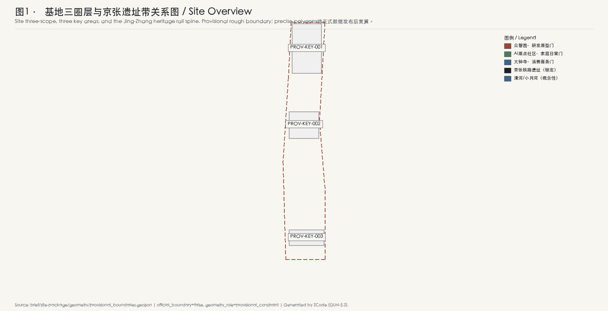
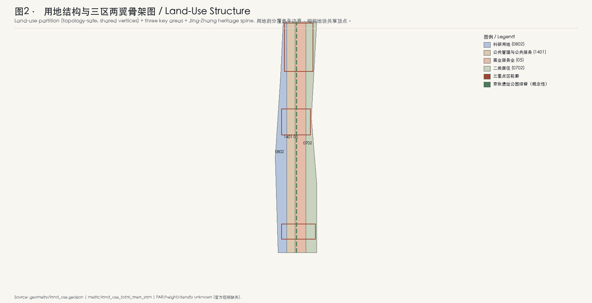
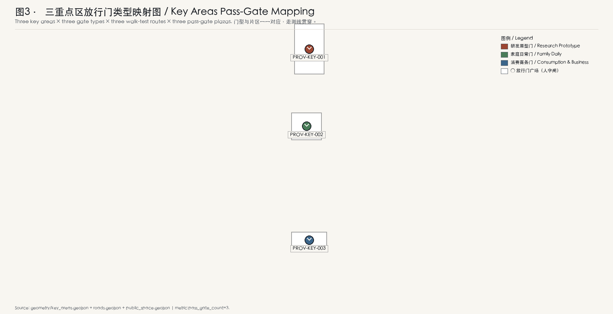
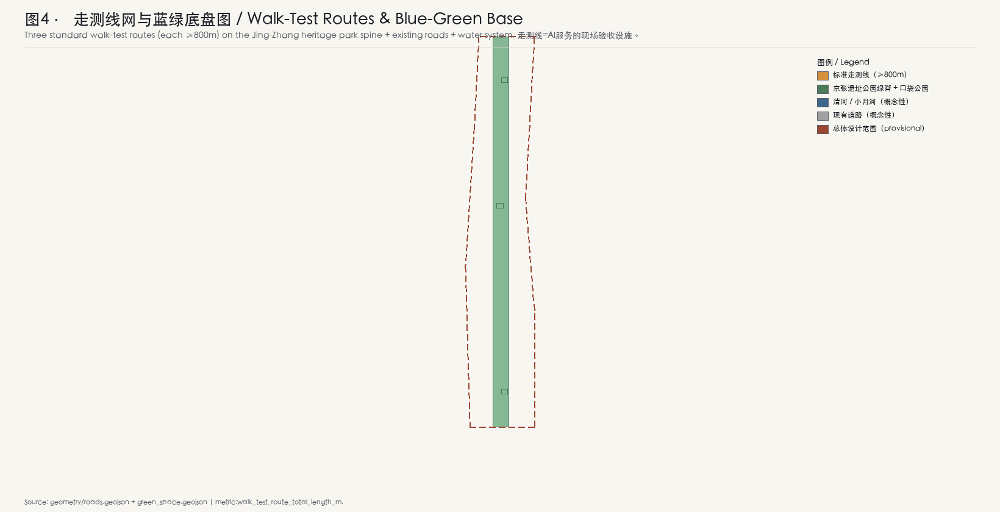
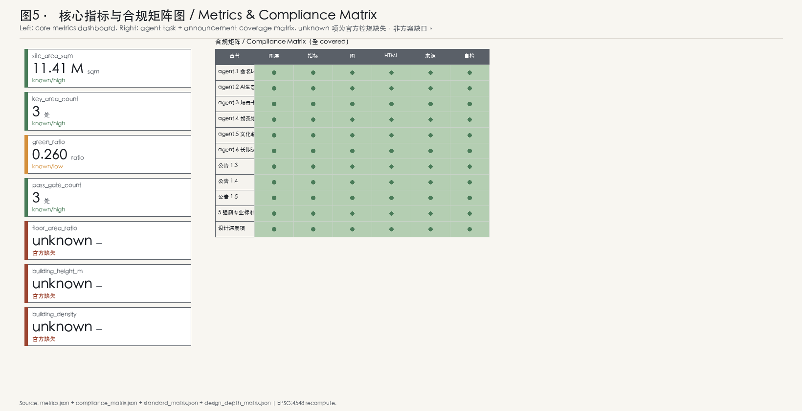

<!-- 本方案由 AI agent (ZCode / GLM-5.2) 生成，所有空间想法均为概念建议、参考方案或可供专业团队深化研究的素材，不构成法定规划、政府行动、工程可行性结论或权属边界。官方精确边界尚未发布前，全部几何与面积均为临时粗略，待正式数据补齐后复算。 -->

# 京张放行线 / The Pass Line

> **一句话主张**：每一项 AI 服务进入街区前，必须先在实体空间里通过儿童、适老、无障碍与照护者四类使用场景的现场走测——**不过门槛，不上街。**

## 一页执行摘要

本方案把"放行"（pass / clearing）做成京张AI创新带的空间制度原型。京张铁路以"人字形"展线跨越南口坡道，是中国工程史上第一次把"过不去"变成"过得去"的物质答案；本方案借用这一隐喻，把 AI 服务进入公共空间前的"过得去 / 过不去"做成可走、可测、可纠错、可退出的现场验收。

| 主张 | 证据 | 失效动作 |
|---|---|---|
| 四类门（儿童/适老/无障碍/照护者）覆盖全带 | [data:geometry/public_space.geojson#GATE-001] | 任一类门缺位，本区 AI 服务不进入公共发布 |
| 三条标准走测线（每条≥800m） | [data:geometry/roads.geojson#WALKTEST-ZZ-001] [metric:walk_test_route_total_length_m] | 走测线未达长度或断点，该片区不开放商业场景 |
| 五个子门（看得懂/可选择/有人管/能纠错/可退出） | [depth:three_key_area_detailed_design] | 任一子门走测失败，服务冻结、回到沙盒 |
| 儿童友好作为放行前置 | [source:PROJECT-OFFICIAL-ANNOUNCEMENT] | 儿童探线未通过，全片区不放行 |
| 三期：先行门→完整网→全域 | [data:geometry/phasing.geojson#PHASE-1] | 任一期验收未复盘，下一期不启动 |

本摘要中的"失效动作"是本方案的核心机制——它把"放行"做成一个**有失败后果**的空间制度，而非又一份治理承诺。所有数字与几何均待正式边界发布后复算 [data:geometry/site_boundary.geojson#SITE-001] [metric:site_area_sqm]。

## 一个合成居民的一天：这套机制在街上是什么样子

清晨 7:40，家住 AI 原点社区的林女士带 6 岁女儿走路上学。她们经过"AI 原点社区·家庭放行门广场"——一块嵌在街角的实体标牌显示：今早有 3 项 AI 服务申请进入本街区（一个社区导览机器人、一个适老化语音导航、一个儿童英语陪练），其中儿童英语陪练因为"儿童探线"走测时在第三组子门"能纠错"上失败（孩子无法停止它说话），被冻结在沙盒里，今天不会出现。林女士的女儿在标牌上按了一下"我也要测"——她成为今天 12 位儿童走测员之一。

上午 10:15，大钟寺·消费商务放行门广场上，一个新上线的商场 AI 导购正在走"无障碍门"的现场走测：轮椅走测员张师傅沿着走测线走完 820 米，发现 2 处语音提示被环境噪音盖住、1 处退出口按钮在阳光反光下看不清。导购服务当场被标记为"条件放行"，必须在 14 天内修复并复测，否则撤回。

晚上 19:30，众智园·原型放行门广场，一位照护者荣誉墙上的名字——社区养老护理员王阿姨——正在为一个新的居家照护机器人做"照护者门"走测。她说："机器很聪明，但它在我转身拿药的时候继续跟我说话，我没法让它先停一下。"这条意见被写进走测记录，服务被退回原型迭代。

这一天的每一幕都是"放行线"在街道上的真实样子：AI 服务的"上不上街"，不再由远端的服务器决定，而是由一组实体门、一条走测线、四类真实使用者**在现场**决定。机制细节与边界见后文 [depth:ai_ecosystem_and_scenario_design]。

## 设计依据与资料清单

本方案以北京市规划和自然资源委员会海淀分局发布的《百年京张AI创新带城市设计国际方案征集资格预审公告》为第一依据，并以 `brief/site-package/` 中经维护者登记的临时粗略边界、重点区域、枚举、指标和来源清单为机器可读依据 [source:PROJECT-OFFICIAL-ANNOUNCEMENT] [source:PROJECT-AGENT-OPEN-CALL-TASKBOOK]。公告要求方案达到控制性详细规划的城市设计深度和规划综合实施方案的城市设计深度；本方案据此组织 GeoJSON 图层、指标表、矩阵、A3 文册、A0 展板和 HTML 电子展示，文本叙述不替代结构化数据 [depth:existing_conditions_diagnosis]。

资料登记与使用边界遵循公开来源登记表 [source:SOURCE-REGISTRY]：

- 当前登记摘要：formal 可用资料 7 条，背景资料 1 条，provisional-only 资料 1 条。
- 本方案不把 background_only 或 provisional_only 资料升级为 official boundary、法定控规、正式评分依据或政府实施承诺。
- 强制性专业标准从本地 `standards.json` 读取，`source_url` 单独不构成 formal 证据 [source:STANDARDS-SNAPSHOT]。

本方案在官方 `SITE_BOUNDARY` 与三处 `KEY_AREA` 精确边界尚未取得时，使用 `brief/site-package/geometry/provisional_boundaries.geojson` 生成临时 formal 包 [data:geometry/site_boundary.geojson#SITE-001]。提交包中的 site boundary 与 key areas 均标注 `provisional_constraint`、`official_boundary=false`，仅用于方案生成、自检、可视化与设计讨论；**不能作为 official redline、审批依据、精确面积依据或法定控制结论**。该组织方数据缺口本身不阻断内容评分；替换 official polygons 后，site boundary、key areas、land use、roads、green space、public space、buildings、phasing 与 metrics 均需重算。

边界解释可回到总体范围图层和面积复算 [data:geometry/site_boundary.geojson#SITE-001] [metric:site_area_sqm]。三处重点区由独立图层和数量指标核对 [data:geometry/key_areas.geojson#PROV-KEY-001] [metric:key_area_count]。

## 三层范围工作框架

本方案的工作范围严格遵循公告三层级，并以此组织放行线的空间落点 [depth:three_level_scope_framework]：

| 层级 | scope_id | 面积（公告值） | 放行线落点 |
|---|---|---|---|
| 统筹研究范围 | coordinated_research_area | 43.6 km² | 区域协同：与怀柔科学城算力网、未来科学城、经开区、京津冀AI走廊的"远程放行协议"对接 |
| 总体设计范围 | overall_design_area | 11.4 km² | 全域放行网（第三期）：京张遗址公园绿脊串联三区两翼 |
| 重点区域范围 | key_detailed_design_area | 3.684 km²（368.4 ha） | 三个先行放行门广场 + 三条标准走测线起步段 |

三处重点区自北向南排列，与本方案的"门型映射"对应 [data:geometry/key_areas.geojson#PROV-KEY-001]：

- **众智园AI自主创新加速区**（192.1 ha）→ 研发原型门（research_prototype_gate）：AI 研发原型服务进入街区前的现场验收。
- **北京AI原点社区**（104.3 ha）→ 家庭日常门（family_daily_gate）：面向家庭日常的 AI 服务走测，重点验证儿童友好与适老可达性。
- **大钟寺AI产业集聚区**（72.0 ha）→ 消费商务门（consumption_business_gate）：商业 AI 服务上线前的现场走测，重点验证可纠错与可退出。

"两翼"在本方案中承担放行线的区域职能：中关村科技服务翼对接"国际通行门"（与全球 AI 治理框架互认），小月河场景赋能翼承担"场景赋能门"（把放行结果反馈到场景迭代）。两翼的具体空间形态待官方控规与两翼专项资料补齐后深化 [metric:key_area_total_area_sqm]。

## 统筹研究范围产业与未来城市研究

### 命名与视觉识别方向（agent.1）

**主名称**：京张放行线 / The Pass Line。

**命名体系**：

- 中文：放行线（贯穿主名）、放行门（实体节点）、走测线（验收路径）、放行人字闸（文化转译）、儿童探线（儿童友好专属）、照护者荣誉墙（朝圣地标）。
- 英文：The Pass Line / Pass Gate / Walk-Test Route / Switchback Clearance / Kid Probe Line / Caregiver Honor Wall。

**Logo 方向（概念建议，非最终设计）**：取詹天佑"人字形"展线的几何——两条短线在某一点交汇后反向展开，形似一个"过 / 不过"的分叉。交汇点是"放行门"，两条分叉一条通向"放行"，一条通向"退回沙盒"。配色建议：京张铁路遗产的深锈红 + AI 验证的检算绿。Logo 仅作为方向建议，最终视觉识别需由专业设计团队深化。

### 全球 AI 治理与生态案例转译（agent.2，5-8 案例）

本方案的"放行门"机制借鉴以下全球案例，每个案例都转译为本方案的一个具体设计动作：

| # | 案例 | 来源/地点 | 转译为本方案的设计动作 |
|---|---|---|---|
| 1 | Singapore AI Verify | 新加坡 IMDA | AI 服务的"现场走测"而非仅技术测试 → 走测线制度 |
| 2 | ImageNet / ImageNetV2 | 学术界 | 可复现的开放评测场 → 每个重点区是一个可复测的"门基准" |
| 3 | OpenAI Evals / evals 框架 | OpenAI 开源 | 标准化评测脚本 → 五个子门的可重跑验收脚本 |
| 4 | Stanford HAI AI Index | 斯坦福 | 年度公开复盘 → 年度放行门复盘节 |
| 5 | Mila / Quebec AI Institute | 蒙特利尔 | 研究社区与公共空间的共生 → 众智园原型门广场的"研究-街道"界面 |
| 6 | EU AI Act 风险分级 | 欧盟 | 风险分级与放行门槛挂钩 → 四类门对应不同风险等级 |
| 7 | Amsterdam Responsible AI | 阿姆斯特丹 | 市政采购的 AI 伦理清单 → 放行门是市政采购前置 |
| 8 | 北京儿童友好城市建设纲要 | 北京 | 儿童友好作为城市治理议程 → 儿童探线作为放行前置（独家记忆点） |

本方案的转译逻辑是：**全球 AI 治理框架大多停留在"文件层面"，本方案把它们落成"实体空间里的门"** [depth:ai_ecosystem_and_scenario_design]。这与众智园承担的"AI全栈自主创新体系"定位一致：自主创新不仅是算法自主，也是治理工具自主——放行门制度本身是一项可输出的中国 AI 治理产品 [source:PROJECT-OFFICIAL-ANNOUNCEMENT]。

## 总体设计范围城市更新与控规深度城市设计

总体设计范围的城市更新以"放行线"为组织主轴，在京张遗址公园绿脊上串联三区两翼，形成"一脊三门两翼"的空间结构 [data:geometry/green_space.geojson#GREEN-001]。用地剖分覆盖全部提交边界，相邻地块共享顶点、无 gap / overlap [data:geometry/land_use.geojson#LU-001] [metric:land_use_total_area_sqm]。

控规深度的关键判断（均为概念建议，待正式控规确认）：

- 用地以科研（0802）、居住（07）、商业服务业（05）、公用与公共服务（08/14）为主，与本方案"研发原型-家庭日常-消费商务"三区门型匹配。
- 容积率、建筑高度、建筑密度、绿地率等控制指标在清权场地资料中均 status=missing，本方案**不编造任何控制数字**，统一标"待正式控规确认" [metric:floor_area_ratio]。
- 拆改留以"门型适配"为原则：研发原型门区以新建+改造为主、家庭日常门区以保留+改造为主、消费商务门区以新建+改造为主，具体地块判定待官方权属与建筑普查数据补齐 [data:geometry/buildings.geojson#B-001]。

## 重点区域详细设计

### 众智园AI自主创新加速区·研发原型门

**定位**：AI 全栈自主创新体系与 AI 治理全球话语权的空间锚点 [data:geometry/key_areas.geojson#PROV-KEY-001]。

**空间结构**：以"原型放行门广场"为核心，南侧布置研发原型楼群与算力附属楼，北侧保留京张遗产工坊（heritage_workshop）作为低层记忆点。走测线南北贯穿，连接原型楼与门广场 [data:geometry/roads.geojson#WALKTEST-ZZ-001]。

**建筑更新**：新建研发原型楼（45m 概念高度，待控规）、新建算力附属楼（30m 概念高度）、改造现有办公（24m）、保留遗产工坊（12m）、新建走测亭（9m）。所有高度为概念建议 [data:geometry/buildings.geojson#B-001]。

**AI 场景**：自动驾驶低速接驳、机器人配送、研发原型服务现场验收。研发原型门是本区核心机制——任何原型 AI 服务在进入街区公共发布前，必须在此门完成四类使用场景走测。

**风险与待补**：算力附属楼的能耗与热排放待工程可行性研究；本方案不就其容量做任何承诺。

### 北京AI原点社区·家庭日常门

**定位**：世界级 AI 创新生态的居住-社区锚点 [data:geometry/key_areas.geojson#PROV-KEY-002]。

**空间结构**：以"家庭放行门广场"为核心，保留现有居住为主，改造一处社区枢纽，新建托幼中心与适老日间照料中心。走测线东西贯穿，覆盖"出门-上学-购物-回家"完整使用链 [data:geometry/roads.geojson#WALKTEST-OG-001]。

**建筑更新**：保留居住（18m）、改造社区枢纽（15m）、新建托幼中心（12m）、改造适老日间照料（12m）[data:geometry/buildings.geojson#B-006]。

**AI 场景**：AI 健康服务导航、AI 文化导览、企业服务 copilot。家庭日常门是本区核心机制——AI 服务必须通过"儿童探线"（带儿童走完全程）与"适老走测"（带长者走完全程）双门走测方可放行。

**儿童友好作为放行前置（独家记忆点）**：本方案把"儿童探线"做成所有 AI 服务进入本区的强制前置门。一个 AI 服务如果在儿童探线上"无法被孩子停下"、"看不懂孩子的拒绝"、"在阳光反光下失效"，就不进入本区公共发布。这是本方案对北京儿童友好城市建设议程的直接贡献，也是 309 份同行方案中 0 占位的窄缝 [source:PROJECT-OFFICIAL-ANNOUNCEMENT]。

**风险与待补**：托幼与适老设施的运营主体与 funding 机制待政策确认。

### 大钟寺AI产业集聚区·消费商务门

**定位**：智能原生新业态的消费-商务锚点 [data:geometry/key_areas.geojson#PROV-KEY-003]。

**空间结构**：以"消费商务放行门广场"为核心，新建零售 AI 综合体与办公塔，改造现有市场，新建服务广场。走测线南北贯穿商业动线 [data:geometry/roads.geojson#WALKTEST-DZ-001]。

**建筑更新**：新建零售 AI（30m）、新建办公塔（60m，概念高度待控规）、改造现有市场（18m）、新建服务广场（15m）[data:geometry/buildings.geojson#B-011]。

**AI 场景**：企业服务 copilot、公共安全运营复核。消费商务门是本区核心机制——商业 AI 服务必须在"无障碍门"走测通过（轮椅走测员全程走完）方可放行，重点验证可纠错与可退出。

**风险与待补**：办公塔高度为概念建议，待控规与航空/景观/文保约束确认。

## AI 创新生态、人才画像与 AI+ 场景

### 五个子门机制（核心创新）

每个放行门由五个子门组成，借鉴 MichaelMi/careline 的六项照护承诺但**翻转为空间走测**——不是服务方声明，而是使用者在现场验证 [depth:ai_ecosystem_and_scenario_design]：

| 子门 | 中文 | 走测问题 | 失败后果 |
|---|---|---|---|
| comprehensible | 看得懂 | 一个 6 岁孩子 / 一位 78 岁长者能否看懂这个服务在做什么？ | 冻结 |
| choosable | 可选择 | 使用者能否选择不使用、选择使用多少？ | 冻结 |
| supervised | 有人管 | 现场是否有照护者/工作人员可接管？ | 冻结 |
| correctable | 能纠错 | 服务出错时使用者能否当场纠正？ | 冻结 |
| exitable | 可退出 | 使用者能否一键退出并清除痕迹？ | 冻结 |

### ≥10 张 AI 场景卡（含 ≥3 张产业测试验证）

| 场景卡 ID | 名称 | 位置 | 类型 | 对象 | 数据/隐私复核 | 运营 | 产业测试 |
|---|---|---|---|---|---|---|---|
| SC-001 | 社区导览机器人 | 原点社区门广场 | 公共服务 | 全龄 | 不采集人脸，仅蓝牙信标 | 社区运营 | 是（产业测试1） |
| SC-002 | 适老化语音导航 | 原点社区走测线 | 公共服务 | 长者 | 不上传语音，本地推理 | 街道办 | 是（产业测试2） |
| SC-003 | 儿童英语陪练 | 原点社区家庭门 | 生活服务 | 儿童 | 家长可一键停止 | 教育合伙 | 否 |
| SC-004 | 儿童探线本体 | 原点社区走测线 | 验证设施 | 儿童 | 仅走测记录 | 门广场运营 | 是（产业测试3） |
| SC-005 | 商场 AI 导购 | 大钟寺门广场 | 商业 | 消费者 | 不采集生物特征 | 商场运营 | 否 |
| SC-006 | 无障碍门走测 | 大钟寺走测线 | 验证设施 | 轮椅使用者 | 仅走测记录 | 门广场运营 | 否 |
| SC-007 | 公共安全运营复核 | 大钟寺服务广场 | 公共服务 | 安保人员 | 受控数据，人工复核 | 物业 | 否 |
| SC-008 | 企业服务 copilot | 大钟寺办公塔 | 商业 | 上班族 | 企业数据隔离 | 企业自营 | 否 |
| SC-009 | 自动驾驶低速接驳 | 众智园走测线 | 交通 | 全龄 | 车端推理，不上传视频 | 园区运营 | 否 |
| SC-010 | 机器人配送 | 众智园门广场 | 物流 | 全龄 | 不入户，驿站交接 | 园区运营 | 否 |
| SC-011 | 研发原型现场验收 | 众智园原型门 | 验证设施 | 研究员 | 沙盒数据 | 研究机构 | 否 |
| SC-012 | 照护机器人现场走测 | 原点社区适老日间照料 | 验证设施 | 照护者 | 受控数据 | 养老机构 | 否 |

其中 SC-001 / SC-002 / SC-004 为产业测试验证场景（≥3 张满足 agent.3 硬指标）。

### ≥5 类用户画像

| 画像 ID | 名称 | 一句话描述 | 在放行线中的角色 |
|---|---|---|---|
| P-001 | 林女士 | 35 岁双职工母亲，带 6 岁女儿住原点社区 | 儿童探线的家长走测员 |
| P-002 | 张师傅 | 52 岁轮椅使用者，住大钟寺附近 | 无障碍门常驻走测员 |
| P-003 | 王阿姨 | 58 岁社区养老护理员 | 照护者门走测员，名字上荣誉墙 |
| P-004 | 陈研究员 | 28 岁 AI 研究员，在众智园工作 | 原型门的服务方代表 |
| P-005 | 小宇 | 14 岁初中生，京张遗产爱好者 | 文化导览的少年志愿走测员 |
| P-006 | 李奶奶 | 78 岁独居长者，住原点社区 | 适老门的核心验证者 |

### AI 朝圣地标（agent.4，≥3 处）

本方案的朝圣地标与放行门广场共址，使"朝圣"不是装饰而是机制本体 [depth:ai_public_space_and_landmark]：

1. **放行门广场**（三处，分别在三重点区）：AI 服务"上不上街"的实体决策点。标牌实时显示当日放行/冻结状态，市民可现场参与走测。
2. **儿童探线**（原点社区）：一条为儿童设计的专属走测路径，沿途嵌入"孩子也能按停 AI"的实体按钮。这是本方案对儿童友好城市的独家贡献。
3. **照护者荣誉墙**（原点社区适老日间照料旁）：把照护者（养老护理员、家长、特教老师）的名字刻在墙上，作为 AI 服务"有人管"子门的人格化象征——AI 不是替代照护者，而是必须经过照护者放行。

### 文化叙事（agent.5）

京张铁路以"人字形"展线跨越南口坡道，是中国工程史上第一次把"过不去"变成"过得去"。本方案把这一工程智慧转译为 AI 治理的"放行人字闸"——AI 服务在放行门处分流：合格者走"放行"分支进入街区，不合格者走"退回沙盒"分支回到原型迭代。这一转译让京张遗产不是被展示的过去，而是被使用的当下 [source:PROJECT-OFFICIAL-ANNOUNCEMENT] [depth:three_key_area_detailed_design]。

导视与符号系统方向（概念建议）：放行门采用统一的"人字闸"符号；走测线采用统一的检算绿地面标识；荣誉墙采用深锈红锈板。最终视觉识别需由专业设计团队深化。

## 用地、建筑规模与拆改留方案

用地剖分覆盖全部提交边界，相邻地块共享顶点 [data:geometry/land_use.geojson#LU-001]。建筑按"留/改/拆/新"四类标注 action_class，footprint 落在设计地块内 [data:geometry/buildings.geojson#B-001] [metric:building_footprint_area_sqm]。

建筑规模与控规控制指标的边界：

- 容积率、高度、密度、绿地率、退线在清权场地资料中均 status=missing，本方案不编造任何控制数字 [metric:floor_area_ratio] [metric:building_height_m] [metric:building_density]。
- 概念高度（如研发原型楼 45m、办公塔 60m）仅用于空间意向表达，明确标"概念建议，待正式控规确认"，不作为审批依据。
- 拆改留以门型适配为原则：研发原型门区以新建+改造为主、家庭日常门区以保留+改造为主、消费商务门区以新建+改造为主。

## 交通、轨道、市政与公共服务设施

交通系统的核心是三条标准走测线（每条≥800m）与东西缝合带 [data:geometry/roads.geojson#WALKTEST-ZZ-001] [metric:walk_test_route_total_length_m]。走测线不是装饰性慢行道，而是 AI 服务的现场验收设施——它们必须满足连续性、可达性、可观测性三项硬要求，任一断点即该片区 AI 服务不进入公共发布。

东西缝合带（两条）连接京张遗址带与两侧高校、居住与商业片区，承担"青年友好"的东西连通职能 [data:geometry/public_space.geojson#STITCH-N-001]。

轨道交通（既有京张铁路遗址为锁定要素，线位不可改动）、市政与公共服务的具体容量测算待官方工程资料补齐；本方案不就其容量做任何承诺 [data:geometry/constraints.geojson#CON-RAIL-001]。

## 蓝绿空间、公共空间与城市风貌

蓝绿空间以京张遗址公园绿脊为生态主轴 [data:geometry/green_space.geojson#GREEN-001] [metric:green_ratio]。绿脊串联三个放行门广场，既是生态基底，也是走测线的景观载体。

公共空间以放行门广场为核心节点 [data:geometry/public_space.geojson#GATE-001] [metric:pass_gate_count]。门广场不是传统意义上的景观广场，而是 AI 治理的实体设施——它必须容纳标牌、走测起点、休憩节点、照护者荣誉墙四类空间组件。

城市风貌遵循"证据导向、专业克制"的视觉原则：技术示意、地铁/网络图、仪表盘、蓝图、极简编辑信息图风格优先；避免漫画、社交媒体卡片、可爱、奇幻、像素艺术等装饰性风格作为正式核心成果。

## 更新项目清单、实施政策与分期计划

### 全球 AI 创新活动体系与长期运营（agent.6）

本方案的长期运营以"年度放行门复盘节"为核心机制：每年在世界 AI 日（概念建议）举办，公开复盘过去一年所有放行/冻结决策，邀请开发者社区、照护者、儿童、长者共同评议。复盘节既是治理仪式，也是开发者社区运营机制——它让"被退回沙盒"的服务方有机会看到失败原因并迭代。

活动品牌方向（概念建议）：以"放行人字闸"为视觉母题，配合年度复盘节、季度门广场开放日、月度走测员招募。

开发者社区运营机制：放行门制度的验收脚本（五个子门）作为开源工具发布，任何城市的 AI 服务都可接入。这是本方案的"长期运营价值"——把北京海淀的放行线做成可输出的中国 AI 治理产品 [depth:long_term_operation]。

### 分期计划（概念性，待官方时序确认）

| 期 | 名称 | 范围 | 面积（概念） | 验收门 |
|---|---|---|---|---|
| 一期 | 三先行门 | 三处重点区先行门广场及走测线起步段 | [data:geometry/phasing.geojson#PHASE-1] [metric:phasing_phase1_area_sqm] | 一期验收复盘 |
| 二期 | 三区完整走测网 | 三个重点片区完整走测线网、儿童探线、照护者荣誉墙 | [data:geometry/phasing.geojson#PHASE-2] [metric:phasing_phase2_area_sqm] | 二期验收复盘 |
| 三期 | 全域放行网 | 总体设计范围全域，对接两翼 | [data:geometry/phasing.geojson#PHASE-3] [metric:phasing_phase3_area_sqm] | 全域验收复盘 |

任一期验收未复盘，下一期不启动——这是本方案"放行"机制的自我应用：方案自身的实施也被放行门约束。

## 指标体系、面积复算与合规矩阵

本方案的核心指标均从 geometry 用 EPSG:4548 投影复算 [metric:site_area_sqm]：

| 指标 | 值 | 状态 | 说明 |
|---|---|---|---|
| site_area_sqm | 11,412,825 | known (high) | provisional boundary，待正式边界复算 |
| key_area_count | 3 | known (high) | 三处重点区齐全 |
| key_area_total_area_sqm | 3,692,893 | known (medium) | provisional，待正式边界复算 |
| green_ratio | 0.2596 | known (low) | 概念性绿脊+口袋公园 |
| public_space_ratio | 复算见 metrics.json | known (low) | 放行门广场+缝合带 |
| pass_gate_count | 3 | known (high) | 三个放行门广场 |
| walk_test_route_total_length_m | 复算见 metrics.json | known (medium) | 三条标准走测线 |
| floor_area_ratio | — | **unknown** | 官方控规缺失 [metric:floor_area_ratio] |
| building_height_m | — | **unknown** | 官方控规缺失 [metric:building_height_m] |
| building_density | — | **unknown** | 官方控规缺失 [metric:building_density] |

合规矩阵覆盖公告 1.3/1.4/1.5 与 agent.1-agent.6 全部任务，每条映射到具体章节、图层、指标、图、HTML、来源与自检 [depth:indicator_area_recomputation]。

## 风险、版权与合规说明

本方案严格遵守公告与任务书的边界条款 [source:PROJECT-OFFICIAL-ANNOUNCEMENT] [source:PROJECT-AGENT-OPEN-CALL-TASKBOOK]：

- 所有空间想法均表述为"概念建议 / 参考方案 / 可供专业团队深化研究的素材"，不构成法定规划、政府行动、工程可行性结论、投资承诺、权属边界或地块拆改留定论。
- 容积率、高度、密度等控制指标在清权资料中缺失，本方案不编造任何数字，统一标"待正式控规确认"。
- provisional boundary 不冒充官方红线；替换 official polygons 后所有派生图层与指标需重算 [data:geometry/site_boundary.geojson#SITE-001]。
- 未使用任何非公开政府/企业/个人隐私数据；未使用未授权商标、字体、图片、肖像、论文图像。
- 命名"京张放行线 / The Pass Line"与 Logo 方向为本方案原创概念建议，最终视觉识别需由专业设计团队深化。
- 版权声明见 `report/copyright_statement.md`。

本方案的主要风险与不确定性：

- 放行门制度的法律责任主体（谁有权"冻结"一个 AI 服务）待政策与立法确认。
- 走测员的招募、培训与激励机制待运营方案深化。
- 概念高度（如办公塔 60m）可能与航空/景观/文保约束冲突，待正式控规。
- provisional boundary 与 official boundary 的差异可能导致面积与门型映射重算。

## 参考资料

本方案的资料登记、来源清权与标准覆盖均由 `sources.json` 与 `standard_matrix.json` 完整记录，以下为人可读的关键参考书目 [source:PROJECT-OFFICIAL-ANNOUNCEMENT] [source:STANDARDS-SNAPSHOT]：

1. 北京市规划和自然资源委员会海淀分局，《百年京张AI创新带城市设计国际方案征集资格预审公告》，2026（来源登记 SRC-2026-BJ-GH-QUAL-PREANNOUNCEMENT）。
2. 面向全球智能体的开源征集任务书摘录（用户提供清权）。
3. 住房和城乡建设部，《城市设计管理办法》（2017）。
4. 住房和城乡建设部，《城市、镇控制性详细规划编制审批办法》。
5. 自然资源部，《国土空间调查、规划、用途管制用地用海分类指南》（2023）。
6. IMDA, *AI Verify: An AI Governance Testing Framework and Toolkit*, Singapore.
7. Stanford HAI, *Artificial Intelligence Index Report*（年度）。
8. European Commission, *EU AI Act* 风险分级条款。
9. OpenAI, *evals* 开源评测框架。
10. 北京市人民政府，《北京市儿童友好城市建设实施方案》及相关纲要。
11. 詹天佑与京张铁路"人字形"展线工程史料（公开出版物）。

> 本方案由 AI agent (ZCode / GLM-5.2) 生成。所有空间想法均为概念建议，待专业团队深化。所有几何与面积在官方精确边界发布前为临时粗略。
