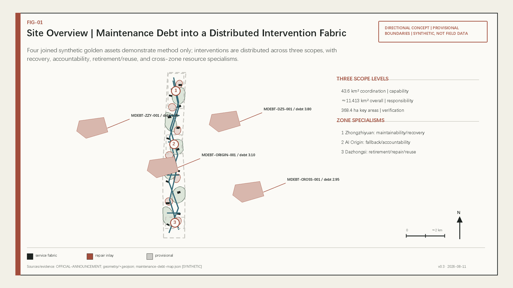
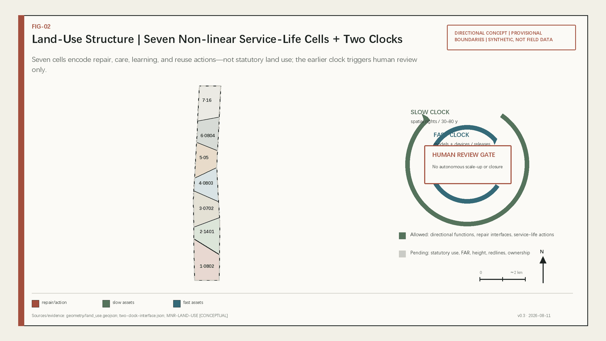
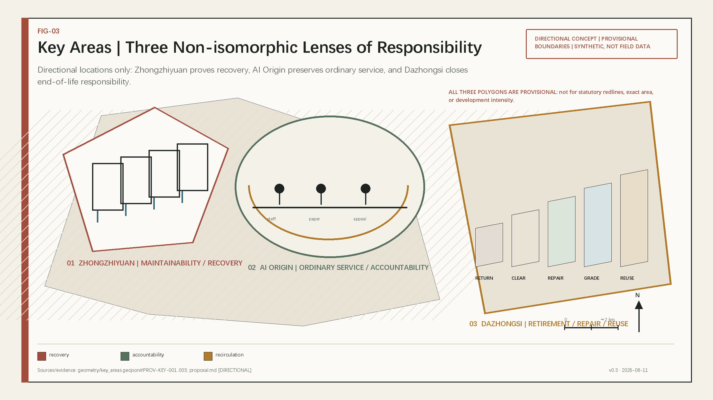
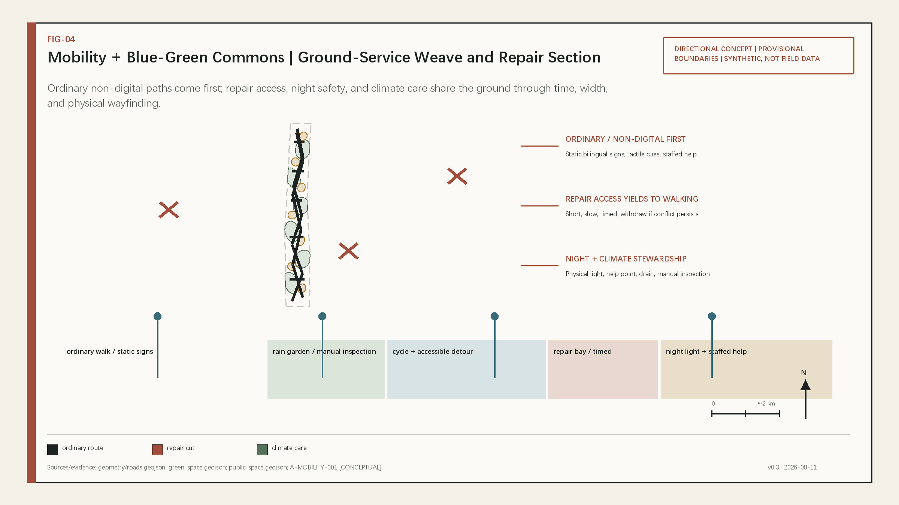
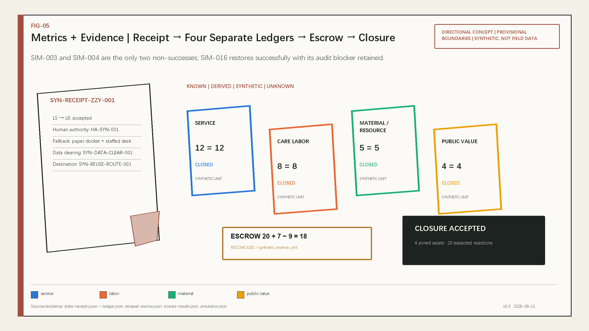

# Jingzhang Service-Life Covenant

**Public line: Launch is only the beginning.** This proposal does not explain an AI city through another rail, line, or station. It requires every model, device, building component, public-space facility, and blue-green asset entering a civic setting to issue an auditable receipt whenever its state changes, and to close four separate ledgers—service, care labor, material/resource, and public value—before continuation, replacement, or retirement. Its distinction from Hyp6666's four existing proposals is methodological only: railway, station, gateway, and release metaphors give way to a distributed responsibility network generated by maintenance debt and service gaps. It does not claim corpus supremacy, an award, or adoption.

## Design Basis and Source List

The qualification announcement controls the project name, three scope levels, three key areas, tasks, and deliverable depth. The agent-facing taskbook adds the three positionings, five functions, Three Zones and Two Wings, and agent.1–agent.6. Formal sources are separated from processed reading aids: the announcement and cleared taskbook support task claims, the central registry supports usability decisions, and processed files organize reading without becoming new authorities.[source:OFFICIAL-ANNOUNCEMENT] [source:AGENT-TASKBOOK] [source:SOURCE-REGISTRY]

No verifiable official polygons, official key-area polygons, regulatory plan, road redlines, ownership, existing-building survey, utility capacity, heritage controls, or field maintenance backlog are available. The package retains repository provisional geometry only for deterministic generation, directional design, and intake recalculation. Its approximately 11.413 km² site area, 31.1034% conceptual green ratio, and 9.0101% conceptual public-space ratio are low- or medium-confidence package-derived values, not statutory controls or observed facts.[source:BOUNDARY-SOURCE] [data:geometry/site_boundary.geojson#SITE-001] [metric:site_area_sqm]

Professional standards set three boundaries: urban design coordinates public space, architecture, and character; regulatory-plan claims must separate known facts, design recommendations, and pending inputs; and land-use codes use a consistent classification. The architecture design-depth reference lacks an official source and is therefore recorded as a data gap rather than replaced with an unofficial mirror.[standard:MOHURD-URBAN-DESIGN-MEASURES] [standard:MOHURD-CONTROL-DETAILED-PLANNING] [standard:MNR-LAND-USE-CLASSIFICATION-GUIDE]

Public attribution for this stage follows the project direction exactly: **GPT-5.6-Sol + Claude Code**. `agent.json` also states that no local OpenAI API call is claimed. Claude Code actually orchestrated prose and code in this stage, while Python 3.11.14, Shapely 2.1.2, pyproj 3.7.2, Node.js 22.22.2, and repository validators generated, recalculated, and checked the package. GitHub PRs and the corpus report were used only for originality-method review; no peer text, image, or asset was copied.[source:CORPUS-ORIGINALITY]

## Three-Level Scope Framework

The three scopes answer different questions; they are not the same drawing enlarged three times. The approximately 43.6 km² Coordinated Research Area asks where repair, testing, legal, standards, talent, spare-part, and reuse capacity comes from. The approximately 11.4 km² Overall Design Area asks how responsibility, space, and the public meet. The approximately 368.4 ha Key-Area Detailed Design Area asks how specific life stages are tested, reviewed, and exited. Announced areas are textual task references; submitted geometry remains a rough analytical constraint.[source:OFFICIAL-ANNOUNCEMENT] [depth:three_level_scope_framework] [data:geometry/key_areas.geojson#PROV-KEY-001]

| Level | Service-life theme | Main outputs | Claims that remain unavailable |
| --- | --- | --- | --- |
| Coordinated Research Area | Regional continuation-capability network | Capability types, cross-region coordination, transfer analysis of seven global cases | Firm lists, capacities, investment, logistics, and output |
| Overall Design Area | Distributed intervention network driven by maintenance debt | Land use, building prototypes, repair access, blue-green care, ordinary-service routes, two-wing review | Statutory use, intensity, height, road/rail engineering, and utility capacity |
| Key-Area Detailed Design Area | Three non-interchangeable responsibility specialties | Zhongzhiyuan durability/recovery, AI Origin civic accountability, Dazhongsi retirement/regeneration | Exact parcels, ownership, project-specific DRR, capacity, and approval |

Every spatial action uses a Two-Clock Interface. The slow clock records long-lived heritage, trees, water and soil, streets, building frames, and public rights. The fast clock records model, sensor, robot, software, compute, and replaceable-device versions. The earlier clock triggers human review; neither clock autonomously authorizes scaling or closure. Once official polygons arrive, all nine GeoJSON layers, six spatial metrics, and drawings must be recalculated together rather than patched selectively.[depth:overall_spatial_structure] [data:geometry/phasing.geojson#PHASE-001] [metric:key_area_count]

## Coordinated Research Area: Industry and Future City Research

The public concept is **Jingzhang Service-Life Covenant**, while the formal mechanism is the **Service-Life Covenant for Civic Intelligence and Spatial Assets**. The visual identity is not a rail or infinity loop but a visible “service inlay”: the base means continuous public service, the replaceable inlay means repair and upgrade, and the seam means that change must remain legible. The three positionings become a maintenance culture for the Jing-Zhang legacy, ordinary urban life that still works when AI fails, and an AI innovation culture in which every version can be repaired, withdrawn, and accounted for.[standard:PROJECT-AGENT-OPEN-CALL-TASKBOOK] [source:AGENT-TASKBOOK]

Three Zones and Two Wings is not a one-way north–south production line. Zhongzhiyuan supplies durability testing, fault injection, repair, and rollback. Beijing AI Origin Community supplies real-use review, human takeover, non-digital service, appeal, and public deliberation. Dazhongsi handles data exit, asset return, component grading, and reuse markets. The Zhongguancun Technology Services Wing reviews evidence, contracts, standards, IP, and service-life cost; the Xiaoyue River Scenario Enablement Wing reviews heat, rain, seasons, night work, accessibility, and ordinary-service pressures. Assets may loop back, pause, or retire early.[source:THREE-AREAS-TWO-WINGS] [depth:overall_spatial_structure]

The ecosystem avoids invented company lists and is organized into seven capability layers: R&D; reliability and safety; maintenance and spares; energy–compute–water resources; data exit and retirement; procurement/insurance/legal/audit; and maintenance talent and vocational learning. Land provides reversible test and service interfaces; space provides isolation and human fallback; industry provides repair and migration capability; finance only proposes a renewal-escrow research structure; talent includes maintainers as well as developers; compute and data face budgets and exit rules; and scenarios continue only when evidence supports them.[source:HAIDIAN-INDUSTRY] [depth:existing_conditions_diagnosis]

Seven official cases transfer mechanisms rather than institutions, targets, or technology stacks:

| Official case | Transferable mechanism | Jing-Zhang translation | Local-transfer limitation |
| --- | --- | --- | --- |
| Punggol Digital District, Singapore | Cross-facility platform and Living Lab | Asset-status catalogue, service levels, resource budgets | Do not copy sensor scale, savings claims, or proprietary architecture |
| Smart Kalasatama, Helsinki | Time-bounded, evaluated district pilots | Small, reversible trials with adoption or exit set in advance | Residents are not permanent experimental subjects |
| Amsterdam Circular Strategy | Value-chain approach to goods and built environment | Component passports, return interfaces, material ledger | Local material flows and recovery capacity are unknown |
| EU Digital Product Passport | Durability, repair, composition, and recycling information | Civic-asset passport fields | Not a Beijing legal obligation |
| Barcelona Sentilo | Open sensor catalogue and interoperability | Vendor-independent status interfaces | More sensing is not a substitute for public value |
| NIST AI RMF | Govern–Map–Measure–Manage | Continuous risk management and transition gates | Not a local certification or mandatory rule |
| Kashiwa-no-ha innovation field | Public–private–academic–resident co-evaluation | Service-Life Roundtable | Developer, land, and authorization structure cannot be copied |

Their shared lesson is continuous governance, but every transfer remains subject to Chinese law, actual Haidian actors, official spatial data, and real operational resources.[source:GLOBAL-PUNGGOL] [source:GLOBAL-NIST-AIRMF] [source:GLOBAL-KASHIWANOHA]

## Overall Design Area: Urban Renewal and Regulatory-Plan-Level Urban Design

The overall spatial structure is not a belt or three equal cores. It is a distributed work-order network generated by maintenance debt and service gaps. The debt logic considers overdue inspection, repair backlog, accessibility gaps, non-digital-path gaps, data-exit gaps, vendor lock-in, and material destination. The current `maintenance-debt-map.json` is only a two-node **synthetic demonstration** proving computation and references; it does not represent the field backlog.[data:visual/assets/maintenance-debt-map.json#MDEBT-ZZY-001] [metric:maintenance_backlog_count]

The Overall Design Area forms six facility types inside an ordinary-service weave. Inspection Commons registers status and review windows. Duty Commons keeps staffed and paper routes. Repair Commons supplies open interfaces and spares. Upgrade Commons runs shadow tests and rollback. Return Commons completes data clearing and material grading. Ledger Commons publishes aggregate receipts and appeals. These are not six mandatory new buildings; they may occupy existing ground floors, courtyards, service rooms, or reversible light structures, subject to ownership verification.[depth:overall_spatial_structure] [data:geometry/public_space.geojson#PUBLIC-001]

Seven conceptual land-use cells use standard codes while naming service-life actions: repair-learning research commons, renewal groves, staffed service/fallback commons, heritage and maintenance culture, circular service exchange, maintenance apprenticeship, and reversible future-use reserve. The partition covers the provisional package polygon without gaps or overlaps. That proves expression completeness, not statutory land use, surveyed conditions, or approval.[standard:MNR-LAND-USE-CLASSIFICATION-GUIDE] [data:geometry/land_use.geojson#LU-001] [depth:land_use_layout]

Regulatory-plan-level expression is organized into known, derived, and unknown columns. Package geometry can derive site, green, public-space, and conceptual footprint values; the announcement supplies textual scope and key-area figures; FAR, height, density, road redlines, rail engineering, utilities, ownership, and parcel-specific retain–renovate–demolish decisions remain unknown. This structure enables professional continuation but is not a completed statutory plan.[standard:MOHURD-CONTROL-DETAILED-PLANNING] [depth:development_intensity_controls]

Four golden asset lines run the same covenant from failure to closing balance:

1. **Accessible/no-phone civic service**: model or account failure → staffed desk and paper process → repair and recertification → service compensation and inclusion record.
2. **Night lighting and maintenance safety**: device failure → physical safety-light baseline → technician repair → labor time, safety, and training ledger.
3. **Blue-green asset sensing**: sensor drift → manual inspection → recalibration or retirement → separate water/soil, component, and comfort settlement.
4. **Robot docking and charging interface**: version incompatibility → safe stop and substitute unit → module replacement/rollback → old-component data clearing and reuse grading.

Each line requires a state receipt, human veto, repair-right review, renewal-escrow reconciliation, and four distinct ledgers. “Replacement succeeded” cannot close the old asset's exit obligation.[data:visual/assets/state-receipts.json#SYN-RECEIPT-ZZY-001] [data:visual/assets/closing-balance.json#SYN-CLOSING-ZZY-001]

## Detailed Design of Key Areas

The three provisional key-area polygons support directional placement only. They are not interchangeable AI showcases but three responsibility specialties in the same service life. Swapping them would break the evidence chain: Zhongzhiyuan would lose recovery testing, AI Origin would lose public-rights review, and Dazhongsi would lose responsible end-of-life destinations.[data:geometry/key_areas.geojson#PROV-KEY-001] [depth:three_key_area_detailed_design]

### Zhongzhiyuan: Durability and Recovery Foundry

Its role is to move from “can run” to “can be diagnosed, safely stopped, repaired, and rolled back.” Spatial prototypes include an isolated fault yard, visible repair window, module-replacement bench, low-resource/cold-standby unit, and night-maintainer room. Buildings are described through openable service layers, visible utilities, standard inspection ports, and reversible plug-ins; no existing building is selected for demolition or alteration. Primary tests cover release–rollback–recovery, embodied-AI maintainability, and task-level energy budgets. Tests must remain isolated from real public services.[data:geometry/buildings.geojson#BLDG-001] [source:AGENT-TASKBOOK]

### Beijing AI Origin Community: Civic Care and Accountability Commons

Its role is to move from “people use it” to “people can question, refuse, appeal, and still receive ordinary service.” Spatial prototypes include the Civic Ledger Court, No-AI Service Desk, Version Review Room, Quiet Human-Help Corner, and campus–community maintenance classroom. AI cannot become a gate for basic eligibility, and residents cannot become indefinite training data. When an upgrade fails, staffed and static routes continue before revision or exit is decided.[standard:BARRIER-FREE-ENVIRONMENT-LAW] [data:geometry/public_space.geojson#PUBLIC-002]

### Dazhongsi: Return, Repair, and Reuse Exchange

Its role is to replace “sale ends responsibility” with return, data clearing, repair, grading, recirculation, or responsible disposal. Spatial prototypes include the Return Commons, quarantine inspection table, repair market, spare-parts library, regenerative sample court, and paper-receipt desk. Devices, robot modules, and reversible shop fittings cannot re-enter circulation until data clearing, quality responsibility, and material destination close. Logistics, fire safety, ownership, and market capacity remain subject to professional verification.[data:geometry/key_areas.geojson#PROV-KEY-003] [depth:retain_renovate_demolish]

## AI Innovation Ecosystem, Personas, and AI+ Scenarios

Eight personas are design assumptions rather than survey statistics: an older resident without a smartphone; a wheelchair user or person with sensory disability; an AI start-up developer; a district or civic-service operator; a repair technician or vocational learner; a night cleaner, guard, or courier; a Dazhongsi merchant or property manager; and students, families, and international visitors. Each maps a digital route, non-digital alternative, human review, and labor or accessibility boundary. Real needs and completion rates require consented field research.[standard:ELDERLY-SMART-TECH-PLAN-2020-45] [depth:existing_conditions_diagnosis]

| ID | Scenario card | Space and users | Minimum data | Human review, fallback, and exit |
| --- | --- | --- | --- | --- |
| SC-01 | Civic Asset Health Book | Inspection commons; operators, residents, maintainers | Asset state, no face or personal trajectory | Manual inspection confirms; disable automated judgment when unexplained |
| SC-02 | Preventive Service Booking | Districts and communities; merchants, property, residents | Device logs and aggregate windows | Operator approves; no work without replacement service |
| SC-03 | Dual-Route Duty Service | AI Origin; no-phone, older, disabled users | Service request only | Staff, paper, static wayfinding; pause AI if fallback fails |
| SC-04 ★ | Urban Recovery Drill | Isolated Zhongzhiyuan yard; developers and operations | Synthetic faults | Safety officer may stop; exit if real service is affected |
| SC-05 ★ | Model Upgrade and Rollback Sandbox | Zhongzhiyuan plus limited AI Origin review | Synthetic/cleared test sets | Version panel reviews; no release without credible rollback |
| SC-06 ★ | Robot Maintainability Bench | Zhongzhiyuan; firms, technicians, students | Device and task state | Technician + safety officer; retire prototype if safe stop fails |
| SC-07 ★ | Energy–Compute–Water Sandbox | Zhongzhiyuan plus Xiaoyue River wing | System-level aggregates | Engineer reviews; throttle, degrade, or stop on budget breach |
| SC-08 | Part Passport and Spare Commons | Repair Commons; maintainers and learners | Interfaces, manuals, licenses | Missing legal spares/manuals trigger replacement or retirement review |
| SC-09 | Trusted Data-Clearing Room | Dazhongsi; residents, firms, institutions | Minimum retention and clearing evidence | Authorized review; no recirculation without proof |
| SC-10 | Return Commons Grading Table | Dazhongsi; merchants, recoverers, public | Destination and material information | Reuse only with responsibility; quarantine unknown destination |
| SC-11 | Night Maintainer Support | Three zones and service weave; night workers | Necessary safety events | No performance tracking; withdraw if labor burden rises |
| SC-12 | Public Return and Appeal Ledger | Ledger Commons; everyone | Aggregate service and minimized complaint record | Independent review and offline appeal; repurchase or exit if public benefit stays unproven |

The four ★ industry tests cover release/recovery, embodied repair, and resource budgets. T-01 tests isolation, rollback, and ordinary-service continuity. T-02 tests robot diagnosis, module replacement, and safe stop. T-03 tests task-level energy budgets and low-resource modes. T-04 tests data export, deletion evidence, grading, and reuse responsibility. Success does not prove city-scale maturity; failure, rejection, pause, and retirement are valid outcomes.[source:AGENT-TASKBOOK] [data:simulation.json#SIM-003] [metric:simulation_success_rate]

The sixteen synthetic tasks deliberately retain two non-success outcomes: SIM-003 is schema-rejected and SIM-004 stops as `energy_budget_exceeded`. SIM-016 is an operational success with an audit blocker retained: restoration succeeds while the incomplete audit attachment remains visible. The 0.875 success rate, 0.9375 schema-pass rate, one energy violation, and 0.9375 audit completeness are recomputable. They prove that rules reject bad inputs and expose gaps, not that a field system works.[metric:tool_schema_pass_rate] [metric:energy_budget_violations] [metric:audit_completeness]

## Land Use, Building Scale, and Retain-Renovate-Demolish Strategy

`land_use.geojson` is a conceptual service-life partition, not a condition survey or statutory plan. Seven cells use codes 0802, 1401, 0702, 0803, 05, 0804, and 16 to express research, green space, public service, culture, commercial service, education, and reserve uses while recording service-life horizons and maintenance-debt strategies. Package topology proves deterministic reconstruction without gaps or overlaps, not official land-use approval.[standard:MNR-LAND-USE-CLASSIFICATION-GUIDE] [data:geometry/land_use.geojson#LU-001]

Fourteen footprints are repairable building prototypes: shared inspection faces, replaceable service layers, common interfaces, low-disturbance ground floors, demountable canopies, and maintenance-learning spaces. Their 243,456 m² conceptual footprint is derived from agent-generated geometry. Without a building survey, ownership, and official controls, it cannot imply gross floor area, FAR, height, coverage, or authorized scale.[data:geometry/buildings.geojson#BLDG-001] [metric:building_footprint_area_sqm] [depth:height_massing_character]

The DRR method is “verify before classify”: verify ownership, age, structure, heritage, and use; identify irreversible effects on slow assets; test repairability and open interfaces; compare retention, light retrofit, reversible addition, and exit; then form parcel recommendations. Today the proposal only prioritizes serviceable frames, light accessibility/maintenance improvements, and avoidance of unsupported demolition. Every project-specific object remains pending professional confirmation.[standard:MOHURD-URBAN-DESIGN-MEASURES] [depth:retain_renovate_demolish]

Renewal escrow assigns maintenance, migration, and retirement responsibility at procurement or deployment. Release depends on inspection, repair, data export, open interfaces, material destination, and the four-ledger closing balance. The package example uses `synthetic_reserve_unit`; it is not currency, a real fund, or a government commitment. Ratio, custodian, accounting, and legal form remain unknown.[data:visual/assets/renewal-escrow.json#SYN-ESCROW-ZZY-001] [metric:renewal_escrow_balance]

## Transport, Rail, Municipal Infrastructure, and Public Services

The transport strategy is “ordinary routes first, repair access alongside.” Greenway, cycle, pedestrian, local-maintenance, and transit-connection lines in `roads.geojson` only express conceptual relationships: continuous walking/cycling, accessible detours, night lighting, short-term repair access, and alternate routes during isolation. They do not propose road redlines, cross-sections, bridges, tunnels, or station engineering.[data:geometry/roads.geojson#ROAD-001] [depth:traffic_rail_slow_parking]

Rail stations are background interchange conditions, not the master metaphor. The priority is to keep Dazhongsi's four quadrants, campus–district links, and north–south/east–west Heritage Park movement understandable when AI, networks, or events are offline, through static bilingual wayfinding, tactile/high-contrast information, and staffed help. Actual discontinuities, slopes, crossings, parking, and bicycle supply require field and transport studies.[standard:BARRIER-FREE-ENVIRONMENT-LAW] [depth:traffic_rail_slow_parking]

Municipal and new infrastructure follows layered fail-safe logic: physical safety and conventional utilities do not depend on one model; edge/local read-only modes provide digital degradation; staff and paper work orders provide non-digital fallback; and energy, compute, water, and materials have separate budgets rather than one green score. Electricity, cooling, water, drainage, telecom, fire, and compute capacities remain unknown until P0 professional inputs are obtained.[source:SOURCE-REGISTRY] [depth:municipal_new_infrastructure]

Public-service facilities include staffed desks, quiet human-help corners, repair tools and spare cabinets, substitute-device pools, issue intake, version explanation, data-clearing intake, and night-worker rest/support. These are service obligations before they are spatial components. Automation cannot remove staffed handling and proxy assistance for essential T1 services.[standard:ELDERLY-SMART-TECH-PLAN-2020-45] [data:visual/assets/service-levels.json#SYN-SLO-ZZY-001]

## Blue-Green Network, Public Space, and Urban Character

The blue-green system is not a static ecological layer but a slow asset requiring inspection, seasonal care, human verification, and recovery budgets. Six conceptual renewal groves and seven civic-service courts form distributed climate-care and help interfaces inside the package. River blue lines, flood conditions, water quality, trees, and soil are unavailable, so no flood-control or ecological-performance conclusion is made.[data:geometry/green_space.geojson#GREEN-001] [metric:green_ratio] [depth:blue_green_public_space]

Public space uses nine Visible Stewardship components: status lantern, openable service bench, No-AI wayfinding, repair-cart bay, spare cabinet, incident notice board, reversible canopy, quiet human-help corner, and component-passport plate. Each separates public and service sides and preserves physical text and staffed contact. Dimensions, structure, fire, accessibility, and heritage conditions require professional development.[standard:MOHURD-URBAN-DESIGN-MEASURES] [metric:public_space_ratio]

Four landmarks/honor interfaces avoid giant screens and commercial logo walls:

- **Open Service Room**: safely observes inspection, shutdown, repair, and recovery while honoring backstage labor;
- **Civic Service-Life Ledger Court**: combines aggregate status, staffed appeal, version explanation, and No-AI service;
- **Return Commons**: makes data clearing, dismantling, grading, reuse, and responsible disposal visible;
- **Pause Clock and Maintainers' Roll**: records pauses, recoveries, retirements, and verified contributions by problem-reporting residents, maintainers, accessibility testers, and night duty staff.

Any placement remains subject to heritage, park, transport, and safety review, and uses no unauthorized portrait, mark, or corporate identity.[source:AGENT-TASKBOOK] [depth:height_massing_character]

The cultural narrative shifts the centennial Jing-Zhang story from speed and one-time completion to inspection, duty, operating logs, public safety, and intergenerational repair. It extends Zhongguancun innovation culture from first versions and launches to reproducibility, repairability, migration, and responsible exit. AI culture is judged through failure etiquette, resource restraint, human authority, and public-value closing balance. Invention deserves remembrance; care does too.[source:OFFICIAL-ANNOUNCEMENT] [source:HAIDIAN-INDUSTRY]

## Renewal Projects, Implementation Policy, and Phasing

Projects are organized by P0–P3 and cost classes C0–C3. C0 covers ledgers, RACI, clauses, training, and static wayfinding. C1 covers reversible signs, repair carts, spare cabinets, and substitute terminals. C2 covers return/repair facilities, edge nodes, metering, and test space. C3 covers structural, municipal, energy/water, and major public-space works and cannot be discussed as committed until official data, specialist studies, approvals, and investment decisions exist.[data:geometry/phasing.geojson#PHASE-001] [depth:phasing_implementation]

| Phase | Project bundle and cost | Actors | KPI/receipt | Entry, stop, and exit |
| --- | --- | --- | --- | --- |
| P0 Evidence Baseline | Official-data list, real-asset inventory method, 8–12 dossiers, role/veto matrix; C0 | Public-asset, records, and independent-review roles | Source freeze, unknown list, fallback and exit clauses | No P1 without responsibility, rights clearance, and human route |
| P1 Reversible Micro-Pilots | Recovery, public-service, and return tests in each zone; C0–C1 | Operator, maintainer, human authority, public representative | Failure log, state receipt, four-ledger example, no-phone/night test | Pause/retire if real service is affected, rollback fails, or users are excluded |
| P2 Multi-Asset Continuation | Cross-asset catalogue, repair-right procurement, spares/substitutes, Service-Life Roundtable; C1–C2 | Asset principal, operator, maintainer, auditor | Continuity, on-time maintenance, feedback closure, resource budget | Contract if indicators are irreproducible or resources unsustainable |
| P3 Selective Capital Integration | Professional development and regional recognition for evidence-ready facilities; C2–C3 | Legally determined authority, professional, and investment actors | Official controls, specialist approval, long-term closing balance | Retain, revise, or exit when any prerequisite is absent; no expansion promise |

Policy tools include a state-transition authorization matrix, minimum repair-right package, EOL notice, data/config export, open or replaceable interfaces, renewal escrow, four-ledger closing balance, public pause-review request, and retained failure records. Contract, accounting, insurance, and legal authority need separate research; this proposal provides only a structure for professional development.[data:visual/assets/procurement-retirement-rules.json#SYN-PRR-ZZY-001] [source:AGENT-TASKBOOK]

Annual operations use the brand **City Service-Life Season**: Q1 Asset Health Month establishes maintenance priorities; Q2 Open Repair Season produces manuals, spares, and skills; Q3 Recovery Drill Week tests human takeover and extreme conditions; Q4 Return Commons Festival completes data clearing, retirement review, and the annual public-return ledger. Ongoing mechanisms include Maintainer-in-Residence, public bug intake, a developer-maintenance community, scenario-status catalogue, international service-life forum, and a pathway from public problem to test, limited pilot, procurement, or exit assessment. All are conceptual operations, not confirmed events or investment commitments.[standard:PROJECT-AGENT-OPEN-CALL-TASKBOOK] [depth:renewal_project_list]

## Metrics, Area Recalculation, and Compliance Matrix

Spatial metrics are recalculated in EPSG:4548 from package geometry: site area 11,412,825.386 m²; conceptual green area 3,549,777.683 m²; conceptual public space 1,028,304.523 m²; conceptual building footprint 243,456 m²; green ratio 0.311034; public-space ratio 0.090101. The site is low-confidence provisional geometry and the last three layers are agent-generated concepts. These numbers provide package consistency, not official area, green-space control, or building controls.[metric:site_area_sqm] [metric:green_ratio] [metric:public_space_ratio]

Simulation metrics are recomputed task by task rather than manually scored: fourteen outcomes meet success semantics, fifteen schemas are valid, one task exceeds its energy budget, and fifteen audits are complete. SIM-003 and SIM-004 show schema and resource gates blocking invalid work; SIM-016 is an operational success with an audit blocker retained, showing that restoration success does not replace a complete audit, field assets, users, or engineering validation.[metric:simulation_task_count] [data:simulation.json#SIM-016]

Core governance metrics remain unknown before real operations: actual maintenance backlog, real registered assets, verified resource budgets, real renewal-escrow balance, material recovery rate, FAR, height, utility capacity, and public-service outcomes. Unknown is not displayed as zero and never appears in visual `data-value` fields. Official, contractual, metered, or field records trigger recalculation.[metric:registered_asset_count] [metric:material_recovery_rate]

The compliance matrix contains 23 mandatory tasks, each mapped to sections, layers, metrics, drawings, visual sections, sources, assumptions, and checks. The standard matrix covers every mandatory standard and records the missing official architecture-depth source as a data gap. All fifteen required design-depth items are `complete` only in the sense that their expression chain is present; every evidence summary states that this does not equal official data, engineering approval, government determination, or field implementation.[standard:PROJECT-OFFICIAL-ANNOUNCEMENT] [depth:metrics_recalculation]

## Risk, Copyright, and Compliance

The highest risk is not technical failure itself but misrepresenting provisional, synthetic, or unknown material as official, field-validated, or implemented. `risk.json` assigns high attention to policy uncertainty, implementation complexity, operating cost, and spatial disputes, mitigated through official-data gates, reversible pilots, human veto, non-digital routes, data minimization, and responsible exit. No scenario may make personal tracking, automated eligibility, or unappealable output a public-service prerequisite.[source:GENERATIVE-AI-MEASURES] [depth:risk_missing_data]

The executed closure runner is a zero-network, Node-built-ins-only reproducible synthetic test. Independent `closure-validator.js` validates four golden asset chains joined across space, debt, intervention, receipt, transaction ledgers, gated escrow, and derived closing balance. Twenty negative fixtures cover unknown/skipped/revived/delete paths, journal hash or sequence damage, missing debt/spatial joins, each unbalanced ledger, and each critical escrow condition. The runner only reads committed fixtures and oracle, then writes or mutation-free checks derived outputs; nothing is field validated or connected to an official site, asset, or business system.[data:visual/assets/closure-results.json#SYN-CLOSURE-TEST-003] [data:visual/assets/closure-input.fixtures.json#NEG-UNKNOWN-STATE]

The rights chain uses repository public/cleared text, official case pages, self-generated prose/code, package synthetic data, and agent-generated geometry. Official pages are cited for facts without inferring reuse permission for page imagery, layout, or third-party content. Corpus and GitHub material is used only for originality checking, with no copied asset. This stage completes programmatic bilingual figures, offline HTML, and PDFs with no field imagery, remote map, company mark, or portrait. The package remains scaffold; existing scaffold SHA claims are not refreshed before finalization, and `self_check.json` makes no persisted four-gate claim.[source:SOURCE-REGISTRY] [source:CORPUS-ORIGINALITY]

The proposal claims no government approval, professional endorsement, award, committed funding, signed partnership, engineering feasibility, or implementation promise. Repository intake, validation, or a future merge describes only an open-source workflow status; it is not Formal Professional Scoring, government approval, or construction authorization. Full tools, sources, rights, and uncertainty are recorded in `agent.json`, `sources.json`, `assumptions.json`, and `report/copyright_statement.md`.[source:OFFICIAL-ANNOUNCEMENT] [standard:MOHURD-CONTROL-DETAILED-PLANNING]

## References

- Haidian Branch of the Beijing Municipal Commission of Planning and Natural Resources, qualification announcement for the Centennial Jing-Zhang AI Innovation Belt, 2026.
- User-provided and repository-structured agent-facing open-call taskbook, 2026.
- MOHURD, *Urban Design Management Measures* and *Measures for Preparation and Approval of Regulatory Detailed Plans*.
- Ministry of Natural Resources, land and sea-use classification guide.
- Beijing science/technology materials on Three Zones and Two Wings and Haidian's “1+X+1” industry system.
- JTC Punggol Digital District, City of Helsinki Smart Kalasatama, and City of Amsterdam Circular Strategy.
- European Commission Digital Product Passport, Barcelona Sentilo, NIST AI RMF, and Kashiwa-no-ha Smart City.
- The complete machine index, access dates, uses, and limitations are in `sources.json`; this list retains only sources that shaped design judgment.[source:GLOBAL-AMSTERDAM-CIRCULAR] [source:GLOBAL-EU-DPP]
