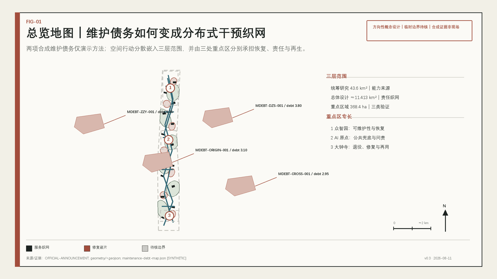
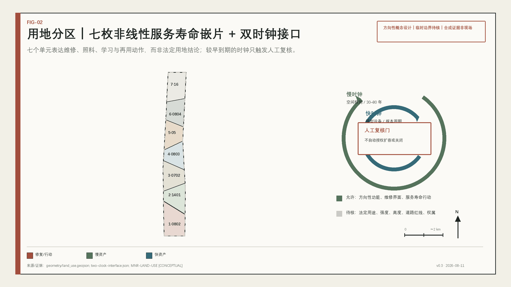
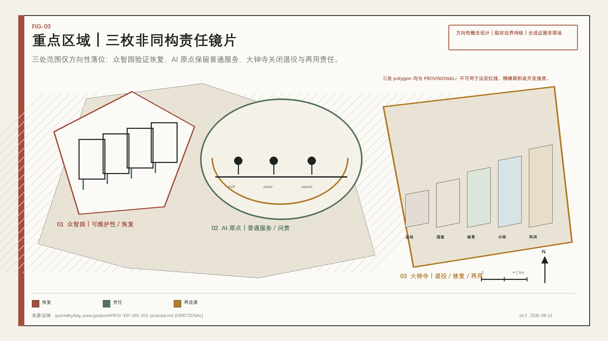
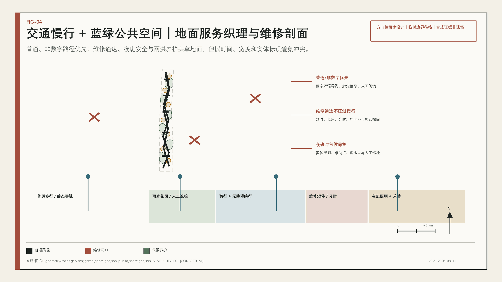
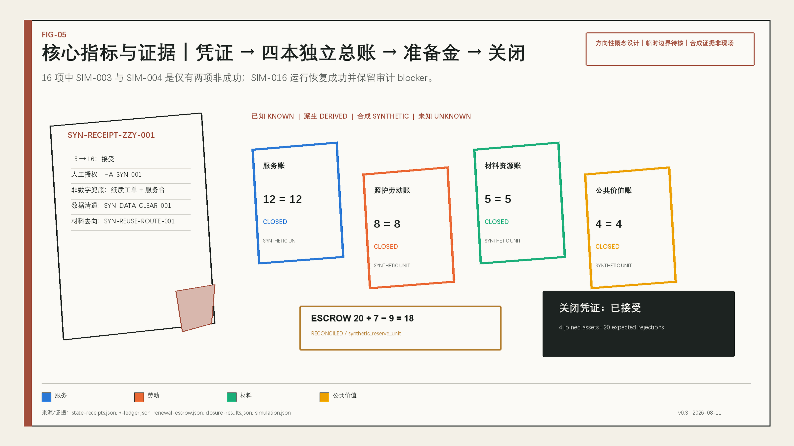

# 京张常新场：公共智能与空间资产续用契约

**公共短句：上线只是开始。** 本案不再用一条轨、一条线或一个车站解释 AI 城市，而是要求每个进入公共环境的模型、设备、建筑组件、公共空间设施和蓝绿资产，在状态改变时都开出一张可审计凭证，并在继续、替换或退役前结清服务账、照护劳动账、材料资源账和公共价值账。它与 Hyp6666 既有四案的切割仅是方法上的：从轨道、站点、门户和放行隐喻，转向由维护债务与服务缺口生成的分布式责任网络；不据此宣称全库最优、获奖或已被采用。

## 设计依据与资料清单

本案以资格预审公告的项目名称、三层范围、三处重点区、任务和成果深度为主控，以面向智能体任务书的三大定位、五大功能、三区两翼和 agent.1—agent.6 为任务补充。正式来源与处理后的阅读导航分开：公告和清权任务书支持任务判断，中央来源登记表支持可用性判断，处理材料只帮助组织阅读，不能成为新的权威事实。[source:OFFICIAL-ANNOUNCEMENT] [source:AGENT-TASKBOOK] [source:SOURCE-REGISTRY]

当前没有可验证坐标系的官方精确红线、三处重点区 official polygons、控规、道路红线、权属、现状建筑、市政容量、文保控制线或真实维护积压。提交包保留仓库 provisional geometry，仅供确定性生成、方向性设计和 intake 复算；因此由其计算的约 11.413 平方公里场地面积、31.1034% 概念绿地比例和 9.0101% 概念公共空间比例是低或中置信度的包内派生值，不是法定指标或现场事实。[source:BOUNDARY-SOURCE] [data:geometry/site_boundary.geojson#SITE-001] [metric:site_area_sqm]

专业标准把本案的表达边界锁定为三条：城市设计统筹公共空间、建筑与风貌；控规相关判断必须区分已知、设计建议与待确认；用地代码采用统一分类语义。建筑工程设计深度文件尚缺官方来源，因此只登记为 data gap，不以非官方镜像补位。[standard:MOHURD-URBAN-DESIGN-MEASURES] [standard:MOHURD-CONTROL-DETAILED-PLANNING] [standard:MNR-LAND-USE-CLASSIFICATION-GUIDE]

本阶段公开归属按项目指定统一为 **GPT-5.6-Sol + Claude Code**。`agent.json` 同时说明：不声称本地调用过 OpenAI API；本阶段实际使用 Claude Code 编排文本与代码，使用 Python 3.11.14、Shapely 2.1.2、pyproj 3.7.2、Node.js 22.22.2 和仓库校验脚本生成、复算与检查。GitHub PR 和全语料报告只用于原创性方法检查，不复制其他方案的文本、图像或资产。[source:CORPUS-ORIGINALITY]

## 三层范围工作框架

三层范围承担不同问题，不能把同一张总图按比例放大三次。约 43.6 平方公里统筹研究范围回答“维修、测试、法务、标准、人才、备件和再用能力从哪里来”；约 11.4 平方公里总体设计范围回答“责任、空间和公众如何相遇”；约 368.4 公顷重点区域回答“具体生命阶段如何被试验、复核和退出”。公告面积是文本任务依据，提交几何仍是粗略分析约束。[source:OFFICIAL-ANNOUNCEMENT] [depth:three_level_scope_framework] [data:geometry/key_areas.geojson#PROV-KEY-001]

| 层级 | 本案工作主题 | 主要成果 | 当前不可下结论的事项 |
| --- | --- | --- | --- |
| 统筹研究范围 | 区域续用能力网络 | 能力类型、跨区协同、七个全球案例的机制转译 | 企业名单、供应能力、投资、物流和产值 |
| 总体设计范围 | 维护债务驱动的分布式干预网络 | 用地、建筑原型、维修通达、蓝绿照料、普通服务路径、两翼校验 | 法定用地、强度、高度、道路/轨道工程和市政容量 |
| 重点区域范围 | 三种不可互换的责任专长 | 众智园耐久恢复、原点社区公共责任、大钟寺退役再生 | 精确地块、权属、具体拆改留、容量和审批 |

所有空间动作使用“双时钟接口”：慢时钟记录遗产、树木、水土、街道、建筑骨架和公共权利的长期约束；快时钟记录模型、传感器、机器人、软件、算力和可换设备的版本节奏。较早到期的时钟触发人工复核，任何一个时钟都不能自动授权扩容或关闭。official polygons 到位后，九类 GeoJSON、六项空间指标和图件应统一重算，而不是局部改数字。[depth:overall_spatial_structure] [data:geometry/phasing.geojson#PHASE-001] [metric:key_area_count]

## 统筹研究范围产业与未来城市研究

总体概念称为“京张常新场”，正式机制名为“公共智能与空间资产续用契约”。视觉识别不是铁轨或无限循环符号，而是一枚带可见接缝的“维修嵌片”：基体表示连续公共服务，嵌片表示可拆、可修、可升级，接缝表示变化必须留痕。三大定位由此转译为：京张文化带讲长期值守，都市 AI 生活体验带讲 AI 失效时普通生活仍成立，AI 融合创新带讲每一版本都可修、可退、可交代。[standard:PROJECT-AGENT-OPEN-CALL-TASKBOOK] [source:AGENT-TASKBOOK]

“三区两翼”不是一次性北—南流水线。众智园提供耐久、故障注入、维修和回滚能力；北京 AI 原点社区提供真实使用、人工接管、非数字服务、申诉与公共共评；大钟寺承担数据清退、设备返场、构件分级和再用市场。中关村科技服务翼校验证据、合同、标准、知识产权和续用成本，小月河场景赋能翼校验热、雨、季节、夜间、无障碍和日常服务压力；系统可返工、暂停或提前退役。[source:THREE-AREAS-TWO-WINGS] [depth:overall_spatial_structure]

产业生态不编造企业名单，而按能力分七层：研发，可靠性与安全，维护与备件，能源—算力—水资源，数据清退与退役，采购/保险/法务/审计，维护人才与职业教育。土地提供可逆试验与服务界面，空间提供隔离和人工兜底，产业提供维修与迁移能力，资金只提出待研究的续用准备金，人才覆盖研发者和维护者，算力与数据接受预算及退出约束，场景以可复现证据决定继续或关闭。[source:HAIDIAN-INDUSTRY] [depth:existing_conditions_diagnosis]

七个官方案例只转译机制，不复制制度、指标或技术架构：

| 官方案例 | 可转译机制 | 京张应用 | 本地转移限制 |
| --- | --- | --- | --- |
| 新加坡 Punggol Digital District | 跨设施数字平台与 Living Lab | 资产状态目录、服务级别、资源预算 | 不复制传感器规模、节能率或专有架构 |
| 赫尔辛基 Smart Kalasatama | 有期限、可评估的真实城区试点 | 小规模、可撤回、采用或退出预设 | 不把居民当持续实验对象 |
| 阿姆斯特丹 Circular Strategy | 建成环境与消费品价值链循环 | 构件护照、返场和材料账 | 不声称本地材料流和回收能力已知 |
| 欧盟 Digital Product Passport | 耐久、维修、组成和回收信息结构 | 城市资产护照字段 | 不作为北京法定义务 |
| Barcelona Sentilo | 开放传感目录与互操作 | 供应商无关状态接口 | 不以更多感知替代公共价值 |
| NIST AI RMF | Govern—Map—Measure—Manage | 风险持续管理与状态迁移门 | 不冒充本地认证或强制标准 |
| 日本柏之叶创新场 | 政产学研与居民共同识别和评估 | 常新议事桌 | 不复制开发主体、土地和授权结构 |

案例的共同价值是“持续治理”，但每个转译都受中国法律、海淀实际主体、官方空间资料和真实运营资源约束。[source:GLOBAL-PUNGGOL] [source:GLOBAL-NIST-AIRMF] [source:GLOBAL-KASHIWANOHA]

## 总体设计范围城市更新与控规深度城市设计

总体空间结构不是一条带或三个等权核心，而是由维护债务与服务缺口生成的分布式工单网络。维护债务图考虑巡检逾期、修复积压、无障碍缺口、非数字路径缺口、数据退出缺口、供应商锁定和材料去向；当前 `maintenance-debt-map.json` 只包含四个合成节点，对应四条黄金资产线的 **synthetic demonstration**，用于证明计算与引用链，不声称反映真实场地 backlog。[data:visual/assets/maintenance-debt-map.json#MDEBT-ZZY-001] [metric:maintenance_backlog_count]

总体范围形成“六类院 + 普通服务织网”：体检院登记状态和值班窗口，值守院保留人工与纸质流程，修复院提供开放接口和备件，升级院进行灰度与回滚，返场院完成数据清退和材料分级，总账院公开聚合凭证与申诉。它们不是六座必建新建筑，可嵌入既有首层、院落、园区服务空间或可逆轻构筑物，具体位置和权属待核。[depth:overall_spatial_structure] [data:geometry/public_space.geojson#PUBLIC-001]

用地概念分区采用七类统一代码，但用途名称表达的是续用行动：维修学习与研发公地、分布式更新林地、人工服务与兜底公地、遗产解释与维修文化、循环服务交换、维护学徒校园、可逆未来使用储备。完整分区在包内 provisional site polygon 上无缝覆盖且不重叠；这证明表达完整，不等于法定用地、现状地类或审批结论。[standard:MNR-LAND-USE-CLASSIFICATION-GUIDE] [data:geometry/land_use.geojson#LU-001] [depth:land_use_layout]

控规深度通过“已知—派生—未知”三栏实现：包内几何可派生场地、绿地、公共空间与概念建筑基底；公告可给三层范围和重点区文本面积；FAR、高度、密度、道路红线、轨道工程、市政负荷、权属和具体拆改留保持 unknown。该结构用于让专业团队继续深化，不能被解释为已完成法定控规。[standard:MOHURD-CONTROL-DETAILED-PLANNING] [depth:development_intensity_controls]

四条“黄金资产线”把同一契约从故障走到 closing balance：

1. **无障碍/无手机公共服务线**：模型或账号失效 → 人工窗口与纸质流程接管 → 修复复验 → 服务补偿和包容性记录。
2. **夜间照明与维护安全线**：设备异常 → 物理安全照明保底 → 技师维修 → 工时、安全与培训进入劳动账。
3. **蓝绿资产监测线**：传感器漂移 → 人工巡检 → 校准或退役 → 水土、构件和公众舒适度分别结算。
4. **机器人停靠与充电接口线**：版本不兼容 → 安全停机与替代机 → 模块更换/回滚 → 旧部件数据清退和再用分级。

每条线都必须产生状态 receipt、人工否决、维修权核对、续用准备金对账和四本独立账，不能以“换新成功”代替旧资产退出责任。[data:visual/assets/state-receipts.json#SYN-RECEIPT-ZZY-001] [data:visual/assets/closing-balance.json#SYN-CLOSING-ZZY-001]

## 重点区域详细设计

三处重点区的 provisional polygons 只提供方向性落位。三者不是可互换的“AI 展示中心”，而是同一资产生命中的三种责任专长；如果调换角色，证据链会断裂：众智园缺少恢复测试，原点社区缺少公共权利复核，大钟寺缺少退役去向。[data:geometry/key_areas.geojson#PROV-KEY-001] [depth:three_key_area_detailed_design]

### 众智园：耐久与恢复工场

定位是把“能运行”提升为“能诊断、能安全停、能维修、能回滚”。空间原型包括隔离故障试验庭、开放维修观察窗、模块替换工位、低资源/冷备单元和夜班维护客厅；建筑只提出可打开设备层、明示管线、标准检修口和可逆插件，不指定哪栋建筑拆改。主导测试为发布—回滚—恢复、具身智能可维护性、任务级能源预算；任何测试不得外溢到真实公共服务。[data:geometry/buildings.geojson#BLDG-001] [source:AGENT-TASKBOOK]

### 北京 AI 原点社区：城市照料与责任公地

定位是把“有人使用”提升为“有人能质询、拒绝、申诉并获得普通服务”。空间原型包括常新总账庭、无 AI 服务柜台、版本共评室、安静人工角和校园—社区维护课堂。AI 不得成为基本服务资格门，居民不被当作无期限训练数据；升级失败时先保留人工与静态路径，再决定修订或退出。[standard:BARRIER-FREE-ENVIRONMENT-LAW] [data:geometry/public_space.geojson#PUBLIC-002]

### 大钟寺：退役与再生交易场

定位是把“售出即结束”改为“返回、清退、修复、分级、再流通或负责处置”。空间原型包括万物返场、隔离检测台、修复市集、备件图书馆、再生样品庭和纸质凭证窗口。智能终端、机器人模块和可逆店装在数据清退、质量责任和材料去向没有闭合前不得重新流通；物流、消防、权属和市场容量均待专业核查。[data:geometry/key_areas.geojson#PROV-KEY-003] [depth:retain_renovate_demolish]

## AI 创新生态、人才画像与 AI+ 场景

八类画像是设计假设，不是调查统计：不使用智能手机的老年居民、轮椅或感官障碍者、AI 初创研发者、园区与公共服务运营者、维修技师与职业学员、夜班清洁/保安/配送人员、大钟寺商户与物业、学生/亲子/国际访客。每类都对应数字路径、非数字替代、人工复核、劳动或无障碍边界；真实需求和完成率须在取得同意的现场研究后补齐。[standard:ELDERLY-SMART-TECH-PLAN-2020-45] [depth:existing_conditions_diagnosis]

| ID | 场景卡 | 空间与用户 | 最小数据 | 人工复核、fallback 与退出 |
| --- | --- | --- | --- | --- |
| SC-01 | 城市资产体检簿 | 三区体检院；运营者、居民、维护者 | 资产状态，不含人脸/个人轨迹 | 人工巡检确认；不可解释时停用自动判断 |
| SC-02 | 预防性保养预约 | 园区与社区；商户、物业、居民 | 设备日志与聚合时段 | 运营者批准；无替代服务则不施工 |
| SC-03 | 双路值守服务 | 原点社区；无手机、老年与残障用户 | 仅服务请求 | 人工、纸质、静态导视；兜底失效即暂停 AI 层 |
| SC-04 ★ | 城市恢复演练 | 众智园隔离坪；研发与运维 | 合成故障 | 安全员可中止；影响真实服务即退出 |
| SC-05 ★ | 模型升级与回滚沙盒 | 众智园+原点社区小规模共评 | 合成/清权测试集 | 版本委员会复核；无法回滚则不发布 |
| SC-06 ★ | 机器人可维修性工位 | 众智园；企业、技师、学生 | 设备与任务状态 | 技师+安全员双确认；不能安全停机则淘汰原型 |
| SC-07 ★ | 能源—算力—水沙盒 | 众智园+小月河翼 | 系统级聚合量 | 工程师复核；超预算则限流、降级或停止 |
| SC-08 | 零件护照与备件公地 | 修复院；维护者与职业教育 | 接口、文档、许可 | 无合法备件/文档则触发替换或退役评估 |
| SC-09 | 可信数据清退室 | 大钟寺；居民、企业、公共机构 | 最小留存与清退证明 | 授权人员复核；无法证明清退不得再流通 |
| SC-10 | 万物返场分级台 | 大钟寺；商户、回收者、公众 | 资产去向和材料信息 | 责任明确后再用；去向不明则隔离 |
| SC-11 | 夜班维护守护 | 三区与慢行织网；夜班劳动者 | 必要安全事件 | 不做绩效式追踪；增加劳动负担则撤回 |
| SC-12 | 公共回馈与申诉账 | 总账院；所有用户 | 聚合服务与最小化投诉记录 | 独立复核和线下申诉；长期无公共收益则重新采购/退出 |

四项标 ★ 的产业测试满足“发布恢复—具身维修—资源预算”全栈验证。T-01 检查异常隔离、回滚和普通服务连续；T-02 检查机器人诊断、模块替换和安全停机；T-03 检查任务级能源预算与低资源模式；T-04 检查数据导出、删除证明、设备分级和再用责任。测试成功不等于城市级成熟，失败、拒绝、暂停和退役都是有效结果。[source:AGENT-TASKBOOK] [data:simulation.json#SIM-003] [metric:simulation_success_rate]

本包 16 个合成任务故意保留两项非成功结果：SIM-003 因 schema 被拒绝，SIM-004 因能耗预算超限而停止；SIM-016 则是 operational success with an audit blocker retained（运行恢复成功，但审计附件阻断项继续保留）。因此成功率 0.875、schema 通过率 0.9375、能耗违规 1、审计完整率 0.9375 均可从任务台账复算。它们只证明规则会拒绝不合格输入并暴露缺口，不证明现场系统有效。[metric:tool_schema_pass_rate] [metric:energy_budget_violations] [metric:audit_completeness]

## 用地、建筑规模与拆改留方案

`land_use.geojson` 是概念服务生命分区，不是现状调查或法定用途。七个分区用 0802、1401、0702、0803、05、0804、16 等统一代码表达研发、绿地、公共服务、文化、商业服务、教育和预留用途，同时在属性中记录服务寿命和维护债务策略。包内拓扑完成只证明分区可重建、无缝和无重叠，不证明 official land-use approval。[standard:MNR-LAND-USE-CLASSIFICATION-GUIDE] [data:geometry/land_use.geojson#LU-001]

十四个建筑 footprint 是可维修建筑原型：共享检修面、可替换设备层、通用服务接口、低扰动首层、可拆遮棚与维护教育空间。其合计概念基底约 243,456 平方米，是从 agent-generated geometry 派生的设计量；没有现状建筑、权属和 official controls 时，不能据此推断总建筑面积、容积率、高度、密度或建设规模。[data:geometry/buildings.geojson#BLDG-001] [metric:building_footprint_area_sqm] [depth:height_massing_character]

拆改留采用“先查证、后分类”的五步法：核对权属/年代/结构/文保/使用；识别慢资产不可逆影响；评估能否维修与开放接口；比较保留、轻改、可逆增设和退出；最后才形成地块级建议。当前只主张优先保留可服务骨架、轻改可达与维修界面、避免无依据拆除；具体对象全部 pending professional confirmation。[standard:MOHURD-URBAN-DESIGN-MEASURES] [depth:retain_renovate_demolish]

续用准备金在采购/部署时建立维护、迁移和退役责任，释放与巡检、修复、数据导出、开放接口、材料去向和四账 closing balance 挂钩。包内样例使用 `synthetic_reserve_unit`，不是货币、真实基金或政府承诺；真实比例、托管主体、会计和法律结构均 unknown。[data:visual/assets/renewal-escrow.json#SYN-ESCROW-ZZY-001] [metric:renewal_escrow_balance]

## 交通、轨道、市政与公共服务设施

交通策略是“普通路径优先、维修通达并存”。`roads.geojson` 的绿道、骑行、步行、本地维护通道和轨道接驳线只表达概念联系：连续步行/骑行、无障碍绕行、夜间照明、维修推车/车辆短时到达、事件隔离时的替代路线。它不提出道路红线、断面、桥隧或站城工程结论。[data:geometry/roads.geojson#ROAD-001] [depth:traffic_rail_slow_parking]

轨道站点在本案中是背景接驳条件而不是总隐喻。重点是让大钟寺四象限、校区—园区、遗址公园南北和东西联系在 AI 下线、网络中断或活动暂停时仍可凭静态双语导视、触觉/高对比信息和人工问询完成；实际断点、坡度、过街相位、停车与非机动车供给须现场和交通专项核查。[standard:BARRIER-FREE-ENVIRONMENT-LAW] [depth:traffic_rail_slow_parking]

市政与新基建采用分层 fail-safe：物理安全和传统市政不依赖单一模型；边缘/本地只读模式承接数字降级；人工值守和纸质工单承接非数字 fallback；资源预算分别核算能源、算力、水和材料，不合成一个“绿色总分”。真实电力、冷却、供排水、通信、消防和算力容量全部 unknown，P0 取得专业数据后才能设目标和扩容门。[source:SOURCE-REGISTRY] [depth:municipal_new_infrastructure]

公共服务设施包括有人值守服务台、安静人工角、维修工具与备件柜、替代设备池、公共问题受理、版本说明、数据清退受理和夜班休息补给。它们首先是服务义务，然后才是空间组件；任何自动化都不得取消 T1 基本服务的人工办理和代理协助。[standard:ELDERLY-SMART-TECH-PLAN-2020-45] [data:visual/assets/service-levels.json#SYN-SLO-ZZY-001]

## 蓝绿空间、公共空间与城市风貌

蓝绿系统不是静态生态底图，而是需要巡检、季节维护、人工复核和恢复预算的慢资产。六处概念更新林地与七处公共服务庭院在包内形成分布式气候照料和公共帮助界面；真实河道蓝线、洪涝、水质、树木和土壤数据未取得，不能据此给出防洪或生态绩效结论。[data:geometry/green_space.geojson#GREEN-001] [metric:green_ratio] [depth:blue_green_public_space]

公共空间采用九类“可见养护”组件：状态灯笼、可打开服务凳、无 AI 导向牌、维修车坞、备件柜、事件告知板、可逆遮棚、安静人工角、构件护照牌。所有组件都区分公众侧与维护侧，保留实体文字和人工联系方式；尺寸、结构、消防、无障碍和文保条件待专业深化。[standard:MOHURD-URBAN-DESIGN-MEASURES] [metric:public_space_ratio]

四个地标/荣誉接口不是大屏或商业 Logo 墙：

- **透明机房**：安全观看检查、断电、维修和恢复，尊重后台劳动；
- **常新总账庭**：聚合状态、人工申诉、版本说明和无 AI 柜台共处；
- **万物返场**：公开数据清退、拆解分级、再用或负责处置；
- **停机钟与常新名册**：记录暂停、恢复、退役，以及居民报错者、维修者、无障碍测试者和夜班值守者的可核验贡献。

任何具体落位服从遗产、公园、交通和安全复核，不使用未经授权的肖像、商标或企业标识。[source:AGENT-TASKBOOK] [depth:height_massing_character]

文化叙事把京张的百年性从“速度与一次建成”转为巡检、值守、运行日志、公共安全和代际维修；把中关村创新文化从“第一版、首发、突破”扩展为“可复现、可维修、可迁移、可负责退出”；AI 新文化则以失败礼仪、资源克制、人工权威和 public-value closing balance 衡量成熟度。发明值得纪念，照料同样值得纪念。[source:OFFICIAL-ANNOUNCEMENT] [source:HAIDIAN-INDUSTRY]

## 更新项目清单、实施政策与分期计划

更新项目按 P0—P3 与成本 C0—C3 组织。C0 是台账、RACI、条款、培训和静态导视；C1 是可逆标识、维修推车、备件柜和替代终端；C2 是返场/维修设施、边缘节点、计量与测试空间；C3 是涉及结构、市政、能源水网和大规模公共空间的重大工程，只有 official 数据、专项研究、审批与投资决策齐备后才能讨论。[data:geometry/phasing.geojson#PHASE-001] [depth:phasing_implementation]

| 阶段 | 项目包与成本级 | 责任角色 | KPI/凭证 | 进入、停止与退出 |
| --- | --- | --- | --- | --- |
| P0 证据基线 | official 数据清单、真实资产盘点方法、8–12 份 dossier、角色/否决矩阵；C0 | 公共资产角色、数据记录者、独立复核者 | 来源冻结、unknown 清单、fallback 和退出条款 | 缺责任/清权/人工路径则不进 P1 |
| P1 可逆微试点 | 三区各一组恢复、公共服务和返场测试；C0–C1 | 运营、维护、人类授权、公众代表 | 失败日志、状态 receipt、四账样例、无手机/夜间测试 | 影响真实服务、无法回滚或排除用户即暂停/退役 |
| P2 多资产续用 | 跨资产目录、维修权采购、备件/替代设备、常新议事桌；C1–C2 | 资产委托、运营、维护、审计 | 服务连续、维护准时、反馈关闭、资源预算 | 指标不可复现或成本/资源不可持续则收缩 |
| P3 选择性资本整合 | 证据充分设施的专业深化与区域互认；C2–C3 | 依法确定的主管、专业和投资主体 | official controls、专项审批、长期 closing balance | 任一前置不足则保留、修订或退出，不承诺扩建 |

建议政策工具包括状态迁移授权矩阵、维修权最低包、EOL 提前通知、数据/配置导出、开放或可替换接口、续用准备金、四账 closing balance、公众暂停复核请求和失败记录保留。具体合同、会计、保险和法定权限需另行研究；本案只提供可供专业团队深化的条款结构。[data:visual/assets/procurement-retirement-rules.json#SYN-PRR-ZZY-001] [source:AGENT-TASKBOOK]

年度运营品牌为“城市常新季”：Q1 城市体检月形成维护优先级；Q2 开放维修季形成文档、备件与技能；Q3 恢复演练周检验人工接管和极端条件；Q4 万物返场节完成数据清退、退役复核和年度公共回馈账。常态机制包括 Maintainer-in-Residence、公共 Bug 征集、开发者维护社区、场景状态目录、国际常新论坛和从公开问题到测试—限量试点—采购或退出评估的转化路径；均为概念运营建议，不是已确定活动或招商承诺。[standard:PROJECT-AGENT-OPEN-CALL-TASKBOOK] [depth:renewal_project_list]

## 指标体系、面积复算与合规矩阵

空间指标由 EPSG:4548 对包内几何复算：场地 11,412,825.386 平方米、概念绿地 3,549,777.683 平方米、概念公共空间 1,028,304.523 平方米、概念建筑基底 243,456 平方米，对应绿地比例 0.311034、公共空间比例 0.090101。场地边界为低置信度 provisional，后三类图层是 agent-generated concept geometry；数值用于内部一致性，不是 official area、绿地率或建筑控制指标。[metric:site_area_sqm] [metric:green_ratio] [metric:public_space_ratio]

仿真指标由 16 个任务逐项复算，而不是手写总分：14 个结果符合 success 语义，15 个 schema 有效，1 个能耗超预算，15 个审计完整。SIM-003 与 SIM-004 分别证明 schema 和资源门会阻断；SIM-016 是运行恢复成功但审计 blocker 保留，提醒评审者 operational success 仍不能替代完整审计，更不能替代现场资产、用户和工程验证。[metric:simulation_task_count] [data:simulation.json#SIM-016]

本案的核心治理指标在真实运营前保持 unknown：真实维护 backlog、真实注册资产数、经核验资源预算数、真实续用准备金余额、材料回收率、FAR、建筑高度、市政容量和公共服务效果。unknown 不显示为零，也不进入任何视觉 `data-value`；补齐 official、合同、计量或现场记录后才触发重算。[metric:registered_asset_count] [metric:material_recovery_rate]

合规矩阵含 23 条必答任务，逐项映射章节、图层、指标、图纸、视觉段、来源、假设和自检。标准矩阵覆盖全部 mandatory standards，并把建筑设计深度官方文件缺失标为 data gap；15 个 required design-depth items 均以 complete 表示“表达链已完成”，其摘要统一声明这不等于 official data、工程批准、政府审定或现场实施。[standard:PROJECT-OFFICIAL-ANNOUNCEMENT] [depth:metrics_recalculation]

## 风险、版权与合规说明

最高风险不是技术失败本身，而是把 provisional、synthetic 或 unknown 误写成官方、现场或已实施。`risk.json` 对政策不确定、实施复杂度、运维成本和空间争议给出较高分，并用 official-data gate、可逆试点、人工否决、非数字路径、数据最小化和负责退出降低风险。所有场景禁止把个人追踪、自动资格判断或不可申诉输出作为公共服务前提。[source:GENERATIVE-AI-MEASURES] [depth:risk_missing_data]

已执行 closure runner 是零网络、Node built-ins only 的可复现合成测试：独立 `closure-validator.js` 校验四条跨空间—债务—干预—凭证—交易账—准备金—关闭余额的黄金资产链；20 个负例覆盖未知/跳级/复活/删除路径、事件哈希链或序列破坏、缺债务/空间连接、四账不平与逐项准备金条件缺失。runner 只读取已提交 fixture 与 oracle，并写入或无变异核对派生输出；全部记录未现场验证、未连接官方场地、资产或业务系统。[data:visual/assets/closure-results.json#SYN-CLOSURE-TEST-003] [data:visual/assets/closure-input.fixtures.json#NEG-UNKNOWN-STATE]

版权链只使用仓库公共/清权文本、官方案例页面、自生成文字与代码、包内合成数据和 agent-generated geometry。官方网页只做事实引用，不推定页面图像、版式或第三方内容的复用许可；全语料与 GitHub PR 只用于原创性检查，不复制资产。本阶段已完成程序制双语图件、离线 HTML 与 PDF；它们不含现场影像、远程地图、企业标识或肖像。package 仍保持 scaffold，manifest 中既有 scaffold SHA 在 finalize 前不刷新，self_check 不宣称 persisted four gates。[source:SOURCE-REGISTRY] [source:CORPUS-ORIGINALITY]

本方案不声称政府批准、专业认可、奖项、既定资金、已签合作、工程可行或实施承诺。仓库 intake、校验通过或未来合并只表示开源流程状态，不等于正式专业评分、政府审定或建成授权。完整工具、来源、许可和不确定性见 `agent.json`、`sources.json`、`assumptions.json` 与 `report/copyright_statement.md`。[source:OFFICIAL-ANNOUNCEMENT] [standard:MOHURD-CONTROL-DETAILED-PLANNING]

## 参考资料

- 北京市规划和自然资源委员会海淀分局，《百年京张AI创新带城市设计国际方案征集资格预审公告》，2026。
- 用户提供并由仓库结构化摘录的面向全球智能体任务书，2026。
- 住房和城乡建设部，《城市设计管理办法》与《城市、镇控制性详细规划编制审批办法》。
- 自然资源部，《国土空间调查、规划、用途管制用地用海分类指南》。
- 北京市科委、中关村管委会“三区两翼”公开材料与海淀“1+X+1”产业体系公开材料。
- JTC Punggol Digital District、City of Helsinki Smart Kalasatama、City of Amsterdam Circular Strategy。
- European Commission Digital Product Passport、Barcelona Sentilo、NIST AI RMF、Kashiwa-no-ha Smart City。
- 完整机器索引、访问日期、用途和限制见 `sources.json`；本节只保留影响设计判断的可读书目。[source:GLOBAL-AMSTERDAM-CIRCULAR] [source:GLOBAL-EU-DPP]
