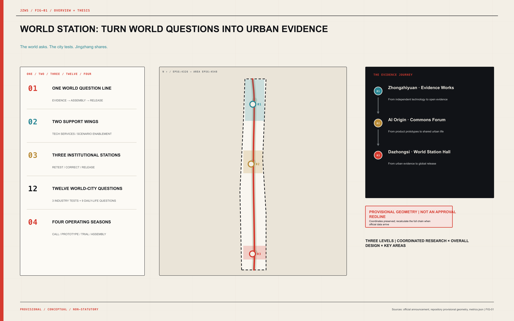
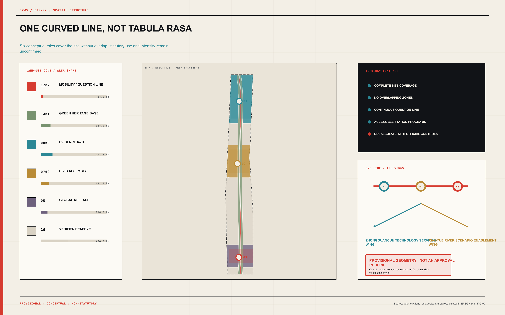
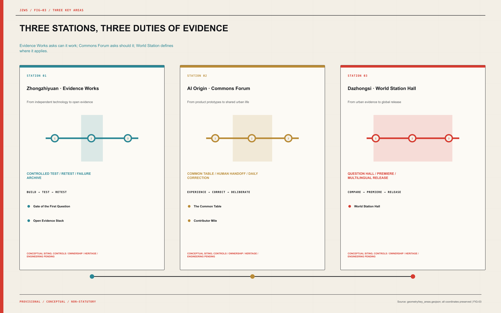
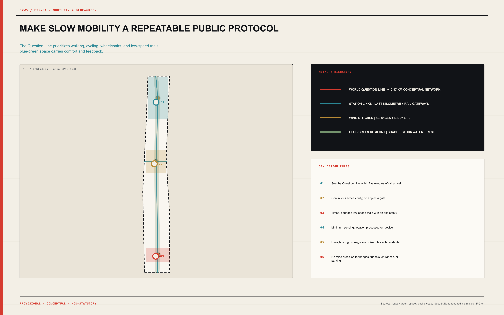
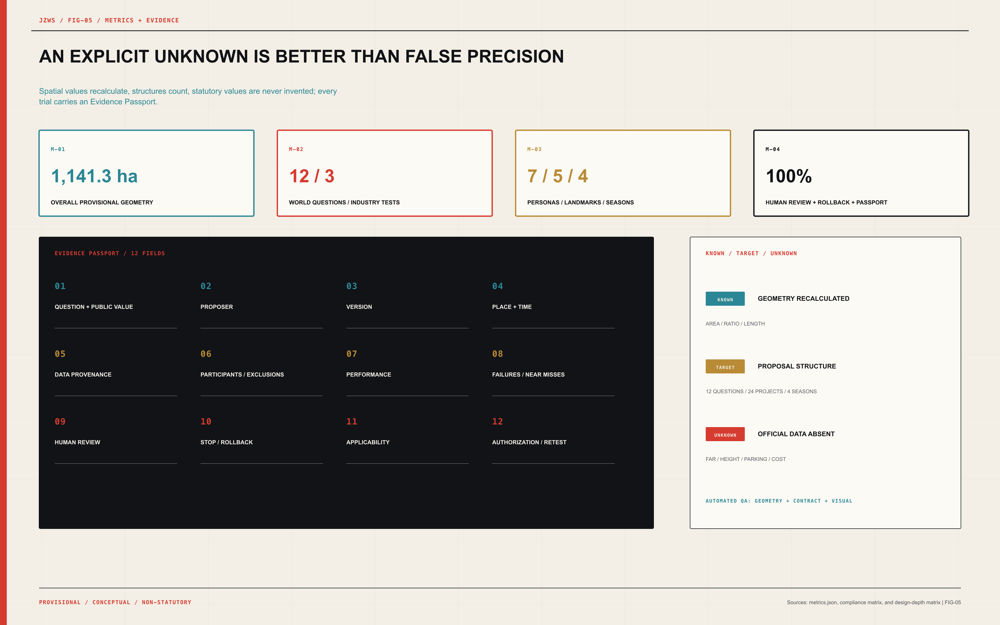

# JINGZHANG WORLD STATION

> **The world asks. The city tests. Jingzhang shares.**

**The Global Civic Assembly, Urban Testbed, and Release Belt for AI | 京张世界站**

Jing-Zhang does not lack technology, companies, or events. What it lacks—and what cities worldwide urgently need—is an urban capability: a global question can arrive in Beijing, pass through open testing, correction by everyday life, and independent retesting, then return to the world carrying failures, limits, and conditions of use. JINGZHANG WORLD STATION turns that capability into space, governance, and an annual rhythm. It is not another exhibition corridor.

The locked structure is **one line, two wings, three stations, twelve questions, four seasons**. The World Question Line carries an evidence journey along the Centennial Jing-Zhang corridor. The Zhongguancun Technology Services Wing and Xiaoyue River Scenario Enablement Wing provide professional and everyday support. Zhongzhiyuan · Evidence Works, AI Origin · Commons Forum, and Dazhongsi · World Station Hall complete controlled testing, civic correction, and global release. Twelve questions span industry and daily life; four seasons turn a one-off call into a durable urban institution.

| From a conventional AI district to World Station | Shift in public value |
| --- | --- |
| Showing only the “best side” | Publish capability, failure, boundary, and version together |
| Companies search for scenarios | World cities pose questions; companies answer with evidence |
| One annual summit | A year-round question—prototype—urban trial—world release cycle |
| Technology replaces people | Human Review, pause, rollback, and exit are mandatory |
| Landmarks as sculptural objects | Landmarks become visible interfaces to public institutions |

This is an open co-creation proposal. It is not a statutory plan or government approval. Every precision-sensitive spatial result remains provisional and carries a recalculation trigger.

## Design Basis and Source List

The first authority is the official international design-call announcement. The second layer is the repository’s formal guide, agent taskbook, professional references, and structured data contract. International mechanisms and policy context form a third layer. Sources are ranked not by appearance but by **the claim each is allowed to support**: the announcement supports tasks and scope; provisional repository geometry supports only conceptual generation and review; external cases support mechanism learning only. This hierarchy is controlled by [source:SRC-OFFICIAL-ANNOUNCEMENT] and [standard:PROJECT-OFFICIAL-ANNOUNCEMENT].

| Evidence layer | Use in this proposal | Explicitly prohibited |
| --- | --- | --- |
| Official announcement and policy | Define tasks, strategic direction, and public context | Reverse-engineering parcels, roads, or engineering parameters |
| Structured repository material | Lock the contract, enums, provenance, and provisional coordinates | Upgrading them into an official redline |
| Professional references | Check urban-design depth, regulatory language, and land-use codes | Presenting conceptual recommendations as statutory controls |
| Primary international cases | Extract agenda, testing, reporting, and participation mechanisms | Implying partnership, endorsement, or legal equivalence |
| Proposal-generated data | Produce conceptual partitions, modules, metrics, and drawings | Inventing existing conditions, ownership, cost, or capacity |

The coordinates of `PROV-SITE-001` and all three Key Areas are preserved exactly. In particular, the positional mismatch between `PROV-KEY-003` and the overall provisional polygon was not silently “fixed”; it is registered in assumptions, constraints, and recalculation dependencies. This sacrifices superficial neatness to protect evidence integrity. When authoritative redlines arrive, clipping, areas, ratios, roads, buildings, phasing, and drawings must all be regenerated.

## Three-Level Scope Framework

The three levels are not three maps at different scales; they are three questions that test one another. The approximately 43.6 km² Coordinated Research Area asks how Haidian can organize world-city AI questions. The Overall Design Area asks how that institution becomes a walkable, accessible, operable urban belt. The three Key-Area Detailed Design Areas ask how a technology is verified through specific buildings, public space, human takeover, and exit conditions. The workflow is checked by [depth:three_level_scope_framework].

| Level | Core judgement | Deliverable evidence |
| --- | --- | --- |
| Coordinated Research Area | Upgrade from factor concentration to global question-setting capacity | Regional network, eight inputs, eight precedents, annual operations |
| Overall Design Area | One Question Line links two wings and three stations into an evidence journey | Land use, buildings, walking, blue-green, public-space, and phasing layers |
| Key-Area Detailed Design Area | Each station holds distinct thresholds, space types, and public duties | Three-station designs, twelve scenarios, five landmarks, project register |

The spatial baseline is [data:geometry/site_boundary.geojson#PROV-SITE-001]; the Key Areas are indexed by [data:geometry/key_areas.geojson#PROV-KEY-001]. Both are provisional constraints. The projected overall polygon area is approximately 1,141.3 ha and is used only for this conceptual allocation and ratio recalculation.

## Coordinated Research Area: Industry and Future City Research

The industrial strategy does not produce another generic AI value-chain diagram. It turns Haidian’s research, open-source, enterprise, and service strengths into a global public good: the **World Question Protocol**. A city, community, researcher, or institution poses a verifiable question. Jing-Zhang translates it into data boundaries, a test protocol, spatial conditions, Human Review, stop rules, and an evidence format. Companies compete not only on benchmarks but on whether they can provide repeatable answers under real public-interest constraints. This aligns with the international-network, standards-service, and urban-living-room direction of the “Three Zones and Two Wings” [source:SRC-BEIJING-THREE-ZONES], while answering the agent taskbook item by item [standard:PROJECT-AGENT-OPEN-CALL-TASKBOOK].

Eight innovation inputs enter World Station through rules rather than a subsidy list:

| Innovation input | Rule for entering World Station |
| --- | --- |
| Land | Inventory and reuse lawful accessible existing space |
| Space | Reversible prototypes, shared testing, and public ground floors |
| Industry | Organize cross-sector testing around world-city questions |
| Capital | Small prototypes, evidence-led follow-on funding, and staged exit |
| Talent | Question residencies, developer communities, and user co-design |
| Compute | Task-based access with resource and energy boundaries recorded |
| Data | Provenance, minimization, tiered access, and exit |
| Scenario Access | Open call, risk screening, bounded trials, and review |

Eight external mechanisms offer transferable methods, not an “international institution logo wall”:

| External mechanism | Transferable mechanism | Jing-Zhang translation; no partnership implied |
| --- | --- | --- |
| UN Global Dialogue on AI Governance | Global multistakeholder agenda platform | World Question Call and annual question hall |
| ITU AI for Good | Links global convening, demonstrations, and public issues | World Station Assembly with a year-round testing chain |
| Singapore AI Verify | Open testing tools and industry community | Interoperability track and evidence passport |
| NIST AI Consortium | Measurement science, task groups, and cross-sector collaboration | Open retesting and thematic working groups |
| EU AI Regulatory Sandboxes | Bounded testing in real-world conditions | Pausable, reversible, human-supervised urban trials |
| OECD Hiroshima AI Process Reporting Framework | Comparable cross-border transparency reporting | World-city evidence pages and annual release |
| Montréal Declaration | Expert and citizen participation in an ethical framework | The Common Table and user co-review |
| UK AI Security Institute | Independent testing, research, and capability boundaries | Safety drills, failure records, and conditions of use |

Regional coordination works through question exchange rather than homogeneous investment promotion. North Latitude Community contributes young-talent and living-service experience; Future Science City poses cross-domain energy and life-science questions; Huairou Science City brings AI-for-science and major-facility verification; Beijing E-Town contributes embodied-AI and manufacturing trials; the Beijing–Tianjin–Hebei city network enables cross-city comparison. Each partner may pose questions and carry protocols, failure archives, and open tools home. Jing-Zhang becomes the hub that composes questions and makes evidence comparable.

The decisive differentiation follows: other districts release products; World Station releases **what the city has learned, what it still does not know, and when a system must stop**. That capability serves a world-class innovation ecosystem and gives high-level talent a durable role in public urban life.

## Overall Design Area: Urban Renewal and Regulatory-Plan-Level Urban Design

The overall structure consists of one World Question Line, two support wings, and three institutional stations. The line is not merely a graphic axis; it establishes an order: every scenario first passes controlled testing, then enters co-review in everyday life, and only then becomes eligible for release. The two wings supply IP, talent, capital, standards, compute, and international services on one side, and public life, blue-green space, climate comfort, and daily feedback on the other. [depth:overall_spatial_structure] governs this structure.

| Station | Public mission | Core actions |
| --- | --- | --- |
| Zhongzhiyuan · Evidence Works | From independent technology to open evidence | build → test → retest |
| AI Origin · Commons Forum | From product prototypes to shared urban life | experience → correct → deliberate |
| Dazhongsi · World Station Hall | From urban evidence to global release | compare → premiere → release |

The conceptual partition is generated from a curved buffer around the Question Line and station influence areas, creating six continuous, non-overlapping zones that cover the complete site. Mobility, green heritage, evidence R&D, civic assembly, global release, and reserve are not statutory land-use changes; they test whether the structure reaches the whole site. The primary land-use evidence is [data:geometry/land_use.geojson#LU-TRANSIT]; eighteen small reversible modules appear in [data:geometry/buildings.geojson#BLDG-S1-01].

Renewal does not mean demolition and reconstruction. Near-term work uses reversible facilities, open ground floors, shared test rooms, and public operations. Mid-term station links follow confirmation of ownership, heritage, fire, municipal, and statutory controls. Permanent construction is considered only in the long term. New massing must not obscure railway evidence, sever neighbourhoods, or turn “smartness” into compulsory consumption.

## Detailed Design of Key Areas

The three stations are not similar innovation complexes. Each carries a different duty of evidence. [depth:three_key_area_detailed_design] governs the detailed-design response, while all Key-Area geometry remains explicitly provisional.

**Zhongzhiyuan · Evidence Works | From independent technology to open evidence.** A controlled-test core, public observation ring, and Qinghe green interface host full-stack interoperability, low-speed embodied coexistence, and urban-agent resilience trials. Independent retesting, standards workshops, red-team observation, and failure archiving occupy the middle ring; the outer ring explains test boundaries to the public. Gate of the First Question displays only the defining annual question. Open Evidence Stack makes versions, capability, failure, and applicability spatially legible. Trials remain isolated from production control systems.

**AI Origin · Commons Forum | From product prototype to shared urban life.** The Common Table connects near-campus translation, accessibility co-design, one-step public-service handoff, youth open-source learning, and daily-life trials. Public ground floors do not filter participation through purchasing power. Older and disabled people, caregivers, and frontline maintainers are not merely interview subjects: they hold correction, pause, and veto channels. Contributor Mile records only authorized, withdrawable, verifiable maintenance and contribution.

**Dazhongsi · World Station Hall | From urban evidence to global release.** A rail gateway, World City Question Hall, AI-Native Premiere Market, multilingual evidence library, and annual assembly form a public station hall that can be understood on arrival. It does not publish unconditional product promotion. It publishes Evidence Passports: who posed the question, where it was tested, which data were used, who reviewed it, what failed, where it applies, and how to exit. The hall links a four-quadrant walking network, but precise station integration and siting must await authoritative geometry and transport data.

All three stations share a small-component library: evidence plaques, emergency-stop posts, staffed service windows, anonymous feedback desks, reversible test paving, accessible observation points, version lightboxes, and public correction boards. The library brings the grand narrative down to a scale people can touch, question, and stop.

## AI Innovation Ecosystem, Personas, and AI+ Scenarios

The talent strategy shifts from “how many people can be attracted” to “which powers each person holds along the question chain.” Seven co-design personas cover research, entrepreneurship, urban operations, family care, accessibility, youth, and international exchange. They participate in question-setting, testing, correction, release, and maintenance—not only opening events. Every scenario has Human Review and a stop or rollback path, with no biometric requirement. [source:CASE-AI-VERIFY] and [depth:municipal_new_infrastructure] inform this boundary, while all institutional arrangements require local adaptation.

| Co-designer | Complete journey |
| --- | --- |
| AI researcher and open-source developer | Moves from evidence testing to public feedback and global release |
| Startup team and product owner | Turns a prototype into a bounded, explainable, repeatable urban product |
| Urban operator and frontline maintainer | Defines takeover, maintenance, shutdown, and recovery |
| Resident family and caregiver | Tests whether scenarios fit everyday routines |
| Older and disabled co-designer | Holds accessibility review, correction, and veto channels |
| Young learner and junior developer | Moves from AI literacy into real open contribution |
| International talent, city visitor, and partner | Compares evidence, joins the agenda, and carries reusable tools home |

The twelve questions are the project’s “urban API.” The first three are industry Testing and Validation Scenarios; the remaining nine place accessibility, public service, learning, climate, night-time life, railway memory, contribution records, product premieres, and city exchange under the same evidence standard:

| No. | World-city question / scenario | Space and operation | Data boundary | Human review and rollback |
| --- | --- | --- | --- | --- |
| 01 | **Open Full-Stack Interoperability Track** — Can different chips, models, toolchains, and agent interfaces work together under an open test protocol? | controlled laboratory; public observation gallery — Scheduled trials, open protocols, independent retesting, and archived failures | Use only cleared test or synthetic data; no connection to production systems | The test lead signs results; release follows independent retesting. — Interface isolation, version rollback, immediate trial stop. |
| 02 | **Low-Speed Embodied-AI Coexistence Street** — Can robots safely share space with people in a controlled, pausable, human-supervised environment? | bounded low-speed test loop; accessible observation point — Time slots, geofencing, on-site safety stewards, and public incident review | Default edge processing and bystander obfuscation; no retention of irrelevant footage | The on-site safety steward has highest control authority. — Physical emergency stop, remote shutdown, staffed evacuation route. |
| 03 | **Urban-Agent Resilience Drill Chamber** — When an urban agent fails, is attacked, or gives harmful advice, can it be detected, isolated, taken over, and recovered? | simulation chamber; red-team observation room — Scenario injection, red teaming, human takeover drills, and recovery review | Only de-identified or synthetic urban data; no link to real control equipment | Urban professionals make every final decision. — Sandbox isolation, state snapshots, human recovery. |
| 04 | **Co-Designed Accessible Wayfinding Path** — Can blind, older, and mobility-impaired users understand, correct, and leave AI wayfinding? | continuous accessible route; staffed assistance point — Co-walk audits, route trials, barrier reports, and human updates | Location data processed on device; anonymous feedback available | Accessibility co-designers set correction priorities. — Paper maps, staffed guidance, and closure of incorrect routes. |
| 05 | **Public-Service Collaboration Desk** — Can a public-service AI explain its sources and hand a person to human service in one step? | open service desk; human-review room — Information retrieval, source display, human handoff, and error correction | Conversations are not retained by default; sensitive matters remain human-only | Human service staff hold final interpretive authority. — One-step human handoff plus paper and telephone alternatives. |
| 06 | **Youth Open-Source Learning Station** — Can young people learn models, code, and data literacy without surrendering unnecessary personal data? | open classroom; offline model table — Mentored workshops, offline experiments, open-source contribution, and informed guardians | No advertising profiles; student work is not training data by default | Mentors review content, risk, and contribution release. — Offline mode, deletion of work, withdrawal of public contributions. |
| 07 | **Collective Climate-Comfort Corridor** — Can AI improve shade, rest, and microclimate comfort with anonymous or aggregate data rather than individual surveillance? | blue-green walking corridor; climate-rest point — Anonymous comfort voting, sensor calibration, and seasonal facility adjustment | Record only environmental values and aggregated feedback | Landscape staff, operators, and the public jointly review changes. — Return to fixed lighting and manual maintenance. |
| 08 | **Negotiated Quiet-Night Route** — Can smart lighting, activity, and safety systems support safety, energy restraint, quiet, and privacy at once? | night walking route; quiet-boundary point — Time-based rules, lighting trials, noise negotiation, and complaint review | Use sound levels and illuminance only; do not record identifiable conversations | Residents and operators jointly confirm night-time rules. — Switch to conservative fixed lighting and pause activities. |
| 09 | **Centennial Jing-Zhang Memory Interface** — Can AI interpret railway history from sourced archives while separating fact, inference, and creation? | heritage reading point; public archive table — Archive inventory, fact labels, expert review, and public correction | Use only public and rights-cleared material | History professionals review the core narrative. — Remove incorrect content while retaining the correction record. |
| 10 | **Open-Source Contributor Mile** — Can the real contributions of developers, residents, maintainers, and researchers be recorded by the city with consent? | continuous ground marker; version archive point — Contribution nomination, evidence verification, display consent, and version updates | Display only expressly authorized names or anonymous identifiers | A maintenance committee verifies contributions and withdrawal requests. — Anonymize or remove a record at any time. |
| 11 | **AI-Native Premiere Market** — Can AI products undergo public trials, accessibility checks, risk disclosure, and human-service validation before purchase or scale-up? | reversible pavilion; staffed service counter — Time-bounded trials, risk cards, accessibility review, and issue collection | Trial data stays local by default and remains deletable | Provider and independent user reviewers co-sign the evidence. — Remove the stall, preserve exit/refund routes, disable remote services. |
| 12 | **World City Question Hall** — Can cities discuss shared problems through comparable evidence templates rather than promotional slogans? | annual question hall; multilingual evidence gallery — Question call, evidence comparison, public review, and annual release | Publish only authorized, reviewable, de-identified results | A multistakeholder editorial board approves release boundaries. — Withdraw incorrect entries and retain public corrections. |

Every scenario passes six gates: public-value screening; data and rights inventory; bounded and pausable trials; review by people with legitimate authority; independent retesting; and conditional release. Failure is not a brand incident but public knowledge that must enter the version archive. A scenario cannot enter World Station if it cannot answer who stops it in one step, who maintains it, and how participants leave.

## Land Use, Building Scale, and Retain-Renovate-Demolish Strategy

Conceptual land use employs auditable codes and forms a complete, non-overlapping partition. It is a structural test, not a statutory land-use plan. Classification and its limits follow [standard:MNR-LAND-USE-CLASSIFICATION-GUIDE], and the geometry is recorded in [data:geometry/land_use.geojson#LU-TRANSIT].

| Code | Conceptual role | Projected area (structural recalculation only) |
| --- | --- | --- |
| 1207 | Conceptual mobility and World Question Line | 34.9 ha |
| 1401 | Conceptual green heritage base | 168.9 ha |
| 0802 | Conceptual evidence R&D space | 203.8 ha |
| 0702 | Conceptual civic assembly and community service | 142.8 ha |
| 05 | Conceptual global release and exchange services | 116.8 ha |
| 16 | Conceptual reserve for verified renewal | 474.0 ha |

The eighteen building modules have a total footprint of approximately 5.39 ha. They test whether the three stations can contain public ground floors, controlled trials, retesting, staffed services, and release functions. They carry no floor area ratio, height, or final floor area. Building evidence is [data:geometry/buildings.geojson#BLDG-S1-01]. Formal work applies a four-level retain-renovate-demolish protocol: retain valuable or uninvestigated objects first; micro-renovate improvable fabric; prefer reversible additions for new needs; and mark every object lacking heritage, structural, ownership, and fire evidence as “pending investigation,” with no demolition promise.

Urban character is not blue light and giant screens. The material language begins with railway durability, repairability, and legibility: coal black for structure and type; paper white for public reading; signal red for questions and risk; evidence teal for testing and retesting; commons gold for civic participation. Permanent architecture should remain calm while the operating layer can change. Brand installations must be demountable, repairable, and versioned.

Statutory intensity remains structured unknown: total floor area, floor area ratio, density, height, setback, road area, parking, municipal capacity, and cost require authoritative redlines, statutory controls, existing-building surveys, rail constraints, ownership, and engineering information, followed by professional review.

## Transport, Rail, Municipal Infrastructure, and Public Services

The mobility structure is “arrive by rail—walk the World Question Line—complete the last kilometre to each station—stitch across both wings.” Approximately 10.87 km of conceptual walking and station links express network relationships, not road redlines. The Question Line prioritizes walking, cycling, wheelchairs, and low-speed trials; station links prioritize safe crossings, shade, rest, and night-time legibility. Network evidence is [data:geometry/roads.geojson#ROAD-WORLD-LINE], and [depth:traffic_rail_slow_parking] governs professional depth.

The Dazhongsi rail gateway, AI Origin near-campus links, and Zhongzhiyuan external access follow a sequence: diagnose breaks, propose reversible links, then enter engineering review. Because KEY-003 location and road redlines are unconfirmed, no bridge, tunnel, entrance, parking count, or intersection intervention is presented with invented precision.

New infrastructure follows “minimum sensing + edge processing + human takeover.” Trusted data rooms register provenance and access; task-based compute records energy and versions; scenario nodes default to offline or edge processing; public-service desks retain paper, telephone, and staffed routes; emergency stop and recovery do not depend on the same AI system. Constraints and missing data appear in [data:geometry/constraints.geojson#CONSTRAINT-PROVISIONAL-SITE]. Utility capacity, pipelines, power, flood control, fire safety, and operating responsibility remain prerequisites to subsequent municipal integration.

## Blue-Green Network, Public Space, and Urban Character

Green space is not a background to sealed campuses. It is World Station’s most universal “slow verification infrastructure.” The conceptual green base covers about 206.1 ha, while core station-forecourt assembly space covers about 9.8 ha. The first supports heritage reading, shade, stormwater, and continuous walking; the second counts only the three core plazas for assembly and release, so 0.86% must not be mistaken for all public realm. Green evidence is [data:geometry/green_space.geojson#GREEN-WORLD-LINE], station forecourts are [data:geometry/public_space.geojson#PUBLIC-STATION-1], and [depth:blue_green_public_space] checks design depth.

Three cultures are not collaged graphics. Centennial Jing-Zhang culture provides the spatial grammar of line, station, timetable, and shared arrival. Zhongguancun culture contributes the ethics of question, open source, iteration, and contribution. AI culture adds version, evidence, limits, and Human Review. Together they form **Railway Evidence**: the order of a railway timetable, the auditability of a scientific journal, and the dignity of a diplomatic dossier.

| Landmark | Public value |
| --- | --- |
| Gate of the First Question | Displays one defining global urban-AI question each year |
| Open Evidence Stack | Makes capabilities, failures, limits, and versions spatially legible |
| The Common Table | Supports equal and accessible public deliberation |
| World Station Hall | Hosts annual questions, city cases, premieres, and exchange |
| Contributor Mile | Records authorized real contributions and maintenance history |

Each landmark must satisfy three conditions: enter without buying a ticket; use without facial recognition or a compulsory app; retain a basic public function when devices are off. Night lighting is low-glare and time-negotiated. Sound sensing records environmental levels, not identifiable conversations. Stormwater, tree canopy, seating, and accessible gradients take priority over interactive screens.

## Renewal Projects, Implementation Policy, and Phasing

The annual cycle has four seasons. World Question Call collects questions from cities and the public and screens them for public value. Open Prototype Season conducts interoperability tests, red teaming, and draft Evidence Passports. City Trial Month runs bounded daily-life trials and user co-review. World Station Assembly publishes results, failure archives, and the next annual question. This is not an event calendar; it is an operating institution through which space produces comparable knowledge every year.

| Season | Name | Core action |
| --- | --- | --- |
| 1 | World Question Call | Collect, map evidence, and screen for public value |
| 2 | Open Prototype Season | Interoperability, red teaming, and draft evidence passports |
| 3 | City Trial Month | Bounded daily-life trials and user co-review |
| 4 | World Station Assembly | Release results, failure archives, and the next annual question |

Twenty-four projects proceed through four phases. Spatial phasing is recorded at [data:geometry/phasing.geojson#PHASE-1], and implementation depth is governed by [depth:phasing_implementation]:

| Phase | Suggested window | Project package (all conceptual recommendations) |
| --- | --- | --- |
| Evidence Baseline and Brand Prototype | Suggested 0-6 month window | P01 Evidence and Missing-Data Baseline; P02 World Question Call Mechanism; P03 Brand and Wayfinding Prototype; P04 Gate of the First Question Prototype |
| Three Reversible Trial Families | Suggested 6-18 month window | P05 Open Full-Stack Interoperability Track; P06 Low-Speed Embodied-AI Coexistence Street; P07 Urban-Agent Resilience Drill Chamber; P08 Open Evidence Stack Prototype; P09 Co-Designed Accessible Wayfinding Path; P10 Public-Service Collaboration Desk; P11 Youth Open-Source Learning Station; P12 The Common Table; P15 Centennial Jing-Zhang Memory Interface; P22 Evidence Passport Registry |
| Three-Station Network | Suggested 18-36 month window | P13 Collective Climate-Comfort Corridor; P14 Negotiated Quiet-Night Route; P16 Open-Source Contributor Mile; P17 Open Question Residency; P19 AI-Native Premiere Market; P21 Regional Question Exchange Network; P23 Multilingual Urban Evidence Library |
| Long-Term International Network | Suggested window after 36 months | P18 World City Question Hall; P20 World Station Assembly; P24 Annual Review and Renewal Mechanism |

Evidence gates, not dates alone, control progression. Phase 0 ends only after publishing the evidence baseline. Reversible Phase 1 trials open only after emergency stop, Human Review, privacy, and accessibility acceptance. Phase 2 expands only when the three stations can recognize one another’s Evidence Passports. Phase 3 requires independent evaluation, renewal, and exit. Finance follows “small prototype—evidence-led follow-on funding—annual renewal,” avoiding permanent construction that locks in a wrong direction.

Policy instruments include an open-scenario protocol, public-value review, minimum failure disclosure, participant withdrawal, accessibility co-design seats, data exit and deletion, maintenance budgets, permits for lightweight facilities, a cross-city evidence template, and annual third-party audit. A suggested governance body combines the public initiator, professional committee, resident and accessibility seats, open-source maintainers, and independent evaluators. No institutional commitment is claimed.

## Metrics, Area Recalculation, and Compliance Matrix

Metrics are divided into three classes. Class A contains provisional spatial indicators directly recalculated from geometry. Class B contains proposal-structure counts and governance coverage. Class C contains statutory or engineering indicators kept unknown because official controls are absent. Publishing an unknown is more professional than inventing false precision. Every value carries source files, formula, confidence, and assumptions; [depth:metrics_recalculation] governs the audit.

| Metric | Current value | Confidence | Machine reference |
| --- | --- | --- | --- |
| Overall provisional geometry area | 1141.3 ha | medium | [metric:site_area_sqm] |
| Three Key Areas | 3 | high | [metric:key_area_count] |
| Conceptual green space | 206.1 ha / 18.06% | low | [metric:green_ratio] |
| Conceptual station forecourts | 9.8 ha / 0.86% | low | [metric:public_space_ratio] |
| Footprint of 18 conceptual modules | 53,856 m² | low | [metric:building_footprint_area_sqm] |
| Conceptual walking and station links | 10.87 km | low | [metric:road_length_m] |
| Annual world-city questions | 12 | high | [metric:scenario_question_count] |
| Industry testing and validation scenarios | 3 | high | [metric:industry_test_count] |
| Co-design personas | 7 | high | [metric:persona_count] |
| Public landmarks | 5 | high | [metric:landmark_count] |
| Annual operating seasons | 4 | high | [metric:annual_season_count] |
| Conceptual project package | 24 | high | [metric:project_count] |
| Scenario coverage with Human Review | 100% | high | [metric:human_review_coverage] |
| Scenario stop / rollback coverage | 100% | high | [metric:rollback_coverage] |
| Evidence Passport coverage | 100% | high | [metric:evidence_passport_coverage] |
| Floor area ratio | unknown: official controls absent | unknown | [metric:floor_area_ratio] |

Each scenario’s Evidence Passport records twelve fields: question and public value; proposer; version; test place and time; input-data provenance; participants and exclusions; performance results; failures and near misses; Human Review authority; stop or rollback; where the result does and does not apply; and authorization and retest status. “Not tested” and “failed validation” are first-class publication states, not omissions.

The compliance matrix covers announcement clauses 1.3, 1.4, and 1.5 plus agent.1–agent.6. The professional matrix covers six standard responses; the design-depth matrix covers fifteen required items. Prose enables human reading, JSON enables machine audit, GeoJSON enables spatial recalculation, A3/A0 enables rapid jury comparison, and offline HTML enables complete browsing. The five evidence layers point to one another without becoming a dump.

## Risk, Copyright, and Compliance

Nine material assumptions are registered: the overall provisional boundary; KEY-003 positional mismatch; missing statutory controls; missing road and utility data; missing ownership; missing heritage controls; conceptual operations; target rather than observed structure metrics; and external cases as mechanism precedents only. Each assumption identifies affected files, verification, and recalculation dependencies. [depth:risk_missing_data] governs the risk layer, and [source:REPO-PROVISIONAL-GEOMETRY] defines the geometry boundary.

The proposal does not claim official approval, statutory planning status, final ownership, final building scale, formal partners, committed investment, guaranteed delivery, or risk-free technology. AI scenarios involving people or public service require data minimization, no mandatory biometrics, source explanation, final human decisions, pause, rollback, anonymous feedback, and withdrawal of contributions. For high-risk services involving children, health, law, or public safety, the proposal provides only spatial and governance prototypes; it cannot replace sector approval or professional service.

Copyright follows a “traceable assets only” rule. Graphics in this package are generated by the submitter from repository geometry and an original design system. The package does not copy competition schemes, commercial maps, unauthorized photography, institutional logos, or third-party font files. Official webpages and international cases are factually paraphrased with provenance, rights, and limitations recorded. Names, icons, enterprise cases, and contributor identities still require rights clearance before public display. Mention of any institution does not imply partnership or endorsement.

HTML must remain entirely offline: no remote scripts, tiles, fonts, iframes, forms, tracking, or APIs. PDFs will be checked for page count, size, extractable text, and page-by-page rendering. The final PR may change only `submissions/Hyp6666/jingzhang-world-station/`. These are not peripheral compliance tasks; they are part of whether World Station can be trusted.

## References

The prose retains only primary sources that change a judgement. The full machine index—including access dates, use, rights, and limitations—is in `sources.json`. The submission contract follows [source:REPO-FORMAL-GUIDE].

- **REPO-FORMAL-GUIDE | Formal Submission Guide** — open-city-ai/haidian maintainers; use: Submission contract, depth, bilingual, figure, HTML, PDF, and validation requirements; limitation: Workflow authority, not a source of official site geometry; docs/formal-submission-guide.md
- **REPO-AGENT-TASKBOOK | Agent Taskbook** — open-city-ai/haidian maintainers; use: Three positions, five functions, Three Zones and Two Wings, agent.1-agent.6; limitation: Agent-facing taskbook; does not replace statutory planning; brief/site-package/agent_taskbook.json
- **REPO-PROVISIONAL-GEOMETRY | Provisional Boundaries** — open-city-ai/haidian maintainers; use: Provisional intake, topology generation, visualization, and validation; limitation: Not official, precise, statutory, or approval-ready; all precision-sensitive outputs require recalculation; brief/site-package/geometry/provisional_boundaries.geojson
- **SRC-OFFICIAL-ANNOUNCEMENT | 百年京张AI创新带城市设计国际方案征集资格预审公告** — 北京市规划和自然资源委员会海淀分局; use: Official scope, key areas, tasks, and deliverable context; limitation: Precise redlines and professional attachments were not publicly included in the repository package; https://ghzrzyw.beijing.gov.cn/zhengwuxinxi/tzgg/hd/202605/t20260509_4643047.html
- **SRC-BEIJING-THREE-ZONES | 海淀加快建设人工智能创新街区“三区两翼”** — 北京市科学技术委员会、中关村科技园区管理委员会; use: Nine-kilometre corridor, international network, AI city living room, standards, and cooperation-hub background; limitation: Strategic background only; no parcel-level control; https://kw.beijing.gov.cn/xwdt/kcyx/xwdtcyfz/202604/t20260403_4573808.html
- **SRC-BEIJING-AI-HIGHLAND | 北京人工智能创新高地建设行动计划** — 北京市经济和信息化局; use: Technology, compute, data, scenarios, open source, ecosystem, and safety-governance alignment; limitation: Citywide policy context; no project commitment; https://jxj.beijing.gov.cn/ztzl/ywzt/hbjh/hbdt/zcwj/rgznzc/202603/t20260316_4557526.html
- **SRC-CHINA-GLOBAL-AI-ACTION | 全球人工智能治理行动计划** — 中华人民共和国外交部; use: International platforms, open cooperation, testing, evaluation, UN mechanisms, and capacity-building alignment; limitation: National action-plan context; no local implementation commitment; https://www.mfa.gov.cn/web/ziliao_674904/1179_674909/202507/t20250726_11677803.shtml
- **SRC-AI-ORIGIN | 北京AI原点社区公开介绍** — 北京市服务业扩大开放综合试点; use: AI Origin community and global talent first-stop background; limitation: Published descriptive figures require date-sensitive citation and are not parcel controls; https://open.beijing.gov.cn/html/haidian/gzdt/2026/1/1768186004465.html
- **CASE-UN-DIALOGUE | Global Dialogue on AI Governance** — United Nations; use: Global multistakeholder question-setting and dialogue mechanism; limitation: Global governance precedent; not a direct local institutional template; https://www.un.org/global-dialogue-ai-governance/en
- **CASE-UN-LAB | AI Governance for Humanity Lab** — United Nations Office for Digital and Emerging Technologies; use: Bridge between evidence, regions, private practice, and implementation; limitation: Program precedent; no spatial transfer without local adaptation; https://www.un.org/digital-emerging-technologies/content/ai-governance-humanity-lab
- **CASE-ITU-AI-FOR-GOOD | AI for Good Global Summit 2026** — International Telecommunication Union; use: Convening, demonstration, and global participation precedent; limitation: Event precedent only; World Station adds a year-round urban test cycle; https://aiforgood.itu.int/summit26/practical-information/
- **CASE-AI-VERIFY | AI Verify** — Infocomm Media Development Authority of Singapore; use: Open testing toolkit, foundation community, and assurance sandbox precedent; limitation: Testing mechanism requires local legal, technical, and sector adaptation; https://www.imda.gov.sg/how-we-can-help/ai-verify
- **CASE-NIST | NIST Expands AI Consortium's Scope** — National Institute of Standards and Technology; use: Measurement science, task groups, and cross-industry consortium precedent; limitation: US institutional precedent; no implication of partnership; https://www.nist.gov/news-events/news/2026/05/nist-expands-ai-consortiums-scope-calls-new-members
- **CASE-EU-SANDBOX | European approach to artificial intelligence** — European Commission; use: Real-world regulatory sandbox and safeguard precedent; limitation: EU legal context; only the bounded-test mechanism is transferred; https://digital-strategy.ec.europa.eu/en/policies/regulatory-framework-ai
- **CASE-OECD-HAIP | Hiroshima AI Process Reporting Framework** — OECD.AI; use: Comparable voluntary cross-border reporting precedent; limitation: Reporting precedent; not a certification or local legal requirement; https://oecd.ai/en/hiroshima
- **CASE-MONTREAL | Montréal Declaration for a Responsible Development of Artificial Intelligence** — Université de Montréal; use: Citizen consultation and multidisciplinary ethics precedent; limitation: Ethical precedent; local consultation design remains conceptual; https://montrealdeclaration-responsibleai.com/the-declaration/
- **CASE-UK-AISI | AI Security Institute** — UK AI Security Institute; use: Independent evaluation, research, and international cooperation precedent; limitation: Institutional precedent; no implication of partnership or approval; https://www.aisi.gov.uk/

Professional references are also indexed under `brief/site-package/standards/references/`: the project announcement, agent taskbook, Urban Design Management Measures, control detailed planning approval measures, land-use classification guide, architectural design-document depth requirements, interim generative-AI measures, Barrier-Free Environment Law, and the national plan addressing older people’s difficulty with smart technology. These documents define evidence and expression depth; citing them does not grant this conceptual proposal statutory force.
