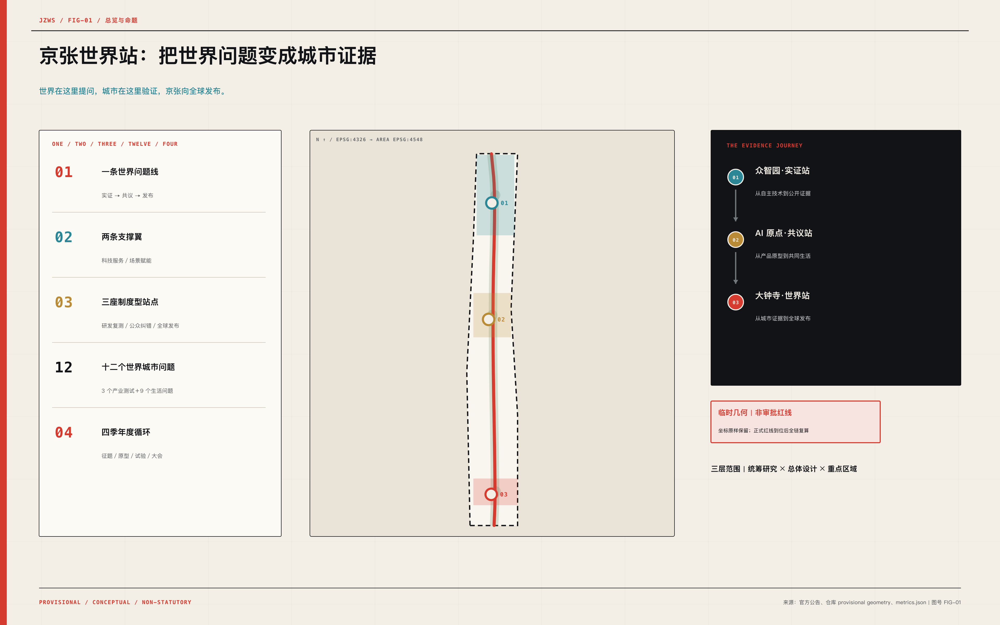
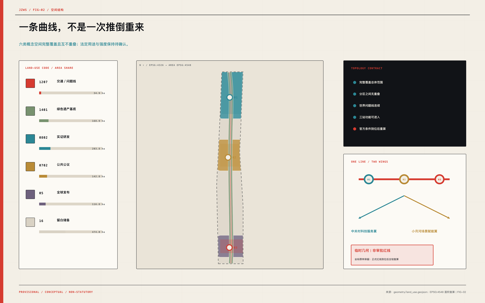
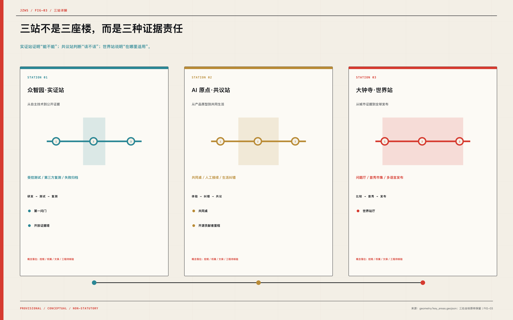
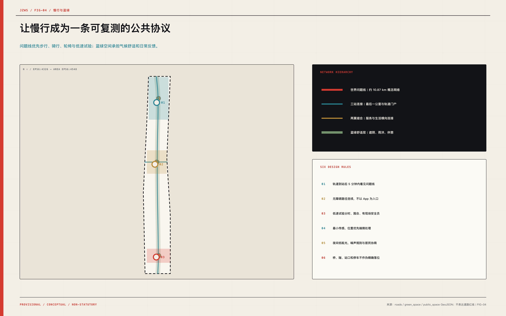
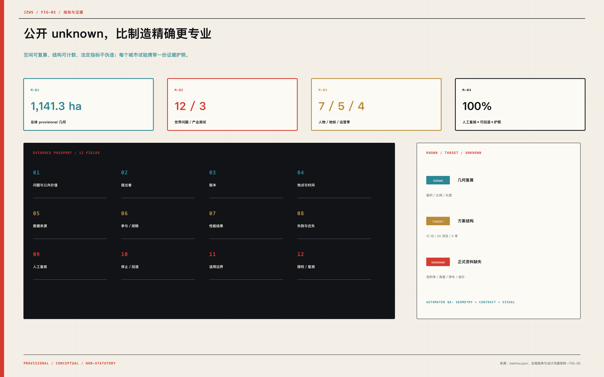

# 京张世界站

> **世界在这里提问，城市在这里验证，京张向全球发布。**

**世界 AI 城市公议·中试·发布带｜JINGZHANG WORLD STATION**

京张不缺技术、不缺企业，也不缺活动；它真正稀缺的是一种城市能力：让一个全球问题进入北京，经过公开测试、真实生活纠错和独立复测，最终以带着失败、边界与适用条件的证据回到世界。京张世界站把这条能力做成空间、制度和年度节律，而不是再造一条“展厅走廊”。

方案锁定为 **一线、两翼、三站、十二问、四季**：一条“世界问题线”沿百年京张组织证据旅程；中关村科技服务翼与小月河场景赋能翼提供专业和日常支撑；众智园·实证站、AI 原点·共议站、大钟寺·世界站分别完成研发复测、公众纠错、全球发布；十二个问题覆盖产业与生活；四季循环让一次征集变成长期城市制度。

| 从常见 AI 园区到京张世界站 | 价值跃迁 |
| --- | --- |
| 从展示“最好的一面” | 转向同时公开能力、失败、边界与版本 |
| 从企业寻找场景 | 转向世界城市提出问题、企业用证据回答 |
| 从一次大会 | 转向“征题—原型—城市试验—世界发布”的全年循环 |
| 从技术替人 | 转向人类复核、可暂停、可回退、可退出 |
| 从地标作为造型 | 转向地标作为公共制度的可见接口 |

本方案是开放共创建议，不替代正式规划，不构成政府审定结论。所有精度敏感空间结果均保留 provisional 身份和复算触发器。

## 设计依据与资料清单

第一依据是海淀分局发布的国际方案征集公告；第二依据是仓库 formal guide、agent taskbook、专业参考和结构化数据契约；第三层才是国际机制与官方政策背景。资料不是按“看起来权威”排序，而是按 **能否支撑何种结论** 分级：公告支撑任务和范围，仓库 provisional 几何只支撑概念生成与复核，外部案例只支撑机制启发。该证据层级由 [source:SRC-OFFICIAL-ANNOUNCEMENT] 与 [standard:PROJECT-OFFICIAL-ANNOUNCEMENT] 主控。

| 资料层 | 本方案如何使用 | 明确禁止 |
| --- | --- | --- |
| 官方公告与政策 | 定义任务、战略方向与公开背景 | 不反推宗地、道路或工程参数 |
| 仓库结构化资料 | 锁定提交契约、枚举、来源与 provisional 坐标 | 不升级为 official redline |
| 专业标准参考 | 校验城市设计、控规表达和用地代码 | 不把概念建议写成法定控制 |
| 国际一手案例 | 提取议题、测试、报告、参与机制 | 不暗示合作、背书或法律等同 |
| 方案自生成数据 | 生成概念分区、模块、指标和图件 | 不编造现状、权属、造价与承载力 |

总体范围 `PROV-SITE-001` 与三处重点区域坐标被原样保留。尤其 `PROV-KEY-003` 与总体 provisional polygon 的位置偏离没有被偷偷“修正”，而是进入 assumptions、constraints 和重算依赖。这个选择牺牲表面上的整齐，却保住了方案的证据可信度：正式红线到位后，空间裁剪、面积、比例、道路、建筑、分期和图纸必须全链重算。

## 三层范围工作框架

三层范围不是三张尺度不同的图，而是三个相互检验的问题。约 43.6 km² 的统筹研究范围回答“海淀如何成为世界城市 AI 问题的组织者”；总体设计范围回答“这一制度如何落成可步行、可进入、可运营的城市带”；三处重点区域回答“一个技术如何在具体建筑、公共空间、人工接管和退出条件下被验证”。工作框架由 [depth:three_level_scope_framework] 校验。

| 层级 | 核心判断 | 交付证据 |
| --- | --- | --- |
| 统筹研究范围 | 产业生态从要素集聚升级为全球问题组织能力 | 区域网络、八类投入、八个机制先例、年度运营 |
| 总体设计范围 | 一条问题线连接两翼三站，形成证据旅程 | 用地、建筑、慢行、蓝绿、公共空间、分期图层 |
| 重点区域范围 | 三站拥有不同门槛、空间类型和公共责任 | 三站方案、十二场景、五个地标、项目清单 |

空间基线见 [data:geometry/site_boundary.geojson#PROV-SITE-001]，三处重点区域见 [data:geometry/key_areas.geojson#PROV-KEY-001]。二者都属于 provisional constraint；总体边界投影面积约 1,141.3 ha，仅用于本次概念分配与比例复算。

## 统筹研究范围产业与未来城市研究

京张世界站的产业策略不是“再列一张 AI 产业链”，而是把海淀最强的科研、开源、企业与服务能力变成一种全球公共产品：**世界问题协议**。城市、社区、研究者或机构提出可验证的问题；京张把问题拆成数据边界、测试协议、空间条件、人工复核、停止规则和证据格式；企业竞争的不只是参数，而是谁能在真实公共利益约束下给出可复测答案。这与“三区两翼”的国际网络、标准服务和城市客厅方向相衔接 [source:SRC-BEIJING-THREE-ZONES]，并逐项回应智能体任务书 [standard:PROJECT-AGENT-OPEN-CALL-TASKBOOK]。

八类创新投入不再以补贴清单进入，而以门槛进入世界站：

| 创新投入 | 进入世界站的规则 |
| --- | --- |
| 土地 | 盘点和复用合法可进入的存量空间 |
| 空间 | 可逆原型、共享测试与公共首层 |
| 产业 | 以世界城市问题组织跨行业测试 |
| 资金 | 小额原型、证据后续投和阶段退出建议 |
| 人才 | 问题驻留、开发者社区和用户共同设计 |
| 算力 | 按任务申请并记录资源与能耗边界 |
| 数据 | 来源登记、最小化、分级访问和退出 |
| 场景 | 公开征集、风险筛选、小范围测试与复盘 |

八个外部机制提供的是可转译的方法，而不是“国际机构名单墙”：

| 外部机制 | 可转译机制 | 京张转译；不暗示合作 |
| --- | --- | --- |
| 联合国全球 AI 治理对话 | 全球多利益相关方议题平台 | 世界问题征集与年度议题厅 |
| ITU AI for Good | 全球会议、技术展示与公共议题连接 | 世界站大会与全年试验前后链条 |
| 新加坡 AI Verify | 开源测试工具和产业共同体 | 互操作赛道与证据护照 |
| NIST AI 联盟 | 测量科学、工作组和跨行业协作 | 公开复测与主题工作组 |
| 欧盟 AI 监管沙盒 | 有边界的真实环境测试 | 可暂停、可回退、有人监督的城市试验 |
| OECD 广岛进程报告框架 | 可比较的跨境透明度报告 | 世界城市证据页与年度发布 |
| 蒙特利尔宣言 | 专家与市民共同参与伦理框架 | 共同桌与用户共同评议 |
| 英国 AI 安全研究所 | 独立测试、研究与能力边界 | 安全演练、失败记录与适用条件 |

区域协同采用“问题交换”而非同质招商：北纬社区提供青年与生活服务经验，未来科学城提出能源和生命科学交叉问题，怀柔科学城提供科学 AI 与大科学装置验证方法，北京经开区贡献具身智能与制造测试，京津冀城市网络提供跨城比较。每个伙伴既可发题，也可带走协议、失败档案和开源工具；京张承担问题编排与可比证据的枢纽。

由此形成最关键的差异化：别的园区发布产品，京张世界站发布 **城市已经学会了什么、仍不知道什么、何时必须停用什么**。这既服务世界级创新生态，也让高水平人才看见自己在城市公共生活中的长期位置。

## 总体设计范围城市更新与控规深度城市设计

总体结构是一条“世界问题线”、两条支撑翼和三座制度型站点。问题线不是一根视觉轴，而是从实证、共议到发布的顺序：任何场景都必须先通过受控测试，再进入真实生活共同评议，最后才可发布。两翼分别供给知识产权、人才、资本、标准、算力、国际服务，以及公共生活、蓝绿空间、气候舒适和日常反馈。结构由 [depth:overall_spatial_structure] 约束。

| 站 | 公共使命 | 关键动作 |
| --- | --- | --- |
| 众智园·实证站 | 从自主技术到公开证据 | 研发 → 测试 → 复测 |
| AI 原点·共议站 | 从产品原型到共同生活 | 体验 → 纠错 → 共议 |
| 大钟寺·世界站 | 从城市证据到全球发布 | 比较 → 首秀 → 发布 |

概念分区以世界问题线的曲线缓冲和三站影响范围生成，形成六类连续、无重叠、完整覆盖的空间。交通、绿色遗产、实证研发、公共公议、世界发布与留白储备不是法定地类调整，而是为了检验结构是否能落到完整场地。用地首要证据见 [data:geometry/land_use.geojson#LU-TRANSIT]，18 个小型可逆模块见 [data:geometry/buildings.geojson#BLDG-S1-01]。

更新不是“推倒重来”。近期先用可逆设施、开放首层、共用测试间和公共运营激活节点；中期在权属、文保、消防、市政和控规确认后做站点缝合；长期才讨论永久建设。所有新增体量以“不遮蔽铁路证据、不切断社区、不以智能化制造强制消费”为城市设计原则。

## 重点区域详细设计

三站不是三座相似的创新综合体，而是三种不同的证据责任。详细设计深度由 [depth:three_key_area_detailed_design] 主控，重点区几何仍以 provisional 坐标呈现。

**众智园·实证站｜从自主技术到公开证据。** 以“受控测试核＋开放观察环＋清河绿色界面”组织：内核容纳全栈互操作、具身低速共存、城市智能体韧性三类产业测试；中环提供第三方复测、标准工作坊、红队观察和失败归档；外环把测试边界解释给公众。第一问门只展示当年最重要的问题，开放证据塔则把版本、能力、失败和适用条件做成立体档案。任何试验都与生产控制系统隔离。

**AI 原点·共议站｜从产品原型到共同生活。** 以共同桌为中心，连接近校成果转化、无障碍共创、公共服务人工接续、青少年开源学习和生活试验。公共首层不以消费资格筛选参与者；老年人、残障者、照护者与一线维护者不是被访谈对象，而拥有纠错、暂停和否决入口。开源贡献者里程只记录获授权、可撤回、能核验的真实维护与贡献。

**大钟寺·世界站｜从城市证据到全球发布。** 把轨道门户、世界城市问题厅、智能原生首秀市集、多语言证据库和年度大会叠合为“到站即读懂”的公共站厅。这里不发布无条件的产品宣传，只发布证据护照：谁提出问题、在哪测试、用了什么数据、谁复核、发生过什么失败、适用于何处、如何退出。站厅连接四象限步行网络，但具体轨道衔接与落位须等待权威几何与交通资料。

三站共用一套小构件库：证据牌、急停柱、人工服务窗、匿名反馈台、可逆测试铺装、无障碍观察点、版本灯箱与公开更正栏。它让宏大叙事落实到人可以触碰、质疑、停止的尺度。

## AI 创新生态、人才画像与 AI+ 场景

人才策略从“吸引多少人”转向“谁在问题链上拥有何种权力”。七类共同设计者覆盖研究、创业、城市运维、家庭照护、无障碍、青年和国际交流；他们贯穿发题、测试、纠错、发布与维护，而不是只在开幕活动出现。每个场景均具有人类复核、停止或回退路径，并明确无生物识别必要性；这一设计边界由 [source:CASE-AI-VERIFY] 与 [depth:municipal_new_infrastructure] 支撑，但制度仍需本地化。

| 共同设计者 | 完整旅程 |
| --- | --- |
| AI 研究者与开源开发者 | 从实证测试进入公共反馈与全球发布 |
| 创业团队与产品负责人 | 把原型变成有边界、可解释、可复测的城市产品 |
| 城市运营与一线维护人员 | 定义接管、维护、停用和恢复条件 |
| 社区家庭与照护者 | 检验场景是否适合真实生活节奏 |
| 老年人及残障共同设计者 | 拥有无障碍审查、纠错和否决入口 |
| 青年学生与初级开发者 | 从 AI 素养进入真实开源贡献 |
| 国际人才、城市访客与合作机构 | 比较证据、参与议题并带回可复用工具 |

十二问是整套方案的“城市 API”。前三问为产业测试验证场景，后九问把无障碍、公共服务、学习、气候、夜间、铁路记忆、贡献记录、产品首秀与跨城交流纳入同一证据标准：

| 编号 | 世界城市问题／场景 | 空间与运行 | 数据边界 | 人工复核与回退 |
| --- | --- | --- | --- | --- |
| 01 | **全栈互操作公开赛道**；不同芯片、模型、工具链和智能体接口能否在公开测试协议下协作？ | 受控实验室、开放观察廊；预约测试、协议公开、第三方复测、失败记录入库 | 仅使用获授权测试数据和合成数据；不接入生产系统 | 测试负责人签署结果，外部复测后方可发布；接口隔离、版本回退、立即终止试验 |
| 02 | **具身智能低速共存测试街**；机器人能否在受控、可暂停、有人工监督的环境中与行人安全共享空间？ | 围合低速测试环、无障碍观察点；分时预约、地理围栏、现场安全员、公开事件复盘 | 默认边缘处理并模糊化旁观者；不保存无关影像 | 现场安全员拥有最高控制权；物理急停、远程停机、人工撤离路线 |
| 03 | **城市智能体韧性演练舱**；城市智能体失效、受攻击或产生错误建议时，能否被发现、隔离、人工接管并恢复？ | 仿真演练舱、红队观察室；情景注入、红队测试、人工接管演练、恢复复盘 | 只使用脱敏或合成城市数据，禁止连接真实控制设备 | 城市专业人员对所有建议作最终判断；沙盒隔离、状态快照、人工恢复 |
| 04 | **无障碍导航共创径**；视障者、老年人和行动不便者能否真正理解、纠错并退出 AI 导航？ | 无障碍连续路径、人工服务点；共同踏勘、路径试用、障碍报告、人工更新 | 位置数据在设备端处理，参与者可匿名反馈 | 无障碍共同设计者确认改动优先级；纸质地图、人工引导、关闭错误路线 |
| 05 | **公共服务协作台**；公共服务 AI 能否解释信息来源，并在一步内转交人工服务？ | 开放服务台、人工复核室；信息检索、来源展示、人工接续、错误纠正 | 默认不保存对话；敏感事项仅由人工处理 | 人工服务人员拥有最终解释权；一键转人工、纸质与电话替代 |
| 06 | **青少年开源学习站**；青少年能否在不交出不必要个人数据的前提下学习模型、代码和数据素养？ | 开放教室、离线模型桌；导师工作坊、离线实验、开源贡献、监护知情 | 不收集广告画像，不把学生作品默认用于训练 | 导师审核内容、风险和贡献发布；离线模式、删除作品、撤回公开贡献 |
| 07 | **气候舒适共感廊**；AI 能否通过匿名或聚合数据帮助优化遮阴、休憩和微气候体验，而不形成个体监控？ | 蓝绿慢行廊、气候休憩点；匿名舒适投票、传感器校准、季节性设施调整 | 仅记录环境值与聚合反馈 | 园林、运营和公众共同审阅调整；恢复固定照明与人工维护模式 |
| 08 | **安静夜间协商路**；智能照明、活动和安全系统能否同时满足夜间安全、节能、安静和隐私？ | 夜间慢行路、安静边界点；时段规则、照度试验、噪声协商、投诉复盘 | 仅使用环境声级和照度，不录制可识别谈话 | 夜间运营规则由居民和运营者共同确认；切换固定保守照明并暂停活动 |
| 09 | **百年京张记忆接口**；AI 能否基于有出处的档案讲述铁路历史，并明确区分事实、推断和创作？ | 遗产阅读点、公共档案桌；档案清点、事实标注、专家复核、公众纠错 | 只使用可公开和可清权资料 | 历史专业人员审核核心叙述；下线错误内容并保留更正记录 |
| 10 | **开源贡献者里程**；普通开发者、居民、维护者和研究者的真实贡献能否在取得同意后被城市长期记录？ | 连续地面标识、版本档案点；贡献提名、证据核验、授权展示、版本更新 | 只展示明确授权的姓名或匿名标识 | 维护委员会核验贡献与撤回请求；随时匿名化或撤下记录 |
| 11 | **智能原生首秀市集**；AI 产品能否在购买和规模部署前接受公众试用、无障碍检查、风险说明和人工服务验证？ | 可逆展亭、人工售后台；限时试用、风险卡、无障碍审查、问题回收 | 试用数据默认本地保存且可删除 | 产品方和独立用户审查共同签署证据；撤柜、退款/退出路径、停用远程服务 |
| 12 | **世界城市问题厅**；不同城市能否使用可比较的证据模板讨论共同问题，而不是只交换宣传口号？ | 年度议题厅、多语言证据廊；问题征集、证据对照、公众评议、年度发布 | 只发布获得授权、可复核和去识别化的结果 | 多利益相关方编辑委员会审定发布边界；撤回错误条目并保留公开更正 |

所有场景采用六道门：公共价值筛选；数据与权利清点；小范围、可暂停试验；有权的人类复核；第三方复测；带条件发布。试验失败不是品牌事故，而是必须进入版本档案的公共知识。任何场景若不能回答“谁可一键停止、谁承担维护、参与者如何退出”，就不能进入世界站。

## 用地、建筑规模与拆改留方案

概念用地采用可校验代码，形成完整无重叠分区；这是设计结构测试，不是法定用地方案。分类依据及其边界由 [standard:MNR-LAND-USE-CLASSIFICATION-GUIDE] 说明，几何分区见 [data:geometry/land_use.geojson#LU-TRANSIT]。

| 代码 | 概念角色 | 投影面积（仅供结构复算） |
| --- | --- | --- |
| 1207 | 概念交通与世界问题线 | 34.9 ha |
| 1401 | 概念绿色遗产基底 | 168.9 ha |
| 0802 | 概念实证研发空间 | 203.8 ha |
| 0702 | 概念公共公议与社区服务 | 142.8 ha |
| 05 | 概念世界发布与交流服务 | 116.8 ha |
| 16 | 概念留白与待核验更新储备 | 474.0 ha |

18 个建筑模块总基底约 5.39 ha，只用来检验三站能否容纳公共首层、受控测试、复测、人工服务与发布空间；它们没有被赋予容积率、高度或最终建面。建筑证据见 [data:geometry/buildings.geojson#BLDG-S1-01]。正式设计采用四级拆改留规则：有价值或未调查对象“先保留”；可改善对象“微更新”；新增需求优先“可逆加建”；任何缺文保、结构、权属和消防结论的对象均标为“待鉴定”，不做拆除承诺。

风貌不是科技蓝光和巨型屏幕。材料策略从铁路工业的耐久、可修、可读出发：深煤黑作为结构与文字，纸张米白作为公共阅读底，信号红提示问题和风险，证据青标示测试与复测，共议金标示公民参与。永久建筑应安静，运营层可更新；品牌设施必须可拆、可修、可迭代。

法定强度指标保持结构化 unknown：总建筑面积、容积率、建筑密度、高度、退界、道路面积、停车、市政容量和造价必须在正式红线、控规、现状建筑、轨道、权属和工程资料到位后由专业团队复核。

## 交通、轨道、市政与公共服务设施

交通结构采用“轨道到站—世界问题线慢行—三站最后一公里—两翼横向缝合”。概念慢行及站间联系约 10.87 km，表达的是网络关系而非道路红线。世界问题线优先步行、骑行、轮椅与低速试验；站点连接优先穿越安全、遮阴、休憩和夜间可读性。道路证据见 [data:geometry/roads.geojson#ROAD-WORLD-LINE]，专业深度由 [depth:traffic_rail_slow_parking] 约束。

大钟寺的轨道门户、AI 原点的近校慢行和众智园的对外交通均以“先诊断断点、再提出可逆连接、最后进入工程校核”推进。由于 KEY-003 位置和道路红线未确认，任何桥、隧、站口、停车位或交叉口改造只列为研究议题，不在图上伪造精确落位。

新型基础设施采用“最小传感＋边缘处理＋人工接管”原则：可信数据间登记来源与访问，任务型算力记录能耗与版本，场景节点默认离线或边缘计算，公共服务台保留纸质、电话和人工渠道，急停与恢复不依赖同一 AI 系统。约束与缺资料见 [data:geometry/constraints.geojson#CONSTRAINT-PROVISIONAL-SITE]。设施容量、管线、供电、防洪、消防与运维责任必须在后续市政综合中确认。

## 蓝绿空间、公共空间与城市风貌

绿色不是隔离园区的背景，而是世界站最普惠的“慢速验证基础设施”。概念绿色基底约 206.1 ha，站前公议空间约 9.8 ha；前者承担遗产阅读、遮阴、雨洪与连续慢行，后者专指三站可组织公议与发布的核心广场，因此不能把 0.86% 误读为全场地公共空间总量。绿地证据见 [data:geometry/green_space.geojson#GREEN-WORLD-LINE]，站前公共空间见 [data:geometry/public_space.geojson#PUBLIC-STATION-1]，深度由 [depth:blue_green_public_space] 校验。

三种文化不是贴图拼盘。百年京张文化提供“线路、站、时刻、共同抵达”的空间语法；中关村文化提供“问题、开源、迭代、贡献”的组织伦理；AI 新文化加入“版本、证据、边界、人工复核”。最终形成 **Railway Evidence／铁路证据** 视觉哲学：铁路时刻表的秩序、科学期刊的可核验、外交档案的庄重。

| 地标 | 公共价值 |
| --- | --- |
| 第一问门 | 每年只展示一个最重要的全球城市 AI 问题 |
| 开放证据塔 | 立体展示能力、失败、边界与版本 |
| 共同桌 | 支持平等参与的无障碍公共共议 |
| 世界站厅 | 年度议题、城市案例、首秀与国际交流 |
| 开源贡献者里程 | 记录获授权的真实贡献与维护历史 |

五个地标都必须同时满足三个条件：不用购票即可进入；不靠人脸识别或强制 App 才能使用；在设备关闭后仍保留基本公共功能。夜间照明采用低眩光和时段协商，声音只记录环境级，不录制可识别谈话；雨洪、树阵、座椅和无障碍坡道优先于互动屏幕。

## 更新项目清单、实施政策与分期计划

年度运营形成四季循环：世界问题征集季面向城市与公众收题并筛选公共价值；开放原型季进行互操作、红队与证据护照初稿；城市试验月开展小范围生活验证与共同评议；世界站大会发布结果、失败档案和下一年度问题。它不是一次活动排期，而是让空间每年产生可比较知识的运营制度。

| 季 | 名称 | 核心动作 |
| --- | --- | --- |
| 1 | 世界问题征集季 | 征集、证据盘点、公共利益筛选 |
| 2 | 开放原型季 | 互操作、红队测试、证据护照初稿 |
| 3 | 城市试验月 | 小范围生活测试、用户共同评议 |
| 4 | 世界站大会 | 发布结果、失败档案与下一年度问题 |

24 个项目按四阶段推进，分期空间见 [data:geometry/phasing.geojson#PHASE-1]，实施深度由 [depth:phasing_implementation] 约束：

| 阶段 | 建议窗口 | 项目包（均为概念建议） |
| --- | --- | --- |
| 证据基线与品牌原型 | 0-6 个月建议窗口 | P01 证据与缺资料基线；P02 世界问题征集机制；P03 品牌与导视原型；P04 第一问门原型 |
| 三类可逆试验 | 6-18 个月建议窗口 | P05 全栈互操作公开赛道；P06 具身智能低速共存测试街；P07 城市智能体韧性演练舱；P08 开放证据塔原型；P09 无障碍导航共创径；P10 公共服务协作台；P11 青少年开源学习站；P12 共同桌；P15 百年京张记忆接口；P22 证据护照登记系统 |
| 三站联动 | 18-36 个月建议窗口 | P13 气候舒适共感廊；P14 安静夜间协商路；P16 开源贡献者里程；P17 开放问题驻留计划；P19 智能原生首秀市集；P21 区域问题交换网络；P23 多语言城市证据库 |
| 长期国际网络 | 36 个月以后建议窗口 | P18 世界城市问题厅；P20 世界站大会；P24 年度复盘与续期机制 |

分期采用证据门槛而非只看年份。Phase 0 只有在资料基线公开后结束；Phase 1 的可逆试验只有在急停、人工接管、隐私和无障碍验收后开放；Phase 2 只有在三站之间的证据护照可互认后扩展；Phase 3 必须有独立评估、续期与退出机制。资金采用“小额原型—证据后续投—年度续期”，避免永久建设绑架错误方向。

政策抓手包括：开放场景协议、公共价值评审、失败披露最低项、参与者撤回权、无障碍共同设计席位、数据退出与销毁、运营者维护预算、轻量设施许可、跨城证据模板和年度第三方审计。组织结构建议为公共发起方、专业委员会、居民与无障碍席位、开源维护者、独立评估者五方共治；尚未形成任何机构承诺。

## 指标体系、面积复算与合规矩阵

指标分三类：A 类为由几何直接复算的 provisional 空间指标；B 类为方案结构计数与治理覆盖；C 类为缺正式条件而保持 unknown 的法定或工程指标。公开一个 unknown 比制造一个精确假值更专业。全部数值带来源文件、公式、置信度与假设，复算深度由 [depth:metrics_recalculation] 管理。

| 指标 | 当前值 | 置信度 | 机器引用 |
| --- | --- | --- | --- |
| 总体 provisional 几何面积 | 1141.3 ha | medium | [metric:site_area_sqm] |
| 三处重点区域 | 3 | high | [metric:key_area_count] |
| 概念绿地 | 206.1 ha／18.06% | low | [metric:green_ratio] |
| 概念站前公共空间 | 9.8 ha／0.86% | low | [metric:public_space_ratio] |
| 18 个概念建筑模块基底 | 53,856 m² | low | [metric:building_footprint_area_sqm] |
| 概念慢行与站间联系 | 10.87 km | low | [metric:road_length_m] |
| 年度世界城市问题 | 12 | high | [metric:scenario_question_count] |
| 产业测试验证场景 | 3 | high | [metric:industry_test_count] |
| 共同设计人物 | 7 | high | [metric:persona_count] |
| 公共地标 | 5 | high | [metric:landmark_count] |
| 年度运营季 | 4 | high | [metric:annual_season_count] |
| 概念项目包 | 24 | high | [metric:project_count] |
| 场景人工复核覆盖 | 100% | high | [metric:human_review_coverage] |
| 场景停止／回退覆盖 | 100% | high | [metric:rollback_coverage] |
| 证据护照覆盖 | 100% | high | [metric:evidence_passport_coverage] |
| 容积率 | unknown：缺正式控规 | unknown | [metric:floor_area_ratio] |

每个场景的“证据护照”固定记录十二项：问题与公共价值；提出者；版本；测试地点与时间；输入数据来源；参与者与排除条件；性能结果；失败与近失事件；人工复核者；停止／回退方式；适用与不适用边界；授权和复测状态。发布页必须把“未验证”和“验证失败”做成一等状态，不能只展示成功案例。

合规矩阵覆盖公告 1.3、1.4、1.5 及 agent.1-agent.6；专业矩阵覆盖六类标准响应；设计深度矩阵覆盖 15 项成果。正文负责让人读懂，JSON 负责让机器审计，GeoJSON 负责让空间复算，A3/A0 负责让评审快速比较，离线 HTML 负责完整浏览——五层证据互相指向而不重复堆砌。

## 风险、版权与合规说明

九类重大假设已登记：总体 provisional 边界；KEY-003 位置偏离；控规条件缺失；道路与市政缺失；权属缺失；文保条件缺失；运营机制尚属概念；结构指标属于目标；外部案例仅作机制转译。每项都写明影响文件、验证方法和重算依赖，风险深度由 [depth:risk_missing_data] 管理；几何来源边界见 [source:REPO-PROVISIONAL-GEOMETRY]。

本方案不声称：官方批准、法定控规、最终权属、最终建设规模、正式合作伙伴、确定投资、确保实施或技术无风险。所有涉及人和城市服务的 AI 场景必须坚持数据最小化、不要求生物识别、可解释来源、人工最终决定、可暂停、可回退、可匿名反馈、可撤回贡献。涉及儿童、医疗、法律、公共安全等高风险服务时，本方案只提供空间与治理原型，不能替代行业审批和专业服务。

版权采用“只用可追溯资产”的原则：本包中的图形由提交者根据仓库几何与自有设计系统生成；没有复制竞赛方案、商业地图、未授权照片、机构标识或第三方字体文件。官方网页和国际案例仅作事实性转述并逐项登记来源、权利与限制。名称、图标、企业案例、人物贡献进入公共展示前仍需清权；任何机构名称出现均不表示合作或背书。

HTML 必须完全离线，不加载远程脚本、地图瓦片、字体、iframe、表单、追踪或 API；PDF 将检查页数、尺寸、文本提取与逐页渲染；最终 PR 只允许修改 `submissions/Hyp6666/jingzhang-world-station/`。这些不是附录性合规，而是“世界站能否被相信”的一部分。

## 参考资料

正文仅保留直接影响判断的一手来源；完整机器索引、访问日期、用途、权利和局限见 `sources.json`。提交契约以 [source:REPO-FORMAL-GUIDE] 为准。

- **REPO-FORMAL-GUIDE｜Formal Submission Guide** — open-city-ai/haidian maintainers；用途：Submission contract, depth, bilingual, figure, HTML, PDF, and validation requirements；限制：Workflow authority, not a source of official site geometry；docs/formal-submission-guide.md
- **REPO-AGENT-TASKBOOK｜Agent Taskbook** — open-city-ai/haidian maintainers；用途：Three positions, five functions, Three Zones and Two Wings, agent.1-agent.6；限制：Agent-facing taskbook; does not replace statutory planning；brief/site-package/agent_taskbook.json
- **REPO-PROVISIONAL-GEOMETRY｜Provisional Boundaries** — open-city-ai/haidian maintainers；用途：Provisional intake, topology generation, visualization, and validation；限制：Not official, precise, statutory, or approval-ready; all precision-sensitive outputs require recalculation；brief/site-package/geometry/provisional_boundaries.geojson
- **SRC-OFFICIAL-ANNOUNCEMENT｜百年京张AI创新带城市设计国际方案征集资格预审公告** — 北京市规划和自然资源委员会海淀分局；用途：Official scope, key areas, tasks, and deliverable context；限制：Precise redlines and professional attachments were not publicly included in the repository package；https://ghzrzyw.beijing.gov.cn/zhengwuxinxi/tzgg/hd/202605/t20260509_4643047.html
- **SRC-BEIJING-THREE-ZONES｜海淀加快建设人工智能创新街区“三区两翼”** — 北京市科学技术委员会、中关村科技园区管理委员会；用途：Nine-kilometre corridor, international network, AI city living room, standards, and cooperation-hub background；限制：Strategic background only; no parcel-level control；https://kw.beijing.gov.cn/xwdt/kcyx/xwdtcyfz/202604/t20260403_4573808.html
- **SRC-BEIJING-AI-HIGHLAND｜北京人工智能创新高地建设行动计划** — 北京市经济和信息化局；用途：Technology, compute, data, scenarios, open source, ecosystem, and safety-governance alignment；限制：Citywide policy context; no project commitment；https://jxj.beijing.gov.cn/ztzl/ywzt/hbjh/hbdt/zcwj/rgznzc/202603/t20260316_4557526.html
- **SRC-CHINA-GLOBAL-AI-ACTION｜全球人工智能治理行动计划** — 中华人民共和国外交部；用途：International platforms, open cooperation, testing, evaluation, UN mechanisms, and capacity-building alignment；限制：National action-plan context; no local implementation commitment；https://www.mfa.gov.cn/web/ziliao_674904/1179_674909/202507/t20250726_11677803.shtml
- **SRC-AI-ORIGIN｜北京AI原点社区公开介绍** — 北京市服务业扩大开放综合试点；用途：AI Origin community and global talent first-stop background；限制：Published descriptive figures require date-sensitive citation and are not parcel controls；https://open.beijing.gov.cn/html/haidian/gzdt/2026/1/1768186004465.html
- **CASE-UN-DIALOGUE｜Global Dialogue on AI Governance** — United Nations；用途：Global multistakeholder question-setting and dialogue mechanism；限制：Global governance precedent; not a direct local institutional template；https://www.un.org/global-dialogue-ai-governance/en
- **CASE-UN-LAB｜AI Governance for Humanity Lab** — United Nations Office for Digital and Emerging Technologies；用途：Bridge between evidence, regions, private practice, and implementation；限制：Program precedent; no spatial transfer without local adaptation；https://www.un.org/digital-emerging-technologies/content/ai-governance-humanity-lab
- **CASE-ITU-AI-FOR-GOOD｜AI for Good Global Summit 2026** — International Telecommunication Union；用途：Convening, demonstration, and global participation precedent；限制：Event precedent only; World Station adds a year-round urban test cycle；https://aiforgood.itu.int/summit26/practical-information/
- **CASE-AI-VERIFY｜AI Verify** — Infocomm Media Development Authority of Singapore；用途：Open testing toolkit, foundation community, and assurance sandbox precedent；限制：Testing mechanism requires local legal, technical, and sector adaptation；https://www.imda.gov.sg/how-we-can-help/ai-verify
- **CASE-NIST｜NIST Expands AI Consortium's Scope** — National Institute of Standards and Technology；用途：Measurement science, task groups, and cross-industry consortium precedent；限制：US institutional precedent; no implication of partnership；https://www.nist.gov/news-events/news/2026/05/nist-expands-ai-consortiums-scope-calls-new-members
- **CASE-EU-SANDBOX｜European approach to artificial intelligence** — European Commission；用途：Real-world regulatory sandbox and safeguard precedent；限制：EU legal context; only the bounded-test mechanism is transferred；https://digital-strategy.ec.europa.eu/en/policies/regulatory-framework-ai
- **CASE-OECD-HAIP｜Hiroshima AI Process Reporting Framework** — OECD.AI；用途：Comparable voluntary cross-border reporting precedent；限制：Reporting precedent; not a certification or local legal requirement；https://oecd.ai/en/hiroshima
- **CASE-MONTREAL｜Montréal Declaration for a Responsible Development of Artificial Intelligence** — Université de Montréal；用途：Citizen consultation and multidisciplinary ethics precedent；限制：Ethical precedent; local consultation design remains conceptual；https://montrealdeclaration-responsibleai.com/the-declaration/
- **CASE-UK-AISI｜AI Security Institute** — UK AI Security Institute；用途：Independent evaluation, research, and international cooperation precedent；限制：Institutional precedent; no implication of partnership or approval；https://www.aisi.gov.uk/

专业参考另见仓库 `brief/site-package/standards/references/`：项目公告、智能体任务书、《城市设计管理办法》、控制性详细规划编制审批办法、用地用海分类指南、建筑工程设计文件编制深度规定、生成式人工智能服务管理暂行办法、无障碍环境建设法及老年人运用智能技术困难实施方案。引用这些文件用于界定表达深度，不等于本概念方案已经取得法定效力。
