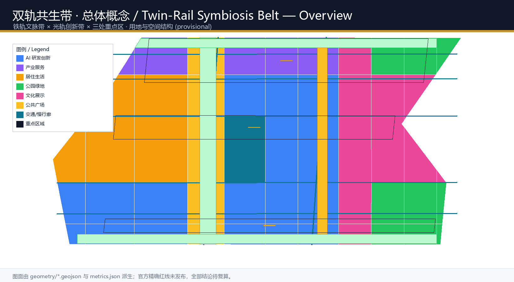
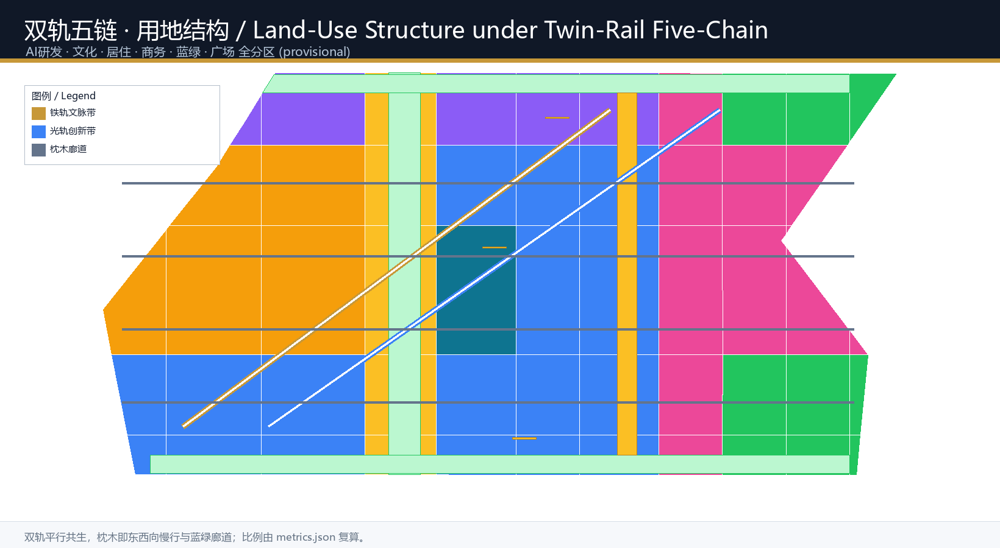
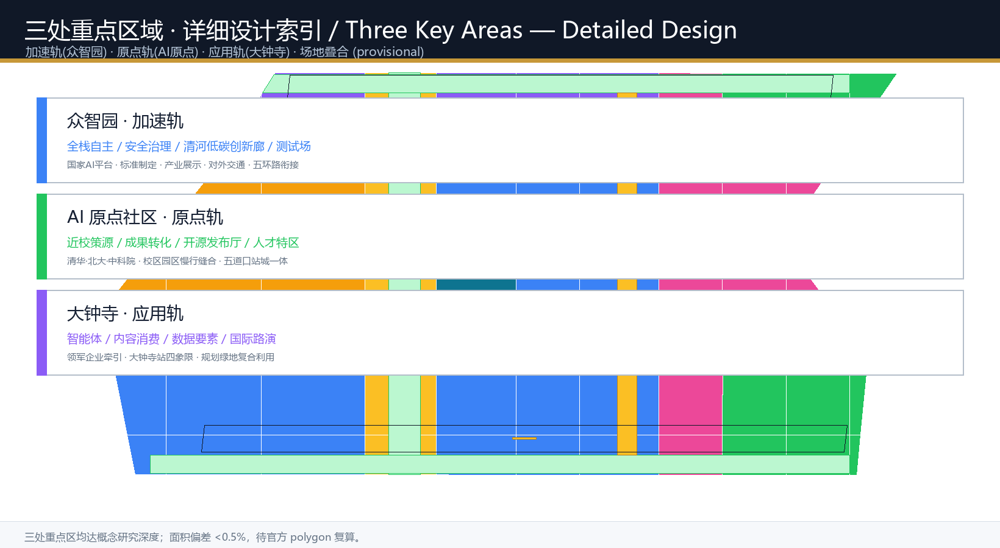
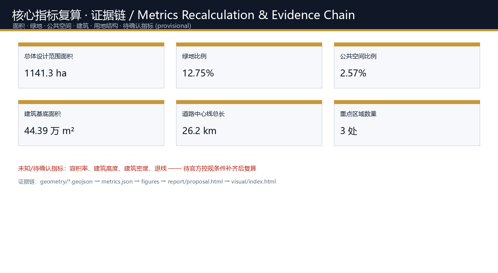

# The Twin-Rail Symbiosis Belt: Urban Design for the Centennial Jing-Zhang AI Innovation Belt

## Design Basis and Source List

This proposal takes as its primary basis the *Pre-qualification Announcement for the International Urban Design Solicitation of the Centennial Jing-Zhang AI Innovation Belt* published by the Haidian Branch of the Beijing Municipal Commission of Planning and Natural Resources [source:OFFICIAL-ANNOUNCEMENT], and cites the open-call taskbook addressed to global agents [source:AGENT-TASKBOOK] with its local reference excerpt [standard:PROJECT-AGENT-OPEN-CALL-TASKBOOK]. Site spatial data use the provisional rough boundary and three key-area polygons registered by repository maintainers [data:geometry/site_boundary.geojson#SITE-001]; their derivation and precision limits are recorded in `brief/site-package/geometry/provisional_boundaries_basis.md`.

Because the announcement has not yet published a downloadable official redline, the overall design boundary and three key areas are expressed as `provisional_constraint` [data:geometry/key_areas.geojson#PROV-KEY-001]. Every area, ratio, and layout in this proposal can be recalculated once official polygons are released; the organizer's data gap does not block content review, but any content involving statutory planning control, road redlines, land ownership, or engineering implementation is explicitly marked as pending confirmation [depth:risk_missing_data].

The proposal follows the *Urban Design Management Measures* on the coordination of public space, city character, and architecture [standard:MOHURD-URBAN-DESIGN-MEASURES], adopts the land-use classification of the Ministry of Natural Resources [standard:MNR-LAND-USE-CLASSIFICATION-GUIDE], and references the regulatory-planning framework of the *Measures for Compilation and Approval of Regulatory Detailed Plans* [standard:MOHURD-CONTROL-DETAILED-PLANNING]. The full source, metric, standard, and design-depth indexes are held in `sources.json`, `metrics.json`, `standard_matrix.json`, `design_depth_matrix.json`, and `compliance_matrix.json`.

## Three-Level Scope Framework

### Naming System and Overall Concept: The Twin-Rail Symbiosis Belt

This proposal advances **"The Twin-Rail Symbiosis Belt" (TRSB)** as its overall concept and naming system. It does not treat the Jing-Zhang railway as a decorative symbol; rather, it translates the railway's technical essence—**two parallel rails that, together with sleepers and ballast, carry a single train**—into the organizing logic of the AI-era city:

- **The Iron Rail**: carries a century of heritage. Anchored on the Jing-Zhang Heritage Park and the old Qinghuayuan Station, it links railway history and Zhongguancun innovation culture into a south-north **Centennial Jing-Zhang Culture Belt**.
- **The Light Rail**: carries AI industrial innovation. Centered on Zhongzhiyuan, the Beijing AI Origin Community, and Dazhongsi, it organizes computing, algorithms, data, talent, and scenarios into the **AI-Fusion Innovation Belt**.
- **The "Sleepers" between the rails**: east-west slow-traffic corridors, blue-green public space, and transit-station connections that "weld" history and future together, forming the **Urban AI Living Experience Belt**.

**Logo and visual identity direction**: a pair of parallel arcs (bronze and cyan) whose intersection forms a "transfer-node" ring, symbolizing history and future transferring and co-running at the same point; extended to signage, public art, transit stations, and landmark structures. The system is designed for international communication and works in bilingual and multi-cultural contexts [standard:PROJECT-AGENT-OPEN-CALL-TASKBOOK] [depth:brand_identity].

**Three-areas, two-wings synergy loop**: Zhongzhiyuan (the Acceleration Rail) carries full-stack self-dependent innovation and global AI-governance voice; the Beijing AI Origin Community (the Origin Rail) carries a world-class innovation ecosystem and technology transfer; Dazhongsi (the Application Rail) carries AI-native and AI+ new business forms and international exchange; the Zhongguancun Technology-Service Wing and the Xiaoyuehe Scenario-Empowerment Wing act as two "connecting rails" linking the key areas, wings, and the global innovation network into an evolvable loop [source:AGENT-TASKBOOK].

### The Three Scopes

| Level | Design Question | This Proposal's Answer | Data Anchor |
| --- | --- | --- | --- |
| Coordinated research area (43.6 km²) | How to organize the AI industry ecosystem and future city form | A "twin-rail symbiosis" innovation chain: university origination → open-source collaboration → enterprise transfer → public experience → international dissemination | compliance_matrix.json, standard_matrix.json |
| Overall design area (11.4 km²) | How to map industrial space, urban renewal, transport, and character | A composite structure of Iron-Rail culture belt + Light-Rail innovation belt + east-west sleeper corridors | [data:geometry/land_use.geojson#LU-001], [data:geometry/roads.geojson#ROAD-001] |
| Key detailed-design area (368.4 ha) | How to reach detailed design depth for the three areas | Position each as Acceleration Rail / Origin Rail / Application Rail with detailed schemes | [data:geometry/key_areas.geojson#PROV-KEY-001] |

The three scopes are not isolated drawing sets. The coordinated research area decides the industry-chain and city-form judgment; the overall design area lands that judgment in renewal projects, spatial structure, and facility capacity; the key areas verify feasibility at the parcel, building, transport, and scenario level [depth:three_level_scope_framework]. Because this proposal uses provisional boundaries, all spatial conclusions must be recalculated when official polygons arrive, while the design logic, spatial structure, and metric method remain usable.

## Coordinated Research Area: Industry and Future City Research

### A World-Class AI Innovation Ecosystem

The coordinated research area covers the "three areas and two wings" of Haidian's AI industry [data:geometry/key_areas.geojson#PROV-KEY-001] [source:THREE-AREAS-WINGS]. This proposal puts forward a **"twin-rail, five-chain" ecosystem**: the Iron-Rail culture belt carries the "talent chain + knowledge chain"; the Light-Rail innovation belt carries the "innovation chain + industry chain + capital chain"; the two rails feed each other through five horizontal "sleeper" corridors, forming a full-factor, full-cycle, full-chain AI innovation ecosystem.

**Global AI innovation ecosystem case studies** (5–8, as convertible-mechanism references [source:AGENT-TASKBOOK]):

1. **Silicon Valley (Stanford Research Park + Sand Hill Road)**: university origination → venture capital → corporate spin-off loop, inspiring Haidian's "Origin Rail" of university + incubation + capital.
2. **New York's "Silicon Alley"**: implanting digital industry into a mature urban core, inspiring Dazhongsi-type urban districts to use stock space for AI-native businesses.
3. **Singapore one-north**: a "mixed district" organizing R&D, living, and leisure around a public corridor, inspiring the Heritage Park vitality belt as an innovation-exchange living room.
4. **Toronto Waterfront + Sidewalk experiments**: data- and public-platform-supported waterfront renewal, inspiring the Xiaoyuehe Scenario-Empowerment Wing's "scenario-as-data" mechanism.
5. **Shenzhen Nanshan Science & Technology Park**: government guidance + market drive + localized industry chain for fast iteration, inspiring Zhongzhiyuan's full-stack self-dependence and safety governance.
6. **Korea's Pangyo Techno Valley**: a "startup-as-life" composite city form attracting talent, inspiring integrated R&D, talent apartments, education, and commerce.
7. **Berlin's Hub and Fab City ecosystem**: open-source, co-creation, and public-knowledge culture, inspiring the Origin Community's open-source system and brand events.

These cases' experience is converted into implementable spatial and operational mechanisms rather than copied concepts: **campus-park-district integration, transit-oriented development, an open-source public knowledge base, scenario-open testing grounds, international roadshows, and a talent special zone** [depth:industry_ecosystem].

### Landing the Naming and Logo in Industrial Space

The name "Twin-Rail Symbiosis Belt" points simultaneously to a **technological-historical fact** (the Jing-Zhang railway, the first trunk line designed and built independently by Chinese, led by Zhan Tianyou) and a **future vision** (the continuation of self-dependent innovation in the AI era) [standard:PROJECT-OFFICIAL-ANNOUNCEMENT]. The twin-rail visual symbol will be applied to key-area portals, transit-station integration, heritage-park signage, public art, and event branding, forming a complete identity system from industrial space to public perception [depth:overall_spatial_structure].

### A Future City Form Fit for Artificial Intelligence

The core change of the AI-era city is that **services shift from fixed places to on-demand agents**. This proposal envisions four future forms:

- **AI Culture**: synthesizing the Jing-Zhang pioneering spirit, Zhongguancun entrepreneurial spirit, and AI open-source spirit into a "generations-changing-the-world track" narrative, carried in signage, landmarks, and public art.
- **AI Society**: urban agents take on governance, livelihood services, and emergency response while preserving human review and public decision boundaries.
- **AI City**: roads, green belts, energy, and computing act as the low-level interfaces of a "city operating system" supporting evolvable, pluggable scenarios.
- **AI Scenarios**: around transport, health, education, law, life services, and public space, forming a scenario-card system that is perceivable, testable, and scalable [depth:future_city_form].

To meet the needs of AI talent and enterprises, the proposal plans an integrated "work-life-social-learn" urban space system, overlaying a 15-minute life circle with an innovation-service circle [metric:public_space_ratio], fostering an international, open innovation atmosphere.

## Overall Design Area: Urban Renewal and Regulatory-Plan-Level Urban Design

### Urban Renewal Framework: Twin Rails and Sleepers

The overall design area takes urban renewal as its lever, organizing the structure around the "Iron-Rail culture belt + Light-Rail innovation belt + east-west sleeper corridors." **Land-use structure**: within the 11.4 km² overall design area, AI R&D innovation land is about 34% (0802 research/design, hosting the core carriers of Zhongzhiyuan and the Origin Community), cultural land about 17%, residential about 16%, park green about 10%, commercial-financial about 9%, medical/education about 4%, and plaza/public space about 10% [data:geometry/land_use.geojson#LU-001] [metric:land_use_research_area_sqm]. This structure ensures ample space carriers for innovative industry while preserving livable and blue-green quality for talent.

### Renewal Projects and Spatial Organization

Renewal follows "low-disturbance, organic renewal, phased implementation" [depth:renewal_project_list]. Three types of potential space are identified:

1. **Low-efficiency space along the railway**: stitching both sides via the Heritage Park into a south-north public corridor.
2. **Stock space around universities**: releasing technology-transfer and talent-service space through campus-park-district integration.
3. **Around transit stations**: transit-oriented renewal around Wudaokou, West Qinghua East Road, and Dazhongsi stations.

The renewal project list appears in the "Renewal Projects, Implementation Policy, and Phasing" chapter. All retain/renovate/demolish suggestions are conceptual directions, not parcel-level approved conclusions [depth:retain_renovate_demolish].

### Regulatory-Plan Depth and Control Guidance

The proposal works at regulatory-detailed-planning urban-design depth as a conceptual-study framework [standard:MOHURD-CONTROL-DETAILED-PLANNING], and does not constitute an approved regulatory-plan result. For building height, intensity, character, roof form, and massing, it proposes **guidance directions** (e.g., the Light-Rail innovation belt as mid-rise, higher-density R&D districts; the Iron-Rail culture belt as low-rise, open-space-dominated; plot-ratio and interface control along both sides of the Heritage Park), but **specific regulatory values await official confirmation** [metric:building_height_m] [metric:floor_area_ratio].

## Detailed Design of Key Areas

The three key areas are positioned under a "three-rail" framework, each developed at conceptual-study depth for professional teams to deepen toward comprehensive-implementation-plan urban-design depth [depth:three_key_area_detailed_design].

### Zhongzhiyuan AI Self-Dependent Innovation Acceleration Area (Acceleration Rail)

- **Positioning**: a garden-style full-stack self-dependent innovation district carrying full-stack autonomy and global AI-governance voice [data:geometry/key_areas.geojson#PROV-KEY-001].
- **Spatial structure**: the "Acceleration Rail" spine links R&D clusters; combined with the Qinghe water edge it forms a low-carbon innovation-exchange green ring; it hosts national AI platform, standards-governance, and safety-evaluation nodes.
- **Building renewal**: retain existing industrial carriers, renew low-efficiency buildings as AI R&D and shared labs, and newly build garden-style low-density R&D blocks (conceptual).
- **Transport and slow traffic**: optimize external access to the 5th Ring Road; strengthen the internal slow ring and connection to the Qinghe blue-green belt.
- **Public space**: the Qinghe Low-Carbon Innovation Gallery as the district's public living room for display, testing, and exchange [data:geometry/public_space.geojson#PUBLIC-004].
- **AI scenarios**: self-dependent model testing, standards workshops, safety-governance display, low-carbon computing experience (see scenario cards).
- **Implementation risk**: national AI platform pacing, 5th Ring Road transport organization, and Qinghe blue-line constraints—all pending confirmation.

### Beijing AI Origin Community (Origin Rail)

- **Positioning**: a university-adjacent technology-transfer and talent community building a globally leading AI ecosystem [data:geometry/key_areas.geojson#PROV-KEY-002].
- **Spatial structure**: the "Origin Rail" connects origination universities (Tsinghua, PKU, CAS) and organizes campus-park-district slow-traffic stitching.
- **Building renewal**: low-disturbance organic renewal adding incubators, result-release halls, talent apartments, and living services around universities.
- **Transport and slow traffic**: transit-integrated design around Wudaokou and West Qinghua East Road stations; stitch campus-park slow-traffic gaps.
- **Public space**: the Origin Community Transfer Plaza as a public living room for result release, open-source events, and talent services [data:geometry/public_space.geojson#PUBLIC-002].
- **AI scenarios**: open-source community, result release, talent special-zone services, university-adjacent incubation (see scenario cards).
- **Implementation risk**: university ownership boundaries, historic-building protection, and station implementation—all pending confirmation.

### Dazhongsi AI Industry Cluster (Application Rail)

- **Positioning**: an urban smart-economy and international-exchange district hosting AI-native and AI+ new business forms (agents, smart terminals, content consumption) [data:geometry/key_areas.geojson#PROV-KEY-003].
- **Spatial structure**: the "Application Rail" links leading enterprises and industry carriers; transit-oriented development around Dazhongsi Station.
- **Building renewal**: renew potential parcels as smart-economy carriers; improve public environment and commercial services around key enterprises.
- **Transport and slow traffic**: Dazhongsi Station integration and four-quadrant pedestrian connectivity; complete non-motorized parking.
- **Public space**: the Dazhongsi Transfer Plaza as the public interface for international roadshows, data-element display, and content consumption [data:geometry/public_space.geojson#PUBLIC-003].
- **AI scenarios**: agent display, data-element circulation, international roadshows, content consumption (see scenario cards).
- **Implementation risk**: leading-enterprise ownership, station redevelopment, and planned-green-space mixed use—all pending confirmation.

## AI Innovation Ecosystem, Personas, and AI+ Scenarios

### Five User Personas

| Persona | Typical Needs | Spatial Response | Review Boundary |
| --- | --- | --- | --- |
| AI developers and open-source contributors | Release, collaborate, test, community reputation | Origin Community open-source release hall, public code wall, nighttime collaboration space | No personal behavior tracking; event data aggregated only |
| AI startup teams | Low-cost office, compute access, product testbed | Zhongzhiyuan shared testbed, edge-compute service points, standards-governance consulting | Compute and data services require separate authorization |
| University faculty, students, researchers | Technology transfer, cross-campus collaboration, daily slow traffic | Campus-park slow-traffic stitching, transfer stations, AI education experience points | Campus data and research results require authorization |
| Leading enterprises and international visitors | Display, business, international reception, recruiting | Dazhongsi international roadshow hall, station access, public space around key enterprises | Enterprise marks and cases require rights clearance |
| Residents and talent families | Commuting, leisure, community services, livable life | Heritage Park slow-traffic loop, embedded community services, talent apartments, education and health facilities | Resident personas never used for commercial targeting |

### Twelve AI Scenario Cards (including 3 industry test/validation scenarios)

| No. | Scenario Card | Spatial Carrier | Type | Operation and Human Review |
| --- | --- | --- | --- | --- |
| 01 | Open-Source Release Hall | Beijing AI Origin Community | AI+Public Services | Result release and collaboration for universities, open-source communities, startups; aggregated event data; human review of published content |
| 02 | Full-Stack Self-Dependence Testbed | Zhongzhiyuan | **Industry test/validation** | Display and booking-based testing of self-dependent models, standards, safety evaluation; expert review |
| 03 | Safety-Governance Sandbox | Zhongzhiyuan | **Industry test/validation** | Model red-team testing and standards workshops; visitable and bookable; regulatory and expert review |
| 04 | Edge-Compute Service Station | Overall-design-area nodes | New infrastructure | Prototype facility combined with public services and low-carbon energy; needs professional deepening |
| 05 | AI Slow-Traffic Navigation | Jingzhang Heritage Park vitality belt | AI+Transport | Explainable signage and low-intrusion sensing to identify slow-traffic gaps; human review of recommendations |
| 06 | Dazhongsi International Roadshow Hall | Dazhongsi AI Industry Cluster | Enterprise services | Display, negotiation, media release for agents, smart terminals, content consumption; rights review |
| 07 | Qinghe Low-Carbon Innovation Gallery | Zhongzhiyuan Qinghe frontage | AI+Public Space | Green space, stormwater, walking/cycling, AI display combined; ecological review |
| 08 | University-Adjacent Technology-Transfer Street | Beijing AI Origin Community | AI+Public Services | University result incubation, display, legal, IP, and financing services; compliance review |
| 09 | Data-Element Reception Hall | Dazhongsi district | **Industry test/validation** | Compliant, authorized, auditable urban interface for data-element and digital-asset circulation; legal review |
| 10 | AI Life-Service Model Street | Community/commercial junction | AI+Life Services | Small-scale district scenarios for health, education, law, life services; human review |
| 11 | Twin-Rail Public Art Walkway | Iron-Rail culture belt | Culture display | Cultural narrative, signage, and public art along the Heritage Park; copyright clearance |
| 12 | Global AI Week Route | Belt-wide public space system | Long-term operation | A walkable, shareable experience route from heritage culture, open-source community, to industry roadshows; event-safety review |

All scenarios follow the principles of **data minimization, public sources, explainability, and human review** [source:AGENT-TASKBOOK]. Urban agents may assist in identifying slow-traffic gaps, public-space heat, facility maintenance, and event-safety risks, but must not replace planning approval, output unauthorized personal profiles, or claim official implementation commitments [depth:ai_governance_boundary].

## Land Use, Building Scale, and Retain-Renovate-Demolish Strategy

### Land Use

Land use follows the "twin-rail, five-chain" structure, forming 52 seamless parcels that fully cover the design boundary [data:geometry/land_use.geojson#LU-001]. Classification areas and shares are in `metrics.json`: AI R&D innovation land 33.8%, cultural 16.8%, residential 16.1%, park green 10.2%, plaza/public space 10.5%, commercial-financial 8.9%, medical 3.7% [metric:land_use_research_area_sqm] [metric:land_use_cultural_area_sqm]. Classification follows the MNR land-use classification guide [standard:MNR-LAND-USE-CLASSIFICATION-GUIDE].

### Building Scale and Retain-Renovate-Demolish

Building footprints are conceptual; total area is about 444,000 m² [metric:building_footprint_area_sqm]. Retain/renovate/demolish follows four categories—"retain existing quality carriers, renovate low-efficiency space, renew potential parcels, newly build supporting facilities" [depth:retain_renovate_demolish]—while parcel-level decisions, building height, and FAR are all marked as pending confirmation [metric:floor_area_ratio].

## Transport, Rail, Municipal Infrastructure, and Public Services

### Transport and Rail

Transport is organized around the **"twin rails + sleepers"**: two south-north composite corridors (the Iron-Rail culture slow-traffic corridor and the Light-Rail industry transport corridor) as the spines [data:geometry/roads.geojson#ROAD-001], with five east-west connector roads as "sleepers" linking universities, parks, communities, and stations. Transit-integrated design focuses on Wudaokou, West Qinghua East Road, and Dazhongsi stations, improving non-motorized parking and slow-traffic transfer [depth:traffic_rail_slow_parking]. Road redlines, rail alignments, and station implementation are pending confirmation.

### Municipal, New Infrastructure, and Public Services

The municipal system explores the **integration of distributed energy, edge computing, and traditional utilities** [depth:municipal_new_infrastructure]: distributed PV and storage nodes in industrial parks, edge-compute service points in public space, and an interface logic of a "city operating system" supporting AI scenarios. Public services are laid out as a "15-minute life circle + innovation-service circle" for talent services, innovation platforms, education/health, and culture.

## Blue-Green Network, Public Space, and Urban Character

### Blue-Green and Public Space

The blue-green system uses the **Jingzhang Heritage Park vitality belt** as the skeleton, linking the Qinghe and Xiaoyuehe blue-green belts into a south-north-through, east-west-connected walking and cycling network [data:geometry/green_space.geojson#GREEN-001] [metric:green_ratio]. Public space centers on three "Transfer Plazas" and the Light-Rail Pedestrian Display Gallery [data:geometry/public_space.geojson#PUBLIC-001], forming a three-layer experience network of "heritage-innovation-life."

### AI Pilgrimage Landmarks (3 or more)

1. **Twin-Rail Transfer Monument**: a landmark at the south/north end of the Heritage Park, using a crossing of two steel rails to symbolize the transfer between history and future, as the belt's visual anchor and cultural landmark [depth:ai_landmarks].
2. **Agent Honor Wall**: a sustainably updated honor-display system along the Heritage Park recording the agents and developers who contribute to the belt, echoing the "rememberable contribution" co-creation principle [standard:PROJECT-AGENT-OPEN-CALL-TASKBOOK].
3. **Open-Source Achievement Gallery**: a display gallery in the Origin Community or Light-Rail culture spine showing open-source results, milestones, and global developer honors.
4. **Jingzhang AI Milestones**: timeline-style public art along the Iron-Rail culture belt synthesizing the railway century, Zhongguancun innovation history, and AI new culture into a walkable "time track."

All landmarks are conceptual suggestions; heritage, green-line, and public-safety constraints require professional deepening and review [depth:public_space_component_library].

### Urban Character

Urban character fuses Jing-Zhang railway history, Zhongguancun innovation culture, and AI new culture, proposing a "twin-rail symbiosis" city tone: the Iron-Rail culture belt uses red brick, steel rails, and industrial memory; the Light-Rail innovation belt uses glass, light steel, and digital media; public art, signage, and lighting unify the visual language of the two rails [standard:MOHURD-URBAN-DESIGN-MEASURES]. Character controls distinguish official control, design suggestion, and pending confirmation.

## Renewal Projects, Implementation Policy, and Phasing

### Renewal Project List

| No. | Project | Type | Phase | Dependencies |
| --- | --- | --- | --- | --- |
| TRSB-01 | Heritage Park slow-traffic gap stitching | Public space/transport | Near-term | Road redline, underpass space, traffic organization review |
| TRSB-02 | Zhongzhiyuan Qinghe Low-Carbon Gallery | Blue-green/industry display | Near-term | River blue line, ecological and flood conditions |
| TRSB-03 | Origin Community tech-transfer street | Renewal/industry services | Near-term | Campus boundary, ownership, ground-floor uses |
| TRSB-04 | Dazhongsi Station four-quadrant connectivity | Transit integration/slow traffic | Mid-term | Station, intersections, municipal lines |
| TRSB-05 | AI public services and edge-compute nodes | New infrastructure/public services | Mid-term | Energy, compute, safety, operator |
| TRSB-06 | Twin-Rail public art and signage system | Culture display/character | Near-term | Heritage, copyright clearance, public-art approval |
| TRSB-07 | Agent Honor Wall | Culture display/operation | Mid-term | Honor rules, monument form, approval |
| TRSB-08 | Global AI Week public route | Operation/brand | Long-term | Public-space permits, event safety, copyright |

### Implementation Policy and Phasing

Implementation follows three stages—"near-term pilot, mid-term renewal, long-term governance" [data:geometry/phasing.geojson#PHASE-001] [depth:phasing_implementation]. Near-term starts with light facilities, operational events, and service platforms; mid-term advances transit-station integration and key-parcel renewal; long-term forms the complete space and operation system of the belt. Policy recommendations cover renewal coordination, space supply, scenario opening, data governance, property-right coordination, and public participation—all expressed as conceptual suggestions, not government commitments.

### Global AI Innovation Event System and Long-Term Operation

- **Annual event system**: a "Twin-Rail Symbiosis · AI Innovation Week" (working title) linking open-source release, result roadshows, standards seminars, and public experience [depth:annual_event_system].
- **Developer community operation**: anchored at the Origin Community open-source release hall, building a global developer community operation and contribution-incentive mechanism.
- **Scenario-open operation**: using testbeds and the data reception hall to form an "scenario-open → data compliance → industry transfer" operating loop.
- **International communication and attraction conversion**: using the twin-rail visual system and pilgrimage landmarks as dissemination anchors, forming a conversion path from public experience to talent and enterprise landing [depth:long_term_operation].

## Metrics, Area Recalculation, and Compliance Matrix

### Core Metric System

Metrics fall into three categories: **spatial-recalculation metrics** (boundary area, green ratio, public-space ratio, building-footprint area, land-use classification areas, road length, phasing area), **official-regulatory metrics pending** (FAR, building height, density, setbacks), and **operational-performance metrics** (AI innovation index, talent density, industrial space scale, event participation). Full values, formulas, and sources are in `metrics.json` [metric:site_area_sqm] [metric:green_ratio] [metric:public_space_ratio].

### Area Recalculation and Compliance Matrix

The overall design area recalculates to 1,141.3 hectares in EPSG:4548, consistent with the announced ~11.4 km²; the three key areas deviate <0.5% from announced values, all within tolerance [metric:key_area_count]. The compliance matrix covers all announcement tasks 1.3, 1.4, 1.5 and agent tasks agent.1–agent.6 in `compliance_matrix.json`; professional-standard coverage is in `standard_matrix.json`; design-depth coverage is in `design_depth_matrix.json`.

## Risk, Copyright, and Compliance

**Source legality**: this proposal uses only public or cleared material; sources, licenses, and uses are in `sources.json` and `report/copyright_statement.md`. **Copyright authorization**: all images, fonts, icons, and public-art concepts are original directions or rights-cleared; no unauthorized trademarks, portraits, or copyrighted material are used. **Non-public material exclusion**: the proposal does not claim to use or disclose any non-public planning drawings, spatial data, or internal control indicators. **Privacy protection**: AI scenarios follow data-minimization and human-review principles and do not output unauthorized personal profiles. **AI generation responsibility**: the AI agent is responsible for facts, sources, copyright, spatial data, and metrics. **No official-commitment language**: the proposal does not claim official approval, approved regulatory plans, final ownership, or guaranteed implementation; all spatial-landing suggestions are "conceptual suggestions / reference schemes / to be deepened by professional teams" [depth:risk_missing_data].

**Pending-data list**: official redline and three key-area polygons, regulatory-plan conditions (FAR/height/density/setbacks), existing building and ownership survey, road redlines, municipal lines, heritage and blue-line boundaries, and station implementation plans. Once these are provided, areas, metrics, and drawings must be uniformly recalculated.

## References

The following are the main basis materials; the complete machine index is in `sources.json` and the three matrices [source:OFFICIAL-ANNOUNCEMENT] [source:AGENT-TASKBOOK] [source:BOUNDARY-SOURCE].

- Pre-qualification Announcement for the International Urban Design Solicitation of the Centennial Jing-Zhang AI Innovation Belt (Haidian Branch, Beijing Municipal Commission of Planning and Natural Resources, 2026-05-09)
- Taskbook excerpt for the global-agent open-call urban design solicitation of the Centennial Jing-Zhang AI Innovation Belt (user-provided cleared, 2026-05-18)
- Urban Design Management Measures (Ministry of Housing and Urban-Rural Development, 2017)
- Measures for Compilation and Approval of Regulatory Detailed Plans for Cities and Towns (MOHURD)
- Land-Use Classification Guide for Territorial-Space Survey, Planning, and Use Control (Ministry of Natural Resources, 2023)
- Haidian District's "1+X+1" Modern Industry System Layout (Haidian District Government, 2026-03)
- "Three Areas and Two Wings" Building a World-Class AI Aggregation (Beijing Municipal Science & Technology Commission, Zhongguancun Administration, 2026-04)
- Public materials on the Jing-Zhang Railway and Qinghuayuan Station heritage
- Full machine indexes: `sources.json`, `metrics.json`, `compliance_matrix.json`, `standard_matrix.json`, `design_depth_matrix.json`
