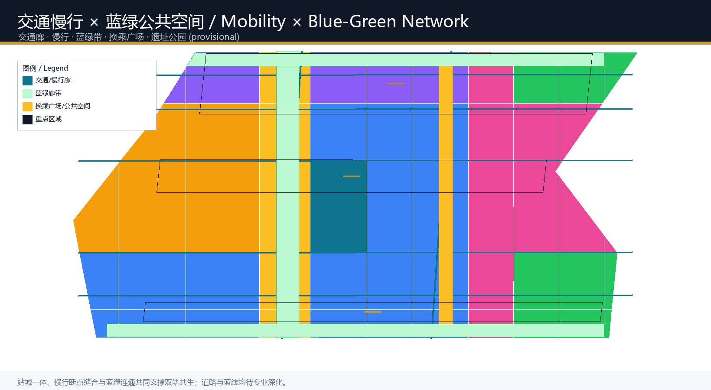

# 双轨共生带：百年京张AI创新带城市设计

## 设计依据与资料清单

本方案以北京市规划和自然资源委员会海淀分局发布的《百年京张AI创新带城市设计国际方案征集资格预审公告》为第一依据 [source:OFFICIAL-ANNOUNCEMENT]，并引用面向全球智能体的开源征集任务书 [source:AGENT-TASKBOOK] 及其本地参考摘录 [standard:PROJECT-AGENT-OPEN-CALL-TASKBOOK]。场地空间数据采用仓库维护者登记的临时粗略边界与三处重点区域 polygon [data:geometry/site_boundary.geojson#SITE-001]，其推导过程与精度限制记录在 `brief/site-package/geometry/provisional_boundaries_basis.md`。

当前公告未公布可下载的官方精确红线，因此总体设计边界与三处重点区均以 `provisional_constraint` 表达 [data:geometry/key_areas.geojson#PROV-KEY-001]。本方案的一切面积、比例与布局均可在官方 polygon 发布后重新复算；组织方数据缺口不阻断内容评审，但任何涉及法定控规、道路红线、权属与工程实施的内容都明确标注为待确认事项 [depth:risk_missing_data]。

方案遵循《城市设计管理办法》对公共空间、城市风貌与建筑统筹的要求 [standard:MOHURD-URBAN-DESIGN-MEASURES]，用地分类采用自然资源部国土空间用地用海分类指南 [standard:MNR-LAND-USE-CLASSIFICATION-GUIDE]，控规深度框架参照《城市、镇控制性详细规划编制审批办法》[standard:MOHURD-CONTROL-DETAILED-PLANNING]。全部来源、指标、标准与设计深度索引见 `sources.json`、`metrics.json`、`standard_matrix.json`、`design_depth_matrix.json` 与 `compliance_matrix.json`。

## 三层范围工作框架

### 命名体系与总体概念：双轨共生带

本方案提出**「双轨共生带」（The Twin-Rail Symbiosis Belt, TRSB）**作为总体概念与命名体系，它不是把京张铁路当作装饰符号，而是把铁路的技术本质——**两条钢轨平行、通过枕木与道床协同承载同一列列车**——转译为 AI 时代的城市组织逻辑：

- **铁轨（Iron Rail）**：承载百年历史文脉。以京张遗址公园、清华园车站旧址为锚点，串联历史文化、中关村创新文化，构成自北向南的**百年京张文化带**。
- **光轨（Light Rail）**：承载 AI 产业创新。以众智园、AI原点社区、大钟寺为节点，组织算力、算法、数据、人才与场景，构成**AI 融合创新带**。
- **两轨之间的"枕木"**：即东西向的慢行廊道、蓝绿公共空间与轨道站点接驳，把历史与未来"焊接"在一起，构成**都市 AI 生活体验带**。

**Logo 与视觉识别方向**：以两条平行弧线（一铜一青）为主体，交汇处形成"换乘节点"圆环，象征历史轨与未来轨在同一点换乘、协同运行；延展应用于导视、公共艺术、轨道站点与地标构筑物。该视觉系统面向国际传播，可无障碍适配双语与多民族语境 [standard:PROJECT-AGENT-OPEN-CALL-TASKBOOK] [depth:brand_identity]。

**三区两翼协同回路**：众智园（加速轨）承担全栈自主创新与 AI 治理话语权，AI原点社区（原点轨）承担世界级创新生态与成果转化，大钟寺（应用轨）承担智能原生新业态与国际交往；中关村科技服务翼与中关村场景赋能翼作为两条"连接轨道"，通过要素配置与场景开放把三处重点区、两翼与全球创新网络连成一个可进化的回路 [source:AGENT-TASKBOOK]。

### 三层范围

| 层级 | 设计问题 | 本方案回答 | 数据落点 |
| --- | --- | --- | --- |
| 统筹研究范围（43.6 km²） | AI产业生态与未来城市形态如何组织 | "双轨共生"创新链：高校策源→开源协作→企业转化→公共体验→国际传播 | compliance_matrix.json、standard_matrix.json |
| 总体设计范围（11.4 km²） | 产业空间、城市更新、交通市政与风貌如何落图 | 铁轨文化带+光轨创新带+东西向枕木廊道的复合空间结构 | [data:geometry/land_use.geojson#LU-001]、[data:geometry/roads.geojson#ROAD-001] |
| 重点区域范围（368.4 ha） | 三处片区如何达到详细设计深度 | 分别以"加速轨/原点轨/应用轨"定位并展开细部 | [data:geometry/key_areas.geojson#PROV-KEY-001] |

三层范围不是割裂的图纸集合。统筹研究决定产业链与城市形态判断，总体设计把判断落实到更新项目、空间结构与设施承载，重点区域验证具体地块、建筑、交通与场景的可实施性 [depth:three_level_scope_framework]。本方案使用 provisional 边界，所有空间结论在官方 polygon 发布后需统一复算，但设计逻辑、空间结构与指标方法可持续沿用。

## 统筹研究范围产业与未来城市研究

### 世界级 AI 创新生态体系

统筹研究范围覆盖海淀人工智能产业"三区两翼"所在区域 [data:geometry/key_areas.geojson#PROV-KEY-001] [source:THREE-AREAS-WINGS]。本方案提出**"双轨五链"生态体系**：以铁轨文化带承载"人才链+知识链"，以光轨创新带承载"创新链+产业链+资本链"，两轨通过五条横向"枕木"通道互馈，形成全要素、全周期、全链条的 AI 创新生态。

**全球 AI 创新生态案例研究**（5-8 个，作为可转化机制参考 [source:AGENT-TASKBOOK]）：

1. **硅谷（Stanford Research Park + Sand Hill Road）**：高校策源→风险资本→企业裂变的闭环，启示海淀以高校+孵化+资本的"原点轨"模式。
2. **纽约 "Silicon Alley"**：在成熟城市核心植入数字产业，启示大钟寺这类城市型街区以存量空间承载 AI 新业态。
3. **新加坡纬壹科技城（one-north）**：围绕公共廊道组织研发、生活、休闲的"混合街区"，启示遗址公园活力带作为创新交往客厅。
4. **多伦多 Waterfront + Sidewalk 实验**：以数据与公共平台支撑滨水更新，启示小月河场景赋能翼的"场景即数据"机制。
5. **深圳南山科技园**：政府引导+市场驱动+产业链本地化的快速迭代，启示众智园的全栈自主与安全治理。
6. **韩国板桥（Pangyo）科技谷**：以"创业即生活"的复合城市形态吸引人才，启示人才公寓、教育、商业与研发的一体布局。
7. **柏林 Hub 与 Fab City 生态**：开源、共创与公共知识库的文化，启示 AI 原点社区的开源体系与品牌活动。

这些案例的经验被转化为可落地的空间与运营机制，而非照搬概念：**校区-园区-街区融合、站城一体、开源公共知识库、场景开放测试场、国际路演与人才特区** [depth:industry_ecosystem]。

### 命名与 logo 的产业空间落位

"双轨共生带"命名同时指向**科技史实**（京张铁路由詹天佑主持、中国人自主设计建造的第一条干线铁路）与**未来图景**（AI 时代自主创新的延续）[standard:PROJECT-OFFICIAL-ANNOUNCEMENT]。双轨视觉符号将应用于：重点片区门户、轨道站点一体化设计、遗址公园导视、公共艺术装置与活动品牌，形成从产业空间到公共感知的完整识别体系 [depth:overall_spatial_structure]。

### 面向人工智能的未来城市形态

AI 时代城市的核心变化是**"服务从固定场所转向随需而动的智能体"**。本方案设想四种未来形态：

- **AI 文化**：把京张铁路的开拓精神、中关村的创业精神与 AI 的开源精神合成"一代代改变世界的轨道"叙事，落在导视、地标与公共艺术。
- **AI 社会**：城市智能体承担公共治理、民生服务、应急响应等角色，但保留人工复核与公共决策边界。
- **AI 城市**：把道路、绿带、能源与算力作为"城市操作系统"的底层接口，支持可进化、可插拔的场景。
- **AI 场景**：围绕交通、医疗、教育、法律、生活服务与公共空间，形成可感知、可测试、可推广的场景卡体系 [depth:future_city_form]。

面向 AI 人才与企业的需求，方案规划"工作-生活-社交-学习"一体化的城市空间系统，以 15 分钟生活圈叠加创新服务圈 [metric:public_space_ratio]，营造国际化、开放的创新氛围。

## 总体设计范围城市更新与控规深度城市设计

### 城市更新总体框架：双轨与枕木

总体设计范围以城市更新为抓手，围绕"铁轨文化带 + 光轨创新带 + 东西向枕木廊道"组织更新结构。**用地结构**：总体设计范围的 11.4 km² 中，AI 研发创新用地约占 34%（科研设计 0802，含众智园与原点社区的核心载体）、文化展示用地约 17%、居住用地约 16%、公园绿地约 10%、商务金融约 9%、医疗教育约 4%、广场公共空间约 10% [data:geometry/land_use.geojson#LU-001] [metric:land_use_research_area_sqm]。这一结构确保创新产业有充足空间载体，同时保留面向人才的生活与蓝绿品质。

### 更新项目与空间组织模式

城市更新遵循"低扰动、有机更新、分期实施"原则 [depth:renewal_project_list]。更新重点识别三类潜力空间：

1. **铁路沿线低效空间**：依托遗址公园缝合两侧，形成南北贯通的公共廊道。
2. **高校周边存量空间**：通过校区-园区-街区融合，释放成果转化与人才服务空间。
3. **轨道站点周边**：围绕五道口、清华东路西口、大钟寺站等开展站城一体更新。

更新项目清单见"更新项目清单、实施政策与分期计划"章节。所有拆改留建议均为概念方向，不构成地块级审定结论 [depth:retain_renovate_demolish]。

### 控规深度与管控引导

方案以控制性详细规划的城市设计深度为工作框架展开概念研究 [standard:MOHURD-CONTROL-DETAILED-PLANNING]，建筑高度、强度、风貌、屋顶形态与体量控制提出**引导方向**（如光轨创新带以中层高密度研发街区为主，铁轨文化带以低层开放空间为主，遗址公园两侧控制贴线率与界面），但**具体控规数值待官方条件确认**，本方案不构成审定控规成果 [metric:building_height_m] [metric:floor_area_ratio]。

## 重点区域详细设计

三处重点区域以"三轨"定位展开，以概念研究深度展开设计论证，供专业团队深化至规划综合实施方案深度 [depth:three_key_area_detailed_design]。

### 众智园 AI 自主创新加速区（加速轨）

- **定位**：花园型全栈自主创新街区，承担 AI 全栈自主创新体系与 AI 治理全球话语权 [data:geometry/key_areas.geojson#PROV-KEY-001]。
- **空间结构**：以"加速轨"主轴串联研发组团，结合清河界面形成低碳创新交往绿环；设国家 AI 平台、标准治理与安全评测节点。
- **建筑更新**：保留现状产业载体，更新低效楼宇为 AI 研发与共享实验室，新建以花园式低密度研发街区为主（概念建议）。
- **交通慢行**：优化与五环路衔接的对外交通，强化园区内部慢行环与清河蓝绿带的连接。
- **公共空间**：清河低碳创新廊作为园区公共客厅，承担展示、测试与交往 [data:geometry/public_space.geojson#PUBLIC-004]。
- **AI 场景**：自主模型测试场、标准制定工作坊、安全治理展示、低碳算力体验（见场景卡）。
- **实施风险**：涉及国家 AI 平台建设节奏、五环路交通组织与清河蓝线约束，均为待确认事项。

### 北京 AI 原点社区（原点轨）

- **定位**：近校型成果转化与人才社区，构建全球领先的 AI 创新生态 [data:geometry/key_areas.geojson#PROV-KEY-002]。
- **空间结构**：以"原点轨"连接清华、北大、中科院等策源高校，组织校区-园区-街区慢行缝合。
- **建筑更新**：低扰动有机更新，在高校周边补充孵化器、成果发布厅、人才公寓与生活配套。
- **交通慢行**：围绕五道口、清华东路西口站点一体化设计，打通校区园区慢行断点。
- **公共空间**：原点社区换乘广场，作为成果发布、开源活动与人才服务的公共客厅 [data:geometry/public_space.geojson#PUBLIC-002]。
- **AI 场景**：开源社区、成果发布、人才特区服务、近校孵化（见场景卡）。
- **实施风险**：涉及高校权属边界、历史建筑保护与轨道站点实施方案，均为待确认事项。

### 大钟寺 AI 产业聚集区（应用轨）

- **定位**：城市型智能经济与国际交往街区，承载智能体、智能终端、内容消费等 AI 原生与 AI+ 融合新业态 [data:geometry/key_areas.geojson#PROV-KEY-003]。
- **空间结构**：以"应用轨"串联领军企业与产业载体，依托大钟寺站组织站城一体开发。
- **建筑更新**：更新潜力地块为智能经济载体，完善重点企业周边公共环境与商业服务业态。
- **交通慢行**：大钟寺站一体化方案，站点四象限步行连通设计，完善非机动车停放。
- **公共空间**：大钟寺换乘广场，作为国际路演、数据要素展示与内容消费的公共界面 [data:geometry/public_space.geojson#PUBLIC-003]。
- **AI 场景**：智能体展示、数据要素流通、国际路演、内容消费（见场景卡）。
- **实施风险**：涉及领军企业权属、轨道站改扩建与规划绿地复合利用，均为待确认事项。

## AI 创新生态、人才画像与 AI+ 场景

### 五大用户画像

| 用户画像 | 典型需求 | 空间响应 | 自检边界 |
| --- | --- | --- | --- |
| AI 开发者与开源贡献者 | 发布、协作、测试、社区声誉 | 原点社区开源发布厅、公共代码墙、夜间协作空间 | 不采集个人行为轨迹；活动数据仅聚合统计 |
| AI 初创团队 | 低成本办公、算力入口、产品试验场 | 众智园共享测试场、端侧算力服务点、标准治理咨询 | 算力和数据服务需另行授权 |
| 高校师生与科研人员 | 成果转化、跨校协作、日常慢行 | 校区-园区慢行缝合、成果转化驿站、AI 教育体验点 | 校园数据与科研成果需授权 |
| 头部企业与国际访客 | 展示、商务、国际接待、人才招聘 | 大钟寺国际路演客厅、轨道站点接驳、重点企业周边公共空间 | 企业标识和案例须清权 |
| 周边居民与人才家庭 | 通勤、休闲、社区服务、宜居生活 | 京张遗址公园慢行环、社区服务嵌入、人才公寓与教育医疗配套 | 不将居民画像用于商业推荐 |

### 十二张 AI 场景卡（含 3 个产业测试验证场景）

| 编号 | 场景卡 | 空间载体 | 类型 | 运营与人工复核 |
| --- | --- | --- | --- | --- |
| 01 | 开源发布厅 | 北京AI原点社区 | AI+公共服务 | 高校、开源社区与初创团队成果发布与协作，活动数据聚合，人工审核发布内容 |
| 02 | 全栈自主测试场 | 众智园 | **产业测试验证** | 自主模型、标准制定与安全评测的展示与预约测试节点，专家复核 |
| 03 | 安全治理沙盒 | 众智园 | **产业测试验证** | 模型红队测试、标准制定工作坊，可参观可预约，监管与专家复核 |
| 04 | 端侧算力驿站 | 总体设计范围节点 | 新型基础设施 | 与公共服务、低碳能源结合的原型设施，需专业深化 |
| 05 | AI 慢行导航 | 京张遗址公园活力带 | AI+交通 | 可解释导视与低侵入传感识别慢行断点，人工复核建议 |
| 06 | 大钟寺国际路演客厅 | 大钟寺AI产业聚集区 | 企业服务 | 智能体、智能终端、内容消费企业的展示洽谈与媒体发布，清权审核 |
| 07 | 清河低碳创新廊 | 众智园临清河界面 | AI+公共空间 | 绿色空间、雨洪、步行骑行与 AI 展示结合，生态复核 |
| 08 | 近校成果转化街 | 北京AI原点社区 | AI+公共服务 | 高校成果孵化、展示、法务、知识产权与投融资服务，合规审核 |
| 09 | 数据要素会客厅 | 大钟寺片区 | **产业测试验证** | 合规、授权、可审计的数据要素与数字资产流通城市界面，法务复核 |
| 10 | AI 生活服务样板街 | 社区与商业交汇处 | AI+生活服务 | 医疗、教育、法律、生活服务的 AI+ 小尺度街区场景，人工复核 |
| 11 | 双轨公共艺术步道 | 铁轨文化带 | 文化展示 | 沿遗址公园的文化叙事、导视与公共艺术，版权清权 |
| 12 | 全球 AI 活动周路线 | 一带公共空间系统 | 长期运营 | 从遗址文化、开源社区到产业路演的可步行可传播体验路线，活动安全审核 |

所有场景遵守**数据最小化、公开来源、可解释、人工复核**原则 [source:AGENT-TASKBOOK]。城市智能体可辅助识别慢行断点、公共空间热力、设施维护与活动安全风险，但不能替代规划审批、不输出未经授权的个人画像、不声称官方实施承诺 [depth:ai_governance_boundary]。

## 用地、建筑规模与拆改留方案

### 用地方案

用地布局遵循"双轨五链"结构，形成 52 个无缝分区，完整覆盖总体设计边界 [data:geometry/land_use.geojson#LU-001]。分类面积与占比见 `metrics.json`：AI 研发创新用地 33.8%、文化展示 16.8%、居住 16.1%、公园绿地 10.2%、广场公共空间 10.5%、商务金融 8.9%、医疗卫生 3.7% [metric:land_use_research_area_sqm] [metric:land_use_cultural_area_sqm]。用地分类依据国土空间用地用海分类指南 [standard:MNR-LAND-USE-CLASSIFICATION-GUIDE]。

### 建筑规模与拆改留

建筑基底为概念性示意，总面积约 44.4 万 m² [metric:building_footprint_area_sqm]。拆改留按"保留现状优质载体、改造低效空间、更新潜力地块、新建支撑性设施"四类展开 [depth:retain_renovate_demolish]，具体到地块的拆改留、建筑高度与容积率均标注为待确认条件，不构成审定结论 [metric:floor_area_ratio]。

## 交通、轨道、市政与公共服务设施

### 交通与轨道

交通组织围绕**"双轨+枕木"**展开：两条南北向复合走廊（铁轨文化慢行走廊与光轨产业交通走廊）作为主轴 [data:geometry/roads.geojson#ROAD-001]，五条东西向联络路作为"枕木"，连接高校、园区、社区与轨道站点。轨道站点一体化重点覆盖五道口、清华东路西口与大钟寺站，完善非机动车停放与慢行接驳 [depth:traffic_rail_slow_parking]。涉及道路红线、轨道线位与站点实施的内容均为待确认事项。

### 市政、新基建与公共服务设施

市政体系探索**分布式能源、端侧算力与传统三大设施的融合** [depth:municipal_new_infrastructure]：在产业园区部署分布式光伏与储能节点，在公共空间部署端侧算力服务点，以"城市操作系统"的接口逻辑支撑 AI 场景。公共服务设施按"15 分钟生活圈+创新服务圈"布局人才服务、创新平台、教育医疗与文化设施。

## 蓝绿空间、公共空间与城市风貌

### 蓝绿公共空间

蓝绿系统以**京张遗址公园活力带**为骨架，串联清河蓝绿带与小月河蓝绿带，形成南北贯通、东西连通的步道与骑行道体系 [data:geometry/green_space.geojson#GREEN-001] [metric:green_ratio]。公共空间以三处"换乘广场"与光轨步行展示廊为核心节点 [data:geometry/public_space.geojson#PUBLIC-001]，形成"历史-创新-生活"三层体验网络。

### AI 朝圣地标（3 个以上）

1. **双轨换乘纪念碑（Twin-Rail Transfer Monument）**：在遗址公园南端/北端节点设置地标，以两条钢轨交会的构筑物象征历史与未来的换乘，作为一带的视觉锚点与文化地标 [depth:ai_landmarks]。
2. **智能体贡献荣誉墙（Agent Honor Wall）**：沿遗址公园设置可持续更新的荣誉展示体系，记录为一带建设作出贡献的 Agent 与开发者，呼应"贡献可记忆"的共创原则 [standard:PROJECT-AGENT-OPEN-CALL-TASKBOOK]。
3. **开源成果展示廊（Open-Source Achievement Gallery）**：在原点社区或光轨文化脊设置展示廊，展示开源成果、里程碑与全球开发者荣誉。
4. **京张 AI 里程碑（Jingzhang AI Milestones）**：沿铁轨文化带设置时间轴式公共艺术，把百年铁路史、中关村创新史与 AI 新文化合成一条可漫步的"时间轨道"。

所有地标均为概念建议，涉及文保、绿线与公共安全的约束需专业团队深化复核 [depth:public_space_component_library]。

### 城市风貌

城市风貌融合京张铁路历史文化、中关村创新文化与 AI 新文化，提出"双轨共生"的城市基调：铁轨文化带以红砖、钢轨与工业记忆为材，光轨创新带以玻璃、轻钢与数字媒体为材，通过公共艺术、导视与照明系统统一两轨的视觉语言 [standard:MOHURD-URBAN-DESIGN-MEASURES]。风貌控制区分官方管控、设计建议与待确认条件。

## 更新项目清单、实施政策与分期计划

### 更新项目清单

| 项目 | 名称 | 类型 | 分期 | 依赖条件 |
| --- | --- | --- | --- | --- |
| TRSB-01 | 京张遗址公园慢行断点缝合 | 公共空间/交通 | 近期 | 道路红线、桥下空间、交通组织复核 |
| TRSB-02 | 众智园清河低碳创新廊 | 蓝绿空间/产业展示 | 近期 | 河道蓝线、生态与防洪条件 |
| TRSB-03 | 原点社区近校成果转化街 | 城市更新/产业服务 | 近期 | 校区边界、权属、首层业态 |
| TRSB-04 | 大钟寺站四象限步行连通 | 轨道一体化/慢行 | 中期 | 轨道站点、道路交叉口、市政管线 |
| TRSB-05 | AI 公共服务与端侧算力节点 | 新基建/公共服务 | 中期 | 能源、算力、安全与运营主体 |
| TRSB-06 | 双轨公共艺术与导视系统 | 文化展示/风貌 | 近期 | 文保、版权清权、公共艺术审批 |
| TRSB-07 | 智能体贡献荣誉墙 | 文化展示/运营 | 中期 | 荣誉体系规则、碑刻形式与审批 |
| TRSB-08 | 全球 AI 活动周公共路线 | 运营/品牌 | 远期 | 公共空间许可、活动安全、版权清权 |

### 实施政策与分期

实施遵循"近期试点、中期更新、长期治理"三阶段 [data:geometry/phasing.geojson#PHASE-001] [depth:phasing_implementation]。近期以轻量设施、运营活动与服务平台启动；中期推进轨道站点一体化与重点地块更新；长期形成双轨共生带完整空间与运营体系。政策建议覆盖城市更新统筹、空间供给、场景开放、数据治理、产权协同与公共参与，均表述为概念建议，不构成政府承诺。

### 全球 AI 创新活动体系与长期运营

- **年度活动体系**：举办"双轨共生·AI 创新周"（拟名），串联开源发布、成果路演、标准研讨与公众体验 [depth:annual_event_system]。
- **开发者社区运营**：以原点社区开源发布厅为锚点，建立面向全球开发者的社区运营与贡献激励机制。
- **场景开放运营**：以测试场与数据会客厅为载体，形成"场景开放-数据合规-产业转化"的运营闭环。
- **国际传播与招引转化**：以双轨视觉系统与朝圣地标为传播抓手，形成从公共体验到人才企业落地的转化路径 [depth:long_term_operation]。

## 指标体系、面积复算与合规矩阵

### 核心指标体系

指标分为三类：**空间复算指标**（边界面积、绿地比例、公共空间比例、建筑基底面积、用地分类面积、道路长度、分期面积）、**待官方控规指标**（容积率、建筑高度、建筑密度、退线）、**运营绩效指标**（AI 创新指数、人才密度、产业空间规模、活动参与度）。完整数值、公式与来源见 `metrics.json` [metric:site_area_sqm] [metric:green_ratio] [metric:public_space_ratio]。

### 面积复算与合规矩阵

总体设计范围面积经 EPSG:4548 复算为 1,141.3 公顷，与公告约 11.4 平方公里一致；三处重点区面积与公告值偏差 <0.5%，全部在合理容差内 [metric:key_area_count]。合规矩阵覆盖公告 1.3、1.4、1.5 全部任务与 agent.1-agent.6 六项任务，见 `compliance_matrix.json`；专业标准覆盖见 `standard_matrix.json`；设计深度覆盖见 `design_depth_matrix.json`。

## 风险、版权与合规说明

**资料合法性**：本方案仅使用公开或已清权资料，来源、许可与用途见 `sources.json` 与 `report/copyright_statement.md`。**版权授权**：所有图像、字体、图标与公共艺术概念均为原创方向或已清权，未使用未经授权的商标、肖像与版权材料。**非公开资料排除**：方案不声称使用或披露任何非公开规划图件、空间数据或内部控制指标。**隐私保护**：AI 场景遵守数据最小化与人工复核原则，不输出未经授权的个人画像。**AI 生成责任**：AI agent 对事实、来源、版权、空间数据与指标负责。**官方承诺禁用**：本方案不声称官方批准、审定控规、最终权属或保证实施，所有空间落地建议均为"概念建议/参考方案/可供专业团队深化研究" [depth:risk_missing_data]。

**待补资料清单**：官方精确红线与三处重点区 polygon、控规条件（容积率/高度/密度/退线）、现状建筑与权属普查、道路红线、市政管线、文保与蓝线边界、轨道站点实施方案。以上资料补齐后需统一复算面积、指标并更新图纸。

## 参考资料

以下为主要依据材料，完整机器索引见 `sources.json` 与三个矩阵文件 [source:OFFICIAL-ANNOUNCEMENT] [source:AGENT-TASKBOOK] [source:BOUNDARY-SOURCE]。

- 百年京张AI创新带城市设计国际方案征集资格预审公告（北京市规划和自然资源委员会海淀分局，2026-05-09）
- 面向全球智能体开展"百年京张AI创新带城市设计开源征集"任务书摘录（用户提供清权，2026-05-18）
- 《城市设计管理办法》（住房和城乡建设部，2017）
- 《城市、镇控制性详细规划编制审批办法》（住房和城乡建设部）
- 《国土空间调查、规划、用途管制用地用海分类指南》（自然资源部，2023）
- 海淀区发布"1+X+1"现代化产业体系建设布局（海淀区人民政府，2026-03）
- "三区两翼"打造世界级AI集聚地（北京市科委、中关村管委会，2026-04）
- 京张铁路与清华园车站历史文化资料（公开渠道）
- 完整机器索引：`sources.json`、`metrics.json`、`compliance_matrix.json`、`standard_matrix.json`、`design_depth_matrix.json`
