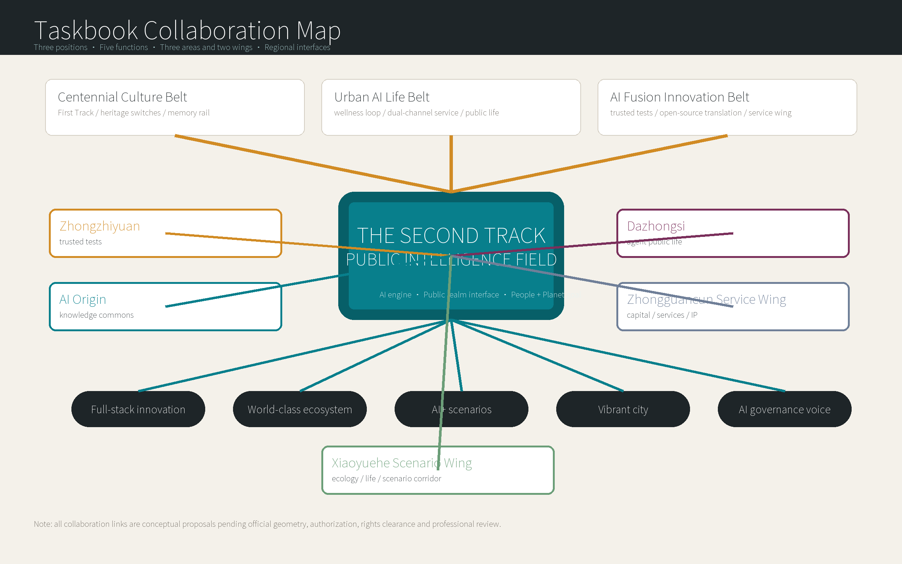
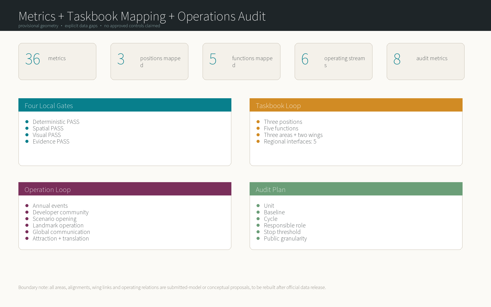

# The Second Track | Jing-Zhang Public Intelligence Field

> From a Railway Heritage Park to Public Innovation Infrastructure for the AI Era

## Design Basis and Source List

This proposal evolves Jing-Zhang from railway infrastructure into public innovation infrastructure for the AI era. It is not a conventional AI business park but a Public Intelligence Field that people may enter, share and continually revise: AI is the engine, public realm is the interface, and people and planet are the goal. The design answers the official announcement and agent taskbook first, then connects every judgment to layers, metrics, sources, assumptions and checks.[source:OFFICIAL-ANNOUNCEMENT] [source:AGENT-TASKBOOK] [depth:existing_conditions_diagnosis]

The spatial ground uses the repository's provisional constraints. The overall boundary and three key areas support generation, discussion and EPSG:4548 recalculation only; they are not official redlines, statutory areas or approval evidence. When cleared geometry arrives, all nine spatial layers, 36 metrics, five figures, A3/A0 drawings and the HTML display must be rebuilt together.[source:BOUNDARY-SOURCE] [data:geometry/site_boundary.geojson#PROV-SITE-001] [metric:site_area_sqm]

Public project records list Wanpeng Zu as Project Manager/Lead Designer for Jingzhang Railway Park. Her Phase I experience is not competition endorsement; it establishes professional continuity from a built public realm. The First Track is not overwritten, and the Second Track does not replace history with novelty. Heritage, parkland, everyday urban life and future innovation are made to work together.[source:AUTHOR-ASLA-JZRHP] [source:AUTHOR-ASLA-INTERVIEW]

Rights and provenance for all text, geometry and visual assets are recorded in `sources.json` and `report/copyright_statement.md`. External cases inform mechanisms only. The Phase I paper supplies project context, not proof of Wanpeng Zu's authorship or endorsement by any prior team, publisher or organizer.[source:AUTHOR-JZRHP-PAPER]

## Three-Level Scope Framework

The three scopes carry different responsibilities. The coordinated research area frames industry, knowledge and future urban form; the overall design area translates that frame into land use, renewal, mobility, blue-green and public-space systems; the key areas test scenarios, governance and delivery through three distinct prototypes. Provisional boundaries control where discussion occurs, while cleared controls determine what may be approved.[standard:PROJECT-OFFICIAL-ANNOUNCEMENT] [depth:three_level_scope_framework]

FIRST TRACK, SECOND TRACK, SWITCH, FIELD and VERSION form the overall logic. The First Track carries railway heritage, parkland and urban time. The Second Track connects talent, nature, knowledge, industry, communities and public services. Six switch types connect institutions and people. The field learns through multiple nodes, while the versioned city replaces a final-state blueprint with Temporary → Test → Feedback → Update → Scale.[data:geometry/roads.geojson#FIRST-TRACK] [data:geometry/roads.geojson#SECOND-TRACK]

OPEN, SHARED and OPEN SOURCE describe rising levels of publicness: people may first enter space, then share facilities and knowledge, and finally test, copy and improve scenarios, modules, rules, data dictionaries and lessons. W denotes the All-Ages Wellness Loop, not a seventh switch type; it checks walking, rest, rehabilitation, thermal comfort and everyday movement across the field.

| Concept | Definition |
| --- | --- |
| FIRST_TRACK · First Track | The temporal ground formed by railway heritage, parkland, history and existing urban infrastructure. |
| SECOND_TRACK · Second Track | Relational infrastructure connecting talent, knowledge, industry, community, ecology and public services. |
| SWITCH · Switch | Programmable connection points among universities, enterprises, parks, communities, commerce and culture. |
| FIELD · Field | A public intelligence network created by multiple nodes through open rules and shared facilities. |
| VERSION · Versioned City | A city that replaces a one-off final state with temporary action, testing, feedback, updates and scaling. |
| O-W01 · All-Ages Wellness Loop | A walking, cycling, rest, rehabilitation and everyday-movement component across the three areas; W denotes wellness, not a seventh switch type. |

### Taskbook Mapping Diagram: Three Positions, Five Functions, Three Areas and Two Wings

The Second Track does not create a separate park vocabulary. It organizes the taskbook's three positions, five functions, and three-areas-two-wings structure into one collaboration loop. The Centennial Jing-Zhang Culture Belt is carried by the First Track, heritage switches and the memory rail. The Urban AI Life Experience Belt is carried by the wellness loop, dual-channel services and Dazhongsi public life. The AI Fusion Innovation Belt is supported by Zhongzhiyuan trusted testing, AI Origin open-source translation and the Zhongguancun Technology Service Wing. All relationships are conceptual proposals pending confirmed partners, official boundaries and professional inputs.[source:AGENT-TASKBOOK] [depth:three_level_scope_framework] [metric:taskbook_function_count]

| Taskbook layer | Second Track response | Space-industry-operation loop |
| --- | --- | --- |
| Three positions | Centennial Jing-Zhang Culture Belt, Urban AI Life Experience Belt, AI Fusion Innovation Belt | The First Track provides cultural ground, the Second Track organizes civic innovation interfaces, and versioning sustains operations. |
| Five functions | Full-stack innovation, world-class ecosystem, AI+ scenarios, intelligent vibrant city, AI governance voice | Trusted tests, knowledge sharing, scenario opening, public services and the Version Assembly feed one another. |
| Three areas and two wings | Zhongzhiyuan, AI Origin, Dazhongsi, Zhongguancun Technology Service Wing, Xiaoyuehe Scenario Empowerment Wing | Three key areas host prototypes; two wings provide service inputs and scenario corridors; the annual assembly closes the feedback loop. |

## Coordinated Research Area: Industry and Future City Research

Competitiveness here is not isolated growth in enterprise counts. It is a short loop among foundational research, open collaboration, trustworthy testing, translation, enterprise services and public feedback. Zhongzhiyuan hosts pausable real-world validation; AI Origin shortens the knowledge distance among universities, communities and start-ups; Dazhongsi places agent economies, cultural content and consumption behind visible, contestable and human-takeover interfaces.[source:AGENT-TASKBOOK] [metric:industry_test_scenario_count]

AI operates mainly as invisible infrastructure supporting research collaboration, industrial innovation, public services, cultural experience, ecological management, urban operations and public participation. Technological identity does not depend on robots, screens or cyberpunk devices. Shared rooms, test courts, learning loops, ecology switches, dual-channel service points and an annual version assembly make responsibility, inputs, pause and exit legible.

World cases are not copied as forms or performance promises. Each contributes one testable mechanism, a Jing-Zhang translation and an explicit limit. None supplies ownership, investment, energy, footfall, statutory controls or government commitments for this project.

### Regional Collaboration Framework: No Claimed Partnership

Regional collaboration is framed as exchange interfaces, not as confirmed agreements. Beiwei Community may exchange talent-life services, mixed public services and community feedback. Future Science City may exchange frontier research questions and research-ethics dialogue. Huairou Science City may exchange big-science, basic-research and science-communication agendas. Beijing E-Town may exchange engineering validation, supply-chain and manufacturing translation. Jing-Jin-Ji may exchange replicable scenarios, talent mobility and shared public questions. Each item must receive real authorization, rights clearance and professional review before it becomes a project.[source:AGENT-TASKBOOK] [metric:regional_interface_count]

| Collaboration object | Possible exchange | Second Track interface | Boundary |
| --- | --- | --- | --- |
| Beiwei Community | Talent life, daily services, community feedback, cultural events | AI Origin and the wellness loop | Conceptual proposal; no community authorization claimed. |
| Future Science City | Frontier research questions, ethics, young-talent exchange | Open-source translation studio and Version Assembly | Conceptual proposal; no institutional partnership claimed. |
| Huairou Science City | Basic research, science communication, big-science agenda translation | Knowledge switches and public classrooms | Conceptual proposal; no research data transferred. |
| Beijing E-Town | Engineering validation, supply chain, manufacturing scenarios, standardization review | Zhongzhiyuan test commons and production switches | Conceptual proposal; no industrial landing commitment. |
| Jing-Jin-Ji | Scenario replication, public-service lessons, talent and event flows | Open-source rule library and regional version log | Conceptual proposal; not a regional plan. |

### Eight mechanism references

### C01 | Punggol Digital District, Singapore

**Mechanism.** Industry, campus and digital infrastructure coordinate through an integrated operating framework. **Jing-Zhang translation.** Translate into a shared testing ground in Zhongzhiyuan and a short knowledge-to-industry loop at AI Origin. **Do not copy.** Mechanism reference only; no inference about Haidian ownership, investment, energy or implementation. [source:EXT-PUNGGOL-JTC]

### C02 | Smart Kalasatama, Helsinki

**Mechanism.** Organize innovation around resident time savings and real-life experimentation. **Jing-Zhang translation.** Translate into six public values, rather than device counts, as scenario performance. **Do not copy.** Do not copy local governance or claim equivalent resident-data foundations. [source:EXT-KALASATAMA-FVH]

### C03 | SHIFT Urban Test Network, London

**Mechanism.** Run real-district trials through partnership agreements and evaluation frameworks. **Jing-Zhang translation.** Translate into pre-test agreements, public limits, human stop and version review. **Do not copy.** Not evidence of technology safety or local approval. [source:EXT-SHIFT-LONDON]

### C04 | Amsterdam Urban Living Labs

**Mechanism.** Government, knowledge institutions, enterprises and communities learn together around place. **Jing-Zhang translation.** Translate into three place prototypes and a public version assembly. **Do not copy.** Collaboration reference only; no claim that partnerships already exist. [source:EXT-AMS-ULL]

### C05 | Decidim Democratic Participation Contract

**Mechanism.** Open-source code, participation safeguards and democratic governance principles constrain one another. **Jing-Zhang translation.** Translate into Open, Shared and Open Source levels with traceable version decisions. **Do not copy.** Digital voting does not replace formal participation or human judgment. [source:EXT-DECIDIM-CONTRACT]

### C06 | Mila Responsible AI Research Mechanisms

**Mechanism.** Embed social impact, interdisciplinary judgment and responsible R&D in innovation. **Jing-Zhang translation.** Translate into the Zhongzhiyuan audit street and the human-must field of every scenario. **Do not copy.** No inference of endorsement or participation by Mila. [source:EXT-MILA-RESPONSIBLE-AI]

### C07 | London Knowledge Quarter

**Mechanism.** Connect knowledge assets through walkable proximity, institutional networks and shared agendas. **Jing-Zhang translation.** Translate into AI Origin's knowledge loop and open classrooms. **Do not copy.** Institutional concentration does not itself prove openness, sharing or local performance. [source:EXT-LONDON-KQ]

### C08 | Ontario Quayside Public-Audit Experience

**Mechanism.** Large smart-district proposals require continuing audit of data governance, public value and accountability. **Jing-Zhang translation.** Translate into data minimization, no scaling by default, a public risk register and exit mechanisms. **Do not copy.** Use audit questions only; do not analogize contracts, disputes or legal findings. [source:EXT-ONTARIO-QUAYSIDE-AUDIT]

## Overall Design Area: Urban Renewal and Regulatory-Plan-Level Urban Design

The overall design treats the 11.4 km² provisional area as a relational network instead of dividing the corridor into homogeneous parks. Seven conceptual functional zones cover the provisional site. The First and Second Tracks run through three areas; five movement networks stitch across them; green companions, shared courts, scenario nodes and ten packages create the Public Intelligence Field. Land-use codes are auditable, but allocations remain proposals rather than statutory land uses.[data:geometry/land_use.geojson#LU01] [standard:MNR-LAND-USE-CLASSIFICATION-GUIDE]

Six values become entry conditions for every action. Wellness covers movement, restoration and care; Social Connection covers cross-institution and intergenerational ties; Equity retains non-digital and accessible channels; Safety requires explanation, pause and accountability; Resilience / Infrastructure covers redundancy, maintenance and extreme events; Ecology covers stormwater, thermal comfort, habitat and co-stewardship. Technical growth should not scale unless it improves public value.

The building layer is neither a survey of existing buildings nor a demolition decision. It contains four conceptual action cells: Preserve, Adapt, Infill and Transform. FAR, height, building coverage and total floor area remain unknown/null. Parcel and building review begins only after road redlines, ownership, utilities, fire, heritage and engineering conditions arrive.[depth:development_intensity_controls] [metric:floor_area_ratio]

### Six value dimensions

| Value | Spatial and governance meaning |
| --- | --- |
| V-WELLNESS · Wellness | Support physical activity, mental restoration, thermal comfort and access to care. |
| V-SOCIAL · Social Connection | Create low-threshold interfaces for encounter, collaboration, learning and intergenerational exchange. |
| V-EQUITY · Equity | Preserve non-digital channels, accessible continuity and affordable shared resources. |
| V-SAFETY · Safety | Constrain AI through data minimization, human review, pause mechanisms and clear accountability. |
| V-RESILIENCE · Resilience and Infrastructure | Organize compute, energy, utilities, mobility and emergency systems as replaceable and recoverable networks. |
| V-ECOLOGY · Ecology | Treat blue-green continuity, habitat, stormwater retention and low-carbon operation as spatial performance. |

## Detailed Design of Key Areas

The three key areas are not three copies of one AI park. Zhongzhiyuan is a public laboratory for trustworthy-AI testing and governance; AI Origin is a knowledge commons mixing universities, talent, research, entrepreneurship and life; Dazhongsi is an all-day interface for AI-native consumption, cultural content, agent economies and urban public life. They share the dual-track and version mechanisms but have different spatial structures, scenario mixes, value priorities and operating responsibilities.[data:geometry/key_areas.geojson#PROV-KEY-001] [depth:three_key_area_detailed_design]

Key-area polygons remain provisional constraints. Every area is reported only as a recalculated submitted polygon, never an official precise quantity. Building cells, movement links and public facilities must all be rebuilt after cleared boundaries, surveys, ownership and discipline conditions arrive.[metric:key_area_count] [source:KEY-AREA-SOURCE]

### KA01 | Zhongzhiyuan AI Independent Innovation Acceleration Area

- **Prototype：** Trusted-AI Testing and Governance Commons
- **Spatial structure：** One ecological testing spine, three production-switch types and multiple pausable test courtyards; define limits and accountability before deploying technology.
- **Priority values：** V-SAFETY, V-RESILIENCE, V-ECOLOGY, V-SOCIAL
- **Scenarios：** SC01, SC02, SC03, SC09, SC15

### KA02 | Beijing AI Origin Community

- **Prototype：** Knowledge and Life Commons
- **Spatial structure：** A university–campus–community knowledge loop, an all-ages wellness loop and small shared courtyards interweave research, entrepreneurship, living and learning through low-impact renewal.
- **Priority values：** V-WELLNESS, V-SOCIAL, V-EQUITY, V-ECOLOGY
- **Scenarios：** SC04, SC05, SC06, SC07, SC08, SC10, SC15

### KA03 | Dazhongsi AI Industry Cluster

- **Prototype：** Urban-Agent, Culture and Consumption Commons
- **Spatial structure：** Four-quadrant pedestrian stitching around the station connects an agent marketplace, a content stage and railway-culture nodes into an all-day civic interface with human takeover.
- **Priority values：** V-SOCIAL, V-EQUITY, V-SAFETY, V-WELLNESS
- **Scenarios：** SC06, SC08, SC10, SC11, SC12, SC13, SC14, SC15

## AI Innovation Ecosystem, Personas, and AI+ Scenarios

The ten personas are not marketing segments; they are a checklist of rights and barriers. Researchers, start-ups, children, older adults, neighbours, operators and visitors must all have selectable ways to participate in the same field. Every scenario connects at least two personas and states the public problem, spatial carrier, what AI may do, what humans must do, data rules, pause conditions, metrics and open-source outputs.[data:geometry/public_space.geojson#SC01] [metric:persona_count]

SC01–SC04 are industrial test-and-validation scenarios. Tests are separated from everyday circulation by default, start with approved protocols, provide an on-site stop, and end with incident and version records. Other cards cover education, dual-channel public services, wellness, children, ecology, heritage, agent consumption, mobility stitching and annual governance. AI never replaces planning approval, professional judgment, rescue decisions, teaching, care or appeals.[standard:GENERATIVE-AI-INTERIM-MEASURES] [metric:scenario_count]

### Ten personas

| Persona | Needs | Barriers | Value checks |
| --- | --- | --- | --- |
| U01 · Foundation Researcher | Shared research resources, quiet focus space, trusted data and cross-institution exchange. | Institutional silos, closed equipment and a lack of informal exchange interfaces. | V-SOCIAL, V-SAFETY, V-RESILIENCE |
| U02 · Founder and Small Team | Low-threshold trials, short-term space, professional services, first users and clear test rules. | High fixed costs, opaque scenario access and long validation cycles. | V-SOCIAL, V-EQUITY, V-SAFETY |
| U03 · Student and Young Learner | Open courses, practical projects, affordable social life and safe evening routes. | Campus-city disconnection and unequal access to resource information. | V-WELLNESS, V-SOCIAL, V-EQUITY, V-SAFETY |
| U04 · Engineering Test and Operations Worker | Isolated test areas, traceable processes, human emergency stops and shift handover. | Ambiguous accountability and invisible infrastructure status. | V-SAFETY, V-RESILIENCE |
| U05 · Resident and Caregiver | Everyday services, care for children and older people, quiet rest and understandable feedback channels. | Technology barriers, activity conflicts and fragmented public services. | V-WELLNESS, V-SOCIAL, V-EQUITY, V-SAFETY |
| U06 · Child and Family Learner | Observable nature, hands-on learning, safe play and activities visible to caregivers. | Traffic conflicts, adult-centric interfaces and passive data collection. | V-WELLNESS, V-SOCIAL, V-SAFETY, V-ECOLOGY |
| U07 · Older User | Continuous seating, shade, clear wayfinding, on-site human service and non-smart alternatives. | Digital exclusion, walking fatigue and complex interactions. | V-WELLNESS, V-EQUITY, V-SAFETY |
| U08 · User with Accessibility Needs | Step-free continuous routes, multisensory information, adequate turning space and human assistance. | Broken ramps, unreadable interfaces and occupied accessible facilities. | V-EQUITY, V-SAFETY, V-WELLNESS |
| U09 · Cultural Visitor and Creative Worker | Credible history, creation and display, civic events and heritage experiences not overwhelmed by commercialization. | Superficial cultural symbols, unclear rights and spatial homogenization. | V-SOCIAL, V-EQUITY, V-ECOLOGY |
| U10 · Public-Service and Urban Operations Worker | Cross-department coordination, traceable evidence, clear escalation and reversible automation. | System silos, false-alert pressure and displaced accountability. | V-SAFETY, V-RESILIENCE, V-EQUITY |

### Fifteen complete scenario cards

### SC01 | Trusted-AI Test Commons · `industry_test`

- **Public problem:** Industry testing lacks a transparent, pausable and reviewable layer between the lab and public space.
- **Space:** Pausable test courtyards, observation walks and public briefing desks in Zhongzhiyuan, separated from everyday circulation by default.
- **People:** U01 Foundation Researcher, U02 Founder and Small Team, U04 Engineering Test and Operations Worker, U10 Public-Service and Urban Operations Worker
- **AI may:** Simulate within approved boundaries and datasets, log anomalies and generate test summaries.
- **Humans must:** Approve test protocols, confirm safety limits, operate emergency stops and sign off any next version.
- **Data rules:** Minimize collection; prefer synthetic or anonymized data; publish model-card, data-card and incident-log templates.
- **Pause when:** Pause immediately upon out-of-scope collection, unexplained high-risk output, failed human stop or unresolved public complaint.
- **Metrics:** test_protocol_publication_rate, human_stop_drill_rate, incident_closeout_time
- **Open-source output:** Test protocols, risk register, post-test template and spatial-component sizing rules.

### SC02 | Model Audit and Red-Team Street · `industry_test`

- **Public problem:** Bias, misuse and opacity often surface only after deployment.
- **Space:** Open audit rooms, adversarial labs, case galleries and a public questioning hall form a visible governance street.
- **People:** U01 Foundation Researcher, U04 Engineering Test and Operations Worker, U09 Cultural Visitor and Creative Worker, U10 Public-Service and Urban Operations Worker
- **AI may:** Assist in generating test cases, comparing versions and flagging anomalies for professional review.
- **Humans must:** Set audit questions, judge material impact, protect reporters and publish conclusions.
- **Data rules:** Tier audit-data access; exclude personal data from public display; link findings to evidence versions.
- **Pause when:** Pause for leakage, uncorrected discriminatory results, impact on real services or undisclosed conflicts of interest.
- **Metrics:** audit_coverage, bias_issue_resolution_rate, public_question_response_rate
- **Open-source output:** Audit-question library, bias checklist and transparency-report format.

### SC03 | Edge Compute–Energy Coordination Sandbox · `industry_test`

- **Public problem:** Compute facilities lack a legible coordination interface with energy, heat and utility capacity.
- **Space:** An isolated sandbox of service courts, a heat-reuse garden, independent power demonstrators and a human operations room.
- **People:** U01 Foundation Researcher, U04 Engineering Test and Operations Worker, U10 Public-Service and Urban Operations Worker
- **AI may:** Forecast load on simulated data, recommend load shifting and compare energy strategies.
- **Humans must:** Confirm equipment safety, energy dispatch, fire safety and utility interfaces; professionals execute every real switch.
- **Data rules:** Do not publish sensitive infrastructure locations or live loads; publish aggregated performance and methods.
- **Pause when:** Pause for thermal, load or protection-limit violations, conflicting sensors or missing human confirmation.
- **Metrics:** energy_use_effectiveness, heat_reuse_ratio, manual_override_success
- **Open-source output:** Aggregate metric definitions, sandbox interface protocol and low-sensitivity display components.

### SC04 | Open-Source Translation Studio · `industry_test`

- **Public problem:** Universities, open-source communities and real urban problems lack a long-term spatial mechanism for working together.
- **Space:** Bookable benches, demo steps, an open-license desk and a community problem wall surround a shared court.
- **People:** U01 Foundation Researcher, U02 Founder and Small Team, U03 Student and Young Learner, U09 Cultural Visitor and Creative Worker
- **AI may:** Help organize public documentation, match collaboration skills and draft reviewable prototype notes.
- **Humans must:** Confirm licensing, attribution, problem priority, feasibility and release decisions.
- **Data rules:** Use only public or explicitly licensed material; record licenses separately for code, data and models.
- **Pause when:** Pause for unclear provenance, license conflict, sensitive information or displacement of community priorities by commercial interests.
- **Metrics:** open_release_count, cross_institution_team_count, community_problem_closeout
- **Open-source output:** Prototypes, documentation templates, license checklist and problem-to-solution mapping.

### SC05 | Open City Classroom and Mentor Loop · `public_service`

- **Public problem:** High-quality knowledge is divided by campus, age and professional barriers.
- **Space:** Indoor-outdoor classrooms, quiet corners, children's maker benches and older-adult digital-help tables line the knowledge loop.
- **People:** U01 Foundation Researcher, U03 Student and Young Learner, U06 Child and Family Learner, U07 Older User, U09 Cultural Visitor and Creative Worker
- **AI may:** Help create multilingual, large-print and easy-read course versions and recommend public learning paths.
- **Humans must:** Teachers and mentors verify content, safeguard minors, handle disputes and retain in-person teaching.
- **Data rules:** Do not build cross-context personal learning profiles; never use minors' data for commercial recommendations.
- **Pause when:** Pause automated recommendations when errors persist, child safeguards are insufficient or accessible versions are absent.
- **Metrics:** open_class_hours, cross_age_participation, accessible_material_share
- **Open-source output:** Open course units, easy-read templates and a mentor operations handbook.

### SC06 | Dual-Channel Community Service Station · `public_service`

- **Public problem:** Smart services can improve efficiency while excluding people unable or unwilling to use digital tools.
- **Space:** One entrance combines a staffed desk, self-service terminals, waiting seats, a private consultation room and clear paper wayfinding.
- **People:** U05 Resident and Caregiver, U07 Older User, U08 User with Accessibility Needs, U10 Public-Service and Urban Operations Worker
- **AI may:** Explain processes, help complete forms and direct queues, but never replace eligibility decisions or deny service.
- **Humans must:** Handle final transactions, exceptions, identity verification and appeals.
- **Data rules:** Protect screens, clear temporary data after each session and provide equal service eligibility through human and digital channels.
- **Pause when:** Pause the smart channel when staffed service is unavailable, routing fails, privacy is exposed or human takeover is refused.
- **Metrics:** human_channel_availability, accessible_queue_time, appeal_resolution_rate
- **Open-source output:** Dual-channel spatial module, service blueprint and human-takeover checklist.

### SC07 | All-Ages Wellness Loop · `public_service`

- **Public problem:** Everyday movement, rehabilitation and rest are discontinuous, while vulnerable users are displaced by fast circulation.
- **Space:** A step-free slow loop provides seating, water, shade, night lighting and activity points of varied intensity at regular intervals.
- **People:** U03 Student and Young Learner, U05 Resident and Caregiver, U06 Child and Family Learner, U07 Older User, U08 User with Accessibility Needs
- **AI may:** Use anonymous environmental data to flag heat, crowding and suitable alternative routes.
- **Humans must:** Operators inspect surfaces, lighting and facilities; qualified professionals provide any health advice.
- **Data rules:** Collect no personal health records and use no facial recognition; publish only aggregate environmental conditions.
- **Pause when:** Stop route recommendations for unsafe segments, extreme weather, blocked accessible routes or unreliable sensors.
- **Metrics:** step_free_continuity, rest_point_coverage, heat_safe_hours
- **Open-source output:** Wellness-loop components, inspection sheet and anonymous environmental-alert specification.

### SC08 | Accessible Journey Companion · `public_service`

- **Public problem:** Accessible-route conditions change quickly, while navigation often mistakes nominal access for actual usability.
- **Space:** Stations, major switches and service desks provide multisensory wayfinding, help buttons and staffed meeting points.
- **People:** U05 Resident and Caregiver, U07 Older User, U08 User with Accessibility Needs, U10 Public-Service and Urban Operations Worker
- **AI may:** Offer alternative routes from public facility-status data and explain uncertainty.
- **Humans must:** Confirm works and facility status, respond to calls, assist on site and correct errors.
- **Data rules:** Location sharing must be opt-in, time-limited and revocable; retain no journey history by default.
- **Pause when:** Show staffed assistance only when lifts or ramps cannot be verified, positioning error is excessive or human help is unavailable.
- **Metrics:** verified_accessible_route_share, help_response_time, route_correction_time
- **Open-source output:** Facility-status dictionary, human-assistance protocol and accessible-wayfinding template.

### SC09 | Blue-Green Climate Co-Stewardship · `ecology_infrastructure`

- **Public problem:** Stormwater, thermal comfort and habitat performance are difficult for the public to understand and co-steward.
- **Space:** Rain gardens, observation decks, floodable lawns and community-monitoring tables form a four-season ecological classroom.
- **People:** U04 Engineering Test and Operations Worker, U05 Resident and Caregiver, U06 Child and Family Learner, U10 Public-Service and Urban Operations Worker
- **AI may:** Aggregate environmental sensing, flag maintenance needs and visualize rainfall scenarios.
- **Humans must:** Ecology and utility professionals judge risk, issue warnings, maintain facilities and approve public activities.
- **Data rules:** Use only environmental and facility data; mask sensitive infrastructure locations by access level.
- **Pause when:** Pause public interaction during heavy rain, flood operations, sensor conflict or site closure and switch to safety notices.
- **Metrics:** stormwater_retention_estimate, shade_comfort_coverage, habitat_patch_continuity
- **Open-source output:** Environmental metric dictionary, community observation protocol and maintenance-event template.

### SC10 | Time-Shared Public Space · `public_service`

- **Public problem:** Limited public space is contested by movement, quiet, performance, passage and commerce.
- **Space:** Reversible furniture, ground-based time markings, quiet edges and public noticeboards support time sharing.
- **People:** U03 Student and Young Learner, U05 Resident and Caregiver, U06 Child and Family Learner, U07 Older User, U09 Cultural Visitor and Creative Worker, U10 Public-Service and Urban Operations Worker
- **AI may:** Propose time slots from anonymous use counts and show affected groups.
- **Humans must:** Community coordinators conduct open deliberation, protect minority needs and approve rules.
- **Data rules:** Use non-identifying counts only; publish scheduling rules, appeal channels and change logs.
- **Pause when:** Pause automated scheduling when complaints accumulate, emergency access is blocked, vulnerable groups are repeatedly excluded or safety conditions are insufficient.
- **Metrics:** shared_hours, user_group_balance, conflict_resolution_rate
- **Open-source output:** Time-sharing rules, furniture components and public-deliberation template.

### SC11 | Public Urban-Agent Marketplace · `culture_commerce`

- **Public problem:** Agent services lack a public entry where people can compare, try, complain and exit to human service.
- **Space:** Dazhongsi provides short-term stalls, demo tables, a staffed help desk and a terms wall without turning passage into compulsory interaction.
- **People:** U02 Founder and Small Team, U03 Student and Young Learner, U05 Resident and Caregiver, U09 Cultural Visitor and Creative Worker, U10 Public-Service and Urban Operations Worker
- **AI may:** Demonstrate bounded functions after explicit visitor choice and explain provenance, capability and limits.
- **Humans must:** Review listings, handle refunds and complaints, and check accessibility and child safeguards.
- **Data rules:** Default to guest mode without registration; personalization needs separate consent and immediate deletion.
- **Pause when:** Delist for false capability claims, implied official endorsement, forced registration, discriminatory service or failed complaint handling.
- **Metrics:** guest_mode_share, service_disclosure_completeness, complaint_closeout
- **Open-source output:** Listing-disclosure template, public trial-space rules and complaint-escalation protocol.

### SC12 | AI-Native Culture and Content Stage · `culture_commerce`

- **Public problem:** Generated content in public culture can blur authorship, training provenance, authenticity and responsibility.
- **Space:** A reconfigurable stage, provenance-label band, quiet viewing area and staffed curatorial desk form a content commons.
- **People:** U03 Student and Young Learner, U06 Child and Family Learner, U09 Cultural Visitor and Creative Worker, U10 Public-Service and Urban Operations Worker
- **AI may:** Assist creation, captions, translation and accessible description from cleared inputs, with explicit labeling.
- **Humans must:** Curate, verify rights and historical facts, judge public suitability and respond to creator appeals.
- **Data rules:** Record prompting method, input rights, human edits and versions; use no unauthorized likenesses or trademarks.
- **Pause when:** Stop publication for unclear rights, misleading content, malformed people or missing essential accessible versions.
- **Metrics:** rights_record_completion, accessible_content_share, creator_appeal_resolution
- **Open-source output:** Generated-content labels, curatorial checklist and accessible public-presentation template.

### SC13 | Dazhongsi Four-Quadrant Walking Stitch · `public_service`

- **Public problem:** Ground-level walking, bicycle parking and public interfaces lack continuity among the station's four quadrants.
- **Space:** A conceptual stitch prioritizing continuous ground routes, legible crossings, organized bicycle parking and shaded waiting, without presuming bridge or tunnel works.
- **People:** U02 Founder and Small Team, U03 Student and Young Learner, U05 Resident and Caregiver, U07 Older User, U08 User with Accessibility Needs
- **AI may:** After reliable network data arrives, assist comparison of pedestrian conflict and queue scenarios.
- **Humans must:** Mobility and accessibility professionals survey conditions, judge signals and road safety, and complete statutory approvals.
- **Data rules:** Use no personal trajectories at this stage; future analysis should prefer short-duration manual counts and aggregate flows.
- **Pause when:** Without road redlines, signals, flow counts or accessibility surveys, produce no engineering alignment or travel-time conclusion.
- **Metrics:** crossing_continuity_to_be_verified, bicycle_parking_order_to_be_verified, step_free_route_to_be_verified
- **Open-source output:** Four-quadrant review framework, field-survey sheet and conceptual public-interface components.

### SC14 | Centennial Jing-Zhang Memory Track · `culture_commerce`

- **Public problem:** Railway heritage can become decoration, while the Phase I park experience lacks a sustained dialogue with public life in the AI era.
- **Space:** Rail traces, oral-history listening points, low-impact labels and community curatorial tables connect the First and Second Tracks.
- **People:** U03 Student and Young Learner, U06 Child and Family Learner, U07 Older User, U09 Cultural Visitor and Creative Worker
- **AI may:** Provide multilingual retrieval, accessible narration and source links from verified historical material.
- **Humans must:** Historians, heritage professionals and communities jointly verify facts, rights and narrative choices.
- **Data rules:** Oral histories require explicit consent, use limits and withdrawal; generated content must not fabricate history.
- **Pause when:** Pause for unresolved factual conflict, unclear rights or physical intervention without heritage-control data.
- **Metrics:** verified_story_share, accessible_narrative_modes, community_curated_events
- **Open-source output:** Historical-source labels, oral-history consent template and low-impact exhibit components.

### SC15 | Public Intelligence Field Version Assembly · `public_service`

- **Public problem:** Urban innovation often has launch mechanisms but lacks public feedback, pause, correction and exit.
- **Space:** Each area has a version desk; an annual public assembly combines scenario evidence, complaints, six-value performance and next-round proposals.
- **People:** U01 Foundation Researcher, U02 Founder and Small Team, U03 Student and Young Learner, U04 Engineering Test and Operations Worker, U05 Resident and Caregiver, U07 Older User, U08 User with Accessibility Needs, U09 Cultural Visitor and Creative Worker, U10 Public-Service and Urban Operations Worker
- **AI may:** Synthesize public evidence, identify underrepresented groups, compare versions and draft impact lists for alternatives.
- **Humans must:** Convene public deliberation, check representation, resolve conflict, decide pause/update/scale and remain accountable.
- **Data rules:** Publish anonymous aggregate evidence only; minority views must not be automatically downweighted by small numbers.
- **Pause when:** Do not scale when evidence is untraceable, key groups are absent, complaints fail or any of the six values materially deteriorates.
- **Metrics:** feedback_closeout_rate, underrepresented_group_coverage, version_decision_traceability
- **Open-source output:** Version log, public-assembly agenda, six-value scorecard and scaling thresholds.

## Land Use, Building Scale, and Retain-Renovate-Demolish Strategy

Seven conceptual functional zones place knowledge research, education, mixed living, industry incubation, cultural consumption, green open space and shared infrastructure in one complete topology. LU01–LU07 use auditable national land-use codes, with every area and ratio recomputed by script. A millimetre-scale projection clearance removes CRS chord artifacts without changing the provisional design judgment.[data:geometry/land_use.geojson#LU01] [depth:land_use_layout]

The building strategy follows two rules: do not demolish before survey, and do not invent numbers where controls are unknown. Preserve means retain and observe; Adapt permits low-impact reuse; Infill tests reversible additions; Transform waits for structural, ownership, heritage, fire, mobility and public-interest review. All 12 action cells carry `not_building_footprint=true`; their compatibility area cannot support building coverage or total floor area.[data:geometry/buildings.geojson#B-KA01-PRESERVE] [metric:building_footprint_area_sqm]

Urban character draws on railway time, open ground, legible construction and low dependence on technical spectacle. Height, massing, roof, setback and frontage are review questions, not pseudo-precise numbers. The three landmarks default to civic institutional spaces rather than new monumental buildings.[depth:height_massing_character] [metric:building_height_m]

| Zone | Land-use code | Design role | Submitted model area |
| --- | --- | --- | ---: |
| LU01 · Knowledge Production and Research | 0802 | Conceptual functional area for shared research, trustworthy-AI testing and translation. | 930,813 sqm |
| LU02 · Education and Open Learning | 0804 | Connect universities, public courses, studios and lifelong learning. | 909,989 sqm |
| LU03 · Mixed Living and Community Services | 0702 | Mixed interface for everyday care, community services and talent life. | 1,805,809 sqm |
| LU04 · Industry, Business and Incubation | 0902 | Conceptual carrier for enterprise collaboration, incubation and professional services. | 4,296,082 sqm |
| LU05 · Culture, Consumption and Public Life | 0803 | Hybrid settings for content creation, performance, consumption and civic life. | 681,514 sqm |
| LU06 · Green and Open Space | 1401 | Public ground for ecology, wellness, social life, culture and reversible testing. | 476,451 sqm |
| LU07 · Mobility and Shared Infrastructure | 1207 | Conceptual network for walking, cycling, transit transfer, logistics and shared infrastructure. | 2,312,044 sqm |

## Transport, Rail, Municipal Infrastructure, and Public Services

The First Track is labelled a conceptual heritage-memory spine, not a precise existing railway alignment. The Second Track runs beside it and branches into three areas. Five transverse networks support walking and wellness, cycling, continuous accessibility, transit transfer, and service–emergency–logistics. Widths support conceptual area calculations only; alignments, gradients, signals, parking and fire access require discipline surveys.[data:geometry/roads.geojson#FIRST-TRACK] [data:geometry/roads.geojson#SECOND-TRACK] [metric:road_area_sqm]

Once reliable networks and aggregate data exist, AI may compare conflict, crowding, thermal comfort and maintenance scenarios. Mobility and accessibility professionals must survey conditions, judge safety and complete statutory approvals. Personal trajectories, live sensitive infrastructure locations and unverified travel times do not enter this version.[depth:traffic_rail_slow_parking]

Municipal and new infrastructure follows “visible service, invisible technology, human takeover.” Edge compute, energy coordination, sensing and maintenance remain in an accountable back end; public interfaces show status, provenance, staffed help and fallback. Capacity, utilities, flood, fire, energy and operating responsibilities await professional confirmation.[depth:municipal_new_infrastructure]

## Blue-Green Network, Public Space, and Urban Character

The Second Track is first a public-realm system. Its green companion, heritage ecological buffer and three micro-habitat switches support stormwater, shade, thermal comfort, habitat and restoration. Shared courts, fifteen scenario nodes, six switches and three non-building landmarks support learning, care, questioning, testing, culture and everyday sociability.[data:geometry/green_space.geojson#GREEN-SECOND-TRACK] [metric:green_ratio]

K/C/E/M/P/H denote Knowledge, Community, Ecology, Mobility, Production and Heritage switches. A switch is not a catalogue of gadgets but an accountability interface among institutions: who opens space, maintains facilities, explains data, stops a system, handles complaints and authorizes the next version must be traceable. The W wellness loop crosses all switches without creating a separate power structure.[data:geometry/public_space.geojson#SW-K]

The visual language comes from railway traces, dual tracks, switches, networks, nodes, movement and growth. Materials, signs and construction remain maintainable, reversible and professionally restrained, avoiding cyberpunk, GitHub iconography or corporate promotion. Cultural continuity is built through public use and real memory, not copied Phase I drawings or manufactured nostalgia.[standard:MOHURD-URBAN-DESIGN-MEASURES]

| Switch | Connection role |
| --- | --- |
| SW-K · Knowledge Switch | Interfaces for open learning, research translation, shared labs and open-source knowledge. |
| SW-C · Community Switch | Hybrid nodes for neighborhood services, care, co-governance and non-digital access. |
| SW-E · Ecology Switch | Connect green space, water, thermal conditions and public ecological observation. |
| SW-M · Mobility Switch | Transfer interfaces for transit, walking, cycling, accessibility and emergency routes. |
| SW-P · Production Switch | Governable settings for trustworthy-AI testing, incubation, release and industrial collaboration. |
| SW-H · Heritage Switch | Bring railway memory, the Phase I park, Zhongguancun innovation culture and contemporary public life together. |

### Brand, Logo Direction and Cultural Wayfinding Hierarchy

The primary name remains “第二轨｜京张公共智能场,” with the English name “The Second Track | Jing-Zhang Public Intelligence Field.” The identity direction is not a corporate logo but a civic wayfinding motif: two parallel tracks establish the base order, the teal Second Track branches as a relational line, and six switch symbols use K/C/E/M/P/H for Knowledge, Community, Ecology, Mobility, Production and Heritage. Cultural wayfinding sits below the belt-level identity and above individual event posters; it explains space, provenance, contribution and rules without implying official approval or commercial endorsement.[source:AGENT-TASKBOOK] [metric:brand_component_count]

| System | Content | Authorization boundary |
| --- | --- | --- |
| Primary name | The Second Track | Jing-Zhang Public Intelligence Field | Proposal naming only; not a trademark or official adoption claim. |
| Identity direction | Stable First Track + iterative Second Track + switch nodes | Visual direction only; no government, university or enterprise marks. |
| Six symbols | K Knowledge, C Community, E Ecology, M Mobility, P Production, H Heritage | Conceptual wayfinding and component library, not official traffic or fire signage. |
| Cultural wayfinding | Provenance labels, memory rail, oral-history consent, generated-content labels | Do not publish before facts and rights are checked. |
| Honor display | Contributor wall, open-release shelf, failure-review wall, version log | Records contribution; no shaming rank or administrative certification. |
| Annual event IP | Open Questions, Field Tests, Public Review, Release & Assembly, Learning from Failure | Event concept pending permits, budget, safety and rights clearance. |
| International copy | “A railway heritage corridor becomes a civic interface for trustworthy AI.” | Communication draft; no claim of selection, approval or completion. |

### Three civic landmarks
- **L01 · Open Switch Court：** Reversible ground markings, observation walks and a public questioning desk show how trustworthy AI is tested and paused; not a new landmark building by default.
- **L02 · Origin Open-Source Station：** An everyday civic living room for open courses, prototype releases, contributor credit and mutual support.
- **L03 · Urban-Agent Civic Stage：** A removable stage and provenance-label band for agent demonstrations, new AI culture and the Centennial Jing-Zhang narrative.

## Renewal Projects, Implementation Policy, and Phasing

The city is never finished once; it is versioned continuously. P0 uses temporary markers and removable switches to create public visibility. P1 tests trustworthy AI, open-source translation and dual-channel service. P2 observes wellness, ecology and public feedback. P3 updates components and the annual-event protocol. P4 scales carefully only after cleared boundaries, controls, ownership, engineering, funding and six-value performance pass review.[data:geometry/phasing.geojson#PKG01] [depth:phasing_implementation]

The annual Jing-Zhang Public Intelligence Field Version Assembly has five parts: Open Questions, Field Tests, Public Review, Release & Assembly, and Learning from Failure. Product release is not the sole measure of success; unresolved questions, incidents and stop decisions are published in an annual version log. Representation, conflicts, appeals, privacy and accessibility are human-facilitated and independently reviewed; AI may organize material and flag omissions only.

The ten packages are conceptual proposals, not procurement, investment or schedule commitments. Each names a lead actor type, dependencies, open-source outputs and stop conditions. Without accountable operators, maintenance budgets, rights clearance or safety conditions, a package remains in test or pause.[metric:project_package_count] [source:EXT-ONTARIO-QUAYSIDE-AUDIT]

### Long-Term Operation Loop for agent.6

Long-term operation uses “six operating streams + six decision gates + auditable exits.” Annual events, developer community, scenario opening, civic-landmark operation, international communication and attraction/translation each receive a lead-actor type, resource need, decision gate, performance logic, human review, appeal and exit path. If accountability, budget, safety, rights, privacy or accessibility review is missing, the stream cannot move from test to scale.[source:AGENT-TASKBOOK] [metric:operating_stream_count]

| Operating stream | Lead actor type | Resource need | Decision gate | Performance logic | Exit path |
| --- | --- | --- | --- | --- | --- |
| Annual events | Independent event and public-assembly team | Venue, permits, security, translation, accessibility, rights | Event permit and risk review pass | Representation, complaint closure, public review | Cancel, defer or downgrade to online materials. |
| Developer community | University-open-source-enterprise secretariat | Mentors, benches, license advice, contribution records | Clear licensing and public-problem origin | Continuity, cross-institution participation, reuse quality | Delist uncleared outputs; pause commercialization. |
| Scenario opening | Joint scenario-governance group | Test protocol, emergency stop, insurance, on-site operations | Human takeover and pause conditions rehearsed | Incident closure, stop drills, underrepresented coverage | Stop test, retain review, do not scale. |
| Civic landmarks | Public-space operation and curation team | Exhibition, maintenance, quiet zones, staffed service | Rights-cleared content and no obstruction of daily use | Accessibility, dwelling quality, cultural understanding | Remove installation or reduce to low-impact wayfinding. |
| International communication | Bilingual editing and fact-check team | Translation, image rights, status notes, media kit | Factual status and authorization checked | Useful feedback and international questions generated | Withdraw misleading copy and publish correction. |
| Attraction and translation | Professional service and public-value review group | Policy advice, compliance review, pilot path, data templates | Public value and compliance thresholds pass | Quality of problem-to-pilot conversion, not count alone | Return to open-question library or stop attraction. |

| Package | Stage | Area | Lead type | Dependencies | Open-source output |
| --- | --- | --- | --- | --- | --- |
| PKG01 · Second Track Open Markers and Temporary Switches | temporary | KA01, KA02, KA03 | Public-realm operations and design team | Site safety, heritage, ownership and event-permit checks. | Marker, furniture, event-log and removal manuals. |
| PKG02 · Zhongzhiyuan Trusted Test Commons v0.1 | test | KA01 | Joint test-governance group | Formal site boundary, accountable operator, safety and infrastructure assessment. | Test protocol, pause conditions and review template. |
| PKG03 · AI Origin Open-Source Translation Season | test | KA02 | University–community–developer partnership | Space-sharing agreement, rights-cleared materials and mentorship mechanism. | Courses, prototypes, license checklist and contributor record. |
| PKG04 · Dazhongsi Dual-Channel Civic Living Room | test | KA03 | Public-service and commercial-operations partnership | Station-area survey, accessibility review and staffed-service roster. | Dual-channel service blueprint and accessibility checklist. |
| PKG05 · All-Ages Wellness Loop Observation Period | feedback | KA02, KA03 | Community and healthy-public-space team | Existing walking/accessibility survey and extreme-weather plan. | Anonymous use observation, facility inspection and correction log. |
| PKG06 · Blue-Green Co-Stewardship Data Dictionary | feedback | KA01, KA02 | Ecology–utility–community stewardship group | Flood, utility, green-space and maintenance responsibility boundaries. | Environmental data dictionary, sensitivity tiers and public observation protocol. |
| PKG07 · Public Intelligence Field Version Assembly | feedback | KA01, KA02, KA03 | Independently facilitated multi-party public assembly | Representation rules, public evidence, appeal and conflict disclosure. | Annual version log and reasoned pause/update/scale decisions. |
| PKG08 · Three-Area Switch Components v1.0 | update | KA01, KA02, KA03 | Professional design and operations review group | Test feedback, accessibility review, maintenance cost and site fit. | K/C/E/M/P/H component atlas with applicability limits. |
| PKG09 · Second Track Annual Public-Event Protocol | update | KA01, KA02, KA03 | Developer, cultural and community operations coalition | Event approval, rights, safety, noise, mobility and funding confirmation. | Calendar template, open-call rules and conversion-tracking framework. |
| PKG10 · Careful Scaling of the Jing-Zhang Public Intelligence Field | scale | ODA | Lawful government decision with professional and public review | Verified official boundary, controls, ownership, engineering, utilities, funding and prior six-value performance. | Replicable rules, non-replicable conditions, risk register and exit plan. |

## Metrics, Area Recalculation, and Compliance Matrix

Metrics fall into three classes. First are model values recomputable from submitted geometry: site, green space, public space, conceptual movement surfaces, seven land-use zones, three key areas and counts. Second are statutory values that must await cleared controls: FAR, height, building coverage, total floor area, setbacks and road redlines. Third are operating performance values calibrated after use: participation, equity, incident closure, ecology, maintenance and industry translation. The classes cannot substitute for one another.[depth:metrics_recalculation]

`metrics.json` currently holds 36 records. Known values include formulas, source files, confidence and assumptions; unknown values remain null with reasons. Spatial calculation uses EPSG:4548, while provisional-boundary limitations carry through every derived area. Core metrics describe the submitted model, not approved planning conditions.[metric:site_area_sqm] [metric:green_ratio] [metric:public_space_ratio]

`compliance_matrix.json` maps 23 announcement and agent tasks to sections, GeoJSON, metrics, drawings, HTML, sources, standards, assumptions and checks. `standard_matrix.json` covers nine standards and policies; `design_depth_matrix.json` covers fifteen professional-depth items. The unavailable official architectural-depth document is explicitly recorded as a data gap.

| Metric | Status | Value | Meaning |
| --- | --- | ---: | --- |
| site_area_sqm | known | 11,412,825.386 sqm | Recomputed from the repository provisional boundary; not a statutory area. |
| green_space_area_sqm | known | 1,420,376.664 sqm | area(union(GREEN_SPACE), EPSG:4548) |
| green_ratio | known | 0.124454 ratio | green_space_area_sqm / site_area_sqm |
| public_space_area_sqm | known | 57,248.283 sqm | area(union(PUBLIC_SPACE polygons), EPSG:4548) |
| public_space_ratio | known | 0.005016 ratio | public_space_area_sqm / site_area_sqm |
| road_area_sqm | known | 264,189.209 sqm | Conceptual network surface, not an approved road redline. |
| scenario_count | known | 15 count | count(content.scenarios) |
| persona_count | known | 10 count | count(content.personas) |
| project_package_count | known | 10 count | count(content.project_packages) |
| floor_area_ratio | unknown | null | Approved parcel-level FAR controls and an official site redline are unavailable. |
| building_height_m | unknown | null | Approved building-height controls and verified existing-building survey data are unavailable. |
| total_floor_area_sqm | unknown | null | Verified floor counts, building areas and approved development capacities are unavailable. |

### Pilot Metric Dictionary and Audit Plan

Priority pilots audit whether a scene is public, pausable and reviewable before claiming performance. The following items are definitions and sampling plans, not current performance, government commitments or attraction KPIs. Baselines must come from pre-pilot surveys, public records or manual counts and be reviewed before each Version Assembly.[metric:audit_metric_count] [standard:GENERATIVE-AI-INTERIM-MEASURES]

| Metric | Unit | Baseline source | Sampling cycle | Responsible role | Stop threshold | Public granularity |
| --- | --- | --- | --- | --- | --- | --- |
| test_protocol_publication_rate | % | Pre-test protocol registry | Each test | Scenario governance group | No public protocol, no launch | Scenario level |
| human_stop_drill_rate | % | Drill records | Monthly | On-site operations lead | Failed stop drill pauses test | Aggregate |
| incident_closeout_time | days | Incident register | Per incident | Independent reviewer | Overdue closure blocks scaling | Anonymous incident |
| underrepresented_group_coverage | category count | Representation register | Quarterly | Public-assembly facilitator | Missing key groups blocks scaling | Category level |
| accessible_route_verified | yes/no | Accessibility field check | Before each opening | Accessibility professional | If unchecked, show staffed inquiry only | Segment level |
| open_release_count | item count | License review checklist | Quarterly | Open-source community secretariat | Unclear license blocks release | Project level |
| public_question_response_rate | % | Public-question register | Quarterly | Version Assembly secretariat | Failed appeal channel pauses expansion | Topic level |
| ecology_sensor_conflict_count | count | Manual inspection versus sensors | Monthly/after storms | Ecology-utility team | Unverified conflict stops automated advice | Aggregate |

## Risk, Copyright, and Compliance

Six assumption groups cover boundaries, statutory controls, buildings, mobility, utilities and accessibility, delivery governance, and generated media. Each states its impact and recalculation trigger. `constraints.geojson` spatializes boundary uncertainty, key-area uncertainty and the heritage-alignment data gap. Missing data does not block creative review, but it blocks upgrading a concept into approval, construction or investment commitments.[data:geometry/constraints.geojson#CONSTRAINT-PROVISIONAL-SITE] [depth:risk_missing_data]

Minimum conditions for trustworthy AI are minimized collection, clear provenance, tiered access, explainable output, human decisions, on-site stops, complaints and appeals, incident records and exit plans. Staffed and non-digital channels remain for children, older adults, disabled people and anyone unwilling to use digital tools. Professionals retain final judgment in public safety, health, education, law, mobility and infrastructure.[standard:BARRIER-FREE-ENVIRONMENT-LAW]

Generated imagery and scenario views communicate design intent only. They do not represent existing facts, real individuals, mature vegetation or completion promises. The offline HTML loads no CDN, remote font, map tile, iframe, form, tracker or external API. Copyright, font, software-dependency and generation records are updated with the final build.[source:SITE-PACKAGE]

The proposal claims no official approval, approved regulatory plan, final ownership, confirmed construction scale or guaranteed implementation. Before final submission it must still complete boundary replacement when available, discipline review, drawing and media rights checks, and all four self-check gates.

| Assumption | Statement | Impact | Recalculation trigger |
| --- | --- | --- | --- |
| A-BOUNDARY-001 | The current site and three key-area geometries use repository-supplied provisional boundaries only for generation, clipping, discussion and recalculable metrics. | No submitted area or alignment is represented as an approved statutory redline. | Replace geometry and rerun all spatial, metric, figure and manifest builders when cleared official boundaries are released. |
| A-CONTROLS-001 | Project-specific approved FAR, height, density, setback, road-redline, ownership, utility, fire-safety and heritage controls are not yet available. | The proposal states spatial intentions and test ranges, not statutory control conclusions. | Reconcile parcels, envelopes, access, constraints and metrics after official attachments and discipline reviews are available. |
| A-BUILDINGS-001 | Building footprints and program mixes form a conceptual test model for public-space, scenario and implementation logic, not demolition or construction decisions. | Footprint area and derived density are design-model indicators only. | Rebuild footprints after surveyed existing-building, ownership, structural and conservation data are confirmed. |
| A-MOBILITY-001 | The Second Track movement network, switches and service routes are conceptual connections pending transport, fire, accessibility and utility checks. | Routes communicate hierarchy and accessibility intent rather than approved engineering alignments. | Update widths, crossings, gradients and service access after discipline models and surveyed levels are supplied. |
| A-IMPLEMENTATION-001 | Temporary → Test → Feedback → Update → Scale is a governance and delivery hypothesis; packages, actors, budgets and timing require joint confirmation. | Phasing describes a reversible decision process, not a procurement or funding commitment. | Revise the roadmap after agency mandates, operating partners, finance and maintenance responsibilities are confirmed. |
| A-GENERATED-MEDIA-001 | Diagrams, visualizations and generated images communicate design intent; depicted people, events, vegetation maturity and operations are not existing facts or completion promises. | Visual evidence must be read with geometry, metrics, captions and source limitations. | Replace or relabel media whenever the underlying design model, rights status or factual context changes. |

## References

Web pages are registered source entry points only; complete use, limits and access dates appear in `sources.json`. [source:SOURCE-REGISTRY]

- `brief/site-package/` — formal repository brief, provisional geometry, standards and schemas.
- `data/source_registry.json` — central authority and usability registry.
- `design/content.json` — bilingual concepts, values, personas, scenarios, cases and packages.
- `geometry/*.geojson` — nine spatial evidence layers.
- `metrics.json` — 36 recomputable or explicitly unknown metrics.
- `compliance_matrix.json`, `standard_matrix.json`, `design_depth_matrix.json` — structured review evidence.
- `sources.json`, `assumptions.json`, `report/copyright_statement.md` — provenance, limits and rights.
