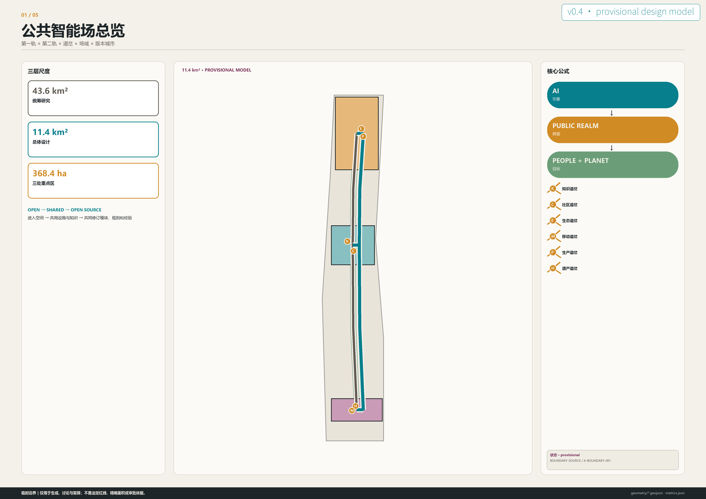
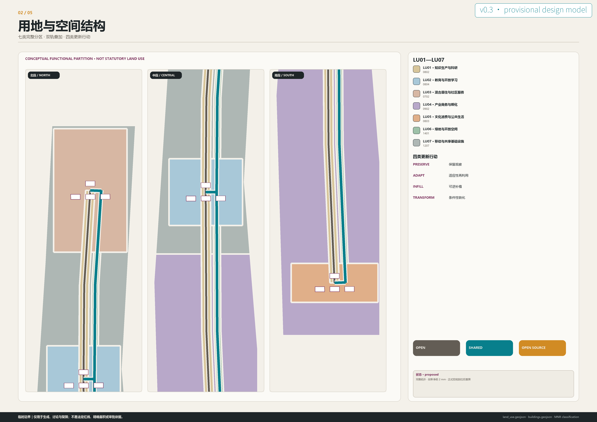
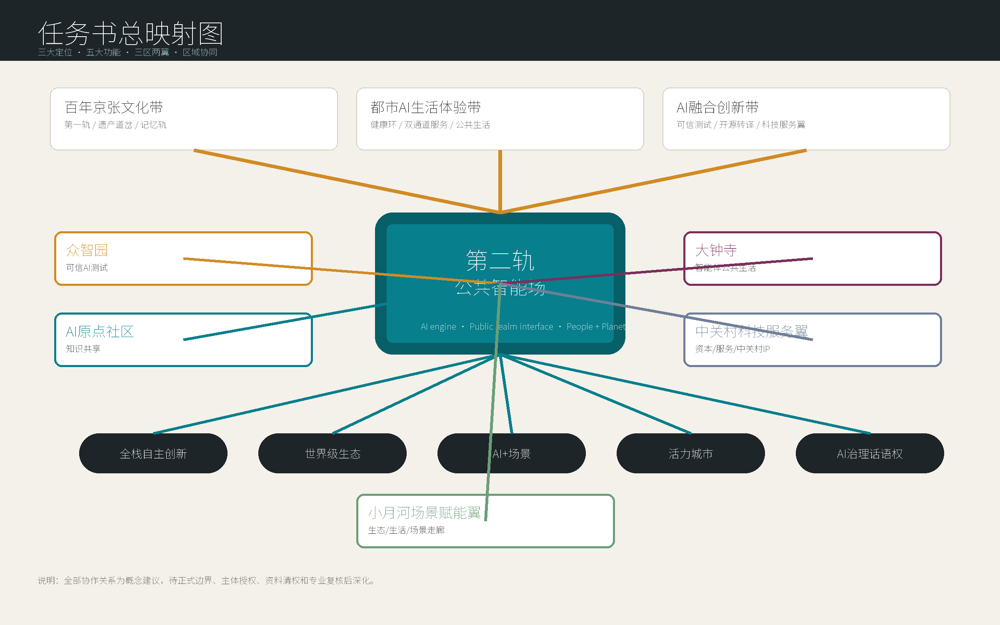
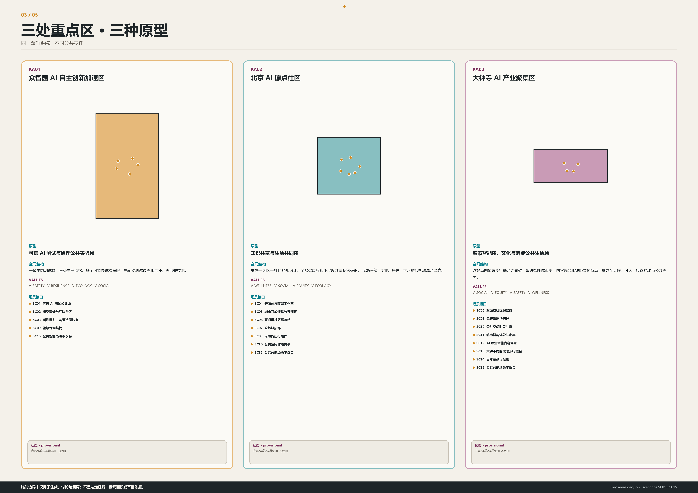
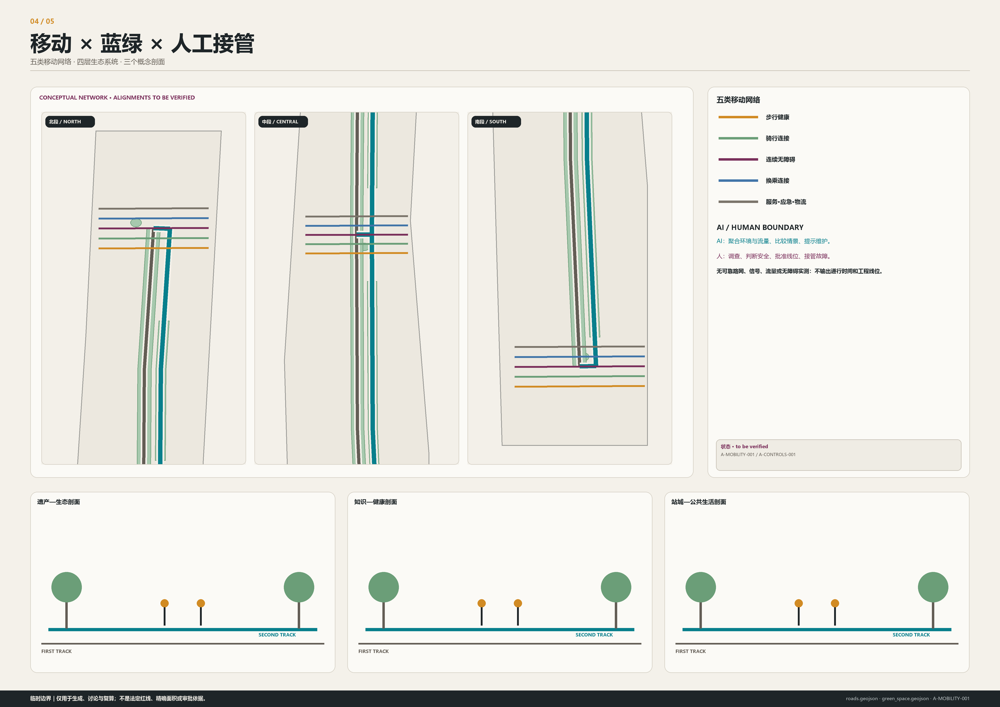
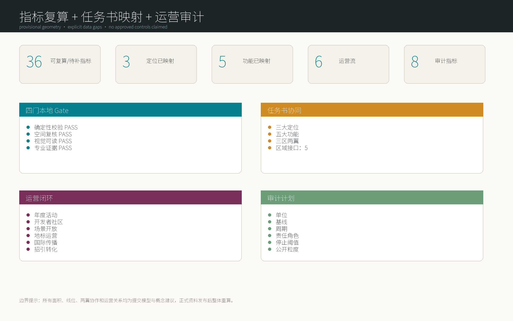

# 第二轨｜京张公共智能场

> 从铁路遗产公园到 AI 时代的公共创新基础设施

## 设计依据与资料清单

本方案把京张从铁路基础设施演化为 AI 时代公共创新基础设施。它不是传统 AI 产业园，而是一套可进入、可共享、可共同修订的公共智能场：AI 是引擎，公共领域是界面，人和地球是目标。设计首先回应正式公告和面向智能体任务书，再把每项判断链接到图层、指标、来源、假设与自检，而不是用科技叙事替代专业证据。[source:OFFICIAL-ANNOUNCEMENT] [source:AGENT-TASKBOOK] [depth:existing_conditions_diagnosis]

空间基底采用仓库临时约束范围。总体边界和三处重点区只用于生成、讨论与 EPSG:4548 复算，不是 official redline、法定面积或审批依据。正式边界到位后，九个空间图层、36 项指标、五张图解、A3/A0 与 HTML 必须整体重建；任何单文件替换都不足以恢复证据链。[source:BOUNDARY-SOURCE] [data:geometry/site_boundary.geojson#PROV-SITE-001] [metric:site_area_sqm]

俎菀芃（Wanpeng Zu）在公开项目记录中被列为京张铁路遗址公园的 Project Manager/Lead Designer。她参与一期主创所形成的经验，不是赛事背书，而是本方案从已建公共领域继续思考的专业连续性：第一轨不被覆盖，第二轨不以新奇取代历史，而是让遗产、公园、城市日常和未来创新共同工作。[source:AUTHOR-ASLA-JZRHP] [source:AUTHOR-ASLA-INTERVIEW]

全部文字、几何与视觉资产的权利边界见 `sources.json` 与 `report/copyright_statement.md`。外部案例只用于机制转译；一期论文只说明项目语境，不作为俎菀芃署名证据，也不代表原项目团队、出版机构或征集组织方认可本方案。[source:AUTHOR-JZRHP-PAPER]

## 三层范围工作框架

三层范围对应三种责任。统筹研究范围判断产业、知识与未来城市形态；总体设计范围把判断转译为用地、更新、移动、蓝绿和公共空间；重点区域用三个不同原型验证场景、治理与实施。临时边界约束“在哪里讨论”，正式控制资料决定“什么能够批准”，两者不混用。[standard:PROJECT-OFFICIAL-ANNOUNCEMENT] [depth:three_level_scope_framework]

总体逻辑由 FIRST TRACK、SECOND TRACK、SWITCH、FIELD 与 VERSION 五层构成。第一轨承载铁路遗产、公园与城市时间；第二轨连接人才、自然、知识、产业、社区和公共服务；六类道岔把高校、企业、公园、社区、商业和文化设施接入；场域由多节点共同学习；版本城市以 Temporary → Test → Feedback → Update → Scale 代替终局蓝图。[data:geometry/roads.geojson#FIRST-TRACK] [data:geometry/roads.geojson#SECOND-TRACK]

OPEN、SHARED、OPEN SOURCE 是逐级提高的公共性：空间先能进入，设施与知识再能共用，最后连场景、模块、规则、数据字典和复盘经验也能测试、复制和升级。W 表示全龄健康环，不是第七种道岔；它横向校验步行、休息、康复、热舒适和日常运动。

| 概念 | 定义 |
| --- | --- |
| FIRST_TRACK · 第一轨 | 铁路遗产、公园、历史文化与既有城市基础设施构成的时间基底。 |
| SECOND_TRACK · 第二轨 | 连接人才、知识、产业、社区、生态与公共服务的关系性基础设施。 |
| SWITCH · 道岔 | 高校、企业、公园、社区、商业与文化设施之间的可编程连接节点。 |
| FIELD · 场域 | 多个节点通过开放规则与共享设施共同形成的公共智能网络。 |
| VERSION · 版本城市 | 以临时介入、测试、反馈、更新、扩展代替一次性最终完成态。 |
| O-W01 · 全龄健康环 | 贯穿三片区的步行、骑行、休憩、康复与日常运动组件；W 是健康组件，不是第七类道岔。 |

### 任务书总映射图：三大定位、五大功能、三区两翼

第二轨不是另起一套园区语言，而是把任务书的三大定位、五大功能与三区两翼组织成一张协同回路。百年京张文化带由第一轨、遗产道岔和记忆轨保持时间连续；都市 AI 生活体验带由全龄健康环、双通道服务和大钟寺公共生活承担；AI 融合创新带由众智园可信测试、AI 原点开源转译和中关村科技服务翼支撑。所有关系均为概念建议，待合作主体、正式边界和专业资料确认后再深化为实施方案。[source:AGENT-TASKBOOK] [depth:three_level_scope_framework] [metric:taskbook_function_count]

| 任务书层级 | 第二轨回应 | 空间-产业-运营回路 |
| --- | --- | --- |
| 三大定位 | 百年京张文化带、都市 AI 生活体验带、AI 融合创新带 | 第一轨提供文化底板，第二轨组织公共创新界面，版本机制形成持续运营。 |
| 五大功能 | 全栈自主创新、世界级生态、AI+ 场景、新型活力城市、AI 治理话语权 | 可信测试、知识共享、场景开放、公共服务和版本议会互相反馈。 |
| 三区两翼 | 众智园、AI 原点社区、大钟寺、中关村科技服务翼、小月河场景赋能翼 | 三处重点区承载原型，两翼提供服务要素与场景走廊，回到年度版本大会复盘。 |

## 统筹研究范围产业与未来城市研究

产业竞争力在这里不是企业数量的孤立增长，而是基础研究、开放协作、可信测试、成果转译、企业服务和公共反馈的短循环。众智园承担可暂停的真实场景验证，AI 原点社区缩短高校—社区—创业之间的知识距离，大钟寺把智能体经济、内容文化与城市消费置于可见、可投诉、可人工接管的公共界面。[source:AGENT-TASKBOOK] [metric:industry_test_scenario_count]

AI 主要作为隐形基础设施：支持科研协作、产业创新、公共服务、文化体验、生态管理、城市运营和公众参与。空间不依赖机器人、屏幕或赛博装置制造“科技感”，而通过共享房间、测试庭院、学习环、生态道岔、双通道服务点和年度版本大会，使算法的责任、输入、暂停与退出变得可理解。

世界案例不被复制为形态或绩效。每个案例只提取一种可验证机制，并明确京张的转译方式和不可照搬条件；来源不提供本项目产权、投资、能耗、客流、法定控制或政府承诺。

### 区域协作框架：不写成已达成合作

区域协作只提出可交换接口，不写成已达成协议。北纬社区可作为人才日常生活、混合服务和社区反馈接口；未来科学城可作为前沿科研问题与试验伦理交流接口；怀柔科学城可作为大科学装置、基础研究和科普活动接口；经开区可作为工程验证、供应链和制造转译接口；京津冀可作为场景复制、人才流动和公共议题共研接口。每一项都必须在后续由真实主体授权、资料清权和专业复核后，才可从概念建议转为合作项目。[source:AGENT-TASKBOOK] [metric:regional_interface_count]

| 协作对象 | 可能交换内容 | 第二轨接口 | 边界 |
| --- | --- | --- | --- |
| 北纬社区 | 人才生活、日常服务、社区反馈、文化活动 | AI 原点社区和全龄健康环 | 概念建议；不代表社区已授权。 |
| 未来科学城 | 前沿科研问题、伦理议题、青年人才交流 | 开源转译工作室和年度版本大会 | 概念建议；不声称机构合作。 |
| 怀柔科学城 | 基础研究、科学传播、大装置议题转译 | 知识道岔和公共课堂 | 概念建议；不转移科研数据。 |
| 经开区 | 工程验证、供应链、制造场景、标准化复盘 | 众智园测试公共场和生产道岔 | 概念建议；不承诺产业落地。 |
| 京津冀 | 场景复制、公共服务经验、人才和活动流动 | 开源规则库和区域版本日志 | 概念建议；不替代区域规划。 |

### 八个机制参考

### C01｜新加坡榜鹅数码园区

**机制。** 产业、校园与数字基础设施在统一运营框架下协同。 **京张转译。** 转译为众智园共享测试底盘与 AI 原点知识—产业短循环。 **不可照搬。** 仅借鉴机制，不推断海淀的产权、投资、能耗或实施条件。 [source:EXT-PUNGGOL-JTC]

### C02｜赫尔辛基卡拉萨塔玛智慧城区

**机制。** 以居民节省时间和真实生活实验组织创新。 **京张转译。** 转译为以六维公共价值而非设备数量衡量场景。 **不可照搬。** 不复制当地治理制度或声称同等居民数据基础。 [source:EXT-KALASATAMA-FVH]

### C03｜伦敦 SHIFT 城市试验网络

**机制。** 在真实城区以合作协议和评估框架组织试验。 **京张转译。** 转译为测试前协议、公开边界、人工急停与版本复盘。 **不可照搬。** 不把案例当作技术安全或本地审批的替代证据。 [source:EXT-SHIFT-LONDON]

### C04｜阿姆斯特丹城市生活实验室

**机制。** 政府、知识机构、企业和社区围绕场所共同学习。 **京张转译。** 转译为三类片区原型和公共版本议会。 **不可照搬。** 仅用作合作机制参考，不声称组织关系已经建立。 [source:EXT-AMS-ULL]

### C05｜Decidim 民主参与契约

**机制。** 开源代码、参与保障和民主治理原则相互约束。 **京张转译。** 转译为开放、共享、开源三级和可追溯版本决策。 **不可照搬。** 不以数字投票替代正式公众参与和人类判断。 [source:EXT-DECIDIM-CONTRACT]

### C06｜Mila 负责任 AI 研究机制

**机制。** 把社会影响、跨学科判断和负责任研发纳入创新。 **京张转译。** 转译为众智园审计街区和场景 human-must 字段。 **不可照搬。** 不推断 Mila 对本方案背书或参与。 [source:EXT-MILA-RESPONSIBLE-AI]

### C07｜伦敦知识区协同网络

**机制。** 以步行尺度、机构网络和共同议题连接知识资产。 **京张转译。** 转译为 AI 原点社区知识环与开放课堂。 **不可照搬。** 不把机构集聚直接等同于开放共享或本地空间绩效。 [source:EXT-LONDON-KQ]

### C08｜多伦多 Quayside 公共审计经验

**机制。** 大型智慧城区提案需要持续审计数据治理、公共价值和责任。 **京张转译。** 转译为最小数据、不可扩展默认、公开风险登记和退出机制。 **不可照搬。** 仅借鉴审计问题，不类比具体合同、争议或法律结论。 [source:EXT-ONTARIO-QUAYSIDE-AUDIT]

## 总体设计范围城市更新与控规深度城市设计

总体设计把 11.4 平方公里临时范围视为关系网络，不把沿线切成同质园区。七类概念功能分区完整覆盖临时边界，第一轨与第二轨贯穿三片区，五类移动网络横向缝合，绿色伴随带、共享庭院、场景节点和十个项目包共同构成公共智能场。用地代码可核验，但分区仍是设计建议而非法定用地。[data:geometry/land_use.geojson#LU01] [standard:MNR-LAND-USE-CLASSIFICATION-GUIDE]

六个价值维度是每项行动的准入条件：Wellness 关注身体活动、恢复与照护；Social Connection 关注跨机构和跨年龄联系；Equity 保留非数字和无障碍通道；Safety 要求可解释、可暂停、可追责；Resilience / Infrastructure 关注冗余、维护与极端事件；Ecology 关注雨洪、热舒适、生境和共同管护。技术增长若不能同时改善公共价值，就不应扩展。

建筑图层不是现状建筑测绘，也不是拆建决定，而是 Preserve / Adapt / Infill / Transform 四类概念行动单元。FAR、高度、建筑密度和总建面保持 unknown/null；道路红线、权属、市政、消防、文保和工程条件到位后，才进入地块和建筑层面的专业复核。[depth:development_intensity_controls] [metric:floor_area_ratio]

### 六个价值维度

| 价值 | 空间与治理含义 |
| --- | --- |
| V-WELLNESS · 健康 | 支持身体活动、心理恢复、热舒适和照护可达。 |
| V-SOCIAL · 社会连接 | 创造低门槛相遇、协作、学习与代际交往的公共界面。 |
| V-EQUITY · 公平 | 保留非数字渠道、无障碍连续性与可负担的共享资源。 |
| V-SAFETY · 安全 | 以最小数据、人工复核、暂停机制和清晰责任边界约束 AI。 |
| V-RESILIENCE · 韧性与基础设施 | 把算力、能源、市政、交通和应急系统组织为可替换、可恢复的网络。 |
| V-ECOLOGY · 生态 | 以蓝绿连续性、生境、雨洪调蓄和低碳运营作为空间绩效。 |

## 重点区域详细设计

三处重点区不是同一种 AI 园区的三次复制。众智园是可信 AI 测试与治理公共实验场；AI 原点社区是高校、人才、科研、创业与生活混合的知识共同体；大钟寺是 AI 原生消费、内容文化、智能体经济与城市公共生活的全天候界面。三者共享双轨和版本机制，但拥有不同空间结构、场景组合、价值优先级与运营责任。[data:geometry/key_areas.geojson#PROV-KEY-001] [depth:three_key_area_detailed_design]

重点区 polygon 仍是临时约束。每个面积只报告“提交 polygon 复算值”，不称官方精确面积；所有建筑单元、道路连接和公共设施都必须在正式边界、现状调查、权属和专项条件到位后重算。[metric:key_area_count] [source:KEY-AREA-SOURCE]

### KA01｜众智园 AI 自主创新加速区

- **原型：** 可信 AI 测试与治理公共实验场
- **空间结构：** 一条生态测试脊、三类生产道岔、多个可暂停试验庭院；先定义测试边界和责任，再部署技术。
- **价值优先：** V-SAFETY, V-RESILIENCE, V-ECOLOGY, V-SOCIAL
- **场景：** SC01, SC02, SC03, SC09, SC15

### KA02｜北京 AI 原点社区

- **原型：** 知识共享与生活共同体
- **空间结构：** 高校—园区—社区的知识环、全龄健康环和小尺度共享院落交织，形成研究、创业、居住、学习的低扰动混合网络。
- **价值优先：** V-WELLNESS, V-SOCIAL, V-EQUITY, V-ECOLOGY
- **场景：** SC04, SC05, SC06, SC07, SC08, SC10, SC15

### KA03｜大钟寺 AI 产业聚集区

- **原型：** 城市智能体、文化与消费公共生活场
- **空间结构：** 以站点四象限步行缝合为骨架，串联智能体市集、内容舞台和铁路文化节点，形成全天候、可人工接管的城市公共界面。
- **价值优先：** V-SOCIAL, V-EQUITY, V-SAFETY, V-WELLNESS
- **场景：** SC06, SC08, SC10, SC11, SC12, SC13, SC14, SC15

## AI 创新生态、人才画像与 AI+ 场景

十类人物不是营销客群，而是权益与障碍的检查表。研究者、创业团队、儿童、老年人、周边居民、运维人员和来访者都必须在同一场域获得可选择的参与方式。每个场景至少关联两类人物，并写明公共问题、空间载体、AI 可做、人工必做、数据规则、暂停条件、衡量方式和开源输出。[data:geometry/public_space.geojson#SC01] [metric:persona_count]

十五张场景卡中，SC01—SC04 为产业测试验证场景。测试默认与日常通行分离、先审批协议、可现场停止、形成事件记录和版本结论。其他场景覆盖教育、双通道公共服务、健康、儿童、生态、遗产、智能体消费、交通缝合和年度治理；AI 从不替代规划审批、专业判断、救援决定、教学照护或申诉处理。[standard:GENERATIVE-AI-INTERIM-MEASURES] [metric:scenario_count]

### 十类人物

| 人物 | 需求 | 障碍 | 价值校验 |
| --- | --- | --- | --- |
| U01 · 基础研究者 | 可共享实验资源、安静专注空间、可信数据与跨机构交流。 | 机构边界、封闭设备和缺少非正式交流界面。 | V-SOCIAL, V-SAFETY, V-RESILIENCE |
| U02 · 创业者与小团队 | 低门槛试验、短租空间、专业服务、首批用户和清晰测试规则。 | 固定成本高、场景准入不透明、验证周期长。 | V-SOCIAL, V-EQUITY, V-SAFETY |
| U03 · 学生与青年学习者 | 开放课程、实践项目、可负担社交与夜间安全路线。 | 校园与城市断裂、资源信息不对称。 | V-WELLNESS, V-SOCIAL, V-EQUITY, V-SAFETY |
| U04 · 工程测试与运维人员 | 隔离测试区、可追溯流程、人工急停和跨班组交接。 | 责任边界含混、基础设施状态不可见。 | V-SAFETY, V-RESILIENCE |
| U05 · 社区居民与照护者 | 日常服务、儿童与老人照护、安静休憩、可理解的反馈渠道。 | 技术门槛、活动冲突和公共服务碎片化。 | V-WELLNESS, V-SOCIAL, V-EQUITY, V-SAFETY |
| U06 · 儿童与家庭学习者 | 可观察自然、动手学习、安全游戏和家长可见的活动空间。 | 交通冲突、成人化界面和被动数据采集。 | V-WELLNESS, V-SOCIAL, V-SAFETY, V-ECOLOGY |
| U07 · 老年使用者 | 连续座椅、遮阴、清晰导向、现场人工服务和非智能替代渠道。 | 数字排斥、步行疲劳和复杂交互。 | V-WELLNESS, V-EQUITY, V-SAFETY |
| U08 · 有无障碍需求的使用者 | 无台阶连续路径、多感官信息、足够转弯空间和人工协助。 | 断裂坡道、不可读界面和无障碍设施被占用。 | V-EQUITY, V-SAFETY, V-WELLNESS |
| U09 · 文化访客与创意工作者 | 可信历史叙事、创作展示、公共活动和不被商业化吞没的遗产体验。 | 文化符号表面化、版权不清和空间同质化。 | V-SOCIAL, V-EQUITY, V-ECOLOGY |
| U10 · 公共服务与城市运营人员 | 多部门协同、证据可追溯、清晰升级路径和可撤销自动化。 | 系统孤岛、误报压力和责任转移。 | V-SAFETY, V-RESILIENCE, V-EQUITY |

### 十五张完整场景卡

### SC01｜可信 AI 测试公共场 · `industry_test`

- **公共问题：** 产业测试与公众环境之间缺少透明、可暂停、可复盘的中间层。
- **空间：** 众智园可围合测试庭院、观察廊和公开说明台，默认与日常通行分离。
- **人物：** U01 基础研究者, U02 创业者与小团队, U04 工程测试与运维人员, U10 公共服务与城市运营人员
- **AI 可做：** 在经批准的封闭数据集和边界内模拟、记录异常并生成测试摘要。
- **人工必做：** 批准测试方案、确认安全边界、现场急停并签署是否进入下一版本。
- **数据规则：** 最小化采集；优先合成或匿名数据；公开模型卡、数据卡和事件记录模板。
- **暂停条件：** 越界采集、无法解释的高风险输出、人工急停失效或公众投诉无法闭环时立即暂停。
- **指标：** test_protocol_publication_rate, human_stop_drill_rate, incident_closeout_time
- **开源输出：** 测试协议、风险登记、复盘模板与空间组件尺寸规则。

### SC02｜模型审计与红队街区 · `industry_test`

- **公共问题：** 模型偏差、误用和不可解释风险常在部署后才暴露。
- **空间：** 公开审计室、对抗测试实验室、案例展廊和公众质询厅形成可见的治理街区。
- **人物：** U01 基础研究者, U04 工程测试与运维人员, U09 文化访客与创意工作者, U10 公共服务与城市运营人员
- **AI 可做：** 辅助生成测试用例、比对版本差异并标记需要专业复核的异常。
- **人工必做：** 确定审计问题、判断实质影响、保护举报者并发布结论。
- **数据规则：** 审计数据分级访问；个人数据不得进入公开展示；结论与证据版本关联。
- **暂停条件：** 出现泄密、歧视性结果无法纠正、测试影响真实服务或利益冲突未披露时暂停。
- **指标：** audit_coverage, bias_issue_resolution_rate, public_question_response_rate
- **开源输出：** 审计问题库、偏差检查表、透明度报告版式。

### SC03｜端侧算力—能源协同沙盒 · `industry_test`

- **公共问题：** 算力设施与能源、热环境、市政容量之间缺少可读的协同界面。
- **空间：** 设备庭院、余热展示花园、独立配电演示单元与人工运维室组成隔离沙盒。
- **人物：** U01 基础研究者, U04 工程测试与运维人员, U10 公共服务与城市运营人员
- **AI 可做：** 在模拟数据上预测负荷、建议错峰并比较能源策略。
- **人工必做：** 确认设备安全、能源调度、消防和市政接口；任何真实切换须由专业人员执行。
- **数据规则：** 不公开敏感基础设施坐标和实时负荷；公开聚合绩效与方法。
- **暂停条件：** 温度、负荷或电气保护越限，传感器冲突，或人工确认缺失时暂停。
- **指标：** energy_use_effectiveness, heat_reuse_ratio, manual_override_success
- **开源输出：** 聚合指标定义、沙盒接口协议和低敏展示组件。

### SC04｜开源成果转译工作室 · `industry_test`

- **公共问题：** 高校成果、开源社区和城市真实问题之间缺少长期共同工作的空间机制。
- **空间：** 可预约工作台、演示阶梯、知识许可咨询桌和社区问题墙围绕共享院落布置。
- **人物：** U01 基础研究者, U02 创业者与小团队, U03 学生与青年学习者, U09 文化访客与创意工作者
- **AI 可做：** 辅助整理公开文档、匹配合作技能并生成可供复核的原型说明。
- **人工必做：** 确认许可、署名、问题优先级、技术可行性和是否发布。
- **数据规则：** 只用公开或明确授权材料；代码、数据和模型分别记录许可。
- **暂停条件：** 来源不清、许可冲突、敏感信息混入或社区问题被商业利益替代时暂停。
- **指标：** open_release_count, cross_institution_team_count, community_problem_closeout
- **开源输出：** 原型、文档模板、许可清单和问题—方案映射。

### SC05｜城市开放课堂与导师环 · `public_service`

- **公共问题：** 优质知识资源被校园、年龄和专业门槛分割。
- **空间：** 沿知识环设置室内外课堂、安静角、儿童动手台和长者数字互助桌。
- **人物：** U01 基础研究者, U03 学生与青年学习者, U06 儿童与家庭学习者, U07 老年使用者, U09 文化访客与创意工作者
- **AI 可做：** 辅助生成多语言、大字和易读课程版本，推荐公开课程路径。
- **人工必做：** 教师与导师核对内容、照护未成年人、处理争议并保留线下教学。
- **数据规则：** 不建立跨场景个人学习画像；未成年人数据不用于商业推荐。
- **暂停条件：** 出现错误知识无法纠正、未成年人保护不足或无障碍版本缺失时暂停自动推荐。
- **指标：** open_class_hours, cross_age_participation, accessible_material_share
- **开源输出：** 开放课程单元、易读模板和导师运营手册。

### SC06｜双通道社区服务站 · `public_service`

- **公共问题：** 智能服务提高效率时也可能排除不会或不愿使用数字工具的人。
- **空间：** 同一入口并列人工窗口、自助终端、等候座椅、隐私咨询间和清晰纸质导向。
- **人物：** U05 社区居民与照护者, U07 老年使用者, U08 有无障碍需求的使用者, U10 公共服务与城市运营人员
- **AI 可做：** 解释流程、辅助填表和分流，但不得替代资格判断或拒绝服务。
- **人工必做：** 承担最终办理、例外处理、身份核验和申诉反馈。
- **数据规则：** 屏幕防窥、会话结束即清除临时数据；人工与数字渠道享有同等服务资格。
- **暂停条件：** 人工窗口不可用、错误分流、隐私暴露或系统拒绝人工接管时暂停智能通道。
- **指标：** human_channel_availability, accessible_queue_time, appeal_resolution_rate
- **开源输出：** 双通道空间模块、服务蓝图和人工接管清单。

### SC07｜全龄健康环 · `public_service`

- **公共问题：** 日常运动、康复与休息空间不连续，弱势使用者常被快速通行挤出。
- **空间：** 无台阶慢行环每隔合理距离提供座椅、饮水、遮阴、夜间照明和不同强度活动支点。
- **人物：** U03 学生与青年学习者, U05 社区居民与照护者, U06 儿童与家庭学习者, U07 老年使用者, U08 有无障碍需求的使用者
- **AI 可做：** 使用匿名环境数据提示热风险、拥挤和适合的替代路线。
- **人工必做：** 管理者检查路面、照明与设施，医护建议由合格专业人员提供。
- **数据规则：** 不采集个人健康档案、不做人脸识别；只发布聚合环境状态。
- **暂停条件：** 路段不安全、极端天气、无障碍路径被占用或环境传感器失真时停止路线推荐。
- **指标：** step_free_continuity, rest_point_coverage, heat_safe_hours
- **开源输出：** 健康环组件、巡检表和匿名环境提示规范。

### SC08｜无障碍出行陪伴 · `public_service`

- **公共问题：** 无障碍路线状态变化快，而导航常把“可达”误判为“可用”。
- **空间：** 站点、主要道岔与服务站设置多感官导向、求助按钮和人工集合点。
- **人物：** U05 社区居民与照护者, U07 老年使用者, U08 有无障碍需求的使用者, U10 公共服务与城市运营人员
- **AI 可做：** 根据公开设施状态提供多种路线并解释不确定性。
- **人工必做：** 确认施工与设施状态、响应求助、提供现场协助并修正错误。
- **数据规则：** 位置共享必须主动开启、限时、可撤回；默认不保存行程历史。
- **暂停条件：** 电梯或坡道状态不可验证、定位误差过大、人工求助不可用时只显示人工咨询。
- **指标：** verified_accessible_route_share, help_response_time, route_correction_time
- **开源输出：** 设施状态数据字典、人工求助协议和无障碍导向模板。

### SC09｜蓝绿气候共管 · `ecology_infrastructure`

- **公共问题：** 生态空间的雨洪、热舒适与生境绩效难以被公众理解和共同维护。
- **空间：** 雨水花园、观察桥、可淹没草地和社区监测桌形成四季生态课堂。
- **人物：** U04 工程测试与运维人员, U05 社区居民与照护者, U06 儿童与家庭学习者, U10 公共服务与城市运营人员
- **AI 可做：** 汇总环境传感、预警维护需求并生成不同降雨情景的可视解释。
- **人工必做：** 生态与市政专业人员判断风险、发布预警、维护设施并批准公众活动。
- **数据规则：** 只使用环境与设施数据；敏感基础设施位置按等级隐藏。
- **暂停条件：** 暴雨、防洪调度、传感器矛盾或现场封闭时暂停公众互动并转为安全提示。
- **指标：** stormwater_retention_estimate, shade_comfort_coverage, habitat_patch_continuity
- **开源输出：** 环境指标字典、社区观察协议和维护事件模板。

### SC10｜公共空间时段共享 · `public_service`

- **公共问题：** 有限公共空间在运动、安静、表演、通行和商业活动之间持续冲突。
- **空间：** 可逆家具、地面时间标识、安静边带和公开公告板支持分时共享。
- **人物：** U03 学生与青年学习者, U05 社区居民与照护者, U06 儿童与家庭学习者, U07 老年使用者, U09 文化访客与创意工作者, U10 公共服务与城市运营人员
- **AI 可做：** 基于匿名使用计数提出时段方案并显示受影响群体。
- **人工必做：** 社区协调者举行公开协商、保障少数需求并最终批准规则。
- **数据规则：** 只做不可识别的计数；公开排程规则、申诉渠道和变更记录。
- **暂停条件：** 投诉积累、紧急通行受阻、弱势群体持续被排除或活动安全条件不足时暂停自动排程。
- **指标：** shared_hours, user_group_balance, conflict_resolution_rate
- **开源输出：** 时段共享规则、家具组件和公众协商模板。

### SC11｜城市智能体公共市集 · `culture_commerce`

- **公共问题：** 智能体服务缺少可比较、可试用、可投诉和可人工退出的公共入口。
- **空间：** 大钟寺设置短期摊位、演示桌、人工咨询台和服务条款墙，禁止把通行变成强制体验。
- **人物：** U02 创业者与小团队, U03 学生与青年学习者, U05 社区居民与照护者, U09 文化访客与创意工作者, U10 公共服务与城市运营人员
- **AI 可做：** 在访客主动选择后演示限定功能，解释来源、能力和局限。
- **人工必做：** 审核上架、处理退款和投诉、检查无障碍与未成年人保护。
- **数据规则：** 默认访客模式、无需注册；任何个性化单独同意并可即时删除。
- **暂停条件：** 虚假能力、暗示官方背书、强制注册、歧视性服务或投诉处理失效时下架。
- **指标：** guest_mode_share, service_disclosure_completeness, complaint_closeout
- **开源输出：** 上架披露模板、公共试用空间规则和投诉分级协议。

### SC12｜AI 原生文化内容舞台 · `culture_commerce`

- **公共问题：** 生成内容进入公共文化空间时容易混淆作者、训练来源、真实性和责任。
- **空间：** 可变展演台、来源标签带、静音观看区和人工策展桌共同构成内容公共场。
- **人物：** U03 学生与青年学习者, U06 儿童与家庭学习者, U09 文化访客与创意工作者, U10 公共服务与城市运营人员
- **AI 可做：** 在清权输入上辅助创作、字幕、翻译与无障碍描述，并明确标识生成内容。
- **人工必做：** 策展、核对权利与历史事实、判断公共适宜性并回应作者申诉。
- **数据规则：** 保留提示方法、输入权利、人工编辑和版本记录；不使用未授权肖像或商标。
- **暂停条件：** 权利来源不清、内容可能误导、人物生成异常或缺少必要无障碍版本时停止发布。
- **指标：** rights_record_completion, accessible_content_share, creator_appeal_resolution
- **开源输出：** 生成内容标签、策展清单和公共播放无障碍模板。

### SC13｜大钟寺站四象限步行缝合 · `public_service`

- **公共问题：** 站点四象限之间的地面步行、非机动车停放与公共界面缺少连续组织。
- **空间：** 以地面连续、清晰过街、停放整理和遮阴等候为优先的概念缝合，不预设桥隧工程。
- **人物：** U02 创业者与小团队, U03 学生与青年学习者, U05 社区居民与照护者, U07 老年使用者, U08 有无障碍需求的使用者
- **AI 可做：** 在可靠路网补齐后辅助比较步行冲突和排队情景。
- **人工必做：** 交通和无障碍专业人员完成现状调查、信号与道路安全判断，并依法审批。
- **数据规则：** 现阶段不使用个人轨迹；未来分析优先短时人工计数和聚合流量。
- **暂停条件：** 缺道路红线、信号、流量或无障碍实测时，不输出工程线位与通行时间结论。
- **指标：** crossing_continuity_to_be_verified, bicycle_parking_order_to_be_verified, step_free_route_to_be_verified
- **开源输出：** 四象限审查框架、现场调查表和概念公共界面组件。

### SC14｜百年京张记忆轨 · `culture_commerce`

- **公共问题：** 铁路遗产容易被简化为装饰，第一期公园经验与 AI 时代公共生活缺少可持续对话。
- **空间：** 以轨道留痕、口述史听点、低干预展签和社区策展台串联第一轨与第二轨。
- **人物：** U03 学生与青年学习者, U06 儿童与家庭学习者, U07 老年使用者, U09 文化访客与创意工作者
- **AI 可做：** 在已核实史料上提供多语言检索、无障碍讲述和来源链接。
- **人工必做：** 历史研究者、遗产专业人员和社区共同核实事实、权利与叙事取舍。
- **数据规则：** 口述史需明确同意、用途和撤回机制；不得用生成内容补造史实。
- **暂停条件：** 史实冲突未解决、权利不清、文保控制资料缺失而涉及实体改造时暂停。
- **指标：** verified_story_share, accessible_narrative_modes, community_curated_events
- **开源输出：** 史料来源标签、口述史同意模板和低干预展陈组件。

### SC15｜公共智能场版本议会 · `public_service`

- **公共问题：** 城市创新常有试点启动机制，却缺少公开反馈、暂停、修正和退出机制。
- **空间：** 三片区各设版本台，年度在公共议事厅汇总场景证据、投诉、六维绩效和下一轮提案。
- **人物：** U01 基础研究者, U02 创业者与小团队, U03 学生与青年学习者, U04 工程测试与运维人员, U05 社区居民与照护者, U07 老年使用者, U08 有无障碍需求的使用者, U09 文化访客与创意工作者, U10 公共服务与城市运营人员
- **AI 可做：** 汇总公开证据、识别未覆盖群体、对比版本并生成不同方案的影响清单。
- **人工必做：** 组织公开议事、确认代表性、处理冲突、决定暂停/更新/扩展并承担责任。
- **数据规则：** 只发布匿名聚合证据；少数群体意见不得因数量少被自动降权。
- **暂停条件：** 证据不可追溯、关键群体缺席、投诉机制失效或六维价值明显恶化时不得扩展。
- **指标：** feedback_closeout_rate, underrepresented_group_coverage, version_decision_traceability
- **开源输出：** 版本日志、公众议事议程、六维绩效卡和扩展门槛。

## 用地、建筑规模与拆改留方案

七类概念功能分区将知识研究、教育学习、混合生活、产业孵化、文化消费、绿地开放空间与共享基础设施放入同一完整拓扑。LU01—LU07 以国土空间分类代码表达，每个面积和比例由脚本复算；毫米级投影净距用于消除坐标转换弦差，不改变临时边界的设计判断。[data:geometry/land_use.geojson#LU01] [depth:land_use_layout]

建筑策略坚持“调查之前不拆除、控制未知不填数”。Preserve 保留并观察，Adapt 允许低扰动再用，Infill 仅测试可逆补植，Transform 必须等待结构、权属、文保、消防、交通和公共利益复核。图层中的 12 个行动单元明确标注 `not_building_footprint=true`；兼容指标只计算其概念面积，不可用于建筑密度或总建面。[data:geometry/buildings.geojson#B-KA01-PRESERVE] [metric:building_footprint_area_sqm]

风貌控制以铁路时间感、开放地面、可阅读构造和低技术依赖为基调。高度、体量、屋顶、退线和界面只给出复核问题，不给伪精确数值；三处地标默认是公共制度空间，而不是新的标志性大体量建筑。[depth:height_massing_character] [metric:building_height_m]

| 分区 | 用地代码 | 设计作用 | 提交模型面积 |
| --- | --- | --- | ---: |
| LU01 · 知识生产与科研 | 0802 | 共享研究、可信 AI 测试与成果转译的概念功能区。 | 930,813 sqm |
| LU02 · 教育与开放学习 | 0804 | 连接高校、公众课程、工作室与终身学习。 | 909,989 sqm |
| LU03 · 混合居住与社区服务 | 0702 | 日常照护、社区服务和人才生活的混合界面。 | 1,805,809 sqm |
| LU04 · 产业商务与孵化 | 0902 | 企业协作、孵化加速和专业服务的概念载体。 | 4,296,082 sqm |
| LU05 · 文化消费与公共生活 | 0803 | 内容生产、展演、消费与城市公共活动的复合场景。 | 681,514 sqm |
| LU06 · 绿地与开放空间 | 1401 | 承载生态、健康、交往、文化和可逆测试的公共底盘。 | 476,451 sqm |
| LU07 · 移动与共享基础设施 | 1207 | 步行骑行、轨道接驳、物流和基础设施共享的概念网络。 | 2,312,044 sqm |

## 交通、轨道、市政与公共服务设施

第一轨被标注为概念遗产记忆脊柱，而不是既有铁路精确线；第二轨与之相邻并向三片区分叉。五类横向网络分别承担步行健康、骑行连接、连续无障碍、公共交通换乘和服务—应急—物流。图层宽度只用于概念面积复算，正式线位、坡度、信号、停车和消防条件必须经过专项调查。[data:geometry/roads.geojson#FIRST-TRACK] [data:geometry/roads.geojson#SECOND-TRACK] [metric:road_area_sqm]

AI 可以在可靠路网和聚合数据到位后比较冲突、拥挤、热舒适和设施维护情景；交通与无障碍专业人员必须完成现场调查、安全判断和依法审批。任何个人轨迹、实时敏感基础设施位置或未经确认的通行时间都不进入本版成果。[depth:traffic_rail_slow_parking]

市政和新型基础设施遵循“可见服务、隐形技术、人工接管”：端侧算力、能源协调、传感与维护系统置于责任清晰的后台，公共界面提供状态、来源、人工窗口和故障替代。容量、管线、防洪、消防、能源与运营主体仍待专业资料确认。[depth:municipal_new_infrastructure]

## 蓝绿空间、公共空间与城市风貌

第二轨首先是一条公共领域系统。绿色伴随带、遗产生态缓冲和三个微型生境道岔共同支撑雨洪、遮阴、热舒适、生境与恢复；共享庭院、十五个场景节点、六类道岔和三处非建筑地标提供学习、照护、质询、测试、文化和日常社交。[data:geometry/green_space.geojson#GREEN-SECOND-TRACK] [metric:green_ratio]

K/C/E/M/P/H 分别是知识、社区、生态、移动、生产和遗产道岔。道岔不是科技装置目录，而是机构之间的责任接口：谁开放场地、谁维护设施、谁解释数据、谁能停止系统、谁处理投诉、哪个版本可以扩展，都必须可以被追踪。W 健康环跨越所有道岔，但不另立权力结构。[data:geometry/public_space.geojson#SW-K]

视觉语言来自铁路轨迹、双轨、道岔、网络、节点、流动和生长。材料、标识和构造保持可维护、可逆和专业克制，避免赛博朋克、GitHub 图标化或企业宣传感。文化连续性由公共使用和真实记忆建立，而不是靠复制一期图纸或制造怀旧场景。[standard:MOHURD-URBAN-DESIGN-MEASURES]

| 道岔 | 连接作用 |
| --- | --- |
| SW-K · 知识道岔 | 开放课程、科研转译、共享实验室与开源资料接口。 |
| SW-C · 社区道岔 | 邻里服务、照护、共治与非数字服务的复合节点。 |
| SW-E · 生态道岔 | 把绿地、水系、热环境与公众生态观察连接起来。 |
| SW-M · 移动道岔 | 轨道接驳、步行、骑行、无障碍和应急路径的换乘界面。 |
| SW-P · 生产道岔 | 可信 AI 测试、孵化、发布和产业协作的可治理场景。 |
| SW-H · 遗产道岔 | 将铁路记忆、一期公园、中关村创新文化与当代公共生活并置。 |

### 品牌、Logo 方向与文化导视层级

主名称保留“第二轨｜京张公共智能场”，英文名为 “The Second Track | Jing-Zhang Public Intelligence Field”。主标识方向不是企业 Logo，而是一套公共导视母题：两条平行轨迹形成基础秩序，第二轨以蓝绿色关系线分岔，六类道岔符号用 K/C/E/M/P/H 对应知识、社区、生态、移动、生产和遗产。文化导视在层级上低于一带主标识，高于单个活动海报；它只解释空间、来源、贡献和规则，不制造官方批准感或商业背书。[source:AGENT-TASKBOOK] [metric:brand_component_count]

| 系统 | 内容 | 授权边界 |
| --- | --- | --- |
| 主名称 | 第二轨｜京张公共智能场 / The Second Track | 方案命名，不注册商标，不代表官方采纳。 |
| 主标识方向 | 稳定第一轨 + 可迭代第二轨 + 道岔节点 | 作为视觉方向，不使用政府、学校或企业标志。 |
| 六类符号 | K 知识、C 社区、E 生态、M 移动、P 生产、H 遗产 | 用于概念导视和组件库，不替代正式交通或消防标识。 |
| 文化导视 | 来源标签、记忆轨、口述史同意、生成内容标识 | 史实与权利未核实时不得发布。 |
| 荣誉展示 | 贡献者墙、开源发布架、失败复盘墙、版本日志 | 记录贡献，不排名羞辱，不暗示行政认证。 |
| 年度活动 IP | Open Questions、Field Tests、Public Review、Release & Assembly、Learning from Failure | 活动设想，需审批、预算、安全和版权确认。 |
| 国际传播短文 | “A railway heritage corridor becomes a civic interface for trustworthy AI.” | 传播文案，不声称入选、批准或已建成。 |

### 三处公共地标
- **L01 · 开放道岔庭：** 用可逆地面标识、观察廊和公共质询台展示可信 AI 如何被测试和暂停；默认不是新建地标建筑。
- **L02 · 原点开源驿：** 把开放课程、原型发布、贡献者署名和人才互助组织成日常公共客厅。
- **L03 · 城市智能体公演台：** 以可撤场舞台和来源标签带承载智能体演示、AI 新文化与百年京张叙事。

## 更新项目清单、实施政策与分期计划

城市不是一次完成，而是持续版本迭代。P0 以临时标识和可移除道岔建立公共可见性；P1 测试可信 AI、开源转译与双通道服务；P2 通过健康、生态和公众反馈观察效果；P3 更新组件和年度活动协议；P4 只有在正式边界、控规、权属、工程、资金和六价值绩效均通过复核后才谨慎扩展。[data:geometry/phasing.geojson#PKG01] [depth:phasing_implementation]

年度“京张公共智能场版本大会”包含 Open Questions、Field Tests、Public Review、Release & Assembly、Learning from Failure 五个环节。它不以发布产品为唯一成功，而是公开未解决问题、事故与停止决定，形成年度版本日志。公众代表性、利益冲突、申诉、隐私和无障碍要求由人工主持和独立复核，AI 只能整理材料和提示缺口。

十个项目包是概念建议，不是采购、投资或工期承诺。每包都写明牵头主体类型、依赖条件、开源输出和停止条件；没有责任主体、维护预算、权利清理或安全条件时，项目保持测试或暂停状态。[metric:project_package_count] [source:EXT-ONTARIO-QUAYSIDE-AUDIT]

### agent.6 长期运营闭环

长期运营以“六条运营流 + 六个决策门 + 可退出审计”为基本结构。年度活动、开发者社区、场景开放、公共地标运营、国际传播和招引转化各自有牵头主体类型、资源需求、决策门、绩效口径、人工复核、申诉和退出路径；任何一路缺责任主体、预算、安全、版权、隐私或无障碍复核，都不能从测试进入扩展。[source:AGENT-TASKBOOK] [metric:operating_stream_count]

| 运营流 | 责任主体类型 | 资源需求 | 决策门 | 绩效口径 | 退出路径 |
| --- | --- | --- | --- | --- | --- |
| 年度活动 | 独立主持的活动与公共议事团队 | 场地、审批、安保、翻译、无障碍、版权 | 活动许可与风险评估通过 | 代表性、投诉闭环、公开复盘 | 取消、延期或降级为线上资料发布。 |
| 开发者社区 | 高校-开源-企业协作秘书处 | 导师、工作台、许可咨询、贡献记录 | 许可清楚且问题来自公共需求 | 贡献持续性、跨机构参与、复用质量 | 下架不清权成果，暂停商业化转译。 |
| 场景开放 | 场景治理联合小组 | 测试协议、急停、保险、现场运维 | 人工接管和暂停条件可演练 | 事件闭环、暂停演练、少数群体覆盖 | 停止测试，保留复盘，不扩展。 |
| 公共地标 | 公共空间运营和策展团队 | 展陈、维护、安静区、人工服务 | 内容清权且不影响日常通行 | 可达性、停留质量、文化理解 | 撤场、改为低干预导视。 |
| 国际传播 | 双语编辑和事实核验团队 | 翻译、图像权利、状态说明、媒体包 | 事实状态与授权边界已核对 | 引入有效反馈、国际问题清单 | 撤回误导性文案并发布更正。 |
| 招引转化 | 专业服务和公共价值评估组 | 政策咨询、合规审查、试点路径、数据模板 | 公共价值和合规门槛通过 | 从问题到试点的转化质量，不以数量单独评价 | 回到开放问题库或停止招引。 |

| 项目包 | 阶段 | 区域 | 牵头类型 | 依赖 | 开源输出 |
| --- | --- | --- | --- | --- | --- |
| PKG01 · 第二轨开放标识与临时道岔 | temporary | KA01, KA02, KA03 | 公共空间运营与设计团队 | 现场安全、文保、权属与活动许可核查。 | 标识、家具、事件记录和撤场手册。 |
| PKG02 · 众智园可信测试公共场 v0.1 | test | KA01 | 测试治理联合小组 | 正式场地边界、责任主体、安全与基础设施评估。 | 测试协议、暂停条件和复盘模板。 |
| PKG03 · AI 原点开源转译季 | test | KA02 | 高校—社区—开发者协作组 | 场地共享协议、清权资料和导师机制。 | 课程、原型、许可清单和贡献者记录。 |
| PKG04 · 大钟寺双通道城市客厅 | test | KA03 | 公共服务与商业运营协作组 | 站区调查、无障碍审查和人工服务排班。 | 双通道服务蓝图与无障碍检查表。 |
| PKG05 · 全龄健康环观察期 | feedback | KA02, KA03 | 社区与健康公共空间团队 | 现状步行与无障碍调查、极端天气预案。 | 匿名使用观察、设施巡检和修正日志。 |
| PKG06 · 蓝绿共管数据字典 | feedback | KA01, KA02 | 生态、市政与社区共同维护组 | 防洪、市政、绿地和维护责任边界。 | 环境数据字典、敏感项分级和公众观察协议。 |
| PKG07 · 公共智能场版本议会 | feedback | KA01, KA02, KA03 | 独立主持的多方公共议事组 | 代表性规则、公开证据、申诉与利益冲突披露。 | 年度版本日志、暂停/更新/扩展决定与理由。 |
| PKG08 · 三片区道岔组件 v1.0 | update | KA01, KA02, KA03 | 专业设计与运营复核组 | 测试反馈、无障碍复核、维护成本与现场适配。 | K/C/E/M/P/H 六类组件图集和适用边界。 |
| PKG09 · 第二轨年度公共活动协议 | update | KA01, KA02, KA03 | 开发者、文化与社区运营联盟 | 活动审批、版权、安全、噪声、交通和资金确认。 | 活动日历模板、开放征集规则和转化跟踪框架。 |
| PKG10 · 京张公共智能场审慎扩展 | scale | ODA | 政府依法决策、专业团队和公众共同复核 | 官方边界、控规、权属、工程、市政、资金和前序六维绩效均完成核验。 | 可复制规则、不可复制条件、风险登记与退出方案。 |

## 指标体系、面积复算与合规矩阵

指标分为三类。第一类是从本次几何可复算的模型值：场地、绿地、公共空间、概念道路、七类用地、三处重点区和各类数量。第二类是必须等待正式控制的法定值：FAR、高度、建筑密度、总建面、退线和道路红线。第三类是运营后才能校准的绩效值：参与、公平、事故闭环、生态、维护和产业转化。三类不得互相替代。[depth:metrics_recalculation]

当前 `metrics.json` 含 36 项记录，其中 known 值带公式、来源文件、置信度与假设，unknown 值保持 null 并写明原因。空间复算采用 EPSG:4548；临时边界造成的精度限制贯穿所有派生面积。核心指标只描述提交模型，不是审定规划条件。[metric:site_area_sqm] [metric:green_ratio] [metric:public_space_ratio]

`compliance_matrix.json` 将 23 条公告与智能体任务映射到章节、GeoJSON、指标、图纸、HTML、来源、标准、假设和自检；`standard_matrix.json` 覆盖 9 条标准与政策；`design_depth_matrix.json` 覆盖 15 项专业深度。缺少官方建筑专业文件的条目明确为 data_gap。

| 指标 | 状态 | 值 | 含义 |
| --- | --- | ---: | --- |
| site_area_sqm | known | 11,412,825.386 sqm | Recomputed from the repository provisional boundary; not a statutory area. |
| green_space_area_sqm | known | 1,420,376.664 sqm | area(union(GREEN_SPACE), EPSG:4548) |
| green_ratio | known | 0.124454 ratio | green_space_area_sqm / site_area_sqm |
| public_space_area_sqm | known | 57,248.283 sqm | area(union(PUBLIC_SPACE polygons), EPSG:4548) |
| public_space_ratio | known | 0.005016 ratio | public_space_area_sqm / site_area_sqm |
| road_area_sqm | known | 264,189.209 sqm | Conceptual network surface, not an approved road redline. |
| scenario_count | known | 15 count | count(content.scenarios) |
| persona_count | known | 10 count | count(content.personas) |
| project_package_count | known | 10 count | count(content.project_packages) |
| floor_area_ratio | unknown | null | Approved parcel-level FAR controls and an official site redline are unavailable. |
| building_height_m | unknown | null | Approved building-height controls and verified existing-building survey data are unavailable. |
| total_floor_area_sqm | unknown | null | Verified floor counts, building areas and approved development capacities are unavailable. |

### 优先试点指标字典与审计计划

优先试点先审计“是否可公开、可暂停、可复盘”，再谈绩效目标。下列指标是定义与采样计划，不是现状绩效、政府承诺或招商 KPI；基线必须由试点前现场调查、公开记录或人工计数建立，并在每次版本议会前复核。[metric:audit_metric_count] [standard:GENERATIVE-AI-INTERIM-MEASURES]

| 指标 | 单位 | 基线获取 | 采样周期 | 责任角色 | 停止阈值 | 公开粒度 |
| --- | --- | --- | --- | --- | --- | --- |
| test_protocol_publication_rate | % | 测试前协议登记 | 每次测试 | 场景治理组 | 未公开协议即不得启动 | 场景级 |
| human_stop_drill_rate | % | 演练记录 | 每月 | 现场运维负责人 | 急停演练失败即暂停 | 聚合 |
| incident_closeout_time | 天 | 事件登记表 | 每事件 | 独立复核员 | 超期未闭环不得扩展 | 匿名事件 |
| underrepresented_group_coverage | 类别数 | 参与者代表性登记 | 每季度 | 公共议事主持人 | 关键群体缺席不得扩展 | 类别级 |
| accessible_route_verified | yes/no | 无障碍现场核查 | 每次开放前 | 无障碍专业人员 | 未核查只提供人工咨询 | 路段级 |
| open_release_count | 件 | 许可审查清单 | 每季度 | 开源社区秘书处 | 许可不清不得发布 | 项目级 |
| public_question_response_rate | % | 公开问题台账 | 每季度 | 版本议会秘书处 | 申诉通道失效即暂停 | 主题级 |
| ecology_sensor_conflict_count | 次 | 人工巡检与传感比对 | 每月/暴雨后 | 生态市政协同组 | 传感矛盾未核实即停止自动提示 | 聚合 |

## 风险、版权与合规说明

六类假设分别覆盖边界、法定控制、建筑、移动、市政与无障碍、实施治理和生成影像。每项都写明对结论的影响与重算触发器；`constraints.geojson` 把边界不确定、重点区不确定和遗产线位资料缺口空间化。缺资料不阻断创意评分，但阻断把概念建议升级为审批、建设或投资承诺。[data:geometry/constraints.geojson#CONSTRAINT-PROVISIONAL-SITE] [depth:risk_missing_data]

可信 AI 的最低条件是：最小化采集、明确来源、分级访问、可解释输出、人工决定、现场停止、投诉申诉、事件记录和退出计划。对儿童、老年人、残障人士和不愿使用数字工具的人，必须保留人工与非数字通道。公共安全、医疗、教育、法律、交通和基础设施场景均需专业人员承担最终判断。[standard:BARRIER-FREE-ENVIRONMENT-LAW]

生成图像和场景表达只说明设计意图，不代表既有事实、真实人物、植被成熟度或完工承诺。离线 HTML 不加载 CDN、远程字体、地图瓦片、iframe、表单、追踪器或外部 API。版权、字体、软件依赖和生成记录在最终构建时一并更新。[source:SITE-PACKAGE]

本方案不声称官方批准、已批控规、最终土地权属、确定建设规模或保证实施。正式提交前仍需完成边界替换、专业复核、图纸与媒体权利核验以及全部四门自检。

| 假设 | 声明 | 影响 | 重算触发 |
| --- | --- | --- | --- |
| A-BOUNDARY-001 | 当前场地与三处重点区采用仓库提供的临时边界，仅用于方案生成、裁剪、讨论和可复算指标。 | No submitted area or alignment is represented as an approved statutory redline. | Replace geometry and rerun all spatial, metric, figure and manifest builders when cleared official boundaries are released. |
| A-CONTROLS-001 | 容积率、建筑高度、建筑密度、退线、道路红线、权属、市政、消防和文保条件尚无项目级已批资料。 | The proposal states spatial intentions and test ranges, not statutory control conclusions. | Reconcile parcels, envelopes, access, constraints and metrics after official attachments and discipline reviews are available. |
| A-BUILDINGS-001 | 建筑基底与功能混合为概念性测试模型，用于检验公共空间、场景和实施逻辑，不代表拆建决定。 | Footprint area and derived density are design-model indicators only. | Rebuild footprints after surveyed existing-building, ownership, structural and conservation data are confirmed. |
| A-MOBILITY-001 | 第二轨慢行网络、道岔节点和服务路径是概念性连通结构，尚未完成交通、消防、无障碍与市政专项校核。 | Routes communicate hierarchy and accessibility intent rather than approved engineering alignments. | Update widths, crossings, gradients and service access after discipline models and surveyed levels are supplied. |
| A-IMPLEMENTATION-001 | Temporary → Test → Feedback → Update → Scale 是治理与实施假设；项目包、主体、预算和时序需由相关机构共同确认。 | Phasing describes a reversible decision process, not a procurement or funding commitment. | Revise the roadmap after agency mandates, operating partners, finance and maintenance responsibilities are confirmed. |
| A-GENERATED-MEDIA-001 | 图解、效果表达和生成影像用于说明设计意图；人物、活动、植被成熟度与运营状态均非既有事实或完工承诺。 | Visual evidence must be read with geometry, metrics, captions and source limitations. | Replace or relabel media whenever the underlying design model, rights status or factual context changes. |

## 参考资料

所有网页仅作为已登记来源入口；完整用途、限制和访问日期见 `sources.json`。 [source:SOURCE-REGISTRY]

- `brief/site-package/` — formal repository brief, provisional geometry, standards and schemas.
- `data/source_registry.json` — central authority and usability registry.
- `design/content.json` — bilingual concepts, values, personas, scenarios, cases and packages.
- `geometry/*.geojson` — nine spatial evidence layers.
- `metrics.json` — 36 recomputable or explicitly unknown metrics.
- `compliance_matrix.json`, `standard_matrix.json`, `design_depth_matrix.json` — structured review evidence.
- `sources.json`, `assumptions.json`, `report/copyright_statement.md` — provenance, limits and rights.
