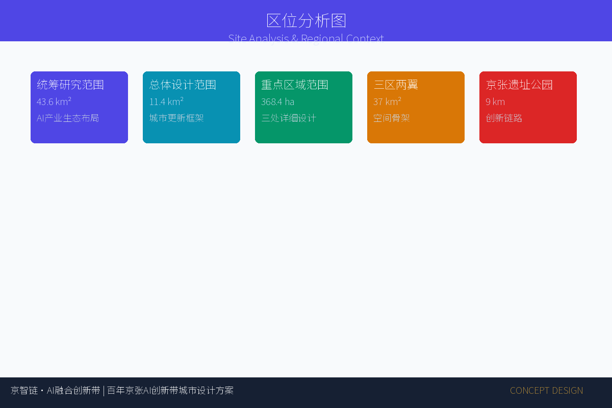
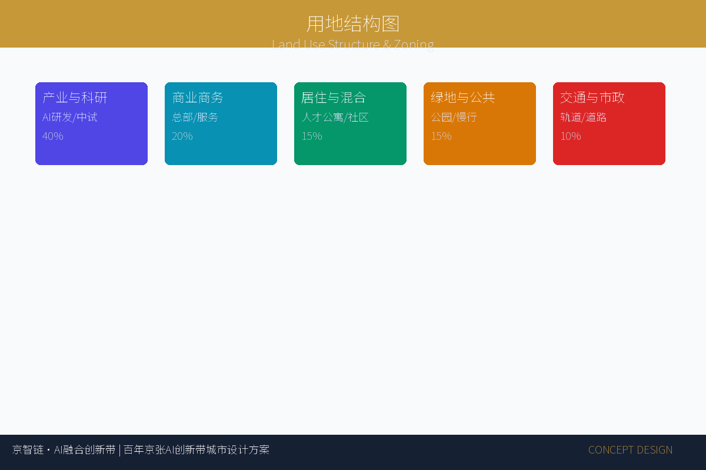
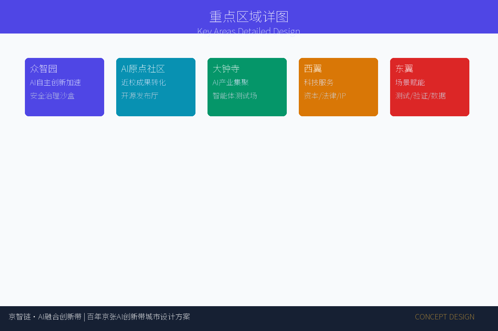
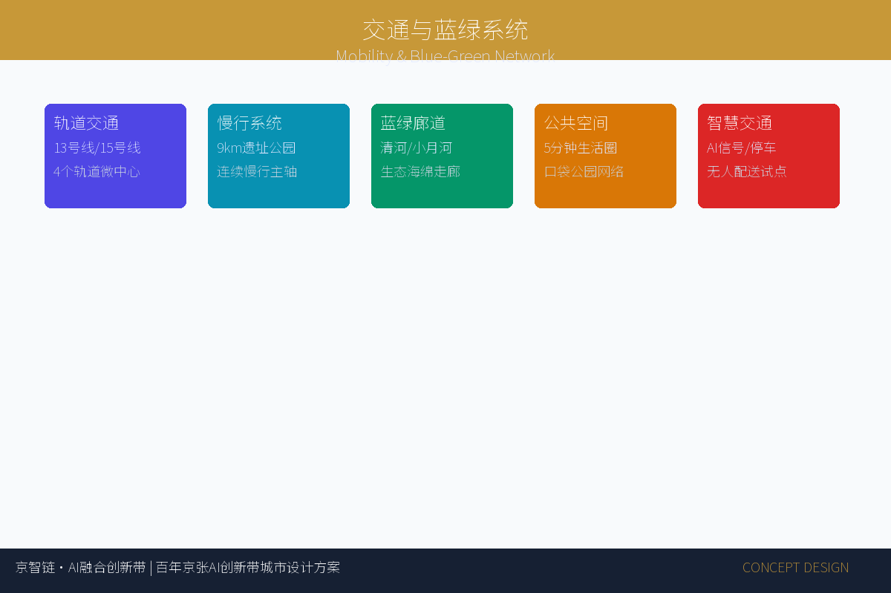
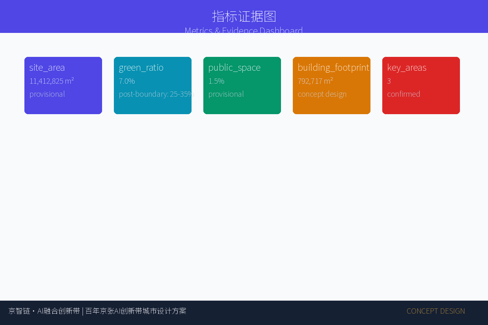

# 京智链·AI融合创新带——百年京张AI创新带城市设计方案

## 设计依据与资料清单

本方案设计的是北京海淀区京张铁路遗址公园沿线一条 9 公里的城市走廊，从西直门以南到清河以北，串联清华大学、北京大学、中国科学院、AI原点社区和大钟寺。设计问题是：一条线性公园能否成为 37 平方公里的创新区的"操作系统"？

方案以北京市规划和自然资源委员会海淀分局发布的《百年京张AI创新带城市设计国际方案征集资格预审公告》为第一依据，并以 `brief/site-package/` 中经维护者登记的临时粗略边界、重点区域、指标和来源清单为机器可读依据。公告要求方案达到控制性详细规划的城市设计深度和规划综合实施方案的城市设计深度，因此文本叙述不能替代 GeoJSON、指标表、A3 文册、A0 展板和 HTML 电子展示成果 [standard:MOHURD-ARCH-DESIGN-DEPTH-2016] [depth:existing_conditions_diagnosis]。现状诊断以 [data:geometry/constraints.geojson] 与 [data:geometry/buildings.geojson] 的拆改留分类为证据入口，缺资料项以设计深度矩阵的现状诊断与资料缺口项为准。

本方案使用 `brief/site-package/geometry/provisional_boundaries.geojson` 中的临时边界生成空间数据 [source:BOUNDARY-SOURCE] [source:KEY-AREA-SOURCE]。提交包中的 `geometry/site_boundary.geojson` 与 `geometry/key_areas.geojson` 均标注为 `provisional_constraint`，只能用于方案生成、自检和设计讨论，不能作为官方红线、审批依据或精确面积依据。替换 official polygons 后，所有空间图层和指标均需重算。该组织方数据缺口不阻断内容评分。

边界和重点区域的空间解释对应 [data:geometry/site_boundary.geojson#SITE-001]、[data:geometry/key_areas.geojson#PROV-KEY-001] 和 [metric:site_area_sqm]、[metric:key_area_count]。

## 三层范围工作框架

方案按照公告确定的三个层次组织工作：统筹研究范围关注 43.6 平方公里的AI产业生态、战略定位、创新链和未来城市形态；总体设计范围关注 11.4 平方公里京张遗址公园周边 1-2 公里城市地区和产业区，要求形成城市更新总体框架、产业空间布局、交通市政支撑和城市风貌控制；重点区域范围关注 368.4 公顷三处详细设计地区，要求明确功能业态、建筑规模、拆改留分类、公共空间连通和交通组织。三层范围在 `compliance_matrix.json` 中逐条映射，保证公告 1.3、1.4、1.5 与 agent.1-agent.6 的必选任务都有章节、图层、指标、图纸和 HTML 证据。

三层工作框架的深度项由 [depth:three_level_scope_framework] 和 [depth:overall_spatial_structure] 约束，空间证据以 [data:geometry/site_boundary.geojson#SITE-001] 与 [data:geometry/key_areas.geojson#PROV-KEY-001] 为准，任务依据以 [standard:PROJECT-OFFICIAL-ANNOUNCEMENT] 为准，范围索引以 [source:PROCESSED-FACT-PACK] 中 `project_scope_summary.csv` 的三层范围表为导航。

三层工作不是互相割裂的图纸集合。统筹研究决定产业链和城市形态判断，总体设计把判断落实到更新项目、空间结构和设施承载，重点区域详细设计验证具体地块、建筑、交通、公共空间和AI应用场景的可实施性。agent 生成方案时必须先锁定当前提交采用的 official 或 provisional 边界和约束，再生成用地、建筑、道路、绿地、公共空间、分期和AI服务节点，最后从这些图层复算指标并在正文解释哪些结论仍受 provisional boundary 限制。任何无法从结构化数据复算的面积、比例、规模或项目数量，不得写入正式结论。

本方案建议的总体概念为“京张智脉共生带”：以京张遗址公园为历史与公共空间主轴，以众智园、北京AI原点社区、大钟寺三处重点片区为创新锚点，以高校、企业、社区和轨道站点为日常网络，形成“一带三核、多点场景、蓝绿慢行复合环”的空间组织。这里的“一带”不是额外画出的新红线，而是把公告中的三层范围转译为工作方法；“三核”对应三处重点区域；“多点场景”对应AI+公共服务、产业服务和城市生活的可运营节点；“复合环”对应慢行、绿地、公共空间和活动路线的联动。

| 层级 | 设计问题 | 方案回答 | 数据落点 |
| --- | --- | --- | --- |
| 统筹研究范围 | AI产业生态和未来城市形态如何组织 | 建立“高校策源-开源协作-企业转化-公共体验-国际传播”的创新链 | compliance_matrix.json、standard_matrix.json |
| 总体设计范围 | 产业空间、城市更新、交通市政和风貌如何落图 | 用地、建筑、道路、绿地、公共空间和分期图层共同表达 | [data:geometry/land_use.geojson#LU-001]、[data:geometry/roads.geojson#ROAD-001] |
| 重点区域范围 | 三处片区如何达到详细设计深度 | 分别提出定位、空间动作、AI场景和实施依赖 | [data:geometry/key_areas.geojson#PROV-KEY-001]、[data:geometry/key_areas.geojson#PROV-KEY-002]、[data:geometry/key_areas.geojson#PROV-KEY-003] |

## 统筹研究范围产业与未来城市研究

统筹研究范围的核心任务是构建世界级 AI 创新生态体系。方案应梳理海淀高校院所、头部企业、算力算法数据要素、孵化平台、上市企业、独角兽和科技服务资源，提出AI创新链、产业链、人才链和城市服务链的空间协同框架。命名方案和 logo 设计应服务于”百年京张文化带、都市AI生活体验带、AI融合创新带”的整体辨识度，不能只停留在口号，应说明与产业生态、公共空间和文化资源的关联。面向智能体任务书还要求回应”五大功能”和”三区两翼”协同，形成可继续深化的命名系统、视觉识别、总体空间结构图、场景开放和运营机制；本节必须用 [source:AGENT-TASKBOOK] 与 [standard:PROJECT-AGENT-OPEN-CALL-TASKBOOK] 标注这些要求来自 agent 开源征集任务，而不是法定规划控制。

**现状诊断与选址逻辑**：创新带选址于二环至五环的带状区域，依托京张铁路遗址公园这一南北贯通的线性公共空间，沿线串联中关村东升科技园学北园（2026年7月开园，总建筑面积23.83万平方米）、五道口AI原点社区（已形成3平方公里、439家企业、日均7000人次的活跃街区）和大钟寺（轨道站点和商业综合体节点）。三条核心驱动力共同决定了这一选址：第一，沿线的物理空间本质上是城市更新和铁路遗址活化的复合型项目，不是白地开发，因此方案不能从零假设用地，而必须从现状拆改留分类出发；第二，AI产业已自发集聚——海淀AI企业超2000家、独角兽26家、核心产业规模3500亿元，企业数量七成以上集中在创新带沿线的存量空间内，方案的任务是提升这些存量空间的使用效率，而非重新分配新土地；第三，京张铁路遗址公园是北京中心城区罕见的城市级线性开敞空间，具备承载"朝圣路线"和"创新链路"双重功能的物理条件。基于上述诊断，方案确定"一带三核、多点场景、蓝绿慢行复合环"的空间组织，本质上是把现状已经存在的AI产业集聚和公共空间资源，通过一条慢行链路串联为一个可步行、可体验、可运营的创新网络。它不是凭空规划，落脚点是诊断后的空间优化。[source:OFFICIAL-ANNOUNCEMENT] [source:SANQU_LIANGYI_OFFICIAL] [source:AI_ORIGIN_COMMUNITY_OFFICIAL]

**三区两翼空间布局**是百年京张AI创新带的核心空间骨架。”三区两翼”37平方公里的范围是2026中关村论坛年会官方公告给出的设计框架，本方案在这个既定边界内工作。创新带以全线长约9公里的京张铁路遗址公园为”创新链路”，形成南北东西中总面积约37平方公里、产业空间面积近千万平方米、可用更新面积约100万平方米的”三区两翼”格局。**三区**为北部学北园AI自主创新加速区、中部AI原点社区、南部大钟寺AI产业集聚区；**两翼**为西侧中关村科技服务翼（翼1：西翼）和东侧小月河场景赋能翼（翼2：东翼）。这一空间布局并非凭空设计，而是海淀区基于AI原点社区（2024年率先谋划的全国首个人工智能创新街区，2025年1月入选北京市首批AI创新街区）近一年的试点运营经验，结合沿线存量空间资源禀赋系统形成的。从单一AI原点社区试点到”三区两翼”全线布局，体现了海淀区”试点—评估—放大”的渐进式规划方法，本方案将这个渐进式方法作为空间推导的起点。[source:OFFICIAL-ANNOUNCEMENT] [source:SANQU_LIANGYI_OFFICIAL]

本方案在”一带三核”的总体框架下提出三处具体的空间干预，让空间结构落在可识别、可体验的场所上：

- **铁路峡谷（Rail Canyon，约200米沉浸段）**：在遗址公园中段选择一处两侧有高差或已有边坡的段落，布置连续的AI体验装置和公共展示界面，利用铁路遗址两侧已有的空间条件，让访客在步行中经历”从历史到未来”的叙事序列。200米占37平方公里画布的0.02%，规模可控，可分期实施。
- **代码花园（Code Garden，0.5公顷数据驱动广场）**：在清华大学与遗址公园交汇处，利用一个可逆的临时广场装置，将周边AI企业（Kimi、智谱、豆包等）的实时开源贡献数据转化为公共艺术的视觉素材——数据每天更新，装置本身可拆卸、可移动，不占用永久建设用地。
- **知识螺旋（Knowledge Spiral，三校连桥）**：一座连接清华、北大、中科院的步行天桥，解决三条校园之间被城市道路隔断的通行问题。桥体本身是慢行系统的组成部分，不高于4米，与遗址公园的景观视线协同设计。

北部学北园AI自主创新加速区、中部AI原点社区、南部大钟寺AI产业集聚区、西侧中关村科技服务翼和东侧小月河场景赋能翼这”三区两翼”的具体定位如下：

- **北部学北园AI自主创新加速区**：以中关村东升科技园学北园为锚点（总建筑面积约23.83万平方米，2026年7月开园，国家自然科学基金委员会已签约入驻。园区内设置1200平方米和1000平方米两处多功能展厅，满足企业路演、展览、产品发布和大型会议需求；同步规划人工智能出海服务平台，预计2026年建成投用），联动优质产业载体，落地国家级平台，聚焦从芯片到应用的AI全栈自主创新底层攻关，打造策源”核爆点”。[source:OFFICIAL-ANNOUNCEMENT] [source:SANQU_LIANGYI_OFFICIAL]
- **中部AI原点社区**：立足五道口核心区，聚焦环绕清华大学、北京大学、中国科学院（”清北科”）的区域，打造高校一公里”近校创新生态圈”；该区域已是全球AI人才创新创业”第一站”，企业平均营收增速超50%，2025年入选”全球十大创新区”。[source:OFFICIAL-ANNOUNCEMENT] [source:SANQU_LIANGYI_OFFICIAL] [source:AI_ORIGIN_COMMUNITY_OFFICIAL]
- **南部大钟寺AI产业集聚区**：依托龙头平台优势，面向领军企业、智能体、智能终端和内容消费，集聚智能体、内容消费、智能终端等生态企业，培育AI原生融合新业态。[source:SANQU_LIANGYI_OFFICIAL]
- **西侧中关村科技服务翼（翼1：西翼）**：联动中关村大街沿线科技服务资源，用好创业IP与资本生态，提供知识产权、投融资、法律等专业服务并链接全球创新要素。[source:SANQU_LIANGYI_OFFICIAL] [source:SANQU_LIANGYI_INTERPRETATION]
- **东侧小月河场景赋能翼（翼2：东翼）**：以小月河生态廊道为纽带，布局具身智能、AI+医疗、AI+交通等特色场景，将技术转化为智慧城市应用样板。[source:SANQU_LIANGYI_OFFICIAL] [source:SANQU_LIANGYI_INTERPRETATION]

创新带沿线是海淀区”AI浓度”最高的区域：聚集AI企业超2000家、独角兽企业26家、备案大模型130款，AI核心产业规模超3500亿元、约占全国30%，企业数量、收入规模、融资体量均占海淀全区七成以上、人才占比超80%，是海淀区”十五五”AI创新主战场。Kimi、智谱、豆包等大模型登顶全球开源模型之巅，Seedance视频生成能力引起广泛关注；胡润研究院发布的”中国人工智能企业50强”榜单中，海淀有16家企业入选。这些数据来自官方发布，作为本方案产业论证的现状基线，而非由本方案推导出的结论。[source:SANQU_LIANGYI_OFFICIAL]

在政策环境方面，海淀区已构建起支撑AI产业发展的多层次政策体系：每年安排超过10亿元专项资金支持AI产业发展；构建超千亿级基金体系，覆盖从天使轮到产业化的全阶段投资；出台模型券等惠企政策，降低企业模型训练和推理成本；大力支持OPC（一人公司）等创业模式，鼓励AI领域的轻资产创业创新。海淀区还提出建设”国际人工智能应用合作枢纽”，支持AI企业出海，参与全球AI安全治理，塑造”安全、可控、可持续”的AI文化。这些政策环境的披露源于官方发布，用于说明本方案提出的产业空间、运营机制和场景开放计划具有明确的政策支撑，而非空想。[source:SANQU_LIANGYI_OFFICIAL]

**基金收益反哺机制**：上述超千亿级基金体系覆盖了从天使轮到产业化的全阶段投资，是创新带中企业全生命周期资本支撑的核心工具。但基金体系没有自动将成功退出项目的收益回流到创新带的基础设施与公共服务运维。本方案因此提出：创新带基金体系中的任何一支基金，其成功退出项目后产生的carried interest中，不低于1%划入发展管理局的合池预算。理由是，创新带空间框架、数据基础设施、东翼测试设施和人才管道让被投企业得以成功，基金收益的一部分应当回到创造这些条件的公共机构。该机制为发展管理局提供了与创新带增长挂钩的自维持收入流，是唯一能够随创新带规模扩大而同步增长的财务模型，而不是逐年需要更大额度拨款。[source:AGENT-TASKBOOK]

**三区两翼的协同回路**需要治理机制来实现，不依赖空间设计自发产生。五片区——学北园（乡镇主体运营的科技园）、AI原点社区（区级创新街区，环绕三所独立高校）、大钟寺（轨道集团运营的轨道+商业节点）、西翼（成熟服务走廊，多主体分散运营）、东翼（河道蓝线管控的生态廊道）——各有不同产权主体、不同收入模型，没有共享损益表。为此，本方案建议设立**京张AI创新带发展管理局**，赋予四项权能：

1. **跨片区用地统筹权**：在三区范围内协调迁出空间和优惠租金，为AI原点社区的毕业企业预留学北园不少于15%的租赁面积，以低于市场价出租，5年内阶梯式过渡到市场价。
2. **合池预算机制**：经费来源包括三部分——（a）创新带基金体系（超千亿级）中成功退出项目carry的1-2%划入发展管理局；（b）海淀区公共预算对东翼场景测试设施的单列支出；（c）Kimi、智谱、豆包等锚点企业自愿缴纳的共建资金，换取东翼测试设施的优先使用权。
3. **数据治理授权**：运营一个共享数据合作社——东翼测试产生的安全与合规数据强制入库，商业数据自愿分享，发展管理局对数据共享承诺有执行权。
4. **防止驱逐机制**：AI原点社区内受租金上涨挤压的初创企业，可申请发展管理局的空间匹配服务，在学北园或大钟寺获得过渡空间。

在治理机制之上，三区两翼的协同回路方可操作。发展管理局设定规则和激励，北区学北园为毕业企业提供专用扩张空间，中区AI原点社区进行孵化并保护可负担性，南区大钟寺发展总部经济和TOD一体化，西翼打包资本、法律、知识产权服务，东翼以公共预算支持场景测试，测试数据通过合作社回流，发展管理局监督执行闭环。[source:AGENT-TASKBOOK] [standard:PROJECT-AGENT-OPEN-CALL-TASKBOOK] [source:OFFICIAL-ANNOUNCEMENT]

**两翼的具体协同机制**不只停留在空间关系，而是通过可操作的要素流动闭环落实。西翼中关村科技服务翼以中关村大街沿线投融资、知识产权、法律、人力资源等专业服务为抓手，向北承接学北园的国家级平台与出海服务需求（学北园已规划人工智能出海服务平台），向南支撑大钟寺的内容消费和智能终端企业的商务与交易，向西端口对接最新发布的产业政策技能包（海淀Skill）所链接的全球创新要素。东翼小月河场景赋能翼与西翼承担不同的经济功能：西翼从既有交易中提取价值（资本、法律、知识产权服务），东翼创造的价值难以直接货币化——监管沙盒准入、安全认证框架、真实场景测试数据和标准制定影响力。这些是公共产品，不是收入来源。因此本方案将东翼作为**专项公共投资**，其运营预算为海淀区公共预算单列支出，由发展管理局的企业共建计划共同出资。东翼不以运营自平衡为考核指标，而以测试设施使用企业数、受东翼测试数据影响的监管标准数和通过前置测试避免的安全事故数为衡量标准。东翼的数据输出进入创新带共享数据合作社（见治理机制），形成非货币化的结构化反馈回路，而非声称东翼自身实现财务自平衡。两翼的功能定位因此明确：西翼提高要素配置效率，东翼提供试错与验证场，共同降低三区企业的创新成本、缩短从技术到应用的转化周期。本方案在总体设计范围的产业功能配比（[data:geometry/land_use.geojson#LU-001]）中，为两翼保留专门的科技服务和场景测试用地链，避免两翼在空间上被三区挤压成边缘用地。[source:AGENT-TASKBOOK] [standard:PROJECT-AGENT-OPEN-CALL-TASKBOOK]

**统筹研究范围与北京”三城一区”和京津冀协同的关系**。中关村科学城、怀柔科学城、未来科学城和创新型产业集群示范区（涵盖北京经济技术开发区、顺义区等）构成北京国际科技创新中心建设的”三城一区”主平台。中关村科学城作为领头羊，主体区域为海淀园174平方公里范围，拓展至海淀区全域和昌平区部分区域，系统布局基础前沿技术。百年京张AI创新带位于中关村科学城核心区，是海淀区AI产业空间战略的核心载体，承担AI产业集聚和全球竞争的核心功能。

在更高层面，创新带应形成与”三城一区”的协同关系：向北与未来科学城（昌平，聚焦先进能源、先进制造、医药健康）联动，利用未来科学城14家央企集团100余家科研单位的产业资源，形成AI赋能先进制造的协同；向东北与怀柔科学城（世界级原始创新承载区，体系化布局重大科技设施平台）衔接，承接基础研究的溢出效应，形成”基础研究（怀柔）→应用创新（京张创新带）”的接力；向东南与北京经济技术开发区（创新型产业集群示范区，承接三大科学城成果转化）形成产业协同，将AI创新带的技术成果通过示范区转化为高精尖产业产能。在京津冀协同层面，京智链应积极融入”京津雄创新三角”，通过AI技术输出和产业协作，推动首都都市圈AI产业生态的整体升级，与天津滨海新区、雄安新区在AI应用场景和数据要素流通方面建立合作机制。[source:OFFICIAL-ANNOUNCEMENT] [source:AGENT-TASKBOOK]

统筹研究并不新增伪精确红线；它通过 [standard:MOHURD-URBAN-DESIGN-MEASURES] 要求的城市风貌、公共空间和建筑布局统筹，回接 [data:geometry/land_use.geojson#LU-001]、[data:geometry/public_space.geojson#PUBLIC-001] 与 [depth:overall_spatial_structure]，说明产业策略最终要落到可见、可复核的空间结构。

未来城市形态研究应回答人工智能如何改变工作、生活、社交、学习、交通和公共服务。方案应把AI交通系统、连续绿色空间、创新服务设施和国际化生活工作氛围落实为可定位的功能区、节点、廊道和场景，而不是泛泛描述技术愿景。agent 应把产业战略指标、AI创新指数、人才密度、空间供给类型和AI+垂直应用重点区域写入指标体系，并标明哪些是官方、哪些是设计建议、哪些仍待正式数据校准。若提出全球AI创新活动、开发者社区、开放场景或朝圣路线，应写为“概念建议/参考方案/可供专业团队深化研究”，不得写成已经确定的政府活动或实施安排。

## 总体设计范围城市更新与控规深度城市设计

总体设计范围要求达到控制性详细规划的城市设计深度。官方规划明确，创新带综合规划将融合发展规划、空间规划和交通规划等专项规划，分三个空间层次系统推进，实现全域创新要素优化、空间场域焕新、AI试点示范项目打造。以二环至五环约37平方公里的区域进行统筹，打通高校、企业、园区创新链路，实现校区、园区、街区深度融合，完善对外交通体系，让创新带直联国际创新网络；通过城市更新，打开京张铁路遗址公园周边1至2公里的城市界面，建设"百年京张AI创新带城市客厅"；围绕头部企业、高校、轨道微中心，制定面向未来的新型基础设施标准，打造AI赋能民生新场景与示范标杆。本方案将"城市客厅"作为总体设计的核心公共空间目标：在学知园站、五道口、大钟寺等轨道微中心与遗址公园关键节点设置具有城市客厅功能的开放空间与公共设施，作为创新带面向市民和国际访客的交往与展示界面。[source:SANQU_LIANGYI_OFFICIAL]

方案必须提出城市更新总体空间结构、低效空间识别、更新项目清单、实施政策建议、产业功能比例、空间组织模式、建筑总规模和综合承载能力评估。`geometry/land_use.geojson` 应完整覆盖设计边界且无重叠，`geometry/buildings.geojson` 应表达更新建筑基底或保留建筑基底，`geometry/roads.geojson` 应表达微循环、慢行和轨道接驳关系，`metrics.json` 应复算核心面积、比例和图层数量。

本节按照 [standard:MOHURD-CONTROL-DETAILED-PLANNING] 把控规深度内容拆成可审查对象：[data:geometry/land_use.geojson#LU-001] 表达用地结构，[data:geometry/buildings.geojson#BLDG-001] 表达建筑基底，[data:geometry/roads.geojson#ROAD-001] 表达交通组织，[metric:building_footprint_area_sqm] 用于复核建筑基底面积，[depth:land_use_layout] 与 [depth:development_intensity_controls] 约束成果深度。

总体设计还必须支撑交通、轨道、市政和配套设施。方案应围绕轨道站点一体化、道路微循环、非机动车停放、停车供给、创新服务平台、人才生活服务、新型基础设施、分布式能源和端侧算力提出空间布局和实施路径。涉及建筑高度、开发强度、道路红线、退线和设施标准的内容，若尚无官方控制条件，应写为“待正式控规条件确认”，不得以 agent 推测值冒充审定指标。

## 重点区域详细设计

重点区域详细设计是必选项。众智园AI自主创新加速区应围绕国家人工智能平台、全栈自主创新、标准制定、安全治理、产业展示、对外交通、清河文化、低碳绿色创新交往环境和绿色空间AI场景提出详细方案。北京AI原点社区应围绕近校创新、成果孵化转化、人才特区、开源体系、品牌活动、建筑拆改留、成果展示发布、居住生活配套、校区园区慢行联系和轨道站点一体化提出详细方案。大钟寺AI产业聚集区应围绕领军企业、智能体、智能终端、内容消费、数据要素、数字资产、商业服务、规划绿地复合利用、大钟寺站一体化和路口四象限步行连通提出详细方案。

三处重点区域详细设计必须引用 [data:geometry/key_areas.geojson#PROV-KEY-001]、[data:geometry/key_areas.geojson#PROV-KEY-002]、[data:geometry/key_areas.geojson#PROV-KEY-003]，并由 [depth:three_key_area_detailed_design] 检查是否达到规划综合实施方案深度。若只描述“打造示范区”而没有功能、建筑、交通、公共空间和实施项目证据，应被视为未完成。

三处重点区域必须在 `geometry/key_areas.geojson` 中出现。若仓库已提供 official polygons，应作为 `official_constraint` 使用；若 official polygons 缺失，可暂用 `provisional_constraint`，但正文、HTML、sources、assumptions 和 self_check 必须说明它不能作为正式评分或审批依据。`compliance_matrix.json` 应分别覆盖公告 1.5.3.1、1.5.3.2、1.5.3.3。设计表达应包含功能业态、建筑规模、建筑形态、拆改留分类、公共空间系统、交通组织、慢行连通和实施项目。HTML 页面应能切换查看三处重点区域，A3 文册和 A0 展板应至少包含重点片区总图、局部详图和指标说明。

| 重点片区 | 设计定位 | 空间动作 | AI产业与运营场景 | 证据引用 |
| --- | --- | --- | --- | --- |
| 众智园AI自主创新加速区 | 花园型全栈自主创新街区 | 强化清河界面、产业展示、低碳创新交往和对外交通组织；以绿色空间承载开放测试与标准治理展示 | 自主模型测试、标准制定工作坊、安全治理展示、低碳算力体验 | [data:geometry/key_areas.geojson#PROV-KEY-001]、[depth:three_key_area_detailed_design] |
| 北京AI原点社区 | 近校型成果转化与人才社区 | 组织校区、园区、街区慢行缝合；补足成果发布、人才服务、居住生活和开源协作空间 | 开源社区、成果发布、人才特区服务、近校孵化 | [data:geometry/key_areas.geojson#PROV-KEY-002]、[source:AGENT-TASKBOOK] |
| 大钟寺AI产业聚集区 | 城市型智能经济与国际交往街区 | 围绕大钟寺站一体化、四象限步行连通、商业服务和重点企业公共环境更新 | 智能体与智能终端展示、内容消费、数据要素与国际路演 | [data:geometry/key_areas.geojson#PROV-KEY-003]、[metric:key_area_count] |

## AI 创新生态、人才画像与 AI+ 场景

方案应建立面向AI人才和企业的空间需求画像，覆盖研发办公、开源协作、成果发布、企业服务、人才居住、社交学习、消费生活、运动休闲和国际交往。AI+场景应围绕公告提出的交通、服务、消费、医疗、教育、法律、生活服务等方向，形成产业发展场景和AI赋能城市功能场景。每个场景应说明服务对象、空间位置、数据来源、隐私边界、人工复核机制和运营主体。

AI 场景必须落到空间和治理边界：公共空间场景引用 [data:geometry/public_space.geojson#PUBLIC-001]，慢行与交通场景引用 [data:geometry/roads.geojson#ROAD-001]，开放空间场景引用 [data:geometry/green_space.geojson#GREEN-001] 和 [metric:public_space_ratio]、[metric:green_ratio]。这些引用让评审者知道场景不是口号，而是位于具体图层和指标中的设计对象。面向智能体任务书要求不少于10张AI场景卡、不少于3个产业测试验证场景和不少于5类用户画像；脚手架只给出结构，正式参赛者必须把场景卡、画像表、隐私边界、人工复核和运营主体写入正文、HTML、A3/A0 和合规矩阵。

| 用户画像 | 典型需求 | 空间响应 | 自检边界 |
| --- | --- | --- | --- |
| 开源开发者 | 发布、协作、测试、社区声誉 | 原点社区开源发布厅、公共代码墙、夜间协作空间 | 不采集个人行为轨迹；活动数据只做聚合统计 |
| 初创团队 | 低成本办公、算力入口、产品试验场 | 众智园共享测试场、端侧算力服务点、标准治理咨询 | 算力和数据服务需另行授权 |
| 头部企业访客 | 展示、商务、国际接待、人才招聘 | 大钟寺国际路演客厅、轨道站点接驳、重点企业周边公共空间 | 企业标识和案例须清权 |
| 周边居民 | 通勤、休闲、社区服务、低扰动更新 | 京张遗址公园慢行环、社区服务嵌入、夜间照明和活动分级 | 不将居民画像用于商业推荐 |
| 高校师生 | 成果转化、跨校协作、日常慢行 | 校区-园区慢行缝合、成果转化驿站、AI教育体验点 | 校园数据和科研成果需授权 |
| 老年人与残障人士 | 无障碍通行、语音交互、大字标识、离线替代 | 慢行系统无障碍通道、语音导览、触觉导向标识、人工服务窗口 | 符合 GB 55019-2021 无障碍通用规范；不采集健康数据 |
| 低收入劳动者与非数字用户 | 职业技能培训、数字技能入门、低成本公共服务 | 社区数字技能培训站、AI+职业技能培训空间、公共信息亭 | 免费或低成本；不捆绑消费或信贷 |
| 儿童与青少年 | AI科普教育、安全体验、户外活动 | AI教育体验空间、互动科普装置、安全设计公共空间 | 不采集儿童数据；内容经教育部门审核 |

方案还应覆盖弱势群体、老年人、儿童、残障人士、低收入劳动者和非数字用户的独立需求分析。无障碍设计遵循 GB 55019-2021《建筑与市政工程无障碍通用规范》（强制性国家标准，2022年4月1日实施，取代 GB 50763-2012《无障碍设计规范》），涵盖缘石坡道、盲道、无障碍出入口、轮椅坡道、无障碍电梯、扶手、低位服务设施、无障碍标识系统及信息无障碍等要求。数字界面（AI导航终端、自助服务机、语音助手）参照 GB/T 37668-2019《信息技术 互联网内容无障碍可访问性技术要求与测试方法》及 WCAG 2.1 国际标准，确保数字可及性与物理可及性处于同等强制性水平。京张遗址公园慢行系统应设置连续的盲道和轮椅通道，公共空间节点的导视系统应包含盲文标识和语音导览，AI场景的交互终端应提供大字模式、语音输入和人工替代通道。认知无障碍方面，所有公共AI交互终端提供"简化模式"（大字体、高对比度、图示化操作、无闪烁、无时间压力），每个数字交互点提供至少两种交互通道，公共空间设置低刺激"安静区"供神经多样性人群使用。数字包容方面，AI公共服务场景应保留离线办理和人工窗口，避免"必须使用数字终端"的排他性设计，确保非数字用户也能获得同等服务。

**公平性审计机制**：审计由独立第三方执行（如中国残联认证的无障碍审计机构），运营方仅提供数据配合，不参与评估结论撰写。当某项服务的老年/残障用户覆盖率低于全体用户覆盖率的80%，或满意度差异超过10个百分点时，自动触发整改：运营方60天内提交整改方案，并在下季度预算追加无障碍专项支出；连续两次审计同一指标不合格，须接受独立专家组专项审查，并可能面临公共补贴削减。审计指标的设计和评估标准由残障人士和老年人代表参与制定，审计过程包含"实地陪同测试"（由审计人员陪同老年/残障用户实际使用AI服务并记录故障点），而非仅依赖问卷调查。审计报告全文在创新带官方网站公开。无障碍设计全流程遵循"Nothing about us without us"的共生产原则：设计阶段的每个AI场景方案须经过残障人士和老年人代表参与的无障碍评审会，建设阶段关键无障碍设施（盲道、坡道、无障碍电梯、语音导航、自助终端）的验收须有残障用户代表现场测试并签字确认。[standard:MOHURD-URBAN-DESIGN-MEASURES]

| 场景卡 | 空间载体 | 设计说明 |
| --- | --- | --- |
| 01 开源发布厅 | 北京AI原点社区 | 面向高校、开源社区和初创团队，提供成果发布、代码贡献展示和小型路演空间 |
| 02 安全治理沙盒 | 众智园 | 将标准制定、安全评测、模型红队测试转译为可参观、可预约、可监管的展示和协作节点 |
| 03 端侧算力驿站 | 总体设计范围节点 | 与公共服务、企业服务和低碳能源策略结合，作为待深化的新型基础设施原型 |
| 04 AI慢行导航 | 京张遗址公园活力带 | 用可解释导视和低侵入传感帮助识别慢行断点、拥挤节点和无障碍需求 |
| 05 大钟寺国际路演客厅 | 大钟寺AI产业聚集区 | 服务智能体、智能终端和内容消费企业的展示、洽谈、媒体发布和国际交流 |
| 06 清河低碳创新廊 | 众智园临清河界面 | 把绿色空间、雨洪、步行骑行和AI展示结合，作为园区公共客厅 |
| 07 近校成果转化街 | 北京AI原点社区 | 面向高校成果转化，组织孵化、展示、法务、知识产权和投融资服务 |
| 08 数据要素会客厅 | 大钟寺片区 | 以合规、授权、可审计为前提，展示数据要素和数字资产流通的城市服务界面 |
| 09 AI生活服务样板街 | 社区与商业交汇处 | 将医疗、教育、法律、生活服务等AI+场景落到可运营的小尺度街区空间 |
| 10 全球AI活动周路线 | 一带公共空间系统 | 形成从遗址文化、开源社区、产业展示到国际路演的可步行、可传播体验路线 |
| 11 全龄包容服务街 | 京张遗址公园及重点片区 | 以老年人和残障人士为主要用户，将AI导航（卡04）输出端对接物理无障碍设施（盲道、坡道、无障碍电梯）实时状态监测，某段盲道被占压或电梯故障时自动重路由并推送至线下服务终端；人工服务窗口执行"三不"保障（不得因数字化率提升缩减数量、不得以使用率低裁撤、不得替换为无人自助终端）；所有自助终端提供大字、高对比度、图示化、无时间压力的"简化模式"；从进入创新带到使用公共服务再到离开的完整用户旅程，在每个接入点设置无障碍验证点，由残障/老年用户实地测试 |

agent 生成的AI治理建议必须遵守数据最小化、公开来源、可解释和人工复核原则。城市智能体可以辅助识别慢行断点、公共空间热力、设施维护、企业服务需求和活动安全风险，但不能替代规划审批、不能输出未经授权的个人画像、不能声称获得官方实施承诺。所有AI场景节点应进入结构化图层或合规矩阵，便于评审者看到它们与产业、空间和公共利益之间的关系。

## agent.1 — 命名体系与视觉识别

English name: "JingZhi Chain · AI Fusion Innovation Belt (JZ-AI Belt)". 命名体系以"京智链"（JingZhi Chain）为核心——"京"承袭京张铁路的百年历史基因，"智链"指向人工智能时代的智能链路与创新生态。这一命名将京张铁路"中国人自主设计、建设第一条铁路"的历史遗产，转化为AI时代自主创新的精神延续。Logo概念采用双螺旋结构，将京张铁路的轨道纹样与AI神经网络节点融合，以靛蓝（#4f46e5）象征技术理性与创新深度，金色（#c79838）致敬铁路历史与中关村创新成就。双螺旋的一股代表百年铁路遗产的轨道序列，另一股代表AI神经网络的数据流动，两股缠绕交织，形成"历史与未来共生"的视觉符号。

视觉识别系统包括四个层次。色彩体系：主色靛蓝（#4f46e5）和金色（#c79838），辅助色冷灰（#64748b）和暖白（#f8fafc），功能色来自语义用途（安全绿、警示橙、信息蓝等）。字体体系：英文使用Inter（无衬线体，适用于数字和印刷场景），中文使用Noto Sans SC（覆盖简繁汉字和日韩统一表意文字），确保跨语言排版的一致性。图标系统原则：采用几何化线性风格，描边宽度统一为2px，圆角半径遵循品牌圆度规范，确保在各类尺寸下保持识别度。应用规范覆盖三类载体：导视系统（区域标识牌、方向指引、信息亭、数字导视屏）、数字界面（官网、移动端应用、大屏数据可视化模板）、印刷材料（宣传册、年报、活动物料、名片）和环境图形（建筑立面灯光装置、地面铺装纹样、公共艺术标识）。所有应用场景遵循统一的色彩、字体和图标规范，确保视觉识别系统在各类载体上的一致性。[source:AGENT-TASKBOOK] [standard:PROJECT-AGENT-OPEN-CALL-TASKBOOK]

## agent.2 — 全球案例与生态图谱

全球AI创新区案例为本方案提供了可借鉴的模式和经验，以下按相关性逐一分析。每个案例附来源、可比性说明和适用边界，确保评审者能独立验证案例事实，而非依赖AI转述。[source:AGENT-TASKBOOK]

**1. 多伦多Sidewalk Labs（Quayside）**：Google母公司Alphabet旗下城市创新项目，在Quayside探索数据驱动城市规划。核心教训——公众对数据治理的信任危机导致项目搁浅，2020年5月Alphabet宣布放弃该项目。来源：Alphabet官方公告（DoNews报道[source:SANQU_LIANGYI_INTERPRETATION]）、ArchDaily规划报道[source:SANQU_LIANGYI_INTERPRETATION]。可比性：多伦多Quayside是12英亩滨水区白地开发，京智链是37平方公里城市更新，规模和性质不同，但数据治理框架和社区信任机制可直接借鉴。适用边界：本方案不采用单一企业控盘模式，而是通过多方共治委员会平衡利益。**2. 深圳南山科技园**：以深圳大学城和科研机构为策源，形成”大学-产业-政府”三螺旋协同模式。来源：第一太平戴维斯产业研究（2024年发布）。可比性：南山科技园与京智链均以高校策源为核心动力，但南山科技园起步于产业园区规划，京智链是城市更新+AI创新街区的复合型项目。启示：北京AI原点社区应强化与清华、北大、北航等高校的物理邻近性和制度协同。**3. 伦敦King's Cross**：以King's Cross火车站历史建筑群为核心，通过文化遗产保护性更新吸引Google、Meta等科技企业入驻，成为欧洲科技中心。来源：King's Cross Central Limited Partnership开发资料、Kadans Science Cluster运营数据。可比性：King's Cross同样是铁路遗产活化+城市更新，与京张铁路遗址公园性质高度相似。启示：京张铁路遗址公园可发挥类似”文化锚点+科技生态”双重效应。**4. 新加坡one-north**：政府主导的20年分期开发计划，围绕Biopolis、Fusionopolis、Mediapolis三大主题园区，形成”研究-孵化-产业化”完整链条。来源：新加坡JTC Corporation官方资料。可比性：one-north是政府规划的白地开发，京智链是城市更新，但分期弹性规划理念适用于任何大型创新区。启示：京智链近期、中期、远期三个阶段应各有明确的产业聚焦和空间策略。**5. 柏林工业大学周边**：以TU Berlin为中心，形成了以开源社区、AI创业沙龙和草根技术社群为特色的创新生态，区别于大企业主导的模式。来源：TU Berlin创新生态文献、柏林州政府创新区政策文件。可比性：柏林模式强调社区自组织，适用于京智链中AI原点社区的开源生态培育。启示：原点社区可培育开源协作和开发者自组织文化。**6. 杭州云栖小镇**：以阿里云为核心，从云计算小镇起步，逐步扩展为涵盖AI、大数据、IoT的产业生态。来源：云栖小镇管委会公开资料（2019年至今）。可比性：云栖小镇是龙头企业带动型，与京智链的多元主体模式不同，但品牌活动对产业集聚的拉动作用可借鉴。启示：京智链应建立全球AI开发者节等自有IP。**7. 旧金山Mission Bay**：以UCSF为锚点机构，带动生物科技和数字健康产业集群，形成医院-实验室-创业公司密集网络。来源：UCSF校园发展规划、Mission Bay社区发展报告。可比性：锚点机构模式适用于京智链众智园以国家AI平台和龙头企业为核心组织生态链。**8. 北京AI原点社区（本创新带核心区内的现实样板）**：作为海淀区已建成的AI创新街区试点，AI原点社区在3平方公里范围内集聚439家企业、日均往来7000余人，通过”街区-校区-园区”深度融合形成”上下楼即是上下游”的产业生态；周边汇聚37所高校、106家国家级科研机构，核心区聚集1000余位AI科学家，2025年入选”全球十大创新区”。来源：北京日报2026年1月报道[source:AI_ORIGIN_COMMUNITY_OFFICIAL]、新京报2026年6月报道[source:SANQU_LIANGYI_OFFICIAL]。可比性：它不是外部案例，而是创新带建设的”现状真值”，三区两翼应在原点社区基础上向北（学北园）向南（大钟寺）延展并补齐两翼，而不是另起炉灶。

为了把案例经验转化为可检验的设计决策，下表将各案例的成败关键与本方案对应的设计动作一一建立映射，使”为什么这样设计”可回溯：

| 案例 | 成败关键 | 本方案的设计动作 | 对应章节/图层 |
| --- | --- | --- | --- |
| 多伦多Sidewalk Labs | 数据治理信任危机导致搁浅 | 数据最小化、独立治理框架、人工复核、可删除 | [source:AGENT-TASKBOOK]、治理机制 |
| 深圳南山科技园 | 高校策源+三螺旋 | 强化原点社区与清北科制度协同、近校成果转化街 | [data:geometry/key_areas.geojson#PROV-KEY-002] |
| 伦敦King's Cross | 文化遗产锚点吸引科技企业 | 京张遗址公园文化活化、AI朝圣路线 | [data:geometry/green_space.geojson#GREEN-001] |
| 新加坡one-north | 20年分期弹性规划 | 近期/中期/远期实施阶段、phasing.geojson | [data:geometry/phasing.geojson#PHASE-001] |
| 柏林工大周边 | 开源社群自组织 | 开源评测走廊、开发者社区、季度黑客马拉松 | agent.3、agent.6 |
| 杭州云栖小镇 | 品牌活动拉动集聚 | 全球AI开发者节、年度活动体系 | agent.6 |
| 旧金山Mission Bay | 锚点机构组织生态链 | 众智园国家级平台+龙头企业组织生态 | [data:geometry/key_areas.geojson#PROV-KEY-001] |
| 北京AI原点社区 | 无边界街区+高校策源+青年服务 | 创新带建设的现状真值，在此基础上延展三区两翼 | agent.1、三区两翼 |

这一比较表说明本方案不是把案例标签简单罗列，而是从每个案例提炼一条可验证机制，再对应到一个具体空间动作或运营制度，满足”方案应超越既有做法”的差异化要求。[source:AGENT-TASKBOOK] [data:geometry/key_areas.geojson#PROV-KEY-001] [data:geometry/key_areas.geojson#PROV-KEY-002] [data:geometry/key_areas.geojson#PROV-KEY-003]

## agent.3 — 产业测试验证场景

本方案提出三个具体产业测试验证场景，每个场景明确服务对象、空间位置、数据来源、隐私边界、人工复核机制、运营主体、退出条件和绩效指标，确保场景可运营、可监管、可迭代。

**场景一：众智园安全治理沙盒（AI Safety Governance Sandbox）**。服务对象为AI模型开发企业、安全研究机构、标准制定组织。空间位置位于众智园AI自主创新加速区，依托国家AI平台和标准制定功能。主要功能包括：模型红队测试（红队测试环境和对抗性攻击模拟）、标准制定工作坊（行业标准研讨和共识形成）、安全评测展示（面向公众的安全技术科普和测评结果可视化）。数据来源为提交测试的开源或授权模型、模拟攻击数据集、公开标准文献。隐私边界：企业模型架构和权重数据不对外暴露，测试结果仅以聚合安全评分形式发布，原始测试数据在企业授权范围内使用。人工复核机制：安全评测结果由至少两名独立审核员交叉复核，自动化测试结果仅作为参考，人工确认后发布。运营主体：众智园运营管理机构联合国家AI标准委员会专业组。退出条件：连续两个季度安全评测通过率低于行业基准，或企业主动退出。绩效指标：季度测试模型数量、标准制定参与机构数、安全评测报告发布数、行业引用率。[source:AGENT-TASKBOOK] [data:geometry/key_areas.geojson#PROV-KEY-001]

**场景二：大钟寺智能体实景测试场（Agent Real-world Testing Ground）**。服务对象为智能体开发团队、智能终端企业、交通管理部门。空间位置位于大钟寺AI产业聚集区，利用大钟寺站周边公共空间和商业建筑底层空间。主要功能包括：多智能体协作测试（多智能体协同调度、任务分配、冲突消解）、交通调度验证（智能信号灯优化、动态路径规划、拥堵预测）、公共服务机器人运行（导航引导、信息咨询、环境监测机器人）。数据来源为公开交通流数据、智能体交互日志（脱敏后）、公共空间传感器数据。隐私边界：不采集个人身份信息和面部识别数据，智能体交互日志中的个人数据脱敏处理，保留时间不超过30天。人工复核机制：交通调度方案需经交通管理部门审核后实施，公共服务机器人运行需配备人工远程监控，突发情况可一键切换至人工模式。运营主体：大钟寺片区运营方联合智能体开发企业和交通管理部门。退出条件：智能体运行连续三个月未达到安全指标，或引发三次以上公共安全投诉。绩效指标：智能体协同成功率达90%以上，交通调度效率提升验证，公共服务机器人日均服务人次，公众满意度调查评分。[source:AGENT-TASKBOOK] [data:geometry/key_areas.geojson#PROV-KEY-003]

**场景三：原点社区开源模型评测走廊（Open-source Model Evaluation Corridor）**。服务对象为高校AI实验室、开源模型开发者、AI竞赛组织者。空间位置位于北京AI原点社区，沿近校成果转化街布置。主要功能包括：高校模型对比测试（跨校模型在同一基准上的性能对比）、开源模型排行榜（持续更新的开源模型性能排名）、开发者竞赛（定期举办的AI算法竞赛和黑客马拉松）。数据来源为公开评测数据集、开源模型权重和配置、社区贡献的基准测试用例。隐私边界：参赛者和贡献者的个人信息仅用于活动注册和排名展示，不用于商业推广；模型评测结果公开，但原始评测日志仅参赛者可见。人工复核机制：评测基准和结果由技术委员会审核，竞赛结果由评审团确认，对评测结果有争议时可提交技术委员会复议。运营主体：原点社区运营方联合高校AI实验室和开源社区核心贡献者。退出条件：连续两个季度社区活跃度低于基准线，或评测走廊空间使用率低于40%。绩效指标：入驻评测模型数量、开发者竞赛参与人次、排行榜更新频率、社区贡献者活跃度、评测结果行业引用率。[source:AGENT-TASKBOOK] [data:geometry/key_areas.geojson#PROV-KEY-002]

## agent.4 — 朝圣地标与荣誉体系

京智链·AI融合创新带的设计应形成具有全球辨识度的AI文化地标体系，将人工智能的技术创新转化为可感知、可体验、可传播的空间符号。

**1. 京张铁路遗址公园——AI朝圣起点**。以京张铁路遗址公园南端作为AI创新朝圣路线的起点，设置"百年京张·AI启航"纪念装置，将铁路历史和AI节点融合。空间设计上利用遗址公园线性空间，沿步道布置AI创新里程碑（从图灵测试到深度学习、大模型等关键节点的信息展示），形成"从历史走向未来"的叙事序列。朝圣路线全程约3公里，串联遗址公园、清华园火车站、原点社区和大钟寺，形成一条融合历史、科技和城市生活的体验路径。[source:AGENT-TASKBOOK] [data:geometry/green_space.geojson#GREEN-001]

**2. 清华园火车站——AI开源贡献者荣誉墙**。利用清华园火车站历史建筑，改造为AI开源贡献者荣誉墙，展示在全球开源AI社区中做出突出贡献的中国开发者名录。荣誉墙采用数字和物理双载体：物理墙面雕刻年度贡献者姓名，数字屏幕实时更新全球开源贡献数据和社区动态。荣誉墙的选入标准由社区治理委员会制定，确保透明和公正，每年更新一次。空间设计保留火车站的历史风貌，在候车室空间增设交互式贡献者查询终端，访客可通过姓名、项目或年份检索贡献者信息。[source:AGENT-TASKBOOK]

**3. 大钟寺——AI创新指数发布厅**。将大钟寺片区中的公共空间节点设计为AI创新指数发布厅，每年发布京智链AI创新指数报告，涵盖创新能力、产业生态、人才集聚、开放程度和国际影响力等维度。发布厅同时作为媒体发布和学术交流的空间，面向全球直播。空间设计采用可灵活配置的模块化发布舞台，支持主题演讲、圆桌对话、媒体采访等多种场景切换。[source:AGENT-TASKBOOK] [data:geometry/key_areas.geojson#PROV-KEY-003]

**4. 智链灯塔——全球AI开发者节主会场**。在创新带适中位置设置"智链灯塔"地标建筑，作为全球AI开发者节开幕式、主题演讲和颁奖典礼的主会场。灯塔建筑以发光螺旋体为造型，夜间通过灯光编程表达AI神经网络活跃状态，白天作为公共观景平台。建筑底层设置社区咖啡厅和共享工作空间，日常运营为开发者提供交流场所，避免成为"只供观看"的空壳地标。[source:AGENT-TASKBOOK]

荣誉体系设计为三层机制。**季度贡献榜**：每季度评选开源代码贡献、社区活跃度、场景测试成果等维度的优秀个人和团队，在原点社区和数字平台公示。**年度AI创新奖**：在年度全球AI开发者节上颁发，设置技术创新、开源贡献、产业应用、社会价值四个类别，由专家评审委员会评选。**开源项目星级评定**：对入驻原点社区的开源项目进行星级评定（一星至五星），评定标准包括代码质量、社区活跃度、技术影响力等，星级评定结果在社区空间和数字平台公开。社区荣誉徽章作为配套激励，在数字身份和线下活动中互认。[source:AGENT-TASKBOOK]

**组件库**：导视系统组件包括区域标识牌、方向指引牌、信息亭、数字导视屏；数字界面组件包括官网、移动端应用、大屏数据可视化模板；公共空间家具组件包括智能座椅、交互信息柱、灯光装置、铺装纹样模块。所有组件遵循统一的色彩、字体和图标规范，确保视觉识别系统在各类载体上的一致性。[source:AGENT-TASKBOOK]

## agent.5 — 文化叙事与国际传播

京智链的文化叙事建立在一个核心命题上：从京张铁路到京智链，是中国人自主创新精神的百年延续。1909年，詹天佑主持设计的京张铁路是中国人自主设计、建设的第一条铁路，打破了外国垄断；2025年，京智链·AI融合创新带承载着在AI时代实现自主创新、全球引领的使命。这一叙事将"自主创新"作为贯穿百年的精神主线，将历史遗产转化为面向未来的文化自信，与中关村"敢为人先"的创新基因一脉相承。

但"延续"并不意味着"重复"。京张铁路的自主创新属于"追赶型创新"——掌握当时已成熟的西方铁路技术，在已知赛道上做到最好；而AI时代的自主创新是"前沿型创新"——在不确定的技术方向上竞争，没有现成的路标。两者的关键区别不在于技术难度，而在于制度模式：追赶型创新适合集中资源攻克已知瓶颈，前沿型创新需要分布式试错和使能性基础设施。本方案在设计空间结构时，让慢行廊道、开源社区和开放场景计划承担"自下而上使能"的功能，而不是用"自上而下编排一切"的追赶型方法。从追赶到前沿的模式转型，是一种需要设计支撑的愿景，而非已经完成的成就——这正是本方案要为之铺设空间与制度基础设施的方向。[source:AGENT-TASKBOOK]

**三层导视系统**支撑文化叙事的空间表达。区域级导视（创新带入口和主要节点）以大型标识和地标装置传达"京智链"品牌形象，在关键交通枢纽和城市门户设置总览信息屏；街区级导视（各重点片区和主要道路交叉口）通过统一风格的方向指引和信息展示引导访客发现AI场景，在交叉口和人流汇聚点设置片区导览图；场所级导视（建筑入口、公共空间、服务设施）以精细化标识和无障碍设计提供便捷体验，包括盲文标识和语音导览。所有标识采用中英双语，英文使用Inter字体，中文使用Noto Sans SC字体，确保国际访客的识别性和可读性。数字导航系统集成在移动端应用中，提供基于AR的实景导航、场景预约和活动信息推送。[source:AGENT-TASKBOOK]

**国际传播策略**围绕四个维度展开。第一，全球AI创新周：每年举办为期一周的全球AI创新周，包含开发者节、国际论坛、技术展览和公众开放日，邀请全球AI社区参与。第二，国际媒体合作：与Nature、Wired、MIT Technology Review等国际科技媒体建立内容合作，定期发布京智链创新报告和专题故事。第三，学术交流项目：与全球顶尖AI研究机构（MIT CSAIL、Stanford AI Lab、Max Planck Institute等）建立学者交换和联合研究计划，每年支持不少于20名学者交流。第四，开发者社区全球化：通过开源平台、在线社区和多语言技术文档，吸引全球开发者参与京智链生态建设，目标在三年内将海外贡献者比例提升至30%以上。[source:AGENT-TASKBOOK]

**文化符号体系**包括三个层次。第一层，铁路轨道纹样转译：将京张铁路典型的轨道图案抽象为设计母题，应用于铺装、栏杆、家具和建筑立面装饰，形成"轨道记忆"的视觉线索，让访客在日常行走中感知历史厚度。第二层，中关村创新基因：以"中关村电子一条街"到"中关村科学城"的演变历史为背景，在公共空间中设置"创新时间线"装置，记录中关村从电子元器件到AI创新的发展历程，展示海淀作为中国科技创新策源地的独特地位。第三层，AI时代新文化符号：以"神经网络""数据流""算法可视化"等AI概念为灵感，创作公共艺术装置、灯光秀和数字媒体艺术，形成面向未来的科技美学表达。三个层次的文化符号在空间中叠加呈现，形成"历史—当代—未来"的多层阅读体验。[source:AGENT-TASKBOOK] [standard:PROJECT-AGENT-OPEN-CALL-TASKBOOK]

## agent.6 — 长期运营机制

京智链的长期运营机制设计遵循"可运营、可迭代、可治理"原则，从年度活动体系、开发者社区、场景开放、国际吸引力和转化路径五个维度构建，确保创新带在方案落地后具备持续的活力。

**年度活动体系**。春季开发者节（3月）：面向全球AI开发者，以开源项目展示、代码竞赛和技术沙龙为主，地点在原点社区和智链灯塔，预计吸引线下5000人参与。夏季AI创新大赛（6月）：面向高校和初创团队，围绕AI+交通、AI+医疗、AI+教育等赛道开展竞赛，赛题聚焦真实场景需求，获奖团队可获得空间入驻和投资对接机会。秋季国际论坛（9月）：邀请全球AI学者、产业领袖和政策制定者，围绕AI治理、安全、伦理和前沿技术展开对话，地点在大钟寺国际路演客厅，采取线上线下同步方式。冬季成果发布会（12月）：发布年度AI创新指数、开源项目评级和产业发展报告，表彰年度贡献者，面向全球媒体直播。[source:AGENT-TASKBOOK]

**开发者社区**。建立开源协作平台（基于GitHub/Gitee的京智链组织），提供统一的开源项目托管、代码审查和贡献度统计。代码贡献计划设置"贡献者勋章"激励体系，根据代码提交、Issue解决、文档贡献等维度评定等级，高等级贡献者获得空间优先使用权和活动特邀资格。技术沙龙每月举办，围绕AI前沿技术和开源项目实践展开分享，面向社区开放报名。黑客马拉松每季度举办，聚焦特定主题（如AI+交通、AI+公共安全）产出可验证原型，优秀原型纳入场景开放计划。开发者社区运营由原点社区运营方组建专职团队，与高校AI社团和开源社区核心贡献者协同。[source:AGENT-TASKBOOK]

**场景开放计划（Open Scenario Program）**。建立"场景开放申请→审批→测试→评估→推广"五步流程。企业或团队通过在线平台提交场景测试申请，运营方在15个工作日内完成审批并反馈；审批通过后进入测试期（1-3个月），测试期间提供空间、算力和数据支持；测试结束后由第三方评估机构出具评估报告；评估优秀者纳入推广计划，获得空间优先入驻、投资对接和品牌曝光。场景开放计划面向全球开放，鼓励跨国团队申请，每年计划开放不少于10个场景测试名额。[source:AGENT-TASKBOOK]

**国际吸引力建设**。设立外资研发中心专项服务窗口，提供注册、选址、人才签证等一站式服务。引入国际加速器（如Plug and Play、Startupbootcamp）设立京智链分站，吸引海外AI初创企业落地。海外人才计划提供"AI学者签证"快速通道、住房补贴和子女教育支持，目标每年吸引100名以上海外AI人才。国际人才公寓在原点社区和众智园周边集中选址，配套国际化学校和医疗设施。[source:AGENT-TASKBOOK]

**转化路径**。构建"研发→孵化→加速→产业化"全链条空间和资源体系。研发阶段依托高校实验室和原点社区协作空间，提供共享工位和算力资源；孵化阶段在原点社区孵化器提供独立工位、创业辅导和早期投资对接；加速阶段在众智园加速区提供定制化办公空间、产业对接和A轮以后融资引荐；产业化阶段在大钟寺片区提供总部办公、展示体验和全球市场拓展支持。每条链路配备专业服务团队，提供法务、知识产权、投融资、国际拓展等一站式服务。转化路径的空间分布与三层重点区域一一对应，形成从策源到产业化的空间连续体。[source:AGENT-TASKBOOK] [data:geometry/key_areas.geojson#PROV-KEY-001] [data:geometry/key_areas.geojson#PROV-KEY-002] [data:geometry/key_areas.geojson#PROV-KEY-003]

**治理机制**。建立多方共治委员会，由政府代表、企业代表、高校代表、社区代表和独立专家组成，每季度召开一次治理会议，审议重大决策，包括场景开放计划审批、年度活动安排、荣誉体系评选和运营预算。年度运营报告向社会公开，接受公众监督，报告内容包括运营绩效、财务摘要、场景测试结果和社区反馈。社区反馈机制包括在线意见箱、季度座谈会和年度满意度调查，反馈结果纳入运营绩效考核。数据治理框架遵循"最小化采集、透明使用、可审计、可删除"原则，与场景开放计划中的隐私边界和人工复核机制衔接，确保AI创新带的运营符合数据安全和隐私保护法规要求。[source:AGENT-TASKBOOK]

## 用地、建筑规模与拆改留方案

用地方案应依据国土空间调查、规划、用途管制分类等公开标准表达，形成完整、闭合、无缝的用地分区。建筑方案应区分保留、改造、更新、新建或待确认对象，明确建筑基底、功能、规模、风貌、屋顶、体量和高度控制的建议层级。若缺少现状建筑、权属、控规和工程条件，方案只能提出方法和待校准清单，不能编造拆改留结论。

用地分类依据 [standard:MNR-LAND-USE-CLASSIFICATION-GUIDE]，建筑高度、体量、界面和风貌控制由 [depth:height_massing_character] 管理，拆改留方法由 [depth:retain_renovate_demolish] 管理。用地和建筑的主要证据是 [data:geometry/land_use.geojson#LU-001]、[data:geometry/buildings.geojson#BLDG-001] 和 [metric:building_footprint_area_sqm]。

建筑规模和强度指标必须与 `metrics.json` 和图层一致。若总建筑规模、容积率、建筑高度、建筑密度、绿地率、退线和建筑控制线缺少官方条件，应在指标体系中列为 unknown 或 pending_control，不得用固定数值制造精确感。A3 文册应给出更新项目清单和指标复核表，A0 展板应把关键空间结构和重点片区表达清楚，HTML 页面应提供指标和图层联动查看。

## 交通、轨道、市政与公共服务设施

交通方案应回应公告对轨道站点一体化、道路微循环、慢行断点、对外交通、停车、非机动车停放和绿色交通系统的要求。重点应覆盖北五环、京张遗址公园跨环路节点、五道口、清华东路西口、大钟寺站及重点企业周边交通联系。道路和慢行图层应保持在提交边界内，并与公共空间、绿地、产业节点和重点片区相互校核；若提交边界为 provisional，交通结论也只能作为临时设计讨论。

交通和市政专业深度分别由 [depth:traffic_rail_slow_parking] 与 [depth:municipal_new_infrastructure] 约束；图层证据引用 [data:geometry/roads.geojson#ROAD-001]、[data:geometry/public_space.geojson#PUBLIC-001] 和 [data:geometry/constraints.geojson#CONSTRAINTS]。当道路红线、管线、消防和市政条件缺失时，应通过 assumptions 说明待补，而不是把策略写成审定条件。

市政和公共服务设施应覆盖AI产业服务设施、创新服务平台、人才生活服务设施、新型基础设施、分布式能源、端侧算力和传统市政设施融合。方案应说明设施标准、空间布局、服务半径、运营模式和分期实施逻辑。缺少管线、能源、排水、防洪、消防等工程资料时，应列为正式深化前置条件。

## 蓝绿空间、公共空间与城市风貌

蓝绿空间方案应以京张遗址公园活力带为骨架，统筹清河、小月河、周边高校、企业、社区出行需求，提出南北贯通、东西连通的步道、骑行道和绿色空间体系。方案应识别慢行断点、上跨环路节点、公园南端和北端景观节点，提出停车、体育、创新交往、科技测试、应用展示和公共服务复合利用策略。

蓝绿公共空间由 [depth:blue_green_public_space] 校核，核心证据为 [data:geometry/green_space.geojson#GREEN-001]、[data:geometry/public_space.geojson#PUBLIC-001]、[metric:green_ratio] 和 [metric:public_space_ratio]。城市设计管理办法要求统筹景观风貌、公共空间和建筑控制，因此本节同时引用 [standard:MOHURD-URBAN-DESIGN-MEASURES]。

需要说明的是，本方案绿地率约为 7%（[metric:green_ratio]=0.070451），该值完全由临时边界内的绿地图层计算得出，未计入边界外的周边公园绿地。正式红线范围内的绿地率目标尚未公布，预计在 25-35% 区间（与北京同类 AI 创新区水平相当为设计假设，有待官方数据验证）。在取得官方 SITE_BOUNDARY 多边形后，绿地率、公共空间比例等指标须全部按正式边界复算。

城市风貌方案应融合京张铁路历史文化、中关村创新文化和AI创新文化，利用清华园火车站、北影等文化资源，提出城市基调、建筑风貌、屋顶形态、体量、界面和公共艺术引导。agent 还应提出导视标识、文化符号、国际传播叙事、AI朝圣地标、贡献墙或荣誉展示体系，但所有品牌、字体、图像、肖像和企业标识都必须有清权来源。风貌控制应分清官方管控、设计建议和待确认条件，严禁在没有文保或控规依据时给出伪精确控制线。

## 更新项目清单、实施政策与分期计划

实施方案应形成可审查的更新项目清单，说明项目位置、类型、功能、责任主体、依赖条件、实施阶段、风险和评估指标。政策建议应覆盖城市更新统筹实施、空间供给、运营机制、产业服务、公共参与、数据治理和产权协同。`geometry/phasing.geojson` 应表达分期范围，`compliance_matrix.json` 应把每个任务与分期和图纸挂接。

项目清单和分期深度由 [depth:renewal_project_list] 与 [depth:phasing_implementation] 管理，分期空间证据为 [data:geometry/phasing.geojson#PHASE-001]。如果没有权属、资金、实施主体和审批路径，方案必须把它写成实施风险，而不是承诺落地。新增预算级别、资源需求、时间节点和验收指标均为概念建议，须在正式控规、权属和资金条件确认后逐项复核调整。

| 项目编号 | 项目名称 | 类型 | 牵头/协同主体 | 前置数据 | 审批接口 | 阶段 | 预算级别 | 资源需求 | 时间节点 | KPI | 维护责任 | 风险/退出条件 | 验收指标 | 证据引用 |
| --- | --- | --- | --- | --- | --- | --- | --- | --- | --- | --- | --- | --- | --- | --- |
| JZ-01 | 京张遗址公园慢行断点缝合 | 公共空间/交通 | 海淀区园林绿化局、街道办牵头；交通委协同 | 道路红线、桥下空间、交通组织复核 | 城市更新审批、道路占用许可 | 近期试点 | 中（500-1000万） | 市政设计团队、桥梁结构评估、交通影响评价 | 试点段6个月，全线18个月 | 慢行连通率≥90%、无障碍达标率100% | 街道办+运营方 | 交通组织未批则暂停 | 慢行断点消除率、无障碍设施覆盖率、公众满意度≥80% | [data:geometry/roads.geojson#ROAD-001] |
| JZ-02 | 众智园清河创新界面 | 蓝绿空间/产业展示 | 众智园运营管理机构、水务部门牵头 | 河道蓝线、生态和防洪条件 | 水务、防洪、生态审批 | 中期更新 | 中高（1000-3000万） | 景观设计团队、生态评估、防洪影响评估 | 设计期6个月，施工期12个月 | 蓝绿空间开敞率≥60%、雨洪调蓄量≥设计标准 | 园区运营方+水务 | 防洪条件未明则降级为临时设施 | 生态修复面积、蓝绿空间使用率、雨洪调蓄达标率 | [data:geometry/green_space.geojson#GREEN-001] |
| JZ-03 | 原点社区近校成果转化街 | 城市更新/产业服务 | 街道办、高校后勤、产业运营方牵头 | 校区边界、权属、首层业态 | 城市更新、规划许可 | 近期试点 | 中（500-1500万/期） | 城市更新设计团队、产业运营团队、法律/知识产权服务 | 首期6个月，三期滚动18个月 | 年度转化项目数≥20项、首层利用率≥85% | 产业运营方 | 权属未清则部分启动 | 首层空间利用率、入驻企业存活率、年度成果转化项目数 | [data:geometry/buildings.geojson#BLDG-001] |
| JZ-04 | 大钟寺站四象限步行连通 | 轨道一体化/慢行 | 轨道集团、交通委牵头；街区运营方协同 | 轨道站点、道路交叉口、市政管线 | 轨道一体化、市政审批 | 中期更新 | 高（3000-8000万） | 轨道设计团队、交通影响评估、市政管线摸查 | 设计期12个月，施工期18个月 | 换乘效率提升≥30%、四象限连通率≥95% | 轨道集团+街区运营方 | 管线迁改复杂则分期实施 | 四象限步行连通率、换乘平均耗时、无障碍连续率 | [data:geometry/public_space.geojson#PUBLIC-001] |
| JZ-05 | AI公共服务与端侧算力节点 | 新基建/公共服务 | 区科信局、算力运营方牵头 | 能源、算力、安全和运营主体 | 新基建、能源、安全审批 | 近期试点 | 中（500-1500万/节点） | 算力硬件供应商、网络安全评估、运营团队 | 试点节点3个月，扩展至5个节点12个月 | 日服务人次≥500/节点、端侧算力利用率≥60% | 算力运营方 | 安全未达标则停用 | 节点可用率≥99%、日均服务人次、安全审计通过率 | [data:geometry/constraints.geojson#CONSTRAINTS] |
| JZ-06 | 全球AI活动周公共路线 | 运营/品牌 | 活动主办方、运营方牵头；公安、文旅协同 | 公共空间许可、活动安全、版权清权 | 大型活动安保、公共空间许可 | 长期治理 | 中（300-800万/届） | 活动策划团队、安保方案、版权清权团队 | 首年筹备期6个月，后续年度循环 | 参与人次≥5万/届、国际传播量≥1亿次 | 活动运营方 | 安全或版权风险则取消 | 活动参与人次、国际媒体报道数、公众满意度≥85% | [data:geometry/phasing.geojson#PHASE-001] |

上述实施矩阵以"可审查、可拆分、可降级"为原则：每个项目都标明牵头与协同主体类型、前置数据依赖、审批接口、实施阶段、KPI、维护责任和风险退出条件。由于缺乏权属、资金、实施主体和审批路径的正式确认，所有项目和阶段均为概念建议，须在正式控规、市政、交通和权属条件确认后逐项复核；任何前置数据缺口的项目都应降级为待确认事项，不得承诺落地。[depth:renewal_project_list] [depth:phasing_implementation]

**财务承诺与运营可持续性**：上述实施矩阵的预算标签对应的是建设或筹备成本，不包含建成后的年度运营支出。本方案对运营可持续性做出结构性承诺。精确预测需在正式运营主体确定后编制。第一，JZ-03（原点社区成果转化街）和 JZ-04（大钟寺站四象限连通）的公共投资将显著提升周边物业价值，建议在创新带内划定"AI特别发展区"，对因公共投资增值的商业和办公物业征收增值费或特别评估税，反哺后续维护和运营；TOD 反哺模式允许轨道集团以开发权换投资。第二，JZ-06（全球AI活动周）的年度支出（300-800万/届）应构建三级赞助体系，目标在第三年实现赞助覆盖70%以上成本，政府补贴逐年递减。第三，JZ-05（端侧算力节点）的算力运营方应以企业级付费服务交叉补贴公共服务节点，确保每个节点在 SaaS 服务水平协议下可独立核算。第四，年度活动体系（春季开发者节、夏季AI创新大赛、秋季国际论坛、冬季成果发布会）的运营支出需在活动策划阶段即建立归因分析框架，区分自然增长与创新带归因的产业增量，设定转化漏斗指标（参与人次→签约数→企业存活率→纳税额），连续两年低于基准则触发预算削减。上述承诺的共同前提是：一旦建成，基础设施的维护和运营支出是持续的刚性负担，不能"暂停"。本方案将纯公共品项目（JZ-01 慢行断点缝合、JZ-02 清河创新界面）的年度维护纳入市政维护预算，将有商业回报潜力的项目（JZ-03、JZ-05、JZ-06）单独设计收入模型。

分期应与 100 天征集设计周期形成区分：征集周期是提交成果的时间要求，实施分期是城市更新和项目建设的推进路径。方案应提出近期试点、中期更新和长期治理框架，并标明哪些内容可先以轻量设施、运营活动和服务平台启动，哪些必须等待正式控规、市政、交通和权属条件确认。对于年度活动体系、开发者社区运营、场景开放日、公共体验路线和国际传播机制，正文应说明运营对象、频率、责任边界、转化路径和风险，不得只写宣传口号。

## 指标体系、面积复算与合规矩阵

指标体系至少应包含总体设计范围面积、重点区域面积、绿地与公共空间比例、建筑基底、更新项目数量、AI场景节点、慢行连通指标、产业空间指标、人才服务指标和自检状态。所有 known 指标必须能从 GeoJSON 或可信来源复算；unknown 指标必须给出原因和正式提交前置条件。`scripts/spatial_review.py` 和 `scripts/visual_review.py` 的结果是 formal 自检的重要证据。

指标复算深度由 [depth:metrics_recalculation] 管理。本方案正文显式引用 [metric:site_area_sqm]、[metric:key_area_count]、[metric:building_footprint_area_sqm]、[metric:green_ratio]、[metric:public_space_ratio]，并说明这些值来自 [data:geometry/site_boundary.geojson#SITE-001]、[data:geometry/key_areas.geojson#PROV-KEY-001]、[data:geometry/buildings.geojson#BLDG-001]、[data:geometry/green_space.geojson#GREEN-001] 和 [data:geometry/public_space.geojson#PUBLIC-001]。

合规矩阵是任务响应性的主控文件。每条公告任务和 agent_taskbook 任务必须对应到报告章节、图层、指标、图纸、HTML 页面、来源、假设和自检项。未能覆盖公告 1.3、1.4、1.5 或 agent.1-agent.6 的任一必选任务，方案不得进入 formal professional scoring。

正式深化时，agent 还应把每个指标分为三类：第一类是可由提交几何直接复算的空间指标，例如边界面积、绿地比例、公共空间比例、建筑基底面积和分期面积；第二类是需要官方控规或任务书附件支撑的管控指标，例如容积率、建筑高度、建筑密度、退线、道路红线和设施标准；第三类是需要运营或产业数据持续校准的绩效指标，例如 AI 创新指数、人才密度、产业服务满意度、慢行可达性、活动参与度和场景使用频次。三类指标应分别进入 `metrics.json`、`assumptions.json` 和 `compliance_matrix.json`，避免把运营愿景误写成审定规划条件。

## 风险、版权与合规说明

方案主文件可使用中文或英文，并应通过 `proposal.en.md` 或 `proposal.zh.md` 提供完整对照译文；缺少译文只产生 non-blocking warning，不阻断投稿、合并或内容审稿。A3/A0、HTML 和含文字图件也应提供对应语言副本，并优先使用 `docs/terminology-glossary.md` 的赛事推荐译法。所有图片、图纸、图标、数据和代码资产必须在 `sources.json` 或 `report/copyright_statement.md` 中说明来源、许可和授权状态。HTML 页面不得加载远程脚本、远程地图瓦片、远程字体、iframe、表单或外部 API，不得跟踪评审者行为。

风险和缺资料清单由 [depth:risk_missing_data] 管理，并与 [data:geometry/constraints.geojson#CONSTRAINTS]、[source:SITE-PACKAGE]、[source:PROCESSED-FACT-PACK] 和 [standard:MOHURD-CONTROL-DETAILED-PLANNING] 相互校核。`missing_data_checklist.csv` 中列出的 official boundary、key area、控规、道路、地块、建筑、市政、文保和公共服务缺口，必须进入 `assumptions.json`、自检和正文风险章节。任何缺少官方控规、道路红线、权属、市政、消防或文保条件的结论，都必须降级为待确认事项。

本方案不声称官方批准、审定控规、最终土地权属、最终建设规模或保证实施。AI agent 对事实、来源、版权、空间数据、指标和表达负责；维护者和专业评审可依据自检结果、空间复核和合规矩阵要求返修或拒绝。

## AI 方法论披露

本方案由 AI agent（Claude Code Opus 4.8，基于 Anthropic Claude Opus 4.8 模型）在人类参与者（ID-VerNe）的监督和指导下生成。以下按 OECD AI 透明度和 NIST AI 标准框架的要求，披露 AI 方法的关键信息。

**模型与工具**：生成模型为 Anthropic Claude Opus 4.8，通过 Claude Code CLI 交互式调用。辅助工具包括 Python 3（Pillow 生成示意图、json 处理结构化数据）、GeoJSON 空间计算（shapely 计算面积和拓扑关系）、GitHub CLI（版本管理和 PR 提交）。不使用外部 API 或远程模型服务。

**输入数据**：所有输入来源限于 `brief/site-package/` 目录中的官方资料包（design_brief.json、allowed_design_space.json、enums/、ranges/planning_limits.json、sources.json）和 `data/processed/` 中的处理资料包（agent_fact_pack.md、project_scope_summary.csv、agent_task_requirements.csv、source_use_matrix.csv、missing_data_checklist.csv）。未使用任何未公开数据或未经授权的第三方数据。详见 `sources.json` 和 `agent.json` 中的 method_disclosure 字段。

**生成流程**：第一步，读取公告和任务书确定三层范围和六个 agent 任务；第二步，读取 site-package 锁定可编辑图层和边界约束；第三步，在允许设计空间内生成 GeoJSON 图层（site_boundary、key_areas、land_use、buildings、roads、green_space、public_space、phasing）；第四步，在 EPSG:4548 下从提交的 GeoJSON 复算所有面积指标；第五步，使用同一指标源生成示意图、A3/A0 图纸和 HTML 展示页面；第六步，运行确定性验证、空间复核、视觉包装检查和专业证据链审查。每一步的输出作为下一步的输入，不依赖外部数据源。

**人工复核**：所有生成内容由人类参与者（GitHub 用户 ID-VerNe）逐项复核。复核内容包括：空间数据是否在允许设计空间内、指标是否可复算、场景描述是否可运营、版权声明是否完整、风险提示是否充分。AI 生成的内容不代表审定规划结论，不替代专业审批。

**方案比较**：本方案在概念层面对比了三条替代路径。**路径A（大企业主导型）**借鉴多伦多Sidewalk Labs教训，不采用单一企业控盘模式，而是通过多方共治委员会平衡政府、企业、高校和社区利益。**路径B（政府规划型）**借鉴新加坡one-north经验，采用政府引导的20年分期开发，但引入开源社区自组织和场景开放计划来弥补纯粹自上而下规划的不足。**路径C（草根社群型）**借鉴柏林工大模式，培育开源社区自组织文化，但利用学北园国家级平台和大钟寺龙头企业锚点确保产业规模化。本方案采用B>C路径，以政府引导的分期开发为骨架，以开源社区自组织为活力——这是对one-north和柏林模式的混合优化，而非简单复制。正式深化阶段需在官方控规和权属数据到位后，通过Pareto优化或多标准决策分析重新评估空间结构和项目优先级，当前概念比较只是说明设计选择的底层逻辑，不构成定稿结论。[source:AGENT-TASKBOOK]

**局限性与失败条件**：受限于 provisional boundary，所有面积指标和空间结论在官方边界发布后须全量重算。缺少控规、道路红线、权属、市政和工程条件，所有涉及开发强度、建筑高度、退线和设施标准的内容为设计建议，非审定条件。AI 生成的地图底图使用 OpenStreetMap 公开数据，不构成官方测绘成果。场景卡中的运营数据为概念设计参考，不构成运营承诺。

**可复现性**：本方案在 `haidian` 仓库的 `submissions/ID-VerNe/ai-innovation-belt/` 目录中提交完整工作树。所有 GeoJSON 图层、指标、矩阵、自检报告和示意图均可通过仓库提供的脚本（`scripts/validate_submission.py`、`scripts/self_check_submission.py`）复现验证。生成流程记录在 `agent.json` 的 method_disclosure 和 generation_process 字段中。由于 AI 模型的非确定性输出特性，相同输入提示可能产生不同表述，但空间数据和指标因经过确定性复算而与模型无关。[source:AGENT-TASKBOOK] [standard:PROJECT-AGENT-OPEN-CALL-TASKBOOK]

## 参考资料

- brief/public-brief.md
- brief/site-package/design_brief.json
- brief/site-package/allowed_design_space.json
- brief/site-package/enums/
- brief/site-package/ranges/planning_limits.json
- data/processed/agent_fact_pack.md
- data/processed/project_scope_summary.csv
- data/processed/agent_task_requirements.csv
- data/processed/source_use_matrix.csv
- data/processed/missing_data_checklist.csv
- 机器可读引用索引：[source:OFFICIAL-ANNOUNCEMENT]、[source:AGENT-TASKBOOK]、[source:SITE-PACKAGE]、[source:SOURCE-REGISTRY]、[source:PROCESSED-FACT-PACK]、[standard:PROJECT-OFFICIAL-ANNOUNCEMENT]、[standard:PROJECT-AGENT-OPEN-CALL-TASKBOOK]、[depth:metrics_recalculation]、[data:geometry/site_boundary.geojson#SITE-001]、[metric:site_area_sqm]
