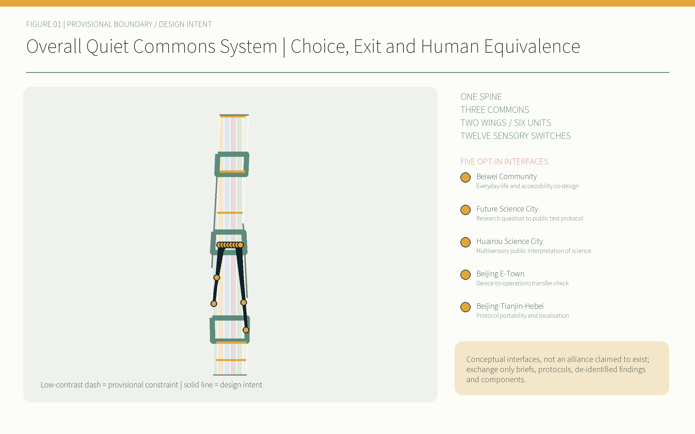
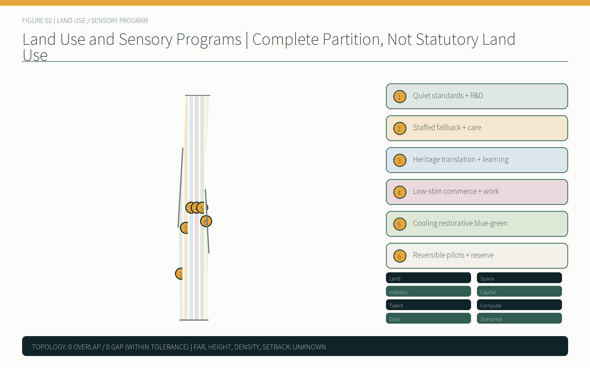
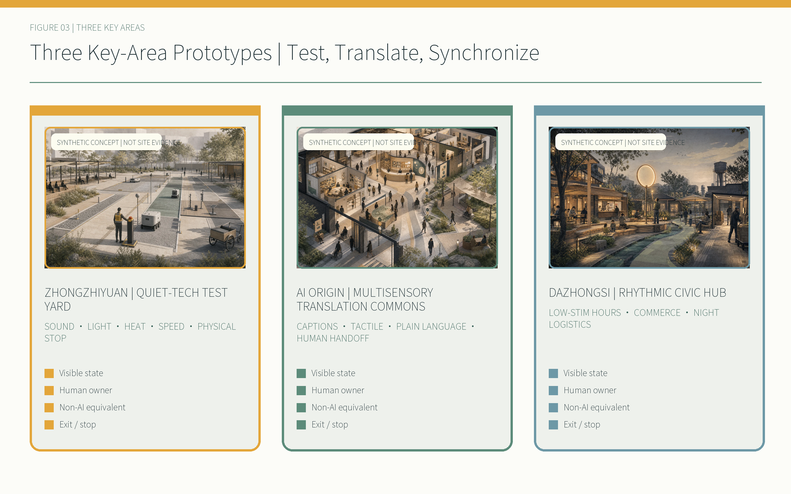
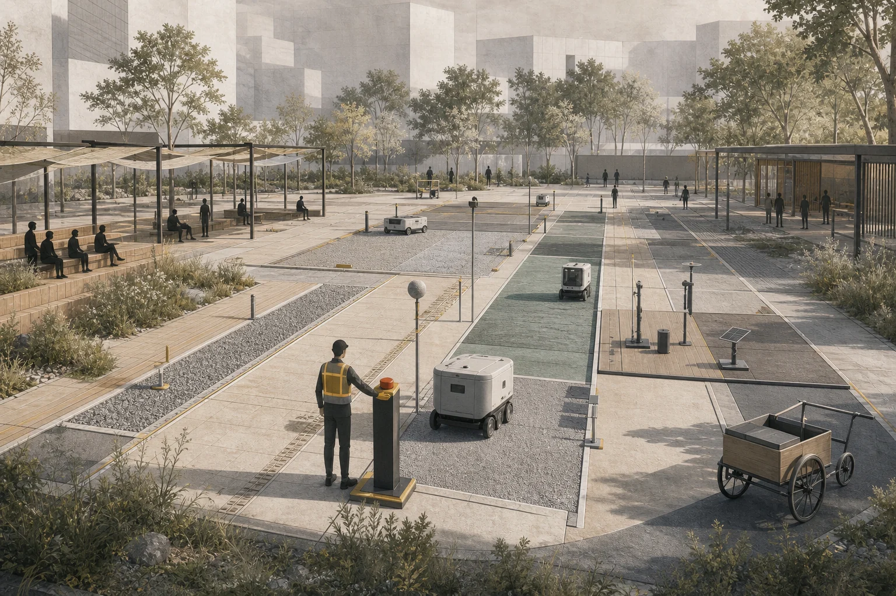
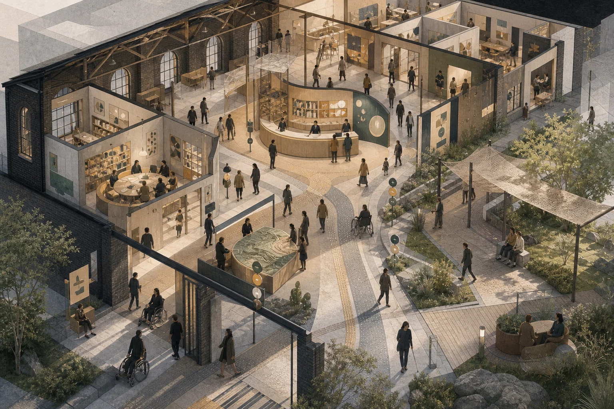
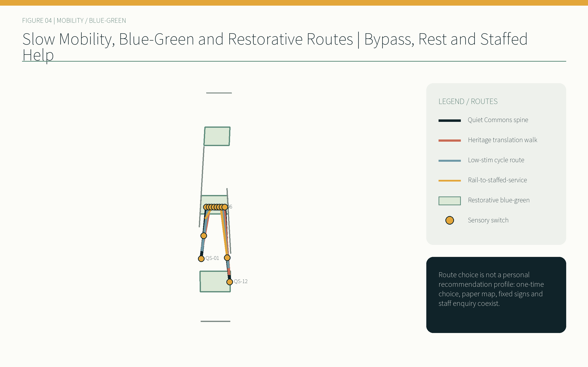
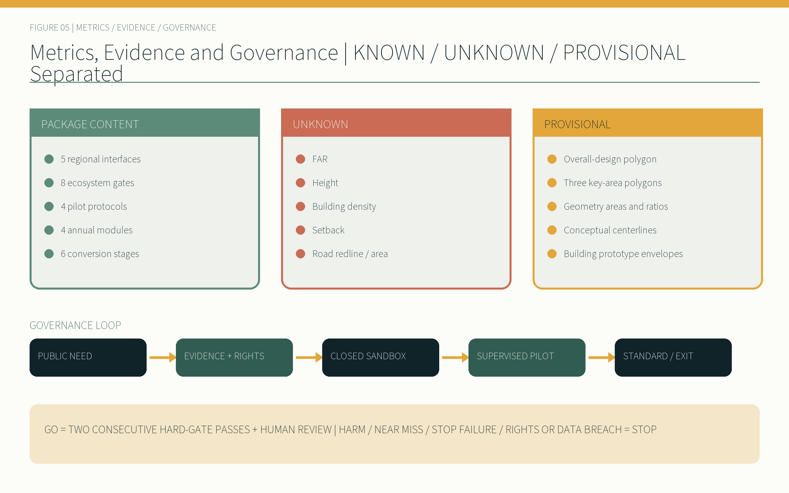

# QUIET COMMONS JINGZHANG / 京张静域

> Quiet is not silence; it is the right to adjust the city's sensory intensity.

## Design Basis and Source List

This proposal follows a fixed order of judgment: public task, registered source, provisional spatial constraint, design inference, and human review. The official announcement and the agent taskbook establish the 43.6 km² coordinated research area, the 11.4 km² overall design area, the three announced key areas totalling 368.4 ha, and the three theme belts, five functions, three zones/two wings, and `agent.1`–`agent.6`. The repository source registry then determines how each input may be used; a processed fact pack is navigation, not a new authority. [source:DATA-SRC-OFFICIAL-ANNOUNCEMENT-20260509] [source:DATA-SRC-AGENT-TASKBOOK-20260518]

The only computable spatial constraint currently available is the repository's provisional boundary. Both the site and key-area layers retain `official_boundary=false`, `geometry_role=provisional_constraint`, and `boundary_precision=provisional_rough`, and are drawn as low-contrast dashed lines. Announced textual areas and EPSG:4548 calculations from rough polygons are never conflated. When official polygons arrive, all nine GeoJSON layers, metrics, figures, HTML pages and four PDFs must be regenerated. [data:geometry/site_boundary.geojson#SITE-001] [assumption:A-BOUNDARY-001]

Chinese urban-design, regulatory-planning and land-use sources define the evidence structure. The Barrier-Free Environment Law is cited only within its scope. GB 3096, ISO 12913, WHO environmental-noise material, BSI PAS 6463 and W3C cognitive-accessibility work are method references; none is presented as a Beijing statutory control or as permission to import foreign planning indicators. [standard:MOHURD-URBAN-DESIGN-MEASURES] [standard:MNR-LAND-USE-CLASSIFICATION-GUIDE]

## Three-Level Scope Framework

The coordinated-research level asks how an innovation ecosystem becomes enterable for different sensory and communication modes. The overall-design level turns choice, exit and staffed equivalence into a continuous public system. The key-area level tests three operational prototypes. These levels are not repeated drawings at different scales; they form a chain from mechanism to space to accountability. [depth:three_level_scope_framework] [standard:PROJECT-OFFICIAL-ANNOUNCEMENT]

| Level | Announced text figure | Quiet Commons task | Precision status |
| --- | ---: | --- | --- |
| Coordinated research | 43.6 km² | Compare global mechanisms and organize standards, public deliberation and talent services | Mechanism study only; no invented boundary |
| Overall design | 11.4 km² | One spine, two wings/six unit types, twelve switches and three phases | Provisional constraint geometry |
| Key areas | 368.4 ha | Quiet-Tech Test Yard, Multisensory Translation Commons and Rhythmic Civic Hub | All three polygons await official replacement |

The spatial structure is “one Quiet Commons spine, three adjustment commons, two wings with six unit types, and twelve sensory switches.” The Zhongguancun wing hosts standards, design, legal, IP and accessibility services; the Xiaoyue River wing hosts cooling, restorative landscape and quiet mobility. A switch is not merely an automated device: it must show the current mode, allow bypass, expose a physical override and lead to staffed help. [data:geometry/public_space.geojson#PUBLIC-001] [metric:sensory_switch_node_count]

This structure links the railway-heritage, urban-AI-life and AI-fusion-innovation theme belts to five functions. The compliance matrix connects every task to readable sections, geometry, metrics, drawings, sources, assumptions and checks; matrix completeness never converts a disclosed data gap into an established fact. [depth:overall_spatial_structure] [source:SOURCE-REGISTRY]

## Coordinated Research Area: Industry and Future City Research

The central claim of QUIET COMMONS JINGZHANG is: **quiet is not silence; it is the right to adjust the city's sensory intensity.** Intensity means sound, light and glare, thermal comfort, crowding, movement and speed, and information density. Competitiveness is therefore also judged by whether a neurodivergent developer, a blind commuter or a night-shift maintainer can enter, understand, exit and obtain equivalent service without surrendering a personal profile. [source:DATA-SRC-AGENT-TASKBOOK-20260518] [depth:existing_conditions_diagnosis]

Global cases contribute mechanisms only. Kendall Square points to long-term district stewardship; one-north to a mix of research, enterprise and daily public realm; Kalasatama to measurable everyday benefits from urban experiments; Mila and MaRS to shared places for research community, responsible-AI debate and translation; Knowledge Quarter London to cross-institution links among heritage, culture, research and community. They supply no local FAR, road or area control. [source:CASE-KENDALL-SQUARE] [source:CASE-ONE-NORTH] [source:CASE-KALASATAMA]

The local operating loop is pilot, public deliberation, technical standard, procurement and maintenance, then open review. Quiet Commons Week makes twelve scenarios and three landmarks legible. Quarterly open tests publish failures, human handoffs and exits. Annual review retains, changes or withdraws standards. Recognition includes maintainers, accessibility testers and community repair contributors, not only inventors. [source:CASE-MILA] [source:CASE-MARS] [source:CASE-KNOWLEDGE-QUARTER]

The identity system uses two railway tracks interrupted by a soft quiet field and a switch point, with midnight ink, mist grey, muted jade and signal amber. Quiet Switch, Many-Ways Room and Common Pause Clock stand for choice, equivalent communication and shared rhythm; each is also an operable public interface. [depth:height_massing_character]

The following network, programmes, target values and roles are conceptual proposals for opt-in verification and professional development. They do not imply an existing partnership, secured budget, approval or government commitment. The regional map defines five opt-in interfaces: Beiwei Community returns de-identified everyday-life and accessibility issues; Future Science City helps turn research questions into versioned public test protocols; Huairou Science City supports multisensory science interpretation; Beijing E-Town examines device-to-operations transfer burden; and Beijing-Tianjin-Hebei tests protocol portability and localisation. Exchanges are limited to public problem briefs, protocols, de-identified findings and reusable components—never personal profiles. [source:DATA-SRC-AGENT-TASKBOOK-20260518] [assumption:A-REGIONAL-INTERFACE-001] [metric:regional_synergy_interface_count]

The eight ecosystem factors are exchange gates before a public pilot, not a wish list. Land screens rights, planning, heritage and safety without naming fictional parcels. Space requires status, exit and staffed help at every switch. Industry is organised by public need and maturity. Capital requires a cost band, payer role and stop-loss gate before launch. Talent combines eight pending-co-design personas with the operations view. Compute is ambient and edge-first so basic service survives network loss. Data is purpose-limited, minimal and short-lived. Twelve scenarios enter four staged protocols and never equal deployment. [assumption:A-ECOSYSTEM-TARGET-001] [metric:ecosystem_factor_coverage_count]

The primary mark combines two parallel Jingzhang rails and a switch opening into shared space. Four controlled variants are the bilingual horizontal lockup, bilingual vertical lockup, symbol-only and monochrome/reverse. The minimum symbol is 24 px on screen or 8 mm in print, with one track-gauge unit of clear space. Six always-labelled sensory symbols cover wave/sound, split light, heat arc, three-dot crowd, two-way speed and information stack; amber is never the sole state code. The cultural narrative has three acts—Making and Caring for the Line, Making Knowledge Shareable, and Sharing Control and Pause—and no date, person or archive image enters interpretation without source and rights verification. [assumption:A-BRAND-HERITAGE-001] [metric:identity_variant_count] [metric:culture_act_count]

## Overall Design Area: Urban Renewal and Regulatory-Plan-Level Urban Design

The overall design begins by stating what is absent: cleared parcel, ownership, building-condition, traffic, municipal-capacity and approved-control data. It therefore creates no fabricated existing-condition map or pseudo-regulatory plan. A seamless six-part conceptual partition organizes programs and sensory loads; nine building polygons are prototype envelopes; road geometries are slow-mobility and rail-connection centerlines, not redlines. [assumption:A-EXISTING-DATA-001] [standard:MOHURD-CONTROL-DETAILED-PLANNING]

The six units are quiet standards and R&D; staffed fallback and community services; railway heritage translation and learning; low-stim commerce and collaboration; cooling restorative blue-green space; and reversible pilots with adaptable reserve. Shared vertices cover the provisional site without material gap or overlap. That is submission topology, not confirmation of existing or statutory land use. [data:geometry/land_use.geojson#LU-001] [depth:land_use_layout]

Renewal uses three gates: retain first, prefer light and reversible adaptation, and require evidence before demolition. Historical value, structure, rights and embodied carbon are checked first; repair, accessibility and sensory adaptation are compared second; demolition is considered only after professional evidence shows safety or public-interest needs cannot be met. FAR, floor area, density, height, setback, road area and parking remain `unknown`. [metric:floor_area_ratio] [depth:retain_renovate_demolish]

The minimum Quiet Commons kit comprises a sensory vestibule, quiet/rest bay, tactile wayfinding strip, low-stim staffed service window, public mode-status beacon, and analogue help/override point. Components can be combined, but staffed help, non-digital passage and stop functions cannot be value-engineered away. [data:geometry/buildings.geojson#BLDG-001] [assumption:A-CONTROLS-001]

## Detailed Design of Key Areas

**Zhongzhiyuan — Quiet-Tech Test Yard.** Robots and devices are tested for sound, light, surface heat, movement speed and information cues before entering public space. Visible test status, spectator retreat zones, physical emergency stop and a human safety supervisor are mandatory. A failed device stops moving and emitting active light; testing falls back to human handling or a closed session. Standards, legal, IP and accessibility reviewers share one review table. [data:geometry/key_areas.geojson#PROV-KEY-001] [metric:zhongzhiyuan_announced_area_sqm]

**AI Origin — Multisensory Translation Commons.** Captions, tactile media, plain language, multiple languages and quiet learning/collaboration rooms form the Many-Ways Room. AI may assist transcription or explanation, but confidence is visible and any matter involving rights, payment or identity moves to a staffed window. Modes are selected by one-time paper card, physical dial or staff support; no sensory profile is required. [data:geometry/key_areas.geojson#PROV-KEY-002] [source:DATA-SRC-BARRIER-FREE-ENVIRONMENT-LAW]

**Dazhongsi — Rhythmic Civic Hub.** Commerce, shared work and public service follow a visible schedule of regular, low-stim and event modes. Lighting changes require human approval; night logistics use a low-speed, low-glare, acoustically coordinated window. A staffed desk and analogue signs remain available. The Common Pause Clock shows the next change and accountable role, never individual tracking. [data:geometry/key_areas.geojson#PROV-KEY-003] [metric:dazhongsi_announced_area_sqm]

The rough polygon areas are close to announced text constraints, but their exact extents remain unknown and their rectangular edges are not streets or parcels. Building, fire, commercial and station-integration development requires official polygons, survey, rights, utility, passenger-flow and professional safety evidence. [depth:three_key_area_detailed_design] [assumption:A-BOUNDARY-001]

## AI Innovation Ecosystem, Personas, and AI+ Scenarios

Eight personas are working hypotheses explicitly marked **pending co-design validation**, not invented participants or findings: a neurodivergent student/developer; blind or low-vision commuter; Deaf or hard-of-hearing visitor; older or low-digital-literacy resident; child and caregiver; shift/service worker; international or non-native-language visitor; and maintenance/operator worker. Their prompts cover predictability, tactile continuity, captions, staffed and paper paths, non-exclusion, night safety, plain multilingual information, diagnostics and reasonable work. [assumption:A-CO-DESIGN-001] [metric:persona_count]

| # | Scenario card | Minimum data/control | Staffed and non-AI equivalent |
| ---: | --- | --- | --- |
| 01 | User-selected quiet route | One-time choice, no identity retention | Paper map, fixed signs and staff directions |
| 02 | Multimodal railway guide | Rights-cleared heritage material and visible confidence | Tactile map, captions and human guide |
| 03 | Low-stim event mode | Schedule and ambient-level readings | Human host and parallel quiet room |
| 04 | Staffed public-service window | Only information necessary for the transaction | Full staffed and paper process |
| 05 | Device sensory-footprint test | Device sound, light, heat and speed | Human test and physical emergency stop |
| 06 | Night quiet logistics | Vehicle-level compliance, no person recognition | Human dispatch and fixed low-speed window |
| 07 | Human-approved adaptive lighting | Ambient light and time | Staff approval and fixed lighting scenes |
| 08 | Shade and cooling route | Ambient temperature and shade status | Fixed shade map, water and rest points |
| 09 | Anonymous crowd-transition beacon | Coarse ambient count or manual report | Human notice, bypass and entry pause |
| 10 | Multilingual cognitive-accessible wayfinding | Cleared terminology and place data | Icons, plain text and staffed enquiry |
| 11 | Quiet-hour commerce and work | Public timetable | Physical signs and staff presence |
| 12 | Accessible emergency communication | Incident-level information, no personal profile | Parallel audio, visual and tactile alerts plus staff |

Every card follows the same defaults: no personal sensory profile, no biometric identification, ambient anonymous or manual input first, visible state, human approval for consequential actions, physical override, and equivalent service after stopping. AI does not approve plans, determine rights or command emergencies. Generative-AI rules are applied only when a public generative service actually falls within scope. [source:DATA-SRC-GENERATIVE-AI-INTERIM-MEASURES] [metric:default_personal_profile_count]

The twelve local cards connect to six registered repository scenario IDs for indexing—cultural guide, health-service navigation, walkability, enterprise service, safety review and low-speed delivery. Registration does not imply any card is deployed. [metric:scenario_card_count] [depth:municipal_new_infrastructure]

## Land Use, Building Scale, and Retain-Renovate-Demolish Strategy

The six shared-edge areas carry sensory programs rather than statutory land claims. R&D adjoins device testing, standards and IP support; community service places staffed support and care on the accessible spine; heritage learning translates railway narratives into tactile, multilingual and quiet learning; commerce publishes low-stim hours; blue-green space provides cooling and recovery; reserve land accepts reversible trials. Areas are calculated from geometry without invented industry-share controls. [data:geometry/land_use.geojson#LU-004] [metric:land_use_gap_area_sqm]

Nine building prototypes show where adjustable entrances, staffed interfaces, quiet collaboration rooms and maintenance back-of-house space are needed. They do not identify existing buildings or permissions. A performance checklist requires the entrance mode to be legible outside, glare sources to avoid waiting areas, plant and loading to be buffered from restorative edges, analogue help on every level, and basic service during network failure. [data:geometry/buildings.geojson#BLDG-004] [depth:development_intensity_controls]

Retain–renovate–demolish decisions advance through public-source screening; site and rights verification; architectural, structural and accessibility assessment; and public/implementation deliberation. Before all four levels are complete, allowed labels are retain and investigate, reversible light adaptation, or pending professional comparison. Railway heritage authenticity is retained and new interpretive elements are reversible. [standard:MOHURD-ARCH-DESIGN-DEPTH-2016] [assumption:A-EXISTING-DATA-001]

Total floor area, FAR, building density and height are not available as approved controls. They remain `status=unknown` with an explicit reason in the metrics file. This makes the professional decision gate visible; it does not disguise a gap. Official inputs must update the structured source before every readable output is regenerated. [metric:total_floor_area_sqm] [metric:height_limit_m]

## Transport, Rail, Municipal Infrastructure, and Public Services

Movement treats speed as a selectable mode. The Quiet Commons spine links twelve switches; a railway-heritage translation walk supports continuous cultural reading; a low-stim cycle route moderates conflicts; and rail-to-staffed-service links ensure that a phone is unnecessary after leaving a station. These conceptual centerlines must later be overlaid with the actual network, redlines, flows and emergency access. [data:geometry/roads.geojson#ROAD-001] [depth:traffic_rail_slow_parking]

The night-logistics pilot coordinates sound, light and speed: a visible time window, no high-glare moving advertising, slow movement near quiet edges, and immediate suspension by human dispatch. Robots that cannot reliably honor emergency stop, pedestrian priority or route limits fall back to human delivery. The applicable GB 3096 functional area and measurement conditions require professional confirmation; this proposal assigns no statutory class. [source:METHOD-GB-3096] [assumption:A-SENSORY-THRESHOLDS-001]

Municipal and digital infrastructure follows ambient-level, edge, minimum-data and maintainable principles. Mode beacons show only the current public state; crowd hints use coarse bands or manual reports; adaptive lighting produces a recommendation and requires duty-manager approval; fixed scenes and physical overrides work offline. Every device discloses maintenance status, last inspection and accountable role. [data:geometry/public_space.geojson#PUBLIC-009] [source:DATA-SRC-BARRIER-FREE-ENVIRONMENT-LAW]

Public service retains four complementary paths: captions, tactile/graphic information, plain language and a staffed window. Where law explicitly requires staffed service, that duty is respected. Elsewhere staffed equivalence is a design commitment, not a fabricated universal legal claim. The older-person technology plan is historical support for traditional paths, not a current KPI. [source:DATA-SRC-ELDERLY-SMART-TECH-PLAN-2020-45] [depth:municipal_new_infrastructure]

## Blue-Green Network, Public Space, and Urban Character

The Xiaoyue River wing and railway spine form a restorative network. Continuous shade, water, supportive seating, low-information signs and optional quiet branches reduce thermal, glare and crowd loads. Green and public-space systems are separately recalculated even where they overlap, so a green ratio is never used as a proxy for comfort. ISO 12913 and WHO supply contextual and health prompts; Chinese standards, field measurements and co-design determine local thresholds. [data:geometry/green_space.geojson#GREEN-001] [source:METHOD-ISO-12913]

Twelve switches rotate six components so that help or an analogue point recurs frequently. Mode beacons combine words, symbols and contrast rather than color alone; tactile strips cannot be blocked by temporary displays; sensory vestibules frame event transitions; quiet bays never require purchase. PAS 6463 and W3C COGA wayfinding inform questions, while actual users validate details. [source:METHOD-BSI-PAS-6463] [source:METHOD-W3C-WAYFINDING]

Character comes from legible interfaces, low-glare night conditions, railway rhythm and maintainable components—not a uniform tech-blue screenscape. Quiet Switch shows choice, Many-Ways Room shows equivalent communication, and Common Pause Clock shows civic rhythm. None identifies or ranks people; inscriptions recognize maintenance, accessibility testing and community repair. [metric:landmark_count] [depth:blue_green_public_space]

Green and public-space ratios are design-geometry values under a provisional boundary, not official controls. Official polygons, current green/water/heritage/road layers and rights must be overlaid before final controls. If measured heat, noise or access evidence contradicts a route, the route changes rather than the disclosure standard. [metric:green_ratio] [metric:public_space_ratio]

## Renewal Projects, Implementation Policy, and Phasing

Four validation pilots test governance and exit before spectacle. Each has a bounded period, stop gate, accountable human role, non-AI equivalent and public review measure. Any safety incident, unexplained mode change, failed override or unacceptable exclusion pauses the pilot. [metric:validation_pilot_count] [assumption:A-OPERATIONS-001]

Implementation actors include planning and operations teams, universities, enterprises, community residents, accessibility testers and maintainers. Measurable indicators cover handoff time, equivalent completion, stop reasons, conflict recovery and maintenance backlog. Near-term pilots, medium-term standardization and long-term network extension continue, change or withdraw on this evidence rather than deployment count.

Every pilot number is a `design_target`, not a completed result. Baselines, professional thresholds, recruitment, consent/withdrawal and statistical sufficiency require independent review. Progress needs two consecutive rounds meeting every hard gate plus human review; any harm, serious near miss, failed emergency stop, rights error or unapproved data processing triggers immediate `STOP`. [assumption:A-PILOT-PROTOCOL-001] [metric:pilot_protocol_complete_count]

| Pilot | Suggested period | Stop/exit gate | Human owner and non-AI equivalent | Review measures |
| --- | --- | --- | --- | --- |
| Device footprint and stop | Six weeks, closed to limited public sessions | Failed stop, boundary breach, glare or reviewed heat limit | Safety supervisor; human handling or fixed display | Stop success, handoff time, complaints and near misses |
| Public-space mode change | Eight weeks, three published periods | Invisible state, unannounced change or exclusion of legitimate activity | Public-realm manager; fixed timetable and physical zones | Mode comprehension, reachable exit, conflict and recovery |
| AI public service and handoff | Eight weeks, bounded services | Rights error, low-confidence translation or unavailable staff | Service supervisor; complete staffed and paper service | Equivalent completion, handoff, waiting and correction |
| Night logistics sound/light/speed | Six weeks, fixed route window | Speed, glare, sound anomaly or failed pedestrian priority | Night dispatcher; human delivery or stop window | Anomalies, suspension response and compliance |

| Protocol | Baseline | Sample design target | Hard gate and accountable owner |
| --- | --- | --- | --- |
| P1 device footprint | Device-off ambient reading plus manual handling | 3 modes × 10 physical stops, ≥30 trials | 30/30 stops, zero boundary/high-severity near miss; safety supervisor |
| P2 space modes | Fixed mode and reachable exit | ≥24 voluntary guided sessions across eight personas or advocates | Text/graphic/staff state plus bypass and legitimate-activity alternative 100% available |
| P3 AI service | Staff-only completion, waiting and correction | 3 non-entitlement tasks, ≥60 scripted cases and ≥24 sessions | Rights/payment/identity/low confidence 100% to staff; paper path 100% available |
| P4 night logistics | Manual-delivery sound/light/speed, conflict and wait | ≥40 route loops across human and device modes | Pedestrian priority/route/anomaly pause 100%; no public test before threshold review |

Phase 1 emphasizes physical signs, staffed service and four reversible pilots. Phase 2 turns validated components into public-realm, procurement, maintenance and accessibility standards. Phase 3 extends the network only on official planning evidence. Phase polygons are work partitions, not approved construction timing; each project still passes rights, budget, approval and deliberation gates. [data:geometry/phasing.geojson#PHASE-001] [depth:phasing_implementation]

The operating rhythm is Quiet Commons Week, quarterly open tests and annual standards review. Quarterly reports publish availability, human handoffs, non-AI path availability, stop reasons, maintenance backlog and unresolved co-design questions. Public, maintenance, accessibility, operations, planning and legal reviewers jointly retain, change or withdraw each element. [metric:human_handoff_pilot_count] [metric:non_ai_equivalent_pilot_count]

The annual institution has four modules: Q1 Protocol Lab produces a public-need ledger, test brief and exit conditions; Q2 Open Test Season publishes baselines, failure, handoff and withdrawal; Q3 Quiet Commons Week produces accessible routes, a feedback summary and contribution roll; Q4 Standards & Maintenance Assembly versions protocols and publishes the maintenance backlog and withdrawal list. Before any public pilot, five seats must be registered: public-problem owner, developer steward, accessibility co-designer, operations/safety steward, and data/rights reviewer. The six-stage funnel is public need → evidence/rights/maturity screen → closed or synthetic-data sandbox → supervised pilot → open protocol/standard candidate → independent procurement, replication or withdrawal decision. Leaving the funnel is not failure, and no stage guarantees funding, a contract, policy adoption, procurement or replication. [metric:annual_program_module_count] [metric:conversion_stage_count] [assumption:A-ECOSYSTEM-TARGET-001]

## Metrics, Area Recalculation, and Compliance Matrix

Structured data is the sole source of truth. GeoJSON uses EPSG:4326 and areas are recalculated in EPSG:4548. Every feature carries `id/layer/source_type/confidence/geometry_role`; provisional constraints add an explicit non-official flag and precision note. Every metric records status, value, unit, formula, sources, confidence and assumptions. Numeric HTML markers reuse known metric values. [depth:metrics_recalculation] [data:geometry/constraints.geojson#CONSTRAINT-001]

| Metric group | Current result | Meaning |
| --- | ---: | --- |
| Provisional overall-design geometry | Recalculated as `site_area_sqm` | Close to announced 11.4 km²; not an official polygon |
| Partition topology | overlap 0, gap 0 within tolerance | Completeness of design geometry only |
| Switches / scenarios / personas | 12 / 12 / 8 | Personas still require co-design |
| Validation pilots | 4 | 4/4 human handoff, 4/4 non-AI equivalent, 4/4 stop/exit |
| Default personal profiles | 0 | No biometric identification |
| FAR / height / setback / road area | unknown | Await approved controls, survey and professional review |

Twenty-three task rows, nine standard responses and fifteen design-depth items are connected in JSON. `complete` means this package responds—including an explicit data-gap response—not that absent statutory controls have been obtained. The 14-page A3 and 7-page A0 sets are independently bilingual; every text figure has an English counterpart; the offline exhibit supports layers, key areas, scenarios, keyboard use, reduced motion and high contrast. [standard:PROJECT-AGENT-OPEN-CALL-TASKBOOK] [depth:risk_missing_data]

The public status is: “content-review contract ready; spatial geometry provisional; awaiting organizer content review.” Missing official polygons do not block content scoring, but remain explicitly provisional and trigger full recalculation when supplied. No new score, boundary confirmation or implementation commitment is claimed before organizer review. [metric:manual_stop_pilot_count] [source:PROCESSED-FACT-PACK]

## Risk, Copyright, and Compliance

The greatest risk is mistaking provisional geometry, working personas, conceptual buildings or AI recommendations for confirmed facts. The risk matrix covers privacy, implementation, acceptance, operations, policy, spatial conflict, maturity and equity, with named professional review for high-risk items. No scenario defaults to a personal sensory profile or biometric identification; necessary inputs are one-time manual choices, public material or ambient anonymous information. [assumption:A-LEGAL-001] [source:METHOD-W3C-COGA]

Human override is not a hidden back-office button. State must be visible in space, consequential action approved by a person, physical stopping prioritized, and full staffed or physical equivalence available after stop. Human workers also need training, shifts, reasonable hours, diagnostic devices and a maintenance budget. Four pilots meet the 4/4 design gate for handoff, non-AI equivalence and stop rules; effectiveness still requires testing. [metric:manual_stop_pilot_count] [assumption:A-SENSORY-THRESHOLDS-001]

Original text, diagrams, prototypes and layout are offered under CC BY 4.0 to the extent rights permit; code is MIT. Open-call documents, law, standards and case pages retain their own rights, and participation follows the open-call terms. Noto Sans SC is used under SIL OFL 1.1 as embedded glyph subsets or rasterized text, with no font file submitted. [source:FONT-NOTO-SANS-SC] [standard:BARRIER-FREE-ENVIRONMENT-LAW]

AI disclosure is in `agent.json`. OpenAI Codex assisted source reading, bilingual drafting, structured modeling, code, layout and validation. The interface does not expose an exact serving-model identifier, so no version is invented. ImbaJade is the only displayed author; boundary, legal, professional and public-interest judgments retain human accountability. [assumption:A-MODEL-001]

## References

Primary authority comprises the official announcement, agent taskbook, source registry, Chinese urban-design and regulatory-planning methods, land-use classification, the Barrier-Free Environment Law and the registered provisional geometry. Complete URLs, paths, status, intended use and retrieval date are held in `sources.json`; the narrative retains only claim-adjacent anchors. [source:SITE-PACKAGE] [source:DATA-SRC-MNR-LAND-USE-CLASSIFICATION-202311]

Sensory methods include GB 3096, ISO 12913, WHO environmental noise, BSI PAS 6463 and W3C COGA/wayfinding. They frame questions and tests; they do not replace Chinese legal standards, field measurement or co-design. Global cases use primary institutional pages for Kendall Square, one-north, Kalasatama, Mila, MaRS and Knowledge Quarter London, extracting ecosystem and public-realm mechanisms only. [source:METHOD-WHO-NOISE] [source:METHOD-W3C-COGA]

The machine entry point is `manifest.json`, with metrics, assumptions, sources, three matrices, nine GeoJSON layers, risk and self-check files. Human entry points are this narrative, two static HTML reports, 14-page A3 booklets, 7-page A0 boards and offline interactive exhibits. Every later edit must regenerate displays, rerun finalization, refresh hashes and repeat the complete check. [depth:renewal_project_list] [standard:GENERATIVE-AI-INTERIM-MEASURES]
