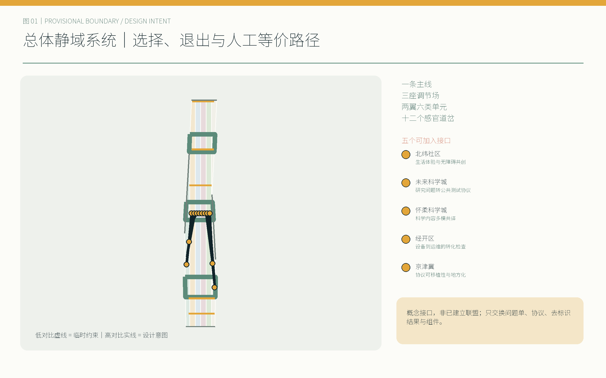
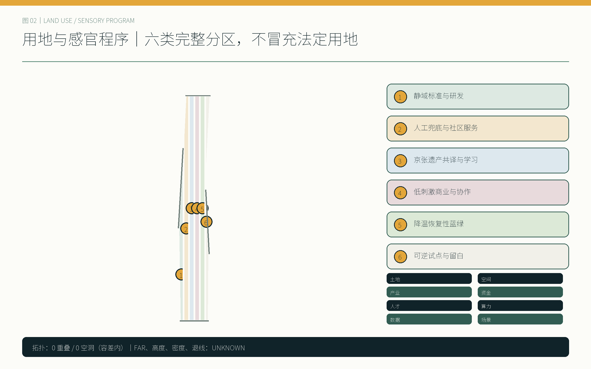
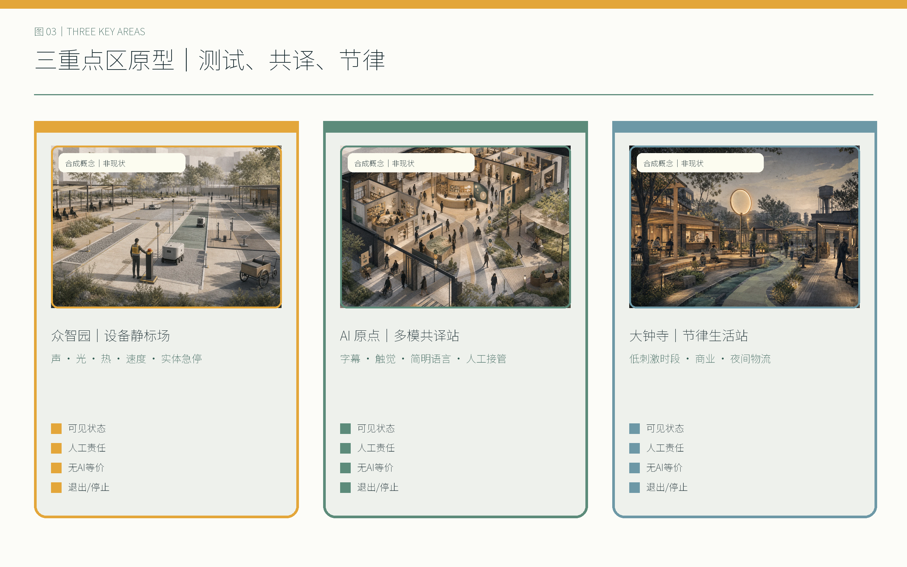
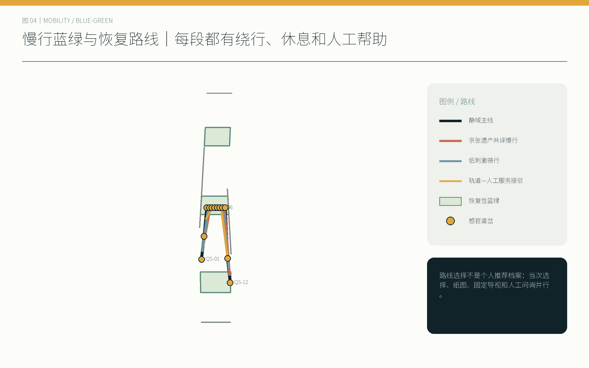
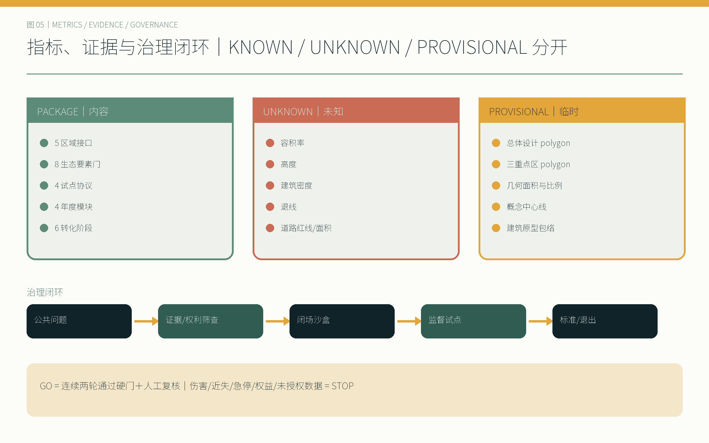

# 京张静域 / QUIET COMMONS JINGZHANG

> 安静不是无声，而是每个人都有权调节城市的感官强度。

## 设计依据与资料清单

本方案的判断顺序是“公开任务—登记来源—临时空间约束—设计推演—人工复核”。第一层采用征集公告与面向智能体任务书，锁定 43.6 平方公里统筹研究、11.4 平方公里总体设计、368.4 公顷三处重点区，以及三条主题带、五项功能、三区两翼和 `agent.1`—`agent.6`；第二层采用仓库 source registry 和 fact pack 识别资料用途，不把处理稿升级为新权威。[source:DATA-SRC-OFFICIAL-ANNOUNCEMENT-20260509] [source:DATA-SRC-AGENT-TASKBOOK-20260518]

当前唯一可计算空间约束是仓库 provisional boundary。`site_boundary.geojson` 与 `key_areas.geojson` 全部保留 `official_boundary=false`、`geometry_role=provisional_constraint`、`boundary_precision=provisional_rough`；图上以低对比虚线表示。11.4 平方公里及三处重点区面积是公告文字事实，EPSG:4548 复算值是临时图形结果，两者不混写。正式 polygon 发布后，九类 GeoJSON、所有面积比例、五张图、HTML 和四册 PDF 必须全量重建。[data:geometry/site_boundary.geojson#SITE-001] [assumption:A-BOUNDARY-001]

规划深度以住建部城市设计与控规编制方法、自然资源部用地分类作为证据框架；无障碍法按实际适用范围引用。GB 3096、ISO 12913、WHO 环境噪声、BSI PAS 6463 与 W3C 认知无障碍仅提供声音景观、神经包容与导视方法，不冒充北京法定控制条件，也不从国际案例移植指标。[standard:MOHURD-URBAN-DESIGN-MEASURES] [standard:MNR-LAND-USE-CLASSIFICATION-GUIDE]

## 三层范围工作框架

统筹研究层回答“怎样让创新生态对不同感官与沟通方式可进入”；总体设计层回答“怎样把选择、退出和人工等价路径织成连续公共系统”；重点区层用三种真实运营原型验证。三层之间不是比例尺递进的重复画图，而是从机制、空间到责任的证据链。[depth:three_level_scope_framework] [standard:PROJECT-OFFICIAL-ANNOUNCEMENT]

| 层级 | 公开文字指标 | 本方案任务 | 精度状态 |
| --- | ---: | --- | --- |
| 统筹研究 | 43.6 km² | 比较全球创新机制；建立静域标准、公共审议和人才服务网络 | 只作机制研究，无统筹红线图 |
| 总体设计 | 11.4 km² | 一条静域主线、两翼六类单元、十二道岔和三期更新 | 图形为 provisional constraint |
| 重点区域 | 368.4 ha | 众智园设备静标场、AI原点多模共译站、大钟寺节律生活站 | 三个 polygon 均待官方替换 |

空间结构概括为“一条静域主线、三座调节场、两翼六类静域单元、十二个感官道岔”。中关村翼承接标准、设计、法务、知识产权和无障碍服务；小月河翼承接降温、恢复性景观与安静慢行。十二道岔不是十二套自动化设备，而是能看见当前模式、能绕行、能按下物理覆盖器、能找到人工帮助的公共选择点。[data:geometry/public_space.geojson#PUBLIC-001] [metric:sensory_switch_node_count]

该结构逐项对应“百年京张文化带、都市 AI 生活体验带、AI 融合创新带”，也覆盖技术策源、产业转化、公共体验、国际交流与城市治理五项功能。`compliance_matrix.json` 把每条任务连到章节、图层、指标、图纸、来源、假设和自检；缺资料项不因矩阵完整而被宣称已解决。[depth:overall_spatial_structure] [source:SOURCE-REGISTRY]

## 统筹研究范围产业与未来城市研究

“京张静域 / QUIET COMMONS JINGZHANG”的核心主张是：**安静不是无声，而是每个人都有权调节城市的感官强度。** 这里的强度包括声音、光与眩光、热舒适、人群密度、运动速度和信息密度。创新带的竞争力因此不只以企业和技术数量衡量，也看一位神经多样性开发者、一位视障通勤者或一位轮班维护者能否在不交出个人画像的前提下进入、理解、退出并获得等价服务。[source:DATA-SRC-AGENT-TASKBOOK-20260518] [depth:existing_conditions_diagnosis]

全球案例只提炼机制。Kendall Square 提示公共部门与创新主体之间需要长期街区治理；one-north 提示研发、企业与日常公共空间要混合而非封闭园区化；Kalasatama 提示城市试验应转化为可测量的日常收益；Mila 与 MaRS 提示研究共同体、伦理讨论和转化服务需要共享场所；Knowledge Quarter London 提示遗产、文化、科研与社区可由跨机构网络连接。它们不提供本地容积率、道路或面积依据。[source:CASE-KENDALL-SQUARE] [source:CASE-ONE-NORTH] [source:CASE-KALASATAMA]

本地机制由“试点—公众审议—技术标准—采购运维—开放复盘”闭环承接。静域周集中展示十二场景和三处标志物；季度开放测试公布故障、人工接管与退出情况；年度标准复盘决定保留、修改或撤回。荣誉体系同时记录维护者、无障碍测试者和社区修复贡献，避免只纪念技术发明者。[source:CASE-MILA] [source:CASE-MARS] [source:CASE-KNOWLEDGE-QUARTER]

视觉识别以两条平行“京张轨”被柔软静域和道岔打断为母题，午夜墨、雾灰、低饱和玉色与信号琥珀构成高对比系统。“静域道岔”“万径共译室”“共息钟”分别代表选择、等价沟通与共同节律，既是地标，也是可操作的公共界面。[depth:height_massing_character]

下列网络、活动、目标值和角色均为概念建议及试点设计，可供相关主体选择、核验与深化；不表示已建立合作、已取得预算、已获审批或已形成政府安排。区域协同图是五个“可加入接口”：北纬社区回送去标识问题与导视修订；未来科学城协作把研究问题转为版本化测试协议；怀柔科学城协作多模科学共译；经开区检查设备到运维的转化负担；京津冀节点验证协议的可移植性与地方化。交换物限于公开问题单、测试协议、去标识化结果和可复用组件，不交换个人画像。[source:DATA-SRC-AGENT-TASKBOOK-20260518] [assumption:A-REGIONAL-INTERFACE-001] [metric:regional_synergy_interface_count]

八要素不是资源许愿清单，而是进入公共试点前的八道交换门：土地只做权属、规划、文保和安全前置核验；空间使十二道岔各有状态、退出与人工帮助；产业以公共问题与成熟度门组织；资金需启动前核定成本档、付款角色和止损门；人才以八类待共创画像与运维视角共同参与；算力采环境级、端侧优先且断网仍有等价服务；数据限定目的、字段与保留；场景十二卡进入四项分阶段验证，不等同部署。[assumption:A-ECOSYSTEM-TARGET-001] [metric:ecosystem_factor_coverage_count]

主标由两条平行京张轨和一枚向共享空白打开的道岔构成，规范中英横版、中英竖版、纯符号、单色/反白四类版本；最小屏幕符号 24 px、印刷 8 mm，安全留白为一个轨距单元。六类感官符号为声波、分光、热弧、三点人群、双向速度与信息栈；始终配文字，不以琥珀色作唯一状态编码。文化分为“开路与养护—共知与共译—共治与共息”三幕，所有历史日期、人物和图像必须通过来源与权利核验后才进入展陈。[assumption:A-BRAND-HERITAGE-001] [metric:identity_variant_count] [metric:culture_act_count]

## 总体设计范围城市更新与控规深度城市设计

总体设计先承认资料边界：现状地块、产权、建筑质量、交通流量、市政容量和法定控制没有进入清权公开包，因此方案不生成伪现状和伪控规。设计层采用完整无缝的六类概念分区，作为功能程序与感官负荷组织，而不是用地审批建议；建筑层只画九个可讨论原型包络；道路层只画慢行和轨道接驳中心线，不声明道路红线。[assumption:A-EXISTING-DATA-001] [standard:MOHURD-CONTROL-DETAILED-PLANNING]

六类静域单元为：静域标准与研发、人工兜底与社区服务、京张遗产共译与学习、低刺激商业与协作、降温恢复性蓝绿空间、可逆试点与弹性留白。它们以共享顶点完整覆盖临时总体设计范围，重叠与空洞均由空间审查复算；这一“完整”只说明提交拓扑完整，不意味着现状或法定用地已确认。[data:geometry/land_use.geojson#LU-001] [depth:land_use_layout]

城市更新采用“保留优先、轻改可逆、拆除需证据”的门槛。第一门先核查历史、结构安全、使用权与隐含碳；第二门比较维修、无障碍和感官调节是否能通过低成本改造实现；第三门只有在专业调查证明不能满足安全与公共利益时才讨论拆除。容积率、总建面、建筑密度、高度、退线、道路面积和停车供给保持 `unknown`，由正式控规、测绘和工程条件补齐。[metric:floor_area_ratio] [depth:retain_renovate_demolish]

公共空间的最小“静域组件包”包含感官前室、安静休憩湾、触觉导向带、低刺激人工服务窗、公共模式状态灯、模拟求助与覆盖点。组件可以按场地组合，但人工帮助、非数字路径和停止机制不能因预算优化而消失。[data:geometry/buildings.geojson#BLDG-001] [assumption:A-CONTROLS-001]

## 重点区域详细设计

**众智园｜设备静标场。** 以机器人与智能设备进入公共空间前的声、光、表面热、运动速度和信息提示为测试对象。场地布置可见测试状态、观众退避带、实体急停和人工安全主管；设备失败即停止移动与主动照明，改由人工搬运或封闭时段复测。中关村翼的标准、法务、知识产权和无障碍服务在此形成联合评审桌。[data:geometry/key_areas.geojson#PROV-KEY-001] [metric:zhongzhiyuan_announced_area_sqm]

**AI 原点｜多模共译站。** 以字幕、触觉、简明语言、多语言、安静学习与协作空间构成“万径共译室”。AI 可辅助转写和解释，但公开屏幕显示置信状态；涉及权益、付款或身份的事项转入人工窗口。任何人无需创建感官档案，可通过纸卡、物理拨杆或工作人员选择模式。[data:geometry/key_areas.geojson#PROV-KEY-002] [source:DATA-SRC-BARRIER-FREE-ENVIRONMENT-LAW]

**大钟寺｜节律生活站。** 商业、共享办公和社区服务按公开时刻表切换常规、低刺激与活动模式；照明调整需人工批准，夜间物流采用低速、低眩光和声光协同窗口。固定人工窗口与模拟导视始终开放，“共息钟”显示下一次模式变化及现场负责人，而不是追踪个体。[data:geometry/key_areas.geojson#PROV-KEY-003] [metric:dazhongsi_announced_area_sqm]

三个临时 polygon 的几何面积与公告文字面积约束接近，但四至仍然未知，矩形边不得解释为道路或地块边界。细化到建筑、消防、商业运营和轨道站一体化之前，需要正式 polygon、现状测绘、产权、市政、客流与专业安全评估。[depth:three_key_area_detailed_design] [assumption:A-BOUNDARY-001]

## AI 创新生态、人才画像与 AI+ 场景

八类工作画像是设计假设，均明确标为“待共同设计验证”，不虚构访谈、样本或满意度。神经多样性学生/开发者关注刺激可预测与退出；视障通勤者关注触觉连续和不依赖颜色；听障访客关注字幕、手语转介与可见警报；老年及低数字素养居民关注人工窗口和纸质路径；儿童与照护者关注不被“安静”排斥；轮班服务人员关注夜间安全与休息；国际访客关注简明多语；维护运营人员关注可诊断、可停机和合理工时。[assumption:A-CO-DESIGN-001] [metric:persona_count]

| # | 场景卡 | 最小数据与控制 | 人工与无 AI 等价方案 |
| ---: | --- | --- | --- |
| 01 | 静域路线选择 | 用户当次选择；不保存身份 | 纸质图、固定静域标识、工作人员指路 |
| 02 | 多模态铁路导览 | 清权遗产资料；公开置信状态 | 触觉图、字幕牌、人工讲解 |
| 03 | 低刺激活动模式 | 时段与现场环境级读数 | 现场主持人切换；平行安静空间 |
| 04 | 人工公共服务窗口 | 仅办理所需信息 | 固定人工窗口本身就是等价路径 |
| 05 | 设备感官足迹测试 | 设备声光热速读数 | 人工测试与实体急停 |
| 06 | 夜间静音物流 | 车辆级合规状态，不识别人 | 人工调度与固定低速窗口 |
| 07 | 人工审批自适应照明 | 环境亮度与时刻 | 人工批准；固定照明场景 |
| 08 | 遮阴降温路线 | 环境温度和遮阴状态 | 固定遮阴地图与饮水休息点 |
| 09 | 匿名拥挤度提示 | 环境级计数或人工报码 | 人工提示、绕行和暂停入场 |
| 10 | 多语言认知友好导视 | 清权词库与地点信息 | 图形、简明文本和人工询问 |
| 11 | 安静时段商业办公 | 公开时刻表 | 物理标识与人工值守 |
| 12 | 无障碍应急沟通 | 事件级信息，不建个人档案 | 声光触觉并行警报与现场人员 |

全部场景遵循“无默认个人感官档案、无生物识别、环境级匿名或人工输入优先、状态可见、关键动作人工审批、物理覆盖优先、停止后有等价服务”。AI 不替代规划审批、权益判断或应急指挥；生成式 AI 法规仅在实际提供面向公众的生成服务时适用，不被泛化为所有设施的条款。[source:DATA-SRC-GENERATIVE-AI-INTERIM-MEASURES] [metric:default_personal_profile_count]

十二卡与六类已登记场景 ID 建立接口：文化导览、健康服务导航、慢行、企业服务、安全运营复核和低速配送。登记 ID 用于仓库索引，本地十二卡用于空间深化，两者不虚构十二项均已部署。[metric:scenario_card_count] [depth:municipal_new_infrastructure]

## 用地、建筑规模与拆改留方案

六块共享边界用地分区是感官程序的载体：研发单元把设备测试、标准和知识产权服务邻近；社区服务单元把人工窗口、照护和无障碍支援放在主线可达位置；遗产学习单元把铁路叙事转为触觉、多语和安静学习；商业协作单元允许公开切换低刺激时段；蓝绿单元提供降温与恢复；留白单元承接可撤回试点。各面积从图层复算，不设未经确认的产业比例控制。[data:geometry/land_use.geojson#LU-004] [metric:land_use_gap_area_sqm]

九个建筑原型只表达“哪里需要可调节入口、人工服务界面、安静协作房和维护后场”，不表示现状建筑位置或新建许可。建筑尺度控制采用性能清单：入口模式在室外可见；眩光源不直射主要等候区；机械设备与夜间装卸远离恢复性边界；每层有无需应用程序的求助方式；断网和停机时仍能使用基本服务。[data:geometry/buildings.geojson#BLDG-004] [depth:development_intensity_controls]

拆改留决策按四级证据推进：公开资料初筛、现场与产权核实、建筑/结构/无障碍专业评估、公众与实施审议。未完成四级证据前，清单只允许“保留并调查”“轻量可逆改造”“待专业比较”，不允许把原型包络当作拆除对象。历史构筑物与京张叙事优先保留原真性，新增识别设施应可逆。[standard:MOHURD-ARCH-DESIGN-DEPTH-2016] [assumption:A-EXISTING-DATA-001]

总建筑面积、容积率、建筑密度与高度均未得到 approved controls。`metrics.json` 对它们使用 `status=unknown` 与明确 reason；这不是成果空缺被隐藏，而是将需专业补充的决策门可见化。官方数据进入后，先更新结构化事实源，再重生成全部人读成果。[metric:total_floor_area_sqm] [metric:height_limit_m]

## 交通、轨道、市政与公共服务设施

交通系统把“快”从默认价值改为可选择模式。静域主线串联十二道岔，京张遗产共译慢行线提供连续文化阅读，低刺激骑行线控制冲突速度，轨道—人工服务接驳线保证下车后无需手机也能到达服务点。路线不是承诺新增道路；中心线与现状路网、红线、客流和消防条件须由专业团队叠合。[data:geometry/roads.geojson#ROAD-001] [depth:traffic_rail_slow_parking]

夜间物流试点按声、光、速度三项协同：限定公开窗口；车辆不使用高眩光动态广告；临近安静边界时进入低速；异常由人工调度立即暂停。机器人若不能稳定识别急停、行人优先与路线边界，则改为人工配送。任何声环境控制需先确认 GB 3096 功能区与测量条件，本方案不自行指定法定类别。[source:METHOD-GB-3096] [assumption:A-SENSORY-THRESHOLDS-001]

市政与新型基础设施采用“环境级、端侧、最小化、可维修”原则。模式状态灯只显示空间当前状态；匿名拥挤提示优先使用粗粒度区间或人工报码；自适应照明只提交建议，执行由值班人批准；物理覆盖器与固定场景在断网时继续工作。端侧设备应公开维护状态、最近检查日期和责任岗位。[data:geometry/public_space.geojson#PUBLIC-009] [source:DATA-SRC-BARRIER-FREE-ENVIRONMENT-LAW]

公共服务至少保留字幕、触觉/图形、简明语言和人工窗口四条互补路径。对法律明确适用的公共服务场所，按法规落实人工服务；对其他场所，本方案把人工替代作为主动设计承诺而非虚构普遍法定义务。老年友好计划只提供保留传统服务方式的历史参照，其过期时限不作为当前 KPI。[source:DATA-SRC-ELDERLY-SMART-TECH-PLAN-2020-45] [depth:municipal_new_infrastructure]

## 蓝绿空间、公共空间与城市风貌

小月河翼与京张主线共同形成恢复性网络：连续遮阴、饮水、坐靠、低信息密度导视和可选择的安静支路缓解热、眩光与人群负荷；绿地与公共空间作为两个可重叠设计系统分别复算，避免把绿化率当成舒适度的替代指标。声景参考 ISO 12913 的情境方法与 WHO 健康框架，但阈值须由中国标准、现场测量与使用者共同设计确定。[data:geometry/green_space.geojson#GREEN-001] [source:METHOD-ISO-12913]

十二道岔轮换配置六个组件，保证沿线每两处至少遇到一次人工或模拟求助节点。状态灯采用文字、图形和高对比色并行，不只靠颜色；触觉带不被临时展陈截断；活动模式前后设置感官前室；安静休憩湾不要求消费。神经包容方法参考 PAS 6463，认知导视参考 W3C COGA，但所有细节需与真实使用者验证。[source:METHOD-BSI-PAS-6463] [source:METHOD-W3C-WAYFINDING]

城市风貌不靠统一“科技蓝”或大屏塑造，而以可读界面、低眩光夜景、京张轨道节律和可维护构件形成识别。“静域道岔”显示选择，“万径共译室”显示等价沟通，“共息钟”显示公共节律。地标不收集身份，也不以算法排名个人；纪念铭牌同时记录维护、无障碍测试和社区修复。[metric:landmark_count] [depth:blue_green_public_space]

绿地率与公共空间率是临时设计图形的比值，不是官方法定指标。最终控制需在 official polygon、现状绿地、水系、文保、道路和产权叠合后确认；若实测热、噪声或可达性证据否定路线，优先调整线路而不是调低披露标准。[metric:green_ratio] [metric:public_space_ratio]

## 更新项目清单、实施政策与分期计划

四项验证试点先检验治理与退出，不以“炫技”作为成功标准。每项都具备限定周期、停止条件、人工责任岗位、无 AI 等价方案和公开复盘指标；任何安全事件、不可解释模式变化、人工覆盖失效或对受影响群体产生不可接受排斥，均触发暂停。[metric:validation_pilot_count] [assumption:A-OPERATIONS-001]

实施阶段的参与主体包括规划团队、运营团队、高校、企业、社区居民、无障碍测试者和维护者；可衡量指标覆盖接管时长、等价完成率、停止原因、冲突恢复与维护积压。近期试点、中期标准化与远期网络扩展均以这些指标决定继续、修改或撤回，而不是以部署数量替代公共成效。

试点数字均为 `design_target`，不是已完成结果；基线、专业阈值、招募、同意/撤回和统计充分性均需独立复核。进入下一阶段至少连续两轮通过全部硬门并经人工复核；任何伤害、重大近失、急停失败、权益错误或未经批准的数据处理立即 `STOP`，不等待累计次数。[assumption:A-PILOT-PROTOCOL-001] [metric:pilot_protocol_complete_count]

| 试点 | 建议周期 | 停止/退出门 | 人工责任与无 AI 等价 | 复盘指标 |
| --- | --- | --- | --- | --- |
| 设备感官足迹与急停 | 6周、闭场到限时开放 | 急停失败、越界、眩光或表面热超出经审查门槛 | 安全主管；人工搬运/固定设备演示 | 急停成功、人工接管时间、投诉与近失事件 |
| 公共空间模式切换 | 8周、三个公开时段 | 状态不可见、切换无提示、安静模式排斥正当活动 | 公共空间经理；固定时刻表与物理分区 | 模式理解、退出可达、冲突与恢复时间 |
| AI公共服务与人工接管 | 8周、限定服务事项 | 权益错误、字幕/翻译置信不足、人工窗口不可用 | 服务主管；完整人工办理与纸质信息 | 等价完成率、接管率、等待与纠错 |
| 夜间物流声光速协同 | 6周、限定路线窗口 | 超速、强眩光、噪声异常或行人优先失效 | 夜班调度；人工配送与停止窗口 | 异常次数、暂停响应、声光速合规 |

| 协议 | 基线 | 样本设计目标 | 硬门与责任 |
| --- | --- | --- | --- |
| P1 设备感官足迹 | 设备关闭环境读数＋人工搬运 | 3 种模式×每种 10 次急停，≥30 次 | 30/30 实体急停；0 越界/高严重度近失；安全主管负责 |
| P2 空间模式切换 | 固定模式与退出路径 | ≥24 次自愿引导体验，覆盖八类画像或倡导者 | 文字/图形/人工三路状态；绕行与正当活动替代 100% 可用 |
| P3 AI 服务与接管 | 纯人工完成、等待与纠错 | 3 类非权益任务、≥60 脚本案例、≥24 次体验 | 权益/付款/身份/低置信 100% 转人工；纸质路径 100% 可用 |
| P4 夜间物流 | 人工配送声光速、冲突与等待 | 人工与设备合计≥40 次路线循环 | 行人优先/路线合规/异常暂停 100%；阈值未确认不公测 |

一期以十二道岔中的低成本物理标识、人工服务和四试点为主；二期把验证通过的构件写入公共空间、采购、运维与无障碍标准；三期在官方边界和专业规划基础上扩展网络。三期 polygon 是工作分区而非建设时序批准，任何项目都要通过产权、预算、审批和公众审议。[data:geometry/phasing.geojson#PHASE-001] [depth:phasing_implementation]

运营节律为“静域周—季度开放测试—年度标准复盘”。季度报告至少公布设备可用率、人工接管、无 AI 路径可用性、停止原因、维护积压和共同设计未解决事项；年度复盘由公众、维护、无障碍、运营、规划和法务共同决定继续、修改或撤回。[metric:human_handoff_pilot_count] [metric:non_ai_equivalent_pilot_count]

年度制度分四模块：Q1 静域协议季产出问题账本、测试简报与退出条件；Q2 开放测试季公布基线、故障、接管与撤回；Q3 静域周形成可访问路线、反馈摘要和贡献名录；Q4 标准与维护大会版本化协议并公布维护积压与撤回清单。每个试点启动前必须登记公共问题提出者、开发者 steward、无障碍共创者、运维安全 steward、数据与权利复核者五席。转化漏斗是“公共问题单—证据/权利/成熟度筛查—闭场或合成数据沙盒—监督公共试点—开放协议/标准候选—有权主体独立的采购、复制或退出决定”。退出漏斗不是失败；任何阶段均不保证资金、合同、政策、采购或推广。[metric:annual_program_module_count] [metric:conversion_stage_count] [assumption:A-ECOSYSTEM-TARGET-001]

## 指标体系、面积复算与合规矩阵

结构化数据是唯一事实源。所有 GeoJSON 为 EPSG:4326，面积在 EPSG:4548 复算；要素具有 `id/layer/source_type/confidence/geometry_role`，临时边界额外具有 `official_boundary=false` 与精度说明。`metrics.json` 对每项记录状态、数值、单位、公式、来源、置信度和假设，HTML 的数值标记直接复用已知指标。[depth:metrics_recalculation] [data:geometry/constraints.geojson#CONSTRAINT-001]

| 指标组 | 当前结果 | 解释 |
| --- | ---: | --- |
| 总体设计临时图形面积 | 由 `site_area_sqm` 复算 | 与公告约 11.4 km²接近，但不替代官方 polygon |
| 分区拓扑 | overlap 0、gap 0（容差内） | 只证明设计分区完整 |
| 感官道岔 / 场景 / 画像 | 12 / 12 / 8 | 画像待共同设计验证 |
| 验证试点 | 4 | 4/4人工接管、4/4无AI等价、4/4停止与退出 |
| 默认个人画像 | 0 | 不使用生物识别 |
| FAR / 高度 / 退线 / 道路面积 | unknown | 待法定控制、测绘和专业确认 |

23条合规任务、9项标准响应和15项设计深度均在 JSON 中逐条连接；`complete` 表示本成果已回应该审查项，包括明确披露数据缺口，不表示缺失的法定控制已经取得。A3 14页和A0 7页中英成对，五张含文字图均有 `.en` 版，离线展示支持图层、重点区、场景筛选、键盘、减弱动态和高对比模式。[standard:PROJECT-AGENT-OPEN-CALL-TASKBOOK] [depth:risk_missing_data]

对外状态统一为：“内容评审契约就绪；空间几何为 provisional；待主办方内容审评。”缺失的 official polygons 不阻断内容评分，但仍必须保持临时标识并在发布后全量复算。在主办方审评前，不自称获得新评分、边界确认或实施承诺。[metric:manual_stop_pilot_count] [source:PROCESSED-FACT-PACK]

## 风险、版权与合规说明

最高风险是把临时几何、工作画像、概念建筑或 AI 建议误读为确认事实。`risk.json` 对数据隐私、实施复杂度、公众接受、运维成本、政策不确定、空间争议、技术成熟度与公平包容逐项评分；高风险均设置具名专业复核。所有试点默认不建立个人感官档案、不用生物识别，必要输入限于当次人工选择、公开资料或环境级匿名信息。[assumption:A-LEGAL-001] [source:METHOD-W3C-COGA]

人工覆盖不是一个隐藏后台按钮：状态需在空间中可见，关键动作需人工批准，实体停止优先于软件，停止后仍有完整人工或物理等价路径。人工责任人也不能成为无限兜底，应有培训、轮班、工时、设备可诊断性和维护预算。四项试点均达到人工接管、无 AI 等价和停止规则 4/4 的设计门槛；真实有效性仍待测试。[metric:manual_stop_pilot_count] [assumption:A-SENSORY-THRESHOLDS-001]

原创文字、图表、空间原型和版式在权利允许范围内采用 CC BY 4.0，代码采用 MIT；征集公告、法规、标准、案例网页保持原权利，参与评审与展示同时遵守征集条款。Noto Sans SC 依 SIL OFL 1.1 使用并仅嵌入字形子集/栅格化，不提交字体文件。完整声明见 `report/copyright_statement.md`。[source:FONT-NOTO-SANS-SC] [standard:BARRIER-FREE-ENVIRONMENT-LAW]

AI 工具披露记录在 `agent.json`。OpenAI Codex 参与资料阅读、双语起草、结构化建模、代码生成、排版和验证；界面未提供精确 serving model 标识，因而不猜测版本。唯一作者显示名为 ImbaJade，所有边界、法律、专业规划与公共利益判断保留人工责任。[assumption:A-MODEL-001]

## 参考资料

权威依据包括征集公告、面向智能体任务书、source registry、住建部城市设计与控规方法、自然资源部用地分类、无障碍环境建设法，以及仓库登记的临时边界。来源完整 URL、路径、用途、状态和检索日期保存在 `sources.json`，正文只保留与判断相邻的锚点。[source:SITE-PACKAGE] [source:DATA-SRC-MNR-LAND-USE-CLASSIFICATION-202311]

声音与感官方法参考 GB 3096、ISO 12913、WHO 环境噪声、BSI PAS 6463、W3C COGA 与 wayfinding；它们帮助提出问题和测试，不取代中国法定标准、场地测量或共同设计。全球创新案例来自 Kendall Square、one-north、Kalasatama、Mila、MaRS 与 Knowledge Quarter London 的官方/机构网页，只提炼治理、共享空间和生态机制。[source:METHOD-WHO-NOISE] [source:METHOD-W3C-COGA]

机器审查入口为 `manifest.json`；证据分布在 `metrics.json`、`assumptions.json`、`sources.json`、三类矩阵、九个 GeoJSON、`risk.json` 和 `self_check.json`。人读入口为本正文、双语 HTML、14页 A3 文册、7页 A0 展板和离线互动展示。任何后续改动都必须重新生成、finalize、刷新哈希并运行完整自检。[depth:renewal_project_list] [standard:GENERATIVE-AI-INTERIM-MEASURES]
