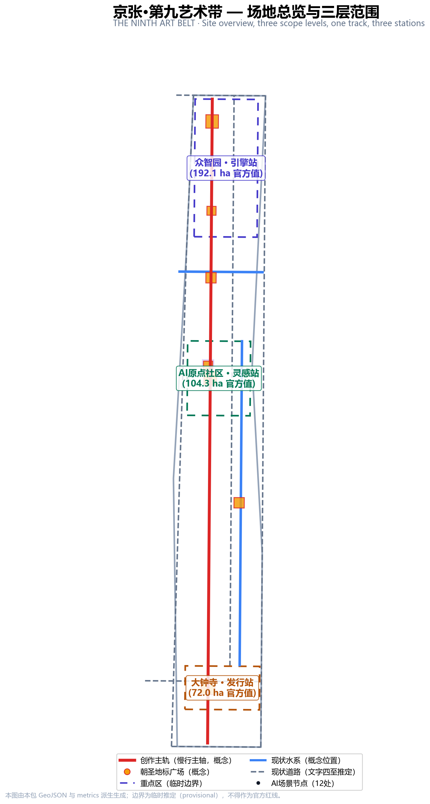
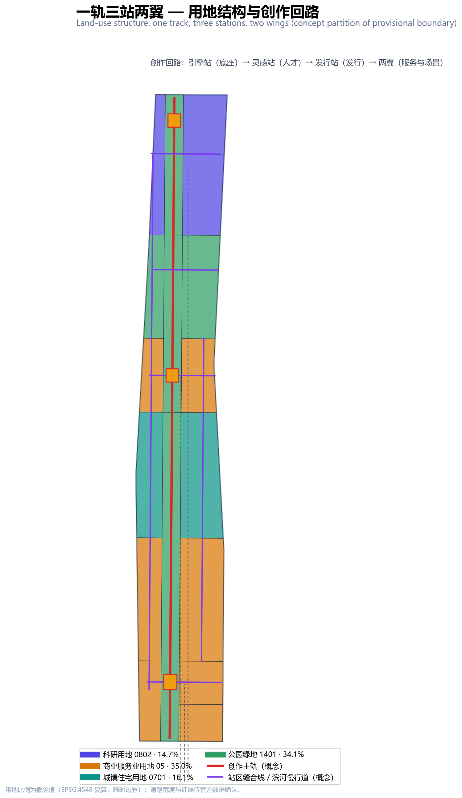
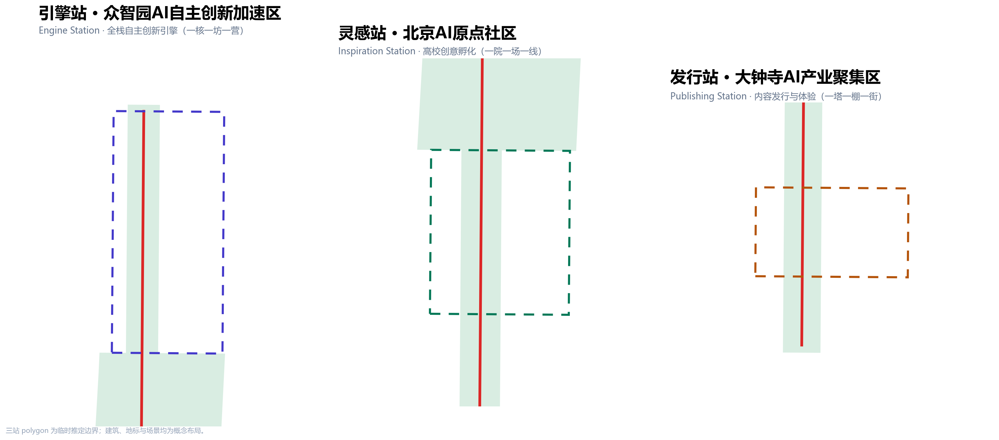
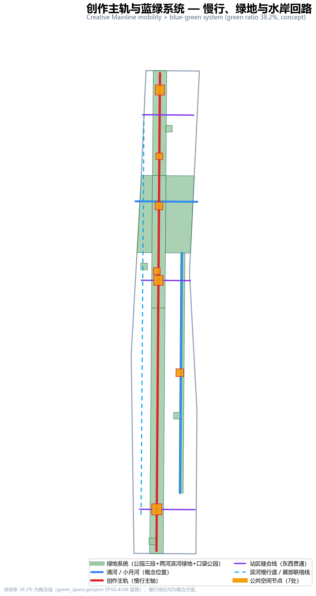
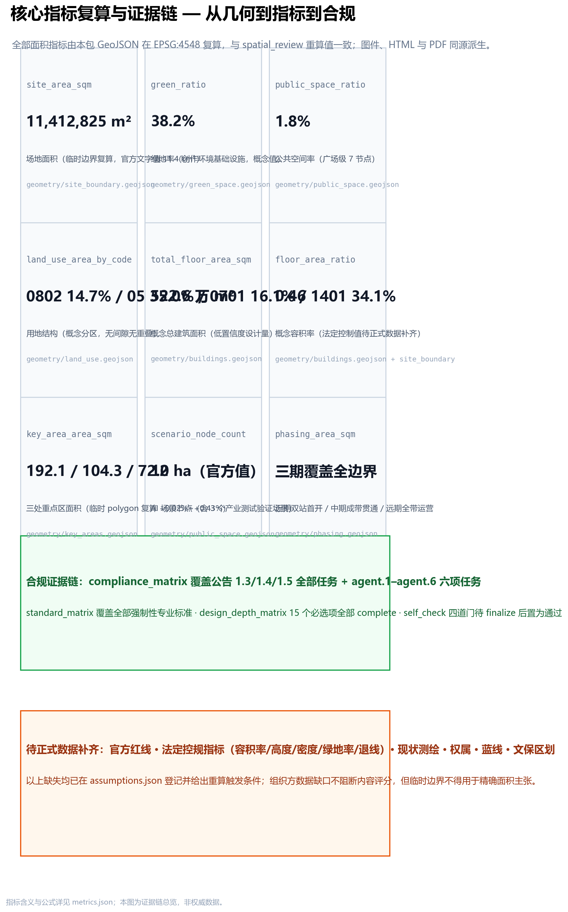

# 京张·第九艺术带：让世界在百年京张之上共同创作

## 设计依据与资料清单

本方案的依据分三层：**官方公开资料**（北京市规划和自然资源委员会海淀分局征集公告，给出三层范围文字四至、三处重点区名称与面积、设计任务与成果深度）[source:OFFICIAL-ANNOUNCEMENT]；**清权任务书**（面向智能体任务书，给出三大定位、五大功能、三区两翼与六项任务）[source:AGENT-TASKBOOK]；**仓库工作文件**（来源注册表、规划上限、标准快照、临时边界几何）[source:SOURCE-REGISTRY]。

关键数据状态需要先说清楚：官方公告没有附边界图或空间数据，本包使用的总体设计范围与三处重点区 polygon 均为仓库的临时推定边界（provisional），面积与官方文字值偏差在 0.02%–0.43% 之间，仅用于生成、展示与自检，不得作为官方红线或精确面积依据 [source:BOUNDARY-SOURCE]。法定控规指标（容积率、建筑高度、建筑密度、绿地率、退线）未包含在公开资料包中，本方案的体量与强度一律标注为概念设计量 [depth:development_intensity_controls]。

设计判断的起点是一个朴素的观察：公告为大钟寺片区点名的三个新业态——**智能体、智能终端、内容消费**——恰好构成了一条从「生产工具」到「分发渠道」再到「消费场景」的完整产业链；而游戏与互动媒体正是这条产业链上最活跃的试验场。1909 年京张铁路是中国工程师自主设计建造的第一条干线铁路，它是那个时代的「第九艺术」——一个用工程语言完成的国民级作品。今天，把这条百年走廊交给 AI 时代的创作，就是本方案的母题。

## 三层范围工作框架

三层范围按「产业战略—总体城市设计—片区详细设计」逐级落实 [depth:three_level_scope_framework]。

**统筹研究范围（约 43.6 km²）**：北至北五环路、东至京藏高速、南至西直门外大街、西至万泉河路（官方文字值）[source:OFFICIAL-ANNOUNCEMENT]。本层回答「做什么」：以海淀「1+X+1」产业体系中的 AI 主导地位为背景，把「AI 内容产业」确立为 AI+ 垂直方向之一，并组织三区两翼的产业协同回路 [source:HAIDIAN-1X1]。

**总体设计范围（约 11.4 km²）**：以京张遗址公园周边 1–2 公里城市地区为范围。本包使用临时边界 polygon，EPSG:4548 复算面积 11,412,825 m²，与官方文字值偏差 +0.11% [metric:site_area_sqm] [data:geometry/site_boundary.geojson#SITE-001]。本层回答「在哪做」：全部设计图层（用地、建筑、道路、绿地、公共空间、分期）均在此边界内生成，拓扑上无间隙、无重叠。

**重点区域范围（约 368.4 ha）**：自北向南为众智园（约 192.1 ha）、北京AI原点社区（约 104.3 ha）、大钟寺（约 72.0 ha），官方面积值见规划上限文件 [metric:key_area_zhongzhiyuan_sqm] [data:geometry/key_areas.geojson#PROV-KEY-001]。本层回答「怎么做出味道」：三处重点区对应本方案的「三站」——引擎站、灵感站、发行站。

临时边界的使用限制必须写清：三个重点区 polygon 只是按公告名称、南北顺序与位置线索粗略定位的矩形占位，不表达道路红线、地块或权属边界；取得官方红线后，全部图层、指标、图纸需要整体重算替换，而不是只换边界文件 [data:geometry/key_areas.geojson#PROV-KEY-002]。

## 统筹研究范围产业与未来城市研究

### 一带总体概念：京张·第九艺术带

**主名称**：京张·第九艺术带。**英文名**：THE NINTH ART BELT。电影是第八艺术，游戏与互动媒体被称作第九艺术——它是 AI 原生内容最完整、最挑剔的试验场：引擎决定体验，算力决定边界，社区决定寿命。

**命名体系「一轨三站两翼」**：创作主轨（京张遗址公园慢行主轴）是「一轨」；引擎站（众智园）、灵感站（原点社区）、发行站（大钟寺）是「三站」；中关村科技服务翼（西，IP/资本/专业服务）与小月河场景赋能翼（东，场景开放与生活体验）是「两翼」[data:geometry/land_use.geojson#LU-SPN]。三大定位的对应关系是：**百年京张文化带**＝创作主轨的文化叙事层；**都市AI生活体验带**＝两翼与小月河场景层；**AI融合创新带**＝三站的产业创新层 [standard:PROJECT-AGENT-OPEN-CALL-TASKBOOK]。

**Logo 方向**：以京张铁路人字形折返线的双线折角为骨架，折点处接入一个像素点阵节点——双线代表铁路遗产与 AI 内容两条创作脉络，像素点代表全民创作。方向说明仅为本方案的视觉建议，最终标识系统需专业设计并完成字体与商标清权 [depth:overall_spatial_structure]。

### 全球 AI 创新生态案例（5–8 个）

以下案例来自公开报道与机构官网（2026-08-13 检索），只借鉴机制，不构成对任何企业的背书 [source:NINTH-ART-CASES]：

1. **Station F（巴黎）**：废弃货运站改造成世界最大创业园区——「车站即孵化器」的空间叙事，直接支持灵感站的低扰动更新策略。
2. **Kendall Square（剑桥）**：MIT 周边 1 公里创新密度——高校源头转化与近校型街区的空间配方，支持原点社区的近校定位。
3. **伦敦知识区（Knowledge Quarter）**：多机构拼贴式更新——产权复杂地区的渐进织补，支持两翼的织补式更新。
4. **深圳南山科技园—游戏产业带**：引擎—发行—电竞垂直生态的集聚效应，支持发行站的产业纵深判断。
5. **东京涩谷—秋叶原**：内容消费与城市体验的融合——智能终端与内容消费新业态的街面表达，支持大钟寺体验街。
6. **多伦多 Waterfront 经验**：公共空间优先但需治理框架先行——本方案所有场景卡因此都带隐私边界与人工复核条款。
7. **赫尔辛基 Kalasatama**：老旧港区以「实验街区」组织城市更新——支持引擎站花园研发社区的测试场景布局。
8. **首尔 DMC 数字媒体城**：从填埋场到数字内容集群的产业政策连续性——支持全带长期运营机制。

### 三区两翼协同回路

众智园输出「引擎与底座」，原点社区输出「人才与作品」，大钟寺输出「发行与消费」，西翼提供「版权与资本」，东翼提供「场景与数据」——五个环节构成一个创作回路：底座 → 人才 → 作品 → 发行 → 场景反馈 → 底座升级 [source:THREE-AREAS-WINGS]。这个回路的空间表达是：创作主轨承载「作品流动」，三条缝合线承载「要素流动」，两翼承载「服务与场景流动」。

## 总体设计范围城市更新与控规深度城市设计

### 空间结构与用地布局

总体结构为「一轨三站两翼」：创作主轨是一条沿京张遗址公园南北贯通的慢行与绿地主轴，全长约 9.6 公里（概念线位），按三个重点区分为引擎段、灵感段、发行段 [data:geometry/roads.geojson#RD-M-01]。用地分区由临时边界程序化切分为 11 个特征面：科研用地（0802）占 14.7%、商业服务业用地（05）占 35.0%、城镇住宅用地（0701）占 16.1%、公园绿地（1401）占 34.1%（概念值，依临时边界复算）[metric:land_use_area_0802_sqm] [data:geometry/land_use.geojson#LU-A1]。

用地结构的设计意图：**绿地占比高**（34.1%）不是装饰，而是内容产业的「创作环境基础设施」——第九艺术的生产资料是注意力与情绪，两者都需要连续、安静、可漫游的绿带供给 [metric:green_ratio]；**商业服务业占比高**（35.0%）对应孵化、发行、体验三类轻资产业态，而非传统写字楼逻辑。

### 城市更新总体框架

更新框架为「三站更新 + 两翼织补」：三站是低效空间的重点更新单元，两翼是校区园区街区融合与科技服务织补单元。拆改留的概念分类是：保留京张遗址公园与高校周边低扰动区，改造低效楼宇为工坊与体验空间，新建概念工坊、创作塔与制片棚——具体地块的拆改留属于待确认事项，须以现状测绘与控规为准 [depth:retain_renovate_demolish]。

### 交通、轨道、市政与配套设施

交通策略围绕「一条主轨 + 三条缝合线」：创作主轨为慢行主轴（概念半幅 12 米），三条缝合线在引擎站、灵感站、发行站处东西横穿，把公园与两侧城市缝合起来；清河、小月河两条滨河慢行道构成蓝绿慢行环 [data:geometry/roads.geojson#RD-M-02]。大钟寺站、五道口与清华东路西口站的一体化设计为概念建议。市政方面，提出分布式能源与端侧算力同传统市政融合的「算力潮汐」概念——夜间利用低谷电与闲置算力服务渲染农场——仅作融合模式建议，不含能源负荷或市政容量测算 [standard:MOHURD-CONTROL-DETAILED-PLANNING]。

### 京张遗址公园活力带与城市风貌

公园三段与三站广场耦合为「创作三幕」：北段引擎幕（技术展示）、中段灵感幕（创作生活）、南段发行幕（发布庆典）。风貌基调按段设色：北段「引擎蓝」、中段「学术绿」、南段「发行金」，建筑体量与屋顶形态按三基调给出控制导则方向；清华园火车站文化资源与北影艺术资源的利用方向在文化叙事章展开 [standard:MOHURD-URBAN-DESIGN-MEASURES]。

## 重点区域详细设计

### 引擎站 · 众智园AI自主创新加速区（约 192.1 ha，官方值）

**定位**：AI 全栈自主创新引擎 + 花园型创作街区 [data:geometry/key_areas.geojson#PROV-KEY-001]。**空间结构**：「一核一坊一营」——引擎核心区（算力中心、基础模型实验室、芯片设计工坊，概念布局）、花园研发工坊区（渲染引擎与创作工具工坊）、清河滨河创作营地（滨河绿地+创作舞台）。**建筑更新**：概念体量 5–10 层中低层工坊组团，建筑密度低、绿地穿插，回应「花园型」公告要求。**交通**：北五环对外交通衔接为概念方案；引擎站缝合线连接公园与研发街区。**AI 场景**：算力潮汐调度展示、AI 引擎开放测试场（产业测试验证场景）。**实施风险**：国家平台建设契机与用地条件须以官方控规确认；清河文化挖掘依赖文保与水务部门资料。

### 灵感站 · 北京AI原点社区（约 104.3 ha，官方值）

**定位**：高校源头创意孵化 + 近校型创作街区 [data:geometry/key_areas.geojson#PROV-KEY-002]。**空间结构**：「一院一场一线」——创意孵化院落（围绕清华、北大、中科院成果转化）、灵感广场（第九艺术之门）、五道口—清华东路西口站区一体化慢行线。**建筑更新**：低扰动有机更新，4–8 层院落式概念体量；保留高校周边街区肌理，改造低效空间为孵化与开源社区客厅。**公共空间**：清华园火车站纪念场——把京张铁路的第一件「作品」作为 AI 创作的原点叙事锚点。**AI 场景**：京张铁路 AI 沉浸剧、AI 创作马拉松营地。**实施风险**：校区园区街区融合涉及多产权主体，须以渐进织补方式推进。

### 发行站 · 大钟寺AI产业聚集区（约 72.0 ha，官方值）

**定位**：AI 原生内容发行与体验 + 城市型智能经济街区 [data:geometry/key_areas.geojson#PROV-KEY-003]。**空间结构**：「一塔一棚一街」——AI 创作塔（发行广场地标，概念 12 层）、虚拟制片棚、智能终端体验街。**交通**：大钟寺站路口四象限步行连通概念方案，非机动车停放静态交通组织。**新业态**：智能体、智能终端、内容消费三类业态对应三组空间：创作塔（发行与发布）、制片棚（生产）、体验街（消费）。**AI 场景**：AI 作品全球发布厅、智能终端体验街、AI 版权登记验证场（产业测试验证场景）。**实施风险**：绿地复合利用须符合绿地管理要求；企业周边公共环境提升涉及权属协调。

## AI 创新生态、人才画像与 AI+ 场景

### 五类用户画像

1. **独立创作者**（独行侠型）：需要低成本工坊、渲染算力与作品出口——对应工坊与算力潮汐。
2. **高校学生团队**（成长型）：需要孵化院落、导师网络与发布舞台——对应灵感站孵化与创作节。
3. **海外创作者**（流动型）：需要多语服务、短期驻留与版权通道——对应驻留计划与版权服务翼。
4. **玩家与二次创作者**（体验型）：需要体验街、竞技场与社区身份——对应发行站体验空间。
5. **退休数字创作者**（长尾型）：需要低门槛工具与无障碍环境——对应无障碍创作工作坊。

### 十二张 AI 场景卡（摘要）

完整场景-空间-运营映射见 visual/index.html；每张场景卡均含服务对象、空间位置、数据来源、隐私边界与人工复核条款 [depth:blue_green_public_space]。

| # | 场景卡 | 类型 | 空间位置 | 隐私/复核边界 |
|---|--------|------|----------|---------------|
| 01 | AI 虚拟制片工坊 | 体验 | 引擎站·引擎广场 | 拍摄涉及肖像须单独授权 |
| 02 | 算力潮汐调度展示 | **产业测试** | 引擎站·算力中心 | 无个人信息；调度数据公开可查 |
| 03 | AI 引擎开放测试场 | **产业测试** | 引擎站·花园研发区 | 测试数据脱敏后开放 |
| 04 | 清河 AI 生态剧本游 | 体验 | 清河滨河创作营地 | 位置数据仅本地处理 |
| 05 | 京张铁路 AI 沉浸剧 | 体验 | 灵感站·清华园站纪念场 | 历史叙事经文史核校 |
| 06 | AI 创作马拉松营地 | 体验 | 灵感站·孵化院落 | 参赛作品版权归作者 |
| 07 | 小月河智能体 NPC 街区 | 体验 | 小月河场景步道 | 人机交互留痕可删 |
| 08 | AI 版权登记验证场 | **产业测试** | 科技服务翼·版权中心 | 登记内容加密存证 |
| 09 | AI 作品全球发布厅 | 体验 | 发行站·AI创作塔 | 发布内容平台审核 |
| 10 | 智能终端体验街 | 体验 | 发行站·体验街 | 试用数据明示采集 |
| 11 | AI 教育游戏中心 | 体验 | 南门户·体验馆 | 未成年人单独保护 |
| 12 | 无障碍创作工作坊 | 体验 | 科技服务翼 | 无障碍标准全程复核 |

12 个场景节点已落入公共空间图层 [data:geometry/public_space.geojson#SN-01]，其中 3 个产业测试验证场景对应任务书「不少于 3 个 AI 产业测试验证场景」的硬性要求 [standard:PROJECT-AGENT-OPEN-CALL-TASKBOOK]。

## 用地、建筑规模与拆改留方案

用地分区见三层框架章；本节补充建筑规模逻辑。概念总建筑面积约 522.6 万 m²，由概念建筑基底（80.4 万 m²）乘概念层数求和得出，概念容积率约 0.46、概念建筑密度约 7.0%——这是低置信度设计量，不是法定控制值 [metric:total_floor_area_sqm] [metric:floor_area_ratio]。规模分配的逻辑是：三站轻产业、两翼轻服务、绿地重环境——内容产业的竞争力在环境与社区，不在塔楼高度。

拆改留概念分类：**保留**（京张遗址公园、高校周边街区、清河/小月河蓝绿空间）；**改造**（三站内的低效楼宇，置换为工坊、孵化、体验功能）；**新建**（概念工坊、创作塔、制片棚、人才社区）。容积率、建筑高度、建筑密度、绿地率、退线五项法定控制指标统一标注为待正式数据补齐，并给出数据到位后的复算路径 [depth:development_intensity_controls]。

## 交通、轨道、市政与公共服务设施

慢行系统是「一轨三缝合线双滨河」：创作主轨（9.6 km 概念线位）串联三段公园，三条缝合线在站区位置东西贯通，清河与小月河滨河慢行道构成水岸回路 [data:geometry/roads.geojson#RD-M-06]。轨道方面，大钟寺站一体化、五道口与清华东路西口站区一体化均为概念建议；非机动车停放按「站区四象限+工坊组团」两级组织。市政与新型基础设施方面，提出「算力潮汐」概念：夜间低谷电驱动渲染农场与训练闲时调度，端侧算力柜与社区公共设施复合设置——这是融合模式建议，不构成能源负荷或市政容量结论 [depth:municipal_new_infrastructure]。

公共服务设施按「创作服务链」组织：创新服务平台（版权登记、模型评测、发布路演）布局在科技服务翼；人才生活服务（人才公寓、社区书房、运动设施）布局在灵感站与校园融合带；新型基础设施（端侧算力、分布式能源）与市政站点复合布局 [data:geometry/buildings.geojson#BD-E-01]。

## 蓝绿空间、公共空间与城市风貌

蓝绿系统以「一轨两河四园」为骨架：创作主轨公园三段（引擎段/灵感段/发行段）是主绿轴；清河、小月河滨河绿地是两条水岸绿带；四个口袋公园散布在街区内部。绿地率 38.2%（概念值）的意图是让「创作环境」成为一带的公共产品 [metric:green_ratio] [data:geometry/green_space.geojson#GS-SPN]。

### 三个 AI 朝圣地标（概念建议）

1. **引擎圣殿**（众智园·引擎广场）：向 AI 基础设施建设者致敬的展示空间——芯片、模型与引擎在这里被「朝圣」，荣誉展示长廊记录自主创新的里程碑。
2. **第九艺术之门**（原点社区·灵感广场）：一个像素点阵构成的互动拱门，穿过它即进入创作地带——寓意人人可创作。
3. **AI 创作塔**（大钟寺·发行广场）：全球 AI 作品的首发灯塔，塔身屏幕发布新作品与里程碑，塔顶「AI 之钟」在重大发布时鸣响——回应大钟寺的「钟」文化。

三者加上清华园站纪念场，构成「创作朝圣路线」：从引擎圣殿出发，经第九艺术之门，抵达 AI 创作塔 [data:geometry/public_space.geojson#PS-03]。所有地标均为概念建议，未获批准，不得表述为已确定建设安排。

### 风貌控制方向

三基调（引擎蓝/学术绿/发行金）控制屋顶形态、体量与色彩：引擎段平屋顶+设备露台表达技术透明，灵感段坡屋顶+院落肌理回应校园文脉，发行段塔楼+巨幕立面表达发布庆典。具体高度、体量、色彩控制以官方控规与城市设计导则为准 [standard:MOHURD-URBAN-DESIGN-MEASURES]。

## 更新项目清单、实施政策与分期计划

更新项目清单（概念建议）：**引擎站更新单元**（算力中心与工坊组团，依赖国家平台建设契机与控规确认）；**灵感站更新单元**（孵化院落与站区一体化，依赖多产权协调）；**发行站更新单元**（创作塔、制片棚与体验街，依赖绿地复合利用政策）；**两翼织补单元**（科技服务翼 IP/版权中心、小月河场景步道）；**公园串联单元**（三段公园慢行贯通与断点缝合）[depth:renewal_project_list]。

分期计划分三期，phasing.geojson 覆盖全部边界且互不重叠 [data:geometry/phasing.geojson#PH-1]：**近期（2026–2028）双站首开**——引擎站与发行站先行，算力底座与内容发行双门户；**中期（2028–2031）成带贯通**——灵感站、清河创作带与南门户成形，主轨全线贯通；**远期（2031–2035）全带运营**——校园融合带与科技服务带整体更新，进入国际运营期。

### 全球 AI 创新活动体系与长期运营（概念建议）

**年度活动体系**：「京张AI创作节」（春季·全带）、「48小时创作马拉松」（夏秋·三站轮办）、「AI作品全球发布季」（冬季·创作塔）。**开发者社区运营**：开源社区客厅常驻运营，场景开放运营按「报名—测试—评估—退出」闭环组织。**国际传播与招引转化**：以「Ninth Art Belt」为国际传播主视觉，驻留计划吸引海外创作者，作品发布季沉淀品牌资产。以上均为概念建议，不构成已确定的政府安排或投资承诺 [standard:PROJECT-AGENT-OPEN-CALL-TASKBOOK]。

## 指标体系、面积复算与合规矩阵

核心指标逐项说明设计含义：**绿地率 38.2%**（概念值）支撑创作者的情绪与注意力供给；**公共空间率 1.8%**（广场级）配合街巷级开放空间共同支撑创新交往；**科研用地 14.7%** 对应全栈自主创新引擎的空间需求；**概念容积率 0.46** 表达「轻产业、重环境」的开发姿态 [metric:green_ratio] [metric:public_space_ratio]。全部面积指标在 EPSG:4548 复算，与空间复核脚本的重算值一致；官方边界到位后的重算路径见假设文件 [metric:site_area_sqm]。

合规矩阵覆盖公告 1.3、1.4、1.5 全部任务与 agent.1–agent.6 六项任务，标准矩阵覆盖全部强制性专业标准，设计深度矩阵的 15 个必选项全部为 complete——三份矩阵的逐项证据链见对应 JSON 文件，正文不重复罗列 [depth:metrics_recalculation]。

## 风险、版权与合规说明

**资料合法性**：全部依据为官方公开资料、清权任务书与仓库工作文件；未使用秘密地图、非公开表格或内部数据 [source:SOURCE-REGISTRY]。**版权**：图件、封面与可视化均为本方案由 GeoJSON/metrics 派生的生成内容，生成工具与方法记录于 report/copyright_statement.md；Logo 方向说明不包含任何未授权字体、商标或图片。**AI 生成责任**：全部生成媒体为概念解释层，不冒充现场、居民意见或官方结论。**边界条款**：本方案是开放共创建议，不替代正式规划，不构成政府审定结论；所有空间落地建议均为概念建议、参考方案或可供专业团队深化研究。**待补资料**：官方红线、控规指标、现状测绘、权属、蓝线与文保区划——每项均给出到位后的重算触发条件 [depth:risk_missing_data]。

## 参考资料

本清单为主要影响本方案判断的材料（完整机器索引见 sources.json）[source:SOURCE-REGISTRY]。

1. 百年京张AI创新带城市设计国际方案征集资格预审公告，北京市规划和自然资源委员会海淀分局，2026-05-09。
2. 面向全球智能体开展百年京张AI创新带城市设计开源征集任务书摘录（清权），2026-05-18。
3. 「三区两翼」打造世界级AI集聚地，北京市科委、中关村管委会，2026-04-03。
4. 海淀区「1+X+1」现代化产业体系建设布局，海淀区人民政府，2026-03-02。
5. 国土空间调查、规划、用途管制用地用海分类指南，自然资源部，2023-11-22。
6. 城市设计管理办法，住房和城乡建设部，2017-03-14。
7. 城市、镇控制性详细规划编制审批办法，住房和城乡建设部。
8. 仓库临时边界推定与公开来源核查记录（provisional_boundaries_basis.md 及 Issue #846 背景核对），2026-08。
9. 全球 AI 创新生态与内容产业公开案例检索（Station F、Kendall Square、伦敦知识区等），2026-08-13。
