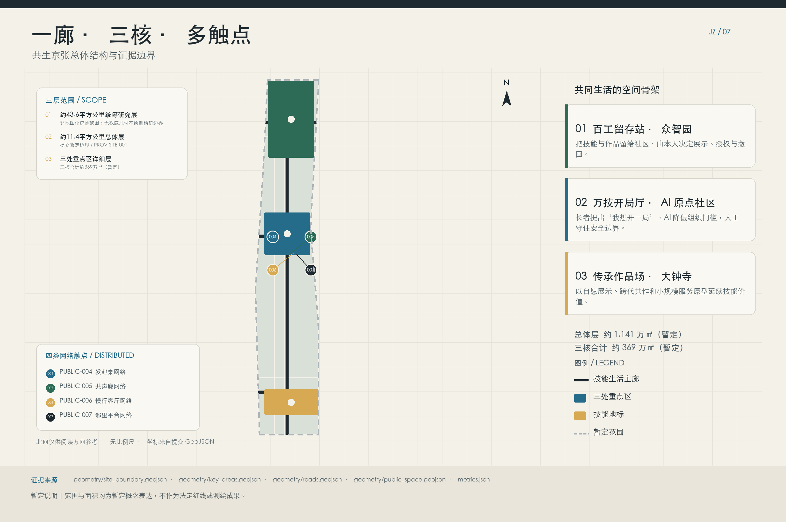
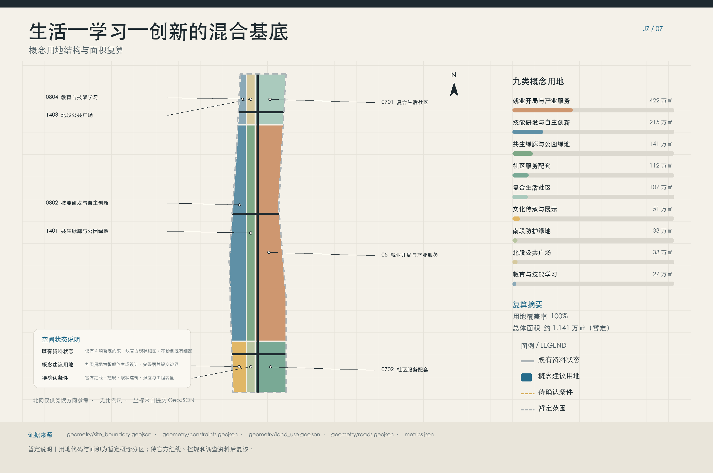
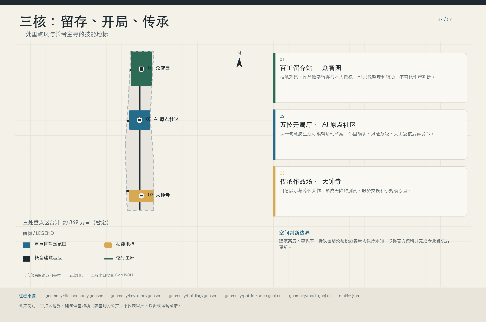
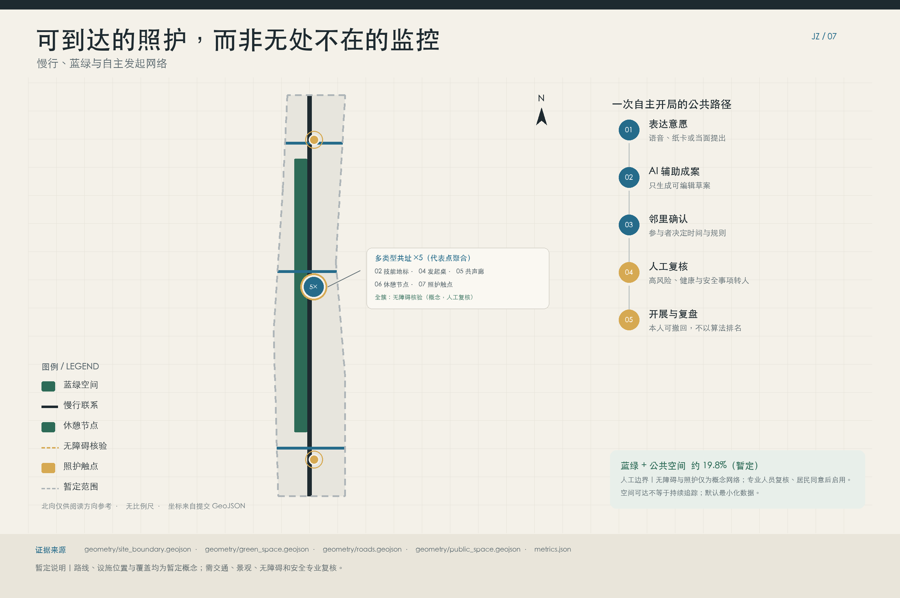
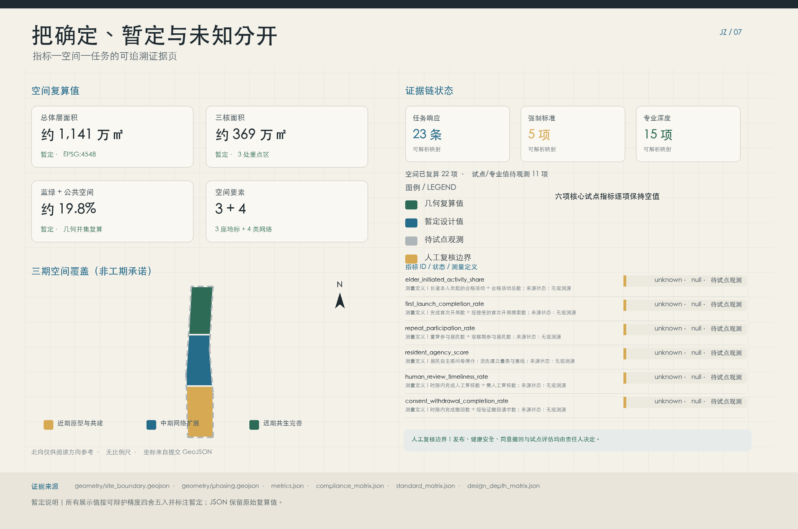

# Coexistence Jing-Zhang: Skill Retention and Autonomous Community Initiation

**Jingzhang Care Commons**　｜　**I Initiate, We Begin.**

## Executive Summary and Conceptual Boundaries

This proposal rewrites "cared-for elders" as experienced, productive community actors who can initiate public life. AI only lowers four barriers: converting a natural language statement into an editable activity proposal; connecting with acquaintances or those with shared interests after obtaining individual consent; coordinating venues, volunteers, assistive devices, transportation, and companionship; and providing explainable safety tips during specific activities. It does not continuously track residents, perform emotional scoring, credit ranking, or automated diagnoses or black-box eligibility determinations. People always decide whether to initiate an activity, whom to invite, what to make public, and when to withdraw.

Overall concept is "a coexisting care corridor, three capability cores, and multiple community touchpoints": the Jing-Zhang Heritage Park and its adjacent slow-moving blue-green system are suggested as a daily interaction corridor; the Zhongzhiyuan "Hundred Crafts Preservation Station," the Beijing AI Origin Community "Ten Thousand Skills Opening Hall," and the Dazhongsi "Inheritance Worksite" are tasked with preserving, initiating, and displaying these three capabilities; four types of distributed network touchpoints are formally named the Initiating Table Network, Resonant Corridor Network, Slow-Moving Living Room Network, and Neighboring Platform Network. The three landmarks and four types of network characteristics collectively define seven **conceptual Public Space project characteristics**, not seven operational physical nodes. [data:geometry/public_space.geojson#PUBLIC-001] [data:geometry/public_space.geojson#PUBLIC-004] [metric:community_touchpoint_count]

The scope and values must be demarcated in the introductory paragraph: The announcement provides three layers of research tasks. This submission's overall boundary and three key polygon areas are derived from provisional, rough data from the repository, all of which are of low confidence and informal control boundaries. [source:DATA-SRC-OFFICIAL-ANNOUNCEMENT-20260509] [source:DATA-SRC-PROVISIONAL-BOUNDARIES-20260605] [data:geometry/site_boundary.geojson#PROV-SITE-001] The current geometric calculation is approximately 1,141 hectares and is only for organizational purposes and technical self-inspection; after obtaining the formal georeferenced boundaries, the land use, roads, buildings, green spaces, Public Spaces, phased and total area ratios must be recalculated. [metric:submitted_site_area_sqm] [depth:risk_missing_data]

## Design Basis and Source List

### Classification of Documentation

The formal task instructions include the call for entries, the task brief for the agent-based task, and the public standards issued by the housing and urban-rural development and natural resources authorities; temporary rough boundaries can only support concept generation; seven global case studies are provided for background comparison only. The submission package should register sources in `sources.json`, declare gaps in `assumptions.json`, correspond to the task in `compliance_matrix.json`, and constrain professional depth with `standard_matrix.json` and `design_depth_matrix.json`. Citations to sources, standards, depth, data, and metric evidence in the body of the text can reference these machine-readable records.

Formally based on: [source:DATA-SRC-OFFICIAL-ANNOUNCEMENT-20260509], [source:DATA-SRC-AGENT-TASKBOOK-20260518], [source:DATA-SRC-MOHURD-URBAN-DESIGN-MEASURES], [source:DATA-SRC-MOHURD-CONTROL-DETAILED-PLANNING], [source:DATA-SRC-MNR-LAND-USE-CLASSIFICATION-202311]. Corresponding to five mandatory standards for [standard:PROJECT-OFFICIAL-ANNOUNCEMENT], [standard:PROJECT-AGENT-OPEN-CALL-TASKBOOK], [standard:MOHURD-URBAN-DESIGN-MEASURES], [standard:MOHURD-CONTROL-DETAILED-PLANNING], and [standard:MNR-LAND-USE-CLASSIFICATION-GUIDE]. Local description pages specifying the depth of architectural design documents only record "official document missing" and are not cited as formal authoritative standards.

### Missing data and lack of discipline

Missing formal overall and key area polygon definitions, current land parcels and ownership, building inventory, statutory control plan, municipal utility lines, road right-of-way and traffic operations, fire and flood prevention, cultural heritage boundaries, facility capacity, and resident baseline. Hence, this plan only provides an Urban Design structure, verification methods, and conceptual projects, but does not specify statutory Floor Area Ratio, height, setback, demolition targets, or engineering alignments. [depth:existing_conditions_diagnosis] [data:geometry/constraints.geojson#PROV-SITE-001]

Design judgments follow a four-step Evidence Chain: first, state the intention, then provide the spatial rationale, next reference the geometry/indicators/standards, and finally list the gaps. For example, the intention behind "organizing a slow-moving living room along the corridor" is to extend activities from indoor spaces to stay-on paths; the rationale is that the conceptual green space and Public Space are within the same Provisional Boundary; the evidence includes [data:geometry/green_space.geojson#GREEN-001], [data:geometry/public_space.geojson#PUBLIC-006], and [depth:blue_green_public_space]; the gaps are that the current trees, accessibility slopes, cross-street, and river conditions still need to be investigated.

## Three-Level Scope Framework

Coordinated Research Area covers approximately 43.6 square kilometers, used for discussions on industrial ecology, future cities, and service integration, without adding new control lines; Overall Design Area, based on the temporary polygon of the warehouse, is approximately 1,141 hectares, used for organizing conceptual land uses, corridors, and projects; three key areas, with a temporary polygon totaling approximately 369 hectares, have a recalibration difference compared to the announced figures, which must be calibrated after the formal boundaries are in place. [source:DATA-SRC-OFFICIAL-ANNOUNCEMENT-20260509] [data:geometry/key_areas.geojson#PROV-KEY-001] [metric:key_area_total_sqm]

"Jing-Zhang Co-Existence Careway" is not an additional road boundary, but rather a pathway that connects Jing-Zhang culture, blue-green slow travel, and community services; "Three Capability Nuclei" separately handle skill archives, activity kick-offs, and work dissemination; "Multiple Community Touchpoints" approach residents' daily lives through four replicable components. The three-layer relationship is: the coordinating layer determines the urban issues of "elderly subjectivity and all-age collaboration"; the overall layer translates these issues into the Careway, Capability Nuclei, Touchpoints, and update list; the key area layer verifies these through landmarks, ground-level spaces, slow travel interfaces, and pilot processes. [depth:three_level_scope_framework] [depth:overall_spatial_structure]

The provisional land-use layer is fully covered by nine conceptual zones, encompassing the Provisional Boundary with a coverage rate of 100%, which is only a topological self-check result and does not represent the current land-use survey or the statutory Land-Use Plan. [data:geometry/land_use.geojson#LU-001] [metric:land_use_coverage_ratio] After replacing the formal polygons, the edge units must be re-divided and the three key areas, phases, and all areas must be re-verified.

## Coordinated Research Area: Industry and Future City Research

### Industrial and Urban Strategy

"Jing-Zhang Coexistence" extends the full-stack AI self-innovative chain from a single enterprise chain to a loop of "technology research and development—public service validation—residents' joint governance—cultural dissemination." The three key positions are defined as the "Innovative Self-Experimentation Belt, Full-Age Coexistence Living Belt, and Jing-Zhang Cultural Narrative Belt"; while the five functions include research and development transformation, public validation, talent living, skill inheritance, and international exchange. [source:DATA-SRC-AGENT-TASKBOOK-20260518] [standard:PROJECT-AGENT-OPEN-CALL-TASKBOOK]

#### Three Zones and Two Wings Ecological Map

| Zone/Wing | Ecological Role | Interface with Other Nodes | Clear Boundaries |
| --- | --- | --- | --- |
| Zhongzhiyuan | A concept bearing area for full-stack R&D validation, safety, and standard collaboration, and it connects to the Hundred Crafts Retention Station | It provides explainable tool prototypes to the Origin Community, outputs controlled test versions to the Little Moon River Wing, and submits compliance and intellectual property issues to the Technology Service Wing | It does not name or assume tenant enterprises, nor does it fabricate computational power, investment, or certification capabilities |
| AI Origin Community | Open Source Transformation, Talent Living, and "Ten Skills Opening Hall" Near-Campus Collaboration Zone | Receives R&D prototypes, converts resident/talent needs into testable tasks, and delivers clearly authorized outcomes to Dazhongsi for dissemination | Does not assume that university outcomes, talent numbers, or space supply have been secured |
| Dazhongsi | Urban Interface for Intelligent Terminals, Content Experience, Inherited Works, and International Communication | Showcase validated and authorized outcomes, and feed user feedback back into R&D and scenario wings | No promises for corporate success, foot traffic, exhibitions, data transactions, or commercial achievements |
| Xiaoyue River Scenario Enablement Wing | organize public service scenarios, accessible experiences, and three controlled pilots along the blue-green Public Space | send real but minimized issues into a sandbox, feedback Human Review results through triage | not an open collection zone; do not continuously track residents or extrapolate pilot results |
| Zhongguancun Technology Services Wing | independently serves as the coordinating interface for compliance, knowledge services, intellectual property, and capital services | organizes issue lists, source chains, rights verification, financing materials, and professional referrals for the three cores and scene wings | only coordinates services without substituting for approval, legal advice, intellectual property rights confirmation, investment decisions, or funding commitments |

This map is not a directory of companies or a status quo resource map, but a workflow between five roles: **Zhongzhiyuan R&D Validation → AI Origin Community Transformation and Talent Collaboration → Xiaoyue River Scenario Enablement Wing Controlled Validation → Dazhongsi Authorization Dissemination → Zhongguancun Technology Services Wing Integrating Compliance/Knowledge/IP/Capital Services, and feeding back issues to the front end**. The three cores are approached through "a coexistent care corridor" that is integrated into daily life, while the service wings are expressed through professional interfaces rather than additional land plots. [depth:overall_spatial_structure]

#### Nine Ecological Mechanism Systems

| Mechanism | Spatial Interface | AI Assistance | Human/Governance Boundaries | Evidence/Data Status | Professional Follow-Up |
| --- | --- | --- | --- | --- | --- |
| Land | Nine Conceptual Land Use Zones and Three Key Areas | To standardize rules for different functional requirements and identify conflict items | Planning and ownership judgments to be completed by the relevant authorities and professional teams; AI undefined land use nature | Only temporary polygons and conceptual zones, ownership/control plan unknown | Import formal boundaries, cadastral data, current conditions, and control plans for recalculations and review |
| Space | Co-habitation Care Corridor, Three Cores, Four Types of Community Touchpoints | Auxiliary checks for adjacency, accessibility, scene—space mapping, and gaps | Urban Design, accessibility, fire safety, and Public Space decisions are reviewed by both professionals and residents. | Geometry is for low-confidence design suggestions, lacking in-site surveying and facility investigation. | Conduct a current condition diagnosis, pedestrian audit, zoning detailed design, and engineering feasibility study. |
| Industry | Collaborative Chain of Zhongzhiyuan R&D, Yuanchuan Transformation, and Dazhongsi Experience Dissemination | Organizing Capacity—Needs—Services Matrix and Explanatory Referral Draft | Does Not Automatically Screen Enterprises, Evaluate Qualifications, Commit to Recruitment, or Predict Output Value | Only Task Book Directions, No Enterprises, Output Value, or Supply Chain Baseline | Conducted by the Industry Research Team for Public Data Verification, Interviews, and Supply Chain Research |
| Funding | Capital service windows for Zhongguancun Technology Services Wing and project phase-by-phase list | Generate cost items, dependencies, risk scenarios, and material integrity checks | Investment, financial, procurement, and financing decisions are made by the legally responsible entity; no black-box credit extension | No investment amount, funding source, budget, or approved policy | Conduct investment estimates, financial/law due diligence, procurement, and operational model arguments |
| Talent | AI Origin Community, Three Core Workshops, and Skill Milestones | To assist in step-by-step skill descriptions, course drafts, and opportunity matching with individual consent | No credit ranking, employment qualifications, or vulnerability scoring; individuals decide on the scope of display and engagement | No talent scale, supply and demand, or participation baseline; pilot metrics are unknown | Conducting talent service research, labor and volunteer rules, inclusivity, and privacy assessments |
| Computational Power | Zhongzhiyuan Controlled Sandbox, Tri-core Exit Terminal, and Proposed Edge Nodes | Auxiliary Task Queueing, Resource Usage Instructions, Design of Version/Energy Consumption Logs | Capacity Procurement, Model Deployment, Network and Security Approved by Technical and Governance Responsibility Holders | Lack of Computational Power Capacity, Energy Consumption, Network, Supplier, or Security Level Data | Completion of Capacity Calculation, Energy Communication, Cybersecurity, Disaster Recovery, and Procurement Argumentation |
| Data | Compliance/Knowledge/IP Interface and Authorization Directory for Zhongguancun Technology Services Wing | Auxiliary Source Annotation, Consent Validation, Minimum Field and Withdrawal Propagation Checks | Data Access, Sharing, Retention, and Rights Determination are Managed by Data Protection, Records, and Legal Personnel | No Resident Data Authorization, Formal Directory, or Sharing Interface; Only Governance Rules are Defined | Create Data Inventory, Impact Assessment, Authorization Agreements, Retention Plans, and Independent Audits |
| Scenario | Xiaoyue River Scenario Enablement Wing, Corridor Touchpoints, and Three-Core Controlled Pilot | Draft Programming Activities, Resource Recommendations, and Activity-Level Safety Alerts | Release, Medical, Safety, and Emergency Actions Decided by Residents/Staff/Experts; Failover to Human | 12 Cards for the Design Proposal, 6 Result Indicators with No Baseline | Complete Small-Sample Pilot Proposal, Ethical Safety Review, Stop Thresholds, and Evaluation Design |
| Services and Governance | The Zhongguancun Technology Services Wing runs through the service desks of the three cores and the Xiao Yuehe Wing | Aggregate compliance, knowledge, IP, and capital service issues and generate auditable referral forms | The service wing does not replace approval, certification, legal or financial advice, or government commitments | No designated operating entity, service catalog, SLA, or policy authorization has been specified | Define responsibility matrices, professional institution access criteria, appeals, audits, and long-term operational agreements |

Spatially, the industrial service land use, community life, and public cultural zones are merely conceptual supply structures: code 05 covers approximately 422 hectares, code 0701 covers approximately 107 hectares, code 0702 covers approximately 112 hectares, code 0802 covers approximately 215 hectares, code 0803 covers approximately 51 hectares, and code 0804 covers approximately 27 hectares. All these are recalculated within the regularized design zones within the Provisional Boundary and should not be understood as the current status or statutory classification. [metric:land_use_05_area_sqm] [metric:land_use_0701_area_sqm] [metric:land_use_0702_area_sqm] [metric:land_use_0802_area_sqm] [metric:land_use_0803_area_sqm] [metric:land_use_0804_area_sqm]

Future city strategies embed digital capabilities into community kiosks, public living rooms, and reversible relationship networks. Technical teams provide explainable tools and interfaces; community organizers establish activity rules; residents decide on content and visibility; professionals handle medical, safety, legal, and planning judgments. Value from industry comes from authentic but controlled public problem validation, rather than turning residents' lives into unbounded data sources.

### Brand, Logo, and Cultural Narrative

**Chinese Name:** "Shengong Jing-Zhang: Skill Retention and Autonomous Community Launch," **English Name:** "Jing-Zhang Care Commons," **Slogan:** "I Initiate, We Launch." The cultural thread is "Autonomous Construction—Innovative Self-Initiative—Autonomous Living": the autonomous construction spirit of the Jing-Zhang Railway, carried through the self-innovative efforts of Zhongguancun, now embodied in residents' autonomous initiation of daily life. The logo is suggested to feature two rail lines opening outward and forming a round table; the railway charcoal ash as the base, the community's pine green representing care and eternal youth, and the mileage amber symbolizing each launch. All text, graphics, and fonts must be original or licensed, and cannot directly use corporate logos or historical photos. [depth:height_massing_character]

## Overall Design Area: Urban Renewal and Regulatory-Plan-Level Urban Design

Overall structure is suggested as a "Site Heritage—Blue-Green Slow Travel Composite Corridor + Three Capability Nuclei + Community Ground Floor Touchpoints + Industrial Service Horizontal Connections." The design intention is to transform the large-scale industrial area into a walkable, stoppable, and initiatable small-scale public interface; the spatial rationale is that the existing submitted layers can verify the land use, green spaces, Public Spaces, Building Footprints, and phased developments; evidence includes [data:geometry/land_use.geojson#LU-005], [data:geometry/buildings.geojson#BLDG-001], and [data:geometry/phasing.geojson#PHASE-001]; the gap is that the land ownership, current building values, and control plan conditions have not been resolved. [standard:MOHURD-CONTROL-DETAILED-PLANNING] [depth:land_use_layout]

Urban Renewal adopts an "operate first, then make minor adjustments, and finally deepen professionally" reverse calibration: in the short term, use movable furniture, signage, and booking mechanisms to test stay and start-up; only after validation should the first-floor renovation, accessibility continuity, and blue-green nodes be studied. Content involving roads, waterways, tracks, municipal, or construction works must be reviewed by the corresponding professional teams. The conceptual Building Footprint is approximately 9.5 hectares, merely indicating three demonstrative design footprints, neither representing the current building volume nor allowing the deduction of total building scale. [metric:building_footprint_area_sqm] [depth:development_intensity_controls]

The Floor Area Ratio, total floor area, Building Coverage Ratio, road area, and road area ratio are currently unknown; these can only be calculated after obtaining the formal control plan, building inventory, and traffic data. [metric:floor_area_ratio] [metric:total_floor_area_sqm] [metric:building_density] [metric:road_area_sqm] [metric:road_area_ratio] These five metrics should not be filled in with estimated values to avoid the concept plan becoming pseudo-precise.

## Detailed Design of Key Areas

### Zhongzhiyuan: Hundred Crafts Retention Station

Positioned as an interface for full-stack self-innovation and residents' skill portfolios. The spatial structure suggests that the first floor near Qinghe and the park public interface be designated as a "retention—display—teaching" continuous belt. The Hundred Crafts Station provides recording, scanning, workpiece photography, and small workshops; it also connects to the slow-moving living room network. The architectural strategy prioritizes reversible renovation and shared first-floor use, without initially specifying demolition; the traffic strategy emphasizes the separation of drop-off for pedestrians, cyclists, and scheduled pickups; the Public Space will host the Hundred Crafts Night School and safety governance displays. [data:geometry/key_areas.geojson#PROV-KEY-001] [data:geometry/public_space.geojson#PUBLIC-001]

AI only assists in organizing oral contributions, generating draft labels, and defining the scope of authorization, with the original author confirming each item. Risks include river management, flood prevention, park safety, noise, and archival copyright, which must be addressed in greater detail after formal site investigation and operational agreements. [depth:three_key_area_detailed_design]

### Beijing AI Origin Community: AI Origin Opening Hall

Located as a hub for on-campus innovation and community-driven public gatherings. The space is suggested to connect the campus, the park, and the community through a walkable interface, featuring a one-sentence opening stage, an activity proposal wall, flexible partitioned group spaces, and a tool lending and community resource counter. The ground-level interface should remain visible 24/7 but does not require round-the-clock operation. Prior to architectural updates, conduct accessibility, acoustic environment, and fire safety assessments to determine whether to retain, renovate, or add lightweight structures. [data:geometry/key_areas.geojson#PROV-KEY-002] [data:geometry/public_space.geojson#PUBLIC-002]

Operationally, residents can convert activities such as "Chess Tonight" and "Walk Early Tomorrow" into clear drafts specifying time, number of participants, accessibility needs, and the scope of invitations; these drafts should be confirmed by the initiators before publication, with sensitive needs directed to manual processing. Risks include boundary issues with the campus, property rights, nighttime disturbances, and service responsibilities, which should be validated through small-scale, controlled pilots.

### Dazhongsi: Site for Inherited Works

Located as a showcase for urban-type smart economy, cultural dissemination, and intergenerational co-creation. The space is suggested to organize a traversable workscape around the rail station's public interface, connecting the railway memory, professional works, repair outcomes, and youth co-creation through phased exhibitions; the quadrants for pedestrian connection are only proposed directions awaiting traffic and municipal review. The exhibition should not create a sense of technology through large-screen surveillance but through readable works, authorization cards, and the voices of the creators that form the public narrative. [data:geometry/key_areas.geojson#PROV-KEY-003] [data:geometry/public_space.geojson#PUBLIC-003]

Architectural and aesthetic control recommendations suggest a low-saturation charcoal gray base, lime green paths, and amber-colored mile markers; height, massing, cultural heritage relationships, and station-city interfaces are pending formal documentation. Risks include peak passenger volumes, commercial encroachment, digital content licensing, and exhibition maintenance.

## AI Innovation Ecosystem, Personas, and AI+ Scenarios

### Six Types of Individuals and Service Relationships

| Person | Primary Capabilities and Needs | Design Response |
| --- | --- | --- |
| Loneliness-Suffering Seniors | Want to proactively seek chess partners and walking companions, while controlling who can see them | One-line Introduction, Prioritize Acquaintances, Small Circle Invitation, Revoke at Any Time |
| Residents with Mobility Impairments or in Rehabilitation | Require Assistive Devices, Transportation, Accessible Facilities, and Accompaniment | Resource Kiosk Generates Proposed Combinations for Human Confirmation, Without Making Medical Judgments |
| Experienced Elders | Skilled, Professionally Experienced, with Works and Willing to Teach | Skill Milestones, Craft Preservation Stations, Micro-Courses, and Mentor Roles |
| Family Caregivers | need authorization to view activity status and arrange respite | receive updates at the activity level only, not continuous location or mood inference |
| Children and Youth | Hope to Participate in Rail Stories, Repairs, Games, and AI Co-Creation | Intergenerational Co-Creation Under Supervision and Copyright Rules |
| Community Organizers | need to coordinate the site, volunteers, safety, and conflict | can explain scheduling recommendations, Human Review, audits, and stop conditions |

The twelve cards are mapped to the standard scenarios of the `ai-health-service-navigation`, `public-safety-operations-review`, and `ai-cultural-guide` repositories: health services only navigate and coordinate, not diagnose; public safety only performs activity-level reviews; cultural guidance only uses content with sources and authorization.

### Scene 01 | Initiate a Game or Take a Slow Walk in One Sentence

Lonely seniors say, "I want to take a half-hour slow walk in the park tomorrow morning," and the opening assistant generates an editable draft; the location is either the Wanji Opening Hall or the initiator's table network, with data containing only voluntarily filled-in time, number of people, accessibility, and invitation range, which is confirmed by the initiator before publication, and is referred to the community staff if uncertain. [data:geometry/public_space.geojson#PUBLIC-004]

### Scene 02 | Reconnecting with Close Circles

Suggestions for invitations are only made when there is an existing connection or both parties agree to a mutual interest match; no relationship scores are displayed, and contact lists are not expanded. Both the initiator and the invitee can reject the invitation, and disputes are handled manually.

### Scene 03 | Remote Choral Singing and Shared Reading

Residents with mobility impairments can join the slow-moving living room network or participate in small choral/synchronous reading sessions from home; whether the sound is recorded, who can listen to it, and how long it is retained are all subject to authorization. In case of network failure, alternative phone or offline contact options are provided. [data:geometry/public_space.geojson#PUBLIC-005]

### Scene 04 | Assistive Devices, Transportation, and Coordination with Companions

The assistant initializes by compiling the public service directory and manually maintained resource tables, generating a list for the rehabilitated residents that includes "assistive devices—barrier-free facilities—scheduled vehicles—companion"—all health assessments, eligibility verifications, and cost commitments are handled by professionals. [source:DATA-SRC-AGENT-TASKBOOK-20260518]

### Scene 05 | Workshop on Craftsmanship and Occupational Memory

Experienced elders demonstrate repairs, carpentry, weaving, engineering, or vocational skills at the Craft Preservation Station; AI can generate checklists and subtitles, with the original author determining the scope of public disclosure, and in-person operations led by individuals with safety capabilities. [data:geometry/public_space.geojson#PUBLIC-001]

### Scene 06 | Resident Micro-Courses and Community Advisors

Skill milestone cards convert "what one knows, what one has done, how one can be contacted, and what one wants to initiate next" into course drafts. Community organizers verify the venue, materials, safety, and compensation rules, without ranking who is qualified to teach based on an algorithm.

### Scene 07 | Authorized Family Activity Update

Family caregivers only receive event-level messages such as "Signed In/Activity End/Need to Contact Staff" after the resident actively authorizes them; continuous location tracking, chat content, or inferred status are not shared. Authorization can be single-use, time-limited, or revoked.

### Scene 08 | Rest and Relay of Companioning

Caregivers propose a clear time window, and the community counter suggests trained companions willing to participate; staff review conflicts, responsibilities, and emergency contacts, and directly revert to manual scheduling if matching fails.

### Scene 09 | Railways Memory and Youth Co-narrate

Children and youth work alongside elders to verify railway, industrial site, and occupational memories in the heritage works site; public records and personal narratives are clearly separated, and any AI-processed or completed content must be marked as such and not claimed as original records. [data:geometry/public_space.geojson#PUBLIC-003]

### Scene 10 | Gaming, Music, and AI Co-Creation

Youth and elders collaboratively design chessboards, music, or small games; AI is only used as a creatable tool that can be turned off. Works pages list human authors, tool involvement, and licensing, without using contributors' materials for unauthorized training.

### Scene 11 | Anonymous Interests—Demand Map

Community organizers can only view aggregated interest and facility needs that meet the minimum summary threshold, without seeing individual points, nor performing mood or vulnerability scoring; no visualization is produced when the sample is too small, and residents can request the deletion of their original submission. [data:geometry/public_space.geojson#PUBLIC-007]

### Scene 12 | Site and Volunteer Scheduling Recommendations

The system generates multiple explainable solutions based on the venue's open hours, accessibility conditions, and clear availability times for volunteers; community organizers review for fairness, burden, and safety before releasing them. Any conflicts, vacancies, or system anomalies are referred to manual intervention.

## Three Controlled Validation Pilots with Agent Governance

**Trial One "One-Sentence Launch" Usability Test**: At the Thousand Skills Launch Hall, a small sample, short-cycle test was conducted to explore the path from natural language to an editable draft. The test collected the minimum number of step events without recording irrelevant audio; it observed the first-time completion rate and the proportion of resident-initiated activities, which currently have no baseline. [metric:first_launch_completion_rate] [metric:elder_initiated_activity_share]

**Trial Two "Intergenerational Co-Creation Living Room"**: Validate the skill milestone cards, co-creation process, attribution, and withdrawal procedures at the Artisan Retention Station/Inheritance Worksite. Participants sequentially choose the scope of public disclosure; observe the repeat participation rate and validated resident agency score, with current values unknown and unable to be pre-filled. [metric:repeat_participation_rate] [metric:resident_agency_score]

**Trial Three "Community Safety Collaboration Sandbox"**: Conduct drills with fictional or de-identified activity events for scenarios of crowd congestion, lost contacts, weather, and equipment failures; AI provides prompts, while staff decide on actions. Observe the Human Review rate and consent withdrawal completion rate within the specified time window; both are currently pending real operational logs. [metric:human_review_timeliness_rate] [metric:consent_withdrawal_completion_rate]

Common stopping conditions include: unverifiable consent status, sensitive data exceeding scope, model unable to justify its basis, absence of human oversight, continuous false positives causing disruption, participant-requested cessation, system/network failure, or real-world risks exceeding the event's contingency plan. Upon triggering, automatic output is immediately paused, with minimal audit records retained; the situation is then handed over to on-site supervisors and relevant professionals; in emergencies, existing manual emergency procedures are used. None of the three pilot sites connect to continuous facial recognition, and it is not used for law enforcement, diagnostics, welfare eligibility, or credit evaluation.

## Skill Retention Check-In Sites and "Skill Mileage Cards"

Skill milestone cards have four sections: **Skill** (how the individual describes it), **Works** (physical objects/photos/audio and sources), **Authorization** (who can see it, whether it can be adapted, whether it can be used by AI, how long it is retained), and **Next Step** (what to teach, what to learn, who to co-create with). Each "check-in" is not a passive attendance record but an opportunity for creators to actively update an experience or initiate an action; this can be done in written, oral, and digital formats.

The Station for Preserving Craftsmen is responsible for collecting and cataloging, the Hall for Initiating Ten Thousand Skills transforms skills into activities, and the Heritage Workplaces allow authorized outcomes to enter public narratives. Withdrawal adopts a layered lifecycle. **Proposed Service Standards** (subject to legal and data protection review) are as follows: upon validation of a withdrawal request, immediate blocking of public page and direct URL access, immediate cessation of reuse and further processing, and immediate initiation of de-indexing; de-indexing cannot replace physical deletion. Active/work copies are physically deleted within 30 days; search indexes, embeds, and derived outputs are rebuilt or deleted within 90 days; cached/backups are subject to normal rotation and expire within 90 days, with no restoration to active systems; audit tombstones for content-free records are maintained for up to one year. Tombstones contain only record ID, request scope, timestamp, and completion status, without the content of the work or story. Legal retention exceptions can suspend the corresponding deletion, but must restrict access, explain the basis, and continue to enforce after retention. The above timelines are not current legal requirements or existing commitments. AI-generated summaries, repaired images, or subtitles are displayed in a layered manner separate from the original work.

## AI Public Space, Intelligent Native Services, and Component Library

The connection strategy for Public Spaces is conceptually described as "east-west stitching and north-south through-connection": east-west connections link the campus, park, and community with the pedestrian interfaces of the three cores into a service chain that can be paused, while north-south connections follow the Jing-Zhang site and the blue-green slow travel corridor to link skill activities. It is not a road, bridge, or heritage project plan; formal deepening must obtain official traffic, rail, cultural relic protection, waterway, and public safety data. After completing the traffic impact, heritage impact, accessibility, and safety studies, the alignment, section, and implementation method can be determined. [data:geometry/roads.geojson#ROAD-001] [data:geometry/roads.geojson#ROAD-002] [data:geometry/roads.geojson#ROAD-003] [standard:MOHURD-URBAN-DESIGN-MEASURES]

The smart native consumption and commerce in Dazhongsi are not mandatory business conversions, but rather voluntary choices by participants to showcase **voluntary skill works, barrier-free testing, service exchanges, and small-scale service prototypes**: for example, creating accessible descriptions for a work, jointly testing assistive navigation by residents and developers, and piloting repair or teaching services after clearly defining responsibilities and rules for price/exchange, whether monetary or non-monetary. Any display, contact, trial, or transaction is agreed upon individually, allowing for exit through paper and manual channels; it does not represent confirmed tenants, investments, or business promotions, nor does it guarantee revenue, foot traffic, or partnerships. [data:geometry/key_areas.geojson#PROV-KEY-003] [data:geometry/public_space.geojson#PUBLIC-003]

"Honors Display System" is a controlable, updatable record of residents' skills, works, teaching, and community contributions that I manage. It is presented thematically and chronologically, without ranking, scoring, or forming credit or qualification records. The scope of public display, attribution, use of AI, and retention periods are all individually chosen. The withdrawal process uses the same lifecycle as the "Skill Milestone Card," and once withdrawn, public access and reuse are immediately halted, and the record is deleted, de-indexed, backed up, and replaced with an empty tombstone in accordance with the disclosed rules.

The component library for Public Spaces presents four categories of existing features as types for professional teams to deepen, rather than existing facilities:

| Component and Feature | Purpose | Non-Digital Backup | Safety and Accessibility Constraints |
| --- | --- | --- | --- |
| Initiate Table Network `[data:geometry/public_space.geojson#PUBLIC-004]` | Allow residents to propose activities, issues, or service exchanges | Paper cards, bulletin boards, and on-site hosts | Wheelchair knee space, rounded corners, clear pathways; controversial or high-risk content reviewed by human, no sensitive information disclosed publicly |
| Acoustic Corridor Network `[data:geometry/public_space.geojson#PUBLIC-005]` | Display authorized sounds, works, and multilingual descriptions | Large-print versions, touch copies, and human narration | Control volume and glare, provide subtitles/transcripts; stop display if source or authorization is unknown |
| Slow-Travel Living Room Network `[data:geometry/public_space.geojson#PUBLIC-006]` | Provide rest, meeting, and small events along continuous slow-travel lines | Fixed seating, paper maps, wayfinding kiosks | Continuous accessible pathways, wheelchair turnaround, shaded lighting with emergency clearance; no obstruction of evacuation or cycling sightlines |
| Neighborhood Platform Network `[data:geometry/public_space.geojson#PUBLIC-007]` | Publish Small Circle Events, Resource Directory, and Manual Referrals | Community Counter, Telephony Tree, and Paper Calendar | Default Minimum Visibility, Visible to Event Coordinator; Not Published if No Manual Coordinator or Exit Mechanism Exists |

The dimensions, materials, fire safety, structural design, lighting, trees, hydrology, noise, and maintenance responsibilities for the four categories of components are pending on-site measurement, community evaluation, and professional safety/accessible review; `PUBLIC-004` to `PUBLIC-007` only express distributed network types. [metric:community_touchpoint_count] [depth:blue_green_public_space]

## Land Use, Building Scale, and Retain-Renovate-Demolish Strategy

In the conceptual land use structure, green space code 1401 covers approximately 141 hectares, while the combined area for square and protective zones codes 1402 and 1403 is approximately 33 hectares each; these values are recalculated from the regularized temporary zoning and are not based on a current survey or statutory indicators. [metric:land_use_1401_area_sqm] [metric:land_use_1402_area_sqm] [metric:land_use_1403_area_sqm] [standard:MNR-LAND-USE-CLASSIFICATION-GUIDE]

The Demolish–Renovate–Retain Strategy uses a "Value—Safety—Carbon—Accessibility—Operation" five-point verification: prioritize retention for those with historical, community memory, or adaptive value; study renovation for those with structurally viable but closed-off facades; require professional assessment before discussing demolition for those with confirmed safety or functional issues; and add only to address gaps in accessibility, public services, and shared spaces. The current three building footprints [data:geometry/buildings.geojson#BLDG-001], [data:geometry/buildings.geojson#BLDG-002], [data:geometry/buildings.geojson#BLDG-003] are conceptual illustrations and do not correspond to actual houses or ownership. [depth:retain_renovate_demolish]

The total building scale, height, intensity, setback, and parking provision are to be confirmed. Formal deepening must import building inventory and control plan conditions, establishing a table for each building regarding preservation/renovation/ demolition/new construction, and assessing accommodation, fire safety, structural integrity, solar access, accessibility, cultural heritage, and lifecycle carbon.

## Transport, Rail, Municipal Infrastructure, and Public Services

Four conceptual road lines only express the four categories of organizational relationships: "corridor slow travel, three core connections, community access, and service logistics." They are not road red lines or engineering center lines. [data:geometry/roads.geojson#ROAD-001] [data:geometry/roads.geojson#ROAD-004] [depth:traffic_rail_slow_parking] Transit-Station Integration recommends prioritizing the review of entrance and exit points, crosswalks, continuous wheelchair access, non-motorized vehicle parking, scheduled pick-up and drop-off services, and peak hour conflicts; the Dazhongsi four quadrants, connections across the ring road, and river nodes must be verified with traffic and property rights department records.

The city policy strategy adopts "traditional facilities first, digital facilities optional": power supply, drainage, fire safety, communication, emergency calls, and indoor environmental standards are prioritized to meet professional requirements before deploying edge-side computational power and reservation terminals; in the event of terminal offline conditions, paper lists, telephone calls, and on-site personnel can still complete core services. [depth:municipal_new_infrastructure] Public services include assistive devices and transportation navigation, caregiver respite referrals, cultural education, skill workshops, and community organization support; medical services are limited to `ai-health-service-navigation` for navigation purposes only, without providing diagnosis or treatment.

## Blue-Green Network, Public Space, and Urban Character

Conceptual green spaces covering approximately 141 hectares, Public Spaces covering about 86 hectares, occupy about 12.3% and 7.5% of the temporary overall boundary, respectively; combined and deduplicated, they account for about 19.8%. These low-confidence ratios are used for comparative design allocation and should not be used as substitutes for green space area, square conditions, or statutory public space statistics. [metric:green_space_area_sqm] [metric:green_ratio] [metric:public_space_area_sqm] [metric:public_space_ratio] [metric:green_public_space_ratio]

Blue-green corridors are suggested to form a continuous experience that is "walkable, sittable, understandable, and conducive to starting": pedestrian discontinuities should include human-readable signage and resting points, while the pedestrian living room network should provide shade, lighting, and wheelchair turnaround areas. Mile markers should tell stories of autonomous road-building, innovation, and living, while landmarks within should host skill activities. [data:geometry/green_space.geojson#GREEN-001] [data:geometry/public_space.geojson#PUBLIC-006] The specific paving, tree species, hydrology, and lighting should be decided after on-site surveys.

The aesthetic is formed by three levels of recognition with railway soot gray, community pine green, and mileage amber; two track lines are visualized as the theme of a round table for the logo, ground mileage points, skill cards, and signage. Cultural content must distinguish between public facts, resident oral history, and AI-derived sources; international dissemination uses bilingual (Chinese and English) short narratives and creator-authorized pages, avoiding the use of unlicensed photos, fonts, characters, or corporate logos.

## Seven International Case Studies and Transferable Mechanisms

The following pages are posted by relevant institutions, cities, or networks, all registered as `background_only`. They support a comparative analysis of "how such mechanisms are organized elsewhere," but do not support Haidian's spatial controls, implementation results, or digital outcomes.

| Case and Registration Source | Mechanisms Supported on the Page | Transferable Recommendations | Limitations |
| --- | --- | --- | --- |
| Japan Ibasho [source:CASE-IBASHO-OFFICIAL] | Emphasize the Elderly as Assets and Participants in the Community | Developed and Governed by Elders with Mentoring Roles | Governance, Cultural, and Operational Conditions Vary, Making Local Participation Outcomes Unpredictable |
| Singapore Kampung Admiralty [source:CASE-KAMPUNG-ADMIRALTY-WOHA] | WOHA project team page describes layered co-location of community squares, healthcare, community parks, and elderly residences | Surrounding the three cores, there is a comparative interface for cross-service coordination and accessibility | The project team records cannot prove the capacity or effects of Haidian; the HDB official page is only for access history: [source:CASE-KAMPUNG-ADMIRALTY-HDB], 2026-08-08 command line returned HTTP 403, the page does not support mechanisms and no performance metrics are used |
| Barcelona VinclesBCN [source:CASE-VINCLES-BCN-CITY] | Promote Connections for Seniors with Digital Tools and Personal Support | Digital Connections Must Be Combined with Community Staff and Small Group Agreements | Do Not Transplant User Scale or Effect Claims, Nor Support Ongoing Tracking |
| Helsinki Oodi [source:CASE-OODI-OFFICIAL] | Public Libraries as Open Spaces for Learning, Making, and Meeting | Make the Three Hubs into Spaces for Learning, Making, and Initiating Public Gatherings | Since the operational framework and public cultural supply are different, it is impossible to predict the foot traffic |
| UK Men's Sheds [source:CASE-MENS-SHEDS-UK] | Forming Companionships Through Side-by-Side Making | Repair/Handcraft Groups Centered on Doing, Avoiding Forced Expression | Local Design Must Be Age-Inclusive and Gender-Inclusive, Not Simply Replicating Organizational Boundaries |
| Repair Café network [source:CASE-REPAIR-CAFE-NETWORK] | volunteer repairs, skill exchanges, and replicable activity formats | adopt tool lists, safety assignments, scheduling and debriefing protocols | cannot prematurely claim waste reduction or volunteer supply |
| WHO age-friendly cities [source:CASE-WHO-AGE-FRIENDLY] | Continuously improve age-friendliness through the environment, services, and participation processes | Use participatory checklists and iterative review loops for corridors and services | This is a method reference, not a certification or proof of local achievements |

## Renewal Projects, Implementation Policy, and Phasing

| Project | Conceptual Location/Type | Responsibility Role Category | Stage Gates and Specific Deliverables | Approval/Review Path | Resource Envelope and Status | Project Risks/Stop Conditions | Acceptance Criteria/Standards |
| --- | --- | --- | --- | --- | --- | --- | --- |
| JZ-01 Co-Existence Care Corridor Accessibility Audit | Full Corridor; Survey/Lightweight Update | Professional Design Team, Accessibility Reviewer, Community Operator | Door A: Formal boundary and road/channel data available; delivery breakpoint register, tiered diagram, and reversible renovation task order | After accessibility, transportation, river management, and public safety reviews, submit for approval based on actual management authority | Surveying/Design/Engineering/Maintenance pending professional calculation; site access and facility renovation pending authorization | Stop design for that segment when boundary or safety conditions conflict and continuous alternative paths cannot be provided | [metric:public_space_ratio] Maintain calculable; evidence, responsibility category, and closure/retention reasons for each segment |
| JZ-02 Craft Preservation Station | Zhongzhiyuan; Ground Floor/Archives and Workshop | Community Operators, Cultural/Intellectual Property Reviewers, Professional Design Team | Door B: Site, Fire Safety, and Prototype of Granular Consent Approved; Deliver Space Plan, Collection Standards, Rights and Withdrawal Exercise Report | Site Rights, Fire Safety, Accessibility, Intellectual Property and Data Protection/Legal Review Before Pilot | Site/Equipment/Personnel/Maintenance to be Professionally Quantified; Work Collection, Display, and AI Usage to be Authorized | Collection/Activity to Cease When Source or Consent Verification Fails, Withdrawal Link Fails, or Operational Risks Are Uncontrollable | [metric:consent_withdrawal_completion_rate] Scope Approved and End-to-End Withdrawal Exercise Completed; No Preset Pass Rate Assumed |
| JZ-03 First Technological Opening Hall | AI Origin Community; Public Living Room/Service Pilot | Community Operator, Public Safety Reviewer, Data Protection/Legal Reviewer | Door B: Opening Agreement, Manual Scheduling, and Stop Procedures Available; Delivery of Small Sample Usability Report and Issue List | Site, Fire Safety, Accessibility, Noise, Data Protection, and Event Safety Review | Site/Terminal/Manual Service/Evaluation Pending Professional Calculation; Data Collection and Event Publication Pending Authorization | Automatic Process Stopped When No Human Supervisor, Consent Expired, High-Risk Misleading, or Continuous Failure | Denominator/Numerator/Exclusion Rules for [metric:first_launch_completion_rate] Completed and Auditable; No Pre-filled Target Values |
| JZ-04 Inherited Work Site | Dazhongsi; Public Space/Authorized Display | Professional Design Team, Cultural/Intellectual Property Reviewer, Public Safety Reviewer | Door C: Track, Cultural Heritage Protection, Passenger Flow, and Rights Documentation Available; Deliver Display Design, Source Ledger, Passenger Flow, and Emergency Plan | Track Interface, Cultural Heritage Protection, Fire Safety/ Evacuation, Accessibility, Cultural and Intellectual Property Review Post-Submission for Approval | Display/Structure/Security/Operation to be Professionally Quantified; Site, Works, and Dissemination to be Authorized | Installation/Opening to be Stopped When Conflicts in Passenger Flow, Cultural Heritage Impact, Rights Chain Disruption, or Insufficient Emergency Capacity | [metric:community_touchpoint_count] Still Seven Conceptual Features; Each Exhibit Has a Source, Authorization Status, and Recall Entry |
| JZ-05 Four Categories of Public Space Network | Corridor Network; Public Space/Reversible Facilities | Professional Design Team, Accessibility Reviewer, Community Operator | Door B: Sequential On-Site Audit Pass; Delivery Node Sample, Material Maintenance Manual, and Segment Implementation Package | Accessibility, Landscape, Lighting, Trees, Drainage, and Public Safety Review | Surveying/Sample/Material/Maintenance to be Professionally Quantified; Occupancy, Construction, and Long-Term Maintenance to be Authorized | Stop Implementation of Node When Slope, Trees, Drainage, Lighting, or Management Responsibility Cannot Be Closed | [metric:green_public_space_ratio] Maintain Calculable; Sample Passes Wheelchair Turnaround, Stopping, Night-Time Readability, and Manual Maintenance Checks |
| JZ-06 Community Resources and Consent Platform | Core Services and Community; Digital Public Services | Community Operators, Data Protection/Legal Reviewer, Public Safety Reviewer | Door B: Data Impact Assessment, Responsibility Matrix, and Failover to Manual Process Through; Delivery of Minimum Data Dictionary, Service Desk Prototype, Audit/Exit Report | Data Protection, Cybersecurity, Legal, Service Fairness, and Public Safety Review Post-Limitation for Launch | Software/Security/Manual Service/Audit Pending Professional Estimation; Data Access, Third-Party Integration, and Launch Pending Authorization | Unauthorized Access, Revocation Cannot Be Propagated, Interface/Model Stopped When Manual Service Absent or Severe Event Occurs | [metric:human_review_timeliness_rate] and [metric:consent_withdrawal_completion_rate] Logs Auditable; Target Values to Be Determined |

Each project shall conceptually follow all stages of the A—C phase-gate process; the stages listed in the table are the primary phase-gates for the project and the deliverables that should be formed at this stage, with preceding phase-gates still applicable and not to be bypassed. Each stage retains deliverables, review comments, stop records, and metrics. The responsible party is a role category, with no actual institution yet designated. The conceptual phased diagram is expressed in three stages covering the Provisional Boundary, with a total area of approximately 1,141 hectares, similar to the provisional site, only indicating work layers without implying concurrent development or investment arrangements. [data:geometry/phasing.geojson#PHASE-001] [data:geometry/phasing.geojson#PHASE-003] [metric:phasing_area_total_sqm] [depth:phasing_implementation] The project table entity supports [depth:renewal_project_list]; it must remain at the corresponding stage until the ownership, funding, authorization, and review conclusions are obtained.

## Branding for the Activity, Long-term Operation, and Transformation Pathway

Operational recommendations form a fixed rhythm: weekly skill kick-offs; monthly "Craft Night School/Exhibition"; quarterly intergenerational repair seasons; and annually, the "Jing-Zhang Wanji Festival." The "Jing-Zhang Wanji Festival" and "Craft Night School" are sub-brand activities and interchangeable promotional toolkits that must be clearly distinguished from the overall One-Belt Logo system: the overall Logo only expresses the overall identification of "One-Belt," while sub-brand activities use date, activity type, venue, authorized creators, and risk status as operational fields. Fonts, graphics, sounds, and images must be original or licensed; promotion should provide both Chinese and English versions, large-print high-contrast versions, tactile markers, caption/sign language suggestions, and audio versions. Offline, retain paper and manual descriptions. These activities are all suggestions for operational entities to deepen. Governance structure recommendations suggest a co-governance group composed of resident representatives, community organizers, venue operators, technical teams, and safety/privacy professionals. Quarterly publicize problem lists, stop records, and improvement results. [depth:renewal_project_list]

Attraction of talent, developers, enterprises, or resident projects—conversion pathways operate through eight stop-gates:

| Door | Action | Category of Human Responsibility Subject and Release Conditions |
| --- | --- | --- |
| 1 Public Engagement | Through neighborhood events, printed signage, and bilingual pages to understand the issues | Community operators verify accessibility, factual status, and exit points |
| 2 Consent and Registration/Challenge | I choose my contact person, skills, issues, and visibility scope | Data Protection/Legal Reviewer Approves Minimum Fields with Consent Text; Participation is Still Possible Offline if Consent is Not Given |
| 3 Residents—Developer Co-Creation | Transforming Challenges into Explanatory Prototypes and Human Service Workflows | Residents and developers jointly confirm the goals, rights, risks, and stopping conditions |
| 4 Controlled Pilot | Test within a defined scope of people, site, time window, and data | Approved by community operators, public safety reviewers, and professionals, with immediate manual intervention or cessation upon failure |
| 5 Human Review | Check Completion Rate, Human Review, Withdrawals, Safety Incidents, and Exclusion Rules | Independent Assessment/Professional Reviewer Confirms Data Quality, Not Replaced by Marketing Indicators |
| 6 Community Members/Open Components | Participants may choose to join the community members' relationship or publish their rights methods as open components | The community governance group, cultural/copyright, and data protection personnel separately confirm the member rules and open licenses |
| 7 Professional/Legal/Principal Authority Review | Review each of the space, services, procurement, data, fire safety, traffic, etc. | The corresponding planning, architectural, traffic, municipal, legal, and principal authorities shall make the decision based on their statutory powers, without being replaced by the intelligent entity |
| 8 Potential for Future Implementation or Collaboration | Only after the front door has been passed should the contract, procurement, investment, operation, or spatial implementation be studied | Legal responsibility entities will make further decisions, authorizations, and sign agreements; if not passed, it will be archived for learning or rolled back |

Each entry records the category of human responsibility, input evidence, review comments, stop reasons, and next steps; the path does not guarantee conversion, collaboration, or public/commercial benefits, nor does it equate registration, pilot, or demonstration with government recognition, investment commitment, or established implementation. [metric:first_launch_completion_rate] [metric:human_review_timeliness_rate] [metric:consent_withdrawal_completion_rate]

Policy recommendations include: allowing small-scale, reversible Public Space pilots; establishing a tiered authorization and revocation framework for resident works; listing human service capacity as a necessary cost for digital projects; evaluating based on actual completion paths rather than registration numbers; establishing a cross-site resource directory and responsibility list; and triggering a full recalculation upon formal spatial data updates. International communication should be centered on the creator, using bilingual mile markers, open workshops, and annual events to connect developers, communities, and visitors.

## Metrics, Area Recalculation, and Compliance Matrix

### Known but Low Confidence Design Recalculation

The temporary overall site area is approximately 1,141 hectares, [metric:site_area_sqm], using the same temporary polygon as [metric:submitted_site_area_sqm]; three key areas [metric:key_area_count] totaling approximately 369 hectares [metric:key_area_total_sqm]; land use topology coverage [metric:land_use_coverage_ratio] is 100%; conceptual building footprint [metric:building_footprint_area_sqm] is approximately 9.5 hectares [Building Footprint]. Green spaces, Public Spaces, and combined ratios are recalculated by [metric:green_space_area_sqm], [metric:green_ratio], [metric:public_space_area_sqm], [metric:public_space_ratio], and [metric:green_public_space_ratio]; phased coverage is seen in [metric:phasing_area_total_sqm]; seven project characteristics are found in [metric:community_touchpoint_count]. All values displayed in the text are expressed in hectares or one decimal place, while the JSON retains the original precise calculation values for audit purposes. [depth:metrics_recalculation]

The complete recalculated reference for the nine conceptual land uses is: [metric:land_use_05_area_sqm], [metric:land_use_0701_area_sqm], [metric:land_use_0702_area_sqm], [metric:land_use_0802_area_sqm], [metric:land_use_0803_area_sqm], [metric:land_use_0804_area_sqm], [metric:land_use_1401_area_sqm], [metric:land_use_1402_area_sqm], [metric:land_use_1403_area_sqm]. They only test the calculability of the conceptual structure, not the current or statutory land uses.

### Unknown and must be kept blank indicator

Legal/Investigative Metrics [metric:floor_area_ratio], [metric:total_floor_area_sqm], [metric:building_density], [metric:road_area_sqm], [metric:road_area_ratio] require formal land use control plans, building, and road documentation. pilot-class metrics [metric:elder_initiated_activity_share], [metric:first_launch_completion_rate], [metric:repeat_participation_rate], [metric:resident_agency_score], [metric:human_review_timeliness_rate] and [metric:consent_withdrawal_completion_rate] need to first define the numerator, denominator, time window, sample size, consent, and exclusion rules before being collected through genuine pilot testing. Unknown is not failure, but preventing the vision from being packaged as a survey result.

Provisional Boundaries should be updated with each link to the regulatory matrix and standard matrix, which link to `agent.1`—`agent.6` and the deep matrix covers current diagnosis, scope, structure, land use, intensity, appearance, Demolish–Renovate–Retain Strategy, transportation, utilities, blue-green spaces, key areas, projects, phases, recalculation, and risks. When the Provisional Boundary is updated, a spatial review should be automatically rerun and the approximate values in the text should be reviewed by a professional.

## Risk, Copyright, and Compliance

Boundary Risks: All submitted polygons are low-confidence temporary data and cannot be used for approval, demolition and compensation, land valuation, engineering, or precise capacity calculations. Professional Risks: Traffic, municipal, structural, fire safety, flood control, cultural heritage protection, accessibility, environmental, and operational conclusions must be further developed by the relevant professional teams. Social Risks: The pilot may cause digital exclusion, uneven distribution of care labor, disturbance to residents, or "speaking for the elderly"; therefore, paper and pen/phone access points, reasonable accommodations, resident seats, and appeal channels are provided.

Privacy Ethical Risks: Each submission, contact, visibility scope, AI usage, and retention period must be individually consented to; default to minimal visibility; no continuous tracking, mood scoring, credit ranking, or automated diagnostics; high-risk outputs must undergo Human Review and have a fail-over-to-human path. [depth:risk_missing_data]

Sources and rights are categorized into three types: First, temporary overall/zoning constraints coordinates are provided by the repository maintainers as a basis [source:DATA-SRC-PROVISIONAL-BOUNDARIES-20260605], where the original coordinates are unchanged and copied to the constraint layer, allowing only temporary constraints, self-inspection, and discussion; submitters do not assert their official nature or coordinate rights. Second, design layers, derived metrics, text, graphics, layout, and code-derived graphics are subject to submission and repository rules but remain conceptual designs. Third, external public case facts, standards, and records retain their source attribution, being cited or interpreted with limitations, and their access status, normalized payload hashes, and mechanisms are embedded in the `evidence_metadata` of `sources.json`. The GeoJSON includes both the repository constraint layer and the agent design layer, which are not derived from a single source; it does not contain real resident private stories or works, and AI restoration must be annotated. See `report/copyright_statement.md` for details.

This plan does not represent approval, investment, engineering feasibility, operational authorization, or time commitments. Its value lies in proposing a set of traceable, reversible, pilotable, and recalculable concept plans for residents, organizers, and professional teams to collectively refine.

## Respond to the Intelligent Body Task Statement Item by Item

- **agent.1 Overall Concept and Functional Integration Design for One Belt**: Integrate through three layers with "one coexistent care corridor, three capability cores, and multiple community touchpoints." Clearly define three positions, five functions, and the coordination of the Three Zones and Two Wings. [depth:overall_spatial_structure]
- **agent.2 Full-Stack Independent AI Innovation System and World-Class AI Innovation Ecosystem Design**: With Zhongzhiyuan, AI Origin Community, Dazhongsi, Xiaoyue River Scenario Enablement Wing, and Zhongguancun Technology Services Wing forming the ecosystem map, establish nine mechanisms for land, space, industry, capital, talent, computing power, data, scenarios, and service governance; each mechanism clearly defines spatial interfaces, AI assistance, human boundaries, evidence status, and professional follow-up, without relying on case studies or conceptual resources for local validation.
- **agent.3 AI-Enabled Scenario Empowerment New Paradigm and Intelligent AI Vital Urban Design**: Provides six types of characters, twelve scene cards, and three controlled pilots, all uniformly adopting minimum data usage, Human Review, stop, and transfer to human rules.
- **agent.4 AI Public Space, Intelligent Nativized New Business Models, and Pilgrimage Landmark Design**: Connect the three skill landmarks through east-west stitching and north-south permeation; test voluntary intelligent native services only at Dazhongsi; honor displays are not ranked and can be withdrawn; initiate table network, acoustics corridor network, slow-moving living room network, and neighborhood platform network components with non-digital backups, safety, and accessibility conditions.
- **agent.5 Jing-Zhang Centennial, Zhongguancun, and AI New Cultural Fusion Narrative Design**: Using the visual themes of "self-built railway—self-innovative—self-living" and the two-track open table, establish a layered cultural narrative that includes historical facts, oral histories, and AI-derived elements.
- **agent.6 Jing-Zhang AI Innovation Activity System and Long-term Operational Design**: This system, carried by the sub-brand "Jing-Zhang Wanji Festival/Bai Gong Night School," incorporates weekly, monthly, quarterly, and annual rhythms. It connects the public through eight pathways of transformation with artificial responsibility and stop conditions, linking public discovery, co-creation, controlled pilots, evidence review, professional approval, and potential collaboration; no guarantee of transformation or benefit.

## References

- `brief/public-brief.md`: For verifying the theme of the Open Call, participation methods, and public issues, the design intention is to ensure that the proposals respond to Jing-Zhang, Haidian, AI Innovation Belt, and urban public interests; it does not contain precise spatial controls and cannot replace formal boundaries or the control plan. [source:DATA-SRC-OFFICIAL-ANNOUNCEMENT-20260509]
- Submit source registration: `sources.json`; formal references and seven background cases are cross-referenced with parseable source IDs.
- Assumptions: `assumptions.json`.
- Tasks, Standards, and Depth: `compliance_matrix.json`, `standard_matrix.json`, `design_depth_matrix.json`.
- Space and Metrics: `geometry/*.geojson`, `metrics.json`.
- Copyright and Derivative Summary: `report/copyright_statement.md`, `report/narrative.md`.
- International Case Evidence Log: `sources.json` metadata for each case's `evidence_metadata` (access metadata, brief synopsis, and normalized payload hash).

The division of labor for the references is as follows: the announcement and task book define what the design should achieve, the professional standards constrain the depth of expression, the provisional GeoJSON and metrics only validate the self-consistency of the conceptual structure, and the case study page only compares operational mechanisms. Spatial suggestions must return to specific features and approximate metrics, such as the overall Provisional Boundary [data:geometry/site_boundary.geojson#PROV-SITE-001] and [metric:site_area_sqm]; after obtaining formal polygon, current building, ownership, road, municipal, cultural heritage, and facility data, a re-run of the area, topology, and matrix review is required. [standard:MOHURD-URBAN-DESIGN-MEASURES] [depth:metrics_recalculation] Any changes in source levels should be synchronized with the update of `sources.json`, assumptions, text, and figures to avoid the misuse of background materials as control evidence.
