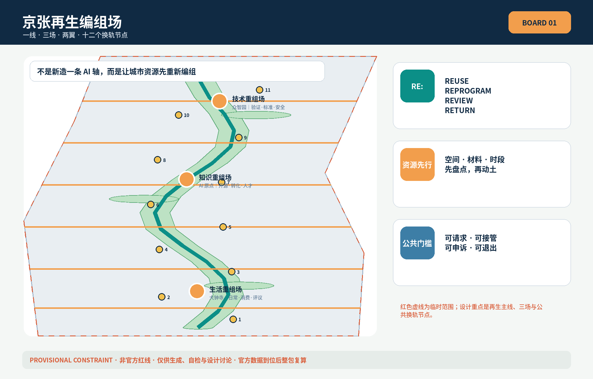
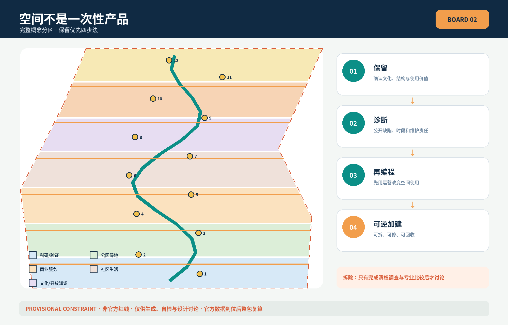
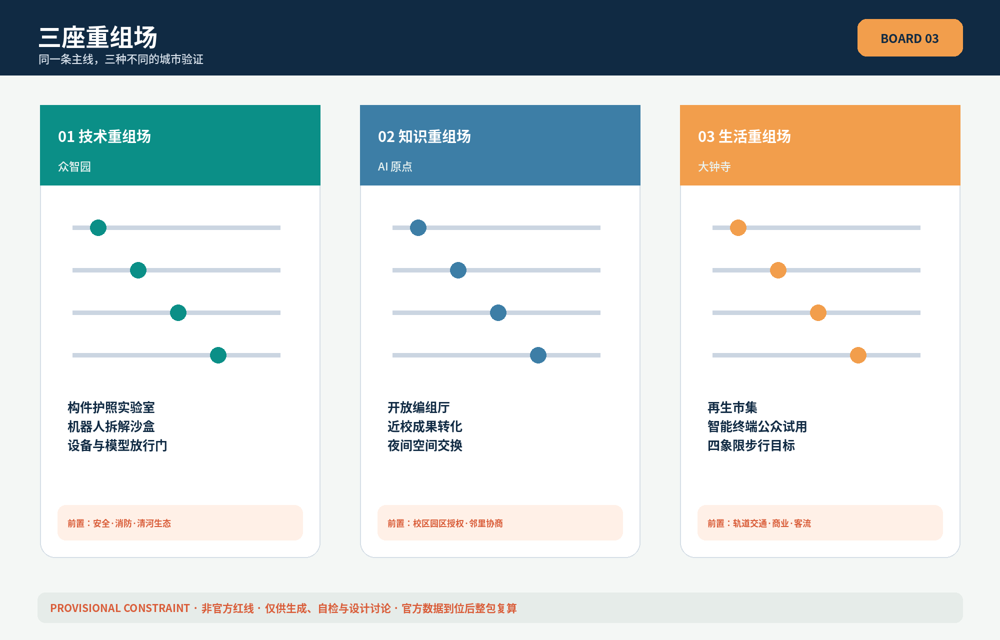
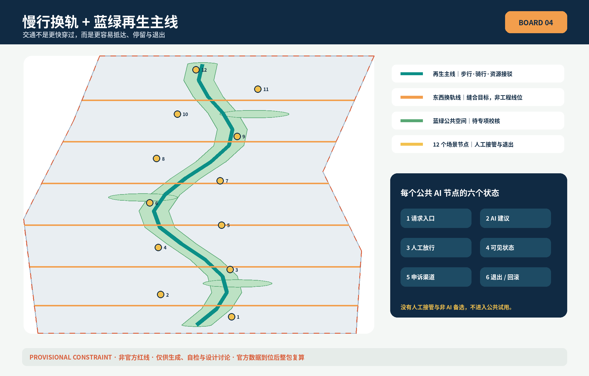
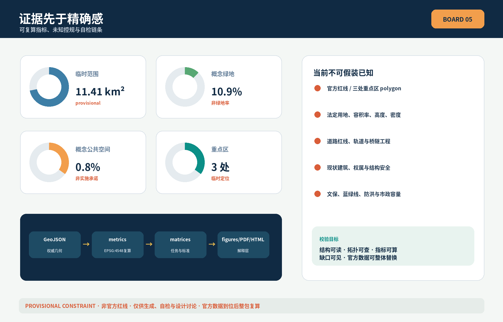

# Jing-Zhang Urban Renewal Yard: Transform Urban Renewal from Demolition and Construction into Resource Reconfiguration

> **REASSEMBLY JINGZHANG · Centennial Engineering Line, Next-Generation Resource Line.** This proposal is an Open Co-Creation initiative and does not replace formal planning nor constitute a government approval conclusion; all spatial actions are Conceptual Recommendations for further professional team research and development.

## Design Basis and Source List

The proposal is based on the three-layer scope, three key areas, and design tasks confirmed by the official announcement [source:OFFICIAL-ANNOUNCEMENT] [standard:PROJECT-OFFICIAL-ANNOUNCEMENT], and the co-creation principles, six tasks, and boundary conditions outlined in the agent task book for participation [source:AGENT-TASKBOOK] [standard:PROJECT-AGENT-OPEN-CALL-TASKBOOK]. Urban Design, control detailed planning depth, and land use classification are based on local standards snapshots [standard:MOHURD-URBAN-DESIGN-MEASURES] [standard:MOHURD-CONTROL-DETAILED-PLANNING] [standard:MNR-LAND-USE-CLASSIFICATION-GUIDE]. There are no official documents for the depth standards of architectural design; they are only used to identify data gaps [standard:MOHURD-ARCH-DESIGN-DEPTH-2016].

`data/source_registry.json` determines what claims can be supported by the available data [source:SOURCE-REGISTRY]; the processing fact pack only serves for reading and navigation, not for enhancing the authority of any data [source:PROCESSED-FACT-PACK]. The current `SITE_BOUNDARY` and three `KEY_AREA` polygons are derived from temporary and rough polygons in the repository [source:BOUNDARY-SOURCE] [source:KEY-AREA-SOURCE] [data:geometry/site_boundary.geojson#SITE-001] [data:geometry/key_areas.geojson#PROV-KEY-001]. They are `provisional_constraint` and not official planning boundaries, and cannot support conclusions regarding approval, ownership, road boundaries, or precise area calculations. (Official Planning Boundary) After the official attachments are in place, include nine GeoJSON files, indicators, figures,HTML With PDF Must recalculate the entire package.[depth:existing_conditions_diagnosis].

This diagnosis is not about "lacking more dazzling AI architecture," but rather: the existing spaces, materials, equipment, and usage periods lack an interface that can be collectively searched; Urban Renewal often jumps directly to demolition and reconstruction due to incomplete information. Due to the lack of current building conditions, ownership, control plans, cultural heritage, riverways, and municipal data, this plan does not fabricate the current baseline map. Instead, it submits a verifiable "recomposition method" and its conceptual spatial carrier.

## Three-Level Scope Framework

Coordinated Research Area covers approximately 43.6 square kilometers and is responsible for coordinating resource synergies and global ecological connections; Overall Design Area covers approximately 11.4 square kilometers and is responsible for the regeneration mainline, land concept zoning, slow travel blue-green network, and update tools; three key areas cover approximately 368.4 hectares, respectively validating mechanisms for the recombination of technical, knowledge, and living space [source:OFFICIAL-ANNOUNCEMENT] [depth:three_level_scope_framework]. The temporary submitted boundary recalculated area is [metric:site_area_sqm], used only for self-inspection and not as a substitute for the announced value.

The overall structure is "one line, three fields, two wings, and twelve track-switching nodes": the Jing-Zhang Heritage Park forms a regenerated main line around it; Zhongzhiyuan, AI Origin, and Dazhongsi respectively become the technology recombination field, knowledge recombination field, and life recombination field; the Zhongguancun Technology Services Wing provides legal, capital, design, and standardization services, while the Xiaoyue River Scenario Enablement Wing provides controlled testing and public feedback; the twelve nodes re-match materials, spaces, services, and people [data:geometry/roads.geojson#ROAD-001] [data:geometry/public_space.geojson#PUBLIC-001] [depth:overall_spatial_structure].

The naming system responds to the cultural legacy of the Jing-Zhang Railway project with the term "compilation," denoted by "RE:" for reuse, reprogram, review, and return. The logo direction features two open-bracket-shaped tracks enclosing a toggleable arrow, leaving a blank space in any application to signify that the city always allows for a future revision; the colors are inspired by the railway's rust-orange, regenerated green, and engineering blue. The fonts and graphics use open-source or original geometric designs, avoiding corporate trademarks.

## Coordinated Research Area: Industry and Future City Research

Six global case studies are used for mechanism comparison only, not for deriving the master plan for this project: Mila's research—talent community [source:CASE-MILA], Vector Institute's industry collaboration network [source:CASE-VECTOR], STATION F's shared startup incubator [source:CASE-STATION-F], AI Singapore's talent—application collaboration [source:CASE-AI-SG], Cyber Valley's research—startup connection [source:CASE-CYBER-VALLEY], and Alan Turing Institute's cross-institutional public interest research [source:CASE-TURING]. The transferrable commonalities are not the replication of architectural forms, but the establishment of stable interfaces for research, talent, application, public accountability, and sustained operations [standard:PROJECT-AGENT-OPEN-CALL-TASKBOOK].

| Case Mechanism | Jing-Zhang Transliteration | Spatial Interface |
| --- | --- | --- |
| Research and Talent Community | Cross-Institutional Open Research Topics and Contribution Records | AI Origin Open Group Hall |
| Industrial Collaboration Network | Demand Announcement—Controlled Validation—Debriefing | Zhongzhiyuan Validation Workshop |
| Shared Startup Incubators | Spaces Matched by Stage and Time Period | Regeneration Space Trading Desk |
| Human Review | Scenario Library, Mentors, and Human Review | Xiao Month River Test Node |
| Research—Entrepreneurship Connection | Threshold from Experiment to Public Trial | Three-Stage Release Gate |
| Public Interest Research | Appeals, Withdrawals, Audits, and Long-term Evaluation | Dazhongsi Public Hearing Hall |

The industrial ecology is organized as a closed loop of "discovering idle resources—identifying needs—calculating matches—professional verification—lightweight trial—public review—re-grouping." Land, space, industry, capital, talent, computing power, data, and scenarios are not one-time configurations but resources with their own sources, permissions, responsible parties, and exit conditions. Urban AI only provides suggestions, sorting, and simulations; ownership judgments, structural safety, approvals, procurement, and public rights are still decided by the relevant authorities and professionals [depth:development_intensity_controls].

## Overall Design Area: Urban Renewal and Regulatory-Plan-Level Urban Design

`land_use.geojson` safely and fully partitions the provisional boundaries, expressing concepts such as research and development, public green spaces, commercial services, community living, culture, and plazas [data:geometry/land_use.geojson#LU-001] [depth:land_use_layout]; it does not claim to represent current conditions or approved uses. `buildings.geojson` only expresses nine "preservation priority diagnostic stations, low-disturbance renovation workshops, reversible add-ons, and shared ground-floor interfaces" prototypes [data:geometry/buildings.geojson#BLDG-001], with a combined conceptual footprint [metric:building_footprint_area_sqm], which does not correspond to actual buildings. (Provisional Boundary)

Update the four-step method to: **Preserve** (first confirm cultural, structural, and use value), **Diagnose** (publicly identify defects and usage periods), **Reprogram** (use operations to change rather than demolition), **Reversible Additions** (additions that are removable, repairable, and recyclable). Only after completing the building survey, ownership negotiations, structural assessment, and carbon and public interest comparisons can the professional team discuss demolition. Floor Area Ratio [metric:floor_area_ratio], height, density, green space ratio, and setback distances remain unknown due to the lack of formal zoning regulations; height and massing only propose the principle of "respecting the existing skyline, controlling a friendly scale along the archaeological park, and identifying landmarks by public accessibility rather than height" [depth:height_massing_character] [depth:retain_renovate_demolish].

## Detailed Design of Key Areas

Three key areas are identified with [metric:key_area_count], each having temporary rectangular boundaries and serving only for task positioning [data:geometry/key_areas.geojson#PROV-KEY-001] [data:geometry/key_areas.geojson#PROV-KEY-002] [data:geometry/key_areas.geojson#PROV-KEY-003] [depth:three_key_area_detailed_design].

1. **Zhongzhiyuan | Technological Reconfiguration Field**: Transform full-stack independent innovation, standards, and security governance into a sequence of "Component Passport Laboratory—Robot Disassembly Sandbox—Model and Equipment Release Gate"; the Qinghe interface only proposes the concept of a low-disturbance garden test, awaiting the conditions for the river channel, flood prevention, and ecology. External transportation only proposes the target for shuttle services, without drawing the engineering alignment.
2. **AI Origin | Knowledge Reconfiguration Field**: Connects outcomes, open-source contributions, intellectual property, and talent living through a nearby school open assembly hall; the first floor and nighttime spaces are initially shared in time segments before discussing physical renovations. Any campus, park, or building intervention requires consent.
3. **Dazhongsi | Life Reconfiguration Hub**: Organize "renewal markets, smart terminal trials, content co-creation, and public review" within a four-quadrant walking distance around the station area. This does not claim the feasibility of a station-integrated project and does not specify any business or commercial commitments.

The three sites are not in a hierarchical industrial relationship: Zhongzhiyuan addresses "whether technology can be safely disassembled and reassembled," AI Origin addresses "whether knowledge can be openly transformed," and Dazhongsi addresses "whether services can enter daily life and be subject to public evaluation."

## AI Innovation Ecosystem, Personas, and AI+ Scenarios

Six types of characters run through the proposal: Model and robot developers need controlled testing; university faculty and students need channels for technology transfer and open collaboration; startup teams need affordable space during off-peak hours; park operators need maintainable asset ledgers; surrounding residents need quiet, barrier-free, and exitable services; and international visitors need readable evidence that does not rely on brand endorsement. The profile only describes the characters' needs and does not establish personal tracking profiles [source:AGENT-TASKBOOK].

All twelve scenario cards correspond to `PUBLIC-001` to `PUBLIC-012`, among which the first three are Testing and Validation Scenarios for industry [data:geometry/public_space.geojson#PUBLIC-001]:

| Card | Scenario | People-Space-Operations | Data and Human Boundary |
| --- | --- | --- | --- |
| SC-01★ | Component Passport Laboratory | Developer—Zhongzhiyuan—Material Registration and Verification | Records only Qingquan components; signed by the engineer |
| SC-02★ | Robot Decomposition Sandbox | Equipment Team—Closed Test Yard—Schedule Test | The safety officer can press the emergency stop; direct entry into the public area is not allowed. |
| SC-03★ | Digital Twin of Street Interface | Design Team—Reversible Segment—Scheme Comparison | Simulation Does Not Equal Approval; Expert Verification |
| SC-04 | Idle Space Matching Station | Startup Team—Shared Ground Floor—Time-Capitalized Agreement | Owner Confirmation; No Sensitive Leasing Information Disclosed |
| SC-05 | Reversible Interior Fitout Tool Library | Operators—Renovation Workshop—Borrow and Return | Construction Safety Reviewed by Professionals |
| SC-06 | Community Repair Library | Residents—Neighborhood Node—Repair Mutual Aid | No Algorithmic Evaluation of Resident Credit |
| SC-07 | Shade Cool Rain Guardian | Pedestrians—Green Spine—Artificial Inspection | Environmental Sensing Only Collects Aggregated Values |
| SC-08 | Barrier-Free Routes Response | Multi-Age Users—Pedestrian Lines—Issue Reporting | Anonymous Feedback; Manual Confirmation for Repairs |
| SC-09 | Sidewalk Time-Sharing | Cycling and Delivery—Sidewalk Nodes—Time Slot Reservation | Traffic management department decides, no automatic enforcement |
| SC-10 | Open Source City Classroom | Teachers and Students—Origin Community—Public Courses | Works and Portraits Require Authorization |
| SC-11 | Night Space Exchange | Community and Team - Dazhongsi - Off-Peak Shared Use | Noise, Fire Safety, and Neighbor Consultation Prioritize |
| SC-12 | Centennial Material Archive | Public—Site Narrative Line—Open Curating | Historical Facts and Copyright Manual Verification |

Each scenario must have six states: "Request Entry, AI Suggestion, Manual Approval, Visible Status, Appeal Channel, Exit/Rollback." Scenarios without manual take-over, unable to explain the data source, or unable to revert to non-AI services, will not enter public trial.

## Land Use, Building Scale, and Retain-Renovate-Demolish Strategy

The land use zones are zoned using a subset of the national spatial classification, but all codes are conceptual zone labels [standard:MNR-LAND-USE-CLASSIFICATION-GUIDE] [data:geometry/land_use.geojson#LU-001]. The building strategy is not categorized by "new, old, good, bad," but by the maturity of the evidence: A-level buildings have clear title investigations and can be retained for maintenance; B-level buildings require structural and use diagnostics; C-level buildings can undergo operational reprogramming first; D-level buildings should only be discussed for reversible additions after professional argumentation. No objects are deemed for demolition by this plan.

"Material Passport" suggests recording the source, dimensions, condition, testing, permits, disassembly methods, and conditions for the next reuse; "Space Passport" records ownership authorization, opening hours, service population, accessibility, and exit conditions. Both types of passports are operational and collaborative suggestions, not administrative registration or asset certification [depth:retain_renovate_demolish].

## Transport, Rail, Municipal Infrastructure, and Public Services

The Jing-Zhang regeneration main line is a conceptual pedestrian—bicycle—small resource shuttle composite line. Six east-west track-switching lines integrate universities, parks, communities, and track connections [data:geometry/roads.geojson#ROAD-001] [depth:traffic_rail_slow_parking]. The Dazhongsi quadrants, Wudaokou/Qinghua Donglu Xi Street, and related nodes at the North Fifth Ring Road only propose performance goals of "continuity, accessibility, minimal detours, barrier-free access, and orderly static traffic." The road boundary, cross-section, bridges, tunnels, and signal schemes must be determined by the traffic specialty.

Municipal authorities suggest adopting "small-scale, measurable, and reversible" edge computing and environmental sensing prototypes; prioritize the reuse of existing server rooms and equipment spaces, and make energy consumption, maintenance, and failure records transparent in the operational ledger. Distributed energy, heat recovery, drainage, and energy storage require further consideration based on load, fire safety, flood protection, and pipeline conditions [data:geometry/constraints.geojson#CONSTRAINTS] [depth:municipal_new_infrastructure]. Public services should retain physical service windows and human assistance, and must not exclude the elderly, children, people with disabilities, or those without smart devices due to digitization.

## Blue-Green Network, Public Space, and Urban Character

The Regenerated Green Spine consists of a continuous gentle walkway and three regenerated gardens [data:geometry/green_space.geojson#GREEN-001], with a conceptual green space ratio [metric:green_ratio]; twelve transition nodes form a low-intensity Public Space network, with a conceptual public space ratio [metric:public_space_ratio] [depth:blue_green_public_space]. All ratios are based on provisional boundaries and conceptual layers, not on statutory green space requirements or public space commitments. (Provisional Boundary)

Four AI Pilgrimage/Honor Nodes are as follows: **Centennial Component Archive Tower** (documenting the history of projects through reusable components and their sources), **Open Switching Hall** (displaying how proposals are questioned and revised), **One-Kilometer Material Ledger** (a readable timeline of sources—use—reuse along the route), and **Unbuilt Memorial Platform** (honoring contributions that prevent unnecessary construction through evidence). The landmarks are identified by records of public knowledge and contributions, without seeking monumental scale; their placement requires review by cultural heritage, green spaces, structure, and safety standards [standard:MOHURD-URBAN-DESIGN-MEASURES].

Cultural narrative ties together three traditional continuities: the engineering organization and maintenance of the Jing-Zhang Railway, the iterations and knowledge sharing in Zhongguancun, and the traceability and revisability in the AI era. Signage adopts "carriage cards" to record the source, current status, responsible party, and next stop of each project, with the international communication phrase being **A city that rearranges before it replaces**.

## Renewal Projects, Implementation Policy, and Phasing

| Project | Concept Action | Prerequisites for Moving to the Next Stage |
| --- | --- | --- |
| R-01 Regeneration Mainline | Slow Travel, Resource Integration, and Narrative Continuity | Parks, Transportation, Cultural Heritage, and Title Verification |
| R-02 Zhongzhiyuan Technology Reconfiguration Site | Three Controlled Industry Verifications | Safety, Fire Safety, Data, and Operational Authority |
| R-03 Origin Open Group Hall | Results Release and Time Slot Sharing | University Campus Authorization and Neighborhood Consultation |
| R-04 Dazhongsi Regeneration Market | Intelligent Natively Generated Business Types Public Trial Use | Track, Commercial, Fire Safety, and Passenger Flow Assessment |
| R-05 Twelve Rail Switch Nodes | Scene Card Hierarchical Release | Privacy Impact Assessment and Manual Takeover |
| R-06 Materials and Space Passport | Public Fields and Review Process | Ownership, Permits, Cybersecurity, and Confidentiality |
| R-07 Global Rezone Week | Open Call, Exhibition, Maintenance, and Review | Activity Permits, Safety, Copyright, and Budget |

First phase "Do the Books" establish documentation, public issues, and lightweight temporary pilots; second phase "Recode" advance authorized reuse of existing spaces and low-disturbance renovations; third phase "Form a Network" replicate mature components after professional evaluation and form long-term operations [data:geometry/phasing.geojson#PHASE-001] [depth:renewal_project_list] [depth:phasing_implementation]. Phasing does not represent a definitive construction timeline.

Policy tools are suggested to include: retaining priority evidence gates, material/space passports, reversible construction guidelines, public scene release certificates, time-sharing covenants, and annual unbuilt contributions awards. The annual activity framework includes a spring urban question bank, a summer controlled test, an autumn global reconfiguration week, and a winter public review; the developer community operates with an issue—test—review—archive workflow. All activities, funding, recruitment, and platforms are recommended [source:AGENT-TASKBOOK], subject to [A-OPERATIONS-001].

## Metrics, Area Recalculation, and Compliance Matrix

This package only marks as known the values that can be recalculated from the submitted geometry: temporary site area [metric:site_area_sqm], conceptual Building Footprint [metric:building_footprint_area_sqm], conceptual green space ratio [metric:green_ratio], conceptual Public Space ratio [metric:public_space_ratio], and the count of key areas [metric:key_area_count]. The Floor Area Ratio [metric:floor_area_ratio] remains unknown. All values are recalculated by EPSG:4548 [depth:metrics_recalculation]; `compliance_matrix.json` covers announcements 1.3, 1.4, 1.5, and agents.1—agents.6, while `standard_matrix.json` and `design_depth_matrix.json` form an Evidence Chain linking standards, depth, layers, metrics, and drawings.

Measure the value of the proposal not by using fictional gross values or recruitment numbers, but by suggesting long-term tracking: the avoided unnecessary demolitions, the proportion of verified reused components, the hours of shared spaces, the success rate of human takeovers, the resolution rate of appeals, the closure rate of accessibility issues, and the success rate of scenario exits. These operational metrics currently lack a baseline and cannot be written into the known spatial metrics.

## Risk, Copyright, and Compliance

The greatest risks are: Official Boundary and key area absence; control plan, roads, buildings, ownership, utilities, fire safety, flood control, cultural heritage, and service facility baseline absence; the "material passport" may touch asset and business information; spatial matching may strengthen opaque allocation; and robot testing may pose safety risks. Corresponding measures are to maintain provisional status, submit only conceptual prototypes, minimize data, publish rules, conduct Human Review, tiered release, and provide appeal and exit options [depth:risk_missing_data] [data:geometry/constraints.geojson#CONSTRAINTS].

Five images, offline HTML, and PDF are derived from the submitted GeoJSON, metrics, matrix, and original typography; no external map tiles, news images, company logos, or generative atmosphere renderings are used. The font used is the open-licensed version of Noto Sans CJK, with copyright statements found in `report/copyright_statement.md`. This proposal does not claim official approval, government commitment, final investment, construction scale, land ownership, engineering feasibility, or definitive activity scheduling.

## References

Complete source records are available in `sources.json`. Core materials include official announcements [source:OFFICIAL-ANNOUNCEMENT], task books [source:AGENT-TASKBOOK], site packages [source:SITE-PACKAGE], source registries [source:SOURCE-REGISTRY], processed fact packages [source:PROCESSED-FACT-PACK], provisional boundaries [source:BOUNDARY-SOURCE], and provisional key areas [source:KEY-AREA-SOURCE]; six global case studies are provided for background comparison mechanisms [source:CASE-MILA] [source:CASE-VECTOR] [source:CASE-STATION-F] [source:CASE-AI-SG] [source:CASE-CYBER-VALLEY] [source:CASE-TURING]. (Source Registry) (Provisional Boundary) (Background Only)
