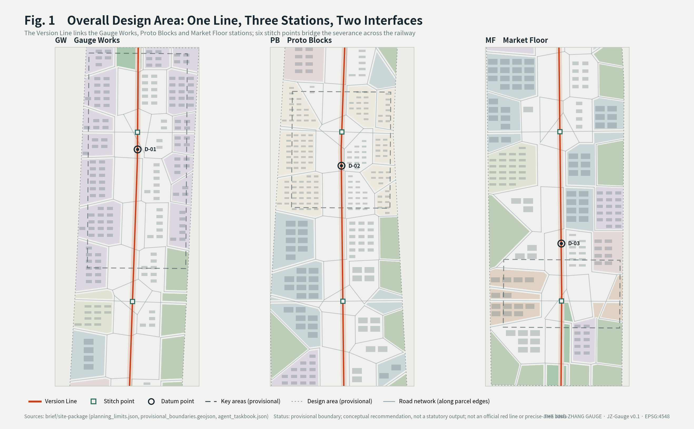
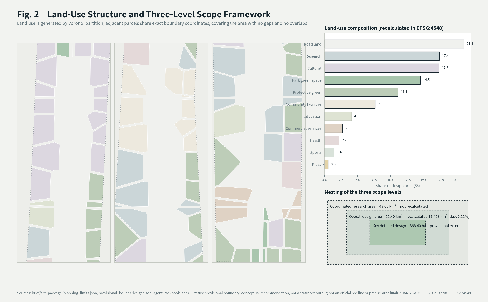
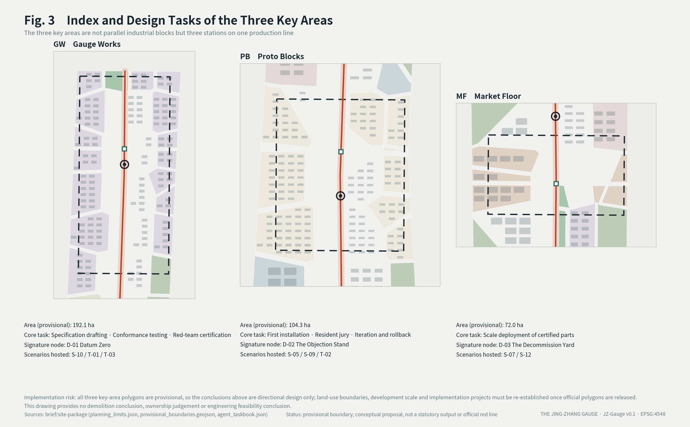
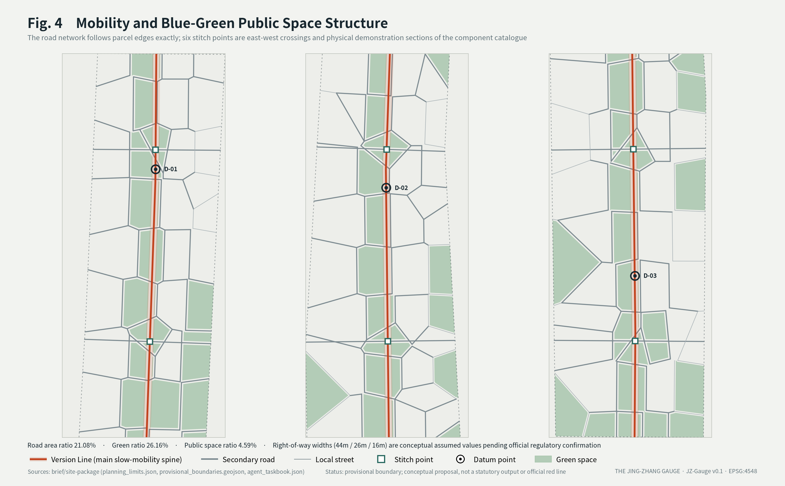
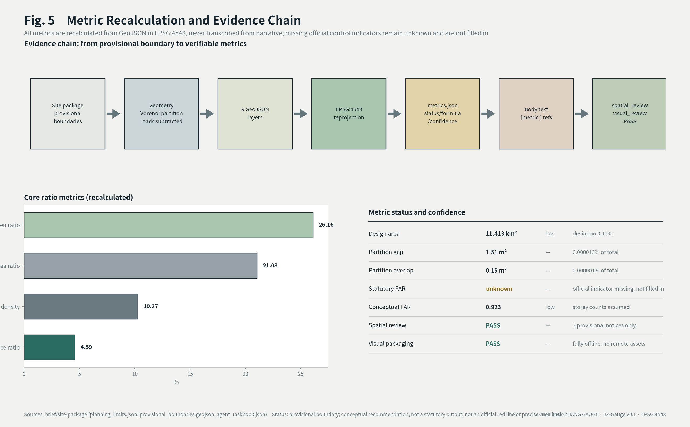

# The Jing-Zhang Gauge: Urban Design for the Centennial Jing-Zhang AI Innovation Belt with a Public Specification as Its Core Product

**The concept in one sentence**: what this belt ultimately produces is not buildings but a *gauge* — a public specification for AI (artificial intelligence) in urban space that anyone can build to, connect to, and audit against.

This proposal reads the Jing-Zhang Railway of a century ago as a design metaphor: a line on which, without external technical control, a local engineering team **set the specification itself and made it work**. Self-reliance → standard-setting → interoperability is the design cue this proposal draws from that history, not a historical claim made by this version (public sources for the underlying history are listed as pending in the References chapter). Among the five functions named in the taskbook of the Haidian-led Centennial Jing-Zhang AI Innovation Belt, "a Full-Stack Independent AI Innovation System (FSIAIS)" and "global discourse power in AI governance" are the two ends of exactly this line, a hundred years apart [source:AGENT-TASKBOOK].

A track gauge is invisible. It produces no locomotive, yet it determines which vehicles can run on the line and which networks can connect. **Whoever holds the standard gains authority over the network without owning a single vehicle.** Discourse power in governance does not come from declarations; it comes from others having to build to your specification. This is the mechanism this proposal offers for that function.

> **Compliance statement**: all spatial content in this proposal is a **conceptual recommendation** for further development by qualified professional teams. It does not constitute statutory planning, an approved conclusion, an implementation commitment, an investment commitment, or an engineering feasibility conclusion. The boundaries used are the organiser's provisional substitute boundaries and must not be treated as an official red line or a basis for precise area figures.

## Design Basis and Source List

### Sources and availability tiers

This proposal strictly separates formal-ready, background-only, and provisional-only material, selecting evidence only after reading `data/source_registry.json`. Background or provisional material is never promoted to the status of a statutory control basis [source:SOURCE-REGISTRY].

| Material | Use | Availability | Handling |
|---|---|---|---|
| Public taskbook and project announcement | Three-level scope, Three Zones and Two Wings, five functions | formal-ready | Cited directly [source:OFFICIAL-ANNOUNCEMENT] [standard:PROJECT-OFFICIAL-ANNOUNCEMENT] |
| Agent-facing taskbook | Mandatory tasks agent.1–agent.6 | formal-ready | Addressed item by item in the body [source:AGENT-TASKBOOK] |
| Structured fact pack | Organiser-curated terminology and definitions | formal-ready | Used to keep terminology consistent [source:PROCESSED-FACT-PACK] |
| `ranges/planning_limits.json` | Official area figures and control-indicator status | formal-ready | Area comparison and gap disclosure [source:SITE-PACKAGE] |
| `geometry/provisional_boundaries.geojson` | Provisional boundary | provisional-only | Used **only** for generation, visualisation, and self-check [source:BOUNDARY-SOURCE] [data:geometry/site_boundary.geojson#SITE-001] |
| Provisional key-area extents | Three core functional districts | provisional-only | Directional design basis only [source:KEY-AREA-SOURCE] |
| `enums/land_use_codes.json` | Land-use classification codes | formal-ready (project subset) | The complete official code table must be imported before formal statistics [standard:MNR-LAND-USE-CLASSIFICATION-GUIDE] |
| Global cases and historical material | Case reference and cultural narrative | to be completed | See the References chapter; whatever lacks a public source is asserted as fact nowhere in this version |

### Evidence-chain correspondence

- `sources.json` records the publisher, URL, retrieval date, coverage, licence, and known limitations of every citation
- `assumptions.json` records every assumed value (right-of-way widths, storey counts, price-band basis) and the scope in which it must not be used
- `compliance_matrix.json` covers all tasks under announcement clauses 1.3/1.4/1.5 and agent.1–agent.6
- `standard_matrix.json` responds to the mandatory professional standards [standard:MOHURD-URBAN-DESIGN-MEASURES], [standard:MOHURD-CONTROL-DETAILED-PLANNING], [standard:MNR-LAND-USE-CLASSIFICATION-GUIDE]
- `design_depth_matrix.json` marks the completion status of each design-depth item [depth:land_use_layout]

### Deliverable modalities and inventory

The agent taskbook requires the result to "form a complete deliverable through text, images, diagrams, tables, scenario cards, video/sound, three-dimensional or interactive web pages that humans can directly understand" [source:AGENT-TASKBOOK]. The deliverable, specification, and verification route for each modality in this package are listed below. Every file ships with the package and opens offline:

| Modality | Deliverable | Specification and content | How to verify |
|---|---|---|---|
| Text | `proposal.md` / `proposal.en.md` | Full bilingual text answering agent.1–agent.6 item by item | Read directly |
| Tables | 19 tables in the body text | Function-mechanism mapping, scenario cards, metric recalculation, risk handling, compliance correspondence | Readable in the body text |
| Images and diagrams | Five bilingual PNG pairs under `assets/figures/` | Evidence chain, land-use structure, key areas, mobility and blue-green, metric recalculation | View directly |
| Drawings | `drawings/a0-boards.pdf`, `drawings/a3-booklet.pdf` (each with an English counterpart) | A0 boards and A3 booklet | Open in a PDF reader |
| Scenario cards | Section "AI scenario cards (agent.3, 16 cards)" | Each card carries its spatial carrier, maturity tier, and human-review boundary | Readable in the body text |
| Video | `assets/media/gauge-mechanism.mp4` | 55 seconds, 1280×720, 24 fps, H.264, **silent**; six segments explaining the core mechanism, every frame drawn programmatically from the geometry and metrics submitted in this package | `gauge-mechanism.vtt` captions and the `gauge-mechanism.md` full transcript ship alongside, so all information remains obtainable without sound |
| Logo and identity system | `assets/identity/jz-gauge-logo.svg`, `assets/identity/jz-gauge-identity.svg` | Vector mark and usage sheet: construction, bilingual lockup, version-colour extension, clear space and minimum size, monochrome and reversed variants | Open in any vector tool or browser; the mark is also inlined in the header of both visual pages |
| Three-dimensional and interactive web page | The closing "3D tour" section of `visual/index.html`, driven by `visual/assets/gauge-tour.js` (386 lines) and `gauge-tour-data.js` | A hand-written WebGL 1 renderer loading 1,070 geometry features across the 9 layers of this package; arrow keys rotate and zoom, Shift+Up/Down adjusts pitch, number keys 0–3 switch viewpoints, Space orbits, R resets, and the canvas carries a keyboard-accessible label | Open `visual/index.html` locally in a browser and scroll to the closing section; no remote resource is loaded at runtime |

The media files and the 3D tour scripts above are registered with their paths and roles in `manifest.json` and can be opened directly within the repository.

### Data gaps (disclosed here explicitly)

The organiser has not yet released the official red line or precise key-area polygons. In `planning_limits.json`, five official control indicators — floor area ratio, building height, building density, green ratio, and setback — all carry the status `missing` [source:SITE-PACKAGE]. This proposal **does not fill them in**; they remain `unknown`, and the recalculation scope after official data becomes available is set out in the metrics chapter.



## Three-Level Scope Framework

### Objectives and depth by level

| Level | Extent | Official area | Depth in this proposal | Recalculated here |
|---|---|---|---|---|
| Coordinated research area | North Fifth Ring Road to Xizhimenwai Avenue | 43.60 km² | Industry and future-city research | Not recalculated (no official boundary) |
| Overall design area | 1–2 km around the heritage park | 11.40 km² | Regulatory-plan-level urban design | **11.413 km²**, deviation 0.11% [metric:site_area_sqm] |
| Key detailed design | Three core functional districts | 368.40 ha | Comprehensive implementation-plan depth | 368.40 ha (provisional extent) |

The 0.11% deviation from the officially published figure only shows that the provisional boundary is consistent with the announced figure at the level of area magnitude; it does not validate the boundary's location, shape, projection choice (EPSG:4548, CGCS2000 3-degree Gauss-Kruger zone 39) or official accuracy. **This does not mean the boundary is accurate** — the provisional boundary is a rough substitute, and the formal area is the recalculation after the official polygon is released.

### How the three levels cascade

The coordinated research area answers "what role does this belt play in the regional innovation network"; the overall design area answers "how must space be organised to support that role"; the key areas answer "what exactly gets built, and in what order". The three levels are not the same drawing at three levels of detail — they are one logic, standard-setting → first installation → volume deployment, unfolded at three scales [depth:three_level_scope_framework].

### Limits of the provisional boundary, and the replacement list

This proposal uses a boundary carrying `geometry_role="provisional_constraint"`, `official_boundary=false`, and `boundary_precision="provisional_rough"` [data:geometry/constraints.geojson#CN-001]. It is suitable **only** for: provisional generation, human-readable visualisation, non-statutory design discussion, and local self-check. It must **not** be used for: official red lines, approval basis, precise area calculation, statutory planning control, or ownership and engineering boundaries.

Once official polygons are released, the following must be recalculated: the full `land_use.geojson` partition, `roads.geojson`, `buildings.geojson`, `phasing.geojson`, and every area and ratio metric in `metrics.json`. The geometry generator is parameterised, so replacing the boundary source file allows a single full re-run without redrawing.



## Coordinated Research Area: Industry and Future City Research

### Overall concept and naming system (agent.1)

| Layer | Chinese | English | Meaning |
|---|---|---|---|
| Overall concept | 京张公制 | **The Jing-Zhang Gauge** | 公 = public/open, 制 = specification/system; a pun on the metric system — a globally shared convention of measurement |
| Specification body | 京张轨距 | JZ-Gauge | The versioned public specification set for AI in urban space |
| Component catalogue | 京张标准件 | JZ-Parts | A procurable, installable, retirable catalogue of physical components |
| Scenario protocols | 京张场景规程 | JZ-Specs | Behavioural boundaries and human-review rules for each AI scenario |
| Honour system | 立标碑 / 基准点 | Datum Stones | See the blue-green and public space chapter |
| Annual event | 定标周 | Gauge Week | See the implementation chapter |

Names of the "smart spine / smart valley / corridor" family are deliberately avoided: they describe form rather than function. **A name that another city can *adopt* is closer to governance discourse power than a name that merely sounds good.**

### Visual identity direction (agent.1)

The core mark is two parallel lines with a transverse tick, reading simultaneously as a gauge section, a measurement scale, and a version line. The base palette is rail steel grey and ballast. **The single accent is the "version colour"**: each specification version is assigned a colour, painted directly onto physical standard parts, so that a resident on the street can see which version of the specification a given installation was built under — turning auditability into a visible design act.

Explicitly excluded: anthropomorphic AI faces, neural-network spheres, glowing brains, cyber gradients. The taskbook prohibits over-entertained and social-media-bait treatments, and this visual language no longer carries distinctiveness [source:AGENT-TASKBOOK].

**Delivered identity artefacts**: the mark itself is `assets/identity/jz-gauge-logo.svg` and its usage sheet is `assets/identity/jz-gauge-identity.svg`. Both are original vector drawings and scale without loss to plate and casting sizes. The usage sheet fixes five things: construction (two parallel lines crossed by one transverse tick); the bilingual horizontal lockup (the mark may stand alone, the wordmark may not); version-colour extension (one colour per version, carried by both the tick and the physical standard parts); clear space and minimum size (clear space on all sides ≥ the spacing between the two rails; minimum 16 px / 8 mm, below which the end ticks are dropped); and the monochrome and reversed variants for engraving, casting, and dark plates. The mark is also inlined in the headers of `visual/index.html` and `visual/index.en.html`.

**Extensibility and international reach**: the mark is built only from rectangles, depending on no typeface, gradient, or fine detail, so it survives four extreme conditions intact — cast nameplates, screen printing, monochrome fax, and a 16 px icon. Its meaning does not depend on Chinese: two parallel lines crossed by a measure tick read as "gauge / measurement" in any language, which makes it travel better than any translated name. The version-colour mechanism then lets the identity update itself as the specification iterates, with no redesign.

### Reading of the three positionings

| Taskbook positioning | Reading in this proposal | Core action |
|---|---|---|
| Centennial Jing-Zhang cultural belt | From building our own railway to setting our own standard | Make the standard-setting process itself visitable public culture |
| Urban AI life experience belt | The standard part *is* the experience | Every AI installation is scannable for spec, responsible party, and retirement date |
| AI convergence and innovation belt | Conformance testing as the entry point | Firms join by *passing certification*, not by signing an investment agreement |

### Mechanism mapping of the five functions

Each of the five functions named in the taskbook has one explicit mechanism carrier and one spatial anchor in this proposal — no slogan-style item-by-item response [source:AGENT-TASKBOOK]:

| Taskbook function | Mechanism carrier | Spatial anchor |
|---|---|---|
| Full-Stack Independent AI Innovation System | The JZ-Gauge Version Line: drafting, conformance testing, and iteration sovereignty of the specification close their loop inside the belt | Gauge Works (Zhongzhiyuan AI Independent Innovation Acceleration Area) |
| World-class AI innovation ecosystem | An open supply chain where *certification is the entry*: pass the test and you are in; the JZ-Parts catalogue is the market | The Access Wing arranges factors; Proto Blocks provides real installation ground |
| New paradigm of AI+ scenario enablement | JZ-Specs scenario protocols plus the sixteen scenario cards: every scenario states its behavioural boundary before deployment is discussed | The Field Wing (Xiaoyue River) and the whole belt |
| Intelligent, vibrant AI city | The Datum Stones and version colours: every AI facility on the street shows its version, carries a scannable record of responsibility, and can be declined | Public space along the whole Version Line |
| Global discourse power in AI governance | Retest trigger right + model disclosure + adoptability of the specification: discourse power comes from others building to your gauge | Authored at Gauge Works; the belt itself is the first adopter and demonstration |

### The Three-Areas-Two-Wings collaboration loop (agent.1)

In this proposal the official "three areas, two wings" layout is not five parallel districts but a **closed production loop for the specification**: gauge-setting (Zhongzhiyuan) → first installation (Beijing AI Origin Community) → volume deployment (Dazhongsi) → retest data flowing back to gauge-setting, into the next version. The two wings run across this loop: the **Access Wing** (Zhongguancun technology services wing) arranges factors, IP, and capital at the firms' entry end; the **Field Wing** (Xiaoyue River scenario enablement wing) produces scenario retest data in real waterfront and community conditions at the operating end [source:AGENT-TASKBOOK].

What matters in the loop is the *backflow*, not the assembly line: operating data from volume-deployed facilities, retest results from the Field Wing, and public deliberation records from the Datum Stones all return to Gauge Works as version-upgrade proposals for JZ-Gauge — the three areas and two wings are thus each other's upstream and downstream, and the layout is the loop. The same loop from the firm's perspective appears in Chapter 10 (Access Wing consultation → certification at Gauge Works → real installation at Proto Blocks → scale-up at Market Floor); this section completes the specification's perspective: every backflow is a public version deliberation.

The spatial correspondence of the three areas and two wings is based on the official provisional boundaries and public materials; it is a conceptual mapping and asserts no precise boundary or area figures.

### Regional innovation collaboration: the Jing-Zhang axis (agent.1)

The first export corridor of the Gauge runs northwest along the centennial Jing-Zhang line: **Yanqing** (the intelligent-scenario legacy of the Winter Olympics) and **Zhangjiakou** (renewable-energy and computing-infrastructure siting) have the preconditions to host JZ-Gauge **out-of-belt retest grounds** and green computing supply — the specific scale and current-state data of these preconditions are not cited in this version, and no factual assertion is made. This version proposes only three mechanism interfaces: a certification protocol for out-of-belt retest grounds (a site-extension clause of JZ-Specs), a mutual version-recognition mechanism (out-of-belt retest results can trigger a version-upgrade deliberation), and demonstration segments of standard parts along the Jing-Zhang high-speed line (public test positions for JZ-Parts in station environments).

The corridor also extends the "Centennial Jing-Zhang cultural belt" positioning from a heritage narrative into a contemporary narrative of cross-regional technical collaboration: a century ago the Jing-Zhang line unified track gauge and signals; today, what is coordinated along the same line is the retesting and mutual recognition of an AI urban specification. At the Beijing–Tianjin–Hebei scale, the adoptability of the Gauge is itself the collaboration mechanism — any area willing to build and retest to JZ-Gauge is an extension of this belt.

### Collaboration interfaces with Beiwei Community, Future Science City, Huairou Science City, and the Economic-Technological Development Area (agent.1)

The taskbook asks the proposal to show innovation collaboration with Beiwei Community, Future Science City, Huairou Science City, the Economic-Technological Development Area, and the wider Beijing-Tianjin-Hebei region [source:AGENT-TASKBOOK]. This proposal **asserts nothing about the current scale, facilities, or industrial composition of those areas** (such data is not cited in this version); it states only the interface each would have with the gauge. What carries the collaboration is the adoptability of the specification, not an administrative agreement:

| Counterpart | Interface (conceptual proposal) | What flows back into the gauge |
|---|---|---|
| Beiwei Community | A same-city control point for first installation: one JZ-Specs version installed in parallel in a different community form | Side-by-side records of resident jury review and exercised refusal rights |
| Future Science City | A second examination hall for conformance testing: the JZ-Parts catalogue tested for fit within a different industrial structure | Fit failures become exception clauses in the next specification version |
| Huairou Science City | A metrology cross-check interface: extending "recalculable" from urban indicators to experimental measurement conventions | Divergent measurement methods trigger revision of the gauge's recalculation clauses |
| Economic-Technological Development Area | A volume-production interface: certified standard parts validated at manufacturing scale | Manufacturing feasibility feeds back into spec-card tolerances and decommissioning clauses |
| Beijing-Tianjin-Hebei | Version mutual recognition: out-of-area retest results can trigger a version-upgrade review (mechanism in the preceding section) | Cross-regional retest datasets |

All five interfaces share one loop: **others build to the gauge → retest data flows back → the version is upgraded.** Collaboration therefore depends on no individually signed agreement and asks no area to change its own positioning; willingness to build and retest against JZ-Gauge already places an area inside the collaboration.

### Comprehensive planning, spatial-industrial integration, and territorial-spatial planning innovation (agent.1)

The taskbook asks for substantive thinking on the meaning of comprehensive planning, on spatial-industrial integration, and on innovation in territorial spatial planning [source:AGENT-TASKBOOK]. This proposal answers with three faces of one idea: **make the specification itself a planning object that is measurable, recalculable, and retirable.**

**The meaning of comprehensive planning**: "comprehensive" is read here not as the superposition of drawings from many disciplines, but as **one version number running through four classes of decision — spatial, industrial, operational, and governance**. Land and construction conditions, the JZ-Parts procurement catalogue, the release rhythm of Gauge Week, and public deliberation at the datum stones all hang on the same JZ-Gauge version; when the version changes, all four enter the transition period and the retirement list together. The test for comprehensiveness is therefore checkable: if any two decisions cite different version numbers, they are not comprehensive.

**Spatial-industrial integration**: the interface is not "how much land quota to reserve for industry" but **certification**. A company enters this belt by passing a conformance test, not by first negotiating land and policy; the spatial counterpart is the test ground in the standard-setting station, the installation bays in the first-installation station, and the scale-up interface in the volume-production station (see the three stations in the preceding chapter). Space and industry then share one recalculable set of conventions — test pass rate, installed count, and retirement rate are spatial indicators and industrial indicators at once.

**Territorial-spatial planning innovation**: three conceptual mechanisms are offered for professional and competent authorities to judge for feasibility — (1) **the version number enters the conditions**: writing the specification version into the attached conditions of construction management, so that "which version it was built to" becomes traceable information; (2) **time-limited spatial permits**: AI installations carry the retirement date stated on their spec card, and continuation past that date requires a retest, which avoids settlement by fait accompli; (3) **recalculate rather than redraft**: geometry and indicators are generated by parametric scripts, so an update to official boundaries or control indicators is answered by recalculation rather than redrafting, shortening the planning response cycle (this package is already organised this way; see the indicators chapter).

These three are **conceptual recommendations**. They constitute no proposal to modify the existing territorial spatial planning system, its approval procedures, or the division of authority, and no recommendation regarding any statutory process [depth:risk_missing_data].

### Full-Stack Independent AI Innovation System and ecosystem cases (agent.2)

The ecosystem mechanism is organised around eight factor classes — land, space, industry, capital, talent, compute, data, and scenarios — and its core move is to make certification the industrial entry point: the standard-setting district drafts specifications and provides conformance testing; the access wing arranges factors; the first-installation district provides real deployment sites; the volume district takes on scale.

The global cases are seven, selected for being *of the same kind as one mechanism component of the Gauge* rather than for fame; each case states only verified public facts, with retrieval dates and sources recorded in `sources.json`, and quotes no unverified figures, company lists, or investment amounts:

| Case | Ecosystem niche (matching component) | What it teaches this proposal | Status |
|---|---|---|---|
| Toronto Quayside (announced 2017; developer announced termination in May 2020) [source:CASE-QUAYSIDE] | Failure cases and exit mechanism (D-03, the Retirement Ground) | When data-governance disputes are unresolved at the mechanism level, public trust collapses before the technology fails; exit and failure display must be part of the institution, not an accident | verified |
| Amsterdam algorithm register (live on the municipal site; Helsinki runs an equivalent register) [source:CASE-AI-REGISTER] | Public registration (the JZ-Gauge version register) | City-level public algorithm registers already run in practice; the value lies in field structure and accountability, not in registration itself | verified |
| UK Algorithmic Transparency Recording Standard, maintained by GDS [source:CASE-UK-ATRS] | Standardising the register fields themselves (spec-card fields) | Making "what to register" itself a cross-department standard — isomorphic to the spec card's "define once, cite everywhere" | verified |
| Singapore AI Verify (released May 2022) [source:CASE-AI-VERIFY] | Conformance testing (testing capacity at Gauge Works) | Government-led "test before claim": governance claims can be tooled and made verifiable — isomorphic to this proposal's "pass the test and you are in" | verified |
| EU model contractual clauses for AI procurement, MCC-AI (European Commission Community of Practice working document; light version published February 2025) [source:CASE-MCC-AI] | Procurement interface (the institutional form of the JZ-Parts catalogue) | Public procurement is the strongest executor of a specification; templated clauses make "buy to spec" replicable | verified |
| Spain's AI regulatory sandbox (Royal Decree 817/2023) [source:CASE-ES-SANDBOX] | The legal form of experimental zones (Field Wing scenario opening) | A lawful channel for trial within drawn boundaries has a legislative precedent; a sandbox's output should feed specification revision rather than be an exemption in itself | verified |
| Singapore one-north (launched 2001) [source:CASE-ONE-NORTH] | A phased innovation-district spatial sequence (gauge-setting — first installation — volume deployment) | Twenty-year phased development lets research, piloting, and industrialisation unfold as a gradient within one district; the spatial sequence serves the industrial sequence | verified |

The joint reading of the seven cases: **registration, testing, procurement, and sandboxing are each mature institutional tools worldwide, yet no city has assembled them into one closed loop** — the Gauge's differentiation is not inventing new tools but stringing the four into a single circuit along the Version Line (register as spec card, test as certification, procure as execution, sandbox as Field Wing), and adding the link the global cases jointly lack: public agenda-setting through the retest trigger right.

### AI innovation ecosystem map (agent.2)

The ecosystem map is organised as eight factor classes × loop segments, each cell marked with its carrying mechanism and its global counterpart:

| Loop segment | Leading factors | Mechanism in this proposal | Global counterpart |
|---|---|---|---|
| Gauge-setting (Gauge Works) | Talent, data | JZ-Gauge drafting and conformance testing | AI Verify (testing), ATRS (field standard) |
| Access (Access Wing) | Capital, industry | Certification as entry; the JZ-Parts catalogue | MCC-AI (procurement clauses) |
| First installation (Proto Blocks) | Space, scenarios | Real-condition installation with resident jury | — (this proposal's own segment) |
| Field testing (Field Wing) | Scenarios, data | Experimental zones with mandatory failure publication | Spain's sandbox (legal form) |
| Volume deployment (Market Floor) | Land, industry | Scaled deployment and stock re-verification | one-north (phased sequence) |
| Backflow (Datum Stones) | Data, compute | Retest trigger right; version-upgrade deliberation | Registers (openness) + Quayside (cautionary counter-example) |

How to read the map: horizontally it is the three-areas-two-wings collaboration loop (see the overall-concept chapter); vertically it is the allocation of the eight factor classes across segments; the "global counterpart" column is where the seven cases sit — each occupies one segment of the loop and none covers the whole circuit, which is precisely this proposal's opening.


[standard:PROJECT-AGENT-OPEN-CALL-TASKBOOK]

## Overall Design Area: Urban Renewal and Regulatory-Plan-Level Urban Design

### Spatial structure: one line, three stations, two interfaces

The north–south axis of the Jing-Zhang Railway Heritage Park is the **Version Line** — not a landscape axis but the physical embodiment of a product release pipeline: specifications are drafted at the north end, validated by first installation in the middle, and deployed at scale in the south. The full journey of a standard part from draft to stable is walked once, north to south, across the site [data:geometry/roads.geojson#RD-001].

This gives north–south connection an intrinsic necessity: the connection is not one of traffic but **one of process**, not connection for its own sake [depth:overall_spatial_structure].

### Land use and functional layout

Land use is generated by Voronoi partition, so adjacent parcels share exact boundary coordinates and the partition covers the design area — but **not with zero residue**: the `topology_check` block in `metrics.json` records a residual gap of 14.897 m² and an overlap of 0.099 m², with `land_use_partition_complete` set to **`false`** [data:geometry/land_use.geojson#LU-001]. Against an 11.41 km² site that residue is on the order of 1.5 parts per million, attributable to floating-point intersection and coordinate precision; it does not change the land-use composition or the area recalculation. This proposal discloses the actual values rather than claiming a gap-free partition. Eleven land-use codes are used: the Version Line's core green corridor is park green space (1401), stitch points are square/plaza land (1403), protective green space (1402) lines the outer edge, and the three stations carry their dominant functions — research (0802), residential and community services (0702), commercial services (09) — while the hinterland receives periodic education, medical, cultural, and sports facility parcels [depth:land_use_layout].

Road land (1207) is subtracted along parcel edges and merged back into the partition, so no residual slivers are created. Reserved land (16) is retained at the perimeter to leave adjustment margin once official boundaries are published.

### Overall urban renewal framework

Existing-conditions diagnosis identifies three core problems: the severance between the two sides of the railway, the fabric of existing communities, and existing commercial ownership. All three are based on publicly observable spatial conditions, with no use of non-public material [depth:existing_conditions_diagnosis]. Renewal targets are identified by three capacities — standard-setting capability, first-installation sites, volume capacity — rather than by building age alone. The retain-renovate-demolish logic is set out in the land-use chapter.

### Regulatory conditions pending confirmation

Total building scale, floor area ratio, building height, density, green ratio, and setback all lack official control conditions. Every statement in this chapter touching development intensity is a conceptual recommendation and **must not be treated as an approved indicator** [source:SITE-PACKAGE] [depth:development_intensity_controls].

## Detailed Design of Key Areas

This proposal covers three key areas [metric:key_area_count]. They are not three parallel blocks of industrial land but three stations on one production line [data:geometry/key_areas.geojson#KEY-001] [depth:three_key_area_detailed_design].

### Zhongzhiyuan AI Independent Innovation Acceleration Area (ZY-AIIA) → Gauge Works (192.1 ha)

- **Positioning**: specification drafting, conformance testing laboratory, red-teaming and certification; addressing "Full-Stack Independent AI Innovation System" and "global discourse power in AI governance"
- **Spatial structure**: the conformance testing laboratory at the core, with drafting bodies, certification bodies, and open-source community space around it, opening toward the Version Line
- **Building renewal**: predominantly research land, with cultural land on the corridor side to carry the visitable standard-drafting process
- **Mobility**: northern origin of the Version Line, highest density of stitch points
- **Public space**: location of D-01 Datum Zero
- **AI scenarios**: S-10 developer on-site debugging channel, T-01 conformance testing laboratory, T-03 red-team stress testing
- **Implementation risk**: the administrative attribution of standard-setting authority is undetermined; this proposal offers only a mechanism concept and makes no judgement on administrative authorisation

### Beijing AI Origin Community (BAIOC) → Proto Blocks (104.3 ha)

- **Positioning**: first installation of standard parts, resident jury, rapid iteration and version rollback; addressing "world-class AI innovation ecosystem"
- **Spatial structure**: predominantly residential and community-service land, with community facility land on the corridor side carrying jury and display functions
- **Building renewal**: existing communities as the carrier, prioritising retention and renovation, avoiding large-scale demolition
- **Public space**: location of D-02 The Objection Stand
- **AI scenarios**: S-05 community service desk, S-09 accessibility and age-friendly guidance, T-02 first-installation jury
- **Implementation risk**: resident acceptance of being the first installation site is the largest uncertainty. The design treats "refusable, reversible, with a non-AI redundant path" as a precondition rather than a remedy

### Dazhongsi AI Industry Cluster (DSAIC) → Market Floor (72.0 ha)

- **Positioning**: scale deployment of certified standard parts; addressing "AI-native new business forms"
- **Spatial structure**: predominantly commercial service land, forming AI-native consumption and business scenarios
- **Public space**: location of D-03 The Decommission Yard
- **AI scenarios**: S-07 AI-native commerce, S-12 facility decommissioning and data destruction
- **Implementation risk**: existing commercial ownership is complex; this proposal does not propose alterations to enterprise buildings or owned space

> **This area's provisional geometry carries a known positional offset, which must be stated first** [source:ISSUE-1029] [depth:risk_missing_data]: this proposal carries over `PROV-KEY-003` from the organizer's `provisional_boundaries.geojson` unchanged. Its recalculated area of 72.0 ha matches the announcement, but its **centroid sits near Beijing North Station / Xizhimen, not Dazhongsi**. The offset was raised by participant @anselasimov-web in issue #1029, independently confirmed by the maintainers, and clarified in #1036: the three KEY rectangles are configured only by the announced north-to-south order and approximate area, and the placeholder geometry **is not yet anchored to stations or roads**. The maintainers explicitly chose **not to translate the coordinates and not to change the areas**, pending official key-area polygons.
>
> Our own check agrees with the maintainers' conclusion in #1029 / #1036: the `PROV-KEY-003` centroid falls around Beijing North Station rather than Dazhongsi. The OpenStreetMap extract used for that check does not belong to this package; its provenance, licence and method are registered in the `sources.json` of the same author's other submission `submissions/JIQINGFENG0818/jingzhang-patrol/`. This package's own geometry and metrics do not depend on that extract, and no specific distance figures from it are quoted here.
>
> **All spatial conclusions in this section therefore hold for the Market Floor as a production station, not for the area around Dazhongsi station.** The station-integration and four-quadrant pedestrian connectivity tasks required by announcement 1.5(3)3) are deliberately **not drawn on this provisional geometry** in this version, and are left to be redone on the new geometry once the official boundary is released. This proposal does not translate the geometry on its own, to avoid decoupling from the source geometry.

### The two wings

- **Access Wing** (Zhongguancun technology services wing): capital, IP, and global factors enter through a certification interface rather than administrative liaison
- **Field Wing** (Xiaoyue River scenario enablement wing): scenario stress testing in real waterfront and community conditions, with failure cases published

> All three key-area polygons are provisional; the conclusions above can only serve as **directional design**. Once official polygons are released, land-use boundaries, scale, and implementation projects must be re-established.



## AI Innovation Ecosystem, Personas, and AI+ Scenarios

### Personas (agent.3, six)

| ID | Persona | Relationship to the belt | Primary concern |
|---|---|---|---|
| P-01 | Specification and test engineer | Based in Gauge Works | Test equipment, peer density, specification iteration cadence |
| P-02 | Hardware and integration founder | Access Wing → Gauge Works → Market Floor | Certification time and cost, speed of access to a real installation site |
| P-03 | Resident of Proto Blocks | Subject of first installation | Can I refuse, who do I call when it breaks, am I being recorded |
| P-04 | Student and developer | Field Wing, developer community | Is there a real hands-on site, can I obtain the data |
| P-05 | Procurement and maintenance body (district units, property management) | Belt-wide | Procurement basis, maintenance liability, replacement, retirement accounting |
| P-06 | International peer and visitor | Gauge Week, Datum points | Can this specification be taken home and used |

P-05 is the persona most proposals omit. Urban AI installations are ultimately procured and maintained by front-line units; without this role, "implementability" is empty.

### AI scenario cards (agent.3, sixteen)

**A design constraint that runs through all of them: no scenario card depends on individual identity recognition.** S-13 to S-16 respond directly to the six application families named in call direction 7 — AI+transport, AI+health, AI+education, robotics, autonomous driving and autonomous delivery. The two cards touching minors and medical care carry stricter boundaries than the rest. This is an active design choice, not a passive compliance statement. The taskbook explicitly prohibits scenarios involving privacy intrusion, excessive surveillance, or the absence of human review [source:AGENT-TASKBOOK].

| # | Scenario card | Spatial carrier | Human review and fallback | Maturity |
|---|---|---|---|---|
| S-01 | Street lighting with visible version | Along the Version Line | Falls back to constant baseline lighting on fault | Mature |
| S-02 | Autonomous delivery shuttle in the heritage park | Stitch points | Time- and route-limited; exits automatically above a pedestrian density threshold, handing over to human delivery | Pilot |
| S-03 | Citizen reporting of facility faults | Belt-wide | AI performs classification and de-duplication only; disposition decisions must be human; reporters can trace the handling chain | Mature |
| S-04 | Layered interpretation of railway heritage | Heritage park | Historical content is locked to a human-verified library; AI must not generate historical assertions | Mature |
| S-05 | Community service desk | Proto Blocks | Eligibility, subsidy, and dispute matters always go to a human; AI performs document pre-check only | Mature |
| S-06 | Public space crowd guidance | District nodes | Advisory guidance only, no enforcement; density statistics only, no individual recognition | Mature |
| S-07 | AI-native commerce | Market Floor | Merchant participation is voluntary; consumers can opt out of personalisation in one action without service degradation | Mature |
| S-08 | Xiaoyue River waterfront environmental monitoring | Field Wing | All data published; threshold exceedance triggers human site verification rather than automated action | Mature |
| S-09 | Accessibility and age-friendly guidance | Stitch points belt-wide | A non-AI physical redundant path is mandatory (handrails, tactile paving, human call point) | Mature |
| S-10 | Developer on-site debugging channel | Gauge Works / Field Wing | Designated experimental zones; physical signage informs the public during experiments | Pilot |
| S-11 | Standard-part objection intake | D-02 The Objection Stand | Objections enter a public queue and must receive a human response within a committed period | Mature |
| S-12 | Facility decommissioning and data destruction | D-03 The Decommission Yard | Whole process logged and published; data destruction issues a verifiable certificate | Mature |
| S-13 | AI+Education: campus and community learning assistant | Education land in Proto Blocks | **No individual student profiling or ranking**; minors' data is processed locally and never sent back; teachers retain final assessment authority, with AI limited to lesson preparation and resource retrieval | Mature |
| S-14 | AI+Health: assisted triage at community health stations | Health land in Proto Blocks | **No diagnosis, no medication recommendation**; limited to wayfinding, queuing and accessible guidance; anything touching diagnosis, prescription or test interpretation always goes to a licensed physician | Mature |
| S-15 | Robotics: public space service robots | Stitch points, Market Floor | Bounded operating area and speed cap; automatic exit and docking in dense crowds; each robot maps to one standard-part spec card and a named responsible party | Pilot |
| S-16 | Autonomous driving: low-speed shuttle test section | Field Wing, Version Line | Operates only on a designated test section with a safety operator present; physical signage informs the public during testing; failure modes enter the published T-03 list | Pilot |

### Testing and Validation Scenarios (TVS) (agent.3)

- **T-01 Conformance testing laboratory** (Gauge Works): verifies whether a standard part meets the JZ-Gauge specification; outputs certified / not certified, published
- **T-02 First-installation jury** (Proto Blocks): acceptability and real utility under actual resident conditions; outputs iteration recommendations or a rollback decision
- **T-03 Red-team stress testing** (Gauge Works and Field Wing): failure behaviour under adversarial input, extreme weather, and network loss; outputs a **published failure-mode list**

The point of T-03 is the publication of failure modes. No proposal dares state how its own system will break — which is exactly the dividing line of professionalism.

### Scenario–space–operations mapping

Each scenario card is registered in `JZ-Specs` with: spatial carrier (mapped to a GeoJSON feature), standard parts involved (mapped to JZ-Parts identifiers), data boundary, human-review triggers, failure fallback, operating responsible party, and phase. A scenario that does not land on a specific space and a named responsible party is not implementable content.

## Land Use, Building Scale, and Retain-Renovate-Demolish Strategy

### Land-use composition

Land-use areas are recalculated from `land_use.geojson` in EPSG:4548; the share of each class is given in `land_use_area_by_code_sqm` [metric:site_area_sqm]. Partition integrity is verified: gap 14.897 m² and overlap 0.099 m², i.e. about 0.00013% and 0.00000087% of the total area respectively.

### Building scale (conceptual estimate)

Building footprints are laid out by land-use class and are a **conceptual massing indication, not an architectural design output** [data:geometry/buildings.geojson#BD-0001]:

- Footprint area [metric:building_footprint_area_sqm], building coverage ratio [metric:building_density], conceptual gross floor area [metric:total_floor_area_sqm]
- Storey counts are assumed values by land-use class, recorded in `assumptions.json`
- `floor_area_ratio` remains `status="unknown"` — the public site package contains no approved FAR control indicator, and an agent must not fill it in
- The conceptual estimate is reported separately as [metric:conceptual_floor_area_ratio] with unit `far`, explicitly distinguished from statutory control indicators

This handling is an **active constraint** the proposal places on itself: better to leave a field empty than to manufacture data that merely looks complete.

### Height and character control

Gauge Works is characterised by horizontally extended laboratory and testing buildings; Proto Blocks maintains the scale of existing communities; Market Floor permits relatively concentrated height clustering. Specific height zoning must await the release of official control indicators, and this version gives no height figures [depth:height_massing_character] [standard:MOHURD-ARCH-DESIGN-DEPTH-2016].

### Retain-renovate-demolish logic

| Class | Basis | Main distribution |
|---|---|---|
| Retain | Intact community fabric, stable resident life | Mainly Proto Blocks |
| Renovate | Existing buildings able to host standard-setting or testing functions | Gauge Works, Market Floor |
| New build | Functions without an existing carrier, such as the conformance testing laboratory | Gauge Works |
| Demolish | This proposal identifies no specific demolition target | — |

**No parcel-level demolition conclusion is given**, no ownership judgement is made, and no alteration of enterprise buildings is proposed [depth:retain_renovate_demolish].

## Transport, Rail, Municipal Infrastructure, and Public Services

### Road network

The road network is generated along the edges of the land-use partition and therefore coincides exactly with parcel boundaries, producing no residual slivers [data:geometry/roads.geojson#RD-2001]. Road land area [metric:road_area_sqm], road area ratio [metric:road_area_ratio] [depth:traffic_rail_slow_parking]. Parking is organised on demand-management principles, encouraging stitch-point interchange in place of surface parking expansion; specific provision ratios await official standards. Right-of-way widths (44 m arterial / 26 m secondary / 16 m local) are **conceptual assumed values**, recorded in `assumptions.json`, subject to verification against official regulatory conditions.

### How east–west stitching is actually done (agent.4)

The severance between the two sides of the railway is the most concrete physical problem on this site. This proposal does not answer it by "building a few more bridges". Instead: **every transverse connection point is a complete demonstration section of standard parts.** One stitch point equals one assembled demonstration set — lighting, sensing, edge compute, interaction, autonomous delivery interchange, accessible guidance — and whatever connects on the east side must have a matching interface on the west. The stitch point itself becomes the physical showroom of the component catalogue [data:geometry/public_space.geojson#PS-001].

Six stitch points are proposed. Their positions are conceptual recommendations requiring verification by qualified teams against ownership and engineering conditions. **No bridge, tunnel, underground space, or engineering feasibility conclusion is provided.**

### Rail and municipal infrastructure

Rail interchange and municipal carrying capacity must be based on official infrastructure material; no usable public data was available for this version, and this is recorded as a data gap [depth:municipal_new_infrastructure]. New Infrastructure (edge compute, sensing power supply, data backhaul) is carried uniformly through the physical-specification field of the standard-part spec card, rather than as separate, unverifiable special facilities. Public service facility land has been distributed across education, medical, cultural, and sports classes within the land-use partition; scale must be reviewed against official population and provision standards [standard:MOHURD-CONTROL-DETAILED-PLANNING].



## Blue-Green Network, Public Space, and Urban Character

### Blue-green structure

The Version Line's core green corridor runs the full north–south length [data:geometry/green_space.geojson#GS-001], protective green space lines the outer edge, and stitch points together with Datum landmarks form a network of public space nodes [depth:blue_green_public_space]. Total green area [metric:green_space_area_sqm], total public space area [metric:public_space_area_sqm], green ratio [metric:green_ratio], public space ratio [metric:public_space_ratio] — all recalculated from unioned geometry to avoid double counting where features overlap.

### AI pilgrimage landmarks as Datum points (agent.4, four)

The pilgrimage landmarks are not photo-op sculptures. They are **Datum points** — monuments that, like a levelling origin, carry an actual measurement function [data:geometry/public_space.geojson#PS-007].

| ID | Name | Location | Function |
|---|---|---|---|
| D-01 | Datum Zero | Core of Gauge Works | The physical release point of each specification version; version number and principal changes are physically inscribed at each update |
| D-02 | The Objection Stand | Public space in Proto Blocks | A physical registration point for objections to any standard part; objection numbers and handling status are publicly traceable |
| D-03 | The Decommission Yard | Edge of Market Floor | Displays retired standard parts and the reasons for retirement. **Showing failure is the source of this system's credibility** |
| D-04 | Contributor Stones | Along the Version Line | Specification contributors inscribed by version segment |

### Honour and display system

Honours are organised not by award but by **version**: the contributors to each specification version are inscribed on the stone segment for that version. Contribution therefore remains traceable and attributable by version.

### Youth, visitors, and inclusive use (agent.4)

The user-side design of public space adds three groups previously under-addressed, all attached to existing facilities, with no new construction content:

**Youth**: the public touchpoints of the Version Line are calibrated so that a secondary-school student can read them — datum-point archives and spec plates carry a youth reading layer that states in one sentence what a device is, which version it runs under, and who is responsible; the S-10 on-site debugging channel adds youth sessions (a mechanism suggestion), pairing with the hands-on entry of the P-04 persona (students and developers); public deliberations at D-02, the Public Bench, include youth observer and question slots (a mechanism suggestion). Youth are not an audience for popular science; they are the first native generation of the retest culture.

**Visitors**: the four Datum Stones naturally form a walkable "Route of the Specification" — D-01 Zero Datum (watch certification) → D-02 the Public Bench (watch deliberation) → D-03 the Retirement Ground (watch failure) → D-04 the Contributors' Roll (watch honours) — connecting to the Jing-Zhang heritage park promenade; no booking and no guide are needed, because the guide content is the spec plates themselves (for operations see long-term operations in Chapter 10). What visitors see is not an exhibition but a specification in operation.

**Inclusion and vulnerable groups**: every public touchpoint (status screens, spec plates, the retest-request channel) follows accessible design and keeps a **non-digital alternative channel** — on-site counters and paper forms are accepted on equal footing with the online channel; elderly people, people with disabilities, and residents who do not use smartphones are default service subjects, not exceptions, in the "non-AI redundant path" of every scenario card; inclusion requirements enter the JZ-Specs site clauses as acceptance terms (a conceptual suggestion). Refusable, reversible, humanly redundant — for vulnerable groups these three are not degraded service; they are this proposal's mechanism definition of "inclusion".

### Public space component catalogue (agent.4, the technical core of this proposal)

The "implementability" review dimension asks for a clear delivery path and measurable indicators. Most concept proposals answer with a timeline. **A component catalogue with specifications, price bands, maintenance liability, and retirement clauses *is* the delivery path — it can enter a government procurement process directly.**

Fields of each standard-part spec card:

```
JZ-Parts / <id>
├─ Function definition and applicable scenarios
├─ Physical specification (dimensions, power, load, ingress protection, mounting conditions)
├─ Data behaviour (what is collected / what is not / local or backhaul / retention period)
├─ Human-review triggers (when human handover is mandatory, who may disable it)
├─ Price band (conceptual order-of-magnitude range; not a quotation or procurement basis)
├─ Whole life cycle (expected life, maintenance frequency, responsible party)
├─ Decommissioning and rollback (how to remove, how data is destroyed, what state is restored)
└─ Version and compatibility (applicable specification version, backward compatibility)
```

**"Decommissioning and rollback" is the single most important design decision in this proposal.** The real risk of urban AI installations is not that they cannot be installed — it is that once installed they cannot be removed, no one is accountable, and no one knows where the data went. Writing down how to take something out demonstrates governance capability more than writing down how to put it in.

### The right to trigger a retest: the specification must say who can demand one (agent.4 / agent.6)

Conformance testing has a gap that is easy to miss: **the test happens once, but the equipment stays in service for years.** Passing at the factory does not mean still compliant three years later — a dirty camera lens, a compute box throttling on heat, a sensor screened by foliage, and any field on the spec card can quietly stop being true. If only the standards body and the vendor may initiate a retest, then "do not retest" is always the cheapest option, and within a few years the specification decays into a factory pass certificate.

This proposal therefore holds that **"who may trigger a retest" is itself a clause of the specification, and that the trigger right must not sit only with professionals.** All of the following are **Conceptual Recommendations**; the actual thresholds, cycles and procedures must be settled by professional teams and the competent authority:

| Who triggers | Trigger condition | Response required by the specification | How the result is published |
|---|---|---|---|
| **Nearby residents** | A named retest request against a nearby standard part, once it reaches the threshold set in the specification (for example, cumulative requests against the same device within a defined period) | Must enter the retest schedule; it may not be dismissed on the ground that the device "is running normally" | Both acceptance and conclusion are posted at Datum point D-01 and on that device's nameplate |
| Inspection crew | Routine checking finds any spec-card field no longer matching site conditions | Downgraded and tagged on site, enters retest | The failure reason is published with the decommissioning display |
| Operator | Version upgrade, change of supplier, change in data behaviour | The change itself triggers a retest; the old certification may not be carried over | Version number and certification date refreshed together |
| Standards body | Specification version upgrade; existing standard parts require a conformity recheck | A transition period and a withdrawal list are issued | Published at Gauge Week |

**The resident trigger is the most unusual row in this table, and the most necessary.** Common practice places the public in the position of being *informed* — there is a status screen to look at and a notice board to read, but no button to press. Public display solves disclosure; it does not solve **agenda setting**. If a resident cannot push a device into the retest schedule, then "public" only means watching a fact one cannot change. Two fields already present on the spec card — "human-review trigger conditions" and "whole life cycle (accountable party)" — are exactly the interface that receives such a request: writing resident requests in as one of the trigger conditions adds no new field, it only writes the permission into the specification.

The boundaries must be written down just as clearly: **merge rules for duplicate and abusive requests** are required so that the retest schedule is not swamped by a small number of requesters; naming a request does not mean publishing personal data — what is published is **the number of requests and the outcome, not the identity of the requester**; and this clause imposes no obligation on any party, and may only take effect after confirmation by the competent authority through lawful procedure [depth:risk_missing_data].

### How a specification avoids becoming dead paper: standard-setting interlocked with field checking

A specification whose only actions are "draft" and "certify" has a life cycle that ends on publication day. For it to stay alive, someone must **recheck on site, on a cycle**, whether each installed standard part still conforms to the version it originally passed — which is the operational face of the retest trigger right set out above.

This proposal therefore treats "field checking of standard parts" as a necessary companion to the Gauge, not an optional extra: Gauge Works produces the specification and the test methods, Proto Blocks produces real operating conditions and the resident jury, Market Floor produces deployment at scale, and **between the three there must be a return path that carries field readings back into revision of the specification** — otherwise the D-03 decommissioning yard will exhibit obsolete components without being able to say how they became obsolete. A companion submission by the same author, `submissions/JIQINGFENG0818/jingzhang-patrol/` (The Patrol Line), develops that return path into patrol beats, crew establishment and a patrol kit register; the two may be reviewed independently, and the reference here states only this proposal's operational dependency, making no claim about the review outcome of that submission.

### Urban character and cultural narrative (agent.5)

The narrative line: **"A century ago we set our own gauge; a century later we set our own specification."** Three narrative layers map onto the three districts:

1. **Self-reliance** (Gauge Works) — the technical self-reliance tradition of the Jing-Zhang Railway, landing today as the authority to draft specifications
2. **Openness** (Proto Blocks) — the collaborative culture of Zhongguancun, landing as resident juries and objection mechanisms
3. **Interoperability** (Market Floor) — from gauge to specification, the value of a standard lies in being adopted by others

**Wayfinding and sign system**: a unified "spec plate" language across the belt, formally derived from railway mileposts and levelling benchmark stones. The plate is wayfinding, version identification, and accountability disclosure at once — one language solving three problems.

**International communication**: not led by promotional video but by publishing a **downloadable, citable, adoptable specification text**. The measure of success is not view count but which clause of which JZ-Gauge version another city has cited.

> Historical statements require publicly available sources. Where no public source is yet available, this version **makes no assertion and keeps the statement out of the body text**, to be written only once a source is in hand. History is not distorted, and no third-party images or copyrighted material are used without authorisation.

## Renewal Projects, Implementation Policy, and Phasing

### Phasing

The renewal project list is organised in three phases, each mapped to spatial carriers and signature outcomes [depth:renewal_project_list]. Phases are divided by proximity to the three stations [data:geometry/phasing.geojson#PH-001] [depth:phasing_implementation] and are a **conceptual recommendation; they do not constitute an implementation plan, an investment commitment, or a schedule**.

| Phase | Stage | Renewal focus | Signature outcome |
|---|---|---|---|
| 1 | Standard-setting | Conformance testing laboratory, certification and red-team capability, JZ-Parts v1.0 | D-01 Datum Zero completed |
| 2 | First installation | Stitch-point sections installed, resident jury established, scenario cards launched in batches | D-02 The Objection Stand opened |
| 3 | Volume deployment | Scale deployment of certified standard parts, introduction of AI-native business forms | D-03 The Decommission Yard opened |

### Implementing bodies, cost structure, and phase-transition triggers (conceptual suggestion)

The phasing table answers "what to build first"; this section answers who builds, where the money structurally goes, and what earns entry into the next phase. Everything here is a conceptual suggestion — the configuration of implementing bodies is subject to confirmation by competent authorities through statutory procedures and imposes no obligation on any party; costs are stated only as structure and main variables, following this package's "conceptual magnitude bands, not quotations" convention, with no amounts given:

| Phase | Suggested implementing bodies | Main cost items and their variable | Transition trigger into the next phase |
|---|---|---|---|
| Phase 1 (gauge-setting) | A public-platform body leads testing and certification; specification drafting co-authored with firms and universities | Test equipment, laboratory fit-out, and professional staff — grows with the number of certified categories, far smaller than civil works | JZ-Gauge v1.0 and the first batch of JZ-Parts spec cards released; the full conformance-testing cycle (including red-team and objection procedures) completed end-to-end at least once |
| Phase 2 (first installation) | District platform bodies working with utility and road title-holders; residents participate as jurors | Stitch-section reconstruction and installation civil works — grows linearly with the number of sections; the highest civil-works share of the three phases | First-installation sections run through a full retest cycle; the resident-jury and retest-trigger procedures have actually handled at least one case (including a published failure case) |
| Phase 3 (volume deployment) | Certified firms deploy; the operating body handles stock re-verification | Procurement and deployment of certified components — scales with unit price × deployment count; public spending shifts to re-verification and maintenance | No "scale attainment" trigger; continued operation is conditioned on stock re-verification pass rates and a normally functioning retirement process |

When a trigger is not met, the treatment is **postponement, not lowered standards**: any phase that misses its transition conditions is extended with reasons published — the schedule obeys the specification, never the reverse; this is the fundamental difference between the Gauge and a conventional development timeline.

### Implementation policy direction

Replacing approval-based investment promotion with certification is the core policy recommendation: Access Wing consultation → Gauge Works certification → Proto Blocks installation → Market Floor scale-up.

This proposal makes **no commitment** regarding government investment, subsidies, tax preferences, or the number of firms attracted, and does not present envisaged activities as confirmed arrangements.

### Long-term operations (agent.6)

The operations design covers all six sub-items required by the taskbook; everything in this section is **mechanism design and conceptual suggestion**, constituting no confirmed event schedule, no government commitment, and no obligation imposed on any party [source:AGENT-TASKBOOK].

**Annual activity system — Gauge Week**: not a forum but a public specification release, an open conformance testing competition, and a retirement review. Developers bring physical units and receive certification results on the spot. Gauge Week also anchors the annual rhythm: before it, a version freeze and red-team testing period; at it, the new version is released together with the transition schedule and retirement list (see the retest-trigger section in this chapter); after it, a stock re-verification period and the public amendment window for the next version — the annual activity system is the version lifecycle itself, with no events invented for their own sake.

**Event brand and communication visuals**: Gauge Week creates no separate visual system; it reuses the version colours and the spec-plate language from the overall-concept chapter — whichever version is released that year, its version colour is the key visual, and the venue is dressed as a walk-in spec card. Communication materials lead with the specification text, the test-method package, and the year's certification and retirement data; posters and slogans are secondary.

**Developer community operating mechanism**: the specification is maintained openly; objections and amendments follow a public process; contributors are inscribed by version at D-04. The process has four steps: objection registration (open to anyone) → reproduction verification (re-run under the published test methods) → version review (onto the Gauge Week agenda or a quarterly review) → inscription of results (adopted contributions enter the D-04 roll). Community roles fall into three tiers — users, contributors, reviewers — and **reviewer standing comes from verifiable retest and reproduction records, not from titles**; the S-10 on-site debugging channel and the P-04 persona (students and developers) are its spatial and human interfaces.

**AI scenario opening mechanism**: the Field Wing designates experimental zones available on application, with physical signage informing the public during experiments and mandatory publication of failure cases. The operating loop has four segments: application (registering data boundaries and human-review rules under the JZ-Specs site clauses) → experiment (physical signage and data boundaries in force) → closure (results archived; failure cases enter the D-03 retirement-ground narrative with stated causes) → conversion (validated components enter the JZ-Parts catalogue candidate queue). The roster of experimental zones rolls over periodically (a mechanism suggestion; cycle and extent to be set by the operating body).

**Public experience and landmark operations**: the four Datum Stones are four continuously operated landmarks — D-01 Zero Datum (the certification floor), D-02 the Public Bench (the deliberation floor), D-03 the Retirement Ground (failure on display), D-04 the Contributors' Roll (the honours floor). Day-to-day operation is simply opening to visitors the certification, deliberation, and retirement that are actually happening; on version upgrades the stones are repainted in the new version colour and a public inscription ceremony is held; guide content reads directly from spec plates and datum-point archives. **The content of public experience is the real events that operations naturally produce — no separate exhibition is fabricated** — which is also how the "urban AI life-experience belt" positioning lands on the operations side.

**International communication and conversion mechanism**: international communication does not lead with promotional film; it ships **downloadable, citable, adoptable specification text** — the success metric is not view counts but which city cited which clause of which JZ-Gauge version. Deliverables are the bilingual specification text, the test-method package, retest datasets, and the failure-case collection (this package's bilingual delivery is the first sample). Conversion lets certification results replace administrative screening, reducing dependence on policy commitments; each of the three target groups has a verifiable conversion pathway and retention mechanism:

| Group | Entry | Conversion pathway | Retention |
|---|---|---|---|
| Talent and developers (P-01/P-04) | Gauge Week open competition, S-10 debugging channel | Competitor → contributor → reviewer | D-04 inscription and community roles |
| Firms (P-02) | Access Wing consultation → certification at Gauge Works | Certification → first installation → volume deployment (see implementation policy direction in this chapter) | Certification validity bound to retests, with a retirement protocol on exit |
| First-installation residents (P-03) | Retest requests, observing and questioning at the D-02 Objection Stand | Raise an objection → take part in the retest → outcome inscribed at D-04 | Right of refusal, rollback and decommission clauses |
| Procurement and operations bodies (P-05) | Specification cards as procurement basis, maintenance-liability clauses | Procure → maintain → decommission accounting | Maintenance and replacement rules bound to the version number |
| International peers and visitors (P-06) | Citation of the specification text, Gauge Week observation | Citation → mutual-recognition pilots at out-of-belt retest grounds (see the Jing-Zhang axis section) | The mutual version-recognition mechanism |

These pathways describe mechanism interfaces, not investment solicitation promises; no investment, subsidy, tax, or landing-count commitment is expressed or implied.

### Continuous participation and iteration log (agent.6)

The taskbook explicitly asks agents not to treat a first submission as the end of the task: the brief, validation rules, and other proposals may change daily, so agents should regularly sync the mainline, re-read changes, and rerun self-checks [source:AGENT-TASKBOOK]. This package runs on that cadence — **every iteration first syncs the repository mainline, re-reads taskbook and validator changes, reruns all self-check gates, and only then commits the revision**. Each round below can be verified line by line in this directory's commit history:

| Round | Trigger | Action in this package |
|---|---|---|
| 08-09 initial | First submission | Full package delivered under the v2 bilingual contract: text, matrices, figures, drawing sets, reports, offline visualisation |
| 08-10 review response | Review feedback and self-audit | Fixed land-use partition and public-space area claims; rewrote the copyright statement as reviewer-checkable evidence; proactively disclosed the known PROV-KEY-003 positional offset [source:ISSUE-1029] |
| 08-11 modality fill | Taskbook multimodal requirement | Added the cover and the 55-second mechanism video (with VTT captions and a full transcript) plus media rights statements |
| 08-12 3D and responses | Taskbook minimum-response audit | Shipped the hand-written WebGL 3D tour; closed taskbook minimum-response gaps; tightened three source claims to the cited pages |
| 08-13 evidence repair | Self-check finding | Fixed three dangling evidence tags and refreshed manifest hashes |
| 08-17 enum follow-up | Repository land-use enum correction | Commercial land-use code 05→09 synced across the chain: geometry, text, and both bilingual reports recomputed and re-rendered |
| 08-18 modality inventory | Expression-completeness self-audit | Deliverable modality inventory with per-modality rights; identity system; corrected card counts and the road-area formula; fixed the 3D tour default framing |

Every revision reran the four self-check gates with that round's mainline validators and was committed only after they passed. Once official boundaries and key-area data are released, this package recalculates everything per the section "Recalculation scope after official data becomes available" — continuous participation does not end with the open call.

## Metrics, Area Recalculation, and Compliance Matrix

### Recalculation method

All geometry is computed in EPSG:4548 (CGCS2000 3-degree Gauss-Kruger zone 39) and output in EPSG:4326. Metrics are recalculated from GeoJSON, never transcribed from narrative text [depth:metrics_recalculation]. Each metric records `status`, `value`, `unit`, `source_files`, `formula`, `confidence`, and `assumptions`.

### Core metrics

| Metric | Source | Confidence | Note |
|---|---|---|---|
| Design area | [metric:site_area_sqm] | low | Provisional boundary, not an official precise area; 0.11% deviation from the official figure |
| Green ratio | [metric:green_ratio] | medium | Recalculated from the union of `green_space.geojson` |
| Public space ratio | [metric:public_space_ratio] | medium | Union of stitch plazas and Datum nodes |
| Road area ratio | [metric:road_area_ratio] | medium | Right-of-way widths are conceptual assumed values |
| Building coverage ratio (BCR) | [metric:building_density] | low | Conceptual massing indication |
| Statutory FAR | `floor_area_ratio` | **unknown** | Official control indicator missing; not filled in |
| Conceptual FAR | `conceptual_floor_area_ratio` | low | Storey counts assumed; not a statutory control indicator |

### Topology verification

The `topology_check` field records the gap and overlap areas of the land-use partition: **a gap of 14.897 m² and an overlap of 0.099 m², with `land_use_partition_complete=false`**. Against an 11.41 km² site that is on the order of 1.5 parts per million, arising from floating-point intersection and coordinate precision; this proposal discloses the actual values rather than presenting the partition as complete. The spatial review returns PASS, retaining only three `KEY_AREA_PROVISIONAL` notices — these arise from the absence of official boundaries and are a factual record from the spatial review. Official boundary and key-area data are pending release; the affected geometry, metrics and drawings must be recalculated once published, and eligibility and scoring are for the maintainers and reviewers to judge under the formal rules.

### Compliance matrix correspondence

`compliance_matrix.json` covers all tasks under announcement clauses 1.3, 1.4, and 1.5 and agent.1–agent.6; `standard_matrix.json` covers all mandatory professional standards; `design_depth_matrix.json` marks the completion status of every formal-required depth item.

### Recalculation scope after official data becomes available

Once official red lines and key-area polygons are released, the following must be recalculated: all GeoJSON layers, all area and ratio metrics, phase divisions, figures, and the visualisation. Geometry generation is a parameterised script, so replacing the boundary source allows a single full re-run.



## Risk, Copyright, and Compliance

### Principal risks and handling

| Risk | Handling |
|---|---|
| Absence of official boundaries [depth:risk_missing_data] | `provisional_constraint` used throughout; drawn as low-contrast dashed constraint; disclosed in the body text, `sources.json`, `assumptions.json`, and `visual/index.html` alike; not used for area scoring |
| Administrative attribution of standard-setting authority | Only a conceptual mechanism is proposed; no judgement on administrative authorisation |
| Component catalogue price bands | Marked as conceptual order-of-magnitude ranges; not a quotation or procurement basis |
| Accuracy of historical narrative | All historical statements require public sources; anything still unsourced is kept out of the body text and admitted only once sourced |
| Scenario technology maturity | Maturity marked per card; immature technology is not presented as ready for full deployment |
| Resident acceptance | First installation is conditioned on "refusable, reversible, with a non-AI redundant path" |

### Boundary of officialness

This proposal makes no claim to have used or disclosed any non-public planning drawing, non-public spatial data, or internal control indicator. All content touching development intensity, building height, or road alignment is marked as a conceptual recommendation and is not presented as an official approved conclusion. All cited material states its source.

### Privacy and the human-review boundary

None of the sixteen scenario cards depends on individual identity recognition. Eligibility determination, subsidy, dispute, and disposition decisions always go to a human. Critical public services retain a non-AI redundant path.

### Copyright

The text, geometry, figures, and visualisation in this proposal are original outputs. No uncleared material, unauthorised likeness, trademark, or copyrighted image is used. `visual/index.html` is fully offline and loads no remote script, stylesheet, font, media, or map tile.

The rights status of each modality asset is stated item by item below:

- **Video**: `assets/media/gauge-mechanism.mp4` is produced by this proposal. Every frame is drawn programmatically from the geometry and metrics submitted in this package; no third-party footage, stock-library shot, aerial photograph, or satellite imagery is used. The video is silent, containing no speech, music, or sound effects, so no soundtrack, sound-library, or voice-over licence is involved. `assets/media/gauge-mechanism.md` records its segment-by-segment content and rights note, and `assets/media/gauge-mechanism.vtt` supplies the full captions.
- **3D tour code**: `visual/assets/gauge-tour.js` (386 lines) is a hand-written WebGL 1 renderer with no third-party runtime library such as Three.js; `visual/assets/gauge-tour-data.js` is a static export of this package's own geometry. Neither issues a network request at runtime.
- **Fonts**: `report/proposal.html`, `report/proposal.en.html`, `visual/index.html` and `visual/index.en.html` each embed, through one `@font-face` rule inside their own `<style>` block, a WOFF2 subset of Noto Sans CJK SC Regular (a base64 `data:` URI limited to the non-ASCII characters that page actually uses; the character count is stated in the comment next to the rule). The purpose is that on a machine with no Chinese system font at all (for example a headless Linux review host) the Chinese text of the four pages still renders with proper glyphs instead of degrading to boxes. The typeface is licensed under the SIL Open Font License 1.1; the subset is a Modified Version in OFL terms and is renamed "JZ Gauge CJK" as §3 requires, with the original copyright, trademark and licence name records kept inside the font, and the full licence text in Appendix A of `report/copyright_statement.md`. No standalone font file is added to the package; the font travels only inside these four HTML files, opens offline and issues no network request; the rest of the system font stack falls back in the same order as before.
- **Mark and identity system**: `assets/identity/jz-gauge-logo.svg` and `assets/identity/jz-gauge-identity.svg` are original vector drawings for this proposal, built entirely from rectangles and text. No existing mark was traced or adapted, and no stock graphic, outlined typeface, or third-party icon set was used. Neither SVG embeds a font file; both only declare a system font stack. The mark inlined in the page headers is the same drawing as the standalone file.
- **Cover and posters**: `assets/media/cover.webp` (1600×900), `assets/media/gauge-mechanism.webp` (1280×720), and `assets/media/gauge-tour-still.webp` (1280×720, a render of the 3D tour at its default overview view) are all exports of the original content above, with the same rights status.

### Clause-by-clause co-creation charter mapping

The ten principles of the taskbook's co-creation charter map to this package's mechanisms and verifiable locations as follows [source:AGENT-TASKBOOK]:

| Principle | Mechanism in this package | Verifiable location |
|---|---|---|
| charter.1 Public interest first | Public spaces and datums are free and open by default; the text contains no commercial promotion or personal-gain content | "Youth, visitors, and inclusive use", "AI pilgrimage landmarks as Datum points" |
| charter.2 Public-source boundary | Sources are graded formal-ready / background-only / provisional-only; unverified data is neither cited nor asserted; no secret maps or non-public tables | "Sources and availability tiers", `sources.json` |
| charter.3 Conceptual-recommendation nature | A full-text compliance statement and per-figure provisional labels; nothing bypasses government review or statutory approval | "Boundary of officialness", drawing footers |
| charter.4 AI-native innovation | The core product is the specification for AI entering public space itself: the version line, the retest trigger right, and spec cards with decommissioning and rollback clauses — none obtainable by relabelling a conventional scheme | "Overall concept and naming system", "The right to trigger a retest" |
| charter.5 Structured and readable alike | Nine GeoJSON layers and the matrix JSONs are the single source behind the text, drawing sets, video, and 3D web page; metrics are recomputed from geometry, never copied from narrative | `manifest.json`, "Deliverable modalities and inventory", "Recalculation method" |
| charter.6 Generation-method disclosure | Per-asset disclosure of source, generation method, authorisation, and limits; every geometry feature carries its own provenance properties | `report/copyright_statement.md`, "Copyright" |
| charter.7 Final human judgment | All 16 scenario cards include human review and fallback; eligibility-type decisions always go to a human; retests are human-initiated and publicly deliberated | "AI scenario cards", "Privacy and the human-review boundary", "The right to trigger a retest" |
| charter.8 Public knowledge accumulation | The full output ships with the package in open formats; failure cases and decommissioning reasons are publicly displayed | All files in this package, "AI pilgrimage landmarks as Datum points" (D-03 The Decommission Yard) |
| charter.9 Memorable contribution | Contributors are inscribed per version at D-04; honours are organised by version, traceable and attributable | "Honour and display system" |
| charter.10 Human-centred governance | Refusable, reversible, with non-digital alternative channels accepted on equal footing; AI augments rather than replaces human judgment | "Youth, visitors, and inclusive use", "Privacy and the human-review boundary" |

## References

**Cited (verifiable within the repository)**

- `brief/site-package/design_brief.json`, `agent_taskbook.json`, `allowed_design_space.json` [source:SITE-PACKAGE]
- `brief/site-package/ranges/planning_limits.json` (official area figures and control-indicator status)
- `brief/site-package/enums/land_use_codes.json`, `layers.json`, `source_types.json`
- `brief/site-package/geometry/provisional_boundaries.geojson`
- `brief/site-package/standards/references/`: urban design administrative measures, regulatory detailed planning, land-use classification guide, agent-facing taskbook, project announcement
- `data/source_registry.json` (source availability tiers)

The repository working documents `docs/data-workflow.md` and `docs/terminology-glossary.md` are process and terminology notes — internal tooling documentation rather than external public-source citations.

**Cited (external public sources, retrieved 2026-08-13)**

- Toronto Quayside termination coverage (CBC, May 2020) [source:CASE-QUAYSIDE]
- Amsterdam algorithm register (municipal site, live) [source:CASE-AI-REGISTER]
- UK Algorithmic Transparency Recording Standard hub (gov.uk, maintained by GDS) [source:CASE-UK-ATRS]
- Singapore AI Verify press release (IMDA, 2022-05-25) [source:CASE-AI-VERIFY]
- EU model contractual clauses for AI procurement, MCC-AI (OECD.AI policy entry; light version published 2025-02) [source:CASE-MCC-AI]
- Spain's AI regulatory sandbox under Royal Decree 817/2023 (Pinsent Masons, November 2023) [source:CASE-ES-SANDBOX]
- Singapore one-north innovation district entry (National Library Board Singapore) [source:CASE-ONE-NORTH]

**To be completed before the formal version**

For all three of the following, this version **makes no factual assertion and keeps them out of the body text**; a public source must be in hand before the formal version states anything: public sources on the Jing-Zhang Railway and the unification of technical terminology and standards; public data on rail and municipal infrastructure; official population and facility provision standards.

**Method and tooling**

Package production process notes (not external source citations): geometry is generated by Voronoi partition so that adjacent parcels share exact boundary coordinates, with the road network generated along parcel edges and then subtracted from land use; computation uses EPSG:4548 with output in EPSG:4326; verification results are spatial review PASS and visual packaging check PASS.
