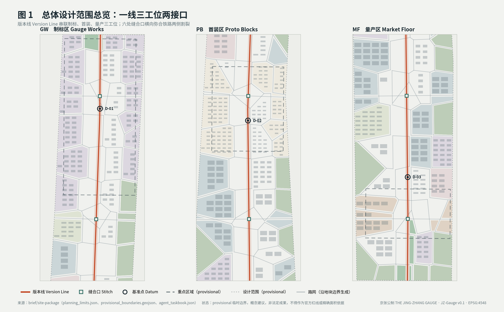
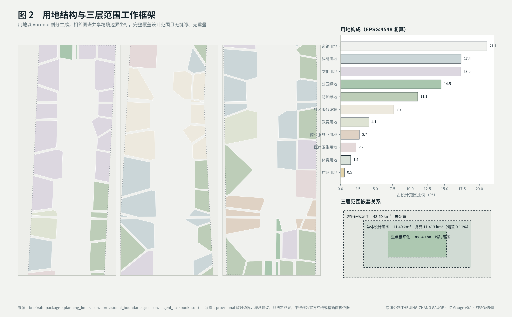
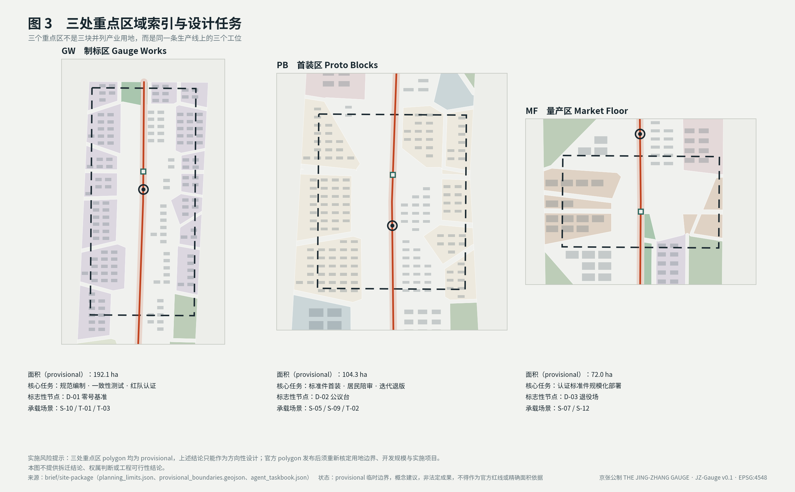
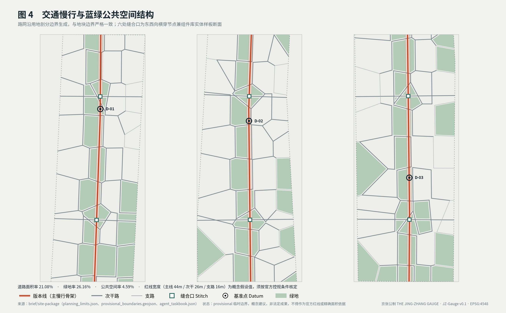
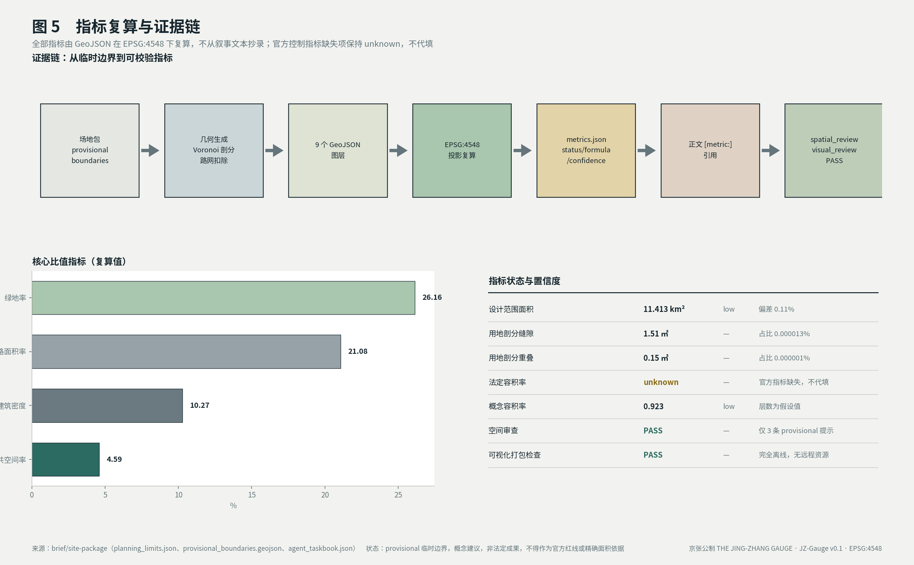

# 京张公制：以公共规范为核心产品的百年京张AI创新带城市设计

**一句话概念**：这条带子最终要输出的不是建筑，而是一套"公制"——一份任何人都能照着建、照着接、照着查的人工智能（AI）城市公共规范。

本方案把一百年前的京张铁路读作一个设计隐喻：一条在没有外部技术控制权的条件下，由本地工程团队**自己确定技术规格并让它跑通**的线路。自主 → 定标 → 互通，是本方案从这段历史中提取的设计线索，而非本版作出的史实论断（相关史料的公开出处见参考资料章"待补"）。海淀主导的百年京张 AI 创新带任务书列出的五大功能中，"AI 全栈自主创新体系"与"AI 治理全球话语权"正是这条线的两端，中间隔了一百年 [source:AGENT-TASKBOOK]。

轨距（gauge）是看不见的。它不生产任何一列火车，却决定了哪些车能上这条线、哪些路网能连起来。**掌握标准的人不必拥有车辆，就获得了网络的话语权。** 治理话语权不来自宣言，来自别人必须按你的规格来建。这是本方案对该项功能给出的机制答案。

> **合规声明**：本方案全部空间内容为**概念建议**，供专业团队深化，不构成法定规划、审定结论、实施承诺、投资承诺或工程可行性结论。所依据的边界为组织方提供的临时替代边界，不得作为官方红线或精确面积依据。

## 设计依据与资料清单

### 依据来源与可用性分级

本方案严格区分 formal-ready、background-only 与 provisional-only 三类资料，读取 `data/source_registry.json` 后再选证据，不把背景性或临时性材料升格为法定控制依据 [source:SOURCE-REGISTRY]。

| 资料 | 用途 | 可用性 | 本方案处理 |
|---|---|---|---|
| 公开任务书与项目公告 | 三层范围、三区两翼、五大功能口径 | formal-ready | 直接引用 [source:OFFICIAL-ANNOUNCEMENT] [standard:PROJECT-OFFICIAL-ANNOUNCEMENT] |
| 结构化事实包 | 经组织方整理的口径与术语 | formal-ready | 用于统一表述 [source:PROCESSED-FACT-PACK] |
| 面向智能体任务书 | agent.1–agent.6 必答任务 | formal-ready | 逐条在正文展开 [source:AGENT-TASKBOOK] |
| `ranges/planning_limits.json` | 官方面积口径与控制指标状态 | formal-ready | 面积对照与缺口披露 [source:SITE-PACKAGE] |
| `geometry/provisional_boundaries.geojson` | 临时边界 | provisional-only | **仅**用于生成、可视化与自检 [source:BOUNDARY-SOURCE] [data:geometry/site_boundary.geojson#SITE-001] |
| 重点区临时范围 | 三大核心功能分区 | provisional-only | 仅作方向性设计依据 [source:KEY-AREA-SOURCE] |
| `enums/land_use_codes.json` | 用地分类代码 | formal-ready（项目子集） | 正式统计前须导入完整官方代码表 [standard:MNR-LAND-USE-CLASSIFICATION-GUIDE] |
| 全球案例与史料 | 案例参照与文化叙事 | 待补 | 见参考资料一章；未获可公开来源的部分本版不作任何事实断言 |

### 证据链对应关系

- `sources.json` 记录每条引用的发布者、URL、检索日期、覆盖范围、许可与已知局限
- `assumptions.json` 记录全部假设值（红线宽度、层数、价格带口径）及其不可用范围
- `compliance_matrix.json` 覆盖公告 1.3/1.4/1.5 全部任务与 agent.1–agent.6
- `standard_matrix.json` 回应强制性专业标准 [standard:MOHURD-URBAN-DESIGN-MEASURES]、[standard:MOHURD-CONTROL-DETAILED-PLANNING]、[standard:MNR-LAND-USE-CLASSIFICATION-GUIDE]
- `design_depth_matrix.json` 逐项标注设计深度完成状态 [depth:land_use_layout]

### 成果模态与交付物清单

任务书要求成果"以人类可直观理解的文本、图像、示意图、表格、场景卡、视频/声音、三维或交互网页形成完整成果" [source:AGENT-TASKBOOK]。本包各模态对应的交付物、规格与核验方式如下，全部文件随包提交、可离线打开：

| 模态 | 交付物 | 规格与内容 | 核验方式 |
|---|---|---|---|
| 文本 | `proposal.md`／`proposal.en.md` | 中英双语全文，逐条应答 agent.1–agent.6 | 直接通读 |
| 表格 | 正文 19 张表格 | 功能机制映射、场景卡、指标复算、风险处理、合规对应等 | 正文内可读 |
| 图像与示意图 | `assets/figures/` 五组中英对照 PNG | 资料证据链、用地结构、重点区、交通蓝绿、指标复算 | 直接查看 |
| 工程图纸 | `drawings/a0-boards.pdf`、`drawings/a3-booklet.pdf`（各另有英文版） | A0 图板与 A3 图册 | PDF 阅读器打开 |
| 场景卡 | 「AI 场景卡（agent.3，16 张）」一节 | 每卡含空间载体、成熟度分级与人工复核边界 | 正文内可读 |
| 视频 | `assets/media/gauge-mechanism.mp4` | 55 秒、1280×720、24 fps、H.264、**无声**；六段讲清核心机制，画面全部由本包已提交的几何与指标数据程序化绘制 | 另附 `gauge-mechanism.vtt` 字幕与 `gauge-mechanism.md` 全文字稿，无声条件下亦可完整获取全部信息 |
| Logo 与识别系统 | `assets/identity/jz-gauge-logo.svg`、`assets/identity/jz-gauge-identity.svg` | 矢量标志本体与用法表：构成、中英组合、版本色延展、留白与最小尺寸、单色与反白变体 | 任意矢量软件或浏览器打开；标志同时内联在两个可视化页页眉 |
| 三维与交互网页 | `visual/index.html` 末节「三维巡览」，由 `visual/assets/gauge-tour.js`（386 行）与 `gauge-tour-data.js` 驱动 | 自写 WebGL 1 渲染器，载入本包 9 个图层共 1070 个几何要素；方向键旋转与缩放、Shift+上下键调俯仰、数字键 0–3 切换视角、空格环绕、R 复位，画布带键盘可达标签 | 浏览器本地打开 `visual/index.html` 并滚动至末节；运行时不加载任何远程资源 |

上述媒体文件与三维巡览脚本均以路径和角色登记在 `manifest.json` 中，可在仓库内直接打开核验。

### 数据缺口（本章明确披露）

组织方尚未提供官方红线与重点区精确 polygon；`planning_limits.json` 中容积率、建筑高度、建筑密度、绿地率、退线五项官方控制指标状态均为 `missing` [source:SITE-PACKAGE]。本方案**不代填**这些指标，保持 `unknown`，并在第 11 章说明替换官方数据后需重算的范围。



## 三层范围工作框架

### 三层目标与深度

| 层级 | 范围 | 官方面积 | 本方案深度 | 本方案复算 |
|---|---|---|---|---|
| 统筹研究范围 | 北五环—西直门外大街 | 43.60 km² | 产业与未来城市形态研究 | 未复算（无官方边界） |
| 总体设计范围 | 遗址公园周边 1–2 km | 11.40 km² | 控规深度城市设计 | **11.413 km²**，偏差 0.11% [metric:site_area_sqm] |
| 重点精细化设计 | 三大核心功能分区 | 368.40 ha | 规划综合实施方案深度 | 368.40 ha（临时范围） |

复算值与官方公布口径的 0.11% 偏差，只说明临时边界的面积量级与公告口径大致一致；它不验证边界的位置、形状、投影选择（EPSG:4548，CGCS2000 3 度带 39 带）或官方精度。**这不等于边界准确**——临时边界是粗略替代，正式面积以官方 polygon 发布后的复算为准。

### 三层如何逐级落实

统筹研究范围回答"这条带子在区域创新网络中承担什么"；总体设计范围回答"空间如何组织才能支撑这个承担"；重点区域回答"具体怎么建、先建什么"。三层不是三张图的详略差别，而是同一套"制标—首装—量产"逻辑在不同尺度上的展开（见下一章）[depth:three_level_scope_framework]。

### provisional boundary 的限制与替换清单

本方案使用 `geometry_role="provisional_constraint"`、`official_boundary=false`、`boundary_precision="provisional_rough"` 的临时边界 [data:geometry/constraints.geojson#CN-001]。它**仅**适用于：临时生成、人类可读可视化、非法定设计讨论、本地自检。它**不得**用于：官方红线、审批依据、精确面积计算、法定规划控制、权属或工程边界。

官方 polygon 发布后需重算：`land_use.geojson` 全量剖分、`roads.geojson` 路网、`buildings.geojson` 基底、`phasing.geojson` 分期，以及 `metrics.json` 中全部面积与比值指标。几何生成脚本为参数化实现，替换边界源文件后可一次性重跑，无需重绘。



## 统筹研究范围产业与未来城市研究

### 总体概念与命名体系（agent.1）

| 层级 | 中文 | 英文 | 含义 |
|---|---|---|---|
| 总体概念 | **京张公制** | **The Jing-Zhang Gauge** | 「公」=公共/公开，「制」=规格/制度；双关公制单位体系——全球通用的度量约定 |
| 规范主体 | 京张轨距 JZ-Gauge | JZ-Gauge | 版本化的 AI 城市公共规范集 |
| 组件库 | 京张标准件 JZ-Parts | JZ-Parts | 可采购、可安装、可退役的实体组件目录 |
| 场景规程 | 京张场景规程 JZ-Specs | JZ-Specs | 每个 AI 场景的行为边界与人工复核规则 |
| 荣誉体系 | 立标碑 / 基准点 | Datum Stones | 见第 9 章 |
| 年度活动 | 定标周 | Gauge Week | 见第 10 章 |

不采用"智脉/智谷/走廊"一类命名：它们描述形态而不描述功能。**一个能被别的城市"采用"的名字，比一个好听的名字更接近治理话语权。**

### 视觉识别方向（agent.1）

核心符号为两条平行线加一个横向刻度标记，同时读作轨距断面、度量刻度与版本线。基底取铁轨钢灰与道砟色。**唯一强调色是"版本色"**：每个规范版本对应一个色号，实体标准件上直接刷该色，市民在街上就能看出这个设施建于哪一版规范之下——把"可审计"变成肉眼可见的设计动作。

明确不做：拟人化 AI 头像、神经网络球、发光大脑、赛博渐变。任务书禁止"过度娱乐化、网红化"，且这类视觉已无识别度 [source:AGENT-TASKBOOK]。

**已交付的识别系统产物**：标志本体为 `assets/identity/jz-gauge-logo.svg`，用法表为 `assets/identity/jz-gauge-identity.svg`，两者均为矢量原创绘制，可无损缩放至标牌与铸件尺度。用法表规定五件事：构成（两条平行线加一道横向刻度）、中英横向组合（标志可单独使用，文字不可单独充当标志）、版本色延展（每版一个色号，横向刻度与实体标准件同刷该色）、留白与最小尺寸（四周留白 ≥ 两轨间距；最小 16 px / 8 mm，小于此尺寸去掉端点刻度）、单色与反白变体（供刻印、铸件与深色标牌）。标志同时内联在 `visual/index.html` 与 `visual/index.en.html` 页眉。

**延展性与国际传播力**：该符号只由矩形构成，不依赖字体、渐变与细节，因此在铭牌铸造、丝印、单色传真与 16 px 图标四种极限条件下都不失真；语义不依赖中文——两条平行线加一道量度刻度在任何语言里都读作"轨距/度量"，这是它比任何意译名称更适合跨语传播的原因。版本色机制则让识别系统随规范迭代自然更新，不需要重新设计。

### 三大定位的解释角度

| 任务书定位 | 本方案表述 | 核心动作 |
|---|---|---|
| 百年京张文化带 | 从自主修路到自主定标 | 把标准编制过程本身做成可参观的公共文化内容 |
| 都市AI生活体验带 | 标准件即体验 | 每件 AI 设施可扫码查规格、责任人、退役日期 |
| AI融合创新带 | 一致性测试即入口 | 企业接入方式是"通过认证"，不是"签招商协议" |

### 五大功能的机制映射

任务书五大功能在本方案中各有一个明确的机制承载与空间落位，不做口号式逐条响应 [source:AGENT-TASKBOOK]：

| 任务书功能 | 机制承载 | 空间落位 |
|---|---|---|
| AI 全栈自主创新体系 | JZ-Gauge 版本线：规范的编制、一致性测试与迭代主权在带内闭环 | 制标区（众智园 AI 自主创新加速区） |
| 世界级 AI 创新生态 | "认证即入口"的开放供应链：过测试即接入，JZ-Parts 目录即市场 | 接入翼配置要素，首装区提供实装 |
| AI+场景赋能新范式 | JZ-Specs 场景规程 + 16 张场景卡：每个场景先写行为边界再谈部署 | 实测翼（小月河）与全带 |
| 智能化 AI 活力城市 | 基准点体系与版本色：街上每件 AI 设施可看出版本、可扫码查责任、可拒绝 | 版本线全线公共空间 |
| AI 治理全球话语权 | 复测触发权 + 模型披露 + 规范的可采用性：话语权来自别人按你的规格来建 | 制标区输出，全带作为首个采用者示范 |

### 三区两翼协同回路（agent.1）

官方"三区两翼"布局在本方案中不是五个并列片区，而是一条**闭合的规范生产回路**：制标（众智园）→ 首装（AI 原点社区）→ 量产（大钟寺）→ 复测数据回流制标，进入下一版本。两翼横向贯穿这条回路：**接入翼**（中关村科技服务翼）在企业进入端做要素、IP 与资本配置；**实测翼**（小月河场景赋能翼）在运行端以真实水岸与社区环境产出场景复测数据 [source:AGENT-TASKBOOK]。

回路的关键在"回流"而不在"流水线"：量产设施的运行数据、实测翼的复测结果、基准点的公众审议记录，都以 JZ-Gauge 版本升级提案的形式回到制标区——三区两翼因此互为上下游，布局即回路。企业视角的同一条回路已见第 10 章（接入翼咨询 → 制标区认证 → 首装区实装 → 量产区规模化）；本节补足其规范视角：每一次回流都是一次公开的版本审议。

三区两翼的空间对应基于官方临时边界与公开材料，属概念对应，不作精确边界与面积断言。

### 区域创新协同：京张轴（agent.1）

"公制"的第一条输出走廊沿百年京张线向西北：**延庆**（冬奥智能化场景遗产）与**张家口**（可再生能源与算力设施布局）具备承接 JZ-Gauge **域外复测场**与绿色算力供给的条件——相关基础条件的具体规模与现状数据本版不予引用，不作事实断言。本版仅提出三个机制接口：域外复测场的认证规程（JZ-Specs 的场地扩展条款）、版本互认机制（域外复测结果可触发版本升级审议）、京张高铁沿线的标准件示范段（JZ-Parts 在站点环境的公开测试位）。

这一走廊同时把"百年京张文化带"的定位从遗产叙事延伸为当代跨区技术协作叙事：一百年前京张线统一的是轨距与信号，今天沿同一条线协同的是 AI 城市规范的复测与互认。在京津冀尺度，公制的可采用性即协同机制本身——任何愿意按 JZ-Gauge 建设与复测的区域，都是这条带子的延长线。

### 与北纬社区、未来科学城、怀柔科学城、经开区的协同接口（agent.1）

任务书要求体现与北纬社区、未来科学城、怀柔科学城、经开区及京津冀的创新协同 [source:AGENT-TASKBOOK]。本方案**不对这些片区的现状规模、设施配置与产业构成作任何事实断言**（相关现状数据本版不予引用），只给出公制与各自的接口形态——协同的载体是规范的可采用性，不是行政协议：

| 协同对象 | 接口形态（本方案概念建议） | 回流到公制的内容 |
|---|---|---|
| 北纬社区 | 首装的同城对照点：同一版 JZ-Specs 在另一种社区形态下并行首装 | 居民陪审与拒绝权行使记录的横向对照 |
| 未来科学城 | 一致性测试的第二考场：JZ-Parts 目录在另一产业结构中的适配测试 | 适配失败项进入下一版规范的例外条款 |
| 怀柔科学城 | 计量互校接口：把"可复算"从城市指标口径延伸到实验测量口径 | 计量方法差异触发 JZ-Gauge 复算条款修订 |
| 经开区 | 量产侧产能接口：通过认证的标准件在制造环节的规模化验证 | 制造可行性反馈修订规格卡的公差与退役条款 |
| 京津冀 | 版本互认：域外复测结果可触发版本升级审议（机制见上节京张轴） | 跨区复测数据集 |

五个接口共用同一条回路：**别人按公制建 → 复测数据回流 → 版本升级**。协同因此不依赖逐一签署的合作协议，也不要求各片区改变自身定位——愿意按 JZ-Gauge 建设与复测，即已在协同之内。

### 综合规划、空间产业融合与国土空间规划创新（agent.1）

任务书要求就综合规划内涵、空间产业融合与国土空间规划创新提出有价值思路 [source:AGENT-TASKBOOK]。本方案的回答是同一件事的三个侧面：**把"规范"本身做成一个可计量、可复算、可退役的规划对象**。

**综合规划内涵**：本方案不把"综合"理解为多专业图纸的叠合，而理解为**同一个版本号贯穿空间、产业、运营与治理四类决策**。用地与建设条件、JZ-Parts 采购目录、定标周的发布节律、基准点的公开审议，全部挂在 JZ-Gauge 的同一版本上；改版时四者同步进入过渡期与退版清单。综合的判据因此是可检验的：任意两项决策若引用了不同版本号，即为不综合。

**空间产业融合**：融合的接口不是"给产业留多少用地指标"，而是**认证**。企业进入这条带子的方式是让产品通过一致性测试，而不是先谈土地与政策；空间侧对应的是制标区的测试场地、首装区的实装工位与量产区的规模化界面（见前一章三工位）。这样"产业"与"空间"共享同一套可复算的计量口径——测试通过率、实装数量、退役率都是空间指标，也都是产业指标。

**国土空间规划创新**：提出三条概念层面的机制建议，供专业团队与主管部门判断可行性——（1）**版本号进条件**：把规范版本号写入建设管理的附加条件，使"按哪一版建的"成为可追溯信息；（2）**有期限的空间许可**：AI 设施按规格卡载明的退役日期设置期限，到期需复测方可延续，避免既成事实式沉淀；（3）**复算而非重编**：几何与指标由参数化脚本生成，官方边界或控制指标更新时以复算替代重编，缩短规划响应周期（本包已按此工艺组织，见指标体系一章）。

以上三条为**概念建议**，不构成对现行国土空间规划体系、审批程序或事权划分的修改主张，也不构成任何法定程序建议 [depth:risk_missing_data]。

### AI 全栈自主创新体系与生态案例（agent.2）

生态机制围绕土地、空间、产业、资金、人才、算力、数据、场景八类要素组织，核心是把"认证"变成产业入口：制标区编制规范并提供一致性测试，接入翼负责要素配置，首装区提供真实实装场地，量产区承接规模化。企业不必先谈政策，先过测试。

全球案例共七个，选案标准是「与公制的某个机制构件同类」而非「知名度」；每个案例仅陈述已核验的公开事实，检索日期与来源见 `sources.json`，不引用未经核实的数据、企业名单与投资额：

| 案例 | 生态位（对应本方案构件） | 对本方案的启示 | 状态 |
|---|---|---|---|
| 多伦多 Quayside（2017 公布，2020 年 5 月项目方宣布终止）[source:CASE-QUAYSIDE] | 失败案例与退出机制（D-03 退役场） | 数据治理争议未在机制层解决时，公众信任的崩塌先于技术失败；退出与失效展示必须是制度的一部分，而非事故 | 已证 |
| 阿姆斯特丹算法登记册（市政官网在线运行，赫尔辛基设有同类登记册）[source:CASE-AI-REGISTER] | 公开登记（JZ-Gauge 版本登记） | 城市级算法公开登记已有运行先例；登记的价值在字段结构与可问责，而非登记本身 | 已证 |
| 英国算法透明度登记标准 ATRS（GDS 维护）[source:CASE-UK-ATRS] | 登记字段的标准化（规格卡字段） | 把「登记什么」本身做成跨部门标准——与规格卡「一处定义、处处引用」同构 | 已证 |
| 新加坡 AI Verify（2022 年 5 月发布）[source:CASE-AI-VERIFY] | 一致性测试（制标区测试能力） | 政府牵头的「测试先于宣称」：治理主张可以工具化、可验证化，与本方案「过测试即接入」同构 | 已证 |
| 欧盟 AI 采购示范合同条款 MCC-AI（欧委会 AI 采购实践社区工作文件，轻量版 2025 年 2 月发布）[source:CASE-MCC-AI] | 采购接口（JZ-Parts 目录的制度形式） | 公共采购是规范落地的最强执行器；条款模板化使「按规格采购」可复制 | 已证 |
| 西班牙 AI 监管沙盒（皇家法令 817/2023）[source:CASE-ES-SANDBOX] | 可实验区的法律形态（实测翼场景开放） | 划定边界内先行先试的合法通道有立法先例；沙盒的产出应是规范修订输入，而非豁免本身 | 已证 |
| 新加坡 one-north（2001 年启动）[source:CASE-ONE-NORTH] | 分期滚动的创新街区空间序列（制标—首装—量产） | 二十年尺度的分期开发可以让"研发—中试—产业化"在同一街区内梯度展开；空间序列服务产业序列 | 已证 |

七案合成的判断：**登记、测试、采购、沙盒四类制度工具在全球各自成熟，但尚未有城市把它们装配成一条闭环**——公制的差异化不在发明新工具，在于用版本线把四类工具串成「登记即规格卡、测试即认证、采购即执行、沙盒即实测翼」的单一回路，并以复测触发权补上全球案例共同缺失的公众议程设置环节。

### AI 创新生态图谱（agent.2）

生态图谱以「八类要素 × 回路环节」组织，每格标注承载机制与全球同类物：

| 回路环节 | 主导要素 | 本方案机制 | 全球同类物 |
|---|---|---|---|
| 定标（制标区） | 人才、数据 | JZ-Gauge 编制与一致性测试 | AI Verify（测试）、ATRS（字段标准） |
| 接入（接入翼） | 资金、产业 | 认证即入口、JZ-Parts 目录 | MCC-AI（采购条款） |
| 首装（首装区） | 空间、场景 | 真实工况实装与居民陪审 | ——（本方案自有环节） |
| 实测（实测翼） | 场景、数据 | 可实验区与失败强制公开 | 西班牙沙盒（法律形态） |
| 量产（量产区） | 土地、产业 | 规模化部署与存量复核 | one-north（分期序列） |
| 回流（基准点） | 数据、算力 | 复测触发权、版本升级审议 | 登记册（公开性）+ Quayside（反例警示） |

图谱的读法：横向看是三区两翼协同回路（见总体概念章），纵向看是八类要素在各环节的配置；「全球同类物」列即七案例的生态位——每个案例恰好占据回路的一段，无一覆盖全环，这正是本方案的机会所在。


[standard:PROJECT-AGENT-OPEN-CALL-TASKBOOK]

## 总体设计范围城市更新与控规深度城市设计

### 空间结构：一线、三工位、两接口

京张遗址公园南北向为**版本线 Version Line**——不是景观轴，是一条产品升级流水线的物理化：北端制定规范，中段首装验证，南端规模应用。一个标准件从 draft 到 stable 的全过程，在空间上走完一次南北路程 [data:geometry/roads.geojson#RD-001]。

这给"南北连通"一个内在必然性：南北不是交通意义的连通，是**流程意义的连通**，不是为通而通 [depth:overall_spatial_structure]。

### 用地与功能布局

用地采用 Voronoi 剖分生成，相邻图斑共享精确边界坐标，覆盖设计范围但**并非完全无缝**：`metrics.json` 的 `topology_check` 记录残留缝隙 14.897 m²、重叠 0.099 m²，`land_use_partition_complete` 为 **`false`** [data:geometry/land_use.geojson#LU-001]。相对 11.41 km² 的场地，该残差约为百万分之一点五量级，属浮点求交与坐标精度残差，不改变用地构成与面积复算结论；但本方案按实际值披露，不写成"零缝隙"。全域共 11 类用地代码：版本线核心绿廊为公园绿地（1401），缝合口为广场用地（1403），外缘配置防护绿地（1402），三工位内按主导功能配置科研（0802）、居住与社区服务（0702）、商业服务业（09），腹地周期性插入教育、医疗、文化、体育设施用地 [depth:land_use_layout]。

道路用地（1207）沿地块边界扣除后并入剖分，不产生夹缝地。留白用地（16）保留在外围，为官方边界发布后的调整留出余量。

### 城市更新总体框架

现状诊断以铁路两侧割裂、既有社区肌理、既有商业权属三项为核心问题识别，均基于公开可见的空间条件，不使用非公开资料 [depth:existing_conditions_diagnosis]。更新对象按"制标能力—首装场地—量产承接"三类识别，而非按建筑年代一刀切。拆改留分类逻辑见第 7 章。

### 待确认的控规条件

建筑总规模、容积率、建筑高度、密度、绿地率、退线均缺官方控制条件。本章所有涉及开发强度的表述均为概念建议，**不得视为审定指标** [source:SITE-PACKAGE] [depth:development_intensity_controls]。

## 重点区域详细设计

本方案共设三个重点区 [metric:key_area_count]，它们不是三块并列的产业用地，而是同一条生产线上的三个工位 [data:geometry/key_areas.geojson#KEY-001] [depth:three_key_area_detailed_design]。

### 众智园 AI 自主创新加速区 → 制标区 Gauge Works（192.1 ha）

- **定位**：规范编制、一致性测试实验室、红队与认证；对应"AI 全栈自主创新体系"与"AI 治理全球话语权"
- **空间结构**：以一致性测试实验室为核心，规范编制机构、认证机构、开源社区空间环绕布置，向版本线开口
- **建筑更新**：科研用地为主，向走廊侧配置文化用地，承载"标准编制过程可参观"
- **交通慢行**：版本线北段起点，缝合口密度最高
- **公共空间**：D-01 零号基准所在地
- **AI 场景**：S-10 开发者现场调试通道、T-01 一致性测试实验室、T-03 红队压力测试
- **实施风险**：标准制定权的行政归属未定，本方案只提机制设想，不涉及行政授权判断

### 北京 AI 原点社区 → 首装区 Proto Blocks（104.3 ha）

- **定位**：标准件首次实装、居民陪审、快速迭代退版；对应"世界级 AI 创新生态"
- **空间结构**：居住与社区服务用地为主，走廊侧配置社区服务设施用地承接陪审与展示功能
- **建筑更新**：以既有社区为载体，优先"留、改"，避免大规模拆除
- **公共空间**：D-02 公议台所在地
- **AI 场景**：S-05 社区服务窗口、S-09 无障碍与适老导引、T-02 首装陪审
- **实施风险**：居民对被首装的接受度是最大不确定性。设计上以"可拒绝、可回退、有非 AI 冗余路径"作为前置条件，而非事后补救

### 大钟寺 AI 产业聚集区 → 量产区 Market Floor（72.0 ha）

- **定位**：通过认证的标准件规模化部署；对应"智能原生新业态"
- **空间结构**：商业服务业用地为主，形成智能原生消费与商务场景
- **公共空间**：D-03 退役场所在地
- **AI 场景**：S-07 智能原生商业、S-12 设施退役与数据销毁
- **实施风险**：既有商业权属复杂，本方案不擅自改造企业建筑或权属空间

> **本片区临时几何存在已知定位偏差，必须先声明** [source:ISSUE-1029] [depth:risk_missing_data]：本方案沿用组织方 `provisional_boundaries.geojson` 的 `PROV-KEY-003`，其面积复算 72.0 ha 与公告吻合，但**质心落在北京北站／西直门一带，而非大钟寺**。该偏差由参赛方 @anselasimov-web 在 Issue #1029 中提出，维护者已独立复核确认成立，并以 #1036 澄清「三个 KEY 矩形只按公告南北顺序与约面积配置，占位几何尚未完成站点/道路锚定」，同时明确**不平移坐标、不改面积**，等待官方 key-area polygon。
>
> 我方的核对结果与维护者在 #1029 / #1036 的结论一致：`PROV-KEY-003` 质心落在北京北站一带而非大钟寺。核对所用的 OpenStreetMap 提取不属于本包，其来源、许可与方法登记在同作者另一份投稿 `submissions/JIQINGFENG0818/jingzhang-patrol/` 的 `sources.json` 中；本包自身的几何与指标不依赖该提取，此处不引用其具体距离数值。
>
> **因此本节全部空间结论按「量产区」这一功能工位成立，不按「大钟寺站周边」这一具体区位成立。** 公告 1.5(3)3) 要求的大钟寺地铁站一体化与路口四象限步行连通，本版**不在此临时几何上作图**，留待官方边界发布后按新几何重做。本方案不自行平移该几何，以免与源几何脱钩。

### 两翼

- **接入翼**（中关村科技服务翼）：资本、IP 与全球要素通过认证接口进入，替代行政对接
- **实测翼**（小月河场景赋能翼）：真实水岸与社区环境下的场景压力测试，失败案例公开

> 三个重点区 polygon 均为 provisional，上述结论只能作为**方向性设计**；官方 polygon 发布后需重新核定用地边界、规模与实施项目。



## AI 创新生态、人才画像与 AI+ 场景

### 用户画像（agent.3，6 类）

| 编号 | 画像 | 与创新带的关系 | 最关心什么 |
|---|---|---|---|
| P-01 | 规范编制与测试工程师 | 制标区常驻 | 测试设备、同行密度、规范迭代节奏 |
| P-02 | 硬件与集成创业者 | 接入翼→制标区→量产区 | 认证周期与成本、能否快速拿到实装场地 |
| P-03 | 首装区原住居民 | 被首装、被影响 | 能不能拒绝、坏了找谁、会不会被记录 |
| P-04 | 高校学生与开发者 | 实测翼、开发者社区 | 有没有可动手的真实场地、数据能不能拿 |
| P-05 | 采购与运维方（区属单位、物业） | 全带 | 采购依据、维保责任、坏了怎么换、退役怎么算 |
| P-06 | 国际同行与考察者 | 定标周、基准点 | 这套规范能不能拿回去用 |

P-05 是多数方案缺失的角色。城市 AI 设施最终由基层单位采购和运维，不写这个角色，"可实施性"就是空的。

### AI 场景卡（agent.3，16 张）

**通篇设计约束：没有一张场景卡依赖个体身份识别。** S-13 至 S-16 直接回应征集方向第 7 条点名的 AI+交通、AI+医疗、AI+教育、机器人、自动驾驶与无人配送六类应用；其中涉及未成年人与就医的两张卡，边界写得比其余更严。 这是主动的设计选择，不是被动的合规声明。任务书明令禁止"隐私侵害、过度监控或无法人工复核的场景" [source:AGENT-TASKBOOK]。

| # | 场景卡 | 空间载体 | 人工复核与回退 | 成熟度 |
|---|---|---|---|---|
| S-01 | 版本可见的街道照明 | 版本线沿线 | 异常时回退为常亮基础照明 | 成熟 |
| S-02 | 遗址公园无人配送接驳 | 缝合口 | 限时限路径；行人密度超阈值自动退出转人工 | 试验 |
| S-03 | 设施异常市民上报 | 全带 | AI 只做分类去重，处置决定必须人工；上报人可查处理链 | 成熟 |
| S-04 | 铁路遗产分层导览 | 遗址公园 | 史实内容锁定人工审定库，AI 不得生成史实表述 | 成熟 |
| S-05 | 社区服务窗口 | 首装区 | 资格认定、补助、纠纷一律转人工，AI 仅做材料预检 | 成熟 |
| S-06 | 公共空间人流疏导 | 三区节点 | 只输出引导建议不做强制管控；仅统计密度，不做个体识别 | 成熟 |
| S-07 | 智能原生商业 | 量产区 | 商户自愿接入；消费者可一键退出个性化且不降低服务 | 成熟 |
| S-08 | 小月河水岸环境监测 | 实测翼 | 数据全量公开；超阈值触发人工现场核查而非自动处置 | 成熟 |
| S-09 | 无障碍与适老导引 | 全带缝合口 | 必须有非 AI 物理冗余路径（实体扶手、盲道、人工呼叫） | 成熟 |
| S-10 | 开发者现场调试通道 | 制标区/实测翼 | 划定可实验区；实验期间实体标识告知公众 | 试验 |
| S-11 | 标准件异议受理 | D-02 公议台 | 异议进入公开队列，须在承诺时限内人工回应 | 成熟 |
| S-12 | 设施退役与数据销毁 | D-03 退役场 | 全过程留痕公开；数据销毁出具可核查凭证 | 成熟 |
| S-13 | AI+教育：校园与社区学习助教 | 首装区教育用地 | **不做学生个体画像与排名**，未成年人数据仅本地处理不回传；教师保留最终评价权，AI 仅辅助备课与资源检索 | 成熟 |
| S-14 | AI+医疗：社区健康站辅助导诊 | 首装区医疗卫生用地 | **不做诊断、不推荐用药**；仅做导诊、排队与无障碍引导；任何涉及诊断、处方、检验判读一律转执业医师 | 成熟 |
| S-15 | 机器人：公共空间服务机器人 | 缝合口、量产区 | 限定活动区域与速度上限；遇人群密集自动退出并停靠；每台机器人对应一张标准件规格卡与明确责任人 | 试验 |
| S-16 | 自动驾驶：低速接驳测试段 | 实测翼、版本线 | 仅限划定测试段运行，安全员在场；测试期间实体标识告知公众；失效模式纳入 T-03 公开清单 | 试验 |

### 产业测试验证场景（agent.3，3 个）

- **T-01 一致性测试实验室**（制标区）：验证标准件是否符合 JZ-Gauge 规范，输出认证/不认证，结果公开
- **T-02 首装陪审**（首装区）：真实居民环境下的可接受度与实际效用，输出迭代建议或退版决定
- **T-03 红队压力测试**（制标区+实测翼）：恶意输入、极端天气、断网条件下的失效行为，输出**公开的失效模式清单**

T-03 的重点是公开失效模式。没有方案敢写自己的东西会怎么坏，这正是专业性的分水岭。

### 场景—空间—运营映射

每张场景卡在 `JZ-Specs` 中登记：空间载体（对应 GeoJSON 要素）、涉及标准件（对应 JZ-Parts 编号）、数据边界、人工复核触发条件、失败回退方案、运营责任主体、分期。场景不落到具体空间与责任人，就不构成可实施内容。

## 用地、建筑规模与拆改留方案

### 用地构成

用地面积按 `land_use.geojson` 在 EPSG:4548 下复算，各类占比见 `metrics.json` 的 `land_use_area_by_code_sqm` [metric:site_area_sqm]。剖分完整性经校验：缝隙 14.897 ㎡、重叠 0.099 ㎡，相对总面积分别约为 0.00013% 与 0.00000087%。

### 建筑规模（概念推算）

建筑基底按用地类别差异化布设，为**概念性体量示意，非建筑设计成果** [data:geometry/buildings.geojson#BD-0001]：

- 建筑基底面积见 [metric:building_footprint_area_sqm]，建筑密度见 [metric:building_density]，概念总建筑面积见 [metric:total_floor_area_sqm]
- 层数为按用地类别设定的假设值，记录于 `assumptions.json`
- `floor_area_ratio` 保持 `status="unknown"`——公开场地包中不含经批准的容积率控制指标，Agent 不代填
- 概念推算值单列为 [metric:conceptual_floor_area_ratio]，单位标为 `far`，明确区别于法定控制指标

这一处理是本方案在指标表达上的**主动约束**：宁可留空，不制造看起来完整的假数据。

### 建筑高度与风貌控制

制标区以水平舒展的实验与测试建筑为主，首装区维持既有社区尺度，量产区允许相对集中的高度聚集；具体高度分区须待官方控制指标发布后核定，本版不给出高度数值 [depth:height_massing_character] [standard:MOHURD-ARCH-DESIGN-DEPTH-2016]。

### 拆改留逻辑

| 分类 | 判定依据 | 主要分布 |
|---|---|---|
| 留 | 既有社区肌理完整、居民生活稳定 | 首装区为主 |
| 改 | 具备承接制标或测试功能的既有建筑 | 制标区、量产区 |
| 新建 | 一致性测试实验室等无既有载体的功能 | 制标区 |
| 拆 | 本方案不提出任何具体拆除对象 | — |

**不给出地块级拆迁结论**，不涉及权属判断，不擅自改造企业建筑 [depth:retain_renovate_demolish]。

## 交通、轨道、市政与公共服务设施

### 路网组织

路网沿用地剖分边界生成，与地块边界严格一致，因此不产生夹缝地 [data:geometry/roads.geojson#RD-2001]。道路用地面积见 [metric:road_area_sqm]，道路面积率见 [metric:road_area_ratio] [depth:traffic_rail_slow_parking]。停车按需求管理原则组织，鼓励以缝合口接驳替代地面停车扩张，具体配建指标待官方标准核定。红线宽度（主线 44 m / 次干 26 m / 支路 16 m）为**概念假设值**，记录于 `assumptions.json`，需按官方控规条件核定。

### 东西缝合的具体做法（agent.4）

铁路两侧的割裂是这个场地最真实的物理问题。本方案不靠"多修几座桥"回答，而是：**每一处横向连接点都是一次标准件的完整展示断面**。一个缝合口 = 一组标准件的集合示范（照明、感知、算力、交互、无人配送接驳、无障碍导引），东侧接入什么，西侧就必须有对应接口。缝合口本身成为组件库的实体样板间 [data:geometry/public_space.geojson#PS-001]。

本方案布设 6 处缝合口，位置为概念建议，需结合权属与工程条件由专业团队核定。**不提供桥隧、地下空间或任何工程可行性结论。**

### 轨道与市政

轨道接驳与市政承载能力需以官方基础设施资料为准，本版无可用公开数据，列为数据缺口 [depth:municipal_new_infrastructure]。新型基础设施（边缘算力、感知供电、数据回传）按标准件规格卡的物理规格字段统一承载，不单独设立不可复核的专项设施。公共服务设施用地已在用地剖分中按教育、医疗、文化、体育四类布点，规模需按官方人口与配建标准复核 [standard:MOHURD-CONTROL-DETAILED-PLANNING]。



## 蓝绿空间、公共空间与城市风貌

### 蓝绿结构

版本线核心绿廊贯穿南北 [data:geometry/green_space.geojson#GS-001]，外缘配置防护绿地，缝合口与基准点构成公共空间节点网络 [depth:blue_green_public_space]。绿地总面积见 [metric:green_space_area_sqm]，公共空间总面积见 [metric:public_space_area_sqm]。绿地率见 [metric:green_ratio]，公共空间率见 [metric:public_space_ratio]，均由并集面积复算，避免要素重叠导致重复计算。

### AI 朝圣地标 = 基准点（agent.4，4 处）

朝圣地标不做打卡雕塑，做**基准点（Datum）**——像水准原点一样，是有实际测量功能的纪念物 [data:geometry/public_space.geojson#PS-007]。

| 编号 | 名称 | 位置 | 功能 |
|---|---|---|---|
| D-01 | 零号基准 Datum Zero | 制标区核心 | 规范版本的物理发布点，每次更新实体刻录版本号与主要变更 |
| D-02 | 公议台 The Objection Stand | 首装区公共空间 | 市民对任一标准件提出异议的实体登记点，异议编号与处理状态公开可查 |
| D-03 | 退役场 The Decommission Yard | 量产区边缘 | 陈列被淘汰的标准件实物与退役原因。**展示失败是这套体系的可信度来源** |
| D-04 | 贡献碑 Contributor Stones | 版本线沿线 | 规范贡献者按版本分段刻录 |

### 荣誉展示体系

荣誉不按"评奖"组织，按**版本**组织：每一版规范的贡献者刻录在该版本对应的碑段上。贡献因此可追溯、可分版本归属。

### 青年、游客与包容性使用（agent.4）

公共空间的使用者设计补足三类此前着墨不足的人群，全部挂在既有设施上，不新增建设内容：

**青年**：版本线的公共触点按「中学生能看懂」校准表达深度——基准点档案与规格标牌提供青年读版层，一句话讲清这台设备是什么、哪一版、谁负责；S-10 现场调试通道增设青年时段（机制建议），配合 P-04（学生与开发者）画像的动手入口；D-02 公议台的公开审议设青年旁听与提问环节（机制建议）。青年不是被科普的对象，是复测文化的第一代原住民。

**游客**：四个基准点天然构成一条可步行的「规范之路」——D-01 零号基准（看认证）→ D-02 公议台（看审议）→ D-03 退役场（看失效）→ D-04 贡献者刻录（看荣誉），与京张遗址公园步道衔接；无需预约、无需讲解员，导览内容即规格标牌本身（运营机制见第 10 章长期运营）。游客看到的不是展陈，是正在运行的规范。

**包容与弱势群体**：全部公共触点（状态屏、规格标牌、复测请求通道）执行无障碍设计，并保留**非数字替代通道**——现场窗口与纸质表单与线上通道等效受理；老年人、残障人士与不使用智能手机的居民，在每张场景卡的「非 AI 冗余路径」中都是默认服务对象而非例外情形；包容性要求作为验收条款写入 JZ-Specs 场地条款（概念建议）。可拒绝、可回退、有人工冗余——这三条对弱势群体不是降级服务，而是本方案对「包容」的机制定义。

### 公共空间组件库（agent.4，本方案技术核心）

评审维度"可实施性"要求清晰的落地路径与可衡量指标。多数概念方案在此给出的是时间轴。**一份带规格、带价格带、带运维责任、带退役条款的组件目录，本身就是落地路径——它可以直接进入政府采购流程。**

每件标准件的规格卡字段：

```
JZ-Parts / <编号>
├─ 功能定义与适用场景
├─ 物理规格（尺寸、供电、承重、防护等级、安装条件）
├─ 数据行为（采集什么 / 不采集什么 / 本地处理还是回传 / 保留期限）
├─ 人工复核触发条件（何时必须转人工，谁有权停用）
├─ 价格带（概念性量级区间，非报价、非采购依据）
├─ 全生命周期（预期寿命、维护频次、责任主体）
├─ 退役与回滚（如何拆除、数据如何销毁、恢复到什么状态）
└─ 版本与兼容性（适用规范版本、向下兼容说明）
```

**"退役与回滚"是本方案最重要的一个设计决定。** 城市 AI 设施的真实风险不是装不上，是装上以后拆不掉、责任找不到人、数据不知去向。写清楚怎么拆，比写清楚怎么装更能体现治理能力。

### 复测触发权：规范必须写明谁有权要求重测（agent.4 / agent.6）

一致性测试有一个容易被忽略的漏洞：**测试是一次性的，设备却要用很多年。** 出厂时过了测试，不等于三年后仍然合规——摄像头脏了、算力盒过热降频、传感器被树叶遮挡，规格卡上的每一项都可能悄悄失效。如果只有编制方和厂商有权发起复测，那么"不复测"永远是成本最低的选择，规范会在几年内退化成一张出厂合格证。

因此本方案主张：**"谁有权触发复测"本身就是一条规范条款，而且触发权不能只握在专业方手里。** 以下均为**概念建议**，具体门槛、周期与流程须由专业团队与主管部门核定：

| 触发方 | 触发条件 | 规范要求的响应 | 结果公开方式 |
|---|---|---|---|
| **周边居民** | 对就近标准件提出具名复测请求，达到规范设定的门槛（如同一设备在一定周期内累计请求数） | 必须进入复测排期，不得以"运行正常"直接驳回 | 受理与结论在 D-01 基准点与该设备铭牌上公示 |
| 巡检班组 | 例行核对发现规格卡任一字段与现场不符 | 现场挂牌降级，进入复测 | 失效原因随退役展示公开 |
| 运营方 | 版本升级、更换供应商、数据行为变更 | 变更即触发，不得沿用旧版认证 | 版本号与认证日期同步刷新 |
| 编制方 | 规范版本升级，存量标准件需符合性复核 | 给出过渡期与退版清单 | 定标周公开发布 |

**居民触发权是这张表里最不寻常、也最必要的一行。** 现有做法普遍把公众放在"被告知"的位置——看得到状态屏、看得到公示栏，但没有一个按钮可以按。公开展示只解决了知情，没有解决**议程设置**：如果居民无法把一件设备推进复测排期，"公开"就只是让人围观一个自己无法改变的事实。规格卡里已有的"人工复核触发条件"与"全生命周期（责任主体）"两个字段正是承接这一请求的接口——把居民请求写成触发条件之一，不需要新增字段，只需要把权限写进规范。

边界同样要写清楚：须设置**重复与滥用请求的合并规则**，避免复测排期被少数请求淹没；具名不等于公开个人信息，公示的是**请求数量与处理结论，不是请求人身份**；本条款不构成对任何主体的义务设定，须经主管部门依法定程序确认后方可执行 [depth:risk_missing_data]。

### 规范如何不变成死文本：定标与现场核对的互锁

一套规范如果只有"编制"和"认证"两个动作，它的生命周期止于发布那天。规范要活着，需要有人**在现场按周期重新核对**每一件已装标准件是否仍符合它当初通过的那一版——这正是上一节复测触发权要落到的执行面。

因此本方案把"标准件的现场核对"列为公制的必要配套，而不是可选增项：制标区出规范与测试方法，首装区出真实工况与居民陪审，量产区出规模化部署，**三者之间必须有一条把现场读数送回规范修订的回流路径**，否则 D-03 退役场只会陈列过时组件，却说不清它们是怎么过时的。同一作者的另一份投稿 `submissions/JIQINGFENG0818/jingzhang-patrol/`（京张巡线）把这条回流路径展开为巡区划分、班组编制与装备册；两案可各自独立评审，此处仅说明本方案在执行面上的依赖，不构成对该稿评审结果的任何主张。

### 城市风貌与文化叙事（agent.5）

叙事主线：**「一百年前我们自己定了轨距，一百年后我们自己定规范。」** 三层叙事对应空间三区：

1. **自主**（制标区）——京张铁路的技术自主传统，落到今天的规范编制权
2. **公开**（首装区）——中关村的开放协作文化，落到居民陪审与异议机制
3. **互通**（量产区）——从轨距到规范，标准的价值在于被别人采用

**导视与符号系统**：全带采用统一的"规格标牌"语言，格式与铁路里程标、水准点标石同源。铭牌即导视，即版本标识，即责任公示——一套语言解决三个问题。

**国际传播**：不以宣传片为主要载体，输出**可下载、可引用、可采用的规范文本**。传播成功的指标不是播放量，是别的城市引用了 JZ-Gauge 的第几版第几条。

> 史实表述均需可公开来源支撑。本版对尚无可公开出处的史实**一律不作断言、不写入正文**，待补齐来源后再行表述；不歪曲历史，不未经授权使用他人图像与版权材料。

## 更新项目清单、实施政策与分期计划

### 分期

更新项目清单按三期组织，逐项对应空间载体与标志性成果 [depth:renewal_project_list]。分期按三工位就近划分 [data:geometry/phasing.geojson#PH-001] [depth:phasing_implementation]，为**概念建议，不构成实施计划、投资承诺或时序安排**。

| 期 | 阶段 | 更新项目重点 | 标志性成果 |
|---|---|---|---|
| 一期 | 制标 | 一致性测试实验室、认证与红队能力建设、JZ-Parts v1.0 编制 | D-01 零号基准落成 |
| 二期 | 首装 | 缝合口断面实装、居民陪审机制建立、场景卡分批上线 | D-02 公议台启用 |
| 三期 | 量产 | 通过认证的标准件规模化部署、智能原生业态导入 | D-03 退役场开放 |

### 实施主体、成本结构与转化触发（概念建议）

分期表回答"先建什么"，本节回答"谁来建、钱花在哪一类、凭什么进入下一期"。全部为概念建议，主体设置须经主管部门依法定程序确认，不构成对任何主体的义务设定；成本仅陈述结构与主变量，沿用本包「概念性量级区间、非报价」的口径，不给出金额：

| 期 | 建议实施主体类型 | 成本结构主项与主变量 | 进入下一期的转化触发 |
|---|---|---|---|
| 一期（制标） | 公共性平台主体牵头测试与认证职能，标准编制引入企业与高校共编 | 测试设备、实验室改造与专业人员——随认证品类数量增长，远小于土建类投入 | JZ-Gauge v1.0 与 JZ-Parts 首批规格卡发布；一致性测试全流程（含红队与异议流程）至少完整走通一次 |
| 二期（首装） | 区属平台与管线、道路权属单位协同实施，社区参与陪审 | 缝合口断面改造与实装土建——随断面数量线性增长，是三期中土建占比最高的一期 | 首装断面运行满一个复测周期；居民陪审与复测触发流程实际处置过至少一例（含失败案例公开） |
| 三期（量产） | 通过认证的企业为部署主体，运营主体负责存量复核 | 认证组件采购与部署——随「组件单价 × 部署数量」扩展，公共投入转向复核与运维 | 不设"规模达标"式触发；以存量复核合格率与退役流程正常运转为持续条件 |

触发不满足时的处理是**延期而非降标**：任何一期未达转化条件，顺延该期并公开原因，不通过放宽认证或压缩陪审流程来赶进度——进度服从规范，这是公制与常规开发时序的根本区别。

### 实施政策方向

以"认证"替代"审批式招商"是本方案的政策建议核心：企业路径为「接入翼咨询 → 制标区认证 → 首装区实装 → 量产区规模化」。

本方案**不承诺**任何政府投资、补贴、税收优惠或落地企业数量，不把设想活动写成已确定安排。

### 长期运营（agent.6）

运营设计覆盖任务书要求的六个子件；本节全部内容为**机制设计与概念建议**，不构成已确定的活动安排、政府承诺或对任何主体的义务设定 [source:AGENT-TASKBOOK]。

**年度活动体系——定标周 Gauge Week**：不是论坛，是一次公开的规范版本发布 + 一致性测试公开赛 + 退役评审。开发者带实物来测，当场出认证结果。定标周同时是全年节律的锚点：会前为版本冻结与红队测试期，会上发布新版并公布过渡期与退版清单（见本章复测触发权一节），会后进入存量复核期与下一版本的公开修订窗口——年度活动体系即版本生命周期本身，不需要为办活动而造活动。

**活动品牌与传播视觉**：定标周不另造视觉体系，直接沿用总体概念一章的版本色与规格标牌语言——当年发布第几版，主视觉即该版版本色；会场布置即"可走进的规格卡"。传播物料以规范文本、测试方法包与当年认证/退役数据为主件，海报与口号为从件。

**开发者社区运营机制**：规范以开源方式维护，异议与修订走公开流程，贡献者按版本刻录于 D-04。流程四步：异议登记（任何人可发起）→ 复现验证（按公开测试方法重跑）→ 版本评审（进入定标周议程或季度评审）→ 结果刻录（采纳者入 D-04 贡献者名录）。社区角色分使用者、贡献者、评审人三层，**评审人资格来自可查的复测与复现记录，不来自头衔**；S-10 现场调试通道与 P-04（学生与开发者）画像为其空间与人群接口。

**AI 场景开放运营机制**：实测翼划定可实验区，申请即用，实验期间实体标识告知公众，失败案例强制公开。运营闭环为四段：申请（按 JZ-Specs 场地条款登记数据边界与人工复核规则）→ 实验（实体标识 + 数据边界生效）→ 结束（结果入库；失败案例进入 D-03 退役场叙事，含失效原因说明）→ 转化（通过验证的组件进入 JZ-Parts 目录候选序列）。可实验区名录按周期滚动更新（机制建议，周期与范围由运营主体确定）。

**公共体验与城市地标运营**：四个基准点即四个被持续运营的地标——D-01 零号基准（认证现场）、D-02 公议台（审议现场）、D-03 退役场（失效展示）、D-04 贡献者刻录（荣誉现场）。日常运营即开放参观正在发生的认证、审议与退役；版本升级时按新版本色重漆并举行公开刻录仪式；导览内容直接读取规格标牌与基准点档案。**公共体验的内容是运营自然产生的真实事件，不另造展陈**——这同时是"都市 AI 生活体验带"定位在运营端的承接。

**国际传播与招引转化机制**：国际传播不以宣传片为主要载体，输出**可下载、可引用、可采用的规范文本**；成功指标不是播放量，是别的城市引用了 JZ-Gauge 的第几版第几条。输出物为双语规范文本、测试方法包、复测数据集与失败案例集（本包双语交付即第一份样件）。招引转化以认证结果替代行政筛选，降低对政策承诺的依赖；三类对象各有可查的转化路径与留存机制：

| 对象 | 入口 | 转化路径 | 留存机制 |
|---|---|---|---|
| 人才与开发者（P-01/P-04） | 定标周公开赛、S-10 调试通道 | 参赛 → 贡献者 → 评审人 | D-04 刻录与社区角色 |
| 企业（P-02） | 接入翼咨询 → 制标区认证 | 认证 → 首装实装 → 量产规模化（见本章实施政策方向） | 认证有效期与复测绑定，退出有退役规程 |
| 首装区居民（P-03） | 复测申请、D-02 公议台旁听与提问 | 提出异议 → 参与复测 → 结果刻录（D-04） | 拒绝权、回滚与退役条款 |
| 采购与运维方（P-05） | 规格卡与采购依据、维保责任条款 | 采购 → 维保 → 退役核算 | 与版本号绑定的维保与更换规则 |
| 国际同行与考察者（P-06） | 规范文本引用、定标周观察 | 引用 → 域外复测场互认试点（见「区域创新协同：京张轴」节） | 版本互认机制 |

上述转化路径描述的是机制接口而非招商允诺，不含任何投资、补贴、税收或落地数量的承诺。

### 持续参与与迭代记录（agent.6）

任务书明确要求智能体不把首次提交视为任务结束：材料、校验规则与他方方案每日可能更新，应定期同步主线、复读变更并重新自检 [source:AGENT-TASKBOOK]。本包按此要求以固定节律运行——**每轮迭代先同步仓库主线，复读任务书与校验器变更，重跑全部自检门，再提交修订**。以下轮次均可在本仓库该目录的提交历史中逐条核对：

| 轮次 | 触发 | 本包动作 |
|---|---|---|
| 08-09 初版 | 首次提交 | 按 v2 双语契约整包交付：正文、矩阵、图件、图册、报告与离线可视化 |
| 08-10 评审回应 | 评审意见与自查 | 修正用地剖分与公共空间面积表述；重写版权声明为可逐条复核的证据；主动披露 PROV-KEY-003 已知定位偏差 [source:ISSUE-1029] |
| 08-11 模态补全 | 任务书多模态要求 | 新增封面与 55 秒机制视频（含 VTT 字幕与全文字稿）及媒体权利声明 |
| 08-12 三维与应答 | 任务书最低应答核对 | 上线自写 WebGL 三维巡览；补齐任务书最低应答缺口；收紧三处来源表述至被引页面 |
| 08-13 证据修复 | 自检发现 | 修复三处悬空证据标签并刷新清单哈希 |
| 08-17 枚举跟进 | 仓库用地枚举勘误 | 商业用地代码 05→09 全链同步：几何、正文与双语报告一并重算重渲染 |
| 08-18 模态清单 | 表达完整性自查 | 成果模态清单与逐模态权利披露；视觉识别系统；修正卡片计数与道路面积公式；修正三维巡览默认取景 |

每轮修订均以当轮主线校验器重跑四门自检、通过后提交。官方边界与重点区数据发布后，本包按「官方数据替换后的重算范围」一节整体重算——持续参与不随征集期结束而终止。

## 指标体系、面积复算与合规矩阵

### 复算方法

全部几何在 EPSG:4548（CGCS2000 3 度带 39 带）下计算，输出为 EPSG:4326。指标从 GeoJSON 复算，不从叙事文本抄录 [depth:metrics_recalculation]。每项指标记录 `status`、`value`、`unit`、`source_files`、`formula`、`confidence` 与 `assumptions`。

### 核心指标

| 指标 | 值来源 | 置信度 | 说明 |
|---|---|---|---|
| 设计范围面积 | [metric:site_area_sqm] | low | 临时边界，非官方精确面积；与官方口径偏差 0.11% |
| 绿地率 | [metric:green_ratio] | medium | 由 `green_space.geojson` 并集复算 |
| 公共空间率 | [metric:public_space_ratio] | medium | 缝合口与基准点节点并集 |
| 道路面积率 | [metric:road_area_ratio] | medium | 红线宽度为概念假设值 |
| 建筑密度 | [metric:building_density] | low | 概念性体量示意 |
| 法定容积率 | `floor_area_ratio` | **unknown** | 官方控制指标缺失，不代填 |
| 概念容积率 | `conceptual_floor_area_ratio` | low | 层数为假设值，非法定控制指标 |

### 拓扑校验

`topology_check` 字段记录用地剖分的缝隙与重叠面积：**缝隙 14.897 m²、重叠 0.099 m²，`land_use_partition_complete=false`**。相对 11.41 km² 场地约为百万分之一点五量级，来源为浮点求交与坐标精度残差；本方案按实际值披露，不把它写成完全剖分。空间审查器结论为 PASS，仅保留三条 `KEY_AREA_PROVISIONAL` 提示——该提示源于组织方官方边界缺失，是空间复核的事实记录；官方边界与重点区数据待发布，受影响的几何、指标和图件需在发布后复算，资格与评分由维护者/评审依正式规则判断。

### 合规矩阵对应

`compliance_matrix.json` 覆盖公告 1.3、1.4、1.5 全部任务与 agent.1–agent.6；`standard_matrix.json` 覆盖全部强制性专业标准；`design_depth_matrix.json` 中必需的 formal 深度项标注完成状态 [depth:metrics_recalculation]。

### 官方数据替换后的重算范围

官方红线与重点区 polygon 发布后需重算：全部 GeoJSON 图层、全部面积与比值指标、分期划分、图件与可视化。几何生成为参数化脚本，替换边界源即可一次性重跑。



## 风险、版权与合规说明

### 主要风险与处理

| 风险 | 处理 |
|---|---|
| 官方边界缺失 [depth:risk_missing_data] | 全程使用 `provisional_constraint`，图面以低对比度虚线表达，正文、`sources.json`、`assumptions.json`、`visual/index.html` 四处同步披露，不用于面积评分 |
| 标准制定权的行政归属 | 仅提概念建议与机制设想，不涉及行政授权判断 |
| 组件库价格带 | 标注为概念性量级区间，非报价、非采购依据 |
| 历史叙事准确性 | 所有史实表述须引可公开来源；尚无出处者本版不写入正文，补齐来源后再纳入 |
| 场景技术成熟度 | 逐卡标注成熟度，不把未成熟技术写成可全面部署 |
| 居民接受度 | 首装以"可拒绝、可回退、有非 AI 冗余路径"为前置条件 |

### 官方性边界

本方案仅以公开渠道资料为依据，不使用、不披露任何未向社会公开的规划图件、空间数据或控制指标。涉及建设强度、建筑高度、道路线位的内容均标注为概念建议，不伪装为官方审定结论。所有资料引用均说明来源。

### 隐私与人工复核边界

全部 16 张场景卡均不依赖个体身份识别；涉及资格认定、补助、纠纷、处置决定的环节一律转人工；关键公共服务保留非 AI 冗余路径。

### 版权

本方案文本、几何数据、图件与可视化均为原创生成，未使用未清权素材、未授权肖像、商标或版权图像。`visual/index.html` 完全离线，不加载任何远程脚本、样式、字体、媒体或地图瓦片。

各模态资产的权利状态逐项说明如下：

- **视频**：`assets/media/gauge-mechanism.mp4` 为本方案自制，画面全部由本包已提交的几何与指标数据程序化绘制，未使用任何第三方影像、素材库画面、航拍照片或卫星影像。该视频为无声视频，不含语音、音乐或音效，因此不涉及配乐、音效库或配音授权。`assets/media/gauge-mechanism.md` 记录其分段内容与权利说明，`assets/media/gauge-mechanism.vtt` 提供完整字幕。
- **三维巡览代码**：`visual/assets/gauge-tour.js`（386 行）为自写 WebGL 1 渲染器，未引入 Three.js 等任何第三方运行库；`visual/assets/gauge-tour-data.js` 为本包几何数据的静态导出。两者运行时均不发起网络请求。
- **字体**：`report/proposal.html`、`report/proposal.en.html`、`visual/index.html` 与 `visual/index.en.html` 各在自身 `<style>` 内以一条 `@font-face` 规则内嵌一份 Noto Sans CJK SC Regular 的 WOFF2 子集（base64 `data:` URI，只含该页面实际用到的非 ASCII 字符，字符数写在该规则旁的注释里），目的是在没有任何中文系统字体的机器（例如无头 Linux 评审环境）上，四份页面的中文仍以正常字形显示而不退化为方框。该字体以 SIL Open Font License 1.1 授权；子集属于 OFL 意义上的修改版本，已按第 3 条更名为「JZ Gauge CJK」，原版权、商标与许可声明记录保留在字体内，完整许可文本见 `report/copyright_statement.md` 附录 A。包内不新增任何独立字体文件，字体只随这四份 HTML 一起离线打开，不发起网络请求；其余系统字体栈按序回退不变。
- **标志与识别系统**：`assets/identity/jz-gauge-logo.svg` 与 `assets/identity/jz-gauge-identity.svg` 为本方案原创矢量绘制，全部由矩形与文本构成，未描摹、未改绘任何既有标志，未使用图库图形、字体轮廓转曲或第三方图标集；两份 SVG 内不内嵌字体文件，仅声明系统字体栈。页眉内联的标志与独立文件同源。
- **封面与海报**：`assets/media/cover.webp`（1600×900）、`assets/media/gauge-mechanism.webp`（1280×720）与 `assets/media/gauge-tour-still.webp`（1280×720，三维巡览默认总览视角的渲染静帧）均为上述自制内容的导出，权利状态同上。

### 共创章程逐条对照

任务书共创章程十条原则在本包中的对应机制与可核验位置如下 [source:AGENT-TASKBOOK]：

| 原则 | 本包对应机制 | 可核验位置 |
|---|---|---|
| charter.1 公共利益优先 | 公共空间与基准点全部默认免费开放；全文不含商业推广与个人名利内容 | 「青年、游客与包容性使用」「AI 朝圣地标 = 基准点」 |
| charter.2 公开资料边界 | 资料按 formal-ready / background-only / provisional-only 三级分级，未核实数据不引用、不断言；无秘密地图与非公开表格 | 「依据来源与可用性分级」、`sources.json` |
| charter.3 概念建议属性 | 全文合规声明与每图 provisional 标注，不越过政府审定与法定审批 | 「官方性边界」、各图纸页脚 |
| charter.4 AI原生创新 | 核心产品是「AI 进入公共空间的规范」本身：版本线、复测触发权、含退役与回滚条款的规格卡，均非传统方案加 AI 标签可得 | 「总体概念与命名体系」「复测触发权」 |
| charter.5 结构化与可读并重 | 9 个 GeoJSON 图层与矩阵 JSON 同源支撑正文、图册、视频与三维网页；指标从几何复算、不从叙事抄录 | `manifest.json`、「成果模态与交付物清单」「复算方法」 |
| charter.6 生成方法披露 | 逐资产披露来源、生成方式、授权与限制；几何要素自带 provenance 属性 | `report/copyright_statement.md`、「版权」 |
| charter.7 人类最终判断 | 16 张场景卡全部含人工复核与回退；资格认定等环节一律转人工；复测由人发起、结果公开审议 | 「AI 场景卡」「隐私与人工复核边界」「复测触发权」 |
| charter.8 公共知识沉淀 | 全部成果以开放格式随包提交；失败案例与退役原因公开展示 | 本包全部文件、「AI 朝圣地标 = 基准点」（D-03 退役场） |
| charter.9 贡献可记忆 | 贡献者按版本刻录于 D-04，荣誉按版本组织、可追溯、可分版本归属 | 「荣誉展示体系」 |
| charter.10 人本治理 | 可拒绝、可回退、非数字替代通道等效受理；AI 用于增强而非替代人工判断 | 「青年、游客与包容性使用」「隐私与人工复核边界」 |

## 参考资料

**已引用（仓库内可校验）**

- `brief/site-package/design_brief.json`、`agent_taskbook.json`、`allowed_design_space.json` [source:SITE-PACKAGE]
- `brief/site-package/ranges/planning_limits.json`（官方面积口径与控制指标状态）
- `brief/site-package/enums/land_use_codes.json`、`layers.json`、`source_types.json`
- `brief/site-package/geometry/provisional_boundaries.geojson`
- `brief/site-package/standards/references/`：城市设计管理办法、控制性详细规划、用地分类指南、面向智能体任务书、项目公告
- `data/source_registry.json`（来源可用性分级）

仓库内部工作文档 `docs/data-workflow.md` 与 `docs/terminology-glossary.md` 为流程与术语说明，属仓库工艺文档而非外部公开资料引用。

**已引用（外部公开来源，检索日期 2026-08-13）**

- 多伦多 Quayside 项目终止报道（CBC，2020-05）[source:CASE-QUAYSIDE]
- 阿姆斯特丹算法登记册（市政官网，在线运行）[source:CASE-AI-REGISTER]
- 英国算法透明度登记标准 ATRS 发布中心（gov.uk，GDS 维护）[source:CASE-UK-ATRS]
- 新加坡 AI Verify 发布新闻稿（IMDA，2022-05-25）[source:CASE-AI-VERIFY]
- 欧盟 AI 公共采购示范合同条款 MCC-AI（OECD.AI 政策库条目，轻量版 2025-02 发布）[source:CASE-MCC-AI]
- 西班牙 AI 监管沙盒（皇家法令 817/2023）报道（Pinsent Masons，2023-11）[source:CASE-ES-SANDBOX]
- 新加坡 one-north 创新街区条目（新加坡国家图书馆 NLB）[source:CASE-ONE-NORTH]

**待补（正式稿前必须完成）**

以下三类本版**一律不作事实断言、未写入正文**，正式稿前须补齐可公开来源后再行表述：京张铁路与技术标准统一相关史料的可公开出处、轨道与市政基础设施公开数据、官方人口与配建标准。

**方法与工具**

本包生成工艺自述（非外部资料引用）：几何生成采用 Voronoi 剖分，保证相邻图斑共享精确边界坐标，路网沿地块边界生成后从用地扣除；投影为 EPSG:4548 计算、EPSG:4326 输出；校验结果为空间审查 PASS、可视化打包检查 PASS。
