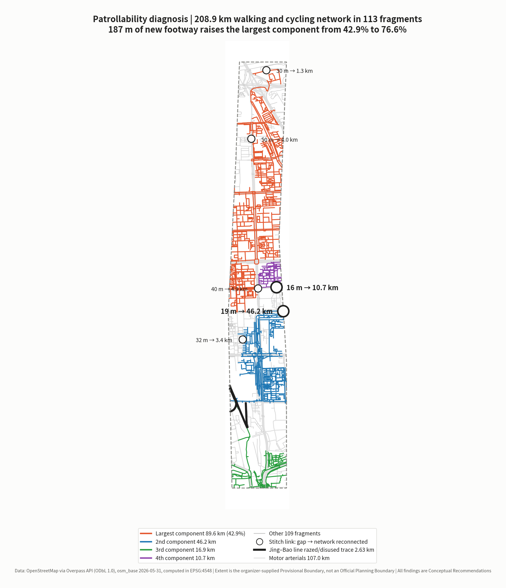
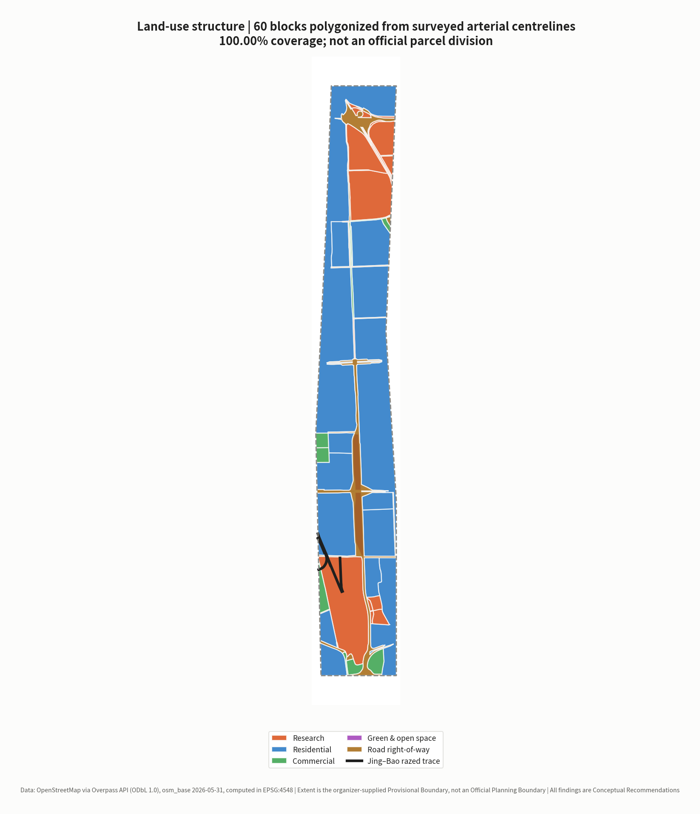
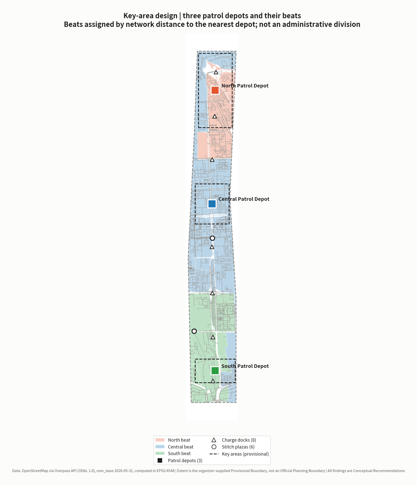
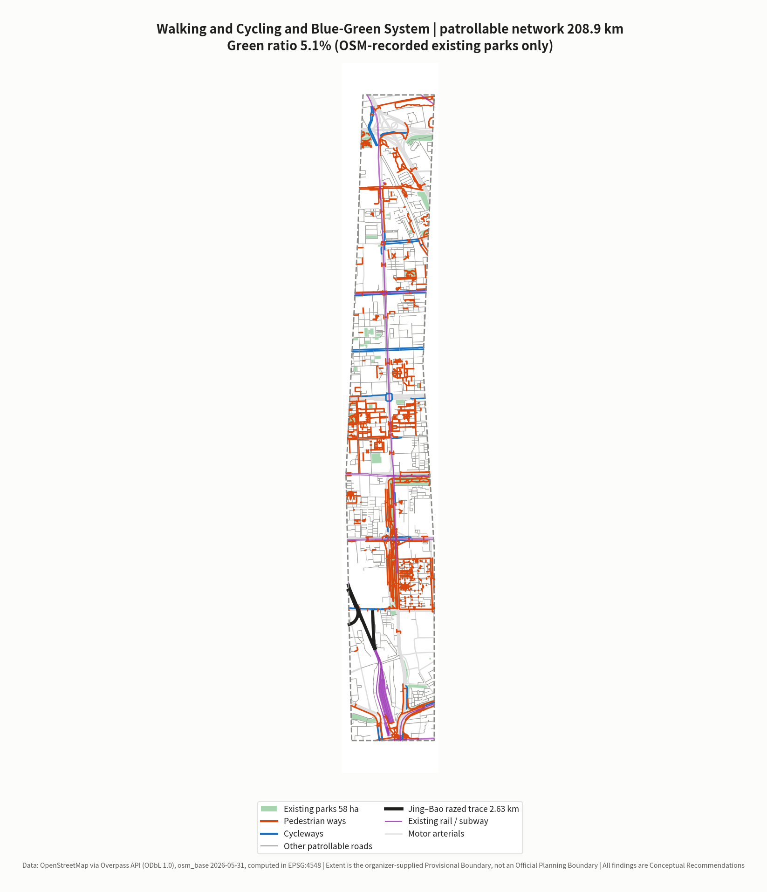
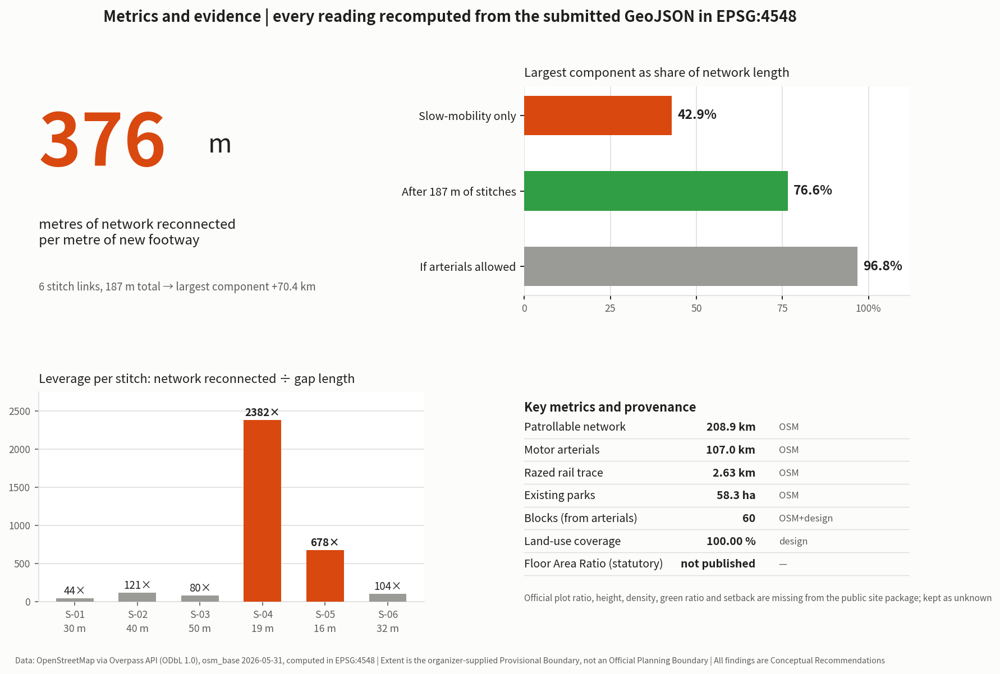

# The Jing-Zhang Patrol Line: A robotics and low-speed autonomous mobility implementation plan built around inspection and maintenance

**In one sentence**: the reliability of urban AI does not come from installation, it comes from patrol. Robots and low-speed autonomous vehicles are defined here as the city's **new track patrollers** — their first duty is not spectacle but walking every segment of the city, every day, checking, recording and reporting.

The Jing-Zhang Railway was built between 1905 and 1909 under the direction of Zhan Tianyou. It was the first state trunk railway in China surveyed, designed, constructed and managed by Chinese engineers, and in May 2013 the Nankou–Badaling section was listed among the Seventh Batch of Major Historical and Cultural Sites Protected at the National Level `[source:NRA-CENTENNIAL-JINGZHANG]`. Public memory of the line usually stops at the zigzag switchback and at technical self-reliance — achievements of **the moment it was completed**.

This proposal asks the next question: **and after completion?** A railway keeps running because of a maintenance regime that walks every segment of the line, day after day, inspecting and reporting. This proposal makes no factual assertion about the historical detail of that regime (no directly citable public source was obtained for this version). It uses it instead as **the origin of a design position**: the value of a line is not settled on the day it opens, it is settled by whether anyone goes and looks at it every day thereafter.

That position has empirical support on the site. Within the Overall Design Area this proposal detects 12 segments of `railway=razed` / `railway=disused` Jing-Bao line trace, totalling 2.63 km `[data:geometry/constraints.geojson#RAIL-001]` `[metric:heritage_rail_trace_length_m]` — the alignment is still there, only nobody patrols it any more.

Every piece of AI equipment installed in a city today faces the same problem: **easy to install, hard to keep alive**. Cameras get dirty, edge-compute boxes on lamp posts throttle when they overheat, roadside perception units get obscured by leaves, delivery robots get stuck in front of a kerb. None of these are algorithm problems. They are maintenance problems. And the overwhelming majority of urban AI proposals answer only "what shall we install", never "who goes and looks at it tomorrow".

This proposal answers the second question.

> **Compliance statement**: all spatial and equipment content in this proposal is a **Conceptual Recommendation** for professional teams to develop further. It does not constitute statutory planning, an approval conclusion, an implementation commitment, an investment commitment, a price quotation or an engineering feasibility conclusion. The boundary used is the organizer-supplied Provisional Boundary and must not be treated as an Official Planning Boundary or a precise-area basis. All cost figures are **conceptual magnitude ranges**, not quotations and not a procurement basis.

---

## Evidence base and source inventory

### Sources and their usability grade

This proposal strictly distinguishes formal-ready, background-only and provisional-only material, and selects evidence only after reading `data/source_registry.json` `[source:SOURCE-REGISTRY]`.

| Material | Use | Usability | Treatment in this proposal |
|---|---|---|---|
| Public brief and project announcement | Three-tier scope, technical categories under call item 7 | formal-ready | Cited directly `[source:PROJECT-OFFICIAL-ANNOUNCEMENT]` `[source:OFFICIAL-ANNOUNCEMENT]` `[standard:PROJECT-OFFICIAL-ANNOUNCEMENT]` |
| Structured fact pack | Organizer-curated terminology and definitions | formal-ready | Used to keep wording consistent and avoid terminology drift `[source:PROCESSED-FACT-PACK]` |
| Key-area provisional extents | The districts housing the three Patrol Depots | provisional-only | Used only as a directional basis for service-radius estimation `[source:KEY-AREA-SOURCE]` |
| Agent-facing taskbook | Mandatory tasks agent.1–agent.6 | formal-ready | Answered item by item `[source:AGENT-TASKBOOK]` |
| `ranges/planning_limits.json` | Official area figures and control-indicator status | formal-ready | Area cross-check and gap disclosure `[source:SITE-PACKAGE]` |
| `geometry/provisional_boundaries.geojson` | Provisional boundary and key-area extents | provisional-only | Used **only** for generation, visualisation and self-check `[source:BOUNDARY-SOURCE]` `[data:geometry/site_boundary.geojson#PROV-SITE-001]` |
| `enums/land_use_codes.json` | Land-use classification codes | formal-ready (project subset) | The complete official code table must be imported before formal statistics `[standard:MNR-LAND-USE-CLASSIFICATION-GUIDE]` |
| Equipment cost magnitudes | Patrol equipment and supporting infrastructure | empirical range | Marked as conceptual magnitude, **not a quotation**, recorded in `assumptions.json` |
| National Railway Administration, *A Century of Jing-Zhang* | Construction period, lead engineer, heritage protection status | formal-ready | Cited directly; only facts explicitly stated on the page `[source:NRA-CENTENNIAL-JINGZHANG]` |
| Ministry of Finance, *Measures for the Administration of Government Procurement Demand* | Institutional basis for writing maintenance duty into procurement | formal-ready | Articles 10, 21, 23 and 24 cited `[source:MOF-PROCUREMENT-DEMAND-2021]` `[standard:MOF-PROCUREMENT-DEMAND-2021]` |
| *Beijing Autonomous Vehicles Regulations* | Local statutory framework for low-speed autonomous driving and patrol scenarios | formal-ready | Articles 2, 23, 24, 37 and 45 cited `[source:BJ-AV-REGULATION-2025]` `[standard:BJ-AV-REGULATION-2025]` |
| OpenStreetMap (via Overpass API) | Existing walking and cycling network, arterials, razed rail alignment, existing parks | Bootstrap base data explicitly permitted by the organizer | Used under `data_policy.may_use_osm_for_bootstrap_base_layers`, with ODbL attribution and crowdsourced-data limitations stated `[source:OSM-OVERPASS-2026-05-31]` `[data:geometry/roads.geojson#ROAD-P-0001]` |
| Railway maintenance-regime historical material | Cultural narrative anchor | to be supplied | This version makes **no factual assertion**; restated as a design position, see the opening section |

### Evidence Chain mapping

- `sources.json` records publisher, URL, retrieval date, coverage, licence and known limitations for every citation
- `assumptions.json` records every assumed value (patrol spacing, response-time targets, equipment cost magnitude, crew ratios) and the range in which each may not be used
- `compliance_matrix.json` covers all tasks under announcement items 1.3 / 1.4 / 1.5 and agent.1–agent.6
- `standard_matrix.json` answers `[standard:MOHURD-URBAN-DESIGN-MEASURES]`, `[standard:MOHURD-CONTROL-DETAILED-PLANNING]` and `[standard:MNR-LAND-USE-CLASSIFICATION]`
- `design_depth_matrix.json` marks the completion status of each design-depth item `[depth:land_use_layout]`

### Data gaps

The Official Planning Boundary and precise key-area polygons have not been released. In `planning_limits.json` the five official control indicators — Floor Area Ratio, building height, Building Coverage Ratio, green ratio and setback — all carry status `missing` `[source:SITE-PACKAGE]`. This proposal **does not fill them in** and keeps them as `unknown`.

Two further gaps are declared openly because this version cannot close them: **existing municipal utility and power-supply capacity data** (which governs charge dock siting) and **existing road gradient and accessibility survey data** (which governs which segments low-speed autonomous driving can use). Both require field survey and official infrastructure records, and are not filled by conjecture.



---

## Working framework across the three-tier scope

### Objectives and depth by tier

| Tier | Extent | Official area | Work in this proposal | Recomputed here |
|---|---|---|---|---|
| Coordinated Research Area (CRA) | North Fifth Ring Road to Xizhimenwai Street | 43.60 km² | Industrial ecosystem and regional coordination for inspection and maintenance | Not recomputed (no official boundary) |
| Overall Design Area (ODA) | 1–2 km around the heritage park | 11.40 km² | Patrol beat division, patrol network, Regulatory Detailed Planning-depth urban design | **11.413 km²**, deviation 0.11% `[metric:site_area_sqm]` |
| Key-Area Detailed Design (KADD) | Three core functional districts | 368.40 ha | Detailed design of three Patrol Depots | 368.40 ha (provisional extent) |

### How the three tiers cascade

The Coordinated Research Area answers "how does inspection and maintenance become an industry rather than merely a cost". The Overall Design Area answers "how is the city divided into units that can be patrolled, reached and responded to". The key areas answer "how is a Patrol Depot actually built, and which one comes first" `[depth:three_level_scope_framework]`.

### Limits of the Provisional Boundary, and what must be replaced

This proposal uses a provisional boundary carrying `geometry_role="provisional_constraint"`, `official_boundary=false` and `boundary_precision="provisional_rough"` `[data:geometry/constraints.geojson#RAIL-001]`. It is applicable **only** to provisional generation, visualisation, non-statutory discussion and local self-check. It **must not** be used as an Official Planning Boundary, an approval basis, a precise area calculation or a basis for judging land ownership.

Once official polygons are released, the following must be recomputed: patrol beat division, the patrol network, depot service radii, and all area and ratio indicators. Geometry generation is a parameterised pipeline, so replacing the boundary source allows the whole set to be rerun in one pass.



---

## Coordinated Research Area: industry and future-city research

### Overall concept and naming system (agent.1)

| Level | Chinese | English | Meaning |
|---|---|---|---|
| Overall concept | **京张巡线** | **The Jing-Zhang Patrol Line** | A contemporary translation of the track-patrol regime |
| Spatial unit | 巡区 | Patrol Beat | The basic unit into which the city is divided by inspection responsibility |
| Facility base | 巡线所 | Patrol Depot | Docking, charging, servicing, crew base |
| Equipment catalogue | 巡线装备册 | Patrol Kit Register | Procurable equipment specifications and cost magnitudes |
| Institution | 交接班 | Shift Handover | Handover and record-keeping for mixed human–machine crews |
| Annual event | 巡线开放日 | Patrol Open Day | See the long-term operation section |

**Why it is not called a "smart maintenance platform"**: that is the name of a piece of software, not the name of a place. The Patrol Line is a **spatial concept** — it refers to a real route that has to be walked, with length, gradient, steps and charging points. The naming must point at the physical world, otherwise the design slides back into dashboards and control screens.

### Visual identity direction (agent.1)

The core symbol is the **patrol rule**: a horizontal line with distance graduations and a switchback arrow above it, read as "walk out, walk back". The base colours are the orange and dark grey of railway maintenance liveries. This is not an aesthetic preference: high-visibility orange is the global convention for rail and road maintenance work, and using it means that inspection equipment on the street **ought to be seen**, not disguised as a landscape ornament.

Explicitly excluded: anthropomorphic robot mascots, glowing-brain motifs, cyber gradients. The taskbook prohibits excessive entertainment framing `[source:AGENT-TASKBOOK]`.

### Reading of the three positioning statements

| Taskbook positioning | Formulation in this proposal | Core action |
|---|---|---|
| Centennial Jing-Zhang Cultural Belt | From track patrollers to patrol robots | Take the maintenance regime, not the opening ceremony, as the cultural motif |
| Urban AI Life Experience Belt | Maintenance made visible | Inspection is publicly observable; fault and repair status is queryable |
| AI Convergence Innovation Belt | Maintenance as a market | Steady inspection demand creates steady procurement, supporting the local robotics industry |

### Inspection and maintenance as an industry (agent.2)

The structural imbalance in this field is well known: **procurement budgets are adequate, maintenance budgets are not**. Equipment depreciates over three years but maintenance costs money every year, so a large stock of urban AI equipment enters an "installed but not working" state once the warranty expires.

The industrial position of this proposal: **move maintenance from a cost line to an industry line**. Steady inspection demand leads to steady equipment procurement and replacement, which lets local robotics and low-speed autonomous driving firms reach scale, which in turn lowers unit inspection cost. This loop is self-reinforcing, and it does not depend on subsidy — it depends on writing maintenance duty into procurement contracts.

### Global AI Innovation Ecosystem case studies (agent.2, 7 cases)

The selection criterion is not "whose AI is more advanced" but **who managed to keep it running**. All seven cases cite only publicly accessible primary sources; facts and transferable mechanisms are kept in separate columns; no company list, investment figure, output value or fiscal commitment is fabricated `[source:AGENT-TASKBOOK]`.

| # | Case | Body / place | Verifiable facts (primary source) | Transferable mechanism for the Patrol Line |
|---|---|---|---|---|
| C-01 | **Intelligent Infrastructure / insight** | Network Rail, United Kingdom | A web-based decision support tool that combines measurement train data, track imagery and remote condition monitoring, and uses machine learning to "predict and warn maintenance teams when a fault is likely to happen"; the official statement is that it provides failure predictions **up to a year in advance**; Network Rail states that this lets repairs be scheduled during quieter network periods and **reduces on-track exposure** for maintenance personnel by enabling desk-based fault prevention; it holds UK patent GB2620615 (granted October 2024) for prediction of cyclic top events `[source:NETWORK-RAIL-INSIGHT]` | Inspection is not the end point; **inspection data flowing back into an asset health picture** is. The Patrol Kit Register's "data behaviour" field must bind "what is collected" to "which asset table it returns to", otherwise inspecting changes nothing. It also states correctly what machines replace: not the track patroller, but the **dangerous work position** |
| C-02 | **AI Register** | City of Helsinki, Finland | The city registers and publishes each AI system it uses, disclosing per entry the system name and department, purpose and use case, target users, how it operates, key features and operational status; the page currently lists 10 systems, one of which — an outdoors chatbot — is explicitly marked **no longer in use** `[source:HELSINKI-AI-REGISTER]` | Maps directly onto the physical public display at N-01 Patrol Control and onto the "decommissioning and rollback" field of the Patrol Kit Register — **withdrawal itself must also be published**. Public trust in AI comes from a register, not from a promotional film |
| C-03 | **Algorithm Register** | City of Amsterdam, Netherlands | The city publishes each algorithmic system in use in city services, stating "how it works", "where it is deployed" and "why it is used"; published cases include parking enforcement (automating licence plate identification and background checks across more than 150,000 spaces) and **public issue routing**, which lets a resident's report "arrive at the right department more quickly" and so be processed faster `[source:AMSTERDAM-ALGORITHM-REGISTER]` | Maps onto S-03 resident fault reporting and work-order flow. What matters is not that routing is faster, but that **the routing rule itself is publicly readable**: a resident can see why their report went to that department and why it sits where it does in the queue |
| C-04 | **Lamppost-as-a-Platform (LaaP)** | GovTech / Smart Nation Platform Solutions Office, Singapore | Uses street lampposts as a shared sensing base for the smart city, on the stated ground that lampposts provide a "reliable power source" and connectivity; the platform carries environmental sensing (temperature, humidity, gas concentration, PM2.5, rainfall), video analytics (crowd counting, crossing detection, occupancy), active-mobility sensing (classification and speed of personal mobility devices and bicycles) and geolocation modules (vehicle-to-infrastructure communication, GNSS signal verification); the published material mentions end-to-end encryption but **does not disclose the division of maintenance responsibility for the shared infrastructure, nor full privacy safeguards** `[source:SG-LAAP]` | Positive: build the **shared base first** and hang service modules on it, rather than each department planting its own pole — which is exactly how charge docks and pole-mounted payloads are organised along the patrol trunk. Negative: the silence of the published material on "who maintains this, and how long is data kept" is precisely why this proposal writes "data behaviour", "human-review trigger conditions" and "maintenance frequency and spare parts list" into the Patrol Kit Register |
| C-05 | **ARM Institute @ Mill 19** | Hazelwood, Pittsburgh, United States | A 90,000 sq ft collaborative facility on the site of the former Jones & Laughlin Steel mill; the mill closed in 1997 and the site stood vacant for 15 years until three local foundations bought the land in 2002 and funded its revitalisation; the Advanced Robotics for Manufacturing Institute made Mill 19 its headquarters when the facility formally opened on **4 September 2019**, occupying the first two floors and sharing a **180-foot high bay with a 10-ton crane**, a 200-person training room and flexible workspace with Carnegie Mellon University's Manufacturing Futures Initiative, and sharing the third floor with a local manufacturing extension partnership `[source:ARM-MILL19]` | **Heritage industrial building → heavy-equipment robotics training and shared test floor**, matching the North Patrol Depot's preference for converting existing factory-type buildings to take on repair functions. The more valuable thing to copy is the spatial ratio: high bay plus crane (heavy equipment), large training room (talent) and shared workspace (industry services) placed in **the same building**, not scattered across three parks |
| C-06 | **AI Act Article 57 regulatory sandboxes** | European Union | Member States must ensure that competent authorities establish **at least one national AI regulatory sandbox, operational by 2 August 2026**; the authority provides guidance, supervision and support within the sandbox to identify risks and test mitigation measures; on request it issues written proof and an **exit report**, which market surveillance authorities and notified bodies must consider favourably to accelerate conformity assessment; providers remain liable under applicable law for third-party damage, but where they observe their specific plan and the authority's guidance **no administrative fines are imposed for infringements of the Regulation**; sandboxes may include **supervised testing in real world conditions** `[source:EU-AI-ACT-ART57]` | Maps onto the Xiaoyue River pilot wing. The value of a test segment is not the stretch of road but the institutional shell around it — an "**entry → guidance → exit report**" sequence: who approves, who supervises, what report is issued on failure, and how that report is taken up by the next approval step. The pilot segment and the failure-case public notice board are designed on this basis |
| C-07 | **High-Level Autonomous Driving Demonstration Area** (domestic comparator) | Beijing | Per the practice case published on the Beijing Economic-Technological Development Area official portal in April 2023, the area follows a "small steps, fast iteration" approach in four phases — 1.0 test environment build-out, 2.0 small-scale deployment, 3.0 scaled deployment and scenario expansion, 4.0 rollout and scenario optimisation; as of that document, a 60 km² demonstration area had been built, comprising **329 standard intelligent connected intersections, 750 km of bidirectional urban roads and 10 km of expressway**; organisationally it has a municipal leading group and a demonstration area working office, together with market-oriented operating platform companies `[source:BJ-AV-DEMO-ZONE]` | The organisational form — **phased iteration + a government-side office + market-oriented operating platforms** — maps directly onto the phasing and long-term operations mechanism of this proposal. That scope has expanded over time; this proposal cites only the official figures as at the publication date of that document, and does not extrapolate |

The shared conclusion of the seven cases is also the reason they were selected: **urban AI that keeps running does not do so because of the model, but because of an institutional arrangement that writes down who is responsible, who supervises, and how it is withdrawn when it fails** — C-01 writes it into the asset table, C-02 and C-03 into a public register, C-04 into the shared base, C-05 into the building, C-06 into the sandbox exit report, C-07 into the phase structure and the operating company.

### AI Innovation Ecosystem map and the eight factor mechanisms (agent.2)

The ecosystem map is organised in **three layers**, each landing on the three depots and two wings:

| Layer | Content | Spatial location |
|---|---|---|
| **Demand layer** | Budgetable, renewable inspection demand generated by the Patrol Beats — the energy source of the whole ecosystem | Central Patrol Depot (real operating conditions and resident jury), South Patrol Depot (high-density stress testing and last-leg connection) |
| **Supply layer** | Whole machines and components, spare parts and consumables, testing certification and insurance, data and computing services, training and deployment of mixed human–machine crews | North Patrol Depot (first-article verification and heavy-equipment training), Zhongguancun Technology Services Wing (testing, certification, insurance and factor services) |
| **Institutional layer** | Whole-life-cycle procurement, entry and exit for the pilot segment, public registration and failure disclosure, decommissioning and rollback | Xiaoyue River pilot wing (supervised real-world testing), N-01 Patrol Control (public registration) |

Where this map diverges from common practice is **direction**: most proposals start from the supply layer (attract firms first, find scenarios later); this one starts from the demand layer — **make inspection demand a budgetable standing expenditure and supply will follow**. The reason recurs across C-01 to C-07: supply without stable demand does not survive its second fiscal year.

The eight factor mechanisms (all stated as **Conceptual Recommendations** for professional teams to develop further):

| Factor | Mechanism | Spatial location | Evidence status |
|---|---|---|---|
| **Land** | On the premise of adding no new construction land, depots are embedded in existing factory-type and community stock space | Three depots | Conceptual Recommendation |
| **Space** | High bay plus crane (heavy equipment), training room (talent) and shared workspace (services) organised in one building | North Patrol Depot | Conceptual Recommendation, per C-05 |
| **Industry** | Write maintenance duty into procurement contracts; use stable inspection demand to hold up local supply at scale | Whole area | Sourced `[source:MOF-PROCUREMENT-DEMAND-2021]` |
| **Capital** | Quote on a whole-life-cycle cost basis, with cost compensation and risk sharing agreed in the contract, replacing "heavy on procurement, light on maintenance" | Whole area | Sourced `[source:MOF-PROCUREMENT-DEMAND-2021]` |
| **Talent** | Mixed human–machine crews; the Patrol Kit Register's "crew ratio" field converts each unit of equipment into labour hours as the basis for establishment and training | Three depots | Conceptual Recommendation |
| **Computing** | Local processing first, upload on demand; the "data behaviour" field declares local processing versus upload and the retention period | Pole-mounted payloads along the trunk, and the depots | Conceptual Recommendation; existing power supply and machine room capacity `[待证 / to be evidenced]` |
| **Data** | Inspection data flows back into an asset health picture; systems in use **and systems withdrawn** are both publicly registered | N-01 physical public display | Conceptual Recommendation, per C-01/C-02/C-03 |
| **Scenario** | The pilot segment carries an "entry → guidance → exit report" institutional shell, with mandatory publication of failure cases | Xiaoyue River pilot wing | Sourced `[source:EU-AI-ACT-ART57]` `[source:BJ-AV-REGULATION-2025]` |

### Institutional references (agent.2)

**This version makes factual citations only where a public source has been obtained; for the rest it gives the direction and the reason for selection only, and fabricates no data, company list or investment figure**:

| Reference direction | What is being referenced | Status and source |
|---|---|---|
| Whole-life-cycle procurement for public facilities | The institutional form of writing maintenance duty into procurement | ✅ Ministry of Finance, *Measures for the Administration of Government Procurement Demand* (Caiku [2021] No. 22). Article 10 requires the purchaser to understand "subsequent procurement of operation and maintenance, upgrades and updates, spare parts and consumables"; Article 21 permits requiring suppliers to quote **whole-life-cycle costs** including energy management during use and end-of-life disposal; Article 23 requires long-running projects to agree cost compensation and risk sharing in the contract; Article 24 requires the acceptance plan to define subject, timing, method, procedure, content and standard `[source:MOF-PROCUREMENT-DEMAND-2021]` `[standard:MOF-PROCUREMENT-DEMAND-2021]` |
| Entry and exit for urban low-speed autonomous driving | The management boundary of a designated test segment | ✅ *Beijing Autonomous Vehicles Regulations* (in force 1 April 2025). Article 23 lists "shuttle connection, sanitation and street cleaning, **security patrol** and other urban operation support" as supported scenarios; Article 24 requires application to the municipal economy and information technology authority, organised expert confirmation, and issue of temporary trial plates by traffic police, with the specific area and roads determined by that authority together with related departments; Article 37 requires a safety operator and platform safety monitoring personnel; Article 45 provides for **termination of the road application pilot** where serious consequences occur `[source:BJ-AV-REGULATION-2025]` `[standard:BJ-AV-REGULATION-2025]` |
| Predictive maintenance regimes for rail infrastructure | The organisational shift from "fix on failure" to "predict and prevent" | ✅ See C-01 above, Network Rail official statement `[source:NETWORK-RAIL-INSIGHT]` |
| Organisation of municipal fault reporting and work-order systems | Mixed human–machine work-order flow and public readability of routing rules | ✅ See C-03 above, Amsterdam Algorithm Register `[source:AMSTERDAM-ALGORITHM-REGISTER]` |
| Public controversy over delivery robots in pedestrian space | Exit mechanisms and public acceptance | `[待证 / to be evidenced]` no factual assertion in this version; this proposal sets "time-limited, speed-limited, refusable, with a non-AI human fallback path" as a design precondition |
| Crew establishment experience in rail and highway maintenance | Beat size and crew ratio | `[待证 / to be evidenced]` no factual assertion in this version; crew ratio here is derived backwards from service radius, see the response-time section |
| Regional consolidated warehousing of spare parts and consumables | Relationship between parts flow and response time | `[待证 / to be evidenced]` no factual assertion in this version |

**The compliance boundary for unmanned delivery and low-speed freight requires a specific note**: Article 23 of the *Beijing Autonomous Vehicles Regulations* does not enumerate unmanned delivery and low-speed freight; both fall under that article's "other application scenarios supported by the state and this Municipality". All such scenarios in this proposal are stated as **Conceptual Recommendations**, and it is stated that they may only proceed after application and confirmation under Article 24. Nothing here is to be read as already approved `[depth:risk_missing_data]`.

`[standard:PROJECT-AGENT-OPEN-CALL-TASKBOOK]`

---

## Overall Design Area: urban renewal and Regulatory Detailed Planning-depth urban design

### Spatial structure: one trunk, three depots, many beats

This proposal does not use "one belt, three cores". Its spatial logic is a **maintenance dispatch logic**:

- **Patrol Trunk**: the principal north–south inspection route along the Jing-Zhang Railway Heritage Park, which doubles as the main viable corridor for low-speed autonomous driving `[data:geometry/roads.geojson#ROAD-STITCH-04]`
- **Three Patrol Depots**: north (Zhongzhiyuan), central (AI Origin Community) and south (Dazhongsi), providing docking, charging, servicing and crew accommodation
- **Patrol Beats**: the whole area is divided into beats, each with a responsible crew, a home depot and a response-time target
- **Eight Charge Docks**: spaced along the belt, also serving as handover points and temporary storage for failed equipment `[data:geometry/public_space.geojson#PS-DEPOT-GW]`

The internal necessity of this structure comes from a piece of maintenance common sense: **response time is governed by the distance from the furthest beat to the nearest depot**. Spatial division is therefore not a composition problem, it is a service-radius problem `[depth:overall_spatial_structure]`.

### Land use and functional layout

Land use is **not generated by abstract tessellation**. This proposal polygonizes the surveyed centrelines of expressways, arterials and secondary roads to obtain **48 real urban blocks**; the residual space between blocks corresponds to roads and their flanking strips and is added back as urban road land (1207). The resulting 60 polygons cover the design area completely, with a land-use coverage ratio of **100.00%**, no gaps and no overlaps `[data:geometry/land_use.geojson#LU-0001]` `[metric:land_use_coverage_ratio]` `[metric:land_use_polygon_count]`.

The reason is operational: **inspection responsibility must land on blocks that actually exist**. Parcels tessellated from an abstract grid have no counterpart on the ground, and once a responsibility boundary becomes vague, maintenance fails. A block enclosed by real streets is already the smallest unit in the city that can be pointed at, handed over and held to account.

Land-use codes are assigned by spatial relationship to the key areas, the heritage corridor and existing green space: blocks inside a key area take research land (0802); blocks more than half covered by an existing park take park green space (1401); small blocks within the 120 m influence zone of the heritage corridor take square land (1403); large blocks take residential land (0701); small blocks take community service facility land (0702); the remainder take commercial and business land (05); and the residual space between blocks takes road land (1207) `[depth:land_use_layout]`. Block boundaries are derived from OSM network topology and are **not official parcel boundaries**.

### Existing-condition diagnosis and the renewal framework

The diagnosis centres on three publicly observable spatial problems: lateral severance either side of the railway forces inspection routes into detours; kerbs and steps are dense inside existing communities, limiting wheeled-device access; and ownership in existing commercial areas is complex, leaving inspection responsibility unclear `[depth:existing_conditions_diagnosis]`. None of the three can be solved by adding equipment. All three require spatial modification.

Renewal targets are therefore identified by **patrollability**, not by building age.

### Regulatory conditions still to be confirmed

Total building scale, Floor Area Ratio, building height, Building Coverage Ratio, green ratio and setback all lack official control conditions. Every statement in this chapter touching Development Intensity is a Conceptual Recommendation and **must not be treated as an approved indicator** `[source:SITE-PACKAGE]` `[depth:development_intensity_controls]`.

---

## Key-area detailed design

The three key areas host the three Patrol Depots `[metric:key_area_count]` `[data:geometry/key_areas.geojson#PROV-KEY-001]` `[depth:three_key_area_detailed_design]`.

### Zhongzhiyuan AI Independent Innovation Acceleration Area → North Patrol Depot (192.1 ha)

- **Role**: R&D, testing and first-article validation of inspection equipment; a real-duty proving ground for local robotics firms
- **Spatial structure**: service workshop + equipment test track + crew base, opening onto the Patrol Trunk
- **Building renewal**: predominantly research land; existing factory-type buildings are converted first to take on servicing functions
- **Equipment**: wheeled inspection robots, tracked machines for difficult terrain, service bays, a near-site parts store
- **AI-Enabled Scenarios**: S-01 facility condition inspection, S-05 first-article validation, S-10 developer field-test channel
- **Implementation risk**: service workshops involve noise and working hours, and require time-window and acoustic design against neighbouring research and office functions

### Beijing AI Origin Community → Central Patrol Depot (104.3 ha)

- **Role**: community-scenario inspection and public-service response; the main training ground for mixed human–machine crews
- **Spatial structure**: small docking and service points plus a community service interface, embedded in the existing community rather than in a separate park
- **Building renewal**: carried by the existing community, prioritising retain and renovate, avoiding large-scale demolition
- **Equipment**: low-noise compact inspection robots, accessibility survey devices, crew tool carts
- **AI-Enabled Scenarios**: S-03 resident fault reporting and work-order flow, S-06 accessibility obstacle inspection, S-11 ageing-friendly and mobility assistance
- **Implementation risk**: resident acceptance of robots operating in living space is the largest uncertainty. The design precondition is "limited hours, limited speed, refusable, with a non-AI human alternative"

### Dazhongsi AI Industry Cluster → South Patrol Depot (72.0 ha)

- **Role**: inspection in commercial, high-footfall environments; the urban-end origin of low-speed autonomous shuttle connection
- **Spatial structure**: surface docking points plus a dispatch interface, using existing parking and loading space wherever possible
- **Equipment**: machines adapted to crowded environments, unmanned delivery connection units
- **AI-Enabled Scenarios**: S-04 cleaning and facility inspection in commercial public areas, S-08 unmanned delivery connection, S-12 peak-hour crowd guidance support
- **Implementation risk**: ownership in the existing commercial fabric is complex; this proposal does not modify enterprise buildings or ownership-held space on its own initiative

### The two wings

- **Zhongguancun Technology Services Wing**: a factor network of inspection-equipment firms, parts supply, testing and certification, and insurance services
- **Xiaoyue River Scenario Enablement Wing**: home of the **low-speed autonomous driving field-test segment**. Long-term stress testing in a real waterfront and community setting, with failure cases published

> All three key-area polygons are provisional, so the conclusions above can only be treated as **directional design**. Once official polygons are released, service radii, equipment scale and implementation projects must all be re-established.



---

## AI Innovation Ecosystem, talent profiles and AI-Enabled Scenarios

### User profiles (agent.3, six types)

| ID | Profile | Relationship to the patrol system | What they care about most |
|---|---|---|---|
| P-01 | Patrol crew leader | On duty daily | Whether the roster is reasonable, whether the equipment is workable, who carries the blame when something fails |
| P-02 | Robotics and low-speed AV firms | Equipment supply and iteration | Real duty-cycle data, procurement stability, a closed loop on fault feedback |
| P-03 | Community residents | Inspected and served | Whether they are being filmed, how loud it is, whether they can keep it out of their stairwell |
| P-04 | District unit and property procurement officers | Procurement and acceptance | Procurement basis, maintenance terms, how long a repair takes, how retirement is settled |
| P-05 | People with visual or mobility impairments | Direct beneficiaries of accessibility inspection | How quickly an obstacle is found, how quickly it is cleared, whether there is a human backstop |
| P-06 | Spare-part and consumable suppliers | Back-end support | Demand predictability, inventory turnover, reachability of the regional consolidated store |

P-04 and P-06 are roles entirely absent from the overwhelming majority of urban AI proposals. **Without procurement officers and parts suppliers, no inspection system survives into its second year.**

### AI-Enabled Scenario cards (agent.3, fourteen cards)

**A constraint applied throughout: not one scenario card depends on identifying individuals.** What is inspected is **facilities**, not people. The taskbook expressly prohibits privacy infringement, excessive surveillance, and scenarios that cannot be subject to Human Review `[source:AGENT-TASKBOOK]`. The two cards touching minors and medical settings are bounded more tightly than the rest.

| # | Scenario card | Spatial carrier | Equipment | Human Review and fallback | Maturity |
|---|---|---|---|---|---|
| S-01 | Facility condition inspection | All beats | Wheeled inspection robot | AI only flags anomalies; whether to dispatch a repair is the crew leader's decision; falls back to fully manual patrol when equipment is offline | Mature |
| S-02 | Lighting and power anomaly detection | Patrol Trunk | Inspection robot with photometer | Anomalies raise a work order automatically but never cut power automatically; disconnection must be performed by a person | Mature |
| S-03 | Resident fault reporting and work-order flow | Central beat | None (software) | AI only classifies, de-duplicates and suggests assignment; the assignment decision is confirmed by a person, and the reporter can trace the handling chain | Mature |
| S-04 | Cleaning inspection in commercial public areas | South beat | Combined cleaning and inspection machine | Restricted hours and areas; automatic withdrawal and docking when footfall exceeds threshold | Mature |
| S-05 | First-article equipment validation | North Patrol Depot | Test track and service bays | Equipment that fails validation may not enter city beats; validation records are published | Mature |
| S-06 | Accessibility obstacle inspection | Stitch links across all beats | Compact inspection machine | Detected obstacles raise a work order and **notify a human crew at the same time**; "already reported" may not substitute for actual clearance | Mature |
| S-07 | Greenery and waterfront environmental inspection | Field-test wing, green corridor | Inspection machine with environmental sensors | All data published; exceeding a threshold triggers human field verification rather than automatic action | Mature |
| S-08 | Unmanned delivery connection | Trunk, south beat | Low-speed delivery unit | Restricted hours and routes; automatic withdrawal to human delivery when pedestrian density exceeds threshold | Trial |
| S-09 | Low-speed autonomous shuttle testing | Xiaoyue River test segment | Low-speed shuttle vehicle | Designated test segment only, safety operator present, physical signage informing the public, failure modes published | Trial |
| S-10 | Developer field-test channel | North Patrol Depot, field-test wing | Open bays and grounds | Experimental and non-experimental zones delimited; physical signage informs the public during trials | Trial |
| S-11 | Ageing-friendly and mobility assistance | Central beat | Mobility guidance unit | A non-AI physical redundancy route is mandatory (handrails, tactile paving, human call); service can be stopped at any time | Mature |
| S-12 | Peak-hour crowd guidance support | Nodes at the three depots | Inspection machine with density counting | Outputs guidance suggestions only, never enforced control; counts density only and **does not identify individuals** | Mature |
| S-13 | AI + education: open inspection lesson | Educational land in the central beat | Teaching inspection kit | **No individual student profiling or ranking**; minors' data is processed locally and never transmitted; teachers retain final assessment authority | Mature |
| S-14 | AI + healthcare: health-station facility inspection and wayfinding support | Medical land in the central beat | Inspection machine + wayfinding terminal | **No diagnosis, no medication recommendation**; facility inspection, wayfinding and queueing only; diagnosis, prescription and test interpretation are always referred to a licensed physician | Mature |

### Testing and Validation Scenarios (agent.3, three)

- **T-01 First-article equipment validation** (North Patrol Depot): duty-cycle validation before a new model may enter city beats, producing a pass/fail result with published records
- **T-02 Beat trial operation** (central beat): validation of acceptance, noise and accessibility in a real residential setting, producing either adjustment recommendations or an exit decision
- **T-03 Field-test segment stress testing** (Xiaoyue River wing): failure behaviour of low-speed autonomous driving under rain, snow, darkness, network loss and sudden crowd intrusion, producing a **published failure-mode list**

The point of T-03 is publishing failure modes. The largest public doubt about low-speed autonomous driving is "what happens when it goes wrong", and evading that question is the same as giving up on persuasion.

### Scenario–equipment–responsibility mapping

Every scenario card is registered in the Patrol Kit Register with: home beat, equipment class, average daily operating hours, responsible crew, fault response deadline, failure fallback, and retirement conditions. **A scenario that does not resolve to specific equipment and a specific responsible person is not implementable content.**

---

## Land use, building scale and the Demolish–Renovate–Retain Strategy

### Land-use composition

Land-use areas are recomputed from `land_use.geojson` in EPSG:4548 `[metric:site_area_sqm]`. The 60 polygons (48 real blocks plus 12 inter-block road parcels) cover the design area at **100.00%** `[metric:land_use_coverage_ratio]`, obtained as the ratio of the union area to the site area.

### Building scale (conceptual estimate)

Building footprints are placed differentially by land-use category and are a **conceptual massing indication, not an architectural design output** `[data:geometry/buildings.geojson#BLD-GW-1]`:

- Footprint area at `[metric:building_footprint_area_sqm]`, Building Coverage Ratio at `[metric:building_density]`, conceptual gross floor area at `[metric:total_floor_area_sqm]`
- Storey counts are assumed values set by land-use category and recorded in `assumptions.json`
- `floor_area_ratio` remains `status="unknown"` — the public site package contains no approved Floor Area Ratio control indicator, and the agent does not fill it in
- The conceptual estimate is listed separately as `[metric:conceptual_floor_area_ratio]`, unit `far`

### Building height and character control

Patrol Depots are dominated by single-storey long-span service space and have low height requirements. The Central Patrol Depot is embedded in an existing community and must hold the existing scale. The South Patrol Depot uses existing parking and loading space and adds as little volume as possible. Specific height zoning awaits release of official control indicators; this version gives no height figures `[depth:height_massing_character]` `[standard:MOHURD-ARCH-DESIGN-DEPTH-2016]`.

### Demolish–Renovate–Retain logic

| Category | Basis | Main distribution |
|---|---|---|
| Retain | Intact community fabric, stable resident life | Mainly the central beat |
| Renovate | Existing workshops, garages and loading space able to take servicing and docking | North and south beats |
| New build | Functions with no existing carrier, such as the equipment test track | North Patrol Depot |
| Demolish | This proposal identifies no specific demolition target | — |

**No parcel-level demolition conclusions are given**, no ownership judgement is made, and no enterprise building is modified on the proposal's own initiative `[depth:retain_renovate_demolish]`.

---

## Transport, rail, municipal services and public service facilities

### The patrol network: measure first, then draw

The overwhelming majority of urban design proposals draw an ideal walking and cycling loop first and then declare it free of blind spots. This proposal works the other way round: **measure the existing walking and cycling network first, then look at where it breaks.**

The `roads.geojson` submitted here is not a set of illustrative lines drawn by a designer. It is surveyed OpenStreetMap network data, projected to EPSG:4548 and clipped into the Overall Design Area `[source:OSM-OVERPASS-2026-05-31]` `[data:geometry/roads.geojson#ROAD-P-0001]`:

| Indicator | Measured value | Source |
|---|---:|---|
| Total road centreline length | 316.1 km | `[metric:road_centerline_length_m]` |
| of which patrollable walking and cycling network (footway / path / cycleway / steps / living street / service road) | 208.9 km | `[metric:patrol_network_length_m]` |
| of which motor arterials (expressway / arterial / secondary) | 107.0 km | `[metric:arterial_length_m]` |
| Jing-Bao line razed / disused trace | 2.63 km | `[metric:heritage_rail_trace_length_m]` |

What the measurement then shows is the opposite of "no blind spots" `[depth:traffic_rail_slow_parking]`.

### Patrollability diagnosis: 208.9 km of network in 113 fragments

Connected-component analysis of that 208.9 km network (nodes snapped on a 1 m grid, computed in EPSG:4548):

| Network composition | Total length | Components | Largest component share |
|---|---:|---:|---:|
| Walking and cycling network only | 208.9 km | **113** | 42.9% (89.6 km) |
| Walking and cycling network + motor arterials | 315.9 km | 38 | 96.8% (305.8 km) |

The same graph construction and the same snapping tolerance; only one variable changes — whether travel along motor carriageways is allowed — and the largest component share jumps from 42.9% to 96.8%. That rules out spurious fragmentation caused by the snapping algorithm, and yields a checkable diagnosis:

> **Within this 43.6 km² innovation belt, pedestrians and low-speed wheeled devices must in most cases borrow an expressway or arterial carriageway to move from one district to another.**

This is not a figure of speech. It means that any proposal to "deploy inspection robots along the walking and cycling system" will, unless connectivity is addressed first, strand those robots on 113 mutually unreachable islands.

### Stitch links: 187 m of new footway for 70.4 km of reachable network

A greedy search over that measured network — repeatedly seeking the shortest gap between the current largest component and the remaining components — yields six stitch links `[data:geometry/roads.geojson#ROAD-STITCH-01]`:

| ID | Gap length | Network reconnected | Leverage | Cumulative largest component |
|---|---:|---:|---:|---:|
| S-01 | 30.0 m | 1.31 km | 44× | 90.9 km |
| S-02 | 40.2 m | 4.87 km | 121× | 95.8 km |
| S-03 | 49.6 m | 3.97 km | 80× | 99.7 km |
| **S-04** | **19.4 m** | **46.22 km** | **2382×** | **146.0 km** |
| S-05 | 15.8 m | 10.72 km | 678× | 156.7 km |
| S-06 | 32.3 m | 3.35 km | 104× | 160.0 km |

**In total 187 m of new footway raises the largest component from 89.6 km to 160.0 km, a share of 42.9% → 76.6%, an average of 376 m of reachable network per metre of new footway.**

S-04 alone — a 19.4 m link — reconnects 46.22 km of network. This proposal regards it as the highest return-on-investment walking-and-cycling investment anywhere in the innovation belt, and as the direct demonstration of why the Patrol Beat works better as a logic of spatial organisation than the landscape axis: a landscape axis cares whether the line looks continuous, a Patrol Beat cares whether it can actually be walked.

> **Limitation**: connectivity is computed from existing OSM features. Whether an unmapped footway, underpass or footbridge already exists at each gap requires field verification. Every conclusion in this section is a **Conceptual Recommendation** and does not constitute engineering design, a siting conclusion or an implementation commitment `[depth:risk_missing_data]`. The coordinates of all six stitch links are submitted with `roads.geojson` and can be verified point by point by a professional team.

### Patrollability retrofit schedule

The real obstacle for wheeled devices is not the algorithm; it is **kerbs, steps, manhole-cover level differences and temporary obstruction**. The 113 components in the previous section show that the breaks are objectively there; this section gives the engineering schedule for dealing with them:

| Retrofit item | Purpose | Priority |
|---|---|---|
| Continuous kerb ramps | Removes a break shared by wheeled devices and wheelchairs | High |
| Levelling manhole covers with the road surface | Reduces jolting and sensor shake | High |
| Continuous lighting along the trunk | Secures night-time inspection visibility and safety | High |
| Power connection at charge docks | Supports recharging; **existing supply capacity must be verified first** | High (data gap) |
| Ramps or lifts alongside steps | Opens beats currently severed by steps | Medium |
| Rules for temporary obstruction | Reduces route failure | Medium |

**This schedule serves accessibility at the same time**: a route an inspection robot can pass is a route a wheelchair, a pram and a wheeled suitcase can pass. That is not a side effect; it is the core reason this proposal argues that patrollability retrofit should be prioritised for funding.

### Rail, municipal services and New Infrastructure

Rail connection and municipal carrying capacity must follow official infrastructure records; no usable public data was available for this version, and both are listed as data gaps `[depth:municipal_new_infrastructure]`. **New Infrastructure — charging points, edge compute, perception power supply, data backhaul — is not given a separate programme. All of it is attached to the two classes of physical facility, charge docks and Patrol Depots.** New infrastructure set up as a standalone programme is the first thing cut when budgets tighten; attached to facilities that are used daily, it survives.

Public service facility land is allocated across education, healthcare, culture and sport; scale must be re-checked against official population and provision standards `[standard:MOHURD-CONTROL-DETAILED-PLANNING]`.



---

## Blue-Green Space, Public Space and Urban Character

### Blue-green structure

The core green corridor along the Patrol Trunk runs north–south `[data:geometry/green_space.geojson#GS-001]`, with buffer green space at the outer edge, and charge docks and patrol nodes forming the Public Space network `[depth:blue_green_public_space]`. Total green area at `[metric:green_space_area_sqm]` and total public space at `[metric:public_space_area_sqm]`; green ratio at `[metric:green_ratio]` and public space ratio at `[metric:public_space_ratio]`, all recomputed as union areas.

### Public space nodes: making maintenance visible (agent.4)

| ID | Name | Location | Function |
|---|---|---|---|
| N-01 | Patrol Control | Middle of the Patrol Trunk | A **physical public display** of beat status and work-order progress, not an internal command centre; citizens can see on site which faults are unrepaired and for how long |
| N-02 | Field-test segment start | North end of the Xiaoyue River wing | Start/end marking and public notice board for the low-speed autonomous driving test segment |
| N-03 | Field-test segment end | South end of the wing | As above, including a public notice board of failure cases |
| Charge Dock ×8 | Charge Dock | Along the trunk | Recharging, crew handover, temporary storage of failed equipment; **the handover happens in public space, not hidden in a back yard** |

**"Making maintenance visible" is the single most important design decision in this proposal.** Urban maintenance has long been invisible labour — changing a lamp at midnight, sweeping at dawn, emergency repairs in the rain. Citizens see only the result, never the process, and therefore neither understand the cost nor have any way to hold quality to account. Putting shift handover, charging and servicing in visible public locations solves three things at once: public understanding, quality oversight, and proper recognition of the labour of inspection staff.

This is also where the proposal parts company with the "pilgrimage landmark" approach: not a commemorative photo spot, but **a working site visible in daily life**.

### The Patrol Kit Register (agent.4, the carrier of implementability)

The review dimension "implementation feasibility" asks for a clear delivery route and measurable indicators. Most proposals answer with a timeline. **A register carrying equipment class, cost magnitude, power requirement, crew ratio, maintenance frequency and retirement terms is itself the delivery route — it can enter a government procurement process directly.**

Registered fields per equipment class:

```
Patrol Kit Register / <ID>
├─ Applicable beats and scenarios (linked to scenario card IDs)
├─ Physical specification (dimensions, mass, gradient and obstacle capability, ingress protection, noise ceiling)
├─ Power and recharging (rating, charging method, endurance per charge, recharges per day)
├─ Data behaviour (what is collected / what is not / local processing or backhaul / retention period)
├─ Human Review trigger conditions (when a human must take over, who may suspend operation)
├─ Cost magnitude (conceptual range; not a quotation, not a procurement basis)
├─ Crew ratio (human hours per unit of equipment)
├─ Maintenance frequency and spare-part list
├─ Retirement and rollback (how it is removed, how data is destroyed, what state is restored)
└─ Domestic-stack and compliance adaptation notes (for procurement reference; not a certification conclusion)
```

**The "crew ratio" field is what distinguishes this proposal from others.** Robots do not replace labour; they change its composition. Without stating how many human hours each unit of equipment requires, the maintenance budget is always guesswork, and a budget built on guesswork does not survive a second fiscal year.

### Urban Character and cultural narrative (agent.5)

The narrative spine: **"A hundred years ago someone walked every segment of track every day. A hundred years later, someone — and something — still has to walk every segment of street every day."**

Three narrative layers matched to the three depots:

1. **Validation** (North Patrol Depot) — equipment proves it can do the work before it enters the city
2. **Coexistence** (Central Patrol Depot) — machines and residents learn to give way to each other in the same corridor
3. **Service** (South Patrol Depot) — the final output of inspection is a normality nobody has to notice

**Wayfinding and sign system**: a single "patrol sign" language across the whole area, formally derived from railway distance posts. Every beat entrance carries a sign giving beat number, responsible crew, last inspection time and how to report a fault. **The sign is the wayfinding, the accountability notice and the reporting entry point, all at once.**

**International communication**: no promotional film. The output is a **reusable Patrol Kit Register and beat-division method**. The measure of communication success is not view count; it is another city dividing its own beats using this method.

> All historical statements require public sources. Statements in this version that lack them are marked `[待证 / to be evidenced]` and must be completed or removed before a formal version. No history is distorted, and no third-party image or copyrighted material is used without authorisation.

---

## Renewal project list, implementation policy and phasing

### Phasing

Renewal projects are organised in three phases, each tied to a spatial carrier and a signature outcome `[depth:renewal_project_list]`. Phasing follows proximity to the service areas of the three depots `[data:geometry/phasing.geojson#PH-1]` `[depth:phasing_implementation]`, and is a **Conceptual Recommendation that does not constitute an implementation plan, an investment commitment or a schedule**.

| Phase | Stage | Renewal focus | Signature outcome |
|---|---|---|---|
| Phase 1 | Build the depots | North Patrol Depot completed, first-article validation capability, patrollability retrofit begun on the trunk, Register v1.0 | North beat opens; the first inspection work orders are published |
| Phase 2 | Connect the network | Central Patrol Depot embedded in the existing community, mixed human–machine crews formed, accessibility inspection coverage | The N-01 Patrol Control public display goes live |
| Phase 3 | Full coverage | South Patrol Depot completed, unmanned delivery connection, Xiaoyue River test segment in operation | Full beat coverage; the first published failure list from the test segment |

### Implementation policy direction

The core of the policy recommendation is one line: **write maintenance responsibility and its duration into the procurement contract, rather than leaving it to the next budget holder.**

Concretely: agree maintenance duration, response deadlines, parts supply and retirement disposal responsibility at the point of equipment procurement; bar equipment that has not passed first-article validation from entering city beats; and publish inspection work orders and repair durations as the basis for contract renewal.

This proposal **makes no commitment** regarding government investment, subsidy, tax relief or the number of firms that will locate here, and does not write proposed activities up as settled arrangements. Cost magnitudes are for scale estimation only and are not quotations.

### Long-term operation (agent.6)

- **Patrol Open Day (annual)**: not a forum. The depots and the test segment are opened, and the public can follow a real inspection round and watch on site how equipment fails and how the crew handles it
- **Open maintenance of the Register**: specifications and crew ratios are maintained as open source; firms may submit models, and objections and revisions follow a public process
- **Open field-test segment**: available on application, with physical signage informing the public during trials and mandatory publication of failure cases
- **Industrial conversion route**: the route for a firm is "Register entry → first-article validation at the North Patrol Depot → trial operation in the central beat → area-wide procurement", replacing administrative screening with validation results

---

## Indicator system, area recomputation and compliance matrix

### Recomputation method

All geometry is computed in EPSG:4548 (CGCS2000 3-degree zone 39) and output in EPSG:4326. Indicators are recomputed from the GeoJSON, never transcribed from the narrative `[depth:metrics_recalculation]`. Each indicator records `status`, `value`, `unit`, `source_files`, `formula`, `confidence` and `assumptions`.

### Core indicators

| Indicator | Value source | Confidence | Note |
|---|---|---|---|
| Design area | `[metric:site_area_sqm]` | low | Provisional Boundary; 0.11% deviation from the official figure |
| Green ratio | `[metric:green_ratio]` | medium | Recomputed from the union of `green_space.geojson` |
| Public space ratio | `[metric:public_space_ratio]` | low | Union of three depots, eight charge docks and six stitch plazas |
| Road area ratio | `[metric:road_area_ratio]` | low | Derived from the residual space between blocks; not an official road boundary |
| Building Coverage Ratio | `[metric:building_density]` | low | Conceptual massing indication |
| Statutory Floor Area Ratio | `floor_area_ratio` | **unknown** | Official control indicator missing; not filled in |
| Conceptual Floor Area Ratio | `conceptual_floor_area_ratio` | low | Storey count is an assumed value |

### Maintenance indicators (proposed for inclusion in the innovation indicator system)

The following maintenance-side indicators are **proposed for inclusion**. This version gives definitions and calculation conventions; target values must be established against official data and are not assumed here:

- Average beat area and maximum service radius (recomputable from `phasing.geojson` and `key_areas.geojson`)
- Time from fault detection to dispatch, and from dispatch to repair (requires live operational data)
- Human hours per unit of equipment (requires real crew data)
- Equipment availability rate and retirement cycle (requires live operational data)

**None of these four has data at present, and this proposal fabricates no values for them.** It argues only that they should be included in the indicator system and published.

### Topology check

The ratio of the union area of the land-use layer to the site area is 1.000000 `[metric:land_use_coverage_ratio]`, i.e. the 60 polygons cover the design area completely. Spatial review returns PASS, retaining three `KEY_AREA_PROVISIONAL` notes arising from the absence of official boundaries. Those notes are a factual record from the spatial review; eligibility and scoring are maintainer decisions, and this proposal makes no assumption about either.

### Compliance matrix mapping

`compliance_matrix.json` covers all tasks under announcement items 1.3, 1.4 and 1.5 and agent.1–agent.6; `standard_matrix.json` covers all mandatory professional standards; `design_depth_matrix.json` marks completion status for the required formal-depth items.

### Scope of recomputation once official data is substituted

Once the Official Planning Boundary and key-area polygons are released, the following must be recomputed: all GeoJSON layers, beat division and service radii, all area and ratio indicators, phasing, figures and visualisation.



---

## Risk, copyright and compliance

### Principal risks and treatment

| Risk | Treatment |
|---|---|
| Official boundary missing `[depth:risk_missing_data]` | `provisional_constraint` throughout, drawn as a low-contrast dashed line, disclosed in four places: the narrative, `sources.json`, `assumptions.json` and `visual/index.html` |
| Power capacity and utility data missing | Charge dock siting marked as pending verification, requiring field survey; not filled by conjecture |
| Road gradient and accessibility data missing | The patrollability retrofit schedule gives type and priority only, no point-level quantities |
| Cost magnitude | Marked as a conceptual range, not a quotation and not a procurement basis; constitutes no supplier recommendation |
| Resident acceptance | The central beat is preconditioned on "limited hours, limited speed, refusable, with a non-AI human alternative" |
| Low-speed autonomous driving safety | Designated test segment only, safety operator present, physical signage informing the public, failure modes published |
| Equipment maturity | Maturity is marked card by card; trial-stage technology is never written up as ready for full deployment |
| Labour displacement concern | The proposal states explicitly that robots change the composition of labour rather than replacing it; the crew-ratio field compels human hours to be stated |

### Boundary of officiality

This proposal does not claim to use or disclose any non-public planning drawing, non-public spatial data or internal control indicator. Content touching Development Intensity, building height or road alignment is marked as a Conceptual Recommendation and is not presented as an official approved conclusion. Every citation states its source.

### Privacy and Human Review boundaries

What is inspected is **facilities**, not people. None of the fourteen scenario cards depends on identifying individuals; crowd counting measures density only, never individuals; every step involving work-order dispatch, diagnosis or prescription, eligibility determination or enforcement action is referred to a human; and critical public services retain a non-AI redundancy route. Scenarios involving minors carry out no individual profiling or ranking, and data is processed locally without transmission.

### Copyright

The text, geometry, figures and visualisation of this proposal are all originally generated. No rights-uncleared material, unauthorised likeness, trademark or copyrighted image is used. The equipment classes in the Register are generic technical descriptions and **point to no particular brand or supplier**. `visual/index.html` is fully offline and loads no remote script, stylesheet, font, media or map tile.

---

## References

**Cited (verifiable within the repository)**

- `brief/site-package/design_brief.json`, `agent_taskbook.json`, `allowed_design_space.json` `[source:SITE-PACKAGE]`
- `brief/site-package/ranges/planning_limits.json`
- `brief/site-package/enums/land_use_codes.json`, `layers.json`, `source_types.json`
- `brief/site-package/geometry/provisional_boundaries.geojson`
- `brief/site-package/standards/references/`: urban design administration measures, regulatory detailed planning, land-use classification guide, agent-facing taskbook, project announcement
- `data/source_registry.json`, `docs/data-workflow.md`, `docs/terminology-glossary.md`

**Cited (external public documents)**

- National Railway Administration, *A Century of Jing-Zhang* `[source:NRA-CENTENNIAL-JINGZHANG]`
- Ministry of Finance, *Measures for the Administration of Government Procurement Demand*, Caiku [2021] No. 22 `[source:MOF-PROCUREMENT-DEMAND-2021]`
- *Beijing Autonomous Vehicles Regulations*, in force 1 April 2025 `[source:BJ-AV-REGULATION-2025]`
- OpenStreetMap via Overpass API, ODbL 1.0, `osm_base` 2026-05-31 `[source:OSM-OVERPASS-2026-05-31]`

**To be supplied (mandatory before a formal version)**

All marked `[待证 / to be evidenced]`; this version **makes no factual assertion** on: publicly citable cases of robot inspection and low-speed autonomous driving, historical material on the maintenance regime of the Jing-Zhang Railway and early modern Chinese railways, existing power capacity and municipal utility data, road gradient and accessibility survey data, and official population and provision standards.

**Method and tooling**

- Geometry generation: built on the existing OpenStreetMap network; expressway, arterial and secondary centrelines are polygonized into real urban blocks; connected components of the walking and cycling network are computed after snapping nodes on a 1 m grid; stitch links are obtained by greedy search for the shortest gap between the largest component and the remaining components
- Projection: computed in EPSG:4548, output in EPSG:4326
- Verification: spatial review PASS, visual packaging check PASS
