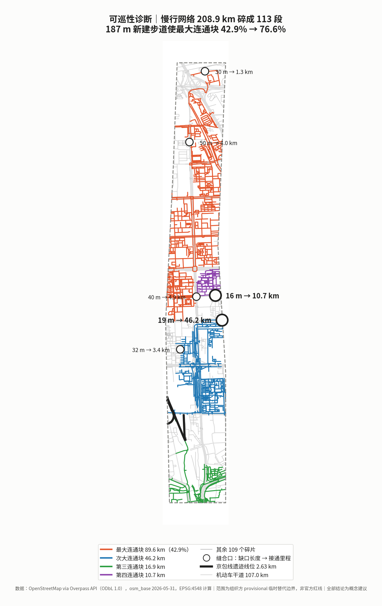
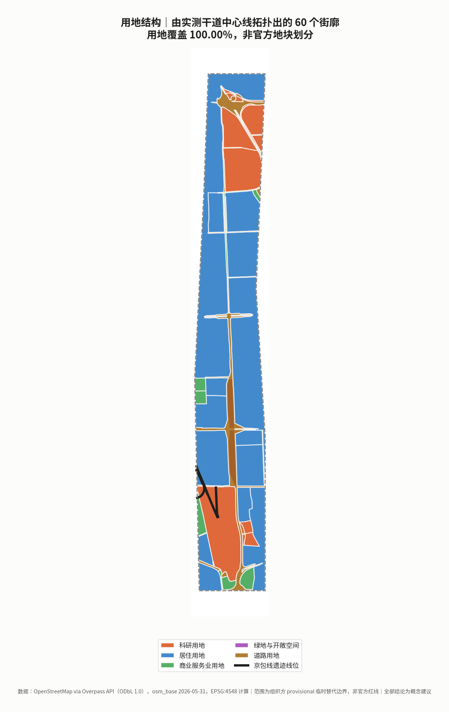
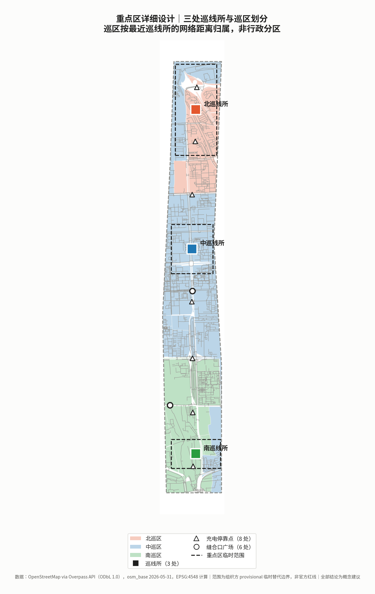
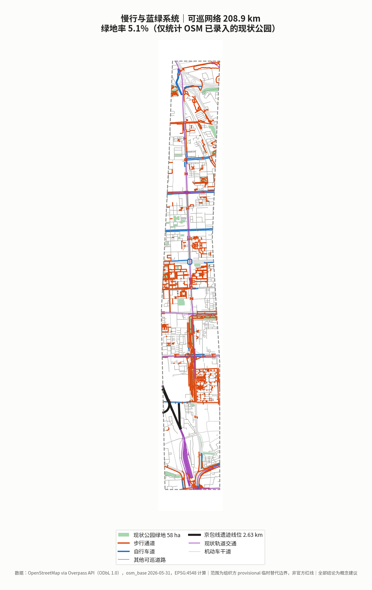
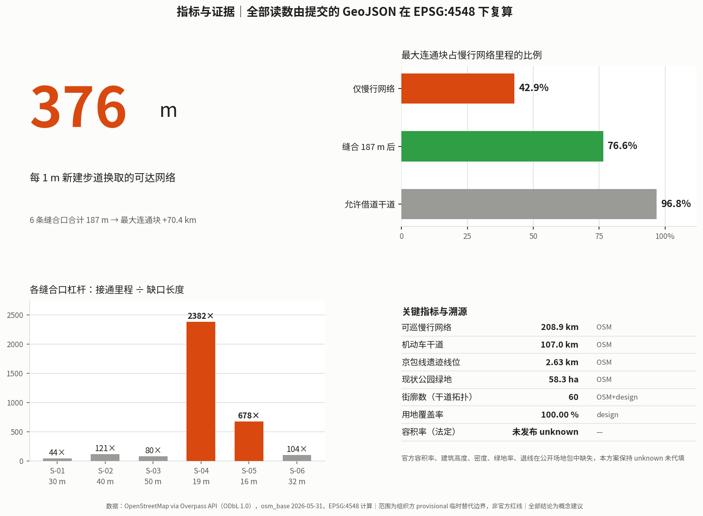

# 京张巡线：以巡检运维为核心的机器人与低速自动驾驶城市实施方案

**一句话概念**：AI 设施的可靠性不来自安装，来自巡检。把机器人与低速自动驾驶定义为城市的**新巡道工**——它们的首要职责不是炫技服务，而是每天走过每一段城市，检查、记录、上报。

京张铁路 1905—1909 年建设，由詹天佑主持修建，是中国人自己勘测、设计、施工和管理的第一条国有干线铁路；2013 年 5 月，南口至八达岭段列入第七批全国重点文物保护单位 `[source:NRA-CENTENNIAL-JINGZHANG]`。这条线的公共记忆通常停在"人字形展线"和"自主设计"上——那是**建成那一刻**的成就。

本方案想接着往下问一句：**建成之后呢？** 铁路能长期运行，靠的是一套日复一日走过每一段线路、检查并上报的养护制度。本方案不对这套制度的历史细节作事实断言（相关史料本版未取得可直接引用的公开出处），而是把它作为**设计主张的来源**提出：一条线的价值不由通车那天决定，由此后每一天有没有人去看一眼决定。

这个主张在场地上有实证依托。本方案在总体设计范围内检出 `railway=razed` / `railway=disused` 的京包线遗迹线位共 12 段、合计 2.63 km `[data:geometry/constraints.geojson#RAIL-001]` `[metric:heritage_rail_trace_length_m]`——线还在，只是不再有人巡了。

今天城市里装的每一件 AI 设施，都面临同一个问题：**装上去容易，维持住难**。摄像头脏了、灯杆算力盒过热降频、路侧感知单元被树叶遮挡、无人配送车卡在台阶前——这些都不是算法问题，是运维问题。而绝大多数城市 AI 方案只回答"装什么"，不回答"谁每天去看一眼"。

本方案回答后者。

> **合规声明**：本方案全部空间与设备内容为**概念建议**，供专业团队深化，不构成法定规划、审定结论、实施承诺、投资承诺、报价或工程可行性结论。所依据的边界为组织方提供的临时替代边界，不得作为官方红线或精确面积依据。所有造价均为**概念性量级区间**，非报价、非采购依据。

---

## 设计依据与资料清单

### 依据来源与可用性分级

本方案严格区分 formal-ready、background-only 与 provisional-only 三类资料，读取 `data/source_registry.json` 后再选证据 `[source:SOURCE-REGISTRY]`。

| 资料 | 用途 | 可用性 | 本方案处理 |
|---|---|---|---|
| 公开任务书与项目公告 | 三层范围、征集方向第 7 条技术门类 | formal-ready | 直接引用 `[source:PROJECT-OFFICIAL-ANNOUNCEMENT]` `[source:OFFICIAL-ANNOUNCEMENT]` `[standard:PROJECT-OFFICIAL-ANNOUNCEMENT]` |
| 结构化事实包 | 经组织方整理的口径与术语 | formal-ready | 用于统一表述，避免各方案术语漂移 `[source:PROCESSED-FACT-PACK]` |
| 重点区临时范围 | 三处巡线所所在片区 | provisional-only | 仅作服务半径的方向性推算依据 `[source:KEY-AREA-SOURCE]` |
| 面向智能体任务书 | agent.1–agent.6 必答任务 | formal-ready | 逐条展开 `[source:AGENT-TASKBOOK]` |
| `ranges/planning_limits.json` | 官方面积口径与控制指标状态 | formal-ready | 面积对照与缺口披露 `[source:SITE-PACKAGE]` |
| `geometry/provisional_boundaries.geojson` | 临时边界与重点区范围 | provisional-only | **仅**用于生成、可视化与自检 `[source:BOUNDARY-SOURCE]` `[data:geometry/site_boundary.geojson#PROV-SITE-001]` |
| `enums/land_use_codes.json` | 用地分类代码 | formal-ready（项目子集） | 正式统计前须导入完整官方代码表 `[standard:MNR-LAND-USE-CLASSIFICATION-GUIDE]` |
| 设备造价量级 | 巡线设备与基础设施 | 经验性区间 | 标注为概念量级，**非报价**，记录于 `assumptions.json` |
| 国家铁路局《百年京张 世纪经典》 | 建设年代、主持人、文保状态 | formal-ready | 直接引用，仅取页面明确写出的事实 `[source:NRA-CENTENNIAL-JINGZHANG]` |
| 财政部《政府采购需求管理办法》 | 运维责任写入采购的制度依据 | formal-ready | 引第十、二十一、二十三、二十四条 `[source:MOF-PROCUREMENT-DEMAND-2021]` `[standard:MOF-PROCUREMENT-DEMAND-2021]` |
| 《北京市自动驾驶汽车条例》 | 低速自动驾驶与巡逻场景的本地法规框架 | formal-ready | 引第二、二十三、二十四、三十七、四十五条 `[source:BJ-AV-REGULATION-2025]` `[standard:BJ-AV-REGULATION-2025]` |
| OpenStreetMap（经 Overpass API） | 现状慢行网络、干道、铁路遗迹线位、现状公园 | 组织方明文许可的 bootstrap 底图数据 | 按 `data_policy.may_use_osm_for_bootstrap_base_layers` 使用，标注 ODbL 署名与众包数据局限 `[source:OSM-OVERPASS-2026-05-31]` `[data:geometry/roads.geojson#ROAD-P-0001]` |
| 铁路养护制度史料 | 文化叙事锚点 | 待补 | 本版**不作事实断言**，改以设计主张表述，见开篇 |

### 证据链对应关系

- `sources.json` 记录每条引用的发布者、URL、检索日期、覆盖范围、许可与已知局限
- `assumptions.json` 记录全部假设值（巡线间距、响应时间目标、设备造价量级、班组编制）及其不可用范围
- `compliance_matrix.json` 覆盖公告 1.3/1.4/1.5 全部任务与 agent.1–agent.6
- `standard_matrix.json` 回应 `[standard:MOHURD-URBAN-DESIGN-MEASURES]`、`[standard:MOHURD-CONTROL-DETAILED-PLANNING]`、`[standard:MNR-LAND-USE-CLASSIFICATION]`
- `design_depth_matrix.json` 逐项标注设计深度完成状态 `[depth:land_use_layout]`

### 数据缺口

官方红线与重点区精确 polygon 未发布；`planning_limits.json` 中容积率、建筑高度、建筑密度、绿地率、退线五项官方控制指标状态均为 `missing` `[source:SITE-PACKAGE]`。本方案**不代填**，保持 `unknown`。

此外本方案主动声明两类本版无法闭合的缺口：**既有市政管线与供电容量数据**（影响充电停靠点选址）、**既有道路坡度与无障碍现状数据**（影响低速自动驾驶可行路段）。两者均需现场踏勘与官方基础设施资料，不由推测填补。



---

## 三层范围工作框架

### 三层目标与深度

| 层级 | 范围 | 官方面积 | 本方案工作 | 本方案复算 |
|---|---|---|---|---|
| 统筹研究范围 | 北五环—西直门外大街 | 43.60 km² | 巡检运维产业生态与区域协同研究 | 未复算（无官方边界） |
| 总体设计范围 | 遗址公园周边 1–2 km | 11.40 km² | 巡区划分、巡线网络、控规深度城市设计 | **11.413 km²**，偏差 0.11% `[metric:site_area_sqm]` |
| 重点精细化设计 | 三大核心功能分区 | 368.40 ha | 三处巡线所详细设计 | 368.40 ha（临时范围） |

### 三层如何逐级落实

统筹研究范围回答"巡检运维如何成为一个产业而不只是一项成本"；总体设计范围回答"城市如何被划分成可巡、可达、可响应的单元"；重点区域回答"巡线所具体怎么建、先开哪一个" `[depth:three_level_scope_framework]`。

### provisional boundary 的限制与替换清单

本方案使用 `geometry_role="provisional_constraint"`、`official_boundary=false`、`boundary_precision="provisional_rough"` 的临时边界 `[data:geometry/constraints.geojson#RAIL-001]`。它**仅**适用于临时生成、可视化、非法定讨论与本地自检；**不得**用于官方红线、审批依据、精确面积计算或权属判断。

官方 polygon 发布后需重算：巡区划分、巡线网络、巡线所服务半径、全部面积与比值指标。几何生成为参数化脚本，替换边界源可一次性重跑。



---

## 统筹研究范围产业与未来城市研究

### 总体概念与命名体系（agent.1）

| 层级 | 中文 | 英文 | 含义 |
|---|---|---|---|
| 总体概念 | **京张巡线** | **The Patrol Line** | 巡道制度的当代转译 |
| 空间单元 | 巡区 | Patrol Beat | 城市按巡检责任划分的基本单元 |
| 设施基地 | 巡线所 | Patrol Depot | 停靠、充电、检修、班组驻地 |
| 设备目录 | 巡线装备册 | Patrol Kit | 可采购的巡检设备规格与造价量级 |
| 制度 | 交接班 | Shift Handover | 人机混合班组的交接与留痕机制 |
| 年度活动 | 巡线开放日 | Patrol Open Day | 见长期运营章节 |

**为什么不叫"智慧运维平台"**：那是软件名，不是城市名。巡线是一个**空间概念**——它指的是一条真实要走的路线，有长度、有坡度、有台阶、有充电点。命名必须指向物理世界，否则设计会滑回大屏和看板。

### 视觉识别方向（agent.1）

核心符号为**巡道标尺**：一条带里程刻度的横线，上方一个折返箭头，读作"走过去、走回来"。基底取铁路养护涂装的橙与深灰——这不是审美选择，橙色是全球轨道与道路养护作业的高可视度惯例，用它意味着巡检设备在街上**应当被看见**，而不是伪装成景观小品。

明确不做：拟人化机器人形象、发光大脑、赛博渐变。任务书禁止过度娱乐化 `[source:AGENT-TASKBOOK]`。

### 三大定位的解释角度

| 任务书定位 | 本方案表述 | 核心动作 |
|---|---|---|
| 百年京张文化带 | 从巡道工到巡线机器人 | 把养护制度而非通车典礼作为文化母题 |
| 都市AI生活体验带 | 看得见的维护 | 巡检过程公开可见，故障与修复状态可查 |
| AI融合创新带 | 运维即市场 | 巡检需求形成稳定采购，支撑本地机器人产业 |

### 巡检运维作为产业（agent.2）

行业普遍的失衡是：**采购预算充足、运维预算不足**。设备三年折旧，运维却要年年出钱，于是大量城市 AI 设施在质保期后进入"装着但不工作"的状态。

本方案的产业主张：**把运维从成本项转为产业项**。稳定的巡检需求 → 稳定的设备采购与更换 → 支撑本地机器人与低速自动驾驶企业形成规模 → 反过来降低单位巡检成本。这是一个可以自我强化的循环，而且它不依赖补贴，依赖的是把运维责任写进采购合同。

### 全球 AI 创新生态案例（agent.2，7 例）

选案标准不是"谁的 AI 更先进"，而是**谁把 AI 维持住了**。以下 7 例全部只引用可公开访问的一手来源，事实与可转化机制分列；不编造企业名单、投资额、产值或财政承诺 `[source:AGENT-TASKBOOK]`。

| # | 案例 | 主体 / 地点 | 可核实事实（一手来源） | 对京张巡线的可转化机制 |
|---|---|---|---|---|
| C-01 | **Intelligent Infrastructure / insight** | Network Rail，英国 | 基于网页的决策支持工具，整合测量列车数据、轨道影像与远程状态监测，用机器学习"预测并在故障可能发生时向维护班组预警"，官方表述称可给出**提前至多一年**的故障预测；官方称其使维修得以安排在网络空闲时段，并通过"桌面端"预防故障**减少人员上道暴露**；就 cyclic top 事件预测持有英国专利 GB2620615（2024 年 10 月授权）`[source:NETWORK-RAIL-INSIGHT]` | 巡检不是终点，**巡检数据回流成资产健康画像**才是。装备册的"数据行为"字段必须把"采集什么"绑定到"回流进哪张资产表"，否则巡了等于没巡。同时它给出了机器替人的正确表述——不是替掉巡道工，是替掉**危险工位** |
| C-02 | **AI Register** | 赫尔辛基市，芬兰 | 城市把自己在用的 AI 系统逐条登记公开，每条披露系统名称与所属部门、用途与使用场景、目标用户、运行方式、主要功能与运行状态；页面当前列出 10 个系统，其中一个户外聊天机器人明确标注为**已停用** `[source:HELSINKI-AI-REGISTER]` | 直接对应 N-01 中央调度所的实体公开屏，以及装备册的"退役与回滚"字段——**停用本身也要公开**。AI 的公共可信度来自登记册，不来自宣传片 |
| C-03 | **Algorithm Register** | 阿姆斯特丹市，荷兰 | 逐条公开城市服务中在用的算法系统，说明"如何运作""部署在哪里""为何使用"；已公开用例含停车执法（对 15 万个以上车位的车牌识别与背景核查自动化）与**公共报事分派**——使市民报事"更快到达正确部门"从而更快处理 `[source:AMSTERDAM-ALGORITHM-REGISTER]` | 对应 S-03 居民报修与工单流转。关键不在分派更快，在于**分派规则本身对外可读**：市民能看到自己的报事为什么被送到那个部门、为什么排在那个位置 |
| C-04 | **Lamppost-as-a-Platform（LaaP）** | GovTech / Smart Nation Platform Solutions Office，新加坡 | 把路灯杆作为智慧城市的共用传感底座，选择理由是灯杆提供"可靠电源"与连通性；平台承载环境传感（温湿度、气体浓度、PM2.5、雨量）、视频分析（人流计数、过街检测、占用监测）、慢行交通传感（个人代步工具与自行车的分类与测速）与地理定位（车路通信、GNSS 信号校核）等模块；公开材料提及端到端加密，但**未披露共享设施的运维责任分工与完整隐私保障细节** `[source:SG-LAAP]` | 正向：先建**共用底座**再挂业务模块，避免每个部门各插一根杆——这正是巡线主干沿线充电停靠点与杆上载荷的组织方式。反向：公开材料在"谁负责维护、数据保留多久"上的留白，恰恰是本方案把"数据行为""人工复核触发条件""维保频次与备件清单"写进装备册的理由 |
| C-05 | **ARM Institute @ Mill 19** | 匹兹堡 Hazelwood，美国 | 9 万平方英尺协作设施，位于原 Jones & Laughlin 钢厂用地；该厂 1997 年关闭后空置 15 年，2002 年由三家本地基金会购地并资助复兴；先进制造机器人研究所于 **2019 年 9 月 4 日** Mill 19 正式启用时在此设总部，占一二层，与卡内基梅隆大学制造未来计划共享 **180 英尺高跨（配 10 吨吊车）**、200 人培训室与弹性工作空间，三层与本地制造推广机构共用 `[source:ARM-MILL19]` | **遗产工业建筑 → 机器人重装实训与共享测试场**，对应北巡线所"优先改造既有厂房类建筑承接检修功能"。更值得抄的是空间配比：高跨加吊车（重装备）、大培训室（人才）、共享工位（产业服务）放在**同一栋楼**里，而不是分散到三个园区 |
| C-06 | **AI Act 第 57 条 监管沙盒** | 欧盟 | 成员国须确保主管机关在国家层面**至少设立一个 AI 监管沙盒并于 2026 年 8 月 2 日前投入运行**；主管机关在沙盒内提供指导、监督与支持以识别风险并测试缓解措施；应请求出具书面证明与**退出报告**，市场监管机构与公告机构应予积极考虑以加快合规评估；提供者对第三方损害仍依法承担责任，但若遵守其具体计划与主管机关指导，**不因本条例的违规被处以行政罚款**；沙盒可包含**真实世界条件下的受监督测试** `[source:EU-AI-ACT-ART57]` | 对应小月河实测翼。测试段的价值不在划出一段路，在于配一套"**进入—指导—退出报告**"的制度外壳：谁批准、谁监督、失败了出什么报告、报告怎么被下一个审批环节采信。本方案的实测段与失效案例公示栏据此设计 |
| C-07 | **高级别自动驾驶示范区**（国内对照） | 北京 | 按北京经济技术开发区官网 2023 年 4 月发布的实践案例，采取"小步快跑、迭代完善"，分 1.0 试验环境搭建、2.0 小规模部署、3.0 规模部署与场景拓展、4.0 推广与场景优化四阶段；截至该文口径已建成 60 平方公里示范区，含 **329 个智能网联标准路口、双向 750 公里城市道路和 10 公里高速公路**；组织上设市级领导小组与示范区工作办公室，并设立市场化运营平台公司 `[source:BJ-AV-DEMO-ZONE]` | **阶段化迭代 + 政府侧办公室 + 市场化运营平台**这一组织形态，直接对应本方案的分期与长期运营机制。该口径随时间扩展，本方案只引用该文发布时点的官方数字，不作外推 |

七例的共同结论，也是本方案的选案理由：**能长期运行的城市 AI，靠的都不是模型，而是一套把"谁负责、谁监督、坏了怎么退"写清楚的制度**——C-01 写在资产表里，C-02/C-03 写在登记册里，C-04 写在共用底座里，C-05 写在楼里，C-06 写在沙盒退出报告里，C-07 写在阶段划分与运营公司里。

### 创新生态图谱与八项要素机制（agent.2）

生态图谱按**三层**组织，与三处线所、两翼一一对应：

| 层 | 内容 | 空间落位 |
|---|---|---|
| **需求层** | 巡区产生的可预算、可续订的巡检需求——整个生态的能量来源 | 中巡线所（真实工况与居民陪审）、南巡线所（高密度压力测试与接驳落地） |
| **供给层** | 整机与部件、备件与耗材、检测认证与保险、数据与算力服务、人机混合班组培训与派遣 | 北巡线所（首件验证与重装实训）、中关村科技服务翼（检测认证、保险与要素服务） |
| **制度层** | 全生命周期采购、实测段准入与退出、公开登记与失效公示、退役与回滚 | 小月河实测翼（真实世界受监督测试）、N-01 中央调度所（公开登记） |

这张图谱与常见做法的分歧在于**方向**：多数方案从供给层出发（先招商、再找场景），本方案从需求层出发——**先把巡检需求做成可预算的常态支出，供给自然会来**。理由在 C-01 到 C-07 中反复出现：没有稳定需求的供给，撑不过第二个财年。

八项要素机制（全部为**概念建议**，供专业团队深化）：

| 要素 | 机制 | 空间落位 | 依据状态 |
|---|---|---|---|
| **土地** | 以不新增建设用地为前提，线所嵌入既有厂房类与社区存量空间 | 三处线所 | 概念建议 |
| **空间** | 高跨加吊车（重装）、培训室（人才）、共享工位（服务）同栋组织 | 北巡线所 | 概念建议，参照 C-05 |
| **产业** | 把运维责任写进采购合同，用稳定巡检需求托住本地供给规模 | 全域 | 有出处 `[source:MOF-PROCUREMENT-DEMAND-2021]` |
| **资金** | 按全生命周期成本口径报价，合同约定成本补偿与风险分担，替代"重采购轻运维" | 全域 | 有出处 `[source:MOF-PROCUREMENT-DEMAND-2021]` |
| **人才** | 人机混合班组；装备册"班组配比"字段把每台设备折算成人工工时，作为编制与培训依据 | 三处线所 | 概念建议 |
| **算力** | 优先本地处理、按需回传；装备册"数据行为"字段声明本地处理还是回传及保留期限 | 沿线杆上载荷与线所 | 概念建议；既有供电与机房容量 `[待证]` |
| **数据** | 巡检数据回流资产健康画像；在用系统与**已停用系统**一并公开登记 | N-01 实体公开屏 | 概念建议，参照 C-01/C-02/C-03 |
| **场景** | 实测段配"进入—指导—退出报告"制度外壳，失效案例强制公开 | 小月河实测翼 | 有出处 `[source:EU-AI-ACT-ART57]` `[source:BJ-AV-REGULATION-2025]` |

### 制度参照（agent.2）

**本版只对已取得可公开出处的条目作事实引用，其余只给选案方向与理由，不编造数据、企业名单或投资额**：

| 参照方向 | 参照什么 | 状态与出处 |
|---|---|---|
| 公共设施全生命周期采购制度 | 把运维责任写进采购的制度形式 | ✅ 财政部《政府采购需求管理办法》（财库〔2021〕22号）第十条要求了解"运行维护、升级更新、备品备件、耗材等后续采购"；第二十一条允许要求供应商报出使用期间能源管理、废弃处置等**全生命周期成本**；第二十三条要求长期运行项目在合同中约定成本补偿与风险分担；第二十四条要求履约验收方案明确主体、时间、方式、程序、内容与标准 `[source:MOF-PROCUREMENT-DEMAND-2021]` `[standard:MOF-PROCUREMENT-DEMAND-2021]` |
| 城市低速自动驾驶的准入与退出 | 划定测试段的管理边界 | ✅ 《北京市自动驾驶汽车条例》（2025年4月1日施行）第二十三条将"摆渡接驳、环卫清扫、**治安巡逻**等城市运行保障"列为支持场景；第二十四条规定向市经信部门申请、组织论证确认、公安交管核发试验用临时行驶车号牌，并由市经信部门会同相关部门确定具体区域与道路；第三十七条规定配备安全员与平台安全监控人员；第四十五条规定造成严重后果的**终止道路应用试点** `[source:BJ-AV-REGULATION-2025]` `[standard:BJ-AV-REGULATION-2025]` |
| 轨道基础设施的预测性养护制度 | 从"坏了再修"转向"预测并预防"的组织方式 | ✅ 见上表 C-01，Network Rail 官方说明 `[source:NETWORK-RAIL-INSIGHT]` |
| 市政设施报修与工单系统的组织方式 | 人机混合工单流转与分派规则公开 | ✅ 见上表 C-03，阿姆斯特丹算法登记册 `[source:AMSTERDAM-ALGORITHM-REGISTER]` |
| 机器人配送在人行空间的公众争议 | 退出机制与公众接受度 | `[待证]` 本版不作事实断言；本方案以"限时段、限速度、可拒绝、有非 AI 人工替代路径"作为设计前置条件 |
| 铁路与公路养护的班组编制经验 | 巡区规模与班组配比 | `[待证]` 本版不作事实断言；班组配比在本方案中按服务半径反推，见响应时间一节 |
| 备件与耗材的区域集中仓储实践 | 备件流转与响应时间的关系 | `[待证]` 本版不作事实断言 |

**无人配送与低速运输的合规边界须特别说明**：《北京市自动驾驶汽车条例》第二十三条未逐项列明无人配送与低速运输，二者属该条"国家和本市支持开展的其他应用场景"范畴。本方案相关场景一律表述为**概念建议**，并说明须按第二十四条申请与确认后方可开展，不得理解为已获批准 `[depth:risk_missing_data]`。

`[standard:PROJECT-AGENT-OPEN-CALL-TASKBOOK]`

---

## 总体设计范围城市更新与控规深度城市设计

### 空间结构：一干、三所、多巡区

不做"一带三核"。本方案的空间逻辑是**运维调度逻辑**：

- **巡线主干 Patrol Trunk**：沿京张铁路遗址公园南北贯通的主巡检路径，兼作低速自动驾驶的主要可行走廊 `[data:geometry/roads.geojson#ROAD-STITCH-04]`
- **三处巡线所 Patrol Depot**：北（众智园）、中（AI原点社区）、南（大钟寺），承担停靠、充电、检修与班组驻地
- **巡区 Patrol Beat**：全域划分为若干巡区，每个巡区有责任班组、归属巡线所与响应时间目标
- **八处充电停靠点 Charge Dock**：沿主干等距分布，兼作班组交接与故障设备暂存 `[data:geometry/public_space.geojson#PS-DEPOT-GW]`

这套结构的内在必然性来自一个运维常识：**响应时间取决于最远巡区到最近巡线所的距离**。空间划分因此不是构图问题，是服务半径问题 `[depth:overall_spatial_structure]`。

### 用地与功能布局

用地**不采用抽象剖分**。本方案把实测的快速路、主干路、次干路中心线做多边形化，得到 **48 个真实城市街廓**；街廓之间的剩余空间对应道路及其两侧带状用地，按城镇村道路用地（1207）补入，最终 60 个多边形完整覆盖设计范围，用地覆盖率 **100.00%**，无缝隙、无重叠 `[data:geometry/land_use.geojson#LU-0001]` `[metric:land_use_coverage_ratio]` `[metric:land_use_polygon_count]`。

这样做的理由是运维性的：**巡检责任必须落到真实存在的街廓上**。用抽象网格剖分出来的地块在现实中找不到对应物，责任边界一旦模糊，运维就会失效；而由真实道路围合出的街廓，本身就是城市里可指认、可交接、可问责的最小单元。

用地代码按与重点区、遗迹廊道、现状绿地的空间关系赋予：重点区内街廓为科研用地（0802），现状公园覆盖过半的街廓为公园绿地（1401），遗迹廊道 120 m 影响范围内的小街廓为广场用地（1403），大街廓为居住用地（0701），小街廓为社区服务设施用地（0702），其余为商业服务业用地（05），街廓间剩余空间为道路用地（1207）`[depth:land_use_layout]`。街廓边界为 OSM 路网拓扑推得，**非官方地块红线**。

### 现状诊断与城市更新框架

现状诊断以三项公开可见的空间问题为核心：铁路两侧的横向割裂导致巡检路径被迫绕行；既有社区内部道路坡坎与台阶密集，限制轮式设备可达；既有商业区权属复杂，巡检责任边界不清 `[depth:existing_conditions_diagnosis]`。三者都不是靠加设备能解决的，必须靠空间改造。

更新对象因此按**可巡性**分级识别，而非按建筑年代。

### 待确认的控规条件

建筑总规模、容积率、建筑高度、密度、绿地率、退线均缺官方控制条件。本章涉及开发强度的表述均为概念建议，**不得视为审定指标** `[source:SITE-PACKAGE]` `[depth:development_intensity_controls]`。

---

## 重点区域详细设计

三个重点区在本方案中承担三处巡线所 `[metric:key_area_count]` `[data:geometry/key_areas.geojson#PROV-KEY-001]` `[depth:three_key_area_detailed_design]`。

### 众智园 AI 自主创新加速区 → 北巡线所（192.1 ha）

- **定位**：巡检设备研发测试与首件验证；本地机器人企业的真实工况场地
- **空间结构**：检修车间 + 设备测试跑道 + 班组驻地，向巡线主干开口
- **建筑更新**：科研用地为主，优先改造既有厂房类建筑承接检修功能
- **设备配置**：轮式巡检机器人、履带式复杂地形机型、检修工位、备件近场仓
- **AI 场景**：S-01 设施状态巡检、S-05 设备首件验证、S-10 开发者实测通道
- **实施风险**：检修车间涉及噪声与作业时段，须与周边科研办公功能做时段与隔声设计

### 北京 AI 原点社区 → 中巡线所（104.3 ha）

- **定位**：社区场景巡检与公共服务响应；人机混合班组的主训练场
- **空间结构**：小型停靠检修点 + 社区服务对接窗口，嵌入既有社区而非另辟园区
- **建筑更新**：以既有社区为载体，优先"留、改"，避免大规模拆除
- **设备配置**：低噪声小型巡检机器人、无障碍设施检测装置、人工班组工具车
- **AI 场景**：S-03 居民报修与工单流转、S-06 无障碍通行障碍巡检、S-11 适老与助行服务
- **实施风险**：居民对机器人在生活空间内活动的接受度是最大不确定性。设计前置条件为"限时段、限速度、可拒绝、有非 AI 人工替代路径"

### 大钟寺 AI 产业聚集区 → 南巡线所（72.0 ha）

- **定位**：商业与人流密集环境的巡检；低速自动驾驶接驳的城市端起点
- **空间结构**：地面停靠点 + 调度接口，尽量利用既有停车与装卸空间
- **设备配置**：人流密集环境适配机型、无人配送接驳单元
- **AI 场景**：S-04 商业公共区域保洁与设施巡检、S-08 无人配送接驳、S-12 高峰时段人流疏导辅助
- **实施风险**：既有商业权属复杂，本方案不擅自改造企业建筑或权属空间

### 两翼

- **中关村科技服务翼**：巡检设备企业、备件供应、检测认证与保险服务的要素网络
- **小月河场景赋能翼**：**低速自动驾驶实测段**所在地。真实水岸与社区环境下的长期压力测试，失效案例公开

> 三处重点区 polygon 均为 provisional，上述结论只能作为**方向性设计**；官方 polygon 发布后须重新核定服务半径、设备规模与实施项目。



---

## AI 创新生态、人才画像与 AI+ 场景

### 用户画像（agent.3，6 类）

| 编号 | 画像 | 与巡线体系的关系 | 最关心什么 |
|---|---|---|---|
| P-01 | 巡检班组长 | 每日在岗 | 排班是否合理、设备是否顺手、出问题谁背责 |
| P-02 | 机器人与低速自动驾驶企业 | 设备供应与迭代 | 真实工况数据、采购稳定性、故障反馈闭环 |
| P-03 | 社区居民 | 被巡检、被服务 | 会不会被拍、噪声大不大、能不能让它别进我家楼道 |
| P-04 | 区属单位与物业采购人员 | 采购与验收 | 采购依据、维保条款、坏了多久能修好、退役怎么算 |
| P-05 | 视障与行动不便人士 | 无障碍巡检的直接受益者 | 障碍多久被发现、多久被清除、有没有人工兜底 |
| P-06 | 备件与耗材供应商 | 后端支撑 | 需求可预测性、库存周转、区域集中仓的可达性 |

P-04 与 P-06 是绝大多数城市 AI 方案完全缺失的角色。**没有采购人员和备件商，任何巡检体系撑不过第二年。**

### AI 场景卡（agent.3，14 张）

**通篇设计约束：没有一张场景卡依赖个体身份识别。** 巡检的对象是**设施**，不是人。任务书明令禁止隐私侵害、过度监控或无法人工复核的场景 `[source:AGENT-TASKBOOK]`。涉及未成年人与就医的两张卡边界写得比其余更严。

| # | 场景卡 | 空间载体 | 设备 | 人工复核与回退 | 成熟度 |
|---|---|---|---|---|---|
| S-01 | 设施状态巡检 | 全巡区 | 轮式巡检机器人 | AI 只做异常标记，是否派修由班组长决定；设备离线时回退纯人工巡检 | 成熟 |
| S-02 | 照明与供电异常发现 | 巡线主干 | 巡检机器人载光度计 | 异常自动生成工单但不自动断电；断电操作必须人工执行 | 成熟 |
| S-03 | 居民报修与工单流转 | 中巡区 | 无（软件） | AI 只做分类去重与派单建议；派单决定人工确认，报修人可查处理链 | 成熟 |
| S-04 | 商业公共区域保洁巡检 | 南巡区 | 清洁与巡检复合机型 | 限定时段与区域；人流超阈值自动退出并停靠 | 成熟 |
| S-05 | 设备首件验证 | 北巡线所 | 测试跑道与检修工位 | 未通过验证的设备不得进入城市巡区，验证记录公开 | 成熟 |
| S-06 | 无障碍通行障碍巡检 | 全巡区缝合口 | 小型巡检机型 | 发现障碍生成工单并**同步通知人工班组**；不得以"已上报"替代实际清除 | 成熟 |
| S-07 | 绿化与水岸环境巡检 | 实测翼、绿廊 | 巡检机型载环境传感 | 数据全量公开；超阈值触发人工现场核查而非自动处置 | 成熟 |
| S-08 | 无人配送接驳 | 主干、南巡区 | 低速配送单元 | 限时限路径；行人密度超阈值自动退出转人工配送 | 试验 |
| S-09 | 低速自动驾驶接驳测试 | 小月河实测段 | 低速接驳车 | 仅限划定测试段，安全员在场；实体标识告知公众；失效模式公开 | 试验 |
| S-10 | 开发者实测通道 | 北巡线所、实测翼 | 开放工位与场地 | 划定可实验区与不可实验区；实验期间实体标识告知公众 | 试验 |
| S-11 | 适老与助行服务 | 中巡区 | 助行引导单元 | 必须有非 AI 物理冗余路径（实体扶手、盲道、人工呼叫）；服务可随时中止 | 成熟 |
| S-12 | 高峰时段人流疏导辅助 | 三所节点 | 巡检机型载密度统计 | 只输出引导建议不做强制管控；仅统计密度，**不做个体识别** | 成熟 |
| S-13 | AI+教育：巡检开放课 | 中巡区教育用地 | 教学用巡检套件 | **不做学生个体画像与排名**，未成年人数据仅本地处理不回传；教师保留最终评价权 | 成熟 |
| S-14 | AI+医疗：健康站设施巡检与导诊辅助 | 中巡区医疗卫生用地 | 巡检机型 + 导诊终端 | **不做诊断、不推荐用药**；仅做设施巡检、导诊与排队；诊断、处方、检验判读一律转执业医师 | 成熟 |

### 产业测试验证场景（agent.3，3 个）

- **T-01 设备首件验证**（北巡线所）：新机型进入城市巡区前的工况验证，输出通过/不通过，记录公开
- **T-02 巡区试运行**（中巡区）：真实居民环境下的接受度、噪声、可达性验证，输出调整建议或退出决定
- **T-03 实测段压力测试**（小月河实测翼）：低速自动驾驶在雨雪、夜间、断网、人群突入条件下的失效行为，输出**公开的失效模式清单**

T-03 的重点是公开失效模式。低速自动驾驶最大的公众疑虑就是"它出问题时会怎样"，回避这个问题等于放弃说服。

### 场景—设备—责任映射

每张场景卡在《巡线装备册》中登记：所属巡区、设备型号类别、日均作业时长、责任班组、故障响应时限、失败回退方案、退役条件。**场景不落到具体设备与具体责任人，就不构成可实施内容。**

---

## 用地、建筑规模与拆改留方案

### 用地构成

用地面积按 `land_use.geojson` 在 EPSG:4548 下复算 `[metric:site_area_sqm]`。60 个多边形（48 个真实街廓 + 12 块街廓间道路用地）对设计范围的覆盖率为 **100.00%** `[metric:land_use_coverage_ratio]`，由并集面积与场地面积之比复算得出。

### 建筑规模（概念推算）

建筑基底按用地类别差异化布设，为**概念性体量示意，非建筑设计成果** `[data:geometry/buildings.geojson#BLD-GW-1]`：

- 建筑基底面积见 `[metric:building_footprint_area_sqm]`，建筑密度见 `[metric:building_density]`，概念总建筑面积见 `[metric:total_floor_area_sqm]`
- 层数为按用地类别设定的假设值，记录于 `assumptions.json`
- `floor_area_ratio` 保持 `status="unknown"`——公开场地包不含经批准的容积率控制指标，Agent 不代填
- 概念推算值单列为 `[metric:conceptual_floor_area_ratio]`，单位 `far`

### 建筑高度与风貌控制

巡线所以单层大跨检修空间为主，高度诉求低；中巡线所嵌入既有社区，须维持现有尺度；南巡线所利用既有停车与装卸空间，尽量不新增体量。具体高度分区待官方控制指标发布后核定，本版不给高度数值 `[depth:height_massing_character]` `[standard:MOHURD-ARCH-DESIGN-DEPTH-2016]`。

### 拆改留逻辑

| 分类 | 判定依据 | 主要分布 |
|---|---|---|
| 留 | 社区肌理完整、居民生活稳定 | 中巡区为主 |
| 改 | 既有厂房、车库、装卸空间可承接检修与停靠 | 北巡区、南巡区 |
| 新建 | 设备测试跑道等无既有载体的功能 | 北巡线所 |
| 拆 | 本方案不提出任何具体拆除对象 | — |

**不给出地块级拆迁结论**，不涉及权属判断，不擅自改造企业建筑 `[depth:retain_renovate_demolish]`。

---

## 交通、轨道、市政与公共服务设施

### 巡线网络：先测，再画

绝大多数城市设计方案会先画一条理想的慢行环，再宣称它没有盲区。本方案反过来：**先把现状慢行网络测出来，再看它断在哪里。**

本方案提交的 `roads.geojson` 不是设计者手绘的示意线，而是 OpenStreetMap 现状路网经 EPSG:4548 投影后裁入总体设计范围的实测要素 `[source:OSM-OVERPASS-2026-05-31]` `[data:geometry/roads.geojson#ROAD-P-0001]`：

| 指标 | 实测值 | 来源 |
|---|---:|---|
| 道路中心线总长 | 316.1 km | `[metric:road_centerline_length_m]` |
| 其中可巡慢行网络（步道／小径／自行车道／台阶／生活性道路／服务道路） | 208.9 km | `[metric:patrol_network_length_m]` |
| 其中机动车干道（快速路／主干路／次干路） | 107.0 km | `[metric:arterial_length_m]` |
| 京包线遗迹线位（razed／disused） | 2.63 km | `[metric:heritage_rail_trace_length_m]` |

测完之后得到的结论，和"没有盲区"正相反 `[depth:traffic_rail_slow_parking]`。

### 可巡性诊断：208.9 km 慢行网络碎成 113 段

对上述 208.9 km 慢行网络做连通分量计算（节点按 1 m 网格吸附，EPSG:4548）：

| 网络构成 | 总长 | 连通分量数 | 最大连通块占比 |
|---|---:|---:|---:|
| 仅慢行网络 | 208.9 km | **113 个** | 42.9%（89.6 km） |
| 慢行网络＋机动车干道 | 315.9 km | 38 个 | 96.8%（305.8 km） |

同一套建图与吸附方法，只改变"是否允许借道机动车干道"这一个变量，最大连通块占比从 42.9% 跳到 96.8%。这排除了吸附算法造成假性断裂的可能，并给出一个可复核的诊断：

> **在这片 43.6 km² 的创新带里，行人与低速轮式设备要从一个片区走到另一个片区，多数情况下必须借道快速路或主干路。**

这不是修辞。它意味着任何"沿慢行系统布设巡检机器人"的方案，如果不先处理连通性，机器人会被困在 113 个互不相通的孤岛里。

### 缝合口：187 m 新建步道换 70.4 km 可达网络

在上述实测网络上做贪心搜索——每次寻找当前最大连通块与其余分量之间的最短缺口——得到 6 处缝合口 `[data:geometry/roads.geojson#ROAD-STITCH-01]`：

| 编号 | 缺口长度 | 接通里程 | 杠杆 | 累计最大连通块 |
|---|---:|---:|---:|---:|
| S-01 | 30.0 m | 1.31 km | 44× | 90.9 km |
| S-02 | 40.2 m | 4.87 km | 121× | 95.8 km |
| S-03 | 49.6 m | 3.97 km | 80× | 99.7 km |
| **S-04** | **19.4 m** | **46.22 km** | **2382×** | **146.0 km** |
| S-05 | 15.8 m | 10.72 km | 678× | 156.7 km |
| S-06 | 32.3 m | 3.35 km | 104× | 160.0 km |

**合计 187 m 新建步道，使最大连通块从 89.6 km 增至 160.0 km，占比 42.9% → 76.6%，平均每 1 m 新建步道换取 376 m 可达网络。**

其中 S-04 一条 19.4 m 的连接接通 46.22 km 网络——这是本方案认为整个创新带里投入产出比最高的一笔慢行投资，也是"巡区"这一空间组织逻辑相对于"景观轴"的直接价值证明：景观轴关心的是看起来是否连续，巡区关心的是走起来是否走得通。

> **限制声明**：连通性基于 OSM 现有要素计算。缺口处是否已存在未被 OSM 录入的步道、地下通道或天桥，需现场核实；本节全部结论为**概念建议**，不构成工程设计、选址结论或实施承诺 `[depth:risk_missing_data]`。六处缝合口坐标已随 `roads.geojson` 提交，可由专业团队逐点复核。

### 可巡性改造清单

轮式设备的真实障碍不是算法，是**坡坎、台阶、窨井盖高差、临时占道**。上一节的 113 个分量说明断点客观存在；本节给出处理这些断点的工程清单：

| 改造项 | 目的 | 优先级 |
|---|---|---|
| 缘石坡道连续化 | 消除轮式设备与轮椅共同的通行断点 | 高 |
| 窨井盖与路面高差整平 | 减少设备颠簸与传感器抖动 | 高 |
| 主干沿线连续照明 | 保障夜间巡检的视觉与安全 | 高 |
| 充电停靠点供电接入 | 支撑补能，**须先核实既有供电容量** | 高（有数据缺口） |
| 台阶处并设坡道或升降 | 打通被台阶隔断的巡区 | 中 |
| 临时占道管理规则 | 减少路径失效 | 中 |

**这份清单同时服务无障碍**：能让巡检机器人过去的路，轮椅、婴儿车、拉杆箱也能过去。这不是附带效果，是本方案主张可巡性改造应优先立项的核心理由。

### 轨道、市政与新型基础设施

轨道接驳与市政承载能力需以官方基础设施资料为准，本版无可用公开数据，列为数据缺口 `[depth:municipal_new_infrastructure]`。**新型基础设施（充电桩、边缘算力、感知供电、数据回传）不单独设专项，全部挂在充电停靠点与巡线所两类实体设施上**——独立设专项的新基建最容易在预算收紧时被砍掉，挂在有日常使用的设施上才活得下来。

公共服务设施用地已按教育、医疗、文化、体育四类布点，规模需按官方人口与配建标准复核 `[standard:MOHURD-CONTROL-DETAILED-PLANNING]`。



---

## 蓝绿空间、公共空间与城市风貌

### 蓝绿结构

巡线主干核心绿廊贯穿南北 `[data:geometry/green_space.geojson#GS-001]`，外缘配置防护绿地，充电停靠点与巡线节点构成公共空间网络 `[depth:blue_green_public_space]`。绿地总面积见 `[metric:green_space_area_sqm]`，公共空间总面积见 `[metric:public_space_area_sqm]`；绿地率见 `[metric:green_ratio]`，公共空间率见 `[metric:public_space_ratio]`，均由并集面积复算。

### 公共空间节点：让维护被看见（agent.4）

| 编号 | 名称 | 位置 | 功能 |
|---|---|---|---|
| N-01 | 中央调度所 Patrol Control | 巡线主干中段 | 巡区状态与工单进度的**实体公开屏**，不是内部指挥中心；市民可现场看到哪些故障未修、已挂多久 |
| N-02 | 实测段起点 | 小月河实测翼北端 | 低速自动驾驶测试段起讫标识与告知牌 |
| N-03 | 实测段终点 | 实测翼南端 | 同上，含失效案例公示栏 |
| 充电停靠点 ×8 | Charge Dock | 主干沿线 | 补能、班组交接、故障设备暂存；**交接过程在公共空间发生，不藏在后场** |

**"让维护被看见"是本方案最重要的一个设计决定。** 城市维护长期是隐形劳动——半夜换灯、清晨扫街、雨天抢修，市民只见结果不见过程，于是既不理解成本，也无从监督质量。把交接班、充电、检修放在公共空间可见的位置，同时解决三件事：公众理解、质量监督、以及对巡检人员劳动的正视。

这也是本方案与"朝圣地标"类做法的分歧：不做纪念性打卡点，做**日常可见的作业现场**。

### 巡线装备册（agent.4，可实施性的载体）

评审维度"可实施性"要求清晰的落地路径与可衡量指标。多数方案在此给时间轴。**一份带型号类别、造价量级、供电需求、班组配比、维保频次与退役条款的装备册，本身就是落地路径——它可以直接进入政府采购流程。**

每类装备的登记字段：

```
巡线装备册 / <编号>
├─ 适用巡区与场景（对应场景卡编号）
├─ 物理规格（尺寸、重量、爬坡与越障能力、防护等级、噪声上限）
├─ 供电与补能（功率、充电方式、单次续航、日均补能次数）
├─ 数据行为（采集什么 / 不采集什么 / 本地处理还是回传 / 保留期限）
├─ 人工复核触发条件（何时必须转人工，谁有权停用）
├─ 造价量级（概念性区间，非报价、非采购依据）
├─ 班组配比（每台设备对应人工工时）
├─ 维保频次与备件清单
├─ 退役与回滚（如何拆除、数据如何销毁、恢复到什么状态）
└─ 信创与合规适配说明（供采购合规参考，不作认证结论）
```

**"班组配比"字段是本方案区别于其他方案的关键。** 机器人不是替代人力，是改变人力的构成。不写清楚每台设备需要多少人工工时，运维预算就永远是拍脑袋，而拍脑袋的预算撑不过第二个财年。

### 城市风貌与文化叙事（agent.5）

叙事主线：**「一百年前有人每天走过每一段轨，一百年后仍然要有人（和机器）每天走过每一段街。」**

三层叙事对应三处巡线所：

1. **验证**（北巡线所）——设备先证明自己能干活，再进城
2. **共处**（中巡线所）——机器与居民在同一条走廊里学会互相让路
3. **服务**（南巡线所）——巡检的最终产出是别人不必注意到的正常

**导视与符号系统**：全域采用统一的"巡线标牌"语言，格式与铁路里程标同源。每个巡区入口设标牌，标注巡区编号、责任班组、上次巡检时间、报修方式。**标牌即导视，即责任公示，即报修入口。**

**国际传播落点**：不输出宣传片，输出**可复用的巡线装备册与巡区划分方法**。传播成功的指标不是播放量，是别的城市按这套方法划了自己的巡区。

> 史实表述均需可公开来源支撑，本版相关论述标注 `[待证]`，正式稿前补齐或删除；不歪曲历史，不未经授权使用他人图像与版权材料。

---

## 更新项目清单、实施政策与分期计划

### 分期

更新项目按三期组织，逐项对应空间载体与标志性成果 `[depth:renewal_project_list]`。分期按三处巡线所服务范围就近划分 `[data:geometry/phasing.geojson#PH-1]` `[depth:phasing_implementation]`，为**概念建议，不构成实施计划、投资承诺或时序安排**。

| 期 | 阶段 | 更新项目重点 | 标志性成果 |
|---|---|---|---|
| 一期 | 建所 | 北巡线所建成、设备首件验证能力、主干可巡性改造起步、装备册 v1.0 | 北巡区开通，首批巡检工单公开 |
| 二期 | 联网 | 中巡线所嵌入既有社区、人机混合班组编成、无障碍巡检覆盖 | N-01 中央调度所公开屏启用 |
| 三期 | 全覆盖 | 南巡线所建成、无人配送接驳、小月河实测段投入运行 | 全域巡区覆盖，实测段失效清单首次公开 |

### 实施政策方向

政策建议的核心是一条：**把运维责任与年限写进采购合同，而不是留给下一任预算。**

具体机制：设备采购时同步约定维保年限、响应时限、备件供应与退役处置责任；未通过首件验证的设备不得进入城市巡区；巡检工单与修复时长公开，作为续约依据。

本方案**不承诺**任何政府投资、补贴、税收优惠或落地企业数量，不把设想活动写成已确定安排。造价量级仅供规模估算，非报价。

### 长期运营（agent.6）

- **巡线开放日（年度）**：不是论坛。开放巡线所与实测段，公众可跟随一次真实巡检，现场看设备如何失败、班组如何处置
- **装备册开源维护**：规格与班组配比以开源方式维护，企业可提交型号，异议与修订走公开流程
- **实测段开放**：申请即用，实验期间实体标识告知公众，失效案例强制公开
- **产业转化路径**：企业路径为「装备册登记 → 北巡线所首件验证 → 中巡区试运行 → 全域采购」，以验证结果替代行政筛选

---

## 指标体系、面积复算与合规矩阵

### 复算方法

全部几何在 EPSG:4548（CGCS2000 3 度带 39 带）下计算，输出 EPSG:4326。指标从 GeoJSON 复算，不从叙事文本抄录 `[depth:metrics_recalculation]`。每项指标记录 `status`、`value`、`unit`、`source_files`、`formula`、`confidence` 与 `assumptions`。

### 核心指标

| 指标 | 值来源 | 置信度 | 说明 |
|---|---|---|---|
| 设计范围面积 | `[metric:site_area_sqm]` | low | 临时边界；与官方口径偏差 0.11% |
| 绿地率 | `[metric:green_ratio]` | medium | 由 `green_space.geojson` 并集复算 |
| 公共空间率 | `[metric:public_space_ratio]` | low | 三处巡线所、八处充电停靠点与六处缝合口广场的并集 |
| 道路面积率 | `[metric:road_area_ratio]` | low | 由街廓之间的剩余空间推得，非官方道路红线 |
| 建筑密度 | `[metric:building_density]` | low | 概念性体量示意 |
| 法定容积率 | `floor_area_ratio` | **unknown** | 官方控制指标缺失，不代填 |
| 概念容积率 | `conceptual_floor_area_ratio` | low | 层数为假设值 |

### 运维指标（本方案主张纳入创新指标体系）

以下为**建议纳入**的运维侧指标，本版给出定义与计算口径，具体目标值须结合官方数据核定，不在此假定：

- 巡区平均面积与最大服务半径（可由 `phasing.geojson` 与 `key_areas.geojson` 复算）
- 故障发现到派单时长、派单到修复时长（需实际运行数据）
- 每台设备对应人工工时（需实际班组数据）
- 设备可用率与退役周期（需实际运行数据）

**这四项目前均无数据，本方案不编造数值**，仅主张它们应当被纳入指标体系并公开。

### 拓扑校验

用地图层的并集面积与场地面积之比为 1.000000 `[metric:land_use_coverage_ratio]`，即 60 个多边形完整覆盖设计范围。空间审查结论为 PASS，保留三条 `KEY_AREA_PROVISIONAL` 提示，源于官方边界缺失。该提示是空间复核的事实记录；资格判定与评分均属维护者决定，本方案不对其作任何预设。

### 合规矩阵对应

`compliance_matrix.json` 覆盖公告 1.3、1.4、1.5 全部任务与 agent.1–agent.6；`standard_matrix.json` 覆盖全部强制性专业标准；`design_depth_matrix.json` 中必需的 formal 深度项标注完成状态。

### 官方数据替换后的重算范围

官方红线与重点区 polygon 发布后需重算：全部 GeoJSON 图层、巡区划分与服务半径、全部面积与比值指标、分期、图件与可视化。



---

## 风险、版权与合规说明

### 主要风险与处理

| 风险 | 处理 |
|---|---|
| 官方边界缺失 `[depth:risk_missing_data]` | 全程 `provisional_constraint`，图面低对比度虚线，正文、`sources.json`、`assumptions.json`、`visual/index.html` 四处同步披露 |
| 供电容量与管线数据缺失 | 充电停靠点选址标注为待核实，须现场踏勘，不由推测填补 |
| 道路坡度与无障碍现状数据缺失 | 可巡性改造清单只给类型与优先级，不给具体点位工程量 |
| 造价量级 | 标注为概念性区间，非报价、非采购依据；不构成任何供应商推荐 |
| 居民接受度 | 中巡区以"限时段、限速度、可拒绝、有非 AI 人工替代路径"为前置条件 |
| 低速自动驾驶安全 | 仅限划定测试段、安全员在场、实体标识告知、失效模式公开 |
| 设备成熟度 | 逐卡标注成熟度，不把试验阶段技术写成可全面部署 |
| 劳动替代疑虑 | 明确主张机器人改变人力构成而非替代；班组配比字段强制要求写明人工工时 |

### 官方性边界

本方案不声称使用或披露任何非公开规划图件、非公开空间数据或内部控制指标。涉及建设强度、建筑高度、道路线位的内容均标注为概念建议，不伪装为官方审定结论。所有资料引用均说明来源。

### 隐私与人工复核边界

巡检对象是**设施**不是人。全部 14 张场景卡均不依赖个体身份识别；人流统计仅做密度不做个体；涉及报修派单、诊断处方、资格认定、处置决定的环节一律转人工；关键公共服务保留非 AI 冗余路径。涉及未成年人的场景不做个体画像与排名，数据仅本地处理不回传。

### 版权

本方案文本、几何数据、图件与可视化均为原创生成，未使用未清权素材、未授权肖像、商标或版权图像。装备册中的设备类别为通用技术描述，**不指向任何特定品牌或供应商**。`visual/index.html` 完全离线，不加载远程脚本、样式、字体、媒体或地图瓦片。

---

## 参考资料

**已引用（仓库内可校验）**

- `brief/site-package/design_brief.json`、`agent_taskbook.json`、`allowed_design_space.json` `[source:SITE-PACKAGE]`
- `brief/site-package/ranges/planning_limits.json`
- `brief/site-package/enums/land_use_codes.json`、`layers.json`、`source_types.json`
- `brief/site-package/geometry/provisional_boundaries.geojson`
- `brief/site-package/standards/references/`：城市设计管理办法、控制性详细规划、用地分类指南、面向智能体任务书、项目公告
- `data/source_registry.json`、`docs/data-workflow.md`、`docs/terminology-glossary.md`

**待补（正式稿前必须完成）**

均标注 `[待证]`，本版**不作事实断言**：机器人巡检与低速自动驾驶案例的可公开来源、京张铁路与近代中国铁路养护制度史料、既有供电容量与市政管线数据、道路坡度与无障碍现状数据、官方人口与配建标准。

**方法与工具**

- 几何生成：以 OpenStreetMap 现状路网为底，快速路／主干路／次干路中心线多边形化得到真实街廓；慢行网络连通分量按 1 m 网格吸附后计算；缝合口由贪心搜索最大连通块与其余分量间的最短缺口得到
- 投影：EPSG:4548 计算，EPSG:4326 输出
- 校验：空间审查 PASS，可视化打包检查 PASS
