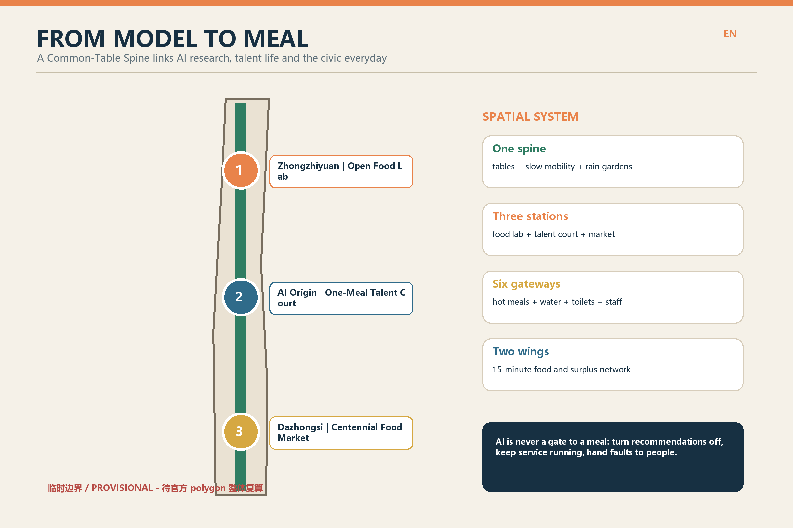
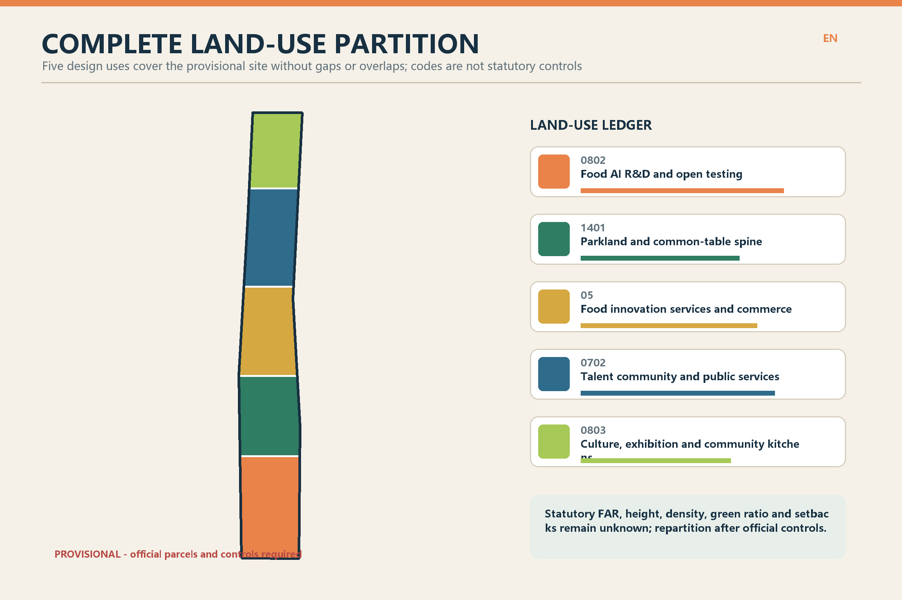
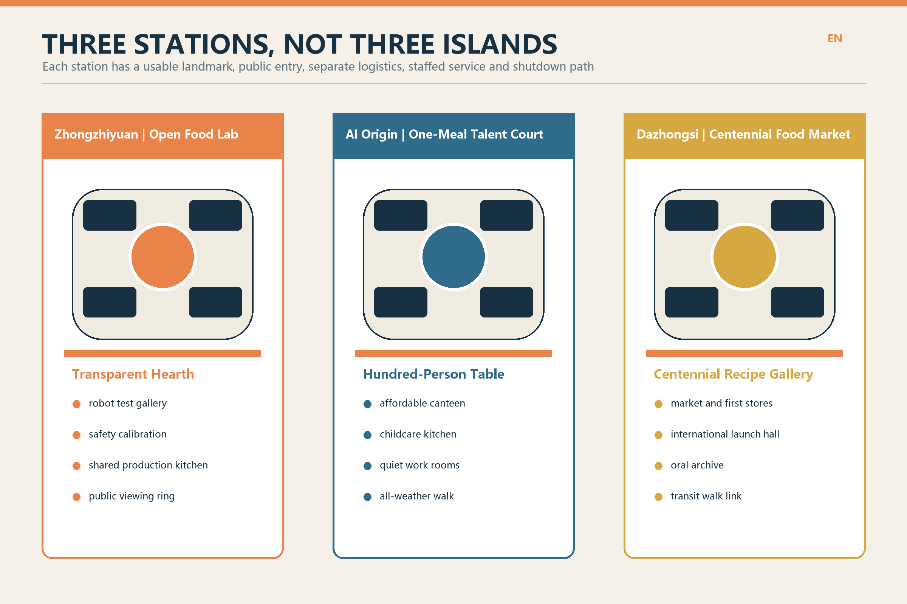
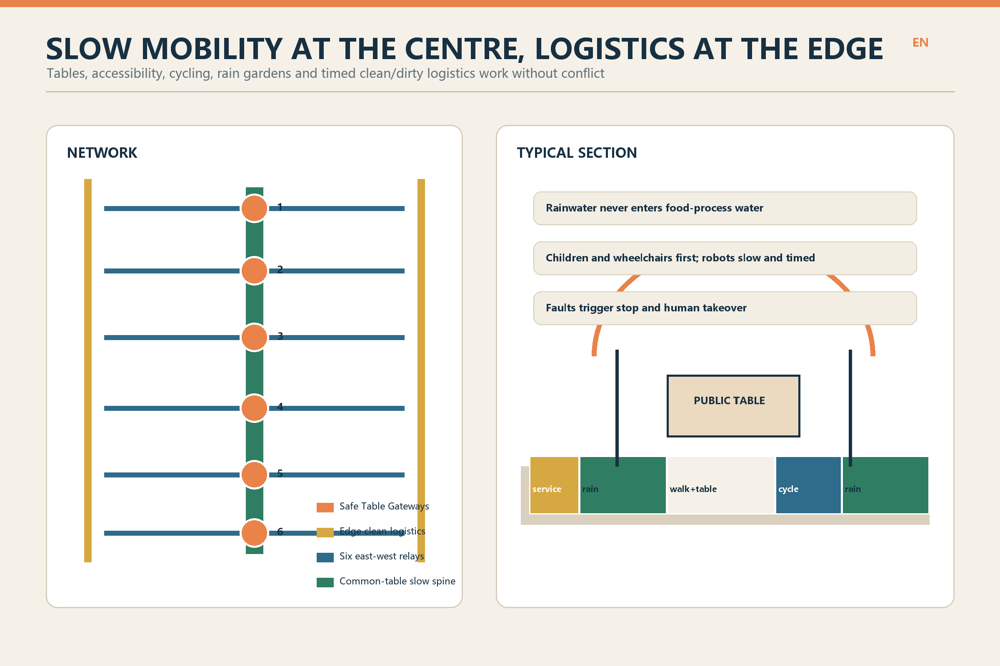
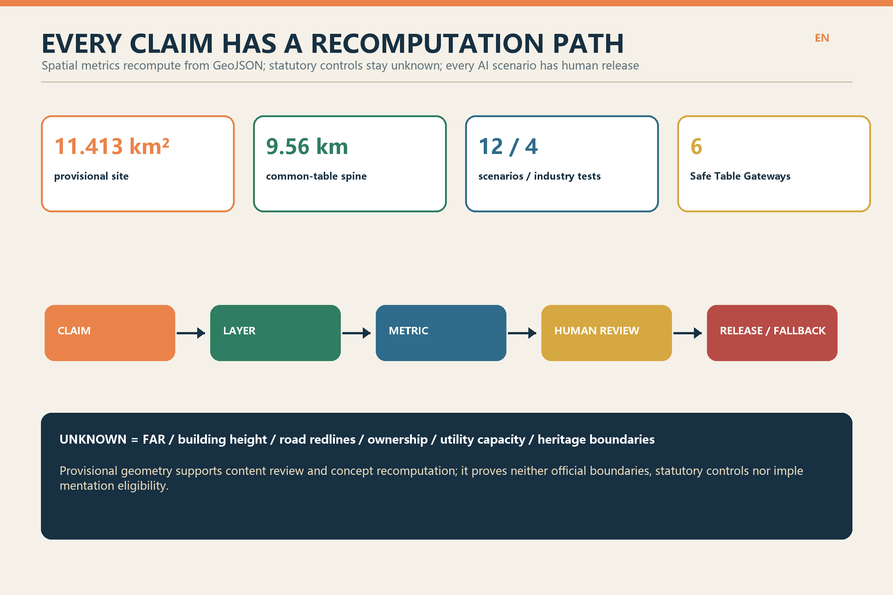

# FROM MODEL TO MEAL

> **One design judgement:** a world-class AI district must do more than make models run fast; it must let researchers, night-shift workers, talent households, neighbours and international visitors sit down to a safe daily meal.

Food is the smallest urban unit linking algorithms, industry, talent and public life. The spatial system is **one spine, three stations, six gateways and two wings**. The Jing-Zhang rail-heritage park becomes a Common-Table Spine. Zhongzhiyuan, AI Origin and Dazhongsi become the Open Food Lab, One-Meal Talent Court and Centennial Food Market. Six Safe Table Gateways provide hot meals, water, toilets, rest and staffed service. Both wings form a walkable network for production, consumption, surplus relay and resource recovery.

**Precision notice:** the current `SITE_BOUNDARY` and three `KEY_AREA` polygons are repository-registered provisional rough geometries, not official redlines. Areas, lengths, partitions and spatial relationships support concept design, temporary recomputation and content review only. They must be recalibrated when official polygons, controls, ownership, utilities, fire, heritage and existing-condition surveys arrive. [source:BOUNDARY-SOURCE] [assumption:A-BOUNDARY-001]

## Design Basis and Source List

The first authority is the Haidian open-call announcement and its three planning scopes. Machine-readable inputs are the repository taskbook, site package, source registry and standards snapshots. [source:OFFICIAL-ANNOUNCEMENT] [source:AGENT-TASKBOOK] [source:SOURCE-REGISTRY]

- **Usable now:** public tasks, the three scopes, scenario requirements, submission contracts and repository-registered provisional geometry.
- **Provisional constraints only:** the roughly 11.4 km² overall area and three provisional key-area polygons.
- **Not inferable:** statutory FAR, building height, road redlines, ownership, demolition decisions, utility capacity, heritage boundaries or implementation commitments.
- **Discussion becomes a risk, not a fact:** Issue #846 records spatial uncertainty between available heritage mapping and a provisional key area. This proposal claims neither overlap nor separation; it marks the interface as sensitive pending survey. [source:SPATIAL-ISSUE-846]

## Three-Scope Working Framework

1. **Coordinated research area:** connect university research, food-AI firms, regulators, nutrition and health, community services, the night economy and Beijing food culture through research, joint testing, release, daily use and review.
2. **Overall design area:** within the provisional 11.4 km², provide one spine, three stations, six gateways and two wings, with a complete land-use partition, building prototypes, slow mobility and clean logistics, blue-green space, a project list and recomputable metrics. [data:geometry/land_use.geojson#LU-001]
3. **Key detailed-design areas:** each key area supports a plan, section, project list and pilot while never presenting provisional boundaries or prototypes as approved design. [data:geometry/key_areas.geojson#PROV-KEY-001]

## Industry and Future-City Research in the Coordinated Research Area

From Model to Meal builds four industry stages: **ingredient and nutrition data**, **cooking robotics and embodied intelligence**, **food-safety testing and trusted traceability**, and **low-carbon delivery and surplus relay**. Each stage has a public verification interface showing what the model did, who can stop it, where data came from and which human process resumes after failure.

The ecosystem ends neither at a screen nor in a showcase. It is judged by whether small operators can reuse experiments, residents can use services every day and meals continue when recommendations are off. Universities and firms gain real operating conditions; regulators and communities gain transparent tests; talent gains affordable daily life.

## Urban Renewal and Control-Plan-Level Urban Design in the Overall Design Area

The spine is not one continuous retail street. It combines slow mobility, rain gardens, public tables, six service gateways and open ground floors at three stations. Clean logistics stays at the edge and enters by time slot, separate from children, wheelchairs and cycling. The two wings connect community canteens, first stores, small-batch production, childcare and surplus relay at an indicative 15-minute walk, to be recalibrated with road and population data.

Five design land-use types cover the provisional site without gaps or overlaps. Colours and codes are recommendations, not control-plan amendments. [data:geometry/land_use.geojson#LU-001] [metric:land_use_partition_area_sqm]

Renewal follows **survey first, retain next, adapt before new build**. No existing building is marked for demolition before survey. Twelve submitted footprints are spatial prototypes for food labs, shared kitchens, talent courts and market halls. FAR, height, total floor area and setbacks remain unknown. [assumption:A-EXISTING-001] [metric:floor_area_ratio]

## Detailed Design of Key Areas

| Key area | Design name | Space and buildings | AI+ scenarios | First move |
| --- | --- | --- | --- | --- |
| Zhongzhiyuan AI Autonomous Innovation Acceleration Area | Open Food Lab | Four transparent test galleries surround a shared service yard; the visitor ring is separated from equipment logistics. | Cooking robots, food-safety calibration, small-business twins and cold-delivery tests. | Begin with mobile kitchen modules; retain/adapt decisions await survey. |
| Beijing AI Origin Community | One-Meal Talent Court | Campus-linked courts combine an affordable canteen, childcare kitchen, quiet work rooms and all-weather walks. | Talent canteen, childcare time bank, night-shift tables and accessible relays. | Activate ground floors and courts before adding building volume. |
| Dazhongsi AI Industry Cluster | Centennial Food Market | A market hall, launch hall and recipe gallery frame a civic square connected to transit and the rail park. | Oral archive, international tasting week and surplus-food relay. | Every heritage intervention starts with conservation and structural survey. |

The three landmarks are usable civic facilities rather than iconic objects: Zhongzhiyuan's Transparent Hearth, AI Origin's Hundred-Person Table and Dazhongsi's Centennial Recipe Gallery. Each has a public entrance, service entrance, staffed desk, stop control and a complete non-digital route.

## AI Innovation Ecosystem, Talent Personas and AI+ Scenarios

| Persona | Primary need | Spatial response |
| --- | --- | --- |
| Food-AI researcher | Reproducible experiments, licensed samples and a walkable test field | Open Food Lab + quiet research courts |
| Startup or small operator | Affordable prototyping, first-store validation, legal and safety support | Shared production kitchen + Centennial Food Market |
| Food-safety and maintenance worker | Observable operating states, human takeover and clean logistics | Transparent test bench + separate service loop |
| Night-shift and delivery worker | Affordable hot meals, rest, toilets and non-algorithmic appeal | Six safe tables + staffed service desks |
| Talent household and neighbour | Childcare, daily meals, allergen information and accessibility | One-Meal Talent Court + 15-minute food network |
| International visitor and culture participant | Bilingual wayfinding, trustworthy menus and local stories | Dazhongsi launch hall + recipe archive |

| ID | Scenario | Spatial carrier | Data and human boundary | Type |
| --- | --- | --- | --- | --- |
| S01 | Open testing for cooking robots | Zhongzhiyuan test gallery | Firms provide device logs; no facial collection from visitors. Food and equipment safety officers jointly release each test. | Industry test |
| S02 | Multimodal food-safety calibration | Zhongzhiyuan transparent lab | Only licensed samples are used. Anomalies revert to manual sampling and laboratory tests. | Industry test |
| S03 | Digital twin for small food businesses | Zhongzhiyuan co-design hall | Anonymous process parameters compare energy, queues and cross-contamination; operators retain final decisions. | Industry test |
| S04 | Human-machine cold-delivery test street | Northern logistics edge | Robots receive low-speed, time-limited access; they stop for children, wheelchairs or faults and hand control to staff. | Industry test |
| S05 | One-Meal talent canteen | AI Origin public ground floor | Menus, allergens and prices are visible. Recommendations can be off; staffed and non-digital service remains. | Public service |
| S06 | Childcare kitchen time bank | AI Origin talent court | Scheduling uses only volunteered availability and never infers family ties or parenting ability. | Talent service |
| S07 | Safe table for night shifts | Six gateway nodes | Aggregated demand informs hours without individual tracking; a duty manager adjusts service. | Public service |
| S08 | Accessible ordering and delivery relay | Common tables along the corridor | Voice, pictograms, braille and staffed ordering coexist; health data stays on device. | Inclusive service |
| S09 | Centennial recipe oral archive | Dazhongsi food market | Interviewees grant and may withdraw item-level consent; AI assists transcription and translation with uncertainty labels. | Culture |
| S10 | International founder tasting week | Dazhongsi launch hall | Recipes, marks and imagery are cleared first; public ratings never replace food-safety approval. | Industry service |
| S11 | Trusted relay for surplus food | Community network in both wings | Batch time and temperature are logged without poverty profiling; charities confirm distribution. | Circular service |
| S12 | Rain garden and compost classroom | Rail-park demonstration garden | Sensors monitor only the environment; food safety, soil and compost hygiene require professional review. | Public learning |

The four industry tests share one release protocol: **licensed sample, closed pre-test, open joint test, two-person release, incident review and reversible launch**. S05-S12 enter daily operation only after privacy, accessibility, food safety, labour and human-fallback checks. AI recommendation is never a condition for public service. [source:AI-MEASURES] [source:BARRIER-FREE-LAW]

## Land Use, Building Scale, and Retain-Renovate-Demolish Strategy

Five design uses fully partition the provisional boundary. Research and testing cluster around the northern innovation platform; talent and public services occupy the campus-linked centre; culture and market services address transit and city flows in the south; parkland and the Common-Table Spine connect all three.

Building prototypes use traversable ground floors, a flexible 6-12 m service band, separate clean/dirty logistics, demountable kitchen modules and weather canopies. These are design-depth intentions, not statutory dimensions. Retain, adapt and new-build status requires building, structural, fire, heritage and ownership checks. [data:geometry/buildings.geojson#BLDG-001] [assumption:A-CONTROLS-001]

## Transport, Rail, Municipal and Public-Service Facilities

The Common-Table Spine prioritises walking, with continuous cycling, accessible routes and six east-west relays. Clean logistics uses edge loading and time windows. At Dazhongsi, only pedestrian stitching and open-ground-floor principles are proposed; exact exits, security, fire and interchange require transit and transport review. [data:geometry/roads.geojson#ROAD-001]

Visible back-of-house systems separate ingredients, tableware return, grease, food waste, recyclables and residual waste. Each key area has a checklist for exhaust, grease interceptors, wastewater, cold chain, power and fire capacity. Rainwater can irrigate landscapes but never enters food-process water. AI may assist monitoring but cannot replace responsible food, environment or fire officers. [assumption:A-FOOD-001]

## Blue-Green Space, Public Space and Urban Character

The green system includes a continuous rain garden, three food courts and six gateway gardens. Edible plants remain controlled demonstrations; species, soil, irrigation and harvesting require professional approval before any edibility claim. Canopies, long tables and signs borrow the rhythm and durability of railway works without imitating historic buildings.

Character is **workmanlike, cleanable, repairable and legible**: warm paper, railway blue, leaf green and hearth orange. Equipment interfaces remain visible. Chinese, English, pictograms and tactile information coexist. Provisional boundaries are labelled on every figure so visual polish does not create false precision.

## Renewal Project List, Implementation Policy and Phasing Plan

| ID | Project | Type | Phase | Dependency | Evaluation |
| --- | --- | --- | --- | --- | --- |
| M01 | Common-Table Spine | Slow mobility/public realm | P1 | Official boundary, road redlines, rail-park interface | Continuity, accessibility, staffed hours |
| M02 | Six Safe Table Gateways | Public service | P1 | Permits, utilities, toilets and night safety | Service hours, fallback, worker satisfaction |
| M03 | Zhongzhiyuan Open Food Lab | Industry testing | P1-P2 | Food safety, fire, equipment and sample licences | Reproducibility and takeover logs |
| M04 | AI Origin One-Meal Talent Court | Talent/community | P1-P2 | Ownership, existing buildings and childcare licensing | Affordable meals, family use, accessibility |
| M05 | Dazhongsi Centennial Food Market | Culture/industry | P2 | Heritage, transit interface and market regulation | Rights-cleared archive, first-store survival, public access |
| M06 | 15-Minute Food Network in Both Wings | Neighbourhood renewal | P2-P3 | Community agreement, cold chain and last mile | Walkable coverage and surplus relays |
| M07 | Clean Service and Resource Loop | Municipal | P2 | Drainage, exhaust, waste, energy and fire | Water/energy, separation, complaint closure |
| M08 | One-Meal Data and Exit Charter | Governance | P1-P3 | Accountability, audit and participation | Recommendation-off rate, review time, shutdown drills |

- **P1 / 0-18 months:** mobile long tables, six gateways, open test days, a staffed-service charter and existing-condition surveys. Failures are reversible.
- **P2 / 18-48 months:** adapt the three key areas only after ownership, heritage, fire and utilities are confirmed. Leases and operating agreements bind public opening hours.
- **P3 / after 48 months:** expand both wings and a long-term food-innovation fund; publish annual energy, safety, labour, accessibility, takeover and shutdown-drill records.

Policy tools include low-cost first stores, a shared food-safety laboratory, public-ground-floor time covenants, data-minimisation clauses, a right to turn recommendations off, a night-worker service baseline and a responsible surplus-food chain. Every operation needs a named entity and budget; this proposal claims neither approval nor implementation.

## Indicator System, Area Recalculation and Compliance Matrix

| Indicator | Current value | Recomputation source | Meaning |
| --- | --- | --- | --- |
| Provisional overall area | 11.413 km² | GeoJSON / EPSG:4548 | Temporary; recalculate with official polygons |
| Common-table slow spine | 9.56 km | roads.geojson | Concept line, not a road redline |
| Design green ratio | 12.9% | green_space / site boundary | Design recommendation, not an approved control |
| Public-space ratio | 1.4% | public_space / site boundary | Counts submitted layers only |
| AI+ scenarios / industry tests | 12 / 4 | proposal.en.md | Scenario count, not deployed services |
| FAR / height / road redlines | unknown | Official control and engineering data | Prerequisite for formal development |

All known spatial indicators are recomputable from GeoJSON in EPSG:4548. Unknown controls retain a reason, required source and formula. Full values are in `metrics.json`; task, standard and design-depth coverage are in `compliance_matrix.json`, `standard_matrix.json` and `design_depth_matrix.json`.

## Risk, Copyright and Compliance Statement

Primary risks are false precision from provisional geometry; missing condition and ownership data; unknown food, fire and engineering capacity; uncertain heritage interfaces; AI-driven privacy or exclusion; and unsustainable labour or operating budgets. Controls are prominent labels, full recalculation, professional pre-checks, parallel staffed service, stop and appeal mechanisms, and reversible phasing.

Text, diagrams, GeoJSON, HTML and build code are original AI-assisted work released under CC BY-SA 4.0. No third-party images, logos or font files are distributed. Microsoft Chinese fonts are used only for local rasterisation/PDF embedding and are not repackaged. See the bilingual `report/copyright_statement.md`.

## References

- Haidian public announcement for the Centennial Jing-Zhang AI Innovation Belt urban-design call. [source:OFFICIAL-ANNOUNCEMENT]
- Repository taskbook, design brief, source registry and provisional geometry. [source:AGENT-TASKBOOK] [source:SITE-PACKAGE] [source:BOUNDARY-SOURCE]
- Public snapshots for urban design, control planning and land-use classification. [source:URBAN-DESIGN-MEASURES] [source:CONTROLLED-DETAILED-PLANNING] [source:MNR-LAND-USE]
- Public snapshots for generative AI and accessibility. [source:AI-MEASURES] [source:BARRIER-FREE-LAW]
- Public discussion of spatial uncertainty. [source:SPATIAL-ISSUE-846]
