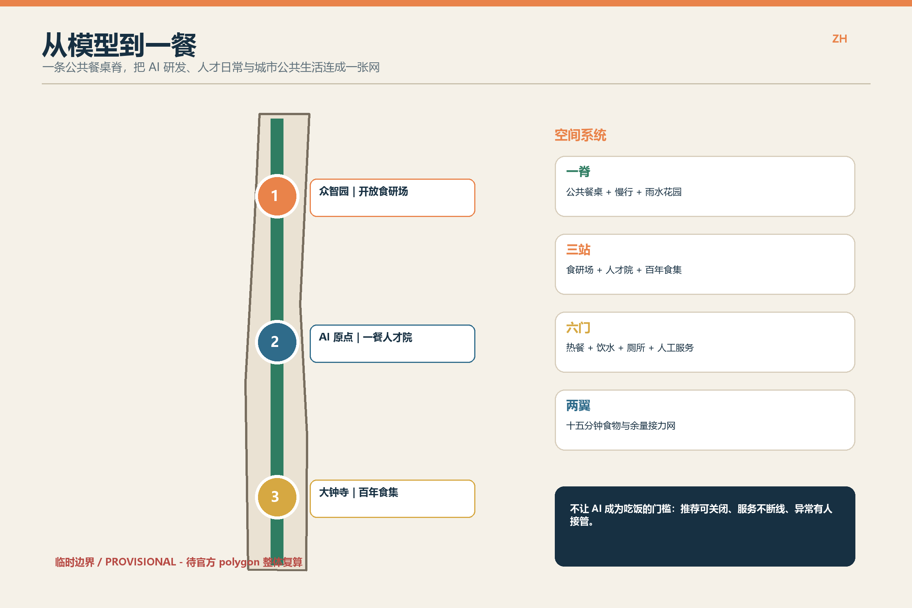
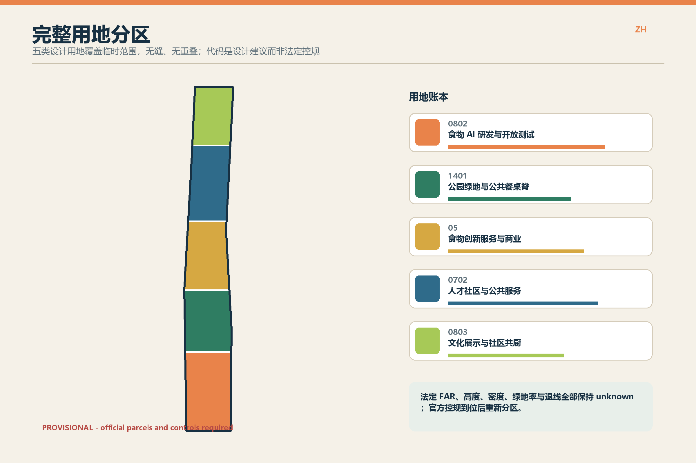
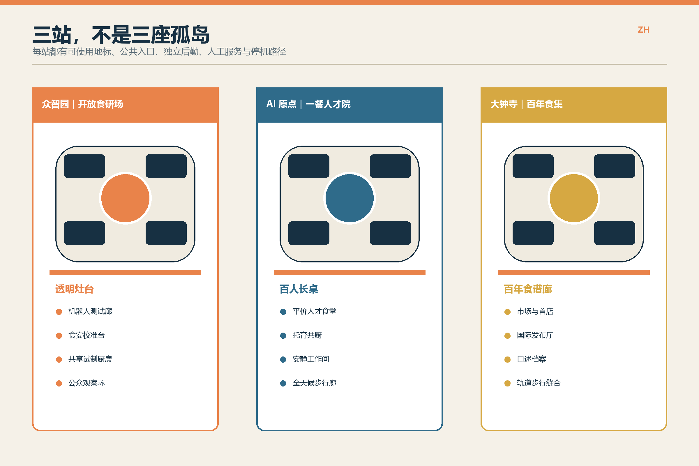
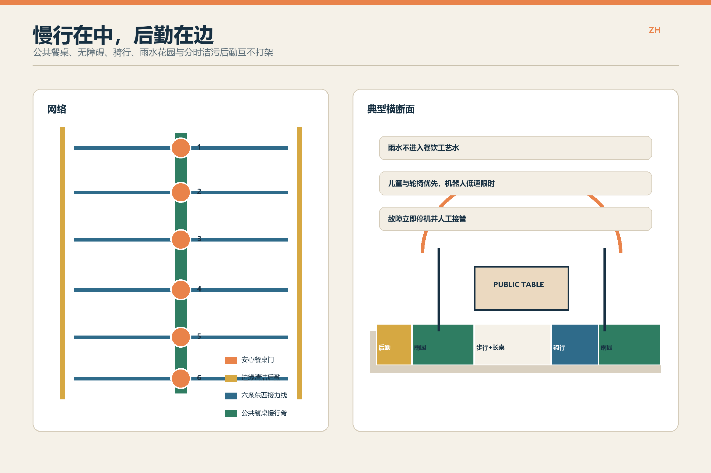
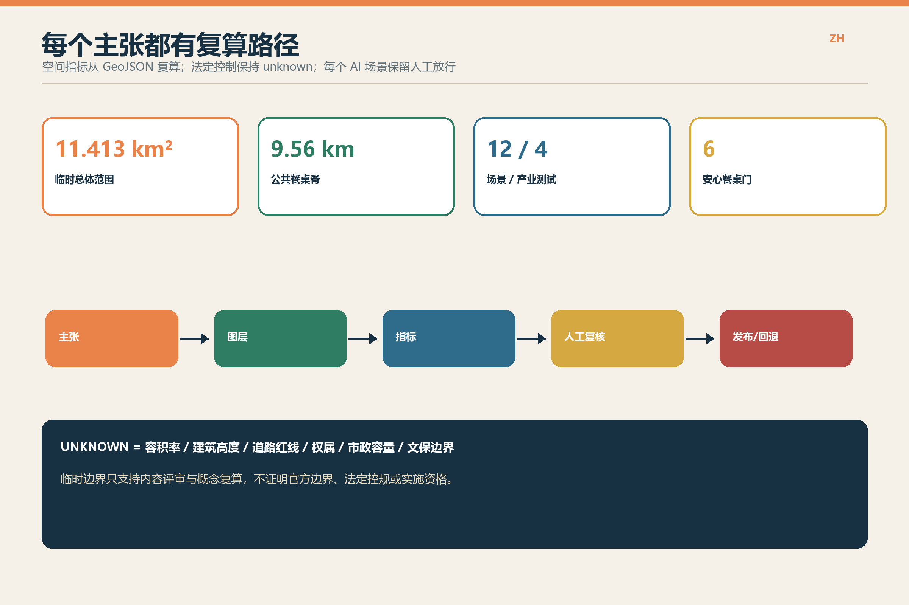

# 从模型到一餐 / FROM MODEL TO MEAL

> **一句话设计判断**：一条世界级 AI 创新带，不只要让模型跑得快，还要让研究者、夜班劳动者、人才家庭、邻里和国际访客每天都能安心坐下吃一餐。

本方案把食物当作连接算法、产业、人才与公共生活的最小城市单元。空间结构为 **一脊、三站、六门、两翼**：京张遗址公园成为公共餐桌脊；众智园、AI 原点、大钟寺分别成为开放食研场、一餐人才院、百年食集；六座安心餐桌门提供热餐、饮水、厕所、休息和人工服务；东西两翼形成步行可达的生产、消费、余量接力与资源回路。

**精度声明**：当前 `SITE_BOUNDARY` 和三处 `KEY_AREA` 均为仓库登记的 provisional rough geometry，不是 official redline。以下面积、长度、分区和空间关系只用于概念设计、临时复算与内容评审；正式 polygon、控规、权属、市政、消防、文保和现状普查到位后必须整体校准。[source:BOUNDARY-SOURCE] [assumption:A-BOUNDARY-001]

## 设计依据与资料清单

第一依据是北京市海淀区公开征集公告及其三层工作范围与重点任务；机器可读依据为仓库内 taskbook、site package、来源登记表和标准快照。[source:OFFICIAL-ANNOUNCEMENT] [source:AGENT-TASKBOOK] [source:SOURCE-REGISTRY]

- **可用于当前设计**：公开任务、三层范围、场景要求、提交协议与仓库登记的临时几何。
- **只能作为临时约束**：约 11.4 km² 的总体范围和三处重点区 provisional polygons。
- **不能被推断**：法定容积率、建筑高度、道路红线、产权边界、拆改留结论、市政容量、文保范围和实施承诺。
- **争议转化为风险**：Issue #846 记录了可用遗产映射与临时重点区之间的空间不确定性。本方案不据此断言相交或不相交，只把相关界面标为敏感并要求正式测绘。[source:SPATIAL-ISSUE-846]

## 三层范围工作框架

1. **统筹研究范围**：把高校科研、食物 AI 企业、市场监管、医疗营养、社区服务、夜间经济与北京食物文化组织为“研发—共测—放行—日常使用—复盘”的创新链。
2. **总体设计范围**：在 provisional 11.4 km² 范围内形成一脊三站六门两翼，给出完整用地分区、建筑原型、慢行与清洁后勤、蓝绿空间、项目清单和复算指标。[data:geometry/land_use.geojson#LU-001]
3. **重点区域范围**：三处重点区各自达到“可画总图、可画剖面、可列项目、可做试点”的详细设计表达，但不把临时边界和建筑原型冒充审定方案。[data:geometry/key_areas.geojson#PROV-KEY-001]

## 统筹研究范围产业与未来城市研究

“从模型到一餐”建立四段产业链：**食材与营养数据**、**烹饪机器人与具身智能**、**食安检测与可信追溯**、**低碳配送与余量接力**。每一段都设置公共验证界面：可观察模型做了什么、谁能停止、数据从哪里来、异常时回到哪一种人工流程。

创新生态不以大型展厅为终点，而以三类转化率衡量：实验能否被小微经营者复用、服务能否被普通市民日常使用、故障时能否在没有推荐算法的情况下继续供餐。高校与企业得到真实工况，监管和社区得到透明测试，人才得到可负担的日常生活，形成比“只展示模型”更稳定的创新黏性。

空间上，这条产业链不是把食品工厂铺满全线，而是把高风险测试、日常公共服务和文化消费分层布置：北段承接封闭预试与开放共测，中段验证人才家庭的高频使用，南段连接首店、发布和国际交流；每个环节均通过公共餐桌脊回到城市界面。`SCENARIOS_ZH` 中的 S01-S04 是可计数的产业测试场景，S05-S12 是经审查后进入日常的公共场景。[source:AGENT-TASKBOOK] [metric:industry_test_scenario_count]

资料缺口直接影响产业判断：没有企业名录、租金、客流、厨房工程和冷链容量，就不能宣称招商规模或产值；没有真实运营记录，也不能把场景数量写成部署绩效。因此本版只提出空间载体、放行协议和待采集指标，并把企业结构、岗位、成本与需求调查列为专业团队接手后的统筹研究任务。

## 总体设计范围城市更新与控规深度城市设计

**一脊**不是连续商业街，而是慢行、雨水花园、公共餐桌、六座服务门与三站开放首层的组合；清洁后勤在边缘、分时进入，避免与儿童、轮椅和骑行流线混行。**两翼**每隔约十五分钟步行时间接入社区食堂、首店、小微试制、托育和余量接力点，具体服务半径待道路与人口数据到位后校准。

用地采用五类连续分区，完全覆盖临时范围且无重叠；颜色与代码是设计建议，不是控规调整结论。[data:geometry/land_use.geojson#LU-001] [metric:land_use_partition_area_sqm]

建筑更新遵循“**先普查、再保留、后适配、慎新建**”。现有建筑未普查前，不给出拆除结论；提交的十二个 footprint 是食研棚、共享厨房、人才院和市场厅的空间原型，用于讨论首层界面和院落关系。容积率、建筑高度、总建筑面积与退线保持 unknown。[assumption:A-EXISTING-001] [metric:floor_area_ratio]

## 重点区域详细设计

| 重点区 | 设计名 | 空间与建筑 | AI+ 场景 | 首期动作 |
| --- | --- | --- | --- | --- |
| 众智园 AI 自主创新加速区 | 开放食研场 | 四条透明测试廊围合共享后勤庭；公众参观环与设备物流环分开。 | 烹饪机器人、食安校准、小微餐饮孪生、低温配送共测。 | 先用可移动厨房模块试运行，建筑保改留待普查。 |
| 北京 AI 原点社区 | 一餐人才院 | 近校院落串联平价食堂、托育共厨、安静工作间与全天候步行廊。 | 人才食堂、托育时间银行、夜班餐桌、无障碍接力。 | 优先盘活首层与院落，不以新建体量替代日常运营。 |
| 大钟寺 AI 产业聚集区 | 百年食集 | 市场厅、发布厅和百年食谱廊围合开放广场，接轨道站点与遗址公园。 | 口述档案、国际试餐周、余量食物接力。 | 任何遗产改造先做文保与结构勘察。 |

三处地标不是巨型造型，而是可使用的公共设施：众智园“透明灶台”、AI 原点“百人长桌”、大钟寺“百年食谱廊”。每处均有公共入口、后勤入口、人工服务台、停机按钮和不使用智能设备也能完成的路径。

三处详细设计均以临时重点区为索引，而非精确红线；正式边界到位后应优先保留“公众环—测试核—后勤环”的空间关系，再校准建筑位置、出入口、消防间距与实施项目范围。[data:geometry/key_areas.geojson#PROV-KEY-001] [metric:key_area_count]

## AI 创新生态、人才画像与 AI+ 场景

| 画像 | 关键需求 | 空间响应 |
| --- | --- | --- |
| 食物 AI 研究员 | 可复现实验、合规样本、步行可达的测试场 | 开放食研场 + 安静研究院落 |
| 初创与小微经营者 | 低成本试制、首店验证、法务与食安辅导 | 共享后厨 + 百年食集 |
| 食安与设备维护人员 | 可观察工况、人工接管、清洁后勤 | 透明检测台 + 独立后勤环 |
| 夜班与配送劳动者 | 平价热餐、休息、厕所、非算法化申诉 | 六座安心餐桌 + 人工服务台 |
| 人才家庭与邻里 | 托育、日常共餐、过敏原信息、无障碍 | 一餐人才院 + 十五分钟食物网 |
| 国际访客与文化参与者 | 双语导航、可信菜单、在地故事 | 大钟寺发布厅 + 百年食谱廊 |

| 编号 | 场景 | 空间载体 | 数据与人工边界 | 类型 |
| --- | --- | --- | --- | --- |
| S01 | 烹饪机器人开放共测 | 众智园测试廊 | 企业上传设备工况，不采集围观者人脸；食品安全员与设备安全员双放行。 | 产业测试 |
| S02 | 食安多模态校准台 | 众智园透明实验室 | 只使用获授权样本；模型异常时退回人工抽检与实验室检测。 | 产业测试 |
| S03 | 小微餐饮数字孪生沙盘 | 众智园共创厅 | 以匿名工艺参数比较能耗、排队和交叉污染；经营者保留最终决策。 | 产业测试 |
| S04 | 低温配送人机共测街 | 北段后勤边界 | 机器人限定时段与低速路权；遇儿童、轮椅或故障立即停车并人工接管。 | 产业测试 |
| S05 | 一餐人才食堂 | AI 原点公共首层 | 公开菜单、过敏原与价格；推荐可关闭，保留现金/人工窗口和无智能设备通道。 | 公共服务 |
| S06 | 托育共厨时间银行 | AI 原点人才院 | 排班仅处理自愿提交的可用时段；不推断家庭关系与育儿能力。 | 人才服务 |
| S07 | 夜班安心餐桌 | 六座门户节点 | 按聚合需求延长供餐，不用个体轨迹预测；由人工值班经理调整。 | 公共服务 |
| S08 | 无障碍点餐与送餐接力 | 全线公共餐桌 | 语音、图形、盲文与人工点单并行；个人健康信息不出端。 | 包容服务 |
| S09 | 百年食谱口述档案 | 大钟寺食集 | 受访者逐条授权、可撤回；AI 仅辅助转写翻译并标明不确定内容。 | 文化场景 |
| S10 | 国际创业者试餐周 | 大钟寺发布厅 | 配方、商标与影像先清权；公众评分只作参考，不替代食安审批。 | 产业服务 |
| S11 | 余量食物可信接力 | 两翼社区服务网 | 按批次记录时间与温度，不做贫困画像；公益机构人工确认流向。 | 循环服务 |
| S12 | 雨水菜园与堆肥课堂 | 遗址公园示范庭 | 传感器只监测环境；可食性、土壤安全与堆肥卫生须由专业机构复核。 | 公共教育 |

四个产业测试场景必须形成同一套放行协议：**授权样本—封闭预试—公开共测—双人放行—异常复盘—可撤回上线**。场景 S05-S12 只在完成隐私、无障碍、食品安全、劳动保护和人工回退检查后进入日常运营。任何 AI 推荐都不是获得公共服务的门槛。[source:AI-MEASURES] [source:BARRIER-FREE-LAW]

## 用地、建筑规模与拆改留方案

五类设计用地由 `land_use.geojson` 完整分割临时 site boundary。食研与测试优先靠近北段创新平台；人才社区与公共服务放在近校中段；文化展示和市场服务落在南段轨道与城市客流界面；绿地与公共餐桌脊贯穿全线。

建筑原型控制为“可穿越首层 + 6-12 米可变进深服务带 + 独立洁污后勤 + 可拆厨房模块 + 遮阴雨棚”。这些是设计深度要求，不是法定尺寸。保留/改造/新建状态必须在建筑普查、结构、消防、文保和权属核验后逐栋确认。[data:geometry/buildings.geojson#BLDG-001] [assumption:A-CONTROLS-001]

## 交通、轨道、市政与公共服务设施

公共餐桌脊以步行为第一优先，连续组织骑行、无障碍和六条东西接力线；清洁物流在边缘设置短停与交接，限定时段穿越公共空间。轨道站点与大钟寺接口只提出步行缝合和首层开放建议，具体出入口、安检、消防与换乘必须由轨道和交通专业复核。[data:geometry/roads.geojson#ROAD-001]

市政采用“看得见的后勤”：净菜、餐具回收、油脂、厨余、可回收物和普通垃圾分流；油烟、隔油、污水、冷链、电力和消防容量在每个重点区设置深化清单。雨水可用于景观灌溉，但不得进入餐饮工艺水。AI 可辅助监测，不能代替食安、环保和消防责任人。[assumption:A-FOOD-001]

## 蓝绿空间、公共空间与城市风貌

绿地系统由贯通雨水花园、三座食物庭和六座门户小花园组成。可食植物只用于受控示范，种类、土壤、灌溉和采摘规则经专业确认前不得宣称可食。廊架、长桌、标识和可拆厨房使用铁路构件的节奏与耐用尺度，但不仿造历史建筑。

风貌关键词为“**工务感、可清洁、可修补、看得懂**”：暖白底、铁路蓝、蔬叶绿和炉火橙；设备接口不藏在黑箱里；中英双语、图形符号和触觉信息并置。临时边界在所有图件显著标注，避免一张漂亮总图制造错误精度。

蓝绿空间的量化只计算提交的 `GREEN_SPACE` 与 `PUBLIC_SPACE` 并集，不把道路绿化、屋顶花园或未测绘水系重复计入。当前绿地比例是基于临时边界的设计值，不是审定绿地率；雨洪调蓄容积、树冠覆盖、热舒适与生态基底因缺少地形、土壤、管网和现状植被资料保持待测。[data:geometry/green_space.geojson#GREEN-001] [metric:green_ratio]

公共空间必须在最差工况下仍可用：暴雨时关闭低洼设备但保留绕行；冬季维持除冰、避风和热饮人工服务；活动结束后长桌与模块可拆回；传感器失效时由值班人员巡检。历史风貌与新设施的材料、色彩、照明、标识和广告边界，应在文保与城市设计专业复核后形成可执行导则。

## 更新项目清单、实施政策与分期计划

| 编号 | 项目 | 类型 | 阶段 | 前置条件 | 评估重点 |
| --- | --- | --- | --- | --- | --- |
| M01 | 公共餐桌脊 | 慢行/公共空间 | P1 | 官方边界、道路红线、遗址公园接口 | 连续性、无障碍、人工服务时长 |
| M02 | 六座安心餐桌门 | 公共服务 | P1 | 点位许可、水电、厕所与夜间安全 | 供餐时段、故障回退、劳动者满意度 |
| M03 | 众智园开放食研场 | 产业测试 | P1-P2 | 食安、消防、设备和样本授权 | 测试复现率、人工接管记录 |
| M04 | AI 原点一餐人才院 | 人才/社区 | P1-P2 | 权属、既有建筑和托育资质 | 平价餐覆盖、家庭使用、无障碍 |
| M05 | 大钟寺百年食集 | 文化/产业 | P2 | 文保、轨道接口、市场监管 | 清权档案、首店存活、公共开放 |
| M06 | 两翼十五分钟食物网 | 社区更新 | P2-P3 | 社区协商、冷链和末端物流 | 步行服务覆盖、余量接力批次 |
| M07 | 清洁后勤与资源回路 | 市政 | P2 | 排水、油烟、垃圾、能源与消防 | 水能耗、分类率、投诉闭环 |
| M08 | 一餐数据与退出章程 | 治理 | P1-P3 | 责任主体、审计与公共参与 | 关闭推荐比例、人工复核时效、退出演练 |

项目的空间分期以 `phasing.geojson` 为临时索引，P1 的可逆试点不构成后续建设承诺；P2、P3 必须经过官方边界、控规、权属和工程条件确认。[data:geometry/phasing.geojson#P1]

- **P1 / 0-18 个月**：只做可移动长桌、六座服务门、开放测试日、人工服务章程和现状普查；失败可撤回。
- **P2 / 18-48 个月**：在权属、文保、消防和市政确认后适配更新三处重点区；以租赁、共建和运营合同绑定公共开放时长。
- **P3 / 48 个月后**：扩展两翼网络与长期食物创新基金；每年公开能耗、食安、劳动、无障碍、人工接管和退出演练记录。

政策工具包括低成本首店、共享食安实验室、公共首层时段契约、数据最小化条款、算法关闭权、夜班劳动者服务基线和余量食物责任链。所有运营承诺都需要落实责任主体与预算，当前方案不声称已获批或已实施。

## 指标体系、面积复算与合规矩阵

| 指标 | 当前值 | 复算来源 | 解释 |
| --- | --- | --- | --- |
| 临时总体范围面积 | 11.413 km² | GeoJSON / EPSG:4548 | 临时值；官方 polygon 到位后重算 |
| 公共餐桌慢行脊 | 9.56 km | roads.geojson | 概念中心线，非道路红线 |
| 设计绿地比例 | 12.9% | green_space / site boundary | 设计建议，非审定绿地率 |
| 公共空间比例 | 1.4% | public_space / site boundary | 仅计提交图层 |
| AI+ 场景 / 产业测试 | 12 / 4 | proposal.md | 场景数量，不代表已部署 |
| 容积率 / 高度 / 道路红线 | unknown | 官方控规与工程资料 | 正式深化前置条件 |

所有 known 空间指标均可从 GeoJSON 在 EPSG:4548 下复算；unknown 指标保留原因、来源需求与补算公式。完整值见 `metrics.json`，任务、标准和设计深度覆盖分别见 `compliance_matrix.json`、`standard_matrix.json` 与 `design_depth_matrix.json`。

临时总体面积、用地分区面积、建筑原型基底、绿地、公共空间和慢行中心线分别从对应图层独立计算，再做并集或比值，避免重叠重复计数。[metric:site_area_sqm] [metric:public_space_ratio]

## 风险、版权与合规说明

主要风险依次为：临时几何误导精度、现状与权属不足、食品与消防工程条件未知、遗产界面不确定、AI 服务造成隐私或排斥、劳动与运营预算不可持续。对应措施是显著标注、官方数据到位后整体复算、专业前置审查、人工服务并行、停机与申诉、分期可撤回。

空间风险通过 `constraints.geojson` 记录：临时边界不用于审批，遗产公园接口不推断精确相交；在官方测绘前，不放置永久基础、地下工程或不可逆拆除。食物系统风险通过洁污分流、双人放行和专业食安检测控制；AI 风险通过数据最小化、端侧处理、推荐关闭权、人工窗口、日志留存期限和申诉时限控制。[source:BOUNDARY-SOURCE] [data:geometry/constraints.geojson#CONSTRAINT-001]

劳动与运营风险同样是城市设计问题。若没有夜间值班、清洁维护、无障碍协助、设备检修和热餐补贴的长期预算，六座门户不得以“无人化”为理由上线。每次年度审查必须公开停机、误报、食安、能耗、投诉和人工接管记录；任何无法稳定维持非数字服务的场景应缩小或退出。方案的 `ready_for_review` 仅表示内容与包结构可评审，不表示官方边界、法定控规、施工许可或实施主体已经确认。

方案文字、图件、GeoJSON、HTML 与生成脚本为本次原创 AI 辅助成果，以 CC BY-SA 4.0 提交；未分发第三方图片、logo 或字体文件。微软中文字体仅在本机栅格化/嵌入 PDF，不随包再发布。完整权利说明见 `report/copyright_statement.md`。

## 参考资料

- 北京市海淀区百年京张 AI 创新带城市设计公开征集公告。[source:OFFICIAL-ANNOUNCEMENT]
- 仓库任务书、设计简报、来源登记与 provisional geometry。[source:AGENT-TASKBOOK] [source:SITE-PACKAGE] [source:BOUNDARY-SOURCE]
- 城市设计、控制性详细规划与国土空间用地分类公开标准快照。[source:URBAN-DESIGN-MEASURES] [source:CONTROLLED-DETAILED-PLANNING] [source:MNR-LAND-USE]
- 生成式 AI 与无障碍相关公开标准快照。[source:AI-MEASURES] [source:BARRIER-FREE-LAW]
- 空间不确定性公开讨论。[source:SPATIAL-ISSUE-846]
