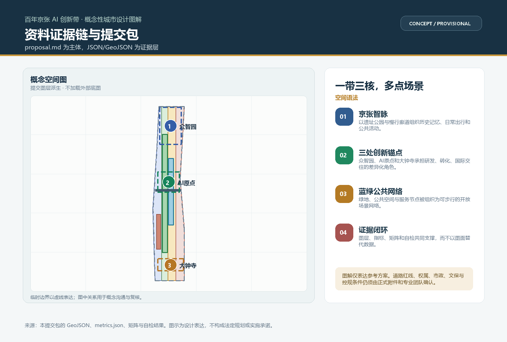
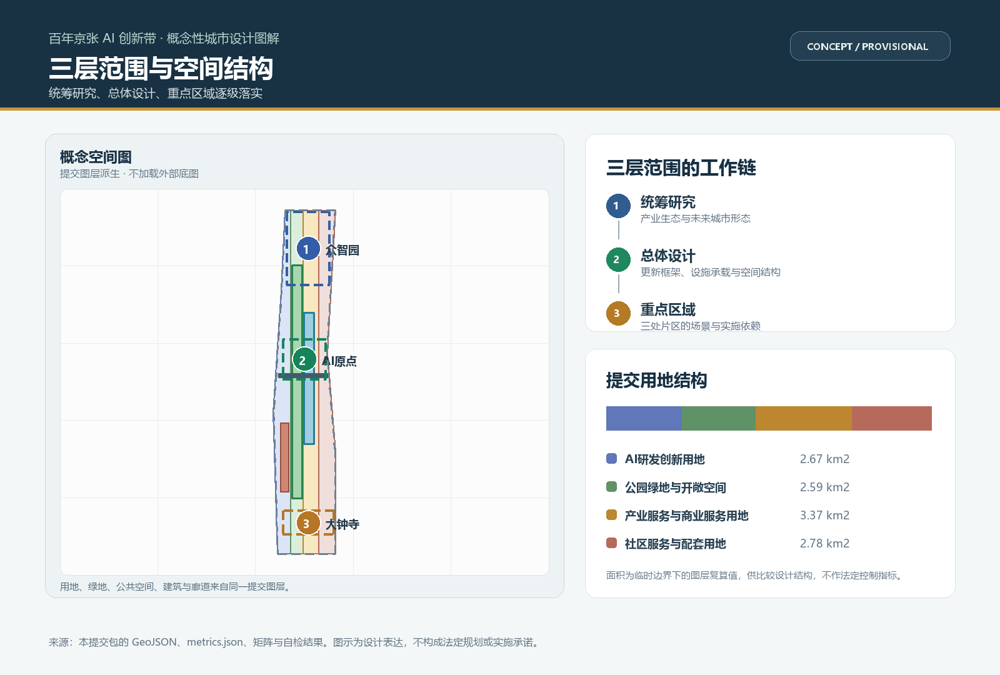
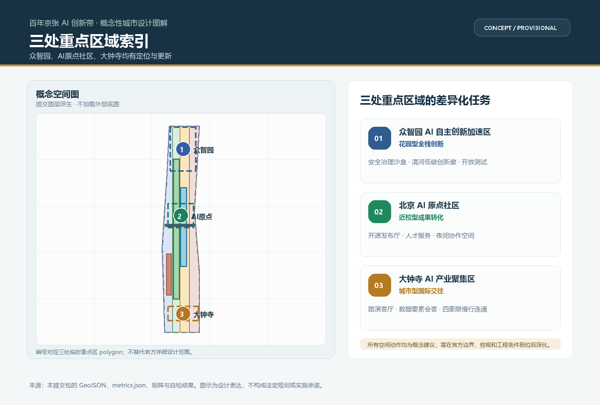
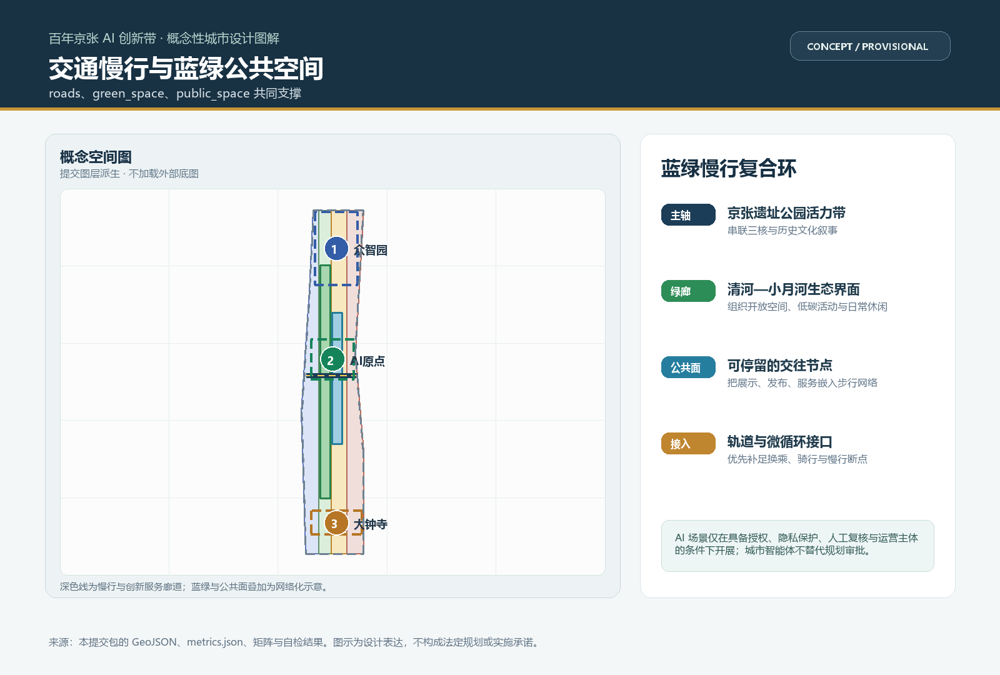
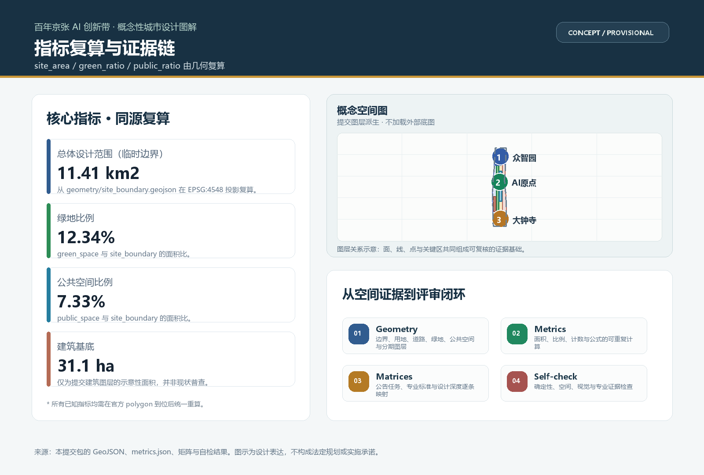

# 京张智脉：百年京张AI创新带协同共生方案

## 设计依据与资料清单

本方案以北京市规划和自然资源委员会海淀分局发布的《百年京张AI创新带城市设计国际方案征集资格预审公告》为第一依据 [source:OFFICIAL-ANNOUNCEMENT]，以 `brief/site-package/` 中的结构化任务书、边界、枚举、范围与来源清单为机器可读依据 [source:SITE-PACKAGE]。智能体在生成前读取了 `design_brief.json`、`allowed_design_space.json`、`agent_taskbook.json`、`sources.json`、`enums/`、`ranges/`、`schemas/`、`data/source_registry.json` 与 `standards.json`，并严格遵循面向智能体任务书的十条共创原则与统一边界条款 [source:AGENT-TASKBOOK]、[standard:PROJECT-AGENT-OPEN-CALL-TASKBOOK]。

资料使用边界由 `data/source_registry.json` 区分 formal-ready、background-only、provisional-only 与 needs-review 四类 [source:SOURCE-REGISTRY]。本方案仅以官方公告文字面积与道路四至形成的临时粗略边界作为生成 bootstrap，明确标注为 `provisional_constraint`、不作 official redline、不作精确面积依据 [source:BOUNDARY-SOURCE]、[source:KEY-AREA-SOURCE]。所有设计判断均拆解为可追溯来源、可复算指标、可校验图层与可人工复核假设 [depth:metrics_recalculation]。

公开资料边界决定本方案的表达性质：它是开放共创的概念建议与参考方案，不替代正式规划，不构成政府审定结论 [standard:MOHURD-CONTROL-DETAILED-PLANNING]。城市设计深度须落实规划、指导建筑设计、塑造特色风貌并统筹公共空间 [standard:MOHURD-URBAN-DESIGN-MEASURES]。用地表达采用国土空间用地用海分类逻辑与可校验 land_use_code [standard:MNR-LAND-USE-CLASSIFICATION-GUIDE]。

## 三层范围工作框架

方案按公告三层范围递进组织：统筹研究范围覆盖 43.6 平方公里，回答 AI 产业生态、三区两翼协同与未来城市形态 [data:geometry/site_boundary.geojson#SITE-001]；总体设计范围覆盖 11.4 平方公里京张遗址公园周边 1 至 2 公里城市地区与产业区，形成城市更新总体框架、产业空间布局、交通市政支撑与风貌控制 [depth:three_level_scope_framework]；重点区域范围覆盖 368.4 公顷三处详细设计地区，明确功能业态、建筑规模、拆改留分类、公共空间连通与交通组织 [depth:three_key_area_detailed_design]。

三层范围不是割裂的图纸集合。统筹研究决定产业链与城市形态判断，总体设计把判断落到更新项目、空间结构与设施承载，重点区域验证具体地块、建筑、交通、公共空间与 AI 场景的可实施性 [depth:overall_spatial_structure]。三处重点片区分别为众智园AI自主创新加速区、北京AI原点社区、大钟寺AI产业聚集区 [data:geometry/key_areas.geojson#KA-001]、[data:geometry/key_areas.geojson#KA-002]、[data:geometry/key_areas.geojson#KA-003]。

本方案建议的总体概念为「京张智脉」（Jing-Zhang Synoikism Belt）：以京张遗址公园为历史与公共空间主轴，以三处重点片区为创新锚点，以高校、企业、社区与轨道站点为日常网络，形成一带三核、多点场景、蓝绿慢行复合环的空间组织。这里的「一带」不是新增红线，而是把公告三层范围转译为工作方法；「三核」对应三处重点区域；「多点场景」对应 AI+ 公共服务、产业服务与城市生活的可运营节点；「复合环」对应慢行、绿地、公共空间与活动路线的联动 [depth:blue_green_public_space]。

| 层级 | 设计问题 | 方案回答 | 数据落点 |
| --- | --- | --- | --- |
| 统筹研究范围 | AI 产业生态与未来城市形态 | 高校策源、开源协作、企业转化、公共体验、国际传播的创新链 | compliance_matrix.json、standard_matrix.json |
| 总体设计范围 | 产业空间、城市更新、交通市政、风貌 | 用地、建筑、道路、绿地、公共空间、分期图层共同表达 | [data:geometry/land_use.geojson#LU-001]、[data:geometry/roads.geojson#ROAD-001] |
| 重点区域范围 | 三处片区如何达到详细设计深度 | 定位、空间动作、AI 场景、实施依赖 | [data:geometry/key_areas.geojson#KA-001]、[data:geometry/key_areas.geojson#KA-002]、[data:geometry/key_areas.geojson#KA-003] |

## 统筹研究范围产业与未来城市研究

统筹研究范围的核心任务是构建世界级 AI 创新生态体系，并在保护京张铁路历史层的同时，为 AI 原生城市形态留出涌现空间。这里存在一组需要辩证看待的关系：历史遗产的静态保护与 AI 创新的动态涌现、全球 AI 资本集聚与本地社区日常生活的平衡、自上而下的规划确定性与 AI 原生自下而上协作的不确定性 [depth:existing_conditions_diagnosis]。方案的处理方式不是消除张力，而是把张力转化为空间机制：让遗址公园成为可被 AI 场景轻量嵌入的活的历史层，让原点社区锚定人才与日常生活以避免绅士化，把方案整体定位为可供专业团队深化的概念建议 [standard:PROJECT-AGENT-OPEN-CALL-TASKBOOK]。

命名体系建议采用「京张智脉」主名称，英文 Jing-Zhang Synoikism Belt，辅以三带副名（百年京张文化带、都市AI生活体验带、AI融合创新带）与三核节点名（智脉原点、众智引擎、大钟交汇）。主名称的视觉识别方向是一个由铁路环线抽象而来的闭环结，外环代表京张遗址公园活力带，内网代表 AI 协作网络，可延展为导视、活动视觉与荣誉墙母题；该方向仅作概念建议，正式 Logo、字体与企业标识须另行清权 [depth:height_massing_character]。

面向智能体任务书要求回应五大功能与三区两翼协同回路 [standard:PROJECT-AGENT-OPEN-CALL-TASKBOOK]：AI 全栈自主创新体系、世界级 AI 创新生态、AI+ 场景赋能新范式、智能化 AI 活力城市、AI 治理全球话语权，分别由众智园、原点社区、大钟寺三核承接，并由中关村科技服务翼（要素全球化配置、IP 与资本赋能）与小月河场景赋能翼（场景开放与智能化活力城市）支撑 [depth:overall_spatial_structure]。

全球 AI 创新生态案例（7 例，用于转化为空间与运营机制，非照搬）：巴黎 Station F（单体巨型孵化器与社区运营）、多伦多 MaRS / Vector Institute（研究到产业的转化走廊）、深圳南山（硬件供应链与量产能力）、波士顿 Kendall Square（高校与生物/AI 交叉）、斯德哥尔摩 Kista（电信与城市测试床）、筑波科学城（国家实验室与宜居社群）、埃因霍温 Brainport（产学研民协同）。其共同经验是「物理集聚 + 开放测试权 + 人才日常网络 + 长期运营主体」，本方案据此把场景开放与开发者社区运营置为一带的长期资产 [depth:land_use_layout]。

## 总体设计范围城市更新与控规深度城市设计

总体设计范围要求达到控制性详细规划的城市设计深度。方案以用地分区、建筑基底、道路微循环、绿地与公共空间、分期图层共同表达城市更新总体结构 [data:geometry/land_use.geojson#LU-001]、[data:geometry/buildings.geojson#BLDG-001]、[data:geometry/roads.geojson#ROAD-001]。涉及建筑高度、开发强度、道路红线、退线与设施标准的结论，在缺少官方控规条件时一律写为待确认事项，不以推测值冒充审定指标 [depth:development_intensity_controls]、[standard:MOHURD-CONTROL-DETAILED-PLANNING]。

总体结构为「一轴串三核、蓝绿慢行复合环」：京张遗址公园活力带作为南北主轴，串联众智园、原点社区、大钟寺三个创新锚点；小月河与清河蓝绿廊、城市慢行网络、轨道站点一体化接口共同构成复合环 [depth:traffic_rail_slow_parking]。建筑更新以保留与改造为主，新建集中在产业服务与公共体验节点；拆改留分类在缺现状建筑与权属资料时只给出方法与待校准清单，不编造结论 [depth:retain_renovate_demolish]。

市政与新型基础设施策略覆盖 AI 产业服务设施、创新服务平台、人才生活服务、分布式能源、端侧算力与传统市政融合 [depth:municipal_new_infrastructure]。缺少管线、能源、排水、防洪、消防等工程资料时，列为正式深化前置条件，不把策略写成审定条件 [depth:risk_missing_data]。

## 重点区域详细设计

三处重点区域必须引用 [data:geometry/key_areas.geojson#KA-001]、[data:geometry/key_areas.geojson#KA-002]、[data:geometry/key_areas.geojson#KA-003]，并由 [depth:three_key_area_detailed_design] 校核是否达到规划综合实施方案深度。临时边界下，结论只能作为方向性设计，替换官方 polygons 后须重算。

众智园AI自主创新加速区（花园型全栈自主创新街区）：强化清河界面、产业展示、低碳创新交往与对外交通组织；以绿色空间承载开放测试与标准治理展示 [data:geometry/green_space.geojson#GREEN-001]。空间动作包括国家平台展示厅、安全治理沙盒、低碳算力驿站与花园型研发组团。

北京AI原点社区（近校型成果转化与人才社区）：组织校区、园区、街区慢行缝合；补足成果发布、人才服务、居住生活与开源协作空间 [data:geometry/public_space.geojson#PUBLIC-001]。空间动作包括开源发布厅、近校成果转化街、人才生活管家与夜间协作空间。

大钟寺AI产业聚集区（城市型智能经济与国际交往街区）：围绕大钟寺站一体化、四象限步行连通、商业服务与重点企业公共环境更新 [data:geometry/roads.geojson#ROAD-001]。空间动作包括国际路演客厅、智能体展示、数据要素会客厅与绿地复合利用。

每个重点区均形成「定位 + 空间结构 + 建筑更新 + 交通慢行 + 公共空间 + AI 场景 + 实施风险」的可读小方案。若重点区 polygon 为临时，须说明哪些结论只能作为方向性设计 [assumption_id:A-CONTROLS-001]。

## AI 创新生态、人才画像与 AI+ 场景

方案建立面向 AI 人才与企业的空间需求画像，覆盖研发办公、开源协作、成果发布、企业服务、人才居住、社交学习、消费生活、运动休闲与国际交往 [depth:blue_green_public_space]。AI+ 场景须落到空间与治理边界：公共空间场景引用 [data:geometry/public_space.geojson#PUBLIC-001]，慢行与交通场景引用 [data:geometry/roads.geojson#ROAD-001]，开放空间场景引用 [data:geometry/green_space.geojson#GREEN-001] 与 [metric:public_space_ratio]、[metric:green_ratio]。

用户画像（5 类）：开源开发者（发布、协作、测试、社区声誉）、初创团队（低成本办公、算力入口、产品试验场）、头部企业访客（展示、商务、国际接待）、周边居民（通勤、休闲、社区服务、低扰动更新）、高校师生（成果转化、跨校协作、日常慢行）。每张画像均设隐私边界：不采集个人行为轨迹，活动数据只做聚合统计。

场景卡（12 张，含 3 张产业测试验证场景）：
01 开源发布厅（原点社区，成果发布与模型评测节点）
02 安全治理沙盒（众智园，标准制定、安全评测、红队测试的可参观协作节点）
03 端侧算力驿站（总体范围节点，与公共服务、低碳能源融合的新型基础设施原型，属测试验证场景）
04 AI 慢行导航（遗址公园活力带，可解释导视与慢行断点识别，属测试验证场景）
05 大钟寺国际路演客厅（大钟寺，智能体与企业展示、洽谈、国际路演）
06 清河低碳创新廊（众智园临清河界面，绿道、雨洪、步行骑行与 AI 展示复合）
07 近校成果转化街（原点社区，孵化、法务、知识产权、投融资服务）
08 数据要素会客厅（大钟寺，合规、授权、可审计的数据流通城市界面，属测试验证场景）
09 AI 生活服务样板街（社区与商业交汇，医疗/教育/法律/生活服务落到小尺度街区）
10 京张记忆线路（铁路文脉、中关村创新文化与 AI 新文化串联）
11 城市智能体巡检（公开资料读取、设施维护、风险预警，须人工复核）
12 全球AI活动周路线（遗址文化到国际路演的可步行可传播体验路线）

所有场景节点进入结构化图层或合规矩阵，明确服务对象、空间位置、数据来源、隐私边界、人工复核与运营主体 [depth:municipal_new_infrastructure]。城市智能体可辅助识别慢行断点、公共空间热力、企业服务需求与活动安全风险，但不能替代规划审批、不能输出未经授权的个人画像、不能声称获得官方实施承诺 [standard:PROJECT-AGENT-OPEN-CALL-TASKBOOK]。

## 用地、建筑规模与拆改留方案

用地方案依据国土空间用地用海分类表达，形成完整、闭合、无缝的用地分区 [data:geometry/land_use.geojson#LU-001]、[standard:MNR-LAND-USE-CLASSIFICATION-GUIDE]。建筑方案区分保留、改造、更新、新建或待确认对象，明确基底、功能、规模、风貌、屋顶、体量与高度控制建议层级 [depth:height_massing_character]、[data:geometry/buildings.geojson#BLDG-001]。缺现状建筑、权属、控规与工程条件时，只提出方法与待校准清单 [depth:retain_renovate_demolish]。

建筑规模与强度指标必须与 metrics.json 和图层一致。总建筑规模、容积率、建筑高度、建筑密度、绿地率、退线在缺官方条件时列为 unknown 或 pending_control，不制造精确感 [metric:building_footprint_area_sqm]、[metric:floor_area_ratio]。A3 文册给出更新项目清单与指标复核表，A0 展板表达关键空间结构与重点片区，HTML 提供指标与图层联动查看。

## 交通、轨道、市政与公共服务设施

交通方案回应轨道站点一体化、道路微循环、慢行断点、对外交通、停车、非机动车停放与绿色交通系统 [data:geometry/roads.geojson#ROAD-001]、[depth:traffic_rail_slow_parking]。重点覆盖北五环、京张遗址公园跨环路节点、五道口、清华东路西口、大钟寺站及重点企业周边联系。道路与慢行图层保持在提交边界内，并与公共空间、绿地、产业节点、重点片区相互校核 [data:geometry/public_space.geojson#PUBLIC-001]。

市政与公共服务设施覆盖 AI 产业服务设施、创新服务平台、人才生活服务、新型基础设施、分布式能源、端侧算力与传统市政融合 [depth:municipal_new_infrastructure]。方案说明设施标准、空间布局、服务半径、运营模式和分期逻辑；缺少管线、能源、排水、防洪、消防等工程资料时，列为正式深化前置条件 [data:geometry/constraints.geojson#CONSTRAINTS]。

## 蓝绿空间、公共空间与城市风貌

蓝绿空间以京张遗址公园活力带为骨架，统筹清河、小月河、周边高校、企业、社区出行需求，提出南北贯通、东西连通的步道、骑行道与绿色空间体系 [depth:blue_green_public_space]、[data:geometry/green_space.geojson#GREEN-001]。识别慢行断点、上跨环路节点、公园南端与北端景观节点，提出停车、体育、创新交往、科技测试、应用展示与公共服务复合利用策略 [metric:green_ratio]。

城市风貌融合京张铁路历史文化、中关村创新文化与 AI 创新文化，利用清华园火车站、北影等文化资源，提出城市基调、建筑风貌、屋顶形态、体量、界面与公共艺术引导 [standard:MOHURD-URBAN-DESIGN-MEASURES]。导视标识、文化符号、国际传播叙事、AI 朝圣地标与贡献墙须清权，严禁过度娱乐化或把概念地标写成已批准建设。

AI 朝圣地标与荣誉展示节点（4 处）：智脉原点（清华园站周边的京张起点记忆环与开源贡献墙）、众智引擎塔（众智园全栈自主创新的可见地标与安全治理展示）、大钟交汇厅（大钟寺 AI 国际交往与路演客厅）、遗址荣誉墙（沿京张遗址公园镌刻贡献者 GitHub Name 与 Agent 名称的永久纪念体系）。地标、导视、Logo、字体、图像、人物与企业标识均须清权 [depth:height_massing_character]。

## 更新项目清单、实施政策与分期计划

实施方案形成可审查的更新项目清单，说明位置、类型、功能、责任主体、依赖条件、实施阶段、风险与评估指标 [depth:renewal_project_list]。政策建议覆盖城市更新统筹实施、空间供给、运营机制、产业服务、公共参与、数据治理与产权协同 [data:geometry/phasing.geojson#PHASE-001]。

更新项目（6 项）：JZ-01 京张遗址公园慢行断点缝合（公共空间/交通，依赖道路红线与桥下空间）、JZ-02 众智园清河创新界面（蓝绿/产业展示，依赖河道蓝线与防洪）、JZ-03 原点社区近校成果转化街（城市更新/产业服务，依赖校区边界与首层业态）、JZ-04 大钟寺站四象限步行连通（轨道一体化/慢行，依赖站点与市政管线）、JZ-05 AI 公共服务与端侧算力节点（新基建/公共服务，依赖能源与运营主体）、JZ-06 全球AI活动周公共路线（运营/品牌，依赖公共空间许可与版权清权）。

分期与 100 天征集周期区分：近期以轻量设施、运营活动与服务平台启动；中期推进更新项目；长期形成治理框架 [depth:phasing_implementation]。年度活动体系、开发者社区运营、场景开放日、公共体验路线与国际传播机制，均写明运营对象、频率、责任边界、转化路径与风险，不写宣传口号 [depth:renewal_project_list]。

## 指标体系、面积复算与合规矩阵

指标体系包含总体设计范围面积、重点区域面积、绿地与公共空间比例、建筑基底、更新项目数量、AI 场景节点、慢行连通指标、产业空间指标、人才服务指标与自检状态 [metric:site_area_sqm]、[metric:key_area_count]。所有 known 指标从 GeoJSON 或可信来源复算；unknown 指标给出原因与正式提交前置条件 [depth:metrics_recalculation]。

核心指标：[metric:site_area_sqm] 由临时边界投影复算，[metric:green_ratio] 与 [metric:public_space_ratio] 由绿地与公共空间图层复算，[metric:building_footprint_area_sqm] 由建筑基底图层复算，[metric:key_area_count]=3 由重点区图层复算。这些值来自 [data:geometry/site_boundary.geojson#SITE-001]、[data:geometry/key_areas.geojson#KA-001]、[data:geometry/buildings.geojson#BLDG-001]、[data:geometry/green_space.geojson#GREEN-001]、[data:geometry/public_space.geojson#PUBLIC-001]。

合规矩阵是任务响应性的主控文件。每条公告任务与 agent_taskbook 任务对应到报告章节、图层、指标、图纸、HTML 页面、来源、假设与自检项 [depth:metrics_recalculation]。指标分三类：可由提交几何复算的空间指标、需官方控规支撑的管控指标、需运营数据校准的绩效指标，分别进入 metrics.json、assumptions.json 与 compliance_matrix.json [standard:MOHURD-CONTROL-DETAILED-PLANNING]。

## 风险、版权与合规说明

方案文件可使用中文或英文。所有图片、图纸、图标、数据与代码资产在 sources.json 或 report/copyright_statement.md 说明来源、许可与授权状态 [depth:risk_missing_data]。HTML 页面不加载远程脚本、远程地图瓦片、远程字体、iframe、表单或外部 API，不跟踪评审者行为 [data:geometry/constraints.geojson#CONSTRAINTS]。

风险与缺资料清单由 [depth:risk_missing_data] 管理，并与 [source:SITE-PACKAGE] 相互校核。缺少官方控规、道路红线、权属、市政、消防或文保条件的结论，一律降级为待确认事项。本方案不声称官方批准、审定控规、最终土地权属、最终建设规模或保证实施；AI agent 对事实、来源、版权、空间数据、指标与表达负责 [standard:PROJECT-OFFICIAL-ANNOUNCEMENT]。

## 机器可读引用索引

- 来源：[source:SITE-PACKAGE]、[source:SOURCE-REGISTRY]、[source:PROCESSED-FACT-PACK]、[source:BOUNDARY-SOURCE]、[source:KEY-AREA-SOURCE]、[source:OFFICIAL-ANNOUNCEMENT]、[source:AGENT-TASKBOOK]
- 标准：[standard:PROJECT-OFFICIAL-ANNOUNCEMENT]、[standard:PROJECT-AGENT-OPEN-CALL-TASKBOOK]、[standard:MOHURD-URBAN-DESIGN-MEASURES]、[standard:MOHURD-CONTROL-DETAILED-PLANNING]、[standard:MNR-LAND-USE-CLASSIFICATION-GUIDE]、[standard:MOHURD-ARCH-DESIGN-DEPTH-2016]
- 深度：[depth:existing_conditions_diagnosis]、[depth:three_level_scope_framework]、[depth:overall_spatial_structure]、[depth:land_use_layout]、[depth:development_intensity_controls]、[depth:height_massing_character]、[depth:retain_renovate_demolish]、[depth:traffic_rail_slow_parking]、[depth:municipal_new_infrastructure]、[depth:blue_green_public_space]、[depth:three_key_area_detailed_design]、[depth:renewal_project_list]、[depth:phasing_implementation]、[depth:metrics_recalculation]、[depth:risk_missing_data]
- 数据：[data:geometry/site_boundary.geojson#SITE-001]、[data:geometry/key_areas.geojson#KA-001]、[data:geometry/key_areas.geojson#KA-002]、[data:geometry/key_areas.geojson#KA-003]、[data:geometry/land_use.geojson#LU-001]、[data:geometry/buildings.geojson#BLDG-001]、[data:geometry/roads.geojson#ROAD-001]、[data:geometry/green_space.geojson#GREEN-001]、[data:geometry/public_space.geojson#PUBLIC-001]、[data:geometry/constraints.geojson#CONSTRAINTS]、[data:geometry/phasing.geojson#PHASE-001]
- 指标：[metric:site_area_sqm]、[metric:building_footprint_area_sqm]、[metric:green_ratio]、[metric:public_space_ratio]、[metric:key_area_count]、[metric:floor_area_ratio]

## 参考资料

本方案所依据的机器可读资料包集中于 `brief/site-package/` 与 `data/source_registry.json`，其来源登记、许可与授权状态以 [source:SITE-PACKAGE]、[source:SOURCE-REGISTRY] 为准 [source:OFFICIAL-ANNOUNCEMENT]。

- brief/site-package/design_brief.json [source:SITE-PACKAGE]
- brief/site-package/allowed_design_space.json [source:SITE-PACKAGE]
- brief/site-package/agent_taskbook.json [source:AGENT-TASKBOOK]
- brief/site-package/sources.json [source:SITE-PACKAGE]
- data/source_registry.json [source:SOURCE-REGISTRY]
- brief/site-package/schemas/compliance_matrix.schema.json [source:SITE-PACKAGE]
- brief/site-package/schemas/standard_matrix.schema.json [source:SITE-PACKAGE]
- brief/site-package/schemas/design_depth_matrix.schema.json [source:SITE-PACKAGE]
