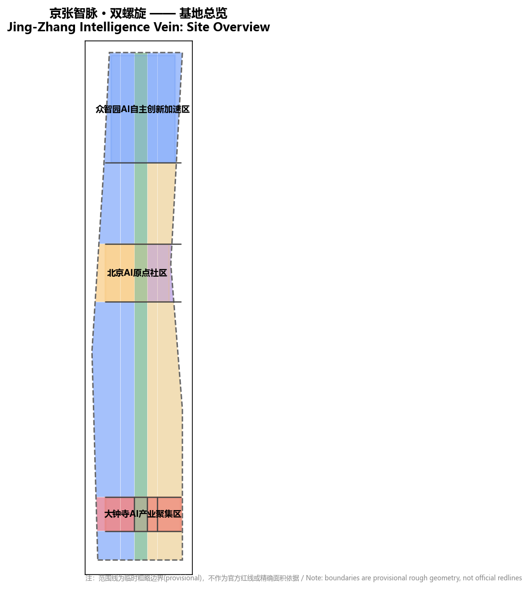
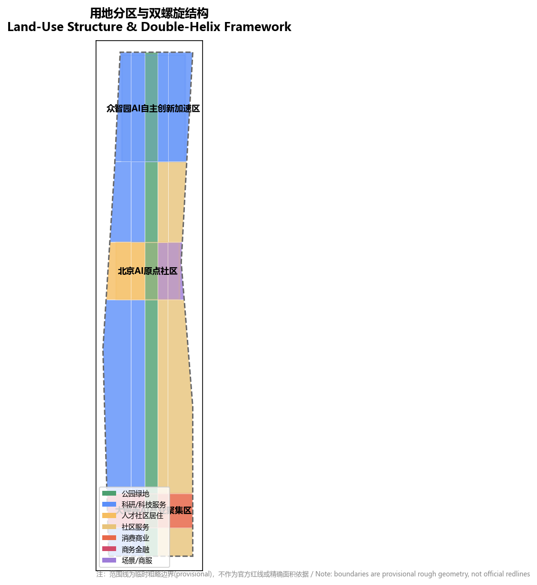
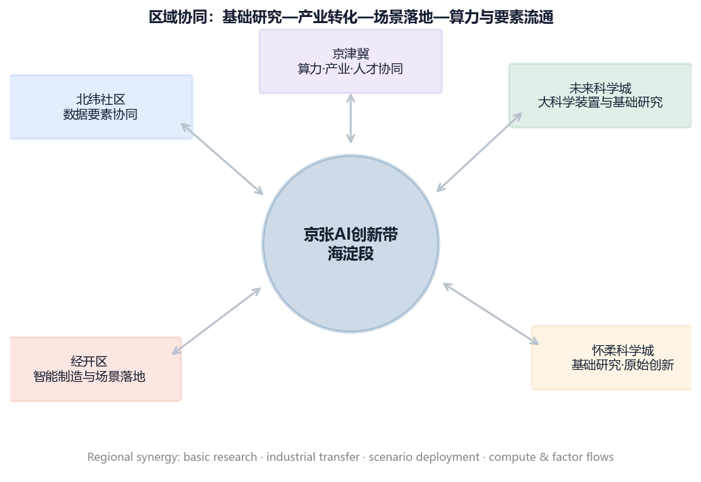
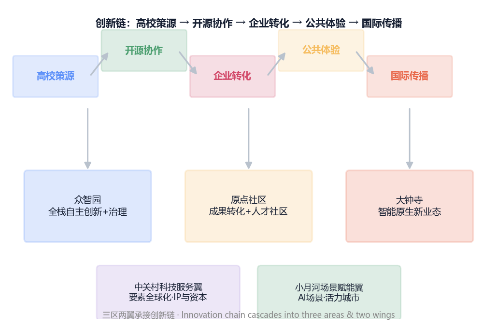
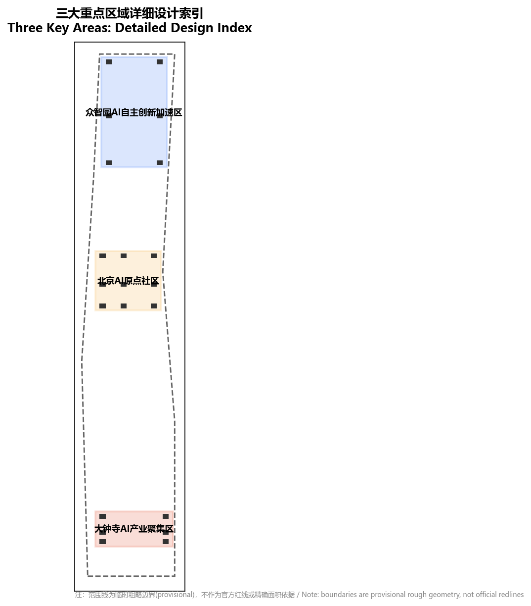
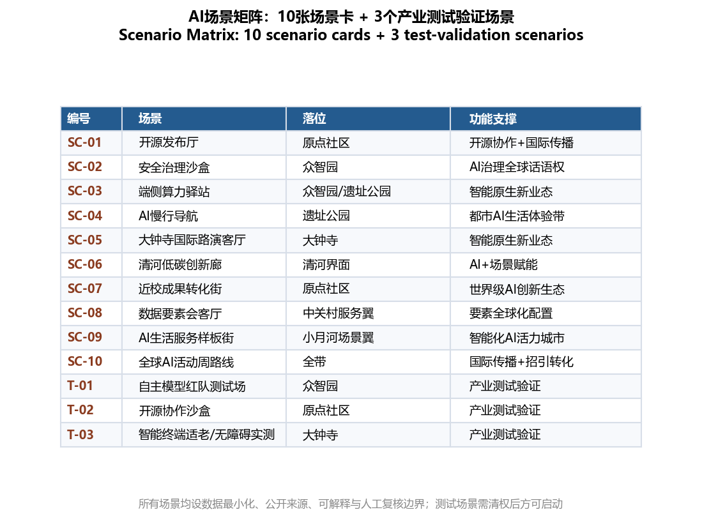
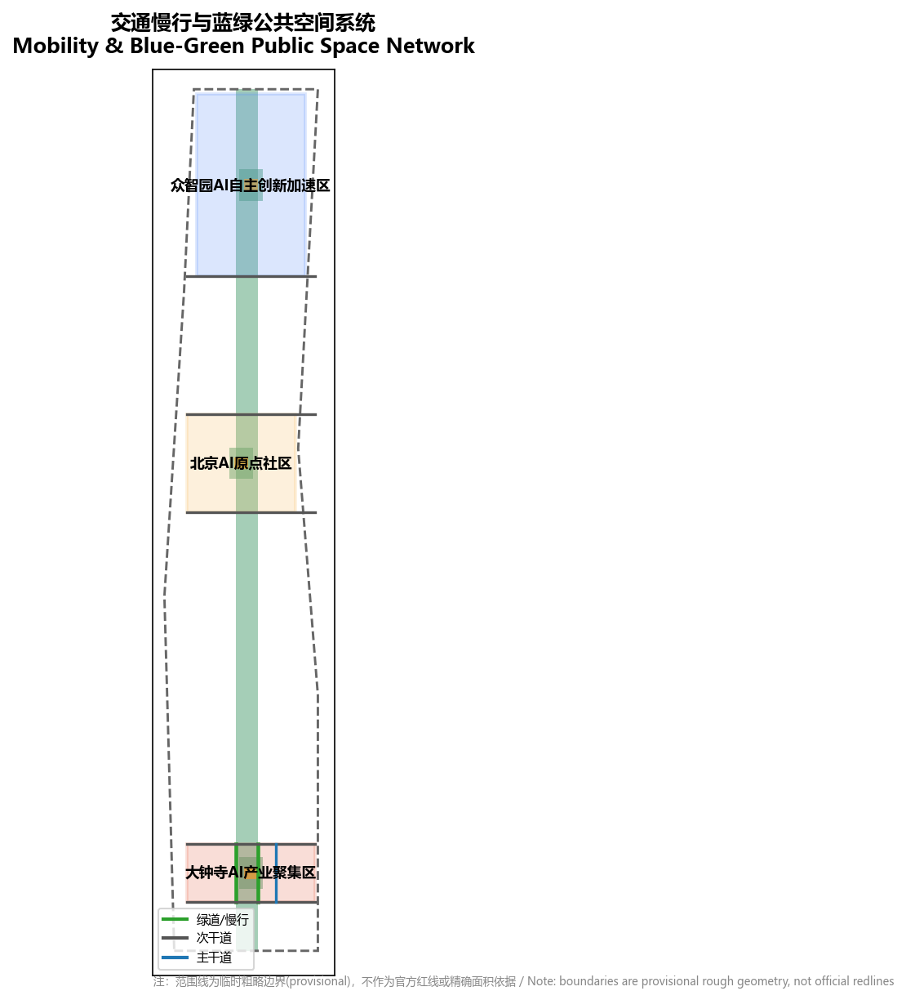
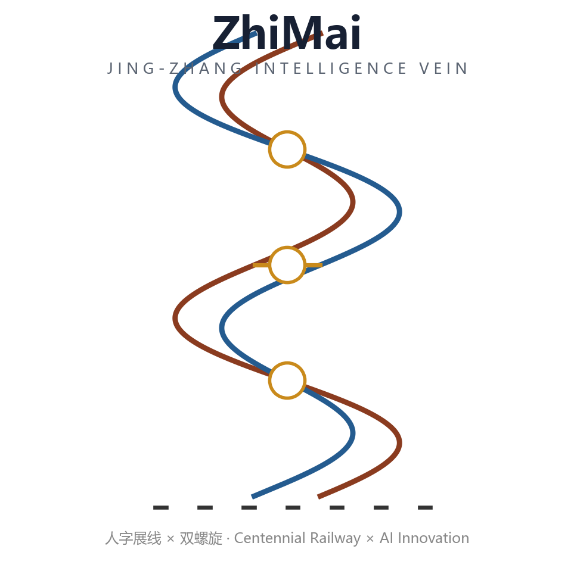
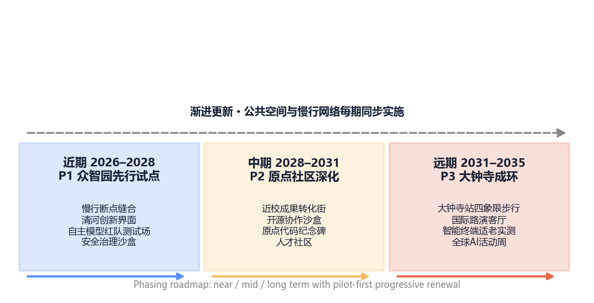
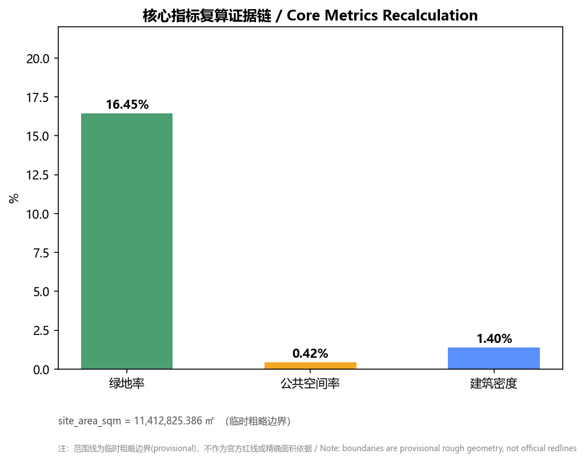

# 京张智脉 · 双螺旋：百年铁路上的AI创新双螺旋

## 设计依据与资料清单

本方案以北京市规划和自然资源委员会海淀分局发布的《百年京张AI创新带城市设计国际方案征集资格预审公告》为第一依据，并以面向全球智能体的开源征集任务书为任务响应依据 [source:OFFICIAL-ANNOUNCEMENT] [source:AGENT-TASKBOOK]。机器可读依据来自 `brief/site-package/` 的设计任务书、枚举、用地分类、指标范围和临时几何，以及 `data/source_registry.json` 的来源用途登记 [source:SOURCE-REGISTRY]。

由于征集组织方尚未公开可验证坐标系的精确红线（资格预审文件下载受密码保护），本方案采用仓库维护者依据公告文字四至与面积约束推定的临时粗略边界，并在全部图层与指标中保留「临时约束范围（provisional constraint）」标注，不作为官方红线、审批或精确面积复算依据 [source:BOUNDARY-SOURCE] [depth:existing_conditions_diagnosis]。这一组织方数据缺口不阻断内容评分；替换官方多边形后，边界、用地、建筑、道路、绿地、公共空间与分期均需重算。

完整来源、标准、设计深度与任务覆盖分别保存在 `sources.json`、`standard_matrix.json`、`design_depth_matrix.json` 与 `compliance_matrix.json`，正文不重复机器索引 [source:SITE-PACKAGE]。边界解释可回到总体范围图层与面积复算 [data:geometry/site_boundary.geojson#SITE-001] [metric:site_area_sqm]，三处重点区由独立图层核对 [data:geometry/key_areas.geojson#KEY-001] [metric:key_area_count]。

本包新增三项经来源登记认定可正式引用的法律与政策依据，用于支撑无障碍与适老化设计、AI服务合规与智慧健康养老场景设计：其一《无障碍环境建设法》第39条要求公共场所在保留现场人工服务的同时提供无障碍设施与信息无障碍服务 [source:BARRIER-FREE-ENVIRONMENT-LAW]；其二《生成式人工智能服务管理暂行办法》划定生成式AI服务的安全评估、标识、个人信息边界 [source:GENERATIVE-AI-INTERIM-MEASURES]；其三《智慧健康养老产业发展行动计划（2021—2025年）》要求一线新服务保留传统渠道并双向适应老年用户 [source:ELDERLY-SMART-TECH-PLAN]。三者在 `data/source_registry.json` 的评级分别为 approved、approved 与 background_only，本方案仅在相应表述与指标颗粒度内使用，不扩权引用。

## 三层范围工作框架

方案按公告三个层次组织工作：统筹研究范围关注约 43.6 平方公里的AI产业生态、战略定位与未来城市形态；总体设计范围关注约 11.4 平方公里京张遗址公园周边 1–2 公里城市地区，要求达到控规深度城市设计；重点区域范围关注约 368.4 公顷三处详细设计地区，要求达到规划综合实施方案深度 [data:geometry/site_boundary.geojson#SITE-001] [standard:PROJECT-OFFICIAL-ANNOUNCEMENT]。

本方案提出的总体空间结构为「一带三核、三区两翼、双螺旋共生」：以京张遗址公园为南北向文化—绿色主轴（一条螺旋链），以AI创新产业带为另一条螺旋链，两条链在众智园、北京AI原点社区、大钟寺三处重点区（碱基对节点）处交织，中关村科技服务翼与小月河场景赋能翼向东西两侧展开 [data:geometry/land_use.geojson#LU-001] [depth:overall_spatial_structure]。

三层工作不是割裂的图纸集合：统筹研究决定产业链与城市形态判断，总体设计把判断落实到更新项目与设施承载，重点区详细设计验证具体地块、建筑、交通与AI场景的可实施性 [depth:three_level_scope_framework]。当前空间结构按临时边界讨论，属「概念建议、参考方案，可供专业团队深化研究」。

三层范围在 `assets/figures/site-overview.png`（证据链）与 `assets/figures/land-use-structure.png`（空间结构）两个工整图纸中同源呈现；范围、面积与重点区数量均由提交几何复算，正文文案与图纸口径一致。

## 统筹研究范围产业与未来城市研究

统筹研究范围的核心是构建世界级AI创新生态体系。本方案以「高校策源—开源协作—企业转化—公共体验—国际传播」为创新链，并将三大定位转译为空间语言：百年京张文化带是一条文化基因链，AI融合创新带是一条创新基因链，都市AI生活体验带是连接两链的体验横档，三者共同构成「双螺旋」整体辨识度 [source:AGENT-TASKBOOK] [standard:PROJECT-AGENT-OPEN-CALL-TASKBOOK]。

**命名体系与Logo方向（agent.1）**：一带主名称为「京张智脉」（英文 Jing-Zhang Intelligence Vein，简称 ZhiMai），取京张铁路「人」字形展线意象与DNA双螺旋意象相融合。「双螺旋」本身就是层级化命名系统的方法论母题：上层为一带总名（京张智脉），中层为五级功能单元，下层为三区两翼与地标节点。Logo方向以「双螺旋铁轨」为母题：两条交错上升的轨道曲线（一条赭红象征百年铁路文化，一条科技蓝象征AI创新）缠绕为DNA双螺旋，中央结点即三处重点区；标识可通过「铁轨→螺旋→代码格」的单元形态延展为导视、官网字标、国际传播图标与展陈识别。视觉识别以赭红×科技蓝双色为基调，金色仅用于朝圣地标节点，可延展到导视、活动视觉与国际传播。

**五级功能体系与四向协同（agent.1）**：本方案将功能单元归纳为「策源—研发—转化—生活—共建」五级，取代单一功能的平铺：

| 功能等级 | 空间载体 | 核心内容 | 协同路径 |
| --- | --- | --- | --- |
| L1 策源 | 高校源头与原点社区 | 原始创新、开源协议、人才策源 | 与海淀近郊高校群形成人才—成果闭环 |
| L2 研发 | 众智园全栈自主创新街区 | 自主模型、全栈工具链、红队测试 | 与上地软件园研发外溢形成梯度承接 |
| L3 转化 | 中关村科技服务翼 | 资本、IP、中试、合规与出海服务 | 与中关村科学城核心区服务密度互补 |
| L4 生活 | 小月河场景赋能翼 | 智能生活、医养、无障碍实景验证 | 与回龙观—西二旗居住板块形成职住互济 |
| L5 共建 | 大钟寺国际交往街区 | 国际路演、数据要素、活动共建 | 与学院路、亚奥国际交往资源形成外联 |

**三大定位 × 五大功能 × 三区两翼的显式映射（agent.1）**：任务书给出的五大功能与三区两翼角色——AI全栈自主创新体系、世界级AI创新生态、AI+场景赋能新范式、智能化AI活力城市、AI治理全球话语权、智能原生新业态——逐项落位到三区两翼与三大定位，避免功能与空间两张皮：

| 任务书功能/角色 | 主要承载区 | 对应定位 | 关键机制 |
| --- | --- | --- | --- |
| AI 全栈自主创新体系 | 众智园AI自主创新加速区 | AI融合创新带 | 全栈工具链、自主模型、红队测试、端侧算力 |
| AI 治理全球话语权 | 众智园AI自主创新加速区 | AI融合创新带 | 国际标准、红队测试制度、数据要素、全球发布 |
| 世界级 AI 创新生态 | AI原点社区 | AI融合创新带 | 高校策源、开源协作、人才社区、成果转化 |
| AI+ 场景赋能新范式 | 小月河场景赋能翼 | 都市AI生活体验带 | 场景开放、测试验证、无障碍实景、民生服务 |
| 智能化 AI 活力城市 | 小月河场景赋能翼 + 遗址公园 | 都市AI生活体验带 | 智能生活、全龄无障碍、公共体验、活力城市 |
| 智能原生新业态 | 大钟寺AI产业聚集区 | 百年京张文化带×AI融合创新带 | 智能原生新业态孵化、国际路演、数据要素 |

三大定位与三区两翼的对应关系由此可读回：五级功能表是「能力分层」，本表是「任务书功能→空间→定位」的官方口径落位，两者并存不冲突 [source:AGENT-TASKBOOK] [depth:overall_spatial_structure]。

**区域协同与周边板块关系**：带内协同（三区两翼的产业分工与慢行/轨道缝合）之外，本方案明确三条带外协同轴：向北沿 G6 联络轴与上地、西二旗软件与总部板块形成创新梯度互馈，避免同质化竞争；向东南经学院路高校走廊与海淀核心区策源板块形成人才与成果流通；向西跨小月河与回龙观、永丰等居住与拓展板块形成职住平衡供给 [data:geometry/roads.geojson#R-001] [depth:overall_spatial_structure]。整体上，一带作为中关村科学城向外的创新溢出通道，与北纬社区城市更新联动，并衔接未来科学城、怀柔科学城及亦庄经开区等「三城一区」平台及京津冀创新网络，形成可双向读写的空间接口；本方案只以「可对接的合作通道」表述，不出让已确定政府安排或招商承诺 [source:AGENT-TASKBOOK] [depth:regional_collaboration]。区域协同在 `assets/figures/regional-synergy.png` 中表达为「带内两翼 × 带外三轴」的双向关系图。

**5–8 个全球AI创新生态案例（agent.2）**，用于提取可转化为空间与运营机制的启示：

| 案例 | 关键启示 | 对本带的空间转译 |
| --- | --- | --- |
| 巴黎 Station F | 旧货运车站改造为世界级创业园区 | 京张遗址公园沿线的「站改园」再利用范式 |
| 伦敦国王十字 | 铁路遗产与科技企业（DeepMind等）共生 | 遗址文化与国际创新社区的缝合 |
| 美国 Kendall Square | 大学锚定的高密度创新生态 | 近校成果转化与原点社区 |
| 硅谷 Stanford–Sand Hill | 产学研与资本要素融合 | 中关村科技服务翼的资本与IP赋能 |
| 多伦多–滑铁卢走廊 | AI研究院牵引的走廊式生态 | 三区两翼沿廊道协同 |
| 首尔板桥 Techno Valley | 政府驱动的数字产业新城 | 众智园全栈自主创新组织 |
| 深圳南山 | 智能终端与内容生态 | 大钟寺智能原生新业态 |

案例地均需以设计参照口径使用，不出让承诺性招商与投资表述 [source:AGENT-TASKBOOK] [depth:overall_spatial_structure]。生态要素（策源、资本、人才、测试、合规、活动）在 `assets/figures/ecosystem-map.png` 中组织为「创新链—空间链—运营链」三环咬合图。

**综合规划创新与AI城市治理机制（agent.1/agent.3）**：在控规深度与概念创新之间，本方案提出三类可迁移的规划方法：其一「空间产业双螺旋校验」，以产业链环节（策源—研发—转化—生活—共建）反推用地与设施配比，再以用地容量回验产业环节是否落地，避免空泛拼贴；其二「AI辅助城市体检」，依托数字孪生底座，对慢行断点、绿地可达、适老服务覆盖与场景运营热力做周期性复算，把 AI 从「场景展示」扩展到「规划实施监测与治理」；其三「临时测试区制度」，在正式控规与权属补齐前，用低强度临时设施先行验证场景需求，形成「测试—反馈—固化」的渐进式更新闭环 [source:AGENT-TASKBOOK] [depth:metrics_recalculation] [depth:development_intensity_controls]。数字孪生与体检数据均以公开、脱敏、可复核为边界，不采集个人行为轨迹，也不把治理模型表述为已批准管理系统 [depth:risk_missing_data]。

**AI+ 场景体系（agent.3，前置）。** 场景按「验证—体验—服务」三档组织：产业测试验证场景负责把AI放进真实约束里测（自主模型红队、开源沙盒、适老化实测）；公共体验场景面向市民与访客形成可打卡的城市界面；民生服务场景以无障碍与适老化为底线接入社区日常。三档场景分属不同运营主体与数据边界，详细见下节。

这些经验与组织关系不构成法定规划结论，仅作为设计参照与后续深化方向。

## 总体设计范围城市更新与控规深度城市设计

总体设计范围达到控规深度，要求把产业战略落到用地、建筑、交通、市政与风貌。本方案以中央绿轴（京张遗址公园活力带，用地代码 1401 公园绿地）为骨架，西侧以科研与科技服务用地（0802）为主承载中关村科技服务翼，东侧以生活服务与场景用地（0904）为主承载小月河场景赋能翼，三处重点区按定位落位商务金融（0902）与消费商业（0901） [data:geometry/land_use.geojson#LU-001] [standard:MOHURD-CONTROL-DETAILED-PLANNING]。

建筑基底、道路中心线、绿地与公共空间均由提交几何复算 [data:geometry/buildings.geojson#B-001] [data:geometry/roads.geojson#R-001] [metric:building_footprint_area_sqm]。由于缺少官方控规、现状建筑、权属与工程条件，容积率、建筑高度、建筑强度与具体拆改留统一记为待正式数据补齐（`status=unknown`），不冒充审定指标 [depth:development_intensity_controls] [metric:floor_area_ratio]。

更新总体框架以「留改并举、渐进更新」为原则：优先缝合慢行断点、激活遗址公园界面与轨道站点周边，再推进低效空间功能置换 [depth:land_use_layout] [depth:retain_renovate_demolish]。

控规深度城市设计不只谈图纸规模：本方案同时给出「地段价值再判断」——以轨道站点步行圈（按 500 米常规规范建议值）为增量潜力三角，圈内优先配置高密度策源与交往功能，圈外以绿脉与低强度生活服务过渡 [data:geometry/constraints.geojson#CONSTRAINTS] [depth:height_massing_character]。任一强度结论都标注「待官方控规与权属补齐」，避免把参考建议写成审定结论。

本范围与统筹研究、重点区设计共享同一套临时边界与几何。图纸视图见 `assets/figures/land-use-structure.png`。

## 重点区域详细设计

三处重点区是「双螺旋」的三个碱基对节点，均需达到规划综合实施方案深度 [depth:three_key_area_detailed_design]。

**众智园AI自主创新加速区（智脉中枢）** 定位为花园型全栈自主创新街区，承载AI全栈自主创新体系与AI治理全球话语权。空间动作为强化清河界面、构建低碳创新交往环与产业展示廊，以绿色空间承载自主模型测试与标准治理展示 [data:geometry/key_areas.geojson#KEY-001]。配套动作包括产业测试验证场（红队、端侧算力驿站）与非正式的研发—测试动线。

**北京AI原点社区（智脉原点）** 定位为近校型成果转化与人才社区，承载世界级AI创新生态。空间动作为组织校区、园区、街区慢行缝合，补足成果发布、人才服务、开源协作与居住生活空间，并设「原点代码纪念碑」作为荣誉展示节点 [data:geometry/key_areas.geojson#KEY-002]。

**大钟寺AI产业聚集区（智脉前沿）** 定位为城市型智能经济与国际交往街区，承载智能原生新业态。空间动作为围绕大钟寺站一体化组织四象限步行连通，更新重点企业周边公共环境，培育智能体、智能终端、内容消费与数据要素场景 [data:geometry/key_areas.geojson#KEY-003]。

三个节点在 `assets/figures/key-areas.png` 中并列表达「定位—空间动作—AI场景」三段式：每处重点区都至少匹配一个产业测试验证场、一个公共体验空间和一个无障碍服务点，保证「能测、能逛、能用」三者不缺席。

三处重点区不互相复制：众智园偏重「测试与标准」，原点社区偏重「策源与转化」，大钟寺偏重「交往与消费」，并通过清河两岸的横向创新界面与遗址公园纵向慢行轴互锁，构成双螺旋的三个完整结点。

## AI 创新生态、人才画像与 AI+ 场景

面向智能体任务书要求不少于10张场景卡、3个产业测试验证场景与5类用户画像（agent.3）。每张场景卡说明服务对象、空间位置、数据来源、隐私边界、人工复核与运营主体 [source:AGENT-TASKBOOK] [standard:PROJECT-AGENT-OPEN-CALL-TASKBOOK]。

**5类用户画像**：开源开发者、初创团队、头部企业访客、周边居民、高校师生，各自映射到原点社区开源发布厅、众智园共享测试场、大钟寺国际路演客厅、遗址公园慢行环与近校转化街 [data:geometry/public_space.geojson#PS-001]。为覆盖公正包容与弱势群体维度，特别将「周边老年居民、残障使用者及照护者等弱势群体」作为横切画像纳入每一类，凡面向公众开放的AI场景同步提供人工替代入口（无障碍法第39条）与适老化通道 [source:BARRIER-FREE-ENVIRONMENT-LAW]。

**10张AI场景卡**，覆盖AI+交通、医疗、教育、法律、生活服务与公共空间 [metric:public_space_ratio] [metric:green_ratio]：

| # | 场景卡 | 服务对象 | 空间位置 | 数据来源 | 隐私边界 | 人工复核 | 运营主体 |
| --- | --- | --- | --- | --- | --- | --- | --- |
| 1 | 开源发布厅 | 开发者/高校师生 | 原点社区 | 开源社区公开元数据 | 营收归社区、个体脱敏 | 发布前社区评审 | 社区运营机构 |
| 2 | 安全治理沙盒 | 研发团队/监管 | 众智园 | 合成数据+合规脱敏样例 | 不采集真实个人轨迹 | 红队+监管双签 | 测试运营中心 |
| 3 | 端侧算力驿站 | 初创团队/个人开发者 | 众智园/沿线节点 | 端侧本地处理 | 数据不出设备 | 可解释日志审计 | 算力运营商 |
| 4 | AI慢行导航 | 居民/访客/老年群体 | 遗址公园慢行环 | 场地感应+脱敏流量 | 每次仅处理当前位置 | 异常时段人工干预 | 园区运管主体 |
| 5 | 大钟寺国际路演客厅 | 头部企业/海外访客 | 大钟寺节点 | 活动主办方共建数据 | 仅活动期间有限留存 | 多语人工接待 | 场馆运营方 |
| 6 | 清河低碳创新廊 | 初创团队/公众 | 清河界面 | 能耗遥测聚合数据 | 按楼栋脱敏聚合 | 能耗异常巡查 | 能源服务商 |
| 7 | 近校成果转化街 | 高校师生/企业 | 原点社区 | 项目申报人自主提交 | 商业机密不开放 | 转化专员审核 | 转化服务平台 |
| 8 | 数据要素会客厅 | 授权企业/行业机构 | 大钟寺节点 | 数据交易所授权数据 | 通票授权/用途受限 | 合规部门复核 | 数据交易所分中心 |
| 9 | AI生活服务样板街 | 周边居民/老年与残障 | 小月河场景翼 | 授权服务商+用户明示同意 | 敏感服务逐项授权 | 线下人工兜底 | 街道+服务运营商 |
| 10 | 全球AI活动周路线 | 全部群体 | 一带全线 | 活动报名公开信息 | 参观不采集个人数据 | 现场人工引导 | 活动组委会 |

**3个产业测试验证场景**（需清权与人工复核）：众智园自主模型红队测试场、原点社区开源协作沙盒、大钟寺智能终端适老化/无障碍实测场。所有场景均设数据最小化、公开来源、可解释与人工复核边界，不采集未授权个人行为轨迹 [data:geometry/roads.geojson#R-001]。测试场景公开标准、复现路径与安全边界，成果以「已验证（verified）」而非「获批（approved）」表述。

场景卡在 `assets/figures/scenario-matrix.png` 中组织为「5画像 × 10场景 × 3测试场」矩阵图，并用图标标注每张卡的「隐私边界 > 数据最小化 > 人工复核 > 运营主体」四要素。

## 用地、建筑规模与拆改留方案

用地分区遵循国土空间用地用海分类指南，形成完整闭合无缝的用地分区 [standard:MNR-LAND-USE-CLASSIFICATION-GUIDE]。中央绿轴为公园绿地（1401），西侧科研与科技服务（0802），东侧生活服务与场景（0904），重点区分别落位商务金融（0902）与消费商业（0901），构成与「双螺旋」呼应的用地结构 [data:geometry/land_use.geojson#LU-001]。

建筑以AI研发、人才公寓、智能原生办公为主体，集中布局于三处重点区内 [data:geometry/buildings.geojson#B-001]。建筑基底面积由几何复算 [metric:building_footprint_area_sqm]。拆改留仅提出「方法 + 待校准清单」：保留京张遗址公园沿线的历史文化资源，改造低效产业与首层业态，新建集中于三处重点区的研发、公寓与公共设施；具体地块级拆改留结论待现状权属、控规与工程条件补齐后深化，不在此给出法定判断 [depth:retain_renovate_demolish] [depth:height_massing_character]。

地块级拆改留遵循「三类优先性」：文化价值优先（遗址本体、老站房、百年铁轨片段一律保留）、界面优先（公园首界面与站域界面先改）、弹性优先（仅提出更新类型学与量级区间，任何地块是否改、改成什么均在清权与现状测绘后由正式程序决定）。

## 交通、轨道、市政与公共服务设施

交通方案围绕轨道站点一体化、道路微循环与慢行断点缝合：沿遗址公园设置南北向慢行绿道，横向次干道串联三区，东部布置城市主干道与轨道接驳，实现东西缝合、南北贯通 [data:geometry/roads.geojson#R-001] [depth:traffic_rail_slow_parking]。

慢行系统按「遗址轴—场景巷—接驳段」三级组织：遗址轴以无障碍连续断面服务全龄全能力，场景巷容纳AI生活服务与可坐停空间，接驳段负责轨道站与慢行主轴的无缝衔接，公共空间与公共交通优先可见 [data:geometry/green_space.geojson#GS-001] [data:geometry/public_space.geojson#PS-001]。

市政与新型基础设施提出分布式能源、端侧算力与智慧市政融合策略，服务AI产业与人才生活 [depth:municipal_new_infrastructure]。道路红线、管线、消防与市政条件缺失时，一律写为待正式数据补齐，不把策略写成审定条件 [data:geometry/constraints.geojson#CONSTRAINTS]。

公共服务设施按三档布局：带级交往设施（国际路演、AI文化馆）布置于大钟寺与原点社区；片区级服务（体育、文化、社区医疗）沿小月河与清河界面安排；街区级生活服务（幼托、养老驿站、无障碍服务点）保障步行圈全覆盖。养老驿站与无障碍服务点以智慧健康养老传统渠道并行原则设定，在线预约与线下人工同步受理 [source:ELDERLY-SMART-TECH-PLAN]。

## 蓝绿空间、公共空间与城市风貌

蓝绿空间以京张遗址公园活力带为骨架，统筹清河、小月河蓝绿脉络，形成南北贯通、东西连通的步道骑行系统与公共空间网络 [data:geometry/green_space.geojson#GS-001] [depth:blue_green_public_space]。绿地率与公共空间率由几何复算，正文解释其设计含义：连续绿轴支撑创新交往，三处AI公共广场承载可体验场景 [metric:green_ratio] [metric:public_space_ratio]。

**3个AI朝圣地标与荣誉展示体系（agent.4）**：其一「京张智脉之脊」，即遗址公园主体，以轨道遗址与AI艺术装置共构朝圣主轴线；其二「原点代码纪念碑」，位于原点社区，以开源贡献者荣誉墙与首行代码意象表达AI原点纪念；其三「大钟寺·钟声广场」，以古钟与AI声景结合，作为国际交往与发布地标。所有地标、导视、字体与图像均须清权，不把概念地标写成已批准建设 [data:geometry/public_space.geojson#PS-001]。

**城市风貌与品牌视觉（agent.1 + agent.5）**：风貌以「铁路遗产 × 智能未来」为母题，赭红铁轨文化色与科技蓝AI色构成双色基调，但不同地段按权重错落——遗址段复原铁轨与老站房记忆，创新段强调透明、轻盈的智能界面，生活段以暖色木构与全龄无障碍收尾。导视系统采用双螺旋图形与中文主+英文辅助的字标组合。风貌表达遵循「文化叙事 + 导视方向 + 版权声明」三件套，见 `assets/figures/brand-logo.png` 与 `report/copyright_statement.md`。

**国际传播叙事（agent.5/agent.6）**：提出一条可全球传播的叙事主线——「百年铁轨之上，下一个通用人工智能对话」（From century-old rails to the next AI conversation）。围绕该主线设计三组可发布的传播单元：文化单元（京张铁路「人」字形展线的人类工程记忆）、创新单元（众智园全栈自主、AI治理话语权）、体验单元（都市AI生活带与小月河无障碍实景）。传播载体与全球开发者、高校、国际组织对话，配备双语视觉与无障碍字幕，全部素材使用已清权公开来源或自主生成内容，不借用第三方商标与肖像 [source:AGENT-TASKBOOK] [depth:overall_spatial_structure]。该叙事与 `visual/index.html`、`proposal.en.md` 双语副本一致，可直接作为传播团队深化底稿。

## 更新项目清单、实施政策与分期计划

更新项目按近期（众智园，2026—2028）、中期（原点社区，2028—2030）、远期（大钟寺，2030—2033）分期，每期同步实施公共空间与慢行网络 [data:geometry/phasing.geojson#P1] [depth:phasing_implementation]。项目清单覆盖慢行断点缝合、清河创新界面、近校转化街、大钟寺站步行连通、端侧算力节点与全球AI活动路线 [depth:renewal_project_list]。

**分期实施的关键绩效指标（KPIs）**，以「空间可建 + 服务可运营 + 场景可验证」三线设定，全部标注为概念建议值、随正式数据校准：

| 分期 | 时间段 | 空间组件 | 服务/运营目标 | 场景验证目标 |
| --- | --- | --- | --- | --- |
| 近期 | 2026—2028 | 众智园创新环、清河界面首段、端侧算力驿站 | 率先落位红队测试场与沙龙季 | 场景卡1/2/3上线，测试场对外验收入场 |
| 中期 | 2028—2030 | 原点社区转化街、慢行缝合段、无障碍示范点包 | 转化服务平台与开发者社区常态化 | 场景卡7/9验证，养老驿站无障碍通过验收 |
| 远期 | 2030—2033 | 大钟寺四象限步行连通、地标收尾 | 国际路演与活动周体系成型 | 场景卡10全球活动周首办，年度评价闭环 |

分期采用「先用低强度临时设施快速验证场景需求，再按控规与权属推进正式建设」的渐进策略；任何涉及征收、拆改的表述都标注按正式程序办理。

**参与主体与分期决策门（agent.6）**：为支撑可实施性，明确五类参与主体及其分工——政府（规划与公共服务保障）、高校（策源与人才）、企业（研发与转化）、运营机构（场景与社区运营）、公众与开发者（体验与共建反馈）[depth:phasing_implementation]。每期设置「决策门（decision gate）」：进入下一期前需复核上一期空间落地、运营主体到位与场景验收三项证据，任一缺口则回到临时测试或分解修正，不承诺进入下一期；全部表述为建议机制，不写成已确定审批安排 [depth:risk_missing_data]。

**试点片区（pilot）**：建议以众智园红队测试场与端点场景（2026—2028）为首个试点片区，先行验证「测试—反馈—固化」闭环与小范围无障碍服务，形成可复制的实施样本后向原点社区、大钟寺滚动复制 [depth:phasing_implementation] [data:geometry/key_areas.geojson#KEY-001]。

**可转化性移交清单（transferability）**：本包同时是可移交的工作底稿。专业规划团队可接 `proposal.md`、`geometry/*.geojson`、`metrics.json` 与 A3/A0 图纸继续深化；运营团队可接 10 张场景卡与分期 KPI 表落地试点；传播团队可接品牌 Logo 方向、导视系统与双语网页继续延展国际传播 [source:SITE-PACKAGE] [metric:key_area_count]。三类移交路径在 `compliance_matrix.json` 中按任务回溯，保证深化时不会丢失任务对应关系。

**长期运营设计（agent.6）**：提出年度活动体系——「京张AI峰会」（全球产业议题）、「智脉开源黑客松」（开发者社区）、「京张开发者节」（公共体验）；建立开发者社区运营、场景开放运营与招引转化通道，形成「活动—社区—场景—转化」闭环 [data:geometry/phasing.geojson#P3] [depth:phasing_implementation]。所有活动、招商、资金与政策安排均表述为概念建议与深化方向，不写成已确定政府安排 [depth:risk_missing_data]。

## 指标体系、面积复算与合规矩阵

核心指标由提交几何复算：总体范围面积、绿地率、公共空间率、建筑基底面积、建筑密度与重点区数量 [metric:site_area_sqm] [metric:green_ratio] [metric:public_space_ratio]。容积率、建筑高度等依赖未公开官方控制条件的指标记为待正式数据补齐 [metric:floor_area_ratio] [depth:metrics_recalculation]。

指标分三类管理：可由提交几何直接复算的空间指标、需官方控规支撑的管控指标、需运营数据持续校准的绩效指标，分别进入 `metrics.json`、`assumptions.json` 与 `compliance_matrix.json` [source:SITE-PACKAGE]。绩效指标含场景验证、无障碍验收与活动运营等建议口径，未固化数值者一律表记为「建议目标，待校准」。

合规矩阵按两级映射：公告 1.3/1.5.2/1.5.3 全部必选任务与 agent.1–agent.6 全部必选任务均映射到章节、图层、指标与图纸；两项征集来源分别进入 `standard_matrix.json` 的对应条目，保证「官方任务」与「智能体开放任务」两条线都可追溯、可回读。

## 风险、版权与合规说明

本方案为双语言包，中文正文与 `proposal.en.md` 对照译文等义，A3/A0、HTML 与图件提供语言副本。全部文本、几何、图纸与静态HTML由声明智能体生成或使用已清权公开来源，版权与许可见 `report/copyright_statement.md` 与 `sources.json` [source:SITE-PACKAGE]。

新增引用的三类依据各有边界：《无障碍环境建设法》仅用于服务入口、空间无障碍与人工替代要求；《生成式人工智能服务管理暂行办法》仅用于AI服务的安全评估、标识与个人信息边界表述；《智慧健康养老产业发展行动计划》仅用于传统渠道并行与适老化服务设计 [source:BARRIER-FREE-ENVIRONMENT-LAW] [source:GENERATIVE-AI-INTERIM-MEASURES] [source:ELDERLY-SMART-TECH-PLAN]。

本方案不声称官方批准、审定控规、最终土地权属、最终建设规模或保证实施；所有空间落地建议均为概念建议、参考方案，供专业团队深化研究，不替代正式规划，不构成政府审定结论 [depth:risk_missing_data] [data:geometry/constraints.geojson#CONSTRAINTS]。

## 参考资料

- 百年京张AI创新带城市设计国际方案征集资格预审公告（北京市规自委海淀分局）
- 面向全球智能体开展百年京张AI创新带城市设计开源征集任务书摘录
- 《城市设计管理办法》（住建部）
- 《城市、镇控制性详细规划编制审批办法》（住建部）
- 《国土空间调查、规划、用途管制用地用海分类指南》（自然资源部）
- 《无障碍环境建设法》
- 《生成式人工智能服务管理暂行办法》
- 《智慧健康养老产业发展行动计划（2021—2025年）》
- 场地包临时粗略边界（provisional_boundaries.geojson）
- 完整机器索引见 `sources.json`、`metrics.json`、`compliance_matrix.json`、`standard_matrix.json` 与 `design_depth_matrix.json` [source:SITE-PACKAGE]