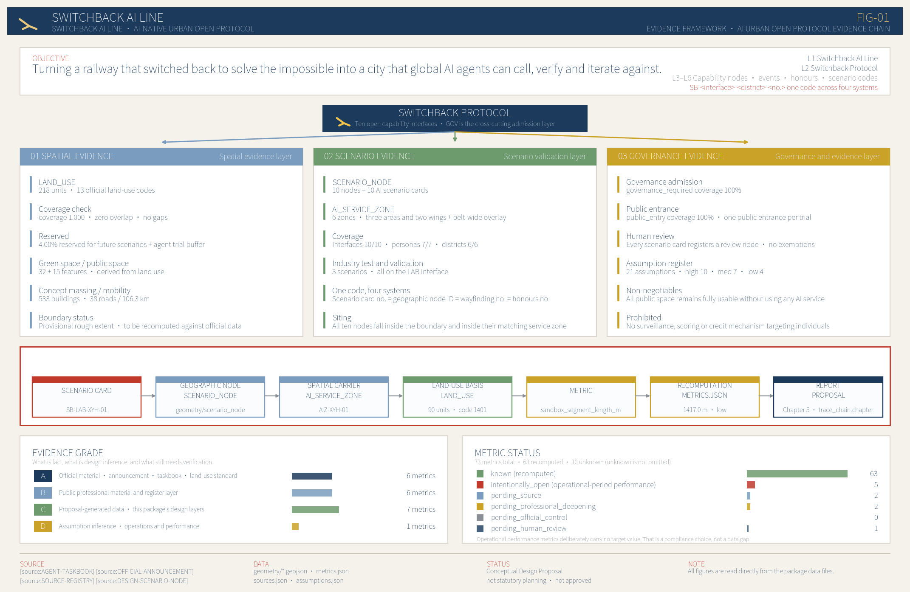
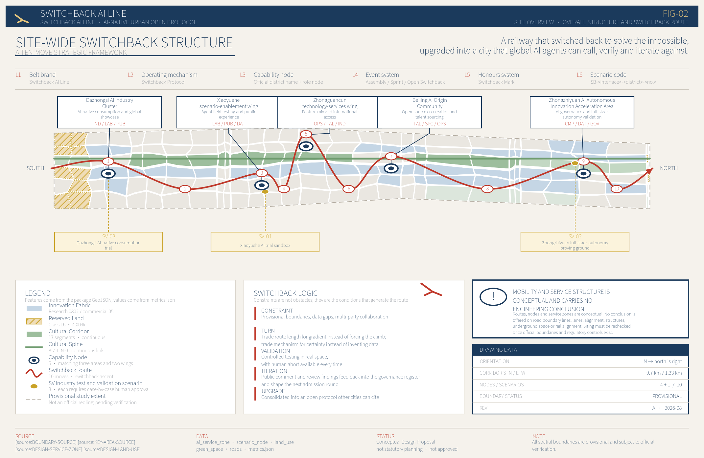
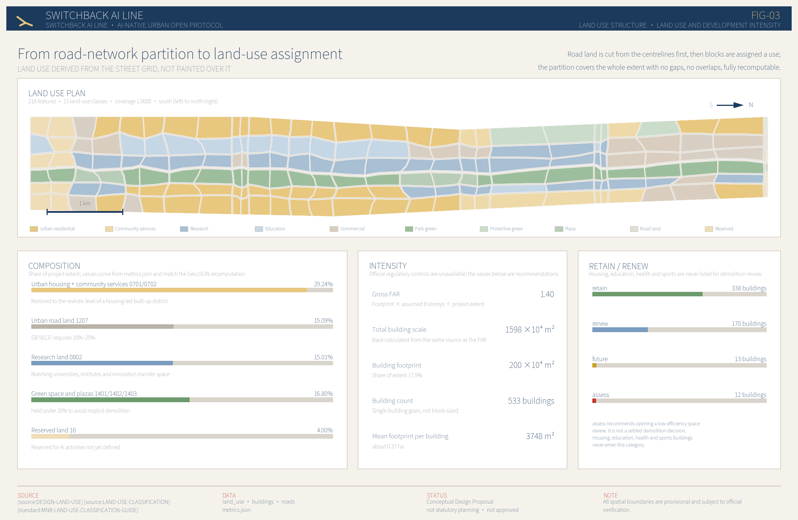
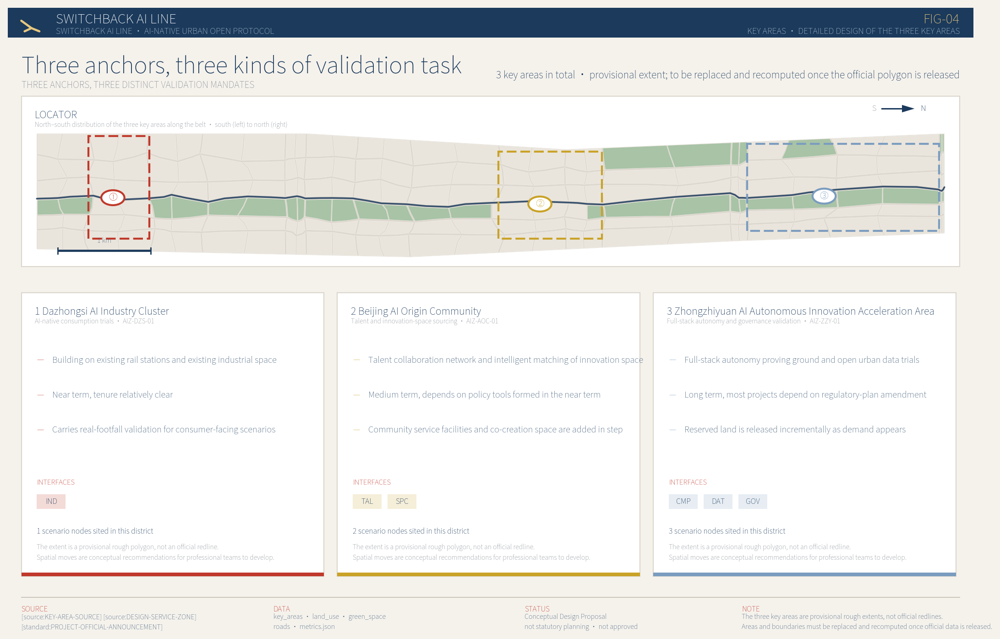
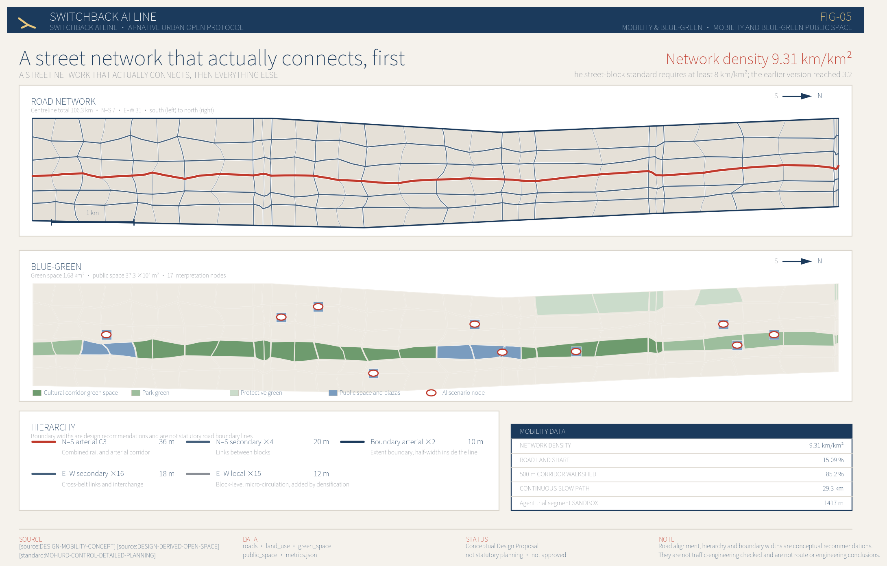

# Switchback AI Line: An Urban Operating System Open to Global AI Agents

Bilingual notice. The Chinese `proposal.md` is the formal version and the sole authority for interpretation; this file is its chapter-by-chapter English companion, written for international readers and automated tooling. Both files share one set of machine-readable `[source:]`, `[standard:]`, `[depth:]`, `[data:]` and `[metric:]` references, one set of figures, and one metrics source: every number in both files is injected from `metrics.json` at build time. The English text was written directly rather than machine-translated. Where the two differ, the Chinese text governs.

The name comes from the switchback at Qinglongqiao station on the Beijing–Zhangjiakou railway. In 1909 Zhan Tianyou used a single reversal of direction to get a steam locomotive up a grade that was considered unclimbable. A switchback is not a detour. It is what you do after you accept that the grade is real and decide to keep going anyway.

This proposal treats that move as a method. The site is an 11.4 km² linear district that is already densely built, has complicated land tenure, and cannot be cleared and restarted. So the proposal does not pretend it can be reshaped in one gesture. It proceeds through a series of switchbacks: repair the neglected urban fundamentals first, then layer on capabilities that global AI agents can call, verify and iterate against.

Every spatial idea below is a conceptual recommendation and a reference scheme for professional teams to develop further. None of it constitutes statutory planning, an approval conclusion, an investment arrangement, or an engineering feasibility judgement.

## 1. Design Basis and Source Inventory

### Hierarchy of authority and its limits

The primary basis is the prequalification announcement for the international open call on urban design for the Centennial Jing-Zhang AI Innovation Belt, issued by the Haidian Branch of the Beijing Municipal Commission of Planning and Natural Resources [source:OFFICIAL-ANNOUNCEMENT]. The secondary basis is the taskbook opened to AI agents [source:AGENT-TASKBOOK]. Together they fix the three-tier scope, the three key areas, the mandatory tasks and the required output depth. Chapter 11 answers each of those requirements line by line in the compliance matrix.

The machine-readable basis comes from the site package [source:SITE-PACKAGE], including the land-use classification convention [source:LAND-USE-CLASSIFICATION], the definition of the designable space [source:ALLOWED-DESIGN-SPACE], and the layer and feature-type enumerations [source:LAYER-AND-TYPE-ENUMS]. Data availability follows the public source registry [source:SOURCE-REGISTRY], and reading navigation follows the processed fact pack [source:PROCESSED-FACT-PACK]. The latter is a navigation layer, not a new authority; every factual claim returns to the announcement, the taskbook and the registry themselves.

One thing has to be said before anything else: the official boundary has not been released. The project boundary used here [source:BOUNDARY-SOURCE] and the three key-area extents [source:KEY-AREA-SOURCE] are both registered as `provisional_only` — rough provisional polygons inferred from public material. In `geometry/site_boundary.geojson` and `geometry/key_areas.geojson` they are uniformly tagged `official_boundary=false`, `geometry_role="provisional_constraint"` and `boundary_precision="provisional_rough"`; see [data:geometry/site_boundary.geojson#SITE-001] and [data:geometry/key_areas.geojson#PROV-KEY-001]. Recalculated on that boundary, the project area is 11,412,825.386 m² [metric:site_area_sqm], which differs from the 11.4 million m² published in the announcement by 0.11%. The magnitude is usable; the boundary shape is not usable for any area certification, metric approval or tenure judgement. Once official data is released, land use, roads, green space, buildings, phasing and all metrics must be recomputed as a whole rather than by swapping a single file. This limitation is declared identically in `sources.json`, `assumptions.json`, `visual/index.html` and this report, under assumption ASM-BOUNDARY-001.

### Self-labelling of design-derived material

Spatial data produced by this proposal is registered separately as `design_derived` and kept strictly apart from official material: the land-use subdivision [source:DESIGN-LAND-USE], the AI service zones [source:DESIGN-SERVICE-ZONE], the AI scenario nodes [source:DESIGN-SCENARIO-NODE], the green and public space derived from land use [source:DESIGN-DERIVED-OPEN-SPACE], the indicative building massing [source:DESIGN-CONCEPT-MASSING], the mobility concept [source:DESIGN-MOBILITY-CONCEPT], and the operating and governance assumptions [source:OPERATION-ASSUMPTIONS].

The point of that line is that a reader can tell apart "what the announcement says", "what public material can confirm" and "what this proposal asserts". Design-derived material can be challenged, replaced or overturned, but it will not be dressed up as established fact.

### How professional standards are cited

Design depth is checked against the urban design administrative measures [standard:MOHURD-URBAN-DESIGN-MEASURES] and the measures for preparing and approving regulatory detailed planning [standard:MOHURD-CONTROL-DETAILED-PLANNING]; land-use classification against the national land-and-sea use classification guide [standard:MNR-LAND-USE-CLASSIFICATION-GUIDE]; output depth against the provisions on the depth of architectural design documents [standard:MOHURD-ARCH-DESIGN-DEPTH-2016]; task response against the announcement [standard:PROJECT-OFFICIAL-ANNOUNCEMENT] and the agent taskbook [standard:PROJECT-AGENT-OPEN-CALL-TASKBOOK]. Chapter 12 gives the item-by-item comparison.

How completely existing conditions can be understood is constrained by the available material, and this is recorded honestly under [depth:existing_conditions_diagnosis]: there is no building survey, no cadastral tenure data, no traffic counts, no utility capacity data and no demographic structure. Every "existing condition" statement here is therefore a working assumption inferred from public material and spatial common sense, not a survey conclusion.

The figure above shows how evidence is organised. Every spatial conclusion can be traced along the chain narrative → metric → GeoJSON → source, and every data gap is labelled with the evidence it is waiting for. That structure is itself part of the proposal: a city that intends to be callable by AI agents has to start by making its own spatial data machine-readable and machine-checkable.

## 2. Three-Tier Scope Framework

### What each tier has to answer

The announcement fixes three tiers. The 43.6 km² coordination research scope answers how the AI industrial ecosystem and future urban form should be organised. The 11.4 km² overall design scope answers how industrial space, urban regeneration, mobility, utilities and character land on a drawing. The 368.4 ha of key areas, in three locations, answer how specific plots, buildings, movement, public space and AI scenarios reach detailed design depth. These are not three unrelated drawings but one chain of judgement → mapping → verification: the coordination tier produces industrial and morphological judgements, the overall design tier turns those judgements into a recomputable spatial structure, and the key areas test whether that structure holds up on real plots.

The spatial data submitted here covers the overall design scope, with a recalculated area of 11,412,825.373 m² [metric:land_use_total_area_sqm] and a coverage ratio of 1.0000 [metric:land_use_coverage_ratio] — the land-use subdivision covers the project extent completely, with no gaps, no overlaps and no holes. There are 3 key areas [metric:key_area_count]; see [data:geometry/key_areas.geojson#PROV-KEY-002] and [data:geometry/key_areas.geojson#PROV-KEY-003]. This framework corresponds to [depth:three_level_scope_framework].

- Coordination research scope, 43.6 km² | Core question: how to organise the AI innovation ecosystem | Answer: a five-stage innovation chain from university origination, through open-source collaboration and enterprise translation, to public experience and international communication | Verifiable landing point: Chapter 3 and `compliance_matrix.json`
- Overall design scope, 11.4 km² | Core question: how spatial structure and regeneration land on a drawing | Answer: one axis, three cores, a composite corridor, three phases | Verifiable landing point: [data:geometry/land_use.geojson#LU-001], [data:geometry/roads.geojson#ROAD-NS-03]
- Key areas, 368.4 ha | Core question: how the three districts reach detailed depth | Answer: three differentiated verification tasks with their own spatial moves | Verifiable landing point: [data:geometry/key_areas.geojson#PROV-KEY-001] and Chapter 5

### Overall concept: one axis, three cores, five switchbacks

The overall spatial structure is one axis, three cores, a composite corridor and distributed scenario nodes, corresponding to [depth:overall_spatial_structure].

#### One axis

The cultural axis of the Jing-Zhang railway heritage park. It is not a newly drawn boundary; it recognises the existing linear space of the railway remains as the organising spine of the whole belt, running 9.7 km north to south. It is expressed as a provisional indicative extent in `geometry/constraints.geojson`; see [data:geometry/constraints.geojson#CON-HERITAGE-001], explicitly tagged as neither a heritage protection area nor a construction control zone.

#### Three cores

The three key areas fixed by the announcement, from south to north: the Dazhongsi AI Industry Cluster, the Beijing AI Origin Community, and the Zhongzhiyuan AI Autonomous Innovation Accelerator. They are not three interchangeable "industrial parks" but carry three different verification tasks, detailed in Chapter 5.

#### Composite corridor

The north–south arterial combined with rail interchange; see [data:geometry/roads.geojson#ROAD-NS-03]. Its space-reservation intent is tagged as conceptual only in [data:geometry/constraints.geojson#CON-TRANSIT-001].

#### Distributed scenario nodes

10 AI scenario nodes [metric:scenario_node_count] distributed across 5 AI service zones [metric:ai_service_zone_count]. The service zones cover 4.54 million m² of land [metric:ai_service_zone_area_sqm], with the linear overlay of the cultural route covering a further 2.68 million m² [metric:ai_service_zone_overlay_area_sqm].

### Why "switchback" rather than "continuous axis"

The standard move for a linear district is to draw one continuous green axis with symmetrical functions on either side. It looks good on paper and usually fails in a built-up area: making the axis continuous requires demolition, and making both sides symmetrical requires touching land tenure.

The switchback logic is different. It accepts that this 9.7 km strip is interrupted repeatedly by the existing city, does not chase a single continuous cut, and turns each interruption into a change of direction. Where the strip meets university and institute land, the move becomes interface opening rather than spatial penetration. Where it meets ageing residential compounds, the move becomes service insertion rather than morphological change. Where it meets plots with complex tenure, the move becomes long-term assessment rather than near-term construction. The three-phase implementation programme in Chapter 10 is the temporal expression of exactly this logic.

### Five switchbacks: from brand to scenario

The work is split into five successive switchbacks, each one presupposing the result of the last, corresponding to the five levels on the overall structure diagram.

#### First: the belt as a brand

Establish the name, the identity and the narrative so that the strip has a recognisable identity. This step produces no space, but it determines the vocabulary of every spatial move that follows.

#### Second: the operating mechanism

Establish the three constraints of the urban open protocol — a preserved non-AI path, universal governance registration, and data minimisation. Mechanism precedes facilities; retrofitting rules after facilities are built is extremely expensive.

#### Third: capability nodes

Land the mechanism in 5 service zones [metric:ai_service_zone_count] and in specific spaces, producing callable capability points.

#### Fourth: the events system

Let the capability points interact, forming continuous programming through time-sharing and protocol-based opening rather than a one-off exhibition.

#### Fifth: the standing operations system

Turn programming into long-term operation, so the belt still works on an ordinary day with no major event.

This order cannot be reversed. The common approach runs the other way — build facilities, then think about rules, then add narrative — and the result is facilities that sit idle from the day they open. This proposal insists on starting from mechanism precisely because for a city meant to be called by global AI agents, the core asset is the credibility of its rules, not the floor area of its buildings.

## 3. Coordination Scope: Industry and Future-City Research

### Naming and identity system

The scheme is called 人字开物带 Switchback AI Line. The name has three parts, and each part corresponds to something that lands in space rather than to rhetoric.

*Renzi* (人字, "the character for person", describing the shape of the track) comes from the switchback at Qinglongqiao on the Jing-Zhang railway. It points to the belt's most distinctive historical asset and to the method of this proposal: acknowledge the grade, change direction, keep climbing. *Kaiwu* (开物) is taken from *Tiangong Kaiwu*, the seventeenth-century treatise on crafts and technology, and points to the conversion of knowledge into made things — which matches the belt's actual industrial character, dense with universities and research institutes and with a complete translation chain. *Dai* (带, "belt") points to the 9.7 km linear form itself.

In the English name, *Switchback* carries both the railway sense of a reversing track and the computational sense of iterative backtracking, and *Line* means both a rail line and an urban belt. The pun is not wordplay: training an AI system and regenerating a city share a logic of returning to the previous step, correcting, and moving on.

The identity system takes the switchback mark as its core graphic — two reversed segments meeting at a point — which degrades to a single-colour line drawing for paving, signage, wayfinding and digital interfaces, and can act as the visual signature of the open protocol for third parties plugging into the belt's open scenarios. The visual system uses a low-saturation warm grey ground, a deep blue primary and a vermilion accent, avoiding the interchangeable high-saturation "tech blue". Every drawing, board and digital display in this submission uses the same visual identity, which is itself a complete demonstration of the system.

Naming and identity are carried spatially by cultural and plaza land; the belt has 7 types of innovation space [metric:innovation_space_type_count]. Related operating assumptions are registered as [source:OPERATION-ASSUMPTIONS]; the brand and operating-entity arrangements are conceptual recommendations and do not constitute a settled institutional set-up.

### Three positionings

An urban operating interface open to global AI agents. The belt is not merely a container for the AI industry; it packages parts of the city's own functions as interfaces that AI agents can read, call and verify. This positioning determines the form of the deliverables: all spatial data is submitted as structured GeoJSON, all metrics are recomputable, and all source material carries an availability grade.

#### A contemporary continuation of the centennial Jing-Zhang cultural belt

From the switchback of a steam locomotive to the iteration of an agent, the belt's historical assets are not static remains that need protecting but a narrative device that can keep producing meaning. 17 interpretation nodes [metric:interpretation_node_count] are arranged along the cultural axis.

#### A belt of everyday AI urban life

Technical verification has to happen in a city with real residents, real commuting and real consumption, not inside a closed campus. That is the underlying reason the proposal restores the residential land share to 29.24% [metric:residential_land_ratio]: where there are no residents, an AI scenario has nothing to be verified against.

### Five functions

Origination, based on universities, institutes and research land, with research land at 15.01% [metric:research_land_ratio]. Translation, based on commercial-service land and innovation service facilities. Verification, based on the differentiated verification tasks of the three key areas and 3 industry validation scenarios [metric:industry_validation_scenario_count]. Experience, based on the public space and green system, with a publicly enterable share of public space of 1.0000 [metric:public_entry_coverage_ratio]. Communication, based on the global AI events network and on the open protocol itself.

The five are not five parcels but five capabilities, overlapping in space. This differs from conventional functional zoning: the proposal does not argue for a dedicated parcel per function but for letting the same block carry several capabilities at once.

### Three districts and two wings

The three districts are the three key areas. The two wings are the Xiaoyue River agent-experiment and public-feedback wing and the Zhongguancun technology-service access wing. Neither is among the key areas fixed by the announcement, but both carry the job of spreading the districts' capabilities outward: the Xiaoyue River wing provides a 1,417 m agent experiment segment [metric:sandbox_segment_length_m], and the Zhongguancun wing provides 1 event-hosting node [metric:event_venue_node_count].

The two wings previously existed only as land-use attributes, with no readable boundary on the drawings, which sat awkwardly with the phrase "three districts and two wings". Provisional rough extents have now been supplied for both; see [data:geometry/constraints.geojson#CON-WING-XYH] and [data:geometry/constraints.geojson#CON-WING-ZGC], tagged in the layer as `geometry_role="provisional_constraint"`, `official_boundary=false`, `boundary_precision="provisional_rough"`.

The nature of those two extents needs to be stated plainly: they are not among the three key areas fixed by the announcement, they are indicative extents supplied by this proposal for legibility, they are not official boundaries, and they do not have task status equal to the three districts. Supplying a boundary solves a readability problem; it does not promote the wings to key-area status. The wings remain access interfaces rather than complete districts, their spatial moves are mainly interface retrofits of existing public space, and no independent land-use adjustment is proposed for them.

One weakness should be stated frankly: there is currently only 1 event-hosting node, which is thin against a requirement for long-term global AI event operation. The proposal's judgement is that this should not be solved by building a large new venue but through time-sharing and protocol-based opening of existing public space. The cost of that trade-off is that the belt depends on external venues when hosting large events; the dependency list and the key protocol terms are in Chapter 6. The trade-off is written here so that reviewers can judge whether it holds.

### Industrial-chain coordination within the coordination scope

The 43.6 km² coordination research scope is far larger than the 11.4 km² for which spatial data is submitted. The work at this tier is not to extrapolate the design outward but to answer what role the belt plays in the larger area.

The judgement here is that a relatively complete innovation chain already exists within the 43.6 km²: universities and institutes are dense to the west and north, carrying basic research and talent supply; enterprises and technology-service organisations are dense in the middle, carrying translation and industrial organisation; the south, close to mature urban districts, carries consumer-end verification and outward display. The problem with this chain is not a missing link but the absence of interfaces between links that outsiders can call: research results stay inside institutes, enterprise capabilities stay packaged inside parks, and the public only gets a distant look at a trade show.

The 11.4 km² belt happens to run along the central spine of that chain. Its role in the coordination scope is therefore not to build yet another industrial cluster but to act as the open interface layer between links. That judgement directly determines the three positionings and the open-protocol mechanism — if the belt were positioned as one more industrial park, it would simply be duplication within the 43.6 km².

Three concrete coordination recommendations follow. First, identify the street-facing edges of research land as interface locations; research land at 15.01% [metric:research_land_ratio] is largely distributed along the main corridors and is well placed for interface opening. Second, use the three key areas as verification anchors for the three links of the chain, avoiding functional duplication. Third, use the cultural axis as a continuous public route through the whole belt so that the links are connected by a continuous non-motorised path, with 29.3 km of continuous slow-mobility route [metric:continuous_walk_path_length_m].

It should be said that no verifiable public data on industry, institutional distribution or innovation metrics within the coordination scope was obtained. The judgements above rest on publicly checkable locational and functional common sense and are working assumptions rather than survey conclusions, registered as ASM-CONTEXT-001.

### AI innovation ecosystem cases and future urban form

Six referenceable ways of organising an AI ecosystem inform the spatial arrangements. All are publicly documented organisational patterns rather than endorsements of specific companies: the open university laboratory, where research institutions open part of their compute and data interfaces; the open-source community residency, giving distributed developers a physical anchor; the industry validation ground, opening real urban scenes as test environments; the urban data trust, where a public body holds data and sets the rules for calling it; agent governance registration, establishing a queryable register of AI systems operating in the city; and time-shared programming, where one space carries exhibitions, pitches and community activities at different hours.

Their spatial counterparts in the belt are, respectively, interface opening on research land; 166,000 m² of co-creation space [metric:cocreation_space_area_sqm]; a validation ground with a 314,000 m² building footprint [metric:validation_ground_footprint_sqm]; data experiment space; governance registration nodes; and time-shared public space. Related technical assumptions are registered as ASM-COMPUTE-001, ASM-DATA-001 and ASM-PROTOCOL-001.

The conclusion of the future-urban-form study is that AI will not change the basic fact that a city needs streets, housing and public space, but it will change how efficiently those spaces are used and how fast they produce feedback. The proposal therefore offers no floating futuristic imagery; it first brings road network density to 9.31 km/km² [metric:road_network_density_km_per_km2] and only then discusses intelligent overlays. Long-term cultural narrative arrangements are registered as ASM-CULTURE-001, event operations as ASM-EVENT-001, and honour displays as ASM-HONOR-001.

## 4. Overall Design Scope: Urban Regeneration and Regulatory-Depth Urban Design

### Repair the fundamentals first, then layer on capability

This chapter is where the trade-offs most need explaining. The first thing the proposal does inside the overall design scope is not to place AI functions but to restore a road network that actually works.

The reason is direct: a scheme with insufficient network density and a single-digit road land share does not meet the basic qualification for urban design, no matter how much intelligent narrative is layered on top. This proposal sets the road land share at 15.09% [metric:road_land_use_ratio], inside the 10%–25% range required by the national standard on urban land classification and planning construction land; total road centreline length is 106.3 km [metric:road_centerline_length_m], giving a density of 9.31 km/km² [metric:road_network_density_km_per_km2], which meets the publicly stated policy requirement of at least 8 km/km² for a fine-grained block structure.

This network is not a decorative line drawn on a land-use map. The generation order is: fix the road centrelines; buffer them by class to cut out road land; then assign land-use character to the remaining blocks. Road land in `geometry/roads.geojson` and `geometry/land_use.geojson` therefore corresponds strictly, with no case of "a road on the drawing that is missing from the land-use table". See [data:geometry/roads.geojson#ROAD-NS-03] and [data:geometry/land_use.geojson#LU-R-NS-03]. The related assumption is ASM-ROAD-001.

### Spatial structure and block scale

The grid is stratified using the latitudes of the provisional boundary vertices, with an additional centreline inserted in each band, producing a trapezoidal 30-row by 6-column structure with blocks roughly 320 m deep and 220 m wide. That scale is close to the general domestic consensus on a walkable block, and it lets every block be defined by four roads, which makes independent development and phased implementation possible.

Deterministic offsets are applied to grid vertices and shared-edge midpoints, producing organic block shapes rather than mechanical rectangles. This is not for graphic effect. Adjacent parcels share the same offset vertex, so the subdivision remains strictly seamless and non-overlapping, while avoiding the false precision of a rectangular grid: with no official cadastral data, drawing tidy rectangular plots would let a reader believe real tenure boundaries were known. The offsets are generated from a fixed seed and are fully reproducible. The related assumption is ASM-LANDUSE-001.

There are 218 land-use features [metric:land_use_polygon_count] across 13 land-use categories [metric:land_use_code_count].

### Overall judgement on urban regeneration

The belt is a densely built area, so regeneration is mainly adjustment of existing stock rather than new construction. Three overall judgements follow.

#### First, large new green space is not the instrument of regeneration

Green and plaza land together account for 16.80% [metric:green_open_space_land_ratio], the green system covers 1.676 km² [metric:green_space_area_sqm], and the green ratio is 14.69% [metric:green_ratio]. This value is deliberately held down. In built-up areas like Zhongguancun and Dazhongsi, converting more than a third of the land to green space is in effect an implicit declaration of large-scale demolition, which contradicts a stated position of stock-based regeneration. See [data:geometry/green_space.geojson#GS-001]. The related assumption is ASM-GREEN-001.

Second, housing is not stock to be cleared but a population to be served. Residential land is 29.24% [metric:residential_land_ratio], restored to the realistic magnitude of a residence-dominated built-up area.

#### Third, leave land for uncertainty

Reserved land is 4.00% [metric:reserved_land_ratio], with no use assigned in advance, released progressively against long-term demand; see Chapter 10.

### Development intensity and total building scale

Official regulatory conditions are missing. In `planning_limits.json`, all five official control indicators — floor area ratio, building height, building density, green ratio and setback — are `missing`, and this proposal cannot and should not substitute for them.

The approach taken is not to declare a floor area ratio directly but to back-calculate it from the recommended massing. Building footprint area is 2.00 million m² [metric:building_footprint_area_sqm]; at an assumed average of 8 storeys, total building scale is estimated at 15.98 million m² [metric:gross_floor_area_estimate_sqm], from which the gross floor area ratio of 1.40 [metric:floor_area_ratio] is derived. The denominator is the whole project extent including roads and green space, so it is lower than a net plot ratio.

The benefit is that the floor area ratio and the total building scale cannot contradict each other, because both come out of one calculation. The 8-storey average is a design assumption that has not been checked against height controls, daylight spacing or fire access, and must be replaced and recomputed once official regulatory conditions are obtained. The related assumption is ASM-CONTROL-001, corresponding to [depth:development_intensity_controls] and [depth:height_massing_character].

### Preliminary judgement on carrying capacity

The announcement asks for an assessment of comprehensive carrying capacity. Without utility capacity, traffic counts or population and employment surveys, this proposal can only give an order of magnitude and a list of what must be calculated; it cannot give a carrying-capacity conclusion.

At the magnitude of 15.98 million m² of total building scale [metric:gross_floor_area_estimate_sqm], a rough estimate using general experience values for a mixed urban district puts combined employment and residential population somewhere between one hundred thousand and two hundred thousand. That range is wide because the residential to non-residential split, the average storey height and the actual intensity of use are all undetermined. The proposal does not write it into the metric system and uses it only as a magnitude reference.

Items requiring professional calculation include: whether water, drainage and electricity capacity support the above scale; peak-hour capacity at major intersections; entry and exit capacity at rail stations; service radii and the gap in school places and hospital beds; and the parking supply–demand gap. All five exceed what urban design can answer on its own and require dedicated transport, utility and public-facility studies.

One point is stated explicitly here: raising network density improves carrying conditions but does not mean capacity is satisfied. Higher density means more redundancy and better micro-circulation in the road network and more room for utility lines, but the capacity of the main corridors, the throughput of the rail system and the scale of utility plants cannot be solved by adding local streets.

The overall intent for height and character is to control building height on both sides of the cultural axis so the heritage space stays legible, rising moderately toward the east and west to form a section that steps up away from the axis. Specific height tiers require official control conditions and sightline analysis; the proposal gives no figures in metres, to avoid passing estimates off as approved indicators.

## 5. Detailed Design of the Three Key Areas

The three key areas total 368.4 ha. The basic judgement is that they should not become three interchangeable AI industrial parks. Their locations, tenure structures and existing conditions differ greatly, and copying one "R&D + incubation + exhibition" template three times both wastes those differences and dodges the real constraints. The proposal therefore assigns three different verification tasks, corresponding to [depth:three_key_area_detailed_design].

### Dazhongsi AI Industry Cluster: verifying AI-native consumption against real footfall

#### Position and reasoning

Dazhongsi sits at the southern end of the belt, next to an existing rail station, surrounded by a mature mix of commerce and housing, with real and stable daily footfall. That makes it the only one of the three where a consumer-facing scenario can be used by real people on day one. It is designated the AI-native consumption experiment district; see [data:geometry/key_areas.geojson#PROV-KEY-003], corresponding to service zone AIZ-DZS-01.

#### Spatial moves

First, organise a continuous ground-floor commercial edge along the station entrances, putting AI-assisted retail, smart checkout and unmanned delivery on real commercial desire lines rather than in a showroom. Second, retrofit the edges of existing low-efficiency industrial buildings rather than demolish and rebuild; 22 building units [metric:experiment_unit_count] are recommended for retrofit or new construction in this district. Third, open east–west local streets through the interior of the blocks so that pedestrian routes within 500 m of the station are not severed by compound walls.

#### Why it is in the near term

Tenure here is relatively simple, and most moves are building-edge retrofits and public-space improvements that can start without adjusting regulatory planning. That is the only reason it is placed in the 2026–2028 near term — not because it matters most, but because it can start first.

### Beijing AI Origin Community: origination of talent and innovation space

#### Position and reasoning

The Origin Community sits in the middle of the belt, where universities, institutes and established residential neighbourhoods interleave. Its distinctive resource is not land but people: researchers, founders, students and long-term residents coexist at high density in the same blocks. It is designated the talent and innovation-space origination district; see [data:geometry/key_areas.geojson#PROV-KEY-002], corresponding to service zone AIZ-AOC-01.

#### Spatial moves

First, provide 166,000 m² of co-creation space [metric:cocreation_space_area_sqm] on the principles of small to medium units, time-shared leasing and street-level access, avoiding a single large incubator building. Second, top up community service facility land so that the incoming innovation population and existing residents share one set of everyday services rather than running two parallel systems. Third, establish an intelligent matching mechanism for innovation space, exposing availability, lease terms and amenities as a queryable interface.

#### Tenure reality and limits

This district involves university and institute land and ageing residential compounds, with complex tenure. For such plots the proposal offers only interface-opening and service-insertion recommendations; it draws no conclusion about demolition or change of land-use character. Such judgements require negotiation with the title holders and further work by professional teams.

### Zhongzhiyuan AI Autonomous Innovation Accelerator: full-stack autonomy and governance verification

#### Position and reasoning

Zhongzhiyuan sits at the northern end of the belt. It is the largest of the three, with relatively low existing development intensity and the best conditions for reserved land, which suits tasks needing more space and a longer cycle: full-stack autonomous technology verification and AI governance verification. See [data:geometry/key_areas.geojson#PROV-KEY-001], corresponding to service zone AIZ-ZZY-01.

#### Spatial moves

First, place the full-stack autonomy validation ground, with a 314,000 m² building footprint in this district [metric:validation_ground_footprint_sqm]. Second, create an urban open-data experiment space that turns the rules for calling public data, the de-identification methods and the audit records into a physical place that can be visited and questioned, rather than something that exists only on a server. Third, create an AI governance verification registration node, establishing a publicly queryable register and feedback entry for AI systems operating in the belt.

#### Why it is in the long term

Most moves here depend on regulatory adjustment, change of land-use character or new indicators, and can only advance once policy conditions mature. Placing it in the 2033–2035 long term is an honest acknowledgement of the policy cycle. Reserved land is concentrated in this district and activated progressively against demand.

### Cross-comparison of spatial depth

The three key areas are generated under one set of structural rules, so they can be compared side by side, which is a basic requirement for reaching detailed design depth. The shared rules include: blocks cut from the road network, roughly 320 m deep and 220 m wide; a 9 m building setback and 7 m spacing between buildings; street edges organised for continuous public access; and public space that preserves a complete non-AI path.

The differences run along three dimensions. In land-use mix, Dazhongsi is mainly commercial services mixed with research, the Origin Community is mainly housing, community services and research, and Zhongzhiyuan is mainly research and reserved land. In building action, Dazhongsi is mainly edge retrofit, the Origin Community is mainly infill and mending, and Zhongzhiyuan allows limited new construction and keeps capacity in reserve. In the character of public space, Dazhongsi relies on commercial desire lines, the Origin Community on the community life circle, and Zhongzhiyuan on display and verification functions.

Service-zone tags for the three districts are written into the `related_service_zone` attribute of the land-use features, so the land-use composition of each district can be filtered directly from `geometry/land_use.geojson` without a separate layer. Service zones cover 4.54 million m² of land in total [metric:ai_service_zone_area_sqm], with the linear overlay of the cultural route counted separately at 2.68 million m² [metric:ai_service_zone_overlay_area_sqm].

### Two constraints all three districts face

#### Walls

All three key areas are surrounded to varying degrees by closed management boundaries — institute compounds, gated residential estates and industrial park walls. The proposal densifies east–west local streets at the network level, but it must be admitted that a local street drawn on a plan may not pass through a wall that exists in reality. The proposal's position is to identify such locations as interface negotiation points rather than as established routes; whether they can actually be opened depends on the willingness of the title holders and on management arrangements, and is not decided by urban design.

#### Ground-floor life

Most existing buildings in the three districts have closed ground-floor uses and lack an enterable public edge along the street. Retrofitting a ground floor costs less than structural work and pays off directly in street life, so the proposal lists ground-floor interface opening as a shared near-term move for all three districts, ahead of any morphological adjustment.

### How the three districts relate

The three are not three isolated test beds but one verification chain: Dazhongsi verifies whether consumers are willing to use it, the Origin Community verifies whether practitioners are willing to stay, and Zhongzhiyuan verifies whether the governance mechanism holds. If any link fails, the conclusions of the other two have to be discounted. The temporal order of this chain matches the three-phase programme in Chapter 10, and it explains why the near term must start at the consumer end where results come fastest — observable real feedback has to exist before mid- and long-term investment judgements can be supported.

The extents of all three key areas are rough provisional polygons, not official boundaries. Areas, boundaries and internal plot subdivision are to be replaced and recomputed as a whole once official data is released. All spatial moves are conceptual recommendations and reference schemes for professional teams to develop further.

## 6. AI Innovation Ecosystem, Personas and AI+ Scenarios

### The open protocol: the core mechanism of this proposal

What distinguishes the belt from an ordinary industrial park is not building form but the fact that it defines part of the city's functions as interfaces callable by external AI agents. The proposal calls this the urban open protocol. Its spatial carriers are 5 AI service zones [metric:ai_service_zone_count] and 10 scenario nodes [metric:scenario_node_count], covering 10 interface types [metric:interface_coverage_count].

The protocol contains three non-negotiable constraints, registered as ASM-PROTOCOL-001 and ASM-PRIVACY-001.

#### First, everything works without using AI

All public space and public services must preserve a complete non-AI path. The publicly enterable share of public space here is 1.0000 [metric:public_entry_coverage_ratio], and each instance carries that constraint as a tag in `geometry/public_space.geojson`; see [data:geometry/public_space.geojson#PS-001]. This is not a supplementary clause but a precondition: any scenario that makes AI a condition of use should not enter the belt.

#### Second, universal governance registration

The share of scenarios requiring governance registration is 1.0000 [metric:governance_required_ratio]: every AI system operating in the belt's public space needs a queryable register entry stating its purpose, data scope and responsible party.

#### Third, data minimisation and the right to exit

Data collected by a scenario is limited to what that scenario requires, and participants may exit at any time without losing access to basic services.

#### Who turns these three into rules

At present the three constraints are only design recommendations, and design recommendations bind no one. That is a fair point for a reviewer to press, so a path from recommendation to rule is given below. All of it is conceptual and presumes no decision by any institution.

- Step 1, voluntary commitment | Title holders and operators inside the belt that choose to participate sign a public commitment writing the three constraints into the admission conditions for opening a scenario. This stage has no compulsory force and relies on publicity.
- Step 2, contractual terms | In regeneration projects led by the district platform company, write the three constraints into the general terms of site leases, scenario-opening agreements and operating service contracts. This stage binds the contracting parties.
- Step 3, implementation programmes | Propose them as annexed clauses in urban regeneration implementation programmes or related work programmes, extending coverage from contracting parties to the district.
- Step 4, planning conditions | At the point of regulatory adjustment or issuance of planning conditions, study converting the basic clauses, such as preserving a non-AI path, into enforceable planning requirements.

To be frank: whether steps 3 and 4 are feasible is not for this proposal to decide and depends on the judgement of the competent authorities and on how much room existing regulation allows. What the proposal can do is design the first two steps to stand on their own — even if the last two never happen, the first two still work at the voluntary and contractual level. The suggested governance arrangement is for the district platform company to lead and a third-party organisation to carry out registration and review; the specifics are registered as assumptions ASM-PROTOCOL-001 and ASM-DELIVERY-001.

### Ten scenario cards

The ten cards below correspond to the public interfaces derived from scenario nodes in `geometry/public_space.geojson`. Each is labelled with its interface type, service zone and primary users. Note that these ten cards and the `scenarios` field in the front matter are different things: the front matter registers only three main lines because of a format limit, while this list is the complete set.

- SC-01 | Scenario: Xiaoyue River AI experiment sandbox | Interface: LAB | Zone: Xiaoyue River wing | For: developers, researchers | Spatial carrier: 1,417 m experiment segment on local streets
- SC-02 | Scenario: Zhongzhiyuan full-stack autonomy validation ground | Interface: CMP | Zone: Zhongzhiyuan | For: technical teams, verification bodies | Spatial carrier: validation ground footprint
- SC-03 | Scenario: Dazhongsi AI-native consumption experiment | Interface: IND | Zone: Dazhongsi | For: consumers, retailers | Spatial carrier: commercial edge around the station
- SC-04 | Scenario: AI talent collaboration network | Interface: TAL | Zone: Origin Community | For: researchers, founders | Spatial carrier: co-creation space
- SC-05 | Scenario: intelligent matching of innovation space | Interface: SPC | Zone: Origin Community | For: early-stage teams, space owners | Spatial carrier: time-shareable space
- SC-06 | Scenario: urban open-data experiment | Interface: DAT | Zone: Zhongzhiyuan | For: researchers, the public | Spatial carrier: data experiment space
- SC-07 | Scenario: Jing-Zhang AI cultural interpretation | Interface: CUL | Zone: cultural axis | For: visitors, residents, students | Spatial carrier: 17 interpretation nodes
- SC-08 | Scenario: public AI experience feedback loop | Interface: PUB | Zone: Xiaoyue River wing | For: all residents | Spatial carrier: public-space feedback interface
- SC-09 | Scenario: global AI innovation events network | Interface: OPS | Zone: Zhongguancun wing | For: international participants | Spatial carrier: 1 event node
- SC-10 | Scenario: AI governance verification register | Interface: GOV | Zone: Zhongzhiyuan | For: regulators, the public | Spatial carrier: governance registration node

3 of these are industry validation scenarios [metric:industry_validation_scenario_count] — SC-02, SC-03 and SC-06 — sharing the feature that they have a defined object of verification and observable failure conditions rather than being displays. The related assumption is ASM-LAB-001.

### Seven personas

The proposal covers 7 personas [metric:persona_coverage_count]. The point of listing them is to test whether the scenarios serve only a narrow group.

#### Long-term residents

They have lived in the belt for more than ten years, have no particular interest in AI, and care whether groceries are convenient, whether the street is quiet and whether the walk to school is safe. They are the main protected party under the "everything works without using AI" constraint.

#### Commuters

They work in the belt but live elsewhere, and care about commute time and the radius they can reach at lunchtime. Network densification and smaller blocks mainly serve their walking experience.

#### University researchers

They work inside institutes and need compute, data and peer exchange but are limited by institutional boundaries. The interface-opening mechanism is aimed at them.

#### Early-stage teams

They need affordable, time-shareable space they can enter and leave quickly, and they fear long leases and high thresholds. Intelligent matching of innovation space addresses this.

#### External developers and AI agent operators

They are not resident locally and call the belt's scenarios remotely through the open protocol to run verification. They are the users that distinguish this proposal from an ordinary industrial park, and they are the main subjects of governance registration.

#### Visitors and students

They come for the Jing-Zhang heritage, AI displays or events, and stay briefly. Cultural interpretation and the interpretation nodes address them.

#### Regulators and governance bodies

They need to know which AI systems are running in the belt, under what rules, and whom to contact when something goes wrong. The governance register addresses them.

### Three AI pilgrimage landmarks

The taskbook asks for AI pilgrimage landmarks or honour-display nodes. Three are proposed, all relying on existing space rather than new monuments. The related assumption is ASM-HONOR-001.

#### Qinglongqiao switchback tribute point

On the cultural axis, using the switchback mark as the motif of the ground paving, explaining where the belt's name comes from and placing the 1909 engineering decision alongside contemporary iterative method.

#### Honour wall for the first open scenarios to pass verification

Next to the Zhongzhiyuan governance registration node, recording every AI scenario that has passed verification in the belt and been published, including failures and withdrawals. Displaying failure is what distinguishes this from a conventional honour wall.

#### A physical device for public feedback

In the public space of the Xiaoyue River wing, presenting public feedback on the belt's AI scenarios in visible form so that feedback does not stay in backend data.

All three landmarks are conceptual; form, siting and construction method require development by professional teams.

### Operating benchmarks and dependence on external venues

Reviewers noted that the operating metrics in this proposal are collectively unknown and lack comparable references. That criticism is valid. This section adds a set of citable baselines to calibrate whether the number of scenario nodes and the operating intensity are reasonable. They are reference magnitudes, not targets or commitments of this proposal.

#### Existing baseline in the same corridor

The most persuasive benchmark is underfoot. Phase 2 of the Jing-Zhang railway heritage park [source:REF-JINGZHANG-PARK-2026] runs 9 km with a total land area of about 53 ha, directly serving 70 neighbourhoods and roughly 450,000 residents along the line, and opening 9 city local streets across the corridor. That works out to roughly 50,000 residents and 7.8 neighbourhoods served per kilometre.

This proposal places 10 scenario nodes [metric:scenario_node_count] in the same corridor, about one per kilometre. Against that population density, the potential catchment of a single node is in the 40,000–50,000 range — which is sparse, and means nodes must be sited where footfall already exists (stations, commercial edges, park entrances) rather than spread evenly. This is also the quantitative reason Chapter 5 designates Dazhongsi as the near-term starting district.

#### Operating-intensity baseline for a linear heritage park

The High Line in New York [source:REF-HIGHLINE-OPERATIONS] offers an operating baseline from a different institutional environment but a comparable magnitude: about 2.33 km long, roughly 6.18 million visits in 2024, operating expenditure of about USD 22.7 million, 72 year-round operating staff rising to 87 in peak season, operated by a non-profit under a licence agreement with the municipal parks department, with private fundraising covering close to the entire annual operating budget.

Per kilometre that is about 2.65 million visits, about 37 operating staff and about USD 9.7 million of operating expenditure. If the belt's 9.7 km corridor were operated at the same intensity, both staffing and budget would far exceed the maintenance budget of an ordinary municipal park. The value of this benchmark is not in copying the numbers but in establishing two things: that the operating cost of linear public space scales with length and is independent of construction investment, so long-term expenditure is unavoidable; and that the High Line's approach places operation with an independent non-profit that raises its own funds rather than relying on annual public appropriations — one organisational form worth discussing for the belt's long-term operating entity.

The limits must be explicit: that case sits in a different jurisdiction, and its fundraising mechanism, land tenure and management agreement cannot be transplanted directly. This proposal does not advocate copying the model and uses it only to calibrate the order of magnitude of operating intensity. The related judgement is registered as ASM-METRIC-OPS-001.

#### List of external venue dependencies

With 1 event-hosting node [metric:event_venue_node_count], the proposal has acknowledged that this is thin for long-term global event operation and has chosen time-sharing and protocol-based opening over building new venues. The cost of that choice must be stated: the belt depends on external venues when hosting large international events. The dependency has three tiers by event size.

- Main-hall events above 1,000 people | Fully dependent on existing large exhibition and conference facilities outside the belt; the belt cannot host them and takes only breakout sessions and outdoor experience.
- Professional conferences of 200–1,000 people | Dependent on existing auditoriums and lecture halls at universities and institutes along the belt, with use obtained by agreement; the belt has no equivalent space of its own.
- Pitches, workshops and community events under 200 people | Can be carried by the belt's 166,000 m² of co-creation space [metric:cocreation_space_area_sqm] and by time-shared public space. This is the size range the belt can organise independently.

Four protocol points are recommended, all conceptual: define time-slot allocation and priority for time-sharing so events do not crowd out everyday resident use; agree site restoration standards and the responsible party; establish an annual use quota with external venues rather than case-by-case applications, to reduce coordination cost; and write a minimum share of public participation into the agreement so the belt's public space does not become a closed site during events.

### Cultural narrative and long-term operation

The main line of the cultural narrative is the switchback: from a zigzag railway to agent iteration, the belt tells a story about a technical attitude that acknowledges constraints and keeps correcting, not a march of linear progress. That narrative runs through interpretation, signage, programming and publication; the related assumption is ASM-CULTURE-001.

The core problem for long-term operation is thin event capacity. The proposal does not advocate a large new venue but three paths: time-sharing public space so plazas and co-creation space convert to event capacity during programmes; protocol-based opening so external organisations can apply for use under public rules; and linkage with existing venues, making the belt a distributed stage rather than a single-point conference site. The operating-entity arrangement is a conceptual recommendation registered as ASM-EVENT-001 and ASM-METRIC-OPS-001; its operating metrics currently have no verifiable data behind them and are kept unknown in `metrics.json` with the evidence they await stated.

## 7. Land Use, Building Scale and Retain / Renovate / Demolish

### How the land-use subdivision is generated

The subdivision is not colouring parcels one by one on a base map but a fixed generation sequence, corresponding to [depth:land_use_layout].

Step one, build a trapezoidal 30-row by 6-column stratified grid bounded by the provisional project boundary. Step two, generate road centrelines from the shared edges of the grid — 7 north–south and 31 east–west. Step three, buffer the centrelines by class and intersect with the project extent to obtain urban road land. Step four, subtract the road envelope from the grid cells to obtain blocks. Step five, assign land-use character to the blocks according to the target structure.

That order produces one important property: road land is cut out, not drawn on. Road centrelines, road land and block boundaries are therefore strictly self-consistent; see [data:geometry/land_use.geojson#LU-001]. There are 218 land-use features [metric:land_use_polygon_count] across 13 categories [metric:land_use_code_count], totalling 11,412,825.373 m² [metric:land_use_total_area_sqm] with a coverage ratio of 1.0000 [metric:land_use_coverage_ratio].

### Land-use structure and its rationale

- Urban housing + community service facilities 0701/0702 | Share of project extent: 29.24% | Rationale: restored to the realistic magnitude of a residence-dominated built-up area
- Urban road land 1207 | Share: 15.09% | Rationale: inside the 10%–25% range of the national standard
- Research land 0802 | Share: 15.01% | Rationale: matches a district dense with universities, institutes and translation space
- Green and plaza land 1401/1402/1403 | Share: 16.80% | Rationale: held below 20% to avoid implicit demolition
- Reserved land 16 | Share: 4.00% | Rationale: held for new activities not yet defined

Category areas recalculate item by item as follows, each independently verifiable from `geometry/land_use.geojson`: urban housing 2.78 million m² [metric:land_use_area_0701_sqm], community service facilities 560,000 m² [metric:land_use_area_0702_sqm], commercial services 800,000 m² [metric:land_use_area_05_sqm], research 1.71 million m² [metric:land_use_area_0802_sqm], culture 220,000 m² [metric:land_use_area_0803_sqm], education 920,000 m² [metric:land_use_area_0804_sqm], sports 160,000 m² [metric:land_use_area_0805_sqm], health 170,000 m² [metric:land_use_area_0806_sqm], urban roads 1.72 million m² [metric:land_use_area_1207_sqm], park green space 1.24 million m² [metric:land_use_area_1401_sqm], protective green space 440,000 m² [metric:land_use_area_1402_sqm], plazas 240,000 m² [metric:land_use_area_1403_sqm], reserved land 460,000 m² [metric:land_use_area_16_sqm].

The restraint in these values needs explaining. Holding green space below 20% and restoring housing to nearly 30% look like they weaken the scheme's "highlights", but they are in fact the precondition for it holding together at all. In a built-up area that is already fully occupied, sharply raising the green share amounts to accepting that large numbers of dwellings will be demolished, while the same scheme claims to be primarily stock-based regeneration. That internal contradiction is easier for a professional reviewer to spot than any unmet indicator.

The land-use classification convention follows [source:LAND-USE-CLASSIFICATION] and [standard:MNR-LAND-USE-CLASSIFICATION-GUIDE]; the subdivision method is registered as [source:DESIGN-LAND-USE] and assumption ASM-LANDUSE-001; the designable extent follows [source:ALLOWED-DESIGN-SPACE]; layer and attribute enumerations follow [source:LAYER-AND-TYPE-ENUMS].

### Building scale and grain

Building footprints are generated by subdividing each block by setback and inter-building spacing — a 9 m setback and 7 m spacing. There are 533 buildings [metric:building_count] with a total footprint of 2.00 million m² [metric:building_footprint_area_sqm] and a mean footprint of 3,747.587 m² [metric:mean_building_footprint_sqm], about 0.37 ha.

That mean deserves particular comment. A common practice in urban design deliverables is to represent a whole block with a single massing volume, which produces individual "buildings" of several hectares — that is not a building, it is a block. This proposal cuts massing to individual-building grain so that the ratio of building count to footprint area sits within the range of real buildings, which is what makes subsequent discussion of daylight, spacing, fire access and street edges possible at all. See [data:geometry/buildings.geojson#BLDG-0001]; the related assumption is ASM-BUILDING-001 and the source is [source:DESIGN-CONCEPT-MASSING].

Total building scale is 15.98 million m² [metric:gross_floor_area_estimate_sqm] and the gross floor area ratio is 1.40 [metric:floor_area_ratio], both back-calculated from the same source so they cannot contradict each other. The storey assumption and the absence of official control conditions are explained in Chapter 4.

### Retain, renovate, demolish

Corresponding to [depth:retain_renovate_demolish]. The result is: 338 buildings retained [metric:building_retain_count], 170 renovated [metric:building_renew_count], 13 new [metric:building_future_count], and 12 recommended for inclusion in a low-efficiency space assessment [metric:building_assess_removal_count].

The classification rules are written down explicitly rather than judged building by building: residential, community service, education, sports and health buildings are all listed as retained and never enter the assessment-for-removal category; commercial-service and research buildings are primarily renovated; research land inside key areas allows limited new construction; and only the low-efficiency portion of commercial-service buildings is recommended for assessment.

The phrase "recommended for inclusion in a low-efficiency space assessment" is deliberate. It is not a demolition decision; it only means recommending that an assessment procedure begin. Without a building survey, structural safety appraisal and tenure verification, no demolition conclusion has any basis. The same position applies to how this proposal treats ageing residential compounds, university and institute land, and any centrally owned or military land that may exist: renovation recommendations only, no demolition conclusions.

### Remaining data gaps

Questions the land-use scheme cannot currently answer include: existing plot tenure and boundaries; the age and structural condition of existing buildings; existing population and employment density; and the land-use character and indicators of the existing regulatory plan. These gaps are registered item by item in `assumptions.json`. Once the data is obtained, the subdivision should be redone on real plot boundaries rather than patched locally onto this proposal's grid.

## 8. Mobility, Rail, Municipal and Public Service Facilities

### Road hierarchy and organisation

Corresponding to [depth:traffic_rail_slow_parking]. Total road centreline length is 106.3 km [metric:road_centerline_length_m], density is 9.31 km/km² [metric:road_network_density_km_per_km2], and road land share is 15.09% [metric:road_land_use_ratio].

- North–south arterial C3 | Count: 1 | Recommended right-of-way: 36 m | Role: composite corridor for rail interchange and arterial traffic
- North–south secondary roads | Count: 4 | Recommended right-of-way: 20 m | Role: inter-block connection and bus organisation
- Boundary arterials | Count: 2 | Recommended right-of-way: 10 m (half-width inside the extent) | Role: boundary definition and external connection
- East–west secondary roads | Count: 16 | Recommended right-of-way: 18 m | Role: cross-belt connection and station access
- East–west local streets | Count: 15 | Recommended right-of-way: 12 m | Role: block micro-circulation; added in this densification

The east–west local streets are the largest change this proposal makes to the existing structure. The typical mobility problem in a linear district is that longitudinal movement flows while lateral movement is severed: compounds and gated blocks cut east–west connections, so actual walking distance greatly exceeds straight-line distance. Adding 15 east–west local streets restores lateral connection, giving a passable cross street roughly every 320 m.

Road alignments, classes and right-of-way widths are all conceptual recommendations that have not been checked by traffic engineering or demand modelling, and do not constitute alignment conclusions or engineering feasibility judgements. The source is [source:DESIGN-MOBILITY-CONCEPT] and the assumption is ASM-ROAD-001.

### Rail interchange and corridor reservation

The north–south arterial C3 carries the intent of a composite layout with rail. The corridor control extent is expressed indicatively as 60 m either side of the centreline in [data:geometry/constraints.geojson#CON-TRANSIT-001], explicitly tagged as neither a rail control line, nor a road right-of-way, nor a setback requirement.

The 500 m walk coverage estimated against that corridor is 85.2% [metric:transit_corridor_walk_coverage_ratio]. This number must be read correctly: it measures the service-coverage intent of a design corridor, not accessibility from real stations. Official station locations are unknown, so `station_walk_coverage_ratio` in `metrics.json` is kept unknown with the evidence it awaits noted. The proposal does not use a computable number as a stand-in for one that cannot be computed.

### Slow-mobility system

Continuous slow-mobility route length is 29.3 km [metric:continuous_walk_path_length_m], organised along the cultural axis and the main corridors. The design principle is to overlap with the green system rather than run alongside carriageways: the belt's most valuable pedestrian resource is the linear space of the Jing-Zhang heritage, and putting the main slow-mobility line there is more meaningful than widening a footway beside a road.

The agent experiment segment is 1,417 m [metric:sandbox_segment_length_m], confined to local streets inside the Xiaoyue River service zone; arterials and secondary roads are excluded from testing. Open testing requires separate permission from road management and safety authorities, and the proposal makes no feasibility judgement on that.

### Knock-on effects of densifying the network

Raising density from 3.2 to 9.31 km/km² [metric:road_network_density_km_per_km2] is not an isolated transport decision; it changes almost everything else in the scheme, so the consequences are set out together here.

#### Blocks get smaller

Densifying the grid from 15 rows to 30 reduces block depth from about 640 m to about 320 m. That is what allows massing to be cut to individual-building rather than block grain, and it lets every block stand as an independent regeneration unit suitable for phasing.

#### Land is redistributed

Road land rises from 1.8% to 15.09% [metric:road_land_use_ratio], and that land has to be given up from somewhere. The scheme takes it mainly from green space rather than from housing or research; the reasoning is in Chapter 7.

#### Walking distances shorten

With more intersections, the actual walking path between two points is closer to the straight-line distance. That matters especially here: the belt is only about 1.33 km wide, so with sparse cross streets a resident walking from the east side to the west could be forced to detour more than a kilometre.

#### Utility conditions improve

With a higher road land share, there is significantly more room for underground utilities. This is a side benefit of densification, although the proposal cannot give a specific utility layout.

Together these effects explain why the network has to come first: it is the precondition for every other spatial decision, not a layer that can be added at the end.

### Parking and cycling

The proposal sets no specific parking ratios, because there is no existing parking supply-and-demand survey and no provision standard from the existing regulatory plan. What can be offered are principles: new parking should be consolidated inside blocks rather than occupying street frontage; cycle parking should be located at stations and public-space entrances and designed as part of the public space rather than added afterwards. These are conceptual recommendations to be developed once official provision standards are obtained.

### Municipal and new infrastructure

Corresponding to [depth:municipal_new_infrastructure]. The treatment of utilities is restrained: with no data on existing networks or capacity, no pipe layout is proposed. What can be offered is a space-reservation principle — with road land raised to 15%, the spatial conditions for utility installation are significantly better than in the original scheme, a side benefit of network densification.

On new infrastructure, the placement of edge compute nodes, data access points and sensing devices should correspond to the scenario nodes. Related technical assumptions are ASM-COMPUTE-001 and ASM-DATA-001. The compute-node density metric in `metrics.json` is currently unknown because there is no verifiable data on compute resources, and the proposal does not fill it with a design estimate.

### Public service facilities

Community service facility land has been restored together with residential land and is included in the 29.24% residential share [metric:residential_land_ratio]. The basic position on facility provision is that the incoming innovation population and existing residents share one set of everyday services, with no closed amenities built for a specific group. This matters most in the Origin Community: if the innovation community and the existing community end up with two parallel service systems, "integrating talent with the community" stays a phrase on paper.

Education, health and sports land are all listed as retained in the retain/renovate/demolish classification and never enter the assessment-for-removal category; see Chapter 7.

## 9. Blue-Green Space, Public Space and Urban Character

### The position behind the green space figures

Corresponding to [depth:blue_green_public_space]. The green system covers 1.676 km² [metric:green_space_area_sqm], the green ratio is 14.69% [metric:green_ratio], and green and plaza land together are 16.80% [metric:green_open_space_land_ratio].

The proposal makes a counter-intuitive decision here: it pushes the green share down. Urban design entries usually tend to draw as much green as possible, because green reads well on a plan and is easily understood as "ecologically friendly". But in a fully built district, every percentage point of green share corresponds to some existing use being removed. When the green share reaches a third, what the scheme is actually proposing is large-scale demolition — it just does not say so.

The green system is therefore organised around existing linear space rather than newly cleared large areas: the linear space of the Jing-Zhang heritage park as the spine, existing protective green space as a supplement, and park green space placed mainly along the cultural axis and in achievable positions inside blocks. See [data:geometry/green_space.geojson#GS-001]; the source is [source:DESIGN-DERIVED-OPEN-SPACE] and the assumption is ASM-GREEN-001.

Green space falls into three types: cultural-corridor green space carrying heritage interpretation and the main slow-mobility line, with 17 interpretation nodes [metric:interpretation_node_count]; park green space serving everyday recreation; and protective green space handling boundaries and buffering to infrastructure.

### Public space

Public space covers 373,000 m² [metric:public_space_area_sqm], a share of 3.27% [metric:public_space_ratio], with a publicly enterable share of 1.0000 [metric:public_entry_coverage_ratio]; see [data:geometry/public_space.geojson#PS-001].

Public space has two components: plaza land, and public interfaces derived from AI scenario nodes. The latter needs explaining: a scenario node is not a new type of space but a mechanism — explainable, participatory, answerable — layered onto existing public space. The derived interface expresses the publicly accessible reach of a node, not a land-use boundary, and overlaps with existing plazas have been subtracted to avoid double counting.

The public-space share looks low. That is because the proposal locates publicness mainly in streets rather than plazas: once the network is densified to 9.31 km/km² [metric:road_network_density_km_per_km2], the street itself becomes the largest public space. This differs from adding a few more large plazas, but it is closer to what a built-up area can actually implement.

### Co-creation space and event capacity

Co-creation space covers 166,000 m² [metric:cocreation_space_area_sqm], concentrated in the Origin Community. There is 1 event-hosting node [metric:event_venue_node_count], in the Zhongguancun wing.

As stated in Chapter 3, thin event capacity is a known weakness. The proposal chooses not to solve it by building venues but through time-sharing and protocol-based opening. This is a contestable trade-off: it lowers implementation difficulty and investment, but it also means the belt depends on external venues for large international events. Writing that trade-off down is more useful than filling the metrics with a fictional convention centre.

### Urban character

The core of character control is keeping the linear space of the Jing-Zhang heritage legible. Three basic intentions: control building height on both sides of the cultural axis so that a continuous wall does not block the axis; organise block street edges to be continuous, enterable and active at ground level rather than set back behind large forecourts; and let new and renovated buildings echo the material quality of the railway industrial remains rather than breaking stylistically with the heritage.

Specific height tiers, street-wall ratios and material schedules require official control conditions, sightline analysis and a building survey. The proposal gives no figures in metres or percentages, to avoid passing estimates off as approved indicators. This corresponds to [depth:height_massing_character] with assumption ASM-CONTROL-001.

### The Jing-Zhang industrial heritage itself: baseline and strategy

One easily confused fact has to be corrected first. The scheme's name comes from the switchback at Qinglongqiao station, but Qinglongqiao is at Badaling in Yanqing and lies outside this design scope. It is the spiritual symbol of the Jing-Zhang line and the origin of this proposal's method; it is not the heritage fabric of this belt. What actually exists inside the belt is the ground-level remains of the old Jing-Zhang alignment and the station buildings along it.

#### Baseline: phase 2 of the heritage park is already built

This directly changes the proposal's role. Phase 2 of the Jing-Zhang railway public space improvement project was completed and opened to the public on 6 August 2026 [source:REF-JINGZHANG-PARK-2026]. Public information indicates: the park is built on the former ground-level Jing-Zhang alignment, running continuously from Xizhimen to the Fifth Ring Road, 9 km long with a total land area of about 53 ha, directly serving 70 neighbourhoods and roughly 450,000 residents; the southern section is a community-activity segment from Beijing North station to Zhichun Road and Dayuncun, passing Dazhongsi and the North Third Ring flyover; the northern section extends from the Tsinghua Garden area to Jianting Bridge on the Fifth Ring and is incorporated into Dongsheng Bajia Country Park.

This means the proposal is not facing a disused railway awaiting conversion but a newly completed urban public asset. Its positioning must therefore be to layer a capability tier onto an existing achievement rather than to redesign the linear space. The provisional extent of the belt spans about 9.7 km north to south and overlaps heavily with that park corridor, which independently confirms that the provisional boundary is usable at the level of magnitude.

#### A judgement confirmed by reality

The same material states that phase 2 "opened 9 city local streets along the whole line and removed some closed hoardings", and built a slow-mobility system with separate walking, jogging and cycling routes running continuously without breaks.

That agrees entirely with the judgement in Chapter 8 about densifying east–west local streets to repair lateral severance in a linear district. The difference is scale: the completed project opened 9 local streets inside the park boundary, while this proposal recommends extending the same logic into the blocks on either side with 15 new east–west local streets, taking lateral connection from inside the park to the whole 11.4 km². The proposal's main slow-mobility line should connect directly into the existing three-route system rather than starting a parallel one, and the 29.3 km of continuous slow-mobility route [metric:continuous_walk_path_length_m] should be read as an extension and mending of the existing system.

#### Heritage fabric: the former Tsinghua Garden station

The most highly protected heritage fabric inside the belt is the former Tsinghua Garden station [source:REF-QINGHUAYUAN-STATION]. Public material indicates: built in 1910, it was the first stop north of Xizhimen on the Jing-Zhang railway, a standardised third-class station building constructed under Zhan Tianyou's supervision; single-storey brick-and-timber with a veranda in a Chinese–Western hybrid style, five bays and three arched doors, facing east; floor area about 290.8 m²; the plaque over the main entrance is inscribed "Tsinghua Garden Station, winter of the second year of Xuantong, written by Zhan Tianyou", the only surviving example of Zhan Tianyou's handwriting on the Jing-Zhang railway. In March 1949 the leadership of the Communist Party of China entered Beiping here, making it the first stop on the "road to the examination in the capital".

The conservation history is equally clear: after the Tsinghua section of the Jing-Zhang railway was moved 800 m east in 1960, the old station building was long used as a freight station and staff dormitory; the station yard was demolished after 1988, leaving only the building; it was listed as a surveyed and registered heritage item of Haidian District in 2012, included in Beijing's first batch of immovable revolutionary heritage in March 2021, added to the list of Beijing municipal protected heritage sites in January 2023, and formally reopened after restoration on 29 April 2023.

#### How this proposal treats the heritage fabric

The premise first: the proposal recommends no change whatsoever to the heritage fabric. The former Tsinghua Garden station has already been vacated, restored and opened, and its protection area and construction control zone must follow the documents published by the heritage authority. This proposal has not obtained that document, so it makes no presumption and draws no protection line on any drawing.

What the proposal can offer are connection strategies outside the fabric itself, all conceptual:

- Sightline and height connection | Control building height and massing in the blocks around the station to keep a visual corridor from public space toward the building; specific control values require the protection area and sightline analysis.
- Pedestrian connection | The station sits in a lane southwest of the Chengfu Road junction and its accessibility depends on the local street system. The east–west local streets added here should bring it into a continuous pedestrian network instead of leaving it hidden in an alley.
- Interpretation connection | The 17 interpretation nodes [metric:interpretation_node_count] should be organised with the station as the narrative starting point rather than distributed evenly; the content anchor of the AI interpretation scenario SC-07 is here.
- Remains connection | Phase 2 has fully retained native industrial remains including rails, road bridges and welded components, and has reinstated the 1909 alignment rails and the Sidaokou historical node. This proposal adds no replica remains and argues that new AI scenario interfaces should be distinguished from existing remains in material and scale so that old and new stay legible.
- Functional connection | As an already open exhibition space, the station's operation can be coordinated with the belt's events system, but the proposal does not recommend changing its exhibition theme or adding commercial functions unrelated to the revolutionary-heritage narrative.

#### Matters requiring professional development

The following exceed what this proposal can answer: the specific boundaries of the heritage protection area and construction control zone; item-by-item value assessment and protection grading for the remaining railway structures along the line (platforms, gradient posts, bridge plates, signalling equipment and so on); and the division of tenure and maintenance responsibility between the completed phase 2 park and the additions proposed here. These require a professional team qualified in heritage conservation planning; the related judgement is registered as assumption ASM-CULTURE-001.

### Spatial organisation of the cultural axis

The linear space of the Jing-Zhang heritage park is the belt's only continuous public resource running north to south, about 9.7 km long. The proposal organises it in segments rather than uniformly: the southern segment combines with Dazhongsi's commercial footfall, mainly interpretation nodes and places to rest, carrying everyday use; the middle segment passes through the Origin Community, mainly slow-mobility movement and community activity, narrowing in width but prioritising continuity; the northern segment enters Zhongzhiyuan, adjacent to reserved land, keeping room for future functions.

Segmenting matters because it acknowledges that this axis faces completely different urban conditions along its length. Making all 9.7 km one section would feel empty in the south and would crowd already tight community space in the middle. The 17 interpretation nodes [metric:interpretation_node_count] are distributed differentially by segment, denser in the south and sparser in the north.

The axis control extent is expressed provisionally in [data:geometry/constraints.geojson#CON-HERITAGE-001], explicitly tagged as neither a heritage protection area nor a construction control zone. The real heritage protection area must follow material published by the heritage authority, and the proposal makes no presumption.

### Edges and street space

The proposal treats the street as the main body of public space, so the organisation of the street section matters more than plaza design. Three principles: continuity of the footway takes priority over vehicle throughput, and local streets may have narrower carriageways in exchange for stable pedestrian space; buildings sit on the street line rather than set back into unused forecourts; and street corners are opened up, since densifying the network greatly increases the number of intersections and corners are where everyday activity forms most easily.

Quantifying these principles requires official setback requirements and existing building data, so the proposal gives no street-wall ratios or section dimensions.

### Note on water

Material on watercourses inside the belt is insufficient. Spatial judgements relating to the Xiaoyue River are registered as assumption ASM-XYH-001 and those relating to the Zhongguancun area as ASM-ZGC-001; both are working assumptions inferred from public material, not conclusions from a survey of existing watercourses. No blue-line control recommendation is made, because official blue-line data is missing; this gap is listed honestly in Chapter 12.

## 10. Renewal Project List, Implementation Policy and Phasing

### What the phasing order is based on

Corresponding to [depth:renewal_project_list] and [depth:phasing_implementation]. Phasing covers 3 phases [metric:phase_count] with 15 renewal projects in total [metric:renewal_project_count]; see [data:geometry/phasing.geojson#PHASE-001].

There is only one ordering criterion: implementability, not importance. The usual approach puts the most representative district in the near term so an image appears quickly. This proposal does the opposite — content with clear tenure that can start without regulatory adjustment goes first, and content dependent on policy breakthroughs goes last. That means Zhongzhiyuan, the district that best expresses the scheme's ideas, comes last. This is deliberate: starting with a district that needs regulatory adjustment, change of land-use character and new indicators would leave the scheme stranded on paper.

### Near term 2026–2028: Dazhongsi and the Zhongguancun service wing

#### Extent

The southern segment of the belt, including the Dazhongsi AI Industry Cluster, the Xiaoyue River wing and the Zhongguancun technology-service wing.

#### Project list

AI-native consumption experiment retrofit of low-efficiency industrial space around Dazhongsi station; construction of the agent experiment sandbox and public feedback interface along the Xiaoyue River; public space and slow-mobility connection retrofit of the Zhongguancun service wing access interface; densification of east–west local streets and opening of block micro-circulation in the southern segment; construction of the cultural route and interpretation nodes in the southern segment of the heritage park.

#### Starting conditions

Prioritise stock plots with single ownership that can be implemented without regulatory adjustment. Plots with complex tenure receive only preliminary assessment in this phase, with no construction scheduled.

#### Policy recommendations

Study use-compatibility and transitional-use policy for existing industrial space. This kind of policy instrument is the precondition for the later two phases — if the "try first, decide later" mechanism for existing space is not proven in the near term, mid- and long-term regeneration will lack a dependable path.

#### Types of delivery entity

District platform company, title holders, market participants. The proposal names types of entity only, not specific institutions or companies.

### Mid term 2029–2032: forming the Beijing AI Origin Community

#### Extent

The middle segment of the belt, centred on the Beijing AI Origin Community.

#### Project list

Siting of the talent collaboration network space and the innovation-space intelligent matching platform; block regeneration on research land and addition of innovation service facilities; topping up community-level public services and community service land; improvement of public edges along the north–south arterial in the middle segment; completion of the blue-green slow-mobility loop through the middle segment.

#### Starting conditions

Depends on the regeneration experience and policy instruments formed in the near term. Parts involving university and institute land require negotiation with title holders before further development, and the proposal presumes no outcome of that negotiation.

#### Policy recommendations

Study policy linking innovation-space supply with talent housing. Funding mainly through government investment combined with private capital.

#### Types of delivery entity

District platform company, universities and institutes, private capital.

### Long term 2033–2035: Zhongzhiyuan full-stack autonomy and governance verification

#### Extent

The northern segment of the belt, centred on the Zhongzhiyuan AI Autonomous Innovation Accelerator.

#### Project list

Construction of the full-stack autonomy validation ground and the urban open-data experiment space; spatial carrier and publicly visible interface for the AI governance verification register; progressive release of reserved land in the northern segment against demand; completion of the green and protective green system in the northern segment; supporting facilities for long-term operation of the global AI innovation events programme.

#### Starting conditions

Most projects depend on regulatory adjustment, change of land-use character or new indicators, and can only advance once policy conditions mature.

#### Policy recommendations

Provided the first two phases prove effective, study the release mechanism for reserved land and the arrangement of a long-term operating entity. Reserved land at 4.00% [metric:reserved_land_ratio] is concentrated in this segment, and its value lies precisely in not deciding its use now.

#### Types of delivery entity

District platform company, market participants, long-term operating entity.

### Funding paths and tenure reality

The proposal distinguishes three funding paths: government investment for public-interest projects such as public space, roads and green space; private capital for commercial and innovation-space projects with a stable revenue expectation; and self-directed regeneration by title holders for universities, institutes, existing enterprises and ageing residential compounds. The three paths suit different project types and should not be mixed.

Tenure reality is the belt's largest implementation constraint. The belt may contain university and institute land, centrally owned assets, military land and ageing residential compounds. The proposal's position on such plots is explicit: renovation and interface-opening recommendations only, no demolition conclusions, no presumed change of ownership. Such judgements require a qualified professional team working from tenure records.

### Observable results for each phase

Phasing without observable results is only a timetable. The proposal sets observation points for each phase that an outside party can check, none of which requires confidential or internal information.

#### By the end of the near term it should be observable whether

Pedestrian routes within 500 m of Dazhongsi station are more continuous than they are now; the new east–west local streets in the southern segment are actually open to passage; AI-native consumption scenarios involve real transactions rather than demonstrations; external teams have applied to use the Xiaoyue River agent experiment segment; and the public feedback interface has received comments and publicly responded to them.

#### By the end of the mid term it should be observable whether

Co-creation space in the Origin Community is continuously used rather than vacant; the innovation-space matching mechanism has produced actual leases; the new community service facilities also serve existing residents; and the slow-mobility route through the middle segment is continuous.

#### By the end of the long term it should be observable whether

The governance register contains queryable entries; the open-data experiment space has produced results that outsiders can reuse; and the release of reserved land followed real demand established in the first two phases rather than a preset indicator.

What these observation points share is that a third party can check them without relying on the implementer's own account. They are written here to make the phasing accountable rather than a timetable that can only be explained after the fact.

### How phasing maps to the verification chain

Chapter 5 sets out the three key areas as a verification chain: Dazhongsi verifies whether consumers will use it, the Origin Community whether practitioners will stay, and Zhongzhiyuan whether the governance mechanism holds. The phasing order matches that chain exactly. The point is that each phase supplies observable evidence for the next rather than three phases advancing independently. If near-term consumer-end verification fails, mid- and long-term investment judgements should be reassessed — the proposal states that decision point explicitly rather than assuming the three phases will necessarily follow one another.

All projects, policies and sequencing are conceptual recommendations and a reference ordering of work for professional teams to develop further. They do not constitute a government implementation plan, an investment arrangement or an approval conclusion. The related assumption is ASM-PHASING-001.

## 11. Metrics, Area Recalculation and Compliance Matrix

### Recalculation conventions

Corresponding to [depth:metrics_recalculation]. All areas and lengths are computed in the EPSG:4548 projection, with EPSG:4326 as the GeoJSON exchange coordinate system. Each metric in `metrics.json` records status, value, unit, source file, formula, confidence and assumptions, and can be independently recomputed from the layers inside the package.

Project extent area is 11,412,825.386 m² [metric:site_area_sqm]; the land-use subdivision totals 11,412,825.373 m² [metric:land_use_total_area_sqm] with a coverage ratio of 1.0000 [metric:land_use_coverage_ratio]. There are 218 land-use features [metric:land_use_polygon_count] across 13 categories [metric:land_use_code_count], with topology checks showing zero overlaps, zero gaps and zero spill.

### Core metrics

- Road network density | Value: 9.31 km/km² [metric:road_network_density_km_per_km2] | Basis: block structure requires at least 8
- Road land share | Value: 15.09% [metric:road_land_use_ratio] | Basis: national standard 10%–25%
- Total road centreline length | Value: 106.3 km [metric:road_centerline_length_m] | Basis: recomputed from 31 + 7 centrelines
- Residential land share | Value: 29.24% [metric:residential_land_ratio] | Basis: residence-dominated built-up area
- Green and plaza share | Value: 16.80% [metric:green_open_space_land_ratio] | Basis: held below 20%
- Green ratio | Value: 14.69% [metric:green_ratio] | Basis: green system area 1.676 km² [metric:green_space_area_sqm]
- Public space share | Value: 3.27% [metric:public_space_ratio] | Basis: area 373,000 m² [metric:public_space_area_sqm]
- Research land share | Value: 15.01% [metric:research_land_ratio] | Basis: district dense with universities and institutes
- Reserved land share | Value: 4.00% [metric:reserved_land_ratio] | Basis: released on demand in the long term
- Gross floor area ratio | Value: 1.40 [metric:floor_area_ratio] | Basis: back-calculated from recommended massing
- Total building scale | Value: 15.98 million m² [metric:gross_floor_area_estimate_sqm] | Basis: same source as the FAR
- Building footprint | Value: 2.00 million m² [metric:building_footprint_area_sqm] | Basis: 533 buildings [metric:building_count]
- Mean footprint per building | Value: 3,747.587 m² [metric:mean_building_footprint_sqm] | Basis: individual-building grain check
- Corridor walk coverage | Value: 85.2% [metric:transit_corridor_walk_coverage_ratio] | Basis: 500 m from the design corridor
- Continuous slow-mobility length | Value: 29.3 km [metric:continuous_walk_path_length_m] | Basis: organised along the cultural axis
- Phases and projects | Value: 3 phases [metric:phase_count] / 15 projects [metric:renewal_project_count] | Basis: ordered by implementability

Supplementary scale metrics: building density 17.50% [metric:building_density_ratio], the footprint share of the project extent; urban road land area 1.72 million m² [metric:road_land_area_sqm]; total phasing coverage 11.41 million m² [metric:phasing_total_area_sqm]; combined key-area extent 3.69 million m² [metric:key_area_total_area_sqm]. Category areas are itemised in Chapter 7.

The retain/renovate/demolish breakdown is 338 retained [metric:building_retain_count], 170 renovated [metric:building_renew_count], 13 new [metric:building_future_count] and 12 recommended for assessment [metric:building_assess_removal_count].

AI-related metrics are 5 service zones [metric:ai_service_zone_count], zone land coverage 4.54 million m² [metric:ai_service_zone_area_sqm], cultural-route overlay coverage 2.68 million m² [metric:ai_service_zone_overlay_area_sqm], 10 scenario nodes [metric:scenario_node_count], 10 interface types [metric:interface_coverage_count], 7 personas [metric:persona_coverage_count], 3 industry validation scenarios [metric:industry_validation_scenario_count], 7 innovation space types [metric:innovation_space_type_count], 166,000 m² of co-creation space [metric:cocreation_space_area_sqm], 314,000 m² of validation ground footprint [metric:validation_ground_footprint_sqm], 22 experiment units [metric:experiment_unit_count], a 1,417 m experiment segment [metric:sandbox_segment_length_m], 17 interpretation nodes [metric:interpretation_node_count], 1 event node [metric:event_venue_node_count], governance registration coverage 1.0000 [metric:governance_required_ratio], publicly enterable share 1.0000 [metric:public_entry_coverage_ratio] and 3 key areas [metric:key_area_count].

### Graded delivery depth: how deep this package actually goes

What reviewers most easily misjudge is depth: a deliverable with complete drawings and a full metric set looks like a base drawing that can be developed directly, and may not be. Each metric therefore carries a delivery depth grade, written into the `delivery_depth_zh` field of `metrics.json`, in three grades.

- Regulatory | 18 items. Close to the urban design depth of regulatory detailed planning and usable as a structural basis for professional teams. Mainly quantities recomputed directly from the project extent and land-use subdivision: areas, land-use shares, network density and length, number of phases, number of key areas.
- Conceptual | 38 items. Expresses design intent and magnitude and cannot be used directly for development. Mainly quantities generated by design rules: building massing, AI scenarios, service zones, co-creation space.
- Construction-level | 0 items. This package contains nothing at construction detailed planning depth.

The gap this grading reveals has to be admitted. The announcement requires the three key areas to reach detailed design depth, whereas the building massing, public space and scenario layout given here for the key areas are all conceptual. The reason is the absence of cadastral tenure, a building survey and engineering conditions: blocks are generated by rule rather than from existing plots, footprints are cut from blocks by setback and spacing rather than from survey data, and road alignments are conceptual centrelines rather than engineered alignments.

That means the correct positioning of this proposal is a structural recommendation, not a detailed design base drawing that can be developed directly. It can answer "what the network density of this district should be, roughly how land use should be structured, what task each of the three key areas carries, and in what order to proceed". It cannot answer "where the boundary of a specific plot lies, whether a particular building is retained or renovated, or how the right-of-way of a particular road is drawn". Once official data is obtained, the land-use subdivision should be redone on real plot boundaries as a whole rather than patched locally onto this proposal's grid.

The same grading applies to the drawings: the five figures and the A0 boards express structural and magnitude relationships, the A3 booklet expresses the reasoning, and all three are at conceptual and regulatory depth with no construction-level content.

### A self-imposed implementability check

Beyond the repository's own format validation, this proposal applies a further set of checks to its own output, with results recorded in `visual/assets/feasibility_report.json` — 11 rules in total.

These rules do not come from the same place, and conflating them would mislead, so each carries a `rule_source` tag:

- official_standard, 6 rules | Restate explicit requirements of national standards or the open call, including the road land share range, the network density floor, the park green share ceiling, the number of phases, complete land-use coverage and seamless topology.
- industry_reference, 1 rule | Common professional knowledge: a single building footprint over 2 ha does not match the magnitude of a real building.
- self_applied, 4 rules | Thresholds set by the agent itself, including a 20% ceiling on combined green share, a 25% floor on residential share, a recommended FAR range, and a requirement that unknown metrics state the evidence they await.

It should be stressed that passing this set is not passing official review and does not constitute any finding of compliance. The four self_applied rules are entirely this proposal's own judgement, and the organiser's acceptance criteria may differ. The reason for setting them is that format validation can only prove the output is well-formed; it cannot prove that the output holds up professionally.

The rules did their job. The first version of this proposal failed five of them — road land 1.8%, network density 3.2, green space 35.8%, housing 16.2%, and a mean building footprint of 4.3 ha — and the current version is the corrected result.

### How unknown metrics are handled

A number of metrics in `metrics.json` remain unknown, mainly operating and governance items: the number of open data entries, disclosure coverage, feedback closure rate, the number of governance register entries, review closure rate, compute node density, the number of universities reachable within fifteen minutes, and station walk coverage.

Keeping them unknown rather than filling in estimates is deliberate. They depend on operating data that does not yet exist or on official material that has not been released, and inventing values would cost the whole metric system its credibility. Each unknown metric records in `metrics.json` why it is unknown and what kind of evidence it awaits, corresponding to assumptions ASM-METRIC-OPS-001 and ASM-CONTEXT-001.

### Compliance and depth matrices

`compliance_matrix.json` covers each task under sections 1.3, 1.4 and 1.5 of the announcement and items agent.1 to agent.6 of the agent taskbook, recording for each the corresponding report chapter, GeoJSON layer, metric, assumption and drawing. `standard_matrix.json` covers the response to six professional standards. `design_depth_matrix.json` covers fifteen design depth requirements.

The six mandatory items of the agent taskbook land in this report as follows: agent.1 naming and identity in Chapter 3; agent.2 AI ecosystem cases and scenario opening in Chapters 3 and 6; agent.3 scenario cards and personas in Chapter 6; agent.4 industry validation scenarios in Chapters 5 and 6; agent.5 pilgrimage landmarks and honour display in Chapter 6; agent.6 cultural narrative and long-term operation in Chapters 3, 6 and 10.

On drawings, the A3 booklet and the A0 boards present the same data at different reading densities, and `visual/index.html` provides an offline digital display. The figures in all three are injected from `metrics.json` and match this report. Every number in this report is likewise injected from the metric file rather than typed in by hand, so the same metric cannot take different values in different files.

## 12. Risk, Copyright and Compliance

### Boundaries of official standing

This is a conceptual urban design recommendation submitted to a public open call, and all of it is material for professional teams to develop further. It has not been approved, endorsed or recognised by any government body, and it does not represent the views of the Haidian Branch of the Beijing Municipal Commission of Planning and Natural Resources or of any other institution.

The spatial concepts, land-use subdivision, road organisation, building massing, retain/renovate/demolish classification, phasing and policy recommendations do not constitute statutory planning, regulatory detailed planning output, a basis for approval, an investment commitment, an engineering feasibility conclusion or a judgement on plot tenure. Where any item conflicts with an official document, the official document governs.

### Data gaps and the risks they create

Corresponding to [depth:risk_missing_data]. The main data gaps and their consequences are as follows.

#### No official boundary

The project extent and the three key areas use rough provisional polygons, registered as [source:BOUNDARY-SOURCE] and [source:KEY-AREA-SOURCE] with `usable_for_formal` status `provisional_only`. The consequence is that every area, share and metric conclusion rests on a boundary whose shape is inaccurate. Once official data is released, everything must be recomputed as a whole rather than replaced piecemeal. The related assumption is ASM-BOUNDARY-001 with [data:geometry/constraints.geojson#CON-SITE-001].

#### No existing-conditions survey

There is no building survey, structural safety appraisal, cadastral tenure record, population and employment data, traffic counts or utility capacity data. The consequence is that every "existing condition" statement is a working assumption inferred from public material. This directly limits the force of the retain/renovate/demolish classification, which is why residential, education, health and sports buildings are all listed as retained and the low-efficiency portion of commercial buildings is phrased as "recommended for assessment" rather than "demolish".

#### No official control conditions

All five official control indicators — floor area ratio, building height, building density, green ratio and setback — are missing. The consequence is that the proposal can only give a gross FAR back-calculated from recommended massing, and cannot give height tiers or setback requirements.

#### No operating data

Governance registration, open data and feedback-closure metrics have no historical data behind them and are kept unknown in `metrics.json`.

### Implementation risks

#### Tenure risk

The belt may contain university and institute land, centrally owned assets, military land and ageing residential compounds. For such plots the proposal offers only renovation and interface-opening recommendations, draws no demolition conclusion and presumes no change of ownership. This is the proposal's principal self-imposed constraint.

#### Policy-dependency risk

Most long-term projects depend on regulatory adjustment, change of land-use character or new indicators. The proposal has placed such content in 2033–2035, but it must still be said that whether those policy conditions exist is not decided by the proposal.

#### Risk of the verification chain breaking

The three key areas form a progressive verification chain. If near-term consumer-end verification falls short, mid- and long-term investment judgements should be reassessed. The proposal does not assume the three phases will necessarily occur in sequence.

#### Risk of insufficient event capacity

With only 1 event node [metric:event_venue_node_count], long-term international event capacity depends on time-sharing and linkage with external venues, and may prove insufficient.

### Known weaknesses of this proposal

Writing a scheme's weaknesses into its own report is more useful than waiting for a reviewer to point them out. Four are known.

#### One, the spatial form is largely inferred

Block subdivision, building massing and road alignments are all rule-generated rather than derived from survey and cadastral records. They are reasonable in a statistical sense, but no specific plot boundary can be used directly. This is what makes the proposal a structural recommendation rather than a base drawing for direct development.

#### Two, event capacity is thin

There are few event nodes, and long-term international events depend on time-sharing and external venues. This is a trade-off made to lower implementation difficulty, but it does weaken the belt's independent capacity to host large events.

#### Three, the operating mechanism lacks validation data

The three constraints of the open protocol are internally consistent in logic but have no operating data supporting their feasibility. Governance-register response times, actual open-data call volumes and the closure rate of public feedback cannot be estimated, and the related metrics are kept unknown in `metrics.json`.

#### Four, the basis for coordination-scope judgements is weak

No verifiable public data on industry and institutions within the 43.6 km² was obtained, and the related judgements are working assumptions.

Of these four, the first will improve when official data is released and the fourth when more material becomes available; the second and third can only be tested through actual operation during implementation and cannot be resolved on paper.

### Data privacy and human-rights constraints

All AI scenarios proposed here observe three constraints: public space and public services preserve a complete non-AI path; data collected by a scenario is limited to what that scenario requires; and participants may exit at any time without losing access to basic services. The related assumptions are ASM-PRIVACY-001 and ASM-PROTOCOL-001.

The proposal does not recommend deploying sensing systems for identity recognition in public space, and does not recommend tying AI usage to eligibility for any public service.

### Copyright and material provenance

The text, drawings, geometry and digital display in this submission were all produced by the submitter. Every spatial element in the drawings comes from GeoJSON inside the package and every figure from `metrics.json`; no third-party renderings, aerial imagery, satellite base maps or commercial map tiles were used.

All material used comes from publicly released channels and is registered with an availability grade in `sources.json`. It contains no restricted data of any kind and no unauthorised drawings. The announcements and standards cited are publicly released documents, cited only to state the basis and the response relationship.

The licence is `COMMUNITY-DISPLAY-ONLY`; see `report/copyright_statement.md`.

### Operating requirements for connecting to official data

Once official data is released, the correct sequence is: replace `geometry/site_boundary.geojson` and `geometry/key_areas.geojson`; re-run the land-use subdivision and road cutting; re-derive green space, public space and buildings; recompute all metrics; regenerate the five figures, the A3 booklet, the A0 boards and the digital display; and re-run format validation and the implementability check.

This package is produced by a reproducible generation pipeline, so the whole process can be re-run rather than edited file by file. That is itself part of what the proposal argues: for a city meant to be callable by AI agents, its planning output must first be recomputable by a program.

## 13. References

### Official and site-package material

- [source:OFFICIAL-ANNOUNCEMENT] Prequalification announcement for the international open call on urban design for the Centennial Jing-Zhang AI Innovation Belt, Haidian Branch, Beijing Municipal Commission of Planning and Natural Resources. The primary basis; fixes the three-tier scope, the three key areas and the output depth.
- [source:AGENT-TASKBOOK] Extract of the open-source taskbook issued to global AI agents. Fixes mandatory items agent.1 to agent.6.
- [source:SITE-PACKAGE] Site package, containing the design task, designable space, enumerations, units and validation schemas.
- [source:SOURCE-REGISTRY] Public source registry. Distinguishes four availability grades: `yes`, `provisional_only`, `background_only` and `design_derived`.
- [source:PROCESSED-FACT-PACK] Processed fact pack. Reading navigation only, not an authority.
- [source:LAND-USE-CLASSIFICATION] Land-use classification convention.
- [source:ALLOWED-DESIGN-SPACE] Definition of the designable space.
- [source:LAYER-AND-TYPE-ENUMS] Enumerations for layers, source types, confidence and geometry roles.

### Provisional spatial material

- [source:BOUNDARY-SOURCE] Rough provisional polygon of the project extent, `provisional_only`. Not an official boundary.
- [source:KEY-AREA-SOURCE] Rough provisional polygons of the three key areas, `provisional_only`. Not official boundaries.

### Background reference material

The following three are registered as `background_only`, used to describe the existing baseline and operating magnitudes. They are not a basis for area, boundary or metric recalculation, nor for formal scoring.

- [source:REF-JINGZHANG-PARK-2026] Reporting on the completion and opening of phase 2 of the Jing-Zhang railway public space improvement project. Confirms the corridor baseline: opened 6 August 2026, 9 km long, about 53 ha, serving 70 neighbourhoods and roughly 450,000 residents, with 9 city local streets opened. Media reporting, not a planning document.
- [source:REF-QINGHUAYUAN-STATION] History and protection status of the former Tsinghua Garden station. Confirms the heritage fabric inside the belt: built 1910, about 290.8 m², bearing a plaque in Zhan Tianyou's hand, added to the Beijing municipal protected heritage list in January 2023. The protection area must follow documents from the heritage authority.
- [source:REF-HIGHLINE-OPERATIONS] Operating baseline of the High Line, New York. A reference for the operating intensity of a linear railway heritage park: about 2.33 km, roughly 6.18 million visits in 2024, 87 operating staff, expenditure of about USD 22.7 million. An overseas case in a different institutional environment; not directly transplantable.

### Material derived by this proposal

- [source:DESIGN-LAND-USE] Land-use subdivision, generated by cutting with the road network and then assigning character.
- [source:DESIGN-MOBILITY-CONCEPT] Road centreline network and hierarchy concept.
- [source:DESIGN-DERIVED-OPEN-SPACE] Green and public space derived from land use.
- [source:DESIGN-CONCEPT-MASSING] Indicative building massing at individual-building grain.
- [source:DESIGN-SERVICE-ZONE] AI service zone subdivision.
- [source:DESIGN-SCENARIO-NODE] AI scenario node layout.
- [source:OPERATION-ASSUMPTIONS] Operating, governance and event-organisation assumptions.

### Professional standards

- [standard:PROJECT-OFFICIAL-ANNOUNCEMENT] Task requirements of the announcement.
- [standard:PROJECT-AGENT-OPEN-CALL-TASKBOOK] Task requirements of the agent open-source call.
- [standard:MOHURD-URBAN-DESIGN-MEASURES] Administrative measures for urban design.
- [standard:MOHURD-CONTROL-DETAILED-PLANNING] Measures for preparing and approving regulatory detailed planning.
- [standard:MNR-LAND-USE-CLASSIFICATION-GUIDE] Guide to land and sea use classification for territorial survey, planning and use control.
- [standard:MOHURD-ARCH-DESIGN-DEPTH-2016] Provisions on the depth of architectural design documents.

### Recomputable data inside the package

Nine geometry layers, each independently recomputable: [data:geometry/site_boundary.geojson#SITE-001] project extent; [data:geometry/key_areas.geojson#PROV-KEY-001] key areas; [data:geometry/land_use.geojson#LU-001] land-use subdivision; [data:geometry/roads.geojson#ROAD-NS-03] road centrelines; [data:geometry/buildings.geojson#BLDG-0001] building footprints; [data:geometry/green_space.geojson#GS-001] green system; [data:geometry/public_space.geojson#PS-001] public space; [data:geometry/constraints.geojson#CON-HERITAGE-001] provisional constraints; [data:geometry/phasing.geojson#PHASE-001] phasing extents.

`metrics.json` records the status, formula, source file and assumptions of each metric; `assumptions.json` records twenty design assumptions and their resolution paths; `sources.json` records the limits of material availability; `compliance_matrix.json`, `standard_matrix.json` and `design_depth_matrix.json` record the item-by-item response to tasks, standards and depth; `visual/assets/feasibility_report.json` records the results of the implementability check this proposal set for itself.

### Design depth cross-reference

The fifteen design depth requirements covered here are: [depth:existing_conditions_diagnosis], [depth:three_level_scope_framework], [depth:overall_spatial_structure], [depth:land_use_layout], [depth:development_intensity_controls], [depth:height_massing_character], [depth:retain_renovate_demolish], [depth:traffic_rail_slow_parking], [depth:municipal_new_infrastructure], [depth:blue_green_public_space], [depth:three_key_area_detailed_design], [depth:renewal_project_list], [depth:phasing_implementation], [depth:metrics_recalculation], [depth:risk_missing_data].
