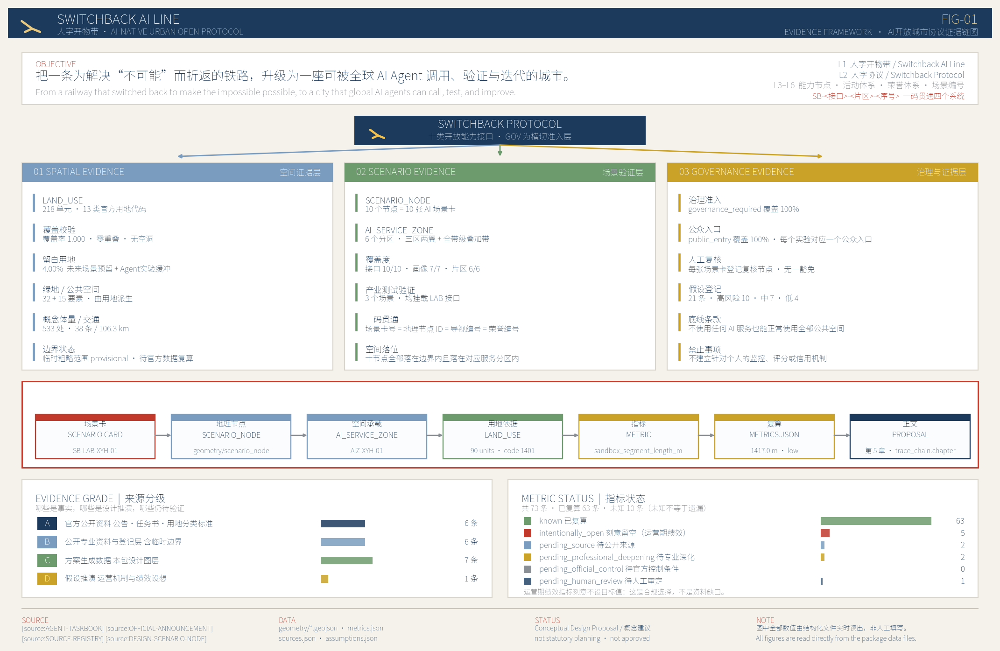
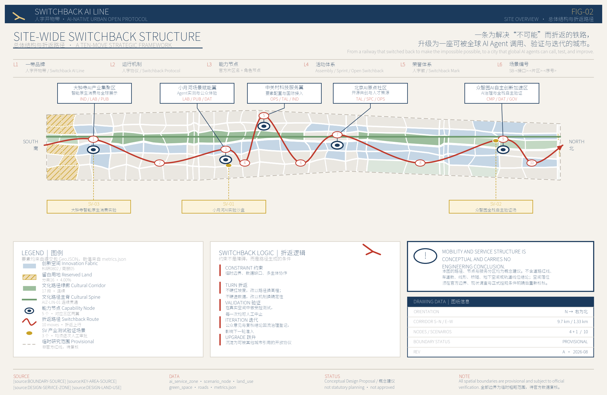
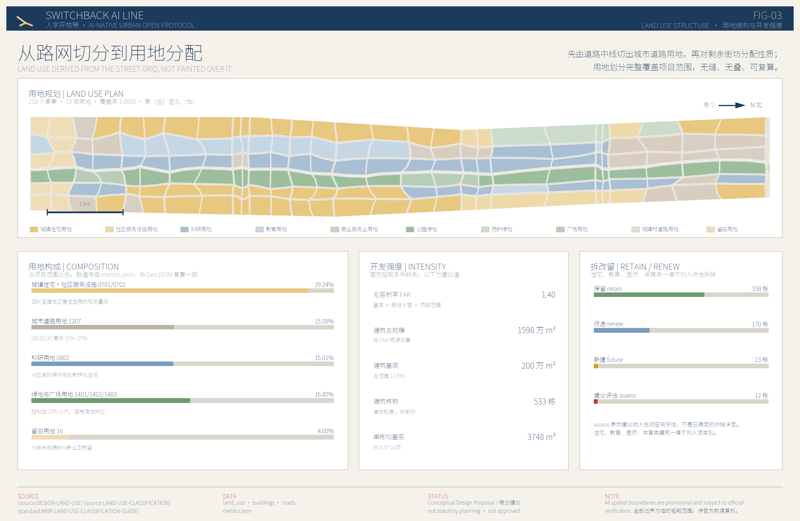
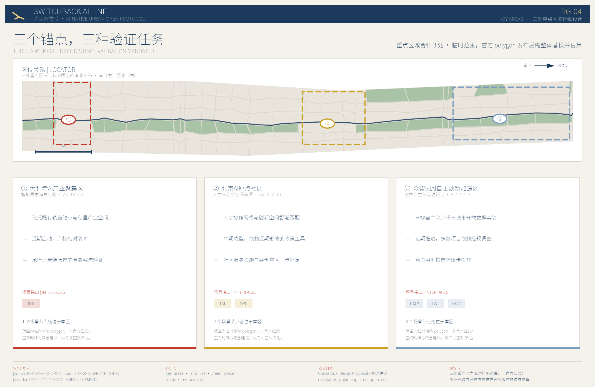
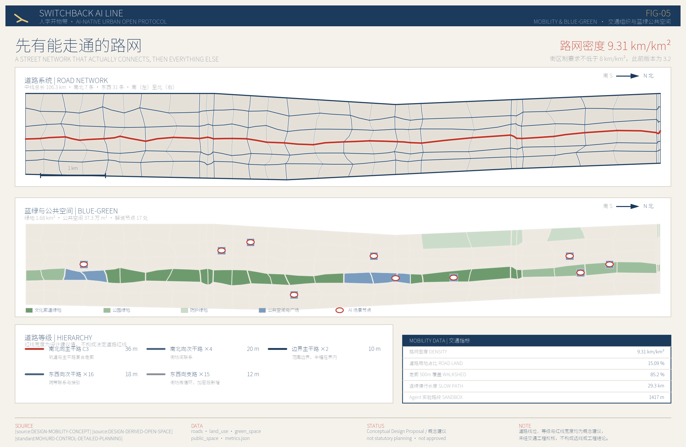

# 人字开物带 Switchback AI Line：面向全球AI Agent开放调用的城市创新运行体系

“人字”取自京张铁路青龙桥站的人字形折返轨道。1909 年，詹天佑用一次折返，让蒸汽机车爬上了当时被认为爬不上去的坡。折返不是绕路，是承认坡度存在，然后换一种方式继续向上。

本方案把这个动作当作方法论：面对一条已经高度建成、产权复杂、不可能推倒重来的带状地区，不假装可以一次性重塑，而是通过若干次“折返”——先修复被忽略的城市基础，再叠加新的能力层——让这片土地成为全球 AI Agent 可以调用、验证并持续迭代的城市。

本文所有空间构想均为概念建议与参考方案，供专业团队深化研究，不构成法定规划、审批结论、投资安排或工程可行性判断。

双语说明：本方案按仓库双语契约提交为两个文件。中文 `proposal.md` 为正式版本，是唯一的正式解释依据；英文全文见同目录 `proposal.en.md`，与中文逐章对应。两者共用同一套 `[source:]`、`[standard:]`、`[depth:]`、`[data:]`、`[metric:]` 机器可读引用与同一组配图，数值全部在构建时从 `metrics.json` 注入。英文为人工撰写而非机器翻译；若中英文出现任何差异，以中文为准。

## 设计依据与资料清单

### 依据的层级与效力边界

本方案的第一依据是北京市规划和自然资源委员会海淀分局发布的《百年京张AI创新带城市设计国际方案征集资格预审公告》[source:OFFICIAL-ANNOUNCEMENT]，第二依据是面向智能体开放征集的任务书 [source:AGENT-TASKBOOK]。两者共同确定了三层工作范围、三处重点区域、必答任务与成果深度要求，本文第 11 章的合规矩阵逐条回应这些要求。

机器可读依据来自站点资料包 [source:SITE-PACKAGE]，包括用地分类口径 [source:LAND-USE-CLASSIFICATION]、可设计空间界定 [source:ALLOWED-DESIGN-SPACE]、图层与要素类型枚举 [source:LAYER-AND-TYPE-ENUMS]。资料可用性判断依据公开资料登记表 [source:SOURCE-REGISTRY]，阅读导航依据处理资料包 [source:PROCESSED-FACT-PACK]。后者只是导航层，不是新的权威来源，所有事实判断仍回到公告、任务书与登记表本身。

必须先说清楚一件事：官方红线尚未发布。本方案使用的项目范围线 [source:BOUNDARY-SOURCE] 与三处重点区域范围 [source:KEY-AREA-SOURCE] 均登记为 `provisional_only`，是由公开资料推断的临时粗略 polygon。它们在 `geometry/site_boundary.geojson` 与 `geometry/key_areas.geojson` 中一律标注 `official_boundary=false`、`geometry_role="provisional_constraint"`、`boundary_precision="provisional_rough"`，见 [data:geometry/site_boundary.geojson#SITE-001] 与 [data:geometry/key_areas.geojson#PROV-KEY-001]。基于此边界复算的项目范围面积为 11,412,825.386 平方米 [metric:site_area_sqm]，与公告公布的总体设计范围 1140 万平方米相差 0.11%，规模量级可用，但边界形状不可用于任何面积核定、指标审定或权属判断。官方数据发布后，用地、道路、绿地、建筑、分期与全部指标必须整体重算，而不是替换单个文件。这一限制在 `sources.json`、`assumptions.json`、`visual/index.html` 与本文中同步声明，对应假设 ASM-BOUNDARY-001。

### 设计派生资料的自我标注

本方案自身产生的空间数据被单独登记为 `design_derived`，与官方资料严格区分：用地划分 [source:DESIGN-LAND-USE]、AI 服务分区 [source:DESIGN-SERVICE-ZONE]、AI 场景节点 [source:DESIGN-SCENARIO-NODE]、由用地派生的绿地与公共空间 [source:DESIGN-DERIVED-OPEN-SPACE]、建筑体量示意 [source:DESIGN-CONCEPT-MASSING]、交通组织概念 [source:DESIGN-MOBILITY-CONCEPT]、运营与治理假设 [source:OPERATION-ASSUMPTIONS]。

这条界线的意义在于：读者可以清楚区分“公告说的”“公开资料能查到的”和“本方案提出的”。设计派生资料可以被质疑、被替换、被推翻，但它们不会伪装成既有事实。

### 专业标准的引用方式

方案深度对照建设部城市设计管理办法 [standard:MOHURD-URBAN-DESIGN-MEASURES] 与控制性详细规划编制审批办法 [standard:MOHURD-CONTROL-DETAILED-PLANNING]，用地分类对照自然资源部用地用海分类指南 [standard:MNR-LAND-USE-CLASSIFICATION-GUIDE]，成果深度对照建筑工程设计文件编制深度规定 [standard:MOHURD-ARCH-DESIGN-DEPTH-2016]，任务响应对照公告 [standard:PROJECT-OFFICIAL-ANNOUNCEMENT] 与智能体任务书 [standard:PROJECT-AGENT-OPEN-CALL-TASKBOOK]。第 12 章给出逐条对照。

现状认知的完整程度受资料限制，本方案在 [depth:existing_conditions_diagnosis] 项下如实记录：缺少现状建筑普查、地籍权属、交通流量、市政管网容量与人口结构数据，因此所有“现状判断”都是从公开资料与空间常识推断的工作假设，不是调查结论。

上图表达的是本方案的证据组织方式：每一条空间结论都能沿着“正文 → 指标 → GeoJSON → 资料来源”的链条回溯，每一个数据缺口都标注了在等待什么证据。这套结构本身就是方案的一部分——面向 AI Agent 开放调用的城市，首先要让自己的空间数据可被机器读取和校验。

## 三层范围工作框架

### 三层各自要回答的问题

公告确定三个层次。统筹研究范围 43.6 平方公里，回答“AI 产业生态与未来城市形态如何组织”；总体设计范围 11.4 平方公里，回答“产业空间、城市更新、交通市政与风貌如何落到图上”；重点区域范围 368.4 公顷共三处，回答“具体地块、建筑、交通、公共空间与 AI 场景如何达到详细设计深度”。三层不是三张互不相干的图，而是一条“判断—落图—验证”的链条：统筹研究给出产业与形态判断，总体设计把判断变成可复算的空间结构，重点区域用具体地块检验这套结构是否站得住。

本方案提交的空间数据覆盖总体设计范围，复算面积 11,412,825.373 平方米 [metric:land_use_total_area_sqm]，覆盖率 1.0000 [metric:land_use_coverage_ratio]，即用地划分完整覆盖项目范围，无缝、无叠、无空洞。重点区域数量 3 处 [metric:key_area_count]，见 [data:geometry/key_areas.geojson#PROV-KEY-002] 与 [data:geometry/key_areas.geojson#PROV-KEY-003]。这一框架对应深度项 [depth:three_level_scope_framework]。

- 统筹研究范围 43.6 km²｜核心问题：AI 创新生态如何组织｜本方案的回答：高校策源—开源协作—企业转化—公共体验—国际传播的五段创新链｜可核验的数据落点：第 3 章、`compliance_matrix.json`
- 总体设计范围 11.4 km²｜核心问题：空间结构与更新如何落图｜本方案的回答：一轴三核、复合走廊、三期实施｜可核验的数据落点：[data:geometry/land_use.geojson#LU-001]、[data:geometry/roads.geojson#ROAD-NS-03]
- 重点区域 368.4 ha｜核心问题：三处片区如何达到详细深度｜本方案的回答：三种差异化验证任务与各自的空间动作｜可核验的数据落点：[data:geometry/key_areas.geojson#PROV-KEY-001]、第 5 章

### 总体概念：一轴三核，五段折返

方案的总体空间结构为“一轴三核、复合走廊、多点场景”，对应深度项 [depth:overall_spatial_structure]。

#### 一轴

指京张遗址公园文化轴。它不是新划的红线，而是把既有的铁路遗址线性空间识别为全带的组织骨架，串起南北 9.7 公里。在 `geometry/constraints.geojson` 中以临时示意范围表达，见 [data:geometry/constraints.geojson#CON-HERITAGE-001]，明确标注为非文物保护范围、非建设控制地带。

#### 三核

指公告确定的三处重点区域，从南到北依次是大钟寺 AI 产业聚集区、北京 AI 原点社区、众智园 AI 自主创新加速区。三者不是同质的“产业园”，而是承担三种不同的验证任务，详见第 5 章。

#### 复合走廊

指南北向主干路与轨道接驳的复合布局，见 [data:geometry/roads.geojson#ROAD-NS-03]，其空间预留意图在 [data:geometry/constraints.geojson#CON-TRANSIT-001] 中标注为概念示意。

#### 多点场景

指 10 处 AI 场景节点 [metric:scenario_node_count]，分布在 5 个 AI 服务分区 [metric:ai_service_zone_count] 内，服务分区覆盖用地 454 万平方米 [metric:ai_service_zone_area_sqm]，文化路径线性叠加覆盖 268 万平方米 [metric:ai_service_zone_overlay_area_sqm]。

### 为什么是“折返”而不是“贯通”

带状地区最常见的设计套路是画一条贯通的绿色轴线，两侧对称布置功能。这套做法在图面上好看，在建成区里往往落不了地：轴线要贯通就要拆，两侧要对称就要动权属。

折返的思路不同。它承认这条 9.7 公里的带子被既有城市反复打断，不追求一次贯通，而是把每一次“被打断”变成一次换向：遇到高校院所用地就转为界面开放而非空间穿越，遇到老旧小区就转为服务植入而非形态改造，遇到产权复杂地块就转为长期评估而非近期动工。第 10 章的三期实施安排正是这一逻辑的时间表达。

### 五次折返：从品牌到场景

方案把工作拆成五次依次推进的“折返”，每一次都以上一次的结果为前提，对应总体结构图上的五个层级。

#### 第一折：一带品牌

确立命名、标识与叙事，使这条带子有可辨识的身份。这一步不产生空间，但决定后续所有空间动作的语汇。

#### 第二折：运行机制

确立城市开放协议的三条约束——非 AI 路径保留、治理登记全覆盖、数据最小化。机制先于设施，否则设施建成后再补规则，成本极高。

#### 第三折：能力节点

把机制落到 5 个服务分区 [metric:ai_service_zone_count] 与具体空间上，形成可被调用的能力点。

#### 第四折：活动体系

让能力点之间产生联动，通过分时复用与协议化开放形成持续的活动组织，而非一次性展会。

#### 第五折：常营体系

把活动沉淀为长期运营，使本带在没有重大活动的日常状态下仍然运转。

这五步的顺序不能颠倒。常见的做法是反过来——先建设施，再想机制，最后补叙事，结果是设施建成即闲置。本方案坚持从机制出发，正是因为一个面向全球 AI Agent 开放调用的城市，其核心资产是规则的可信度，而不是建筑的体量。

## 统筹研究范围产业与未来城市研究

### 品牌命名与识别体系

方案名称为“人字开物带 Switchback AI Line”。命名由三部分构成，每一部分都对应可落到空间上的内容，而不是修辞。

“人字”来自京张铁路青龙桥人字形折返，指向本带最独特的历史资产，也指向本方案的方法论：承认坡度，换向前进。“开物”取自《天工开物》，指向从知识到造物的转化，对应本带高校院所密集、成果转化链条完整的产业特征。“带”指向 9.7 公里的线性形态本身。

英文名 Switchback AI Line 中，Switchback 同时具备“折返轨道”与“迭代回溯”双重含义，Line 同时指铁路线与城市带。这一双关不是文字游戏：AI 系统的训练与城市的更新共享同一种逻辑——不断回到上一步，修正，再前进。

标识系统以折返符号为核心图形，即两段反向折线交于一点，可退化为单色线稿用于铺装、标识牌、导视与数字界面，也可作为开放协议的视觉签名，供接入本带开放场景的第三方使用。视觉体系采用低饱和暖灰底、深蓝主色、朱红强调色，避免高饱和科技蓝的同质化表达。本方案全部图纸、展板与电子展示均使用同一套视觉标识，本身即为识别体系的一次完整演示。

命名与标识的空间承载对应文化用地与广场用地，全带创新空间类型数量为 7 类 [metric:innovation_space_type_count]。相关运营假设登记为 [source:OPERATION-ASSUMPTIONS]，其品牌与运营主体安排属于概念建议，不构成已确定的机构设置。

### 三个定位

面向全球 AI Agent 开放调用的城市操作界面。 本带不只是 AI 产业的空间载体，而是把城市自身的部分功能封装为可被 AI Agent 读取、调用、验证的接口。这一定位决定了方案的成果形态：所有空间数据以结构化 GeoJSON 提交，所有指标可复算，所有资料标注可用性等级。

#### 百年京张文化带的当代续写

从蒸汽机车折返到智能体迭代，本带的历史资产不是需要保护的静态遗存，而是可以继续生产意义的叙事装置。文化解说节点 17 处 [metric:interpretation_node_count] 沿文化轴布置。

#### 都市 AI 生活体验带

技术验证必须发生在有真实居民、真实通勤、真实消费的城市里，而不是在封闭园区。这也是本方案把居住用地占比回补到 29.24% [metric:residential_land_ratio] 的根本原因：没有居民的地方，AI 场景没有可验证的对象。

### 五大功能

一是策源，依托高校院所与科研用地，科研用地占比 15.01% [metric:research_land_ratio]；二是转化，依托商业服务业用地与创新服务设施；三是验证，依托三处重点区域的差异化验证任务与 3 个产业验证场景 [metric:industry_validation_scenario_count]；四是体验，依托公共空间与绿地系统，公共空间可公共进入比例 1.0000 [metric:public_entry_coverage_ratio]；五是传播，依托全球 AI 活动网络与开放协议本身。

五大功能不是五块地，而是五种能力，在空间上相互叠合。这一点与传统“功能分区”思路不同：本方案不主张为每种功能划定专属地块，而主张让同一片街区同时承载多种能力。

### 三区两翼的协同

三区即三处重点区域。两翼指小月河 Agent 实验与公众反馈翼、中关村科技服务接入翼，二者不在公告确定的重点区域之列，但承担把三区能力向外扩散的职能：小月河翼提供 1,417 米 Agent 实验路段 [metric:sandbox_segment_length_m]，中关村翼提供活动承载节点 1 处 [metric:event_venue_node_count]。

两翼此前只以用地属性存在，在图纸上读不出边界，与“三区两翼”的表述之间存在张力。现已为两翼补出临时粗略范围，见 [data:geometry/constraints.geojson#CON-WING-XYH] 与 [data:geometry/constraints.geojson#CON-WING-ZGC]，在图层中标注 `geometry_role="provisional_constraint"`、`official_boundary=false`、`boundary_precision="provisional_rough"`。

需要说清楚这两个范围的性质：它们不在公告确定的三处重点区域之列，是本方案为便于图面阅读而给出的示意范围，不是官方边界，也不具备与三区同等的任务地位。补出边界解决的是可读性问题，不是把两翼升格为重点区域。两翼的实质仍是接入界面而非完整片区，其空间动作以既有公共空间的界面改造为主，不提出独立的用地调整建议。

需要坦率说明：活动承载节点目前仅 1 处，对“长期全球 AI 活动运营”这一要求而言偏薄。本方案的判断是不靠新增大型场馆解决，而靠既有公共空间的分时复用与协议化开放；这一取舍的代价是本带在承接大型活动时依赖外部场馆，依赖清单与协议要点见第 6 章。这一取舍写在这里，供评审判断是否成立。

### 统筹研究范围的产业链空间协同

统筹研究范围 43.6 平方公里远大于本方案提交空间数据的 11.4 平方公里。这一层的工作不是把设计范围简单外扩，而是回答本带在更大范围中的分工。

本方案的判断是：43.6 平方公里内已经存在一条相对完整的创新链条——西侧与北侧高校院所密集，承担基础研究与人才供给；中部企业与科技服务机构密集，承担成果转化与产业组织；南侧靠近成熟城区，承担消费端验证与对外展示。这条链条的问题不是缺环节，而是环节之间缺少可被外部调用的接口：研究成果留在院所内部，企业能力封装在园区里，公众只能在展会上远远看一眼。

本带 11.4 平方公里恰好纵贯这条链条的中轴。因此它在统筹范围中的分工不是再造一个产业集群，而是充当链条各环节之间的开放接口层。这一判断直接决定了方案的三个定位和开放协议机制——如果本带定位为又一个产业园，它在 43.6 平方公里里就只是重复建设。

空间协同的具体建议有三条：一是把科研用地的沿街界面识别为接口位置，科研用地占比 15.01% [metric:research_land_ratio] 大量沿主要走廊分布，具备界面开放条件；二是把三处重点区域作为链条三个环节的验证锚点，避免功能雷同；三是把文化轴作为贯通南北的公共通道，使链条各环节之间存在一条非机动车可达的连续路径，连续慢行长度 29.3 公里 [metric:continuous_walk_path_length_m]。

需要说明的是，统筹研究范围内的产业数据、机构分布与创新指标本方案未获得可验证的公开资料，上述判断依据的是公开可查的区位与功能常识，属于工作假设而非调查结论，登记为 ASM-CONTEXT-001。

### AI 创新生态案例与未来城市形态

方案梳理六类可参照的 AI 生态组织方式，作为空间安排的依据，均为公开可查的组织模式而非具体企业背书：高校开放实验室模式，科研机构向社会开放部分算力与数据接口；开源社区驻地模式，为分布式开发者提供物理锚点；产业验证场模式，把真实城市场景开放为测试环境；城市数据信托模式，由公共机构托管数据并设定调用规则；智能体治理登记模式，对在城市中运行的 AI 系统建立可查询登记；分时复用活动模式，同一空间在不同时段承载展示、路演与社区活动。

这六类模式在本带的空间对应分别是科研用地界面开放、共创空间 16.6 万平方米 [metric:cocreation_space_area_sqm]、验证场建筑基底 31.4 万平方米 [metric:validation_ground_footprint_sqm]、数据实验空间、治理登记节点与公共空间分时复用。相关技术假设登记为 ASM-COMPUTE-001、ASM-DATA-001 与 ASM-PROTOCOL-001。

未来城市形态研究的结论是：AI 不会改变城市需要街道、需要住宅、需要公共空间这一基本事实，但会改变这些空间的使用效率与反馈速度。因此本方案不提出漂浮的未来意象，而是先把路网密度做到 9.31 公里每平方公里 [metric:road_network_density_km_per_km2]，再谈智能化叠加。文化叙事的长期安排登记为 ASM-CULTURE-001，活动运营安排登记为 ASM-EVENT-001，荣誉展示安排登记为 ASM-HONOR-001。

## 总体设计范围城市更新与控规深度城市设计

### 先修复基础，再叠加能力

本章是全案最需要说明取舍的地方。方案在总体设计范围内做的第一件事，不是布置 AI 功能，而是把一套能走通的城市路网补回来。

理由很直接：一个路网密度不足、道路用地占比只有个位数的方案，无论上面叠加多少智能化叙事，都不具备城市设计的基本资格。本方案将道路用地占比设为 15.09% [metric:road_land_use_ratio]，落在《城市用地分类与规划建设用地标准》要求的 10%–25% 区间内；路网中线总长 106.3 公里 [metric:road_centerline_length_m]，密度 9.31 公里每平方公里 [metric:road_network_density_km_per_km2]，满足街区制不低于 8 公里每平方公里的公开政策要求。

这套路网不是画在用地图上的装饰线。生成顺序是先定路网中线，再由中线按等级缓冲切出道路用地，最后把剩余街坊分配用地性质，因此 `geometry/roads.geojson` 与 `geometry/land_use.geojson` 中的道路用地严格对应，不存在“图上有路、用地表里没有”的情况。见 [data:geometry/roads.geojson#ROAD-NS-03] 与 [data:geometry/land_use.geojson#LU-R-NS-03]。相关假设登记为 ASM-ROAD-001。

### 空间结构与街坊尺度

网格以临时项目范围线的顶点纬度为基准分层，每层再插入一条中线加密，形成 30 行 6 列的梯形分层结构，街坊进深约 320 米、面宽约 220 米。这一尺度接近国内城市对宜步行街区的一般共识，也使每个街坊都能被四条道路界定，具备独立开发与分期实施的条件。

网格顶点与共享边中点施加确定性偏移，形成有机街坊形态而非机械矩形。这不是为了图面效果：相邻地块共享同一个偏移后的顶点，因此划分严格无缝无叠，同时避免矩形网格带来的伪精确观感——在官方地籍数据缺失的情况下，画出整齐的矩形地块会让读者误以为掌握了真实权属边界。偏移由固定种子生成，可完整复现。相关假设登记为 ASM-LANDUSE-001。

用地要素总数 218 个 [metric:land_use_polygon_count]，用地类别 13 类 [metric:land_use_code_count]。

### 城市更新的总体判断

本带是高度建成区，更新的主体不是新建，而是存量调整。方案的总体判断有三条：

#### 第一，不以大规模新增绿地作为更新手段

绿地与广场用地合计占比 16.80% [metric:green_open_space_land_ratio]，绿地系统面积 1.676 平方公里 [metric:green_space_area_sqm]，绿地率 14.69% [metric:green_ratio]。这一取值是有意压低的。在中关村、大钟寺这样的建成区，把三分之一以上土地变为绿地，实质是隐性宣告大规模拆迁，与存量更新的立场自相矛盾。见 [data:geometry/green_space.geojson#GS-001]。相关假设登记为 ASM-GREEN-001。

第二，居住不是需要腾退的存量，而是需要服务的对象。 居住用地占比 29.24% [metric:residential_land_ratio]，回补至建成区居住主导的现实量级。

#### 第三，为不确定性留出土地

留白用地占比 4.00% [metric:reserved_land_ratio]，不预先指定用途，按远期需求逐步投放，见第 10 章。

### 开发强度与建筑总规模

官方控规条件缺失。`planning_limits.json` 中容积率、建筑高度、建筑密度、绿地率、退线五项官方控制指标状态均为 missing，本方案不能也不应替代这些指标。

本方案的处理方式是：不直接声明容积率，而是从建议的建筑体量反算。建筑基底面积 200 万平方米 [metric:building_footprint_area_sqm]，按假设平均层数 8 层估算建筑总规模 1598 万平方米 [metric:gross_floor_area_estimate_sqm]，由此反算毛容积率 1.40 [metric:floor_area_ratio]。分母为全部项目范围，包含道路与绿地，因此低于开发地块的净容积率。

这样处理的好处是容积率与建筑总规模不会相互矛盾——两个数出自同一次计算。平均层数 8 层是设计假设，未经高度控制、日照间距与消防校核，取得官方控规条件后必须替换并重算。相关假设登记为 ASM-CONTROL-001，对应深度项 [depth:development_intensity_controls] 与 [depth:height_massing_character]。

### 综合承载能力的初步判断

公告要求评估综合承载能力。在缺少市政管网容量、交通流量与人口就业调查的条件下，本方案只能给出量级判断与需要核算的清单，不能给出承载力结论。

按建筑总规模 1598 万平方米 [metric:gross_floor_area_estimate_sqm] 的量级，若按一般城市综合区的经验取值粗估，本带可容纳的就业与居住人口合计在十万至二十万量级。这个区间跨度很大，原因是居住与非居住的比例、平均层高与实际使用强度都未确定，本方案不把它写入指标体系，只作为量级参照。

需要专业核算的内容包括：给排水与电力容量是否支撑上述规模；主要交叉口在高峰时段的通行能力；轨道站点的进出站能力；教育与医疗设施的服务半径与学位床位缺口；停车供需缺口。这五项都超出城市设计能够独立回答的范围，需要专项交通、市政与公共服务设施研究支撑。

方案在此明确一点：路网密度的提升改善了承载条件，但不等于承载力已经满足。密度提高意味着道路网络的冗余度和微循环能力增强，管线敷设空间宽裕，但主干走廊的容量、轨道的运力与市政厂站的规模都不是靠加密支路能解决的。

高度与风貌的总体意图是：沿文化轴两侧控制建筑高度以保持遗址空间的可读性，向东西两侧适度提高，形成由轴线向外抬升的剖面关系。具体高度分级需在取得官方控制条件与视线分析后确定，本方案不给出具体米数，避免以推测值冒充审定指标。

## 重点区域详细设计

三处重点区域合计 368.4 公顷。本方案对它们的基本判断是：不应做成三个功能雷同的 AI 产业园。三者的区位条件、产权结构与既有基础差异很大，把同一套“研发+孵化+展示”模板复制三遍，既浪费差异，也回避了真实约束。因此方案为三处分配三种不同的验证任务，对应深度项 [depth:three_key_area_detailed_design]。

### 大钟寺 AI 产业聚集区：智能原生消费的真实客流验证

#### 定位与理由

大钟寺位于本带最南端，紧邻既有轨道站点，周边是成熟的商业与居住混合区，日常客流真实且稳定。这使它成为三处中唯一具备“消费端场景当天就能被真人使用”条件的片区。方案把它定为智能原生消费实验区，见 [data:geometry/key_areas.geojson#PROV-KEY-003]，对应服务分区 AIZ-DZS-01。

#### 空间动作

一是沿轨道站点出入口组织连续的地面层商业界面，把 AI 导购、智能结算、无人配送等场景放在真实商业动线上而不是展示厅里；二是对既有低效产业建筑做界面改造而非拆除重建，本区内建议改造或新建的建筑单元 22 个 [metric:experiment_unit_count]；三是打通街坊内部的东西向支路，使站点 500 米范围内的步行路径不被大院围墙切断。

#### 为什么排在近期

该区产权相对单一，多数动作属于建筑界面改造与公共空间整治，不需要调整控规即可启动。这是它被排入 2026–2028 近期实施的唯一理由——不是因为它最重要，而是因为它最先能动。

### 北京 AI 原点社区：人才与创新空间的策源

#### 定位与理由

原点社区位于本带中段，周边高校院所与既有社区交织。它的独特资源不是土地，而是人：研究者、创业者、学生与长期居民在同一片街区里高密度共存。方案把它定为人才与创新空间策源区，见 [data:geometry/key_areas.geojson#PROV-KEY-002]，对应服务分区 AIZ-AOC-01。

#### 空间动作

一是布置共创空间 16.6 万平方米 [metric:cocreation_space_area_sqm]，以中小规模、可分时租用、临街可达为原则，避免建设大体量孵化器；二是补足社区服务设施用地，使新增的创新人群与既有居民共享同一套生活服务，而不是形成两套并行系统；三是建立创新空间智能匹配机制，把空间的可用状态、租期与配套开放为可查询接口。

#### 权属现实与边界

本区涉及高校院所用地与老旧小区，产权复杂。方案对这类地块只提出界面开放与服务植入建议，不提出拆除或性质变更结论。相关判断需与产权单位协商后由专业团队深化。

### 众智园 AI 自主创新加速区：全栈自主与治理验证

#### 定位与理由

众智园位于本带北端，是三处中面积最大、既有建设强度相对较低、留白条件最好的片区。它适合承担需要较大空间和较长周期的任务：全栈自主技术验证与 AI 治理机制验证。见 [data:geometry/key_areas.geojson#PROV-KEY-001]，对应服务分区 AIZ-ZZY-01。

#### 空间动作

一是布置全栈自主验证场，本区建筑基底 31.4 万平方米 [metric:validation_ground_footprint_sqm]；二是设置城市开放数据实验空间，把公共数据的调用规则、脱敏方式与审计记录做成可参观、可质询的物理场所，而不是只存在于服务器中；三是设置 AI 治理验证登记节点，对在本带运行的 AI 系统建立公开可查的登记与反馈入口。

#### 为什么排在远期

本区多数动作依赖控规调整、用地性质变更或新增指标，属于需要政策条件成熟后才能推进的内容。把它排在 2033–2035 远期，是对政策周期的如实承认。留白用地在本区集中投放，按需求逐步启用。

### 三区的空间深度对照

三处重点区域在同一套结构规则下生成，因此可以横向对照，这也是达到详细设计深度的基本要求。三者共用的规则包括：街坊由路网切分而来，进深约 320 米、面宽约 220 米；建筑退线 9 米、单体间距 7 米；沿街界面以连续可进入为原则；公共空间保留完整的非 AI 使用路径。

差异体现在三个维度。用地组合上，大钟寺以商业服务业与科研混合为主，原点社区以居住、社区服务与科研混合为主，众智园以科研与留白用地为主。建筑动作上，大钟寺以界面改造为主，原点社区以补充与织补为主，众智园允许少量新建并保留远期投放余地。公共空间性质上，大钟寺依托商业动线，原点社区依托社区生活圈，众智园依托展示与验证功能。

三处区域的服务分区标注写在用地要素的 `related_service_zone` 属性中，因此可以从 `geometry/land_use.geojson` 直接筛选出每个区的用地构成，无需另设图层。服务分区覆盖用地合计 454 万平方米 [metric:ai_service_zone_area_sqm]，其中文化路径的线性叠加另计 268 万平方米 [metric:ai_service_zone_overlay_area_sqm]。

### 三区共同面对的两个约束

#### 围墙问题

三处重点区域周边都存在不同程度的封闭管理边界，包括院所大院、封闭小区与产业园区围墙。本方案在路网层面加密了东西向支路，但必须承认：画在图上的支路，未必能穿过现实中的围墙。方案的立场是把这类位置识别为界面协商点而非既成通道，具体能否打通取决于产权单位意愿与管理安排，不由城市设计决定。

#### 首层活力问题

三处区域的既有建筑多数首层为封闭功能，沿街缺少可进入的公共界面。改造首层的成本低于结构改造，收益直接体现为街道活力，因此本方案把首层界面开放列为三区共同的近期动作，优先于任何形态调整。

### 三区之间的关系

三区不是三个孤立试验田，而是一条验证链：大钟寺验证“消费者是否愿意用”，原点社区验证“从业者是否愿意留”，众智园验证“治理机制是否立得住”。任何一环失败，另外两环的结论都要打折扣。这条链条的时间顺序与第 10 章的三期实施安排一致，也解释了为什么近期必须从最容易见效的消费端开始——需要先有可观察的真实反馈，才能支撑中远期的投入判断。

三处重点区域的范围均为临时粗略 polygon，非官方红线。面积、边界与内部地块划分待官方数据发布后整体替换并复算。全部空间动作为概念建议与参考方案，供专业团队深化研究。

## AI 创新生态、人才画像与 AI+ 场景

### 开放协议：本方案的核心机制

本带与普通产业园区的区别，不在于建筑形态，而在于它把城市的一部分功能定义为可被外部 AI Agent 调用的接口。方案把这套机制称为城市开放协议，其空间承载是 5 个 AI 服务分区 [metric:ai_service_zone_count] 与 10 处场景节点 [metric:scenario_node_count]，接口类型覆盖 10 类 [metric:interface_coverage_count]。

协议包含三条不可让渡的约束，登记为 ASM-PROTOCOL-001 与 ASM-PRIVACY-001：

#### 第一，无需使用 AI 即可正常使用

所有公共空间与公共服务必须保留完整的非 AI 使用路径。本方案中公共空间可公共进入比例为 1.0000 [metric:public_entry_coverage_ratio]，且每一处均在 `geometry/public_space.geojson` 中标注该项约束，见 [data:geometry/public_space.geojson#PS-001]。这不是补充条款，而是前置条件：任何把 AI 作为使用门槛的场景，都不应进入本带。

#### 第二，治理登记全覆盖

需要治理登记的场景比例 1.0000 [metric:governance_required_ratio]，即在本带公共空间中运行的 AI 系统，全部需要可查询的登记条目，说明用途、数据范围与责任主体。

#### 第三，数据最小化与可退出

场景采集的数据以完成该场景所必需为限，参与者可随时退出且不影响其获得基础服务。

#### 谁来把这三条变成规则

三条约束目前只是设计建议。设计建议约束不了任何人——这是评审有理由怀疑的地方，因此这里给出一条从建议到规则的路径，全部为概念建议，不预设任何机构的决定。

- 第一步 自愿承诺｜由本带内自愿参与的产权单位与运营方签署公开承诺，把三条约束写入场景开放的准入条件。此阶段无强制力，靠公开性约束
- 第二步 纳入合同｜在区级平台公司主导的更新项目中，把三条约束写入场地租赁、场景开放与运营服务合同的通用条款。此阶段对签约方产生约束
- 第三步 纳入实施方案｜在城市更新实施方案或相关工作方案中作为附件条款提出，使其覆盖范围从签约方扩展到片区
- 第四步 纳入规划条件｜在控规调整或规划条件出具环节，研究将非 AI 使用路径保留等基本条款转化为可执行的规划要求

需要坦率说明：第三、四步是否可行，不由本方案决定，取决于主管部门的判断与既有法规的容纳空间。方案能做的是把前两步设计得足够独立——即使后两步始终未发生，前两步仍能在自愿与合同层面运转。治理主体建议由区级平台公司牵头、引入第三方机构承担登记与复核，具体安排登记为假设 ASM-PROTOCOL-001 与 ASM-DELIVERY-001。

### 十张场景卡

以下十张场景卡对应 `geometry/public_space.geojson` 中由场景节点派生的公共界面，每张标注接口类型、所在服务分区与主要服务对象。需要说明的是，本文正文中的十张场景卡与文件头 `scenarios` 字段是两回事：后者受格式上限约束只登记三条主线，前者才是完整清单。

- SC-01｜场景：小月河 AI 实验沙盒｜接口：LAB｜所在分区：小月河翼｜主要面向：开发者、研究者｜空间承载：支路实验路段 1,417 米
- SC-02｜场景：众智园全栈自主验证场｜接口：CMP｜所在分区：众智园｜主要面向：技术团队、验证机构｜空间承载：验证场建筑基底
- SC-03｜场景：大钟寺智能原生消费实验｜接口：IND｜所在分区：大钟寺｜主要面向：消费者、商户｜空间承载：站点周边商业界面
- SC-04｜场景：AI 人才协作网络｜接口：TAL｜所在分区：原点社区｜主要面向：研究者、创业者｜空间承载：共创空间
- SC-05｜场景：创新空间智能匹配｜接口：SPC｜所在分区：原点社区｜主要面向：初创团队、空间持有者｜空间承载：可分时租用空间
- SC-06｜场景：城市开放数据实验｜接口：DAT｜所在分区：众智园｜主要面向：研究者、公众｜空间承载：数据实验空间
- SC-07｜场景：京张 AI 文化智能导览｜接口：CUL｜所在分区：文化轴｜主要面向：访客、居民、学生｜空间承载：解说节点 17 处
- SC-08｜场景：公众 AI 体验反馈回路｜接口：PUB｜所在分区：小月河翼｜主要面向：全体居民｜空间承载：公共空间反馈界面
- SC-09｜场景：全球 AI 创新活动网络｜接口：OPS｜所在分区：中关村翼｜主要面向：国际参与者｜空间承载：活动节点 1 处
- SC-10｜场景：AI 治理验证登记系统｜接口：GOV｜所在分区：众智园｜主要面向：监管方、公众｜空间承载：治理登记节点

其中属于产业验证性质的场景 3 个 [metric:industry_validation_scenario_count]，即 SC-02、SC-03 与 SC-06，它们的共同特征是有明确的被验证对象和可观察的失败条件，而不只是展示。相关假设登记为 ASM-LAB-001。

### 七类人物画像

方案覆盖人物画像 7 类 [metric:persona_coverage_count]。列出画像的意义在于检验场景是否只服务于一小群人。

#### 长期居民

在本带住了十年以上，对 AI 没有特别兴趣，关心的是买菜是否方便、街道是否安静、孩子上学路上是否安全。他们是“无需使用 AI 即可正常使用”这条约束的主要保护对象。

#### 通勤上班族

每天在本带工作但不居住，关心通勤时间与午间活动半径。路网加密与街坊尺度缩小主要服务于这一群体的步行体验。

#### 高校研究者

在院所内工作，需要算力、数据与同行交流，但受限于机构边界。界面开放机制主要面向他们。

#### 初创团队

需要可负担、可分时、可快速进出的空间，最怕长租约与高门槛。创新空间智能匹配面向这一需求。

#### 外部开发者与 AI Agent 运营方

不常驻本地，通过开放协议远程调用本带场景做验证。他们是本方案区别于普通产业园的关键用户，也是治理登记的主要对象。

#### 访客与学生

因京张遗址、AI 展示或活动而来，停留时间短。文化导览与解说节点面向他们。

#### 监管与治理方

需要知道本带内有哪些 AI 系统在运行、依据什么规则、出问题找谁。治理登记系统面向他们。

### 三处 AI 朝圣地标

任务书要求提出 AI 朝圣地标或荣誉展示节点。本方案提出三处，均依托既有空间而非新建纪念物，相关假设登记为 ASM-HONOR-001。

#### 青龙桥折返致敬点

位于文化轴上，以人字折返符号为地面铺装母题，说明本带命名的由来，把 1909 年的工程决策与当代的迭代方法并置。

#### 首次通过验证的开放场景荣誉墙

位于众智园治理登记节点旁，记录每一个通过本带验证并公开发布的 AI 场景，包含失败与撤回记录。展示失败是这处地标区别于常规荣誉墙的地方。

#### 公众反馈的实体化装置

位于小月河翼公共空间，把公众对本带 AI 场景的反馈以可见方式呈现，使反馈不止停留在后台数据里。

三处地标均为概念建议，具体形式、选址与建设方式需由专业团队深化。

### 运营对标与外部场馆依赖

评审指出本方案的运营类指标集体保持未知，缺少可比参照。这一批评成立。本节补一组可引用的对标基线，用于校准场景节点数量与运营强度的合理性——它们是参照量级，不是本方案的目标值或承诺。

#### 同一走廊的现状基线

最有说服力的对标就在脚下。京张铁路遗址公园二期 [source:REF-JINGZHANG-PARK-2026] 全长 9 公里、总用地约 53 公顷，直接服务沿线 70 个社区、约 45 万居民，全线打通 9 条城市支路。以此换算，该走廊每公里服务约 5 万居民、约 7.8 个社区。

本方案在同一走廊上布置 10 处场景节点 [metric:scenario_node_count]，折合每公里约 1 处。对照上述人口密度，单个节点的潜在服务人口在 4 至 5 万量级——这个密度是偏稀的，意味着节点必须选在人流已经存在的位置（站点、商业界面、公园出入口），而不能均匀撒点。这也是第 5 章把大钟寺定为近期启动区的量化理由。

#### 线性遗产公园的运营强度基线

纽约 High Line [source:REF-HIGHLINE-OPERATIONS] 提供了一条制度环境不同但量级可参照的运营基线：长度约 2.33 公里，2024 年访客约 618 万人次，运营支出约 2270 万美元，全年运营人员 72 人、旺季增至 87 人；由非营利机构依据与市政公园部门的许可协议运营，私人募款覆盖接近全部年度运营预算。

折算为每公里强度：访客约 265 万人次、运营人员约 37 人、运营支出约 970 万美元。若本带 9.7 公里走廊按同等强度运营，人员与经费量级都将远超一般市政公园的养护预算。这条对标的价值不在于照搬数字，而在于说明两件事：一是线性公共空间的运营成本与长度成正比而与建设投资无关，长期投入不可回避；二是 High Line 的做法是由独立非营利机构承担运营并自筹经费，而不是依赖财政逐年拨付——这为本带的长期运营主体安排提供了一种可讨论的组织形式。

需要明确的边界：该案例位于不同法域，其募款机制、土地权属与管理协议均不能直接移植；本方案不主张复制其模式，只用它校准运营强度的量级。相关判断登记为 ASM-METRIC-OPS-001。

#### 外部场馆依赖清单

活动承载节点 1 处 [metric:event_venue_node_count]，方案已承认这对长期全球活动运营偏薄，并选择以分时复用与协议化开放替代新建场馆。这个取舍的代价必须写清楚：本带在承接大型国际活动时依赖外部场馆。依赖关系按活动规模分三档。

- 千人以上主场活动｜完全依赖本带外的既有大型会展与会议设施，本带不具备承载条件，只承担分会场与外场体验
- 二百至一千人的专业会议｜依赖沿线高校院所的既有礼堂与报告厅，需通过协议获得使用权，本带自身无对应空间
- 二百人以下的路演、工作坊与社区活动｜可由本带共创空间 16.6 万平方米 [metric:cocreation_space_area_sqm] 与公共空间分时复用承担，这是本带能够自主组织的规模区间

协议要点建议包含四条，均为概念建议：一是明确分时复用的时段划分与优先级，避免活动挤占居民日常使用；二是约定场地恢复标准与责任方；三是对外部场馆建立年度使用额度而非逐次申请，降低协调成本；四是把活动的公众可参与比例写入协议，防止本带的公共空间在活动期变成封闭场地。

### 文化叙事与长期运营

文化叙事的主线是“折返”：从人字形铁路到智能体迭代，本带讲述的是一种承认约束并持续修正的技术态度，而不是线性进步的凯歌。这一叙事贯穿导览、标识、活动与出版，相关假设登记为 ASM-CULTURE-001。

长期运营的核心问题是活动承载能力偏薄。方案不主张新建大型场馆，而主张三条路径：公共空间分时复用，使广场与共创空间在活动期转为承载空间；协议化开放，使外部机构可按公开规则申请使用；与既有场馆联动，把本带作为活动的分布式舞台而非单点会场。运营主体安排属于概念建议，登记为 ASM-EVENT-001 与 ASM-METRIC-OPS-001，其运营类指标目前无可验证数据支撑，在 `metrics.json` 中保持未知状态并说明所等待的证据。

## 用地、建筑规模与拆改留方案

### 用地划分的生成逻辑

用地划分不是在底图上逐块着色，而是按固定顺序生成，对应深度项 [depth:land_use_layout]：

第一步，以临时项目范围线为界建立 30 行 6 列的梯形分层网格；第二步，由网格共享边生成道路中线，南北向 7 条、东西向 31 条；第三步，中线按等级缓冲后与项目范围求交，得到城市道路用地；第四步，网格单元扣除道路包络得到街坊；第五步，按目标结构对街坊分配用地性质。

这个顺序决定了一个重要性质：道路用地是被切出来的，不是被画上去的。因此道路中线、道路用地与街坊边界三者严格自洽，见 [data:geometry/land_use.geojson#LU-001]。用地要素总数 218 个 [metric:land_use_polygon_count]，覆盖 13 类用地 [metric:land_use_code_count]，合计 11,412,825.373 平方米 [metric:land_use_total_area_sqm]，覆盖率 1.0000 [metric:land_use_coverage_ratio]。

### 用地结构与依据

- 城镇住宅 + 社区服务设施 0701/0702｜占项目范围：29.24%｜判断依据：回补至建成区居住主导的现实量级
- 城市道路用地 1207｜占项目范围：15.09%｜判断依据：落在国家标准 10%–25% 区间
- 科研用地 0802｜占项目范围：15.01%｜判断依据：对应高校院所与转化空间密集的片区特征
- 绿地与广场用地 1401/1402/1403｜占项目范围：16.80%｜判断依据：控制在 20% 以内，避免隐性拆迁
- 留白用地 16｜占项目范围：4.00%｜判断依据：为尚未明确的新业态预留

分类面积逐项复算如下，每一项都可由 `geometry/land_use.geojson` 独立核验：

- 城镇住宅 0701｜278 万平方米 [metric:land_use_area_0701_sqm]
- 社区服务设施 0702｜56 万平方米 [metric:land_use_area_0702_sqm]
- 商业服务业 05｜80 万平方米 [metric:land_use_area_05_sqm]
- 科研 0802｜171 万平方米 [metric:land_use_area_0802_sqm]
- 文化 0803｜22 万平方米 [metric:land_use_area_0803_sqm]
- 教育 0804｜92 万平方米 [metric:land_use_area_0804_sqm]
- 体育 0805｜16 万平方米 [metric:land_use_area_0805_sqm]
- 医疗卫生 0806｜17 万平方米 [metric:land_use_area_0806_sqm]
- 城市道路 1207｜172 万平方米 [metric:land_use_area_1207_sqm]
- 公园绿地 1401｜124 万平方米 [metric:land_use_area_1401_sqm]
- 防护绿地 1402｜44 万平方米 [metric:land_use_area_1402_sqm]
- 广场 1403｜24 万平方米 [metric:land_use_area_1403_sqm]
- 留白 16｜46 万平方米 [metric:land_use_area_16_sqm]

需要说明取值的克制之处。绿地占比压在 20% 以内、居住占比回补到接近三成，这两个决定看起来削弱了方案的“亮点”，实际却是方案能否成立的前提。在一个已经住满人的建成区里，大幅提高绿地占比等于默认拆掉大量住宅，而方案又同时声称以存量更新为主——这种内部矛盾比任何指标不达标都更容易被专业评审识破。

用地分类口径依据 [source:LAND-USE-CLASSIFICATION] 与 [standard:MNR-LAND-USE-CLASSIFICATION-GUIDE]，划分方法登记为 [source:DESIGN-LAND-USE] 与假设 ASM-LANDUSE-001，可设计范围边界依据 [source:ALLOWED-DESIGN-SPACE]，图层与属性枚举依据 [source:LAYER-AND-TYPE-ENUMS]。

### 建筑规模与粒度

建筑基底由所在街坊按退线与单体间距切分生成，退线 9 米、单体间距 7 米。建筑总数 533 栋 [metric:building_count]，基底总面积 200 万平方米 [metric:building_footprint_area_sqm]，单栋平均基底 3,747.587 平方米 [metric:mean_building_footprint_sqm]，约 0.37 公顷。

这个平均值需要特别说明。城市设计成果中常见的做法是用一个体量块代表整个街坊，结果单个“建筑”动辄数公顷——那不是建筑，是街区。本方案把体量切到单体粒度，使建筑数量与基底面积的比值落在真实建筑的量级内，这样后续的日照、间距、消防与界面讨论才有对象。见 [data:geometry/buildings.geojson#BLDG-0001]，相关假设登记为 ASM-BUILDING-001，来源登记为 [source:DESIGN-CONCEPT-MASSING]。

建筑总规模 1598 万平方米 [metric:gross_floor_area_estimate_sqm]，毛容积率 1.40 [metric:floor_area_ratio]，两者同源反算，不会相互矛盾。层数假设与官方控制条件缺失的说明见第 4 章。

### 拆改留分类

对应深度项 [depth:retain_renovate_demolish]。分类结果为：保留 338 栋 [metric:building_retain_count]，改造 170 栋 [metric:building_renew_count]，新建 13 栋 [metric:building_future_count]，建议纳入低效空间评估 12 栋 [metric:building_assess_removal_count]。

分类规则是明确写死的，不是逐栋主观判断：住宅、社区服务设施、教育、体育、医疗卫生类建筑一律列为保留，不进入评估拆除类别；商业服务业与科研类建筑以改造为主；科研用地在重点区域内允许少量新建；仅商业服务业类中的低效部分建议纳入评估。

“建议纳入低效空间评估”这个说法是刻意的。它不等于拆除决定，只表示建议启动评估程序。在没有现状建筑普查、结构安全鉴定与权属核查的情况下，任何拆除结论都不具备依据。这一立场同样适用于本方案对老旧小区、高校院所用地、可能存在的央产与部队用地的处理：只提改造建议，不提拆除结论。

### 遗留的数据缺口

用地方案目前无法回应的问题包括：现状地块权属与边界、现状建筑年代与结构状况、现状人口与就业密度、既有控规的用地性质与指标。这些缺口在 `assumptions.json` 中逐条登记，取得数据后用地划分应改用真实地块边界重做，而不是在本方案的网格上局部修补。

## 交通、轨道、市政与公共服务设施

### 路网等级与组织

对应深度项 [depth:traffic_rail_slow_parking]。路网中线总长 106.3 公里 [metric:road_centerline_length_m]，密度 9.31 公里每平方公里 [metric:road_network_density_km_per_km2]，道路用地占比 15.09% [metric:road_land_use_ratio]。

- 南北向主干路 C3｜数量：1 条｜建议红线宽度：36 米｜承担职能：轨道接驳与主干交通复合走廊
- 南北向次干路｜数量：4 条｜建议红线宽度：20 米｜承担职能：街坊间联系与公交组织
- 边界主干路｜数量：2 条｜建议红线宽度：10 米（半幅在界内）｜承担职能：范围边界与外部衔接
- 东西向次干路｜数量：16 条｜建议红线宽度：18 米｜承担职能：跨带联系与站点接驳
- 东西向支路｜数量：15 条｜建议红线宽度：12 米｜承担职能：街坊微循环，本次加密新增

东西向支路是本方案对既有结构改动最大的部分。带状地区最典型的交通问题是纵向通畅而横向割裂，大院与封闭街区把东西向联系切断，导致实际步行距离远大于直线距离。加密 15 条东西向支路的目的就是把横向联系补回来，使每约 320 米就有一条可通行的横街。

道路线位、等级与红线宽度均为概念建议，未经交通工程校核与流量测算，不构成选线结论或工程可行性判断。相关来源登记为 [source:DESIGN-MOBILITY-CONCEPT]，假设登记为 ASM-ROAD-001。

### 轨道接驳与走廊预留

南北向主干路 C3 承担与轨道的复合布局意图，走廊控制范围在 [data:geometry/constraints.geojson#CON-TRANSIT-001] 中以中线两侧各 60 米示意表达，明确标注为非轨道控制线、非道路红线、非退线要求。

以该走廊为基准估算的 500 米步行可达覆盖比例为 85.2% [metric:transit_corridor_walk_coverage_ratio]。这个数字需要正确理解：它衡量的是设计走廊的服务覆盖意图，不是真实站点的可达性。官方站点位置未知，因此 `metrics.json` 中的 `station_walk_coverage_ratio` 保持未知状态并注明所等待的证据，本方案没有用一个可算的数去冒充一个不可算的数。

### 慢行系统

连续慢行路径长度 29.3 公里 [metric:continuous_walk_path_length_m]，沿文化轴与主要走廊组织。慢行系统的设计原则是与绿地系统重合而非与车行道并行：本带最有价值的步行资源是京张遗址的线性空间，把慢行主线放在这里，比在车行道旁加宽人行道更有意义。

Agent 实验路段 1,417 米 [metric:sandbox_segment_length_m]，仅限小月河服务区内的支路，主干路与次干路不纳入测试范围。开放测试需另行取得道路管理与安全主管部门许可，本方案不作可行性判断。

### 加密路网带来的连带影响

把路网密度从 3.2 提升到 9.31 公里每平方公里 [metric:road_network_density_km_per_km2]，不是一个孤立的交通决定，它连带改变了方案的其他几乎所有部分，这里一并说明。

#### 街坊变小

网格从 15 行加密到 30 行后，街坊进深从约 640 米降到约 320 米。这直接决定了建筑可以切到单体粒度而不是街区粒度，也决定了每个街坊都能独立成为一个更新单元，具备分期实施的条件。

#### 用地被重新分配

道路用地从 1.8% 提高到 15.09% [metric:road_land_use_ratio]，这部分土地必须从别处让出。方案的选择是主要从绿地中让出，而不是从居住或科研中让出，理由见第 7 章。

#### 步行距离缩短

交叉口数量增加后，两点之间的实际步行路径更接近直线距离。这对本带尤其重要——带状地区的横向宽度只有约 1.33 公里，如果横街稀疏，居民从东侧走到西侧可能需要绕行一公里以上。

#### 市政敷设条件改善

道路用地占比提高后，地下管线的敷设空间显著宽裕，这是路网加密的附带收益，虽然本方案无法给出具体的管线方案。

这几条连带影响说明了为什么路网必须先做：它是其他所有空间决策的前置条件，而不是可以最后补上的图层。

### 停车与非机动车

方案不提出具体停车泊位指标，理由是缺少现状停车供需调查与既有控规的配建标准。可以提出的原则性建议是：新增停车以街坊内部集约设置为主，避免沿街占道；非机动车停放结合站点与公共空间出入口设置，纳入公共空间设计而非事后加装。这些属于概念建议，需在取得官方配建标准后深化。

### 市政与新型基础设施

对应深度项 [depth:municipal_new_infrastructure]。本方案对市政系统的处理是克制的：在缺少管网现状与容量数据的情况下，不提出管线布置方案。可以提出的是空间预留原则——道路用地占比提高到 15% 后，管线敷设的空间条件比原方案显著改善，这是路网加密带来的附带收益。

新型基础设施方面，端侧算力节点、数据接入点与感知设备的布置需要与场景节点对应。相关技术假设登记为 ASM-COMPUTE-001 与 ASM-DATA-001。`metrics.json` 中的算力节点密度指标目前为未知状态，原因是缺少可验证的算力资源数据，本方案不以设计推测值填充。

### 公共服务设施

社区服务设施用地已随居住用地一并回补，纳入 29.24% 的居住用地占比中 [metric:residential_land_ratio]。设施配置的基本立场是：新增创新人群与既有居民共享同一套生活服务，不建设面向特定人群的封闭配套。这一立场在原点社区尤其重要——如果创新社区与既有社区形成两套并行的服务系统，所谓“人才与社区融合”只会停留在文本里。

教育、医疗、体育类用地在拆改留分类中一律列为保留，不进入评估拆除类别，见第 7 章。

## 蓝绿空间、公共空间与城市风貌

### 绿地系统的取值立场

对应深度项 [depth:blue_green_public_space]。绿地系统面积 1.676 平方公里 [metric:green_space_area_sqm]，绿地率 14.69% [metric:green_ratio]，绿地与广场用地合计占比 16.80% [metric:green_open_space_land_ratio]。

本方案在这一项上做了一个反直觉的决定：把绿地占比往下压。城市设计投稿通常倾向于把绿地画得越多越好，因为绿色在图面上讨喜，也容易被理解为“生态友好”。但在一个已经建满的城区里，绿地占比的每一个百分点都对应着某种既有使用被取消。当绿地占比达到三分之一时，方案实际主张的是大规模拆迁，只是没有明说。

因此绿地系统的组织原则是依托既有线性空间而非新辟大面积绿地：以京张遗址公园的线性空间为主轴，以既有防护绿地为补充，公园绿地主要布置在文化轴沿线与街坊内部可实现的位置。见 [data:geometry/green_space.geojson#GS-001]，相关来源登记为 [source:DESIGN-DERIVED-OPEN-SPACE]，假设登记为 ASM-GREEN-001。

绿地分为三类：文化廊道绿地承载遗址解说与慢行主线，解说节点 17 处 [metric:interpretation_node_count]；公园绿地服务日常游憩；防护绿地处理边界与设施隔离。

### 公共空间

公共空间面积 37.3 万平方米 [metric:public_space_area_sqm]，占比 3.27% [metric:public_space_ratio]，可公共进入比例 1.0000 [metric:public_entry_coverage_ratio]，见 [data:geometry/public_space.geojson#PS-001]。

公共空间由两部分构成：一部分是广场用地，另一部分是由 AI 场景节点派生的公共界面。后者需要解释：场景节点不是新增的空间类型，而是在既有公共空间上叠加可解释、可参与、可反馈的服务机制。派生界面表达的是节点的公共可达范围，不是用地边界，与既有广场重叠的部分已经扣除，避免面积重复计算。

公共空间的占比看起来不高。这是因为本方案把公共性主要寄托在街道而不是广场上：路网加密到 9.31 公里每平方公里后 [metric:road_network_density_km_per_km2]，街道本身成为最大的公共空间。这一取向与“多画几个大广场”的做法不同，但更贴近建成区的实际可实施性。

### 共创空间与活动承载

共创空间面积 16.6 万平方米 [metric:cocreation_space_area_sqm]，集中在原点社区。活动承载节点 1 处 [metric:event_venue_node_count]，位于中关村翼。

如第 3 章所述，活动承载能力偏薄是本方案的一个已知短板。方案选择不靠新建场馆解决，而靠分时复用与协议化开放。这是一个可以被质疑的取舍：它降低了实施难度与投资规模，但也意味着本带在承接大型国际活动时依赖外部场馆。把这个权衡写出来，比用一个虚构的会展中心把指标填满更有意义。

### 城市风貌

风貌控制的核心是保持京张遗址线性空间的可读性。基本意图有三条：沿文化轴两侧控制建筑高度，避免连续高墙遮蔽轴线；街坊沿街界面以连续、可进入、有底层活动为原则，而不是退让出大片前广场；新建与改造建筑在材料与色彩上呼应铁路工业遗存的质感，避免与遗址形成风格断裂。

具体的高度分级、界面贴线率、材料清单需要在取得官方控制条件、视线分析与现状建筑普查后确定。本方案不给出具体米数与百分比，避免以推测值冒充审定指标。对应深度项 [depth:height_massing_character]，相关假设登记为 ASM-CONTROL-001。

### 京张工业遗产本体：现状基线与处理策略

必须先纠正一个容易混淆的事实。方案命名取自青龙桥站的人字形折返轨道，但青龙桥站位于延庆八达岭，不在本设计范围内。它是"京张"这条线的精神符号与本方案的方法论来源，不是本带的遗产本体。本带范围内真实存在的遗产，是京张铁路旧线的地面遗存与沿线站房。

#### 现状基线：遗址公园二期已经建成

这一点直接改变了本方案的角色。京张铁路遗址公共空间改造提升工程二期已于 2026 年 8 月 6 日建成并向公众开放 [source:REF-JINGZHANG-PARK-2026]。公开信息显示：公园依托原京张铁路地面旧址改造，由西直门贯通至北五环，全长 9 公里、总用地约 53 公顷，直接服务沿线 70 个社区、约 45 万居民；南段为社区活力段，自北京北站至知春路大运村，途经大钟寺与北三环跨线桥；北段自清华园一带延伸至北五环箭亭桥，纳入东升八家郊野公园。

这意味着本方案面对的不是一条待改造的废弃铁路，而是一条刚刚建成的城市公共资产。方案的定位因此必须调整为在既有成果上叠加能力层，而不是重新设计线性空间。本带临时范围南北跨度约 9.7 公里，与该公园走廊高度重合，这也从侧面印证了临时边界在量级上是可用的。

#### 一个被现实验证的判断

同一资料显示，二期工程"全线打通 9 条城市支路，拆除部分封闭围挡"，并建成独立步行道、慢跑道、自行车道全线无断点贯通的慢行系统。

这与本方案第 8 章加密东西向支路、修复带状地区横向割裂的判断完全一致。差别在于尺度：已建成项目在公园红线内打通了 9 条支路，本方案建议把同样的逻辑向两侧街坊延伸，新增 15 条东西向支路，使横向联系从公园内部扩展到整个 11.4 平方公里。本方案的慢行主线应直接接入既有"三道一绿"系统，而不是另起一套，连续慢行长度 29.3 公里 [metric:continuous_walk_path_length_m] 应理解为在既有系统之上的延伸与织补。

#### 遗产本体：清华园车站旧址

本带范围内保护等级最高的遗产本体是清华园车站旧址 [source:REF-QINGHUAYUAN-STATION]。公开资料显示：车站建于 1910 年，是京张铁路出西直门站后向北的第一站，由詹天佑督建的标准化三等站房；中西合璧外廊式单层砖木结构，五开间三拱门，坐西朝东，建筑面积约 290.8 平方米；主入口匾额镌刻"清华园车站 宣统二年冬季 詹天佑书"，是京张铁路上仅存的詹天佑手迹。1949 年 3 月，中共中央领导人由此进入北平，使它成为"进京赶考之路"的第一站。

保护沿革同样清晰：1960 年京张铁路清华段东移 800 米后，老站房曾长期作为货运站与职工宿舍使用，1988 年后站场被拆除、仅余站房；2012 年公布为海淀区普查登记文物，2021 年 3 月列入北京市第一批不可移动革命文物，2023 年 1 月增补为北京市文物保护单位，2023 年 4 月 29 日修缮后正式对外开放。

#### 本方案对遗产本体的处理策略

前提先说清楚：本方案不对文物本体提出任何改动建议。清华园车站旧址已完成腾退修缮并对外开放，保护范围与建设控制地带须以文物主管部门公布文件为准，本方案未获得该文件，因此不作推定，也不在图上标绘任何保护线。

方案能提出的是本体之外的衔接策略，全部为概念建议：

- 视线与高度衔接｜建议在站房周边街坊控制建筑高度与体量，保持从公共空间望向站房的视线通廊，具体控制值需在取得文物保护范围与视线分析后确定
- 步行可达衔接｜站房位于成府路口西南小巷内，可达性依赖支路系统。本方案加密的东西向支路应把它纳入连续步行网络，而不是让它继续藏在巷子里
- 解说体系衔接｜17 处解说节点 [metric:interpretation_node_count] 应以站房为叙事起点组织，而不是平均分布；AI 智能导览场景 SC-07 的内容锚点即在此
- 遗存要素衔接｜二期工程已完整留存铁轨、路桥、焊接构件等原生工业遗存，并复原 1909 年旧线铁轨与四道口历史节点。本方案不新增仿制遗存，主张把新增的 AI 场景界面与既有遗存在材料与尺度上区分开，使新旧可辨
- 功能衔接｜站房作为已开放的展陈空间，其运营可与本带的活动体系联动，但方案不建议改变其展陈主题或增加与红色文化叙事无关的商业功能

#### 需要专业深化的事项

以下内容超出本方案能回答的范围：文物保护范围与建设控制地带的具体边界；沿线其余铁路构筑物（站台、坡道牌、桥梁牌、信号设施等）的逐项价值评估与保护等级认定；既有遗址公园二期与本方案新增内容之间的产权与管养边界划分。这些需由具备文物保护规划资质的专业团队承担，相关判断登记为假设 ASM-CULTURE-001。

### 文化轴的空间组织

京张遗址公园的线性空间是本带唯一贯穿南北的连续公共资源，长度约 9.7 公里。方案对它的组织方式是分段而非均质：南段结合大钟寺的商业客流，以解说节点与休憩空间为主，承担日常使用；中段穿越原点社区，以慢行通行与社区活动为主，宽度收紧但连续性优先；北段进入众智园，与留白用地相邻，保留未来功能植入的余地。

分段的意义在于承认这条轴线在不同区段面对的城市条件完全不同。把 9.7 公里做成同一种断面，在南段会显得空旷，在中段会挤占本已紧张的社区空间。文化解说节点 17 处 [metric:interpretation_node_count] 按段位差异化布置，密度南密北疏。

轴线的控制范围在 [data:geometry/constraints.geojson#CON-HERITAGE-001] 中以临时示意表达，明确标注为非文物保护范围、非建设控制地带。真实的遗址保护范围需以文物主管部门公布的资料为准，本方案不作推定。

### 界面与街道空间

本方案把街道作为公共空间的主体，因此街道断面的组织比广场设计更关键。基本原则有三条：一是人行道连续优先于机动车通行效率，支路允许较窄的车行宽度以换取稳定的人行空间；二是沿街建筑贴线布置，避免退让出无人使用的前区；三是街角开放，路网加密后交叉口数量显著增加，街角是最容易形成日常活力的位置。

这些原则的量化控制需要在取得官方退线要求与现状建筑资料后确定，本方案不给出贴线率与断面尺寸的具体数值。

### 水系说明

本带范围内的水系资料不足。小月河相关的空间判断依据登记为假设 ASM-XYH-001，中关村片区的相关判断登记为 ASM-ZGC-001，两者均为由公开资料推断的工作假设，不是水系现状调查结论。方案未提出蓝线相关的控制建议，原因是缺少官方蓝线数据；这一缺口在第 12 章如实列出。

## 更新项目清单、实施政策与分期计划

### 分期的排序依据

对应深度项 [depth:renewal_project_list] 与 [depth:phasing_implementation]。分期覆盖 3 期 [metric:phase_count]，更新项目合计 15 项 [metric:renewal_project_count]，见 [data:geometry/phasing.geojson#PHASE-001]。

排序依据只有一条：可实施性，而不是重要性。常见的分期做法是把最有代表性的片区放在近期，以便尽快出形象。本方案反过来——把产权清晰、无需调整控规即可启动的内容排在近期，把依赖政策突破的内容排在远期。这意味着最能体现方案理念的众智园反而排在最后，这是有意的：如果近期就去动一个需要控规调整、用地性质变更和新增指标的片区，方案会停在纸面上。

### 近期 2026–2028：大钟寺与中关村服务翼启动期

#### 范围

本带南段，含大钟寺 AI 产业聚集区、小月河翼与中关村科技服务翼。

#### 项目清单

大钟寺站周边低效产业空间智能原生消费实验改造；小月河沿线 Agent 实验沙盒与公众反馈界面建设；中关村服务翼接入界面公共空间与慢行连通改造；南段东西向支路加密与街坊微循环打通；京张遗址公园南段文化路径与解说节点建设。

#### 启动条件

建议优先选择产权单一、无需调整控规即可实施的存量地块；涉及权属复杂的地块在本期只做前期评估，不安排建设动作。

#### 政策建议

建议研究存量产业空间的用途兼容与过渡期使用政策。这类政策工具是后两期的前提——如果近期不把“存量空间可以先试后定”的机制跑通，中远期的更新会缺少可依赖的路径。

#### 推进主体类型

区级平台公司、产权单位、市场主体。本方案只提出主体类型，不指名具体机构或企业。

### 中期 2029–2032：北京 AI 原点社区成型期

#### 范围

本带中段，以北京 AI 原点社区为核心。

#### 项目清单

人才协作网络空间与创新空间智能匹配平台落位；科研用地街坊更新与创新服务设施补充；社区级公共服务设施与社区服务用地补足；中段南北向主干路沿线公共界面整治；蓝绿慢行环中段贯通。

#### 启动条件

依赖近期形成的更新经验与政策工具；涉及高校院所用地的部分需与产权单位协商后再行深化，本方案不预设协商结果。

#### 政策建议

建议研究创新空间供给与人才住房的联动政策。资金以政府投资与社会资本合作为主。

#### 推进主体类型

区级平台公司、高校院所、社会资本。

### 远期 2033–2035：众智园全栈自主与治理验证期

#### 范围

本带北段，以众智园 AI 自主创新加速区为核心。

#### 项目清单

全栈自主验证场与城市开放数据实验空间建设；AI 治理验证登记系统的空间承载与公众可见界面；北段留白用地按需求逐步投放；北段绿地与防护绿地系统完善；全球 AI 创新活动长期运营场地配套。

#### 启动条件

多数项目依赖控规调整、用地性质变更或新增指标，属于政策条件成熟后才能推进的内容。

#### 政策建议

建议在前两期验证有效的前提下，研究留白用地的投放机制与长期运营主体安排。留白用地占比 4.00% [metric:reserved_land_ratio] 集中在本段，其价值恰恰在于现在不决定用途。

#### 推进主体类型

区级平台公司、市场主体、长期运营主体。

### 资金路径与产权现实

方案区分三类资金路径：政府投资适用于公共空间、道路与绿地等公益性项目；社会资本适用于有稳定收益预期的商业与创新空间项目；产权单位自主更新适用于高校院所、既有企业与老旧小区的自身改造。三类路径对应不同的项目类型，不宜混用。

产权现实是本带最大的实施约束。本带内可能存在高校院所用地、央产、部队用地与老旧小区等产权复杂区域。本方案对这类地块的立场是明确的：只提改造与界面开放建议，不提拆除结论，不预设产权变更。相关判断需由具备资质的专业团队在取得权属资料后深化。

### 每一期的可观察结果

分期若没有可观察的结果，就只是时间表。方案为每一期设定可以被外部核查的观察点，不涉及需要保密或内部才能获取的信息。

#### 近期结束时应当可以观察到

大钟寺站点 500 米范围内的步行路径是否比现在更连续；南段新增的东西向支路是否实际开放通行；智能原生消费场景是否有真实交易发生而不只是演示；小月河 Agent 实验路段是否有外部团队申请使用；公众反馈界面是否收到并公开回应了意见。

#### 中期结束时应当可以观察到

原点社区的共创空间是否被持续使用而非空置；创新空间匹配机制是否促成了实际租赁；新增的社区服务设施是否同时服务既有居民；中段慢行是否贯通。

#### 远期结束时应当可以观察到

治理登记系统中是否有可查询的条目；开放数据实验空间是否产生了外部可复用的成果；留白用地的投放是否依据了前两期形成的真实需求而非预设指标。

这些观察点的共同特征是可以由外部第三方核查，不依赖实施方自我陈述。方案把它们写在这里，是为了让分期安排具备可问责性，而不是一份只能事后解释的时间表。

### 分期与验证链的对应

第 5 章提出三处重点区域构成一条验证链：大钟寺验证消费者是否愿意用，原点社区验证从业者是否愿意留，众智园验证治理机制是否立得住。分期顺序与这条链完全一致。这样安排的意义在于，每一期都为下一期提供可观察的证据，而不是三期各自独立推进。如果近期的消费端验证失败，中远期的投入判断就应当重新评估——方案把这个判断点明确写出来，而不是假设三期必然依次实现。

全部项目、政策与时序均为概念建议与工作排序参考，供专业团队深化研究，不构成政府实施计划、投资安排或审批结论。相关假设登记为 ASM-PHASING-001。

## 指标体系、面积复算与合规矩阵

### 复算口径

对应深度项 [depth:metrics_recalculation]。全部面积与长度在 EPSG:4548 投影下计算，GeoJSON 交换坐标系为 EPSG:4326。每一项指标在 `metrics.json` 中记录状态、数值、单位、来源文件、计算公式、置信度与假设，可由提交包内的图层独立复算。

项目范围面积 11,412,825.386 平方米 [metric:site_area_sqm]，用地划分合计 11,412,825.373 平方米 [metric:land_use_total_area_sqm]，覆盖率 1.0000 [metric:land_use_coverage_ratio]。用地要素 218 个 [metric:land_use_polygon_count]，用地类别 13 类 [metric:land_use_code_count]，拓扑校验为零重叠、零缝隙、零溢出。

### 核心指标一览

- 路网密度｜取值：9.31 km/km² [metric:road_network_density_km_per_km2]｜判断依据：街区制要求不低于 8
- 道路用地占比｜取值：15.09% [metric:road_land_use_ratio]｜判断依据：国家标准 10%–25%
- 道路中线总长｜取值：106.3 km [metric:road_centerline_length_m]｜判断依据：由 31+7 条中线复算
- 居住用地占比｜取值：29.24% [metric:residential_land_ratio]｜判断依据：建成区居住主导
- 绿地与广场占比｜取值：16.80% [metric:green_open_space_land_ratio]｜判断依据：控制在 20% 以内
- 绿地率｜取值：14.69% [metric:green_ratio]｜判断依据：绿地系统面积 1.676 km² [metric:green_space_area_sqm]
- 公共空间占比｜取值：3.27% [metric:public_space_ratio]｜判断依据：面积 37.3 万 m² [metric:public_space_area_sqm]
- 科研用地占比｜取值：15.01% [metric:research_land_ratio]｜判断依据：高校院所密集片区
- 留白用地占比｜取值：4.00% [metric:reserved_land_ratio]｜判断依据：远期按需投放
- 毛容积率｜取值：1.40 [metric:floor_area_ratio]｜判断依据：由建议体量反算
- 建筑总规模｜取值：1598 万 m² [metric:gross_floor_area_estimate_sqm]｜判断依据：与容积率同源
- 建筑基底｜取值：200 万 m² [metric:building_footprint_area_sqm]｜判断依据：533 栋 [metric:building_count]
- 单栋均基底｜取值：3,747.587 m² [metric:mean_building_footprint_sqm]｜判断依据：单体粒度校验
- 走廊步行覆盖｜取值：85.2% [metric:transit_corridor_walk_coverage_ratio]｜判断依据：设计走廊 500 m
- 连续慢行长度｜取值：29.3 km [metric:continuous_walk_path_length_m]｜判断依据：沿文化轴组织
- 分期与项目｜取值：3 期 [metric:phase_count] / 15 项 [metric:renewal_project_count]｜判断依据：按可实施性排序

补充的规模类指标为：建筑密度 17.50% [metric:building_density_ratio]，即建筑基底占项目范围比例；城市道路用地面积 172 万平方米 [metric:road_land_area_sqm]；分期覆盖面积合计 1141 万平方米 [metric:phasing_total_area_sqm]；三处重点区域面积合计 369 万平方米 [metric:key_area_total_area_sqm]。各类用地的分项面积见第 7 章逐项列表。

拆改留分项为保留 338 栋 [metric:building_retain_count]、改造 170 栋 [metric:building_renew_count]、新建 13 栋 [metric:building_future_count]、建议评估 12 栋 [metric:building_assess_removal_count]。

AI 相关指标如下：

- 服务分区｜5 个 [metric:ai_service_zone_count]
- 分区覆盖用地｜454 万平方米 [metric:ai_service_zone_area_sqm]
- 文化路径叠加覆盖｜268 万平方米 [metric:ai_service_zone_overlay_area_sqm]
- 场景节点｜10 处 [metric:scenario_node_count]
- 接口类型｜10 类 [metric:interface_coverage_count]
- 人物画像｜7 类 [metric:persona_coverage_count]
- 产业验证场景｜3 个 [metric:industry_validation_scenario_count]
- 创新空间类型｜7 类 [metric:innovation_space_type_count]
- 共创空间｜16.6 万平方米 [metric:cocreation_space_area_sqm]
- 验证场基底｜31.4 万平方米 [metric:validation_ground_footprint_sqm]
- 实验单元｜22 个 [metric:experiment_unit_count]
- 实验路段｜1,417 米 [metric:sandbox_segment_length_m]
- 解说节点｜17 处 [metric:interpretation_node_count]
- 活动节点｜1 处 [metric:event_venue_node_count]
- 治理登记要求覆盖｜1.0000 [metric:governance_required_ratio]
- 公共可进入比例｜1.0000 [metric:public_entry_coverage_ratio]
- 重点区域｜3 处 [metric:key_area_count]

### 分级交付边界：这份成果到了什么深度

评审最容易误判的是深度问题：一份图面完整、指标齐全的成果，看起来像可以直接深化的底图，实际上未必。因此本方案对每一项指标标注交付深度等级，写入 `metrics.json` 的 `delivery_depth_zh` 字段，分三级。

- 控制性｜18 项。接近控制性详细规划的城市设计深度，可作为专业团队深化的结构性依据。主要是由项目范围与用地划分直接复算的量：面积、各类用地占比、路网密度与长度、分期期数、重点区域数量
- 概念｜38 项。表达设计意图与量级，不可直接用于深化。主要是建筑体量、AI 场景、服务分区、共创空间等由设计规则生成的量
- 修建性｜0 项。本方案不含修建性详细规划深度的任何成果

必须承认这一分级带来的落差。公告要求三处重点区域达到详细设计深度，而本方案在重点区域给出的建筑体量、公共空间与场景布局全部属于概念级。原因是缺少地籍权属、现状建筑普查与工程条件：街坊划分由规则生成而非现状地块，建筑基底由街坊按退线与间距切分而非测绘成果，道路线位为概念中线而非工程选线。

这决定了本方案的正确定位是结构性建议，而不是可以直接接续深化的详细设计底图。它能回答"这片地区的路网密度应该是多少、用地结构大致如何、三处重点区各自承担什么任务、按什么顺序推进"，不能回答"某一具体地块的边界在哪里、某栋建筑保留还是改造、某条路的红线怎么画"。取得官方数据后，用地划分应改用真实地块边界整体重做，而不是在本方案的网格上局部修补。

图纸同样适用这一分级：五张配图与 A0 展板表达的是结构与量级关系，A3 文册表达的是论证过程，三者均为概念与控制性深度，不含修建性内容。

### 自我设定的落地性判定

除仓库自带的格式校验外，本方案对自身成果另设一组判定规则，结果记录在 `visual/assets/feasibility_report.json`，共 11 条。

这组规则的来源并不相同，混为一谈会造成误读，因此每条都标注 `rule_source` 加以区分：

- official_standard 6 条｜复述国家标准或征集公告的明确要求，包括道路用地占比区间、路网密度下限、公园绿地占比上限、分期期数、用地完整覆盖与拓扑无缝
- industry_reference 1 条｜行业通行常识，即单体建筑基底超过 2 公顷不符合真实建筑量级
- self_applied 4 条｜agent 自行设定的门槛，包括绿地合计占比上限 20%、居住用地占比下限 25%、容积率建议值区间、以及未知指标必须写明所等待的证据

需要强调的是：通过这组判定不等于通过官方评审，也不构成任何合规认定。其中 self_applied 的四条完全是本方案自己的判断，主办方的验收口径可能与之不同。设置这组规则的原因是格式校验只能证明成果是良构的，无法证明它在专业上站得住。

这组规则确实起了作用。本方案的第一版在其下有五项不通过——道路用地 1.8%、路网密度 3.2、绿地 35.8%、居住 16.2%、单栋建筑平均基底 4.3 公顷——现行版本是修正后的结果。

### 未知指标的处理

`metrics.json` 中仍有若干指标为未知状态，主要是运营与治理类，例如开放数据条目数、公示覆盖率、反馈闭环率、治理登记条目数、复核闭环率、算力节点密度、十五分钟可达高校数量与站点步行覆盖率。

这些指标保持未知而不是填入估算值，是一个有意的选择。它们依赖尚不存在的运营数据或官方资料，编造数值会让指标体系整体失去可信度。每一条未知指标都在 `metrics.json` 中记录了未知原因与所等待的证据类型，对应假设 ASM-METRIC-OPS-001 与 ASM-CONTEXT-001。

### 合规矩阵与深度矩阵

`compliance_matrix.json` 逐条覆盖公告 1.3、1.4、1.5 各项任务与智能体任务书 agent.1 至 agent.6，每条记录对应的报告章节、GeoJSON 图层、指标、假设与图纸。`standard_matrix.json` 覆盖六项专业标准的响应情况。`design_depth_matrix.json` 覆盖十五项设计深度要求。

智能体任务书六项必答内容在本文中的落点为：agent.1 命名与标识体系见第 3 章；agent.2 AI 生态案例与场景开放见第 3、6 章；agent.3 场景卡与人物画像见第 6 章；agent.4 产业验证场景见第 5、6 章；agent.5 朝圣地标与荣誉展示见第 6 章；agent.6 文化叙事与长期运营见第 3、6、10 章。

图纸方面，A3 文册与 A0 展板表达同一套数据的不同阅读密度，`visual/index.html` 提供离线电子展示。三者的数值均由 `metrics.json` 注入，与本文一致。本文中的每一个数值同样由指标文件注入而非手工填写，因此不会出现同一指标在不同文件中取值不同的情况。

## 风险、版权与合规说明

### 官方声明边界

本方案是面向公开征集提交的概念性城市设计建议，全部内容供专业团队深化研究。方案未获得任何政府部门的批准、背书或认可，不代表北京市规划和自然资源委员会海淀分局或任何其他机构的意见。

方案中的空间构想、用地划分、道路组织、建筑体量、拆改留分类、分期安排与政策建议，均不构成法定规划、控制性详细规划成果、审批依据、投资承诺、工程可行性结论或地块权属判断。任何一项若与官方文件冲突，以官方文件为准。

### 数据缺口与由此产生的风险

对应深度项 [depth:risk_missing_data]。本方案面临的主要数据缺口及其后果如下：

#### 官方红线缺失

项目范围与三处重点区域使用临时粗略 polygon，登记为 [source:BOUNDARY-SOURCE] 与 [source:KEY-AREA-SOURCE]，`usable_for_formal` 状态为 `provisional_only`。后果是全部面积、比例与指标结论都建立在一个形状不准确的边界上。官方数据发布后需整体重算，而不是局部替换。对应假设 ASM-BOUNDARY-001 与 [data:geometry/constraints.geojson#CON-SITE-001]。

#### 现状调查缺失

缺少现状建筑普查、结构安全鉴定、地籍权属、人口就业、交通流量与市政管网容量数据。后果是所有“现状判断”都是从公开资料推断的工作假设。这直接限制了拆改留分类的效力——本方案因此把住宅、教育、医疗、体育类建筑一律列为保留，并把商业类的低效部分表述为“建议纳入评估”而非“拆除”。

#### 官方控制条件缺失

容积率、建筑高度、建筑密度、绿地率、退线五项官方控制指标状态均为 missing。后果是本方案只能给出由建议体量反算的毛容积率，不能给出高度分级与退线要求。

#### 运营数据缺失

治理登记、开放数据、反馈闭环等运营类指标无历史数据支撑，在 `metrics.json` 中保持未知状态。

### 实施风险

#### 产权风险

本带内可能存在高校院所用地、央产、部队用地与老旧小区等产权复杂区域。方案对这类地块只提改造与界面开放建议，不提拆除结论，不预设产权变更。这是本方案最主要的自我约束。

#### 政策依赖风险

远期项目多数依赖控规调整、用地性质变更或新增指标。方案已将这类内容排入 2033–2035，但仍需说明：这些政策条件是否具备不由方案决定。

#### 验证链断裂风险

三处重点区域构成一条依次递进的验证链，若近期的消费端验证未达预期，中远期投入判断应当重新评估。方案不假设三期必然依次实现。

#### 活动承载不足风险

活动节点仅 1 处 [metric:event_venue_node_count]，长期国际活动承载依赖分时复用与外部场馆联动，存在承载能力不足的可能。

### 本方案已知的薄弱之处

把方案的弱点写在自己的报告里，比等评审指出更有价值。以下四点是本方案自知的不足。

#### 一、空间形态的推测成分高

街坊划分、建筑体量与道路线位都由规则生成，不是从现状测绘与地籍资料出发。它们在统计意义上合理，但没有任何一个具体地块的边界可以直接使用。这决定了本方案是一套结构性建议，而不是可以直接深化的详细设计底图。

#### 二、活动承载能力偏薄

活动节点数量少，长期国际活动依赖分时复用与外部场馆。这是为降低实施难度所作的取舍，但它确实削弱了本带承接大型活动的独立能力。

#### 三、运营机制缺少验证数据

开放协议的三条约束在逻辑上自洽，但没有运行数据支撑其可行性。治理登记的响应速度、开放数据的实际调用量、公众反馈的闭环率都无法预估，相关指标在 `metrics.json` 中保持未知。

#### 四、统筹研究范围的判断依据薄弱

43.6 平方公里范围内的产业与机构数据未获得可验证的公开资料，相关判断属于工作假设。

这四点中，第一点会随官方数据发布而改善，第四点会随资料补充而改善，第二、三点则需要在实施过程中通过实际运行来检验，方案无法在纸面上解决。

### 数据隐私与人权约束

方案提出的所有 AI 场景遵守三条约束：公共空间与公共服务保留完整的非 AI 使用路径；场景采集数据以完成该场景所必需为限；参与者可随时退出而不影响其获得基础服务。对应假设 ASM-PRIVACY-001 与 ASM-PROTOCOL-001。

方案不建议在公共空间部署以身份识别为目的的感知系统，也不建议将 AI 使用状况与任何形式的公共服务资格挂钩。

### 版权与素材来源

本方案的文字、图纸、几何数据与电子展示均由提交者生成。所有图纸中的空间要素来自提交包内的 GeoJSON，所有数值来自 `metrics.json`，未使用第三方渲染图、航拍影像、卫星底图或商业地图瓦片。

方案所用资料全部来自公开发布渠道，均已在 `sources.json` 中登记可用性等级，不含任何形式的受限数据或未经授权的图件。所引用的公告与标准均为公开发布文件，引用方式限于说明依据与响应关系。

授权范围为 `COMMUNITY-DISPLAY-ONLY`，详见 `report/copyright_statement.md`。

### 与官方数据衔接的操作要求

官方数据发布后，正确的处理顺序是：替换 `geometry/site_boundary.geojson` 与 `geometry/key_areas.geojson`；重新运行用地划分与路网切分；重新派生绿地、公共空间与建筑；重算全部指标；重新生成五张图纸、A3 文册、A0 展板与电子展示；重跑格式校验与落地性判定。

本方案的成果由可复现的生成管线产出，上述流程可整体重跑，而不需要逐个文件手工修改。这一点本身也是方案主张的一部分：面向 AI Agent 开放调用的城市，其规划成果首先要能被程序重新计算。

## 参考资料

### 官方与站点资料

- [source:OFFICIAL-ANNOUNCEMENT] 百年京张AI创新带城市设计国际方案征集资格预审公告，北京市规划和自然资源委员会海淀分局。本方案的第一依据，确定三层范围、三处重点区域与成果深度。
- [source:AGENT-TASKBOOK] 面向全球智能体开展的开源征集任务书摘录。确定 agent.1 至 agent.6 必答内容。
- [source:SITE-PACKAGE] 站点资料包，含设计任务、可设计空间、枚举、量纲与校验模式。
- [source:SOURCE-REGISTRY] 公开资料登记表。区分 `yes`、`provisional_only`、`background_only` 与 `design_derived` 四类可用性。
- [source:PROCESSED-FACT-PACK] 处理资料包。仅作阅读导航，不是权威来源。
- [source:LAND-USE-CLASSIFICATION] 用地分类口径。
- [source:ALLOWED-DESIGN-SPACE] 可设计空间界定。
- [source:LAYER-AND-TYPE-ENUMS] 图层、来源类型、置信度与几何角色枚举。

### 临时空间资料

- [source:BOUNDARY-SOURCE] 项目范围临时粗略 polygon，`provisional_only`。非官方红线。
- [source:KEY-AREA-SOURCE] 三处重点区域临时粗略 polygon，`provisional_only`。非官方红线。

### 背景参照资料

以下三条登记为 `background_only`，用于说明现状基线与运营量级参照，不作为面积、边界、指标复算或正式评分依据。

- [source:REF-JINGZHANG-PARK-2026] 京张铁路遗址公共空间改造提升工程二期建成开放报道。确认走廊现状基线：2026 年 8 月 6 日建成开放，全长 9 公里、约 53 公顷、服务 70 个社区约 45 万居民，全线打通 9 条城市支路。媒体报道转述，非规划文件。
- [source:REF-QINGHUAYUAN-STATION] 清华园车站旧址历史沿革与保护等级。确认本带范围内的遗产本体：1910 年建成，约 290.8 平方米，存詹天佑手迹匾额，2023 年 1 月增补为北京市文物保护单位。保护范围须以文物主管部门文件为准。
- [source:REF-HIGHLINE-OPERATIONS] 纽约 High Line 运营基线。线性铁路遗产公园的运营强度参照，约 2.33 公里、2024 年访客约 618 万人次、运营人员 87 人、支出约 2270 万美元。境外案例，制度环境不同，不可直接移植。

### 本方案派生资料

- [source:DESIGN-LAND-USE] 用地划分方案，由路网切分后分配性质生成。
- [source:DESIGN-MOBILITY-CONCEPT] 道路中线网络与等级组织概念。
- [source:DESIGN-DERIVED-OPEN-SPACE] 由用地派生的绿地与公共空间。
- [source:DESIGN-CONCEPT-MASSING] 单体粒度建筑体量示意。
- [source:DESIGN-SERVICE-ZONE] AI 服务分区划分。
- [source:DESIGN-SCENARIO-NODE] AI 场景节点布局。
- [source:OPERATION-ASSUMPTIONS] 运营、治理与活动组织假设。

### 专业标准

- [standard:PROJECT-OFFICIAL-ANNOUNCEMENT] 公告任务要求。
- [standard:PROJECT-AGENT-OPEN-CALL-TASKBOOK] 智能体开源征集任务要求。
- [standard:MOHURD-URBAN-DESIGN-MEASURES] 城市设计管理办法。
- [standard:MOHURD-CONTROL-DETAILED-PLANNING] 控制性详细规划编制审批办法。
- [standard:MNR-LAND-USE-CLASSIFICATION-GUIDE] 国土空间调查、规划、用途管制用地用海分类指南。
- [standard:MOHURD-ARCH-DESIGN-DEPTH-2016] 建筑工程设计文件编制深度规定。

### 提交包内的可复算数据

几何图层九个，均可独立复算：

- 项目范围｜[data:geometry/site_boundary.geojson#SITE-001]
- 重点区域｜[data:geometry/key_areas.geojson#PROV-KEY-001]
- 用地划分｜[data:geometry/land_use.geojson#LU-001]
- 道路中线｜[data:geometry/roads.geojson#ROAD-NS-03]
- 建筑基底｜[data:geometry/buildings.geojson#BLDG-0001]
- 绿地系统｜[data:geometry/green_space.geojson#GS-001]
- 公共空间｜[data:geometry/public_space.geojson#PS-001]
- 临时约束｜[data:geometry/constraints.geojson#CON-HERITAGE-001]
- 分期范围｜[data:geometry/phasing.geojson#PHASE-001]

指标文件 `metrics.json` 记录每项指标的状态、公式、来源文件与假设；`assumptions.json` 记录二十条设计假设及其解决路径；`sources.json` 记录资料可用性边界；`compliance_matrix.json`、`standard_matrix.json` 与 `design_depth_matrix.json` 记录任务、标准与深度的逐条响应；`visual/assets/feasibility_report.json` 记录本方案对自身设定的落地性判定结果。

### 设计深度对照

本文覆盖的十五项设计深度要求为：

- 现状认知与问题诊断｜[depth:existing_conditions_diagnosis]
- 三层范围工作框架｜[depth:three_level_scope_framework]
- 总体空间结构｜[depth:overall_spatial_structure]
- 用地布局｜[depth:land_use_layout]
- 开发强度控制｜[depth:development_intensity_controls]
- 高度、体量与风貌｜[depth:height_massing_character]
- 拆改留判断｜[depth:retain_renovate_demolish]
- 交通、轨道、慢行与停车｜[depth:traffic_rail_slow_parking]
- 市政与新型基础设施｜[depth:municipal_new_infrastructure]
- 蓝绿与公共空间｜[depth:blue_green_public_space]
- 三处重点区域详细设计｜[depth:three_key_area_detailed_design]
- 更新项目清单｜[depth:renewal_project_list]
- 分期与实施｜[depth:phasing_implementation]
- 指标复算｜[depth:metrics_recalculation]
- 风险与数据缺口｜[depth:risk_missing_data]
