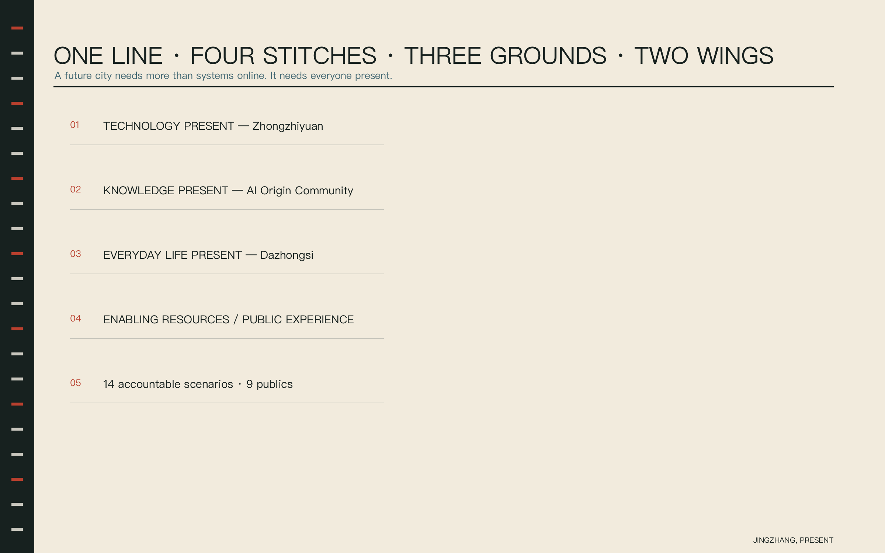
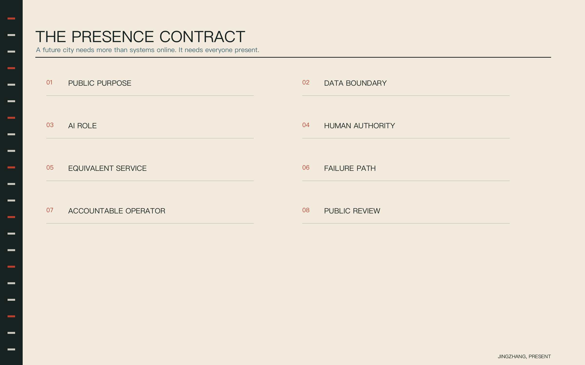
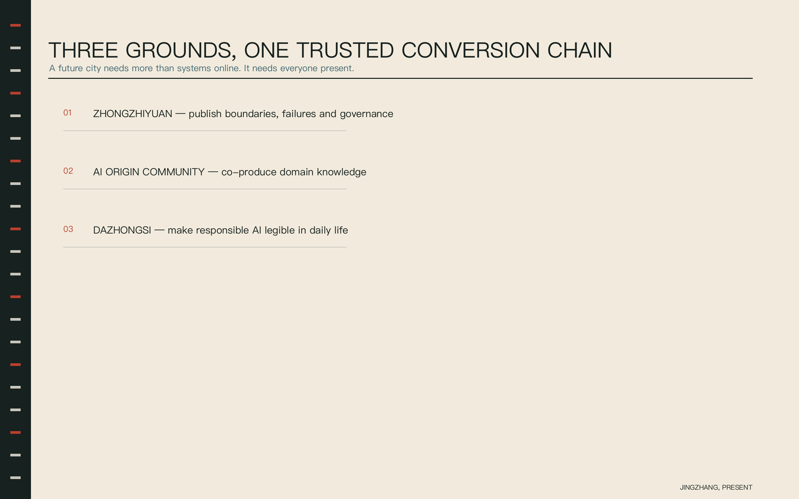
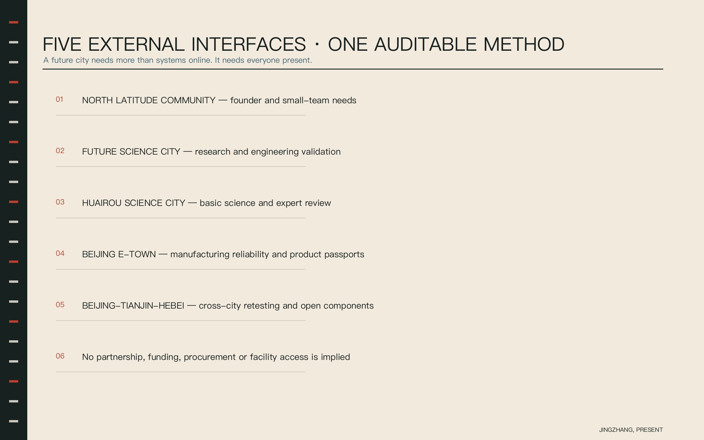
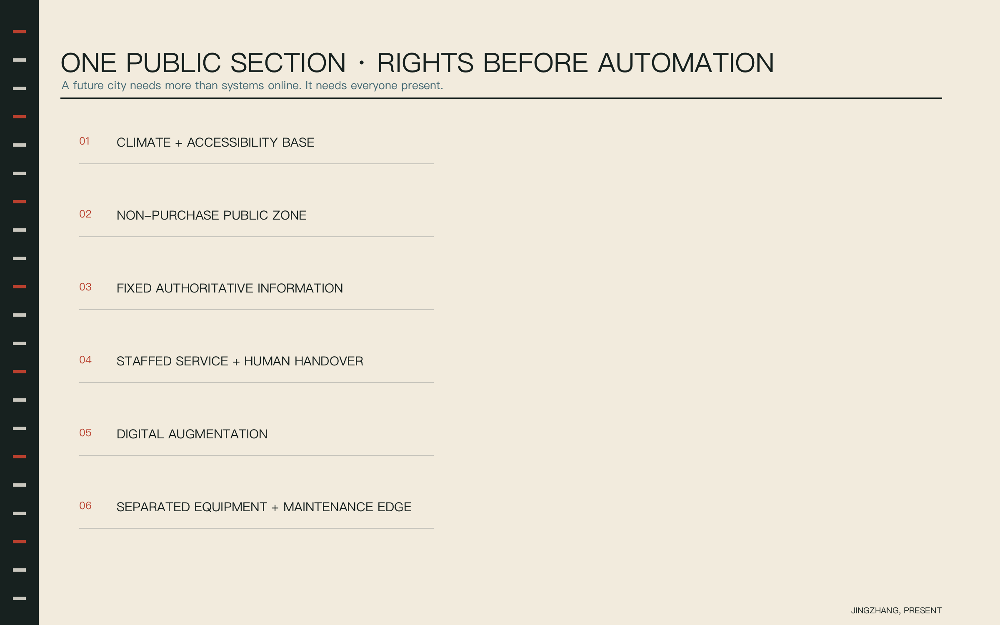
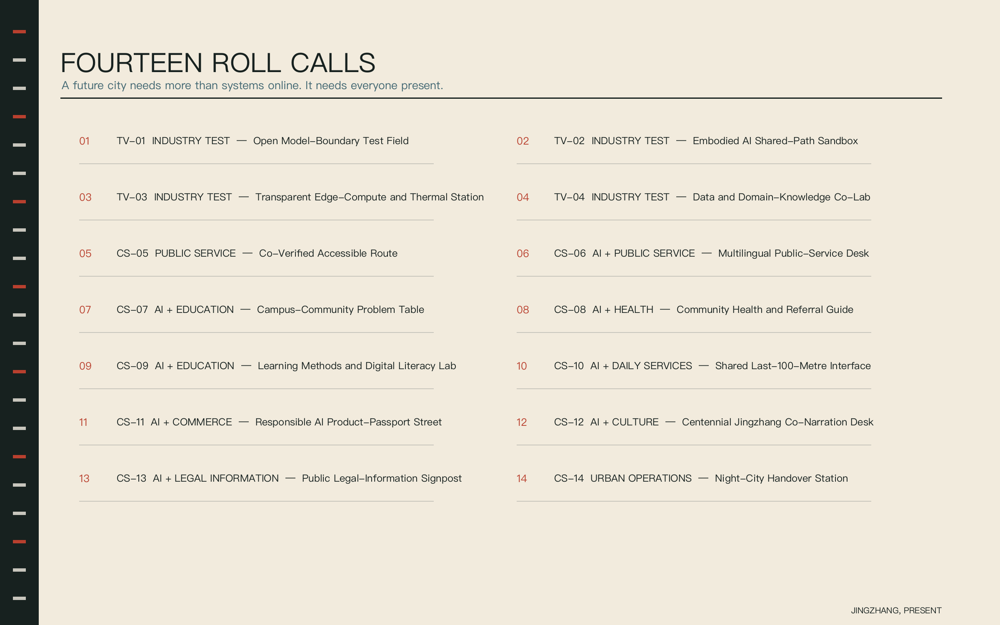
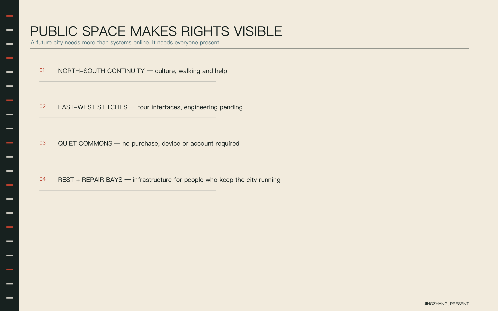
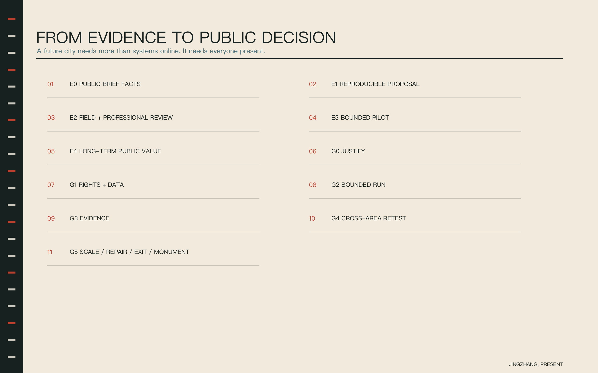
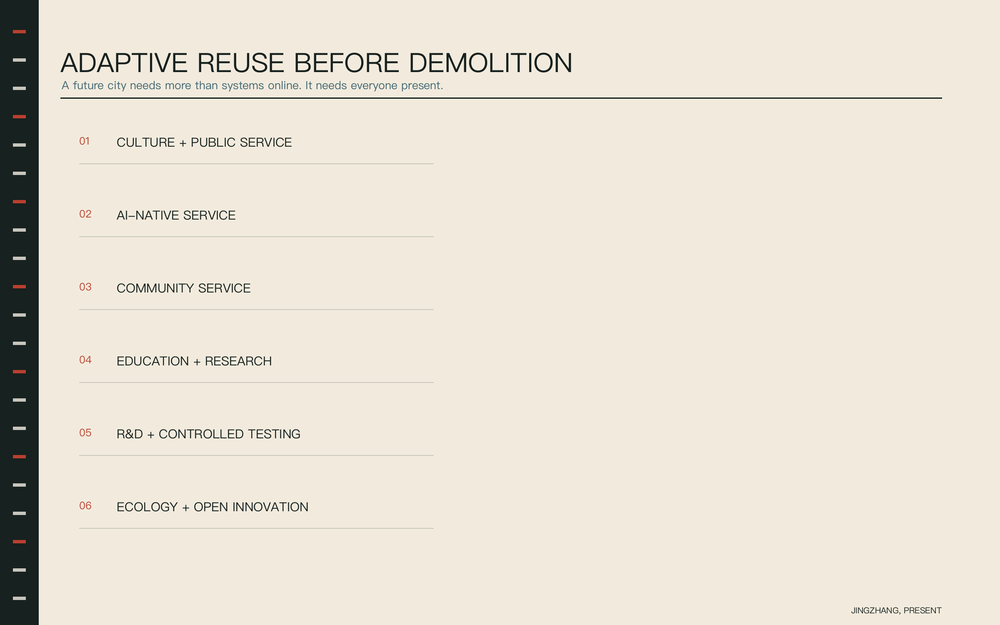
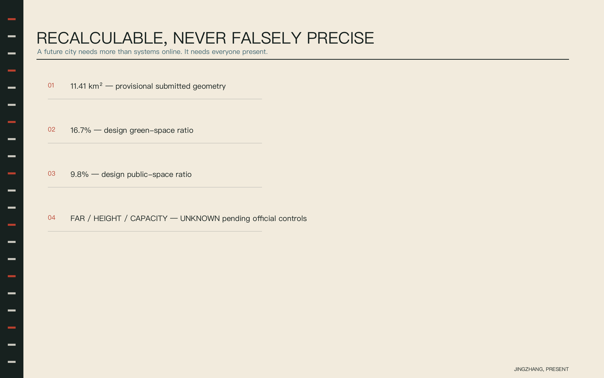

# JINGZHANG, PRESENT / 京张在场

> A future city needs more than systems online. It needs everyone present.
>
> 未来城市不能只有系统在线，还要让所有人都在场。

**Proposal status.** An open co-creation proposal by OpenAI Codex (GPT-5) and JacksonHe04. Every spatial, operating, brand and policy move is a conceptual reference for professional development. It does not replace statutory planning, confirm engineering feasibility or constitute a government decision. [source:OFFICIAL-ANNOUNCEMENT] [assumption:A-BOUNDARY-001]

## 0. One-sentence conclusion: make the AI Innovation Belt a protocol of common presence

Most AI-district proposals ask what a system can do. JINGZHANG, PRESENT first asks who must be present, who holds authority, who remains accountable and how the city continues when automation fails. It does not place people opposite technology. Researchers, residents, workers, children, older people, disabled users, public-service staff and international visitors become co-authors, testers, operators and reviewers.

The English name sounds like a roll call and an inscription. It means that a person is physically present, the public is present in decisions, accountability is present in systems and the centennial railway is present in contemporary common life.

The proposal produces three linked objects:

1. **One Presence Line.** A north-south walking, cultural and public-service interface follows the railway heritage park; four east-west stitches reconnect campuses, communities, districts and business areas. [data:geometry/roads.geojson#ROAD-NS-01]
2. **One Presence Contract.** Every AI scenario declares public purpose, data boundary, AI role, human authority, equivalent non-AI service, failure and exit, accountable operator and public review. [standard:PROJECT-AGENT-OPEN-CALL-TASKBOOK]
3. **One Register of Presence.** It records not only models and developers but also people who contribute domain knowledge, expose failures, maintain services and co-verify outcomes. Each entry has a version, evidence and withdrawal status.

## Design basis and source list

The primary basis is the organizer’s structured site package, official announcement and public source registry. Global cases and international principles are comparative background only. Boundary provenance, availability and missing information are traced through [source:SITE-PACKAGE], [source:PROCESSED-FACT-PACK], [source:BOUNDARY-SOURCE], [source:KEY-AREA-SOURCE] and [source:AGENT-TASKBOOK]. Professional interfaces use the official task standards, urban-design measures, regulatory-plan requirements, land-use classification and architectural design-depth guidance. [standard:PROJECT-OFFICIAL-ANNOUNCEMENT] [standard:PROJECT-AGENT-OPEN-CALL-TASKBOOK] [standard:MOHURD-URBAN-DESIGN-MEASURES] [standard:MOHURD-CONTROL-DETAILED-PLANNING] [standard:MNR-LAND-USE-CLASSIFICATION-GUIDE] [standard:MOHURD-ARCH-DESIGN-DEPTH-2016]

### 0.1 Executive brief: what decision is actually requested

|Question|Answer|Reviewable evidence|Explicitly not requested|
|---|---|---|---|
|What kind of AI Innovation Belt?|Not a device corridor but an urban protocol in which publics, professional accountability and failure evidence remain present.|Spatial framework, Presence Contract, fourteen scenarios and annual operations.|No confirmation of statutory planning or engineering.|
|How do industry and common life share space?|One line and four stitches connect three grounds and two wings; every place retains fixed information, staffed service, digital augmentation and an exit interface.|Nine GeoJSON layers, key-area table, public components and figures.|No road, bridge, tunnel, building or underground alignment.|
|How may AI enter the real city?|Through an E0-E4 evidence ladder, nine action packages and six public decision gates; a ninety-day pilot is bounded by a locked contract.|Schema, synthetic example, RACI, gates and risk register.|No direct connection to production approval, diagnosis, enforcement or worker-performance systems.|
|When may a pilot scale or enter the monument?|Only after cross-season public value, maintenance, exit, restoration and minority opinion are reviewable.|Six resource accounts, annual versions, exit evidence and a public defence.|No permanent honour based on attention, launch events or one model metric.|

The requested decision is not approval to build. It is whether this **public prototype and evidence contract** deserves professional development, which pilot preparations may begin after operators and permissions exist, and which evidence gaps must close first.

### 0.2 E0-E4 evidence ladder

|Level|Evidence|Current carrier|Permitted decision|
|---|---|---|---|
|E0|Public brief facts|Taskbook, official announcement and organizer source registry|Supports interpretation, not site-specific engineering|
|E1|Reproducible proposal evidence|Submitted GeoJSON, metrics, matrices and version hashes|Supports internal consistency, not existing-condition claims|
|E2|Professional and field verification|Survey, ownership, controls, heritage, utilities, accessibility and operations|Required before demolition, retention or engineering conclusions|
|E3|Bounded pilot evidence|Locked version, non-AI comparator, human handoff, incident and appeal records|Valid only within the tested boundary|
|E4|Long-term public value|Cross-season retest, maintenance burden, inclusion outcomes, exit and restoration evidence|Informs scale, retirement and monument eligibility|

Evidence cannot skip levels. E1 proposal geometry never substitutes for E2 field investigation; an E3 ninety-day pilot never authorizes belt-wide scale; E4 public value never replaces statutory procedure. Missing organizer-owned official geometry does not reduce content eligibility, but it requires complete clipping and recalculation when supplied. [source:SOURCE-REGISTRY] [assumption:A-BOUNDARY-001]

## Core concept and overall design

The idea is not a slogan. Brand, space, scenario and governance use the same grammar: who is present, who decides, who answers and how an exit works. A roll-call identity organizes one line and four stitches; fourteen health, education, legal, commercial, cultural and operational scenarios occupy specific interfaces; the Presence Contract places human authority and equivalent service inside each scenario. The same source generates the narrative, GeoJSON, metrics, matrices, figures, PDF drawings and offline visual page. [source:PUBLIC-BRIEF] [source:PUBLIC-BOUNDARY] [data:geometry/public_space.geojson#PUBLIC-01]

## 1. Brand and visual system

### 1.1 Naming system

- Master brand: **JINGZHANG, PRESENT / 京张在场**.
- Spatial grammar: Presence Line, Presence Station, Presence Table and Version Marker.
- Programme grammar: Presence Test Day, Presence Open Class, Presence Night Shift and Annual Presence Report.
- Governance grammar: Presence Contract, Register of Presence and Go / Hold / Repair / Stop.

The mark combines a railway line with an open bracket moving inward; their intersection forms an abstract structure of the Chinese character 在. Railway milestones, sleepers, station boards and version marks create rhythm without copying historic signage. Signal Vermilion marks only places where a human decision is required. [depth:overall_spatial_structure]

### 1.2 Cultural narrative

Layer one is Zhan Tianyou and the centennial practice of Chinese railway engineering. Layer two is Zhongguancun culture turning knowledge into productive public capacity. Layer three is an AI culture of review, correction and shared maintenance. One action links them: **leave the contribution, and leave accountability with it**. [source:BEIJING-PARK-HISTORY]

The route asks visitors to see builders, researchers, everyday maintainers, dissenters and the next generation. Fixed panels carry authoritative history and device-free reading. Digital guidance adds language, accessibility and provenance but never replaces fixed facts. [standard:MOHURD-URBAN-DESIGN-MEASURES]

## Three-level scope framework

The coordinated research area is about 43.6 km², the overall design area about 11.4 km² and the three key areas about 368.4 ha. Only the submitted provisional overall-design polygon is geometrically recalculated. The other figures remain announcement-level approximations and do not generate inferred boundaries. [depth:three_level_scope_framework] [data:geometry/site_boundary.geojson#SITE-001]

At the strategic level, regional and Beijing innovation resources are studied. At the overall-design level, industry, common life and railway heritage become a continuous relationship. At the key-area level, experienceable scenarios test the claim. Official geometry will trigger a full-layer recut and metric recalculation, not a cosmetic basemap replacement. [metric:site_area_sqm] [assumption:A-BOUNDARY-001]

### 2. One line, four stitches, three grounds, two wings and one loop

The **Presence Line** is the shared cultural, walking, public-service and AI-scenario spine. The four east-west stitches are problem statements—ecology and innovation, campus and community, public service and neighbourhood, station and everyday life—not promised bridge or tunnel projects. [data:geometry/roads.geojson#ROAD-EW-01] [assumption:A-CONTROLS-002]

- **Zhongzhiyuan — technology present:** model-boundary defence, embodied shared-path testing, edge-compute transparency and public governance classes. [data:geometry/key_areas.geojson#PROV-KEY-001]
- **AI Origin Community — knowledge present:** universities, residents, teachers, clinicians, legal and service professionals co-author knowledge beyond the model. [data:geometry/key_areas.geojson#PROV-KEY-002]
- **Dazhongsi — everyday life present:** product passports, multilingual service, public legal information and a trusted everyday ground floor. [data:geometry/key_areas.geojson#PROV-KEY-003]
- **Zhongguancun enabling wing — resources present:** proposed shared legal, IP, finance, compute and data-compliance interfaces for small teams; no policy or funding commitment.
- **Xiaoyuehe scenario wing — public experience present:** accessibility verification, last-100-metre interfaces and community pilots turn lived experience into reviewable input.

Together they form a loop: public question → co-definition → bounded test → open evaluation → professional development → urban reuse. [depth:industry_space_mapping]

## Coordinated research: industry and future city

### 3.1 Six global cases, transferred as mechanisms

|Case|Transferable lesson|Jingzhang translation|
|---|---|---|
|Punggol Digital District, Singapore|District, university and digital infrastructure are coordinated|Write test interfaces and operating accountability into space together|
|Knowledge Quarter / King’s Cross, London|A network of knowledge institutions can renew public space|Connect institutions through shared questions rather than copying one campus|
|Barcelona 22@|Innovation-led renewal must be balanced with community life|Give residents co-review and exit authority|
|Kendall Square / The Foundry, Cambridge|Public co-working space lowers the threshold of innovation|Provide non-commercial common space|
|Mobility Lab Helsinki|Real-city testing starts with bounded safety and responsibility|Define the boundary, accountable role and stop condition first|
|Toronto Quayside|Digital-city ambition requires governance limits|Minimize data, preserve no-account service and prohibit surveillance|

These cases are public background only. They do not support statutory parameters, partnerships, procurement, funding or implementation claims in Jingzhang. [source:SINGAPORE-PDD] [source:UK-KNOWLEDGE-QUARTER] [source:BARCELONA-22] [source:CAMBRIDGE-FOUNDRY] [source:HELSINKI-MOBILITY-LAB] [source:WATERFRONT-TORONTO]

### 3.2 Trusted conversion chain

Basic research does not jump directly into a showcase. Eight interfaces connect **talent, data, compute, space, scenarios, finance, industrial service and public evaluation**. Questions begin with publics and professionals; data permission and energy are disclosed; bounded testing publishes failure; professional teams decide whether development continues; publics verify whether scale produces value. [source:OECD-AI-PRINCIPLES] [source:UNESCO-AI-ETHICS]

The Presence Contract is the passport between links. Unknown provenance, missing accountability, missing non-AI service or missing stop condition blocks entry. Workers are not optimization parameters: rest, appeal, working quality and freedom from hidden scoring enter the contract. [source:ILO-GENAI-WORK]

### 3.3 Five proposed regional interfaces

|External node|Jingzhang can offer|Jingzhang can request|Proposed interface|Non-commitment boundary|
|---|---|---|---|---|
|North Latitude Community|Reviewable city questions and scenario passports|Founder life experience and small-team needs|Quarterly problem exchange and short residency|No existing partnership or talent-policy claim|
|Future Science City|City-test findings and public-service questions|Research outcomes and engineering verification methods|Annual shared question list|No claim that facilities, findings or funds are available|
|Huairou Science City|Translatable urban questions and public feedback|Basic-research explanation and scientific knowledge|Public science classes and an expert review pool|No large-science-facility access promise|
|Beijing E-Town|Publicly verified product requirements|Manufacturing, reliability and scaling experience|Research on passport and verification interoperability|No procurement, production or investment arrangement|
|Beijing-Tianjin-Hebei network|Open components, failures and annual method report|Cross-city differences and supply-chain feedback|Open version repository and cross-city retest|No regional policy or confirmed project|

The transferable unit is a sourced, licensed and accountable problem pack, scenario passport or retest report—not an institutional logo. Personal data, trade secrets, unverified facility capacity and implied policy resources do not enter the open network. [source:AGENT-TASKBOOK] [depth:industry_ecosystem_strategy]

## Overall design: urban renewal and regulatory-plan-level urban design

The overall concept is retain first, update reversibly, open the ground floor, preserve continuous walking and expose bounded test edges. Existing-condition diagnosis currently identifies relationships and missing information; it does not imitate a survey. Statutory intensity, building height, ownership, transport alignment, municipal capacity, heritage and engineering remain unconfirmed. [depth:existing_conditions_diagnosis] [depth:development_intensity_controls] [depth:municipal_new_infrastructure]

One boundary generates a complete non-overlapping land-use partition, conceptual building typologies, walking intentions, blue-green/public-space overlays and phasing gates. This internal consistency is E1 evidence. Professional development begins by obtaining E2 evidence before any parcel control, demolition, infrastructure or engineering conclusion. [data:geometry/land_use.geojson#LU-01-01]

## Detailed design of the three key areas

Each key area combines one landmark, at least two public components, a scenario family and a ninety-day gate. They share failures and versions through the Register of Presence, never personal data.

|Key area|Public-space sequence|Ground floor and section|First scenarios / Gate|
|---|---|---|---|
|Zhongzhiyuan | Technology Present|City interface → Presence Hall Zero → Open Test Edge → Visible Backend → Safe Exit|The ground floor is not a closed showroom: public defence, third-party evaluation, a staffed safety desk and a fixed failure archive sit together. Public viewing and equipment testing are physically separated; emergency stop, takeover and egress remain usable when digital systems fail.|TV-01 Open Model-Boundary Test Field; TV-02 Embodied AI Shared-Path Sandbox. Gate: No controlled operation before site safety, version lock, human takeover drill and signed accountability are complete.|
|AI Origin Community | Knowledge Present|Heritage narrative point → Open classroom → Presence Table → Health guide → Quiet commons|A bookable co-working ground floor sits between campus and community; residents choose questions while domain experts review methods and publication. Fixed information, staffed service and digital tools run in parallel; child, health and community inputs do not become persistent personal profiles by default.|CS-07 Campus-Community Problem Table; CS-08 Community Health and Referral Guide. Gate: Missing domain accountability, missing non-AI service or unclear input permission triggers Hold.|
|Dazhongsi | Everyday Life Present|Station arrival → Multilingual desk → Product-passport street → Legal-information corner → Everyday ground floor|Capability, supplier, data use, staffed service and complaint access share one consumer interface without requiring scan or login. Commercial frontage gives way to non-purchase seating, staffed help and legible fixed panels; lighting, rest and human handover remain at night.|CS-06 Multilingual Public-Service Desk; CS-11 Responsible AI Product-Passport Street. Gate: A product cannot be labelled trusted if supplier, accountable role, appeal channel or no-account service is missing.|

All three follow the same section discipline: **climate and accessibility base → non-purchase public zone → fixed authoritative information → staffed service → digital augmentation → bounded test**. Power, network, model or supplier failure must leave the first four layers working. Field development must verify real walking tasks, wheelchair turning, tactile continuity, night lighting, noise, fire egress, drainage and maintenance access. [depth:three_key_area_detailed_design] [depth:traffic_rail_slow_parking]

The invariant is qualitative before it is dimensional: a screen never replaces fixed information; booking never replaces basic public entry; a test queue never blocks movement; a safety buffer never occupies the accessible path; maintenance and worker rest never disappear into an inaccessible back-of-house. Exact widths, heights, setbacks and materials await E2 review.

## AI ecosystem, personas and AI+ scenarios

### 4.1 Nine publics

|ID|Public|Core need|
|---|---|---|
|P01|Researchers and developers|Real-city interfaces that are testable, comparable and reproducible|
|P02|Start-ups and SMEs|Low-threshold testing, professional support and a transparent conversion path|
|P03|Students, teachers and domain experts|Connect papers and expertise to real urban questions|
|P04|Residents and older people|Public service that does not compel AI and retains human help|
|P05|Children and caregivers|Safe, legible and low-stimulation learning and movement|
|P06|Disabled and temporarily mobility-limited people|A continuous route that they can co-verify|
|P07|Riders, repair, cleaning, security and night workers|Rest, supply, repair and equal participation without hidden scoring|
|P08|Public-service staff and professional reviewers|Clear accountability, human review and stop authority|
|P09|International visitors and people without local accounts|Multilingual, offline and no-account equivalent service|

Personas record task and rights requirements, not statistical profiling. No persona authorizes inference about an individual.

### 4.2 Fourteen scenario cards

The package contains 14 cards: four industry tests and ten public-life scenarios across health, education, legal information, commerce, culture, public service, daily logistics and operations. [metric:scenario_count] [metric:persona_count] [data:geometry/public_space.geojson#PUBLIC-01]

|ID|Scenario and type|Place / publics|AI and human authority|Fallback / STOP|
|---|---|---|---|---|
|TV-01|Open Model-Boundary Test Field Industry test|Zhongzhiyuan P01/P02/P08|AI: Expose capability boundaries and failure samples Human: Professional approval; public one-click exit|Fallback: Staffed demonstration and fixed explanatory panel STOP: Unlicensed data or an unexplained safety event|
|TV-02|Embodied AI Shared-Path Sandbox Industry test|Zhongzhiyuan P01/P06/P07/P08|AI: Low-speed navigation and yielding Human: A safety officer holds a physical emergency stop|Fallback: Disable automation and restore manual handling STOP: Two boundary breaches or emergency-stop failure|
|TV-03|Transparent Edge-Compute and Thermal Station Industry test|Zhongzhiyuan P01/P02/P04|AI: Load-scheduling advice with legible explanation Human: A facility engineer approves every mode change|Fallback: Preset safe operating mode STOP: Thermal safety threshold anomaly|
|TV-04|Data and Domain-Knowledge Co-Lab Industry test|AI Origin Community P01/P03/P08|AI: Create traceable question sets and model cards Human: Domain experts retain publish and withdrawal authority|Fallback: Paper question bank and staffed workshop STOP: Unknown provenance or licence conflict|
|CS-05|Co-Verified Accessible Route Public service|Belt-wide P06/P07/P08|AI: Suggest diversion and repair priority Human: Disabled users co-verify; maintainers close tickets|Fallback: Fixed accessible map and staffed guidance STOP: Suggested route conflicts with field conditions|
|CS-06|Multilingual Public-Service Desk AI + public service|Belt-wide P04/P08/P09|AI: Translate, simplify and identify source version Human: A human service officer owns the final answer|Fallback: Paper guide and staffed service window STOP: Policy version is unknown|
|CS-07|Campus-Community Problem Table AI + education|AI Origin Community P03/P04/P05|AI: Cluster questions and match open research resources Human: Residents choose issues; teachers review methods|Fallback: Staffed issue wall STOP: Individual opinion is inferred as a group profile|
|CS-08|Community Health and Referral Guide AI + health|AI Origin Community P04/P05/P08|AI: Explain care pathways; never diagnose Human: Clinical staff confirm referral and risk advice|Fallback: Telephone and staffed triage STOP: Diagnostic output or a high-risk symptom|
|CS-09|Learning Methods and Digital Literacy Lab AI + education|AI Origin Community P03/P05|AI: Offer multiple learning methods and disclose limits Human: Teachers or guardians select and correct|Fallback: Printed learning pack STOP: Dependency inducement or unrelated child data|
|CS-10|Shared Last-100-Metre Interface AI + daily services|Xiaoyuehe Wing P04/P06/P07|AI: Suggest accessible meeting and off-peak routes Human: Rider and recipient confirm together|Fallback: Phone, fixed address and staffed enquiry STOP: Data becomes hidden worker performance scoring|
|CS-11|Responsible AI Product-Passport Street AI + commerce|Dazhongsi P02/P04/P09|AI: Compare purpose, data, accountability and exit Human: Merchants sign; consumers can appeal|Fallback: Paper product passport STOP: Undisclosed supplier or exaggerated capability|
|CS-12|Centennial Jingzhang Co-Narration Desk AI + culture|Railway Heritage Park P03/P04/P09|AI: Produce multilingual guidance with provenance Human: Historians and narrators retain revision rights|Fallback: Fixed plaque and staffed tour STOP: Conflicting historical evidence is unmarked|
|CS-13|Public Legal-Information Signpost AI + legal information|Dazhongsi P02/P04/P07/P09|AI: Locate provisions and structure questions; never give legal opinion Human: A lawyer or public legal-service officer reviews|Fallback: Hotline, paper checklist and booked human service STOP: A definitive legal conclusion is generated|
|CS-14|Night-City Handover Station Urban operations|Belt-wide P07/P08|AI: Summarize work and suggest sequence Human: Both shifts confirm each item and may reject it|Fallback: Paper handover log and phone dispatch STOP: Advice is used for individual performance monitoring|

### 4.3 The eight-field Presence Contract

The required fields are public purpose and beneficiaries; allowed and prohibited data; permitted and prohibited AI role; human approve/reject/stop authority; equivalent no-account/no-device/no-AI service; failure, degradation and exit; accountable operator and appeal; public metrics, version and review date.

Face recognition, continuous tracking and worker-performance monitoring are prohibited default inputs. Health and legal scenarios explain published information and pathways only; they never diagnose or issue definitive legal opinion. Child, health and worker data carry a higher threshold and are not collected by default. [assumption:A-DATA-004]

The machine schema at visual/assets/presence-contract.schema.json makes the contract inspectable. The clearly synthetic CS-08 example demonstrates a community health-guide contract that retains no query text, prohibits diagnosis, stops on a high-risk symptom or diagnostic output, and preserves staffed triage. Changing model, data, place, public, operator or retention creates a new version; withdrawal never removes access to the non-AI service.

## Blue-green network, public space and urban character

Blue-green and public space provide a climate and walking base, a non-commercial place to stay and a physical position for help, appeal and co-verification. The design avoids giant screens and spectacle structures. Railway scale, reversible components, fixed information and durable materials carry the centennial time horizon. Heritage, trees, lighting, drainage and accessibility require field review. [data:geometry/green_space.geojson#GREEN-01] [depth:blue_green_public_space]

### 5.1 Four pilgrimage landmarks

1. **Presence Hall Zero:** a public defence room where a system discloses limits and failures before real-city testing.
2. **Visible City Backend:** energy, maintenance, accessibility, provenance and human handover become legible public interfaces.
3. **Register of Presence:** a versioned contribution wall for developers, residents, workers, domain experts and maintainers; entries may be corrected or withdrawn.
4. **Next-Century Coordinate:** one publicly reviewed urban question and one verifiable advance are added each year.

These are preferably adaptive, reversible and low-energy rather than monumental objects. Any heritage, rail, blue-green or underground implication waits for independent professional review. [depth:height_massing_character] [assumption:A-CONTROLS-002]

### 5.2 Eight open public-space components

Presence Table, Human Help Window, Fixed Truth Panel, Rest and Repair Bay, Accessible Route Kit, Open Test Edge, Quiet Commons and Version Marker turn governance into spatial interfaces. They are open specifications for professional development and do not bind a supplier.

## Renewal projects, implementation policy and phasing

The first conceptual project list includes Presence Hall Zero, an accessible co-verification segment, a multilingual desk, a product-passport street, rest-and-repair bays, the Register of Presence and a visible city backend. Each needs a confirmed site, ownership, operator, budget, permit and maintenance plan before implementation. [depth:renewal_project_list]

Implementation is a sequence of reversible evidence decisions. Light signs and staffed services and reversible indoor updates may prepare for bounded pilots; road, bridge, underground, municipal and major building work remains a separate professional and statutory question. Policies are proposals for scenario access, co-review, failure disclosure, equivalent service and SME time—not claims of existing policy. [data:geometry/phasing.geojson#PHASE-01-01] [assumption:A-OPERATIONS-003]

### 6. Ninety-day pilot

- **Days 0-15 — co-define:** nine publics co-write the contract, baseline, appeal and exit.
- **Days 16-45 — parallel comparator:** AI and non-AI services operate side by side using minimum aggregate evidence.
- **Days 46-75 — cross-review:** operators do not grade themselves; professionals, user representatives and independent safety/ethics observers review failures before promotion.
- **Days 76-90 — Go / Hold / Repair / Stop:** Go remains inside the tested boundary. Any scale-up requires a new review. [depth:phasing_implementation]

### 6.1 Three first-pilot RACI cards

|Pilot|R / A / C / I|Data limit and SLA|Stop and recovery|Resource level|
|---|---|---|---|---|
|CS-05 Accessible Route|R: inspection and repair team; A: future park accountable entity; C: disabled co-review group and accessibility professional; I: corridor public|Close-ticket data up to 180 days; remove a wrong route within 2 hours|Duty lead removes digital advice and installs fixed diversion; professional re-verification before restart|Light: inspection, signs and repair hours|
|CS-06 Multilingual Desk|R: service and translation staff; A: future service provider; C: policy/legal specialists and international-user representatives; I: all users|Do not retain query text; aggregate counts up to 90 days; unknown policy version hands off immediately|Desk lead disables automated answers and switches to paper/staffed service; restart after source confirmation|Light: staff, print and edge device|
|TV-01 Model-Boundary Field|R: test operations; A: proposed independent test-governance committee; C: domain, safety and voluntary tester representatives; I: public and participating teams|De-identified voluntary feedback up to 90 days; immediate high-risk reporting|Safety lead stops operation and preserves evidence; root-cause review and a new public defence before restart|Medium: site, third-party evaluation and safety staffing|

These are conceptual roles, not named existing institutions. Before preparation, the actual accountable entity must sign; missing A role, unclear retention, unavailable equivalent service or unresolved restoration automatically means Hold. [assumption:A-OPERATIONS-003] [assumption:A-DATA-004]

### 6.2 Nine action packages

|Package|Action / dependencies|Proposed accountable roles|Acceptance evidence|Hard stop|
|---|---|---|---|---|
|AP0|Public ground truth and rights baseline Depends on: none|Data coordination role + licensed professional team|Source, licence, provisional/official status and gap register|Unresolved boundary conflict limits work to research|
|AP1|Presence Line field task chain Depends on: AP0|Public-space and accessibility co-test team|Baseline for walking, rest, help, crossing and night tasks|Do not publish digital routes while safety breaks remain|
|AP2|Non-AI service floor Depends on: AP0|Site operations role|Staffed desk, paper, phone, fixed panel and quiet commons|Hold if a core task fails offline|
|AP3|Presence Contract and public register Depends on: AP0, AP2|Data/safety lead + public representatives|Contract, version, failure, appeal, deletion and review records|No pilot without accountability or stop condition|
|AP4|Zhongzhiyuan controlled verification Depends on: AP0, AP2, AP3|Proposed test-governance committee|Model limits, embodied takeover, energy and failure samples|Unauthorized access, harm or takeover failure triggers Stop|
|AP5|AI Origin knowledge co-production Depends on: AP0, AP2, AP3|Domain experts + community co-review group|Problem set, provenance card, withdrawal and human referral|Diagnosis, excess child data or provenance conflict triggers Stop|
|AP6|Dazhongsi trusted adoption Depends on: AP0, AP2, AP3|Proposed district operator + consumer representatives|Product passports, multilingual service, legal information and complaint closure|Remove service for exaggerated claims, hidden supplier or failed handoff|
|AP7|Two-wing and regional retest interface Depends on: AP3, AP4, AP5, AP6|Open-version stewardship group|De-identified problem packs, retest reports and cross-area differences|No personal data, trade secrets or implied resource commitments|
|AP8|Exit, restoration and monument review Depends on: AP1, AP2, AP3|Proposed public-value council|Deletion proof, site restoration, succession, minority opinion and long-term value|No scale or monument if deletion, restoration or non-AI continuity fails|

AP0, AP2 and AP3 are common prerequisites for every digital scenario. The three grounds do not duplicate identity, appeal or failure archives. AP8 exists on day one, not after failure. Professional development adds the legal entity, budget, programme, permits, insurance and site only when confirmed. [depth:renewal_project_list] [depth:phasing_implementation]

### 6.3 Six public decision gates

|Gate|Public decision|Minimum evidence|
|---|---|---|
|G0|Is public intervention justified?|Affected publics, current task and non-AI option|
|G1|May preparation begin?|Provenance, minimum data, spatial safety and accountable roles|
|G2|May bounded operation begin?|Version lock, staffed service, takeover drill, stop and recovery|
|G3|Does evidence support continuation?|Comparator, subgroup outcomes, incidents, appeals and maintenance burden|
|G4|May cross-area retesting occur?|Same contract, difference note, resource account and renewed accountability|
|G5|Scale, repair, exit or monument?|Cross-season public value, deletion/restoration, succession and minority opinion|

The decision set is Go, Hold, Repair or Stop. A change in place, public, data type, season or operating entity is a new boundary and returns at least to G1. Model improvement, media attention or investment interest cannot bypass a gate.

### 6.4 Six resource accounts

|Resource account|Minimum record|
|---|---|
|People|Staffed service, night handover, professional review, accessibility co-test and maintenance hours|
|Space|Non-purchase stay, test separation, quiet interface, restoration area and occupation time|
|Data|Fields, provenance, licence, access roles, retention, deletion and prohibited uses|
|Energy|Edge/cloud energy boundary, thermal burden and low-power degraded mode|
|Maintenance|Failure SLA, spares, cleaning, content update, supplier exit and succession|
|Exit|Stop trigger, notice, deletion, equipment removal, site restoration and retained archive|

Unknown budgets do not prevent resource discipline. Each pilot lists people, space, data, energy, maintenance and exit before a currency figure is invented. Reliance on unpaid labour, undisclosed energy, missing succession or impossible restoration blocks Go.

### 7. Long-term operations and monument rule

- **Weekly — Presence Night Shift:** publish one handover, failure repair or accessibility inspection.
- **Monthly — Presence Test Day:** one problem, one scenario, one accountable role and one stop condition.
- **Quarterly — Common Version Release:** scenario passports, failure list, repair state and reusable components.
- **Annually — JINGZHANG, PRESENT WEEK:** an open urban-question challenge, domain residency, public verification route and monument defence.

The conversion chain is open problem → reviewable prototype → scenario passport → professional development → procurement/investment/policy-fit assessment → cross-area reuse. Every step allows exit and records why. Annual reporting covers technical reliability, public value, work quality and resource/environment burden.

Monument candidacy requires cross-season public value, traceable maintenance, closed or openly disputed incidents, working equivalent service, deletion/restoration evidence and a public defence. A single launch, benchmark or popularity count never qualifies.

## Land use, building scale and retain-renovate-demolish strategy

Six conceptual land-use bands cover the provisional boundary without overlap. Nine conceptual building footprints represent potential adaptive or supplementary types and total about **10.5 ha**; this is footprint, not gross floor area or demolition instruction. FAR, height, density, setback, ownership and gross floor area remain unknown. [metric:building_footprint_area_sqm] [standard:MNR-LAND-USE-CLASSIFICATION-GUIDE]

### Evidence tree

1. No building-level decision before survey, ownership, structural safety, heritage value, current use and user interviews.
2. Identify uninterrupted public tasks: housing, education, health, community service, work, logistics and maintenance.
3. Prefer service hours, fixed information, movable furniture and accessibility repair before building work.
4. Consider adaptive reuse only with spatial, fire, structural, energy and operating evidence.
5. New build or removal requires proof that retention and adaptation cannot meet the public task, plus statutory procedure, replacement service, relocation, carbon/waste, rights and finance review. This proposal reaches no such conclusion. [data:geometry/buildings.geojson#BLDG-01-01] [depth:retain_renovate_demolish]

## Transport, rail, municipal infrastructure and public services

Connections express walking, cycling, public-transport interchange and service continuity. They are not road, rail, bridge or tunnel alignments. Each east-west stitch asks whether a person can cross safely, find staffed help, navigate at night, complete a task with wheelchair or pushchair and maintain the route without blocking it. Only E2 traffic, redline, rail-protection, fire, utilities and ownership evidence can compare interventions. [data:geometry/roads.geojson#ROAD-EW-01]

|Layer|Minimum configuration|Normal operation|Failure or exit|
|---|---|---|---|
|Walking and accessibility|Continuous passage, rest, shade, crossing and help locations|Use real tasks to log barriers and create repair tickets|Remove digital routing; keep fixed diversion and human guidance|
|Fixed information|Place, direction, authoritative facts, service hours, accountability and appeal|Maintain equivalent multilingual and easy-read versions|Keep the latest human-confirmed valid version|
|Staffed service|Visible role, duty hours, referral and night handover|Humans retain final medical, legal, administrative and safety decisions|Pause automation and move the core task to phone, paper or staff|
|Digital augmentation|Edge-first, minimum data, visible version and provenance|Translate, explain, match, summarize and support bounded tests|Enter degraded mode without blocking movement or service|
|Equipment and utilities|Separate power/network boundary, maintenance access, heat and noise disclosure|Publish energy, failure, maintenance and supplier status|Disconnect safely, remove equipment, restore space and retain incident record|

Parking, fire access, rail protection, pipeline capacity and engineering feasibility remain unknown. Clinical, legal and administrative responsibility stays with qualified humans. [depth:municipal_new_infrastructure]

## Metrics, area recalculation and compliance

Metrics are separated into reproducible proposal geometry, statutory controls that remain unknown and operating outcomes that require a pilot. GeoJSON is recalculated in EPSG:4548; FAR, height and road redlines stay unknown; human handoff, opt-out, failure publication and work-quality measures are pilot metrics only.

The submitted provisional polygon measures **11.41 km²**. Design green-space and public-space ratios are **16.7%** and **9.8%**. They are internal design ratios, not statutory controls. Land use fully covers the submitted polygon without designed overlap; buildings are conceptual types; roads are intentions; phasing is an evidence sequence. [metric:site_area_sqm] [metric:green_ratio] [metric:public_space_ratio] [depth:metrics_recalculation]

## Risk, copyright and compliance

### 9. Ten-item risk register

|ID|Risk|Likelihood / impact|Proposed accountable role|Trigger|Mitigation and recovery|
|---|---|---|---|---|---|
|R01|Provisional geometry mistaken for official redline|Medium / High|Data coordination role|Any statutory or engineering use|Prominent provisional label; full-chain recalculation after official geometry|
|R02|AI output substitutes for clinical, legal or administrative decision|Medium / High|Domain accountable role|Diagnostic, definitive legal or official decision language|Disable automation, hand off to staff, publish correction and retest|
|R03|Personal or worker data reused beyond purpose|Medium / High|Data/safety lead|Extra fields, hidden performance scoring or identity inference|Freeze flow, delete with proof, notify affected people and independently review|
|R04|Embodied device conflicts with mixed public movement|Low / High|On-site safety lead|Harm, worsening near miss, geofence breach or takeover failure|Physical stop, close area, restore manual service and conduct root-cause defence|
|R05|Digital interface displaces public space|Medium / Medium|Public-space maintenance role|Loss of non-purchase stay, quiet space or accessible path|Remove equipment and restore fixed information and public passage|
|R06|Scenario serves only large institutions|Medium / Medium|Open-operations role|SMEs, residents or no-account users cannot enter|Publish access rules; retain paper/on-site channel; quarterly equity review|
|R07|Vendor exit interrupts public service|Medium / High|Contract and maintenance role|Proprietary critical interface, no successor or spare shortage|Open export, minimum substitute service, exit account and succession drill|
|R08|Events create attention without conversion|Medium / Medium|Portfolio accountable role|No reviewable version, repair or exit decision in a quarter|Freeze new events until problem-evidence-accountability loop closes|
|R09|Historical narrative error or rights conflict|Low / Medium|Cultural-content lead|Unmarked source conflict, withdrawn oral history or unclear licence|Remove digital content, retain fixed authoritative information and re-clear rights|
|R10|Monument freezes a one-off performance into permanent honour|Medium / High|Proposed public-value council|Missing cross-season maintenance, public benefit or negative record|Require cross-season review, publish minority opinion and defer or withdraw candidacy|

The register is not a one-time disclaimer. Every gate updates likelihood, impact, trigger evidence, unresolved incidents and recovery. Serious harm, unauthorized data, clinical/legal overreach, takeover failure and deletion/restoration failure are hard stops and cannot be averaged away by performance metrics. The machine counterpart is risk.json. [assumption:A-DATA-004] [depth:risk_missing_data]

Before professional development, obtain official three-level boundaries, key-area polygons, regulatory controls, road/rail conditions, ownership and building survey, heritage/ecology controls, utilities and fire, population and public-service data, and lawfully usable transport/operating data. Then replace boundary → recut layers → recalculate metrics → review locations → conduct professional review → publish a new version. [source:SOURCE-REGISTRY]

All narrative, design geometry, figures, identity direction, offline HTML and PDFs are original generated assets for this entry. No third-party photography, portrait, trademark, remote font, map tile or script is embedded. Global cases are summarized in original language with official URLs in sources.json. The asset-level ledger is report/copyright_statement.md.

**Final commitment.** JINGZHANG, PRESENT does not promise a city run automatically by AI. It proposes a city in which no system can make accountability disappear, leave a person without help or erase failure. A century ago the railway connected places. The next century should reconnect technology with common life.

## References

The machine-readable source register is sources.json; professional standards are mapped in standard_matrix.json, design depth in design_depth_matrix.json and all mandatory requirements in compliance_matrix.json.

- brief/public-brief.md — public vision and proposal boundary. [source:PUBLIC-BRIEF]
- brief/README.md — public data-use boundary. [source:PUBLIC-BOUNDARY]

## Evidence parity appendix

This appendix preserves machine-reference parity with the Chinese master. The referenced evidence retains the same limits and does not create new claims.

- [data:geometry/constraints.geojson#CONSTRAINT-PENDING-001]
- [depth:land_use_layout]
- [metric:key_area_count]
