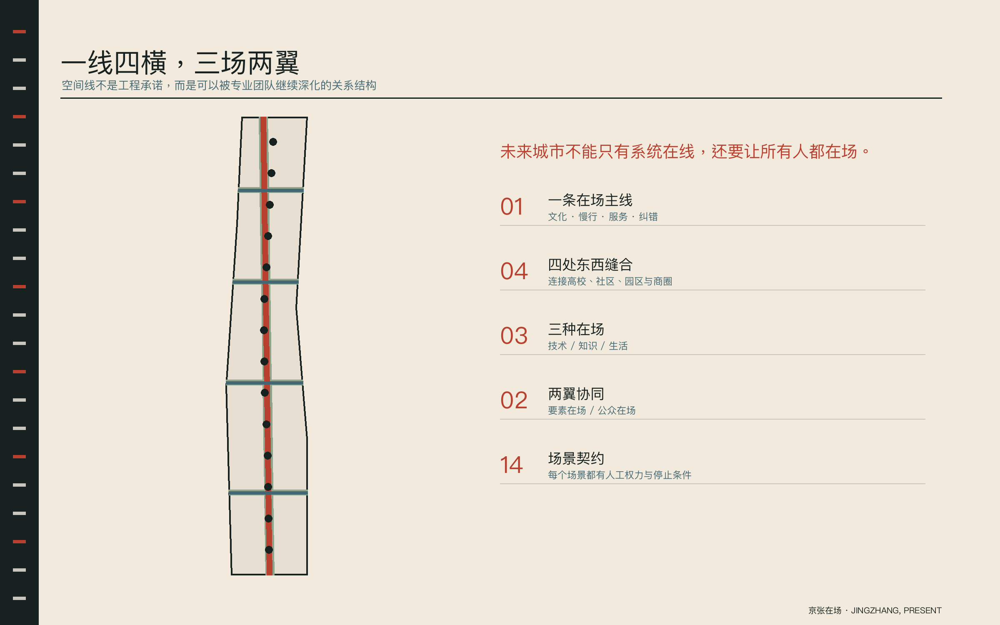
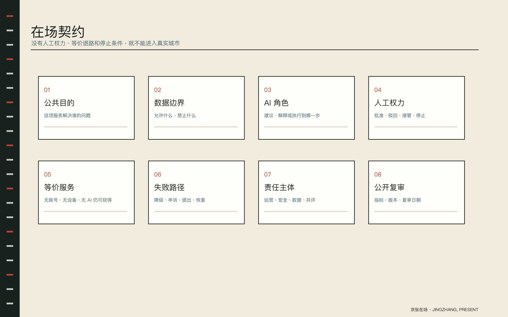
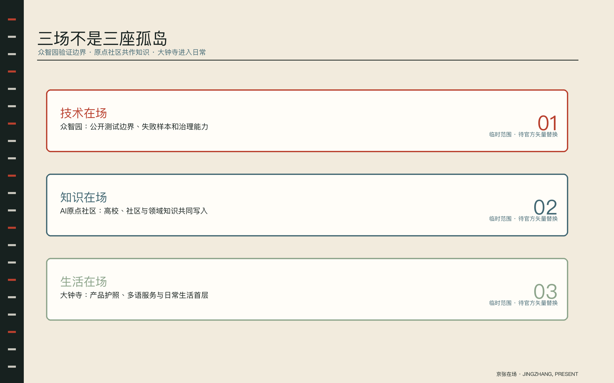
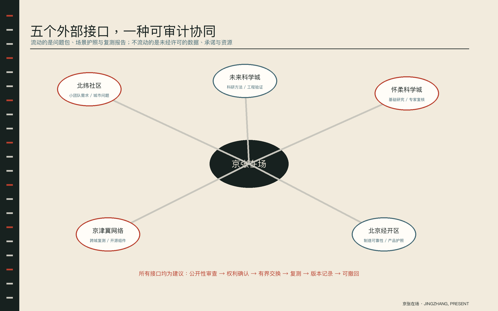
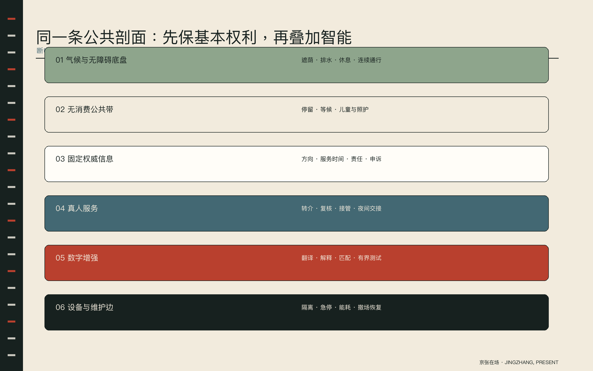
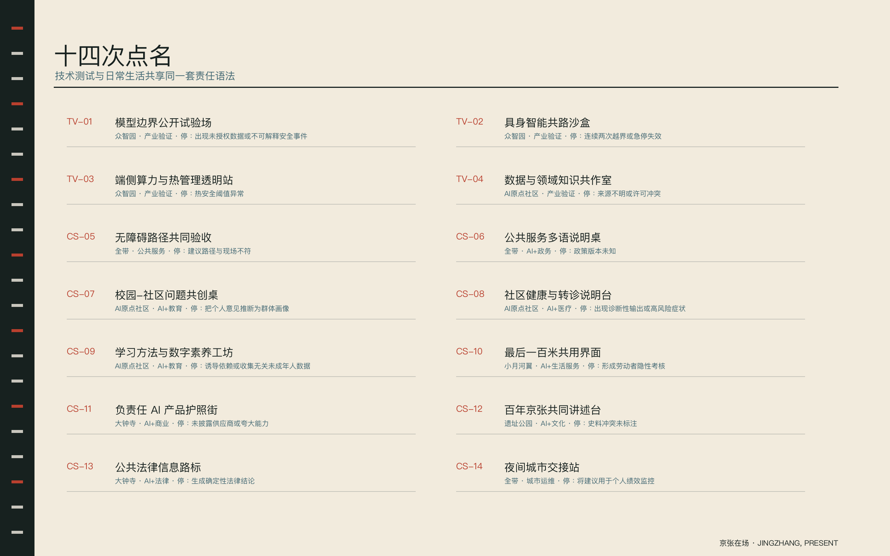
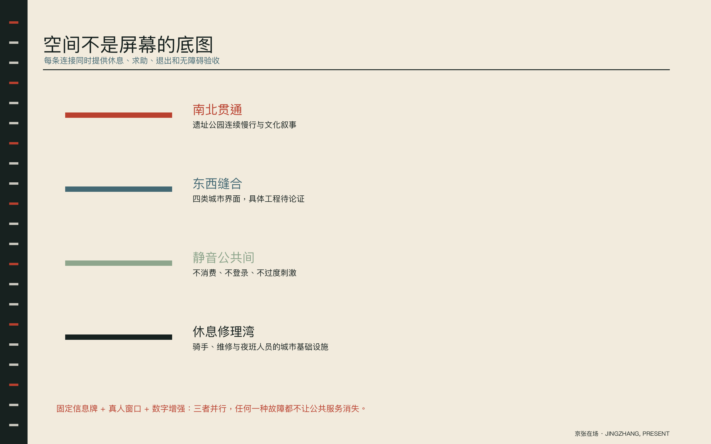
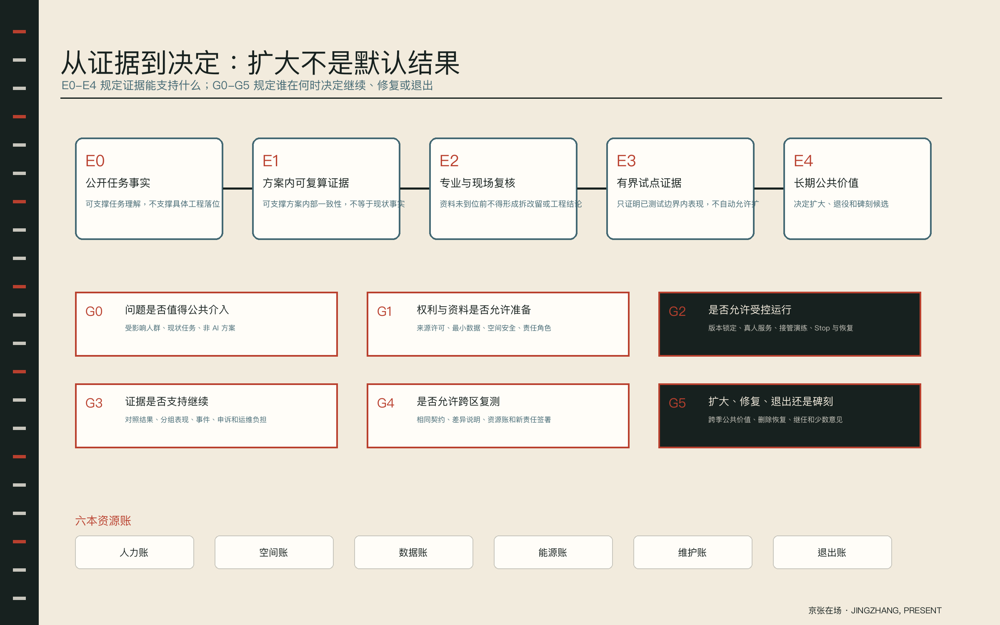
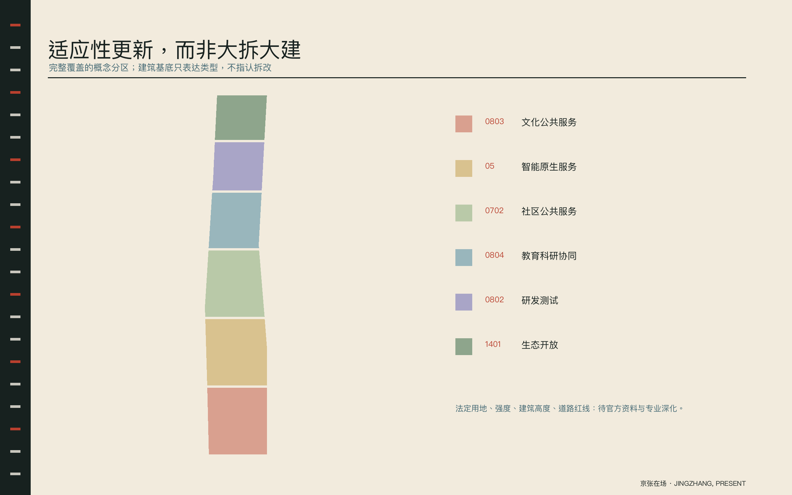
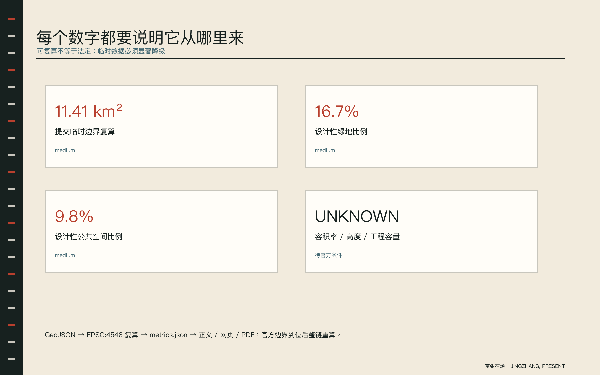

# 京张在场 / JINGZHANG, PRESENT

> 未来城市不能只有系统在线，还要让所有人都在场。
>
> A future city needs more than systems online. It needs everyone present.

**方案属性**：开放共创建议，由 OpenAI Codex（GPT-5）与 JacksonHe04 共同完成。所有空间落地内容均为概念建议、参考方案，可供专业团队深化研究；不替代正式规划，不构成政府审定结论。[source:OFFICIAL-ANNOUNCEMENT] [assumption:A-BOUNDARY-001]

## 0. 一句话结论：把 AI 创新带做成一条“共同在场的城市协议”

多数 AI 城市方案回答“系统能做什么”，本方案先回答“谁必须在场、谁有决定权、失败时城市如何继续工作”。`京张在场`不是把人放在技术对面，而是让研究者、居民、劳动者、儿童、老年人、残障使用者、公共服务人员与国际访客共同进入城市的设计、测试、运行和纠错环节。

英文名 **JINGZHANG, PRESENT** 像一次点名，也像碑刻上的在场证明。它同时指向四件事：人在物理空间中在场，公众在决策中在场，责任在系统中在场，以及一条百年铁路在当下重新进入公共生活。

方案把这一承诺转化为三个可交付对象：

1. **一条在场主线**：沿京张遗址公园形成南北连续的慢行、文化与公共服务界面，并用四处东西缝合界面把高校、社区、园区与商圈接回主线。[data:geometry/roads.geojson#ROAD-NS-01]
2. **一份在场契约**：每个 AI 场景必须写明公共目的、数据边界、人工权力、无 AI 等价服务、失败降级、停止条件与公开指标。[standard:PROJECT-AGENT-OPEN-CALL-TASKBOOK]
3. **一本在场名录**：荣誉不只记录模型与开发者，也记录提供领域知识、发现失败、承担维护和共同验收的人；每条贡献都带版本、证据和可撤回状态。

## 设计依据与资料清单

设计依据以组织方结构化任务包、官方公告和公开资料登记为主，全球案例与国际原则只作背景比较。边界来源、可用等级和缺资料项分别见 [source:SITE-PACKAGE]、[source:PROCESSED-FACT-PACK]、[source:BOUNDARY-SOURCE]、[source:KEY-AREA-SOURCE] 与 [source:AGENT-TASKBOOK]。本提案遵守官方公告与任务书边界 [standard:PROJECT-OFFICIAL-ANNOUNCEMENT] [standard:PROJECT-AGENT-OPEN-CALL-TASKBOOK]，并以城市设计管理办法、控制性详细规划编制要求、国土空间用地分类和建筑工程设计深度作为专业接口 [standard:MOHURD-URBAN-DESIGN-MEASURES] [standard:MOHURD-CONTROL-DETAILED-PLANNING] [standard:MNR-LAND-USE-CLASSIFICATION-GUIDE] [standard:MOHURD-ARCH-DESIGN-DEPTH-2016]。

### 0.1 执行摘要：本轮真正请求什么决定

|问题|本方案的回答|评审可核证据|明确不请求|
|---|---|---|---|
|京张应成为怎样的 AI 创新带？|不是设备走廊，而是一条让公众、专业责任与失败证据持续在场的城市协议。|总体结构、在场契约、14 张场景卡、年度运营。|不请求确认法定规划或工程方案。|
|空间如何承载产业与公共生活？|一线四横串联三场两翼；每处同时设置固定信息、真人服务、数字增强和可退出公共界面。|九层 GeoJSON、三处重点区详表、公共组件与图件。|不请求确认道路、桥隧、建筑或地下空间线位。|
|AI 如何进入真实城市？|先经过 E0-E4 证据梯、九个行动包和六道公共决策门；90 日只允许在锁定边界内验证。|在场契约 Schema、合成样例、RACI、Gate 与风险登记。|不请求直连生产审批、医疗诊断、执法或个人绩效系统。|
|何时可以扩大或碑刻？|只有跨季公共价值、维护、退出和少数意见均可复核时，才进入扩围或碑刻候选。|六本资源账、年度版本、退出证明与公开答辩。|不以流量、发布会或单次模型指标授予永久荣誉。|

本次提交请求的不是“批准建设”，而是评审一套**可供专业团队继续深化的公共原型与证据合同**：概念结构是否值得保留，哪些试点可以在补齐主体和许可后进入准备，哪些资料缺口必须先关闭。它把可验证内容、待复核内容与禁止推断内容分开，避免丰富图面制造虚假确定性。

### 0.2 E0-E4 证据梯：不同证据只允许支持不同决定

|级别|证据|当前载体|允许的判断|
|---|---|---|---|
|E0|公开任务事实|任务书、官方公告、组织方数据登记|可支撑任务理解，不支撑具体工程落位|
|E1|方案内可复算证据|提交 GeoJSON、metrics、矩阵与版本哈希|可支撑方案内部一致性，不等于现状事实|
|E2|专业与现场复核|测绘、权属、控规、文保、市政、无障碍与运营调查|资料未到位前不得形成拆改留或工程结论|
|E3|有界试点证据|锁定版本、非 AI 对照、人工接管、事件与申诉记录|只证明已测试边界内表现，不自动允许扩围|
|E4|长期公共价值|跨季复测、维护成本、弱势群体结果、退出与恢复证据|决定扩大、退役和碑刻候选|

任何材料都不能越级：E1 的方案几何不能替代 E2 现场调查，E3 的 90 日试点不能直接推导全带规模化，E4 的长期价值也不能替代法定程序。证据升级必须留下版本、签署角色、失败、异议与撤回记录；组织方 official geometry 缺失本身不扣内容分，但必须触发重新裁切和复算。[source:SOURCE-REGISTRY] [assumption:A-BOUNDARY-001]

## 核心概念与总体设计

`京张在场`的差异化不依赖一句口号，而是一套由品牌、空间、场景与治理共同构成的机制体系。品牌用一次点名让不同人群进入城市叙事；空间网络用一线四横连接三场两翼；十四个场景把 AI+医疗、教育、法律、商业和运维落到具体界面；在场契约再为每个场景规定人工权力、等价服务、失败路径和停止条件。四个层面使用同一套“谁在场、谁决定、谁负责、如何退出”的语法，因此名称、Logo、公共空间、运营和碑刻能够修改一处、全局一致。

这套模式把 AI 创新从封闭园区的资源堆叠改造成可被城市共同验证的可信转化环：问题由公众与专业人员共同定义，原型在有界空间测试，失败先于宣传公开，专业团队决定深化，公众再验证是否扩大。它既服务全球创新生态，也保护无账号、无设备、无专业背景的人继续获得城市服务。核心概念最终由 GeoJSON、指标、矩阵、网页和图纸共同支撑，而不是只存在于文字中。[source:PUBLIC-BRIEF] [source:PUBLIC-BOUNDARY] [data:geometry/public_space.geojson#PUBLIC-01]

## 1. 品牌与视觉：让名称能够落到空间、导视和碑刻

### 1.1 命名体系

- 总品牌：**京张在场 / JINGZHANG, PRESENT**。
- 空间语法：`在场线`（连续公共主线）、`在场站`（有人可求助的节点）、`在场桌`（共同决定的界面）、`在场刻度`（公开版本与贡献记录）。
- 活动语法：`在场测试日`、`在场公开课`、`在场夜班`、`在场年度报告`。
- 治理语法：`在场契约`、`在场名录`、`Go / Hold / Stop`。

Logo 由一条铁路纵线和一个向线内移动的开放括号构成；相交后形成简化“在”字的空间骨架。视觉系统使用铁路里程标、轨枕节奏、站牌和版本记录，但不复刻历史标识，不使用第三方商标或未经授权字体。主色为 Rail Ink、Signal Vermilion、Park Mineral、Porcelain Blue 与 Ticket Paper。红色只标出“需要人决定”的位置。[depth:overall_spatial_structure]

### 1.2 文化叙事

叙事不是“铁路外壳 + AI 屏幕”。第一层是詹天佑与中国自主工程实践的百年京张；第二层是中关村把知识转化为公共生产力的创新文化；第三层是 AI 时代可复核、可纠错、可共同维护的新文化。三层通过同一动作连接：**把贡献留下，也把责任留下**。[source:BEIJING-PARK-HISTORY]

导览以“看见谁在场”为线索：看见建造者、看见研究者、看见日常维护者、看见提出异议的人、看见下一代。固定铭牌提供权威史实和无设备阅读；数字导览只增加多语、无障碍和来源追溯，不取代固定信息。[standard:MOHURD-URBAN-DESIGN-MEASURES]

## 三层范围工作框架

统筹研究约 43.6 平方公里、总体设计约 11.4 平方公里、重点区域约 368.4 公顷构成由战略到空间再到节点的三层工作框架。本提交只对临时总体设计边界进行几何复算，其他范围以公告约数表达，不反推边界。[depth:three_level_scope_framework] [data:geometry/site_boundary.geojson#SITE-001]

三层不是三个互不相干的尺度：统筹研究层识别京津冀与北京创新资源协同，总体设计层把产业、公共生活和遗址公园组织成连续关系，重点区域层再用可体验场景验证。几何层采用同一临时边界及三处临时重点片区，面积和比例只用于设计内部一致性；当官方范围到位，所有设计图层必须统一裁切，不能只替换底图。对应的规划内容、来源置信度和资料缺口分别进入正文、`metrics.json` 与 `assumptions.json`，避免战略口号、空间图纸和实施机制彼此脱节。[metric:site_area_sqm] [assumption:A-BOUNDARY-001]

### 2. 总体结构：一线、四横、三场、两翼、一个回路

### 2.1 一线四横

`一线`是京张在场线：文化、慢行、公共服务和 AI 场景共用的南北骨架。`四横`不是预设桥隧工程，而是四类待专业深化的东西缝合界面：清河生态与创新、学院科研与社区、北太平庄公共服务、大钟寺站城生活。具体过街方式、道路线形和工程条件均待官方资料与专业论证。[data:geometry/roads.geojson#ROAD-EW-01] [assumption:A-CONTROLS-002]

### 2.2 三场两翼

- **众智园：技术在场**。把全栈自主创新转化为边界测试厅、具身共路沙盒、端侧算力透明站和治理公开课；不把测试藏在封闭园区。[data:geometry/key_areas.geojson#PROV-KEY-001]
- **AI 原点社区：知识在场**。让高校、社区、教师、医生、法律与公共服务人员成为模型之外的领域知识共同作者。[data:geometry/key_areas.geojson#PROV-KEY-002]
- **大钟寺：生活在场**。以产品护照、公共法律信息、多语服务与城市生活首层构成可感知的智能原生业态。[data:geometry/key_areas.geojson#PROV-KEY-003]
- **中关村科技服务翼：要素在场**。以共享法务、知识产权、资本对接、算力与数据合规服务支持小团队，不承诺具体政策、资金或招商结果。
- **小月河场景赋能翼：公众在场**。以无障碍共同验收、最后一百米共用界面和社区试点，把生活经验转为可复核的设计输入。

五者形成闭环：`问题提出 → 共同定义 → 有界测试 → 公开评估 → 专业深化 → 城市复用`。每次循环都产生可追溯版本，不以一次性“智慧化建设”结束。[depth:industry_space_mapping]

## 统筹研究范围产业与未来城市研究

统筹研究层把京张放进更大创新网络，但不编造机构合作或政策承诺。研究比较六个公开案例，提炼园区大学协同、知识机构网络、社区平衡、公共共作、真实城市试验和数据治理六类可迁移原则；再把它们转译为人才、数据、算力、空间、场景、资金、产业服务和公众评估八要素链。区域协同通过问题、测试结果和开放组件流动，而非复制园区形态。资料不足时只提出合作接口，不写企业名单、投资额或确定性政策；正式来源和背景来源严格分层。[source:SINGAPORE-PDD] [depth:industry_space_mapping]

### 3. 世界级 AI 创新生态：从“资源堆叠”转为“可信转化”

### 3.1 六个全球案例的可迁移原则

|案例|关键经验|京张转译|
|---|---|---|
|新加坡 Punggol Digital District|园区、大学、数字底座协同|把测试接口和运营主体同步写入空间|
|伦敦 Knowledge Quarter / King’s Cross|知识机构网络与公共空间更新|用共同议题连接机构，不复制单一园区模式|
|巴塞罗那 22@|产业更新与社区平衡|设置居民共同评估与退出机制|
|剑桥 Kendall Square / Foundry|创新集群与公共共作设施|以非商业公共空间降低创新门槛|
|赫尔辛基 Mobility Lab|真实城市交通试验|先定义安全边界、责任人与停止条件|
|多伦多 Quayside|数据城市治理争议|数据最小化、无账号等价服务、不可监控化|

这些案例只作为公开背景资料，不用于推导京张的法定指标。[source:SINGAPORE-PDD] [source:UK-KNOWLEDGE-QUARTER] [source:BARCELONA-22] [source:CAMBRIDGE-FOUNDRY] [source:HELSINKI-MOBILITY-LAB] [source:WATERFRONT-TORONTO]

### 3.2 八要素可信转化链

基础研究不直接跳到招商展示，而经过八个公开接口：**人才**提出问题，**数据**确认许可，**算力**披露能耗，**空间**提供有界试验，**场景**产生失败证据，**资金**按里程碑进入，**产业服务**完成法务与标准化，**公众评估**决定是否扩大。众智园承担验证，原点社区承担知识与伦理，大钟寺承担市场与公众可读性，两翼补足要素与真实场景。[source:OECD-AI-PRINCIPLES] [source:UNESCO-AI-ETHICS]

“在场契约”是跨环节通行证。没有来源、没有责任人、没有无 AI 退路或没有停止条件的方案，不进入真实城市试点。劳动者不是被优化的参数；工作质量、休息、申诉和不被隐性考核的权利进入契约。[source:ILO-GENAI-WORK]

### 3.3 区域协同：五个建议接口，不虚构合作关系

|外部节点|京张可输出|京张可请求|建议接口|非承诺边界|
|---|---|---|---|---|
|北纬社区|可复核城市问题、公共场景护照|创业者生活经验与小团队需求|季度问题交换、短期驻留|不代表既有合作或人才政策|
|未来科学城|城市验证结果、公共服务需求|科研成果与工程验证方法|年度联合问题清单|不代表成果、设施或资金可直接调用|
|怀柔科学城|可转译的城市问题与公众反馈|基础研究解释与科学装置知识|科学问题公开课与专家复核池|不代表大科学装置开放承诺|
|北京经开区|经公众验证的产品需求与场景边界|制造、可靠性和规模化经验|产品护照与验证标准互认研究|不代表采购、生产或招商安排|
|京津冀创新网络|开放组件、失败样本与年度方法报告|跨城场景差异和供应链反馈|开源版本库与跨城复测|不代表区域政策或项目已确定|

协同的基本单位不是机构 logo，而是带来源、许可、责任和 Stop 条件的“问题包 / 场景护照 / 复测报告”。任何交换先做公开性、知识产权、数据和安全审查；只有方法和证据默认可流动，个人数据、商业秘密、未经确认的设施能力与政策资源不进入开放网络。[source:AGENT-TASKBOOK] [depth:industry_ecosystem_strategy]

## 总体设计范围城市更新与控规深度城市设计

总体设计采取“保留优先、可逆更新、公共首层、连续慢行、开放测试边”的概念策略。现状诊断当前只识别资料缺口与空间关系，不冒充实地测绘 [depth:existing_conditions_diagnosis]。法定强度、建筑高度与工程容量保持待确认 [depth:development_intensity_controls]；道路、轨道与慢行只表达连接意图 [depth:traffic_rail_slow_parking]；市政和新基础设施只表达透明、低扰动和人工交接原则 [depth:municipal_new_infrastructure]。

空间上以南北在场线串联遗址公园、公共服务和创新节点，以四类东西界面处理跨线联系；用地采用完整且无重叠的概念分区，建筑采用可适应性更新或概念补充的类型基底，蓝绿与公共空间则叠加在用地之上形成公共权利界面。图层之间由统一边界派生并在 EPSG:4548 下复算。由于缺少现状建筑、权属、道路红线、轨道、市政和文保条件，本层不形成法定地块指标、拆改留结论或工程线位；专业深化须先补齐调查再校正空间结构。[data:geometry/land_use.geojson#LU-01-01]

## 重点区域详细设计

三处重点区域采用差异化的公共首层和场景组合：众智园以边界测试厅、具身沙盒和透明算力站构成验证网络；AI 原点社区以知识共作院、健康说明台和学习工坊构成共作网络；大钟寺以产品护照街、多语服务桌和公共法律信息角构成生活网络。具体边界仍为临时约束，待官方矢量替换。[depth:three_key_area_detailed_design] [metric:key_area_count]

每处区域都用“地标 + 两个公共组件 + 一组场景 + 一个 90 日验证门”形成可转化单元。众智园的公开测试边与物理急停优先，原点社区的共同定义与领域复核优先，大钟寺的消费者可读性和无账号服务优先。三者通过在场名录共享失败证据和版本，而不是共享个人数据。空间尺度、建筑载体、运营主体、成本和审批均需在下一阶段补证；这里的图形只表达功能邻接和公共界面，不代表地块边界或既有建筑改造许可。[data:geometry/key_areas.geojson#PROV-KEY-001] [assumption:A-CONTROLS-002]

### 三处重点区的公共空间序列与剖面控制

|重点区|公共空间序列|公共首层与剖面|首批场景 / Gate|
|---|---|---|---|
|众智园｜技术在场|城市界面 → 零号在场厅 → 开放测试边 → 透明后台 → 安全退出口|首层不做封闭展厅：公开答辩、第三方评测、真人安全台与固定失败档案并列。 公众观看带与设备测试带物理分隔；急停、接管和撤离路线在数字系统失效时仍可用。|TV-01 模型边界公开试验场；TV-02 具身共路沙盒。 Gate：未完成场地安全、版本锁定、人工接管演练和责任签署，不得进入受控运行。|
|AI 原点社区｜知识在场|遗址叙事点 → 开放教室 → 在场桌 → 健康说明台 → 社区静音间|校园与社区之间设置可预约共作首层；居民拥有议题决定权，领域专家拥有方法与发布复核权。 固定信息、真人服务和数字工具三层并行；儿童、健康与社区意见默认不形成长期个人档案。|CS-07 校园—社区问题共创桌；CS-08 社区健康与转诊说明台。 Gate：无领域责任人、无非 AI 服务或输入许可不清，状态直接为 Hold。|
|大钟寺｜生活在场|站城到达 → 多语说明桌 → 产品护照街 → 公共法律信息角 → 生活首层|把 AI 产品能力、供应商、数据用途、人工服务与投诉入口放在同一消费界面，不以扫码和登录为前提。 商业界面退让形成无消费停留带、真人窗口和可读固定牌；夜间保留照明、休息与人工交接。|CS-06 公共服务多语说明桌；CS-11 负责任 AI 产品护照街。 Gate：供应商、责任主体、投诉通道或无账号服务任一缺失，不得标为可信产品。|

三处重点区使用同一条剖面纪律：**气候与无障碍底盘 → 无消费公共带 → 固定权威信息 → 真人服务 → 数字增强 → 受控测试**。数字层永远排在公共底盘和真人服务之后；断电、断网、停模或供应商退出时，前四层仍应工作。深化时要用真实步行任务、轮椅转弯、盲道连续性、夜间照度、噪声、消防疏散、排水和运维路径逐项验证，不能仅凭总图确认“可达”。[depth:three_key_area_detailed_design] [depth:traffic_rail_slow_parking]

建议的空间控制不是统一尺寸，而是五条不可逆减损原则：不得以屏幕替代固定信息，不得以预约替代基本公共进入，不得让测试排队阻断慢行，不得把安全缓冲挤入无障碍通道，不得把设备维护和劳动者休息藏到不可见后场。具体宽度、高度、退让和材料必须在 E2 专业与现场复核后确定。

## AI 创新生态、人才画像与 AI+ 场景

AI 创新生态最终以人能否使用、质疑和退出为检验，因此同时建立九类用户画像和十四张场景卡。画像不做统计人群标签，而记录可达性、账号门槛、专业责任、劳动条件与照护需求。场景覆盖 AI+医疗、教育、法律、商业、文化、政务、生活服务和城市运维，其中四张用于产业验证。每张卡均明确空间载体、最小输入、AI 角色、人工决定权、无 AI 退路、运营主体、公开指标与 Stop 条件，使产业目标可以落到公共生活，也使风险能被提前终止。[metric:scenario_count] [source:OECD-AI-PRINCIPLES]

### 4. 14 张场景卡：AI+医疗、教育、法律、商业与城市运维

本方案设置 **14** 张场景卡，其中 4 张产业测试验证场景、10 张公共生活场景，覆盖 9 类人群。每张卡同时落在空间、运营与治理边界中。[metric:scenario_count] [metric:persona_count] [data:geometry/public_space.geojson#PUBLIC-01]

|编号|场景与类型|空间 / 用户|AI 与人工权力|退路 / 停止条件|
|---|---|---|---|---|
|TV-01|模型边界公开试验场 产业验证|众智园 P01/P02/P08|AI：显示能力边界与失败样本 人：专业人员批准测试，公众可一键退出|退路：人工演示与固定说明牌 停：出现未授权数据或不可解释安全事件|
|TV-02|具身智能共路沙盒 产业验证|众智园 P01/P06/P07/P08|AI：低速导航与避让 人：安全员持物理急停并逐班签字|退路：关闭自动模式，恢复人工搬运 停：连续两次越界或急停失效|
|TV-03|端侧算力与热管理透明站 产业验证|众智园 P01/P02/P04|AI：负载调度建议和可视解释 人：设施工程师确认切换|退路：预设安全工况 停：热安全阈值异常|
|TV-04|数据与领域知识共作室 产业验证|AI原点社区 P01/P03/P08|AI：生成可追溯问题集和模型卡 人：领域专家拥有发布与撤回权|退路：纸面问题库与人工工作坊 停：来源不明或许可冲突|
|CS-05|无障碍路径共同验收 公共服务|全带 P06/P07/P08|AI：提出绕行和修复优先级 人：残障使用者共同验收，运维人员销项|退路：固定无障碍地图与人工引导 停：建议路径与现场不符|
|CS-06|公共服务多语说明桌 AI+政务|全带 P04/P08/P09|AI：翻译、简化并标出依据版本 人：窗口人员对最终答复负责|退路：纸质指南与真人窗口 停：政策版本未知|
|CS-07|校园-社区问题共创桌 AI+教育|AI原点社区 P03/P04/P05|AI：聚类问题、匹配公开研究资源 人：居民决定议题，教师审查方法|退路：人工议题墙 停：把个人意见推断为群体画像|
|CS-08|社区健康与转诊说明台 AI+医疗|AI原点社区 P04/P05/P08|AI：解释就医路径，不做诊断 人：医护确认转诊与风险提示|退路：电话与人工分诊 停：出现诊断性输出或高风险症状|
|CS-09|学习方法与数字素养工坊 AI+教育|AI原点社区 P03/P05|AI：给出多种学习路径并说明局限 人：教师/监护人选择和纠偏|退路：纸质学习包 停：诱导依赖或收集无关未成年人数据|
|CS-10|最后一百米共用界面 AI+生活服务|小月河翼 P04/P06/P07|AI：建议无障碍会合与错峰路径 人：骑手和收件人共同确认|退路：电话、固定门牌和人工问询 停：形成劳动者隐性考核|
|CS-11|负责任 AI 产品护照街 AI+商业|大钟寺 P02/P04/P09|AI：对比用途、数据、责任和退出方式 人：商户签署，消费者可投诉复核|退路：纸质产品护照 停：未披露供应商或夸大能力|
|CS-12|百年京张共同讲述台 AI+文化|遗址公园 P03/P04/P09|AI：按来源生成多语导览 人：史学顾问与讲述者保留修订权|退路：固定铭牌和人工导览 停：史料冲突未标注|
|CS-13|公共法律信息路标 AI+法律|大钟寺 P02/P04/P07/P09|AI：定位条文和整理问题，不代替法律意见 人：律师或公共法律服务人员复核|退路：热线、纸质清单与预约窗口 停：生成确定性法律结论|
|CS-14|夜间城市交接站 城市运维|全带 P07/P08|AI：汇总待办并建议顺序 人：交接双方逐项确认并可驳回|退路：纸质交接簿和电话调度 停：将建议用于个人绩效监控|

### 4.1 九类用户画像

|编号|人群|核心需要|
|---|---|---|
|P01|研究者与开发者|需要可测试、可比较、可复现的真实城市接口|
|P02|初创团队与中小企业|需要低门槛试验、专业服务与透明转化路径|
|P03|学生、教师与领域专家|需要把论文、专业知识和城市问题接起来|
|P04|居民与老年人|需要不强迫使用 AI 的公共服务与真人帮助|
|P05|儿童与照护者|需要安全、可解释、低刺激的学习和出行环境|
|P06|残障与临时行动不便者|需要可共同验收的连续无障碍路径|
|P07|骑手、维修、保洁、安保与夜班人员|需要休息、补给、修理与平等参与|
|P08|公共服务人员与专业审查者|需要明确责任、人工复核与停止权|
|P09|国际访客与无本地账号者|需要多语、离线和无账号等价服务|

### 4.2 在场契约：八个不可缺字段

1. 公共目的与受益人；2. 所需数据与禁止数据；3. AI 可以做什么；4. 人拥有何种批准、驳回和停止权；5. 无账号、无设备、无 AI 的等价服务；6. 失败、降级与退出路径；7. 运营者与申诉渠道；8. 公开指标、版本与复审日期。

任何场景都不得把人脸识别、全域轨迹或劳动绩效监控设为默认输入。涉及医疗和法律的系统只做信息解释与路径导航，不给出诊断或确定性法律意见。儿童数据、个人健康信息和劳动者行为数据采用更高门槛，默认不收集。[assumption:A-DATA-004]

在场契约不仅是一张海报。机器合同 `visual/assets/presence-contract.schema.json` 把八个字段拆为可校验对象，并额外要求记录状态、受影响人群、禁止用途、保留期、删除证明、申诉、版本、恢复和最终决定。合成样例 `visual/assets/example-cs08-presence-contract.json` 以社区健康说明台演示：只接受用户主动表达的就医意图，不保存健康正文，不允许诊断；高风险症状或诊断性输出触发 Stop，真人分诊继续工作。样例明确标为 synthetic，不声称场景已经运行。

每次真实运行只允许引用已签署契约；变更模型、数据、空间、人群、责任主体或保留期都生成新版本，不能在后台静默更新。公众页面必须同时显示当前版本、上次复审、未关闭事件和下一次决定日期；撤回同意不影响使用无 AI 等价服务。

## 蓝绿空间、公共空间与城市风貌

蓝绿与公共空间承担三种基础职责：提供连续慢行与气候适应的环境底盘，提供无需消费和登录的共同停留界面，并为每个 AI 场景保留真人帮助、退出和共同验收的位置。南北主线与四处东西界面叠加绿地和公共空间图层，形成可复算的设计性比例，但不替代绿线、蓝线或道路红线。城市风貌避免巨型屏幕和网红化构筑物，以铁路刻度、可逆组件、固定信息和耐久材料表达百年时间感；文保、树木、照明和无障碍须由专业团队现场核查。[data:geometry/green_space.geojson#GREEN-01] [depth:blue_green_public_space]

### 5. 公共空间与四个朝圣地标

### 5.1 四个地标

1. **零号在场厅**：不是企业发布馆，而是进入真实城市测试前的公共答辩厅；展示模型边界、失败样本和停止权。
2. **看得见的城市后台**：把能耗、维护、无障碍、数据来源和人工交接变成可读公共界面，让“运行城市的人”被看见。
3. **在场名录**：面向开发者、居民、劳动者、领域专家和维护者的版本化贡献墙。贡献可被引用、纠错、撤回；碑刻只授予通过长期复核的公共贡献。
4. **下一百年坐标**：一座不承诺未来答案的公共刻度，年度只新增一条经公开评议的城市问题与一项可验证进展。

地标避免网红化巨构，优先采用既有空间适应性更新、可拆卸构件和低能耗界面。任何涉及文保、绿地、蓝线、轨道和地下空间的做法须在专业深化阶段另行审查。[depth:height_massing_character] [assumption:A-CONTROLS-002]

蓝绿系统不是单一景观带，而是与无障碍、休息、避雨、夜间照明和公共服务共同设计的韧性界面。[data:geometry/green_space.geojson#GREEN-01] [data:geometry/public_space.geojson#PUBLIC-01] [depth:blue_green_public_space]

### 5.2 八件公共空间组件

`在场桌`（共同决策）、`真人窗口`（转人工）、`固定真相牌`（离线权威信息）、`休息与修理湾`（劳动支持）、`无障碍路径包`（共同验收）、`开放测试边`（物理边界与急停）、`静音公共间`（非消费停留）、`版本刻度`（谁在何时改了什么）。组件使用开放规格，可由不同专业团队深化，不绑定供应商。

## 更新项目清单、实施政策与分期计划

首批概念项目清单包括：零号在场厅、无障碍共同验收段、多语说明桌、产品护照街、休息修理湾、在场名录和城市后台公开界面。每项均需在深化时补齐位置、权属、责任主体、预算、许可与运维方案。[depth:renewal_project_list]

实施不以一次性建设完成为目标，而以可撤回验证为门槛。首批项目分为轻量标识与服务界面、可逆室内更新、需要独立工程论证的高投入项目三类；前两类进入 90 日试点，高投入类只保留研究接口。政策建议聚焦公开场景许可、跨机构共评、失败记录、无 AI 等价服务和中小团队开放时段，不宣称既有政策。三阶段空间范围仅表示验证顺序；每阶段结束由用户代表、运营者和专业人员共同决定 Go、Hold 或 Stop。[data:geometry/phasing.geojson#PHASE-01-01] [assumption:A-OPERATIONS-003]

### 6. 90 日试点：先证明责任链，再扩大技术

**第 0-15 日：共同定义。** 在大钟寺选择一个多语服务桌、在原点社区选择一个无障碍验收段、在众智园选择一个模型边界展示，邀请九类人群共同写契约。产出公开基线、责任人、申诉渠道与退出说明。

**第 16-45 日：离线对照。** AI 服务与无 AI 等价服务同时运行，只采集最小必要的汇总数据；记录转人工、错误、退出、弱势人群使用与运维负担。

**第 46-75 日：交叉评估。** 场景运营者不能单独评价自己；由专业人员、用户代表和独立安全/伦理观察员共同复核。所有失败样本先于宣传成果公开。

**第 76-90 日：Go / Hold / Stop。** `Go` 仅允许在相同边界内继续；`Hold` 要求补证据或修改契约；`Stop` 关闭自动功能并保留公共服务。扩大范围必须重新评审，不能由 90 日试点自动推导。[data:geometry/phasing.geojson#PHASE-01-01] [depth:phasing_implementation]

### 6.1 三个首批试点的运行卡与 RACI

|试点|R（执行）|A（最终负责）|C（共同复核）|I（公开知情）|数据期限 / SLA|停止与恢复责任|资源级别|
|---|---|---|---|---|---|---|---|
|CS-05 无障碍共同验收段|公园巡查与修复团队|建议由公园运营责任主体承担|残障使用者共评组、无障碍专业人员|沿线公众|问题工单闭环后保留180日；错误路线2小时内撤下|值班负责人撤下数字建议、启用固定绕行牌；专业人员复验后恢复|轻量：巡查、标识、修复工时|
|CS-06 大钟寺多语说明桌|窗口服务与翻译支持人员|建议由公共服务提供机构承担|法律/政策专业人员、国际用户代表|所有使用者|默认不保存查询正文；聚合计数90日；政策版本未知立即转人工|窗口负责人停用自动答复、切换纸质指南；确认新版本后恢复|轻量：人员、印刷、端侧设备|
|TV-01 模型边界公开试验场|测试运营团队|建议由独立测试治理委员会承担|领域专家、安全人员、自愿测试者|公众与参赛团队|自愿反馈去标识后最长90日；高风险事件即时上报|安全负责人停止测试并保全公开证据；完成根因复核与重新答辩后才可恢复|中等：场地、第三方评测、安全值守|

RACI 是建议责任结构，不指认现有机构。试点启动前需由实际主体重新签署；任何一项 A 角色空缺、数据期限不清、固定退路不可用或恢复责任未落实，状态自动为 `Hold`。[assumption:A-OPERATIONS-003] [assumption:A-DATA-004]

### 6.2 责任与成本框架

- 轻量投入：标识、固定信息牌、无障碍共评、公开工作坊和纸质替代服务。
- 中等投入：可逆室内改造、设备租赁、数据脱敏、第三方评测和持续运维。
- 高投入：涉及道路、桥隧、地下空间、市政和大规模建筑的内容不在本提案中承诺，须独立立项与专业论证。
- 责任链：提出者 → 场景运营者 → 数据/安全负责人 → 用户共评组 → 专业审查 → 公共版本库。政府、企业、学校和社区角色均为建议，不构成承诺。[assumption:A-OPERATIONS-003]

### 6.3 九个行动包：把总体概念压到可验收工作面

|包|行动 / 依赖|建议负责角色|验收证据|硬停止|
|---|---|---|---|---|
|AP0|公开底图与权利基线 依赖：无|资料协调角色 + 持证专业团队|来源、许可、临时/正式状态和缺口台账|关键边界冲突未解则只做研究，不落位|
|AP1|在场主线现状任务链 依赖：AP0|公共空间与无障碍共测组|步行、休息、求助、过街与夜间任务基线|安全断点未隔离则不发布数字路线|
|AP2|非 AI 服务底座 依赖：AP0|场地运营角色|真人窗口、纸本、电话、固定牌与静音空间|任一核心任务断网后不可完成则 Hold|
|AP3|在场契约与公开名录 依赖：AP0, AP2|数据/安全负责人 + 公众代表|契约、版本、失败、申诉、删除与复审记录|责任人或 Stop 条件缺失则不得试点|
|AP4|众智园受控验证 依赖：AP0, AP2, AP3|测试治理委员会建议角色|模型边界、具身接管、能耗和失败样本|越权、伤害或接管失败立即 Stop|
|AP5|原点社区知识共作 依赖：AP0, AP2, AP3|领域专家 + 社区共评组|问题集、来源卡、撤回记录和人工转介|医疗诊断、未成年人过采集或来源冲突立即 Stop|
|AP6|大钟寺可信采用 依赖：AP0, AP2, AP3|商圈运营建议角色 + 消费者代表|产品护照、多语服务、法律信息和投诉闭环|夸大能力、隐瞒供应商或无法转人工则下架|
|AP7|两翼与区域复测接口 依赖：AP3, AP4, AP5, AP6|开放版本维护组|去标识问题包、复测报告和跨区差异|不得交换个人数据、商业秘密或虚构资源承诺|
|AP8|退出、恢复与碑刻复核 依赖：AP1, AP2, AP3|公共价值委员会建议角色|删除证明、场地恢复、继任责任、少数意见与长期价值|无法删除、恢复或维持非 AI 服务则不得扩围或碑刻|

行动包不是采购清单，也不表示任何机构已经承诺。它们定义的是依赖关系与验收顺序：AP0、AP2、AP3 是所有数字场景的共同前置；三个重点区不得各自重复建设一套身份、申诉或失败档案；AP8 从第一天就存在，而不是项目失败后才补退出方案。每个包在专业深化时须增加实际法人/部门、预算、工期、许可、场地和保险，但在这些条件确认前只保留角色和资源类别。[depth:renewal_project_list] [depth:phasing_implementation]

### 6.4 六道公共决策门：扩大不是默认结果

|门|公共决策|最低证据|
|---|---|---|
|G0|问题是否值得公共介入|受影响人群、现状任务、非 AI 方案|
|G1|权利与资料是否允许准备|来源许可、最小数据、空间安全、责任角色|
|G2|是否允许受控运行|版本锁定、真人服务、接管演练、Stop 与恢复|
|G3|证据是否支持继续|对照结果、分组表现、事件、申诉和运维负担|
|G4|是否允许跨区复测|相同契约、差异说明、资源账和新责任签署|
|G5|扩大、修复、退出还是碑刻|跨季公共价值、删除恢复、继任和少数意见|

Gate 的裁决只有四种：`Go`（在原边界继续）、`Hold`（补证据）、`Repair`（缩小或改造后重测）、`Stop`（关闭自动功能并保持公共服务）。任何跨区、跨人群、跨数据类型或跨季运行都视为新边界，至少回到 G1；宣传、投资兴趣或模型升级不能绕过 Gate。

### 6.5 六本资源账：不只算建造成本

|资源账|最小记录|
|---|---|
|人力账|真人窗口、夜班交接、专业复核、无障碍共测与维护工时|
|空间账|无消费停留、测试隔离、静音界面、恢复范围与占用时段|
|数据账|字段、来源、许可、访问角色、期限、删除与禁止用途|
|能源账|端侧/云端能耗边界、设备热负担、低功耗退化模式|
|维护账|故障 SLA、备件、清洁、内容更新、供应商退出与继任|
|退出账|停止触发、通知、数据删除、设备撤场、空间复原与档案保留|

预算未知不等于资源不可管理。首轮不虚构金额，而要求所有候选试点先列出六类最小资源、责任角色、计量单位和退出负担。若人力账长期依赖无偿劳动、能源账无法披露、维护账无人继任、退出账无法恢复，则即使模型效果很好也不得 Go。

### 7. 年度运营：把朝圣地变成可持续的公共学习系统

- **每周：在场夜班**。公开一次运维交接、失败修复或无障碍巡查，而非只展示发布会。
- **每月：在场测试日**。限定一个问题、一个场景、一个责任人和一个停止条件。
- **每季：共同版本发布**。发布场景护照、失败清单、修复状态与可复用组件。
- **每年：JINGZHANG, PRESENT WEEK**。包括城市问题开源挑战、领域专家驻留、公众验收路线和年度碑刻答辩。

转化路径不是“活动 → 流量”，而是 `公开问题 → 可复核原型 → 场景护照 → 专业深化 → 采购/投资/政策适配评估 → 跨区复用`。每个环节允许退出，并记录为何没有继续。年度报告公开四组指标：技术可靠性、公共价值、工作质量、资源环境负担。

## 用地、建筑规模与拆改留方案

六类概念用地由同一临时边界切分，完整覆盖且无重叠；建筑图层只表达九组可适应性更新或概念补充的类型，建筑基底总面积约 **10.5 公顷**，不是总建筑规模，也不构成拆改留指令。[metric:building_footprint_area_sqm] [depth:retain_renovate_demolish]

用地包括文化公共服务、智能原生服务、社区公共服务、教育科研协同、研发测试与生态开放六个南北关系段，代码采用组织方提供的国土空间用地分类子集。建筑类型围绕三处重点区域表达实验、社区服务与混合使用三类适配性载体；既不声称为现状建筑，也不决定保留、改造或拆除。总建筑面积、容积率、建筑高度、密度、退线和产权均未知。官方边界、现状测绘和控规条件到位后，应重新划分用地、复核载体并由建筑和规划专业人员确定强度。[standard:MNR-LAND-USE-CLASSIFICATION-GUIDE]

### 拆改留不是三选一标签，而是一条证据决策树

1. **先留事实**：没有建筑普查、产权、结构安全、历史价值、现行使用和使用者访谈，不进入单栋判断。
2. **再判公共任务**：确认建筑是否承载居住、教育、医疗、社区服务、就业、物流或维护等不可中断任务。
3. **优先轻介入**：固定信息、排班、可移动家具、无障碍修补和开放时段能解决的问题，不启动建筑改造。
4. **适应性更新**：只有空间性能、消防、结构、节能和运营均有专业证据时，才讨论首层开放、复合使用与设备接入。
5. **新增或拆除**：须证明公共任务无法通过保留与改造完成，并完成法定程序、替代服务、迁移、碳与废弃物、权利影响和资金论证；本方案不作此结论。

九组概念建筑基底因此只是三类“待验证载体”：验证与透明后台、知识共作与公共服务、可信采用与生活首层。每类都先问固定服务能否运行、真人服务能否排班、设备能否撤走、退出后空间能否恢复，再讨论技术嵌入。建筑面积指标只用于方案内部复算，不形成开发容量建议。[data:geometry/buildings.geojson#BLDG-01-01] [depth:retain_renovate_demolish]

## 交通、轨道、市政与公共服务设施

南北主线与四处东西界面只表达步行、自行车、公共交通接驳与服务连续性的概念关系；具体道路、轨道、桥隧、地下空间和市政容量均待专业论证。公共服务坚持固定信息、真人窗口、数字增强三套界面并行。[data:geometry/roads.geojson#ROAD-NS-01] [data:geometry/constraints.geojson#CONSTRAINT-PENDING-001]

交通策略优先解决人的连续通行和场景可达，不以自动驾驶或新建工程作为前提。四处东西缝合界面分别对应生态创新、科研社区、公共服务和站城生活关系，深化时可根据现状选择地面改善、导向优化或其他合法方式，不能从本图推导桥隧。市政策略强调端侧算力能耗透明、设备可维护、故障降级和夜间交接；医疗、教育、法律等公共服务仍由有资质人员承担最终责任。停车、消防、轨道保护和管线容量因资料缺失保持待确认。[depth:municipal_new_infrastructure]

### 一条线如何在日常中工作

|系统层|最低配置|正常运行|故障或退出时|
|---|---|---|---|
|慢行与无障碍|连续通行、休息、遮荫、过街与求助位置|用真实任务记录断点并形成修复工单|数字导航撤下，固定绕行与真人引导继续|
|固定信息|地名、方向、权威事实、服务时间、责任与投诉|同版多语和易读更新|保留最近经人工确认的有效版本|
|真人服务|可识别岗位、值守时间、转介和夜间交接|对医疗、法律、行政与安全承担最终判断|自动功能暂停，核心任务转电话、纸本或现场|
|数字增强|端侧优先、最小数据、版本和来源可见|提供翻译、解释、匹配、汇总与受控测试|进入降级模式，不阻断通行或服务|
|设备与市政|独立电源/网络边界、维护通道、热与噪声披露|公开能耗、故障、维护和供应商状态|安全断开、撤场复原并保留事件档案|

四处东西缝合界面在 E2 前只定义“要完成的任务”，不预设工程形式：能否安全跨越、能否找到真人帮助、能否在夜间识别方向、能否让轮椅与推车连续完成任务、能否让维护人员不占用主通道。只有现状流量、红线、轨道保护、消防、市政和权属资料齐备后，才比较地面优化、信号组织、导视补强或独立工程方案。[data:geometry/roads.geojson#ROAD-EW-01]

## 指标体系、面积复算与合规矩阵

指标分三类管理：提交几何可复算的面积、绿地、公共空间和建筑基底；必须等待官方条件的容积率、高度、道路红线和工程容量；需要运营持续验证的转人工率、退出可达率、失败公开率和工作质量。第一类从 GeoJSON 在 EPSG:4548 下计算并写入 `metrics.json`，第二类保持 unknown，第三类只作为 90 日试点指标。合规矩阵把六项 Agent 任务和全部专业深度连接到正文、图层、图纸、来源与假设，避免只靠自述“已完成”。[metric:green_ratio] [depth:metrics_recalculation]

### 8. 空间与指标：可复算，但不伪精确

提交边界面积约 **11.41 km²**，来自临时研究几何，只用于概念结构与图层复算；官方公告的总体设计范围为约 11.4 km²。绿地与公共空间比例分别为 **16.7%** 和 **9.8%**，是本方案几何的设计性比例，不是法定指标。[metric:site_area_sqm] [metric:green_ratio] [metric:public_space_ratio]

用地分区完整覆盖提交边界且无重叠；建筑仅表达九组“可适应性更新或概念补充”的空间类型，不指认现状建筑拆改；道路只表达连接意图；分期只表达验证顺序。[data:geometry/land_use.geojson#LU-01-01] [data:geometry/buildings.geojson#BLDG-01-01] [depth:land_use_layout] [depth:metrics_recalculation]

## 风险、版权与合规说明

风险管理从“可停止”开始：边界误读用显著降级和整链重算控制，AI 误用由最小数据、人工复核和 Stop 权控制，公共空间设备化由固定信息与静音空间控制，劳动者隐性评分由禁止用途和代表共评控制，活动空转由季度版本和转化责任链控制。版权方面，全部图形、文字、几何、Logo 方向、网页和 PDF 原创生成，不嵌入第三方图片、商标或远程字体；外部案例只作文字引用。法定规划、工程、投资、权属和审批结论全部排除。[assumption:A-DATA-004] [depth:risk_missing_data]

### 9. 风险、缺资料与专业深化接口

正式深化前必须补齐：官方三层范围和重点片区矢量、控规与城市设计条件、道路与轨道条件、权属与现状建筑调查、文保与生态控制、市政和消防、人口与公共服务设施、可合法使用的交通和运营数据。数据到位后，按 `边界替换 → 图层裁切 → 指标复算 → 场景位置复核 → 专业审查 → 版本发布` 更新，不沿用本方案的临时坐标。[source:SOURCE-REGISTRY] [depth:risk_missing_data]

主要风险及止损：把 AI 建议误作专业结论——强制标注参考方案；公共空间被设备占用——保留静音和无设备界面；场景形成监控——最小数据和 Stop 权；创新资源只服务头部机构——开放测试时段与中小团队配额建议；劳动者被隐性评分——禁止把场景数据用于个人绩效；活动热闹但不转化——季度版本和明确责任链。

### 9.1 十项风险登记：触发、责任与恢复必须同表出现

|ID|风险|概率 / 影响|建议责任位|触发|止损与恢复|
|---|---|---|---|---|---|
|R01|临时边界被误读为官方红线|中 / 高|资料协调角色|任何法定或工程引用|显著 provisional 标注；正式矢量到位后整链重算|
|R02|AI 输出替代医疗、法律或行政决定|中 / 高|领域责任人|出现诊断、确定性法律结论或正式决定语气|立即停用自动输出，转真人服务，公开纠错并复测|
|R03|个人或劳动数据被扩用|中 / 高|数据/安全负责人|字段超出契约、隐性绩效或身份推断|冻结数据流、删除并举证、通知受影响者、独立复核|
|R04|具身设备与混行人群冲突|低 / 高|现场安全负责人|伤害、近失恶化、越界或接管失败|物理急停、封闭区域、恢复人工服务、根因答辩|
|R05|数字界面挤占公共空间|中 / 中|公共空间维护角色|无消费停留、静音或无障碍路径被侵占|撤除设备，恢复固定信息和公共通行|
|R06|场景只服务头部机构|中 / 中|开放运营角色|中小团队、居民或无账号用户无法进入|公开时段与准入规则；保留纸本/现场通道；季度公平复核|
|R07|供应商退出造成服务中断|中 / 高|合同与维护角色|关键接口专有、无人继任或备件断供|开放导出、最小替代服务、退出账与继任演练|
|R08|活动热闹但不产生转化|中 / 中|项目组合负责人|季度无可复核版本、修复或退出决定|冻结新增活动，先完成问题—证据—责任闭环|
|R09|历史叙事生成错误或权利冲突|低 / 中|文化内容责任人|史料冲突未标注、口述史撤回或许可不明|下线数字内容，保留固定权威信息，重新清权与复核|
|R10|碑刻把一次表现固化为永久荣誉|中 / 高|公共价值委员会建议角色|缺少跨季维护、公共收益或负面记录|至少跨季复核，公开少数意见，可延期或撤销候选|

风险登记不是一次性免责声明。每次 Gate 评审必须更新概率、影响、触发证据、未关闭事件和恢复状态；运营方不能独自降低自己的风险等级。严重伤害、越权数据、医疗/法律越界、人工接管失败和删除/恢复失败属于硬停止，不以平均 KPI 抵消。完整机器版本见 `risk.json`。[assumption:A-DATA-004] [depth:risk_missing_data]

### 10. 开放贡献与版权

本提案的文字、几何、图表、Logo 方向、网页和 PDF 由提交者原创生成；图面不嵌入第三方图片、商标或远程字体。外部案例只做文字概括并在 `sources.json` 列明链接。提交内容作为开放共创建议，可供组织方与专业团队继续深化；任何后续使用仍需遵守原始资料、字体、数据与第三方权利条件。

**最终承诺**：京张在场不承诺一座由 AI 自动运行的城市。它提出一座任何系统都不能让责任缺席、不能让人无处求助、不能让失败消失的城市。百年前，铁路把地点接在一起；下一百年，京张要把技术与共同生活重新接在一起。

## 参考资料

正式依据、边界来源、全球案例和伦理/劳动原则的完整可机读链接见 `sources.json`；专业标准与对应章节见 `standard_matrix.json`，设计深度与证据路径见 `design_depth_matrix.json`，全部强制任务映射见 `compliance_matrix.json`。

核心正式依据为北京市官方征集公告和组织方结构化任务包；边界、来源状态和缺资料清单来自仓库内公开数据登记。全球比较采用 Punggol Digital District、Knowledge Quarter、Barcelona 22@、Cambridge Foundry、Helsinki Mobility Lab 与 Waterfront Toronto 的官方页面。治理与劳动原则参考 OECD AI Principles、UNESCO Recommendation on the Ethics of AI 与 ILO 生成式 AI 和工作的公开材料。案例结论均为本提案原创概括，不复制图像或长段原文，也不将海外经验直接当作京张指标。[source:OFFICIAL-ANNOUNCEMENT] [source:UNESCO-AI-ETHICS]

- `brief/public-brief.md` — 公开任务愿景与方案边界。[source:PUBLIC-BRIEF]
- `brief/README.md` — 公开资料使用边界。[source:PUBLIC-BOUNDARY]
