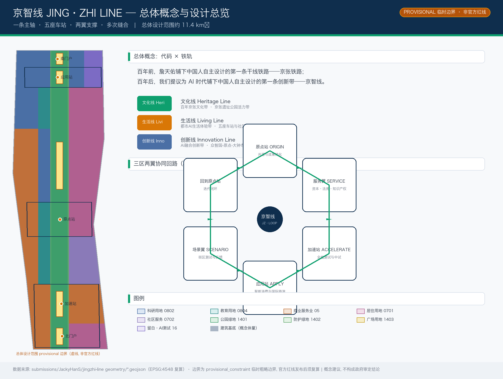
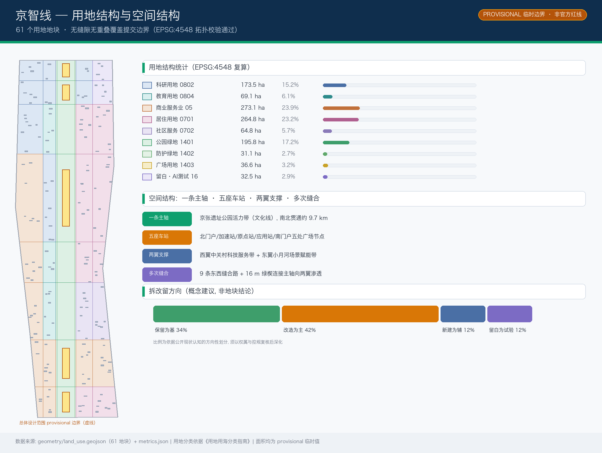
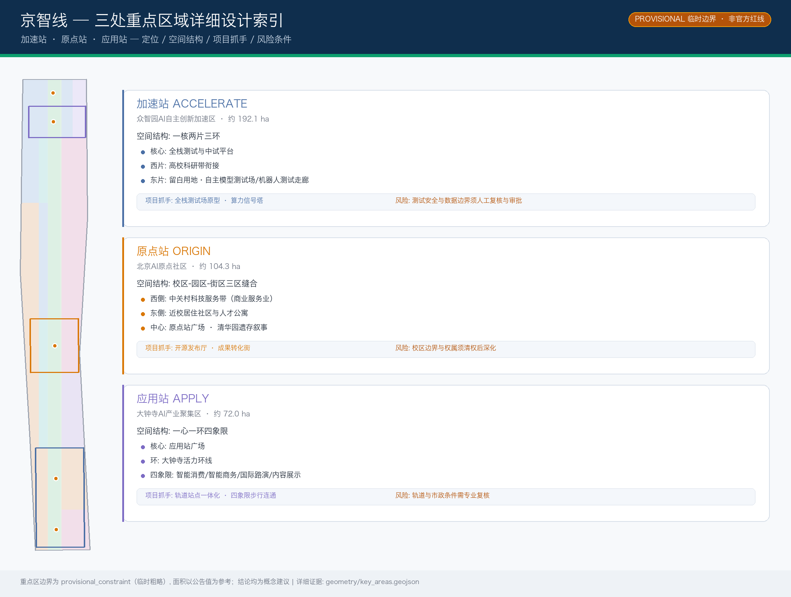
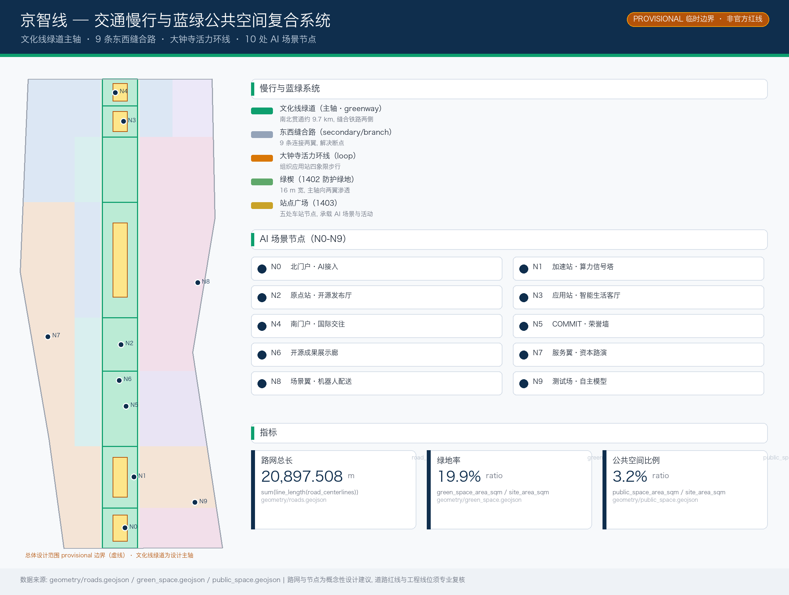
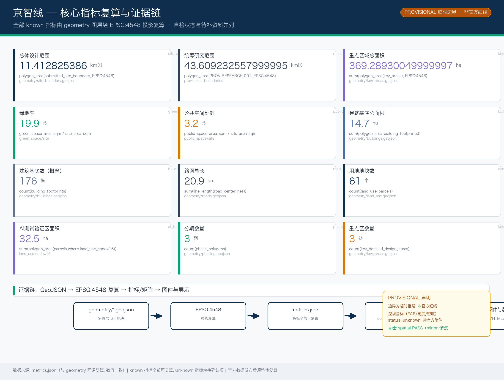

# Jingzhi Line JING·ZHI LINE——Centennial Jing-Zhang AI Innovation Belt Overall Concept and Urban Design

> A century ago, Zhan Tianyou laid down China's first mainline railway designed independently by Chinese hands—the Jing-Zhang Railway.
> In a century's time, we propose laying down the first innovative strip for the AI era designed by Chinese hands—the Jingzhi Line.

## Design Basis and Source List

This plan is based primarily on the qualification pre-review announcement for the international Urban Design competition for the Centennial Jing-Zhang AI Innovation Belt issued by the Haidian Branch of the Beijing Municipal Commission of Planning and Natural Resources [source:OFFICIAL-ANNOUNCEMENT], and structured on the machine-readable files in the `brief/site-package/` directory, including `design_brief.json`, `agent_taskbook.json`, `allowed_design_space.json`, `sources.json`, `enums/`, `ranges/`, `schemas/`, and `standards/` [source:SITE-PACKAGE]. It also reads from `data/source_registry.json` and `data/processed/agent_fact_pack.md` to establish the boundaries of available data [source:SOURCE-REGISTRY][source:PROCESSED-FACT-PACK].

This scheme adopts a three-tier scope and three key areas geometry from `brief/site-package/geometry/provisional_boundaries.geojson` (`PROV-SITE-001`, `PROV-KEY-001/002/003`), which are **temporary rough boundaries** (`geometry_role=provisional_constraint`, `official_boundary=false`, `boundary_precision=provisional_rough`). These can only be used for scheme generation, visualization, self-checking, and design discussions and should not be used as official planning boundaries, approval references, or precise area references [source:BOUNDARY-SOURCE][source:KEY-AREA-SOURCE][source:DATA-SRC-PROVISIONAL-BOUNDARIES-20260605]. (Official Planning Boundary) The host's data gaps should not impede content scoring. After the official polygon is released, all area-sensitive indicators must be recalculated. The scheme must comply with the unified boundary clause in the task book: all spatial design recommendations should be expressed as "Conceptual Recommendation," "Reference Proposal," or "Available for Professional Teams to Further Study," and should not replace formal planning or constitute government approval conclusions [source:AGENT-TASKBOOK][source:DATA-SRC-AGENT-TASKBOOK-20260518][standard:PROJECT-AGENT-OPEN-CALL-TASKBOOK].

The plan is organized with a professional Evidence Chain in accordance with the Urban Design Management Measures [standard:MOHURD-URBAN-DESIGN-MEASURES][source:DATA-SRC-MOHURD-URBAN-DESIGN-MEASURES], the Measures for the Preparation and Approval of Control Detailed Planning of Cities and Towns [standard:MOHURD-CONTROL-DETAILED-PLANNING][source:DATA-SRC-MOHURD-CONTROL-DETAILED-PLANNING], and the Guide for Classification of Land Use and Sea Area Use in Territorial Space Investigation, Planning, and Control [standard:MNR-LAND-USE-CLASSIFICATION-GUIDE][source:DATA-SRC-MNR-LAND-USE-CLASSIFICATION-202311]. (Regulatory Detailed Planning) The Architectural Design Document Preparation Depth Regulations (2016 Edition) [standard:MOHURD-ARCH-DESIGN-DEPTH-2016] Since the warehouse has not obtained official documentation, it is merely listed as a pending supplementary item and is not considered a authoritative basis for meeting the requirements [depth:existing_conditions_diagnosis][depth:three_level_scope_framework]. The formal proposal includes proposal.md (this document), 9 GeoJSON layers, metrics.json, three matrices, 5 derived maps, A3/A0 drawings, and an offline HTML visualization [data:geometry/site_boundary.geojson#SITE-001].

## Three-Level Scope Framework

The proposal shall establish a three-tier scope of work as per Announcement 1.4 [source:OFFICIAL-ANNOUNCEMENT]:

1. **Coordinated Research Area (approximately 43.6 square kilometers)**: Extending north to the North Fifth Ring Road, east to the Jingzhang Expressway, south to West Straight Street, and west to Wanquanhe Road. The research objectives are for the AI Innovation Ecosystem and the future urban form [depth:three_level_scope_framework]; this research records its area using the `research_area_sqm` metric [metric:research_area_sqm] as a coordinate system for industrial and functional integration.
2. **Overall Design Area (approximately 11.4 square kilometers, i.e., the submission boundary)**: All design layers of this scheme are derived within this boundary [data:geometry/site_boundary.geojson#SITE-001], with an area recalculated in EPSG:4548 as `site_area_sqm` [metric:site_area_sqm]. Due to the use of provisional boundaries, all land use areas, ratios, green spaces, and Public Space indicators are temporary values and will need to be recalculated in their entirety after the official boundary is released.
3. **Key-Area Detailed Design Area (approximately 368.4 hectares, three areas)**: Zhongzhiyuan AI Independent Innovation Acceleration Area (approximately 192.1 hectares), Beijing AI Origin Community (approximately 104.3 hectares), and Dazhongsi AI Industry Cluster (approximately 72.0 hectares) [data:geometry/key_areas.geojson#PROV-KEY-001][data:geometry/key_areas.geojson#PROV-KEY-002][data:geometry/key_areas.geojson#PROV-KEY-003], recorded with `key_detailed_design_area_sqm` and `key_area_count` [metric:key_area_count].

The three levels of scope are transmitted hierarchically from 'industrial strategy—overall Urban Design—key area detailed design': the research scope addresses the 'coupling relationship between the AI Innovation Belt and the global and regional innovation network of the Jingjinji region', the overall design scope addresses the 'how the spatial structure of one main axis, three stations, and two wings can be implemented', and the key areas address the 'detailed design of the original station, acceleration station, and application station' [depth:three_key_area_detailed_design]. (Overall Design Area)

## Coordinated Research Area: Industry and Future City Research

### Overall Concept: JING·ZHI LINE (agent.1)

This proposal presents the overall concept of **"Jing-Zhi Line JING·ZHI LINE"**: using the isomorphism metaphor of "code × rail tracks" to transform the Jing-Zhang Railway, which is "China's first self-designed mainline railway," into "China's first innovative belt designed autonomously in the AI era" [source:AGENT-TASKBOOK]. The naming system converts the three major positioning announcements into three 'lines': the century-old Jing-Zhang cultural belt → **Heritage Line**, the urban AI life experience belt → **Living Line**, and the AI integration innovation belt → **Innovation Line**; Three key areas are transformed into 'stations': ORIGIN Station (Beijing AI Origin Community), ACCELERATE Station (Zhongzhiyuan), and APPLY Station (Dazhongsi); the wings are the SERVICE WING (Zhongguancun Science and Technology Services) and the SCENARIO WING (Xiaoyuehe Scenario Empowerment). Conceptual Recommendation for the visual identity direction: "Nail × Cursor": Two parallel track lines (Jing-Zhang railway tracks) intersecting with a pixel cursor (AI input symbol) stacked on top of each other, symbolizing "inputting code on the tracks," which can be extended to components such as house numbers, manhole covers, signage, and lighting installations for public interface elements [depth:overall_spatial_structure]. This naming and visual identity are conceptual suggestions, and the fonts, graphics, and trademarks need to be cleared during the deepening phase.

### Five Functional Areas and the Three Zones and Two Wings Synergistic Loop

The plan is organized according to the five major functions outlined in the task book [source:AGENT-TASKBOOK]: Full-Stack Independent AI Innovation System (Acceleration Station + East Wing Test Field), World-Class AI Innovation Ecosystem (Origin Station + West Wing Services), AI-Enabled Scenario Empowerment New Paradigm (Scenario Wing), Intelligent AI Vital City (Cultural Line + Life Line), and AI Governance Global Discourse (Governance Display at the Acceleration Station + International Events). The Three Zones and Two Wings form a cycle of "Origin Creation — Acceleration Testing — Application Consumption — Service Feedback — Scenario Validation": results from the Origin Station are nurtured by the Service Wing's capital and legal support, then delivered to the Acceleration Station for full-stack testing, converted into consumer-grade experiences at the Application Station, and validated in real street scenes by the Scenario Wing, with data and scenarios feeding back to the Origin Station for iteration.

### Global AI Innovation Ecosystem Case Examples (agent.2, 5-8 examples)

| Case | Region | Relevant Mechanisms | Transformation Direction in This Scheme |
| --- | --- | --- | --- |
| Kendall Square (Boston) | Academic-Industry Park | University-Enterprise Short Walk Collaboration Circle, Rapid Patent Conversion | Original Station Near School Technology Transfer Street (Conceptual Recommendation) |
| Nanshan High-Tech Park (Shenzhen) | Hardware Innovation Cluster | Full Chain Hardware Iteration, Open Supply Chain | Acceleration Station Full Stack Testing Field and Pilot Space (Conceptual Recommendation) |
| West City Innovation Corridor (Hangzhou) | Scenario-Driven Innovation | Digital Scenario City-Level Open and Cloud-Based Collaboration | Scenario Wing Open Testing and Public Data Scenario (Conceptual Recommendation) |
| One-North (Singapore) | Government Governance + Ecological Operations | Mixed Use, Neighbors as Labs, International Community | Dazhongsi International Exchange and Living Mixed Street (Conceptual Recommendation) |
| East London Knowledge Quarter (London) | Knowledge-Intensive Update | Retaining Industrial Heritage and Creative Community Operations in Urban Regeneration | Reuse of Cultural Line Railway Heritage and Developer Community (Conceptual Recommendation) |
| Adlershof Tech City (Berlin) | Science City Transformation | Co-location of University-Institute-Enterprise, Public Space First | Zhongzhiyuan Public Living Room and Shared Facilities (Conceptual Recommendation) |

The experiences from the aforementioned cases are expressed as mechanisms that can be further developed, and do not constitute a reference to any enterprise, investment amount, or output value [source:AGENT-TASKBOOK][standard:PROJECT-AGENT-OPEN-CALL-TASKBOOK].

## Overall Design Area: Urban Renewal and Regulatory-Plan-Level Urban Design

The Overall Design Area proposes a spatial structure of **one main axis, five stations, two wings, and multiple sutures** [depth:overall_spatial_structure][depth:land_use_layout]:

- **Main Axis**: Jing-Zhang Heritage Park Vitality Belt (Cultural Line), spanning approximately 9.7 kilometers north to south, is the core Public Space and narrative carrier of the scheme [data:geometry/green_space.geojson#GREEN-000][metric:green_ratio].
- **Five Stations (Public Nodes)**: The North Portal, Acceleration Station, Origin Station, Application Station, and South Portal squares [data:geometry/public_space.geojson#PUBLIC-000], which serve as hubs for AI scenarios, activities, and congregation.
- **Wing Support**: West Wing: Zhongguancun Science and Technology Service Belt (Commercial Services + Research and Development Land), East Wing: Xiaoyuehe Scene Empowerment Belt (Residential + Community Services + Reserved Test Land).
- **Multiple Stitching Connections**: Connect the main axis to the wings with nine east-west stitching roads and a 16-meter-wide green wedge [data:geometry/roads.geojson#ROAD-SPINE], stitching together the urban interfaces severed by the railway.

The Land-Use Layout is organized according to the **Standard for Land and Sea Use Classification** [standard:MNR-LAND-USE-CLASSIFICATION-GUIDE], comprising 61 land-use parcels [metric:land_use_parcel_count], with the land-use structure and areas detailed in `geometry/land_use.geojson` [data:geometry/land_use.geojson#LU-R0-C2]: research and development land use (0802) is concentrated in Zhongzhiyuan and the original point west area, educational land use (0804) aligns with the cluster of universities such as Beihang and Beihua [source:OFFICIAL-ANNOUNCEMENT], commercial and service land use (05) forms the service wing of Zhongguancun and the Dazhongsi business district, residential and community service land use (0701/0702) are distributed in the stitched communities, park and green space land use (1401) forms the main axis, protective green space land use (1402) forms the green wedge, and square land use (1403) forms the station nodes. Vacant land use (16) is reserved for AI Testing and Validation Scenarios. Due to the provisional boundaries, the areas of each parcel are conceptual values. The Floor Area Ratio, Building Height, Building Coverage Ratio, and Green Space Ratio, among other statutory indicators, are not documented in the publicly available materials and are all listed as conditions to be confirmed. They will not be represented in any form as determined indicators. [depth:development_intensity_controls][depth:height_massing_character][metric:floor_area_ratio][metric:building_height_m]

The overall framework for Urban Renewal adopts the "**preserve as base, renovate as main, build new as supplement, and leave blank for experimentation**" demolish–renovate–retain logic [depth:retain_renovate_demolish]: along the cultural line, micro-updates are used to stitch together pedestrian and bicycle network gaps; within the key areas, functional replacements are employed to activate existing buildings; only where clear missing functions (such as test fields, and release halls) are identified, is new prototype construction recommended. Specific block-level demolish–renovate–retain plans must be developed by professional teams based on ownership and control plans, with this plan providing only directional recommendations [data:geometry/buildings.geojson#BLDG-001][data:geometry/phasing.geojson#PHASE-P1]. (Demolish–Renovate–Retain Strategy)

## Detailed Design of Key Areas

The three key areas are organized according to the depth direction of the Urban Design as per the Integrated Planning Implementation Plan, adopting a complete small plan structure of "positioning + spatial structure + building renewal + traffic slow travel + Public Space + AI scenarios + implementation risks" [depth:three_key_area_detailed_design]. Since the priority areas are provisional polygons, the area and boundary-related conclusions are directional [source:KEY-AREA-SOURCE].

### Accelerate Zone: Zhongzhiyuan AI Independent Innovation Acceleration Area (approximately 192.1 hectares)

Location: Garden-type Full-Stack Independent AI Innovation District (AI Full-Stack Independent Innovation System and AI Governance Global Discourse) [source:AGENT-TASKBOOK]. The spatial structure is defined as "one core, two areas, and three rings": the core is the full-stack testing and pilot platform, the western area connects to the university research corridor, and the eastern area is the autonomous model testing field and robot testing corridor (with reserved land use) [data:geometry/land_use.geojson#LU-R0-C4]. Building updates are primarily focused on replacing industrial building functions, with a recommendation to add pilot and computing power support prototypes [data:geometry/buildings.geojson#BLDG-001]. Transportation recommendations include strengthening the access to the North Fifth Ring portal and internal slow travel loops, with Public Spaces suggested to form a low-carbon innovation corridor based on the Qinghe interface [source:OFFICIAL-ANNOUNCEMENT]. Risks: Testing scenarios involve safety and data boundaries, necessitating the establishment of Human Review and approval mechanisms. (Full-Stack Independent AI Innovation System)

### Origin Station: Beijing AI Origin Community (approximately 104.3 hectares)

Location: Campus-based Conversion of Results and Open-source Talent Community (World-class AI Innovation Ecosystem). The spatial structure is defined as a 'campus-park-district three-zone integration': the west side is the Zhongguancun Science and Technology Service Belt (commercial and service industries), the east side is the near-campus residential community, and the central point station square connects the railway heritage narrative of Tsinghua Park. Recommended functions include an open-source release hall, a conversion result service station, talent apartments, intellectual property and legal service, and a nighttime collaboration space (Conceptual Recommendation) [data:geometry/land_use.geojson#LU-R3-C3]. Transportation prioritizes pedestrian access to integrate the campus boundary, with the point station square as the anchor for organizing developer walkways. Risks: The campus boundary and ownership must be clarified before deepening the integration. (Public Space)

### Application Site: Dazhongsi AI Industry Cluster (approximately 72.0 hectares)

Location: Urban-type Smart Economy and International Exchange District (New Emerging Smart Nativities). The spatial structure is defined as "One Core, One Ring, and Four Quadrants": Application Station Square as the core, with the Dazhongsi Vital Ring Line connecting the four quadrants [data:geometry/roads.geojson#ROAD-DZ-RING], with the functions of the quadrants organized as smart native consumption, smart business, international roadshows, and content displays [Conceptual Recommendation]. It is recommended to organize pedestrian connectivity and underground connections research through Transit-Station Integration [source:OFFICIAL-ANNOUNCEMENT], with architectural updates primarily focusing on the renovation of commercial building public interfaces. Risks: The integration of the track and municipal conditions require professional verification.

## AI Innovation Ecosystem, Personas, and AI+ Scenarios

### User Profile (agent.3, ≥5 categories)

| User Profile | Typical Needs | Spatial Response | Privacy and Review Boundaries |
| --- | --- | --- | --- |
| Open Source Developer | Release, Collaborate, Test, Community Reputation | Origin Station Open Source Release Hall, Public Code Wall, Nighttime Collaboration Space | No personal behavior tracking; activity data only aggregated and statistically summarized |
| Startup Team | Low-Cost Office, Computing Entry Point, Product Test Bed | Acceleration Station Shared Test Bed, Edge Side Computing Service Points, Standard Governance Consultation | Computing and Data Services Require Separate Authorization |
| Lead Corporate Visitors | Exhibitions, Business, International Reception, Talent Recruitment | Utilize the International Roadshow Living Room, Track Transfer, and Public Environment Upgrades | Corporate Identity and Case Studies Must Be Rights-Cleared |
| Surrounding Residents | Commuting, Leisure, Community Services, Low-Impact Updates | Cultural Line Pedestrian Loop, Community Services Embedded, Tiered Nighttime Lighting | Do Not Use Resident Profiles for Commercial Recommendations |
| College Students and Faculty | Result Transfer, Cross-Institution Collaboration, Daily Slow Travel | Campus-Park Slow Travel Integration, Result Transfer Hub, AI Education Experience Point | Campus Data and Research Results Require Authorization |

### AI Scenario Card (agent.3, 10 cards, among which 3 are for industrial Testing and Validation Scenarios)

| Scenario Card | Spatial Carrier | Scenario-Space-Operation Mapping | Human Review Boundary |
| --- | --- | --- | --- |
| 01 Open Source Release Hall | Origin Station Square | Release-Display-Pitch-Dissemination Loop | Content Review and Copyright Clearance |
| 02 Autonomous Model Testing Field ★ | Vacant Land of Zhongzhiyuan East Wing | Testing-Evaluation-Standard Workshop | Safety Evaluation Requires Certification and Approval |
| 03 Robot Testing Corridor ★ | Vacant Land in the East Wing of Zhongzhiyuan | Low-Speed Delivery-Security Inspection-Scenario Simulation | Right-of-Way and Safety Permits |
| 04 AI Safety Governance Sandbox ★ | Acceleration Station Core | Red Team Testing-Governance Demonstration-Rule Co-Creation | Audit Tracing, Final Human Review |
| 05 End-Side Computing Hub | Cultural Line Alongline Node | Public Computing - Low-Carbon Energy - Service Integration | Energy and Computing Services Authorization |
| 06 AI Slow Travel Navigation | Cultural Line Greenway | Signage-Detection of Discontinuities-Accessibility Services | No Individual Trajectory Data Collected |
| 07 Near-School Technology Transfer Street | Original Point Station West Side | Incubation-Legal-Financing Service Chain | Research Results Authorization |
| 08 Intelligent Natively Generated Living Room | Apply Station Quadrants | Smart Terminal - Content Consumption - Experience Operations | Consumer Privacy Protection |
| 09 AI Life Service Sample Street | Seamlessly Integrate Community Interface | Medical/Education/Legal AI+ Services | Compliance with Medical and Personal Information |
| 10 Jingzhixian Activity Week Route | Full-Domain Public Space | Culture-Open Source-Industry-International Roadshow Route | Activity Safety and Public Permit |

(★ is for AI industry Testing and Validation Scenario, all are Conceptual Recommendations and must not be expressed as approved operations) [source:AGENT-TASKBOOK][standard:PROJECT-AGENT-OPEN-CALL-TASKBOOK][data:geometry/land_use.geojson#LU-R1-C4]

## Land Use, Building Scale, and Retain-Renovate-Demolish Strategy

The land use structure is shown in `geometry/land_use.geojson`: 61 parcels precisely cover the submitted boundary with no gaps or overlaps (EPSG:4548 recomputed and verified) [data:geometry/land_use.geojson#LU-R6-C3][metric:land_use_parcel_count]. The building scale is a conceptual massing study: 176 Building Footprints modeled [metric:building_count], with a total building footprint area of `building_footprint_area_sqm` [metric:building_footprint_area_sqm], and a building footprint ratio of `building_footprint_ratio` [metric:building_footprint_ratio], which is only for expressing the direction of density distribution and does not constitute a commitment to development scale [depth:development_intensity_controls]. Demolish–Renovate–Retain Logic: Retain historical and university buildings, renovate inefficient industrial buildings, construct prototype functions for gaps, and leave blank spaces for experimental use [depth:retain_renovate_demolish]. All areas, proportions, and scales can be recalculated from the GeoJSON and indicator data [data:geometry/buildings.geojson#BLDG-001]; control plan Floor Area Ratio, Building Height, green ratio official, etc., are listed as pending confirmation items [metric:floor_area_ratio][metric:building_height_m][metric:green_ratio_official], if official data is released, a comprehensive recalculation must be performed. (Building Coverage Ratio) (Demolish–Renovate–Retain Strategy)

## Transport, Rail, Municipal Infrastructure, and Public Services

Conceptual Recommendation for the traffic system organized as "main axis + seams + loop" [depth:traffic_rail_slow_parking]: The cultural line greenway is the main axis (greenway) [data:geometry/roads.geojson#ROAD-SPINE], with 9 east-west seam roads connecting the two wings. The Dazhongsi vitality loop organizes the application station four quadrants [data:geometry/roads.geojson#ROAD-DZ-RING], with a total road network length of `road_centerline_length_m` [metric:road_centerline_length_m]. Tram and bus: It is recommended to strengthen the integrated pedestrian transfer research for stations such as Dazhongsi station and Zhichunlu station [source:OFFICIAL-ANNOUNCEMENT], combining AI slow travel navigation scenarios to optimize breakpoint identification (Conceptual Recommendation). Municipal and New Infrastructure: It is recommended to conduct a prototype study on the integration of edge-side computing, distributed energy, and traditional municipal services at the acceleration station and scene wing. The engineering conclusions regarding road red lines, integrated pipelines, and underground spaces are all listed as tasks for professional teams to deepen, and do not constitute an engineering scheme [depth:municipal_new_infrastructure].

## Blue-Green Network, Public Space, and Urban Character

### Jing-Zhang Relic Park Vitality Belt (Cultural Line)

Green space ratio `green_ratio` [metric:green_ratio] and Public Space ratio `public_space_ratio` [metric:public_space_ratio] are recalculated from `geometry/green_space.geojson` and `geometry/public_space.geojson` [data:geometry/green_space.geojson#GREEN-000][data:geometry/public_space.geojson#PUBLIC-000]. The proposal suggests a 16-meter-wide green wedge connecting the main axis to the wings, permeating the urban interface on both sides of the railway [depth:blue_green_public_space]. The stylistic tone: the railway, ballast, station buildings, and other remnants of the railway are used as the base, with pixelated and code-like AI new cultural expressions superimposed. The rooftops and the fifth facade are included in the Urban Design guidance (Conceptual Recommendation).

### AI Pilgrimage Landmarks and Honor Display System (agent.4, ≥3 instances)

1. **Tsinghua Garden "KILOMETER 0"**: Establish a "Zero Kilometer" memorial point in the area of the old Tsinghua Garden railway station, marking the dual meaning of "the starting point of China's autonomous railways × the origin of the AI Innovation Belt" (Conceptual Recommendation, subject to cultural heritage protection and approval).
2. **「COMMIT·Jing-Zhang」Intelligent Body Contribution Honor Wall**: Along the cultural line, set up a wall to display the contributions of intelligent bodies and developers, using a dual track of digital and physical displays that are updatable, in response to the long-term update mechanism of the commemorative system (Conceptual Recommendation).
3. **Open Source Achievements Gallery**OPEN-SOURCE GALLERY**Conceptual Recommendation:**
Place an open-source project showcase corridor at the original station square, converting code contributions into a visitable urban interface.
4. **「PATCH·Jing-Zhang」AI Milestone Memorial Node**: A new "patch" style memorial node is added annually along the cultural line to record annual outstanding contributions, forming a growing public art system (Conceptual Recommendation).

The above landmarks are expressed as Conceptual Recommendations and must not be expressed as approved developments [source:AGENT-TASKBOOK][standard:PROJECT-AGENT-OPEN-CALL-TASKBOOK].

## Renewal Projects, Implementation Policy, and Phasing

### Update project list (agent.6 spatial carrier)

| Project Number | Project Name | Type | Main Dependencies | Evidence Reference |
| --- | --- | --- | --- | --- |
| JZ-01 | Cultural Line Slow Travel Discontinuity Integration | Public Space/Transport | Road Right-of-Way, Underbridge Space, Review of Traffic Organization | [data:geometry/roads.geojson#ROAD-SPINE] |
| JZ-02 | Accelerate Station Full Stack Testing Field Prototype | Industry/New Infrastructure | Safety assessment approval, blank plot confirmation | [data:geometry/land_use.geojson#LU-R0-C4] |
| JZ-03 | Origin Station Near School Conversion Results Street | Urban Renewal/Industrial Services | campus boundaries, ownership, first-floor uses | [data:geometry/buildings.geojson#BLDG-001] |
| JZ-04 | Apply Station Quadrant Pedestrian Connectivity | Integrated Railways/Active Transportation | railway stations, intersections, utility lines | [data:geometry/public_space.geojson#PUBLIC-000] |
| JZ-05 | Open Source Achievements Gallery and Honor Wall | Culture/Operations | Public Space Permits, Copyright Clearance | [data:geometry/phasing.geojson#PHASE-P1] |
| JZ-06 | Jingzhi Line Activity Week Public Route | Operations/Brand | Activity Safety, Public Permits, Compliance | [data:geometry/phasing.geojson#PHASE-P3] |

### Implement policies and phases (agent.6)

Phasing is expressed in `geometry/phasing.geojson` [data:geometry/phasing.geojson#PHASE-P1][data:geometry/phasing.geojson#PHASE-P2][data:geometry/phasing.geojson#PHASE-P3][metric:phasing_phase_count][depth:phasing_implementation]: **Near-term (2026-2028)**: Cultural line green corridor connectivity, activation of the Origin Station and Dazhongsi vitality; **Mid-term (2028-2030)**: Full-stack innovation system and test field formation for Zhongzhiyuan; **Long-term (2030-2035)**: Mid-segment integration, deepening of the wings, and comprehensive operational management. Implementation policy recommendations are centered around the theme of **Scenario Access-Policy Pilot-Community Co-governance**: prioritize the opening of Public Spaces and scenarios (Scenario Access operational mechanism), drive policy pilots through concept validation, and involve developer communities and residents' committees in updating decisions (all Conceptual Recommendations).

### Global AI Innovation Ecosystem and Long-Term Operations (agent.6)

Scenario Access: Annual Activity Framework (Conceptual Recommendation): Code Spring Equinox Open Source Contribution Week in March, Global AI Innovation Conference (Application Station International Roadshow Hall) in May, Jingzhixian Marathon for Developers in August, and AI Pilgrimage Day Cultural Tour in November; Community Operations: Weekly Track Night School Technical Salon, Quarterly Open Source Achievements Presentation, Annual COMMIT Award; Scenario Access Operations: Test Track Reservation System, Public Data Sets and Audit Mechanism; International Communication: KILOMETER 0 Global Live Stream Points, Stamp and Check-In Jingzhixian Passport, Bilingual Copy "FROM THE FIRST RAIL TO THE FIRST LINE OF AI"; Attraction and Transformation: Activity-Community-Policy Connection Channel [depth:renewal_project_list]. All activities, attraction, funding, and policy arrangements are expressed as conceptual recommendations or deepening directions, not as confirmed government arrangements [source:AGENT-TASKBOOK].

## Metrics, Area Recalculation, and Compliance Matrix

The plan metrics are recorded in `metrics.json` and are fully recalculable [metric:site_area_sqm][metric:green_ratio][metric:public_space_ratio]: The study area is approximately 43.6 square kilometers, and the submitted boundary is `site_area_sqm`. Focus Area `key_detailed_design_area_sqm` [metric:key_detailed_design_area_sqm], Green Space `green_ratio`, Public Space `public_space_ratio`, Building Footprint `building_footprint_area_sqm`, Road network `road_centerline_length_m`, AI test zone `ai_test_zone_area_sqm` [metric:ai_test_zone_area_sqm], land use parcels `land_use_parcel_count`, Phasing `phasing_phase_count`. Areas are recalculated in EPSG:4548 projection as specified in `design_brief.json`, and exchanged in GeoJSON format using EPSG:4326 [source:SITE-PACKAGE]. Control plan metrics (Floor Area Ratio, height, density, green ratio, setback) are `status=unknown` pending confirmation items [metric:floor_area_ratio][metric:building_height_m][metric:green_ratio_official].

Compliance coverage is as follows: see `compliance_matrix.json` (compliance items 1.3.1-1.5.3.3, a total of 17 items, fully covered) and `standard_matrix.json` (6 standard responses) and `design_depth_matrix.json` (15 formal depths fully complete) [depth:metrics_recalculation][depth:risk_missing_data]. Self-check status is recorded in `self_check.json`; provisional boundary accuracy warnings are fully retained [source:BOUNDARY-SOURCE].

## Risk, Copyright, and Compliance

- **Compliance with Documentation Requirements**: This plan uses only official announcements, excerpts from task descriptions, public standards, and provisional boundaries that are publicly available or have been cleared for rights [source:SOURCE-REGISTRY]. Non-public planning documents, internal indicators, or unauthorized data are not used. (Rights-Cleared Material)
- **Copyright and Intellectual Property**: Names, logos, scene cards, and text are original AI-generated content licensed under `COMMUNITY-DISPLAY-ONLY` [depth:risk_missing_data]; additional clearance is required for the font, images, trademarks, characters, and corporate logos during the refinement phase.
- **Boundary Statement**: provisional boundaries shall not be considered as official planning boundaries or precise area references; official data release requires recalculation and replacement [source:BOUNDARY-SOURCE]; locked layers and constraints are available at [data:geometry/constraints.geojson#CONSTRAINT-SITE][data:geometry/constraints.geojson#CONSTRAINT-KEY-1]. (Official Planning Boundary)
- **Disclaimer**: AI-generated content is responsible for the accuracy, citations, and final expression by the author (GitHub: JackyHanS); all spatial and operational recommendations are conceptual suggestions and do not constitute government approval, investment commitments, or engineering feasibility conclusions. (Conceptual Recommendation)
- **Privacy Protection**: All AI scenarios are set with Human Review and audit boundaries, and do not collect individual behavior trajectories or use them for unauthorized commercial purposes [source:AGENT-TASKBOOK].
- Complete declaration see `report/copyright_statement.md`.

## References

- `brief/site-package/design_brief.json` [source:SITE-PACKAGE]
- `brief/site-package/allowed_design_space.json` [source:SITE-PACKAGE]
- `brief/site-package/agent_taskbook.json` [source:AGENT-TASKBOOK]
- `brief/site-package/sources.json` [source:SITE-PACKAGE]
- `brief/site-package/geometry/provisional_boundaries.geojson` [source:BOUNDARY-SOURCE][source:KEY-AREA-SOURCE]
- `brief/site-package/standards/standards.json` and `references/` [standard:PROJECT-OFFICIAL-ANNOUNCEMENT][standard:MOHURD-URBAN-DESIGN-MEASURES]
- `data/source_registry.json` [source:SOURCE-REGISTRY]
- `data/processed/agent_fact_pack.md` [source:PROCESSED-FACT-PACK]
- `brief/site-package/schemas/*.json`, `docs/formal-submission-guide.md`
- The Beijing Municipal Commission of Planning and Natural Resources Haidian Branch《Centennial Jing-Zhang AI Innovation Belt Urban Design International Scheme Solicitation Qualification Pre-Review Announcement》 [source:OFFICIAL-ANNOUNCEMENT][source:DATA-SRC-OFFICIAL-ANNOUNCEMENT-20260509]
