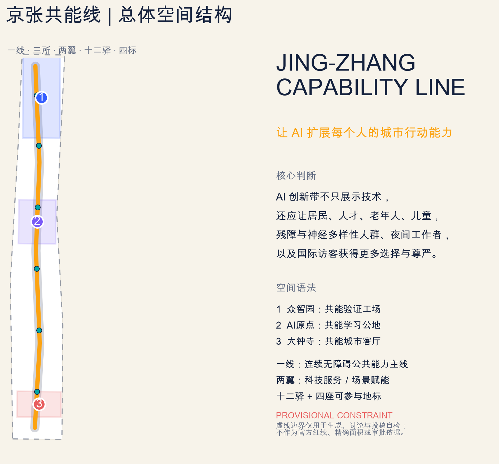
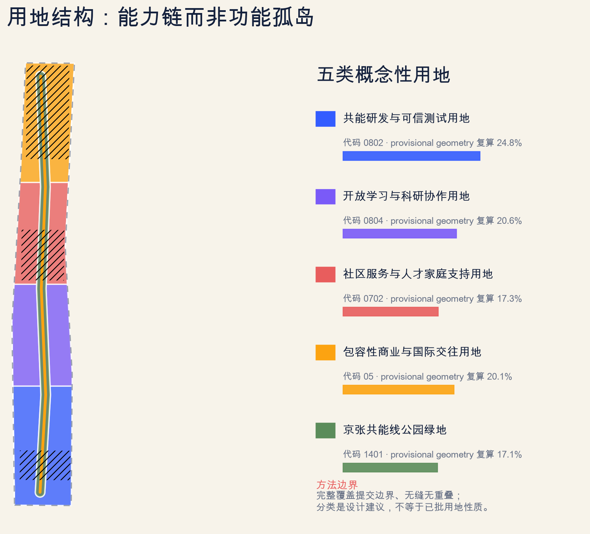
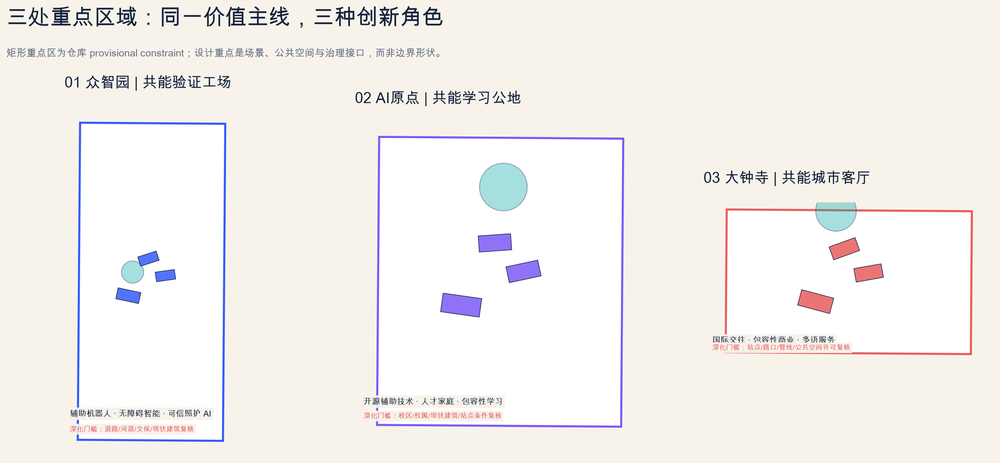
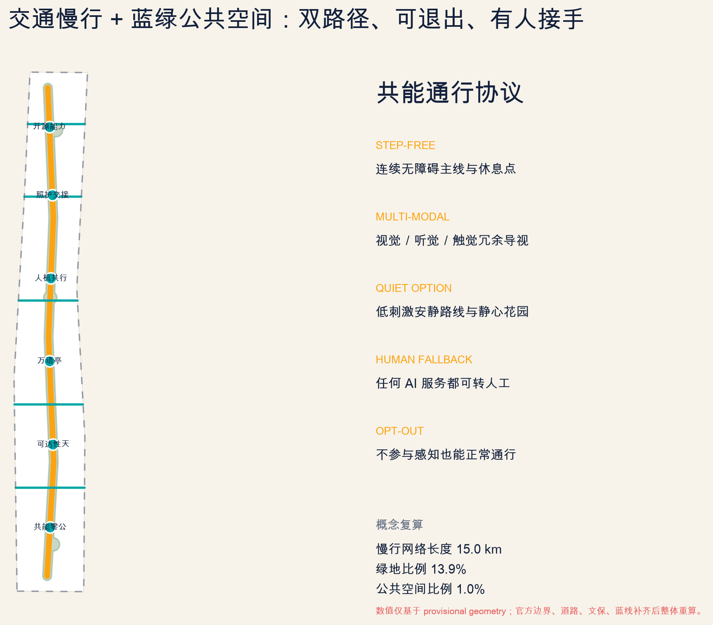
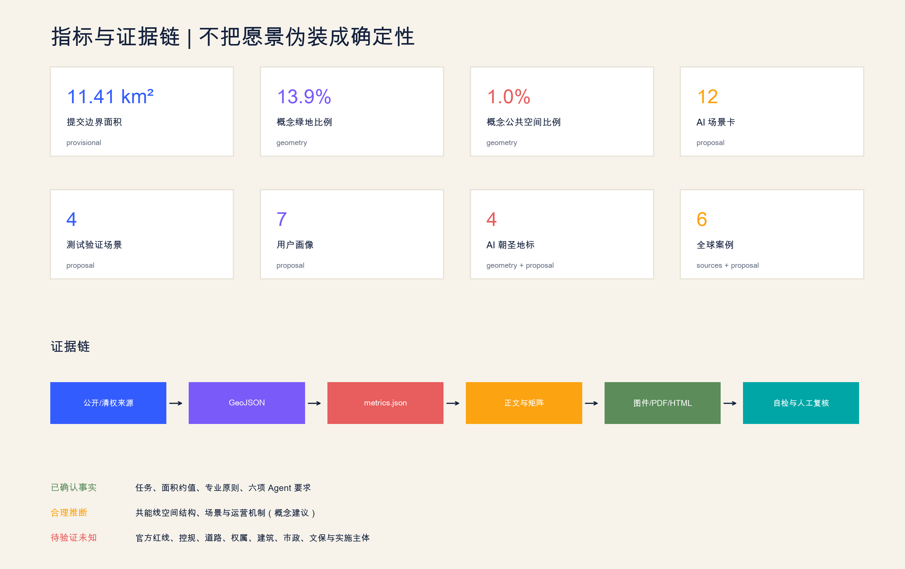

# Jing-Zhang Common Line: AI City Capability Infrastructure for All

Jing-Zhang Capability Line — Extend Everyone's Urban Mobility with AI. All spatial actions are Conceptual Recommendations, reference proposals, or topics for further research by professional teams. They do not replace formal planning and do not constitute a government review or implementation commitment.

## Design Basis and Source List

This proposal starts from a testable question: Can a world-class AI Innovation Ecosystem not only gather models, computing power, enterprises, and talent, but also provide more mobility options to people of different ages, physical conditions, language backgrounds, and work schedules, rather than excluding them with new digital barriers? According to the official announcement, the project must simultaneously build a world-class AI Innovation Ecosystem, an urban form adapted to AI's new quality of productivity, and a high-quality district that global talent aspires to. The task book for the Agent further requires AI-Native scenarios, public interest, people-centric governance, traceable origins, and human final judgment. [source:OFFICIAL-ANNOUNCEMENT] [source:AGENT-TASKBOOK] [standard:PROJECT-OFFICIAL-ANNOUNCEMENT] [standard:PROJECT-AGENT-OPEN-CALL-TASKBOOK]

Confirmed facts include: a Coordinated Research Area of 43.6 square kilometers, an Overall Design Area of approximately 11.4 square kilometers, three names and approximate areas of key zones, three positioning statements, five functions, and six Agent tasks. Reasonable inference is the spatial structure, scenarios, and operational mechanisms of the Jing-Zhang Co-energy Line. Unverified unknowns include the Official Planning Boundary, control plan, roads, land ownership, buildings, utilities, cultural heritage protection, and implementation entities. [source:SOURCE-REGISTRY] [source:PROCESSED-FACT-PACK] [depth:existing_conditions_diagnosis]

Submit using the repository `provisional_boundaries.geojson`. `geometry/site_boundary.geojson` and `geometry/key_areas.geojson` are both clearly marked as `provisional_constraint`, used only for generation, display, topology, and intake self-check, and are not official redlines, nor do they support precise legal area calculations. [source:BOUNDARY-SOURCE] [source:KEY-AREA-SOURCE] [data:geometry/site_boundary.geojson#SITE-001] [data:geometry/key_areas.geojson#PROV-KEY-001] [metric:site_area_sqm]

## Three-Level Scope Framework

The Coordinated Research Area addresses "how to form an AI Innovation Ecosystem for all"; the Overall Design Area addresses "how to translate capabilities into a fair spatial network, update projects, and public services"; and the Key-Area Detailed Design Area addresses "how to test and form translatable components in three innovation environments." The three levels are not three unrelated diagrams, but a continuous Evidence Chain from industrial mechanisms to spatial carriers to scenario validation. [depth:three_level_scope_framework] [depth:overall_spatial_structure]

The overall structure consists of a single line, three halls, two wings, twelve waystations, and four markers: a single line is a continuous and barrier-free Jing-Zhang Co-creation Public Mainline; three halls are the Zhongzhiyuan "Co-creation Validation Workshop," the AI Origin "Co-creation Learning Commons," and the Dazhongsi "Co-creation City Living Room"; two wings are the Zhongguancun Technology Services Wing and the Xiaoyue River Scenario Enablement Wing; twelve waystations carry scenario cards; and four markers are places of participation, questioning, and recording contributions. This structure is expressed through [data:geometry/land_use.geojson#LU-005], [data:geometry/roads.geojson#ROAD-001], and [data:geometry/public_space.geojson#PUBLIC-001], without adding pseudo-precise planning boundaries.

## Coordinated Research Area: Industry and Future City Research

The proposal outlines an "Ability Technology Value Chain": six directions including barrier-free intelligent interaction, assistive robots, trustworthy health and care AI, multilingual public services, inclusive content and commerce, and public interest algorithm audits. It also includes eight shared elements: computing power, data, scenarios, standards, legal affairs, capital, talent, and public feedback. Zhongzhiyuan focuses on safety verification and standards, while Zhongguancun Technology Services Wing provides intellectual property, financing, compliance, and certification. AI Origin forms a bridge between university research, open-source communities, and startup teams. Xiaoyuehe Wing offers low-risk real-world testing, while Dazhongsi handles product experience, content dissemination, and international engagement. All enterprises, funding, and policy mechanisms are suggestions, and no fictional lists, investment amounts, or commitments are implied. [standard:MOHURD-URBAN-DESIGN-MEASURES]

Six international case studies are not replicable templates but a repository of mechanisms:

1. Punggol Digital District in Singapore: A coexistence of higher education institutions, businesses, the government, and an open digital platform to reduce cross-system experimentation costs through digital twins and living labs; transformed into a "controlled testing interface shared by three institutions." [source:GLOBAL-PUNGGOL]
2. Helsinki Kalasatama: Aimed at "Easy Daily Life," transform technology procurement into co-design through resident participation and agile pilot projects; convert it into "small-scale, short-term, and reversible" scenario access. [source:GLOBAL-KALASATAMA]
3. Seoul Digital Inclusion Plan: Combination of Community Learning Centers, Onsite Education, Help Desk, Senior Lecturers, and AI Tutor; Transformed into a Cycle of "Skill Training—Employment—Mutual Aid." [source:GLOBAL-SEOUL-INCLUSION]
4. Enabling Village in Singapore: Universal Design, Assistive Technology, Employment Training, Retail, and Community Services Co-located; Transformed into "Product Validation Must Be Linked with Real Life and Employment Opportunities." [source:GLOBAL-ENABLING-VILLAGE]
5. Toyota Woven City: Establish a co-creation test ground around the movement of people, goods, information, and energy; this proposal absorbs its multi-stakeholder approach while adding opt-out for Public Space, appeals, and manual takeovers. [source:GLOBAL-WOVEN-CITY]
6. Barcelona Decidim: Preserve proposals, meetings, public input, and implementation tracking on a transparent public interface; convert to a "coproduction ledger" that records what was tried, who is responsible, and when it was stopped. [source:GLOBAL-BARCELONA-DECIDIM] [metric:global_case_count]

Brand main name "Jing-Zhang Co-Ability Line" where "Co" refers to public, shared, and co-created, and "Ability" refers to capability rather than simply computational power. The English name is `Jing-Zhang Capability Line`; the slogan is "Empower Each Person's Urban Mobility with AI." The logo direction features an open letter C, Jing-Zhang trajectory, and three nodes, maintaining an open shape to symbolize system accessibility, flexibility, and adaptability; it uses original geometric and system fonts without borrowing corporate trademarks.

## Overall Design Area: Urban Renewal and Regulatory-Plan-Level Urban Design

The land use structure is not about assigning AI labels to traditional parcels, but rather about composing an ability chain of five types of spaces: research and development validation, learning collaboration, community services, inclusive commerce, and continuous parks. `land_use.geojson` is generated by slicing and subtracting the same submission boundary in sequence, ensuring complete coverage, seamless integration, and no overlap; its area is merely a provisional geometry for design recalculations. [standard:MNR-LAND-USE-CLASSIFICATION-GUIDE] [depth:land_use_layout] [data:geometry/land_use.geojson#LU-001]

The architectural strategy adheres to the principle of "investigate first, reuse second, then add." Nine polygons in `buildings.geojson` are not current buildings or proposed for demolition or reconstruction; instead, they represent conceptual adaptive reuse envelopes within three key areas, designed to test functionalities such as barrier-free smart systems, assistive robotics, open-source collaboration, family support, and public appeals. The Floor Area Ratio, Building Height, Building Coverage Ratio, setback requirements, and total building scale remain unknown and await official zoning plans, current surveying data, and ownership records. [standard:MOHURD-CONTROL-DETAILED-PLANNING] [standard:MOHURD-ARCH-DESIGN-DEPTH-2016] [depth:development_intensity_controls] [depth:height_massing_character] [depth:retain_renovate_demolish] [data:geometry/buildings.geojson#BLDG-001] [metric:building_footprint_area_sqm]

Update the project prioritization to reflect public value and reversibility: begin with lightweight pilots such as accessibility audits, signage, and help desks, then proceed to adaptive updates with clear demand and operational sponsors, and finally address major capital projects that require statutory planning, engineering, and property coordination. Set "stop conditions" at every stage: halt and re-evaluate when there is a safety incident, low usage rates, discriminatory outcomes, inability to hand over to human management, public opposition, or unclear maintenance responsibilities.

## Detailed Design of Key Areas

Zhongzhiyuan | Co-creation Validation Workshop. Focus on establishing standard validation interfaces for auxiliary robot coexistence, barrier-free interaction, and trustworthy care AI. Testing in the green spaces is conducted only during designated hours, under visible signage, with human safety officers, and within physical barriers; the "Safety Governance Corridor" explains the model boundaries, failure cases, and stop mechanisms to the public. The Qinghe interface, connection to the Fifth Ring Road, river, and ecological conditions await official documentation verification. [data:geometry/key_areas.geojson#PROV-KEY-001]

Beijing AI Origin Community | Commoning Ground for Shared Learning. Integrating university-originated knowledge, open-source auxiliary technologies, talent and family services, and digital literacy education into a single public learning network. Spatial components include an open-source capability wall, Multilingual Pavilion, parent-child/elderly assistance desk, barrier-free prototype workshop, and a transformation and results showcase lounge. Actions within the campus, park, site, and existing buildings only express interface and pedestrian connectivity intentions, without crossing ownership and approval boundaries. [data:geometry/key_areas.geojson#PROV-KEY-002]

Dazhongsi | Common Ability City Living Room. Focusing on inclusive commerce, smart terminals, content consumption, multilingual services, and international exchanges, Dazhongsi station area is defined as an "open experience entrance where anyone can understand and use AI services." Four quadrants pedestrian connectivity, non-motorized vehicle parking, and station integration are all part of the transportation concept recommendation, requiring verification of road red lines, utility lines, passenger flow, and fire safety. [data:geometry/key_areas.geojson#PROV-KEY-003] [depth:three_key_area_detailed_design] [metric:key_area_count] (Conceptual Recommendation)

## AI Innovation Ecosystem, Personas, and AI+ Scenarios

Seven user archetype profiles collectively validate the proposal: [metric:persona_count]

- AI Researchers/Engineers: Need reproducible experiments, reliable evaluations, cross-institutional collaboration, and living support.
- Start-up companies and small to medium-sized teams: require low-cost experimentation, compliance consulting, user feedback, and product demonstrations.
- Neighboring Residents and Caregivers: Require low-impact, exitable, and convertible-to-human daily services.
- Elders: Require low learning threshold, ordinary telephone/offline helpdesk, repeated practice, and trusted contacts.
- Disabled and Neurodiverse Users: Require co-creation rights, continuous accessibility, multi-sensory redundancy, and quiet options.
- Night Workers and Service Staff: Need for nighttime safety, rest areas, traffic information, and entry points that do not rely on smartphones.
- International students, visitors, and talent families: require multilingual, service navigation, child-friendly, and cross-cultural public life.

All twelve scenario cards are annotated with space, data boundaries, Human Review, and exit strategies; among them, 01-04 are industrial Testing and Validation Scenarios: [metric:scenario_card_count] [metric:testing_scenario_count]

1. Accessibility Intelligent Navigation Calibration Path (Testing Validation): Compare visual, auditory, haptic, and manual guidance; only record anonymous task completion rates, allowing users to completely disable AI.
2. Auxiliary Robot Co-Action Field (Testing and Validation): Test human-robot yielding, speed, emergency stops, and the use of different auxiliary devices; on-site safety personnel have the right to immediately halt operations.
3. Multimodal Inclusivity Interaction Lab (Testing Validation): Co-create interfaces with those with disabilities and neurodiversity; do not replace real testing with a single "normal user" benchmark.
4. Trusted Care AI Sandbox (Testing Validation): Only test referrals and prompts; no automatic diagnosis; high-risk outputs must be referred to professionals.
5. Dual Pathway Slow-Travel Assistant: Provides both a quiet route and an active route; enables completion of the journey without a phone using physical signage.
6. Open-source Auxiliary Technology Showcase: Displaying licenses, contributors, replicable experiments, and applicable boundaries, with failure records given equal visibility to success cases.
7. Parent-Child AI Learning Kiosk: Visible to parents, reviewable by teachers, and exitable by children; no emotional manipulation or commercial profiling.
8. Senior Digital Help Desk: AI to handle low-risk explanations, complex matters referred to human agents; encourage trainees to become peer mentors.
9. Multilingual Talent Arrival Station: Multilingual Service and Living Navigation, Clearly Delineating Machine Translation Confidence and Human Interpretation Entry Points.
10. Inclusive Business Co-Creation Street: Test accessible checkouts, low-stimulation hours, accessible menus, and service robots, without binding to a single supplier.
11. Public Interest AI Appeal Station: Anyone can query the scene rules, raise objections, request the deletion of data, or request a Human Review.
12. Jing-Zhang Memory Narrator: Based on Qing Right Historical Records, it provides multilingual, barrier-free cultural narratives; it does not generate false history or use unauthorized images.

## Land Use, Building Scale, and Retain-Renovate-Demolish Strategy

Five categories of land use proportions are recalculated directly from the submitted geometry, but are not considered as approved land use: research and trustworthy testing, open learning and research collaboration, community services and support for talent and families, inclusive business and international exchanges, Jing-Zhang Co-Ability Line park green space. Adjacent zones share the same boundary cut, avoiding gaps or overlaps caused by independent hand-drawing. [data:geometry/land_use.geojson#LU-005]

The Demolish–Renovate–Retain Strategy only provides a method, not a specific conclusion: Buildings with historical significance, community memory, potential for low-carbon reuse, or adaptability are prioritized for retention; buildings that can meet the needs through renovations such as barrier-free access, fire safety, mechanical and electrical systems, and first-floor public use are prioritized for updating; and only when official investigations prove that structural, safety, functional, and public interest requirements cannot be met through renovations will the reconstruction option be considered by a professional team. The architectural style adopts a clear structure reminiscent of railway engineering, an open and innovative process visible in Zhongguancun, and an explainable interface of the AI era, avoiding cyber neon and decorative technological stickers.

## Transport, Rail, Municipal Infrastructure, and Public Services

The transportation system consists of a continuous multimodal mainline and five east-west connector branches, with a length of [metric:conceptual_mobility_network_length_m] being only a conceptual line length under the provisional geometry. The mainline serves pedestrians, cyclists, wheelchair users, strollers, and assistive mobility devices; the branches connect the stations, communities, campuses, and parks. Any AI navigation must preserve physical signage, human assistance, and seamless pathways. [depth:traffic_rail_slow_parking] [data:geometry/roads.geojson#ROAD-001]

New Infrastructure is configured as "low intrusion, edge processing, minimal data, and disconnectable": public Wi-Fi and auxiliary positioning use zoned authorization; edge computing prioritizes processing local low-risk tasks; robots are set with geofencing and physical emergency stops; high-risk health, transportation, and public safety information are transferred to human operators. Energy, communication, drainage, fire safety, and computing capacity are all pending specialized review, with no engineering conclusions given. [depth:municipal_new_infrastructure] [data:geometry/constraints.geojson#CONSTRAINTS]

## Blue-Green Network, Public Space, and Urban Character

The Green Line preserves Jing-Zhang Heritage Park as a continuous public backbone, overlaying sensory-friendly calming gardens, short-distance segments for resting, shading, and drinking water, readable wayfinding, low-glare nighttime services, and non-phone-dependent amenities. The concept green space ratio [metric:green_ratio] and Public Space ratio [metric:public_space_ratio] are recalculated based on corresponding GeoJSON with the submitted boundaries; the Official Boundary, cultural heritage, blue lines, and landscape plan are updated and recalculated in their entirety. [depth:blue_green_public_space] [data:geometry/green_space.geojson#GREEN-001] [data:geometry/public_space.geojson#PUBLIC-001]

Four AI pilgrimage landmarks are not giant screens or viral installations: [metric:pilgrimage_landmark_count]

- Zero-Km Together: Mark the starting point "AI Starting from Human Capabilities" and record the contributors and public issues.
- Accessibility Balance: Display travel time, failure rate, human assistance, and varying user experiences as discussable metrics.
- Wanyu Ting: Providing multilingual, multimodal, quiet communication and human relay, showcasing the limitations of language technology.
- Pedestrian-Robot Coexistence Space: Make robot speed, yielding, emergency stops, and responsibility boundaries observable rules for the public.

The cultural narrative unfolds along the lines of "self-built road—self-innovative—mutual empowerment": the Jing-Zhang Railway represents transparent and verifiable engineering practices, Zhongguancun represents knowledge and entrepreneurial collaboration, while the new AI culture must include transparency, appeals, exit mechanisms, and human responsibility. All historical records, fonts, images, and logos require clear rights clearance, and landmark site selections need cultural heritage re-approval.

## Renewal Projects, Implementation Policy, and Phasing

The reference project package includes: barrier-free audit and signage for the Access Line, validation workshops at Zhongzhiyuan, the original point open-source capability wall, the Wanyu City Living Room at Dazhongsi, a network of digital assistance desks for the elderly, a safety protocol for human-machine coexistence, a public interest AI appeal station, and a Jing-Zhang memory co-narration device. Each project must clearly define the public problem, target audience, operator, data minimization plan, manual takeover, exit strategy, maintenance budget source, and termination conditions. [depth:renewal_project_list]

`phasing.geojson` expresses three reference sequences rather than determining a specific sequence of events: the first phase involves low-cost audits, co-creation, and temporary pilots; the second phase advances adaptive updates once ownership, building, and professional conditions are clarified; the third phase forms a standard, data, and activity network across the Three Zones and Two Wings. No fixed years, investment amounts, implementing entities, or approval conclusions have been confirmed. [depth:phasing_implementation] [data:geometry/phasing.geojson#PHASE-001]

Long-term operation will adopt "one ledger, two doors, and three types of calendars": one "Common Ability Scenario Ledger" to publicly record goals, risks, feedback, and exit records; the technical door reviews safety, privacy, accessibility, and interoperability, while the public door reviews needs, impacts, and appeals; the calendars include monthly open testing, quarterly public debriefings, and annual global Capability Weeks. Activities are operational suggestions, not confirmed government arrangements.

## Metrics, Area Recalculation, and Compliance Matrix

Machine evidence follows the authoritative order of `geometry → metrics → matrices → proposal → figures/PDF/HTML`. [depth:metrics_recalculation] Known metrics include boundary area, Building Footprint, green space/Public Space ratio, concept pedestrian length, number of key areas/scenarios/profiles/landmarks/case studies; statutory intensity such as FAR remains unknown. Self-checks require verifying land coverage, layers within bounds, metric consistency, HTML offline safety, and adherence to professional standards and deep references.

Urban Design complies with the items listed in announcement 1.3, 1.4, 1.5, and agent.1-agent.6; the standard matrix covers project announcements, Agent task orders, Urban Design management, control plan preparation, and land use classification. The current depth standards for architectural engineering design lack official documentation and are only used as data gaps, not as official compliance. [standard:MOHURD-ARCH-DESIGN-DEPTH-2016]

## Risk, Copyright, and Compliance

The primary risk is not that the proposal is not precise enough, but rather creating false precision when the data is insufficient. Official boundaries, key area polygons, control plans, roads, parcels, existing buildings, municipal facilities, cultural relics, and public service infrastructure data are missing, as already noted. (Official Boundary)`assumptions.json`; Therefore, all precision-sensitive indicators, Demolish–Renovate–Retain Strategy, engineering alignment, and implementation judgments have been downgraded to Conceptual Recommendation.[depth:risk_missing_data]

AI scenarios adhere to data minimization, clear disclosure, opt-out, Human Review, appeal, and stop mechanisms. Personal face recognition, continuous trajectories, personal health, or minor data must not be used as default conditions; efficiency must not be cited as a reason that supersedes dignity, safety, and public choice.

All core diagrams are generated from this submission using GeoJSON, metrics, and original layout programming; the PDF is generated using ReportLab; no commercial maps, remote tiles, news screenshots, other drawings, corporate logos, or unauthorized fonts were used. External cases only reference the textual mechanisms from official web pages, and no images are copied. For more details, see `report/copyright_statement.md`.

This plan does not claim official approval, validation of the control plan, final land ownership, confirmation of construction scale, investment commitment, or guarantee of implementation. Upon official polygon or task data updates, the boundaries should be replaced and all geometry, indicators, drawings, PDF, HTML, and self-inspection results should be regenerated.

## References

The design intent of this section is to trace back the "confirmed facts, translatable mechanisms, submitted geometry, and pending information" separately. The project scope, task requirements, and review boundaries are based primarily on official announcements, the Agent task book, and the repository material package [source:OFFICIAL-ANNOUNCEMENT] [source:AGENT-TASKBOOK]. The six international case studies are only used to distill open testing, digital inclusivity, universal design, and traceable participation mechanisms, and are not used to prove the current state of the Beijing site or to directly replicate spatial forms.

Geometry and metric evidence follow `site_boundary/key_areas → land_use/roads/green_space/public_space → metrics → matrices → proposal/figures`. Among these, the boundary and three key areas remain provisional constraints, so the areas, proportions, and line lengths only serve for submission self-check and scheme comparison functions; they must be recalculated in their entirety after the formal red lines are replaced, and the current values cannot be transferred as control or approval metrics. [source:BOUNDARY-SOURCE] [source:KEY-AREA-SOURCE] [metric:site_area_sqm]

The current most critical data gap is the Official Planning Boundary, Development Intensity, road boundary, ownership, existing buildings, municipal capacity, fire safety, and cultural heritage boundaries. They directly restrict the demolish–renovate–retain strategy, Building Height, development intensity, traffic organization, and landmark location. Therefore, all related conclusions are kept as unknown or conceptual recommendations; subsequent deepening should first complete these materials, and then be reviewed by the planning, architecture, traffic, municipal, cultural heritage, and operation teams. [source:SOURCE-REGISTRY] [source:PROCESSED-FACT-PACK] (Demolish–Renovate–Retain Strategy)

- [source:SITE-PACKAGE] `brief/site-package/`
- [source:SOURCE-REGISTRY] `data/source_registry.json`
- [source:PROCESSED-FACT-PACK] `data/processed/agent_fact_pack.md`
- [source:OFFICIAL-ANNOUNCEMENT] Official Pre-Qualification Announcement Local Snapshot
- [source:AGENT-TASKBOOK] Excerpt from the Open Call Task Book for Global Intelligent Agents
