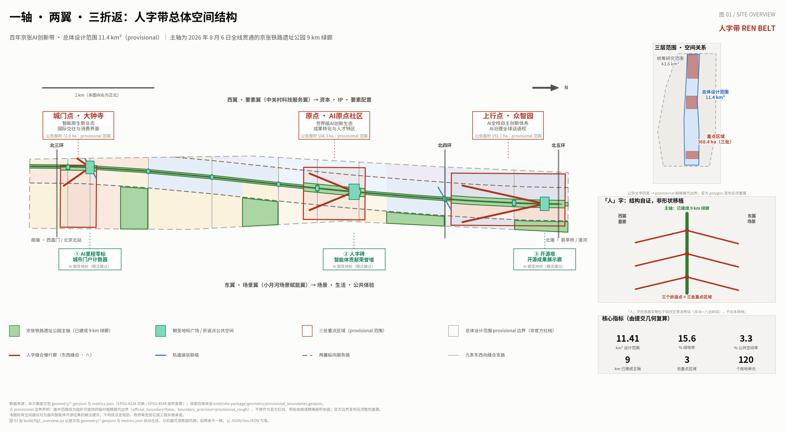
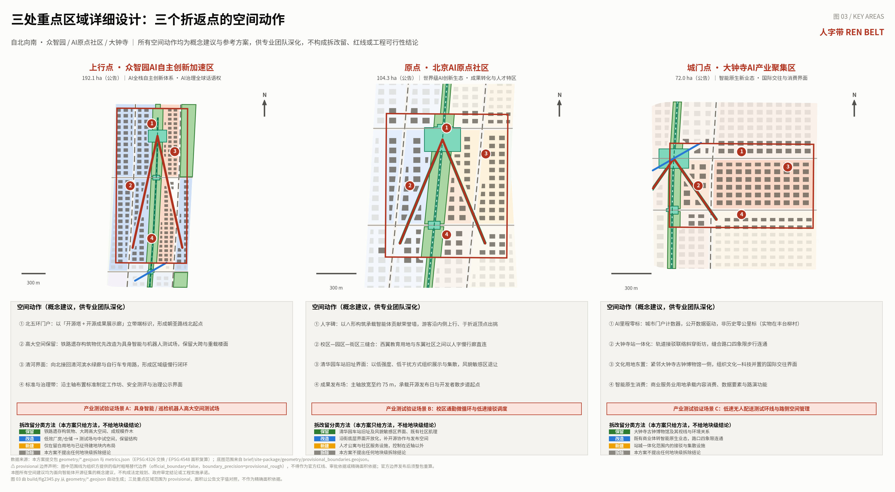
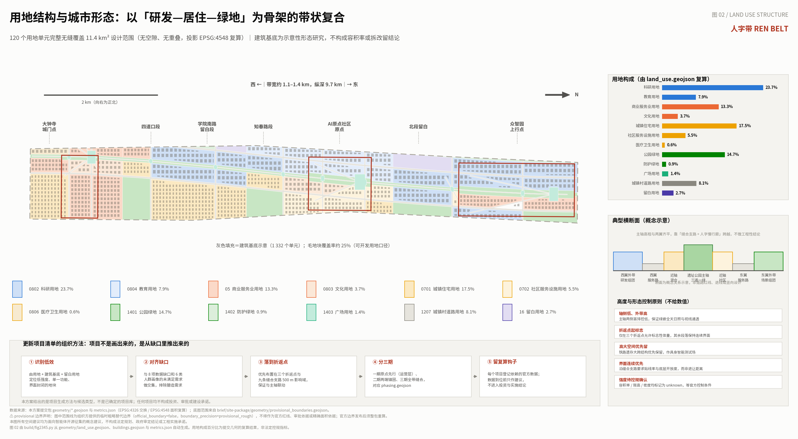
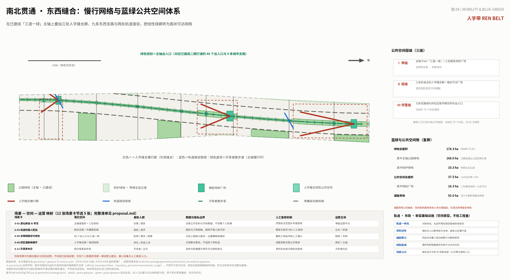
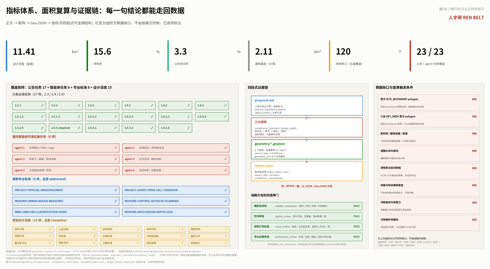

# Pinyin Character: rén zì dài REN BELT: Urban Design Scheme for the Centennial Jing-Zhang AI Innovation Belt

**A Single Assertion: This green corridor is already built, lacking is not another park design, but the mechanisms and spaces to begin producing innovation.**

According to public reports, the Jing-Zhang Railway Heritage Park Phase II was completed and opened on August 6, 2026. The park spans approximately 9 kilometers north to south, with a total of 9 urban branch roads being connected and 46 entrances and exits established, achieving a continuous 'three paths and one green' [source:PARK-COMPLETION-2026]. This open call for submissions to the intelligent community was exactly opened the day after its completion. This means a previously overlooked judgment: **the true design subject of this project is no longer 'how to transform the railway corridor into a park,' but rather 'what makes this strip a hub for AI innovation after the park is built.'**

The Beijing Municipal Commission of Urban Planning and Natural Resources' interpretation of the site park plan, as announced, proposes the concept of the 'Three Lines Tapestry' — historical line, life line, and innovation line [source:PARK-OFFICIAL-PLANNING]. By comparing the achievements of Phase II, it can be seen that the historical line (relic restoration, Jing-Zhang Loop, sleeper garden, etc.) and the life line (46 entrances, 9 branch roads, three levels of green space, community vitality sections) have solid physical carriers; **however, the innovation line is currently mainly a narrative expression, lacking spaces and mechanisms that can be implemented, operated, and verified**. This proposal strictly confines itself to this gap: it does not repeat the design of the already constructed green corridors but instead specifically complements the innovation line.

## Design Basis and Source List

This plan is based on the project objectives, three layers of scope, six design tasks, and depth requirements for outcomes established in the International Qualification Pre-Review Announcement for the Centennial Jing-Zhang AI Innovation Belt Urban Design [standard:PROJECT-OFFICIAL-ANNOUNCEMENT] [source:OFFICIAL-ANNOUNCEMENT]; the second basis is the excerpt from the task book for an open call to global intelligent entities, including ten co-creation principles, agent.1 to agent.6 six mandatory tasks, unified evaluation dimensions, and uniform boundary clauses [standard:PROJECT-AGENT-OPEN-CALL-TASKBOOK] [source:AGENT-TASKBOOK]. The machine-readable basis for the proposal comes from the design brief, allowable design space, enumerations, and metric ranges in the repository `brief/site-package/` [source:SITE-PACKAGE], geometric references from the temporary rough alternative boundaries provided by the organizers [source:BOUNDARY-SOURCE] [source:KEY-AREA-SOURCE], data usage boundaries from the availability registry in `data/source_registry.json` [source:SOURCE-REGISTRY], and reading navigation from the processed fact package [source:PROCESSED-FACT-PACK]. The task background, development vision, and proposal boundaries are also referenced in the publicly available task brief draft `brief/public-brief.md` and data boundary descriptions `brief/README.md` [source:SITE-PACKAGE].

At the professional methodological level, this plan is organized according to the Urban Design Management Measures for overall appearance, Public Space, and building layout [standard:MOHURD-URBAN-DESIGN-MEASURES], and the urban design depth of the control detailed planning for land use, intensity, and facility content [standard:MOHURD-CONTROL-DETAILED-PLANNING]. The land use classification adopts a subset of the projects from the Land Use and Sea Area Classification Guide for Land and Space Investigation, Planning, and Use Control [standard:MNR-LAND-USE-CLASSIFICATION-GUIDE]. The depth of the results refers to the expression requirements of the architectural engineering design document preparation depth regulations at the scheme stage [standard:MOHURD-ARCH-DESIGN-DEPTH-2016]. All these standards are based on local reference snapshots in the repository `brief/site-package/standards/references/`, with external links not serving as the sole evidence. (Regulatory Detailed Planning)

**Data Usage Boundary, as follows:** First, this scheme does not use any non-public planning documents, ownership data, or unauthorized third-party data. All factual statements are either from the aforementioned registered sources or from publicly accessible government websites and mainstream media reports. Second, the boundary provided by the organizing body is marked as `official_boundary=false`, `geometry_role=provisional_constraint`, and `boundary_precision=provisional_rough`, representing a temporary and rough range. This annotation is maintained throughout all layers, drawings, HTML, and assumption files, and is not described as an Official Planning Boundary, approval basis, or precise area reference [data:geometry/site_boundary.geojson#SITE-001]. Third, for all content involving the Floor Area Ratio, Building Height, Building Coverage Ratio, road redline, setback, and statutory green space ratio, this plan does not provide numerical conclusions. In `metrics.json`, these are marked as `unknown` and require the identification of official sources [metric:floor_area_ratio]. Fourth, all spatial recommendations in the plan are Conceptual Recommendations, reference schemes, or materials for professional teams to deepen their research. They do not replace statutory planning, nor do they constitute government approval conclusions, investment commitments, or engineering feasibility conclusions.

The basic judgment of the existing conditions diagnosis can be summarized in three sentences [depth:existing_conditions_diagnosis]: First, **north-south connection, east-west separation** — the main axis of 9 kilometers has been connected, but the horizontal connections between research and development, residential, commercial, and campus areas on both sides of the corridor still mainly rely on existing urban roads. There is a lack of dedicated horizontal connections designed for walking and innovative interactions; Second, **space exists, but scenes are lacking** — the park provides high-quality open spaces, but there is a lack of mechanisms and facilities to organize AI research and development, testing, release, and experience into the Public Space; Third, **highly concentrated resources, closed interfaces** — the density of universities, research institutions, and enterprises along the line is extremely high, with official planning interpretation stating that the density of innovative enterprises along the line exceeds 800 per square kilometer [source:PARK-OFFICIAL-PLANNING]. However, a large amount of research and industrial spaces are closed to the public, making the innovation process invisible and unparticipated in. These three diagnoses directly determine the three actions of this plan: stitching, insertion, and openness.

## Three-Level Scope Framework

The three layers of the announced scope are given different working natures in this plan, rather than being three scales of the same set of drawings [depth:three_level_scope_framework]. **Coordinated Research Area (43.6 square kilometers) is the judgment layer**: At this layer, no design is drawn, but only strategic questions regarding industrial ecology, regional coordination, and the future urban form are addressed. The output is strategies and relationship diagrams, without specifying land use and red lines. **Overall Design Area (11.4 square kilometers) is the structural layer**: At this layer, the spatial framework of one axis and two wings with three turns, land use structure, network weaving, blue-green Public Space system, and phased timing are determined, reaching the depth of Urban Design for Regulatory Detailed Planning [standard:MOHURD-CONTROL-DETAILED-PLANNING]. **Key-Area Detailed Design Area (368.4 hectares, three areas) is the validation layer**: At this layer, specific spatial actions, scene placements, and implementation dependencies are used to validate whether the judgments of the structural layer stand up.

The connections between layers are based on "re-calculable" rather than "stackable." Each industrial judgment at the strategic layer must correspond to a land use type or Public Space type at the structural layer; each spatial decision at the structural layer must find at least one describable specific action at the validation layer. Any judgment that does not find a landing point in the lower layer will be returned to the status of "awaiting research" and will not be included in the conclusions. This constraint is a direct response of this plan to the review dimension of "planning innovation": **the essence of integrated planning does not lie in the completeness of the drawing layers, but in the traceability across layers**.

The boundary geometry submitted in this proposal uses the provisional range provided by the organizers, recalculated after projecting to EPSG:4548 with an area of [metric:site_area_sqm], consistent with the announced area of approximately 11.4 square kilometers. However, **this recalculated value is for magnitude reference only and is not to be used as an accurate area measurement**. Three key areas are identified by `area_id` corresponding to the announcement names, with areas annotated as 192.1, 104.3, and 72.0 hectares, respectively, as indicated in [data:geometry/key_areas.geojson#PROV-KEY-001] [data:geometry/key_areas.geojson#PROV-KEY-002] [data:geometry/key_areas.geojson#PROV-KEY-003], with a count of [metric:key_area_count]. After the official polygon is released, the boundaries, key areas, land uses, roads, green spaces, Public Spaces, buildings, phased indicators, and full indicators must be recalculated in their fixed order as a complete package and re-run the self-inspection, and no single file should be replaced.

## Coordinated Research Area: Industry and Future City Research

### Overall Concept and Naming System (agent.1)

**Main Name: REN BELT. Logo: ∧.**

The 'person' character comes from the most well-known engineering theme of the Jing-Zhang Railway. It is essential to clarify one thing first, as it determines the validity of the reference: the physical 'person' character turnaround is located at Qinglong Bridge Station in the Guan Gou—Badaling section of the Jing-Zhang Railway, which falls under Yanqing District, and is located tens of kilometers away from the project site, thus not within the design scope. Furthermore, according to the official and academic consensus, Zhan Tianyou was not the inventor of the 'person' character turnaround but rather adapted the existing turnaround practices from foreign mountain railways to make engineering decisions suited to the local conditions [source:JINGZHANG-HISTORY]. Therefore, this plan does not treat the 'person' character as a shape that can be moved, but rather as a method that can be inherited.

That method was as follows: the maximum gradient of Guan Gou section reached 33‰, far exceeding the traction capacity of the locomotives at the time; the solution was not to force it, but to make a turnaround — **using length in place of height, changing direction to ascend** — and thus shorten the Badaling Tunnel from approximately 1800 meters to 1091 meters [source:JINGZHANG-HISTORY]. Today, Haidian faces a 'gradient' not of terrain: but of the gap between research outcomes and industrial transformation, between technical capability and public acceptance, and between international discourse and local context. The method still applies — **not to directly push technology into the city, but to make a turn, validate, and then proceed at specially designed turnaround points.**

At the same time, the character "person" also forms the inherent plan shape of the site itself, which is the second reason for adopting this design: the Zhongguancun Technology Services Wing (element) meets the Xiaoyue River Scenario Enablement Wing (scene) along the main axis, forming a stroke and a bend, with the intersection point serving as the turnaround point. The three key areas precisely form these three intersection points. **Therefore, this is not about transplanting the shape of Badaling, but about the self-verification of the site's one-axis-two-wings structure.**

The symbol is a minimalist icon that can be read in five distinct meanings: the Chinese character 'ren' (person), a schematic representation of a turnaround track, an upward arrow, the vanishing point of two-rail perspective, and a roof eave (shelter). Its extensibility was deliberately designed—it can be the top outline of a milestone, the legs of a bench, the section of a pergola, the brim of a signpost, or the section of an honor wall. **The naming system is structured in five levels: "Band-Axis-Point-Wing-Indicator"**: Band (REN BELT, person-shaped band), Axis (The Centennial Line, the 9-kilometer green corridor already built), Point (three turnaround points: Zhongzhiyuan = Upward Point, AI Origin Community = Origin Point, Dazhongsi = City Gate Point), Wing (West = Element Wing, East = Scene Wing), Indicator (milepost, a unified sign and counting unit throughout the band). English uses REN BELT as the main title, with the subtitle "The Switchback" for international dissemination—switchback is the standard term in English for turnaround tracks, allowing non-Chinese readers to understand directly without relying on pinyin. (Jing-Zhang)

Visual design direction: The primary colors are derived from the railway materials themselves — rust red rails (as the sole accent color), tie gray, and signal green; the font is clearly defined as an open-source licensed font (such as Source Han Sans / Noto Sans CJK, SIL OFL 1.1). **All drawings and web pages in the submission package must use this type of open-source licensed font, and no unauthorized fonts, images, trademarks, or logos shall be used.** The cultural sign system (mile markers, heritage interpretation) and the One Belt One Road overall logo system are layered and do not overlap: the logo is used for branding and communication, while the mile markers are used for site signage. Both share the same thematic element but do not use the same logo.

### Three Key Orientations, Five Major Functions, and the Synergistic Circuits of the Three Zones and Two Wings

Three key positioning areas are not three parallel bands in space, but rather three slices of the same band: the Centennial Jing-Zhang Cultural Belt as the **time slice**, the Urban AI Living Experience Belt as the **daily slice**, and the AI Integration Innovation Belt as the **production slice**. The coordinated functioning of the five major functions with the Three Zones and Two Wings is organized in this scheme as a closed loop: the Element Wing (Zhongguancun Technology Services Wing) supplies capital, IP, and element allocation → the Upstream Point (Zhongzhiyuan) bears the Full-Stack Independent AI Innovation System and global AI governance discourse → the Origin (AI Origin Community) bears the world-class AI Innovation Ecosystem and transformation of results → the Scenario Wing (Xiaoyue River Scenario Enablement Wing) provides AI-Enabled Scenario empowerment and the real test bed for an intelligent, vibrant city → the Gateway Point (Dazhongsi) bears the intelligent, nascent new business forms and pushes results to the market and internationally → the benefits and demands flow back to the Element Wing. **The loop can only be closed if the three turnaround points truly possess the 'reversal' capability**—that is, whether research can be transformed into products, products can be transformed into scenarios, and scenarios can be transformed into public life. This is why this scheme places its design focus on the turnaround points rather than the entire band.

### Global AI Innovation Ecosystem Case Study (agent.2)

This plan selects six cases, **two of which are genuine rail land regeneration examples, while the remaining four provide controls with anchoring and governance mechanisms**; each case retains only verifiable facts and clearly distinguishes between the "transposable" and "non-transposable" elements, avoiding the adoption of external experiences as local commitments.

| Case | Relevance to This Project | Core Facts (Verifiable) | Transposable | Non-Transposable |
| --- | --- | --- | --- | --- |
| London King's Cross / Knowledge Quarter | **Railway Land Regeneration + AI Anchoring** | Approximately 27 hectares of integrated regeneration of abandoned railway land, including the restoration of 20 historic buildings; Central Saint Martin moved in in 2011; Google DeepMind is located at Handyside Street S2 (completed in 2018). Knowledge Quarter is a **voluntary membership organization** established in 2014, not a landowner. | 'Voluntary membership knowledge community' separated from land ownership — membership does not require owning land to organize an ecosystem; single ownership + long-term capital support for phased development and heritage preservation | The legitimacy of self-governance by members comes from voluntary membership and self-set agendas, not from administrative designation or replication |
| Paris Station F | **Railway Freight Station Renovation** | Located at the Halle Freyssinet railway freight terminal built between 1927 and 1929, which ceased railway use in 2006 and was **listed as a historical building for protection** in 2012; the park opened in June 2017, covering approximately 3.4 hectares | **Protection before renovation**; "project-based recruitment" — the park does not directly select companies but selects operators, who then fill the slots according to their own standards | A model of single private investment with no public obligation, not comparable to government-led district development initiatives |
| Pittsburgh Robotics Cluster | **Reusing Industrial Heritage** | The CMU National Robotics Engineering Center was established in Lawrenceville in 1996; a non-profit organization, RIDC, acquired the 14-acre Heppenstall Steel Works site in 2002, transforming it into a robotics enterprise headquarters where approximately 30,000 square feet of **large-span factory space** serves as the home for robotics companies. | **Large-Space Equates to Competitive Edge** — Robotics and embodied intelligence require large spans, column-free, and heavy-load-bearing floors, which are precisely the natural attributes of industrial heritage structures. **This is the most direct case among the six for this project**. | The cluster emerged spontaneously over two decades and cannot be created by planning; it can only transplant architectural types rather than the mechanisms of spillover. |
| Montreal Mila | Research Institution Anchoring + Ethical Co-construction | Established in 1993, moved into the O Mile-Ex, which was renovated from an old knitting factory in January 2019; the Montreal Declaration for the Responsible Development of Artificial Intelligence was initiated by the University of Montreal and held 15 deliberative workshops in 15 Public Spaces starting in 2017, with over 500 participants, resulting in 10 principles. | **Scenario Access's social legitimacy comes from public deliberation processes** rather than technical documents; this is a soft infrastructure that does not require land use. | The scientific reputation of a single scholar over two decades cannot be planned; its scale is that of a standalone building and is insufficient to support district-level arguments. |
| Singapore Punggol Digital District | National Planning Digital District | 50 hectares, led by JTC; Singapore Polytechnic campus to be operational by September 2024; Phase 1 of about 21 hectares to be phased open from the third quarter of 2024. Introduces the concept of a **"Business District"** allowing **industrial and academic spaces to cross-block exchange**; an **"Open Digital Platform"** to build digital twins for testing. | **"Space Exchange" as a Planning Tool"** — integrating campus and parkland at the parcel level rather than the zoning level; a risk-mitigation path of **"open the model first, then the streets"** | New reclaimed land, with a single statutory authority controlling all land and data layers; heritage areas and mixed ownership cannot be replicated |
| Zhongguancun (Domestic Benchmark) | Urban Institutional Environment | On October 23, 1980, Chen Chunxian founded the first private science and technology institution in the warehouse of the Chinese Academy of Sciences Physics Institute; on May 10, 1988, the State Council approved the establishment of the Beijing New Technology Development Experimental Zone, which was the first national high-tech zone, covering approximately 100 square kilometers in Haidian; in 2012, it was adjusted to one district with sixteen parks. | "One district with multiple parks" indicates that a policy district does not necessarily equal a contiguous jurisdiction — this belt can be integrated as a "park" within the existing policy system rather than starting anew. | Zhongguancun is **agglomeration first, policy later**; it cannot be used to argue that "pre-drawing a boundary will yield an agglomeration," as the causal direction shown in public records is the opposite. |

From the six cases, the most critical comprehensive judgment for this scheme can be distilled: **the districts that possess a mechanism for Scenario Access must necessarily have both technical risk mitigation means (digital twin) and social legitimacy means (public deliberation), both of which are indispensable.** Singapore has the former, Montreal has the latter, and this scheme combines both into a single mechanism in agent.3 and agent.6.

### Future Urban Form Assessment

At this level, the proposal offers three forms of judgment, all of which can be found at the structural layer [depth:overall_spatial_structure]: First, **innovative visibility will become a variable in the urban form** — when the R&D process is visible and participatory, the innovation district differs from an industrial park, with corresponding spatial actions such as display corridors, launch venues, and a system of notice boards along the main axis; second, **low-speed autonomous devices will become a regular street user** — corresponding actions include reserving low-speed passage and roadside management spaces to stitch together side streets and the eastern wing service road, rather than retroactively adding lane markings; third, **leaving space is the correct response to uncertain technologies** — the proposal retains [metric:reserve_land_area_sqm] of open space within the district, explicitly for scenarios and facilities that have yet to emerge [data:geometry/land_use.geojson#LU-001]. These judgments are conceptual and forward-looking studies and do not constitute definitive matters for industrial recruitment, funding support, or policy arrangements.

## Overall Design Area: Urban Renewal and Regulatory-Plan-Level Urban Design

The Overall Design Area's spatial framework is defined as "one axis, two wings, three foldbacks, and nine sutures." **One axis** is the existing 9-kilometer heritage park green corridor, which this plan does not alter, but instead overlays with operational and scenario layers. **Two wings** are the west element wing and the east scenario wing, each organized by a longitudinal service road [data:geometry/roads.geojson#ROAD-NS-W]. **Three foldbacks** are three key areas, each completed by a pair of "person" shaped pedestrian corridors that stitch the east and west wings together, with the apex of the "person" located on the main axis and the legs extending into the wings [data:geometry/public_space.geojson#PUBLIC-001]. **Nine sutures** are nine east-west branch roads, corresponding in number to the nine urban branch roads already connected in Phase II, and in this plan, they are given new roles: they are not just passageways, but "scenario corridors" — each branch road corresponds to a set of AI-Enabled Scenarios and a neighborhood-level open space.

The land use structure is based on a framework of research and development—residential—green spaces [depth:land_use_layout]. The design scope is divided into 120 land use units, **fully and seamlessly covering the entire area without gaps or overlaps**, a topological property verified by `spatial_review`. Research and development land use has the highest proportion, reflecting the functional dominance of the AI innovation district; residential land use maintains a high proportion, responding to the needs of over 70 communities along the line, serving approximately 450,000 residents [source:PARK-COMPLETION-2026]; park green spaces include the existing main axis range and new community-level parks. The areas of various land uses are calculated geometrically, as detailed in the "Indicator System" section and [data:geometry/land_use.geojson#LU-002].

Development Intensity and form control aspects of this scheme **only provide principles, not specific values** [depth:development_intensity_controls] [depth:height_massing_character]. The principles are as follows: axial low, perimeter high, ensuring full-day sunlight and unobstructed views in green corridors; only three turning points are allowed for iconic massing, while the rest of the segments maintain a continuous facade; large-span structures from the railway heritage should be prioritized for retention and repurposed as test spaces; along the seam streets, the plot ratio and ground-level openness are used as primary control measures rather than setback distances; Floor Area Ratio, maximum height, and density will be marked as `unknown` until official control conditions are released. The Building Footprint is only used for form relationship studies, with a total of 1,332 indicative units, a total building footprint area of [metric:building_footprint_area_sqm], and a gross floor area ratio of approximately 25% for developable land [data:geometry/buildings.geojson#BLDG-0001]. **These numbers are used to illustrate the magnitude of form density but do not constitute construction scale, demolition and renovation retention, or property rights conclusions.** (Demolish–Renovate–Retain Strategy)

## Detailed Design of Key Areas

Three key areas are the verification layers of this plan, each addressing a different question: Zhongzhiyuan addresses "how an innovation system can be established in space," AI Origin community addresses "how outcomes can be transformed into urban life," and Dazhongsi addresses "how innovation can face the market and the world" [depth:three_key_area_detailed_design].

**Upstream Point · Zhongzhiyuan AI Independent Innovation Acceleration Area (Announced Area: 192.1 hectares).** Positioned as a carrier area for full-stack independent innovation and governance, it is also the northern portal of the entire belt. Four spatial actions: the first, establishing a landmark at the northern end of the belt with an 'Open Source Tower + Open Source Achievement Exhibition Corridor' as the starting point of the pilgrimage route; the second, **preserving and transforming the large spans and high spaces in the railway heritage into a physical intelligence and robot testing field** — this is the most direct experience drawn from the Pittsburgh case, such spaces cannot be economically replicated by new office buildings; the third, reconnecting to the Qinghe River waterfront green corridor and the dedicated bicycle path to the north, forming a regional-level slow travel loop; the fourth, arranging standard-setting workshops, safety evaluation, and governance disclosure interfaces along the main axis, making 'governance' a visible public content rather than just a document. This area carries Testing and Validation Scenario A: a high-space testing field for physical intelligence and inspection robots.

**Origin · Beijing AI Origin Community (Announced Area: 104.3 hectares).** Positioned as the source of world-class innovation ecosystems and transformation, it is also the spiritual origin point of the entire belt. Four spatial actions: the first, **Human Monument** — a V-shaped structure that serves as a tribute wall for the contributions of intelligent entities, with visitors ascending along an inner slope and extending their view at the apex of the turnaround, turning the metaphor of "turning back to move forward" into a physical experience; the second, the integration of campus, park, and community — a pedestrian corridor in the shape of a V directly connects the western wing of educational land use with the eastern wing of the community, reducing detours; the third, the **Qinghua Garden Station Site** is organized with low-intensity and low-impact methods for display and gathering — the site was listed as a Beijing cultural relic protection unit in February 2023 and officially opened to the public on March 25, 2023 [source:QINGHUAYUAN-STATION]. This plan sets a sensitive area around the site and proactively steps back [data:geometry/constraints.geojson#CON-HERITAGE-001], with specific protection and construction control zones to be determined by the cultural relic authorities. Its fourth element is the main axis, which is widened to approximately 75 meters to form a results release plaza, serving as the starting point for the open-source release day and developer promenade. This area accommodates Testing and Validation Scenario B: campus commuting micro-circulation and low-speed shuttle scheduling.

**Gate Point · Dazhongsi AI Industry Cluster (Announced Area: 72.0 hectares).** Positioned as a hub for smart native new business forms and an international exchange interface, it serves as the southern gateway facing the city and the market. Four spatial actions: First, **AI Milestone Zero** — an urban portal counter driven by public data; it should be noted that the historical zero kilometer marker of the Jing-Zhang Railway is located in Fengtai Liucun, and this marker is not a copy or replacement of the historical zero kilometer marker but a newly established public installation clearly marked as a contemporary structure [source:JINGZHANG-HISTORY]; Second, integrated Dazhongsi Station with a diagonal connection seam to stitch pedestrian connections across the four quadrants of the intersection [data:geometry/roads.geojson#ROAD-TC-DZS]; Third, cultural land use positioned to the east, adjacent to one side of the Dazhongsi Ancient Bell Museum — the temple was originally named Juesheng Temple, established by imperial decree in the tenth year of Emperor Yongzheng in the Qing Dynasty (1733), it was a Buddhist temple and a royal rain prayer venue in the Qing Dynasty, now it is the Ancient Bell Museum [source:DAZHONGSI], this plan organizes an international exchange interface that juxtaposes culture and technology, respecting its line of sight and environmental relationships. Its four, the commercial and service land use supports intelligent native consumption, content consumption, data elements, and roadshow functions. This district accommodates Testing and Validation Scenario C: a low-speed autonomous delivery test loop and roadside space management.

Three areas of the district all **only provide methods, not specific plot-level conclusions** [depth:retain_renovate_demolish]: the retained items include the remnants of the railway structures, the original fabric of cultural heritage sites, and their aesthetic surroundings, as well as large-scale mature trees and the existing community texture; the renovated items include inefficient factories and warehouses, enclosed ground-level facades along streets, and single-function existing commercial spaces; the new construction is strictly limited to vacant plots and land awaiting development; **no plot-level conclusions are proposed for the demolition items**, as the ownership and current building inventory data are not publicly available. (Demolish–Renovate–Retain Strategy)

## AI Innovation Ecosystem, Personas, and AI+ Scenarios

### Five categories or more user personas (agent.3)

This plan sets six categories of profiles, each defined by a specific moment of obstruction in a day, rather than by identity labels [depth:blue_green_public_space]. **(One) Postdoctoral Researcher**: Needs three things—compute power, data processing, and publication—all within a 15-minute walk, currently obstructed by the need to circumnavigate between campus and industrial park. **(Two) Startup CTO (Approx. 5 People)**: Needs affordable pilot space, real-world test scenarios, and a clear compliance entry point, currently obstructed by "not knowing where to ask, not knowing if it can be tested." **(Three) Dual-Working Family Parents**: Needs childcare, medical, and educational services within walking distance, and **concerns about noise, obstruction, and privacy impacts** from AI facilities, currently obstructed by a lack of information channels about new facilities. **(Four) International Visiting Researchers/Developers**: Short-term stay, needs readable spaces, bilingual signage, and a fixed annual event anchor point, currently obstructed by "not knowing what to see upon arrival." **(Five) Riders and Low-Speed Equipment Maintenance Staff**: Needs roadside parking, charging, and a safe human-machine interface, currently obstructed by the lack of formal design of roadside spaces. **(Six)Railway Workers' Descendants and Long-Term Residents**: This group requires that history be accurately told and that their sense of participation be acknowledged, currently hindered by the one-way output of heritage narratives. The sixth profile is a special setting within this scheme for cultural heritage—**stakeholders in heritage are not just visitors**.

### Twelve AI Scene Cards

Each scene card fixes five fields: placement space, service population, data and privacy boundaries, Human Review mechanism, and operational entity. **For all scenarios involving personal data, a default anonymization, minimum data collection, and human review entry must be set; this plan does not propose any scenarios requiring facial recognition, individual trajectory tracking, or data that cannot be manually reviewed.**

| ID | Scenario Card | Placement Space | Data and Privacy Boundaries | Human Review Mechanism |
| --- | --- | --- | --- | --- |
| S-01 | Heritage Corridor AI Guiding (`ai-cultural-guide`) | Main Axis Milestones + Three Landmarks | No Personal Image Collection, Only Public Records and Open Data | Content Reviewed Annually by the Cultural Team, Errors Can Be Reported Publicly |
| S-02 | Identification and Rectification of Slow Travel Discontinuities (`ai-traffic-walkability`) | 46 Entry Points and Three Layers of Green | Image Sensitivity Removed in Real Time, Only Discontinuity Coordinates Retained | Rectification Orders Executed After Confirmation by Municipal Personnel |
| S-03 | Low-Speed Robot Delivery (`robot-delivery-low-speed`) | Seam Street + East Wing Service Road | Path and order desensitization, no facial recognition at the roadside | Accidents and complaints reviewed within 48 hours by Human Review |
| S-04 | Enterprise Service Copilot (`enterprise-service-copilot`) | Innovative Service Hall with Three Return Points | Index Public Policy Texts Only, Do Not Access Enterprise Own System Data | Respond with Confidence Scores, Transfer Important Matters to Manual Processing |
| S-05 | Real-Time Accessibility of Barrier-Free Paths | Full with Entrances and Ramps | Crowdsourced Reporting Default Anonymous, Location Fuzzied to Segment | Confirmed by Both Landscape and Urban Maintenance Teams |
| S-06 | AI+ Medical and Health Services Navigation (`ai-health-service-navigation`) | Medical and Health Land Uses and Community Service Points | Does Not Store Personal Health Information, Only Provides Service Guidance | Medical Content Must Be Reviewed by Practicing Professionals |
| S-07 | Public Safety Operations Review for Large Events (`public-safety-operations-review`) | Three Landmark Squares | Aggregate Crowd Density Only, No Individual Identification | Human Review Report Issued After Each Event |
| S-08 | Campus Commuter Micro-Circulation Scheduling | Peculiar Stich Seam Corridor + Shuttle Connections | Utilize Aggregated Passenger Flow, Not Individual Trajectory Tracking | Monthly Public Review of Scheduling Parameters |
| S-09 | Night Lighting and Activity Adaptation | Main Axis Slow-Travel Loop | Utilizing Illuminance and Aggregated Footfall Only, No Camera Recognition | Residents Can Apply to Restore Fixed Lighting Mode |
| S-10 | Open Source Model Public Release Day | Origin Outcome Release Field | Release Content Follows Open Source Licensing and Copyright Registration | Dual Compliance and Copyright Review Before Release |
| S-11 | Embodied Intelligence High-Dimensional Space Testing | Zhongzhiyuan Legacy Transformation Testing Site | Test Data Is Isolated Within the Site and Not Linked to the Urban System | Each Test Must Be Approved by the On-Site Supervisor |
| S-12 | Community Meeting AI Recording and Verification | Neighborhood-Level Open Spaces and Community Service Facilities | Speeches Default to Anonymous, Original Audio Not Archived | Minutes Require Confirmation by Attendees to Take Effect |

Among them, S-11, S-08, and S-03 correspond to three **Testing and Validation Scenarios** for three key areas, all of which are test scenarios and do not constitute approved operations.

**Scene disclosure signs are the key connecting elements in this scheme between agent.3 and agent.4**: a standard sign is uniformly placed at locations where AI scenarios operate in Public Spaces, disclosing the system name, data collection content, retention period, Human Review contact information, and exit mechanism. It serves both as a governance device and a component of the public space—**turning the 'reviewable' promise into a visible sign on the street**.

## Urban Agent Governance Mechanism

This proposal treats **Urban Agent Governance** as a category of infrastructure rather than a statement. The reasoning is straightforward: if various agent systems continue to run within the space of AI innovation, then "who is running them, what data they use, and who to hold accountable for errors" should be as fixed as plumbing, lighting, and must be determined during the Urban Design phase. Among the five mechanisms listed below, the first is a physical component, while the remaining four are processes, but each can point to specific spaces or files [depth:risk_missing_data] [standard:PROJECT-AGENT-OPEN-CALL-TASKBOOK].

**One, Scene Information Plaques: Convert Revocable Commitments into a Plaque.** At all locations in Public Spaces where AI scenarios are running, a standard information plaque should be uniformly set up to disclose the following six items: system name and operating entity, content collected and content not collected, data retention period, contact information for Human Review, ways to exit or file a complaint, and the date of the most recent review. This plaque is included in the public space component library and enters the municipal facility maintenance sequence, thus it is not a temporary notice but a city furniture with a maintenance responsibility holder [data:geometry/public_space.geojson#PUBLIC-002]. The purpose of this component is to **spatialize** governance obligations: if a scenario cannot find a place to post a plaque, it usually indicates that the responsible entity itself is not clear.

**Secondly, the dual-track process of scenario openness: twin first, then street; technical de-risking and social legitimacy appear in pairs.** The key judgments drawn from six cases indicate that Singapore's Punggol's open digital platform addresses technical de-risking (through digital twins by first simulating), while the Montreal Declaration's fifteen public deliberation workshops address social legitimacy (through discussions in real Public Spaces first). Both are indispensable [source:GLOBAL-AI-DISTRICT-CASES]. This proposal suggests that any scenario entering public space should follow a dual-track process: the technical track completes the simulation and public explanation in the twin environment; the social track completes a public discussion in the affected community and retains minutes. Both tracks must be completed before entering the street pilot, with clear exit conditions set for the pilot phase. (Scenario Access)

**Thirdly, Human Review tiering: based on reversibility rather than technological advancement.** This scheme categorizes twelve scenario cards into three tiers based on "whether the consequences are reversible after an error occurs": reversible and affecting individuals (such as navigation content errors) are subject to post-incident spot checks and public reporting; reversible but affecting groups (such as lighting and scheduling parameters) are subject to monthly public reviews and retain an application channel for reverting to a fixed mode; involving personal safety or irreversible consequences (such as low-speed equipment on the road) are subject to step-by-step approval with a human review within 48 hours of an accident. **The tiering is based on the reversibility of the consequences, not the advanced nature of the model's capabilities**—this principle's practical effect is to prevent the slide of "fewer reviews can be done because the technology is more mature."

**Fourth, the mechanism for addressing public feedback: mileposts serve as both wayfinding units and governance units.** The entire corridor uses mileposts as a unified addressing unit, allowing anyone to specify a particular numbered location for feedback—e.g., "The path is not passable at milepost XX" or "The information on the sign at point XX is outdated." One of the most common failures in urban governance is not the lack of feedback but the inability to locate it. Mileposts transform the entire corridor into an addressable coordinate system, which sets them apart from ordinary wayfinding signs [data:geometry/roads.geojson#ROAD-WALK].

**Fifth, Collaboration of Intelligent Agents with Human Final Judgment: This Submission Package Itself is a Demonstration.** This proposal is generated by an AI agent based on publicly available information, passing through four automatic gates of deterministic validation, spatial review, visual packaging inspection, and professional evidence review. Ultimately, it is judged by humans and a professional team—this aligns with the seventh requirement of the call for co-creation. Reusable structures consist of four layers: five types of evidence references for in-text annotations, three matrices mapping tasks to layers, GeoJSON with five required attributes for each element, and indicators with seven required fields per item. **The value of this structure does not lie in this particular proposal, but in its potential to serve as a shared knowledge structure for urban governance by subsequent agents and professional teams:** the next agent does not need to start from scratch parsing scattered information.PDF, continue working on the same set of fields, compare differences, and record iterations.[source:AGENT-TASKBOOK].

Accompanying this is a self-imposed constraint: **the data gap register itself is a governance tool**. The eight gaps registered in this scheme are not disclaimers, but rather clear instructions to subsequent teams on "when and under what conditions certain conclusions will become invalid and in what order they should be recalculated." A plan that refuses to acknowledge what it does not know cannot be verified and thus cannot be trusted.

## Land Use, Building Scale, and Retain-Renovate-Demolish Strategy

The Land-Use Layout follows the principle of "proximity to axis with mixed use and peripheral specialization": land parcels near the main axis are primarily mixed-use with community services to ensure continuous use of green corridors throughout the day; peripheral parcels are zoned by wings, with the western wing focusing on research and education, and the eastern wing on residential, community services, and scenario-based commercial activities. All 120 land-use units are coded using a subset of the national land-use classification project [standard:MNR-LAND-USE-CLASSIFICATION-GUIDE], with areas recalculated after geometric projection to EPSG:4548 and independently verifiable by a script [data:geometry/land_use.geojson#LU-003].

The depth of expression for the scale and form of the buildings shall refer to the preparation depth requirements for the scheme stage [standard:MOHURD-ARCH-DESIGN-DEPTH-2016]: provide the relationship of the base, volume zoning, and principles for controlling the interface, but do not specify individual design, number of floors, and height values. The scale of green spaces and Public Spaces is expressed by [metric:green_space_area_sqm] and [metric:public_space_area_sqm], respectively, while the scale of road land use is expressed by [metric:road_land_area_sqm]. The scale of research and residential land use is expressed by [metric:research_land_area_sqm] and [metric:residential_land_area_sqm], respectively. **It must be noted that there is a deviation in one aspect of the metrics: the area of road land use is only calculated for the new network added by this scheme, and the existing road network is not included in the scheme's layers. Therefore, this value is significantly lower than the actual proportion of urban road land use and should not be used for compliance determination.**

The renewal project is not drawn, but pushed out from the gaps [depth:renewal_project_list]. The method consists of five steps: identifying inefficiencies (locating low-intensity, single-use, and closed-off sites through Building Footprints and vacant land) → aligning gaps (intersecting with the unmet demands of eight data gaps and six types of images, excluding fabricated demands) → landing at turnaround points (prioritizing placement within three turnaround points and the 500-meter influence areas of nine seam roads) → phasing in three phases (corresponding to [data:geometry/phasing.geojson#PHASE-001]) → leaving re-calibration hooks (each project registers its dependency on official data, making only recommendations until the data is in place).

## Transport, Rail, Municipal Infrastructure, and Public Services

The core of the traffic strategy is to **transform the existing linear green corridors into a network of accessible areas** [depth:traffic_rail_slow_parking]. The main axis's "three paths and one green" has already provided continuous pedestrian paths, running tracks, and cycling lanes; this plan overlays three pedestrian stitches (east-west direction), nine stitching side streets (east-west direction), and two rail connection stitches (Dazhongsi station and North Fourth Ring node), significantly reducing the lateral distance from any point along the line to the main axis. All road centerlines and cross-sections are conceptual suggestions [data:geometry/roads.geojson#ROAD-EW-05], **not constituting road red lines, setbacks, or engineering implementation conclusions**; the methods of crossing North Third Ring, North Fourth Ring, and North Fifth Ring are only expressed as connection relationships in this plan, without providing engineering feasibility conclusions for bridges or underground spaces.

The roadside space for non-motorized vehicles and low-speed devices is treated as a formal design object: parking and charging are provided at each entrance and exit to avoid occupying the slow zone; side streets are reserved with intervals for low-speed passage and temporary stops. Parking supply is not given a quota in the absence of official control conditions, but only the principle of "replacing channel parking with station access" is proposed.

Municipal and New Infrastructure are provided **only with spatial types and location principles, not with engineering quantities** [depth:municipal_new_infrastructure]: End-side computational power and heat dissipation chambers are arranged at three turnaround points, close to demand and convenient for maintenance; distributed photovoltaics prioritize the use of the roofs of existing structures. Scene information signs are included in the sequence of municipal facilities for unified management. In terms of public service facilities, healthcare land is located in the southern segment gateway area, facilitating service to densely populated residential clusters and supporting the S-06 scenario; community service facilities are arranged along the axis, paired with the neighborhood-level open spaces of the nine interweaving alleyways. **All content related to pipelines, load-bearing capacity, and facility standards are pending confirmation under formal zoning conditions and specialized documentation.**

## Blue-Green Network, Public Space, and Urban Character

Public Space is organized into a three-tier system [depth:blue_green_public_space]. **Tier Level** features the main axis of 9 kilometers with "three paths and one green" plus three holy site squares, serving global visitors and annual events; **Segment Level** includes the return points' zigzag stitching corridors and stitching node squares, serving daily commutes between campus, industrial park, and residential areas; **Neighborhood Level** comprises the community-level open spaces and entrances at the ends of nine branch roads, serving the residents of approximately 70 communities along the way. These tiers are connected by unified mile markers for guidance, forming a continuous experience that can be numbered, addressed, and narrated [data:geometry/green_space.geojson#GREEN-001].

Green space ratio recalculated value is [metric:green_ratio], and Public Space ratio is [metric:public_space_ratio]. **These ratios are the self-assessed recalculated results of the submitted geometry for this proposal, and are not the statutory compliance determination**; the statutory green space ratio control value is not within the range of publicly available materials, and must be recalculated after the official conditions are released.

### AI Public Space, Sanctuary Landmarks, and Honor Display System (agent.4)

**Conceptual Strategies for East-West Stitching and North-South Penetration** have been outlined in the transportation section, resulting in three ∧-shaped linear Public Spaces. Based on this, this plan proposes **three AI Holy Sites** (all are Conceptual Recommendations, to be refined by a professional team and the relevant stakeholders):

**One, the Human Monument (Origin Point)** —— an inverted V-shaped structure, with two inclined weathering steel walls intersecting at the apex, where the inner wall serves as the Honor Wall for the contributors' GitHub names and Agent names; visitors ascend along the inner wall and turn out at the apex. It bears the commemorative system of this project itself: the names of the contributors and agents who submitted the selected proposals. **Two, the AI Milestone Zero (City Gate Point)** — a public counter facing the city, displaying only values from publicly available open data sets, with sources and update times clearly labeled; it reiterates that it is not a historical zero-kilometer marker. **Three, the Open Source Tower and Open Source Achievements Gallery (Ascending Point)** — a vertical marker with a linear display corridor, showcasing milestones of open source releases, models, and standards. Additionally, the **Developer Walkway** runs through the entire band, using mile markers as addressing units, constituting a fourth type of landmark that can be used daily.

**The Honor Display System is divided into three layers**: the Annual Stele Layer (Pillar of Honor, permanent, annual additions), the Annual Update Layer (the digital honor wall of the Open Source Tower, replaceable), and the Distributed Layer (mile markers with embedded names along the route). The rules for all three layers are consistent: **record contributions without ranking individuals**; the sources of the lists are publicly available and verifiable; and errors can be appealed and corrected. **The Public Space Component Library** takes the theme of ∧, including mile markers, turnaround shelters (shelter, charging, docking for low-speed devices), sleeper benches, display corridor units, and scene disclosure plaques. These form a suite that is replicable, extensible, and replaceable. None of the above involves breaking the constraints of cultural heritage protection, green spaces, blue lines, or traffic safety. It does not involve unauthorized modifications to business buildings or proprietary spaces, nor does it **adopt overly entertaining or viral expressions**.

### Urban Character and Cultural Narrative (agent.5)

This plan's cultural narrative follows a single thread, as it can be verified: **each generation has encountered its own '33‰ grade', and the solution has always been to turn back rather than force a way through.** The Jing-Zhang Railway, completed and operational in 1909, was the first major railway line in China that was surveyed, designed, and constructed by Chinese people (must include 'major' — the Tangxu Railway in 1881 was earlier, and the New-Yi Railway built independently by Zhan Tianyou between 1902-1903 was also earlier) [source:JINGZHANG-HISTORY]; it faced a grade challenge of terrain and technological blockade, and the solution was to trade length for height. On October 23, 1980, Chen Chunxian hung the sign for the first private science and technology institution in a warehouse at the Institute of Physics of the Chinese Academy of Sciences; on May 10, 1988, the State Council approved the establishment of China's first national-level high-tech zone [source:ZHONGGUANCUN-HISTORY]; it faced a grade challenge of the gap between system and market, and the solution was similarly not to attack head-on, but to **first turn back at the periphery, then be recognized by the mainstream**. Today's grade is one of transformation, openness, and trust. These three segments of history are therefore not three exhibition panels, but three applications of the same method.

The boundaries that require careful handling are addressed in this proposal to avoid narrative distortion: the "Person" character shape does not exist in this site; the Jing-Zhang Railway cannot be referred to as "China's first railway"; Tsingjiu Chan cannot be described as "inventing" a turnaround track; the origin of the name Zhongguancun is still a subject of scholarly debate, and this proposal does not make any assertions; the corridor is located east of Zhongguancun Avenue, **adjacent to but not crossing the core area of the Zhongguancun Science City**; Peking University is located about 2 kilometers west of the corridor, within the radiation zone rather than the along-line area. The official planning text clearly lists the along-line universities and institutes including Tsinghua University, Beijing University of Aeronautics and Astronautics, Beijing Jiaotong University, and the Chinese Academy of Sciences [source:PARK-OFFICIAL-PLANNING].

**Wayfinding and Symbol System** uses mileposts as the basic unit: one is placed every 100 meters along the main axis, displaying both historical railway mileage and "AI Mileage" (the latter being a contemporary metric driven by open data, clearly labeled as a contemporary installation). The font uses open-source licensed fonts, and the colors are derived from the rusty red of the rails, the gray of the ties, and the signal green. **The cultural identifier system and the One Belt One Road logo system are layered and not mixed.** The core sentence for international communication could be: *A railway that climbed by turning. A city that advances by returning to the human.* (A railway that climbed by turning; a city that advances by returning to the human.) —— it carries both the engineering meaning of switchback and the humanistic meaning of the character "person," without relying on understanding of the Chinese text.

## Renewal Projects, Implementation Policy, and Phasing

Phase implementation according to the order of "operational layer first, then construction layer," because the main axis has already been built, and the most effective results are not from new construction projects [depth:phasing_implementation]. **Phase One: AI Origin First**: Start with the AI Origin community as the point of origin, placing the human ziggurat and the results release field, and simultaneously launch the developer promenade, scene disclosure plaques, and the first batch of scene cards (S-01, S-05, S-10) to validate the operational mechanism; corresponding to the mid-range area outside of [data:geometry/phasing.geojson#PHASE-002]. **Phase Two: Anchoring Both Ends**: Construct the open-source tower and the AI Mile Zero marker, integrate the integrated transfer at Dazhongsi station, and launch test scenarios such as S-03 and S-11. **Phase Three: Full Band Integration and Wing Expansion**: Complete the scene corridor renovations for the nine connecting streets and organize the two wings service roads.

Policy recommendations implemented will be limited to directions that can be accommodated by existing mechanisms, without involving fiscal or approval commitments:

1. **Adopt the 'one zone, multiple parks' approach** to integrate this corridor into the existing policy framework as a park, avoiding the establishment of a new institution (drawing inspiration from the institutional form of Zhongguancun);
2. Establish a **membership-based innovation belt community**, where universities, research institutions, companies, and communities can voluntarily join and share in the operation (drawing inspiration from King's Cross' Knowledge Quarter, but localizing its legal basis);
3. Use **project-based recruitment** to fill spaces, with the operation party rather than the management party selecting the tenants (drawing inspiration from Station F);
4. Implement a **"first twin, then street" Scenario Access process**. Any Public Space scenario must first be simulated in a digital twin before being piloted in a real street (drawing inspiration from Punggol), and include a public review process (drawing inspiration from Montreal).

All of the above are mechanisms for professional teams and principal authorities to discuss, and **do not constitute definitive arrangements for recruitment, policy, or funding**.

In terms of stakeholder participation and measurable indicators, it is suggested to register based on the three questions of "who operates, what to monitor, and how often to monitor": Phase One will be operated by universities, developer communities, and streets, with measurable indicators suggested as the primary axis horizontal accessibility (walking time from any point to the primary axis), the number of scene information signs, and the scale of the annual list of ziggurat carvings. Phase Two will involve enterprises and the rail operation department, with indicators suggested as the proportion of quadrants in the Dazhongsi station integrated pedestrian connection and the completion rate of test scenario Human Review. Phase Three will involve community residents and municipal departments, with indicators suggested as the coverage rate of nine connecting streets for neighborhood-level open spaces and the feedback volume on the availability of accessible paths. The above indicators are only for operational monitoring and public feedback assessment purposes and need to be defined after data availability is confirmed. **They do not constitute performance commitments**.

## Metrics, Area Recalculation, and Compliance Matrix

The indicator system of this plan adheres to a discipline: **no numbers that cannot be recalculated from submitted geometry or public data are included in the conclusions** [depth:metrics_recalculation]. Known metrics include design range area [metric:site_area_sqm], green space area [metric:green_space_area_sqm], Public Space area [metric:public_space_area_sqm], Building Footprint area [metric:building_footprint_area_sqm], green space ratio [metric:green_ratio], public space ratio [metric:public_space_ratio], number of key areas [metric:key_area_count], number of land use parcels [metric:land_use_parcel_count], road land area [metric:road_land_area_sqm], research land area [metric:research_land_area_sqm], residential land area [metric:residential_land_area_sqm]. Blank space land area [metric:reserve_land_area_sqm], number of landmark sites [metric:landmark_count], number of scenario cards [metric:scenario_card_count], and number of user personas [metric:persona_count]. Each metric records `status`, `value`, `unit`, `source_files`, `formula`, `confidence`, and `assumptions`, which can be independently verified by scripts.

Unknown metrics are clearly marked and require specified sources: Floor Area Ratio [metric:floor_area_ratio], Building Height [metric:building_height_m], Building Coverage Ratio [metric:building_density], and Official Green Space Ratio [metric:official_green_ratio_control]. **These four metrics are not missing, but are refused to be provided with pseudo-precise values in the absence of official control conditions.**

Align the standard matrix to cover all 17 mandatory tasks under items 1.3, 1.4, and 1.5, and the 6 intelligent agent tasks from agent.1 to agent.6, totaling 23 tasks, and map them individually to chapters, layers, indicators, drawings, and HTML chapters. Professional standard matrix covers 6 mandatory standards and marks them all as addressed; Design depth matrices cover 15 essential depth items and are all marked as complete. The four-part Evidence Chain is: `proposal.md` (human-readable, with five types of citation annotations) → three matrices (task—chapter—layer—indicator mapping) → `geometry/*.geojson` (9 layers, with five required attributes for each element) → `metrics.json` (with seven required fields for each indicator). Any discrepancy at any stage shall be resolved in favor of the JSON and GeoJSON formats.

## Professional Standard Response and Design Depth Evidence

The response to the six mandatory professional standards is as follows: the announcement itself serves as the primary control requirement, specifying three layers of scope, six tasks, and depth of outcomes [standard:PROJECT-OFFICIAL-ANNOUNCEMENT]; the agent task book for intelligent bodies outlines ten co-creation principles, six mandatory tasks, and uniform boundary clauses, with this plan addressing each in turn for agent.1 through agent.6 [standard:PROJECT-AGENT-OPEN-CALL-TASKBOOK]; the Urban Design management measures require an overall character, public space system, and architectural layout integration, which are implemented in the section on "Blue-Green Space, Public Space, and Urban Character" and the three-tier public space system [standard:MOHURD-URBAN-DESIGN-MEASURES]; the depth requirements for urban design in control detailed planning are addressed in terms of land use structure, intensity principles, facility support, and phased timing [standard:MOHURD-CONTROL-DETAILED-PLANNING]. (Regulatory Detailed Planning) Land use classification strictly adopts the project subset codes specified in the guide and records a `land_use_code` [standard:MNR-LAND-USE-CLASSIFICATION-GUIDE] in each land use element; the depth of documentation for the outcomes of the planning stage is required to be expressed with a discipline of "relating and principles, not individual elements and numerical values" [standard:MOHURD-ARCH-DESIGN-DEPTH-2016].

The evidence points for the fifteen design depth items are as follows: current condition diagnosis [depth:existing_conditions_diagnosis], three-level scope framework [depth:three_level_scope_framework], overall spatial structure [depth:overall_spatial_structure], Land-Use Layout [depth:land_use_layout], Development Intensity controls [depth:development_intensity_controls], height and form [depth:height_massing_character], demolish–renovate–retain strategy [depth:retain_renovate_demolish], detailed design for three key areas [depth:three_key_area_detailed_design], traffic, rail, slow travel, and parking [depth:traffic_rail_slow_parking]. (Demolish–Renovate–Retain Strategy) Municipal and New Infrastructure [depth:municipal_new_infrastructure], Blue-green and Public Space [depth:blue_green_public_space], Renewal project list [depth:renewal_project_list], Phased Implementation [depth:phasing_implementation], Metrics recalculation [depth:metrics_recalculation], Risk and missing data [depth:risk_missing_data]. Each item is addressed in a corresponding paragraph within the text and registered in the `design_depth_matrix.json` for its chapter, layer, metrics, and references to drawings.

## Respond to the open call task for intelligent agents (agent.1–agent.6)

**agent.1 Overall Concept and Functional Coordination for the Belt**: Main name "REN BELT", English subtitle "The Switchback", logo ∧, naming system as five levels: belt-axis-point-wing-marker; three major positioning interpretations as three cross-sections of the same belt; five functional areas organized into a closed hexagonal loop with Three Zones and Two Wings. The overall spatial structure consists of one axis, two wings, three turns, and nine seams, as shown in Figure 01 and [data:geometry/site_boundary.geojson#SITE-001]. The visual identity direction clearly uses open-source licensed fonts and does not use any unauthorized fonts, images, trademarks, or logos. **agent.2 Full Stack Autonomous System and World-Class Ecosystem**: Six global case studies (two rail land regeneration, four governance and anchoring comparisons), each distinguishing between transferable and non-transferable elements; the ecological roadmap is expressed as elements—carrier—transformation—scene—market circuit; the eight categories of elements—land, space, industry, capital, talent, computing power, data, and scene—are divided among three turnaround points and two wings as explained in the main text. All case facts are verifiable, and no fabricated lists of companies, investments, output values, or fiscal commitments have been included.

**agent.3 Scenario Empowerment and Dynamic City**: Twelve AI scenario cards (more than the required ten), three industrial Testing and Validation Scenarios, six user profile categories (more than the required five), a scenario-to-space-to-operation mapping table, and privacy and Human Review boundaries running throughout all scenarios. **agent.4 Public Spaces, Intelligent Nativized Business Models, and Pilgrimage Landmarks**: Strategies for east-west stitching and north-south connectivity, three AI pilgrimage landmarks plus developer walking paths, a three-tier honor display system, and a five-category public space component library. **agent.5 Cultural Integration Narrative**: A single thread of "33.3% slope for each generation" to connect the Jing-Zhang, Zhongguancun, and AI histories, accompanied by milepost signboards and symbol systems, an international communication core sentence, and a detailed list of expression boundaries to avoid historical distortion. **agent.6 Global Activity System and Long-term Operations**: An annual activity system anchored by the Jing-Zhang railway opening commemorative week (Note: the specific date of the opening in 1909 varies across sources, so it is recommended to use "commemorative week" rather than a single date), including an annual open-source release day, an annual inscription ceremony for the milestone, monthly developer walking events, and a season of Scenario Access. Brand IP is based on landmarks and milestones as core assets; the developer community will be facilitated through two mechanisms: membership-based community and project-based recruitment. Scenario Access will follow a dual-track process of "first twin then streets" alongside public review. The transformation pathway is defined as "activity-driven traffic—scene trial use—space location—long-term residency" in four stages. **All activities and mechanisms are conceptual and suggested, not representing any confirmed government arrangements. They should not be exaggerated in terms of government commitments or activity outcomes.**

## Risk, Copyright, and Compliance

**Data and Precision Risks** [depth:risk_missing_data]: This plan uses the provisional boundaries provided by the organizing party, which are not precise enough to support conclusions regarding area, intensity, and ownership. Eight critical data gaps (Official Boundary, official polygons for three key areas, Floor Area Ratio/height limit/density, road red lines and setbacks, statutory green space ratio, ownership and inventory of existing buildings, municipal pipeline capacity, and cultural heritage protection boundaries) are listed in Figure 05 and `assumptions.json`. These gaps are within the scope of the organizing party's publicly available materials and are not controlled by the submitting party. Once official data is released, the plan must be recalculated and re-run in its entirety in a fixed sequence.

**Implementation and Policy Risks**: All spatial actions, projects, and mechanisms proposed in this scheme are Conceptual Recommendations or reference plans for professional teams to further develop. **They do not replace statutory planning, nor do they constitute government approval conclusions, approval bases, investment commitments, or engineering feasibility conclusions**. Regarding content involving cultural relics, green spaces, blue lines, and traffic safety, all shall be based on the line positions and regulations announced by the relevant authorities. For content involving enterprise buildings and proprietary spaces, this scheme does not propose renovation requirements.

**Privacy and Governance Risks**: All twelve scenario cards are set with minimum data collection, default anonymity, and Human Review entry points; this proposal does not propose the use of facial recognition, individual trajectory tracking, or scenarios that cannot be human-reviewed. It also does not present immature technologies as fully deployable or test scenarios as approved operations. The scenario disclosure signs are designed to be mandatory companions, making reviewability visible in the physical space.

**Copyright and Generation Method Disclosure**: This proposal was generated by an AI agent based on publicly available repository materials and publicly accessible references. The generation method, sources, and limitations are documented in `sources.json`, `assumptions.json`, and `report/copyright_statement.md`. All drawings, diagrams, and web pages are automatically generated from the submitted package's GeoJSON and metrics using open-source fonts under the SIL OFL license. No unauthorized fonts, images, trademarks, likenesses, thesis images, or corporate logos were used. Historical and case facts are annotated with their public sources, and any statements in dispute or with inconsistent sources (such as the Jing-Zhang railway opening date, the year Station F was built, and the origin of the Zhongguancun place name) are clearly marked as having differences or being unresolved, without making a single assertion.

## References

- Announcement for Qualification Pre-Review of International Proposals for Urban Design of the Centennial Jing-Zhang AI Innovation Belt [source:OFFICIAL-ANNOUNCEMENT]
- Open Call for Urban Design of the Centennial Jing-Zhang AI Innovation Belt [source:AGENT-TASKBOOK] (Centennial Jing-Zhang AI Innovation Belt Open Call for Urban Design)
- Draft Public Brief `brief/public-brief.md` (background, development vision, key directions, and scope of the design proposal) [source:SITE-PACKAGE]
- Public Task Brief Documentation Boundaries `brief/README.md` (public / restricted / review required documentation boundaries) [source:SITE-PACKAGE]
- Structural Brief for the Warehouse and Allowed Design Space `brief/site-package/` [source:SITE-PACKAGE]
- Availability of Public Documentation `data/source_registry.json` [source:SOURCE-REGISTRY]
- Processed agent fact package `data/processed/agent_fact_pack.md` [source:PROCESSED-FACT-PACK]
- Organizer provisional boundaries and key area geometry [source:BOUNDARY-SOURCE] [source:KEY-AREA-SOURCE]
- The Beijing Municipal Commission of Planning and Natural Resources «Planning Interpretation·Jing-Zhang Railway Heritage Park» (Three-Layer Tapestry, Alongline Resource Density, Official Design Intent) [source:PARK-OFFICIAL-PLANNING]
- Jing-Zhang Railway Heritage Park Phase II completed and opened, with a 9-kilometer continuous connection as reported in related public reports (August 2026) [source:PARK-COMPLETION-2026]
- Jing-Zhang Railway and Zhan Tianyou's historical significance, the technical explanation of the "person" shape turnaround line on the Guan-Gou section, and the zero kilometer marker location [source:JINGZHANG-HISTORY]
- The Former Tsinghua Garden Railway Station Site has been protected and is now open to the public (it was listed as a Beijing municipal cultural relic protection unit in 2023, and opened to the public in March 2023).[source:QINGHUAYUAN-STATION]
- Dazhongsi (Juesheng Temple) Historical and Ancient Bell Museum [source:DAZHONGSI]
- Evolution of Zhongguancun (1980 Private Technology Institutions, 1988 National-Level High-Tech Zone, One Zone Multiple Parks) [source:ZHONGGUANCUN-HISTORY]
- Global AI Innovation Ecosystem Case Studies (King's Cross / Knowledge Quarter, Station F, Pittsburgh, Mila and Montreal Declaration, Punggol Digital District) [source:GLOBAL-AI-DISTRICT-CASES]

The machine-readable evidence entries for this proposal are: `geometry/` nine layers, `metrics.json`, `compliance_matrix.json`, `standard_matrix.json`, `design_depth_matrix.json`, `sources.json`, `assumptions.json`, and `self_check.json`; the human-readable entries are `proposal.md`, `report/proposal.html`, `visual/index.html`, and the A3 folios and A0 posters in the `drawings/` directory.
