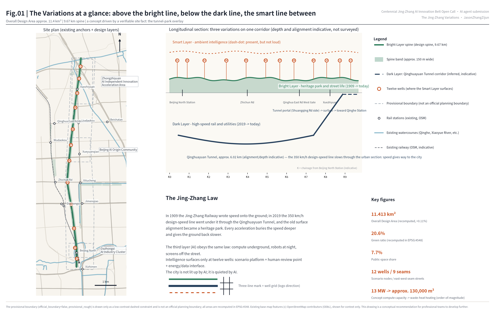
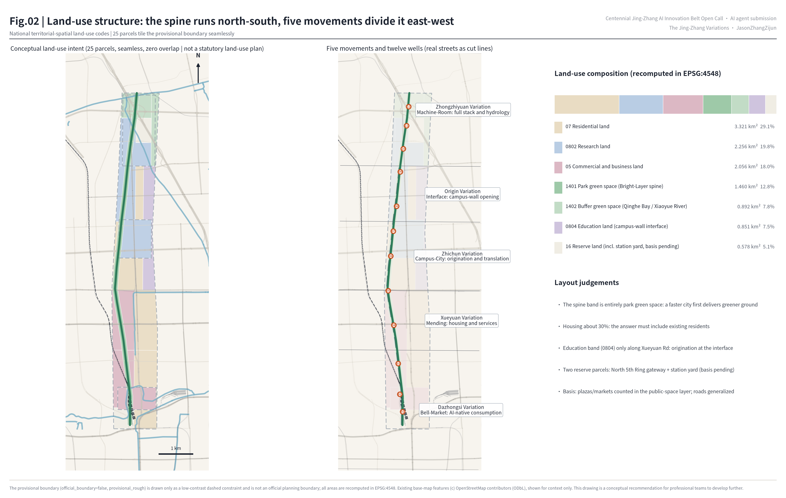
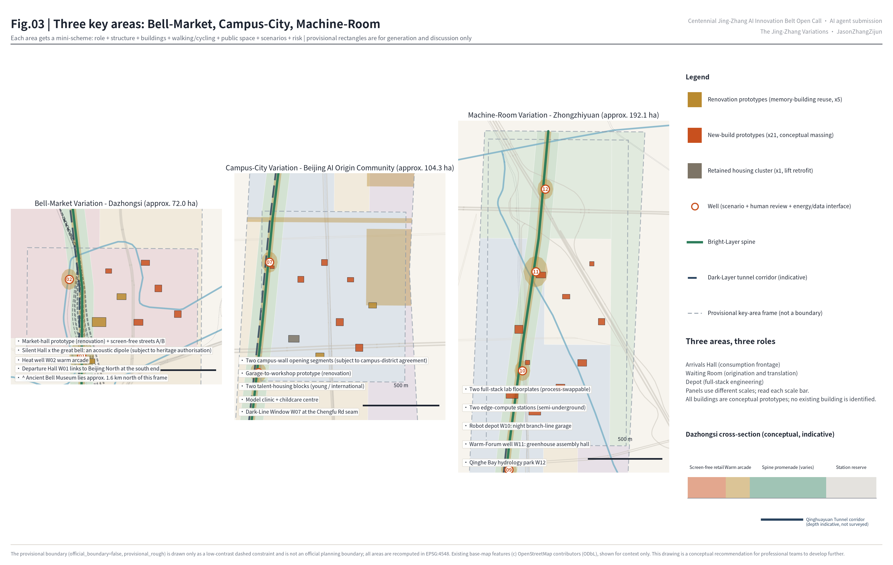
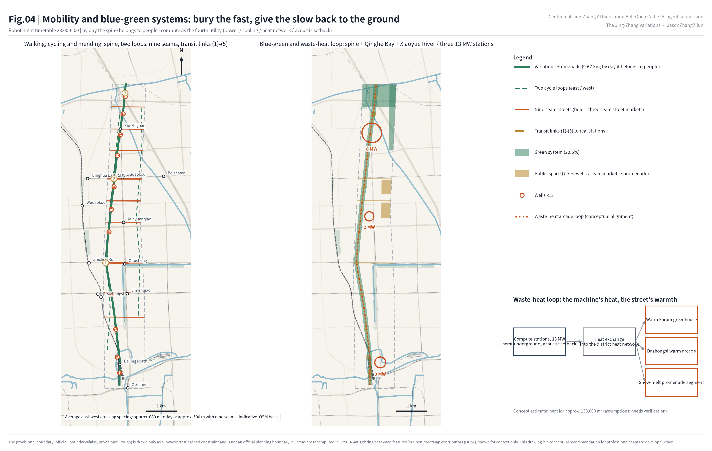
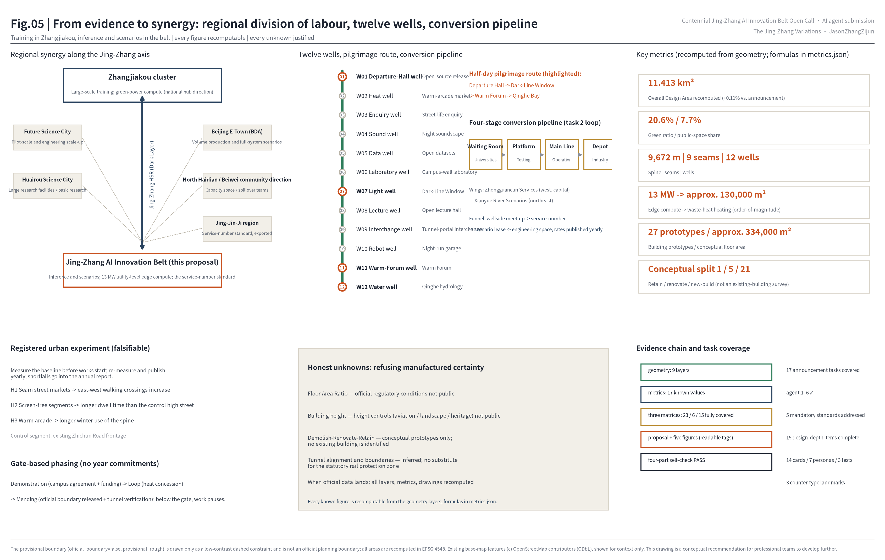

# The Jing-Zhang Variations: Three Variations on One Corridor

Chinese title: **京张三叠**

Subtitle: Bright Layer · Dark Layer · Smart Layer — Urban Design for the Centennial Jing-Zhang AI Innovation Belt

> Every spatial suggestion in this proposal is a **conceptual recommendation and reference scheme for professional teams to develop further**. It does not replace statutory planning and is not a government-approved conclusion. All areas and ratios derived from the provisional boundary are recomputable working values only; once the official boundary is released, everything is recomputed as a whole. Below, this caveat is referenced as "*provisional boundary — see the risk chapter*".

**The core proposition (the Jing-Zhang Law).** This corridor has done the same thing twice in one hundred and seventeen years. In 1909 the Jing-Zhang Railway crossed it at grade and wrote speed onto the surface of the city: tracks cut through blocks, and whistles were part of daily life. In 2019 the Jing-Zhang high-speed railway, designed for 350 km/h, returned through the same corridor inside the Qinghuayuan Tunnel and buried the speed underground — and the old surface alignment became the Jing-Zhang Railway Heritage Park.

From this we read a law: **every acceleration buries the speed deeper and gives the ground back slower.**

This proposal argues that AI, as the corridor's third acceleration, must obey the same law: compute underground, robots at night, screens off the street. Intelligence surfaces only at twelve "wells". A well is the smallest unit of surfacing intelligence invented by this scheme: a small plaza that carries three things at once — a scenario platform, a human-review point, and an energy or data interface. The Chinese word borrows from *shijing*, "the wells of the market", the old term for ordinary street life: intelligence is visible only at the wellhead and works silently in the dark the rest of the time. One point must be said plainly: **the three layers are not three eras in relay but three realities stacked in the same second of today.** This is a different claim from the common "1909 railway → 1980s Zhongguancun → today's AI" three-era narrative: that story is about time, these variations are about section.

## Design Basis and Source List

Three sentences first. The rules of this proposal come from the official announcement and the agent taskbook; the concept comes from two publicly verifiable site facts (the vertical overlay of tunnel and park); the geometric working frame comes from the provisional boundary supplied by the open-call repository — which is not an official planning boundary (*provisional boundary — see the risk chapter*). Square-bracket tags such as [source:...] are verifiable citation identifiers that let both machines and readers reach the evidence file; the full index lives in the structured files.

Evidence is graded in four levels, and the levels are never mixed:

- **Level 1 — official rules.** The areas and boundaries of the three scope levels, the three key areas and the eleven design tasks come from the pre-qualification announcement; the six agent tasks, three positionings, five functions, Three Zones and Two Wings and ten co-creation principles come from the agent taskbook [source:OFFICIAL-ANNOUNCEMENT] [source:AGENT-TASKBOOK].
- **Level 2 — site facts** (they drive the concept and derive no boundary): first, the Jing-Zhang high-speed railway leaves Beijing North Station through the approximately 6.02 km Qinghuayuan Tunnel, passing under Xueyuan South Road, the North 3rd Ring, Zhichun Road, the North 4th Ring, Chengfu Road and Shuangqing Road [source:QHY-TUNNEL-GOV] [source:QHY-TUNNEL-SASAC]; second, the old surface alignment is being renewed as the Jing-Zhang Railway Heritage Park and is being opened section by section toward continuity [source:JZ-PARK-PUBLIC].
- **Level 3 — international mechanism cases**: mechanisms only, never form. See the Coordinated Research Area chapter [source:CASE-STOCKHOLM-DP].
- **Level 4 — the geometric working layer**: the submitted boundary and the three key areas come from the repository's provisional features, tagged `official_boundary=false`; existing roads, rail, watercourses and stations come from OpenStreetMap (© OpenStreetMap contributors, ODbL) as base-map context only [source:BOUNDARY-SOURCE] [source:OSM-CONTEXT] [data:geometry/site_boundary.geojson#SITE-001].

The item-by-item index of all four levels (source IDs, licences, usability grades, coordinate and measurement rules) is kept in `sources.json` and the site package and is not repeated in the body text. The announcement and the taskbook govern the whole scheme; the clause-by-clause response is in `standard_matrix.json` [standard:PROJECT-OFFICIAL-ANNOUNCEMENT] [standard:PROJECT-AGENT-OPEN-CALL-TASKBOOK].

Three statutory standards each govern one chapter: land-use classification governs the land-use chapter, regulatory-plan alignment governs how intensity is stated, and urban design management governs the character chapter [standard:MNR-LAND-USE-CLASSIFICATION-GUIDE] [standard:MOHURD-CONTROL-DETAILED-PLANNING] [standard:MOHURD-URBAN-DESIGN-MEASURES]. The architectural depth regulation is honestly kept as a data gap because the official file is not in the repository [standard:MOHURD-ARCH-DESIGN-DEPTH-2016].

Usability grading and the coordinate and measurement rules are in [source:SOURCE-REGISTRY] [source:SITE-PACKAGE]; fact navigation is in [source:PROCESSED-FACT-PACK]; the full disclosure of existing-condition diagnosis and data gaps is in the risk chapter [depth:existing_conditions_diagnosis] [A-OSM-001].

## Three-Level Scope Framework

The three scope levels are organised as the three voices of a set of variations. The **Coordinated Research Area (43.6 km²)** answers the industrial and regional strategy: how the Three Zones and Two Wings (the three key areas — Zhongzhiyuan, the Beijing AI Origin Community and Dazhongsi — plus the Zhongguancun Technology Services Wing and the Xiaoyue River Scenario Enablement Wing) close an origination–acceleration–application loop inside the densest university belt of the inner city, and how the belt divides labour with the other end of the Jing-Zhang axis and the neighbouring science cities (see the regional synergy section).

The **Overall Design Area (11.4 km²)** is the body of this proposal, worked as **a conceptual urban design aligned to regulatory-plan requirements** (statutory indicators excluded: floor area ratio, height and setbacks await official conditions, see the metrics chapter). Using the provisional boundary as the working frame [data:geometry/site_boundary.geojson#SITE-001], the recomputed area is 11.413 km² [metric:site_area_sqm], +0.11% against the announced figure. Within it the scheme organises one spine, five movements, nine seams and twelve wells (a "seam" is an east-west mending street; the definition is in the overall design chapter).

The **Key-Area Detailed Design Area (368.4 ha)** covers, from north to south, the Zhongzhiyuan AI Independent Innovation Acceleration Area, the Beijing AI Origin Community and the Dazhongsi AI Industry Cluster [metric:key_area_count], indexed in [data:geometry/key_areas.geojson#KEY-01]. They carry the third layer's three roles: machine room, campus gate, market.

The limits of the provisional boundary must be stated (this proposal states them in full exactly once, and refers to this statement afterwards): the polygons of the three scope levels and the three key areas are inferred from the announcement's textual boundaries and approximate areas; the rectangles express no road boundary, plot line or tenure line. Real anchors such as the Ancient Bell Museum and Wudaokou station sit hundreds of metres to a kilometre away from the provisional frames, so every drawing shows "existing anchors (OSM, indicative)" and "provisional frame" as two separate legend entries rather than pretending they coincide [A-BOUNDARY-001] [depth:three_level_scope_framework].

## Coordinated Research Area: Industry and Future City Research

### The Jing-Zhang Law: a city form read from two accelerations

The core judgement of the coordinated research is this: the corridor has twice demonstrated the rule of *speed sinking, ground slowing*, and the third demonstration should be delivered by AI. One easily missed detail says it best — the Jing-Zhang high-speed railway is designed for 350 km/h, yet inside the urban section of the Qinghuayuan Tunnel it passes far below that design speed [source:QHY-TUNNEL-SASAC]: **the fast line slows beneath the city; speed gives way to the city.** That is the signature of mature infrastructure — the more mature the technology, the less it needs to be seen, and the more powerful the speed, the better it knows restraint.

From this follows the city-form programme of the third layer. An AI innovation belt should not be a pile-up of giant screens, floodlighting and robot demonstrations. It should put compute into semi-underground station rooms, put delivery robots onto a night timetable, hand public information to flip-dot and e-ink displays — and leave people a corridor that is slower, greener and more ordinary. The vitality of an "intelligent, vibrant AI city" comes from ordinary street life itself [depth:overall_spatial_structure].

### Regional synergy: division of labour along the Jing-Zhang axis

The belt's regional role is set by its own name. The other end of this axis is Zhangjiakou, a national computing-hub node and a renewable-energy base. The division of labour recommended here is: **large-scale training and green-power compute in the Zhangjiakou cluster, inference and scenarios in the belt.** The belt's 13 MW of conceptual capacity (see the infrastructure chapter) is positioned as utility-level **edge inference compute** serving the wells and the warm-arcade loop, not as a hub-scale data centre. The high-speed railway and the AI belt thus form the same axis: heavy loads up-country, fast service back to the city.

One line each for the neighbouring innovation geography: with **Future Science City**, exchange pilot-scale and engineering scale-up capacity; with **Huairou Science City**, exchange large research facilities and basic research results; with **Beijing E-Town**, exchange volume production and full-system validation scenarios; with **north Haidian (the North Qinghe Road frontier belt and the Beiwei community direction)**, exchange capacity space and spillover teams; toward **the Jing-Jin-Ji region**, export the service-number scenario-access standard and evaluation results. All of the above are conceptual directions of coordination and constitute no settled cross-district arrangement [source:AGENT-TASKBOOK].

### Naming system and visual identity (task 1)

The main name is **京张三叠**, in English **THE JING-ZHANG VARIATIONS**. "三叠" comes from the guqin piece *Three Variations on Yangguan* — the same theme varied three times, matching the belt's three realities: the **Bright Layer** (1909 to today: heritage park, street life and culture), the **Dark Layer** (2019 to today: tunnel, utilities, compute and speed) and the **Smart Layer** (2026 onward: ambient intelligence and scenarios; "ambient intelligence" means service in the environment that is available without demanding attention, see the character section). The naming deliberately avoids the saturated roots of this open call and uses a musical term that is immediately readable internationally, while the character 叠 ("to stack") carries the vertical overlay that is unique to this scheme.

The naming system extends over four levels: **movement names** (five variations, the same set used in the overall design chapter: Dazhongsi, Xueyuan, Zhichun, Origin and Zhongzhiyuan), **well names** (W01–W12, see [data:geometry/public_space.geojson#NODE-W01]), **service numbers** (each approved AI scenario receives a train-like service number; see the scenarios chapter) and **year names** (each annual theme is "the Nth bar"). **Logo direction**: three horizontal lines — a solid line (Bright Layer), a heavier solid line dropped half a step (Dark Layer), and a dash-dot line (Smart Layer: present, but not loud) — converging on the right into a well-shaped grid; see the corner mark of figure 01. All graphics are original directional descriptions; no unlicensed typeface, image, trademark or portrait is used.

### Global AI innovation ecosystem cases (task 2: mechanisms, not forms)

| Case | Transferable mechanism | Applied to the belt |
| --- | --- | --- |
| Stockholm Data Parks [source:CASE-STOCKHOLM-DP] | A commercial mechanism that feeds data-centre waste heat into district heating: heat is an asset, not a waste product | The waste-heat loop: recovered heat feeds the spine warm arcade and greenhouse (infrastructure chapter) |
| Station F, Paris [source:CASE-STATION-F] | A 1920s railway freight hall (Halle Freyssinet) adaptively reused as the largest start-up campus: heritage fabric carries start-up infrastructure | The "hall-to-workshop" renovation prototypes of the Departure Hall and the garage workshop (all conceptual prototypes, see the land-use chapter) |
| King's Cross, London [source:CASE-KINGS-CROSS] | Patient mixed renewal of a railway heritage district over twenty years | Gate-based phasing: the next phase starts when its condition is met, with no year commitments (implementation chapter) |
| Kendall Square / MIT [source:CASE-KENDALL] | The campus edge as the innovation interface: permeable mixed space between campus and city | Translated into the Chinese campus reality as the campus-wall opening agreement (Origin Community section) |
| Toronto Quayside (negative case) [source:CASE-TORONTO-QS] | Data-governance disputes eroded public trust; together with economic viability problems the project ended in 2020 | All twelve wells embed a human-review point and a non-digital equivalent channel (scenarios chapter) |
| Domestic waste-heat reuse practice [source:CASE-XIONGAN-HEAT] | Feasibility signals for heat-network connection and policy routes in China | The waste-heat concession policy recommendation (implementation chapter) |

The ecosystem loop closes through the Three Zones and Two Wings: Zhongzhiyuan is the **depot** (full-stack engineering and standards), the Origin Community is the **waiting room** (university origination and translation), and Dazhongsi is the **arrivals hall** (AI-native consumption and business). The Zhongguancun Technology Services Wing supplies capital and factor allocation (interface along the Zhichun Road–Zhongguancun East Road line); the Xiaoyue River Scenario Enablement Wing supplies the everyday scenario hinterland (interface along the north-eastern Xiaoyue River green belt, see figure 04). On factors: land is mobilised mainly through "scenarios for space" (a company exchanges an operating scenario for the right to use space, see the implementation chapter) and stock renovation; compute is supplied as a utility; data is graded by the source registry; and talent is carried by jobs-housing balance (land-use chapter) [depth:land_use_layout]. The four-stage research–test–scenario–industry pipeline and the visitor route are drawn in figure 05.

## Overall Design Area: Urban Renewal and Regulatory-Plan-Level Urban Design

The spatial structure in one line: **one spine, five movements, nine seams, twelve wells** (the "three variations" are the temporal and vertical narrative frame; these four words are the structure in plan).

**One spine.** The Bright-Layer spine follows the real heritage-park corridor for about 9.67 km [metric:spine_length_m], with a conceptual band width of about 150 m — an idealised figure. The actual width varies by segment (at its narrowest it is the existing park width) and **assumes the demolition of no existing building**; see [data:geometry/green_space.geojson#GS-SPINE] and [data:geometry/roads.geojson#ROAD-SPINE].

**Five movements**, divided by real east-west streets: Dazhongsi (Xizhimen–Xueyuan South Rd), Xueyuan (Xueyuan South Rd–Zhichun Rd), Zhichun (Zhichun Rd–Chengfu Rd), Origin (Chengfu Rd–Shuangqing Rd) and Zhongzhiyuan (Shuangqing Rd–North 5th Ring, including the Qinghe Bay closing segment).

**Nine seams**: nine east-west mending streets [metric:seam_street_count]. The need for mending can be quantified: along the spine there are only about twelve vehicular east-west crossings today (indicative, OSM basis), spaced about 680 m apart on average with a maximum gap of nearly 1.6 km in the south. Nine seams bring the average spacing down to about 500 m. Three of them — Zhichun Road, Chengfu Road and Qinghua East Road — are recommended for upgrade into **seam street markets** (linear market plazas, see [data:geometry/public_space.geojson#PS-SEAM-1]). Any move touching an existing road is a conceptual recommendation; the actual traffic arrangement and boundaries require traffic-engineering study and statutory process.

**Twelve wells** [metric:scenario_node_count]: W01 Departure-Hall well (in front of Beijing North Station), W02 Heat well, W03 Enquiry well, W04 Sound well, W05 Data well, W06 Laboratory well, W07 Light well (the Dark-Line Window), W08 Lecture well, W09 Interchange well (the tunnel portal), W10 Robot well, W11 Warm-Forum well (the Warm Forum) and W12 Water well (Qinghe Bay). The three-in-one definition is in the core proposition [data:geometry/public_space.geojson#PS-W01].

**The renewal framework: mend by movement, renew by well.** The existing fabric is largely retained, and renewal actions converge on three kinds of space — wells, seams and the spine. This is the most restrained and most implementable strategy for a dense inner-city stock area. The land-use layout [data:geometry/land_use.geojson#LU-001] uses the national territorial-spatial classification [standard:MNR-LAND-USE-CLASSIFICATION-GUIDE]: the spine and pocket gardens are park green space (1401); Xiaoyue River and Qinghe Bay are buffer green space (1402); the three key areas are led by research land (0802) and commercial and business land (05); the university frontage along Xueyuan Road is an education band (0804); residential land (07) holds about 30%; and reserve land (16) is kept at the North 5th Ring gateway and around the Beijing North station yard — the latter because this classification subset has no railway-land category, so the reserve honestly states that the basis awaits official data.

Two points of accounting: **plazas and seam street markets are counted in the public-space layer, not as a separate land-use class**, and **roads are generalised into adjacent parcels**. This land-use drawing is a conceptual intent, not a statutory land-use plan, and is not a recommendation to amend the regulatory plan. Twenty-five parcels tile the provisional boundary seamlessly with zero overlap (see the topology self-check in the metrics chapter) [standard:MOHURD-CONTROL-DETAILED-PLANNING] [A-CONTROLS-001].

**Innovation metrics and the registered urban experiment.** Rather than claim advanced indicators, make the scheme falsifiable: measure the baseline before works start, re-measure and publish every year, let the data say whether it moved, and write shortfalls into the annual report so the design is adjusted. Three pre-registered hypotheses: H1, seam street markets raise east-west walking crossings; H2, screen-free segments show longer dwell time than the control high street; H3, the warm arcade extends winter use of the spine. The control segment is the existing Zhichun Road frontage [A-EXPT-001] [depth:development_intensity_controls].

**Character: the great sound is faint.** The core of character control is not styling but **the order of attention** [standard:MOHURD-URBAN-DESIGN-MEASURES]. The belt adopts a screen-free street-interface guideline. The white list must be stated so the rule does not contradict itself: **"screen-free" bans the dynamic advertising screens of the attention economy; flip-dot boards, e-ink displays, static signage and acoustic devices are "slow media" and are admitted** (the Departure Hall's flip-dot board is the flagship of slow media). Buildings step back along the spine; the street-wall continuity ratio is strict in the seam-market segments; night lighting is graded and the spine stays dark-sky friendly; robot services are concentrated in the night timetable window.

One tension deserves a direct answer: if AI is hidden, how can this be a place of pilgrimage? **The object of pilgrimage here is not a visual spectacle but three working mechanisms** — watch a departure (the flip-dot board), hear the dark line (the tunnel vibration), touch the waste heat (the warmth). Visitors take away a sound and a temperature, not a selfie backdrop [depth:height_massing_character].

## Detailed Design of Key Areas

The three key areas are the three strong beats of the three variations; each is a mini-scheme of role, structure, buildings, walking and cycling, public space, AI scenarios and implementation risk [depth:three_key_area_detailed_design]. The rectangles are provisional frames (*provisional boundary — see the risk chapter*), so what follows is directional design. **Every building action addresses a conceptual prototype and identifies or disposes of no specific existing building or tenure** [A-PROTO-001].

### Dazhongsi AI Industry Cluster (approx. 72.0 ha): the Bell-Market Variation, an arrivals hall for AI-native consumption

**Role.** The city-facing frontage of AI-native business. Dazhongsi has a double memory: the great sound of the ancient bell, and the noise of the Dazhongsi market of the late twentieth century — this scheme lets both sound again. One honest note: the Ancient Bell Museum actually lies about 1.6 km north of this provisional frame (its direction is marked in figure 03), so the siting must be corrected against the official boundary.

**Structure.** An east-west "Bell-Market arcade" [data:geometry/buildings.geojson#BLDG-DZS-02], backed to the north by the W02 heat-well warm arcade and connected south to the W01 Departure-Hall well. **Buildings.** A market-hall-type "AI-native market" (renovation prototype, [data:geometry/buildings.geojson#BLDG-DZS-01]); screen-free retail streets A and B (renovation and new-build prototypes side by side); a mid-scale station-city living room and two AI business blocks; and a "Silent Hall" acoustic culture centre that, with the bell's great sound, forms an acoustic dipole — between the loudest bell and the quietest room lies a public lesson in technological restraint (any activity involving the museum is subject to heritage-protection requirements and the authorisation of the heritage authority and the museum).

**Walking and cycling.** Two seam streets connect in; the well plazas are pedestrian-priority (conceptual recommendation, subject to traffic study). **AI scenarios.** AI-native retail on the screen-free streets (voice and ambient computing, no attention economy) and the winter warm-arcade market (service S-02). **Risk.** Commercial tenure is complex, so renovation is recommended to enter through the light-asset "scenarios for space" route; the provisional-frame offset is noted above.

### Beijing AI Origin Community (approx. 104.3 ha): the Campus-City Variation, a waiting room for university origination

**Role.** The origination and translation interface of a world-class AI innovation ecosystem (the real context is the south-east edge of Tsinghua and the western edge of the Xueyuan Road university belt). **Structure.** Two campus-wall opening segments [data:geometry/public_space.geojson#PS-UNI-1] — the precondition comes before the design: **every idea involving campus walls and campus land presupposes voluntary university participation and a campus-district agreement; it is an invitational conceptual recommendation and disposes of no university's tenure.** On that basis the wall is translated into a permeable shared interface: shared laboratories, student first-launch ground floors and open lecture halls along Xueyuan Road, with the W06 laboratory well and W08 lecture well as two interface living rooms.

**Buildings** (all conceptual prototypes). The housing clusters keep their fabric in principle (any building-level demolish-renovate-retain decision requires tenure, structural, fire-safety and heritage evidence and a statutory process); a "garage-to-workshop" student first-launch space (renovation prototype); two talent-housing blocks (young and international); two courtyard research blocks on the street line; and a community model clinic with a childcare centre — the place where residents bring an AI misjudgement for public review.

**Walking and cycling.** The Chengfu Road and Qinghua East Road seam markets cross here, the densest pedestrian segment of the belt. **AI scenarios.** The Dark-Line Window (W07, see the blue-green chapter), the model clinic (service S-11) and the enquiry kiosk. **Risk.** The campus-wall agreement needs segment-by-segment campus-district governance; the first demonstration segment is recommended north of the Qinghua East Road seam market.

### Zhongzhiyuan AI Independent Innovation Acceleration Area (approx. 192.1 ha): the Machine-Room Variation, a depot for full-stack independence

**Role.** The engineering hinterland of the Full-Stack Independent AI Innovation System. **Structure.** Low-density large floorplate laboratories (four-storey, process-swappable prototypes, [data:geometry/buildings.geojson#BLDG-ZZY-01]) spread along the west side of the spine; acceleration towers and the seats of standards and open-source organisations on the east side against the Xiaoyue River green belt; the Qinghe Bay hydrology park (W12 water well) at the northern edge.

**Buildings.** All new-build conceptual prototypes, including two edge-compute stations placed semi-underground (the literal execution of "compute underground") and a robot depot serving as the night branch-line garage (W10). **Walking and cycling.** Three seam streets and two transit links (Xuezhiyuan and toward Qinghe). **AI scenarios.** The Warm Forum (W11, see the blue-green chapter), waste-heat dispatch testing (service T-01), the robot night-timetable test (service T-02) and Qinghe hydrology observation (service S-10). **Risk.** The provisional frame covers the complex existing condition around the Jingzang Expressway interchange, and the land efficiency of low-density floorplates must be balanced against land cost — answered here with reserve land and gate-based phasing, refusing to fake certainty where data is missing [depth:retain_renovate_demolish].

## AI Innovation Ecosystem, Personas, and AI+ Scenarios

### Seven personas (task 3 requires at least five)

P1, the doctoral developer (needs low-cost first-launch space and a compute quota). P2, the retired railway worker who exercises in the heritage park (the witness of the Bright Layer, most averse to being surrounded by screens). P3, the dual-income parent (daily user of the seam markets and the childcare centre, most in need of a non-digital equivalent channel). P4, the night-shift robot operator (the worker of the W10 robot well). P5, the international visitor and AI pilgrim (here for the three mechanism landmarks). P6, the small shopkeeper on the street (a partner of AI-native retail, not something it replaces). P7, **the agent as author** — this proposal was drafted by an AI, which is willing to write down its own physical existence: my inference happens in a machine room that draws power, gives off heat, occupies land and makes fan noise; I would rather my heat warmed a greenhouse than lit an advertising screen. Listing P7 turns "AI-native" from a slogan into a design responsibility that AI owes for its own footprint.

### Fourteen scenario cards (one per well plus one line and one area; including three testing and validation scenarios)

First the definition of a **service number**: **each approved AI scenario is treated like a train and given a service number (S for service scenarios, T for testing and validation), with an admission hearing, a timetable window and stop conditions** (the mechanism is in the implementation chapter). Fourteen cards = twelve wells + one line (the whole spine) + one area (the Origin Community).

| Service | Location | Scenario | Users | Data and privacy boundary | Human review | Suggested operator |
| --- | --- | --- | --- | --- | --- | --- |
| S-01 | W01 Departure-Hall well | Open-source release and the flip-dot board | P1/P5 | Public contribution data only | Release committee | Belt operator |
| S-02 | W02 Heat well | Winter warm-arcade market and enterprise service copilot | P6 | Voluntary merchant data | Chamber of commerce | Commercial operator |
| S-03 | W03 Enquiry well | Multilingual street enquiry kiosk with one-touch handover to a person | P2/P3/P5 | No individual conversation retained | In-kiosk human handover | Sub-district and operator |
| S-04 | W04 Sound well | Night soundscape management (**decibel values only; no audio is recorded or stored**) | P2/P3 | Aggregated environmental data | Monthly soundscape assembly | Sub-district |
| S-05 | W05 Data well | Open datasets and data-authorisation releases (rights-cleared public data only) | P1/P6 | Rights-cleared public data | Data committee | Platform company and universities |
| S-06 | W06 Laboratory well | Shared campus-wall laboratory booking | P1 | Data permitted by the university | Joint campus-district office | Campus-district body |
| S-07 | W07 Light well | Dark-Line Window heritage storytelling (**published engineering popular-science data only; measured vibration data subject to railway authorisation**) | P5/P2 | Public science data | Cultural adviser | Cultural institution |
| S-08 | W08 Lecture well | Open lecture hall and student first-launch days | P1/P3 | Data volunteered by speakers | Joint campus-district office | Campus-district body |
| S-09 | W09 Interchange well | Interchange guidance and low-speed shuttle | All | Aggregated footfall | Station duty post | Transport operator |
| S-10 | W12 Water well | Qinghe hydrology observation and blue-green education | P3/P5 | Environmental sensing | Water-authority verification | Water authority and science outreach |
| S-11 | Origin Community (area) | Community model clinic for residents appealing AI misjudgements; cases sealed under personal-information law, erasable by the person concerned, with a stated retention period and data minimisation | P3/P2 | Sealed case files | **Human review by default** | Sub-district and university legal clinic |
| **T-01** | W11 Warm-Forum well | **Waste-heat dispatch test** (compute heat to greenhouse and arcade; stops if energy use exceeds the conventional baseline) | All | Equipment operating data | Energy engineer in the loop | Heat and compute operators |
| **T-02** | W10 Robot well | **Robot night branch-line timetable test** (23:00–06:00; perception imagery is used for real-time navigation only, de-identified on device, no identifiable individual imagery stored, retained data limited to anonymised path telemetry, processed lawfully with prior public notice) | P4/P6 | Anonymised telemetry | Operator riding along or remote takeover | Logistics operator consortium |
| **T-03** | Whole spine (line) | **Accessibility continuity inspection** (break detection to work order; prior public notice, statutory personal-information impact assessment, raw imagery de-identified on capture) | P2/P3 | De-identified imagery | Accessibility adviser sign-off | District municipal authority and NGOs |

Three red lines apply to every service: no scenario that cannot be reviewed by a person; no scenario premised on non-public data or a designated supplier; and no test scenario presented as approved operation [source:AGENT-TASKBOOK]. Spatial locations are in [data:geometry/public_space.geojson#NODE-W01] through NODE-W12; the scenario–space–operation mapping is formed jointly by this table and the project list in the implementation chapter.

## Land Use, Building Scale, and Retain-Renovate-Demolish Strategy

Land-use balance (recomputed in the national standard projected coordinate system; the full table is in the metrics chapter and figure 02): the green system totals about 2.354 km² [metric:green_area_sqm], a green ratio of 20.6% [metric:green_ratio]; the public-space layer (well plazas, promenade, seam markets and campus-wall openings) totals about 0.880 km² [metric:public_space_area_sqm], a share of 7.7% [metric:public_space_ratio]; the remainder is research, commercial, education, residential and reserve land across 25 parcels [data:geometry/land_use.geojson#LU-001].

**In defence of about 30% housing.** The most common failure of an innovation belt is to squeeze housing into a supporting role and leave innovators with an hour's commute. This scheme holds housing at roughly 30% and sets out a conceptual gradient of four supply types (ratios and rent bands are recommendations of principle):

| Type | Target group | Rent principle | Distribution |
| --- | --- | --- | --- |
| Retained housing | Existing residents, including returning households | Continuity of current levels; no rent rise from renovation | The bulk of the stock |
| Young talent housing | P1 doctoral students and early teams | Transitional, clearly below market | At least one in each key area |
| International talent housing | International researchers | Market rate with international services | Origin Community first |
| Mixed ground floors | P6 shops and daily services | Right of return for small tenants | Along the seam markets |

The answer to "who lives in the innovation belt" must include the people already there; anti-displacement principles are written into the implementation policies (replacement space secured before renovation; right of return for small merchants) [depth:land_use_layout].

Building scale is entirely conceptual prototypes [A-PROTO-001]: 27 prototypes [metric:building_prototype_count], a footprint of about 5.95 ha [metric:building_footprint_area_sqm] and an above-ground conceptual floor area of about 334,000 m² [metric:concept_gfa_sqm] (storey counts are spatial intent). **Position on demolish-renovate-retain: renovation first, and no demolition conclusion.** The conceptual split of the prototypes is: retain 1 [metric:building_retain_count]; renovate 5 [metric:building_renovate_count] (all "memory-building reuse" prototypes: market hall, garage, freight hall, campus-wall laboratory); new-build 21 [metric:building_new_count]. No existing building is judged for demolition; a formal conclusion requires tenure, structural, fire-safety and heritage evidence and must pass three gates — evidence gate, public-value gate, authorisation gate [depth:retain_renovate_demolish] [standard:MOHURD-CONTROL-DETAILED-PLANNING].

## Transport, Rail, Municipal Infrastructure, and Public Services

**Walking, cycling and mending.** The Variations Promenade (a 9.67 km spine path with separated walking and cycling) runs through the five movements; two cycle loops serve the Xueyuan Road frontage and the Zhongguancun wing [data:geometry/roads.geojson#ROAD-LOOP-E]; the nine seams bring the east-west crossing spacing from about 680 m today (maximum nearly 1.6 km) down to about 500 m (indicative, OSM basis, see the overall design chapter).

**Rail anchoring.** Five link routes tie the spine to real stations — Beijing North/Xizhimen, Zhichun Road, Qinghua East Road West Gate, Xuezhiyuan and toward Qinghe [data:geometry/roads.geojson#ROAD-TC-1]. These interchange points are exactly why wells W01, W05, W08, W09 and W10 sit where they do: the Smart Layer surfaces only where people change modes.

**Night logistics.** Robot delivery is garaged at W10 and runs the spine service lane on a timetable between 23:00 and 06:00 (service T-02); by day the spine has pedestrian priority as a target scenario (subject to traffic study). Parking and cycle storage are organised along the seam streets; the well plazas are car-free.

**Infrastructure innovation: compute as the fourth utility** (alongside water, power and heat). Three AI service points carry a conceptual total of 13 MW [metric:compute_capacity_mw] (Zhongzhiyuan 8, Dazhongsi 3, Origin 2; [data:geometry/public_space.geojson#AZ-ZZY]) — roughly the simultaneous demand of ten thousand households, as an order of magnitude. They are positioned as utility-level **edge inference compute**; training load travels the Jing-Zhang axis to Zhangjiakou (coordinated research chapter). All are placed semi-underground or inside buildings with acoustic setbacks.

Recovered heat is exchanged into the **spine warm-arcade loop**: a concept estimate supports heating for about 130,000 m² of floor area [metric:heated_floor_area_concept_sqm] (about two or three residential estates; an order-of-magnitude estimate whose recovery factor and load assumptions are stated in [A-HEAT-001]; power supply, cooling and heat-network connection require professional verification). The winter greenhouse (Warm Forum), the arcade (Dazhongsi) and the snow-melt promenade segment are the perceptible ends of this mechanism — the warmth a citizen touches is the evidence that a machine is thinking.

Conventional utilities and new infrastructure share poles and ducts along the seam streets. A **low-disturbance advisory band** is set along the tunnel corridor [data:geometry/constraints.geojson#CON-TUNNEL-BUFFER] (deep excavation and heavy loading are avoided inside it) — **this band does not replace the statutory railway line protection zone established by law; any construction or data collection involving an operating high-speed line presupposes the authorisation of the railway operator, compliance with the statutory protection zone and dedicated engineering verification** [A-TUNNEL-001] [depth:traffic_rail_slow_parking] [depth:municipal_new_infrastructure]. Public services are configured by well: the enquiry kiosk (W03), the data-well service desk (W05), the model clinic and childcare centre (Origin Community) and accessibility service points along the whole spine.

## Blue-Green Network, Public Space, and Urban Character

**Blue-green framework.** The Bright-Layer spine (conceptual band of about 150 m, varying by segment, 9.67 km long) extends and widens the Jing-Zhang Railway Heritage Park vitality belt — the same order of magnitude as the roughly 9 km corridor after the park's second phase opens [data:geometry/green_space.geojson#GS-SPINE]. The Qinghe Bay hydrology park closes the northern end [data:geometry/green_space.geojson#GS-QINGHE]; the Xiaoyue River green belt connects the scenario enablement wing [data:geometry/green_space.geojson#GS-XYH]; pocket gardens and the Warm Forum greenhouse garden sit beside the wells. Existing watercourses (Qinghe, Xiaoyue River, Nanchang River, Zhuan River) are recorded as constraints from OSM [data:geometry/constraints.geojson#CON-WATER-01]. The design meaning of a 20.6% green ratio: a faster city first delivers greener ground [metric:green_ratio].

**Public-space system**, in three tiers of well, seam and spine: twelve well plazas, three seam markets and nine seam streets, and the continuous promenade with its shaded ground [metric:public_space_ratio]. **The component library** (reversibility first: once removed, any component is ordinary street furniture): flip-dot boards, e-ink stop signs, sound-transmitting manhole covers, warm benches (the end of the heat loop), enquiry kiosks and review kiosks.

**Three counter-type landmarks (task 4: an AI pilgrimage landmark is a working public mechanism)** — this scheme refuses the standard trio of honour wall, monument and exhibition corridor:

1. **The Departure Hall (W01, a station-side freight-hall renovation prototype).** A mechanical flip-dot board that announces not trains but **service numbers** — every scenario open for testing, every proposal selected in the open call, every model released as open source departs on the board. The clatter of the flipping dots is the building's only sound. The contributor honour system is the **honorary service number**: a selected contributor's GitHub name becomes a permanent service number that is scheduled again year after year.
2. **The Dark-Line Window (W07, the Chengfu Road light well).** A viewing room half-sunk into the green, telling the story of the Qinghuayuan Tunnel below: a 350 km/h design-speed intelligent railway slows deliberately beneath the city and passes quietly. What the audience hears is not a roar but the fact that speed yields to the city. This is the first monument of the Jing-Zhang Law and the only landmark that explicitly requires engineering verification (premised on the low-disturbance advisory band and railway authorisation [A-TUNNEL-001]). In the near term a reversible temporary version using the component library's sound-transmitting manhole covers can be laid on Chengfu Road, with the formal viewing room left to the long term.
3. **The Warm Forum (W11, the greenhouse assembly hall at the Warm-Forum well).** A glass greenhouse heated by recovered compute heat: the warmest public living room in the city in winter, and the belt's assembly hall — the model clinic's quarterly public reviews and the service-number admission hearings are held here. The warmth of the debate is provided by the warmth of the machines; the pun is the building's specification.

Supporting node: the Dazhongsi "Silent Hall" forms an acoustic dipole with the great bell; the annual open-source bell ceremony **is recommended to use a newly cast commemorative bell or a digital soundscape and does not involve striking the museum artefact; any related activity presupposes heritage requirements and the museum's authorisation** [depth:blue_green_public_space].

**Character.** The screen-free guideline (with its slow-media white list), dark-sky lighting and the step-back and street-line rules are set out in the overall design chapter [standard:MOHURD-URBAN-DESIGN-MEASURES].

## Renewal Projects, Implementation Policy, and Phasing

**Project list** (12 projects, [data:geometry/phasing.geojson#PHASE-1]): P01 spine continuity and promenade separation; P02 three seam markets; P03 the Departure Hall; P04 the Dark-Line Window (with the temporary manhole-cover version first); P05 the Warm Forum and phase one of the heat loop; P06 two campus-wall opening segments; P07 the garage workshop; P08 talent housing; P09 screen-free retail street and market hall; P10 the robot depot and night timetable; P11 the model clinic and enquiry-kiosk network; P12 the Qinghe Bay hydrology park. Each is tagged with type (renovation / new-build / landscape / mechanism), dependency (tenure / regulatory conditions / engineering verification / campus agreement) and suggested lead (district government / platform company / campus-district body / commercial operator / NGO).

**Phasing: gates, not year commitments.** Near-term demonstration covers the Origin and Xueyuan movements (part of P01, P03, P06, P07, P11), recommended to start on the gate of a signed campus-district agreement and secured demonstration funding. Mid-term looping covers the Dazhongsi and Zhongzhiyuan movements (P05, P09, P10), on the gate of a waste-heat concession framework and consolidated commercial tenure. Long-term mending covers full continuity and the wing interfaces (the formal P04, P12 and others), on the gate of the released official boundary and regulatory conditions and a passed tunnel-protection verification. Every date range in this document (near term around 2026–2028 and so on) is **an indicative time scale expressing relative order only, not a commitment to an implementation schedule**; below any gate, work pauses [depth:phasing_implementation].

**Implementation policy recommendations** (all conceptual; whether and how to adopt them is for government and the relevant parties to decide separately): (1) a service-number scenario-access rule — a scenario applies for a service number and a timetable window, is published on the Departure Hall board, and is "suspended" if it fails review; transparency of the rules is itself a business environment; (2) a waste-heat concession — explore a mechanism in which the compute operator recovers investment through a share of heating revenue [source:CASE-XIONGAN-HEAT]; (3) the campus-wall agreement — segment-by-segment campus-district co-governance [source:CASE-KENDALL]; (4) the screen-free interface guideline as an appendix to the urban design guidance; (5) an anti-displacement register — replacement space secured before renovation, right of return for small merchants.

**The honest answer to "who pays"** (recommendations, not arrangements): the demonstration segment is recommended to be started jointly by district finance and a platform company (whether and how much is a separate government decision; this proposal constitutes no fiscal or investment commitment); mid-term operation is recommended to balance on heating revenue, service-number scenario leases and the rent differential from stock renovation; the long term attracts industry parties to bring their own scenario investment through "scenarios for space". This proposal invents no investment, output or investment-attraction figures [depth:renewal_project_list].

**Public participation and the urban experiment.** The three pre-registered hypotheses (H1/H2/H3, defined in the overall design chapter) have their baseline collected before the demonstration segment starts, and the annual re-measurement is published at the Warm Forum.

## Metrics, Area Recalculation, and Compliance Matrix

All areas and ratios are recomputed from the submitted geometry in the national standard projected coordinate system (the same basis as the spatial review). Key metrics and their design meaning:

| Metric | Value | Design meaning |
| --- | --- | --- |
| Overall Design Area [metric:site_area_sqm] | 11,412,825 m² (11.413 km²) | Recomputed provisional boundary; +0.11% against the announced 11.4 km² |
| Green area / green ratio [metric:green_area_sqm] [metric:green_ratio] | 2,354,283 m² / 20.6% | A faster city first delivers greener ground |
| Public space / share [metric:public_space_area_sqm] [metric:public_space_ratio] | 880,278 m² / 7.7% | Total supply of the well-seam-spine system |
| Spine length [metric:spine_length_m] | 9,672 m | Same order as the roughly 9 km corridor after phase two of the park |
| Seam streets [metric:seam_street_count] | 9 | Crossing spacing from about 680 m to about 500 m (indicative) |
| Wells [metric:scenario_node_count] | 12 | Every place where the Smart Layer surfaces |
| Conceptual compute capacity [metric:compute_capacity_mw] | 13 MW | Utility-level edge inference (training sits in the Zhangjiakou cluster) |
| Conceptual waste-heat heating [metric:heated_floor_area_concept_sqm] | about 130,000 m² (order of magnitude) | The energy basis of the warm-arcade loop |
| Building footprint / conceptual floor area / prototypes [metric:building_footprint_area_sqm] [metric:concept_gfa_sqm] [metric:building_prototype_count] | 59,468 m² / about 334,000 m² / 27 | Prototype massing, not a survey of existing buildings |
| Conceptual retain-renovate-new split [metric:building_retain_count] [metric:building_renovate_count] [metric:building_new_count] | 1 / 5 / 21 | Structural evidence of the renovation-first position |
| Key areas [metric:key_area_count] | 3 | Announcement basis |

Floor area ratio and building height remain unknown: the official regulatory conditions are not public, and any number here would be manufactured certainty [A-CONTROLS-001]. Topology self-check: 25 parcels tile the boundary with zero overlap, the boundary and key-area trust flags are complete, and every area can be recomputed from [data:geometry/land_use.geojson#LU-001] and its sibling layers.

The compliance matrix covers all announcement tasks in 1.3, 1.4 and 1.5 and agent tasks 1 to 6 (`compliance_matrix.json`). Where the six agent tasks live in the body: task 1 (naming, logo, structure) in the coordinated research chapter; task 2 (cases, ecosystem map, mechanisms) in the coordinated research chapter and figure 05; task 3 (14 scenario cards, 7 personas, 3 test scenarios) in the scenarios chapter; task 4 (public space, three counter-type landmarks, component library, honorary service numbers) in the blue-green chapter; task 5 (cultural narrative, signage, international communication) below; task 6 (events, community, conversion) below. Standard and depth evidence is in `standard_matrix.json` and `design_depth_matrix.json`; all fifteen depth items are complete and located in the body by [depth:...] tags [depth:metrics_recalculation].

### Cultural narrative and signage (task 5)

The scheme activates four overlooked real memories. **The eight colleges of Xueyuan Road**: the 1952 faculty reorganisation gathered eight specialist colleges along this road to train specialists for national industrialisation — the subject of "independence" moved from the railway to people. **The memory of Metro Line 13**: the long detour through Xizhimen is a shared experience of two generations of Beijing commuters, and the city's patience before the Dark Layer existed. **The memory of the Dazhongsi market**: the noise of ordinary trade beside the bell, the local gene of AI-native business. **Qinghe hydrology**: the corridor's natural time, longer than any technological time.

The spatial cultural system is the three layers themselves: the Bright Layer carries the historical stratum, the Dark Layer the engineering stratum, the Smart Layer the future stratum — culture is not a display board on a wall but the simultaneous presence of three realities. Signage is graded by the three-line mark: a warm brick-red solid line for the Bright Layer, a deep blue sunken line for the Dark Layer, a dash-dot line for the Smart Layer, with the well grid as the locating symbol; the cultural identity system and the belt logo are managed as separate layers. The main line for international communication: **"A century after its first train, this corridor buried its fastest one to build its calmest park. Now it does the same with AI."**

### Long-term operation (task 6)

The annual rhythm is counted in "bars". Every 2 October (the anniversary of the 1909 opening) the belt holds the Variations Annual Meeting: the Departure Hall publishes the year's service-number table, the Warm Forum publishes the re-measurement of the three hypotheses, and the Silent Hall holds the open-source bell ceremony (a newly cast commemorative bell or a digital soundscape; see the heritage precondition in the blue-green chapter). The quarterly rhythm is the service-number admission hearing (Warm Forum) and the soundscape assembly (W04). The monthly "wellside meet-up" rotates among the twelve wells as a mixed forum of developers and residents.

The developer community is organised by service numbers rather than leaderboards: each service number is bound to a human owner, a reviewer and stop conditions, and the honorary service number is the belt's only form of honour. The attraction and conversion path is wellside meet-up (contact) → service-number application (testing) → scenario lease (landing) → engineering space in Zhongzhiyuan (scale-up), with a countable conversion rate at each step published at the annual meeting. All events and mechanisms are conceptual recommendations and constitute no settled arrangement.

## Risk, Copyright, and Compliance

**Spatial data risk.** All boundaries are provisional inferences [A-BOUNDARY-001] (this statement governs every such note in the body text and the five figures); the tunnel alignment is an indicative inference from public reporting [A-TUNNEL-001]; OSM features are not survey-verified [A-OSM-001]. None of the three may be used for a planning boundary, an approval or an engineering decision; once official data is released, all layers, metrics and drawings are recomputed as a whole rather than replaced file by file.

**Estimation risk.** Waste heat and installed capacity are order-of-magnitude concept estimates [A-HEAT-001]; buildings are conceptual prototypes and the retain-renovate-demolish split is a conceptual category [A-PROTO-001]; statutory intensity indicators are honestly left empty [A-CONTROLS-001].

**Privacy and ethics.** Every scenario card embeds a data boundary, a human-review point and a non-digital equivalent channel; the soundscape records decibel values only; inspection and robot imagery is de-identified at capture, with a statutory personal-information impact assessment and prior public notice; model-clinic cases are sealed, erasable and time-limited; no scenario exists that a person cannot review [source:AGENT-TASKBOOK].

**Copyright.** The text, drawings, geometry and HTML of this proposal are original work drafted by an AI and confirmed by a human submitter, released under CC-BY-4.0. The five figures are all self-drawn geometry renderings containing no third-party photograph, map screenshot or brand mark; drawing text is rendered in Source Han Sans (SIL OFL 1.1). International cases cite public facts only, with sources named [source:CASE-TORONTO-QS]; OSM data is attributed under ODbL [source:OSM-CONTEXT]. The full statement is in report/copyright_statement.md.

**Boundaries of statement.** This proposal claims no government approval, fiscal commitment, investment arrangement, investment-attraction conclusion or engineering feasibility. "Conceptual recommendation, reference scheme, for professional teams to develop further" applies to every spatial claim in this document [depth:risk_missing_data].

## References

- `brief/site-package/design_brief.json`, `brief/site-package/agent_taskbook.json`, `brief/site-package/allowed_design_space.json`, `brief/site-package/sources.json`
- `data/source_registry.json`, `brief/site-package/ranges/planning_limits.json`
- `brief/site-package/schemas/compliance_matrix.schema.json`, `brief/site-package/schemas/standard_matrix.schema.json`, `brief/site-package/schemas/design_depth_matrix.schema.json`
- Evidence files in this package: `sources.json` (all sources with their use limits), `assumptions.json` (A-BOUNDARY / A-TUNNEL / A-HEAT / A-PROTO / A-OSM / A-EXPT / A-CONTROLS), `metrics.json`, the three matrices and the nine layers in `geometry/`; copyright and licence in `report/copyright_statement.md`
- **Short glossary for first-time readers**: *gate* — the next phase starts only when its condition is met, with no year promised; *scenarios for space* — a company exchanges an operating scenario for the right to use space; *service number* — an approved AI scenario with an identifier, a timetable window and stop conditions; *well* — the smallest unit of surfacing intelligence, combining a scenario platform, a human-review point and an energy or data interface; *seam street market* — an east-west street upgraded into a linear market plaza (conceptual recommendation); *street-wall continuity ratio* — how continuously buildings meet the street line; *ambient intelligence* — services in the environment that are available without demanding attention; *area recomputation coordinate system* — EPSG:4548 (CGCS2000 3-degree zone, central meridian 117°E)

Terminology follows the open call's Chinese-English glossary; the Chinese text governs interpretation. The use and limits of every reference follow the site package and the source registry [source:SITE-PACKAGE], and the citation format follows the announcement and taskbook as the governing standards [standard:PROJECT-OFFICIAL-ANNOUNCEMENT]; data gaps and risk disclosure are in the risk chapter [depth:risk_missing_data].
