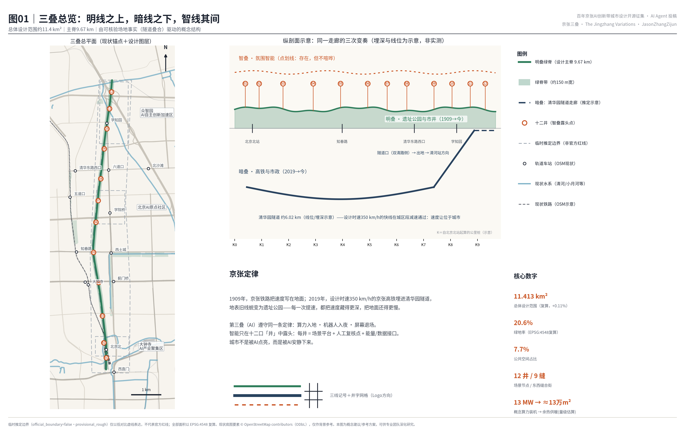
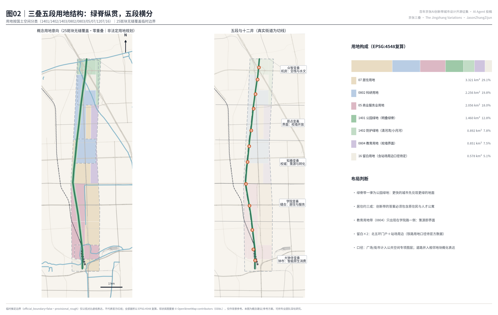
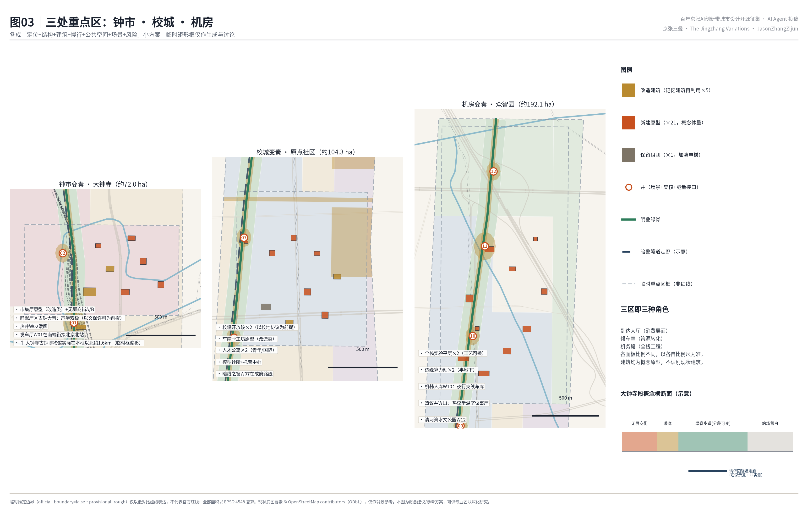
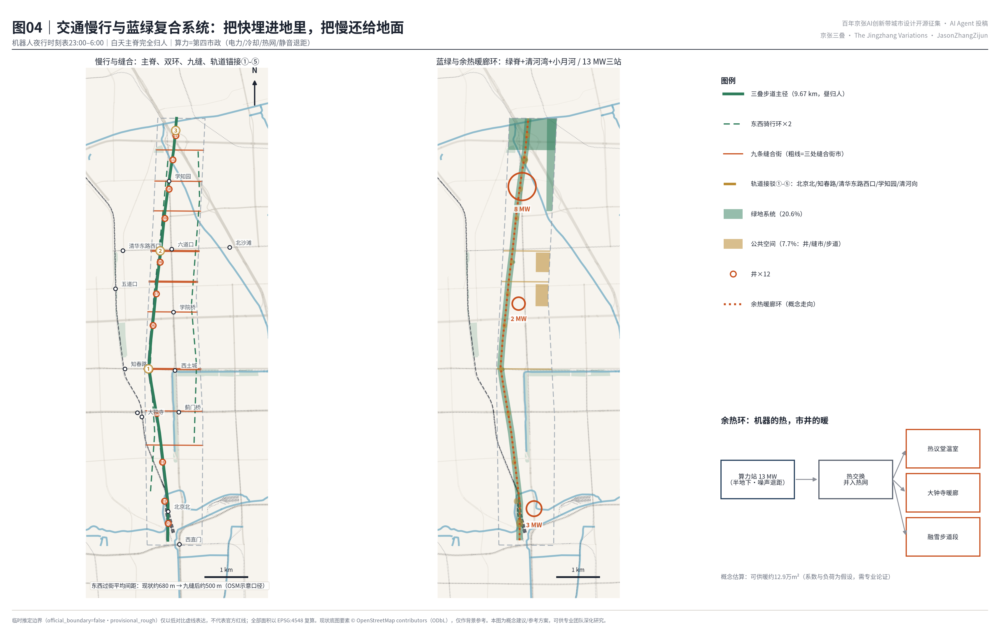
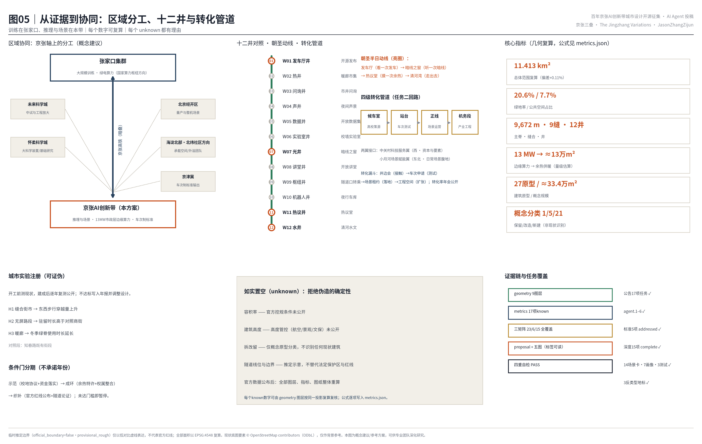

# 京张三叠：同一走廊的三次变奏

英文名：**THE JINGZHANG VARIATIONS**

副题：明叠 · 暗叠 · 智叠——百年京张AI创新带城市设计

> 本方案的全部空间建议均为**概念建议、参考方案，可供专业团队深化研究**；不替代正式规划，不构成政府审定结论。所有基于临时推定边界的面积与比率只是可复算工作值，官方红线公布后必须整体重算（下文以「※临时边界，详见风险章」指代本条）。

**核心命题（京张定律）**。这条走廊在一百一十七年里做过两次同样的事。1909年，京张铁路从地面穿过，把速度写在城市表面：铁轨切开街区，鸣笛属于日常。2019年，设计时速350公里的京张高铁从清华园隧道穿回同一条走廊，把速度埋入地下——地表的旧线蜕变为京张铁路遗址公园。

由此得到一条定律：**每一次提速，都把速度藏得更深，把地面还得更慢。**

本方案主张：AI 作为这条走廊的第三次提速，必须遵守同一条定律——算力入地、机器人入夜、屏幕退场。智能只在十二口「井」中露头；「井」是本方案发明的最小智能露头单元：一处小广场，把场景服务、人工复核、能量或数据接口三件事装在一起——取「市井」之井，智能只在井口可见，其余时间沉默地在暗处工作。要说破的一点是：**「三叠」不是三个时代的接力，而是今天同一秒里叠着的三层现实**——这与常见的「1909铁路—1980年代中关村—今日AI」三段史叙事是两回事：三段史在讲时间，三叠在讲剖面。

## 设计依据与资料清单

先用三句话说清资料底盘：本方案的规则来自官方公告与任务书；概念来自两件可公开核验的场地事实（隧道与公园的垂直叠合）；几何工作框来自征集仓库提供的临时推定边界——它不是官方红线（※临时边界，详见风险章）。正文中方括号标签（如 [source:...]）是可核验的引用编号，机器与人都能沿标签找到证据文件，详见参考资料章。

证据分四级，四级不得混写：

- **第一级·官方规则**：三层范围的面积与四至、三处重点区与十一项设计任务来自资格预审公告；六项智能体任务、三大定位、五大功能、三区两翼与十条共创原则来自面向智能体任务书 [source:OFFICIAL-ANNOUNCEMENT] [source:AGENT-TASKBOOK]。
- **第二级·场地事实**（驱动概念，不推导红线）：其一，京张高铁自北京北站以约6.02公里的清华园隧道，下穿学院南路、北三环、知春路、北四环、成府路、双清路 [source:QHY-TUNNEL-GOV] [source:QHY-TUNNEL-SASAC]；其二，老京张地表线更新为京张铁路遗址公园，正在分段贯通、走向连续 [source:JZ-PARK-PUBLIC]。
- **第三级·国际机制案例**：只取机制、不抄形态，见统筹研究章 [source:CASE-STOCKHOLM-DP] 等六例。
- **第四级·几何工作层**：提交边界与三处重点区来自仓库的临时推定要素，标注 `official_boundary=false`；现状路网、轨道、水系与车站上下文来自 OpenStreetMap（© OpenStreetMap contributors，ODbL），仅作底图参考 [source:BOUNDARY-SOURCE] [source:OSM-CONTEXT] [data:geometry/site_boundary.geojson#SITE-001]。

上述四级的逐条索引（来源 ID、许可、可用性分级、坐标与量算规则）保存在 `sources.json` 与站点包中，正文不再罗列。公告与任务书是全案的主控依据，逐条响应见 `standard_matrix.json` [standard:PROJECT-OFFICIAL-ANNOUNCEMENT] [standard:PROJECT-AGENT-OPEN-CALL-TASKBOOK]。

三项法定标准各自统领一章：用地分类统领用地章，控规衔接统领强度表述，城市设计管理统领风貌章 [standard:MNR-LAND-USE-CLASSIFICATION-GUIDE] [standard:MOHURD-CONTROL-DETAILED-PLANNING] [standard:MOHURD-URBAN-DESIGN-MEASURES]。建筑深度规定因官方文件未入库，如实维持数据缺口 [standard:MOHURD-ARCH-DESIGN-DEPTH-2016]。

资料用途分级与坐标量算规则见 [source:SOURCE-REGISTRY] [source:SITE-PACKAGE]，事实导航见 [source:PROCESSED-FACT-PACK]，现状诊断与数据缺口的完整披露见风险章 [depth:existing_conditions_diagnosis] [A-OSM-001]。

## 三层范围工作框架

三层范围按「变奏的三个声部」组织工作深度。**统筹研究范围（43.6平方公里）**回答产业与区域战略：三区两翼（＝众智园、原点社区、大钟寺三个重点区，加中关村科技服务翼与小月河场景赋能翼）如何在中心城区最稠密的高校带里完成「策源—加速—应用」回路，以及本带与京张走廊另一端及周边科学城的分工（见统筹研究章「区域协同」节）。**总体设计范围（11.4平方公里）**是本方案主体，做**面向控规衔接的概念性城市设计**（法定指标除外：容积率、高度、退线等待官方条件，见指标章）：以 [data:geometry/site_boundary.geojson#SITE-001] 的临时边界为工作框，复算面积11.413平方公里 [metric:site_area_sqm]，相对公告约面积偏差+0.11%；范围内组织「一脊、五段、九缝、十二井」的空间结构（「九缝」即九条东西向缝合街，定义见总体设计章）。**重点区域范围（368.4公顷）**自北向南为众智园AI自主创新加速区、北京AI原点社区、大钟寺AI产业聚集区三处 [metric:key_area_count]，见 [data:geometry/key_areas.geojson#KEY-01]，分别承担第三叠的「机房、校门、市集」三种角色。

临时边界的限制必须交代（本方案对此只完整声明一次，此后以记号指代）：三层范围与重点区多边形按公告文字四至与约面积推定，矩形框不表达道路红线、地块与权属边界；真实的大钟寺古钟博物馆、五道口站等锚点相对临时框存在数百米至公里级偏移，图面一律以「现状锚点（OSM示意）＋临时框」双图例并置表达，不假装二者重合 [A-BOUNDARY-001] [depth:three_level_scope_framework]。

## 统筹研究范围产业与未来城市研究

### 京张定律：从两次提速读出的未来城市形态

统筹研究的核心判断：这条走廊已经两次示范「速度下沉、地面变慢」，第三次应当由AI完成。有一个容易被忽略的细节反而最能说明问题——京张高铁全线设计时速350公里，但在清华园隧道的城区段以远低于设计时速的速度通过 [source:QHY-TUNNEL-SASAC]：**快线在城市之下主动减速，速度让位于城市**，这正是「基础设施成熟」的标志：越成熟的技术越不需要被看见，越强大的速度越懂得收敛。据此推出第三叠的城市形态纲领：AI创新带不做巨屏、灯光与机器人表演的堆砌，而是把算力放进半地下站房、把配送机器人排进夜间时刻表、把公共信息交给翻牌与墨水屏之后，留给人的一条更慢、更绿、更市井的走廊。「智能化AI活力城市」的活力来自市井本身 [depth:overall_spatial_structure]。

### 区域协同：京张轴上的分工

本带的区域角色由「京张」二字决定——这条轴的另一端是张家口，国家算力枢纽节点与可再生能源基地。本方案建议的分工是：**大规模训练与绿电算力在张家口集群，推理与场景在本带**——本带13MW概念装机（见交通市政章）定位为「市政层边缘推理算力」，服务井与暖廊末端，不与枢纽级数据中心比规模；京张高铁与京张AI创新带因此构成同一条轴上的「重车上山、快车回城」。对周边创新地理的接口各一句话：与**未来科学城**交换中试与工程放大能力；与**怀柔科学城**交换大科学装置与基础研究成果；与**北京经开区**交换量产与整机验证场景；与**海淀北部（北清路前沿科创带、北纬社区方向）**交换承载空间与外溢团队；面向**京津冀**输出「车次制」场景开放标准与评测结果。以上均为概念建议的协同方向，不构成任何跨区安排的既定结论 [source:AGENT-TASKBOOK]。

### 命名体系与视觉识别（任务一）

主名**「京张三叠」**，英文 **THE JINGZHANG VARIATIONS**。「三叠」取自古琴曲《阳关三叠》——同一主题的三次变奏：**明叠**（1909→今：遗址公园、市井与文化）、**暗叠**（2019→今：隧道、市政、算力与速度）、**智叠**（2026→未来：氛围智能与场景。「氛围智能」即环境中不喧哗的智能服务：可用而不打扰，见风貌节）。命名刻意避开「智/脉/轨/环/链/人字/Commons」等高频词根，以音乐术语获得国际传播力，以「叠」承载本方案独有的垂直叠合事实。命名体系四级延展：**段名**（五段变奏，与总体设计章同一套：大钟寺变奏、学院变奏、知春变奏、原点变奏、众智变奏）、**井名**（W01—W12，见 [data:geometry/public_space.geojson#NODE-W01]）、**车次名**（每个获准开放的AI场景像列车一样获得车次号，见场景章定义）、**年名**（年度主题为「第N小节」）。**Logo方向**：三条水平线——第一条实线（明叠）、第二条粗实线下沉半格（暗叠）、第三条点划线（智叠：存在，但不喧哗）——右端汇入一个「井」字网格；见图01左下角标。全部图形为原创方向性描述，不使用任何未清权字体、图片、商标或人物形象。

### 全球AI创新生态案例（任务二：只取机制，不抄形态）

| 案例 | 可转译机制 | 落到本带 |
| --- | --- | --- |
| Stockholm Data Parks（斯德哥尔摩）[source:CASE-STOCKHOLM-DP] | 数据中心余热并入区域供热的商业机制：热是资产不是废物 | 算力余热环：回收热接入绿脊暖廊与温室（交通市政章） |
| Station F（巴黎）[source:CASE-STATION-F] | 1920年代铁路货运库房（Halle Freyssinet）适应性再利用为全球最大创业园区：遗产建筑承载创业基础设施 | 发车厅与车库工坊的「库房—工坊」改造原型（均为概念原型，见用地章） |
| King's Cross（伦敦）[source:CASE-KINGS-CROSS] | 铁路遗产地区二十年尺度的耐心混合更新 | 「条件门」分期（达到条件才启动下一期，不承诺年份，见实施章） |
| Kendall Square / MIT（剑桥）[source:CASE-KENDALL] | 校园边界即创新界面：校区与城市之间的可渗透混合空间 | 转译到中国高校现实即「校墙开放段」协议（原点社区章） |
| Toronto Quayside（多伦多，反面）[source:CASE-TORONTO-QS] | 数据治理争议持续侵蚀公众信任，叠加经济可行性问题，项目2020年终止 | 十二井全部内置人工复核点与非数字等价通道（场景章） |
| 国内数据中心余热利用实践 [source:CASE-XIONGAN-HEAT] | 国内热网衔接与政策通道的可行性线索 | 余热并网特许经营的政策建议（实施章） |

生态回路按三区两翼闭合：众智园是「机务段」（全栈工程与标准），原点社区是「候车室」（高校策源与转化），大钟寺是「到达大厅」（智能原生消费与商务）；中关村科技服务翼供给资本与要素配置（接口在西侧知春路—中关村东路一线），小月河场景赋能翼供给日常场景腹地（接口在东北小月河绿带，见图04）。要素机制：土地以「场景换空间」（企业以运营场景换取空间使用权，见实施章）与存量改造为主，算力以市政化供给，数据以清权登记表分级，人才以职住平衡承接（用地章）[depth:land_use_layout]。研究—测试—场景—产业的「候车室→站台→正线→机务段」四级转化管道与访客动线见图05。

## 总体设计范围城市更新与控规深度城市设计

空间结构一句话：**一脊、五段、九缝、十二井**（「三叠」是时间与竖向的叙事框架，这四个词才是平面上的结构）。**一脊**：明叠绿脊沿真实遗址公园走廊方向纵贯全境约9.67公里 [metric:spine_length_m]，概念带宽约150米——这是理想化数值，实际宽度分段可变（最窄处即现状遗址公园宽度），**不以拆除任何现状建筑为前提**；见 [data:geometry/green_space.geojson#GS-SPINE] 与 [data:geometry/roads.geojson#ROAD-SPINE]。**五段**以真实东西街道为界：大钟寺变奏（西直门—学院南路）、学院变奏（学院南路—知春路）、知春变奏（知春路—成府路）、原点变奏（成府路—双清路）、众智变奏（双清路—北五环，内含清河湾收束段）。**九缝**：九条东西缝合街 [metric:seam_street_count]。缝合的必要性可以量化：沿主脊现状机动车级东西穿越通道仅约12处（OSM示意口径），平均间距约680米，最大间隔近1.6公里（南段尤甚）；九缝加密后平均间距降至约500米。其中知春路、成府路、清华东路三条建议升级为「缝合街市」（线性市集广场，[data:geometry/public_space.geojson#PS-SEAM-1]）——此类涉及现状道路的动作均为概念建议，具体交通组织与红线需交通专业论证与法定程序确定。**十二井** [metric:scenario_node_count]：W01发车厅井（北京北站前）、W02热井、W03问询井、W04声井、W05数据井、W06实验室井、W07光井（暗线之窗所在）、W08讲堂井、W09枢纽井（隧道口）、W10机器人井、W11热议井（热议堂所在）、W12水井（清河湾）；每井三合一的定义见核心命题 [data:geometry/public_space.geojson#PS-W01]。

**城市更新框架：「以段织补、以井更新」。**大面保留现状肌理，更新动作收敛于井、缝、脊三类点状与线性空间。用地布局 [data:geometry/land_use.geojson#LU-001] 采用国土空间分类 [standard:MNR-LAND-USE-CLASSIFICATION-GUIDE]：绿脊与口袋公园为公园绿地（1401），小月河与清河湾为防护绿地（1402），三重点区以科研（0802）与商业服务业（05）为主导，学院路高校界面为教育用地带（0804），居住（07）约三成，北五环门户与北京北站场周边各留一块留白用地（16）——后者因本分类子集无铁路用地类目，以留白如实表达「站场口径待官方数据」。两点口径说明：**井广场与缝合街市计入公共空间专项图层（public_space.geojson），不在用地大类中单列**；**道路用地并入相邻地块概化表达**——本用地图是概念用地意向，不是法定用地规划，也不构成控规调整建议。25个用地斑块无缝覆盖临时边界、互不重叠（指标章拓扑自检）[standard:MOHURD-CONTROL-DETAILED-PLANNING] [A-CONTROLS-001]。

**创新指标与「城市实验注册」。**与其宣称指标先进，不如让方案可证伪：开工前先测现状，建成后每年复测公布，涨没涨用数据说话，不达标写入年报并调整设计。三条预注册假设：H1 缝合街市建成后东西步行穿越量上升；H2 无屏路段驻留时长高于常规商街对照段；H3 暖廊使冬季绿脊使用时长延长。对照段取知春路既有街段 [A-EXPT-001] [depth:development_intensity_controls]。

**风貌总纲：大音希声。**风貌控制的核心是注意力秩序 [standard:MOHURD-URBAN-DESIGN-MEASURES]：全带实行「无屏城市界面导则」。要写明白名单以免自相矛盾——**「无屏」禁的是注意力经济的动态广告屏；机械翻牌、墨水屏、静态标识与声学装置属于「慢媒介」，准入**（发车厅的翻牌大屏正是慢媒介的旗舰）。建筑沿绿脊退台，缝合街市段贴线率（沿街建筑边线的连续程度）从严；夜间照明分级、绿脊暗天空友好；机器人服务集中于夜间时刻表窗口。还要正面回答一个张力：把AI藏起来，凭什么成为「朝圣地」？**本方案的朝圣对象不是视觉奇观，而是三个可运转的机制**——看一次发车（翻牌）、听一次暗线（振动）、摸一次余热（温度）；访客带走的是声音与温度，不是自拍背景板 [depth:height_massing_character]。

## 重点区域详细设计

三处重点区是三次变奏的三个强拍，各成「定位＋空间结构＋建筑更新＋交通慢行＋公共空间＋AI场景＋实施风险」小方案 [depth:three_key_area_detailed_design]。三区矩形为临时框（※临时边界，详见风险章），以下均为方向性设计；**全部建筑动作均针对概念原型，不识别、不处置任何具体现状建筑与权属** [A-PROTO-001]。

### 大钟寺AI产业聚集区（约72.0公顷）：钟市变奏——智能原生消费的「到达大厅」

**定位**：智能原生新业态的城市展面。大钟寺的记忆是双重的：古钟的「大音」，与上世纪末大钟寺市场的市井喧哗——本方案让两种声音同场。需要如实标注：大钟寺古钟博物馆实际位于本临时框以北约1.6公里（图03已标出方位），落位需官方红线校正。**空间结构**：设想一条「钟市长廊」东西轴（[data:geometry/buildings.geojson#BLDG-DZS-02]），北靠热井W02暖廊，南接发车厅井W01。**建筑更新**：设想一处大跨市场厅式的「智能原生市集」（改造原型，[data:geometry/buildings.geojson#BLDG-DZS-01]）、无屏商街A/B（改造＋新建原型并置）、中等体量的站城客厅与两栋AI商务坊；「静默厅·声学文化中心」与古钟的大音构成声学双极——最响的钟与最静的房间之间，是关于技术节制的公共课（涉及古钟博物馆的任何活动设想均以文物保护要求和文保部门、博物馆方许可为前提）。**交通慢行**：两条缝合街接入，井广场步行优先（概念建议，需交通论证）。**AI场景**：无屏商街智能原生零售（语音与环境计算，不做注意力经济）、暖廊冬季市集（车次S-02）。**实施风险**：商业权属复杂，建议以「场景换空间」轻资产进入；临时框偏移见上。

### 北京AI原点社区（约104.3公顷）：校城变奏——高校策源的「候车室」

**定位**：世界级AI创新生态的策源与转化界面（真实上下文为清华东南与学院路高校带西缘）。**空间结构**：「校墙开放段」两处（[data:geometry/public_space.geojson#PS-UNI-1]）——先说前提再说设计：**所有涉及高校围墙与用地的设想均以高校自愿参与和校地协议为前提，属邀约性概念建议，不构成对任何高校权属空间的处置**；在此前提下，把围墙翻译为可渗透的共享界面：共享实验室、学生首发首层、开放讲堂沿学院路一线布置，实验室井W06与讲堂井W08为两处界面客厅。**建筑更新**（均为概念原型）：住区组团原则上保留肌理（具体楼栋的拆改留需权属、结构、消防、文保证据齐备后由法定程序判断）；设想「车库—工坊」式的学生首发空间（改造原型）、两栋人才公寓（青年/国际各一）、贴线院落式研发坊两栋、社区模型诊所与托育中心（居民把AI误判带来公开复核的地方）。**交通慢行**：成府路与清华东路两条缝合街市在此交汇，是全带步行密度最高段。**AI场景**：暗线之窗（W07，蓝绿章）、模型诊所（车次S-11）、问询亭。**实施风险**：校墙协议需「一段一议」的校地共同治理；先行示范段建议置于清华东路缝合街市北侧。

### 众智园AI自主创新加速区（约192.1公顷）：机房变奏——全栈自主的「机务段」

**定位**：AI全栈自主创新体系的工程腹地。**空间结构**：低密大平层实验群（工艺可换的4层平层原型，[data:geometry/buildings.geojson#BLDG-ZZY-01]）沿绿脊西侧展开，东侧靠小月河绿带布置加速塔与标准与开源组织驻地，北缘清河湾水文公园（水井W12）。**建筑更新**：全部为新建概念原型，其中两处边缘算力站半地下布置（「算力入地」的字面执行），机器人库承担夜行支线车库（W10）。**交通慢行**：三条缝合街与两处轨道接驳（学知园、清河方向）。**AI场景**：热议堂（W11，蓝绿章）、余热调度测试（车次T-01）、机器人夜行时刻表测试（车次T-02）、清河水文观测（车次S-10）。**实施风险**：临时框覆盖京藏高速互通周边复杂现状，低密平层的用地效率需与土地成本平衡——以留白用地与条件门分期应对，不在数据不足时假装确定 [depth:retain_renovate_demolish]。

## AI 创新生态、人才画像与 AI+ 场景

### 七类画像（任务三：不少于5类）

P1 高校博士生开发者（最需要低成本首发空间与算力配额）；P2 遗址公园晨练的退休铁路职工（明叠的历史见证者，最反感被屏幕包围）；P3 双职工家长（缝合街市与托育中心的日常用户，最需要非数字等价通道）；P4 夜班机器人运维员（机器人井W10的工作者）；P5 国际访客与AI朝圣者（为三个机制地标而来）；P6 沿街小店店主（智能原生零售的合作方而非被替代者）；P7 **作为作者的智能体**——本方案由AI起草，愿意如实写下自己的物理存在：我的推理发生在耗电的机房里，会发热、会占地、会有风机噪声；我希望我的热能温暖一间温室，而不是照亮一块广告屏。把P7列入画像，是让「AI原生」落到AI对自身空间责任的设计上。

### 十四张场景卡（十二井各一卡，另加一线一面；含三个产业测试验证场景）

先定义「车次」：**本方案把每个获准开放的AI场景比作一趟列车，授予车次号（S＝服务场景，T＝测试验证场景），有准入听证、时刻窗口与停运条件**（机制详见实施章「车次制」）。十四卡＝十二井各一卡＋一线（全脊）＋一面（原点全域）：

| 车次 | 位置 | 场景 | 服务对象 | 数据与隐私边界 | 人工复核 | 运营主体建议 |
| --- | --- | --- | --- | --- | --- | --- |
| S-01 | W01 发车厅井 | 开源发布与翻牌大屏 | P1/P5 | 仅公开贡献数据 | 发布委员会 | 带方运营方 |
| S-02 | W02 热井 | 暖廊冬季市集与企业服务副驾 | P6 | 商户自愿数据 | 商会复核 | 商业运营方 |
| S-03 | W03 问询井 | 市井问询亭（多语，一键转人工） | P2/P3/P5 | 不留存个体对话 | 亭内人工转接 | 街道＋运营方 |
| S-04 | W04 声井 | 夜间声景管理（**仅记录分贝数值，不录制、不存储任何音频内容**） | P2/P3 | 聚合环境数据 | 月度声景议事 | 街道 |
| S-05 | W05 数据井 | 开放数据集与数据授权发布（本带公共数据的清权、脱敏与发布窗口） | P1/P6 | 仅清权后公共数据 | 数据委员会 | 平台公司＋高校 |
| S-06 | W06 实验室井 | 校墙共享实验室预约 | P1 | 校方许可数据 | 校地联合办 | 校地共同体 |
| S-07 | W07 光井 | 暗线之窗遗产讲述（**仅使用已公开发表的工程科普数据；实测振动数据以铁路部门授权为前提**） | P5/P2 | 公开科普数据 | 文化顾问 | 文化机构 |
| S-08 | W08 讲堂井 | 开放讲堂与学生首发日 | P1/P3 | 讲者自愿数据 | 校地联合办 | 校地共同体 |
| S-09 | W09 枢纽井 | 转乘引导与低速接驳 | 全体 | 聚合客流 | 站务人工岗 | 交通运营方 |
| S-10 | W12 水井 | 清河水文观测与蓝绿科普 | P3/P5 | 环境传感 | 水务人工校核 | 水务＋科普机构 |
| S-11 | 原点全域（面） | 社区模型诊所（居民申诉AI误判；个案依据个人信息保护法封存、当事人可删除、明确保存期限与最小化原则） | P3/P2 | 个案封存 | **人工为默认** | 街道＋高校法务诊所 |
| **T-01** | W11 热议井 | **余热智能调度测试**（算力热→温室与暖廊；能耗高于常规基线即停） | 全体 | 设备运行数据 | 能源工程师在环 | 热力＋算力运营方 |
| **T-02** | W10 机器人井 | **机器人夜行支线时刻表测试**（23:00–6:00；感知影像仅用于实时导航，端侧即时去标识化、不存储可识别个体影像，留存仅为脱敏路径遥测，依法合规并事前公示） | P4/P6 | 脱敏遥测 | 运维员随车/远程接管 | 物流运营方联合体 |
| **T-03** | 全脊（线） | **无障碍慢行连续性巡检**（断点识别→工单；采集前公示、依法开展个人信息保护影响评估、原始影像即采即脱敏） | P2/P3 | 去个体化影像 | 无障碍顾问签认 | 区市政＋公益组织 |

三条红线适用于全部车次：不做无法人工复核的场景；不以非公开数据或指定供应商为前提；测试场景不冒充已批准运营 [source:AGENT-TASKBOOK]。空间落位见 [data:geometry/public_space.geojson#NODE-W01] 至 NODE-W12；场景—空间—运营映射由本表与实施章项目清单构成。

## 用地、建筑规模与拆改留方案

用地平衡（按国家标准投影坐标复算，详表见指标章与图02）：绿地系统约2.354平方公里 [metric:green_area_sqm]，绿地率20.6% [metric:green_ratio]；公共空间专项（井广场＋步道＋缝合街市＋校墙开放段）约0.880平方公里 [metric:public_space_area_sqm]，占比7.7% [metric:public_space_ratio]；其余为科研、商业服务、教育（校墙界面）、居住、留白等 25 斑块 [data:geometry/land_use.geojson#LU-001]。**为居住三成辩护**：创新带最常见的失败是把居住挤成配角。本方案坚持居住约三成，并给出四类供给的概念梯度（配比与租金区间为原则性建议）：

| 类型 | 目标人群 | 租金梯度原则 | 配比方向 |
| --- | --- | --- | --- |
| 保留住区 | 原住民（含回迁） | 现状延续，改造不涨租承诺 | 存量为主体 |
| 青年人才公寓 | P1博士生/初创团队 | 显著低于市场价的过渡型 | 每重点区至少一处 |
| 国际人才公寓 | 国际研究者 | 市场价，配国际化服务 | 原点社区先行 |
| 混合首层 | P6小店与生活服务 | 返租权保障 | 沿缝合街市 |

「谁住在创新带」的答案必须包含原住民；防迁移原则写入实施政策（改造先备替代空间、小商户返租权）[depth:land_use_layout]。

建筑规模全部为概念原型 [A-PROTO-001]：27个原型 [metric:building_prototype_count]，基底约5.95公顷 [metric:building_footprint_area_sqm]，概念地上规模约33.4万平方米 [metric:concept_gfa_sqm]（层数为空间意向）。**拆改留立场：改造优先、不下拆除结论。**原型概念分类为：保留1 [metric:building_retain_count]、改造5 [metric:building_renovate_count]（全部是「记忆建筑再利用」式原型：市场厅、车库、库房、校墙实验室）、新建21 [metric:building_new_count]；对任何现状建筑不作拆除判断，正式拆改留结论需权属、结构、消防、文保四项证据齐备后经三道门程序（证据门→公共价值门→授权门）作出 [depth:retain_renovate_demolish] [standard:MOHURD-CONTROL-DETAILED-PLANNING]。

## 交通、轨道、市政与公共服务设施

**慢行与缝合**：三叠步道（绿脊主径9.67公里，步行/骑行分幅）纵贯五段；东西两条骑行环服务学院路界面与中关村翼界面（[data:geometry/roads.geojson#ROAD-LOOP-E]）；九缝把现状平均约680米、最大近1.6公里的东西过街间距加密到约500米（OSM示意口径，见总体设计章）。**轨道锚接**：五处接驳线把主脊系到真实车站——北京北/西直门、知春路、清华东路西口、学知园、清河方向（[data:geometry/roads.geojson#ROAD-TC-1]），换乘节点即井W01/W05/W08/W09/W10选址逻辑：智叠只在人流交换处露头。**夜间物流**：机器人配送以W10为车库，23:00–6:00按时刻表在主脊服务道运行（车次T-02），白天主脊以步行优先为目标情景（需交通论证）；停车与非机动车沿缝合街集中组织，井广场禁停。

**市政创新：把算力当作第四种市政**（与供水、供电、供热并列的公共供给）。三处AI服务点概念装机合计13MW [metric:compute_capacity_mw]（众智园8/大钟寺3/原点2，[data:geometry/public_space.geojson#AZ-ZZY]；约相当于一万户家庭同时用电的功率，量级示意）——定位是市政层**边缘推理算力**，训练负载走京张轴去张家口（统筹章）。全部半地下或入楼布置并执行噪声退距；余热经热交换并入「绿脊暖廊环」：概念估算可支撑**约13万平方米**建筑采暖 [metric:heated_floor_area_concept_sqm]（约两三个居住小区的采暖体量；数量级估算，回收系数与负荷假设见 [A-HEAT-001]，电力接入、冷却与热网衔接需专业论证）。冬季的温室（热议堂）、暖廊（大钟寺）与融雪步道段是这套机制的可感知末端——市民摸到的温度，就是机器正在思考的证据。**传统市政**与新型基础设施合杆合廊沿缝合街布置。隧道走廊设「低扰动建议带」（[data:geometry/constraints.geojson#CON-TUNNEL-BUFFER]，带内避免深基坑与重载建设）——**该建议带不替代依法划定的铁路线路安全保护区；涉及在营高铁的任何建设与数据采集均以铁路运营主体许可、法定保护区要求和专项工程论证为前提** [A-TUNNEL-001] [depth:traffic_rail_slow_parking] [depth:municipal_new_infrastructure]。公共服务以井为单元配置：问询亭（W03）、数据井服务台（W05）、模型诊所与托育（原点）、无障碍服务点沿全脊。

## 蓝绿空间、公共空间与城市风貌

**蓝绿骨架**：明叠绿脊（概念带宽约150米、分段可变，长9.67公里）是京张遗址公园活力带的延伸与增宽——与遗址公园二期贯通后约9公里的走廊同量级 [data:geometry/green_space.geojson#GS-SPINE]；北端清河湾水文公园收束 [data:geometry/green_space.geojson#GS-QINGHE]，东北小月河绿带衔接场景赋能翼 [data:geometry/green_space.geojson#GS-XYH]；口袋花园与热议堂温室园嵌于井旁。现状水系（清河、小月河、南长河、转河）以OSM示意收入约束层 [data:geometry/constraints.geojson#CON-WATER-01]。绿地率20.6%的设计含义：更快的城市先兑现更绿的地面 [metric:green_ratio]。

**公共空间系统**即「井—缝—脊」三级：十二井广场、三处缝合街市与九条缝合街、贯通步道与林下场地 [metric:public_space_ratio]。**组件库**（可逆性第一：任何构件撤除后即是普通城市家具）：翻牌屏、墨水屏站牌、可听化井盖、暖座椅（余热末端）、问询亭、复核亭。

**三个反类型地标（任务四：AI朝圣地标即可运转的公共机制）**——拒绝荣誉墙、纪念碑与展示廊三件套：

1. **发车厅（W01，站前库房式改造原型）**：一面机械翻牌大屏，不报列车，报「车次」——每个开放测试的场景、每个入选共创的方案、每个开源发布的模型，都以车次号在翻牌屏上「发车」。翻牌的机械声是这座建筑唯一的声音。贡献者荣誉体系即「名誉车次」：入选贡献者的GitHub名成为永久车次号，逐年排班重现。
2. **暗线之窗（W07，成府路光井）**：半沉入绿地的观察厅，讲述脚下的清华园隧道——设计时速350公里的智能高铁在城市之下主动减速、静静通过；观众听到的不是轰鸣，而是「速度对城市让步」这件事本身。这是京张定律的一号纪念物，也是唯一需要明确工程论证的地标（以低扰动建议带与铁路部门许可为前提 [A-TUNNEL-001]）。近期可先以组件库的「可听化井盖」在成府路布设临时版（可逆、无工程负担），正式观察厅留待远期。
3. **热议堂（W11，热议井温室议事厅）**：算力余热供暖的玻璃温室，冬季全城最温暖的公共客厅，也是本带的公共议事厅——模型诊所季度公开复盘、车次准入听证都在这里举行。议事的热度由机器的热提供，热-议双关即建筑说明书。
   辅助节点：大钟寺「静默厅」与古钟的大音构成声学双极；年度开源鸣钟礼**建议使用新铸纪念钟或数字声景，不涉及馆藏文物本体敲击，任何相关活动以文保要求和博物馆方许可为前提** [depth:blue_green_public_space]。

**风貌**：无屏导则（含慢媒介白名单）、暗天空、退台贴线见总体设计章 [standard:MOHURD-URBAN-DESIGN-MEASURES]。

## 更新项目清单、实施政策与分期计划

**项目清单**（12项，[data:geometry/phasing.geojson#PHASE-1]）：P01绿脊贯通与步道分幅；P02三处缝合街市；P03发车厅；P04暗线之窗（含临时版井盖前置）；P05热议堂与余热环一期；P06校墙开放段两处；P07车库工坊；P08人才公寓；P09无屏商街与市集厅；P10机器人库与夜行时刻表；P11模型诊所与问询亭网络；P12清河湾水文公园。每项标注类型（改造/新建/景观/机制）、依赖条件（权属/控规/工程论证/校地协议）与建议主体（区政府/平台公司/校地共同体/商业运营方/公益组织）。

**分期：条件门而非年份承诺**。近期示范：原点段＋学院段（P01部分/P03/P06/P07/P11），建议以校地协议签署与示范资金落实为启动门槛；中期成环：大钟寺段＋众智园段（P05/P09/P10），建议以余热并网特许经营框架与商业权属整合为门槛；远期织补：全带贯通与两翼接口（P04正式版/P12等），建议以官方红线与控规条件公布、隧道保护论证通过为门槛。文中一切年代区间（近期约2026–2028等）**仅为示意性时间尺度，表达相对先后，非实施时序承诺**；任何阶段未达门槛即暂停 [depth:phasing_implementation]。

**实施政策建议**（均为概念建议，是否采纳及方式由政府与相关主体另行决策）：①「车次制」场景开放办法——场景以申请获得车次号与时刻窗口，公示于发车厅，未通过复核即停运，规则透明化本身就是营商环境；②余热并网特许经营——建议探索算力运营方以供热收益分成回收投资的机制 [source:CASE-XIONGAN-HEAT]；③校墙协议——一段一议的校地共同治理 [source:CASE-KENDALL]；④无屏界面导则纳入城市设计导则附则；⑤防迁移登记——改造先备替代空间、小商户返租权。**「谁付钱」的诚实回答（均为建议而非安排）**：建议示范段由区级财政与平台公司共同启动（是否安排及额度均需政府另行决策，本方案不构成任何财政或投资承诺）；中期建议以余热收益、车次制场景租约与存量改造租金差平衡运营；远期以「场景换空间」吸引产业方自带场景投资；本方案不虚构任何投资、产值或招商数字 [depth:renewal_project_list]。

**公众参与与城市实验**：三条预注册假设（H1/H2/H3，定义见总体设计章）在示范段开工前完成基线采集，年度复测结果于热议堂公开。

## 指标体系、面积复算与合规矩阵

全部面积与比率由提交几何按国家标准投影坐标复算（与空间审查同口径），核心指标与设计含义：

| 指标 | 值 | 设计含义 |
| --- | --- | --- |
| 总体设计范围面积 [metric:site_area_sqm] | 11,412,825 m²（11.413 km²） | 临时边界复算，对公告11.4 km²偏差+0.11% |
| 绿地面积/绿地率 [metric:green_area_sqm] [metric:green_ratio] | 2,354,283 m² / 20.6% | 更快的城市先兑现更绿的地面 |
| 公共空间面积/占比 [metric:public_space_area_sqm] [metric:public_space_ratio] | 880,278 m² / 7.7% | 井—缝—脊三级系统总供给 |
| 主脊长度 [metric:spine_length_m] | 9,672 m | 与遗址公园二期贯通后约9公里走廊同量级 |
| 缝合街数 [metric:seam_street_count] | 9 | 平均过街间距约680m→约500m（示意口径） |
| 井数 [metric:scenario_node_count] | 12 | 智叠露头的全部位置 |
| 概念算力装机 [metric:compute_capacity_mw] | 13 MW | 市政层边缘推理算力（训练在张家口集群） |
| 概念余热供暖面积 [metric:heated_floor_area_concept_sqm] | 约13万 m²（数量级估算） | 暖廊环的能量基础 |
| 建筑原型 基底/概念规模/数量 [metric:building_footprint_area_sqm] [metric:concept_gfa_sqm] [metric:building_prototype_count] | 59,468 m² / 约33.4万 m² / 27 | 概念原型体量，非现状识别 |
| 拆改留概念分类 [metric:building_retain_count] [metric:building_renovate_count] [metric:building_new_count] | 保留1 / 改造5 / 新建21 | 改造优先立场的结构性证据 |
| 重点区数 [metric:key_area_count] | 3 | 公告口径 |

容积率与建筑高度保持 unknown——官方控规条件未公开，任何数字都会是伪造的确定性 [A-CONTROLS-001]。拓扑自检：25斑块无缝覆盖、零重叠（LAND_USE_TOPOLOGY），边界与重点区信任标志齐备，面积可由 [data:geometry/land_use.geojson#LU-001] 复算。合规矩阵覆盖公告1.3/1.4/1.5全部任务与agent.1–agent.6（compliance_matrix.json）；六项任务落位：任务一（命名/Logo/结构）统筹章，任务二（案例/图谱/机制）统筹章与图05，任务三（14场景卡/7画像/3测试）场景章，任务四（公共空间/3反类型地标/组件库/名誉车次）蓝绿章，任务五（文化叙事/导视/国际传播）下文，任务六（活动/社区/转化）下文；标准与深度证据见 standard_matrix.json、design_depth_matrix.json，15项深度全部完成并以 [depth:...] 定位 [depth:metrics_recalculation]。

### 文化叙事与导视（任务五）

启用四件被忽视的真实记忆：**学院路八大学院**（1952年院系调整在学院路集中建立八所专业学院，为国家工业化自主培养专门人才——「自主」的主语从铁路换成了人）；**13号线的通勤记忆**（绕行西直门的大弯是两代北京通勤者的共同经验，也是暗叠诞生前的城市耐心）；**大钟寺市场记忆**（钟声之侧的市井喧哗，智能原生商业的本地基因）；**清河水文**（走廊的自然时间，比任何技术时间都长）。空间文化系统即三叠本身：明叠承载历史层，暗叠承载工程层，智叠承载未来层——文化不是贴在墙上的展板，而是三层现实的同时在场。导视以三线记号分级：明叠暖砖色实线、暗叠深蓝下沉线、智叠点划线，井字网格为定位符号；文化标识系统与一带Logo分层管理。国际传播主文案：**"A century after its first train, this corridor buried its fastest one to build its calmest park. Now it does the same with AI." / 「把最快的藏起来，把最慢的还给你。」**

### 长期运营（任务六）

年度节律以「小节」计：每年10月2日（1909年京张通车庆典纪念日）举行三叠年会——发车厅公布年度车次表、热议堂公布三条假设复测结果、静默厅举行开源鸣钟礼（新铸纪念钟或数字声景，见蓝绿章文保前提）；季度车次准入听证（热议堂）与声景议事（W04）；月度「井边会」在十二井轮值举行开发者与居民混合例会。开发者社区以车次而非排行榜组织：每车次绑定人类Owner、复核人与停运条件；名誉车次是本带唯一的荣誉形态。招引转化路径：井边会（接触）→车次申请（测试）→场景租约（落地）→众智园工程空间（扩张），每级设可统计转化率并于年会公开。所有活动与机制均为概念建议，不构成已确定安排。

## 风险、版权与合规说明

**空间数据风险**：全部边界为临时推定 [A-BOUNDARY-001]（本方案正文与五图对此的全部提示以本条为准）；隧道线位为公开报道文字推定示意 [A-TUNNEL-001]；OSM要素精度未校核 [A-OSM-001]——三者均不得用于红线、审批或工程决策；官方数据公布后所有图层、指标、图纸整体重算，不单独替换任何文件。**估算风险**：余热与装机为数量级概念估算 [A-HEAT-001]；建筑为概念原型、拆改留为概念分类 [A-PROTO-001]；法定强度指标如实置空 [A-CONTROLS-001]。**隐私与伦理**：全部场景卡内置数据边界、人工复核与非数字等价通道；声景仅记录分贝数值；巡检与机器人影像即采即脱敏、依法开展个人信息保护影响评估并事前公示；模型诊所个案封存、可删除、有保存期限；不设任何无法人工复核的场景 [source:AGENT-TASKBOOK]。**版权**：本方案文字、图纸、几何与HTML为AI起草＋人工确认的原创内容，采用CC-BY-4.0；五张图纸均为自绘几何渲染，不含任何第三方照片、地图截图或品牌标识；图纸文字使用思源黑体（Source Han Sans，SIL OFL 1.1开源许可）渲染；国际案例仅引用公开事实并注明来源 [source:CASE-TORONTO-QS]；OSM数据按ODbL署名 [source:OSM-CONTEXT]。完整声明见 report/copyright_statement.md。**表述边界**：本方案不声称任何政府批准、财政承诺、投资安排、招商结论或工程可行性；「概念建议、参考方案、可供专业团队深化研究」适用于全文每一处空间主张 [depth:risk_missing_data]。

## 参考资料

- `brief/site-package/design_brief.json`、`brief/site-package/agent_taskbook.json`、`brief/site-package/allowed_design_space.json`、`brief/site-package/sources.json`
- `data/source_registry.json`、`brief/site-package/ranges/planning_limits.json`
- `brief/site-package/schemas/compliance_matrix.schema.json`、`brief/site-package/schemas/standard_matrix.schema.json`、`brief/site-package/schemas/design_depth_matrix.schema.json`
- 本包证据文件：`sources.json`（全部来源与使用限制）、`assumptions.json`（A-BOUNDARY/A-TUNNEL/A-HEAT/A-PROTO/A-OSM/A-EXPT/A-CONTROLS）、`metrics.json`、三个矩阵与 `geometry/` 九图层；版权与许可见 `report/copyright_statement.md`
- **小词表**（首次阅读用）：条件门＝达到条件才启动下一期，不承诺年份；场景换空间＝企业以运营场景换取空间使用权；车次＝一个获准开放的AI场景（有编号、时刻窗口与停运条件）；井＝场景＋人工复核＋能量/数据接口三合一的最小智能露头单元；缝合街市＝升级为线性市集广场的东西向街道（概念建议）；贴线率＝沿街建筑边线的连续程度；氛围智能＝环境中不喧哗、可用而不打扰的智能服务；面积复算坐标系＝EPSG:4548（CGCS2000三度带，中央经线117°E）

全部参考资料的使用方式与限制以站点包与来源登记表为准 [source:SITE-PACKAGE]，正文引用格式遵循公告与任务书主控标准 [standard:PROJECT-OFFICIAL-ANNOUNCEMENT]；数据缺口与风险披露见风险章 [depth:risk_missing_data]。
