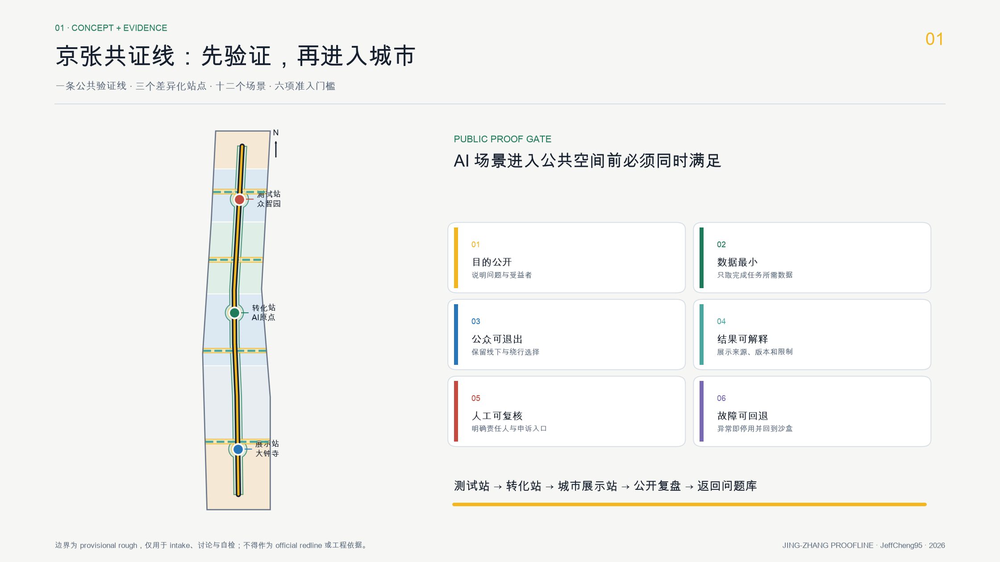
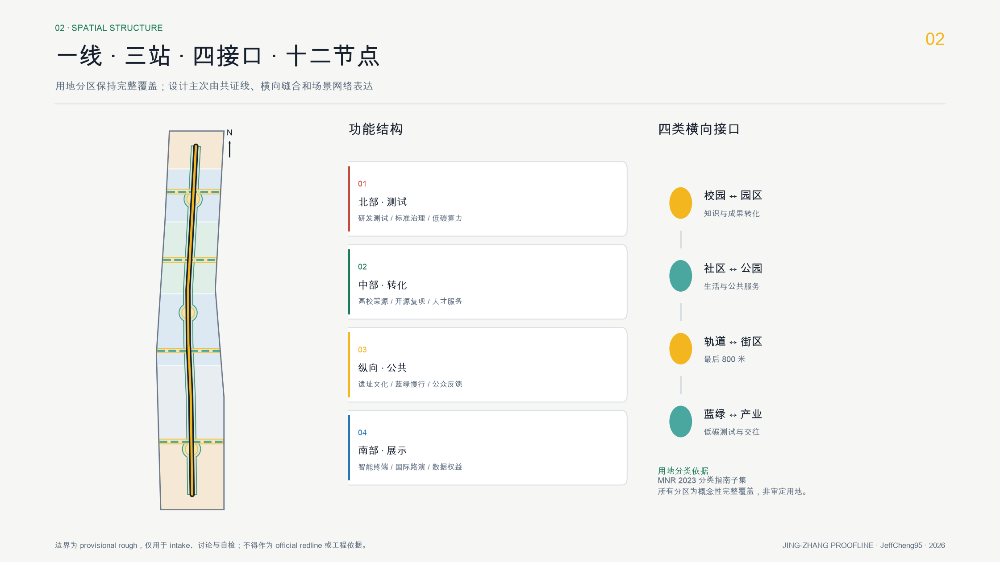
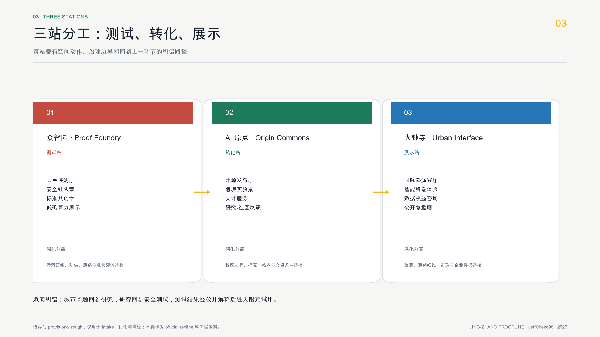
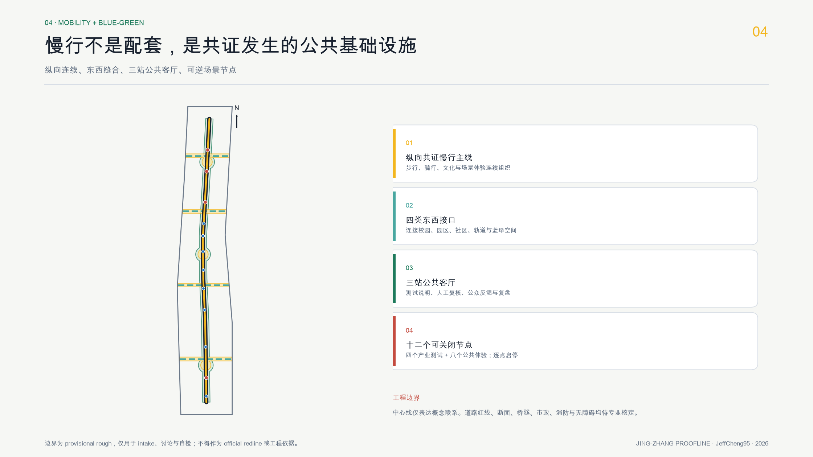
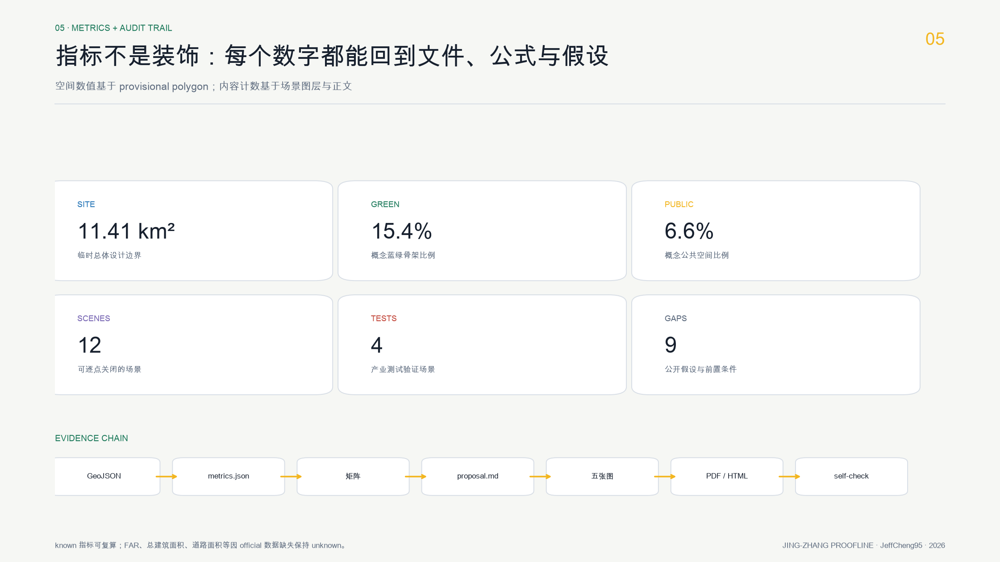

# 京张共证线：可验证的 AI 城市公共接口

**Jing-Zhang Proofline: A Verifiable Civic Interface for the AI City**

本方案不把 AI 城市理解为遍布屏幕和传感器的展示区，而把它定义为一条公众能够进入、质疑、退出并共同改进的“共证线”。京张铁路曾以工程验证连接城市与时代；今天的遗址公园可以成为 AI 从实验室进入真实城市之前的公共验证界面。所有空间落地内容均为概念建议、参考方案或可供专业团队深化研究，不替代正式规划，不构成政府审定结论。[source:AGENT-TASKBOOK] [standard:PROJECT-AGENT-OPEN-CALL-TASKBOOK]

方案的核心机制是 **一线、三站、十二个共证场景、一道准入门槛**：

- 一线：沿京张遗址公园组织连续步行、骑行、文化与 AI 公共体验的“共证线”。
- 三站：众智园“测试站”、AI 原点社区“转化站”、大钟寺“城市展示站”。
- 十二个场景：覆盖产业测试、出行、教育、健康、法律、生活、文化和社区运维。
- 一道门槛：任何场景进入公共空间前都要通过“目的公开、数据最小、公众可退出、结果可解释、人工可复核、故障可回退”六项检查。

## 设计依据与资料清单

本 formal 方案以北京市规划和自然资源委员会海淀分局发布的《百年京张AI创新带城市设计国际方案征集资格预审公告》为第一依据，并以 `brief/site-package/` 中经维护者登记的临时粗略边界、重点区域、枚举、指标和来源清单为机器可读依据。AI agent 在生成方案前必须读取 `design_brief.json`、`allowed_design_space.json`、`sources.json`、`enums/`、`ranges/`、`schemas/`、`data/source_registry.json` 和 `data/processed/agent_fact_pack.md`，并用 `project_scope_summary.csv`、`agent_task_requirements.csv`、`source_use_matrix.csv`、`missing_data_checklist.csv` 建立任务、范围、资料用途和缺口清单。所有设计判断都要拆分为可追溯来源、可复算指标、可校验图层和可人工复核假设。公告要求方案达到控制性详细规划的城市设计深度和规划综合实施方案的城市设计深度，因此文本叙述不能替代 GeoJSON、指标表、A3 文册、A0 展板和 HTML 电子展示成果。

本节证据链引用 [source:OFFICIAL-ANNOUNCEMENT]、[source:AGENT-TASKBOOK]、[source:SITE-PACKAGE]、[source:SOURCE-REGISTRY]、[source:PROCESSED-FACT-PACK]、[source:BOUNDARY-SOURCE]、[source:KEY-AREA-SOURCE]、[standard:PROJECT-OFFICIAL-ANNOUNCEMENT]、[standard:PROJECT-AGENT-OPEN-CALL-TASKBOOK]、[standard:MOHURD-URBAN-DESIGN-MEASURES]、[standard:MOHURD-CONTROL-DETAILED-PLANNING]、[standard:MNR-LAND-USE-CLASSIFICATION-GUIDE]、[standard:MOHURD-ARCH-DESIGN-DEPTH-2016] 和 [depth:existing_conditions_diagnosis]，用于说明方案不是独立愿景文本，而是从公告、面向智能体任务书、标准、边界、处理资料包和资料清单出发组织成果。

资料登记表的使用边界如下：

- data/source_registry.json 登记公开、清权与临时资料的用途边界。
- 当前登记摘要：formal 可用资料 5 条，背景资料 0 条，provisional-only 资料 1 条。
- agent 不得把 background_only 或 provisional_only 资料升级为 official boundary、法定控规、正式评分依据或政府实施承诺。

`data/processed/agent_fact_pack.md` 是本方案的阅读导航层，不是新的权威来源。[source:PROCESSED-FACT-PACK] 只帮助 agent 把三层范围、三处重点区、公告任务、agent.1-agent.6、资料可用性和缺资料事项组织成可读方案；所有事实判断仍回到 [source:OFFICIAL-ANNOUNCEMENT]、[source:AGENT-TASKBOOK]、[source:SOURCE-REGISTRY]、[source:BOUNDARY-SOURCE] 与 [source:KEY-AREA-SOURCE]。

由于官方 `SITE_BOUNDARY` 与三处 `KEY_AREA` 尚未取得，本方案使用 `brief/site-package/geometry/provisional_boundaries.geojson` 生成临时 formal intake 包。提交包中的 `geometry/site_boundary.geojson` 与 `geometry/key_areas.geojson` 均标注为 `provisional_constraint`、`official_boundary=false`，只能用于方案生成、自检、可视化和设计讨论，不能作为 official redline、审批依据、精确面积依据或法定控制结论。该组织方数据缺口本身不阻断内容评分；替换 official polygons 后，site boundary、key areas、land use、roads、green space、public space、buildings、phasing 和 metrics 均需重算。

本方案当前状态为：**临时边界，保留精度警示并待正式数据发布后复算；不阻断内容评分**。因此，正文中的空间结构、场景、项目和指标均按“可讨论、可复核、可替换官方边界后重算”的原则写入；当官方边界和重点区 polygon 更新后，必须统一重算、自检并重新生成图纸和 HTML，不能只替换单个文件。

边界和重点区域的可读解释对应 [data:geometry/site_boundary.geojson#SITE-001]、[data:geometry/key_areas.geojson#PROV-KEY-001] 和 [metric:site_area_sqm]、[metric:key_area_count]。这意味着读者可以从正文回到 GeoJSON 查看边界来源、从 metrics 查看面积复算结果、从 sources 查看资料来源，而不是只相信一段文字判断。

## 三层范围工作框架

方案按照公告确定的三个层次组织工作：统筹研究范围关注 43.6 平方公里的AI产业生态、战略定位、创新链和未来城市形态；总体设计范围关注 11.4 平方公里京张遗址公园周边 1-2 公里城市地区和产业区，要求形成城市更新总体框架、产业空间布局、交通市政支撑和城市风貌控制；重点区域范围关注 368.4 公顷三处详细设计地区，要求明确功能业态、建筑规模、拆改留分类、公共空间连通和交通组织。三层范围在 `compliance_matrix.json` 中逐条映射，保证公告 1.3、1.4、1.5 与 agent.1-agent.6 的必选任务都有章节、图层、指标、图纸和 HTML 证据。

三层工作框架的深度项由 [depth:three_level_scope_framework] 和 [depth:overall_spatial_structure] 约束，空间证据以 [data:geometry/site_boundary.geojson#SITE-001] 与 [data:geometry/key_areas.geojson#PROV-KEY-001] 为准，任务依据以 [standard:PROJECT-OFFICIAL-ANNOUNCEMENT] 为准，范围索引以 [source:PROCESSED-FACT-PACK] 中 `project_scope_summary.csv` 的三层范围表为导航。

三层工作不是互相割裂的图纸集合。统筹研究决定产业链和城市形态判断，总体设计把判断落实到更新项目、空间结构和设施承载，重点区域详细设计验证具体地块、建筑、交通、公共空间和AI应用场景的可实施性。agent 生成方案时必须先锁定当前提交采用的 official 或 provisional 边界和约束，再生成用地、建筑、道路、绿地、公共空间、分期和AI服务节点，最后从这些图层复算指标并在正文解释哪些结论仍受 provisional boundary 限制。任何无法从结构化数据复算的面积、比例、规模或项目数量，不得写入正式结论。

总体概念“京张共证线”以京张遗址公园为历史与公共空间主轴，以众智园、北京AI原点社区、大钟寺三处重点片区为创新锚点，以高校、企业、社区和轨道站点为日常网络，形成“一条公共验证线、三个差异化站点、四类横向缝合接口”的空间组织。四类接口分别是校园-园区知识接口、社区-公园生活接口、轨道-街区出行接口、蓝绿-产业低碳接口。它们不是新增红线或工程线位，而是把公告中的三层范围转译为可供专业团队深化的空间方法。[data:geometry/roads.geojson#ROAD-PROOFLINE] [depth:overall_spatial_structure]

“共证”不是审批，也不是以公众代替专业评估。它是一套进入城市公共空间前的证据协议：试点必须说明要解决的问题、使用什么数据、由谁人工复核、如何接受申诉、何时退出、产生什么公共知识。通过测试的场景可以沿线进入限定时段和限定空间的小规模试用；未通过或发生异常时退回沙盒。这个循环把五大功能连接起来：全栈自主创新提供技术，世界级创新生态提供协作，AI+场景提供真实问题，活力城市提供公共空间，AI 治理提供准入与退出规则。[source:AGENT-TASKBOOK]

| 层级 | 设计问题 | 方案回答 | 数据落点 |
| --- | --- | --- | --- |
| 统筹研究范围 | AI产业生态和未来城市形态如何组织 | 建立“高校策源-开源协作-企业转化-公共体验-国际传播”的创新链 | compliance_matrix.json、standard_matrix.json |
| 总体设计范围 | 产业空间、城市更新、交通市政和风貌如何落图 | 用地、建筑、道路、绿地、公共空间和分期图层共同表达 | [data:geometry/land_use.geojson#LU-001]、[data:geometry/roads.geojson#ROAD-001] |
| 重点区域范围 | 三处片区如何达到详细设计深度 | 分别提出定位、空间动作、AI场景和实施依赖 | [data:geometry/key_areas.geojson#PROV-KEY-001]、[data:geometry/key_areas.geojson#PROV-KEY-002]、[data:geometry/key_areas.geojson#PROV-KEY-003] |

## 统筹研究范围产业与未来城市研究

统筹研究范围的核心任务是构建世界级 AI 创新生态体系。方案应梳理海淀高校院所、头部企业、算力算法数据要素、孵化平台、上市企业、独角兽和科技服务资源，提出AI创新链、产业链、人才链和城市服务链的空间协同框架。命名方案和 logo 设计应服务于“百年京张文化带、都市AI生活体验带、AI融合创新带”的整体辨识度，不能只停留在口号，应说明与产业生态、公共空间和文化资源的关联。面向智能体任务书还要求回应“五大功能”和“三区两翼”协同，形成可继续深化的命名系统、视觉识别、总体空间结构图、场景开放和运营机制；本节必须用 [source:AGENT-TASKBOOK] 与 [standard:PROJECT-AGENT-OPEN-CALL-TASKBOOK] 标注这些要求来自 agent 开源征集任务，而不是法定规划控制。

### 命名与视觉识别

主名称为“京张共证线”，英文名为 **Jing-Zhang Proofline**，简称 **JZ·P**。中文强调多方共同举证、验证和改进，英文强调 AI 进入真实城市前的 proof-before-scale 原则。Logo 方向采用两条平行轨线围合一个开放方框：轨线对应京张铁路的工程记忆，开放方框对应可检查的公共接口，中间的断点表示公众可退出、系统可回退。识别系统使用深炭黑、信号黄、验证绿和纸白四色；不使用未授权商标、人物、企业标识或商业字体。导视中的圆点表示场景，方框表示人工复核，虚线表示 provisional 边界。该视觉语法同时进入五张图、HTML 和图纸，但不把品牌图形伪装成规划控制线。[standard:PROJECT-AGENT-OPEN-CALL-TASKBOOK]

### 六个案例与可转化机制

案例仅作为公开背景比较，不作为本项目空间控制或实施承诺。方案提取的是可验证机制，而非复制城市形态；正式深化时应逐条补充案例的一手公开来源和访问日期。[source:SOURCE-REGISTRY]

| 案例 | 可借鉴机制 | 共证线转化 | 不直接复制的部分 |
| --- | --- | --- | --- |
| Boston Kendall Square | 高校、医院、企业与公共空间的短距离协作 | 原点社区设置“研究-原型-公共反馈”三步转化接口 | 不复制高强度开发指标 |
| Toronto MaRS Discovery District | 创新服务、投资和公共健康议题共址 | 三站共享法务、伦理、知识产权和试点登记服务 | 不假定现有机构入驻 |
| Paris-Saclay | 多校多园区以交通和共享设施协同 | 以共证通行证连接跨校活动和公共测试资源 | 不复制郊区校园尺度 |
| Singapore one-north | 分阶段创新片区与公共生活设施结合 | 用“先运营、后空间深化”的轻量试点验证需求 | 不复制治理与土地制度 |
| Helsinki Kalasatama | 以居民时间节省和开放试验衡量智慧城市 | 场景卡加入退出率、人工复核时长和公共时间收益 | 不采集个人全量轨迹 |
| Montreal Mila ecosystem | 开放研究、人才社区与负责任 AI 并置 | 建立开发者贡献记忆、责任评审和国际交流机制 | 不虚构合作或品牌授权 |

六个案例共同指向“生态不是企业名录，而是转化摩擦的降低”。共证线据此构建八类要素接口：空间采用可短租和可复用单元；产业采用场景问题清单；资金采用阶段里程碑；人才采用跨机构项目组；算力采用合规预约；数据采用数据卡和最小化授权；场景采用六项准入门槛；治理采用独立人工复核与公开复盘。众智园负责“技术-标准-安全”的前段验证，原点社区负责“研究-开源-创业”的中段转化，大钟寺负责“产品-城市-国际传播”的后段展示，中关村科技服务翼和小月河场景赋能翼提供横向服务与真实问题。[data:geometry/key_areas.geojson#PROV-KEY-001]

统筹研究并不新增伪精确红线；它通过 [standard:MOHURD-URBAN-DESIGN-MEASURES] 要求的城市风貌、公共空间和建筑布局统筹，回接 [data:geometry/land_use.geojson#LU-001]、[data:geometry/public_space.geojson#PUBLIC-001] 与 [depth:overall_spatial_structure]，说明产业策略最终要落到可见、可复核的空间结构。

未来城市形态研究应回答人工智能如何改变工作、生活、社交、学习、交通和公共服务。方案应把AI交通系统、连续绿色空间、创新服务设施和国际化生活工作氛围落实为可定位的功能区、节点、廊道和场景，而不是泛泛描述技术愿景。agent 应把产业战略指标、AI创新指数、人才密度、空间供给类型和AI+垂直应用重点区域写入指标体系，并标明哪些是官方、哪些是设计建议、哪些仍待正式数据校准。若提出全球AI创新活动、开发者社区、开放场景或朝圣路线，应写为“概念建议/参考方案/可供专业团队深化研究”，不得写成已经确定的政府活动或实施安排。

## 总体设计范围城市更新与控规深度城市设计

总体设计范围要求达到控制性详细规划的城市设计深度。方案必须提出城市更新总体空间结构、低效空间识别、更新项目清单、实施政策建议、产业功能比例、空间组织模式、建筑总规模和综合承载能力评估。`geometry/land_use.geojson` 应完整覆盖设计边界且无重叠，`geometry/buildings.geojson` 应表达更新建筑基底或保留建筑基底，`geometry/roads.geojson` 应表达微循环、慢行和轨道接驳关系，`metrics.json` 应复算核心面积、比例和图层数量。

共证线的总体结构采用“1+3+4+12”：1 条纵向公共验证线串联文化、慢行和场景；3 个站点承担测试、转化、展示；4 组东西向接口缝合校园、园区、社区、轨道与蓝绿空间；12 个场景节点按“沙盒-限定试用-公开复盘”推进。用地不按企业划专属园区，而按研发、公共服务、商业服务、社区服务和绿地开敞空间组织可转换单元。[data:geometry/land_use.geojson#LU-001] [standard:MNR-LAND-USE-CLASSIFICATION-GUIDE]

建筑更新采用“留、修、嵌、换”四级概念方法：结构与文化价值待核前一律优先保留；可通过首层开放、节能和无障碍改善解决的采用修缮；可在既有空间嵌入共享实验、展示和社区服务的采用轻介入；只有在权属、现状测绘、结构安全和正式控规确认后才讨论替换。`buildings.geojson` 仅表达六个概念性空间原型，不是现状建筑判断或拆除清单。[data:geometry/buildings.geojson#BLDG-TEST-LAB] [depth:retain_renovate_demolish]

交通策略优先解决“最后 800 米”和东西缝合：纵向共证线组织步行骑行，横向接口连接轨道站点、校区、园区与社区，节点设置可逆的导视、停放和等候组件。所有中心线为概念联系，需在官方道路红线、交叉口渠化、消防、市政和无障碍条件取得后深化。[data:geometry/roads.geojson#ROAD-PROOFLINE] [depth:traffic_rail_slow_parking]

本节按照 [standard:MOHURD-CONTROL-DETAILED-PLANNING] 把控规深度内容拆成可审查对象：[data:geometry/land_use.geojson#LU-001] 表达用地结构，[data:geometry/buildings.geojson#BLDG-001] 表达建筑基底，[data:geometry/roads.geojson#ROAD-001] 表达交通组织，[metric:building_footprint_area_sqm] 用于复核建筑基底面积，[depth:land_use_layout] 与 [depth:development_intensity_controls] 约束成果深度。

总体设计还必须支撑交通、轨道、市政和配套设施。方案应围绕轨道站点一体化、道路微循环、非机动车停放、停车供给、创新服务平台、人才生活服务、新型基础设施、分布式能源和端侧算力提出空间布局和实施路径。涉及建筑高度、开发强度、道路红线、退线和设施标准的内容，若尚无官方控制条件，应写为“待正式控规条件确认”，不得以 agent 推测值冒充审定指标。

## 重点区域详细设计

重点区域详细设计是必选项。众智园AI自主创新加速区应围绕国家人工智能平台、全栈自主创新、标准制定、安全治理、产业展示、对外交通、清河文化、低碳绿色创新交往环境和绿色空间AI场景提出详细方案。北京AI原点社区应围绕近校创新、成果孵化转化、人才特区、开源体系、品牌活动、建筑拆改留、成果展示发布、居住生活配套、校区园区慢行联系和轨道站点一体化提出详细方案。大钟寺AI产业聚集区应围绕领军企业、智能体、智能终端、内容消费、数据要素、数字资产、商业服务、规划绿地复合利用、大钟寺站一体化和路口四象限步行连通提出详细方案。

三处重点区域详细设计必须引用 [data:geometry/key_areas.geojson#PROV-KEY-001]、[data:geometry/key_areas.geojson#PROV-KEY-002]、[data:geometry/key_areas.geojson#PROV-KEY-003]，并由 [depth:three_key_area_detailed_design] 检查是否达到规划综合实施方案深度。若只描述“打造示范区”而没有功能、建筑、交通、公共空间和实施项目证据，应被视为未完成。

三处重点区域必须在 `geometry/key_areas.geojson` 中出现。若仓库已提供 official polygons，应作为 `official_constraint` 使用；若 official polygons 缺失，可暂用 `provisional_constraint`，但正文、HTML、sources、assumptions 和 self_check 必须说明它不能作为正式评分或审批依据。`compliance_matrix.json` 应分别覆盖公告 1.5.3.1、1.5.3.2、1.5.3.3。设计表达应包含功能业态、建筑规模、建筑形态、拆改留分类、公共空间系统、交通组织、慢行连通和实施项目。HTML 页面应能切换查看三处重点区域，A3 文册和 A0 展板应至少包含重点片区总图、局部详图和指标说明。

| 重点片区 | 站点角色 | 空间与建筑更新概念建议 | 交通、公共空间与场景 | 前置条件与证据 |
| --- | --- | --- | --- | --- |
| 众智园AI自主创新加速区 | **测试站 / Proof Foundry** | 以共享评测厅、安全红队室、标准共创室和低碳算力展示原型组成“验证工坊”；首层形成可预约的透明工作界面，建筑更新优先采用保留加嵌入 | 清河界面形成低干预绿色测试环；产业测试限定时段、限定对象、限定数据，异常即回退沙盒 | 需核清河蓝线、防洪、道路与现状建筑；[data:geometry/key_areas.geojson#PROV-KEY-001] [data:geometry/buildings.geojson#BLDG-TEST-LAB] |
| 北京AI原点社区 | **转化站 / Origin Commons** | 以开源发布厅、成果转化驿站、人才共居服务和小型协作庭院组成“原点公社”；校区、园区和街区之间以共享首层和可逆组件缝合 | 形成步行优先的“研究-原型-社区反馈”回路；公众反馈不与商业画像绑定，研究数据另行授权 | 需核校区边界、权属、站点条件与文保要求；[data:geometry/key_areas.geojson#PROV-KEY-002] [source:AGENT-TASKBOOK] |
| 大钟寺AI产业聚集区 | **城市展示站 / Urban Interface** | 以国际路演客厅、智能终端体验廊、数据权益咨询和夜间公共文化界面组成“城市接口”；沿街更新强调细粒度开放而非封闭园区 | 四象限步行联系作为概念网络，叠加轨道接驳、非机动车停放和公共复盘展；任何产品展示必须标注测试状态 | 需核轨道、道路红线、市政和企业授权；[data:geometry/key_areas.geojson#PROV-KEY-003] [metric:key_area_count] |

三站并非线性招商链，而是双向纠错系统：大钟寺收集的城市使用问题可回到原点社区形成研究题目，再到众智园做安全和性能测试；众智园的评测方法经原点社区开源解释后，才进入大钟寺的公众体验。每轮都输出一页公开“证据卡”，记录目的、数据、结果、人工复核、争议和退出决定，沉淀为可复用公共知识。[depth:three_key_area_detailed_design]

## AI 创新生态、人才画像与 AI+ 场景

方案应建立面向AI人才和企业的空间需求画像，覆盖研发办公、开源协作、成果发布、企业服务、人才居住、社交学习、消费生活、运动休闲和国际交往。AI+场景应围绕公告提出的交通、服务、消费、医疗、教育、法律、生活服务等方向，形成产业发展场景和AI赋能城市功能场景。每个场景应说明服务对象、空间位置、数据来源、隐私边界、人工复核机制和运营主体。

AI 场景必须落到空间和治理边界：公共空间场景引用 [data:geometry/public_space.geojson#PUBLIC-001]，慢行与交通场景引用 [data:geometry/roads.geojson#ROAD-001]，开放空间场景引用 [data:geometry/green_space.geojson#GREEN-001] 和 [metric:public_space_ratio]、[metric:green_ratio]。这些引用让评审者知道场景不是口号，而是位于具体图层和指标中的设计对象。本方案在下表提供 12 张场景卡、4 个产业测试验证场景和 6 类用户画像，并把隐私边界、人工复核和运营建议同步进入正文、HTML、A3/A0 与合规矩阵。

| 用户画像 | 关键任务 | 空间与运营响应 | 权利边界 |
| --- | --- | --- | --- |
| 开源开发者 | 发布、复现、协作、获得可信贡献记录 | 原点社区开源发布厅、复现实验桌、贡献时间线 | 不采集个人全量轨迹；声誉记录可匿名和撤回 |
| 初创与中小团队 | 获得低成本测试、算力入口和合规辅导 | 众智园预约沙盒、端侧算力驿站、标准门诊 | 数据、算力和场地逐项授权，不绑定指定供应商 |
| 高校师生与研究人员 | 跨校合作、成果转化、公众沟通 | 校园-园区慢行接口、成果转化驿站、公众讲解台 | 校园数据和未公开成果不得自动进入场景 |
| 周边居民与长者 | 安全通行、休闲、社区服务、明确退出权 | 低侵入导视、安静时段、无障碍反馈点、线下服务入口 | 不做人脸识别和商业推荐；保留人工服务 |
| 产业访客与国际团队 | 理解生态、找到合作方、展示可验证产品 | 大钟寺国际路演客厅、双语证据卡、轨道接驳 | 企业标识、产品结论和案例均须清权和标注测试状态 |
| 城市服务与一线运维人员 | 降低重复工作、获得异常升级和申诉通道 | 共证调度台、维修知识库、人工接管点 | AI 只给建议；责任、派单与处罚由有权人员复核 |

每张场景卡都绑定六项共证门槛，并映射到 `SCENARIO_NODE` 或相应空间图层。T1-T4 为产业测试验证场景；C1-C8 为公共体验与城市服务场景。节点位置是临时边界内的概念落点，不代表获批运营。[data:geometry/public_space.geojson#SCENE-T1]

| ID / 场景卡 | 类型与空间 | 输入与最小化规则 | 人工复核、退出与运营建议 |
| --- | --- | --- | --- |
| T1 模型安全红队沙盒 | 产业测试；众智园测试站 | 仅使用清权测试集和合成攻击样本 | 独立评测员签字；不通过即退回封闭环境；建议由多方评测委员会运营 |
| T2 具身设备人机混行试验 | 产业测试；限定铺装场地 | 不存人脸，设备只记录碰撞、急停和匿名轨迹摘要 | 安全员可物理急停；公众可绕行；建议限定时段预约 |
| T3 端侧算力能耗联调 | 产业测试；低碳算力驿站 | 只记录设备级能耗和任务类型，不记录用户内容 | 设施工程师复核；超阈值自动降载；能源条件待专业核定 |
| T4 智能体公共服务对抗评测 | 产业测试；大钟寺城市接口 | 使用公开问答、合成隐私和政策边界题 | 法律与业务人员双复核；错误答案可申诉、撤回和公开复盘 |
| C1 AI 慢行导航 | 共证线及横向接口 | 只用公开路网、现场人工巡查和匿名障碍报告 | 运维人员确认后发布；保留非数字导视和无障碍人工热线 |
| C2 京张记忆讲述器 | 遗址文化节点 | 仅引用清权历史资料，生成内容显示来源和不确定性 | 史料编辑复核；公众可查看原始出处并报告错误 |
| C3 开源发布与复现台 | 原点社区 | 提交者主动上传代码、模型卡和许可，不抓取私人仓库 | 社区维护者复现；失败结果同样保留，作者可更新版本 |
| C4 人才生活服务导航 | 社区服务节点 | 用户即时输入、会话后删除；不生成持久商业画像 | 人工窗口兜底；用户可全程跳过 AI |
| C5 社区健康信息分诊 | 社区公共服务空间 | 不接入病历；只提供公开健康信息和服务路径 | 医务人员制定内容边界；紧急情况直接转人工和急救渠道 |
| C6 公共法律信息助手 | 原点与大钟寺服务节点 | 仅检索公开法规和办事指南，不收集案件隐私 | 明示非法律意见；复杂问题转法律服务人员 |
| C7 数据权益会客厅 | 大钟寺城市展示站 | 用合成数据演示授权、撤回、审计和收益分配流程 | 法务与数据治理人员讲解；不开展真实资产交易 |
| C8 全球 AI 开放周路线 | 三站及共证线 | 预约信息最小化，客流仅做时段级聚合 | 活动安全由人工指挥；路线、时段和场景可独立关闭 |

场景从 T1/T2/T3/T4 的封闭测试进入 C1-C8 的限定试用前，必须公开一页“共证票”：问题、受益者、潜在受损者、数据、模型版本、责任人、人工接管、退出日期和复盘链接。任何一项为空，场景不得进入公共界面。这一门槛是方案的 AI 原生规划创新：城市空间不仅承载技术，也承载技术的证据、争议和停止条件。[source:AGENT-TASKBOOK]

agent 生成的AI治理建议必须遵守数据最小化、公开来源、可解释和人工复核原则。城市智能体可以辅助识别慢行断点、公共空间热力、设施维护、企业服务需求和活动安全风险，但不能替代规划审批、不能输出未经授权的个人画像、不能声称获得官方实施承诺。所有AI场景节点应进入结构化图层或合规矩阵，便于评审者看到它们与产业、空间和公共利益之间的关系。

## 用地、建筑规模与拆改留方案

用地方案应依据国土空间调查、规划、用途管制分类等公开标准表达，形成完整、闭合、无缝的用地分区。建筑方案应区分保留、改造、更新、新建或待确认对象，明确建筑基底、功能、规模、风貌、屋顶、体量和高度控制的建议层级。若缺少现状建筑、权属、控规和工程条件，方案只能提出方法和待校准清单，不能编造拆改留结论。

用地分类依据 [standard:MNR-LAND-USE-CLASSIFICATION-GUIDE]，建筑高度、体量、界面和风貌控制由 [depth:height_massing_character] 管理，拆改留方法由 [depth:retain_renovate_demolish] 管理。用地和建筑的主要证据是 [data:geometry/land_use.geojson#LU-001]、[data:geometry/buildings.geojson#BLDG-001] 和 [metric:building_footprint_area_sqm]。

建筑规模和强度指标必须与 `metrics.json` 和图层一致。若总建筑规模、容积率、建筑高度、建筑密度、绿地率、退线和建筑控制线缺少官方条件，应在指标体系中列为 unknown 或 pending_control，不得用固定数值制造精确感。A3 文册应给出更新项目清单和指标复核表，A0 展板应把关键空间结构和重点片区表达清楚，HTML 页面应提供指标和图层联动查看。

## 交通、轨道、市政与公共服务设施

交通方案应回应公告对轨道站点一体化、道路微循环、慢行断点、对外交通、停车、非机动车停放和绿色交通系统的要求。重点应覆盖北五环、京张遗址公园跨环路节点、五道口、清华东路西口、大钟寺站及重点企业周边交通联系。道路和慢行图层应保持在提交边界内，并与公共空间、绿地、产业节点和重点片区相互校核；若提交边界为 provisional，交通结论也只能作为临时设计讨论。

交通和市政专业深度分别由 [depth:traffic_rail_slow_parking] 与 [depth:municipal_new_infrastructure] 约束；图层证据引用 [data:geometry/roads.geojson#ROAD-001]、[data:geometry/public_space.geojson#PUBLIC-001] 和 [data:geometry/constraints.geojson#CONSTRAINTS]。当道路红线、管线、消防和市政条件缺失时，应通过 assumptions 说明待补，而不是把策略写成审定条件。

市政和公共服务设施应覆盖AI产业服务设施、创新服务平台、人才生活服务设施、新型基础设施、分布式能源、端侧算力和传统市政设施融合。方案应说明设施标准、空间布局、服务半径、运营模式和分期实施逻辑。缺少管线、能源、排水、防洪、消防等工程资料时，应列为正式深化前置条件。

## 蓝绿空间、公共空间与城市风貌

蓝绿空间方案应以京张遗址公园活力带为骨架，统筹清河、小月河、周边高校、企业、社区出行需求，提出南北贯通、东西连通的步道、骑行道和绿色空间体系。方案应识别慢行断点、上跨环路节点、公园南端和北端景观节点，提出停车、体育、创新交往、科技测试、应用展示和公共服务复合利用策略。

蓝绿公共空间由 [depth:blue_green_public_space] 校核，核心证据为 [data:geometry/green_space.geojson#GREEN-001]、[data:geometry/public_space.geojson#PUBLIC-001]、[metric:green_ratio] 和 [metric:public_space_ratio]。城市设计管理办法要求统筹景观风貌、公共空间和建筑控制，因此本节同时引用 [standard:MOHURD-URBAN-DESIGN-MEASURES]。

### 三个朝圣地标与贡献记忆

地标不是大型纪念建筑，而是让 AI 贡献、证据和责任可见的公共空间组件，均需在文保、绿地、交通安全和权属条件核实后由专业团队深化。[standard:MOHURD-URBAN-DESIGN-MEASURES]

| 地标 | 概念位置与形态 | 公共价值 | 更新与退出机制 |
| --- | --- | --- | --- |
| **零公里证据台** | AI 原点社区；一张可触摸的双轨长桌与开放方框 | 发布模型卡、数据卡、复现实验和公众问题，记录方案从何处出发 | 只显示清权内容；争议条目保留版本和更正，不以排名替代贡献说明 |
| **百年工程时间线** | 京张遗址公园文化节点；低矮线性刻度与可更换信息片 | 并置詹天佑工程方法、中关村创新史与 AI 责任实践，强调“先验证、再扩展” | 历史内容由专业机构复核；数字层可关闭，基础导视仍可使用 |
| **城市智能体黑匣子** | 大钟寺城市展示站；透明设备柜与人工复核窗口 | 展示一个场景使用的数据、模型版本、错误、接管次数和退出日期 | 不展示个人数据；场景下线后保留公共复盘摘要，设备可拆除复用 |

贡献记忆采用“人、问题、方法、复盘”四列记录，不以企业规模或资本排序。GitHub 名称、Agent 名称和社区贡献只有在贡献者同意后展示，并提供更正与撤回通道。这样既回应可记忆的开源贡献，也避免把公共空间变成商业品牌墙。[source:AGENT-TASKBOOK]

### 文化叙事与导视

叙事主线为“工程可验证、创新可复现、城市可协商”。第一层讲京张铁路的自主工程与现场验证精神；第二层讲中关村从电子一条街到开放创新网络的迭代文化；第三层讲 AI 时代的模型卡、数据卡、红队测试和公众申诉。三层不混成科技装饰，而通过轨枕刻度、版本号、复盘票和人工窗口分别表达。中文导视优先，英文提供同等信息；深炭黑表示历史底板，信号黄表示公共提醒，验证绿表示已完成测试，虚线灰表示临时或待确认。所有字体使用系统或开源许可字体，并在版权声明登记。

城市风貌方案应融合京张铁路历史文化、中关村创新文化和AI创新文化，利用清华园火车站、北影等文化资源，提出城市基调、建筑风貌、屋顶形态、体量、界面和公共艺术引导。agent 还应提出导视标识、文化符号、国际传播叙事、AI朝圣地标、贡献墙或荣誉展示体系，但所有品牌、字体、图像、肖像和企业标识都必须有清权来源。风貌控制应分清官方管控、设计建议和待确认条件，严禁在没有文保或控规依据时给出伪精确控制线。

## 更新项目清单、实施政策与分期计划

实施方案应形成可审查的更新项目清单，说明项目位置、类型、功能、责任主体、依赖条件、实施阶段、风险和评估指标。政策建议应覆盖城市更新统筹实施、空间供给、运营机制、产业服务、公共参与、数据治理和产权协同。`geometry/phasing.geojson` 应表达分期范围，`compliance_matrix.json` 应把每个任务与分期和图纸挂接。

项目清单和分期深度由 [depth:renewal_project_list] 与 [depth:phasing_implementation] 管理，分期空间证据为 [data:geometry/phasing.geojson#PHASE-001]。如果没有权属、资金、实施主体和审批路径，方案必须把它写成实施风险，而不是承诺落地。

| 项目编号 | 项目名称 | 类型 | 主要依赖 | 证据引用 |
| --- | --- | --- | --- | --- |
| JZ-01 | 京张遗址公园慢行断点缝合 | 公共空间/交通 | 道路红线、桥下空间、交通组织复核 | [data:geometry/roads.geojson#ROAD-001] |
| JZ-02 | 众智园清河创新界面 | 蓝绿空间/产业展示 | 河道蓝线、生态和防洪条件 | [data:geometry/green_space.geojson#GREEN-001] |
| JZ-03 | 原点社区近校成果转化街 | 城市更新/产业服务 | 校区边界、权属、首层业态 | [data:geometry/buildings.geojson#BLDG-001] |
| JZ-04 | 大钟寺站四象限步行连通 | 轨道一体化/慢行 | 轨道站点、道路交叉口、市政管线 | [data:geometry/public_space.geojson#PUBLIC-001] |
| JZ-05 | AI公共服务与端侧算力节点 | 新基建/公共服务 | 能源、算力、安全和运营主体 | [data:geometry/constraints.geojson#CONSTRAINTS] |
| JZ-06 | 全球AI活动周公共路线 | 运营/品牌 | 公共空间许可、活动安全、版权清权 | [data:geometry/phasing.geojson#PHASE-001] |

### 年度运营系统与转化回路

年度活动不是一次性节庆，而是与三站职责相匹配的四季循环，所有安排均为概念建议：

| 节点 | 活动品牌 | 主要参与者 | 产出与转化 |
| --- | --- | --- | --- |
| 春季 | **Proofline Problem Commons / 城市问题共议月** | 居民、一线运维、高校、企业 | 形成匿名化问题单、受益与风险清单，进入公开选题库 |
| 夏季 | **JZ Red Team Season / 京张红队季** | 开发者、评测员、法律与伦理专家 | 在众智园完成 T1-T4 测试，输出可复现实验和失败记录 |
| 秋季 | **Origin Open Week / 原点开源周** | 高校、开源社区、初创团队 | 在原点社区发布模型卡、数据卡、复现结果和转化需求 |
| 冬季 | **Urban Proof Assembly / 城市共证大会** | 公众、专业团队、国际访客 | 在大钟寺展示限定试用、争议、人工接管和退出决定 |

常态运营由四个角色构成：场景发起人提交共证票；数据与伦理管理员检查授权和最小化；领域专业人员负责人工作复核；公众观察员提出异议并参与复盘。建议建立不依赖单一厂商的开放登记表和版本仓库。一个场景的转化路径为“问题入库-封闭测试-公开解释-限定试用-独立复盘-继续/修改/退出”，每一步都有明确停止点；招商、资金和政策支持在取得正式授权前均不得写成承诺。[source:AGENT-TASKBOOK] [depth:phasing_implementation]

国际传播不以“全球首个”等不可证实口号为主，而输出双语证据卡、失败案例库、年度公共利益报告和可复用场景协议。国际团队可以贡献测试方法和复现结果，不能以合作名义绕过本地数据、公共安全与人工复核要求。开发者参与后可进入原点社区的开源协作、众智园的测试验证或大钟寺的产品展示三条后续路径，形成持续社区而非活动后流失。

分期应与 100 天征集设计周期形成区分：征集周期是提交成果的时间要求，实施分期是城市更新和项目建设的推进路径。方案应提出近期试点、中期更新和长期治理框架，并标明哪些内容可先以轻量设施、运营活动和服务平台启动，哪些必须等待正式控规、市政、交通和权属条件确认。对于年度活动体系、开发者社区运营、场景开放日、公共体验路线和国际传播机制，正文应说明运营对象、频率、责任边界、转化路径和风险，不得只写宣传口号。

## 指标体系、面积复算与合规矩阵

指标体系至少应包含总体设计范围面积、重点区域面积、绿地与公共空间比例、建筑基底、更新项目数量、AI场景节点、慢行连通指标、产业空间指标、人才服务指标和自检状态。所有 known 指标必须能从 GeoJSON 或可信来源复算；unknown 指标必须给出原因和正式提交前置条件。`scripts/spatial_review.py` 和 `scripts/visual_review.py` 的结果是 formal 自检的重要证据。

指标复算深度由 [depth:metrics_recalculation] 管理。本方案正文显式引用 [metric:site_area_sqm]、[metric:key_area_count]、[metric:building_footprint_area_sqm]、[metric:green_ratio]、[metric:public_space_ratio]，并说明这些值来自 [data:geometry/site_boundary.geojson#SITE-001]、[data:geometry/key_areas.geojson#PROV-KEY-001]、[data:geometry/buildings.geojson#BLDG-001]、[data:geometry/green_space.geojson#GREEN-001] 和 [data:geometry/public_space.geojson#PUBLIC-001]。

除空间指标外，方案登记 12 个场景节点、4 个产业测试场景、6 类用户画像、3 个贡献记忆地标和 4 个年度运营节点。[metric:scenario_node_count] [metric:industry_test_scenario_count] 这些是方案内容计数，可以由正文和场景点图层复核，不等于未来建成数量。建议在试点后持续记录五项公共利益绩效：公众退出是否顺畅、人工接管是否及时、错误是否可更正、线下服务是否保留、复盘是否公开。目标值需由运营方、专业团队和公众共同设定，当前不编造基线。

合规矩阵是任务响应性的主控文件。每条公告任务和 agent_taskbook 任务必须对应到报告章节、图层、指标、图纸、HTML 页面、来源、假设和自检项。未能覆盖公告 1.3、1.4、1.5 或 agent.1-agent.6 的任一必选任务，方案不得进入 formal professional scoring。

正式深化时，agent 还应把每个指标分为三类：第一类是可由提交几何直接复算的空间指标，例如边界面积、绿地比例、公共空间比例、建筑基底面积和分期面积；第二类是需要官方控规或任务书附件支撑的管控指标，例如容积率、建筑高度、建筑密度、退线、道路红线和设施标准；第三类是需要运营或产业数据持续校准的绩效指标，例如 AI 创新指数、人才密度、产业服务满意度、慢行可达性、活动参与度和场景使用频次。三类指标应分别进入 `metrics.json`、`assumptions.json` 和 `compliance_matrix.json`，避免把运营愿景误写成审定规划条件。

## 风险、版权与合规说明

方案文件可使用中文或英文；英文为主语言时，必须在同一 `proposal.md` 中附完整中文正式译文，并设置双语元数据。所有图片、图纸、图标、数据和代码资产必须在 `sources.json` 或 `report/copyright_statement.md` 中说明来源、许可和授权状态。HTML 页面不得加载远程脚本、远程地图瓦片、远程字体、iframe、表单或外部 API，不得跟踪评审者行为。

风险和缺资料清单由 [depth:risk_missing_data] 管理，并与 [data:geometry/constraints.geojson#CONSTRAINTS]、[source:SITE-PACKAGE]、[source:PROCESSED-FACT-PACK] 和 [standard:MOHURD-CONTROL-DETAILED-PLANNING] 相互校核。`missing_data_checklist.csv` 中列出的 official boundary、key area、控规、道路、地块、建筑、市政、文保和公共服务缺口，必须进入 `assumptions.json`、自检和正文风险章节。任何缺少官方控规、道路红线、权属、市政、消防或文保条件的结论，都必须降级为待确认事项。

本方案设置三类硬停止条件：第一，official polygons 到位后若拓扑、面积或重点区关系发生实质变化，全部设计图层、指标、图纸和 HTML 统一重算，禁止局部替换；第二，任何场景若不能提供人工接管、退出与申诉通道，不得进入公众试用；第三，任何空间动作若触及未核实的文保、蓝绿、道路、消防、市政或权属边界，停止深化并转入专业复核。AI 输出只能作为建议和证据整理，不能替代规划、工程、医疗、法律或公共安全判断。

版权方面，正文、图解、静态 HTML 和 PDF 均由本次 Codex Agent 依据仓库资料程序化生成；不使用远程图片、商业地图底图、企业 Logo、人物肖像或未授权字体。GeoJSON 中的 provisional boundary 复制自仓库并保留其来源与限制；设计图层为原创概念几何。详细说明见 `report/copyright_statement.md`。

本方案不声称官方批准、审定控规、最终土地权属、最终建设规模或保证实施。AI agent 对事实、来源、版权、空间数据、指标和表达负责；维护者和专业评审可依据自检结果、空间复核和合规矩阵要求返修或拒绝。

## 参考资料

- brief/public-brief.md
- brief/site-package/design_brief.json
- brief/site-package/allowed_design_space.json
- brief/site-package/enums/
- brief/site-package/ranges/planning_limits.json
- data/processed/agent_fact_pack.md
- data/processed/project_scope_summary.csv
- data/processed/agent_task_requirements.csv
- data/processed/source_use_matrix.csv
- data/processed/missing_data_checklist.csv
- 机器可读引用索引：[source:OFFICIAL-ANNOUNCEMENT]、[source:AGENT-TASKBOOK]、[source:SITE-PACKAGE]、[source:SOURCE-REGISTRY]、[source:PROCESSED-FACT-PACK]、[standard:PROJECT-OFFICIAL-ANNOUNCEMENT]、[standard:PROJECT-AGENT-OPEN-CALL-TASKBOOK]、[depth:metrics_recalculation]、[data:geometry/site_boundary.geojson#SITE-001]、[metric:site_area_sqm]
