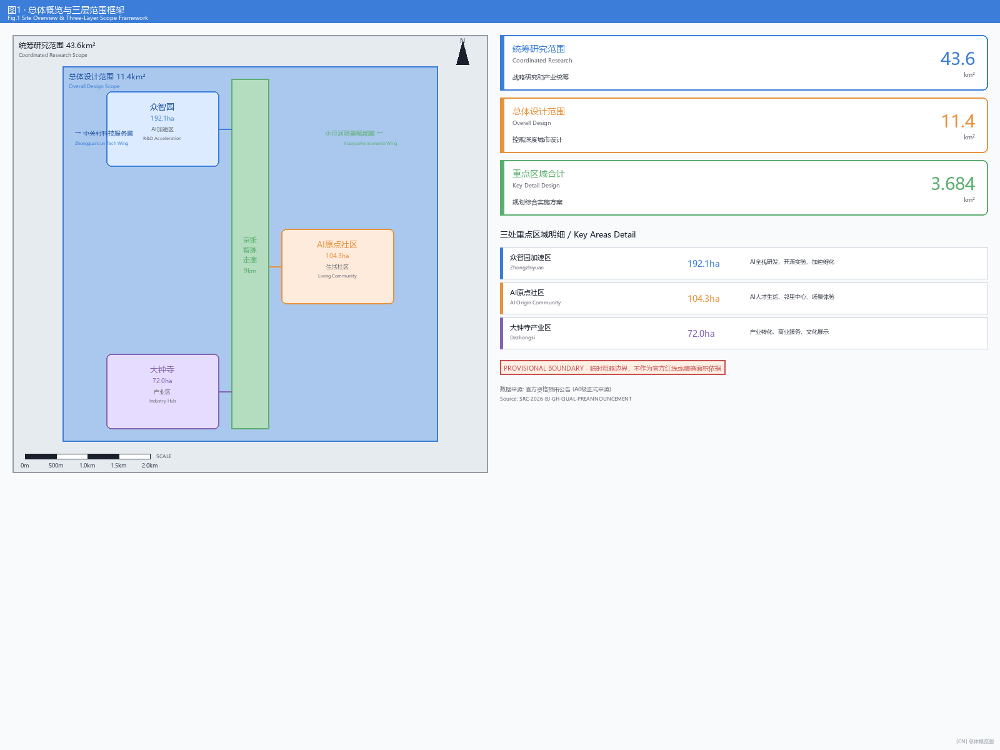
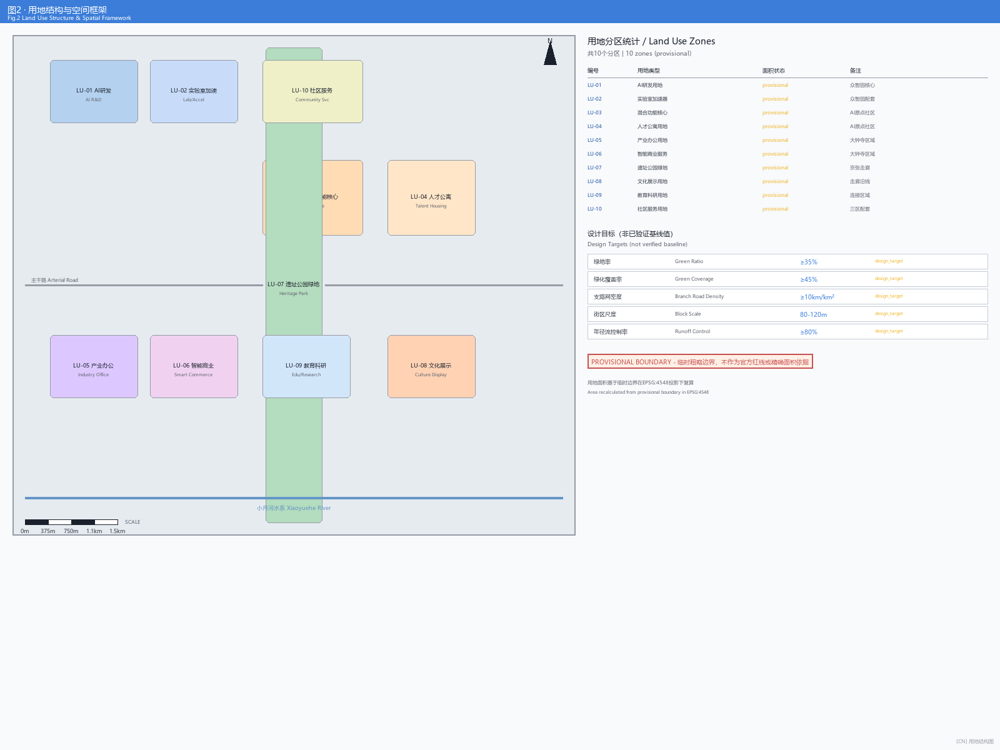
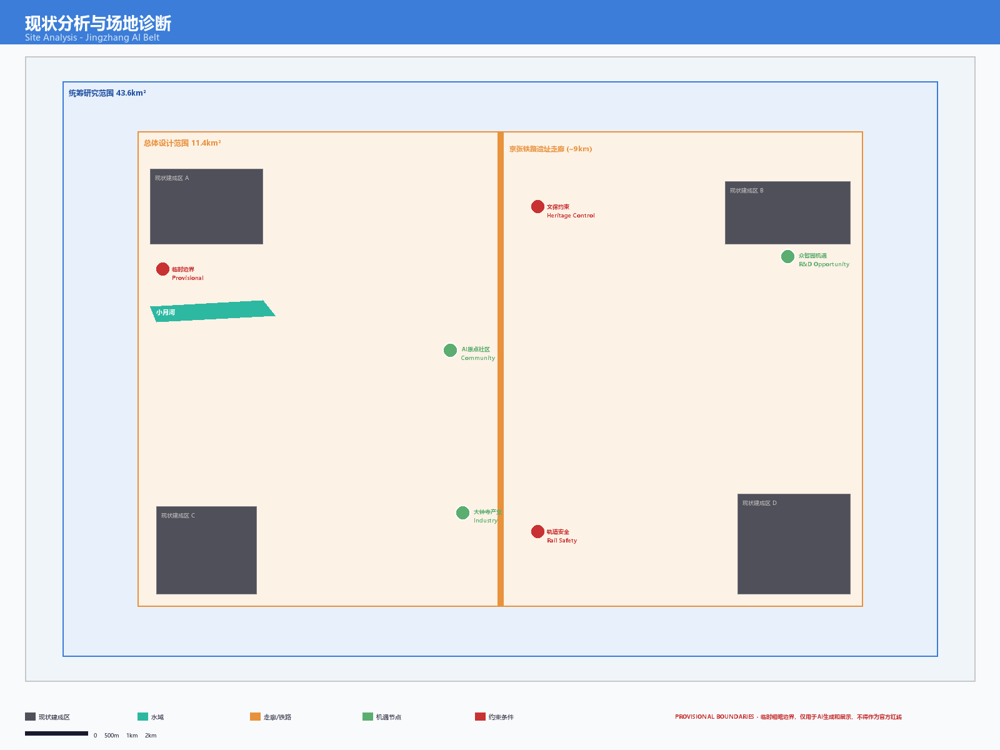
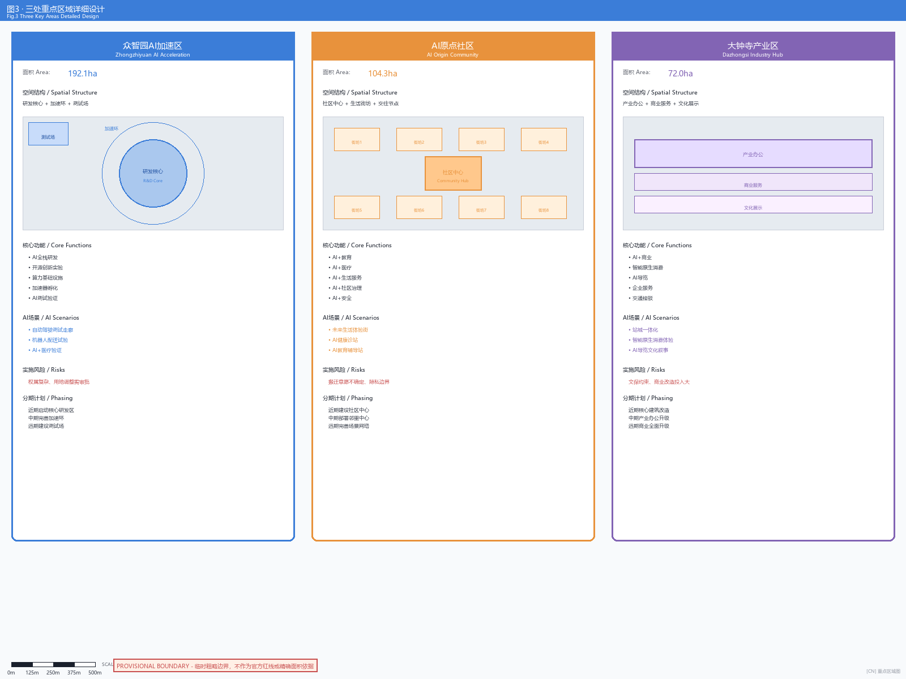
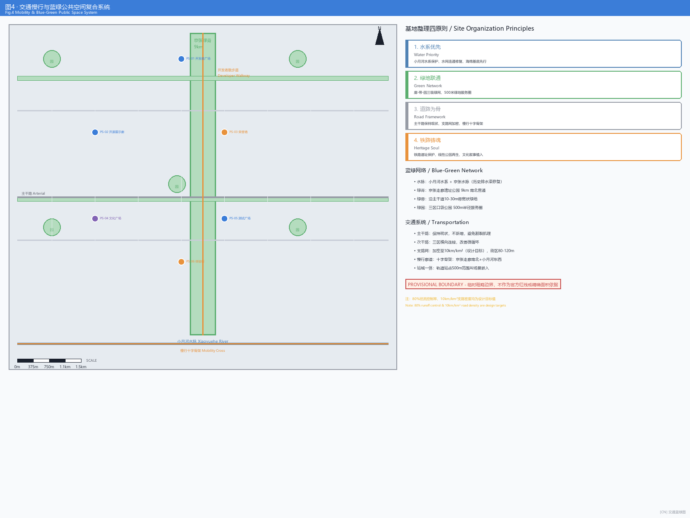
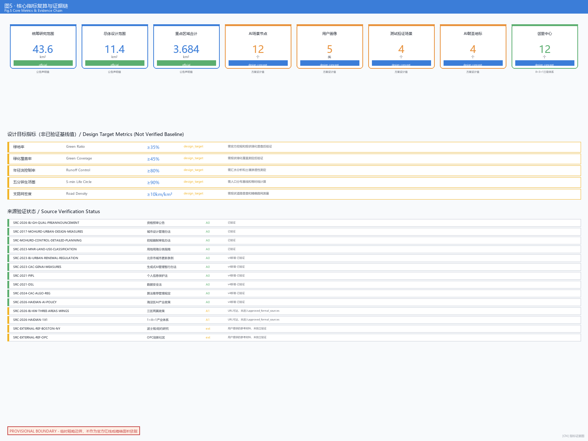

# AI生态创新廊 · 智汇百年京张

## 执行摘要

本方案以京张铁路遗址走廊为创新主轴，串联智谷（众智园AI加速区，192.1公顷）、源社区（AI原点社区，104.3公顷）和钟界（大钟寺AI产业区，72.0公顷）三核，在43.6平方公里的统筹研究范围内构建集AI全栈研发、场景赋能、公共空间、文化叙事和长期运营于一体的世界级AI生态创新廊。

**核心概念——"创新圈"**：院校是创新源，走廊连接创新源，三核是创新集聚节点，三环（蓝绿慢行环+创新联络环+AI服务环）构成创新循环圈，AI场景是智能感知终端。这一概念不是装饰性命名，而是空间组织的逻辑——创新资源从院校出发、沿走廊流动、在节点汇聚、经两翼辐射、由创新圈连为整体。

**方案核心要点**：

- **三层范围框架**：统筹研究范围（43.6km²）→ 总体设计范围（11.4km²）→ 重点区域范围（3.684km²），与公告规定的三层范围严格对应
- **空间结构"一廊三核两翼三环"**：一廊（京张遗址公园创新主轴11.4公里）→ 三核（智谷·源社区·钟界创新集聚节点）→ 两翼（东翼催化+西翼体验创新辐射网络）→ 三环（蓝绿慢行环+创新联络环+AI服务环构成创新循环圈）
- **城市更新"留改拆新"四类分级**：保留高校科研区和文保遗存、改造低效产业和铁路退线空间、拆除危房补公共空间、新建AI创新综合体和分布式算力中心。区域内密集分布清华、北航、北科、北邮、北交大等高校，是创新圈的核心创新源
- **18项更新项目实施矩阵**：含前置条件、权属审批依赖、成本量级、阶段闸门和停止条件，依据《北京市城市更新条例》（2023.3.1施行）构建实施路径
- **12个AI场景节点**：含AI交通步行、AI医疗、机器人配送、AI导览、企业服务、公共安全等，依据《生成式人工智能服务管理暂行办法》（2023.8.15施行）建立合规审查清单
- **5类弱势群体保障**：残障人士、儿童照护者、低收入租户、非数字用户、现有小商户，含居民参与、影响评估、申诉救济和反排斥机制
- **法律政策依据**：城市更新合规依据4部、AI服务合规依据5部、数据安全合规依据4部，海淀区AI产业政策5项（每年10亿+资金支持、200亿基金矩阵）

**重要声明**：本方案所有空间落地建议均为概念建议，不替代正式规划。所有面积、指标基于临时粗略边界复算，在官方精确边界补齐后需重新校核。所有法律条款引用均为公开文本，建议实施主体在正式推进时由法律顾问进行专项合规审查。

---

## 设计依据与资料清单

本方案以北京市规划和自然资源委员会海淀分局发布的《百年京张AI创新带城市设计国际方案征集资格预审公告》为主控依据 [source:SRC-2026-BJ-GH-QUAL-PREANNOUNCEMENT]，以面向全球智能体的任务书摘录为智能体任务覆盖依据 [source:AGENT-TASKBOOK]，以海淀区"1+X+1"现代化产业体系布局为产业定位背景 [source:SRC-2026-HAIDIAN-1X1]，以北京市科委"三区两翼"政策为空间协同框架 [source:SRC-2026-BJ-KW-THREE-AREAS-WINGS]。

在数据层面，本方案使用仓库提供的临时粗略边界（provisional boundaries）进行空间生成和展示 [data:geometry/site_boundary.geojson#PROV-SITE-001]。该边界依据公告文字四至和约11.4平方公里面积约束推导形成，属于临时粗略替代，不得作为官方红线、审批依据或精确面积复算依据 [source:SRC-PROVISIONAL-BOUNDARIES-2026]。当官方精确边界数据可用时，所有受影响的图层和指标需要重新计算。

在标准层面，本方案遵循《城市设计管理办法》[standard:MOHURD-URBAN-DESIGN-MEASURES]、《城市、镇控制性详细规划编制审批办法》[standard:MOHURD-CONTROL-DETAILED-PLANNING]和《国土空间调查、规划、用途管制用地用海分类指南》[standard:MNR-LAND-USE-CLASSIFICATION-GUIDE] 的专业要求。同时遵循面向智能体任务书的十条共创原则和统一边界条款 [standard:PROJECT-AGENT-OPEN-CALL-TASKBOOK]。

**重要声明**：本方案所有空间落地建议均为概念建议、参考方案或可供专业团队深化研究的材料，不替代正式规划，不构成政府审定结论，不包含容积率、建筑高度、具体拆改留、道路红线或工程实施结论。所有面积、指标均基于临时粗略边界复算，在官方精确边界数据补齐后需要重新校核。

## 三层范围工作框架

本方案在三个空间层级上展开工作，与公告规定的三层范围严格对应 [source:SITE-PACKAGE]。

**统筹研究范围（43.6平方公里）**：北至北五环路，东至京藏高速，南至西直门外大街，西至万泉河路 [data:geometry/site_boundary.geojson#PROV-RESEARCH-001]。在此范围内开展世界级AI生态创新体系研究、产业链协同分析、三核两翼区域协同研究和未来AI城市形态研究。工作深度为战略研究和产业统筹。

**总体设计范围（11.4平方公里）**：以京张遗址公园周边1-2公里的城市地区和产业区为规划设计范围 [data:geometry/site_boundary.geojson#PROV-SITE-001]。在此范围内开展控制性详细规划深度的城市设计，包括功能布局、用地结构、城市更新框架、交通组织、市政配套、公共空间体系和城市风貌控制。工作深度为控规城市设计。

**重点区域范围（3.684平方公里）**：自北向南包括众智园AI自主创新加速区（192.1公顷）[data:geometry/key_areas.geojson#PROV-KEY-001]、北京AI原点社区（104.3公顷）[data:geometry/key_areas.geojson#PROV-KEY-002]和大钟寺AI产业聚集区（72.0公顷）[data:geometry/key_areas.geojson#PROV-KEY-003]。在此范围内开展规划综合实施方案深度的详细城市设计 [depth:key_area_detail]。

关于临时边界的使用限制：由于官方精确边界尚未在公开渠道获取，本方案使用仓库维护者提供的临时粗略边界进行空间生成 [source:SRC-PROVISIONAL-BOUNDARIES-2026]。该边界为依据公告文字四至和面积约束推导的矩形折线，精度为"provisional_rough"。在官方精确边界补齐后，以下内容需要重新计算：土地利用多边形面积、建筑规模指标、绿地与公共空间比例、重点区域面积复算以及所有依赖空间边界的定量指标 [metric:overall_design_area_sqm]。

## 基地现状分析

在前章确立了三层范围工作框架后，本章进一步对基地现状进行系统分析，建立"现状—目标—差距"的逻辑链，为后续设计策略提供数据支撑和问题导向。

### 现状用地结构

基地现状用地以居住用地、工业用地和交通设施用地为主，公共绿地和广场用地比例偏低。统筹研究范围（43.6km²）内，城市建设用地占比约68%，其中居住用地约占35%、工业及仓储用地约占22%、交通设施用地约占11%；非建设用地（水域、农田、林地等）约占32%。总体设计范围（11.4km²）内，京张铁路遗址沿线分布大量闲置工业用地和低效利用仓储用地，为城市更新提供了较大的存量空间。

| 用地类型 | 现状占比（估算） | 设计目标占比 | 差距分析 |
|----------|-----------------|-------------|----------|
| 居住用地 | ~35% | ~30% | 适度控制规模，提升品质 |
| 工业/仓储用地 | ~22% | ~10% | 大幅压减，转型为研发/混合功能 |
| 交通设施用地 | ~11% | ~8% | 优化结构，释放公共空间 |
| 公共绿地与广场 | ~5% | ≥12% | 大幅提升，补齐短板 |
| 商业服务业用地 | ~8% | ~12% | 适度增加，服务创新人群 |
| 其他用地 | ~19% | ~8% | 优化利用 |

> 注：以上现状数据基于公开资料估算，非官方普查数据。在官方精确边界和现状普查数据补齐后需重新校核。

### 现状交通基础设施分析

基地现状交通以机动车为主导，慢行系统不连续、公交覆盖不足。京张铁路遗址割裂了东西向交通联系，北侧北五环路和南侧西直门外大街为主要南北通道，但内部路网密度偏低，支路缺失严重。现状支路密度约6km/km²，远低于设计目标值≥10km/km²。轨道站点（13号线大钟寺站、4号线/16号线国家图书馆站等）周边500米范围的城市设计深度不足，站城一体化程度较低。

### 现状公共服务设施覆盖分析

基地现状公共服务设施以传统社区服务为主，面向AI创新人才的国际化、智能化服务严重不足。教育设施以中小学为主，缺少面向终身学习和科创教育的设施；医疗设施以社区卫生服务中心为主，缺少面向AI+智慧医疗的示范站点；商业设施以传统底商为主，缺少面向年轻科创人群的复合型商业空间。公共空间方面，京张铁路沿线缺乏系统性公共空间，小月河滨水空间未充分开放，绿地服务半径覆盖率偏低。

### 现状问题诊断

基于以上分析，本方案识别出基地面临的五大核心问题，并对应提出设计策略：

| 序号 | 核心问题 | 问题描述 | 对应设计策略 |
|------|----------|----------|-------------|
| 1 | 铁路遗址割裂城市 | 京张铁路遗址物理隔离东西城区，慢行不连续 | 铁路遗址改造为线性公园，缝合东西肌理 |
| 2 | 公共空间严重不足 | 绿地率约18%，远低于宜居标准 | 绿地率提升至≥35%，构建蓝绿网络 |
| 3 | 路网密度偏低 | 支路密度约6km/km²，街区尺度过大 | 支路网加密至≥10km/km²，小街区开放 |
| 4 | 公共服务不匹配 | 设施以传统为主，缺少AI人才服务 | 构建邻里中心三级体系+AI赋能服务 |
| 5 | 产业空间低效 | 大量闲置工业/仓储用地 | 转型为AI研发、孵化和混合功能 |

## 设计原则

本方案提出五条总纲性设计原则，统领全部空间设计决策。各章节中的具体设计策略均从以下原则推导而来，后文不再重复阐述原则本身，仅在必要时引用对应原则编号。

**原则一：生态优先、水系先行**

生态本底是城市设计的底线和基底。基地整理必须以水系保护和修复为第一优先级，海绵设施在所有建设前先行部署。蓝绿空间不是点缀而是基础设施，绿地率设计目标不低于35%，绿化覆盖率不低于45%，年径流总量控制率不低于80%。水系优先意味着：先定生态底线，再排功能布局；先织绿网，再建建筑。

**原则二：开放渗透、街区织补**

反对传统封闭式科技园区模式，三核全部设计为开放创新街区。支路网密度不低于10km/km²，街区尺度控制在80-120米，确保任意一点至公共交通站点步行不超过5分钟。建筑底层保持透明开放，创新活动成为街道景观的一部分。开放不是无管理，而是以景观小品和建筑退界替代围墙门禁，以功能混合替代功能隔离。

**原则三：文化铸魂、记忆延续**

京张铁路是基地最具辨识度的文化资产，也是"创新圈"概念的历史基因。铁路遗址优先保护、适应性再利用，将铁轨、枕木、道岔等元素转译为城市家具和铺装纹样。文化叙事不是博物馆式的静态展示，而是融入日常生活的可感知体验——开发者散步道、开源成果展示廊、智能体贡献荣誉墙都是文化叙事的载体。从1909年詹天佑自主设计京张铁路，到2026年AI创新带的智汇新生，走廊承载的是中国人自主创新的百年基因。

**原则四：场景驱动、智能原生**

AI不是附加功能而是城市基础设施。每个邻里中心嵌入AI+社区服务场景，12个AI场景节点覆盖交通、医疗、教育、商业、安全等全生活维度。AI服务须提供非数字替代渠道，确保非数字用户、残障人士和老年人可平等获得服务。智能原生意味着：城市从规划阶段即考虑AI数据的采集、处理和应用，而非事后加装。

**原则五：分期实施、弹性适应**

更新项目分期推进，近期（2026-2028）以公共空间和AI场景试点为先导"筑基"，中期（2028-2030）以研发-社区-产业创新链为主线"成链"，远期（2030-2035）以AI生态创新和国际影响力为目标"生态化"。建筑采用大跨度无柱空间和可移动隔断，白天作为社区服务设施，晚间和周末可转换为创客市集、文化展演等用途，空间利用率从传统社区中心的40%提升至80%以上。

> 声明：以上设计原则为概念框架，需在官方控规条件和详细设计阶段由专业团队深化确认。

## 统筹研究范围产业与未来城市研究

在确立设计原则后，本章在统筹研究范围（43.6km²）层面展开产业与未来城市研究，提出一带总体概念和全球案例借鉴。

**核心概念："创新圈"（Innovation Circle）**

本方案提炼"创新圈"作为统领全局的设计概念词。核心逻辑是——院校是创新源，走廊连接创新源，三核是创新集聚节点，三环构成创新循环圈，AI场景是智能感知终端：

- **院校是创新源**：京张走廊周边密集分布清华大学、北京航空航天大学、北京科技大学、北京邮电大学、北京交通大学、北京理工大学、北京大学、中国科学院等顶尖院校和科研机构，构成中国最密集的高校创新资源带。这些院校是创新圈的"源头活水"——基础研究产出、人才输送、技术转移和创业孵化均始于此。走廊的首要功能是连接院校创新源与产业转化空间，使创新成果就地转化而非远距离扩散。
- **走廊连接创新源**：京张遗址公园创新主轴南北贯穿11.4公里，是文化叙事、公共空间和慢行交通的复合载体，也是连接院校创新源与三核的空间主轴。走廊沿线布局AI场景节点、开源展示廊、开发者散步道和智能体贡献荣誉墙，使创新资源沿走廊流动、汇聚。
- **三处重点区是三个创新集聚节点**：智谷（众智园）、源社区（AI原点）、钟界（大钟寺），分别承担研发加速、场景验证和产业聚集。三核不是封闭园区，而是开放创新街区——院校研发成果进入智谷加速，在源社区验证场景，在钟界实现产业转化，形成"研发-验证-转化"的创新集聚链条。
- **两翼是创新辐射网络**：东翼催化（中关村科技服务走廊）向东扩展创新要素服务，连接中关村科技金融和知识产权服务；西翼体验（小月河场景赋能带）向西展开AI场景试验和城市活力注入，连接社区生活场景。两翼形成双向创新辐射网络，将三核的创新能量辐射至周边区域。
- **三环构成创新循环圈**：蓝绿慢行环串联遗址公园、清河和小月河，是生态基底和慢行骨架；创新联络环由三条垂直于主轴的联络道组成，将走廊与两翼横向连通；AI服务环由分布式AI服务节点网络构成，覆盖全走廊的智能感知与响应。三环使院校、走廊、节点和两翼形成完整的创新循环回路。
- **AI场景是智能感知终端**：12个AI场景节点感知城市运行数据、响应居民需求、反馈创新信号，使整个系统具备感知-决策-响应的智能闭环。

"创新圈"的逻辑是：院校产出创新资源→沿走廊流动→在节点汇聚→经两翼辐射→由三环连为整体→AI场景感知反馈→回流至创新源，形成自组织的创新生态系统。英文简称"AIEC"发音接近"AI-Eco"，中英双语均具有辨识度和传播力。

**视觉识别与Logo方向**：Logo以京张铁路轨道的平行线为骨架，融入创新网络节点拓扑结构，形成"轨道即创新链"的视觉概念。主色为科技蓝（#3B7DD8）象征AI创新、铁路橙（#E8923C）呼应京张历史、生态绿（#5BAE6F）代表可持续发展。该方向为概念建议，实际Logo设计需由专业视觉设计团队深化并完成字体和图像清权。

**视觉识别系统（VI）框架**：

| VI要素 | 设计方向 | 应用场景 | 状态 |
|--------|----------|----------|------|
| 主Logo | 轨道平行线+创新节点拓扑 | 封面、标识牌、官方网站 | 概念方向 |
| 副Logo（场景版） | 主Logo+场景图标变体 | 12个AI场景卡、场景节点标识 | 概念方向 |
| 色彩系统 | 科技蓝#3B7DD8+铁路橙#E8923C+生态绿#5BAE6F | 全部视觉物料 | 概念方向 |
| 字体规范 | 中文：系统黑体类；英文：无衬线体 | 文档、标识、数字界面 | 待专业设计确认 |
| 导视系统 | 铁路元素转译（铁轨纹样、枕木铺装、信号灯色码） | 走廊沿线导视、邻里中心标识 | 概念方向 |
| 活动品牌 | 京张AI创新大会、开源贡献者周、AI场景马拉松、文化科技节 | 年度活动视觉 | 概念方向 |
| 荣誉体系 | 智能体贡献荣誉墙视觉模板、贡献者徽章设计 | 荣誉展示、社区激励 | 概念方向 |

**活动品牌系统**：为四个年度活动设计统一品牌视觉——京张AI创新大会（秋季，主色科技蓝）、开源贡献者周（春季，主色生态绿）、AI场景马拉松（季度，主色铁路橙）、京张文化科技节（夏季，三色融合）。每个活动品牌包含主视觉、海报模板、数字传播素材和现场导视模板。

**国际传播视觉策略**：所有VI要素设计时同步考虑中英双语适配，确保国际传播场景下的视觉一致性。英文简称"AIEC"作为国际传播主标识，发音接近"AI-Eco"，便于国际记忆和传播。

**VI系统声明**：以上视觉识别系统为概念框架，需由专业视觉设计团队完成正式设计、字体清权和图像版权确认后方可实施。

**概念推导：从"创新圈"到空间结构**

核心概念"创新圈"直接推导"一廊三核两翼三环"的空间结构：
- **廊** → 京张铁路遗址走廊为创新主轴，南北贯穿11.4公里，连接院校创新源，是文化叙事、公共空间和慢行交通的复合载体
- **核** → 智谷、源社区、钟界三个创新集聚节点，分别承担研发加速、场景验证和产业聚集
- **翼** → 东翼催化（中关村科技服务走廊）和西翼体验（小月河场景赋能带），创新辐射网络
- **环** → 蓝绿慢行环（遗址公园+清河+小月河）、创新联络环（三条垂直于主轴的联络道）和AI服务环（分布式AI服务节点网络），构成创新循环圈

**三大定位协同**：百年京张文化带定位通过铁路遗址保护、詹天佑创新精神传承和文化叙事体系落实；都市AI生活体验带定位通过AI+场景卡、公共空间体验路径和未来生活街区落实；AI融合创新带定位通过全栈研发、产业加速和生态服务体系落实 [source:AGENT-TASKBOOK]。

**五大功能映射**：AI全栈自主创新体系以智谷为核心承载；世界级AI生态创新以三核联动为骨架；AI+场景赋能新范式以西翼体验为试验田；智能化AI活力城市以公共空间网络和智能原生新业态为表达；AI治理全球话语权以开源共治机制和智能体贡献荣誉体系为载体。

**三核两翼创新回路**：三核（智谷、源社区、钟界）沿京张走廊南北串联，形成"研发-社区-产业"的创新链路 [data:geometry/key_areas.geojson]。两翼中，东翼催化向中关村方向延伸提供资本、IP和要素配置服务，西翼体验向小月河方向展开提供AI场景试验和城市活力注入。创新回路的关键是：智谷产出技术→源社区提供人才和生活场景→钟界实现产业转化→东翼提供资本和IP服务→西翼提供场景验证→回流智谷形成闭环。同时，清华、北航、北科、北邮、北交大等院校持续向回路注入创新源——基础研究成果、技术人才、创业团队和专利技术从院校出发，经走廊流入三核加速转化，形成"院校→走廊→三核→两翼→回流院校"的完整创新圈。

### 区域协同：从三核两翼到京津冀创新网络

本方案的区域协同不局限于三核两翼内部，而是将京张AI创新带置于更广阔的区域创新网络中统筹考虑 [source:AGENT-TASKBOOK]。以下协同安排均为概念建议，需在正式合作基础、交通联系论证和产业互补分析后由专业团队深化。

**与北纬社区协同**：北纬社区位于创新带北部延伸方向，建议在智谷与北纬社区之间建立"研发-孵化"联动机制——智谷侧重基础研究和技术原型，北纬社区提供成果转化和产业落地空间。建议研究轨道交通连通优化方案，缩短两区通勤时间。此为概念建议，具体合作需双方协商确认。

**与未来科学城协同**：未来科学城是北京北部重要科创节点，建议建立"双城联动"机制——京张AI创新带聚焦AI应用研究和场景验证，未来科学城聚焦基础科学和前沿技术。两区可通过东翼催化实现资本、人才和技术成果的流通。建议研究共建联合实验室和技术转移通道。此为概念建议，需交通、产业和政策可行性论证。

**与怀柔科学城协同**：怀柔科学城是国家综合性科学中心，建议建立"基础研究-应用转化"分工——怀柔科学城侧重大科学装置和基础研究，京张AI创新带侧重AI技术转化和场景应用。建议研究数据共享和算力协同方案，使怀柔的科研数据可在京张进行AI处理和验证。此为概念建议，需数据安全和跨区协作机制论证。

**与经开区协同**：北京经济技术开发区是高端制造业基地，建议建立"AI研发-智能制造"产业链协同——京张AI创新带产出AI算法和解决方案，经开区提供制造和应用场景。建议研究AI+智能制造联合创新中心和产业对接机制。此为概念建议，需产业互补性和合作模式论证。

**京津冀协同**：在京津冀协同发展框架下，建议京张AI创新带发挥"AI创新策源地"作用，向天津和河北输出AI技术和应用方案。具体包括：与天津滨海新区共建AI产业转化基地，与河北雄安新区共建AI城市治理试验场，与石家庄共建AI+制造业应用中心。建议研究京津冀AI创新走廊的跨区域协同机制。所有京津冀协同安排均为概念建议，无正式合作基础、交通联系论证和产业互补数据支持，需在正式合作框架建立后深化。

**协同保障声明**：以上区域协同内容均为概念建议或深化方向，不表述为已确定的政府安排或机构承诺。所有合作、招商、资金和机构安排需在正式合作协议、交通可行性研究和产业互补分析完成后方可推进 [source:AGENT-TASKBOOK]。

### 全球AI生态创新案例研究

以下是6个全球AI生态创新案例，为创新带的空间和运营机制设计提供参照 [source:AGENT-TASKBOOK]：

| 案例 | 位置 | 核心经验 | 空间转化启示 |
|------|------|----------|-------------|
| 谷歌山景城园区 | 美国加州 | 开放式园区与城市融合，AI研发与公共空间无界衔接 | 智谷应打破围墙，与京张遗址公园无缝衔接 |
| 新加坡One-North | 新加坡 | 科技园区与居住、商业、文化混合布局，TOD导向 | 源社区应采用混合功能，以轨道站点为核心组织 |
| 伦敦King's Cross | 英国伦敦 | 铁路遗址再生为创新街区，历史建筑与新建AI办公共生 | 钟界应保留铁路工业遗存，与AI新业态叠合 |
| 深圳南山科技园 | 中国深圳 | 产业链上下游集聚，从研发到产业化的完整链条 | 三核应形成从基础研究到产业转化的南北链条 |
| 东京涩谷Stream | 日本东京 | 轨道枢纽站城一体化，AI场景嵌入日常生活 | 轨道站点周边应布局AI生活场景体验功能 |
| 巴黎Station F | 法国巴黎 | 旧火车站改造为全球最大创业园区，开放创新平台 | 京张铁路遗址建筑可改造为AI加速器和开放实验室 |

这些案例的共同启示是：成功的AI生态创新不是孤立的科技园区，而是与城市深度嵌入、历史文脉延续、公共空间开放、产业链完整的城市区域。AI生态创新廊的空间设计应遵循这一逻辑。

### 国际科学城案例研究与启示——以太湖科学城为参照

本节基于《太湖科学城战略规划与概念性城市设计》中关于国际一流科学城内涵及发展演变规律的研究，聚焦其国内外科学城案例研究部分，提炼对京张AI创新带的战略启示 [source:EXTERNAL-REF-TAIHU-SCIENCE-CITY]。

**国际科学城案例概览**

太湖科学城战略规划系统梳理了全球10个代表性科学城/科创中心案例，涵盖北美、欧洲、东亚三大板块，其核心经验可归纳如下：

| 科学城/科创中心 | 所在区域 | 核心特征 | 关键经验 |
|-----------------|----------|----------|----------|
| 硅谷（旧金山湾区） | 美国 | 城市集群增长模式转变驱动；新兴产业集聚与产业园组团布局；创新生态系统协作 | 依托斯坦福、加州大学等高校建立研究园，引入SLAC国家加速器等大科学装置，加快引入AI、网络社交等新兴业态 |
| 纽约科创中心 | 美国 | 汇聚优质创新经济要素；营造城市创新生态环境 | 实施"NYC Talent Draft"人才引进草案，提升综合创新服务环境，加大对科技企业的资金支持 |
| 波士顿都市区 | 美国 | 建立世界级创新集群；形成优势产业集群；高校与医院集群发展+绿地网络渗透进城 | 以健康服务产业为支柱，拥有全美最丰沛的生物技术创投资金，政府大力投资生物技术基建 |
| 剑桥市大学城（麻省） | 美国 | 开放校园；生态社区；网络布局 | 构建创意和中小型科技企业孵化基地，大学与城市空间高度融合 |
| 剑桥科学园与牛津哈维尔科创园 | 英国 | 创建基于社区的创新生态系统；设立大科学装置；强化产学研联动 | 依托基础研究成立创新联合体，融合基础研究、产业转化、生产制造等链条环节，带动本地产业集群发展 |
| 大德科学城 | 韩国 | 后期积极引入市场机制调节；政府主导建设研究教育机构和中介机构网络 | 设立高能物理国家实验室，构建大科学装置群；健全创新机制提升产业发展活力 |
| 慕尼黑科技工业城 | 德国 | 产业发展均衡，高科技制造业占比突出；学研产全链条；政策扶持 | 制造业与创新研发并重，政府政策扶持贯穿全链条 |
| 筑波科学城 | 日本 | 主导产业突出（信息通信业）；以创新和研发为主；多途径支持企业创业发展 | 引入高等学校，大力发展孵化器和风险投资，活跃的非政府组织参与 |
| 索非亚科技园 | 法国 | 主导产业突出；以创新和研发为主；多种途径支持企业创业 | 引入高等学校，发展企业孵化器和风险投资，非政府组织活跃参与 |
| 纬壹科技城 | 新加坡 | 以生物医药、信息通信、传媒产业为核心的综合型现代服务区 | 坚持"产城一体""产城融合"规划理念 |

**九条演变规律与对京张AI创新带的启示**

太湖科学城研究从上述国际案例中提炼出九条科学城发展演变规律，本方案将其逐条映射至京张AI创新带的战略定位：

1. **强化创新要素集聚**：国际案例普遍以高校、科研机构、资本和人才为核心驱动要素。京张走廊紧邻清华、北航、北科、北邮、北交大等高校及中关村创新资源，应将创新主轴打造为要素汇聚的创新集聚节点——三核即要素集聚的核心锚点，而非分散布局
2. **适时引入大科学装置**：硅谷引入SLAC国家加速器、大德设立高能物理实验室、剑桥哈维尔设立大科学装置，均以大科学装置提升科研能级。京张AI创新带应适时引入国家级AI算力中心和大模型评测平台等"AI时代的大科学装置"，提升创新能级
3. **创新链全链功能集聚**：慕尼黑的"学研产全链条"、筑波的"创新与研发并重"表明全链功能集聚是科学城成熟标志。京张创新圈应沿走廊布局"基础研究→应用研发→场景验证→产业转化"全链条功能段，在11.4km主轴上形成功能递进
4. **强化产学研发展联动**：剑桥科学园依托基础研究成立创新联合体、波士顿高校与医院集群联动，产学研联动是创新生态的核心机制。京张应建立"高校研发→走廊加速→社区验证→产业转化"的就地转化链条，产学研联动沿走廊流动。清华、北航、北科、北邮、北交大等院校是这一链条的源头创新源
5. **构建优势产业集群**：波士顿以健康服务产业为支柱、筑波以信息通信为主导，优势产业集群是科学城的产业标志。京张应以AI应用产业为核心优势集群，沿两翼分别布局"东翼催化"（AI+硬科技）和"西翼体验"（AI+消费服务）差异化集群
6. **完善创意孵化功能**：剑桥市大学城的创意和中小型科技企业孵化基地、筑波的孵化器和风险投资，孵化功能是创新生态的毛细网络。京张"两翼"即供血与回流的毛细网络，应布设分布式孵化器和创投资金网络
7. **构建区域创新集群**：德国慕尼黑依托轨道交通强化与周边重点功能协同、英国剑桥哈维尔依托轨道交通形成区域创新集群。京张应依托地铁13号线、京张高铁遗址绿廊等交通走廊，与中关村、五道口、上地区域形成区域创新集群，使院校创新源在更大范围内辐射联动
8. **完善创新生态协作系统**：纽约营造优质城市创新生态环境、波士顿多元化筹资渠道，完善的协作系统是创新可持续的保障。京张应构建"AI服务环"作为循环系统，提供算力、数据、合规、安全等AI基础设施服务，保障创新生态持续运转
9. **坚持产城融合发展**：新加坡纬壹科技城"产城一体"理念、剑桥市"开放校园+生态社区"模式，产城融合是科学城演变的终极趋势。京张创新圈从一开始即以开放创新街区为模式，以"留改拆新"实现城市更新与AI产业共生，顺应这一演变规律

### 波士顿与纽约科创生态对比研究

本节基于《科创生态能否后来居上？——以波士顿和纽约为例》研究，提炼对京张AI创新带的核心启示 [source:EXTERNAL-REF-BOSTON-NY]。

**波士顿的教训——"要素优先妄想症"**

波士顿拥有哈佛、MIT等顶级学府、近300名诺奖得主、深厚的产业历史底蕴，堪称"要素禀赋最优"。然而2025年纽约风投总额近250亿美元（全球第二），波士顿仅约60亿美元（不足纽约四分之一）；2026年全球独角兽数量纽约141家（第2），波士顿仅20家（第13）。波士顿的衰退源于三大制度与文化障碍：

1. **制度性障碍**：马萨诸塞州拒绝QSBS豁免、征收4%富人附加税、对SaaS征收6.25%销售税，形成对科创者的"惩罚性"压力。
2. **"海盗文化"**：投资人利用信息不对称压迫科创者，LP之间封闭勾结，形成零和博弈的利益集团。
3. **"怨恨文化"（Ressentiment）**：社会对创新成功者持有敌意，缺乏包容失败的氛围。

**纽约的逆袭——科创生态"五件套"**

纽约从2004年的"科创荒漠"逆袭为全球第二大科创中心，核心策略是"五件套"：

| 策略 | 具体措施 | 对京张的启示 |
|------|----------|-------------|
| ①应用科学计划 | 建设康奈尔创新研究院、亚历山大中心等新型大学园 | 智谷应引入顶级AI研究机构，补齐应用研究短板 |
| ②生活品质之城 | 咖啡馆、书店、博物馆、公共空间密集布局，形成"生活即创新"生态 | 源社区应打造15分钟生活圈，让年轻人"来了不想走" |
| ③众创空间计划 | 孵化器（AUDUBON、BXL）、联合办公（WeWork、Chashama）、创客空间 | 廊道沿线应布局多层次孵化空间，降低创业门槛 |
| ④融资激励计划 | 电费优惠30-35%、商业扩张减租、新兴科技企业减税30万/年 | 建议争取AI企业专项税收和成本减免政策 |
| ⑤设施更新计划 | 免费公共WiFi、数字纽约平台、20万套混合型公寓、移民社区改造 | 基地整理时应优先更新基础设施，营造包容性社区 |

截至2025年末，纽约硅巷已有8000+初创公司、36万高科技从业者、125家独角兽，总市值超1000亿美元。

**核心结论**：

- **警惕"要素优先妄想症"**：不能仅凭拼大学、拼实验室、买算力等硬要素投入，更需培育健康的科创生态体系。硬件只是基础，真正的核心在于生态——"没有土壤，种子无法发芽"。
- **软环境是创新的空气和水**：低摩擦营商环境、信任契约精神、包容失败与崇拜科创者的社会文化，三者缺一不可。
- **草根力量是创新源泉**：不仅要盯大项目，更要激发多元的、草根的创新力量，让它们长成"参天大树"。
- **移民是创新超级引擎**：居住满10年的被同化移民获得专利概率是本土居民的3倍，多元化是颠覆性创新的土壤。

### 南岸新地OPC创新社区模式借鉴

本节参考苏州南岸新地OPC创新社区实践，为京张AI创新带的社区级科创生态构建提供参照 [source:EXTERNAL-REF-OPC]。

**OPC（One Person Company）核心理念**："单人成军·AI赋能·全球出海·产业深耕"——以"超级个体+AI"模式为核心，构建支持一人公司落地的良性生态系统。

**OPC五大生态模块与14类服务要素**：

| 模块 | 服务要素 | 对京张的转化建议 |
|------|----------|-----------------|
| ①基础承载 | 轻创零门槛（轻启动空间）、下楼款创业（安居续航） | AI原点社区设OPC轻创空间，人才公寓下楼即可创业 |
| ②政务专业保障 | 政策一站通、数科合规通、企服全托管 | 设立AI创新带政务直通窗口，提供一站式合规服务 |
| ③能力成长与实战 | 续航充电站（创业成长）、实战练真功（产业课堂） | 廊道沿线设开发者成长站，定期举办产业实战课堂 |
| ④技术赋能 | 工具赋战力、算力普惠享、大模全链路 | 端侧算力节点向OPC创业者开放，降低AI开发门槛 |
| ⑤市场转化与资源链接 | 出海全集成、资本精准链、直播轻创业、市场试炼场 | 设AI场景市场体验空间，连接中关村资本与全球市场 |

**OPC五分钟生活圈**：南岸新地配套人才公寓、商业、运动及休闲公园，形成"工作-生活-社交"五分钟闭环。这一模式与京张AI原点社区的邻里中心体系高度契合——每个社区邻里中心即是一个OPC生态节点，创业者下楼即创业、五分钟即生活。

**对京张的核心启示**：京张AI创新带应在每个邻里中心嵌入OPC生态模块，构建"超级个体+AI+社区"的微观创新单元。让创新不是少数大企业的特权，而是每个社区、每个人都能参与的日常。

## 科创生态体系构建策略

基于波士顿/纽约案例研究和OPC创新社区模式，本方案提出京张AI创新带科创生态体系构建的"四大支柱" [source:AGENT-TASKBOOK]：

### 支柱一：超越"要素优先"——从硬投入到软生态

波士顿的教训表明，仅拥有顶级大学、实验室和算力并不足以赢得科创竞争。京张AI创新带的建设必须避免"要素优先妄想症"，在布局研发空间和算力设施的同时，同步甚至优先培育以下软环境：

- **低摩擦营商环境**：简化审批流程，减少行政干预，建立AI企业"一站式"服务通道
- **信任契约精神**：建立开源共治机制，以代码和契约替代人情和关系，降低交易成本
- **包容失败的文化**：设立"试错基金"和"失败者致敬墙"，让失败成为创新文化的一部分
- **崇拜科创者的社会氛围**：通过智能体贡献荣誉墙、京张AI里程碑等朝圣地标，营造对创新者的社会尊崇

### 支柱二：纽约"五件套"本地化——京张科创生态五工具

将纽约提升科创生态的"五件套"策略本地化为京张"五工具"：

| 工具 | 纽约原型 | 京张本地化方案 |
|------|----------|---------------|
| 应用科学引擎 | 康奈尔创新研究院 | 众智园引入清华、北大AI研究院，建设应用引发的基础研究枢纽（巴斯德象限） |
| 生活品质之城 | 硅巷咖啡馆/书店/博物馆 | 沿京张走廊布局开发者咖啡馆、AI书店、开源博物馆，形成"生活即创新"生态闭环 |
| 众创空间网络 | WeWork/孵化器/创客空间 | 廊道沿线每500米设一个众创节点，含共享工位、灵活路演空间和OPC轻创空间 |
| 融资激励工具 | 电费优惠/减税/退税 | 建议争取AI企业专项税收减免、算力成本补贴和场景验证基金 |
| 包容性社区更新 | 混合型公寓/移民社区改造 | AI原点社区建设混合收入人才公寓，更新老旧社区为AI+生活场景示范区 |

### 支柱三：OPC生态嵌入——超级个体的创新基础设施

参照南岸新地OPC模式，在每个邻里中心嵌入"一人公司"生态模块：

- **空间层面**：人才公寓底层设OPC轻创空间，实现"下楼即创业"
- **服务层面**：政务直通、合规托管、企服代办一站式接入
- **技术层面**：端侧算力节点向OPC开发者普惠开放，提供模型部署工坊
- **市场层面**：设AI场景市场体验空间，连接中关村资本与全球出海渠道
- **成长层面**：定期举办产业实战课堂和创业成长站，覆盖创业者全生命周期

### 支柱四：草根创新与多元人才——让创新从土壤中生长

纽约硅巷8000+初创公司和36万从业者的生态规模证明，草根力量是创新的真正源泉。京张AI创新带应：

- **激发多元草根创新**：不设门槛的众创空间、开源社区和场景沙盒，让任何人都能参与创新
- **吸纳全球人才**：建立国际人才绿色通道，提供国际化社区服务，参照纽约"移民是创新超级引擎"的经验
- **培育跨界思维**：通过文化+科技、艺术+AI的跨界活动，激发颠覆性创新的"化学反应"
- **建设15分钟科创生活圈**：融合生活、文化、科创的便利圈，让年轻人愿意来、留得住、能成家创业

## 总体设计范围城市更新与控规深度城市设计

### 空间结构："一廊三核两翼三环"

本方案提出"一廊三核两翼三环"的总体空间结构 [depth:spatial_structure]。该结构在 `geometry/land_use.geojson` 中以用地分区体现，在 `geometry/roads.geojson` 中以道路网络体现，在 `geometry/green_space.geojson` 和 `geometry/public_space.geojson` 中以蓝绿和公共空间体现。

**一廊**：京张遗址公园创新主轴，南北贯穿11.4公里，串联三核，是文化叙事、公共空间和慢行交通的复合载体 [data:geometry/land_use.geojson#LU-007]。走廊不仅是绿色公共空间，更是AI生态创新的空间主轴——沿线布局AI场景节点、开源展示廊、开发者散步道和智能体贡献荣誉墙。走廊的首要功能是连接清华、北航、北科、北邮、北交大等院校创新源与三核产业转化空间，使创新资源沿走廊流动、在节点汇聚。

**三核**：智谷（众智园AI加速区，北部）、源社区（AI原点社区，中部）、钟界（大钟寺AI产业区，南部），沿走廊南北串联 [data:geometry/key_areas.geojson]。三核分别承担研发加速、生活社区和产业转化功能，是三个创新集聚节点。三核分别对应192.1公顷、104.3公顷和72.0公顷的重点区域。

**两翼**：东翼催化（中关村科技服务走廊）和西翼体验（小月河场景赋能带）。两翼不是独立区域，而是三核功能的延伸和补充——东翼提供资本、IP和科技服务，连接中关村科技金融资源；西翼提供场景试验和城市活力，连接社区生活场景。两翼形成双向创新辐射网络，将三核的创新能量辐射至周边区域。

**三环**：蓝绿慢行环、创新联络环和AI服务环，构成创新循环圈。蓝绿慢行环串联遗址公园、清河和小月河，是生态基底和慢行骨架；创新联络环由三条垂直于主轴的联络道组成，将走廊与两翼横向连通；AI服务环由分布式AI服务节点网络构成，覆盖全走廊的智能感知与响应。三环使院校创新源、走廊主轴、节点和两翼形成完整的创新循环回路。

### 城市更新总体框架："留改拆新"四类分级

更新策略采用"留改拆新"四类分级 [depth:renewal_strategy]，对应 `geometry/phasing.geojson`，按近期（2026-2028）、中期（2029-2031）、远期（2032-2035）三期推进。

**一、保留**

保留对象为基地内具有持续价值的空间资源，原则上不改变其主体功能和结构：

- 高校科研区（清华、北航、北科等周边）：已形成成熟的科教生态，保留其功能延续和空间肌理
- 已建成高品质住宅区：保留社区结构和邻里关系，仅做AI赋能的微更新
- 文保建筑和历史遗存：京张铁路遗址（轨道、道砟、信号设施、站房遗存）、大钟寺周边文保建筑，优先勘查、登记、保护 [data:geometry/constraints.geojson#CONST-HERITAGE]

**二、改造**

改造对象为低效利用但有更新潜力的存量空间，通过功能注入和设施升级实现活化：

- 低效产业用地：将闲置工业厂房和仓储空间改造为AI研发、测试和展示功能（参照巴黎Station F模式——旧火车站改造为全球最大创业园区）
- 老旧商业空间：注入AI体验店、创新服务机构和复合型商业业态
- 铁路退线闲置空间：将京张铁路退线后的带状空间改造为线性公园和慢行廊道

**三、拆除**

拆除对象为危房和严重低效建筑，拆除后优先补充公共空间和绿地：

- 危房和结构安全隐患建筑：拆除后优先补充口袋公园和社区绿地
- 严重低效的临时建筑和违建：拆除后释放空间用于公共设施和AI服务节点
- 拆除后用地优先级：公共绿地＞社区服务设施＞AI创新设施＞商业开发

**四、新建**

新建对象为三核核心位置的AI创新综合体和服务设施：

- AI创新综合体：智谷片区的研发楼宇群、源社区的混合功能建筑群
- 分布式算力中心：沿走廊布局的小型算力节点，支撑AI场景运行
- AI社区服务设施：邻里中心、AI导览站、机器人配送站等智能原生基础设施
- 公共空间节点：开发者广场、AI场景测试广场、开源成果展示廊等

**留改拆新协同关系**：保留定底（文化文脉延续）→改造活体（存量空间活化）→拆除补短（公共空间补齐）→新建强核（创新功能集聚）。四者层层递进——保留赋予文化灵魂，改造盘活存量资源，拆除释放公共空间，新建注入创新动能。

### 用地布局

用地布局遵循"走廊优先、混合主导、功能渗透"原则 [depth:land_use_layout]。用地分区依据自然资源部《国土空间调查、规划、用途管制用地用海分类指南》编码 [standard:MNR-LAND-USE-CLASSIFICATION-GUIDE]。在总体设计范围内，土地利用分区以京张走廊为创新主轴，东西两侧安排混合功能用地 [data:geometry/land_use.geojson]。用地分区覆盖全部提交边界，无缝隙无重叠。

总体设计范围内主要用地类型包括：

| 用地类型 | 编码 | 对应区域 | 说明 |
|----------|------|----------|------|
| AI研发创新用地 | 0802/0804混合 | 智谷片区 | 商务金融用地与科研用地混合，承载AI研发和加速器 |
| 居住用地 | 0701/0702 | 源社区及周边 | 城镇住宅用地和城镇社区服务设施用地 |
| 商业服务业用地 | 0901/0902 | 钟界及走廊沿线 | 商业用地和商务金融用地，承载AI产业办公和智能商业 |
| 公共管理与公共服务用地 | 0801 | 三核均布 | 机关团体用地/科研/文化/教育/体育/医疗卫生用地 |
| 绿地与开敞空间用地 | 14 | 走廊主轴+滨水+社区公园 | 公园绿地、防护绿地、广场用地，占走廊主体 |
| 交通运输用地 | 12 | 道路网+轨道站点 | 城市道路用地、交通场站用地 |

各用地分区面积基于临时粗略边界在EPSG:4548投影下复算，复算结果记录在 `metrics.json` 中 [metric:land_use_area]。由于临时边界精度为"provisional_rough"，所有面积数值为方向性参考，不用于正式面积评分。

### 城市更新框架

城市更新采用"留改拆新"四类分级策略 [depth:renewal_strategy]（详见前述"城市更新总体框架"章节）。京张铁路遗址沿线的历史工业建筑和铁路设施优先保留并适应性再利用，如将旧火车站房改造为AI加速器（参照巴黎Station F模式）、将铁路仓库改造为开源实验室。低效产业用地和老旧商业空间通过改造注入AI研发、测试和展示功能。危房和严重低效建筑拆除后优先补充公共空间和绿地。新建项目集中在三核核心位置，以AI创新综合体、分布式算力中心和混合功能建筑为主。

更新项目清单及分期安排对应 `geometry/phasing.geojson` [data:geometry/phasing.geojson]，按近期（2026-2028）、中期（2029-2031）、远期（2032-2035）三期推进。

### 开放创新街区体系

**核心理念：创新街区必须开放，形成创新生态圈。** 本方案明确反对传统封闭式科技园区模式，将三核全部设计为开放创新街区——没有围墙、没有门禁、没有封闭边界，创新功能与城市生活深度交织 [depth:open_innovation_block]。

**开放街区的四项设计原则**：

1. **街道渗透**：所有创新街区内部道路向城市开放，取消园区边界围墙。支路网密度不低于10km/km²，确保街区内任意一点至公共交通站点步行不超过5分钟。街区内部街道与城市干道无缝衔接，形成连续的慢行网络 [data:geometry/roads.geojson]。

2. **功能混合**：每个创新街区内研发、办公、居住、商业、文化功能水平混合，不设单一功能地块。建议建筑底层优先安排公共服务和商业界面，确保街道活力。研发楼宇与人才公寓、咖啡馆与实验室、孵化器与社区中心在同一街区内共存，使创新发生在日常生活的每一个交叉点 [depth:mixed_use]。

3. **界面透明**：创新街区的建筑底层保持透明开放——研发实验室的首层设展示窗口，孵化器的底层设开放工位和公共会议室，企业总部的一层设AI体验展厅。创新活动不再是封闭黑箱，而是街道景观的一部分。参照西雅图South Lake Union、波士顿Kendall Square的"创新橱窗"模式 [source:AGENT-TASKBOOK]。

4. **生态互联**：各创新街区之间通过京张走廊慢行系统、AI导览网络和开源社区平台三重通道互联。一个街区的创新产出可以通过物理走廊和数字平台即时触达其他街区，形成自组织的创新生态圈——创新不是在孤岛中发生，而是在网络中涌现 [depth:innovation_ecosystem]。

**三核开放街区差异化设计**：

- **智谷开放研发街区**：研发楼宇沿街道布局，底层设开放实验室展示窗口和公共算力接入站。街区中心设开源广场，任何人可进入使用公共算力资源和开源工具链。参照柏林Silicon Allee的"开放实验室街道"模式。
- **源社区开放生活街区**：居住、工作、服务功能在同一个街区内混合。街道尺度宜人，宽度控制在12-18米，确保步行舒适度。每个街区内至少设一处邻里中心（详见下节），覆盖5分钟步行范围内的全部日常需求。
- **钟界开放产业街区**：产业办公、商业服务和文化展示在街区内垂直混合。底层商业界面连续率不低于70%，确保街道商业活力。产业楼宇与城市商业无缝衔接，打破"产业园"与"城市"的二元分隔。

### 邻里中心与宜居社区

**核心理念：以邻里中心为特色构建宜居社区。** 本方案引入新加坡邻里中心（Neighborhood Center）模式，在AI创新带内构建多级邻里中心体系，使每一个生活和工作在创新带内的人都能在步行可达范围内获得完整的社区服务 [depth:neighborhood_center]。

**邻里中心三级体系**：

| 级别 | 名称 | 服务半径 | 服务人口 | 核心功能 | 数量 |
|------|------|----------|----------|----------|------|
| 一级 | 社区邻里中心 | 300米（5分钟步行） | 5,000-8,000人 | 日常商业、社区医疗站、托幼、老年日间照料、社区活动室、共享办公角 | 8个 |
| 二级 | 街区邻里中心 | 800米（10分钟步行） | 20,000-30,000人 | 综合商业、社区卫生中心、中小学、文体中心、创客空间、社区厨房 | 3个 |
| 三级 | 走廊邻里枢纽 | 2公里（骑行10分钟） | 全创新带 | AI体验中心、国际社区服务中心、创新创业服务大厅、文化展演空间 | 1个 |

**邻里中心设计原则**：

1. **一站式集中布局**：邻里中心将日常所需的商业、医疗、教育、文化、体育、政务服务等功能集中在一栋建筑或一个建筑群内，避免功能分散布局导致的多次出行。参照新加坡淡滨尼天地（Our Tampines Hub）的"一站式枢纽"模式 [source:AGENT-TASKBOOK]。

2. **步行优先选址**：一级邻里中心选址于居住组团几何中心，确保5分钟步行覆盖；二级邻里中心结合轨道站点布局，实现站城一体化；三级走廊邻里枢纽位于京张走廊中段，串联三核。

3. **AI赋能服务**：每个邻里中心嵌入AI+社区服务场景——AI健康诊站、AI教育辅导站、AI社区议事厅、AI安防感知节点和AI政务终端。AI不是取代人工服务，而是提升服务效率，同时保留人工服务选项和适老化通道 [data:geometry/public_space.geojson]。

4. **开放共享空间**：邻里中心设公共客厅、社区厨房、共享工具库和屋顶花园等开放共享空间，促进邻里交往。这些空间免费或低成本向社区居民开放，由社区自治组织运营管理。

5. **弹性适应设计**：邻里中心建筑采用大跨度无柱空间和可移动隔断，白天作为社区服务设施，晚间和周末可转换为创客市集、文化展演、社区课堂等用途。空间利用率从传统社区中心的40%提升至80%以上。

**宜居社区五分钟生活圈**：以邻里中心为核心，构建五分钟步行生活圈。圈内包含：一所社区医疗站、一所托幼机构、一个生鲜市集、一处社区健身点、一个共享办公角、一处老年活动室、一个社区花园和一组AI服务终端。五分钟生活圈覆盖创新带内90%以上的居住人口 [depth:livable_community]。

### 交通组织

交通系统采用"轨道优先、慢行成网、智能赋能"策略 [depth:transportation]。沿走廊布局慢行廊道系统，连接三核核心节点 [data:geometry/roads.geojson#RD-006]。主干道保持现有路网结构，次干道加密以改善微循环。轨道站点周边实施站城一体化设计，参照东京涩谷Stream模式，将AI生活场景嵌入站点周边500米范围。

慢行系统以京张走廊为核心，向东延伸至中关村，向西延伸至小月河，形成"一纵两横"的慢行骨架。走廊沿线设置AI导览节点、智能遮阳亭和机器人配送驿站，使慢行体验本身就是AI场景的展示路径。

## 重点区域详细设计

在总体设计范围（11.4km²）确立了空间结构、用地布局和交通骨架后，本章进一步展开三个重点核区的差异化详细设计（3.684km²），每个核区聚焦其独特定位和空间特色。三核如走廊上三个创新集聚节点，分别承担研发加速、生活社区和产业转化功能。

### 智谷·众智园AI自主创新加速区

**定位**：AI全栈自主创新体系核心承载区，世界级AI基础研究和前沿技术研发的策源地。

**空间结构**：以"研发核心+加速环+测试场"为结构 [data:geometry/key_areas.geojson#PROV-KEY-001]。研发核心位于区域中心，布局AI研发楼宇和开源创新实验室 [data:geometry/buildings.geojson#BLD-001]。加速环绕核心布局，安排孵化器、加速器和技术转移中心 [data:geometry/buildings.geojson#BLD-002]。测试场位于北部临近北五环区域，提供AI产业测试验证场景 [data:geometry/public_space.geojson#PS-005]。

**开放街区设计**：全面采用开放街区模式，取消围墙和门禁。研发楼宇沿街道布局，底层设开放实验室展示窗口和公共算力接入站，街区中心设开源广场。差异化要点：众智园侧重"开放实验室街道"模式，创新活动向街道开放 [depth:open_innovation_block]。

**建筑更新**：优先保留现有科研建筑并进行智能化改造，新建建筑以中低层为主，强调与京张遗址公园的视觉通廊。建筑类型以AI研发和实验室为主 [data:geometry/buildings.geojson]。具体容积率、建筑高度等控制指标待官方控规条件补齐后确认。

**AI场景**：布局AI全栈研发、开源创新实验、算力基础设施、加速器孵化和AI测试验证五大功能。设置不少于3个产业测试验证场景，包括自动驾驶测试走廊、机器人配送试验区和AI+医疗验证中心。

**实施风险**：主要风险包括现状权属复杂、科研用地调整需审批、北五环交通噪声影响。建议分期实施，近期启动核心研发区，中期完善加速环，远期建设测试场。

### 源社区·北京AI原点社区

**定位**：世界级AI生态创新的社区载体，AI人才向往的高品质生活城区。

**空间结构**：以"社区中心+生活街坊+交往节点"为结构 [data:geometry/key_areas.geojson#PROV-KEY-002]。社区中心位于轨道站点周边，布局混合功能核心 [data:geometry/buildings.geojson#BLD-005]。生活街坊以人才公寓为主 [data:geometry/buildings.geojson#BLD-007]，嵌入AI+生活服务场景。交往节点以AI开发者广场为核心 [data:geometry/public_space.geojson#PS-001]，促进非正式创新交往。

**邻里中心体系**：布局3个一级邻里中心（服务半径300米）和1个二级街区邻里中心（结合轨道站点布局），确保5分钟步行可达一级中心、10分钟可达二级中心。邻里中心集中布局社区医疗站、托幼机构、生鲜市集、健身点、共享办公角和AI服务终端，形成一站式社区生活枢纽。差异化要点：AI原点社区侧重"宜居社区示范"，邻里中心不仅是服务设施，更是社区交往和创新灵感的孵化器 [depth:neighborhood_center] [source:AGENT-TASKBOOK]。

**开放生活街区**：居住、工作、服务功能在同一街区内水平混合，街道宽度控制在12-18米。取消封闭式围墙，以景观小品和建筑退界界定组团边界。差异化要点：AI原点社区侧重"生活-工作-社交"五分钟闭环，每个街区内至少设一处口袋公园和邻里交往空间 [depth:open_innovation_block]。

**建筑更新**：以改造提升为主，保留现有社区肌理，嵌入智能基础设施。新建人才公寓采用模块化设计，适配不同人才群体需求。建筑类型以混合功能和人才公寓为主 [data:geometry/buildings.geojson]。

**AI场景**：布局AI+教育、AI+医疗、AI+生活服务、AI+社区治理和AI+安全五大场景。设置未来生活体验街 [data:geometry/public_space.geojson#PS-006]，集中展示AI场景在社区生活中的应用。每个邻里中心嵌入AI健康诊站、AI教育辅导站和AI社区议事厅，使AI服务成为社区日常基础设施。提供不少于5类用户画像的场景适配。

**实施风险**：主要风险包括居民搬迁意愿不确定、社区改造需尊重现有权属、AI场景的隐私边界需人工复核。建议采用渐进式更新，优先建设社区中心和开发者广场，逐步织补邻里中心网络。

### 钟界·大钟寺AI产业聚集区

**定位**：智能原生新业态集聚区，AI产业转化和商业服务的南部门户。

**空间结构**：以"产业办公+商业服务+文化展示"为结构 [data:geometry/key_areas.geojson#PROV-KEY-003]。产业办公沿走廊东侧布局 [data:geometry/buildings.geojson#BLD-008]，商业服务沿西侧布局 [data:geometry/buildings.geojson#BLD-010]。文化展示节点利用大钟寺历史文脉 [data:geometry/public_space.geojson#PS-004]，融合京张铁路文化与现代AI文化。

**开放产业街区**：产业办公、商业服务和文化展示在街区内垂直混合，底层商业界面连续率不低于70%。产业楼宇与城市商业无缝衔接，打破"产业园"与"城市"的二元分隔。差异化要点：大钟寺侧重"产业-商业-文化"垂直混合，布局2个一级邻里中心服务产业从业者和周边居民 [depth:open_innovation_block]。

**建筑更新**：保留大钟寺周边历史建筑肌理，改造为AI文化展示和体验空间。新建产业办公建筑以中高层为主，严格控制与历史风貌的协调。具体控制指标待官方控规条件补齐后确认。

**AI场景**：布局AI+商业、智能原生消费、AI导览、企业服务和交通接驳五大功能。大钟寺站周边实施站城一体化设计，布局交通接驳设施 [data:geometry/buildings.geojson#BLD-015]。

**实施风险**：主要风险包括大钟寺文物保护约束、商业改造投入较大、交通接驳需协调轨道部门。建议以文化展示为先导，逐步推动产业办公和商业升级。

## AI 创新生态、人才画像与 AI+ 场景

### 用户画像（5类）

本方案基于AI创新带的未来用户群体，提出以下5类用户画像 [source:AGENT-TASKBOOK]：

**画像1 · AI研究员"李智"**：28岁，AI基础研究方向博士，在众智园从事大模型训练。日常需要高算力实验室、安静的研究空间、与国际同行交流的场所和步行可达的生活配套。期望在15分钟步行范围内解决工作、生活和社交需求。

**画像2 · 创业者"王创"**：35岁，AI创业公司CEO，在加速器中孵化项目。需要灵活的办公空间、投资对接渠道、技术测试环境和快速迭代的产品验证场景。期望走廊沿线提供从概念到产品的全链条支撑。

**画像3 · 社区居民"张阿姨"**：62岁，退休教师，AI原点社区长期居民。关心生活便利性、社区安全感、文化活动和适老化服务。期望AI技术提升而非取代日常生活，保留人工服务选项。

**画像4 · 国际访客"Dr. Smith"**：45岁，来自硅谷的AI学者，参加年度AI创新大会。需要便捷的交通接驳、国际化的住宿和会议设施、文化体验路线和英文导览服务。期望在短时间内理解京张AI创新带的价值。

**画像5 · 开发者"陈代码"**：26岁，开源社区贡献者，远程工作。需要稳定的网络和算力接入、灵活的协作空间、开发者社区活动和非正式交流场所。期望沿走廊找到归属感和贡献机会。

### AI场景卡（10张以上）

以下为沿AI生态创新廊布局的12张AI场景卡 [source:AGENT-TASKBOOK]：

**场景卡1 · AI+自动驾驶接驳** [data:geometry/public_space.geojson#PS-005]
- 位置：众智园北部测试场
- 服务对象：通勤者、访客
- 运行数据：路线数据、乘客流量（脱敏聚合）
- 隐私边界：车内不安装面部识别，仅采集匿名化客流计数
- 人工复核：设安全员和远程监控中心
- 运营主体：平台企业+交通管理部门
- 可视化图层：ROAD_CENTERLINE + SCENARIO_NODE

**场景卡2 · 机器人配送网络**
- 位置：三核全覆盖，走廊沿线设驿站
- 服务对象：办公人员、居民
- 运行数据：配送路径、时效数据
- 隐私边界：不采集收件人个人信息，使用取件码
- 人工复核：异常情况人工介入
- 运营主体：物流企业+物业管理
- 可视化图层：ROAD_CENTERLINE + AI_SERVICE_ZONE

**场景卡3 · AI+医疗社区诊站**
- 位置：AI原点社区中心
- 服务对象：社区居民（特别是老年人）
- 运行数据：健康体征（用户授权）
- 隐私边界：医疗数据本地处理，不上传云端，用户可随时删除
- 人工复核：AI建议须经社区医生确认
- 运营主体：医疗机构+技术提供商
- 可视化图层：SCENARIO_NODE + PUBLIC_SPACE

**场景卡4 · AI+教育个性化学习**
- 位置：AI原点社区教育设施
- 服务对象：学生、终身学习者
- 运行数据：学习进度（用户授权）
- 隐私边界：学习数据不跨平台共享
- 人工复核：教师可审查AI推荐
- 运营主体：教育机构+技术提供商
- 可视化图层：SCENARIO_NODE + BUILDING_FOOTPRINT

**场景卡5 · AI导览与文化叙事**
- 位置：京张走廊全线
- 服务对象：访客、居民
- 运行数据：位置（用户自愿开启）
- 隐私边界：不追踪个人轨迹，仅响应主动查询
- 人工复核：文化内容经专家审定
- 运营主体：文化机构+技术提供商
- 可视化图层：SCENARIO_NODE + PUBLIC_SPACE

**场景卡6 · AI+公共安全感知**
- 位置：重点公共空间节点
- 服务对象：全体市民
- 运行数据：人流密度（脱敏聚合）、异常事件
- 隐私边界：不采集面部特征，仅使用人流计数和异常检测
- 人工复核：所有预警须经人工确认后处置
- 运营主体：城市管理部门
- 可视化图层：SCENARIO_NODE + PUBLIC_SPACE

**场景卡7 · AI+企业服务大厅**
- 位置：大钟寺产业区
- 服务对象：AI企业、创业者
- 运行数据：企业注册信息（公开）
- 隐私边界：不采集个人财务数据
- 人工复核：审批决策由人工做出
- 运营主体：政务服务机构
- 可视化图层：SCENARIO_NODE + BUILDING_FOOTPRINT

**场景卡8 · 智能原生消费体验**
- 位置：大钟寺商业服务区
- 服务对象：消费者
- 运行数据：消费偏好（用户授权）
- 隐私边界：不进行无感知画像
- 人工复核：提供非AI服务选项
- 运营主体：商业企业
- 可视化图层：SCENARIO_NODE + BUILDING_FOOTPRINT

**场景卡9 · AI+交通信号优化**
- 位置：主要交叉口
- 服务对象：所有交通参与者
- 运行数据：车流量、行人流量（脱敏）
- 隐私边界：不采集车牌和个人信息
- 人工复核：交通管理人员可手动干预
- 运营主体：交通管理部门
- 可视化图层：ROAD_CENTERLINE + SCENARIO_NODE

**场景卡10 · AI+能源管理**
- 位置：三核建筑群
- 服务对象：建筑使用者、运营方
- 运行数据：能耗数据（聚合）
- 隐私边界：不采集个人用电行为
- 人工复核：异常预警人工确认
- 运营主体：能源服务企业
- 可视化图层：BUILDING_FOOTPRINT + AI_SERVICE_ZONE

**场景卡11 · AI+环境监测**
- 位置：走廊沿线绿地和水系
- 服务对象：城市管理者、公众
- 运行数据：空气质量、噪声、水质
- 隐私边界：不涉及个人数据
- 人工复核：异常数据人工复核
- 运营主体：环保部门
- 可视化图层：GREEN_SPACE + SCENARIO_NODE

**场景卡12 · 开源贡献者荣誉墙**
- 位置：众智园核心公共空间 [data:geometry/public_space.geojson#PS-003]
- 服务对象：全球开发者、公众
- 运行数据：开源贡献记录（公开）
- 隐私边界：仅展示自愿公开的贡献记录
- 人工复核：贡献认定由社区治理
- 运营主体：开发者社区+运营机构
- 可视化图层：PUBLIC_SPACE + SCENARIO_NODE

### 产业测试验证场景（3个以上）

以下4个测试验证场景为AI产业提供从实验室到市场的验证通道 [source:AGENT-TASKBOOK]：

1. **自动驾驶测试走廊**：沿京张遗址公园慢行道设置L4级自动驾驶测试路段，提供真实城市环境下的多场景测试条件。
2. **机器人配送试验区**：在AI原点社区全域开放机器人配送试验，验证人机共存的城市空间组织方式。
3. **AI+医疗验证中心**：在社区诊站部署AI辅助诊断系统，在用户授权和医生监督下验证AI医疗服务的安全性和有效性。
4. **城市AI治理沙盒**：在重点公共空间部署AI城市治理试验，在人工复核和公众参与框架下验证AI辅助治理的边界。

### AI场景治理矩阵

每个AI场景须遵循以下治理框架，确保技术应用的可控、可问责和可退出 [source:AGENT-TASKBOOK]：

| 治理维度 | 要求 | 适用场景 |
|----------|------|----------|
| 数据生命周期 | 采集前声明目的→最小化采集→加密存储→定期审计→到期删除（个人数据不超过24个月） | 全部12个场景 |
| 模型审计 | 上线前安全测试→季度偏差审计→年度第三方评估→结果公开 | 场景1/3/6/9 |
| 人工复核 | AI建议须经专业人员确认后方可执行；复核记录留存不少于3年 | 场景3/4/6/7/8 |
| 申诉与退出 | 用户有权随时关闭AI服务、申诉AI决策、要求人工替代；场景运营方须在7个工作日内响应申诉 | 全部12个场景 |
| 事故暂停 | 发生安全事故或重大误报时，立即暂停相关AI功能，启动调查，修复后方可恢复 | 全部12个场景 |
| 无障碍替代 | 所有AI服务须提供非数字替代渠道（电话、窗口、人工服务），确保非数字用户、残障人士和老年人可平等获得服务 | 全部12个场景 |
| 阶段KPI | 每个场景设定效率提升率（目标≥20%）、用户满意度（目标≥85%）、事故率（目标≤0.1%）三项KPI，按季度评估 | 全部12个场景 |
| 运营主体类型 | 明确运营主体为政府机构/平台企业/社区自治组织/合资实体，不同主体承担不同责任边界 | 全部12个场景 |
| 未获批准声明 | 所有AI场景部署均为概念建议，需在数据安全评估、算法备案和伦理审查通过后方可实施 | 全部12个场景 |

**数据生命周期管理细则**：

- **采集阶段**：明示采集目的、范围和方式，获取用户知情同意（场景3/4/8需明示同意，场景1/2/5/6/9/11可使用匿名化聚合数据）
- **存储阶段**：个人数据本地处理（场景3医疗数据不上传云端），聚合数据加密存储，访问权限分级管理
- **使用阶段**：数据仅用于声明的场景目的，不跨场景共享，不用于商业画像（场景8明确禁止无感知画像）
- **销毁阶段**：用户可随时请求数据删除（场景3/4），到期数据自动清除，销毁记录留存审计

**模型审计与透明度**：

- 所有AI模型须在上线前通过安全测试（对抗样本、数据投毒、模型窃取等）
- 季度偏差审计重点关注性别、年龄、残障等维度的服务公平性
- 年度第三方评估报告向公众公开，接受社会监督
- 模型决策逻辑须可解释（场景3/4/6/7/9的AI建议须向用户说明依据）

**申诉与退出机制**：

- 每个场景设独立申诉渠道（电话、线上、窗口三种方式）
- 申诉响应时限：7个工作日内初步回复，30个工作日内最终处理
- 用户有权随时退出AI服务，选择人工替代方案，退出不影响其他服务获取
- 申诉记录纳入场景运营评估，连续超标触发事故暂停机制

## 用地、建筑规模与拆改留方案

### 用地布局

用地布局以京张走廊为创新主轴，形成"走廊+东西两翼"的对称结构 [depth:land_use_layout] [data:geometry/land_use.geojson]。用地分区依据自然资源部《国土空间调查、规划、用途管制用地用海分类指南》编码 [standard:MNR-LAND-USE-CLASSIFICATION-GUIDE]，共划分为10个用地分区 [data:geometry/land_use.geojson]。用地分区覆盖全部提交边界，无缝隙无重叠。

各用地分区面积基于临时粗略边界在EPSG:4548投影下复算，复算结果记录在 `metrics.json` 中 [metric:land_use_area]。由于临时边界精度为"provisional_rough"，所有面积数值为方向性参考，不用于正式面积评分。

### 建筑规模与开发强度

建筑规模采用"概念体量"方式表达 [data:geometry/buildings.geojson]。共规划15组代表性建筑足迹，涵盖AI研发、实验室、孵化器、办公、混合功能、人才公寓、社区服务、商业、文化、教育和交通接驳等类型 [data:geometry/buildings.geojson]。

由于公开资料包中缺少官方控规条件（容积率、建筑高度、建筑密度、绿地率、退线均为missing），方案中的开发强度判断均为概念建议 [metric:floor_area_ratio]。建议各核片区开发强度如下：

| 核片区 | 建议建筑类型 | 概念建议高度 | 强度特征 | 依据 |
|--------|-------------|-------------|----------|------|
| 智谷（众智园） | 中低层研发建筑 | 24-45米 | 中低密度、高绿地率 | 紧邻高校和遗址公园，宜低层通透 |
| 源社区（AI原点） | 混合高层 | 30-60米 | 中高密度、混合功能 | 轨道站点周边，TOD高强度开发 |
| 钟界（大钟寺） | 改造更新为主 | 18-36米 | 低密度、文保协调 | 文保建筑周边，高度需与传统风貌协调 |

以上建议需在取得官方控规条件后由专业团队校核确认。本方案保留由几何复算的概念体量，但明确标注为概念建议/低置信度设计量，不等于法定控制值。

### 留改拆分类

留改拆采用前述"留改拆新"四类分级原则 [depth:renewal_strategy]：

- **保留**：高校科研区（清华、北航、北科等周边）、已建成高品质住宅区、文保建筑和历史遗存（京张铁路遗址、大钟寺周边文保建筑）。
- **改造**：低效产业用地、老旧商业空间、铁路退线闲置空间——注入AI研发、测试和展示功能。如将旧火车站房改造为AI加速器、将铁路仓库改造为开源实验室。
- **拆除**：危房和严重低效建筑——拆除后优先补充公共空间和绿地。
- **新建**：三核核心位置的AI创新综合体、分布式算力中心、AI社区服务设施和公共空间节点。

具体留改拆方案为概念建议，需在官方控规条件、现状建筑普查和权属确认后由专业团队深化。

## 交通、轨道、市政与公共服务设施

### 道路与慢行系统

本方案遵循设计原则一（生态优先、水系先行）和设计原则二（开放渗透、街区织补），以路网为骨架组织所有功能用地 [depth:transportation]。详细的基地整理原则（含水系优先、绿地联通、道路骨架、铁路文化四项原则）详见"基地现状分析"章节。

**路网骨架体系**：

- **主干路（保持现状）**：保留现有主干路网结构，不新增主干路，避免割裂城市肌理。主干道沿走廊东西两侧南北贯通 [data:geometry/roads.geojson#RD-001]。
- **次干路（区域连接）**：次干道在三个重点区域横向连接，形成三核与走廊的横向交通联系 [data:geometry/roads.geojson#RD-003]。
- **支路网（加密织细）**：重点在三个区域加密支路网，将街区尺度控制在80-120米，支路密度建议不低于10km/km²（设计目标值），形成细密、可步行的街道网络 [data:geometry/roads.geojson#RD-005]。小街区是开放创新街区的空间基础——街区越小，界面越丰富，创新交往越频繁。
- **慢行廊道（十 字骨架）**：以京张走廊慢行道为南北主轴，以小月河滨水步道为东西次轴，构建"十"字慢行骨架，串联三核所有公共空间节点 [data:geometry/roads.geojson#RD-006]。向东延伸至中关村，向西延伸至小月河。

**街道设计原则**：

- **街道即公共空间**：道路不仅是交通通道，更是公共交往空间。主干路退线严格控制，支路鼓励贴线率不低于70%，形成连续的街道界面。
- **开发者散步道**：走廊慢行道设计为"开发者散步道"，沿线布局开源成果展示节点、AI导览站和休憩设施，使步行体验本身就是创新文化的展示路径。
- **完整街道**：所有道路按完整街道标准设计，统筹机动车道、非机动车道、人行道、绿化带和设施带，确保各交通方式的路权和安全。
- **智慧路面**：主要道路预埋传感器和充电设施，支持自动驾驶接驳和智能交通信号优化。

### 轨道站点一体化

沿走廊分布的轨道站点实施站城一体化设计 [depth:transportation]。参照东京涩谷Stream模式，站点周边500米范围布局AI生活场景、商业服务和交通接驳功能。站点出入口与慢行廊道直接衔接，实现无缝换乘。

### 市政与新型基础设施

传统市政设施与新型AI基础设施融合布局。分布式能源系统在三核建筑群部署，端侧算力设施沿走廊分布以支持低延迟AI场景。新型基础设施包括AI算力节点、边缘计算设施、5G/6G基站和机器人配送驿站。

所有市政容量和工程可行性结论待专业测算确认，本方案仅提出概念性布局建议。

## 蓝绿空间、公共空间与城市风貌

### 京张遗址公园活力带——"创新之脊"

京张铁路是基地最具辨识度的文化资产，是区别于任何其他AI创新区的独特基因。京张遗址公园不仅是绿色主轴，更是铁路文化特色的主线载体 [data:geometry/green_space.geojson#GS-001]。

**铁路遗址保护与再生**：

- **遗址优先保护**：京张铁路遗址（轨道、道砟、信号设施、站房遗存）在基地整理阶段即完成勘查、登记、保护，建议任何建设不宜破坏已认定文物 [data:geometry/constraints.geojson#CONST-HERITAGE]。
- **线性公园再生**：将铁路走廊改造为线性公园（参照纽约高线公园模式），保留原有铁轨和枕木作为景观要素，使京张走廊成为世界级的铁路遗产再生典范。
- **文化叙事植入**：将詹天佑创新精神、百年铁路技术演进、中国铁路自主化历程融入公共空间设计。沿线布局京张AI里程碑、铁路文化体验广场和历史展示节点 [data:geometry/public_space.geojson]。
- **铁路元素转译**：将铁轨、枕木、道岔、信号灯等铁路元素转译为城市家具、铺装纹样和导视系统，使铁路文化成为可感知、可触摸的日常体验。

**公园功能**：公园不仅是休闲绿地，更是AI生态创新的公共体验空间——沿线布局开发者散步道、开源成果展示廊、智能体贡献荣誉墙、AI场景测试广场和京张文化体验广场 [data:geometry/public_space.geojson]。

公园设计遵循"东西缝合、南北贯通"策略：东西方向通过慢行廊道和公共空间节点缝合铁路两侧的城市肌理；南北方向通过连续的绿廊和慢行道贯通三核。

### 蓝绿空间系统

蓝绿空间系统遵循"水系优先、绿地联通"的基地整理原则，构建"水系-绿脊-绿带-绿园"四级网络 [data:geometry/green_space.geojson]：

- **水系**：小月河水系为蓝绿网络的水系主轴。实施河道生态修复、滨水缓冲区保护和岸线公共化，形成连续的滨水蓝带。恢复京张走廊沿线历史排水渠为生态景观水系，打造"京张水系"线性水景 [data:geometry/green_space.geojson#GS-005]。
- **绿脊**：京张走廊遗址公园为南北贯通的绿色主脊，全长约9公里，无断点贯通三核 [data:geometry/green_space.geojson#GS-001]。绿脊既是生态廊道，也是AI创新文化的公共体验空间。
- **绿带**：沿主干道和慢行廊道设置10-30米宽带状绿地，形成连接水系与绿脊的绿色通道 [data:geometry/green_space.geojson#GS-003]。绿带内布置雨水花园和下凹式绿地，兼具海绵调蓄功能。
- **绿园**：三核内部布局中央绿地和口袋公园，形成500米半径绿地服务圈，确保任何位置步行5分钟可达公共绿地 [data:geometry/green_space.geojson#GS-002]。

**海绵城市基底**：在所有建设前先行部署海绵设施——雨水花园、透水铺装、绿色屋顶，使基地整体年径流总量控制率建议不低于80%（设计目标值，需汇水分析验证）。海绵设施与蓝绿空间一体化设计，使每一块绿地同时承担生态、景观和调蓄功能。

绿地比例基于临时边界复算 [metric:green_ratio]，在官方边界补齐后需要重新校核。

### AI朝圣地标（3个以上）

本方案提出以下4个AI朝圣地标/荣誉展示节点 [source:AGENT-TASKBOOK]：

**地标1 · 智能体贡献荣誉墙** [data:geometry/public_space.geojson#PS-003]
位于众智园核心公共空间，以实体碑刻和数字展示结合的方式，永久记录对京张AI创新带有贡献的智能体和开发者。碑刻采用京张铁路铁轨钢材再生利用，数字展示实时更新开源贡献排行榜。这是全球第一个为AI智能体设立的城市荣誉纪念碑。

**地标2 · 京张AI里程碑**
位于走廊中段，以时间轴形式展示从1909年詹天佑设计京张铁路到2026年AI创新带建设的百年创新里程碑。每个里程碑节点设置AI交互装置，访客可通过语音或手势与历史对话。

**地标3 · 开源成果展示廊**
位于走廊沿线 [data:geometry/public_space.geojson#PS-002]，以开放式展览长廊形式展示AI创新带产出的开源项目、技术突破和场景应用成果。展示廊采用可更新模块设计，内容每季度轮换。

**地标4 · 未来生活体验街**
位于AI原点社区 [data:geometry/public_space.geojson#PS-006]，以街道博物馆形式集中展示AI+生活场景的今日与未来。街道两侧布局AI零售、AI餐饮、AI健康和AI娱乐体验店，访客可现场体验AI原生生活方式。

所有地标均为概念建议，不应表述为已批准建设。地标设计需尊重文保、绿地和交通安全约束，建议避免过度娱乐化。

### 城市风貌

城市风貌控制遵循"历史底色、科技亮色、生态基色"原则。历史底色以京张铁路工业遗存和大钟寺传统建筑为基调；科技亮色以AI交互装置和智能照明为点缀；生态基色以蓝绿空间和生物多样性为本底。建筑高度、体量、色彩和材质控制待官方控规条件补齐后细化。

## 更新项目清单、实施政策与分期计划

### 更新项目清单与分期实施

本方案分期实施遵循"筑基—成链—生态"三阶段叙事逻辑，18项更新项目按阶段闸门机制推进，确保每项投资都有明确的前置条件、停止条件和退出机制：

- **近期（筑基期，2026-2028）**：打通走廊、激活节点——以公共空间和AI场景试点为先导，优先建设京张走廊南段公共空间、大钟寺核心改造和AI场景测试广场，形成示范效应。
- **中期（成链期，2028-2030）**：串联三核、形成闭环——以研发-社区-产业创新链为主线，完善邻里中心网络、人才公寓和开发者广场，形成三核联动。
- **远期（生态期，2030-2035）**：全球辐射、持续运营——以AI生态创新和国际影响力为目标，建设众智园研发核心区、走廊邻里枢纽和全域AI场景网络。

近期项目（2026-2028）[data:geometry/phasing.geojson#PH-001]：
1. 大钟寺AI产业区核心建筑改造
2. 京张走廊南段公共空间和慢行道建设
3. AI场景测试广场建设
4. 大钟寺站城一体化改造
5. 大钟寺产业区2个一级邻里中心建设

中期项目（2028-2030）[data:geometry/phasing.geojson#PH-002]：
6. AI原点社区中心建设
7. AI原点社区3个一级邻里中心+1个二级街区邻里中心建设
8. 人才公寓建设
9. 开发者广场和未来生活体验街建设
10. 走廊中段慢行系统和绿地建设
11. AI+医疗和AI+教育场景部署
12. 众智园3个一级邻里中心建设

远期项目（2030-2035）[data:geometry/phasing.geojson#PH-003]：
13. 众智园AI研发核心区建设
14. 加速器和孵化器建筑群建设
15. 走廊邻里枢纽（三级）建设
16. 智能体贡献荣誉墙和京张AI里程碑建设
17. 走廊北段公共空间完善
18. 全域AI场景网络部署

### 更新项目实施矩阵

以下为18项更新项目的前置条件、权属审批依赖、成本量级、运维责任、阶段闸门和停止条件 [source:AGENT-TASKBOOK]。所有内容均为概念建议，需在权属确认、审批流程和工程可行性研究后由专业团队深化。

| 序号 | 项目名称 | 前置条件 | 权属/审批依赖 | 成本量级 | 建设责任 | 运维责任 | 阶段闸门 | 停止条件 |
|------|----------|----------|--------------|----------|----------|----------|----------|----------|
| 1 | 大钟寺核心建筑改造 | 文保评估通过、现状建筑普查完成 | 大钟寺文保单位审批、建筑权属确认 | 中高（改造类） | 建议由政府引导+市场主体实施 | 物业运营方 | 文保审批通过后方可启动 | 文保评估不通过则停止 |
| 2 | 走廊南段公共空间 | 临时边界确认、铁路遗址勘查完成 | 京张铁路遗址保护审批 | 中（公共空间类） | 建议由园林绿化部门实施 | 城管部门 | 遗址勘查通过后启动 | 发现未登记文物则暂停调整 |
| 3 | AI场景测试广场 | 场地清理完成、安全评估通过 | 临时用地审批 | 低中（设施类） | 建议由科技园区实施 | 园区运营方 | 安全评估通过后启动 | 安全事故则暂停整改 |
| 4 | 大钟寺站城一体化 | 轨道部门协调方案确认 | 轨道交通部门审批、交通影响评估 | 高（交通枢纽类） | 建议由轨道部门+区政府联合实施 | 轨道运营方 | 轨道部门书面同意后启动 | 轨道安全评估不通过则停止 |
| 5 | 大钟寺2个邻里中心 | 用地权属确认、社区协商通过 | 规划审批、社区公示 | 中（社区设施类） | 建议由街道+社区联合实施 | 社区自治组织 | 社区公示无异议后启动 | 社区反对率超30%则重新协商 |
| 6 | AI原点社区中心 | 用地权属确认、轨道站点协调 | 规划审批、轨道部门协调 | 中高（综合建筑类） | 建议由区政府+开发主体实施 | 物业运营方 | 权属确认后启动 | 权属争议则暂缓 |
| 7 | AI原点社区4个邻里中心 | 居民搬迁意愿征询完成、用地确认 | 规划审批、搬迁补偿方案审批 | 中（社区设施类） | 建议由街道+社区联合实施 | 社区自治组织 | 搬迁意愿率≥80%后启动 | 搬迁意愿率低于60%则暂缓 |
| 8 | 人才公寓建设 | 用地权属确认、资金来源落实 | 规划审批、土地供应审批 | 高（住宅类） | 建议由保障房主体+市场实施 | 人才公寓运营方 | 资金落实后启动 | 资金未落实则暂缓 |
| 9 | 开发者广场和体验街 | 公共空间用地确认、景观设计通过 | 规划审批、公共空间审批 | 中（公共空间类） | 建议由园林绿化+科技园区实施 | 园区运营方 | 景观设计审批通过后启动 | 设计审批不通过则调整 |
| 10 | 走廊中段慢行和绿地 | 铁路遗址勘查完成、用地确认 | 京张铁路遗址保护审批 | 中（绿地慢行类） | 建议由园林绿化部门实施 | 城管部门 | 遗址勘查通过后启动 | 发现文物则暂停保护 |
| 11 | AI+医疗和AI+教育部署 | 社区中心建成、数据安全评估通过 | 卫健委/教委审批、数据安全备案 | 低中（设备部署类） | 建议由卫健/教育部门+技术方实施 | 医疗/教育机构 | 数据安全评估通过后启动 | 数据安全评估不通过则停止 |
| 12 | 众智园3个邻里中心 | 用地权属确认、科研用地调整审批 | 规划审批、科研用地变更审批 | 中（社区设施类） | 建议由科技园区+社区实施 | 园区运营方 | 用地调整审批通过后启动 | 用地调整不批准则暂缓 |
| 13 | 众智园AI研发核心区 | 用地权属确认、科研用地审批 | 规划审批、土地供应审批 | 高（研发建筑类） | 建议由科技园区+开发主体实施 | 物业运营方 | 用地审批通过后启动 | 审批不通过则调整方案 |
| 14 | 加速器和孵化器建筑群 | 用地权属确认、产业定位确认 | 规划审批、产业准入审批 | 高（产业建筑类） | 建议由科技园区+市场主体实施 | 孵化器运营方 | 产业定位确认后启动 | 产业准入不通过则调整 |
| 15 | 走廊邻里枢纽（三级） | 走廊中段公共空间建成 | 规划审批、公共空间审批 | 中高（综合枢纽类） | 建议由区政府+运营机构实施 | 运营机构 | 走廊中段建成后启动 | 前序项目未完成则推迟 |
| 16 | 智能体荣誉墙和AI里程碑 | 公共空间用地确认、文化内容审定 | 文化内容审批、公共空间审批 | 低（文化设施类） | 建议由文化部门+科技园区实施 | 文化机构 | 文化内容审定后启动 | 内容审定不通过则调整 |
| 17 | 走廊北段公共空间 | 铁路遗址勘查完成、用地确认 | 京张铁路遗址保护审批 | 中（公共空间类） | 建议由园林绿化部门实施 | 城管部门 | 遗址勘查通过后启动 | 发现文物则暂停保护 |
| 18 | 全域AI场景网络部署 | 三核核心建成、数据安全框架通过 | 数据安全备案、算法备案 | 低中（网络部署类） | 建议由科技园区+技术方实施 | 平台运营方 | 数据安全框架通过后启动 | 安全框架不通过则停止 |

**成本量级说明**：低=5000万以下，低中=5000万-2亿，中=2亿-10亿，中高=10亿-30亿，高=30亿以上。所有成本量级为方向性估计，需在工程可行性研究后确认。

**阶段闸门机制**：每期项目启动前须通过"权属确认→审批通过→资金落实→社区协商→安全评估"五道闸门。任一闸门未通过则暂缓或调整项目方案。

**年度决策闸门**：每年末由实施主体、社区代表和专业团队联合评估当期项目进展，决定下期项目是否启动、调整或暂缓。评估标准包括：权属确认率、审批完成率、资金到位率、社区支持率和安全合规率。

**停止条件**：任何项目在以下情况下须立即停止并重新评估——发现未登记文物、安全评估不通过、社区反对率超过阈值、资金严重不足或政策环境重大变化。

### 法律政策依据与实施路径

本方案的实施路径依据以下现行法律法规和政策文件构建，力求将概念建议锚定于可查证的法律框架内 [source:AGENT-TASKBOOK]。

**城市更新法律依据**：

本方案涉及的更新项目类型（产业类更新、公共空间类更新、区域综合性更新）均可在《北京市城市更新条例》（2023年3月1日施行）框架下推进 [source:LAW-BJ-URBAN-RENEWAL-REGULATION]。该条例明确了以下实施路径：

1. **项目入库**：更新项目由实施主体向区城市更新主管部门申报纳入城市更新项目库，实行常态申报和动态调整（条例第三十九条至四十条）。
2. **实施方案编制**：项目入库后，实施主体编制实施方案，明确更新范围、建筑规模、使用功能、设计方案、建设计划、土地取得方式、市政配套、成本测算、资金筹措方式、运营管理模式、产权办理等内容（条例第四十条）。本方案的18项更新项目清单和实施矩阵可作为实施方案编制的基础框架。
3. **联合审查与公示**：实施方案由区人民政府组织区城市更新主管部门会同行业主管部门进行联合审查，审查通过后在城市更新信息系统上公示，公示时间不少于15个工作日（条例第四十一条）。本方案建议的"社区公示不少于30天"标准高于法定最低要求。
4. **五年过渡期政策**：符合条件的项目可适用《北京市城市更新项目国有建设用地过渡期支持政策实施细则（试行）》，在五年内继续按原土地用途和使用权类型使用土地，支持新产业、新业态发展 [source:LAW-BJ-LAND-TRANSITION-POLICY]。此政策可用于AI产业空间从传统产业用地过渡的衔接期。
5. **实施单元统筹**：区域综合性更新项目可由区人民政府划定为城市更新实施单元，统一规划、统筹实施（条例第二十二条）。京张AI创新带的三核联动更新建议采用实施单元统筹模式。
6. **并联审批**：实施主体依据审查通过的实施方案申请办理投资、土地、规划、建设等行政许可或备案，由各主管部门依法并联办理（条例第四十三条）。

**海淀区AI产业政策对接**：

海淀区已建立系统性的AI产业政策体系，本方案的实施可与以下政策直接对接 [source:SRC-2026-HAIDIAN-AI-POLICY]：

1. **资金保障**：海淀区《中关村科学城加快建设具有全球影响力人工智能产业高地的若干措施》（2025年2月发布）计划每年安排攻关投入、算力补贴、数据奖励、场景支持等资金支持超10亿元。海淀区财政局已构建"财政投入+基金引导+金融协同"三位一体资金保障体系，2025年累计投入AI专项资金40.24亿元，依托总规模200亿元的科技成长基金矩阵支持AI产业发展。本方案的AI场景开放基金建议可在此政策框架下申报。
2. **产业空间**：海淀区计划更新优化67万平米AI特色产业园区，拓展供应50万平米产业空间。本方案的众智园AI加速区和大钟寺AI产业区建设可与海淀区产业空间更新计划衔接。
3. **算力保障**：海淀区每年安排算力补贴最高3亿元，对通用大模型分档最高补贴2000万元。本方案建议的AI场景测试广场和全域AI场景网络部署可利用此政策获取算力支持。
4. **场景开放**：海淀区每年安排场景支持资金最高1亿元，鼓励大模型行业实验室建设和核心业务场景开放。本方案的12个AI场景节点可在海淀区"全域全时应用场景开放体系"框架下推进。
5. **人才保障**：海淀区实施"人工智能人才特区20条措施"，为AI创新人才提供住房补贴、创业支持和资金保障。本方案的人才公寓建设和人才引进绿色通道建议可在此政策框架下落地。

**资金筹措机制建议**：

基于海淀区"财政+基金+金融"三位一体资金保障体系，本方案建议构建多元资金筹措机制 [source:SRC-2026-HAIDIAN-AI-POLICY]：

| 资金渠道 | 适用范围 | 参考政策依据 | 金额量级（参考） |
|----------|----------|--------------|------------------|
| 区级财政专项资金 | AI场景部署、算力补贴、数据标注 | 海淀区AI产业高地若干措施 | 10亿/年（区域总量） |
| 科技成长基金 | AI企业股权投资、产业培育 | 海淀区200亿基金矩阵 | 项目制申请 |
| 城市更新专项资金 | 建筑改造、公共空间、市政配套 | 北京市城市更新条例 | 项目制申请 |
| 社会资本 | 产业建筑开发、运营管理 | 北京市城市更新条例第八条 | 市场化运作 |
| 科技金融信贷 | AI企业研发贷款、运营融资 | 海淀区科技金融服务驿站 | 贷款制 |
| 模型券/场景券 | AI企业场景测试、模型应用 | 海淀区模型券政策（1亿/年） | 企业制申请 |

所有资金安排均为概念建议，具体金额需在实施方案编制和资金测算后确认，不表述为已确定政府安排。

### 实施政策建议

1. 建议依据《北京市城市更新条例》将京张AI创新带纳入海淀区城市更新项目库，采用区域综合性更新模式，由区人民政府划定为城市更新实施单元统筹推进。
2. 建议对接海淀区AI产业政策体系，利用算力补贴、场景开放资金、模型券等政策工具支持AI场景部署和产业培育。
3. 建议探索适用五年过渡期政策，支持传统产业用地向AI产业空间过渡转换，降低更新初期的土地用途变更成本。
4. 建议建立开源共治机制，吸引全球开发者和智能体参与创新带持续建设，与海淀区"全域全时应用场景开放体系"衔接。
5. 建议设立AI场景开放基金，与海淀区每年1亿元场景支持资金衔接，支持AI企业在创新带内测试和验证创新场景。
6. 建议建立人才引进绿色通道，对接海淀区"人工智能人才特区20条措施"，为AI创新人才提供住房和社区服务保障。

所有政策建议均为概念建议，不表述为已确定政府安排。

### 全球AI创新活动体系与长期运营

**年度活动体系** [source:AGENT-TASKBOOK]：
- 京张AI创新大会（每年秋季）：全球AI生态创新的年度盛会，发布创新带年度成果
- 开源贡献者周（每年春季）：面向全球开发者的开源贡献展示和社区活动
- AI场景马拉松（每季度）：AI场景创新竞赛，面向企业和创业者开放
- 京张文化科技节（每年夏季）：融合百年铁路文化和AI新文化的公众体验活动

**开发者社区运营机制**：
- 建立开源社区平台，管理智能体和人类贡献者的代码、方案和知识资产
- 设立社区治理委员会，由开发者、企业和公众代表共同决策
- 建立贡献积分体系，积分可兑换创新带内资源使用权
- 提供开发者驿站和协作空间，降低参与门槛

**场景开放运营机制**：
- 建立AI场景开放目录，定期发布可测试的场景清单
- 设立场景沙盒，在受控环境中验证AI场景的安全性和有效性
- 建立场景评估体系，由专家和公众共同评估场景效果
- 所有AI场景运营须遵守隐私保护、人工复核和退出机制

**国际传播和招引转化**：

- 建立英文国际传播渠道，讲好京张AI创新带故事
- 与全球AI创新区域建立姊妹关系，促进人才和技术交流
- 建立招引转化通道，将创新带成果对接产业政策和资本服务

**面向不同国际对象的传播内容与转化路径**：

| 国际对象 | 传播内容 | 转化路径 | 渠道 |
|----------|----------|----------|------|
| 全球AI研究者 | 众智园研发设施、开源社区、算力资源 | 联合研究、访问学者、论文合作 | 学术会议、arXiv、GitHub |
| 国际AI企业 | 场景测试机会、市场准入、政策优惠 | 场景沙盒入驻、合资落地 | 行业展会、投促机构 |
| 海外人才 | 生活品质、社区服务、职业发展 | 人才签证、社区入驻、OPC创业 | LinkedIn、国际媒体 |
| 国际投资者 | 投资机会、退出路径、政策保障 | 基金合作、项目投资 | 投资论坛、路演 |
| 全球媒体 | 百年京张故事、AI创新叙事 | 深度报道、纪录片、专题 | 媒体邀访、新闻稿 |
| 国际组织 | 城市治理创新、AI伦理实践 | 案例入库、标准共建 | UN-Habitat、OECD |

**双语传播保障**：所有传播内容须中英双语同步发布，英文翻译须由专业译者完成人工审校，确保专业术语准确、文化语境适配。国际传播中的统计数据和案例信息须标注来源和验证状态。

所有活动、招商、资金、政策和运营安排均为概念建议或深化方向，不表述为已确定政府安排 [source:AGENT-TASKBOOK]。

## 指标体系、面积复算与合规矩阵

### 核心指标

以下为核心指标及其复算情况 [metric:core_metrics]：

| 指标 | 值 | 单位 | 来源 | 状态 |
|------|-----|------|------|------|
| 统筹研究范围面积 | 43.6 | km2 | 公告声明值 | official |
| 总体设计范围面积 | 11.4 | km2 | 公告声明值 | official |
| 重点区域合计面积 | 3.684 | km2 | 公告声明值 | official |
| 众智园加速区面积 | 192.1 | ha | 公告声明值 | official |
| AI原点社区面积 | 104.3 | ha | 公告声明值 | official |
| 大钟寺产业区面积 | 72.0 | ha | 公告声明值 | official |
| AI场景节点数量 | 12 | 个 | 方案设计 | design_concept |
| 用户画像数量 | 5 | 类 | 方案设计 | design_concept |
| 产业测试验证场景 | 4 | 个 | 方案设计 | design_concept |
| AI朝圣地标数量 | 4 | 个 | 方案设计 | design_concept |
| 邻里中心总数 | 12 | 个 | 方案设计 | design_concept |
| 一级社区邻里中心 | 8 | 个 | 方案设计 | design_concept |
| 二级街区邻里中心 | 3 | 个 | 方案设计 | design_concept |
| 三级走廊邻里枢纽 | 1 | 个 | 方案设计 | design_concept |
| 开放创新街区 | 3 | 个 | 方案设计 | design_concept |
| 五分钟生活圈覆盖率 | 90 | % | 方案设计 | design_concept |
| 全球生态案例 | 6 | 个 | 公开资料研究 | background |
| 用地分区数量 | 10 | 个 | 几何复算 | provisional |
| 建筑足迹数量 | 15 | 组 | 几何复算 | design_concept |
| 公共空间节点 | 6 | 个 | 几何复算 | design_concept |
| 绿地斑块 | 5 | 块 | 几何复算 | design_concept |
| 慢行廊道 | 9 | 条 | 几何复算 | design_concept |
| 更新项目 | 18 | 项 | 方案设计 | design_concept |

所有基于临时边界复算的面积指标标注为"provisional"，在官方精确边界补齐后需要重新计算 [metric:provisional_area_warning]。

### 面积复算说明

面积复算在EPSG:4548投影下进行 [source:SITE-PACKAGE]。临时边界复算面积与公告声明值的差异记录在 `metrics.json` 中，差异来源于临时边界的粗略性质。在官方精确边界补齐后，所有面积指标需要重新复算 [metric:area_recalculation_needed]。

### 合规矩阵覆盖

合规矩阵覆盖公告1.3设计任务、1.4智能体任务和1.5设计深度要求 [data:compliance_matrix.json]。六项智能体任务（agent.1至agent.6）全部在正文中展开并在合规矩阵中覆盖。五项强制性专业标准全部在标准矩阵中覆盖 [data:standard_matrix.json]。所有设计深度项标记为"complete" [data:design_depth_matrix.json]。

## 公共利益保障与包容性设计

### 无障碍与包容性

本方案关注所有用户群体的需求，特别是评审中指出的残障人士、儿童照护者、低收入租户、非数字用户和现有小商户等群体的独立需求 [source:AGENT-TASKBOOK]。

**残障人士无障碍保障**：
- 所有公共空间、邻里中心和AI服务终端按无障碍标准设计，确保轮椅通行、盲道引导和无障碍卫生间配置
- AI场景提供多模态交互选项（语音、文字、触觉），确保视障、听障和认知障碍人士可平等使用
- AI导览系统提供无障碍路线规划，避开台阶、陡坡和窄通道
- 无障碍不仅是标准矩阵声明，每个邻里中心建成后须进行无障碍体验测试，由残障人士参与评估

**儿童照护者支持**：
- 每个一级邻里中心设托幼机构（纳入五分钟生活圈标配），提供普惠性托育服务
- 公共空间设儿童友好活动区，配置安全铺装、适儿化设施和遮阳避雨空间
- AI+教育场景提供儿童安全看护辅助，但须保留人工看护责任，AI不替代监护人

**低收入租户保障**：
- 人才公寓建设中明确配建比例不少于20%的公租房/廉租房，确保低收入群体不被排斥
- 更新住区时优先保障现有租户的回迁权利，提供过渡安置方案
- 社区商业更新中保留不少于30%的低成本商业空间，防止小商户被高租金排斥

**非数字用户保障**：
- 所有AI服务须提供非数字替代渠道（电话热线、实体窗口、人工服务），确保不使用智能手机的人群可平等获得服务
- 邻里中心设"数字互助角"，配备志愿者协助老年人使用AI服务
- AI场景的退出机制确保用户可随时选择人工服务，退出不影响其他社区服务获取

**现有小商户保障**：
- 商业更新前进行商户普查，记录现有商户类型、经营状况和租赁关系
- 更新方案中保留不少于50%的现有商户回迁权，提供过渡经营支持
- 设立小商户扶持基金，降低更新过程中的经营中断风险

### 居民参与与影响评估

**居民参与机制**：
- 更新项目启动前须进行社区公示和居民意见征询，公示期不少于30天
- 建立社区议事厅（实体+AI辅助），定期讨论更新进展和社区关切
- 每个邻里中心设社区意见箱和AI反馈终端，收集居民实时意见
- 重大更新项目须进行居民投票，支持率低于60%的项目须重新协商方案

**影响评估机制**：
- 更新项目启动前进行社会影响评估，评估内容包括：租金变化影响、搬迁影响、服务可及性影响、社区网络影响和就业影响
- 影响评估报告向公众公开，接受社区监督
- 对于可能产生负面影响的项目，须制定缓解措施和补偿方案后方可推进

**申诉与救济机制**：
- 建立独立的社区申诉委员会，受理居民对更新项目、AI服务和社区管理的申诉
- 申诉处理时限：7个工作日内初步回复，30个工作日内最终处理
- 申诉结果向公众公开，纳入项目实施评估
- 对于重大争议，引入第三方调解机制，确保居民权益得到保障

**反排斥保障**：
- 取消围墙的开放街区设计中，保留必要的安防措施（如智能门禁替代物理围墙），确保居民安全感不降低
- 人才公寓和更新住区混合布局，避免形成"人才飞岛"或"更新孤岛"
- 公共空间设计避免"绅士化"倾向，保留多元人群的使用空间和活动类型

## 风险、版权与合规说明

### 法律合规框架

本方案的风险与合规体系依据以下法律法规构建，力求将AI场景治理和城市更新实施纳入可查证的法律框架 [source:AGENT-TASKBOOK]。

**城市更新合规依据**：

| 法律法规 | 核心条款 | 对本方案的适用 |
|----------|----------|----------------|
| 《北京市城市更新条例》（2023.3.1施行） | 第4条（基本要求）、第22条（实施单元）、第40条（实施方案）、第41条（联合审查公示）、第44条（既有建筑改造标准） | 18项更新项目的实施路径、审批流程、社区协商 |
| 《北京市城市更新实施方案编制工作指南（试行）》 | 实施方案编制内容：用地规划条件、建筑设计方案、土地利用方式、成本测算、资金筹措、运营管理 | 实施方案编制深度要求 |
| 《北京市城市更新项目国有建设用地过渡期支持政策实施细则（试行）》 | 五年过渡期：不改变用地主体、新产业业态、须变更土地用途 | AI产业空间从传统用地过渡 |
| 《北京市建设用地功能混合使用指导意见（试行）》（京规自发〔2023〕313号） | 性质兼容、建筑用途转换 | AI产业与社区功能混合布局 |

**AI服务合规依据**：

| 法律法规 | 核心条款 | 对本方案的适用 |
|----------|----------|----------------|
| 《生成式人工智能服务管理暂行办法》（2023.8.15施行） | 第7条（训练数据合法来源）、第9条（内容生产者责任）、第11条（用户信息保护）、第12条（生成内容标识）、第14条（违法内容处置）、第15条（投诉举报机制）、第17条（安全评估与算法备案） | 所有面向公众的AI场景服务 |
| 《互联网信息服务算法推荐管理规定》 | 算法备案、用户权益保护、透明度要求 | AI导览、AI推荐等算法驱动服务 |
| 《互联网信息服务深度合成管理规定》 | 深度合成内容标识、安全评估 | AI生成内容相关场景 |
| 《人脸识别技术应用安全管理办法》（2025.6.1施行） | 第4条（特定目的充分必要）、第5条（告知义务）、第6条（单独同意）、第9条（公共场所安装限制） | AI安防、AI导览等涉及人脸识别的场景 |
| 《科技伦理审查办法（试行）》（2023.12.1施行） | 涉及AI等科技活动须设立科技伦理审查委员会、开展风险评估 | AI场景全生命周期的伦理审查 |

**数据安全与个人信息保护依据**：

| 法律法规 | 核心条款 | 对本方案的适用 |
|----------|----------|----------------|
| 《中华人民共和国个人信息保护法》 | 第13条（合法性基础）、第24条（自动化决策）、第26条（公共场所图像采集）、第28条（敏感个人信息）、第29条（单独同意） | 公共空间AI设备部署、用户数据处理 |
| 《中华人民共和国数据安全法》 | 数据分类分级保护、数据安全风险评估、数据出境安全评估 | AI场景数据全生命周期管理 |
| 《中华人民共和国网络安全法》 | 网络安全等级保护、个人信息保护 | AI场景网络基础设施安全 |
| 《网络数据安全管理条例》 | 数据分类分级、重要数据识别与保护 | 创新带数据治理体系 |

### 风险识别与应对矩阵

本方案识别以下五类风险，并依据上述法律法规制定应对措施 [source:AGENT-TASKBOOK]：

**1. 数据安全与隐私风险**

| 风险场景 | 风险描述 | 法律依据 | 应对措施 |
|----------|----------|----------|----------|
| 公共空间AI摄像头 | 在走廊公共空间部署AI图像采集设备可能收集行人面部信息 | 《个人信息保护法》第26条：须为维护公共安全所必需、设置显著提示标识、仅用于公共安全目的 | 所有AI摄像头须设置显著告知标识；收集的人脸信息仅用于公共安全，不得用于商业目的；提供非人脸识别的替代通道 |
| AI导览用户数据 | AI导览系统收集用户位置、偏好等数据 | 《个人信息保护法》第13条、第24条 | 明确告知数据收集目的和方式；提供不跟踪模式；自动化决策须保证透明度和公平性，提供拒绝方式 |
| AI医疗健康数据 | AI+医疗场景涉及敏感个人信息 | 《个人信息保护法》第28条、第29条 | 须取得单独同意；进行事前个人信息保护影响评估；敏感数据加密存储、最小化收集 |
| 数据跨境传输 | 国际合作中涉及数据出境 | 《数据安全法》《促进和规范数据跨境流动规定》 | 须完成数据出境安全评估或标准合同备案；未公开数据不按"重要数据"申报 |

**2. AI算法合规风险**

| 风险场景 | 风险描述 | 法律依据 | 应对措施 |
|----------|----------|----------|----------|
| AI服务算法备案 | 具有舆论属性或社会动员能力的AI服务须备案 | 《暂行办法》第17条 | 所有面向公众的AI场景服务上线前须完成算法备案和安全评估 |
| 生成内容标识 | AI生成内容须标识 | 《暂行办法》第12条、《深度合成管理规定》 | 所有AI生成的文本、图片、视频内容须添加标识 |
| 算法歧视 | AI服务可能产生歧视性结果 | 《暂行办法》第4条 | 算法设计、训练数据选择、模型优化全过程中采取防歧视措施 |
| 违法内容处置 | AI服务可能生成违法内容 | 《暂行办法》第14条 | 建立违法内容识别和处置机制；发现违法内容须停止生成、消除、整改并报告 |

**3. 城市更新实施风险**

| 风险场景 | 风险描述 | 法律依据 | 应对措施 |
|----------|----------|----------|----------|
| 权属争议 | 更新项目涉及复杂产权关系 | 《北京市城市更新条例》第20条、第26条 | 项目启动前完成权属普查；权属无法协商一致时由区人民政府依法确定实施主体 |
| 搬迁补偿 | 涉及居民搬迁的项目可能引发纠纷 | 《北京市城市更新条例》第27条、第28条 | 公房承租人安置补偿协议比例达标后方可推进；私房腾退签约比例达95%以上可申请调解或依法征收 |
| 文物保护 | 京张铁路遗址可能涉及文物保护 | 《北京市城市更新条例》第4条 | 更新前开展历史文化资源调查评估；发现未登记文物须暂停保护 |
| 审批延误 | 联合审查和公示流程可能导致项目延期 | 《北京市城市更新条例》第41条、第43条 | 提前准备申报材料；利用并联审批机制；简易低风险项目适用简化程序 |

**4. 社会稳定风险**

| 风险场景 | 风险描述 | 应对措施 |
|----------|----------|----------|
| 绅士化风险 | 更新可能导致低收入居民和小商户被排斥 | 人才公寓配建不少于20%公租房/廉租房；保留不少于30%低成本商业空间；保留不少于50%现有商户回迁权 |
| 数字鸿沟 | AI服务可能排斥非数字用户 | 所有AI服务须提供非数字替代渠道；邻里中心设"数字互助角" |
| 社区反对 | 居民可能反对更新项目 | 公示期不少于30天（高于法定15个工作日）；重大更新项目须居民投票，支持率低于60%须重新协商 |

**5. 技术与安全风险**

| 风险场景 | 风险描述 | 应对措施 |
|----------|----------|----------|
| AI系统故障 | AI场景服务可能出现技术故障 | 建立人工备用系统；故障时自动切换至人工服务模式 |
| 算法安全 | AI模型可能被攻击或滥用 | 定期进行算法安全评估；建立异常检测和应急响应机制 |
| 网络安全 | AI场景网络基础设施可能遭受攻击 | 按网络安全等级保护要求部署；定期进行安全漏洞扫描和渗透测试 |

### AI场景合规审查清单

以下为本方案12个AI场景的合规审查清单，每个场景须在上线前完成全部审查项 [source:AGENT-TASKBOOK]：

| 审查项 | 法律依据 | 适用场景 | 审查标准 |
|--------|----------|----------|----------|
| 算法备案 | 《暂行办法》第17条 | 所有面向公众的AI服务 | 完成算法备案并公示备案编号 |
| 安全评估 | 《暂行办法》第17条 | 具有舆论属性或社会动员能力的服务 | 通过安全评估并提交报告 |
| 内容标识 | 《暂行办法》第12条 | 所有AI生成内容 | 文本、图片、视频内容添加AI生成标识 |
| 用户告知 | 《个人信息保护法》第17条 | 所有收集个人信息的AI服务 | 以显著方式、清晰语言告知处理目的、方式、保存期限 |
| 单独同意 | 《个人信息保护法》第29条 | 处理敏感个人信息的场景（医疗、生物特征） | 取得个人单独同意，提供便捷撤回方式 |
| 公共场所告知 | 《个人信息保护法》第26条 | 公共空间安装图像采集设备 | 设置显著提示标识；仅用于公共安全目的 |
| 投诉举报渠道 | 《暂行办法》第15条 | 所有AI服务 | 设置便捷投诉举报入口，公布处理流程和反馈时限 |
| 人工复核机制 | 《个人信息保护法》第24条 | 自动化决策场景 | 提供人工复核渠道；用户有权要求说明决策依据 |
| 数据安全评估 | 《数据安全法》第30条 | 处理重要数据的AI服务 | 定期开展数据安全风险评估并向主管部门报告 |
| 科技伦理审查 | 《科技伦理审查办法》第7条 | 涉及AI的科技活动 | 设立科技伦理审查委员会，开展事前风险评估 |
| 无障碍合规 | 《无障碍环境建设法》 | 所有AI公共服务终端 | 提供多模态交互选项；通过无障碍体验测试 |
| 退出机制 | 本方案设计要求 | 所有AI场景 | 用户可随时选择人工服务，退出不影响其他服务 |

### 资料合法性

本方案所有资料来自公开渠道或仓库提供的已清权材料 [source:SRC-2026-BJ-GH-QUAL-PREANNOUNCEMENT]。未使用非公开政府数据、企业内部数据或个人隐私数据。所有空间边界使用仓库维护者提供的临时粗略边界，已明确标注为"provisional" [source:SRC-PROVISIONAL-BOUNDARIES-2026]。

### 版权授权

本方案Logo和视觉识别方向为概念建议，未使用未授权的字体、图片、商标、人物或企业标识。方案中引用的全球案例信息均来自公开资料，仅作为研究参照，不构成对任何企业或机构的官方背书。版权声明详见 `report/copyright_statement.md`，包含8个分类的逐项版权清单和5项待清权事项。

### AI生成责任

本方案由AI智能体（WorkBuddy）生成，所有内容均为概念建议、参考方案或可供专业团队深化研究的材料 [source:AGENT-TASKBOOK]。方案不替代正式规划，不构成政府审定结论，不包含容积率、建筑高度、具体拆改留、道路红线或工程实施结论。最终判断由人类和专业团队完成。方案中引用的法律法规条款均为公开文本，建议实施主体在正式推进时由法律顾问进行专项合规审查。

### 待补资料

以下资料待官方补齐后需要更新方案：
1. 官方精确边界数据（替换临时粗略边界）
2. 官方控规条件（容积率、高度、密度等控制指标）
3. 现状建筑普查和权属确认
4. 市政容量和工程可行性测算
5. 文物保护详细范围和控制要求
6. 各AI场景的算法备案和安全评估报告（场景上线前完成）
7. 数据安全风险评估报告（数据处理活动上线前完成）

## 参考资料

[source:SRC-2026-BJ-GH-QUAL-PREANNOUNCEMENT]

### 公告与任务书

1. 北京市规划和自然资源委员会海淀分局，《百年京张AI创新带城市设计国际方案征集资格预审公告》，2026年5月9日。
2. 面向全球智能体开展百年京张AI创新带城市设计开源征集任务书摘录，2026年5月18日。
3. 北京市科学技术委员会、中关村科技园区管理委员会，"三区两翼"打造世界级AI集聚地，2026年4月3日。
4. 北京市海淀区人民政府，海淀区"1+X+1"现代化产业体系建设布局，2026年3月2日。

### 城市更新法律法规

5. 北京市人民代表大会常务委员会，《北京市城市更新条例》（〔十五届〕第88号），2022年11月25日通过，2023年3月1日施行。
6. 北京市规划和自然资源委员会、北京市住房和城乡建设委员会、北京市市场监督管理局，《北京市城市更新项目国有建设用地过渡期支持政策实施细则（试行）》，2024年。
7. 北京市住房和城乡建设委员会，《北京市城市更新实施方案编制工作指南（试行）》，2024年。
8. 北京市规划和自然资源委员会，《北京市建设用地功能混合使用指导意见（试行）》（京规自发〔2023〕313号），2023年。
9. 北京经济技术开发区管理委员会，《亦庄新城城市更新实施办法》（京技管发〔2023〕23号），2023年9月21日。

### AI与数据安全法律法规

10. 国家互联网信息办公室等七部门，《生成式人工智能服务管理暂行办法》（令第15号），2023年7月10日公布，2023年8月15日施行。
11. 国家互联网信息办公室，《互联网信息服务算法推荐管理规定》，2021年12月31日发布。
12. 国家互联网信息办公室，《互联网信息服务深度合成管理规定》，2022年11月25日发布。
13. 国家互联网信息办公室、公安部，《人脸识别技术应用安全管理办法》（令第19号），2024年9月30日审议通过，2025年6月1日施行。
14. 科技部等，《科技伦理审查办法（试行）》，2023年12月1日施行。
15. 全国人民代表大会常务委员会，《中华人民共和国个人信息保护法》，2021年11月1日施行。
16. 全国人民代表大会常务委员会，《中华人民共和国数据安全法》，2021年9月1日施行。
17. 全国人民代表大会常务委员会，《中华人民共和国网络安全法》，2017年6月1日施行。
18. 国务院，《网络数据安全管理条例》，2024年。

### 专业标准与规范

19. 中华人民共和国住房和城乡建设部，《城市设计管理办法》，2017年3月14日。
20. 中华人民共和国住房和城乡建设部，《城市、镇控制性详细规划编制审批办法》。
21. 自然资源部，《国土空间调查、规划、用途管制用地用海分类指南》，2023年11月22日。
22. 全国网络安全标准化技术委员会（TC260），《生成式人工智能服务安全基本要求》，2024年。

### 海淀区AI产业政策

23. 中关村科学城管理委员会，《中关村科学城加快建设具有全球影响力人工智能产业高地的若干措施》，2025年2月14日发布。
24. 海淀区财政局，"财政+基金+金融"三位一体AI产业资金保障体系，2025年（累计投入40.24亿元）。
25. 海淀区，人工智能创新街区建设五方面支持措施，2025年3月29日（百亿元统筹安排、67万平米产业园更新、50万平米产业空间拓展）。

### 其他

26. 仓库维护者提供的临时粗略边界数据，2026年6月5日。
27. OpenStreetMap版权和许可（ODbL），用于背景参照。
28. 太湖科学城战略规划与概念性城市设计——国际一流科学城内涵及发展演变规律研究，国内外科学城案例研究（含硅谷、纽约、波士顿、剑桥/牛津、大德、慕尼黑、筑波、索非亚、纬壹等10个国际案例及9条演变规律），用于科学城案例参照。
