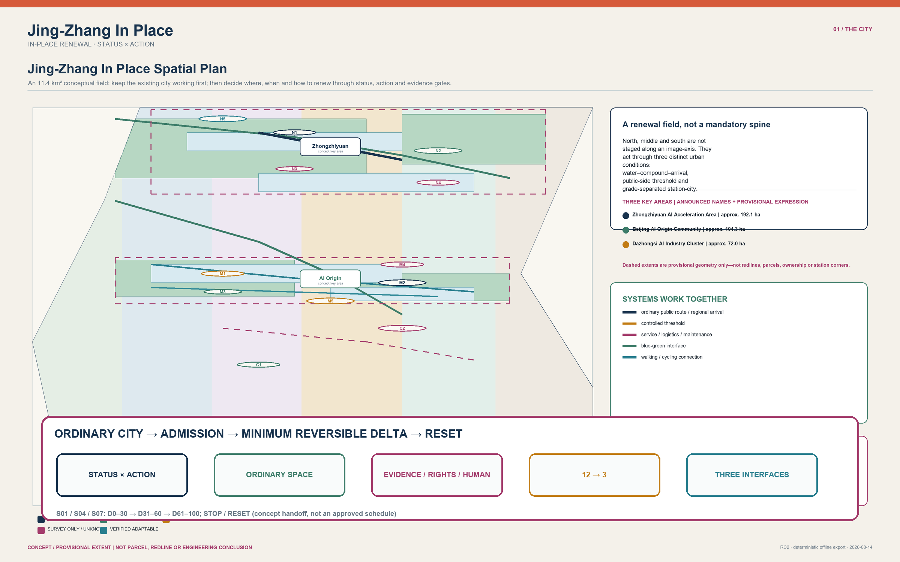
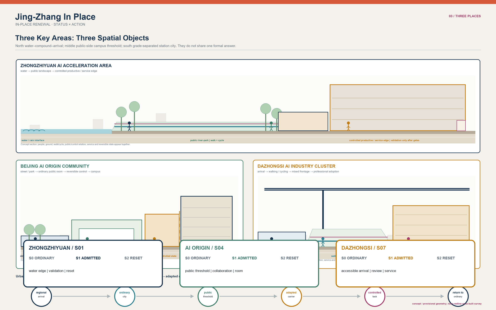
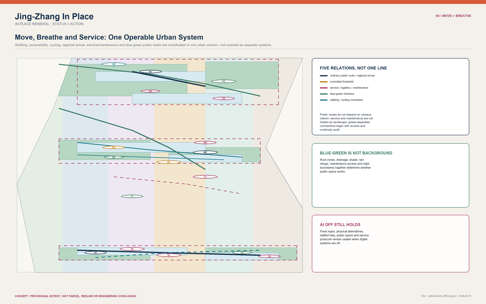
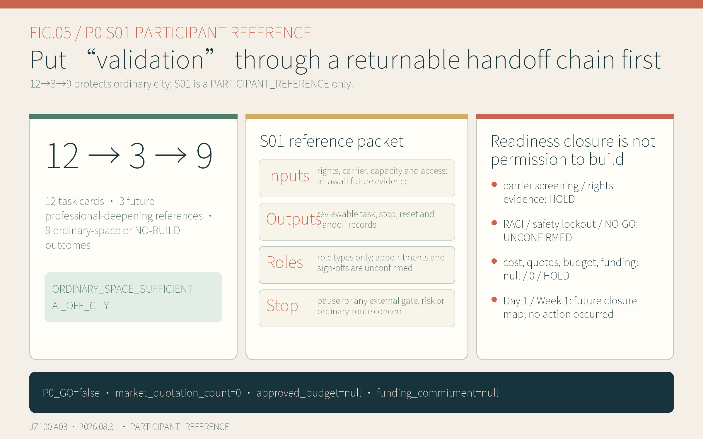

# Jing-Zhang In Place

> **Let the future grow; let the city continue.**

## See the city before the technology

**Technology belongs to an era; the city belongs to generations.** Jing-Zhang In Place does not lay an “intelligent corridor” over existing life. It asks, within a city where shade, walking, learning, service, maintenance and small daily commerce already work, when technology is truly worth taking even a little space. The city is not a container for technology; it is the continuity of intergenerational life. Not every technical advance deserves a permanent spatial cost.

That continuity becomes three visible, maintainable relationships:

- **Continuing time**: long-lived streets, trees, walking and public service do not yield to short-cycle equipment;
- **Continuing life**: people of different ages, abilities, occupations and rhythms retain a route to arrive, pause, ask and leave without an app;
- **Continuing memory**: Jing-Zhang railway resilience is not copied as an icon. It becomes a responsibility: every exceptional state must be explainable, stoppable and returnable to daily life.

Space is therefore not a homogeneous renewal field. The **long-lived city** carries streets, trees, services and shared memory; the **adaptable city** carries rooms, thresholds and repairable operations; **temporary intelligence** appears only when it is needed, minimally, reversibly and with a human responsibility. Zhongzhiyuan means validation rather than spectacle; AI Origin means co-existence rather than capture; Dazhongsi means judgment rather than automation. `STATUS × ACTION` remains a careful decision skeleton beneath the proposal, not its urban image.

### Three human-centred routes through the proposal

| Route | Begin here | What it makes clear |
| :--- | :--- | :--- |
| **30 seconds: a city that can continue** | Cover, three continuities, three temporal layers, three key areas | Why the city comes before technology, and how ordinary life stays whole |
| **3 minutes: one cautious spatial decision** | FIG.03 key areas, the P0 reference, FIG.05 evidence | Why only S01 reaches P0, and how space stops and returns to ordinary life |
| **15 minutes: a reviewable chain of responsibility** | Full text, structured sources, assumptions/sources/matrices | What the participant proposes, and what still needs professionals, rights holders and field observation |

### Method foundation: used only when the city permits it

> **Core Thesis**: Jing-Zhang is not a blank line waiting to be filled with AI, but an existing city with unequal statuses, jurisdictions, and cross-sections. The proposal employs `STATUS × ACTION` to establish the baseline spatial floor first, upholding `AI_OFF_CITY` (where ordinary public streets, mixed daily life, step-free routes, and human services operate 100% completely without AI intervention). Across 12 urban tasks, it strictly enforces the "ordinary-space sufficiency test," admitting only S01, S04, and S07—where physical testing, controlled collaboration, and compliance review are demonstrably insufficient in ordinary rooms—as deep spatial packets. The remaining 9 tasks are explicitly NO-BUILD or ordinary carriers. All admitted specialist spaces are equipped with strict Time-To-Live (TTL), absolute human authority, and immediate physical reset mechanisms. [data:visual/assets/ai-spatial-admission.json#admission_chain]

---

## Six Taskbook Deliverables: From Index to City Narrative

This is not a compliance checklist appended to the proposal. All six tasks are placed in one readable, reversible and reviewable city narrative: keep the ordinary city working first; distinguish fact, rule and unknown before discussing the minimum spatial delta. The diagram below gives entry points to the six tasks, twelve scenario cards, three deep validations, six personas, five cases and three landmarks. [data:visual/assets/taskbook-closure.json#reviewer_route]

### Task 1: Overall Concept and Functional Coordination

**Jing-Zhang In Place / 京张续城** is the principal name. The Logo direction is two original civic strokes - a railway seam and an open reset gate - with no third-party mark; it is deliberately separate from point-by-point wayfinding. The three positionings are the Centennial Jing-Zhang Cultural Belt, Metropolitan AI Living Experience Belt and AI-Integrated Innovation Belt. The five functions are an AI full-stack autonomy system, world-class AI innovation ecology, AI+ scenario empowerment, an intelligent AI-vital city and global AI governance discourse. [source:AGENT-TASKBOOK]

The three areas and two wings are not five development projects: Zhongzhiyuan is a conditional physical-validation type; AI Origin is a conditional public-side collaboration type; Dazhongsi is a staffed adoption/compliance interface type. The Zhongguancun Technology Service Wing only proposes professional-service referral, and the Xiaoyuehe Scenario Empowerment Wing only proposes appealable maintenance and public-experience feedback. They form one loop: question entry - ordinary-space sufficiency - deep admission or NO-BUILD - public feedback - reset. The overall structure is a multi-point stitch through the existing city, not an image axis. [data:visual/assets/taskbook-closure.json#reviewer_route]

#### Conditional Regional Synergy: Task - Interface - Evidence - Feedback

The five regional relationships now enter one conditional loop - candidate task, proposed interface, evidence requested or exchanged, feedback returned to Jing-Zhang, and activation condition - instead of remaining a research list. If any node lacks an authorized contact, lawful or cleared evidence, human responsibility, or an exit condition, the loop does not activate and Jing-Zhang remains ordinary city or NO-BUILD. This is an original task-interface design, not a collaboration fact. [data:visual/assets/taskbook-closure.json#conditional_regional_interfaces]

**Shared current status and boundary (applies to every row): UNCONTACTED / UNCONFIRMED; NO PARTNERSHIP CLAIM; NO RESOURCE COMMITMENT; NO OPERATOR COMMITMENT; NO GOVERNMENT COMMITMENT.**

| Relationship | Candidate task | Proposed interface | Evidence requested/exchanged | Feedback returned to Jing-Zhang | Activation condition | Current status and non-commitment boundary |
| :--- | :--- | :--- | :--- | :--- | :--- | :--- |
| **Beiwei Community (北纬社区)** | S06 / S11: everyday service and quiet boundary | Ordinary-city issue brief + staffed handover table | Resident-defined problem, accessibility and non-digital fallback, consent and participation representation | Public-interest floor; ordinary-space-sufficient or NO-BUILD decision | Authorized community contact, appealable participation rule and no-collection baseline are confirmed | UNCONTACTED / UNCONFIRMED; all four shared non-commitment boundaries apply |
| **Future Science City** | S04: multimodal collaboration handover | Evidence-packet interface for a reversible session | Bounded task, data rights, access condition, human steward and reset requirement | Admission matrix, reusable handover format and unmet-condition list | Authorized counterpart, bounded task, lawful/cleared data and human steward are in place | UNCONTACTED / UNCONFIRMED; all four shared non-commitment boundaries apply |
| **Huairou Science City** | S01: real physical-task validation | Physical-task - safety - reset question packet; no equipment transfer | Task envelope, site/access authorization, operator and safety responsibility, failure and reset plan | Minimum reversible delta, or ordinary carrier / NO-BUILD conclusion | Real task, authorized carrier, operator/safety leads and supervised rehearsal are confirmed | UNCONTACTED / UNCONFIRMED; all four shared non-commitment boundaries apply |
| **E-Town** | S07: adoption and compliance review | Staffed review/appeal protocol handover | Affected user, review criteria, paper fallback, contest and stop route | Adoption evidence board, stop/reset rule and missing-rights list | Authorized use case, human review/appeal route and non-digital service are established | UNCONTACTED / UNCONFIRMED; all four shared non-commitment boundaries apply |
| **Beijing-Tianjin-Hebei** | S12: evidence-status and version change | Cross-region evidence envelope + applicability-difference table | Source, version, jurisdiction, lawful exchange basis, human authority and rollback condition | Locally applicable / incompatible / missing-evidence list returned to STATUS x ACTION | Public or cleared task brief, authorized exchange route and human authority in each jurisdiction are confirmed | UNCONTACTED / UNCONFIRMED; all four shared non-commitment boundaries apply |

Integrated-planning innovation does not replace statutory planning. `STATUS x ACTION` first determines what an existing carrier may do; AI Spatial Admission then asks whether that action earns a minimum reversible specialist delta. Missing evidence, rights or public-interest conditions return the task to ordinary space or NO-BUILD. [data:visual/assets/taskbook-closure.json#core_grammar]

### Task 2: An Ecosystem, Not a Recruitment Promise

The ecosystem map is a sequence of task demand - ordinary carrier - human review - evidence/rights gate - reversible delivery - public explanation/reset. Land/space, industry, funding, talent, compute, data and scenarios are expressed only as gates and mechanisms. Zhongzhiyuan is the conditional S01 validation type, AI Origin is the conditional S04 public-side collaboration type, and the service wing is a professional-referral type before S07; none asserts an obtained carrier, compute resource, data source, company list or funding. [data:visual/assets/taskbook-closure.json#claim_qualifications]

| Global case | Observed mechanism | What is not transferable | Jing-Zhang conceptual test |
| :--- | :--- | :--- | :--- |
| Seoul AI Hub | Talent-company-community operating ecology | No local partner, carrier or programme follows | Human referral between learning, validation and public explanation |
| Vector Institute | Accountable research-to-industry translation | No local institution, talent or funding follows | S07 evidence, appeal and human handover |
| Mila | Open-science and community-exchange boundary | No affiliation or event follows | Moderated model-literacy explanation in S05 |
| Singapore PlatformAI | Shared-service boundary and version governance | No local compute, data or service follows | Source/version review before opening S12 |
| Digital Catapult | Test-demonstrator-adoption pathway | No procurement, operator or outcome follows | Independently stoppable S01/S04/S07 concept tests |

All five are public method references. They cannot support Jing-Zhang investment, enterprise, operation, approval or implementation claims. [source:BENCHMARK-SEOUL-AI-HUB] [source:BENCHMARK-DIGITAL-CATAPULT]

### Task 3: Twelve Scenario Cards, Six Personas and a Xiaoyuehe Experience Path

The twelve cards strictly correspond to the existing twelve tasks; they are not a new smart-city catalogue. S01/S04/S07 are the three deep validation cases; the remaining nine explicitly conclude ordinary-space sufficiency or NO-BUILD. The six personas are not marketing characters: they test whether daily trade, learning, development, accessibility, cultural access and maintenance safety survive with AI off. The Xiaoyuehe experience path is post-rain human inspection - appealable maintenance feedback - physical interpretation without data capture - return to an ordinary greenway. Missing access, ecological or maintenance conditions pause the concept. [data:visual/assets/taskbook-closure.json#personas]

The complete cards, three validation criteria and persona-to-scenario mapping appear in “Task 3: Twelve Scenario Cards”; the same source retains every compact field for professional review without replacing the narrative. [data:visual/assets/taskbook-closure.json#scenario_cards]

### Task 4: Public Space and Three Reversible AI Pilgrimage Landmarks

The Jing-Zhang Heritage Park response is a legible, maintainable park sequence that stays complete with AI off: physical interpretation, rain-safe pause, human maintenance feedback and accessible alternatives. East-west continuity prioritizes a surface walking stitch; north-south continuity first audits the station-city-ground-public-space sequence. No bridge, tunnel, underground space or transport engineering feasibility is claimed. Dazhongsi's AI-native consumption/business scenario is S07's staffed evidence-and-appeal interface: it protects ordinary service, access and small-business continuity, and assumes neither tenants, footfall, property rights nor alteration. [data:visual/assets/taskbook-closure.json#public_space_and_culture]

The three landmarks are operationally AI-native and physically minimal reversible elements. **Reset Frame / 复位门** at Zhongzhiyuan makes S01 status and reset visible. **Handover Table / 交接台** at AI Origin makes consent, explanation and exit visible. **Right-to-Appeal Desk / 申诉台** at Dazhongsi preserves human inquiry, a paper alternative and a contest route. The Reversible Evidence Honor Rail may show consented public contribution, method, source, review date and expiry/reset state only; it excludes biometric ranking, unverified achievements and permanent celebrity branding. The component library comprises STATUS tiles, AI-OFF markers, accessible analog wayfinding, consent/appeal cards, removable boundary rails and signed reset tickets. [data:visual/assets/taskbook-closure.json#landmarks]

### Task 5: Culture Is Not an AI Decoration

This proposal’s cultural translation is a participant-authored conceptual analogy, not a factual claim about exact railway engineering, operating protocols, or current spatial conditions: changing alignment becomes “trading admission for resilience”; a crossing becomes “protect surface continuity first”; and handover becomes “stop, sign, exit and reset.” Zhongguancun innovation culture and AI new culture are therefore not spectacle images but a testable, contestable public process that can return to ordinary city. Wayfinding uses the bilingual rule “place + STATUS + allowed ACTION + human help + stop/reset.” It is distinct from the overall Logo: the first answers where and what now; the second expresses the identity of the belt. The international line is: **“An ordinary city that earns every exceptional state - and can give it back.”** [data:visual/assets/taskbook-closure.json#public_space_and_culture]

### Task 6: A Stoppable Annual Operating Cycle

The annual activity system is not a confirmed calendar. Its conceptual sequence is public questions and site/evidence verification; developer rehearsal in ordinary carriers or NO-BUILD; S01/S04/S07 supervised sessions only after admission; public evidence week and independent review; archive/expiry and full reset. Its identity directions are Evidence Week, Reset Receipt and Ordinary City Open Room. The developer community submits a task to a public-interest and sufficiency test; a failed test remains an ordinary-space result. Landmarks and honors are removed when evidence, consent or steward expires. Funding lists only **mechanism options** - public-interest renewal, research/test partnership, operator contribution, philanthropic/public-cultural support and appropriate commercial revenue - never committed funding, cost or procurement. [data:visual/assets/taskbook-closure.json#operation_cycle]

### Claim Qualification: Draw the Pause Where It Can Be Seen

| Claim likely to be misread | Visible classification | What may be said now | What may update it |
| :--- | :--- | :--- | :--- |
| Boundary, area and ratio | **GEOMETRY_DERIVED_PROVISIONAL** | Recomputable concept-consistency values from submitted geometry | Official SITE_BOUNDARY/KEY_AREA, then full recalculation |
| Statutory actor, operator and stop authority | **UNKNOWN** / **DESIGN_RULE** | Source-backed facts and proposed role types are separate | Rights-holder, operator and professional/statutory confirmation |
| Funding and phasing | **CONCEPT_PROPOSAL** | Conditional mechanism options and evidence gates | Authorized budget path and agreement |
| Campus, metro, enterprise and heritage access | **PAUSE_UNTIL_OFFICIAL_DATA** | Ordinary-city routes and concept types | Current survey and written owner/operator agreement |
| Engineering, capacity, pilot and field performance | **CONCEPT_PROPOSAL** | Offline concept and reset rehearsal | Professional survey, capacity/safety review, authorization and supervised rehearsal |

The three formal visual metrics remain calculated from participant-supplied provisional geometry, with source, formula and an official-data recalculation trigger. They are not statutory redlines, survey results or engineering quantities. [metric:site_area_sqm] [metric:green_ratio] [metric:public_space_ratio]

---

## Cultural Translation & Spatial Analogies: Alignment, Crossing, and Handover

The following three are participant-authored cultural translations, not claims about the route's exact historical engineering, operational protocols, or current spatial condition:
1. **Changing Alignment (Conceptual Analogy)**: A rail alignment that changes direction becomes **"Trading Admission for Resilience"**—the proposal avoids blanket corridor-wide AI deployment in favour of spatial graduation and reversible admission when technological uncertainty remains.
2. **Crossing Stitching (Conceptual Analogy)**: A crossing becomes the rule **"protect surface continuity first."** The proposal therefore keeps continuous surface pedestrian routes and independent step-free paths ahead of any technical apparatus.
3. **Handover Accountability (Conceptual Rule)**: Handover becomes **"stop, sign, exit and reset."** The proposal establishes an `S0 Ordinary City → S1 Admitted Specialist State → S2 Reset/Exit` chain so each proposed technological exception has a future accountable handoff and exit record.

---

## Design Basis and Source List

The open-call announcement, taskbook, allowed design space, standards, and source registry constitute the primary control inputs. Location-specific claims remain strictly limited to the spatial and temporal scope supported by each source; international precedents serve as methodological inspiration rather than evidence for a Jing-Zhang project, partnership, or site. [source:OFFICIAL-ANNOUNCEMENT] [source:AGENT-TASKBOOK] [source:SOURCE-REGISTRY] The provisional envelope and three key-area rectangles serve conceptual, topological, and communication purposes only; they must never be construed as statutory redlines, property parcels, ownership boundaries, or planning approvals. [source:BOUNDARY-SOURCE] [depth:existing_conditions_diagnosis]

> **How to Read This Figure (FIG.01 Jing-Zhang Spatial Judgment + Conditional Regional Interface)**:
> 1. **Read scale only where technically valid**: the 11.4 km² overall scope and three key areas come from submitted coordinate geometry, so the map includes north, a 0-1 km scale, drawing CRS `EPSG:4548`, and a 2026-08-30 data state. The 43.6 km² coordination tier has a source-backed relationship scale but no available coordinates, so it is not drawn as a measurable extent;
> 2. **Read the provisional warning first**: the overall boundary and all three key areas are `GEOMETRY_DERIVED_PROVISIONAL`, not official redlines, parcels, ownership, approvals, or surveys;
> 3. **Compare three spatial judgments**: Zhongzhiyuan addresses water edge - controlled carrier - regional arrival; AI Origin addresses campus public side - ordinary learning - session authorization; Dazhongsi addresses ground-level station-city continuity - cycling/loading - everyday commerce. Their sections are all `NTS / NOT TO SCALE / CONCEPT TYPOLOGY`;
> 4. **Follow five interfaces back to Jing-Zhang**: Beiwei Community, Future Science City, Huairou Science City, E-Town and Beijing-Tianjin-Hebei return only candidate-task evidence through STATUS x ACTION. No spatial, resource, or operating action occurs before activation conditions are met;
> 5. **Audit six evidence states**: the surface uses only `SOURCE_BACKED`, `GEOMETRY_DERIVED_PROVISIONAL`, `DESIGN_RULE`, `DESIGN_ASSUMPTION`, `INDICATIVE`, and `UNKNOWN`; visual precision never substitutes for field or statutory evidence.

---

## Three-Level Scope Framework

The 43.6 km² coordination scope addresses ecosystem, talent, and public-service synergy; the 11.4 km² overall scope organizes urban design through status, action, connectivity, and public space; the three key areas address distinct cross-sectional and operational challenges. The three tiers are not mere zoom levels of a single axis, but are governed by evidence granularity, jurisdictional responsibilities, and permissible actions. [source:OFFICIAL-ANNOUNCEMENT] [metric:site_area_sqm] [metric:key_area_count] This scope framework is verified through a traceable hierarchy. [depth:three_level_scope_framework] When official geometries are released, all geometries, metrics, drawings, and action interfaces must be recalculated synchronously. To prevent scale misinterpretations, the coordination tier states asset/interface relationships only, the overall tier states provisional topologies only, and the key-area tier states typological sections only.

---

## Coordinated Research Area: Industry and Future City Research

The coordinated scope identifies six asset categories: research/educational controlled perimeters, existing innovation carriers, enterprise–professional service interfaces, regional gateways, river/park heritage, and daily residential communities. These assets form a multi-entry ecosystem through public-side rooms, verified existing carriers, ordinary mixed blocks, and maintenance access, rather than assuming corporate relocations, campus mergers, or forced perimeter removals. [source:AI-ORIGIN] [source:QINGHE-HUB] [depth:overall_spatial_structure] Drawing from Seoul AI Hub, Vector, Mila, Singapore PlatformAI, and Digital Catapult, the proposal adopts mechanisms of responsibility, service, verification, and exit rather than replicating architectural forms. [source:BENCHMARK-SEOUL-AI-HUB] [source:BENCHMARK-DIGITAL-CATAPULT]

---

## Overall Design Area: Urban Renewal and Regulatory-Plan-Level Urban Design

The overall structure is organized via STATUS × ACTION: five existing conditions (BUILT_OPERATING, APPROVED_OR_IN_DELIVERY, CONTROLLED_ACCESS, SURVEY_ONLY_UNKNOWN, and VERIFIED_ADAPTABLE) map to five bounded actions (RETAIN, REPAIR, OPEN_EDGE, SUBDIVIDE_RECONNECT, and ADAPT_INFILL). Each patch records its source, constraints, users, triggers, cross-section, mobility, services, blue-green assets, responsibility, stop triggers, and exit routes; wholesale demolition and replacement is excluded from the default action catalog. [data:visual/assets/status-action-register.json#P-N1] [metric:status_action_patch_count] [depth:land_use_layout] Development intensity and height controls utilize street enclosure, ground-floor permeability, threshold depth, and service-edge rules, with statutory numerical limits pending official government release. [standard:MOHURD-CONTROL-DETAILED-PLANNING] [depth:development_intensity_controls] [depth:height_massing_character]

AI spatial admission is not a secondary urban spine: it is a bounded task evaluation within an already permitted action. Ordinary paths, ordinary rooms, maintenance, and human services take precedence; if ordinary space is sufficient, evidence or rights are inadequate, or qualified human authority is absent, the outcome is an ordinary carrier, removable general-purpose kit, or NO BUILD, rather than reserved construction for AI. [data:visual/assets/ai-spatial-admission.json#city_framework]

> **How to Read This Figure (FIG.02 Land Use, Action Patches, and Urban Stitching)**:
> 1. **Review 5×5 Status-Action Matrix**: Confirm the baseline status and restricted action assigned to each of the 17 patches, rejecting indiscriminate tabula-rasa redevelopment;
> 2. **Check Public Continuity**: Verify that green open space and mixed service interfaces remain uninterrupted without technology trials blocking daily access;
> 3. **Verify Topological Integrity**: Check that conceptual land use forms a complete partition with zero overlaps and zero gaps, mathematically derived in EPSG:4548.

| Status | Action Determination | Non-Negotiable Boundary |
| :--- | :--- | :--- |
| **BUILT_OPERATING** | Retain or repair proven defects | Do not extrapolate open status to adjacent unverified carriers |
| **APPROVED_OR_IN_DELIVERY** | Coordinate interfaces first, mend gaps second | Do not mislabel in-progress delivery as fully open access |
| **CONTROLLED_ACCESS** | Public side first; separate visitor from project access | Do not rely on campus internal roads for public through-movement |
| **SURVEY_ONLY_UNKNOWN** | Survey only, reversible testing, or NO BUILD | Do not diagnose property rights, structural health, or utility capacity |
| **VERIFIED_ADAPTABLE** | Adapt only after professional and rights gates pass | Do not treat typological prototypes as definitive building diagnoses |

---

## Detailed Design of Key Areas

Zhongzhiyuan treats the water-controlled-compound edge-regional-arrival relationship as a concept question: real physical validation could only occur in a future surveyed, consented carrier, and public river park, service reset and controlled testing must stay separate. AI Origin treats the public-side campus threshold as a concept question: a city route is not assumed to use campus interior, ordinary learning/community use comes first, and any controlled state needs session-by-session authorization. Dazhongsi treats station-city surface continuity, cycling, loading and daily commerce as questions requiring investigation: the provisional rectangle is not a station exit, parcel or ownership plan. Together the three areas answer detailed urban design at a conceptual level, without repeating one courtyard, lobby or AI-room template. [source:QINGHE-HUB] [source:CAMPUS-ACCESS] [source:GRADE-SEPARATION] [depth:three_key_area_detailed_design]

### Dazhongsi Multi-Level Station-City: Four-Quadrant Conceptual Design Organization (Four-Quadrant Design Organization)
The provisional geometry and contextual station-city relationship are offset. The four quadrants are therefore a **data-pending conceptual design organization**, not anchors to station portals, heritage boundaries, crossings or statutory spaces:
- **North-east question field**: Can a culture/ecology interface provide low-disturbance public interpretation without harming heritage, root zones, drainage, quiet or maintenance? Until surveyed, it remains ordinary public space.
- **North-west question field**: Who is responsible for continuity between university edge, road and public walking; when is it open and accessible? No new connection is proposed without access and operating confirmation.
- **South-west question field**: Do bus, cycling, loading, night quiet and everyday small business conflict? Start with timed observation and user co-design; do not redraw a road or commercial unit.
- **South-east question field**: Is there readable surface continuity among station-city, greenway and public service? Start with physical wayfinding and human help. Any bridge, underpass, interchange or facility is a `CONCEPTUAL_INTERFACE` and remains `PROFESSIONAL_DEEPENING_REQUIRED`.

All three interfaces follow a scale-free `S0 Ordinary City → S1 Admitted Specialist State → S2 Exit/Reset` typology and assert no parcel, dimension, station portal, ownership, engineering or statutory control. Zhongzhiyuan considers carrier-contained removable validation only after conditions are confirmed and returns to ordinary training/work after kit removal. AI Origin considers demountable zoning and human handover only under session authorization and returns to ordinary use after clearing. Dazhongsi considers a temporary review state only after privacy, appeal, paper fallback and staffed review are confirmed and returns to ordinary professional/community service on stop. [data:visual/assets/taskbook-closure.json#validation_scenarios]

### P0 | Zhongzhiyuan: put “validation” inside a returnable chain of responsibility

S01 is the only spatial reference brought to P0. It is neither a selected site, an approved pilot nor a construction document; it is a minimum-condition drawing that helps a future team decide whether it should not happen at all. It discusses only a **12 m × 9 m, zero-coordinate `DESIGN_ASSUMPTION` conceptual envelope**. It is not a claim about surveyed dimensions, clearance, egress, loading, anchorage, power, or approval. [data:visual/assets/p0-s01-reference.json#scope]

**WHY → SPACE → PEOPLE → COMPONENTS → CAPACITY.** Only when a real, bounded, accountable physical task cannot be replaced by simulation, review or an ordinary room is a reversible test edge considered, and it may not take over the public route. Z0 remains an ordinary route; Z1 is human handover; Z2 is removable testing; Z3 separates operator and safety authority; Z4 is booked observation; Z5 is maintenance/reset; Z6 is a still-to-be-professionally-determined buffer. A concept session has **one active task/device, five role positions, four booked observer positions and a total cap of nine**. There is no walk-in queue in Z0, and any observed or approved operational capacity remains `null`. [data:visual/assets/p0-s01-reference.json#zone_logic] [data:visual/assets/p0-s01-reference.json#capacity]

The five role classes are not appointments: test operator; separate human safety authority; public/service handoff steward; maintenance/reset steward; independent observer/reviewer. The eight removable components are not a procurement list: STATUS/reset frame, removable perimeter, floor/interface protection, power/isolation interface, physical stop/control kit, operator/safety console and log, handoff/observer elements, and reset/storage inventory. They create only a minimal future path that cannot diffuse technology into ordinary city life, and only after rights, professional and field conditions exist. [data:visual/assets/p0-s01-reference.json#components]

**OPERATION → STOP → RESET → MAINTENANCE.** The order is fixed: pre-open external gates → ordinary-baseline verification → install/inspect → conditional activation and stop rehearsal → one controlled task → fail-close → human isolation/takeover → remove → restore → independent ordinary-baseline verification. No reset duration is claimed. Any issue is first `QUARANTINED` until independent reset and ordinary baseline have been reconfirmed. [data:visual/assets/p0-s01-reference.json#operation_chain] [data:visual/assets/p0-s01-reference.json#stop_reset_maintenance]

**COST → ALTERNATIVES → HOLD.** The current `market_quotation_count=0`, `approved_budget=null` and `funding_commitment=null`; only relative sensitivity is compared and no money is fabricated. The four peer choices are NO-BUILD, lower-tech reversible arrangement, selected P0 and an alternate linear side-bay. If physical need is not verified, or a lighter option protects the ordinary-city floor equally well, P0 does not advance. All 11 external conditions remain `HOLD_EXTERNAL`; therefore `P0_GO=false`. [data:visual/assets/p0-s01-reference.json#cost_and_alternatives] [data:visual/assets/p0-s01-reference.json#external_hold_gates]

The reference keeps distinct: the participant’s present concept deliverable; surveys, codes, capacity and role confirmation needed from future professionals; and route, handoff, stop and reset evidence requiring field observation. It maintains a bounded cross-reference with PRJ-06’s “one reversible validation pilot,” without turning a concept into a promise. [data:visual/assets/p0-s01-reference.json#acceptance_and_handoff] [data:visual/assets/renewal-project-portfolio.json#PRJ-06]

> **How to Read This Figure (FIG.03 Three Key Areas and Differentiated Cross-Sections)**:
> 1. **Compare Three Differentiated Sections**: Observe the distinct cross-sectional logics across the northern water-arrival mosaic, middle campus threshold, and southern grade-separated hub;
> 2. **Audit S0–S1–S2 Cycle**: Trace each key area from ordinary city (S0) to admitted specialist state (S1) to complete physical reset (S2);
> 3. **Confirm Typological Nature**: Recognize drawings as scale-free typological prototypes rather than fabricated construction blueprints; FIG.05 verifies each complete ordinary-base–admission-gate–spatial-delta–human-authority–exit/reset contract side by side.

---

## AI Innovation Ecosystem, Personas, and AI+ Scenarios

### Task 3: Twelve Scenario Cards, Three Industry Validations and Six Personas

Under `AI_OFF_CITY`, public routes, mixed urban life, blue-green systems, ordinary rooms, human services and maintenance remain operational. Every card uses the same compact contract: **persona/need | current ordinary baseline | AI capability | ordinary-space sufficiency | minimum delta | operation and human authority | privacy/failure | stop/reset | evidence status | area relation | taskbook mapping**. The twelve tasks are therefore urban judgments, not twelve construction reasons. [data:visual/assets/taskbook-closure.json#scenario_cards]

| Persona | Public-interest test | Scenarios | AI-off floor |
| :--- | :--- | :--- | :--- |
| P01 Long-term resident and small street-front operator | Walking, trade, quiet return and walk-in service cannot be displaced by a demonstration state | S06/S07/S10/S11 | Physical signs, staffed counter, ordinary street |
| P02 Student and early-career researcher | Ordinary study space cannot be captured by a controlled project room | S01/S04/S05 | Ordinary room, paper booking, human handover |
| P03 AI developer and independent researcher | A specialist space needs a real task and accountable review first | S01/S02/S03/S04 | Simulation, code review, ordinary meeting room |
| P04 Older adult and mobility or sensory-disabled user | Step-free continuity and human escort outrank digital recommendation | S06/S08/S10 | Tactile route, physical signs, human help |
| P05 Visitor and cultural traveler | Culture must be readable without an app or controlled-property entry | S05/S09/S11 | Bilingual physical interpretation, ordinary public space |
| P06 Public-service, maintenance and safety worker | Servicing, stop authority and manual work orders remain visible | S01/S07/S09/S11/S12 | Human inspection, paper log, physical reset |

#### S01 | Embodied AI Physical Validation (deep validation)

- **Persona/baseline/capability/need**: P02/P03/P06; planning, code review and simulation use ordinary rooms; AI only supports bounded physical model/equipment observation; a real task must not transfer risk to public space.
- **Sufficiency and minimum delta**: `ORDINARY_SPACE_SUFFICIENT=false`: a supervised physical test needs a safety and reset edge that simulation cannot supply. Only after task, carrier rights, qualified operator, safety envelope and public-route continuity are verified may a removable boundary rail, observation edge and plug-in test kit be considered.
- **Operation/authority/risk**: Time-bounded supervised session. Qualified operator may propose, verified carrier steward may operate, safety lead may stop. Records are minimum authorized only; no facial recognition, public surveillance or unapproved personal data.
- **Failure/stop/reset/status**: Unsafe state, stale authorization or route conflict stops the session; remove kit and return to ordinary training/work. Zhongzhiyuan north **typology**, not a parcel. `CONCEPT_PROPOSAL`; authorization, survey and professional safety confirmation remain required. Maps to agent.2/agent.3.

#### S02 | Environmental Robustness Rehearsal (ordinary space sufficient)

- **Persona/baseline/capability/need**: P03/P06; software-in-the-loop rehearsal with human field inspection; AI offers a comparison cue; developers and maintainers need to see a mismatch before any public claim.
- **Sufficiency and minimum delta**: `ORDINARY_SPACE_SUFFICIENT=true`; `NO-BUILD`. Existing work sessions and manual inspection suffice; no street occupancy is proposed.
- **Operation/authority/risk**: Scheduled desktop rehearsal; qualified reviewer accepts or rejects the comparison; only minimized non-personal task records.
- **Failure/stop/reset/status**: Unverified carrier, environmental harm or public disturbance withdraws the output and retains ordinary maintenance. Zhongzhiyuan north typology. `CONCEPT_PROPOSAL`, not a field-deployment claim. Maps to agent.2/agent.3.

#### S03 | Human Safety and Evidence Review (ordinary space sufficient)

- **Persona/baseline/capability/need**: P03/P06; professional desktop audit in an ordinary meeting room; AI only organizes an evidence bundle; reviewer needs a route to reject unsupported claims.
- **Sufficiency and minimum delta**: `ORDINARY_SPACE_SUFFICIENT=true`; `NO-BUILD`. Ordinary room and archival practice suffice.
- **Operation/authority/risk**: Versioned review meeting. Independent qualified reviewer may stop or return the claim; no private operational or personal data enters the bundle.
- **Failure/stop/reset/status**: Stale, incomplete or unprovenanced evidence is archived/deleted and the room returns to ordinary use. North-area operational support only, with no spatial intervention. `DESIGN_RULE`, not a statutory approval. Maps to agent.2/agent.3/agent.6.

#### S04 | Multi-modal Collaboration Handover (deep validation)

- **Persona/baseline/capability/need**: P02/P03/P04; most learning/teamwork uses ordinary rooms; AI is a controlled time-limited multi-modal session; participants need to see the handover between public learning and a consent-bound project.
- **Sufficiency and minimum delta**: `ORDINARY_SPACE_SUFFICIENT=false`: an ordinary study room cannot distinguish an authorized acoustic handover without eroding the public floor. Only after a public-side carrier, opening agreement, data boundary, accessibility check, steward and reset rehearsal are confirmed may a reversible acoustic screen, session marker and removable materials be considered.
- **Operation/authority/risk**: Booked, stewarded session. Carrier steward operates, accessibility representative may contest, safety lead may stop. Materials are consent-bound; no ambient collection in public learning space.
- **Failure/stop/reset/status**: Route blockage, expired consent, absent steward or accessibility conflict clears materials, retracts screen and restores ordinary public learning. AI Origin middle public-side **typology**, not a campus-access claim. `CONCEPT_PROPOSAL`. Maps to agent.2/agent.3/agent.4.

#### S05 | Open AI Literacy and Model Explanation (ordinary space sufficient)

- **Persona/baseline/capability/need**: P02/P04/P05; community activity room, printed material and facilitator; AI only supports a bounded demonstration/explanation; people need to understand purpose, limit and appeal route first.
- **Sufficiency and minimum delta**: `ORDINARY_SPACE_SUFFICIENT=true`; `NO-BUILD`. An ordinary activity room and portable teaching kit suffice.
- **Operation/authority/risk**: Voluntary, time-bounded, facilitated session. Facilitator pauses and removes unsupported content. No attendance profiling, mandatory account or biometric collection.
- **Failure/stop/reset/status**: Unmoderated claim, inaccessible format or stale evidence ends the session and preserves the ordinary room. AI Origin public-side room typology. Venue, host and event are uncommitted. Maps to agent.2/agent.3/agent.5/agent.6.

#### S06 | Community Co-pilot with Human Counter (ordinary space sufficient)

- **Persona/baseline/capability/need**: P01/P04/P06; staffed walk-in counter and paper guide; AI is optional staff-facing summary/referral support; residents need a non-excluding human service.
- **Sufficiency and minimum delta**: `ORDINARY_SPACE_SUFFICIENT=true`; `NO-BUILD`. Ordinary counter and visible paper alternative remain.
- **Operation/authority/risk**: Worker chooses, corrects or stops use; resident may insist on human-only service. No data use without lawful basis; sensitive material stays out of demonstration content.
- **Failure/stop/reset/status**: Bias, exclusion, offline state or loss of walk-in service returns immediately to human/paper process. Ordinary community-service typology, not a named service site. `CONCEPT_PROPOSAL`, with no government-service deployment claim. Maps to agent.3/agent.6.

#### S07 | Staffed Adoption and Compliance Review (deep validation)

- **Persona/baseline/capability/need**: P01/P03/P06; ordinary desk handles business, legal or public-service referral; AI only organizes a time-bounded evidence, appeal and review workflow; affected users and small operators need a visible human contest route before an adoption claim.
- **Sufficiency and minimum delta**: `ORDINARY_SPACE_SUFFICIENT=false`: standard desk cannot safely show queue privacy, appeal, evidence versioning and staffed review together. Only after carrier, privacy route, reviewer, appeal path, paper fallback, agreement and rehearsal are verified may a removable privacy screen, staffed appeal desk and evidence-status board be considered.
- **Operation/authority/risk**: Staffed sessions only: refer or reject, never automatically approve. Qualified reviewer may stop, affected user may contest, carrier steward controls opening. Minimum case records only; no public personal-data display.
- **Failure/stop/reset/status**: Stale evidence, absent reviewer, privacy breach or lost paper fallback stops intake; ordinary referral desk returns, screen is removed, record is archived/deleted per agreed rule. Dazhongsi station-city service-interface **typology**, not a metro-zone or retail-tenancy claim. `CONCEPT_PROPOSAL`. Maps to agent.2/agent.3/agent.4/agent.6.

#### S08 | Step-free Wayfinding Assistance (ordinary space sufficient)

- **Persona/baseline/capability/need**: P04/P05/P06; tactile guidance, fixed signs, staff help and accessible-route audit; AI only gives optional status explanation after independent route verification; traveler needs a reliable route without a phone.
- **Sufficiency and minimum delta**: `ORDINARY_SPACE_SUFFICIENT=true`; `NO-BUILD`. Physical guidance and staff are primary.
- **Operation/authority/risk**: Duty officer confirms a facility status before any message. No location tracking or individualized route is necessary.
- **Failure/stop/reset/status**: Unverified route, inaccessible detour or stale status withdraws the message while physical signs and human escort remain. Dazhongsi continuity concept subject to operator/access confirmation. `PAUSE_UNTIL_OFFICIAL_DATA`. Maps to agent.3/agent.4.

#### S09 | Post-rain Greenway Maintenance Check (ordinary space sufficient)

- **Persona/baseline/capability/need**: P05/P06; manual inspection, maintenance work order and temporary safety marker; AI only gives a prioritization cue after staff observation; park users need safe maintenance without surveillance.
- **Sufficiency and minimum delta**: `ORDINARY_SPACE_SUFFICIENT=true`; `NO-BUILD`. Ordinary maintenance and removable marker suffice.
- **Operation/authority/risk**: Staff confirms condition on site; maintenance lead accepts, corrects or rejects the cue. No person monitoring, condition records only.
- **Failure/stop/reset/status**: Alert without field confirmation, ecological harm or blocked maintenance route removes the marker and retains manual work order. Jing-Zhang heritage-park response typology, with no surveyed-ecology claim. `CONCEPT_PROPOSAL`. Maps to agent.3/agent.4/agent.5.

#### S10 | Facility Status Relay with Analog Fallback (ordinary space sufficient)

- **Persona/baseline/capability/need**: P01/P04/P05; fixed decision-point signs and physical alternative route; AI only explains verified short-lived status; people need a clear choice without assuming phone access.
- **Sufficiency and minimum delta**: `ORDINARY_SPACE_SUFFICIENT=true`; `NO-BUILD`. Physical indication is the primary service.
- **Operation/authority/risk**: Publish only timestamped operator-confirmed status; no personal data required.
- **Failure/stop/reset/status**: Stale or unverified status withdraws the digital message while physical signs persist. Overall public-route typology, not a facility-ownership claim. `PAUSE_UNTIL_OFFICIAL_DATA`. Maps to agent.3/agent.4.

#### S11 | Community Event Quiet-Boundary Stewardship (ordinary space sufficient)

- **Persona/baseline/capability/need**: P01/P04/P05/P06; human event steward, portable acoustic baffle and ordinary-plaza rule; AI only gives a non-identifying prompt; residents and visitors need cultural activity, quiet, access and refuge together.
- **Sufficiency and minimum delta**: `ORDINARY_SPACE_SUFFICIENT=true`; `NO-BUILD`. Removable event kit and ordinary public space suffice.
- **Operation/authority/risk**: Human steward manages time, sound and exit; safety lead stops at a confirmed threshold. No crowd profiling or biometric count.
- **Failure/stop/reset/status**: Noise, light, access or refuge conflict stops the event, removes kit and restores plaza. Heritage-park/everyday-city component typology, not an annual-event commitment. `CONCEPT_PROPOSAL`. Maps to agent.3/agent.4/agent.5/agent.6.

#### S12 | Evidence-Status Change Review (ordinary space sufficient)

- **Persona/baseline/capability/need**: P03/P06; professional planner checks source, version and assumptions; AI only suggests a review queue; team needs to know when a claim must pause rather than silently persist.
- **Sufficiency and minimum delta**: `ORDINARY_SPACE_SUFFICIENT=true`; `NO-BUILD`. Ordinary archival and review practice suffice.
- **Operation/authority/risk**: Versioned human review and public correction where relevant; principal reviewer pauses affected claims. Public or cleared-source metadata only.
- **Failure/stop/reset/status**: Missing provenance, conflict or unreviewed change pauses the claim until official/professional confirmation. Whole-package evidence operation, no physical intervention. `DESIGN_RULE`, not new statutory power. Maps to agent.2/agent.3/agent.6.

### Three Industry Tests/Validations: Test Only Whether Deepening Is Justified

| Deep scenario | Test objective and admission condition | Interface and measurable criterion | Human authority, boundary, failure/reset | Next professional-deepening dependency |
| :--- | :--- | :--- | :--- | :--- |
| S01 | Test whether removable safety edge can contain a real physical task; task, rights, operator, safety, route and reset rehearsal must all be confirmed | Removable rail, observation edge, plug-in kit and physical emergency stop; rehearsal records zero uncontrolled-route conflict, working human stop and completed reset | Safety lead stops; no public surveillance/unapproved data; unsafe state or stale authorization removes kit | Carrier rights, fire/life-safety, structural, power and operational review |
| S04 | Test whether consent-bound handover can coexist with open learning; opening agreement, data boundary, accessibility, steward and reset rehearsal must be confirmed | Reversible acoustic screen, session marker, removable materials; rehearsal records continuous accessible passage, visible handover, cleared materials and ordinary-room reset | Steward operates, accessibility representative contests, safety lead stops; no ambient public-space collection | Access agreement, acoustic/fire, accessibility and data-governance review |
| S07 | Test whether affected user can see, contest and leave adoption review without losing ordinary service; carrier, privacy, reviewer, appeal, paper fallback and rehearsal must be confirmed | Removable privacy screen, staffed appeal desk, evidence board; rehearsal records human-only intake, accessible appeal, evidence correction and ordinary-referral reset | Qualified reviewer stops, affected user contests; minimum records and no public personal data | Rights-holder/operator agreement, legal/privacy, accessibility and service-process confirmation |

All three remain `CONCEPT_PROPOSAL`. None is described as approved, deployed, field-validated or engineering-feasible. The nine ordinary-space results are positive design outcomes, not incomplete construction tasks. [data:visual/assets/taskbook-closure.json#validation_scenarios]

---

## Implementation Feasibility: Manage Uncertainty Instead of Promising Delivery

All three deep scenarios remain `CONCEPT_PROPOSAL`. Their feasibility does not come from saying “buildable, funded or operable.” It comes from making insufficient evidence, rights, access, capacity, data, staffing and reset conditions into gates that cannot be skipped. The nine ordinary-space/NO-BUILD outcomes do not await spatial construction, yet still retain human responsibility and stop conditions. [data:visual/assets/taskbook-closure.json#claim_qualifications]

### The Site-validation Packet Is a Pause Gate, Not a Missing Promise

This submission **does not contain** a site-validated implementation packet and therefore does not call any deep contract implementable. A future packet must bind official geometry, rights/access, authority, engineering and capacity, funding path, and phasing/approvals for the same carrier; every one is currently `PAUSE_UNTIL_OFFICIAL_DATA`, `AUTHORIZATION_REQUIRED`, or `PROFESSIONAL_DEEPENING_REQUIRED`. Until rights-holders and qualified professionals establish, review and authorize that packet, S01/S04/S07 can only remain an ordinary-space result or pause. The table below records feasibility **boundaries and next steps** that do not invent site data; it is not field-feasibility proof. [data:visual/assets/taskbook-closure.json#claim_qualifications]

### Participant Readiness Closure: Handoff Before Action

What the participant can deliver now is not a promise that a field action is ready. It is a reference professional handoff packet that puts screening, rejection, and reset before action: it first tests whether a carrier could ever satisfy rights, ordinary-route, accessibility, and interface conditions; then keeps an S01 `PARTICIPANT_REFERENCE` task packet; and finally joins role types, hazard/lockout/NO-GO, operations, acceptance, rights acquisition, and ordinary-baseline restoration into one future handoff chain. [data:visual/assets/implementation-readiness-dossier.json#carrier_screen_reject_register] [data:visual/assets/implementation-readiness-dossier.json#participant_reference_task_packet]

- **Carrier—task.** The participant provides a carrier screen/reject register, an S01 reference task, and lower-tech and NO-BUILD alternatives. **External gate:** rights, access, ordinary route, real task, data, and interfaces all remain `HOLD`.
- **Roles—safety—operations.** The participant provides a role-type RACI, a hazard/lockout/NO-GO matrix, and a pre-open—stop—isolate—reset record structure. **External gate:** no operator, statutory authority, field capacity, engineering condition, or safety performance is appointed or claimed.
- **Cost—acceptance—rights.** The participant provides a non-BOQ CAPEX/OPEX structure, layered acceptance, a rights/authority acquisition path, and a Day-1/Week-1 HOLD-closure map. **External gate:** `market_quotation_count=0`, `approved_budget=null`, and `funding_commitment=null`; any failed gate pauses, quarantines, or returns to ordinary city.

On 2026-08-31, public sources were rechecked only as **context** for the competition and city-renewal setting: they can clarify task scale or published information, but cannot prove current carrier rights, operator, budget, real task, engineering condition, or approval. A future Day 1 only opens evidence requests and observations for rights, route, and task; Week 1 may test role separation, stop/lockout, and ordinary-baseline restoration only after applicable authorization and professional review. No Day-1 or Week-1 action has occurred today, and `P0_GO=false`. [source:OFFICIAL-ANNOUNCEMENT] [data:visual/assets/implementation-readiness-dossier.json#day_1_week_1_hold_closure_map]

### Read Actor, Funding and Readiness Separately

- **SOURCE_BACKED_KNOWN**: The taskbook and source registry support the concept and public-source boundaries, including the rule that humans and professional teams make the final decision. They appoint no local actor. [source:AGENT-TASKBOOK]
- **Proposed roles (CONCEPT_PROPOSAL)**: Task proposer, carrier steward, qualified operator, independent reviewer, accessibility/community representative, and archive/reset custodian are role types that may later be needed. Who may propose, operate or stop must be confirmed by rights-holders, operators and applicable professional/statutory processes before every session.
- **UNKNOWN / PAUSE_UNTIL_OFFICIAL_DATA**: Ownership, approval, access, opening hours, campus/metro/enterprise/heritage operating rules, engineering safety, capacity and field performance are not supplied. Missing any one retains the ordinary-space result or pauses the scenario.
- **FUNDING_MECHANISM_OPTIONS (CONCEPT_PROPOSAL)**: Future public-interest renewal, research/test partnership, operator contribution, philanthropic/public-cultural support and appropriate commercial-revenue mechanisms are not a budget, grant, investor, procurement route or government promise. [data:visual/assets/taskbook-closure.json#operation_cycle]
- **READINESS**: The package is `OFFLINE_READY` for concept discussion and reset rehearsal only. Every scenario remains `FIELD_DATA_REQUIRED`, `AUTHORIZATION_REQUIRED` and `PROFESSIONAL_DEEPENING_REQUIRED`; none is described as deployed, engineering-feasible or field-validated. [data:visual/assets/taskbook-closure.json#claim_qualifications]

### Three Repeated Deep-Delivery Contracts

| Contract: where / current baseline | Proposed action and who may propose/operate/stop | Dependency and evidence status | Validation method; failure/stop | Reset and next professional step |
| :--- | :--- | :--- | :--- | :--- |
| **S01 Zhongzhiyuan carrier typology**: ordinary training/work and simulation | Only inside a verified carrier may a removable rail, observation edge and plug-in kit be proposed; qualified operator proposes, carrier steward operates, safety lead stops | Rights, task, safety, route and power are unconfirmed; `CONCEPT_PROPOSAL` | Rehearsal records zero uncontrolled-route conflict, usable human stop and complete reset; unsafe state/stale authorization/route conflict stops | Remove kit and return to ordinary training/work; then fire/life-safety, structural, power and operational review |
| **S04 AI Origin public-side room typology**: ordinary learning and meeting | Only with opening, consent and accessibility conditions may a reversible acoustic screen, session marker and materials be proposed; steward operates, accessibility representative contests, safety lead stops | Access, carrier, data boundary, acoustic/fire conditions and steward are unconfirmed; `CONCEPT_PROPOSAL` | Rehearsal records continuous accessible public passage, readable handover, cleared materials and ordinary-room reset; route/consent/steward failure stops | Retract screen, clear materials and return to ordinary learning; then access agreement, acoustic/fire, accessibility and data-governance review |
| **S07 Dazhongsi station-city service-interface typology**: ordinary human referral desk | Only with privacy, appeal, paper fallback and qualified reviewer may removable screen, staffed appeal desk and evidence board be proposed; reviewer stops, affected user contests, steward controls opening | Rights/operation, metro/commercial access, legal/privacy and service process are unconfirmed; `CONCEPT_PROPOSAL` | Rehearsal records human intake, accessible appeal, evidence correction, no public personal data and ordinary-referral reset; privacy breach/reviewer absence/lost paper fallback stops | Remove screen, return to ordinary referral, archive/delete by rule; then rights-holder/operator, legal/privacy, accessibility and service-process review |

“Carrier typology” does not identify a building, station zone, campus, enterprise asset or ownership. Time, acoustic and dimensional language is not an engineering metric or field-performance promise; applicable measurement and permits can only emerge in professional design and field review. [data:visual/assets/taskbook-closure.json#validation_scenarios]

---

## Public Interest, Accessibility and Non-displacement: Design Rules, Not Empty Promises

Accessibility for vulnerable groups and everyday citizens is the first proposal test. The following are `DESIGN_RULE` or `DESIGN_TARGET`: they guide future survey, agreement and professional deepening, but cannot replace current-condition, rights, operating or statutory decisions. [data:visual/assets/ai-spatial-admission.json#public_rights_floor]

### 1. Accessibility and Non-digital Public-interest Rules

- **Continuity rule**: An optional digital interface must never become the only entry to walking, accessibility, rest, toilet, rain shelter or human help. Actual continuity requires current survey, operator confirmation and applicable professional-standard review.
- **Human fallback rule**: Any future S06/S07/S08/S10 session preserves accessible human help and non-digital explanation. If it cannot, ordinary service remains and no AI state opens.
- **Accessible-experience target**: Seating, rain shelter, physical wayfinding, quiet pause and paper information should be tested with P04/P05 and maintenance workers. Their location, number and hours are not promised on unsurveyed geometry.

### 2. Non-displacement and Small-business Inclusion Rules

- **No replacement inference**: Existing businesses, tenures, employment and living cost are `UNKNOWN`. “Smart upgrading” does not imply replacement, rent rise or footfall. Any future action begins with user/rights survey, agreement and public-interest review.
- **Local-benefit mechanism option**: A future maintenance, landscape, safety, interpretation or service programme may create locally accessible/fair recruitment mechanisms; it is not an established job or hiring guarantee.
- **Public-opening rule**: Ordinary-city public routes should remain legible, accessible and have a non-paid alternative. The precise opening scope, hours and charging rule for any park, greenway, station zone or property must be confirmed by the rights-holder/operator.

### 3. A Citizen's Day: Concept Experience for P04, an Accessibility-Sensitive User

> **Start in the ordinary city**: An older adult or mobility/sensory-disabled user can travel through a combination of physical wayfinding, seating, rain-safe pause and human help. Continuity, facility locations, opening hours and maintenance status are all conditions to survey, not existing measured facts.
> **Heritage-park public segment**: They can read bilingual physical interpretation, choose an accessible quiet pause and rely on human inspection plus visible safety notice after rain, rather than passive data capture or a phone-required service.
> **Ordinary human-service segment (S07 AI-off floor)**: They receive staffed advice and a paper alternative first. Only after a future carrier, privacy, appeal, staffing and authorization condition is confirmed could a removable evidence/appeal state appear.
> **Public-side learning segment (S04 AI-off floor)**: They use an ordinary public learning/rest room. Any collaboration session must keep handover physically legible, access continuous and reset possible; failure returns the room to ordinary use.

---

## Land Use, Building Scale, and Retain-Renovate-Demolish Strategy

Land use categories conceptually cover green open space, retained adaptive space, public learning, mixed services, slow-mobility services, and conditional reserves, without asserting statutory zonings or parcel adjustments. Building massing layers represent typological concept carriers rather than structural diagnoses. The action sequence prioritizes retaining working systems, repairing proven deficits, opening edges, subdividing/reconnecting, and adapting/infilling; individual building replacement requires independent structural, fire, heritage, ownership, and public-interest proof. [standard:MNR-LAND-USE-CLASSIFICATION-GUIDE] [data:geometry/land_use.geojson#LU-01] [data:geometry/buildings.geojson#BLDG-N1] [depth:retain_renovate_demolish]

---

## Transport, Rail, Municipal Infrastructure, and Public Services

Transportation systems segregate regional rail arrivals, standard public streets, pedestrian/step-free routes, cycling, parking/drop-off, loading, maintenance, emergency access, and institutional thresholds. Every conceptual connection is classified as VERIFIED_EXISTING, CONTEXTUAL, CONCEPTUAL, or SURVEY_REQUIRED; no bridge, underpass, redline, or capacity is portrayed as an approved project. [data:geometry/roads.geojson#ROAD-01] [source:LINE12-OPEN] [depth:traffic_rail_slow_parking] Utilities (power, telecom, compute, water/drainage, waste, fire) follow the "Known–Unknown–Rules–Future Verification" sequence, utilizing qualified existing resources first and expanding only upon verified demand. [metric:utility_capacity] [depth:municipal_new_infrastructure]

> **How to Read This Figure (FIG.04 Mobility, Services, and Blue-Green Network)**:
> 1. **Verify Slow-Mobility Independence**: Confirm that continuous step-free and cycling networks are decoupled from controlled campus perimeters;
> 2. **Check Connection Statuses**: Review the explicit classification of connections into verified existing, contextual, and survey-required;
> 3. **Audit Ecological Safeguards**: Confirm that green corridors incorporate soil depth, root zone, and stormwater capacity verifications.

---

## Blue-Green Network, Public Space, and Urban Character

The Heritage Park, Qinghe River, Xiaoyue River, ordinary streets, courtyard forecourts, campus public edges, and station plazas represent distinct landscape typologies. Each design intervention undergoes checks for soil depth, root zones, drainage, shade, maintenance, seasonal shifts, night lighting, and accessibility; green and public space ratios are geometry-derived consistency figures rather than statutory metrics. [source:PARK-PHASE1] [source:WATER-PROJECTS] [metric:green_ratio] [metric:public_space_ratio] [depth:blue_green_public_space] Prior to execution, every green patch requires tree/soil/drainage surveys; any conflict triggers the removal of temporary installations and restoration of baseline maintenance conditions.

---

## Renewal Projects, Implementation Policy, and Phasing

15 project families originate from G0 evidence/interface registration and accessibility audits. G1 implements low-regret repairs and single-consent reversible trials; G2 undertakes adaptive retrofits following independent professional review; G3 performs conditional infill upon official controls and proven capacity deficits; G4 maintains operations and iterative evidence updates. Every project defines primary evidence, dependencies, beneficiaries, AI/NO-AI modes, KPIs, stop conditions, and responsible roles. [data:visual/assets/renewal-project-portfolio.json#PRJ-01] [metric:renewal_project_family_count] [depth:renewal_project_list] [depth:phasing_implementation]

| Phase | Core Evidence Gate | Permissible Actions & Scope | Exit & Reset Conditions |
| :--- | :--- | :--- | :--- |
| **G0 Preparation** | Sources, status, tenure, access, and capacity baseline survey | Evidence alignment, interface audit, asset registry | Missing data or rights conflicts halt progression |
| **G1 Inception** | Written stakeholder consent, step-free alternative proof | Low-regret physical repairs and reversible micro-trials | Public obstruction or resident complaints trigger removal |
| **G2 Deepening** | Structural safety, fire compliance, heritage protection review | Selective interior adaptation of existing buildings | Failure of professional review stops work |
| **G3 Completion** | Official redlines available, capacity deficit proven, public audit | Conditional stitching and essential civic infill | Absence of statutory baseline prohibits new permanent builds |
| **G4 Operation** | Maintenance logs, public feedback, continuous evidence versioning | Long-term stewardship, periodic audits, and rule updates | Depleted maintenance funds or service gaps trigger shutdown |

---

## Metrics, Area Recalculation, and Compliance Matrix

All computable areas and lengths are derived deterministically from GeoJSON layers in EPSG:4548: provisional site, concept land use, building footprints, green/public spaces, and concept connections are designated as GEOMETRY_DERIVED. Statutory FAR, height limits, and utility capacities are designated as UNKNOWN, refusing to substitute graphic precision for evidence. [metric:concept_land_use_area_sqm] [metric:green_space_area_sqm] [metric:public_space_area_sqm] Concept connection length is a separate non-engineering indicator. [metric:concept_road_length_m] Recalculation rules are fixed in the design depth index. [depth:metrics_recalculation] Three matrices link all tasks, standards, and depth items to specific prose, layers, metrics, drawings, sources, assumptions, and review gates.

> **How to Read This Figure (FIG.05 Three-Contract Reviewer Spine)**:
> 1. **Start with 12→3→9**: Only S01 / S04 / S07 form deep spatial packets; the other nine tasks retain ordinary carriers or NO BUILD;
> 2. **Then Verify the Three Contracts by Column**: Each column keeps ordinary baseline, admission gate, minimum delta, human authority, and a physical reset that must first be rehearsed and recorded together; this proposal asserts no reset duration or field performance;
> 3. **Finally Separate Evidence States**: Known/derived, design rule/target, and assumption/unknown/pause are visibly distinct, so targets cannot masquerade as observed outcomes.

---

## Risk, Copyright, and Compliance

Risk control does not relabel unknowns as complete. It converts every unknown into a survey, recalculation, consent, professional review, stop trigger, or exit condition. Official boundaries, southern geometric offsets, building tenure, curb management, utility capacities, environmental surveys, campus schedules, and AI carriers remain active constraints even when tools return PASS. [data:geometry/constraints.geojson] [depth:risk_missing_data] [standard:PROJECT-AGENT-OPEN-CALL-TASKBOOK] Figures are deterministically generated locally without commercial map tiles, remote fonts, CDNs, private data, or uncleared media. This submission represents conceptual urban design recommendations; final determinations rest with human authorities and qualified professionals.

---

## References

The complete source index records publishers, URLs, dates, authorities, supported claims, and unsupported boundaries; the assumptions index tracks impacts and closure paths. Public sources support only their declared spatial/temporal scales, and international precedents remain background methods. The Owner selected "Jing-Zhang In Place" as the participant's final submission candidate. This internal selection does not represent a competition result, award claim, official adoption, implementation approval, or government endorsement. [source:SOURCE-REGISTRY] [source:BENCHMARK-VECTOR] [source:BENCHMARK-MILA] PlatformAI is background methodology only, never a local service commitment. [source:BENCHMARK-AI-SINGAPORE]
