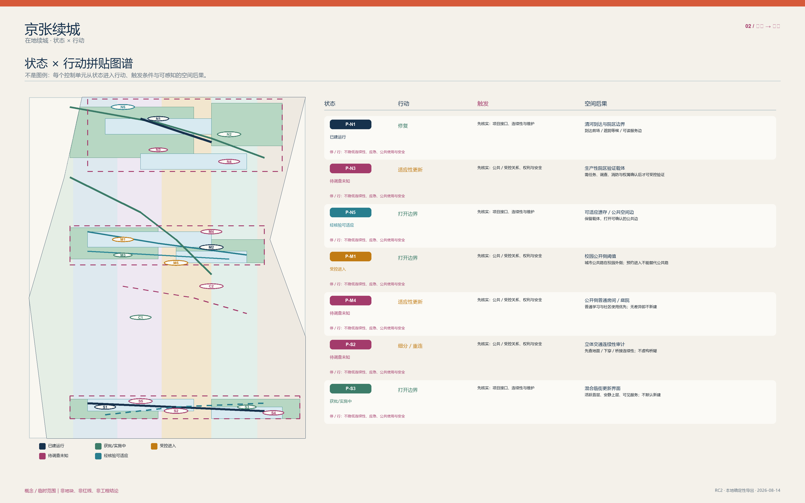
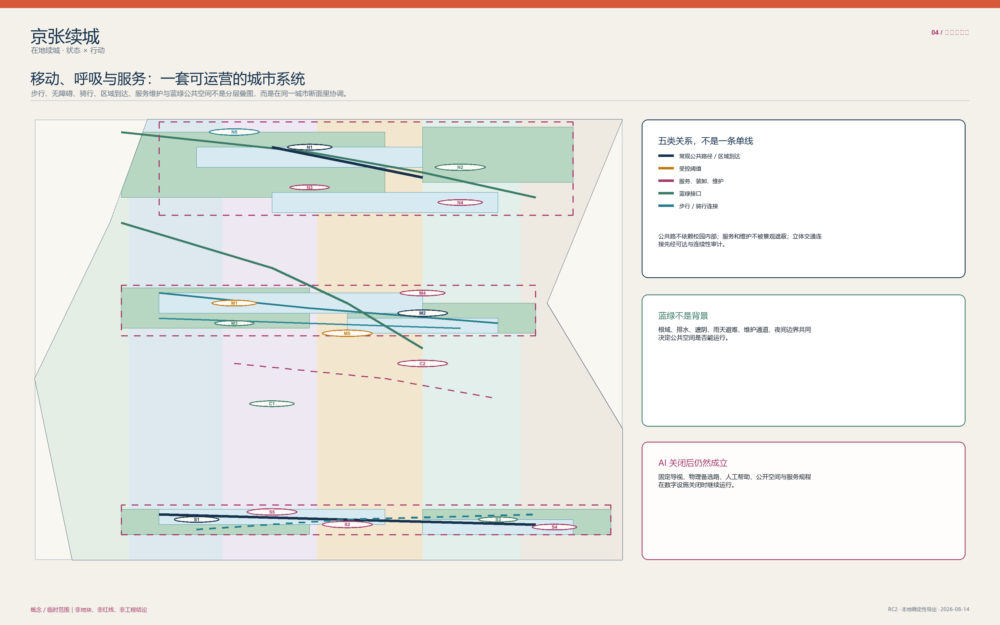
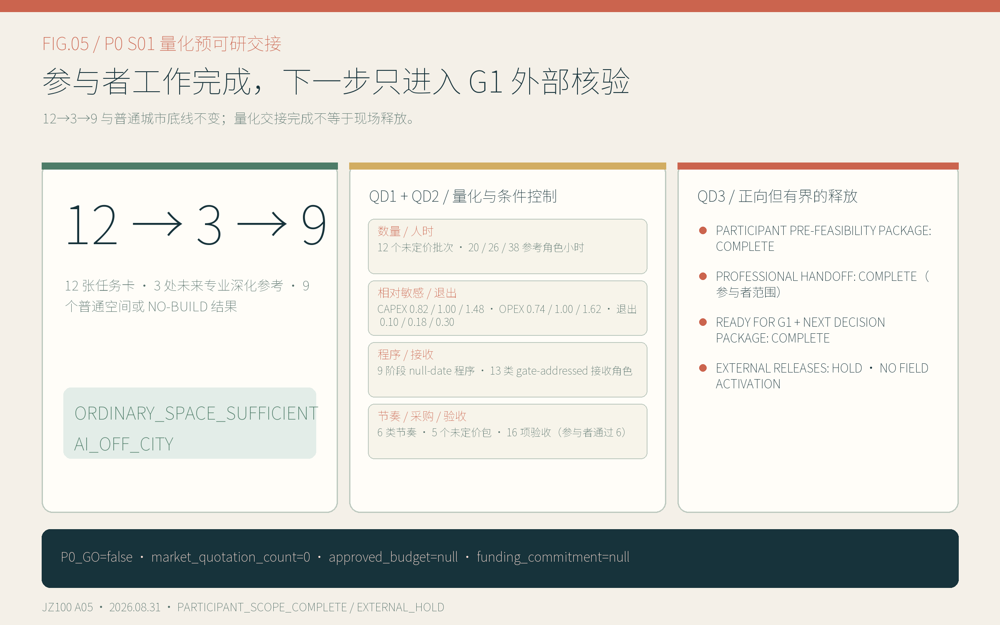

# 京张续城 / Jing-Zhang In Place

> **让未来生长，让城市相续。**

## 先看城市，再看技术

**技术属于时代，城市属于世代。** 京张续城不是用一条“智能走廊”覆盖既有生活，而是在树荫、步行、学习、服务、维护和小微日常已经完整成立的城市里，谨慎判断何时技术真的值得占用一点空间。城市不是技术的容器，而是代际生活的连续体；不是每一次技术进步，都值得城市付出永久的空间代价。

方案把这份连续体写成三种可被看见、也可被维护的关系：

- **续时**：长期的街道、绿荫、步行与公共服务不为短周期设备让位；
- **续生**：不同年龄、能力、职业和节奏的人，都保有不用 App 也能抵达、停留、询问与离开的路径；
- **续忆**：京张铁路的韧性不被复刻成符号，而被转译为一项责任——每一个例外状态都必须能被解释、停止并还给日常。

因此，空间并非同质更新：**长久城市**承载街道、树木、服务和公共记忆；**可适应城市**容纳可修补的房间、门槛和运营；**暂居智能**只在真正需要时，以最小、可撤、有人负责的方式短暂停留。众智园是“验证”而非展示，AI 原点是“共处”而非占用，大钟寺是“裁决”而非自动化。`STATUS × ACTION` 留在底层作为审慎的判断骨架，而不是城市形象本身。

### 三条人本阅读路线

| 路线 | 先看什么 | 读完会知道什么 |
| :--- | :--- | :--- |
| **30 秒：一座可相续的城市** | 封面、三种连续、三层时间、三处重点区 | 城市为何先于技术，普通生活如何保持完整 |
| **3 分钟：一个谨慎的空间决定** | FIG.03 重点区、P0 参考、FIG.05 证据图 | 为什么只有一项 S01 被推至 P0，空间如何停下并回到日常 |
| **15 分钟：一条可复核的责任链** | 全文、结构化资料、假设/来源/矩阵 | 哪些内容由参与者提出，哪些仍须专业、权利人和现场确认 |

> **本次实施交接｜PARTICIPANT WORK COMPLETE → READY FOR G1 EXTERNAL VERIFICATION → EXTERNAL RELEASES HOLD → NO FIELD ACTIVATION。** 参与者已完成未定价数量、角色小时、相对成本/运维敏感性、退出准备、条件程序和分层验收；它只打开下一步外部核验，不打开采购或现场。`P0_GO=false`，真实权利、任命、工程、现场、预算/资金、批准与任务授权仍为 HOLD/null。[data:visual/assets/implementation-readiness-dossier.json#participant_release_semantics]

### 方法底座：只在城市许可时使用

> **一句话主张**：京张不是等待 AI 填满的空白线，而是一座状态、权限与断面不等的既有城市。方案以 `STATUS × ACTION` 先行界定空间底线，坚持 `AI_OFF_CITY`（在无智能层介入时，普通公共街道、混合生活、无障碍路径与人工服务 100% 完整成立），在 12 项城市任务中严格执行“普通空间充分性检验”，仅对物理验证不足、受控协作不足、合规评审不足的 S01、S04、S07 三项准入为深度空间包，其余 9 项均为 NO-BUILD 或普通载体，且所有准入空间均具备严格的 TTL、人工绝对权威与一键物理复位机制。[data:visual/assets/ai-spatial-admission.json#admission_chain]

---

## 任务书六项交付：从索引到城市叙事

这不是附在方案末尾的合规清单。六项任务均被放进同一条可读、可退、可复核的城市叙事：先让普通城市工作，再决定是否需要 AI；先分清事实、规则与未知，再谈最小空间差异。下图给出 6 项任务、12 张场景卡、3 个深度验证、6 类人物、5 个案例与 3 处地标的阅读入口。[data:visual/assets/taskbook-closure.json#reviewer_route]

### 任务一：一带总体概念与功能统筹

**京张续城 / Jing-Zhang In Place** 是主名称；Logo 方向是两条原创的“铁路缝线 + 可开启复位门”，不使用第三方商标，且与逐点导视严格分开。三大定位是“百年京张文化带、都市 AI 生活体验带、AI 融合创新带”；五大功能是“AI 全栈自主创新体系、世界级 AI 创新生态、AI+ 场景赋能新范式、智能化 AI 活力城市、AI 治理全球话语权”。[source:AGENT-TASKBOOK]

三区两翼不是五个开发项目：众智园对应受控物理验证，AI 原点对应公开侧的可撤协作，大钟寺对应有人工的采用/合规界面；中关村科技服务翼只提出专业服务转介，小月河场景赋能翼只提出可申诉的维护与公共体验反馈。五者以“问题进入—普通空间充分性—深度准入或 NO-BUILD—公共反馈—复位”的回路协同。总体结构是既有城市的多点缝合而非单一形象轴。[data:visual/assets/taskbook-closure.json#reviewer_route]

#### 条件区域协同：任务—接口—证据—反馈

五个区域关系不再停留在研究清单，而是统一进入“候选任务 → 建议接口 → 证据请求/交换 → 反馈回京张 → 激活条件”的条件回路。任何节点缺少授权联系人、合法/清权证据、人工责任或退出条件时，回路不激活，京张保持普通城市或 NO-BUILD；这是一套原创的任务接口设计，不是合作事实。[data:visual/assets/taskbook-closure.json#conditional_regional_interfaces]

**共同现状与边界（逐行适用）**：**UNCONTACTED / UNCONFIRMED**；**NO PARTNERSHIP CLAIM**；**NO RESOURCE COMMITMENT**；**NO OPERATOR COMMITMENT**；**NO GOVERNMENT COMMITMENT**。

| 关系节点 | 候选任务 | 建议接口 | 请求/交换证据 | 返回京张 | 激活条件 | 当前状态与不承诺边界 |
| :--- | :--- | :--- | :--- | :--- | :--- | :--- |
| **北纬社区** | S06 / S11：日常服务与宁静边界 | 普通城市问题单 + 人工交接桌 | 居民定义的问题、无障碍与非数字兜底、同意和参与代表性 | 公共利益底线；普通空间充分或 NO-BUILD 判定 | 经授权社区联系人、可申诉参与规则、非采集基线均确认 | UNCONTACTED / UNCONFIRMED；上述四项不承诺边界逐项适用 |
| **未来科学城** | S04：多模态协作交接 | 可撤会话证据包接口 | 有界任务、数据权利、进入条件、人工管理人与复位要求 | 准入矩阵；可复用交接格式；不满足项清单 | 经授权对口方、有界任务、合法/清权数据和人工管理人均到位 | UNCONTACTED / UNCONFIRMED；上述四项不承诺边界逐项适用 |
| **怀柔科学城** | S01：真实物理任务验证 | 物理任务—安全—复位问题包，不转移设备 | 任务包络、场地/进入许可、运营与安全责任、失败和复位计划 | 最小可撤差异，或普通载体 / NO-BUILD 结论 | 真实任务、经授权载体、运营/安全责任人和受监督排演均确认 | UNCONTACTED / UNCONFIRMED；上述四项不承诺边界逐项适用 |
| **经开区** | S07：采用与合规复核 | 有人值守的复核/申诉协议交接 | 受影响使用者、复核标准、纸质兜底、争议和停止路径 | 采用证据板；停止/复位规则；缺失权利清单 | 经授权用例、人工复核/申诉路径和非数字服务均成立 | UNCONTACTED / UNCONFIRMED；上述四项不承诺边界逐项适用 |
| **京津冀** | S12：证据状态与版本变更 | 跨域证据信封 + 适用性差异表 | 来源、版本、适用辖域、合法交换依据、人工权威与回滚条件 | 本地适用 / 不兼容 / 缺证项清单，回写 STATUS × ACTION | 公开或清权任务书、经授权交换路径及各地人工权威均确认 | UNCONTACTED / UNCONFIRMED；上述四项不承诺边界逐项适用 |

综合规划创新不是替代国土空间规划：`STATUS × ACTION` 先判断既有载体可做什么，AI Spatial Admission 再判断该动作是否配得上最小、可撤的专业空间差异；缺少事实、权利或公共利益条件即回到普通空间或 NO-BUILD。[data:visual/assets/taskbook-closure.json#core_grammar]

### 任务二：生态系统不是招商承诺

生态图谱由“任务需求—普通载体—人类复核—证据/权利门—可撤交付—公共解释/复位”组成；土地/空间、产业、资金、人才、算力、数据与场景均只以门槛和机制表达。众智园是 S01 的条件性验证类型，AI 原点是 S04 的条件性公开侧协作类型，科技服务翼是 S07 之前的专业服务转介类型；它们不构成已获得的载体、算力、数据、企业名单或资金。[data:visual/assets/taskbook-closure.json#claim_qualifications]

| 全球案例 | 观察到的机制 | 不可移植内容 | 京张可概念性检验 |
| :--- | :--- | :--- | :--- |
| Seoul AI Hub | 人才—企业—社区的运营生态 | 不推断本地合作、场地或计划 | 学习、验证与公共说明之间的人工转介 |
| Vector Institute | 有责任的研究到产业转译 | 不推断机构、人才或资金 | S07 的证据、申诉与人工交接 |
| Mila | 开放科学与社区交流边界 | 不推断附属关系或活动 | S05 的有主持模型素养说明 |
| Singapore PlatformAI | 共享服务的边界与版本治理 | 不推断本地算力、数据或服务 | S12 的来源/版本先于开放 |
| Digital Catapult | 测试—示范—采用的阶段路径 | 不推断采购、运营或效果 | S01/S04/S07 可独立停止的概念测试 |

五例均为公开方法背景，不能支持京张的投资、企业、运营、审批或实施事实。[source:BENCHMARK-SEOUL-AI-HUB] [source:BENCHMARK-DIGITAL-CATAPULT]

### 任务三：十二张场景卡、六类人物与小月河体验路径

12 张卡严格对应 12 项既有任务，绝不另造“智慧城市”清单。S01/S04/S07 是三项深度验证；其余九项明确给出普通空间充分或 NO-BUILD。六类人物不是营销角色：他们检验日常商业、学习、开发、无障碍、文化访问与维护安全能否在 AI 关闭时继续成立。小月河体验路径是“雨后人工巡查—可申诉维护反馈—无数据采集的实体解释—回到普通绿廊”，进入、生态与运维条件未确认即暂停。[data:visual/assets/taskbook-closure.json#personas]

完整卡片、三项验证指标和人物—场景映射见“任务三：十二张场景卡”；机器可读的同一原始资料保留全部字段，便于专业团队复核而不取代正文阅读。[data:visual/assets/taskbook-closure.json#scenario_cards]

### 任务四：公共空间与三处可撤朝圣地标

京张遗址公园的 AI 公共空间响应是可读、可维护、AI 关闭后仍完整的遗产公园序列：实体解释、雨天停留、人工维护反馈和无障碍替代。东西向优先地面步行缝合，南北向先审计站城—地面—公共空间连续性；不把桥、隧道、地下空间或交通工程说成可行。大钟寺的智能原生消费/商务场景是 S07 的有人工证据和申诉界面，保护日常服务、可达与小微经营连续性，不预设租户、客流、产权或改造。[data:visual/assets/taskbook-closure.json#public_space_and_culture]

三处地标均是运营上 AI-native、物理上最小的可撤构件：**复位门 / Reset Frame** 在众智园提示 S01 的状态与复位；**交接台 / Handover Table** 在 AI 原点让人看见同意、说明与退出；**申诉台 / Right-to-Appeal Desk** 在大钟寺保留人的咨询、纸质替代和争议入口。可撤证据荣誉轨只展示经同意的公共贡献、方法、来源、复核日期与到期/复位状态，禁止生物特征排名、未经证实成就与永久明星化。组件库包括 STATUS 砖、AI-OFF 标记、无障碍实体导向、同意/申诉卡、可撤边界杆与签名复位票。[data:visual/assets/taskbook-closure.json#landmarks]

### 任务五：文化不是 AI 装饰

本方案的文化转译是参与者撰写的概念类比，不是对铁路精确工程、运营制度或当前空间条件的事实主张：变向线形被转译为“以准入换韧性”，道口被转译为“先保证地面连续”，交接被转译为“停止、签收、退出与复位”。中关村创新文化与 AI 新文化因此不是炫技图像，而是可测试、可争议、可退回普通城市的公共过程。导视使用“地点 + STATUS + 允许 ACTION + 人工帮助 + 停止/复位”的双语规则；它与总体 Logo 分工，前者回答当下怎么走、能做什么，后者表达整条带的身份。国际传播语为：**“一座赢得每一次例外状态、也能把它还给日常的城市。”**[data:visual/assets/taskbook-closure.json#public_space_and_culture]

### 任务六：可停止的年度运营循环

年度活动不是已定日程：概念顺序为公开问题与现场/证据核验、开发者在普通载体或 NO-BUILD 中排演、S01/S04/S07 在满足准入后才进行受监督会话、公共证据周与独立复核、归档/到期和完全复位。活动识别可用“证据周、复位票、普通城市开放室”；开发者社区把任务提交到公共利益和充分性检验，未通过者保留普通空间结果。地标与荣誉展示在证据、同意或管理人到期时撤除。资金仅列公共利益更新、研究/测试合作、运营者贡献、公益文化支持和适当商业收入等**机制选项**，没有承诺资金、金额或采购。[data:visual/assets/taskbook-closure.json#operation_cycle]

### 主张限定：把暂停画在看得见的位置

| 可能被误读的主张 | 本方案的可见分类 | 现在能说什么 | 触发后才可更新 |
| :--- | :--- | :--- | :--- |
| 范围、面积与比例 | **GEOMETRY_DERIVED_PROVISIONAL** | 投稿几何可复算的概念一致性值 | 官方 SITE_BOUNDARY/KEY_AREA 到位后整体复算 |
| 法定主体、运营者与停止权 | **UNKNOWN** / **DESIGN_RULE** | 法定/来源支持的事实与建议角色类型分开 | 权利人、运营方和专业/法定责任确认 |
| 资金与分期 | **CONCEPT_PROPOSAL** | 条件性机制选项与证据门 | 授权预算路径与协议 |
| 校园、站区、企业及遗产空间进入 | **PAUSE_UNTIL_OFFICIAL_DATA** | 普通城市路径和概念类型 | 当前调查与所有者/运营方书面同意 |
| 工程、容量、试点和现场表现 | **CONCEPT_PROPOSAL** | 离线概念与复位演练 | 专业调查、容量/安全审查、授权与受监督排演 |

三项 formal 视觉指标仍由投稿者提供的临时几何计算，保留来源、公式和官方数据到位后的复算触发；它们绝不是法定红线、测量成果或工程量。[metric:site_area_sqm] [metric:green_ratio] [metric:public_space_ratio]

---

## 文化转译与空间类比：线形、道口与交接

以下三项是参与者的文化转译，不是关于铁路精确历史工程、运营制度或当前空间条件的事实主张：
1. **变向线形（概念类比）**：一条会变向的铁路线形被转译为**“以准入换韧性”**——当技术不确定性仍在时，不盲目追求全线铺设 AI 设施，而以空间分级与可逆准入回应。
2. **道口缝合（概念类比）**：道口被转译为**“先保证地面连续”**。因此，方案把连续地面步行与独立无障碍流线放在任何技术装置之前。
3. **交接责任（概念规则）**：交接被转译为**“停止、签收、退出与复位”**。方案建立“S0 普通城市 → S1 准入专业状态 → S2 退出复位”的交接链，使每一处建议的技术例外都有未来可追责的交接与退出记录。

---

## 设计依据与资料清单

任务边界以公告、任务书、允许设计空间、标准与来源登记为主控输入。所有定位性事实均被限制在来源支持的时空尺度；国际案例只提供方法启发，不支持京张的项目、合作或空间事实。[source:OFFICIAL-ANNOUNCEMENT] [source:AGENT-TASKBOOK] [source:SOURCE-REGISTRY] 临时总体边界和三处重点区只服务概念、拓扑与表达，不能解释为红线、地块、权属或审批范围。[source:BOUNDARY-SOURCE] [depth:existing_conditions_diagnosis]

> **如何读此图（FIG.01 京张空间判断 + 条件区域接口）**：
> 1. **只在技术有效处读比例**：11.4 km² 总体层和三处重点区来自投稿坐标几何，图上给出北向、0–1 km 比例尺、制图 CRS `EPSG:4548` 与 2026-08-30 数据状态；43.6 km² 统筹层只有来源支持的关系尺度，没有可用坐标，因此不画成可量测范围；
> 2. **先读临时警示**：总体边界和三处重点区均为 `GEOMETRY_DERIVED_PROVISIONAL`，不是官方红线、地块、权属、审批或测量成果；
> 3. **比较三处空间判断**：众智园处理“水岸—受控载体—区域到达”，AI 原点处理“校园公开侧—普通学习—逐次授权”，大钟寺处理“站城地面连续—骑行/装卸—日常商业”；这些断面均标为 `NTS / NOT TO SCALE / CONCEPT TYPOLOGY`；
> 4. **沿五行接口回到京张**：北纬社区、未来科学城、怀柔科学城、经开区、京津冀只通过候选任务和证据门返回 STATUS × ACTION；未满足激活条件即不产生空间、资源或运营动作；
> 5. **按六类证据状态复核**：图面仅使用 `SOURCE_BACKED`、`GEOMETRY_DERIVED_PROVISIONAL`、`DESIGN_RULE`、`DESIGN_ASSUMPTION`、`INDICATIVE`、`UNKNOWN`，不以视觉精度替代现场或法定证据。

---

## 三层范围工作框架

43.6 平方公里回答产业—人才—公共服务的协同问题；11.4 平方公里用状态、行动、连接和公共空间组织城市设计；三处重点区分别承担不同断面与运营问题。三层并非同一轴线的缩放，而是由证据颗粒度、责任关系和可行动作决定。[source:OFFICIAL-ANNOUNCEMENT] [metric:site_area_sqm] [metric:key_area_count] 该范围框架以可追溯层级检验。[depth:three_level_scope_framework] 官方图形到位后，所有几何、指标、图件和行动界面必须一起复算。为避免尺度误读，统筹层仅陈述资产/接口关系，总体层仅陈述临时拓扑，重点层仅陈述类型学断面；三层之间的任何量化迁移均须回到官方边界和现场调查。

---

## 统筹研究范围产业与未来城市研究

统筹范围识别研究/教育受控边界、现有创新载体、企业—专业服务接口、区域门户、河园遗产和日常社区六类资产。它们通过公共侧房间、经核验的既有载体、普通混合街区与维护可达性形成多入口生态，而非假定企业迁移、园区合并或校园开放。[source:AI-ORIGIN] [source:QINGHE-HUB] [depth:overall_spatial_structure] 参照 Seoul AI Hub、Vector、Mila、Singapore PlatformAI 与 Digital Catapult 的制度/测试方法，提取的是“责任、服务、验证与退出”机制，而不是复制建筑。[source:BENCHMARK-SEOUL-AI-HUB] [source:BENCHMARK-DIGITAL-CATAPULT]

---

## 总体设计范围城市更新与控规深度城市设计

总体结构为 STATUS × ACTION：已建运行、获批/实施中、受控进入、待调查未知、经核验可适应五种状态，分别进入保留、修复、开放边缘、细分/重连和适应性改造/填补。每个 patch 记录来源、限制、用户、触发、断面、交通、服务、蓝绿、责任、停止和退出；替换不在默认行动表。[data:visual/assets/status-action-register.json#P-N1] [metric:status_action_patch_count] [depth:land_use_layout] 强度和高度使用街道围合、首层通透、阈值深度与服务边规则，数值控制仍待官方确认。[standard:MOHURD-CONTROL-DETAILED-PLANNING] [depth:development_intensity_controls] [depth:height_massing_character]

AI 空间准入不是第二条城市骨架：它只是已经允许的行动内部的一次任务判断。普通路径、普通房间、维护和人工服务先成立；若普通空间充分、证据或权利不够、或没有合格的人工责任，结果就是普通载体、可撤普通工具或 NO BUILD，而非为 AI 预留建设。[data:visual/assets/ai-spatial-admission.json#city_framework]

> **如何读此图（FIG.02 用地、行动与城市织补结构）**：
> 1. **看 5×5 状态行动映射**：确认 17 个 Patch 的现状状态与受限行动分配，拒绝无差别大拆大建；
> 2. **看公共底线**：绿色开敞与混合服务界面完整连续，不因技术实验阻断日常公共通行；
> 3. **核验拓扑无缝**：概念用地完整剖分，无重叠、无空隙，面积由 GeoJSON 在 EPSG:4548 严格复算。

| 状态 | 行动判断 | 不可越过的边界 |
| :--- | :--- | :--- |
| **已建运行** | 保留或修复已证缺陷 | 不把开放状态外推到相邻载体 |
| **获批/实施中** | 先协调接口、再补缺 | 不把实施进度写成全线开放 |
| **受控进入** | 公共侧优先、预约/项目访问分开 | 不依赖校园内部形成公共路 |
| **待调查未知** | 只调查、可逆测试或 NO BUILD | 不诊断产权、建筑状况和工程能力 |
| **经核验可适应** | 在专业/权利门通过后改造 | 不把原型当作既有建筑结论 |

---

## 重点区域详细设计

众智园以水—受控院区边—区域到达的关系作为概念问题：真实物理验证只可能发生在未来经调查、经同意的载体内，公共河园、服务复位和受控测试必须分开。AI 原点以校园公开侧阈值为概念问题：公共城市路不以校园内部为当然通道，普通学习/社区使用优先，临时受控状态须逐次授权。大钟寺以站城地面连续、骑行、装卸和日常商业为待调查问题：临时矩形不是站口、地块或产权方案。三处共同构成详细城市设计的概念响应，而不共享一种院落、门厅或 AI 房间模板。[source:QINGHE-HUB] [source:CAMPUS-ACCESS] [source:GRADE-SEPARATION]

详细设计的类型学边界见下一专业深化层，不共享一种院落、门厅或 AI 房间模板。[depth:three_key_area_detailed_design]

### 大钟寺立体站城四象限概念设计组织与空间衔接（Four-Quadrant Design Organization）
临时几何与上下文站城关系存在偏移，因此四象限只是**等待数据的概念设计组织**，不能锚定为站口、保护边界、过街设施或法定空间：
- **东北问题场**：文化/生态界面是否能在不伤害遗产、根域、排水、安静与维护的前提下提供低干扰公共解释？未调查前保持普通公共空间。
- **西北问题场**：高校边、道路和公共步行的连续性由谁负责、何时开放、是否无障碍？缺少通行与运营确认即不新增连接。
- **西南问题场**：公交、骑行、装卸、夜间安静与日常小微商业是否冲突？先做时间化观察与使用者协作，不重画道路或商业单元。
- **东南问题场**：站城、绿廊和公共服务是否存在可读的地面连续？先采用实体导向与人工帮助；桥、下穿、换乘或服务设施均为 `CONCEPTUAL_INTERFACE`，须 `PROFESSIONAL_DEEPENING_REQUIRED`。

三处界面均为 `S0 普通城市 → S1 准入专业状态 → S2 退出/复位` 的无尺度类型学，不主张地块、尺寸、站口、权属、工程或法定控制。众智园仅在已确认条件下考虑载体内可撤验证，并在撤设备后恢复普通培训/工作；AI 原点仅在逐次授权时考虑可撤分区和人工交接，并在清空后恢复普通使用；大钟寺仅在隐私、申诉、纸质兜底和人员复核条件确认时考虑临时复核状态，并在停止后回到普通专业/社区服务。[data:visual/assets/taskbook-closure.json#validation_scenarios]

### P0｜众智园：把“验证”收进一条可退的责任链

S01 是唯一进入 P0 的空间参考；它不是已选场地、已批准试点或施工方案，而是一张帮助专业团队判断“是否根本不该做”的最小条件图。它只在一个 **12 m × 9 m、零坐标的 `DESIGN_ASSUMPTION` 概念包络** 内讨论：并非测量尺寸、净空、疏散、荷载、锚固、电力或审批主张。[data:visual/assets/p0-s01-reference.json#scope]

**WHY → SPACE → PEOPLE → COMPONENTS → CAPACITY。** 当真实、有界且有人负责的物理任务确实无法由仿真、审查或普通房间替代时，才讨论一个不抢占公共路线的可撤测试边。Z0 保持普通路线，Z1 由人工交接，Z2 才是可撤测试，Z3 分开操作与安全权威，Z4 为预约观察，Z5 留给维护/复位，Z6 是尚待专业判断的缓冲。会话概念上只有 **1 项活动任务/设备、5 个角色位、4 个预约观察位、总上限 9**；Z0 不设等候队列，任何经观察或批准的实际容量均为 `null`。[data:visual/assets/p0-s01-reference.json#zone_logic] [data:visual/assets/p0-s01-reference.json#capacity]

五类角色不是任命：测试操作人、与操作人分离的人类安全权威、公共/服务交接人、维护/复位人、独立观察/复核人。八类可撤构件被拆成 **12 个未定价参与者参考批次**，覆盖门/周界、表面与接口、双重实体停止、角色台与交接、库存/运输、专业复核和退出恢复；每项都有单位、低/参考/高数量、依赖、验收门和排除边界，但没有产品、供应商、现场数量或报价。[data:visual/assets/p0-s01-reference.json#components] [data:visual/assets/implementation-readiness-dossier.json#unpriced_quantity_schedule]

**OPERATION → STOP → RESET → MAINTENANCE。** 运行顺序固定为：外部门预开 → 普通基线核验 → 安装/检查 → 条件激活与停止排演 → 一项受控任务 → 失效即关闭 → 人工隔离/接管 → 移除 → 恢复 → 独立普通基线核验。没有复位时长主张；任何问题先进入 `QUARANTINED`，直至独立复位与普通基线被再次确认。[data:visual/assets/p0-s01-reference.json#operation_chain] [data:visual/assets/p0-s01-reference.json#stop_reset_maintenance]

**COST → ALTERNATIVES → HOLD。** 单次参考投入是低/参考/高 **20/26/38 角色小时**；CAPEX 相对指数为 **0.82/1.00/1.48**，OPEX 为 **0.74/1.00/1.62**，未注资退出准备指数为 **0.10/0.18/0.30**。这些都是 `RELATIVE_SENSITIVITY`，不是人民币预算；当前 `market_quotation_count=0`、`approved_budget=null`、`funding_commitment=null`。四个候选仍依次是 NO-BUILD、低技术可撤布置、选定 P0、线性侧湾；11 项外部条件全部为 `HOLD_EXTERNAL`，所以 `P0_GO=false`。[data:visual/assets/implementation-readiness-dossier.json#staffing_role_hour_reference] [data:visual/assets/implementation-readiness-dossier.json#relative_capex_opex_sensitivity] [data:visual/assets/p0-s01-reference.json#external_hold_gates]

这张参考把参与者已完成的 9 阶段 null-date 依赖程序和 16 项验收台账，与仍需专业团队、现场和授权证明的项目分开记录；6 项参与者检查已通过，其他 10 项仍为 `HOLD_EXTERNAL`。它同时与 PRJ-06 的“一个可撤验证试点”保持受限交叉引用，而不把交接完成变成现场承诺。[data:visual/assets/p0-s01-reference.json#acceptance_and_handoff] [data:visual/assets/implementation-readiness-dossier.json#measurable_layered_acceptance_ledger] [data:visual/assets/renewal-project-portfolio.json#PRJ-06]

> **如何读此图（FIG.03 三处重点区与差异化断面）**：
> 1. **对比三种断面**：北段水岸到达、中段高校公开阈值、南段立体站城，三处断面机制完全异构；
> 2. **核验 S0–S1–S2 循环**：观察每个重点区从普通城市（S0）到受控准入（S1）再到物理复位（S2）的完整演化；
> 3. **确认非工程属性**：图纸为无尺度类型学原型表达，不冒充法定施工图；每处完整的“普通底盘—准入门—空间差异—人工权威—退出复位”契约在 FIG.05 并排核验。

---

## AI 创新生态、人才画像与 AI+ 场景

### 任务三：十二张场景卡、三项行业验证与六类人物

AI-off 时，公共路径、混合城市、蓝绿、普通房间、人工服务和维护全部成立。每张卡都遵守同一短合同：**人物/需求｜当前普通基线｜AI 能力｜普通空间是否充分｜最小差异｜运营与人工权威｜隐私/失败｜停止/复位｜证据状态｜区域关系｜任务书映射**。这让 12 项任务成为城市判断，而不是 12 个建设理由。[data:visual/assets/taskbook-closure.json#scenario_cards]

| 人物 | 所检验的公共利益 | 覆盖场景 | AI 关闭后的底线 |
| :--- | :--- | :--- | :--- |
| P01 长期居民与沿街小微商户 | 步行、交易、安静回家、人工服务不被展示状态替代 | S06/S07/S10/S11 | 实体导向、人工柜台、普通街道 |
| P02 学生与青年研究者 | 普通学习空间不能被受控项目房侵占 | S01/S04/S05 | 普通房间、纸质预约、人工交接 |
| P03 AI 开发者与独立研究者 | 专项空间前必须有真实任务和责任复核 | S01/S02/S03/S04 | 仿真、代码复核、普通会议室 |
| P04 老年人和行动/感官障碍使用者 | 无障碍连续与人工陪行优先于数字推荐 | S06/S08/S10 | 盲道、实体导向、人工帮助 |
| P05 访客与文化旅行者 | 不用 App 或受控物业也可读懂文化 | S05/S09/S11 | 双语实体解释、普通公共空间 |
| P06 公共服务、维护与安全人员 | 服务、停止权与手工工单不能被自动化遮蔽 | S01/S07/S09/S11/S12 | 人工巡查、纸质日志、实体复位 |

#### S01｜具身 AI 物理验证（深度验证）

- **人物/基线/能力/需求**：P02/P03/P06；规划、代码复核和仿真在普通房间完成；AI 只服务有边界的实体模型/设备观察；真实任务需要避免把风险转移到公共空间。
- **充分性与最小差异**：`ORDINARY_SPACE_SUFFICIENT=false`，因为真实、受监督的实体测试需要仿真不能提供的安全与复位边；仅在核验任务、载体权利、合格操作人、安全包络和公共通行后，才可加入可撤边界杆、观察边与快插测试包。
- **运营/人权威/风险**：限时、有人监督；合格操作人可提议，核验的载体管理人可运行，安全负责人可停止；仅最小授权记录，禁止人脸识别、公共监控与未经同意的个人数据。
- **失败/停止/复位/状态**：不安全、授权过期或公共路径冲突即急停、撤设备、回到普通培训/工作；众智园北部**类型**载体，非具体地块；`CONCEPT_PROPOSAL`，需授权、调查和专业安全确认；映射 agent.2/agent.3。

#### S02｜环境鲁棒性排演（普通空间充分）

- **人物/基线/能力/需求**：P03/P06；软件在环排演加人工现场检查；AI 只提出与人员核验的对照；开发/维护人员需在公开表述前发现失配。
- **充分性与最小差异**：`ORDINARY_SPACE_SUFFICIENT=true`；`NO-BUILD`，现有工作会话和人工检查足够，不占用街道。
- **运营/人权威/风险**：计划性桌面排演，合格复核人接受或否决；使用最小化、非个人任务记录。
- **失败/停止/复位/状态**：载体未核验、环境伤害或公共干扰即撤回输出并保留普通维护；众智园北部类型区域；`CONCEPT_PROPOSAL`，不主张现场部署；映射 agent.2/agent.3。

#### S03｜人工安全与证据复核（普通空间充分）

- **人物/基线/能力/需求**：P03/P06；专业桌面审查在普通会议室进行；AI 只能整理证据包；复核人需要可拒绝不支持主张的路径。
- **充分性与最小差异**：`ORDINARY_SPACE_SUFFICIENT=true`；`NO-BUILD`，普通房间和档案实践足够。
- **运营/人权威/风险**：版本化会议；独立合格复核人可以停止或退回；不接收私密运营或个人数据。
- **失败/停止/复位/状态**：证据过期、不全或无来源即归档/删除不支持的包并恢复会议；北部运营支持，不涉空间干预；`DESIGN_RULE`，不是法定审批；映射 agent.2/agent.3/agent.6。

#### S04｜多模态协作交接（深度验证）

- **人物/基线/能力/需求**：P02/P03/P04；多数学习/协作在普通房间；AI 是受控、限时多模态会话；参与者需在公开学习与受同意项目之间看见交接。
- **充分性与最小差异**：`ORDINARY_SPACE_SUFFICIENT=false`；普通自习室无法在不损害公共底线时区分授权、声学受控的交接；仅在公开侧载体、开放协议、数据边界、无障碍检查、管理人与复位排演齐备后，加入可撤吸音屏、会话标记和可撤材料。
- **运营/人权威/风险**：预约且有管理人；载体管理人运行、无障碍代表可提出异议、安全负责人可停止；材料受同意约束，公开学习区不做环境采集。
- **失败/停止/复位/状态**：通道受阻、同意失效、管理人缺席或无障碍冲突即清材料、收屏、恢复普通公共学习；AI 原点中部公开侧**类型**门槛，不主张校园进入；`CONCEPT_PROPOSAL`；映射 agent.2/agent.3/agent.4。

#### S05｜开放 AI 素养与模型说明（普通空间充分）

- **人物/基线/能力/需求**：P02/P04/P05；社区活动室、纸质材料和主持人；AI 只在有界演示/解释中出现；公众需要先理解用途、限制和申诉路径。
- **充分性与最小差异**：`ORDINARY_SPACE_SUFFICIENT=true`；`NO-BUILD`，普通活动室与便携教具足够。
- **运营/人权威/风险**：自愿、限时、有主持；主持人可暂停并撤下不支持材料；不做出席画像、不要求账号或生物数据。
- **失败/停止/复位/状态**：无主持主张、格式不可达或证据过期即结束会话、撤材料、保留普通房间；AI 原点公开侧普通房间类型；活动、主持和场地均未承诺；映射 agent.2/agent.3/agent.5/agent.6。

#### S06｜保留人工柜台的社区协同服务（普通空间充分）

- **人物/基线/能力/需求**：P01/P04/P06；有人值守的窗口和纸质指南；AI 仅作工作人员可选的摘要/转介辅助；居民需要不受数字排斥的人工服务。
- **充分性与最小差异**：`ORDINARY_SPACE_SUFFICIENT=true`；`NO-BUILD`，普通柜台与可见纸质替代保留。
- **运营/人权威/风险**：工作人员自主选择使用、纠正或停止；居民可坚持纯人工；无合法基础不使用数据，敏感材料不进演示。
- **失败/停止/复位/状态**：偏见、排斥、离线或窗口消失即立刻切换人工/纸质流程；普通社区服务类型，非特定服务点；`CONCEPT_PROPOSAL`，不主张政务部署；映射 agent.3/agent.6。

#### S07｜有人值守的采用与合规复核（深度验证）

- **人物/基线/能力/需求**：P01/P03/P06；普通桌面处理业务、法律或公共服务转介；AI 只组织限时证据、申诉与复核；受影响者和小微经营者需要在任何采用主张前看见人的争议路径。
- **充分性与最小差异**：`ORDINARY_SPACE_SUFFICIENT=false`；普通桌面无法同时安全呈现排队隐私、申诉、证据版本和人员复核；仅在核验载体、隐私流线、复核人、申诉路径、纸质兜底、协议与排演后，设置可撤隐私屏、人工申诉台和证据状态板。
- **运营/人权威/风险**：仅有人值守会话，可转介或否决，绝不自动批准；合格复核人可停止，受影响人可争议，载体管理人控制开放；最小案件记录，不公开个人信息。
- **失败/停止/复位/状态**：证据过期、复核人缺席、隐私泄露或纸质兜底缺失即停受理、回到普通转介桌、撤屏并按规则归档/删除；大钟寺站城服务界面**类型**，非地铁区或商铺租约主张；`CONCEPT_PROPOSAL`；映射 agent.2/agent.3/agent.4/agent.6。

#### S08｜无障碍换乘辅助（普通空间充分）

- **人物/基线/能力/需求**：P04/P05/P06；盲道、固定导视、人工引导和无障碍审计；AI 只在路径已独立核验后作可选状态说明；旅客需要不依赖手机的可靠路线。
- **充分性与最小差异**：`ORDINARY_SPACE_SUFFICIENT=true`；`NO-BUILD`，实体导向和人工优先。
- **运营/人权威/风险**：值班人员确认设施状态后才发布消息；不需要定位追踪或个体化导航。
- **失败/停止/复位/状态**：路线未核验、绕行不可达或信息过期即撤消息，保留实体标识和人工陪行；大钟寺连续性概念，待运营方/通行确认；`PAUSE_UNTIL_OFFICIAL_DATA`；映射 agent.3/agent.4。

#### S09｜雨后绿廊维护复核（普通空间充分）

- **人物/基线/能力/需求**：P05/P06；人工巡查、维护工单、临时安全标记；AI 只在人员观察后作优先提示；公园使用者需要安全维护且不受监控。
- **充分性与最小差异**：`ORDINARY_SPACE_SUFFICIENT=true`；`NO-BUILD`，普通维护和可撤标记足够。
- **运营/人权威/风险**：人员现场确认后行动，维护负责人可接受、纠正或拒绝提示；不监测个人，仅记录状态。
- **失败/停止/复位/状态**：无现场确认、生态伤害或维护通道受阻即撤标记、保留人工工单；京张遗址公园公共空间响应类型，不主张已调查生态；`CONCEPT_PROPOSAL`；映射 agent.3/agent.4/agent.5。

#### S10｜带实体兜底的设施状态提示（普通空间充分）

- **人物/基线/能力/需求**：P01/P04/P05；固定决策点标识与实体替代路；AI 仅解释已核验、短时有效的状态；公众需要不假定手机可用的清晰选择。
- **充分性与最小差异**：`ORDINARY_SPACE_SUFFICIENT=true`；`NO-BUILD`，实体指示是主服务。
- **运营/人权威/风险**：仅发布运营方确认且有时间戳的状态；不需个人数据。
- **失败/停止/复位/状态**：状态过期或未核验即撤数字消息、实体标识持续；总体公共路径类型，非设施产权主张；`PAUSE_UNTIL_OFFICIAL_DATA`；映射 agent.3/agent.4。

#### S11｜社区活动宁静边界管理（普通空间充分）

- **人物/基线/能力/需求**：P01/P04/P05/P06；人工活动管理、便携吸音屏和普通广场规则；AI 仅向管理人给出不识别个人的提示；居民和访客需兼得文化活动、安静、通行和避难。
- **充分性与最小差异**：`ORDINARY_SPACE_SUFFICIENT=true`；`NO-BUILD`，可撤活动包和普通公共空间足够。
- **运营/人权威/风险**：人工管理时间、声量与退出，安全负责人对确认阈值有停止权；不作人群画像或生物特征计数。
- **失败/停止/复位/状态**：噪声、灯光、通行或避难冲突即停止、撤包、恢复广场；遗址公园/日常城市组件类型，非年度活动承诺；`CONCEPT_PROPOSAL`；映射 agent.3/agent.4/agent.5/agent.6。

#### S12｜证据状态变更复核（普通空间充分）

- **人物/基线/能力/需求**：P03/P06；专业规划师核对来源、版本与假设；AI 仅提出复核队列；团队需要知道何时必须暂停而非静默延续主张。
- **充分性与最小差异**：`ORDINARY_SPACE_SUFFICIENT=true`；`NO-BUILD`，普通档案与复核实践足够。
- **运营/人权威/风险**：版本化人工复核并在需要时公开更正；主要复核人可暂停任何受影响主张；仅用公开/清权来源元数据。
- **失败/停止/复位/状态**：来源缺失、冲突或未审变更即暂停主张，直到正式/专业确认；全包证据运营，无实体干预；`DESIGN_RULE`，不创设法定权力；映射 agent.2/agent.3/agent.6。

### 三项行业测试/验证：只验证是否应继续深化

| 深度场景 | 测试目标与准入条件 | 界面与可测判据 | 人工权威、边界、失败/复位 | 下一专业深化依赖 |
| :--- | :--- | :--- | :--- | :--- |
| S01 | 核验可撤安全边能否容纳真实实体任务；任务、权利、操作人、安全、通行与复位排演必须齐备 | 可撤边界、观察边、快插包与实体急停；排演记录零未控通行冲突、可用人工停止和完成复位 | 安全负责人停止；禁公共监控/未授权数据；不安全或授权失效即撤包 | 载体权利、消防生命安全、结构、电力、运营审查 |
| S04 | 核验受同意交接能否与公开学习并存；开放协议、数据边界、无障碍、管理人与复位排演齐备 | 可撤吸音屏、会话标记、可撤材料；排演记录连续无障碍通行、可见交接、清材料和普通房间复位 | 管理人运行、无障碍代表可争议、安全负责人停止；不得公开区环境采集 | 进入协议、声学/消防、无障碍与数据治理审查 |
| S07 | 核验受影响者能否在不失去普通服务时看见、争议、离开采用复核；载体、隐私、复核人、申诉、纸质兜底与排演齐备 | 可撤隐私屏、人工申诉台、证据板；排演记录人工受理、可达申诉、证据更正与普通转介复位 | 合格复核人停止、受影响人争议；最小记录、无公开个人信息 | 权利人/运营协议、法务隐私、无障碍与服务流程确认 |

三项都只是 `CONCEPT_PROPOSAL`：不能称为已批准、已部署、现场验证或工程可行。九项普通空间结果同样是设计的积极输出，而不是未完成的建设任务。[data:visual/assets/taskbook-closure.json#validation_scenarios]

---

## 可实施性交付：以不确定性管理取代承诺

三个深度场景都处于 `CONCEPT_PROPOSAL`。它们的可实施性不来自一句“可建/可投/可运营”的判断，而来自把不够的证据、权利、进入、容量、数据、人员和复位条件写成不能跳过的门。九项普通空间/NO-BUILD 结果不需等待空间施工，也同样要保留人工责任和停止条件。[data:visual/assets/taskbook-closure.json#claim_qualifications]

### 参与者工作已经完成，现场释放仍是暂停门

本次投稿不含已验证、已授权的现场实施包，却已经完整交付参与者可控制的**量化预可研与专业交接包**。未来现场包仍必须在同一载体上绑定官方几何、权利/进入、真实任务、任命、工程与容量、报价、预算/资金和批准；当前每一项均为 `HOLD_EXTERNAL`。因此 S01/S04/S07 保持普通空间或暂停，但原因不再是参与者概念未完成，而是已完成的下一决策包正在等待真实 G1 外部核验。[data:visual/assets/implementation-readiness-dossier.json#participant_release_state] [data:visual/assets/taskbook-closure.json#claim_qualifications]

### 参与者就绪闭环：让交接先于行动

参与者现在交付的是一份可被未来专业团队直接核验的完整参考包，而不是现场行动承诺。它把 12 个未定价批次、20/26/38 角色小时、CAPEX/OPEX 低/参考/高相对指数、全生命周期和未注资退出准备，连接到 9 阶段且实际日期全为 `null` 的依赖程序。[metric:s01_unpriced_delivery_lot_count] [metric:s01_reference_session_role_hours] [data:visual/assets/implementation-readiness-dossier.json#conditional_dependency_programme]

- **接收人与能力。** 13 类 gate-addressed 接收角色逐项获得所需成果、核验问题和 NO-GO 规则；10 类专业/运营能力逐项区分参与者现在可查的完整性与未来必须提供的真实资质、任命和证据。
- **程序与节奏。** `DP-00` 参与者包已完成，`DP-01` 已准备接受 G1 外部核验；`DP-02` 至 `DP-08` 全部 HOLD，实际开始/完成日期全为 `null`。部署前、每次会话前后、停止/故障后和储存期有可量测记录，厂家/专业间隔仍为 `null`。[data:visual/assets/implementation-readiness-dossier.json#commissioning_inspection_maintenance_cadence]
- **采购与验收。** 五个未定价包只有在专业规格冻结、RFQ 授权和真实预算/资金存在后才能进入市场；当前报价数为 0。16 项验收中只有 6 项参与者完整性检查通过，专业、现场与外部授权一项也没有被假定通过。[data:visual/assets/implementation-readiness-dossier.json#participant_reference_procurement_path] [data:visual/assets/implementation-readiness-dossier.json#measurable_layered_acceptance_ledger]
- **正向但有界的释放。** `PARTICIPANT_PRE_FEASIBILITY_PACKAGE_COMPLETE=true`、`PROFESSIONAL_HANDOFF_COMPLETE=true`、`READY_FOR_G1_EXTERNAL_VERIFICATION=true`、`NEXT_DECISION_PACKAGE_COMPLETE=true`；同时 `EXTERNAL_RELEASES_OPEN=false`、`P0_GO=false`，权利、任命、工程、现场、预算/资金、批准和任务授权仍为 HOLD/null。[data:visual/assets/implementation-readiness-dossier.json#participant_release_semantics]

公开资料在 2026-08-31 只被重新核对为竞赛和城市更新的**语境**：它们能说明任务尺度或已发布的信息，不能证明当前载体权利、运营主体、预算、真实任务、工程条件或批准。未来 Day 1 只建立权利/路线/任务的证据请求与观察记录；Week 1 也只能在适用授权与专业审查之后，检验角色分离、停止/锁定与普通基线恢复。今日没有任何 Day 1 或 Week 1 行动发生，`P0_GO=false`。[source:OFFICIAL-ANNOUNCEMENT] [data:visual/assets/implementation-readiness-dossier.json#day_1_week_1_hold_closure_map]

### 主体、资金与就绪状态必须分开读

- **SOURCE_BACKED_KNOWN**：任务书和来源登记支持概念边界、公开资料边界与必须由人类/专业团队作最终判断的规则；它们不任命任何本地主体。[source:AGENT-TASKBOOK]
- **方案建议角色（CONCEPT_PROPOSAL）**：任务发起人、载体管理人、合格操作人、独立复核人、无障碍/社区代表、档案及复位保管人是未来可能需要的角色类型。谁可提议、谁可运行、谁可停止，必须在每次会话前由权利人、运营方与适用专业/法定程序确认。
- **UNKNOWN / PAUSE_UNTIL_OFFICIAL_DATA**：权属、审批、场地进入、开放时间、地铁/校园/企业/遗产空间的运营规则，以及工程安全、容量和现场表现均未取得。缺少任一项，场景保持普通空间或暂停。
- **FUNDING_MECHANISM_OPTIONS（CONCEPT_PROPOSAL）**：可供未来选择的公共利益更新、研究/测试合作、运营者贡献、公益文化支持和适当商业收入机制不等于预算、资助、投资人、采购或政府承诺。[data:visual/assets/taskbook-closure.json#operation_cycle]
- **READINESS**：参与者预可研包、专业交接材料与下一决策包已完成，当前为 `READY_FOR_G1_EXTERNAL_VERIFICATION`；每一场景仍是 `FIELD_DATA_REQUIRED`、`AUTHORIZATION_REQUIRED` 和 `PROFESSIONAL_DEEPENING_REQUIRED`，不能称为部署、工程可行或现场验证。[data:visual/assets/taskbook-closure.json#claim_qualifications]

### 三份可重复的深度交付合同

| 合同：在哪里 / 当前基线 | 建议动作与谁可提议/运行/停止 | 依赖与证据状态 | 验证方法；失败/停止 | 复位与下一专业步骤 |
| :--- | :--- | :--- | :--- | :--- |
| **S01 众智园类型载体**：普通培训/工作与仿真 | 在已核验载体内才可提出可撤边界、观察边和快插包；合格操作人提议、载体管理人运行、安全负责人停止 | 权利、任务、安全、通行、供电均待确认；`CONCEPT_PROPOSAL` | 排演显示零未控通行冲突、人工急停可用且复位完成；不安全/授权失效/路径冲突即停止 | 撤测试包，回到普通培训/工作；再由消防生命安全、结构、电力、运营专业深化 |
| **S04 AI 原点公开侧类型房间**：普通学习与会面 | 仅在开放、同意和无障碍条件齐备时提出可撤吸音屏、会话标记和材料；管理人运行、无障碍代表可争议、安全负责人停止 | 进入、载体、数据边界、声学/消防、管理人均待确认；`CONCEPT_PROPOSAL` | 排演显示公共无障碍通行连续、交接可读、材料清除并恢复普通房间；通道/同意/管理失败即停止 | 收屏清材料，回到普通学习；再由进入协议、声学/消防、无障碍、数据治理深化 |
| **S07 大钟寺站城服务类型界面**：普通人工转介桌 | 仅在隐私、申诉、纸质兜底和合格复核齐备时提出可撤屏、人工申诉台、证据板；复核人停止、受影响人可争议、管理人控制开放 | 权利/运营、地铁/商业进入、隐私/法务、服务流程均待确认；`CONCEPT_PROPOSAL` | 排演显示人工受理、可达申诉、证据更正、无个人信息公开和普通转介复位；隐私泄露/复核缺席/纸质兜底缺失即停止 | 撤屏、回到普通转介，按规则归档/删除；再由权利人/运营、法务隐私、无障碍、流程专业深化 |

表中的“类型载体”不指认任何具体房屋、站区、校园、企业资产或产权。时间、声学和尺寸一律不是工程指标或现场性能承诺；只有在专业方案与现场复核中，才可能形成适用的测量与许可条件。[data:visual/assets/taskbook-closure.json#validation_scenarios]

---

## 公共利益、无障碍与不驱逐：设计规则而非空头承诺

弱势群体和普通市民的可达性是方案的第一检验。以下都是 `DESIGN_RULE` 或 `DESIGN_TARGET`：它们指导未来调查、协商和专业深化，但不能替代现状、权属、运营和法定决定。[data:visual/assets/ai-spatial-admission.json#public_rights_floor]

### 1. 无障碍与非数字化公共利益规则

- **连续性规则**：任何可选数字界面不得成为步行、无障碍、休息、如厕、避雨或人工帮助的唯一入口；实际连续性须由当前调查、运营方确认和适用专业标准复核。
- **人工兜底规则**：S06/S07/S08/S10 的任何未来会话都须保留可达的人工帮助和非数字化解释；无法证明时即维持普通服务，不开放 AI 状态。
- **可达体验目标**：座椅、遮雨、实体导向、安静停留与纸质信息应由 P04/P05 和维护人员共同测试，位置/数量/时间不在未调查的几何上预先承诺。

### 2. 不驱逐与小微商业包容规则

- **不替换推定**：现有商户、租约、就业和生活成本均为 `UNKNOWN`；方案不以“智慧化”推导替换、涨租或客流承诺。任何未来空间行动须先做使用者/权利调查、协商和公共利益复核。
- **在地受益机制选项**：未来维护、绿化、安全、解释和服务岗位可设置本地参与/公平招募机制，但不是已设岗位或雇佣保证。
- **公共开放规则**：普通城市公共路径应优先保持可读、可达与非付费替代；具体公园、绿廊、站区或物业的开放范围、时间和收费规则须由权利人/运营方确认。

### 3. 一个人的一天：P04 无障碍敏感使用者的概念体验

> **普通城市出发**：一位老年或行动/感官障碍使用者可在实体导向、座椅、遮雨停留和人工帮助的组合中出行；所有连续性、设施位置、开放时间和维护状态都是待调查条件，而非现状测量结论。
> **遗产公园公共段**：她能阅读双语实体解释、选择安静的可达停留，并在雨后依靠人工巡查和可见安全提示，而非被动数据采集或手机必需服务。
> **普通人工服务段（S07 的 AI-off 底盘）**：她先获得有人的咨询与纸质替代；只有在未来载体、隐私、申诉、人员和授权条件均确认时，才可能看见可撤的证据/申诉状态。
> **公开侧学习段（S04 的 AI-off 底盘）**：她可使用普通公共学习/休息空间；任何协作会话必须保持实体可读的交接、无障碍通行和复位，失败即回到普通房间。

---

## 用地、建筑规模与拆改留方案

用地以完整覆盖的概念分类表达公共绿开敞、保留适应、公共侧学习、混合服务、慢行服务与条件性留白，不表达现状用地、地块或法定调整。建筑图层是概念载体原型，不是既有建筑诊断。行动顺序为保留已工作系统、修复已证缺陷、开放边缘、细分重连、适应/填补；逐栋替换须另行证明结构、消防、遗产、权属、使用者连续性与公共利益。[standard:MNR-LAND-USE-CLASSIFICATION-GUIDE] [data:geometry/land_use.geojson#LU-01] [data:geometry/buildings.geojson#BLDG-N1] 拆改留的条件性逻辑见设计深度索引。[depth:retain_renovate_demolish]

---

## 交通、轨道、市政与公共服务设施

交通将区域轨道到达、普通公共街道、步行/无障碍、自行车、停车/上下客、装卸、维修、应急、活动和机构门槛分开。每条概念连接均标注 VERIFIED_EXISTING、CONTEXTUAL、CONCEPTUAL 或 SURVEY_REQUIRED；不把桥、下穿、道路红线或容量画成已批工程。[data:geometry/roads.geojson#ROAD-01] [source:LINE12-OPEN] [depth:traffic_rail_slow_parking] 电力、通信、算力、水/排水、废弃物、维护和消防遵循“已知—未知—规则—未来检查”，先用既有合格资源，容量证明后再进入建设。[metric:utility_capacity] [depth:municipal_new_infrastructure]

> **如何读此图（FIG.04 交通、慢行、服务与蓝绿系统）**：
> 1. **核验慢行独立性**：确认慢行通道全线贯通，与校园受控出入口实现物理解耦；
> 2. **识别连接类别**：概念连接明确区分为现状核验、背景参考与待勘测四种状态；
> 3. **核查蓝绿生态约束**：确认每处绿地均包含土壤厚度、地下根域与雨水调蓄承载力检验。

---

## 蓝绿空间、公共空间与城市风貌

遗址公园、清河、小月河、普通街道、院落前庭、校园公开侧和站城前场是不同的蓝绿/公共空间类型。每个响应检查土壤/根域、排水、遮阴避雨、维护、季节、夜间灯光/噪声和可达性；绿地与公共空间的面积为概念几何推导，不能伪装成调查或法定指标。[source:PARK-PHASE1] [source:WATER-PROJECTS] [metric:green_ratio] 公共空间率同样只作概念一致性检查。[metric:public_space_ratio] [depth:blue_green_public_space] 在实施前，绿地 patch 必须附带树木/土壤/水文/维护、热环境和夜间影响调查；若任何一项与根域、排水或维护安全冲突，则移除可撤构件并恢复既有维护条件。

---

## 更新项目清单、实施政策与分期计划

15 个项目族从 G0 的证据/接口登记和可达审计起步，G1 只做低遗憾修复与每处最多一个同意的可撤测试，G2 在独立专业复核后适应改造，G3 只在实测需求和官方控制到位后填补，G4 以维护、反馈和证据版本持续修订。每项均有首要证据、依赖、受益者、AI/NO AI、成功指标、停止条件与责任角色。[data:visual/assets/renewal-project-portfolio.json#PRJ-01] [metric:renewal_project_family_count] [depth:renewal_project_list] 各阶段的证据门和项目边界另见分期深度索引。[depth:phasing_implementation]

| 实施阶段 | 核心证据门 | 准入动作与实施范围 | 退出与复位条件 |
| :--- | :--- | :--- | :--- |
| **G0 准备期** | 来源、状态、权属、通行、容量基础调查 | 证据对齐、接口审计、现状资产登记 | 调查资料缺漏或权属冲突即停止 |
| **G1 启动期** | 利益相关方书面同意、无障碍替代证明 | 低遗憾物理修复与可逆微试点 | 出现公共通行受阻或居民投诉即撤除 |
| **G2 深化期** | 结构安全、消防合规、遗产保护、连续性复核 | 既有建筑内部选择性适应改造 | 专业复核未通过即终止施工 |
| **G3 完善期** | 官方红线到位、实测容量缺口证明、公益审查 | 条件性空间织补与必要设施填补 | 缺乏法定依据严禁新建永久建筑 |
| **G4 运营期** | 日常维护记录、公众反馈、证据版本持续更新 | 长效运行维护、定期审计与制度修订 | 失去维护资金或服务脱节即降级关闭 |

---

## 指标体系、面积复算与合规矩阵

所有可算面积和长度由 GeoJSON 在 EPSG:4548 中派生：临时场地、概念用地、原型基底、概念绿地/公共空间和概念连接分别标为 GEOMETRY_DERIVED。法定 FAR、高度和容量则为 UNKNOWN，不以图形精细度取代证据。[metric:concept_land_use_area_sqm] [metric:green_space_area_sqm] [metric:public_space_area_sqm] 概念连接长度单独作为非工程指标。[metric:concept_road_length_m] 复算规则固定在设计深度索引中。[depth:metrics_recalculation] 三张矩阵把任务、标准与设计深度连到准确的文本、图层、指标、图件、来源、假设和四个审查门。

> **如何读此图（FIG.05 三契约评审主线）**：
> 1. **先看 12→3→9**：12 项任务只有 S01 / S04 / S07 形成深度空间包，其余 9 项保持普通载体或 NO-BUILD；
> 2. **再逐列核验三份契约**：每列同时显示普通底盘、准入门、最小差异、人工权威与必须先排演、记录的物理复位；本方案不主张复位时长或现场表现；
> 3. **最后分清证据状态**：已知/可复算、设计规则/承诺目标、假设/未知/暂停分栏呈现，目标不得冒充现场成效。

---

## 风险、版权与合规说明

风险控制不是把未知改成完成，而是把每一未知转换为调查、复算、同意、专业审查、停止或退出条件。核心缺口包括官方边界、南部几何错位、建筑/权属、道路/路缘/服务、市政容量、环境调查、校园时间条件与 AI 载体；它们均不会因工具 PASS 而消失。[data:geometry/constraints.geojson] [depth:risk_missing_data] [standard:PROJECT-AGENT-OPEN-CALL-TASKBOOK] 图件为本地确定性生成，无商业地图瓦片、远程字体、CDN、私人数据或未清权媒体；方案是概念建议，最终判断属于人类与专业团队。

---

## 参考资料

完整来源索引记录发布者、链接、日期、权限、可支持和不可支持的结论；假设索引记录影响和关闭路径。公开资料只支持其声明的空间和时间尺度，国际案例只作方法背景。Owner 已选择“京张续城 / Jing-Zhang In Place”作为本次投稿的最终候选方案。该内部方案选择不代表竞赛获奖、官方采用、实施批准或政府背书。[source:SOURCE-REGISTRY] [source:BENCHMARK-VECTOR] [source:BENCHMARK-MILA] PlatformAI 仅作为方法背景，不作为本地服务承诺。[source:BENCHMARK-AI-SINGAPORE]
