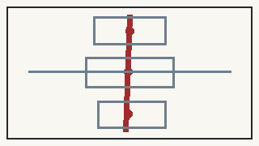
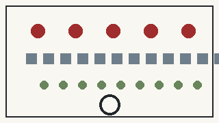

# Jing-Zhang People's AI City: A Civic AI Commons on the Centennial Railway

> **AI Advances, People First.**
>
> People are the owners of the city. AI is a tool people use and can control. Let the lines of technology ultimately flow into civic spaces of the people.

This proposal does not reserve “people-first” language for a concluding values page, nor does it translate red heritage into red walls, saturated lighting or giant slogans. It begins with operating constraints: AI may not reduce ordinary public service, consequential decisions must retain identifiable human responsibility, and real-world pilots must be stoppable. The 2026 policy principle that artificial intelligence should remain under human control is cited once as a governance anchor; the rest of the proposal translates that principle into spatial, service and operational mechanisms. [source:SRC-XI-AI-GOV-2026]

## Design Basis and Source List

The evidence base is divided into three classes that are never conflated. The first is the project-control layer: the official open-call announcement, agent taskbook, and the repository's current schemas, enums, standards and validation scripts. These define the three-level scope, three key areas, mandatory tasks and review contract. [source:SRC-DESIGN-BRIEF] The second class covers place and cultural context: published Jing-Zhang Railway Heritage Park material, people's-city practices, and the corridor's industrial, community and innovation histories. These support the narrative connecting railway engineering, Zhongguancun innovation and public AI life. [source:SRC-BJ-PEOPLE-CITY-2021] The third class covers AI governance and international mechanisms—Helsinki AI Register, Kalasatama, Punggol Digital District, Decidim, Seoul AI Hub and Toronto Quayside—used as bounded mechanism references rather than imported law, scale or performance claims.

Claim boundaries are themselves part of the design. The overall site and three key areas currently inherit maintainer-provided provisional geometry. Cleared statutory regulatory controls, ownership, road redlines, heritage-control zones, rail and municipal geometry are not available, so `constraints.geojson` is intentionally empty and records a data gap. [assumption:A-CONTROLS-002] All new roads, building envelopes, green space, public space, phasing and scenario nodes are marked as design proposals. Drawing a polygon does not convert uncertainty into legal or engineering fact; preserving that distinction is the first discipline of an AI-generated urban proposal. [data:geometry/constraints.geojson#data_gap]

## Three-Level Scope Framework

The proposal follows the taskbook's three-level structure while adding a people-first question at every level. The **coordinated research area** asks how the corridor can sustain an AI innovation ecosystem over time, how technological gains return to public life, and how railway, Zhongguancun and AI cultures become a continuous story. The **overall design area** asks how the full roughly 11.4 km² provisional site gains a coherent urban structure, land-use responsibility system, mobility and public-space network, renewal logic and infrastructure approach rather than merely three isolated hotspots. The **key areas**—Zhongzhiyuan, Beijing AI Origin Community and Dazhongsi—then demonstrate “innovation the public can verify,” “AI people can live with,” and “industrial value people can share.” [source:SRC-DESIGN-BRIEF]

A **Jing-Zhang Civic Public Spine** connects the three levels. It is not primarily an AI exhibition corridor; it is first a continuous walking, cycling, accessible, shaded, resting, cultural-memory and public-service structure. AI devices remain lightweight and removable. The current EPSG:4548 recalculation of the inherited provisional polygon is 11,412,825.386 m². That value is useful for internal consistency and review, but it is not represented as an official redline area. [metric:site_area_sqm]

## Coordinated Research Area: Industry and Future City Research

The Centennial Jing-Zhang story is not a collage of “railway heritage + AI industry.” It is framed as three waves of collective creation: **the railway—people build modern engineering; Zhongguancun—people create modern technology; the AI era—technology returns to everyday public life.** Railway history includes surveyors, construction workers, maintenance teams and generations of residents, not only individual engineering heroes. Zhongguancun likewise depends on researchers, teachers, students, technicians, entrepreneurs, service workers and public infrastructure. AI therefore earns its urban value through healthcare, mobility, education, ageing, culture, accessibility, public service and employment—not through model counts or robot density. [source:SRC-JZ-PARK-RED-2023]

The innovation ecosystem is organized through eight factors: research, talent, compute, data, capital, industry, space and real-world scenarios. Each receives a civic constraint. Research does not justify unlimited collection; a talent district must support teachers, students, service workers and families as well as highly paid engineers; compute scale is not a monument; data follows minimization and purpose limitation; capital does not gain public decision authority; industrial showcases disclose responsibility and non-AI routes; public space cannot be monopolized by pilots; and real-world testing requires human takeover and stop conditions. [source:SRC-AGENT-TASKBOOK]

International cases are used only as mechanisms. Punggol suggests interoperable district platforms and living labs; Kalasatama suggests short reversible pilots; Helsinki AI Register demonstrates legible public AI inventories; Decidim links open-source participation to in-person deliberation; Seoul AI Hub demonstrates an education–incubation–R&D ladder; Toronto Quayside warns that technical platform power must not become de facto planning authority. [source:CASE-HELSINKI-AI-REGISTER] Jing-Zhang copies none of their legal systems, budgets or spatial scales.

## Overall Design Area: Urban Renewal and Regulatory-Plan-Level Urban Design

The land-use concept now covers the entire provisional site rather than only the three key areas. In EPSG:4548, the site is partitioned into **three north–middle–south urban bands × four responsibility interfaces**, producing twelve non-overlapping full-coverage conceptual cells. The four interfaces are civic service and everyday life (0702), open learning/R&D/co-creation (0802), industry/small-business/controlled validation (05), and public green/heritage/slow mobility (1401). Codes follow repository-permitted land-use classification, while the names express design responsibility rather than cadastral certainty. [standard:MNR-LAND-USE-CLASSIFICATION-GUIDE]

The overall structure is a civic spine, three urban bands, three key areas, two red civic anchors, three AI pilgrimage landmarks and a distributed service network. The two red anchors are the Civic Engineering Hall and People's AI Service Station. The three pilgrimage landmarks are the Civic Engineering Hall, Open-Source Origin Square and Civic Intelligence Arcade. Renewal follows **existing-first, light-intervention-first and reversible-first** principles. Where ownership, surveys, heritage and statutory controls are not available, the proposal does not invent FAR, height limits or road redlines. [assumption:A-CONTROLS-002]

“Regulatory-plan-level response” here means correctly separating what can and cannot be supported by current evidence. Full-site land-use topology, conceptual public space, building envelopes, phasing and provisional metrics can be recalculated. Statutory regulatory geometry cannot. The latter remains an explicit data gap rather than a false layer of precision, and all calculated metrics must be regenerated when authoritative geometry replaces the provisional polygon. [depth:development_intensity_controls]

## Detailed Design of Key Areas

The three key areas demonstrate different relationships between AI and civic life rather than repeating a generic futuristic technology park. **Zhongzhiyuan** is “innovation the public can verify”: intensive R&D, open collaboration and low-speed robotic pilots occur within legible test boundaries; ordinary and accessible routes remain distinct; and the public can see pilot purpose, responsible parties, stop status and Public Receipts. The Open Test Commons is conceived first as adaptive reuse or a shared interface between researchers, operators and acceptance users. [assumption:A-SCENARIO-010]

**Beijing AI Origin Community** is “AI people can live with.” It concentrates the Civic Engineering Hall, Open-Source Origin Square, People's AI Service Station, assisted services for older people, accessible navigation, child-safe mobility, cultural guidance, health-service navigation and civic deliberation. A person without a smartphone, without an account or actively refusing AI must still be able to find a route, rest, ask for help, use services, complain and reach a human. **Dazhongsi** is “industrial value people can share”: small-business support, service-worker assistance, the public algorithm transparency board and Civic Intelligence Arcade make industrial display subject to public responsibility and review. [metric:key_area_count]

The three pilgrimage landmarks are the Civic Engineering Hall, Open-Source Origin Square and Civic Intelligence Arcade. The People's AI Service Station is deliberately not counted as a pilgrimage landmark because it should remain everyday, modest and repeatable. What deserves a dedicated visit is not a larger screen but a different AI-city relationship: innovation can be inspected, algorithms questioned, open-source tools brought into public space, and failed technology publicly stopped. [metric:ai_landmark_count]

## AI Innovation Ecosystem, Personas, and AI+ Scenarios

The proposal converts marketing personas into **nine acceptance groups**: long-term residents and families; older people; disabled people and users with mobility or sensory limitations; children and caregivers; students, teachers and researchers; entrepreneurs and enterprise workers; cleaning, security, delivery, repair and food-service workers; visitors and international users; and people without smartphones/accounts or who actively decline AI. A scenario that only works for a digitally confident person willing to grant broad permissions is not a people-first AI scenario. [metric:persona_count]

The Civic AI Charter defines five proposal rights: **notice, choice, refusal, human review, and appeal/correction**. They are explicit design and operating requirements, not a claim that an enacted five-right statutory code already exists. Public authorities, operators and technology providers retain explainable responsibility for maintenance, correction, shutdown and exit. Meaningful human control must be visible in the city through responsibility labels, staffed channels, takeover and degraded modes, incident records, public feedback and restoration of ordinary service. [assumption:A-GOVERNANCE-004]

Twelve scenario nodes cover no-device access, older-person assistance, accessible navigation, child-safe mobility, civic deliberation, public algorithm transparency, service-worker support, small-business support, Jing-Zhang cultural guidance, controlled low-speed delivery, health-service navigation and public-safety decision support. **All 12 retain a human or non-AI equivalent, while the target number of final automated consequential public decisions is zero.** [metric:human_fallback_required_scenario_count] The common sequence is BASELINE → AI PILOT → HUMAN REVIEW → PUBLIC RECEIPT → SCALE / REVISE / STOP.

## Land Use, Building Scale, and Retain-Renovate-Demolish Strategy

The building layer contains four low-confidence concept envelopes: Civic Engineering Hall, the first People's AI Service Station demonstrator, Civic Intelligence Arcade and Zhongzhiyuan Open Test Commons. Their current union covers approximately 38,075.314 m² in EPSG:4548, a geometry-consistency value rather than an approved building footprint, floor area, FAR or developable parcel claim. [metric:building_footprint_area_sqm] Fire, structure, ownership, heritage, daylight, underground conditions and statutory development controls remain unresolved and therefore cannot be reverse-engineered from these rectangles.

The retain–renovate–demolish principle is “survey existing assets before adding new ones.” The service station should preferably occupy existing civic premises or reversible lightweight construction. The Civic Intelligence Arcade should first explore adaptive reuse or arcade insertion. The Zhongzhiyuan commons should reuse existing R&D or public space where feasible. The Civic Engineering Hall, the only large red civic landmark, cannot be fixed as new-build, renovation or hybrid until heritage, ownership and engineering review. [depth:retain_renovate_demolish] If a concept location later proves unsuitable, the program may move; the people-first service contract may not disappear with it.

The Civic Engineering Hall uses deep red brick/ceramic, dark steel, timber and restrained glass, with traceable reused railway steel considered only after technical verification. Its importance is functional: a people's engineering-history gallery, People's AI Assembly, public algorithm review room and open-source city workshop. The much smaller People's AI Service Station provides staffed help, no-account assistance, physical credentials, accessible navigation, review, complaint/appeal, drinking water and short rest. Its entrance principle is simple: **technology may advance; service must not leave people behind.** [assumption:A-RED-ANCHOR-003]

## Transport, Rail, Municipal Infrastructure, and Public Services

The transport layer does not fabricate existing road or rail engineering alignments. `roads.geojson` expresses only design intent: one north–south Jing-Zhang Civic Public Spine, three east–west key-area service seams and an accessible AI Origin service loop. Walking, cycling, accessibility, resting and staffed help take precedence over intelligent navigation and robot operations. Low-speed robots operate only in bounded validation areas while ordinary pedestrian and non-test routes remain available. AI accessibility guidance is valuable only when the physical accessible route is genuinely usable. [standard:BARRIER-FREE-ENVIRONMENT-LAW]

Rail interchange design, motor traffic, parking capacity, municipal capacity and pipe networks are not assigned invented numbers without trusted base data. New infrastructure can nevertheless define governance interfaces now: a Civic AI Register, responsible-party labels, human takeover, offline/degraded modes, complaint and incident records, and replaceable open interfaces. The People's AI Service Station becomes the human interface of that infrastructure: when models, networks or account systems fail, public service still has a physical endpoint. [assumption:A-HUMAN-CONTROL-005]

The minimum service contract is that the non-AI path cannot fall below an ordinary urban-service baseline. Older people can reach staff, visitors do not require forced registration, blind users do not depend on screens, service workers are not subjected to invasive monitoring disguised as optimization, and small businesses do not exchange excessive authorization for basic public services. AI is a second layer that expands capability, not the admission gate to the city. [assumption:A-INCLUSION-007]

## Blue-Green Network, Public Space, and Urban Character

The public-realm test is straightforward: **if every screen is switched off and every model is offline, the place must still work as a good city.** Conceptual green space includes the AI Origin civic green corridor, Zhongzhiyuan test buffer, Dazhongsi shaded forecourt and three shade nodes along the civic spine. The current conceptual green union is about 661,629.752 m², or 5.7972% of the provisional site. Explicit public-space polygons total about 120,618.287 m², or 1.0569%. These are proposal self-check metrics, not statutory green or public-space control ratios. [metric:green_ratio]

Red character follows a “material red, not lighting red” rule. The Civic Engineering Hall is the only large red landmark and the People's AI Service Station is a small red civic-service anchor; most AI infrastructure remains silver-grey, white, glass and metal. The overall visual relation becomes: **silver-grey technology lines ultimately flow into red civic nodes.** Red is meaningful because the node contains an accessible public institution, staff, deliberation, service, history and accountability—not because the city has added more red pixels. [source:SRC-JZ-PARK-RED-2023]

Open-Source Origin Square uses trees, public tables, demountable light structures and low-brightness interfaces. The Civic Intelligence Arcade combines industrial display with resting, staffed consultation, AI registry information and equivalent non-AI service. Zhongzhiyuan's civic test buffer allows the public to observe rules without being forced into the test zone. The v0.3 geometry preflight separated three forecourts/buffers from building envelopes and moved a shade node away from a building overlap, reducing ambiguity before official spatial review. [depth:blue_green_public_space]

## Renewal Projects, Implementation Policy, and Phasing

Renewal projects are organized into spatial projects, governance infrastructure and long-term operations. Spatial projects include the Civic Engineering Hall, People's AI Service Station, Open-Source Origin Square, Civic Intelligence Arcade, Zhongzhiyuan Open Test Commons and civic-spine shade/mobility nodes. Governance infrastructure includes the Civic AI Register card, public algorithm transparency board, human takeover and stop mechanisms, and Public Receipts. Long-term operations include Civic AI Open Class, Jing-Zhang Open Source Week, Civic AI Test Day and the Centennial Engineering & Future City Forum. [metric:annual_program_count]

Spatial phasing has three areas. P1 places civic service and governance first in AI Origin Community, proving that non-AI users retain complete service. P2 develops controlled validation and open collaboration in Zhongzhiyuan, where robotics and R&D operate with bounded pilots and public observation. P3 extends validated capabilities into Dazhongsi's industrial translation and public display. Governance also uses five gates: G0 facts and ordinary-service baseline, G1 reversible prototype, G2 public deliberation, G3 spatial/institutional consolidation and G4 open-source diffusion. [metric:phase_gate_count]

Implementation policy therefore means more than “encourage AI deployment.” No AI substitution begins without a known ordinary baseline; no real public-space pilot starts without a responsible person and stop condition; high-risk systems cannot substitute a successful demo for professional review; and failed pilots must be removable while leaving an intelligible public record. [assumption:A-BASELINE-006] A final repository release gate is added: immediately before the upstream PR, synchronize the latest upstream `main`, resolve changes, and rerun deterministic, spatial, visual and professional review, finalization and participant preflight on the exact post-sync head.

## Metrics, Area Recalculation, and Compliance Matrix

Metrics are divided into three layers. The first contains values that can already be derived from current structure and geometry: provisional site area 11,412,825.386 m²; conceptual green area 661,629.752 m² and ratio 0.057972; explicit conceptual public-space area 120,618.287 m² and ratio 0.010569; conceptual building footprint 38,075.314 m²; three key areas; twelve AI scenarios; nine acceptance groups; five civic AI rights; two red civic anchors; three pilgrimage landmarks; six international mechanism cases; five implementation gates and four long-term program brands. [metric:public_space_ratio] These are separated from real-world performance claims.

The second layer contains quality-of-life metrics that must remain unknown until G0 field baselines exist: key-task success without smartphones/accounts, distance/steps/wait to reach a human, older and disabled user task completion, appeal closure time, additional digital burden on service workers, public awareness that AI is in use, and service-quality gaps between AI and non-AI routes. The proposal refuses fabricated 90% satisfaction or accuracy figures. [assumption:A-BASELINE-006] The third layer is structured compliance evidence: `compliance_matrix.json` covers the 23 mandatory announcement/taskbook requirements; `standard_matrix.json` addresses the current mandatory professional standards; `design_depth_matrix.json` now follows the current 15-item formal design-depth contract. [data:geometry/land_use.geojson#LU-S01]

All area recalculation follows the repository spatial review's EPSG:4548 logic. The v0.3 twelve-cell land-use partition covers the entire provisional site with projected gaps and overlaps far below the one-square-metre blocking threshold. When verified official geometry replaces the provisional boundary, the cells, areas and ratios must be regenerated rather than carried forward as inherited “approved” values. [assumption:A-BOUNDARY-001]

## Risk, Copyright, and Compliance

Risk is organized using the repository's eight fixed dimensions: data privacy, implementation complexity, public acceptance, operations cost, policy uncertainty, spatial dispute, technology maturity, and equity/inclusion. The most important failures are not merely insufficient model accuracy but **technology excluding people, technology hiding responsibility, and technology shifting de facto civic authority to a supplier**. High-risk scenarios therefore require human review; “the system decided” is not a terminal accountability statement; and a pilot that imposes substantial burdens on residents should be revised or removed rather than training residents to adapt. [data:geometry/public_space.geojson#S05]

The five Civic AI Rights are explicitly proposal governance requirements, not a claim about a single enacted statutory five-right code. The principle of human control over AI is a policy-to-design source, not official endorsement of any particular building, algorithm or spatial intervention. [assumption:A-HUMAN-CONTROL-005] International cases remain mechanism research; foreign law, budgets, performance values and disputes are not mapped directly onto Beijing. When statutory planning, heritage, ownership, municipal or engineering geometry is missing, an explicit empty data-gap layer is preferable to fabricated precision.

The submitted narrative, concept geometry, identity SVG, static diagrams, HTML and PDFs are generated within this submission workflow. External material is used as factual and mechanism evidence rather than copied visual content; third-party photographs, map screenshots, trademark artwork and protected layouts are not packaged as submission media. The detailed declaration is in `report/copyright_statement.md`. [source:SRC-DESIGN-BRIEF]

## References

Traceable evidence is centralized in `sources.json`, while prose uses only claim-adjacent anchors to avoid turning the proposal into a machine-reference dump. Project-control sources include the relevant Beijing open-call material, `brief/site-package/`, the agent taskbook, and current repository schemas/enums/standards. Place and civic sources cover Jing-Zhang red, industrial, ecological and community culture and people's-city participation practice. AI governance sources include the people-centered/beneficial direction and the principle that AI should remain under human control. [source:SRC-XI-AI-GOV-2026]

International mechanisms registered for comparison include Punggol Digital District, Kalasatama Agile Pilots, Helsinki AI Register, Barcelona/Decidim, Seoul AI Hub and Toronto Quayside. They support, respectively, interoperable living labs, reversible co-testing, public AI transparency, open-source participation, talent/industry growth ladders and a digital-governance counterexample; none serves as a Beijing statutory standard or performance benchmark. [source:CASE-PUNGGOL-DIGITAL-DISTRICT]

Professional responses are indexed in `standard_matrix.json`. Current mandatory controls include the project announcement, agent taskbook, urban-design management requirements, control-detailed-planning requirements and the national land-use classification guide; accessibility, ageing and generative-AI instruments provide bounded supplementary context where relevant. [standard:PROJECT-OFFICIAL-ANNOUNCEMENT] The evidence hierarchy remains simple: **official or cleared fact outranks inference; verifiable geometry outranks a persuasive rendering; professional and public human judgment outranks a model certifying itself.**
