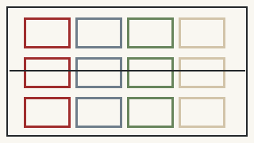
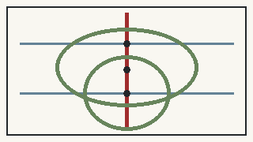

# 京张人民智城：百年铁路上的人民AI共同体

> **AI向前，人民在先。**
>
> 人民是城市的主人，AI是人民使用并能够控制的工具。让技术的线，最终汇入人民的空间。

本方案不把“人民性”做成最后一页价值宣言，也不把“红色传承”做成红墙、红灯和巨型标语。它从一开始就规定：AI进入公共空间后，普通人的服务不能降级，重要决定必须有人负责，试验必须能停止；红色建筑必须承担真实公共功能。2026年7月17日相关主旨讲话提出“以人为本、向上向善”，并强调“确保人工智能始终处于人类控制之下”。本方案只在此完整引用一次，后文全部把它翻译成空间、服务和治理机制。[source:SRC-XI-AI-GOV-2026]

## 设计依据与资料清单

设计依据分为三类，且三类绝不混用。第一类是项目主控资料：官方征集公告、agent taskbook、仓库现行 schemas、enums、standards 与校验脚本，它们决定三层范围、三处重点区、必答任务、文件结构和机器校验方式。[source:SRC-DESIGN-BRIEF] 第二类是场地与文化依据：京张铁路遗址公园相关公开资料、人民城市实践材料、中关村与京张文化叙事资料，它们支撑“铁路工程—科技创新—AI公共生活”的连续叙事。[source:SRC-BJ-PEOPLE-CITY-2021] 第三类是AI治理和全球案例背景资料，包括AI公共治理政策表述、Helsinki AI Register、Kalasatama、Punggol Digital District、Decidim、Seoul AI Hub 与 Toronto Quayside 等，只借机制，不把外国法制、尺度、预算和绩效直接移植。

资料边界同样是设计内容。当前总体设计范围与三处重点区仍采用维护者提供的 provisional geometry；法定控规控制线、权属、道路红线、文保保护范围与建设控制地带、轨道及市政精确几何尚无可引用的清权数据，因此 `constraints.geojson` 刻意保持空集，并登记 data gap。[assumption:A-CONTROLS-002] 所有新增道路、建筑、绿地、公共空间、分期和场景节点都标为 design proposal，不以“画出来了”偷换成“现实中已经存在或可以审批”。这种克制不是信息不足的借口，而是避免AI方案把不确定性包装成确定事实的第一道纪律。[data:geometry/constraints.geojson#data_gap]

## 三层范围工作框架

本方案完全沿用任务书的三层工作框架，但给每一层增加人民性问题。第一层是**统筹研究范围**：回答京张AI创新带靠什么形成长期创新生态，技术红利如何进入公共生活，以及铁路、中关村和AI三种文化如何建立连续关系。第二层是**总体设计范围**：回答约11.4平方公里 provisional site 如何形成完整的城市结构、用地责任、慢行公共空间、更新与基础设施逻辑，而不是只画三个热点。第三层是**重点区域详细设计**：众智园、AI原点社区、大钟寺分别承担“人民可验证的创新”“人民可生活的AI”“人民可分享的产业收益”。[source:SRC-DESIGN-BRIEF]

三层之间由一条**京张人民公共脊梁**贯穿。它不是AI展示走廊，而首先是连续步行、骑行、无障碍、遮阴、休息、文化记忆和公共服务的城市骨架；AI设备只能轻附着、可撤回。三处重点区不是孤岛，而通过南北脊梁与东西服务缝合线接入普通城市生活。总体边界的当前EPSG:4548复算面积为11,412,825.386平方米，但该数字只是 provisional geometry 的自检结果，不是法定红线面积。[metric:site_area_sqm]

## 统筹研究范围产业与未来城市研究

百年京张的叙事不是“铁路遗产 + AI科技”两个标签拼贴，而是三次人民创造：**京张铁路——人民建设现代工程；中关村——人民创造现代科技；AI时代——科技重新回到人民日常。** 铁路的历史不仅属于少数工程英雄，也属于测绘、筑路、机务、维护和沿线生活者；中关村创新也不仅由明星企业构成，而依赖科研人员、教师、学生、技术工人、创业团队、公共服务与城市基础条件。于是AI创新带的最终尺度不是模型参数和机器人数量，而是医疗、交通、教育、养老、文化、办事、无障碍和就业体验是否真正改善。[source:SRC-JZ-PARK-RED-2023]

产业生态按八个要素组织：科研、人才、算力、数据、资本、产业、空间、真实场景。每个要素都附一条公共约束：科研不能以试验名义无限采集；人才城区不能只服务高薪工程师；算力规模不作为城市地标；数据坚持最小采集和用途限定；资本不获得公共规则的事实决定权；产业展示必须公开责任与非AI路径；公共空间不被测试设施排他占据；真实场景测试必须有人工接管和停止条件。[source:SRC-AGENT-TASKBOOK] 这使“世界级AI生态”不只是一条企业招商链，而成为研发—验证—生活—产业转化—公共治理互相制约的城市系统。

全球案例只作机制镜子：Punggol提示区域级互操作与living lab；Kalasatama提示短周期可逆试验；Helsinki AI Register提示公众有必要知道城市正在使用什么AI；Decidim提示开源数字参与必须与真实议事结合；Seoul AI Hub提示教育—孵化—研发—开放创新的成长阶梯；Toronto Quayside则提醒技术公司不能因为掌握平台就获得事实规划权。[source:CASE-HELSINKI-AI-REGISTER] 京张不照搬任何一座城市的制度与规模，只吸收“开放、可验证、可退出、可共同参与”的机制。

## 总体设计范围城市更新与控规深度城市设计

总体设计不再把12个功能单元局限在三处重点区，而是用EPSG:4548将整个 provisional site 分成**南、中、北三个城市带 × 四类责任界面**，形成12个无重叠、全覆盖的概念责任单元。四类界面分别是：人民公共服务与日常生活（0702）、开放学习研发与共创（0802）、产业转化/小微商业/受控验证（05）、公共绿地/遗址记忆/慢行（1401）。这些代码使用仓库允许的分类体系，名称则表达设计责任，不把概念单元冒充地籍宗地。[standard:MNR-LAND-USE-CLASSIFICATION-GUIDE]

空间结构概括为“一脉、三带、三区、两红锚、三地标、多点服务”。一脉是京张人民公共脊梁；三带是南段大钟寺—西直门日常城市带、中段AI原点—京张公共脊梁带、北段众智园—五环创新验证带；三区是任务书三处重点区；两红锚是人民工程馆和人民AI服务站；三地标再加入开源原点广场与公共智能廊。城市更新坚持**存量优先、轻介入优先、可逆优先**。没有可靠权属、建筑调查、文保和控规依据时，不提出“大拆大建”的确定性方案，也不虚构容积率、高度和道路红线。[assumption:A-CONTROLS-002]

所谓“控规深度响应”在当前公开数据条件下，不是编出一套看似精确的控制数字，而是把可复算的设计层与不可确认的法定层分清：全域用地拓扑、公共空间、建筑概念体量、分期和指标可以计算；法定控制几何则以空集和data gap保留。这一做法接受后续官方数据整体替换，并要求所有指标重新计算。[depth:development_intensity_controls]

## 重点区域详细设计

三处重点区承担不同的AI—人民关系，而不是复制三座“未来科技园”。**众智园AI自主创新加速区**承担“人民可验证的创新”：研发、产学研、开源协作和低速机器人等真实空间测试可以高强度发生，但测试区与普通通道物理可辨，行人和无障碍路径优先，公众能看到试验说明、责任人、停机状态和Public Receipt。众智园开放测试共创厅优先研究存量建筑复用，作为研发人员、测试运营者与公众共同核对规则的界面。[assumption:A-SCENARIO-010]

**北京AI原点社区**承担“人民可生活的AI”：这里集中人民工程馆、开源原点广场、人民AI服务站，以及适老陪办、无障碍导航、儿童慢行、AI文化导览、社区健康导航、人民AI议事等场景。它的验收标准是：不用手机、没有账号或主动拒绝AI的人，仍能完整找路、休息、问询、办事、投诉和转人工。**大钟寺AI产业聚集区**承担“人民可分享的产业收益”：小微商户公共能力助手、服务劳动者城市助手、公共算法透明看板和公共智能廊，使产业展示同时接受公共责任、数据边界和人工复核规则。[metric:key_area_count]

三处地标分别是人民工程馆、开源原点广场、公共智能廊。人民AI服务站故意不计为“朝圣地标”，因为它应像社区服务站一样日常、低调、可复制。真正值得专程到访的不是更大屏幕，而是一套不同的AI城市关系：研发可以被验证，算法可以被追问，开源成果可以进入公共空间，技术失败可以公开并停止。[metric:ai_landmark_count]

## AI 创新生态、人才画像与 AI+ 场景

本方案把“用户画像”改造成**九类验收人**：沿线居民与家庭、老人、残障和行动/感知受限者、儿童及照护者、学生教师科研人员、创业与企业从业者、保洁保安配送维修餐饮等服务劳动者、游客与国际使用者、以及无智能手机/无账号/主动拒绝AI的人。任何AI场景如果只能让“愿意授权全部数据、熟悉最新手机和AI”的人完成任务，就不能被称为人民AI场景。[metric:persona_count]

人民AI宪章提出五项设计权利：**知情、选择、拒绝、人工复核、申诉纠错**。它们是本方案的治理合同，不伪装成已经颁布的一部“五权法”。一项公共责任是：公共部门、运营者和技术提供方共同承担解释、维护、纠错、停机和退出责任；一条底线是：AI必须保留真实、可操作的人类控制。[assumption:A-GOVERNANCE-004] 人类控制必须在现场看得见——责任标识、人工窗口、停机/降级、异常记录、公众反馈和普通服务恢复，而不是后台一句“human in the loop”。

12个场景均已进入概念节点：无终端等价通行、适老AI陪办、无障碍路径智能导航、儿童安全慢行助手、人民AI议事助手、公共算法透明看板、服务劳动者城市助手、小微商户公共能力助手、京张AI文化导览、低速机器人受控配送、社区健康服务导航、公共安全辅助研判。**12/12都必须保留人工或非AI等价路径，影响权益、安全、支付、通行、资格、执法或公共资源的最终自动决定目标为0。** [metric:human_fallback_required_scenario_count] 试验流程统一为：BASELINE → AI PILOT → HUMAN REVIEW → PUBLIC RECEIPT → SCALE / REVISE / STOP。

## 用地、建筑规模与拆改留方案

建筑层当前只表达四个低置信度概念体量：人民工程馆、人民AI服务站首站、公共智能廊、众智园开放测试共创厅。它们的总概念建筑基底经EPSG:4548复算约38,075.314平方米，但这个数字仅说明当前几何文件内部一致，不代表批准建设量、建筑面积、容积率或可建设地块。[metric:building_footprint_area_sqm] 正式控规、权属、现状建筑、消防、结构、文保、日照和地下条件到位前，不从这些矩形反推工程结论。

拆改留原则是“先查存量，再谈新增”。人民AI服务站优先嵌入既有公共建筑或采用轻量可逆建设；公共智能廊优先研究沿街建筑适应性更新或廊道式插入；众智园共创厅优先复用现有研发/公共空间；人民工程馆作为唯一大型红色公共地标，其新建、改造或复合利用路径必须待文保、权属和城市设计进一步核定。[depth:retain_renovate_demolish] 如果最终调查证明某个概念位置不适宜，功能可以移动，人民性规则不能随位置一起消失。

人民工程馆的材料语言采用红砖/红陶、深灰钢、木和少量克制玻璃，局部可研究来源可追溯的再利用铁路钢材。它不是“红色AI大楼”，而是一座同时承载京张人民工程史、人民AI议事厅、公共算法审议室和开源城市工坊的公共机构。人民AI服务站尺度相反，提供人工咨询、无账号辅助、实体凭证支持、无障碍导航、AI结果复核、投诉申诉、饮水与短时休息。入口只需要一句：**技术可以先进，服务不能把人落下。** [assumption:A-RED-ANCHOR-003]

## 交通、轨道、市政与公共服务设施

交通层不伪造现状道路和轨道工程线位，当前 `roads.geojson` 只表达设计意图：一条南北京张人民公共脊梁、三条重点区东西公共服务缝合线，以及AI原点无障碍服务环。它们把“可步行、可骑行、可无障碍、可停留、可求助”放在智能导航和机器人运营之前。低速机器人只在受控区验证，普通通行与非测试路径必须持续存在；AI无障碍导航只有在实体无障碍路线真实可走时才有意义。[standard:BARRIER-FREE-ENVIRONMENT-LAW]

轨道接驳、机动车组织、停车、市政容量和管线在缺少可靠底图时不编数字。新型基础设施则可以先定义治理接口：公共AI登记、责任主体标识、人工接管、离线/降级模式、投诉与事件记录、可替换的开放接口。人民AI服务站是这套基础设施的“人类接口”，当模型、网络或账号体系失效时，公共服务仍有实体落点。[assumption:A-HUMAN-CONTROL-005] 服务设施布局后续应以真实任务时间和无障碍可达性测试校准，而不是只追求地图上的等距覆盖。

公共服务的最低合同是“非AI路径不低于普通城市服务基线”。老人可以转人工，游客无需强制注册，视障者不依赖屏幕，服务劳动者不因智能化被迫接受侵入式绩效监控，小微商户不以过度授权交换基本公共服务。AI是增加能力的第二层，不是进入城市的第一道门槛。[assumption:A-INCLUSION-007]

## 蓝绿空间、公共空间与城市风貌

蓝绿和公共空间坚持一个简单测试：**屏幕全部关闭、模型全部离线时，它仍然必须是一段好城市。** 当前概念绿地包括AI原点人民公共绿廊、众智园测试缓冲绿地、大钟寺公共前场绿荫以及京张公共脊梁的三处绿荫节点；概念绿地面积约661,629.752平方米，占 provisional site 约5.7972%。显式公共空间polygon约120,618.287平方米，占约1.0569%。这些比例只是当前设计几何的自检指标，不是法定绿地率或公共空间控制值。[metric:green_ratio]

红色风貌遵循“材料红，而不是灯光红”。人民工程馆是唯一大型红色地标，人民AI服务站是小尺度红色服务锚点；其余AI设施偏银灰、白、玻璃与金属。于是总图形成清楚关系：**银灰技术网络最终汇入红色人民节点。** 红色并不意味着符号越多越好，而是空间里有可进入的公共机构、有人工、有议事、有服务、有历史和责任。[source:SRC-JZ-PARK-RED-2023]

开源原点广场采用树荫、公共长桌、可拆装轻结构和低亮度信息界面；公共智能廊将产业展示与公共休息、人工咨询、AI登记和非AI路径并置；众智园测试缓冲场让公众能够看见试验规则但不被迫进入试验区。我们已在v0.3人工预检中把三个公共前场/缓冲场与建筑概念体量分离，并移开一处绿荫节点与建筑的重叠，减少后续空间审查歧义。[depth:blue_green_public_space]

## 更新项目清单、实施政策与分期计划

更新项目分成“空间项目、治理基础设施、长期运营”三类。空间项目包括人民工程馆、人民AI服务站、开源原点广场、公共智能廊、众智园开放测试共创厅以及京张人民公共脊梁的慢行/绿荫节点；治理基础设施包括AI公共登记卡、公共算法透明看板、人工接管与停机机制、Public Receipt；长期运营包括人民AI公开课、京张开源周、城市AI共测日、百年工程与未来城市论坛。[metric:annual_program_count]

空间分期为三片：P1 AI原点人民服务与治理先行，先证明不用AI的人也能获得完整服务；P2 众智园受控验证与开放协作，把低速机器人、开放研发和公众观察放入有边界的测试；P3 大钟寺产业转化与公共智能展示，只有经过前两阶段真实验收的能力才进入产业规模化。治理上同时使用G0事实与普通服务基线、G1可逆原型、G2公共审议、G3空间固化、G4开源扩散五道门。[metric:phase_gate_count]

实施政策不是“鼓励AI落地”一句话，而是四条硬约束：普通服务基线未确认不启动AI替代；没有责任人和停机条件不进入真实公共空间；高风险能力不以Demo成功替代专业审查；试点失败必须允许撤回并公开留下可理解的复盘记录。[assumption:A-BASELINE-006] 最终提交之前还增加一条仓库发布门禁：先同步最新 upstream `main`，再在合并后的 exact head 重跑 deterministic、spatial、visual、professional review、finalize 和 participant preflight，避免拿旧规则的“通过”去提交新规则下的PR。

## 指标体系、面积复算与合规矩阵

指标分成三层。第一层是**已能从当前几何和结构确定的自检指标**：provisional site面积11,412,825.386平方米；概念绿地面积661,629.752平方米、比例0.057972；显式概念公共空间面积120,618.287平方米、比例0.010569；概念建筑基底38,075.314平方米；3处重点区、12个AI场景、9类验收人、5项人民AI权利、2类红色公共锚点、3处AI朝圣地标、6个全球案例机制、5道实施门、4个长期活动品牌。[metric:public_space_ratio] 这些数字全部区分“设计计算值”和“现实绩效值”。

第二层是**必须现场测量后才允许填写的生活质量指标**：无手机/无账号关键任务成功率、转人工的步数/距离/等待、老年与残障用户任务完成率、AI错误申诉闭环时间、服务劳动者额外数字负担、居民知情率、非AI路径与AI路径服务质量差异。这些目前保持unknown，而不是填入“90%满意度”之类虚构成绩。[assumption:A-BASELINE-006] 第三层是合规证据：`compliance_matrix.json` 覆盖公告与agent taskbook共23条mandatory任务；`standard_matrix.json` 对当前mandatory标准逐项响应；`design_depth_matrix.json` 已按当前formal validator的15项固定设计深度重建。[data:geometry/land_use.geojson#LU-S01]

面积复算与空间审查统一采用仓库 `spatial_review.py` 的EPSG:4548逻辑。v0.3全域12个用地责任单元在该投影下的覆盖缺口和相互重叠均远低于1平方米审查阈值；当官方精确边界替换 provisional polygon 后，上述面积、比例和责任单元都必须重新生成，不能把旧数值沿用为“历史批准指标”。[assumption:A-BOUNDARY-001]

## 风险、版权与合规说明

风险按仓库固定八维管理：数据隐私、实施复杂度、公众接受、运维成本、政策不确定、空间争议、技术成熟度、公平包容。这里最重要的三类不是“模型不够先进”，而是**技术把人排除、技术把责任隐藏、技术把城市事实治理权转移给供应商**。因此高风险场景必须有人工复核；公共AI不允许把“系统如此”当作责任终点；试验给居民造成明显额外负担时，应优先撤回工具而不是教育居民适应。[data:geometry/public_space.geojson#S05]

“人民AI五权”是方案自拟治理合同，不被表述为现行单一法定权利清单；习近平关于人类控制AI的表述是政策原则来源，不意味着任何具体建筑、系统或空间方案获得官方背书。[assumption:A-HUMAN-CONTROL-005] 同样，全球案例只用于机制研究，不把国外法规、预算、绩效和争议直接套到北京。法定规划、文保、权属、市政和工程数据缺失时，空集优于编造；这就是为什么 `constraints.geojson` 明确保留为data gap。

版权方面，提交的文本、概念几何、SVG身份系统、静态图、HTML与PDF均由本方案工作流生成；外部资料只作事实与机制依据，不把第三方图片、地图截图、商标素材和受版权保护版式直接打包进交付物。完整声明见 `report/copyright_statement.md`。[source:SRC-DESIGN-BRIEF] 对官方公开材料的引用也只用于支持事实和设计依据，不据此声称网页图像或编辑性内容可以任意再分发。

## 参考资料

本方案的可追溯来源统一登记在 `sources.json`，正文只在与具体判断相邻的位置放少量证据锚点，避免把文章写成机器引用堆。项目主控依据包括北京市相关官方征集公告、仓库 `brief/site-package/`、agent taskbook、当前 schemas/enums/standards；场地与人民城市依据包括京张铁路遗址公园红色/工业/生态/社区文化与共建共治共享相关公开资料；AI治理依据包括“以人为本、向上向善”“确保人工智能始终处于人类控制之下”等政策表述。[source:SRC-XI-AI-GOV-2026]

全球案例登记包括 Punggol Digital District、Kalasatama Agile Pilots、Helsinki AI Register、Barcelona/Decidim、Seoul AI Hub 和 Toronto Quayside。它们分别用于互操作living lab、可逆共测、AI透明登记、开源参与、人才产业成长阶梯与数字治理反例，不作为北京的法定标准或绩效基准。[source:CASE-PUNGGOL-DIGITAL-DISTRICT]

专业规范响应见 `standard_matrix.json`，目前mandatory主控包括项目公告、agent taskbook、城市设计管理要求、控制性详细规划编制审批要求以及国土空间用地分类指南；无障碍、适老智能技术与生成式AI规则作为相关场景的补充边界依据。[standard:PROJECT-OFFICIAL-ANNOUNCEMENT] 所有引用最终都服从一个证据顺序：**官方/清权事实高于推定；可验证几何高于漂亮效果图；专业人员与公众的真实判断高于模型自证。**
