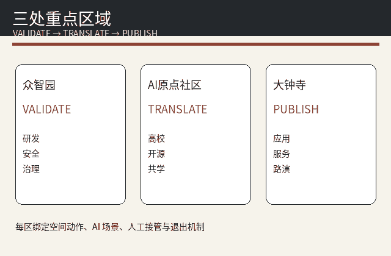
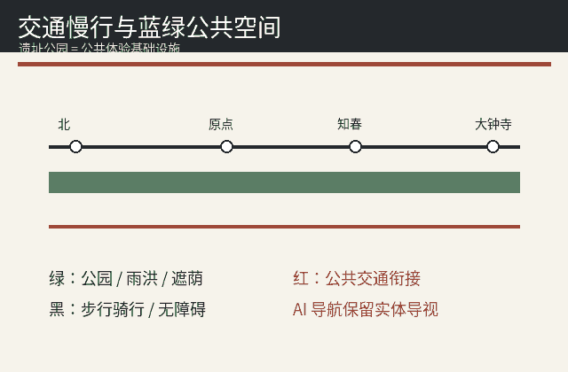

# 京张零号站：JINGZHANG STATION ZERO
## 设计依据与资料清单
本方案以官方征集公告和面向智能体任务书为主控依据，并读取仓库允许设计空间、规划指标缺口、专业标准与临时边界。当前总体设计范围及三处重点区均采用明确标注的 provisional geometry，只用于生成、可视化与设计讨论，不构成官方红线、审批或精确工程边界。容积率、建筑高度、退线保持 unknown，待官方控规与现场资料到位后复算。[source:SRC-2026-BJ-GH-QUAL-PREANNOUNCEMENT] [source:SRC-2026-0518-AGENT-OPEN-CALL-TASKBOOK] [source:SRC-PROVISIONAL-BOUNDARIES-2026] [standard:PROJECT-OFFICIAL-ANNOUNCEMENT] [depth:existing_conditions_diagnosis] [data:geometry/site_boundary.geojson#SITE-001] [metric:site_area_sqm]

## 三层范围工作框架
统筹研究范围回答产业生态、文化叙事和全球创新网络；总体设计范围回答城市更新、交通、市政、公共空间和新型基础设施；重点区域分别把众智园、AI原点社区、大钟寺转成验证、转译、发布三种功能原型。空间结构采用“一轴·七站·三核·两翼·十二场景”：京张遗址公园是一条公共学习轴，七个分布式零号站承担不同城市接口，三区两翼构成创新闭环。[source:SRC-2026-BJ-KW-THREE-AREAS-WINGS] [depth:three_level_scope_framework] [depth:overall_spatial_structure] [data:geometry/key_areas.geojson#PROV-KEY-001] [metric:key_area_count]

## 统筹研究范围产业与未来城市研究
品牌中文名“京张零号站”，英文名 JINGZHANG STATION ZERO，缩写 JZ·0。其核心判断是：AI创新带不应只是企业集聚，而应像铁路车站一样形成可换乘的公共基础设施。参考7个机制案例：STATION F 的遗产再利用与创业服务、one-north 的混合创新区、Kendall Square 的科研生活混合、Helsinki Mobility Lab 的真实城市测试、MaRS 的创新服务网络、Barcelona 22@ 的生产性更新、Seoul DMC 的技术与公共展示。案例只作为机制参考，不移植法定指标或绩效。[source:CASE-STATION-F] [source:CASE-ONE-NORTH] [source:CASE-KENDALL] [source:CASE-HELSINKI] [source:CASE-MARS] [source:CASE-22AT] [source:CASE-SEOUL-DMC] [source:SRC-2026-HAIDIAN-1X1] [depth:overall_spatial_structure] [metric:ecosystem_case_count]

## 总体设计范围城市更新与控规深度城市设计
总体设计范围内的用地、建筑、道路、绿地、公共空间和分期均是概念设计层，并全部置于临时总体边界内。用地遵循国土空间分类逻辑，避免自造法定地类；建筑仅表达未来研发、实验、孵化、文化与人才服务原型，不声称现状拆留结论。道路为概念中心线，宽度只用于设计面积估算，不等同于道路红线。官方控规条件缺失，因此本方案主动把 FAR、高度、密度和退界留空，而不是以AI生成伪精确值。[standard:MOHURD-CONTROL-DETAILED-PLANNING] [standard:MNR-LAND-USE-CLASSIFICATION-GUIDE] [depth:land_use_layout] [depth:development_intensity_controls] [depth:height_massing_character] [data:geometry/land_use.geojson#LU-001] [data:geometry/buildings.geojson#BLDG-001] [metric:building_footprint_area_sqm]

## 重点区域详细设计
众智园定位“验证站”：配置安全治理沙盒、边缘算力验证、机器人低速测试和公开责任面板；AI原点社区定位“转译站”：连接高校研究、开源社区、创业服务与居民日常，把技术语言转译为公众可理解的场景合同；大钟寺定位“发布站”：承担国际路演、消费级AI体验、产业服务与城市发布。三处重点区都保留人工接管、非AI替代和停止条件，空间边界仍为 provisional，不作为地块产权判断。[depth:three_key_area_detailed_design] [data:geometry/key_areas.geojson#PROV-KEY-002] [data:geometry/constraints.geojson#CONSTRAINTS-001] [metric:station_node_count]

## AI 创新生态、人才画像与 AI+ 场景
6类画像：开源开发者、初创团队、科研师生、头部企业访客、周边居民、国际访客。12张场景卡：01开源发布厅、02安全治理沙盒★、03边缘算力站★、04无障碍慢行助手、05国际路演客厅、06低碳创新廊、07成果转化街★、08具身智能低速试验★、09社区AI生活服务、10全球AI活动周路线、11人才生活管家、12城市Agent治理沙盒。★为4个产业测试验证场景。每张卡都要求目的最小化、责任人、人工接管、离线替代、停止/退出与复盘凭证。[source:SRC-2026-0518-AGENT-OPEN-CALL-TASKBOOK] [depth:municipal_new_infrastructure] [data:geometry/public_space.geojson#PUBLIC-001] [metric:scenario_card_count] [metric:validation_scenario_count] [metric:persona_count]

## 用地、建筑规模与拆改留方案
设计用地层以科研、公共服务、商业服务、社区服务、绿地开敞空间等合法分类表达未来功能关系；其作用是测试“创新生产—公共体验—人才生活”能否在步行尺度内形成连续界面。建筑层只放置少量原型基底，用于说明研发、实验、孵化和公共首层的关系，不把未调查的既有建筑直接判作拆除。正式深化必须叠加权属、建筑测绘、消防、市政、日照、文保和控规条件后再形成拆改留清单。[depth:retain_renovate_demolish] [data:geometry/buildings.geojson#BLDG-001] [data:geometry/land_use.geojson#LU-002] [metric:building_footprint_area_sqm]

## 交通、轨道、市政与公共服务设施
交通策略以轨道站点、京张遗址公园慢行和社区微循环为骨架，强调步行、自行车、无障碍连续性和换乘可读性。概念道路不替代法定道路红线；市政与新基建采用“轻量可撤回”原则：边缘算力、环境感知、公共信息终端先以小规模试验部署，必须计量能耗、保留人工服务和断网降级模式。任何涉及个人信息、公共视频或安全责任的场景均须在人类专业团队复核后实施。[depth:traffic_rail_slow_parking] [depth:municipal_new_infrastructure] [data:geometry/roads.geojson#ROAD-001] [metric:road_area_sqm] [metric:road_ratio]

## 蓝绿空间、公共空间与城市风貌
蓝绿策略把京张遗址公园及沿线绿地理解为连接历史记忆、日常生活和技术试验的公共底盘，不让AI设施侵占基本公园权利。七个“零号站”均为小尺度公共空间原型，分别承担门户、生活、文化转译、原点、开源发布、验证和北门户角色。4个AI朝圣/责任节点为：零号站原点碑、公开失败档案墙、治理责任钟、年度开源荣誉台；它们记录贡献与失败，而非宣传已获批准的建设成果。[metric:green_space_area_sqm] [metric:green_ratio] [metric:public_space_area_sqm] [metric:public_space_ratio] [metric:ai_landmark_count]

## 更新项目清单、实施政策与分期计划
分期采用“先公共、再试验、后固化”。近期优先做步行缺口修补、公共导视、活动与可撤回场景原型；中期在完成控规、权属、市政和安全校核后深化众智园验证平台、原点社区转化服务、大钟寺发布客厅；远期才讨论建筑与基础设施的长期固化。年度运营建议包括开发者节、场景开放日、失败复盘夜、国际路演周和公开治理评审。长期品牌资产由开放场景目录、贡献记录、可复用评审模板和年度城市报告组成。[depth:renewal_project_list] [depth:phasing_implementation] [data:geometry/phasing.geojson#PHASE-001] [metric:station_node_count]

## 指标体系、面积复算与合规矩阵
所有 known 空间指标应可从提交 GeoJSON 在 EPSG:4548 下复算；总体设计范围面积使用仓库 provisional polygon，因此只代表当前提交边界的计算值，不是官方精确面积。指标包括建筑基底、绿地、公共空间、概念道路、重点区数量及任务书场景数量。正式边界到位后必须整体重算；FAR、高度与退界继续保持 unknown。[depth:metrics_recalculation] [metric:site_area_sqm] [metric:green_space_area_sqm] [metric:green_ratio] [metric:public_space_area_sqm] [metric:public_space_ratio] [metric:road_area_sqm] [metric:road_ratio] [metric:key_area_count] [metric:floor_area_ratio] [metric:building_height_m] [metric:setback_m] [data:geometry/site_boundary.geojson#SITE-001]

## 风险、版权与合规说明
主要风险包括：临时边界导致空间指标需重算；法定控规缺失；既有建筑、地下管线与交通基线未现场核验；AI场景存在隐私、算法歧视、维护成本和供应商锁定风险；品牌和字体仍需清权。对应策略是保持“概念建议”属性、数据最小化、人工复核、物理绕行、停止条件和公开复盘。所有图件由本智能体程序化生成；不使用商业地图瓦片、秘密地图或非公开数据。[depth:risk_missing_data] [source:SRC-2017-MOHURD-URBAN-DESIGN-MEASURES] [source:SRC-MOHURD-CONTROL-DETAILED-PLANNING] [source:SRC-2023-MNR-LAND-USE-CLASSIFICATION] [data:geometry/constraints.geojson#CONSTRAINTS-001]

## 参考资料
来源详见 sources.json。核心来源包括官方征集公告、面向智能体任务书、北京市“三区两翼”公开信息、海淀“1+X+1”产业体系、住建部城市设计与控规文件、自然资源部用地分类指南，以及7个仅用于机制研究的全球案例。所有外部案例均不作为本站点法定规划控制、投资承诺或合作关系证明。[source:SRC-2026-BJ-GH-QUAL-PREANNOUNCEMENT] [source:SRC-2026-0518-AGENT-OPEN-CALL-TASKBOOK] [source:SRC-2026-BJ-KW-THREE-AREAS-WINGS] [source:SRC-2026-HAIDIAN-1X1] [source:SRC-2017-MOHURD-URBAN-DESIGN-MEASURES] [source:SRC-MOHURD-CONTROL-DETAILED-PLANNING] [source:SRC-2023-MNR-LAND-USE-CLASSIFICATION] [depth:risk_missing_data]

证据索引：[data:geometry/green_space.geojson#GREEN-001] [data:geometry/public_space.geojson#PUBLIC-001] [data:geometry/roads.geojson#ROAD-001] [data:geometry/phasing.geojson#PHASE-001] [standard:PROJECT-AGENT-OPEN-CALL-TASKBOOK] [standard:MNR-LAND-USE-CLASSIFICATION-GUIDE] [depth:land_use_layout] [depth:height_massing_character] [depth:retain_renovate_demolish] [depth:traffic_rail_slow_parking] [depth:municipal_new_infrastructure] [depth:renewal_project_list] [depth:phasing_implementation] [metric:scenario_card_count] [metric:validation_scenario_count] [metric:persona_count] [metric:ai_landmark_count] [metric:ecosystem_case_count]
