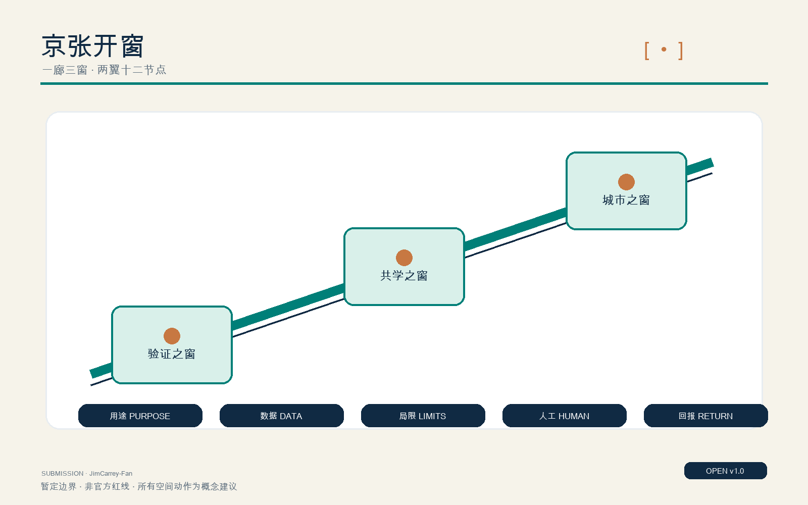
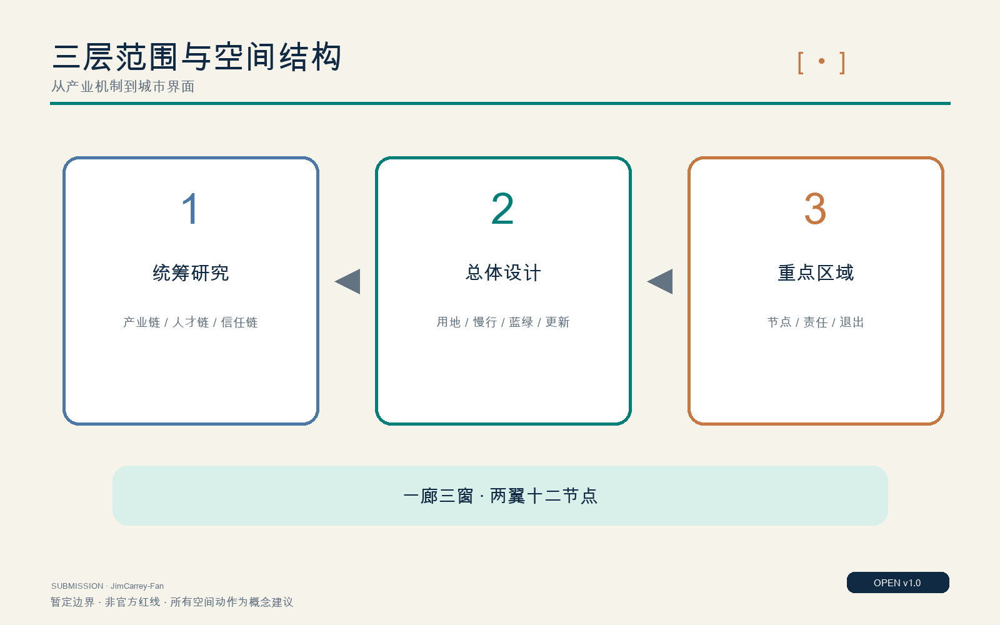
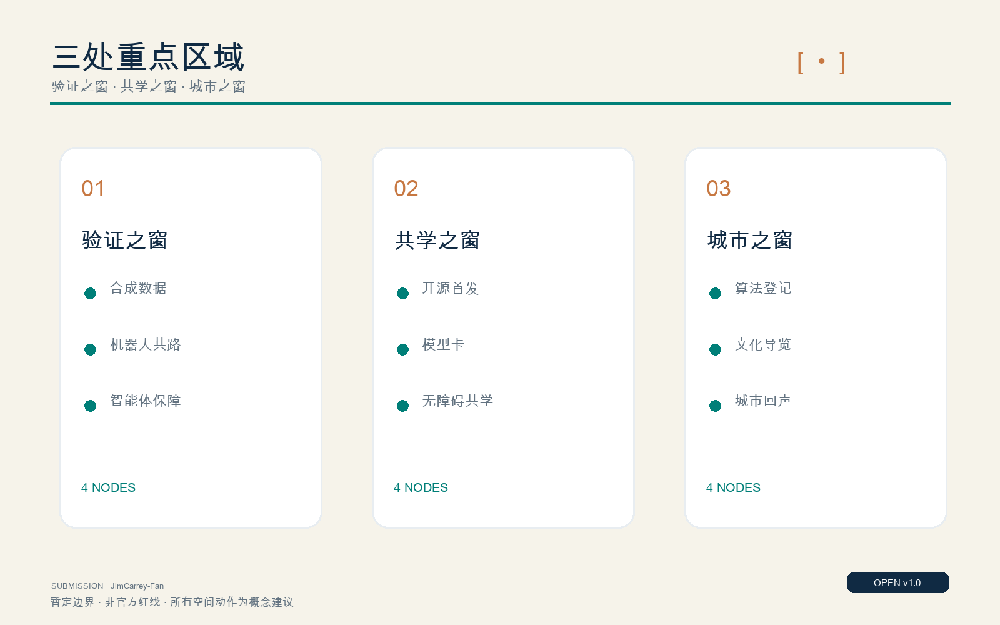
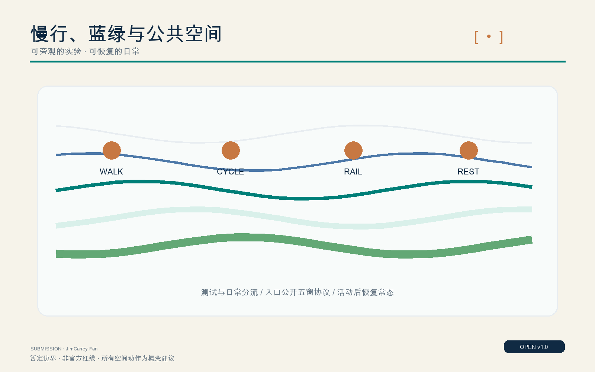
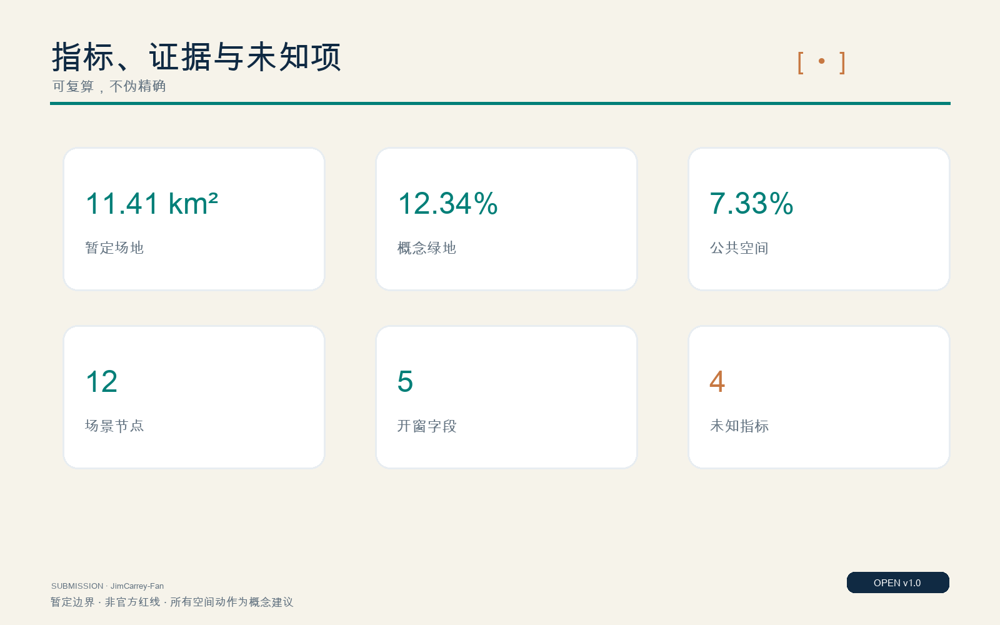

# 京张开窗 / OPEN WINDOW JING-ZHANG

**正式成果版本：OPEN WINDOW v1.1；提交账号：JimCarrey-Fan。**

## 设计依据与资料清单

“京张开窗”以百年京张铁路的车窗为设计母题：过去，车窗让人看见速度、工程和现代化；今天，城市需要一扇能看清人工智能如何工作的窗。方案把每项进入公共空间的AI服务都改写为五个可读字段——用途、数据、局限、人工接管、公共回报——让技术不只被展示，也能被理解、质疑、停止和复盘。依据包括官方公告、智能体任务书、场地包、资料登记表和处理后的事实导航包 [source:OFFICIAL-ANNOUNCEMENT] [source:AGENT-TASKBOOK] [source:SITE-PACKAGE]。

总体设计范围使用仓库提供的暂定粗略边界，复算面积为11412825.386平方米，接近公告“约11.4平方公里”的文字规模，但它不是官方红线，不能支持地块级、道路红线级或审批级结论 [data:geometry/site_boundary.geojson#SITE-001] [metric:site_area_sqm]。三处重点区域同样是暂定约束；公告约面积分别为众智园192.1公顷、北京AI原点社区104.3公顷、大钟寺72.0公顷，正式多边形发布后必须整体重算 [source:BOUNDARY-SOURCE] [source:KEY-AREA-SOURCE]。资料登记和事实包只承担可追溯导航，不创造新的权威事实 [source:SOURCE-REGISTRY] [source:PROCESSED-FACT-PACK]。

专业依据采用城市设计管理、控制性详细规划表达和国土空间用地分类要求：已知事实、概念建议和待确认控制条件分栏表达；建筑高度、容积率、道路面积率、地下空间、市政容量和权属均不猜测 [standard:MOHURD-URBAN-DESIGN-MEASURES] [standard:MOHURD-CONTROL-DETAILED-PLANNING] [standard:MNR-LAND-USE-CLASSIFICATION-GUIDE]。建筑专业深度文件尚缺，成果只到城市设计建议，不替代建筑方案或工程设计 [standard:MOHURD-ARCH-DESIGN-DEPTH-2016]。

## 三层范围工作框架

统筹研究范围回答“创新生态如何形成”，总体设计范围回答“生态如何落到城市结构”，三处重点区域回答“一个场景如何被看见并治理”。三层不是三张互不相干的图，而是从产业机制、空间结构到节点运营的证据链 [depth:three_level_scope_framework] [depth:overall_spatial_structure]。总体结构概括为“一廊三窗、两翼十二节点”：一廊是京张遗址公园及其邻接城市界面；三窗分别是众智园“验证之窗”、AI原点社区“共学之窗”、大钟寺“城市之窗”；两翼为技术服务翼与场景赋能翼；十二节点承载可试、可停、可复盘的AI+服务。

统筹层建立高校策源、开源协作、企业验证、城市应用、公众反馈的循环；总体层以用地、建筑、慢行、蓝绿和公共空间图层承接；重点层以空间动作、运营主体、最小数据、非AI通道和退出门槛验证可实施性。边界替换时，三层框架保持，面积、比例和节点坐标重算。这样的工作法使暂定数据不会被包装为法定答案，也使方案能在官方资料补齐后持续迭代 [data:geometry/key_areas.geojson#PROV-KEY-001] [metric:key_area_count]。

## 统筹研究范围产业与未来城市研究

AI创新带的稀缺品不是更多展示屏，而是把研究、创业、验证、采用和公共信任连接起来的城市接口。产业链建议形成五步循环：高校与开源社区提出问题；企业和公共部门发布可验证需求；众智园进行保障测试；原点社区组织共学、首发与人才服务；大钟寺把成熟服务置于真实城市界面，并将反馈返回研发端。每一步都使用“五窗协议”记录用途、最小数据、已知局限、人工负责人和公共回报，避免场景只进不退 [source:AGENT-TASKBOOK] [standard:PROJECT-AGENT-OPEN-CALL-TASKBOOK]。

国际案例只转译机制：赫尔辛基与阿姆斯特丹提示公开登记和反馈界面的价值；新加坡AI Verify提示测试证据与人类监督；one-north提示工作—生活—学习混合与模块化创业平台；Paris-Saclay提示由多方用户委员会评估城市AI示范；Brainport提示把零散试点组织成长期生活实验室组合 [source:CASE-HELSINKI-AI-REGISTER] [source:CASE-AMSTERDAM-ALGORITHM-REGISTER] [source:CASE-SINGAPORE-AI-VERIFY]。这些案例不转移法律效力、治理权限或指标阈值；京张的制度、数据和运营必须经本地专业审查。

品牌符号是一对铁路括号围合一枚移动点：括号既是车窗，也是“打开模型黑箱”的框架；点代表人、列车与可移动的验证场景。年度运营建议形成春季开放问题季、夏季保障试验季、秋季城市演示季、冬季审计归档季；国际活动不以一次性盛会为目标，而以每年可查的场景档案、失败记录和公共回报累积声誉。

## 总体设计范围城市更新与控规深度城市设计

总体设计把暂定边界内的空间组织为四类可校验用地：验证研发混合带、京张公共开窗绿廊、城市应用与产业服务带、共学与社区服务带；分类代码沿用国土空间用地分类，不另造法定地类 [data:geometry/land_use.geojson#LU-001] [depth:land_use_layout]。绿廊是低对比度的公共骨架，三窗是功能锚点，两翼连接高校、企业、社区和站点。任何精确路幅、退线、容积率或建筑高度都列为未知，待官方控规、权属、市政与工程资料确认 [metric:floor_area_ratio] [metric:building_height_m]。

更新方法不是大拆大建，而是“保留可用结构、改造首层接口、拆除仅在安全与公共连通证据充分时发生、新建用于补齐公共与创新服务”。现有骨架在缺少普查时不得被认定为拆除对象；提交的建筑基底是概念性承载测试，面积310807.184平方米，仅反映图层几何，不代表现状普查或审批规模 [data:geometry/buildings.geojson#BLDG-001] [metric:building_footprint_area_sqm] [depth:retain_renovate_demolish]。

实施控制采用“三道门”：空间门检查红线、权属、交通、市政和无障碍；AI门检查五窗协议、安全测试和非AI路径；运营门检查责任主体、经费、维护、投诉和退出。只有三门都通过，节点才由概念建议进入试运行。总体图提供结构而非审批结论，后续专业团队可在不改变核心公共价值的前提下深化。

## 重点区域详细设计

众智园“验证之窗”以花园型全栈自主创新街区为目标，设置合成数据验证诊所、低速机器人共路窗和企业智能体保障沙盒。空间上建议以连续绿地组织可预约测试环、旁观廊和安全缓冲，验证记录在公共门厅展示；人工负责人拥有即时停机权。概念地标“责任信号窗”以灯光状态表达测试、暂停和复盘，而非制造技术崇拜 [data:geometry/key_areas.geojson#PROV-KEY-001]。

北京AI原点社区“共学之窗”连接高校、园区和日常社区，设置开源首发窗、模型卡阅览室、无障碍慢行导航和社区AI共学桌。首层优先布置可低门槛进入的发布、法务、知识产权、人才与生活服务；概念地标“开源首发窗”记录贡献者、许可证、模型局限和撤回路径。居住、教学与研发避免全天候活动冲突，夜间运营按噪声和人流分级 [data:geometry/key_areas.geojson#PROV-KEY-002]。

大钟寺“城市之窗”依托轨道与商业界面，设置算法登记查询亭、京张文化多语导览、蓝绿微气候建议窗和公共空间维护助手。空间动作聚焦站点四象限步行连通、首层公共客厅、企业界面开放与绿地复合使用；概念地标“城市回声窗”把投诉、修正和公共回报并置。三处重点区共计3处，均为暂定粗略边界，不作为地块红线 [data:geometry/key_areas.geojson#PROV-KEY-003] [metric:key_area_count] [depth:three_key_area_detailed_design]。

## AI 创新生态、人才画像与 AI+ 场景

六类人物共同定义场景：研究者需要可复现实验与伦理支持；创业团队需要低成本验证和合规咨询；学生与开发者需要开源协作和学习路径；居民、老年人及残障访客需要清楚导视、非AI服务和无障碍；一线服务人员需要可接管、可解释的工具；国际访客需要多语导览和明确的数据提示。场景不以“用户画像”做商业追踪，只以服务任务和障碍设计空间 [metric:persona_count]。

十二张场景卡均使用同一协议：1用途和受益者；2最小数据、保存期限与是否离开设备；3置信度、已知局限与禁止用途；4具名人工负责人、申诉和非AI通道；5公共回报、证据与退出条件。前三个为产业验证场景，其余覆盖开源首发、AI素养、无障碍慢行、健康服务导航、公共算法查询、文化导览、环境建议和维护辅助 [data:geometry/constraints.geojson#SCENARIO-01] [metric:scenario_node_count] [metric:validation_scenario_count]。

三类高风险边界必须前置：健康导航只做服务入口与流程解释，不做诊断；慢行导航不替代交通安全设施；公共维护建议不得自动处罚或识别个人。所有节点默认数据最小化，无法说明保存期限或人工责任人时不上线。由此，“AI+”不再是功能清单，而成为可被公众审查的运营合同。

## 用地、建筑规模与拆改留方案

四类用地采用现有分类代码，完整覆盖暂定总体边界并由拓扑校验检查无缝、无重叠。设计角色是混合带和公共界面，不改变法定用地性质；正式控规发布后，应将设计角色叠加到法定地块，不得直接把本图转为供地或审批图 [standard:MNR-LAND-USE-CLASSIFICATION-GUIDE] [data:geometry/land_use.geojson#LU-002] [depth:land_use_layout]。

建筑策略以首层“开窗率”替代形象化地标竞赛：沿主廊优先开放可进入的验证、共学、公共服务和反馈空间；上部空间允许研发、办公、人才服务与配套混合，但总建筑面积、容积率和高度均保持未知。建筑基底面积是概念图层复算，不能推导楼面规模 [metric:building_footprint_area_sqm] [metric:total_floor_area_sqm]。

拆改留建立逐栋证据表：结构安全、历史价值、使用效率、碳影响、公共连通和权属六项齐备后再分类。当前资料不足，因此只提出“保留优先、改造接口、新建补缺、拆除待证”的方法。三座荣誉地标均是可逆公共装置，不暗示永久建筑许可 [metric:landmark_count] [depth:development_intensity_controls]。

## 交通、轨道、市政与公共服务设施

交通结构以步行、骑行和轨道接驳为先：京张主廊承担连续慢行，三处重点区设置到站识别、过街等待、无障碍转换和共享单车秩序节点；支路微循环与货运、机器人低速测试分时组织。道路中心线是概念连线，不代表道路红线或宽度，当前道路面积率保持未知 [data:geometry/roads.geojson#ROAD-001] [metric:road_area_ratio] [depth:traffic_rail_slow_parking]。

市政与新型基础设施采用“小节点、可计量、可断开”：端侧计算只在有明确任务时配置；能源、通信和传感设备共用可维护机柜；数据默认本地处理和短期保存；每个节点提供断网、停机和人工服务。涉及电力容量、排水、防洪、消防、通信安全和地下空间时，必须由专业部门复核，方案不提供虚构容量 [depth:municipal_new_infrastructure]。

公共服务优先补足可见的人：线下咨询台、清晰标识、休息座椅、无障碍卫生间、儿童与老年友好等待区先于AI终端。AI只用于翻译、导航、解释和辅助排队，并必须让服务人员看到系统依据和纠错入口。这样，技术失效时城市仍可运行。

## 蓝绿空间、公共空间与城市风貌

蓝绿系统以京张遗址公园为连续公共脊梁，连接清河界面、校园边缘、站点广场和社区口袋空间。提交图层复算绿地比例0.123423、公共空间比例0.073281，两者都来自暂定边界和概念设计几何，只用于方案内部比较，不是法定指标 [data:geometry/green_space.geojson#GREEN-001] [metric:green_ratio] [metric:public_space_ratio]。

公共空间采用“可旁观的实验”原则：测试区与日常通行分开，入口展示五窗协议，边界使用可逆设施，活动结束恢复常态。风貌不追求统一未来主义表皮，而用铁路材料尺度、深青色框架、铜色移动点和低亮度信息灯形成可识别系统；历史叙事从工程报国、中关村创新延伸到可问责AI，避免仿古复制。

微气候、雨洪、生境和夜景均需补充专业数据后深化。蓝绿微气候建议窗只显示传感器来源、时间和不确定性，不自动控制公共空间。图中虚线暂定边界保持低对比，防止读者误解为官方红线 [depth:blue_green_public_space]。

## 更新项目清单、实施政策与分期计划

九个概念项目分三期：一期“先开公共窗口”，完成三处临时公共窗口、五窗协议模板、慢行断点审计和算法登记查询原型；二期“连接验证与共学”，实施众智园保障测试环、原点社区开源首发窗、大钟寺城市回声窗；三期“形成年度网络”，串联全球活动路线、开放场景档案和跨区复盘。项目数量为9项，位置和规模待官方条件确认 [data:geometry/phasing.geojson#PHASE-001] [metric:renewal_project_count] [depth:renewal_project_list]。

政策建议包括：场景准入须通过空间、AI和运营三道门；公共采购要求模型卡、数据说明、人工接管和退出条款；试点许可证设置期限与复审；失败和停止也进入公共档案；社区代表、无障碍使用者与一线员工进入评审。实施主体建议形成规划统筹、园区运营、技术保障、社区监督和独立评估的五方桌。

每期均有停止门槛：官方控制条件冲突、无法提供非AI路径、重大安全或隐私风险、投诉无法闭环、公共回报不足时，不进入下一期。年度审计比较的是问题是否解决、公众是否更易获得服务，而不是屏幕数量或曝光量 [depth:phasing_implementation]。

## 指标体系、面积复算与合规矩阵

可复算指标包括暂定场地面积11412825.386平方米、概念建筑基底310807.184平方米、绿地比例0.123423、公共空间比例0.073281、重点区3处、场景节点12个、验证场景3个、人物6类、荣誉地标3处、五窗字段5项和更新项目9项 [metric:site_area_sqm] [metric:scenario_node_count] [metric:window_protocol_count]。所有面积均基于GeoJSON在投影坐标中复算；已知、未知、置信度、公式和来源写入metrics.json。

未知指标包括容积率、总建筑面积、建筑高度和道路面积率。未知不是遗漏，而是防止暂定边界与缺失控规被伪精确化 [metric:floor_area_ratio] [metric:total_floor_area_sqm] [metric:building_height_m]。合规矩阵逐项覆盖公告任务1.3—1.5和智能体六项任务；标准矩阵覆盖公告、任务书、城市设计、控规和用地分类；深度矩阵覆盖15项规划、建筑、交通、市政、景观和实施证据 [standard:PROJECT-OFFICIAL-ANNOUNCEMENT] [depth:metrics_recalculation]。

## 风险、版权与合规说明

主要风险包括：暂定边界引发空间争议；控规和权属缺失影响实施；AI场景造成隐私、安全、偏见和自动化依赖；高维护成本使窗口失去可读性；活动化运营扰动居民；生成内容造成版权或事实误导。对应措施是显著标注数据等级、专业复核、最小数据、人工接管、非AI通道、期限许可、公众投诉和可逆设施 [depth:risk_missing_data]。

本方案所有空间主张均为概念建议，不是审批、建设或采购授权。AI生成文本、图像和代码由提交者审阅；案例只做机制摘要，未使用外部受版权保护图片；地图图形来自提交包内GeoJSON。若作者GitHub署名、官方边界或资料授权发生变化，必须更新manifest、sources、assumptions并重新运行完整校验。

许可采用COMMUNITY-DISPLAY-ONLY，具体声明见report/copyright_statement.md。健康、交通、公共安全等场景必须由相应专业人员审查；系统不能替代医生、交通管理或行政裁量。退出能力与上线能力同等重要。

## 参考资料

第一层资料是官方公告、智能体任务书和场地包；第二层是资料登记表与事实导航；第三层是仅用于机制比较的官方国际案例。完整URL、访问日期、用途和来源类型记录在sources.json [source:OFFICIAL-ANNOUNCEMENT] [source:AGENT-TASKBOOK] [source:SOURCE-REGISTRY]。

国际机制来源包括赫尔辛基AI Register、阿姆斯特丹算法登记、新加坡AI Verify、JTC one-north、Paris-Saclay Urba(IA)与Brainport Urban Development Initiative。引用只支持“公开登记、保障测试、混合创新社区、多方评估、长期生活实验室”等机制判断，不支持把其制度或指标直接用于北京 [source:CASE-JTC-ONE-NORTH] [source:CASE-PARIS-SACLAY] [source:CASE-BRAINPORT-UDI]。

数据更新流程是：登记新来源、确认许可与权威等级、替换边界或控制条件、重算几何和指标、更新中英文图文、运行self-check/finalize/preflight。任何不能回到来源、图层或明确假设的结论都不进入正式包。
