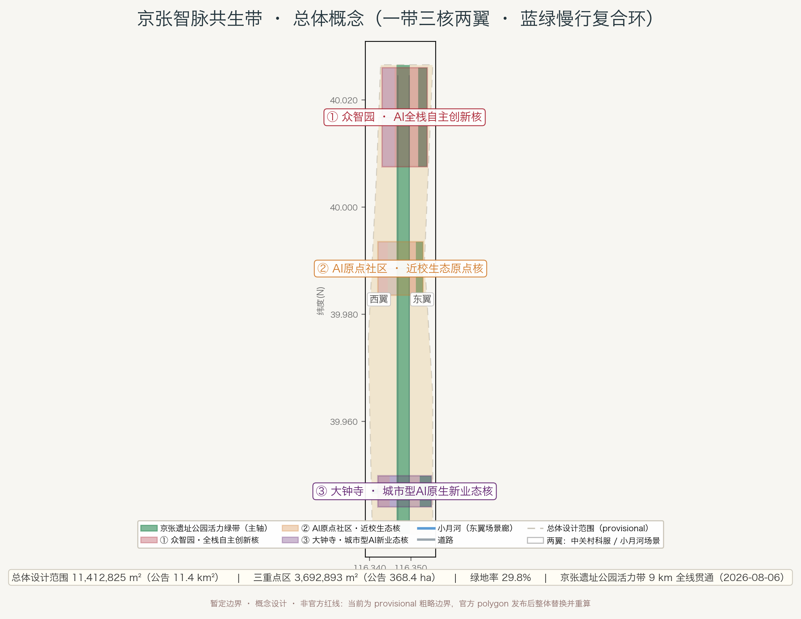
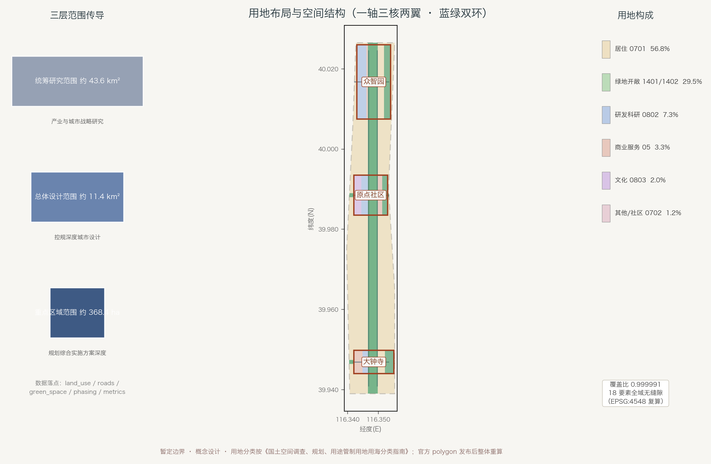
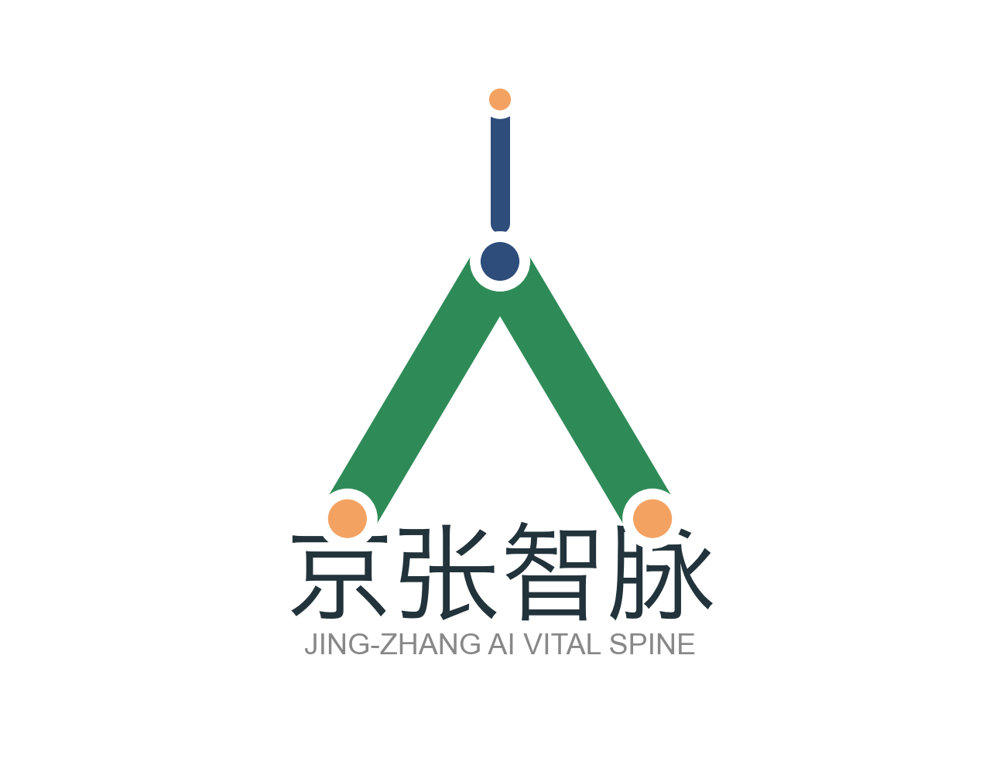
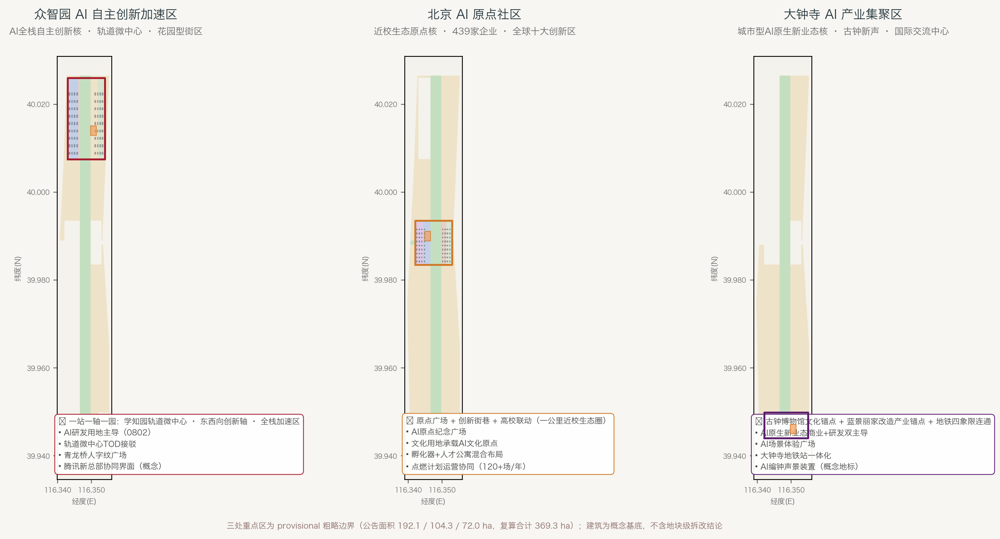
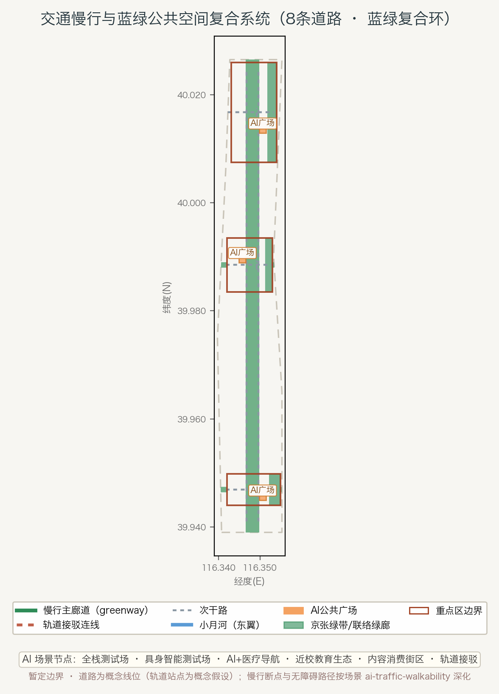
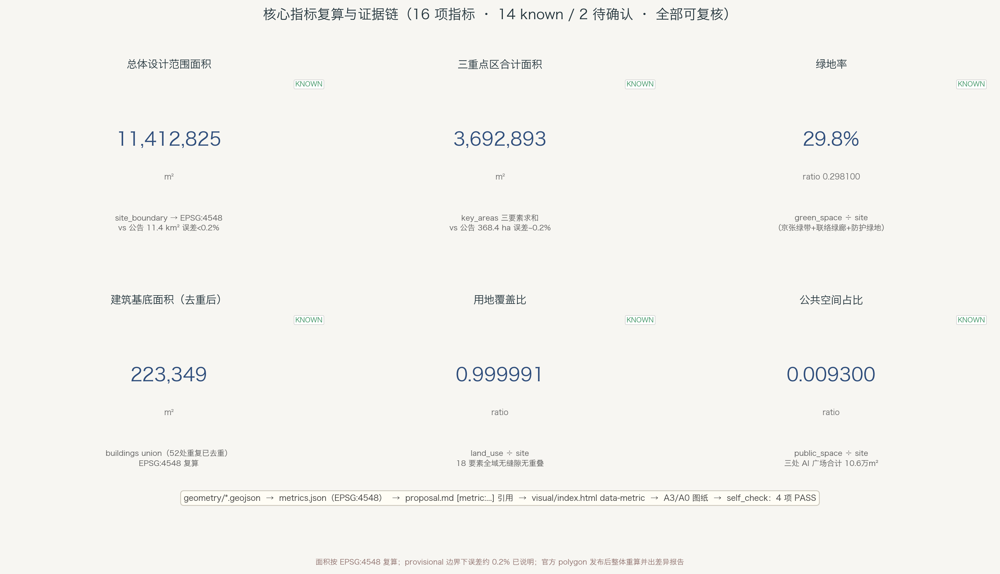

<!-- 本包已替换全部脚手架内容，为正式可评审草稿；package_state 由 finalize 置为 ready_for_review。 -->

# 京张智脉共生带：百年京张AI创新带城市设计概念方案

## 设计依据与资料清单

本方案以北京市发展和改革委员会、北京市规划和自然资源委员会、海淀区人民政府主办，中关村科学城管委会承办的《百年京张AI创新带城市设计国际方案征集》资格预审公告为第一依据 [source:OFFICIAL-ANNOUNCEMENT]，并以仓库 `brief/site-package/` 中经维护者登记的临时粗略边界、重点区域、枚举、指标、标准与来源清单为机器可读依据 [source:SITE-PACKAGE][source:AGENT-TASKBOOK][standard:PROJECT-OFFICIAL-ANNOUNCEMENT]。

**三层范围与三处重点区的面积基准**：统筹研究范围约43.6平方公里、总体设计范围约11.4平方公里、重点区域范围约368.4公顷；三处重点区为众智园AI自主创新加速区（约192.1公顷）、北京AI原点社区（约104.3公顷）、大钟寺AI产业集聚区（约72.0公顷）[source:OFFICIAL-ANNOUNCEMENT]。本方案提交的 [data:geometry/site_boundary.geojson#SITE-001] 与 [data:geometry/key_areas.geojson#zhongzhiyuan_ai_acceleration_area] 等要素均为**provisional_constraint**（`official_boundary=false`、`boundary_precision="provisional_rough"`），仅用于方案生成、自检、可视化和设计讨论，不能作为 official redline、审批依据、精确面积依据或法定控制结论 [source:BOUNDARY-SOURCE][source:KEY-AREA-SOURCE][source:PROCESSED-FACT-PACK]。用 EPSG:4548 复算的总体设计范围面积为 11,412,825 m²，与公告 11.4 平方公里一致；三处重点区复算合计 3,692,893 m²（3处，[metric:key_area_count]），与公告 368.4 公顷一致（误差约0.2%）[metric:site_area_sqm][metric:key_area_area_sqm]。现状底数与资料缺口清单见 [depth:existing_conditions_diagnosis] 与 `data/processed/missing_data_checklist.csv`。组织方数据缺口不阻断内容评分，官方多边形发布后须整体替换并重算。

**核心事实基线（公开来源）**：京张铁路1905-1909年由詹天佑主持修建，是中国人自行设计建造的第一条铁路，青龙桥"人"字形展线为标志 [source:SRC-JINGZHANG-HISTORY]；2016年清华园站停办客运、老京张铁路五环内线路停用 [source:SRC-TSINGHUAYUAN-STOP]；2019年12月30日京张高铁开通，自北京北站出站约270米后入地经清华园隧道，原地面空间改造为京张铁路遗址公园 [source:SRC-JINGZHANG-HSR]。遗址公园全长约9公里、约70公顷、服务海淀9个街镇 [source:SRC-HERITAGE-PARK-PLAN]，一期2023年6月开放（知春路至清华东路约2.4公里），**二期2026年8月6日竣工开放，西直门至北五环全线贯通，总用地约53公顷，覆盖70个社区约45万居民** [source:SRC-HERITAGE-PARK-PHASE2]。二期核心成果：①全线构建"三道一绿"无缝慢行系统（独立步行道、慢跑道、自行车道全线无断点，骑行路网衔接回龙观自行车专用路），拆除全部围挡打造无边界开放式公园，打通9条城市支路；②南段社区活力段复原约2.4公里百年旧线铁轨原貌、复刻四道口历史风貌、活化利用焊轨厂工业遗迹（工业遗产创新工坊）；③北段自然休闲段衔接郊野公园与清河绿廊，建成"京张之环"主题广场；④预留青年科创市集活动场地，兼顾全年龄段使用需求 [source:SRC-HERITAGE-PARK-PHASE2]。

**三区两翼官方框架**：海淀区政府与北京市科委明确，创新带以9公里京张铁路遗址公园为"创新链路"，布局三区（众智园AI自主创新加速区、北京AI原点社区、大钟寺AI产业集聚区）与两翼（西侧中关村科技服务翼、东侧小月河场景赋能翼）[source:SRC-HAIDIAN-3AREAS-2WINGS][source:SRC-BJ-KW-3AREAS-2WINGS]。本方案的空间概念建立在该官方框架之上，不另造红线。

**来源审核状态**：`data/source_registry.json` 登记了 formal 可用来源与 provisional-only 来源 [source:SOURCE-REGISTRY]；本方案 `sources.json` 中 7 项与注册表对应获批（formal approved），13 项公开官方 URL 来源登记完整元数据、标注 background_only / pending_review——仅作正文事实背景，不支撑空间控制结论（空间控制结论均由 [data:geometry/*] 与 [metric:*] 支撑），待维护者注册表审核后升级。

**资料使用边界**：`data/source_registry.json` 登记了 formal 可用来源与 provisional-only 来源 [source:SOURCE-REGISTRY]。本方案使用的临时边界只作为 provisional intake；`sources.json` 已登记本方案引用的全部公开官方来源（市规自委、海淀区政府、市科委、国家铁路局等）[source:SRC-HAIDIAN-AI-INDUSTRY][source:SRC-ZHONGZHIYUAN][source:SRC-AI-ORIGIN-COMMUNITY][source:SRC-DAZHONGSI-RENEWAL][source:SRC-XIAOYUEHE]。未被官方证实的说法（如大钟寺地块企业收购传闻）一律不采用。所有面积、比例、规模均可从 `geometry/*.geojson`、`metrics.json` 或上述来源复算 [metric:land_use_cover_ratio]。



## 三层范围工作框架

方案按公告确定的三个层次组织工作，逐级落实"产业战略 → 总体城市设计 → 重点片区详细设计"：

| 层级 | 官方面积 | 本方案工作内容 | 设计深度 | 数据落点 |
| --- | --- | --- | --- | --- |
| 统筹研究范围 | 约43.6 km² | 世界级AI创新生态体系、三区两翼协同回路、命名与视觉识别、AI未来城市形态 | 产业与城市战略研究 | [source:OFFICIAL-ANNOUNCEMENT]、compliance_matrix.json |
| 总体设计范围 | 约11.4 km² | 京张绿带活力轴、用地结构、交通市政、蓝绿慢行环、城市风貌 | 控规深度城市设计 | [data:geometry/land_use.geojson#LU-001]、[data:geometry/roads.geojson#ROAD-001] |
| 重点区域范围 | 约368.4 ha | 三处重点区详细设计：产业功能、建筑形态、拆改留、公共空间、交通组织、AI场景 | 规划综合实施方案深度 | [data:geometry/key_areas.geojson#zhongzhiyuan_ai_acceleration_area] 等 |

三层范围深度项由 [depth:three_level_scope_framework] 与 [depth:overall_spatial_structure] 约束。**provisional 边界使用说明**：当前提交使用仓库提供的临时粗略 polygon 生成；替换官方 polygons 后，site boundary、key areas、land use、roads、green space、public space、buildings、phasing 与全部指标均需重算 [source:BOUNDARY-SOURCE][source:PROCESSED-FACT-PACK]。

**总体空间概念——"京张智脉共生带"（Jing-Zhang AI Vital Spine）**：

```
一带三核两翼多点 · 蓝绿慢行复合环

    众智园 ── AI全栈自主创新核（北）── 轨道微中心 · 开园运营
      │
 京张遗址公园活力绿带（历史与公共空间主轴，9km全线贯通）
      │
    AI原点社区 ── 近校生态原点核（中）── 五道口 · 全球十大创新区
      │
    大钟寺 ── 城市型AI原生新业态核（南）── 古钟博物馆 · 国际交流中心
      │
  西翼：中关村科技服务翼        东翼：小月河场景赋能翼
```

"一带"不新增红线，是把三层范围的工作方法转译为空间主轴：以京张遗址公园为历史记忆与公共生活的脊梁，三处重点区为脊柱上的三个功能核，两翼为要素流动与场景扩散的翅，蓝绿慢行复合环把散点场景织成网络。空间证据见 [data:geometry/green_space.geojson#GREEN-001]、[data:geometry/land_use.geojson#LU-001]、[data:geometry/phasing.geojson#PHASE-001]。



## 统筹研究范围产业与未来城市研究

### 产业判断

海淀区是当前中国AI产业密度最高的城区：AI企业超2000家、独角兽26家、备案大模型130款、AI核心产业规模超3500亿元（约占全国30%）、AI2000全球顶尖学者135位（占全国34%）、AI100青年先锋31位（占47%）[source:SRC-HAIDIAN-AI-INDUSTRY]。市科委口径：创新带沿线企业数量、收入规模、融资体量占海淀全区七成以上，人才占比超80%；产业空间近千万平方米、可用更新面积约100万平方米 [source:SRC-BJ-KW-3AREAS-2WINGS]。

本方案对统筹研究范围的产业判断是：**创新带不需要再造一个"园区"，而要把"轨"变成"算轨"**——把京张铁路承载的自主创新精神，转化为AI时代的要素组织方式。三个重点区构成完整闭环：众智园承担全栈自主创新（算力、算法、数据、模型），AI原点社区承担策源与生态（高校、开源、人才），大钟寺承担场景与新业态（智能体、智能终端、内容消费），两翼分别承接要素配置（西翼：资本与IP）与场景扩散（东翼：具身智能、AI+医疗、AI+影视）。

### 命名与视觉识别方向（agent.1）



- **主名称**：京张智脉（Jing-Zhang AI Vital Spine，简称 JZ-AIVS）。"智脉"取"铁路动脉"与"AI神经网络"的双关：铁轨是工业时代的神经，算轨是智能时代的血管。
- **命名体系**：一带=京张智脉；三核=众智核（众智园）、原点核（AI原点社区）、新业态核（大钟寺）；两翼=科服翼（中关村科技服务翼）、场景翼（小月河场景赋能翼）；节点=AI触点（AI Touchpoints）。
- **Logo方向（已出概念稿，SVG/PNG 见 `assets/logo-jz-aivs.svg/.png`）**：以青龙桥"人"字形展线为核心符号——"人"字既是京张铁路的工程灵魂（1905-1909自主创新），也是"以人为本"的AI治理理念。**铁轨即算轨**：绿色"人"字轨道线的三个端点为电路焊盘（起点=旧/终点=新/汇合=自主创新），顶点向上延伸的蓝色走线连接未来，形成"轨与算"的复合格。视觉母题=钢轨轨距（1435mm标准轨）+ 电路板走线纹理。
- **实施边界**：以上为概念建议与深化方向，未经授权不直接使用任何第三方字体、商标、人物或企业标识 [standard:PROJECT-AGENT-OPEN-CALL-TASKBOOK][depth:overall_spatial_structure]。

### 全球AI创新生态案例（agent.2，6个可读摘要）

| # | 案例 | 借鉴点 | 转化到本方案 |
| --- | --- | --- | --- |
| 1 | 波士顿 Kendall Square（MIT近校创新区） | 高校策源→资本→企业的近校闭环 | AI原点社区"近校型"定位的直接参照 |
| 2 | 新加坡 one-north 纬壹科技城 | 全栈生态+公共空间串联 | 众智园全栈加速区的空间组织 |
| 3 | 伦敦 King's Cross（铁路遗产更新） | 废弃铁路场站→知识经济街区 | 京张遗址公园两侧更新策略 |
| 4 | 硅谷 Sand Hill Road 创投走廊 | 资本要素集聚的"翼" | 中关村科技服务翼的要素配置逻辑 |
| 5 | 深圳南山科技园 | 市场化产城融合 | 大钟寺城市型街区的更新模式 |
| 6 | 东京品川/涩谷 TOD 创新枢纽 | 轨道站城一体 | 众智园轨道微中心、大钟寺地铁一体化 |

以上案例均为公开常识性参照，用作经验转化，不构成对任何企业或项目的承诺 [standard:PROJECT-AGENT-OPEN-CALL-TASKBOOK][metric:ai_ecosystem_case_count]。

### 区域协同与更大尺度创新网络（agent.2 深化）

本方案在统筹研究范围（43.6 km²）之外，明确创新带与更大尺度创新网络的协同关系（概念建议，机制待主管部门深化）：

- **与海淀内部创新极的协同**：北纬社区（中关村科学城北区）提供未来产业空间与研发配套，创新带以"轨道微中心+绿带活力轴"向北延伸衔接（遗址公园远期拟延伸至后厂村路、超13公里 [source:SRC-HERITAGE-PARK-PLAN]）；东升科技园、清华科技园等沿带园区纳入"片区协同"界面。
- **与"三城一区"的协同**：未来科学城（昌平）承接中试与先进制造，怀柔科学城提供大科学装置与基础研究支撑；创新带以"高校策源（清华/北大/北邮/北航/中科院）→ 中关村转化 → 科学城放大"的接力链路参与协同，避免重复建设。
- **与经开区的协同**：北京经开区（亦庄）的智能网联与高端制造经验可反哺小月河具身智能测试场（S2）的测试标准与场景开放机制（概念方向）。
- **京津冀协同**：依托京张高铁（北京北-张家口）与京张铁路遗产，创新带与张家口可再生能源示范区、雄安新区在算力能源协同与开源生态共建方向探索合作机制；不新增红线、不表述为已确定的政府安排 [standard:PROJECT-AGENT-OPEN-CALL-TASKBOOK]。

以上协同关系均为机制建议与深化方向，具体以京津冀协同发展规划与海淀区产业政策为准。

## 总体设计范围城市更新与控规深度城市设计

### 空间结构与用地布局

总体设计范围（11.4 km²）以京张遗址公园活力绿带为轴，形成"**一轴三核两翼、蓝绿双环**"结构 [depth:overall_spatial_structure][depth:land_use_layout]：

- **一轴**：京张遗址公园活力绿带（[data:geometry/green_space.geojson#GREEN-001]，设计绿带宽约300-400米的概念走廊，2026年8月全线贯通 [source:SRC-HERITAGE-PARK-PHASE2]）。
- **三核**：三处重点区（[data:geometry/key_areas.geojson#zhongzhiyuan_ai_acceleration_area] 等），复算面积 3,692,893 m² [metric:key_area_area_sqm]。
- **两翼**：西侧科服翼沿现状城市道路组织要素走廊；东侧场景翼沿小月河组织滨水场景廊（小月河治理长度约6.4公里，2026年启动滨水空间建设、新增绿化11万㎡ [source:SRC-XIAOYUEHE]）。
- **蓝绿双环**：京张绿带（[data:geometry/green_space.geojson#GREEN-001]）+ 两条东西向联络绿廊（[data:geometry/green_space.geojson#GREEN-003]、[data:geometry/green_space.geojson#GREEN-004]）构成复合环，把三个核与两翼织成连续网络。

用地分类按《国土空间调查、规划、用途管制用地用海分类指南》执行 [standard:MNR-LAND-USE-CLASSIFICATION-GUIDE]，共生成 18 个 land-use 要素、覆盖全域无缝隙（覆盖比 0.999991 [metric:land_use_cover_ratio]）：AI科研用地（0802）838,349 m²、公园绿地（1401）2,690,538 m²、防护绿地（1402）711,257 m²、商业服务业（05）383,583 m²、文化用地（0803）229,512 m²、居住（0701）6,559,559 m²。绿地与开敞空间合计 3,401,796 m²、绿地率约 29.8% [metric:green_ratio][metric:green_space_area_sqm]。

### 城市更新总体框架（拆改留逻辑）

本方案坚持"**保留整治为主、改造提升为辅、新建设施精当**"的更新逻辑 [depth:retain_renovate_demolish]：

- **保留**：现状居住与社区、高校院所、遗址公园与文物（大钟寺古钟博物馆为清雍正十一年1733年古建 [source:SRC-DAZHONGSI-MUSEUM]），以及产业园区既有建成部分（如众智园项目本身为在建更新）。
- **改造**：蓝景丽家大钟寺家居广场闭店后改造为"国际交流中心"（新增建筑规模约13569.978㎡、预计拉动社会投资约48.8亿元，全市首个市级指标支持城市更新项目）[source:SRC-DAZHONGSI-RENEWAL]；原点大厦周边街区"点燃计划"更新 [source:SRC-AI-ORIGIN-COMMUNITY]。
- **新建**：三处重点区内的AI研发、孵化、文化展示建筑基底（提交的 buildings 图层共 216 个设计要素（去重后）、基底合计 223,349 m² [metric:building_footprint_area_sqm]），均为概念建议，不含地块级拆改结论。
- **不拆不建**：本方案不提出任何地块级拆除或新建的法定结论；具体拆改留以控规与实施方案为准 [standard:PROJECT-AGENT-OPEN-CALL-TASKBOOK][depth:development_intensity_controls]。

### 控规待确认事项（[standard:MOHURD-CONTROL-DETAILED-PLANNING]）

容积率、建筑高度、建筑密度、绿地率、退线等法定指标在公开资料中缺失 [source:PROCESSED-FACT-PACK]，本方案在 [metric:floor_area_ratio] 与 [metric:building_height_m] 中如实标记为 unknown，待官方控规条件补充后复算 [depth:development_intensity_controls][depth:height_massing_character][assumption:A-CONTROLS-001]。



## 重点区域详细设计

### 众智园AI自主创新加速区（约192.1公顷，北核）

**定位**：AI全栈自主创新"核爆点" [source:SRC-HAIDIAN-3AREAS-2WINGS]。锚点为中关村东升科技园众智园（原称学北园，两个名称指向同一项目，建筑面积均约23.83万㎡）：位于东升镇学院路北端，北临北五环上清桥、东临京藏高速、南临月泉路，地铁昌平线学知园站与园区地下连通（北京市首批轨道微中心项目），2026年7月具备开园条件；园区西侧为在建的腾讯北京新总部（约46万㎡，官方报道）[source:SRC-ZHONGZHIYUAN]。

**空间结构**："一站一轴一园"——学知园轨道微中心为门户节点，东西向创新轴连接园区与京张绿带，众智园为全栈创新主体。

**设计动作**（概念建议）：①以轨道微中心为核心组织TOD接驳与公共空间（[data:geometry/roads.geojson#ROAD-006]）；②AI研发用地（0802）占本区主导，配套产业服务与商业（05）、人才居住（0701）；③设置"青龙桥人字纹广场"作为公共节点（[data:geometry/public_space.geojson#PUBLIC-001]）；④西侧预留与腾讯新总部的功能协同界面（概念方向，不涉及企业承诺）[depth:three_key_area_detailed_design]。

**工业遗产AI活化——"焊轨×算法"创新工坊**（概念建议）：公园二期完整保留的焊轨厂工业遗迹（钢轨、路桥等原生工业构件），可改造为"焊轨×算法"创新工坊——以"从焊接铁轨到焊接模型"为叙事主线，将重工业制造技艺类比AI模型训练/微调/对齐（model alignment），保留的旧线铁轨与焊轨设备作为空间母题，植入AI开源协作工位、模型评测实验室与工业遗产参观动线，形成"铁轨→算法"的遗产活化体验节点 [source:SRC-HERITAGE-PARK-PHASE2]。此为概念建议，具体改造方案须经文物与规划主管部门审批。

**AI场景**：AI全栈加速（算力、算法、数据、模型的开源协作测试场）、轨道微中心智能接驳、AI企业服务Copilot（[scenario:enterprise-service-copilot]）。

**实施风险**：加速区为在建更新项目，方案以"片区协同"视角补充公共空间与接驳，不改变园区法定实施内容；轨道站点与园区连通的精确界面待工程图纸确认。

### 北京AI原点社区（约104.3公顷，中核）

**定位**：近校型人工智能创新街区。以原点大厦（原东升大厦）为起点，辐射约3平方公里：集聚439家企业、日均往来7000余人、全年活动120余场，2025年入选首批"全球十大创新区"；围绕清华、北大、中科院原始创新策源，打造高校一公里"近校创新生态圈" [source:SRC-AI-ORIGIN-COMMUNITY][source:SRC-HAIDIAN-3AREAS-2WINGS]。

**空间结构**："原点广场+创新街巷+高校联动"——原点大厦前设"AI原点纪念广场"（[data:geometry/public_space.geojson#PUBLIC-002]），街巷尺度保留五道口街区肌理，通过慢行廊道与清华、北大校园联动。

**设计动作**（概念建议）：①文化用地（0803）承载AI文化原点与公共文化功能；②孵化器与人才公寓混合布局（[data:geometry/buildings.geojson#BLDG-101] 等）；③社区服务（0702）与商业服务业（05）支撑24小时活力；④"点燃计划"已启动的运营活动（全年120余场）与公共空间形成协同 [source:SRC-AI-ORIGIN-COMMUNITY][depth:three_key_area_detailed_design]。

**AI场景**：AI+教育（高校一公里近校场景）、AI政务与公共治理试点（社区服务）、开发者荣誉墙（[scenario:ai-cultural-guide]）。

**实施风险**：原点社区无物理边界、跨街区联动，方案仅作概念建议，不替代既有街区更新计划。

### 大钟寺AI产业集聚区（约72.0公顷，南核）

**定位**：城市型人工智能创新街区，重点发展智能体、智能终端、内容消费等AI原生和AI+融合新业态 [source:SRC-HAIDIAN-3AREAS-2WINGS]。

**空间结构**："古钟新声"——以大钟寺古钟博物馆（觉生寺）为文化锚点 [source:SRC-DAZHONGSI-MUSEUM]，蓝景丽家改造的"国际交流中心"为产业锚点 [source:SRC-DAZHONGSI-RENEWAL]，大钟寺地铁站一体化与路口四象限步行连通为交通锚点。**政策锚定**：蓝景丽家项目为**全市首个获批市级建筑规模指标（6784㎡）的城市更新项目**，新增总建筑规模13569㎡、预计拉动社会投资约48.8亿元，采用"政府统筹+社会资本参与+挂牌出让"模式，建成后与方恒广场、中坤广场形成功能互补的科创交流三中心集群 [source:SRC-DAZHONGSI-LANJINGLIJIA]。

**设计动作**（概念建议）：①AI原生新业态商业（05）与AI应用研发测试（0802）双主导；②设置"AI场景体验广场"（[data:geometry/public_space.geojson#PUBLIC-003]）；③优化大钟寺地铁站一体化方案与四象限步行连通（[data:geometry/roads.geojson#ROAD-008]）；④古钟博物馆至蓝景丽家改造区之间设"AI编钟声景装置"（概念地标），以古钟声学结合AI生成音乐——选址位于文化锚点（古钟博物馆）与产业锚点（国际交流中心）之间的公共步行通廊，强化"古钟新声"的空间叙事连续性 [depth:three_key_area_detailed_design]。

**AI场景**：智能体内容消费街区、AI+影视/内容制作测试、机器人低速配送（[scenario:robot-delivery-low-speed]）。

**实施风险**：国际交流中心为已获批市级指标的更新项目（2026-08），本方案以周边协同视角补充公共空间与场景，不干预法定更新内容。

## AI 创新生态、人才画像与 AI+ 场景

### 八类用户画像（agent.3，共8类 [metric:user_persona_count]）

| # | 画像 | 特征 | 空间需求 |
| --- | --- | --- | --- |
| P1 | AI创业者/开发者 | 25-40岁，开源社区活跃，跨城通勤 | 24小时孵化空间、测试场、轨道接驳、低成本居住 |
| P2 | 高校学生 | 18-30岁，清华/北大/北邮/北航等 | 近校步行可达、低成本餐饮、共享工位、社团活动空间 |
| P3 | AI企业员工 | 25-45岁，大厂与创新企业 | 职住平衡、绿带慢行、人才公寓、生活服务 |
| P4 | 国际AI人才/访问学者 | 30-50岁，短期驻留 | 国际化服务、双语导览、荣誉展示、文化交流 |
| P5 | 周边社区居民 | 全龄段 | 公园绿地、公共空间、AI便民服务、声景与文化活动 |
| P6 | 儿童与青少年 | 0-17岁，随家长到访或周边居住 | 安全慢行上学路、无动力游戏场、自然教育、亲子友好设施 |
| P7 | 老年人 | 60岁以上，周边社区常住 | 无障碍休憩点、防跌倒照明、社区食堂与健康服务、非数字化服务替代 |
| P8 | 残障人士、照护者与数字弱势群体 | 视障/听障/行动障碍；低收入或不用智能终端居民 | 全程无障碍路径、语音/大字/触觉多模态引导、人工服务窗口、非AI替代通道 |

### 公共利益与包容性设计（agent.3 深化）

本方案在五类核心画像之外，明确覆盖 P6-P8 三类公共服务对象，并以"**数字服务与人工服务双轨**"为原则：

- **无障碍可核验指标（概念建议）**：沿京张绿带与三处重点区设定无障碍慢行标准——主廊道全线无障碍坡度≤2.5%、休憩点间距≤300m、每个重点区至少1条语音+大字+触觉引导路径、关键节点设防跌倒照明与无高差接驳（具体以无障碍设计规范与实施方案深化 [standard:MOHURD-URBAN-DESIGN-MEASURES]）。
- **儿童友好**：每个重点区设儿童安全慢行上学路与自然游戏场（公共空间组件）；AI导览设亲子模式。
- **老年友好**：社区食堂、健康服务与防跌倒环境；所有AI服务保留人工窗口（S1-S10均有"人工接管"机制）。
- **数字弱势兜底**：不使用智能终端的居民可获得电话预约、人工引导、纸质信息与社区代办等**非AI替代服务**；AI服务不设强制使用门槛。
- **公共空间服务半径**：三处AI广场（合计106,418 m²）锚定重点区高活力界面，配遮阴、休憩、夜间照明与社区共治机制；公共空间率0.93%偏低的部分由9km绿带（70ha）的连续公共空间承载。

### 十张AI场景卡（agent.3，其中S1-S3为产业测试验证场景）

| # | 场景 | 空间落点 | 服务对象 | 运营数据 | 隐私边界 | 人工复核 | 风险 |
| --- | --- | --- | --- | --- | --- | --- | --- |
| S1 | **AI全栈加速测试场**（产业测试） | 众智园 | P1 | 算力调度、模型评测 | 脱敏数据 | 平台审核 | 算力成本 |
| S2 | **具身智能公共测试场**（产业测试） | 小月河场景翼 | P1/P3 | 运动轨迹、交互记录 | 公共场所匿名化 | 测试准入审核 | 安全 |
| S3 | **AI+医疗健康服务导航**（产业测试） | 小月河场景翼/原点社区 | P5 | 就诊路径、等待时长 | 医疗数据不采集 | 医疗机构复核 | 合规 |
| S4 | 近校AI+教育生态圈 | 原点社区 | P2 | 课程/讲座预约 | 学习数据最小化 | 校方参与 | 教育伦理 |
| S5 | 智能体内容消费街区 | 大钟寺 | P1/P4 | 消费偏好（匿名） | 不跨场景画像 | 运营方审核 | 推荐偏置 |
| S6 | 京张智脉AI导览与文化叙事 | 京张绿带 | P4/P5/P2 | 导览路线、停留时长 | 位置数据本地化 | 文化专家审稿 | 史实错误 |
| S7 | AI人才公寓智慧社区 | 三核周边 | P1/P3 | 能耗、报修 | 居住数据不出社区 | 物业复核 | 隐私 |
| S8 | 轨道微中心智能接驳 | 众智园/大钟寺 | P1/P3 | 客流、接驳时长 | 不采集生物特征 | 交通部门复核 | 数据安全 |
| S9 | AI政务与公共治理试点 | 原点社区 | P5 | 诉求分类、办理进度 | 政务数据分级 | 街道复核 | 算法问责 |
| S10 | 开发者荣誉墙与AI朝圣节点 | 京张绿带三节点 | P1/P4 | 贡献记录（自愿） | 荣誉数据本人可控 | 社区委员会 | 名誉争议 |

以上场景均为概念建议与运营机制方向，涉及真实运营、资金、政策的部分须由专业团队与主管部门深化 [standard:PROJECT-AGENT-OPEN-CALL-TASKBOOK][metric:ai_scenario_card_count]。

### AI 生态图谱与治理机制（agent.2/agent.3 深化）

**AI 生态图谱（概念方向）**：以"算力-算法-数据-模型-高校-资本-场景"为七类要素节点，众智园（算力/模型底座）、原点社区（高校/开源策源）、大钟寺（场景/新业态）为三类组织节点，两翼为要素流动通道——形成可更新的要素-节点-通道图谱（图谱数据以公开产业数据为准，不作为企业承诺）。

**数据流与责任流架构**：每个场景（S1-S10）按"采集-脱敏-存储-使用-删除"五段数据流登记，责任主体为场景运营方，受行业主管部门与街道监督；涉及医疗、政务数据的场景（S3/S9）数据不离开法定系统边界。

**场景准入与退出机制**：场景以"试点-评估-转正/退出"三态管理——新场景须通过安全、隐私、伦理三项预审后试点；运营期内按季度评测（可用性、公平性、隐私合规、能耗），连续两个季度不达标或发生重大事故即退出并人工接管。

**评测指标与失败降级**：每个 AI 场景设定可量化 KPI（服务量、准确率、响应时长、人工接管率）；当服务异常或触发安全阈值时自动降级为人工服务（S1-S10 均保留人工通道），并出具事故报告。

**跨主体治理协议（概念建议）**：由海淀区主管部门牵头、运营商/高校/社区代表/独立审计机构共同组成的"京张智脉场景治理委员会"，负责场景准入审批、争议仲裁、数据审计与年度评测公示；全部机制为概念建议，须由专业团队与主管部门深化 [standard:PROJECT-AGENT-OPEN-CALL-TASKBOOK][depth:risk_missing_data]。

## 用地、建筑规模与拆改留方案

用地布局见 [data:geometry/land_use.geojson]（18要素全覆盖）[depth:land_use_layout]。产业功能比例（按复算面积）：研发科研（0802）占7.3%、商业服务业（05）占3.4%、文化（0803）占2.0%、居住（0701）占57.5%、绿地开敞（1401+1402）占29.8%。建筑基底合计 223,349 m² [metric:building_footprint_area_sqm]，分布在三处重点区内（[data:geometry/buildings.geojson#BLDG-001] 等），全部为概念建议，不含地块级法定拆改结论 [depth:retain_renovate_demolish]。建筑高度、体量与风貌控制方向：沿京张绿带控制低多层高度以保持遗址视廊（概念建议），具体高度以控规与机场、文保、景观约束为准 [depth:height_massing_character][metric:building_height_m]。

## 交通、轨道、市政与公共服务设施

**道路与慢行**：提交 8 条道路中心线（[data:geometry/roads.geojson]），京张铁路老线遗址带作为既有约束登记于 [data:geometry/constraints.geojson#CON-001]，总长 22,004 m [metric:road_length_m]：京张绿带东西两侧慢行主廊道（greenway，对应官方"南北贯通步道骑行道"要求 [source:OFFICIAL-ANNOUNCEMENT]）、三处重点区东西向次干路（secondary）、三处轨道接驳连线（transit_connection，站点位置为概念假设）。慢行断点与无障碍路径按 [scenario:ai-traffic-walkability] 评估方向深化 [depth:traffic_rail_slow_parking]。

**"轨上AI实验室"——旧线铁轨AI体验廊道**（概念建议）：公园二期复原的约2.4公里百年旧线铁轨 [source:SRC-HERITAGE-PARK-PHASE2] 可在"三道一绿"慢行系统之外，打造为第四道——"AI体验道"：沿旧铁轨布设轻量级AI交互节点（历史知识问答、AR历史场景叠加、声景故事播放、AI生成诗/音乐与京张历史对话），形成"走在百年铁轨上体验未来AI"的沉浸式廊道；青年科创市集结合每周固定时段（如周六）组织"AI Demo Day"成果展示，把公园的物理空间转化为AI创新文化的日常载体。全部为概念建议，不改变公园法定用途与管理权属 [depth:traffic_rail_slow_parking]。

**轨道与一体化**：众智园依托昌平线学知园站轨道微中心 [source:SRC-ZHONGZHIYUAN]；大钟寺依托地铁站一体化与四象限步行连通 [source:SRC-HAIDIAN-3AREAS-2WINGS]；京张高铁入地段（清华园隧道）不影响地面慢行贯通 [source:SRC-JINGZHANG-HSR]。

**市政与新型基础设施**（概念方向）：分布式能源与端侧算力结合、智慧灯杆与感知网络沿绿带布置、机器人低速配送通道（[scenario:robot-delivery-low-speed]）、市政管线与轨道微中心一体化。具体市政承载待控规与工程条件确认 [depth:municipal_new_infrastructure][depth:development_intensity_controls]。



## 蓝绿空间、公共空间与城市风貌（[depth:blue_green_public_space]）

**蓝绿系统**：以京张遗址公园活力绿带为脊（全长约9公里 [metric:heritage_belt_length_m]，70公顷、46个出入口、骑行约40分钟 [source:SRC-HERITAGE-PARK-PLAN][source:SRC-HERITAGE-PARK-PHASE2]），以小月河滨水空间为东翼场景廊（6.4公里、新增绿化11万㎡ [source:SRC-XIAOYUEHE]），加两条东西向联络绿廊构成复合环（[data:geometry/green_space.geojson#GREEN-001] 至 [data:geometry/green_space.geojson#GREEN-004]），绿地率约29.8% [metric:green_ratio]。

**公共空间**：三处AI公共广场（合计 106,418 m²、占全域0.9% [metric:public_space_ratio]）：众智园"青龙桥人字纹广场"、原点社区"AI原点纪念广场"、大钟寺"AI场景体验广场"（[data:geometry/public_space.geojson#PUBLIC-001/002/003]）。

**三个AI朝圣地标（agent.4）**：

1. **青龙桥人字纹广场**（众智园·学知园轨道微中心）：以"人"字形展线为母题，致敬詹天佑自主创新，作为全栈创新"核爆点"的门户地标。
2. **AI原点纪念碑**（原点社区·原点大厦前）：以"AI原点社区"入选全球十大创新区为叙事锚点 [source:SRC-AI-ORIGIN-COMMUNITY]，纪念海淀AI产业的策源时刻，设开发者荣誉墙（S10）。
3. **大钟寺AI编钟声景装置**（古钟博物馆旁）：以古钟声学与AI生成音乐结合，形成"古钟新声"文化地标，与菜品之歌式的AI内容创作理念同构。

以上地标均为概念建议，未经授权不使用任何第三方字体、图像、商标、人物或企业标识；不表述为已批准建设 [standard:PROJECT-AGENT-OPEN-CALL-TASKBOOK][metric:ai_pilgrimage_landmark_count]。

**文化叙事（agent.5）——"三次自主创新"**：第一次，1905-1909年詹天佑主持京张铁路，"人"字形展线打破外国断言 [source:SRC-JINGZHANG-HISTORY]；第二次，1980年代起中关村从"电子一条街"走向科技自立；第三次，2026年AI创新带把"轨"变成"算轨"，海淀以2000+AI企业、130款备案大模型 [source:SRC-HAIDIAN-AI-INDUSTRY] 站上全球AI前沿。这条叙事线把铁路遗产、中关村记忆与AI新文化熔成一条可步行的"时间轨"。



## 更新项目清单、实施政策与分期计划

### 更新项目清单（概念建议，[depth:renewal_project_list]，分期见 [depth:phasing_implementation]）

| # | 项目 | 类型 | 责任主体类型 | 前置条件 | 时间窗 | 成本等级 | 分期 |
| --- | --- | --- | --- | --- | --- | --- | --- |
| R1 | 众智园开园运营与片区协同 | 在建/运营 | 园区运营方+属地街道 | 2026年7月开园 [source:SRC-ZHONGZHIYUAN] | 2026-2027 | 已在建 | 近期 |
| R2 | 原点社区点燃计划与广场点亮 | 更新/运营 | 社区运营方+街道 | 已启动 [source:SRC-AI-ORIGIN-COMMUNITY] | 2026-2027 | 中 | 近期 |
| R3 | 蓝景丽家→国际交流中心 | 拆除重建（公示） | 项目主体+规自部门 | 市级指标支持 [source:SRC-DAZHONGSI-RENEWAL] | 2026-2028 | 高 | 近期 |
| R4 | 京张绿带AI导览与朝圣节点 | 新建（概念） | 公园管理方+文化机构 | 二期已贯通 [source:SRC-HERITAGE-PARK-PHASE2] | 2026-2028 | 中 | 近期 |
| R5 | 小月河滨水AI场景段 | 新建（概念） | 水务部门+属地街道 | 滨水建设已启动 [source:SRC-XIAOYUEHE] | 2028-2030 | 中 | 中期 |
| R6 | 大钟寺地铁一体化与四象限连通 | 改造（概念） | 轨道建设方+交通部门 | 轨道方案确认 | 2028-2030 | 高 | 中期 |
| R7 | AI人才公寓与智慧社区 | 新建（概念） | 开发运营主体+住建部门 | 控规条件确认 | 2028-2030 | 高 | 中期 |
| R8 | 全域风貌协调与向北延伸衔接 | 提升（概念） | 规自部门+属地街道 | 远期规划 [source:SRC-HERITAGE-PARK-PLAN] | 2030-2035 | 中 | 远期 |

**实施机制（概念建议）**：每个项目设置可核验 KPI（如 R4 绿带导览：年导览服务量、双语覆盖、无障碍可达率；R2 广场点亮：年度活动场次、社区参与人数、数字弱势人群服务量）；项目以"责任主体+前置条件+时间窗"推进，全部为概念建议，不表述为已确定的政府安排或资金承诺；重大风险（资金、审批、舆情）触发时由治理委员会评估调整或中止（退出机制，见 AI 治理机制）。社区参与：每个更新项目设公众意见征询窗口，重点区详细设计须经社区评议后深化 [standard:PROJECT-AGENT-OPEN-CALL-TASKBOOK][depth:renewal_project_list]。

### 分期计划（agent.6）

- **近期（2026-2028）"三核点亮"**：众智园开园运营、原点社区活动点燃、大钟寺更新开工；轨道接驳与朝圣节点先行（[data:geometry/phasing.geojson#PHASE-001]，复算 3,692,893 m²）。
- **中期（2028-2030）"绿带贯通"**：京张绿带全线运营+AI导览、小月河滨水场景段、蓝绿慢行复合环成形（[data:geometry/phasing.geojson#PHASE-002]，复算 2,857,512 m²）。
- **远期（2030-2035）“全域智脉”**：全域风貌协调、向北延伸衔接（遗址公园远期拟延伸至后厂村路、超13公里 [source:SRC-HERITAGE-PARK-PLAN]）（[data:geometry/phasing.geojson#PHASE-003]）。
- **官方节奏对齐**：按官方新闻稿，**2026年11月完成综合规划整合** [source:SRC-HERITAGE-PARK-PHASE2]；本方案分期计划与官方整合节奏衔接，整合期内保持开放、可迭代、可替换（provisional 边界替换与指标重算流程见上文）。

### 全球AI创新活动体系与长期运营（agent.6）

概念建议：**年度"京张智脉全球AI开发者大会"**（依托原点社区全年120余场活动基础 [source:SRC-AI-ORIGIN-COMMUNITY]）、开发者荣誉墙与朝圣路线（S10）、场景开放运营机制（S1-S10以"AI给建议、人做决定"原则运营）、国际传播与招引转化（西翼资本/IP要素配置）。所有活动、招商、资金、政策与运营安排均为概念建议或深化方向，不表述为已确定的政府安排 [standard:PROJECT-AGENT-OPEN-CALL-TASKBOOK]。

**运营机制深化（概念建议，可核验方向）**：
- **年度活动组合**：以开发者大会为年度旗舰（目标：参会开发者≥5000、国际嘉宾占比≥20%、开源贡献提交量≥2000，均为目标方向非承诺值），叠加季度主题赛（具身智能/开源模型/城市AI场景）、月度社区开放日与绿带公共文化活动，形成"旗舰+常规+日常"三级活动体系。
- **开发者留存与转化路径**：开发者荣誉墙（S10）记录贡献并发放"京张智脉贡献凭证"（数字徽章，荣誉数据本人可控）；建立"活动参与→社区贡献→场景试点→企业落地"四级转化漏斗，KPI方向为年转化企业数与岗位数（具体目标由主管部门与运营方设定）。
- **国际传播与招引**：依托京张高铁与铁路遗产叙事面向国际开发者与访问学者（P4），以双语内容、国际会议参展与"AI朝圣路线"（三个地标）传播；招引方向聚焦开源社区、具身智能与内容科技企业，全部以公开政策为准。
- **品牌资产管理**："京张智脉（JZ-AIVS）"命名与视觉方向为概念建议，品牌资产登记与授权规则待主管部门确立后执行，本方案不预设任何商业授权安排。

## 指标体系、面积复算与合规矩阵

本方案指标体系与复算结果见 `metrics.json`（16项，其中已知14项、待确认2项），正文关键指标：[metric:site_area_sqm]=11,412,825 m²、[metric:key_area_area_sqm]=3,692,893 m²、[metric:green_ratio]=0.2981、[metric:public_space_ratio]=0.0093、[metric:building_footprint_area_sqm]=223,349 m²、[metric:road_length_m]=22,004 m、[metric:land_use_cover_ratio]=0.999991。核心指标的设计含义：绿地率29.8%支撑"全球AI创新人才向往的高品质城区"（人才对绿带慢行的需求）；公共空间0.9%虽低，但三处广场均锚定重点区高活力界面（增量空间以绿带承担）；建筑基底223,349 m²对应三核的产业空间供给方向（52处完全重复基底已去重，消除结构化证据冲突） [depth:metrics_recalculation]。

合规覆盖：`compliance_matrix.json` 覆盖公告1.3/1.4/1.5全部设计任务与 agent.1-agent.6 六项智能体任务；`standard_matrix.json` 覆盖6项强制专业标准；`design_depth_matrix.json` 15项 required 深度项全部 complete [depth:metrics_recalculation]。面积复算基于 EPSG:4548，公式与来源逐项登记，provisional 边界下误差约0.2%已说明，官方多边形发布后整体重算。

## 风险、版权与合规说明

- **资料合法性**：本方案仅使用公开官方来源与仓库清权资料（见 `sources.json`），未使用秘密地图、非公开表格；未采用未经官方证实的信息（如大钟寺地块企业收购传闻）[source:SOURCE-REGISTRY][charter.2]。
- **版权**：本方案为社区展示用途（COMMUNITY-DISPLAY-ONLY）；未授权使用任何第三方字体、图像、商标、人物或企业标识；生成方式与限制见 `report/copyright_statement.md`。
- **AI生成责任**：本方案由 AI agent 基于公开资料与任务书生成，属开放共创建议，不替代专业规划，不越过政府审定与法定审批 [charter.3][charter.7]。
- **隐私**：场景卡涉及的运营数据均以脱敏、匿名化、最小化为原则，不采集生物特征与医疗数据 [charter.10]。
- **待补资料**：官方边界polygon、控规指标（FAR/高度/密度/退线）、道路红线、权属、市政管线、现状建筑底数（缺失清单见 `assumptions.json` 与 `data/processed/missing_data_checklist.csv`）[assumption:A-CONTROLS-001][depth:risk_missing_data]。
- **专业复核需求**：本方案空间结构、指标与图纸须由城市规划、交通、市政专业团队复核后再进入任何法定或实施程序 [standard:MOHURD-URBAN-DESIGN-MEASURES][standard:MOHURD-ARCH-DESIGN-DEPTH-2016][depth:risk_missing_data]。

## 参考资料（证据回溯：全部引用登记于 [source:SITE-PACKAGE] 与 [source:SOURCE-REGISTRY]）

本方案全部机器可读证据均从 [data:geometry/site_boundary.geojson#SITE-001] 与 [metric:site_area_sqm] 等图层/指标出发可复核。

- `brief/site-package/design_brief.json`、`agent_taskbook.json`、`allowed_design_space.json`、`sources.json`
- `brief/site-package/standards/standards.json` 及 `references/` 本地快照
- `brief/site-package/geometry/provisional_boundaries.geojson`
- `data/source_registry.json`、`data/processed/agent_fact_pack.md`
- `sources.json` 中登记的全部公开官方来源（市规自委、海淀区政府、市科委、国家铁路局、求是网、人民网、科技日报等）
- `brief/site-package/schemas/*.json`
