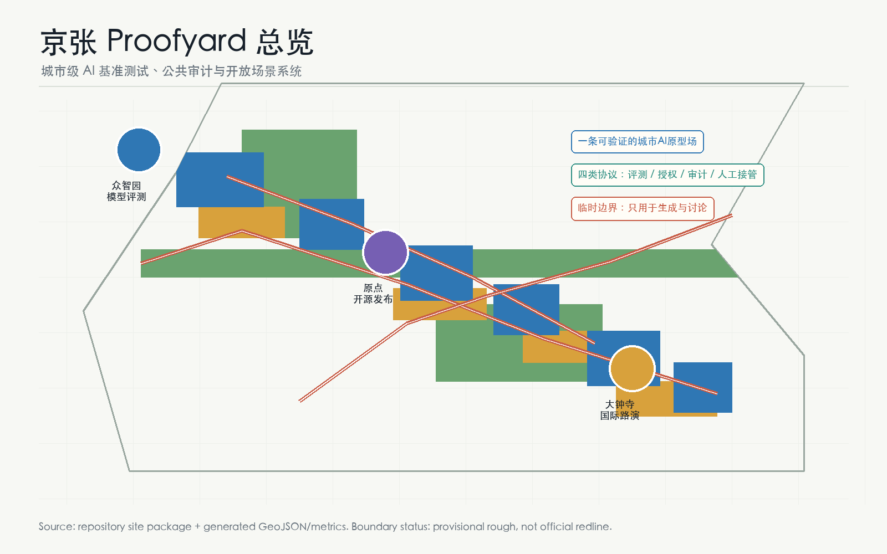
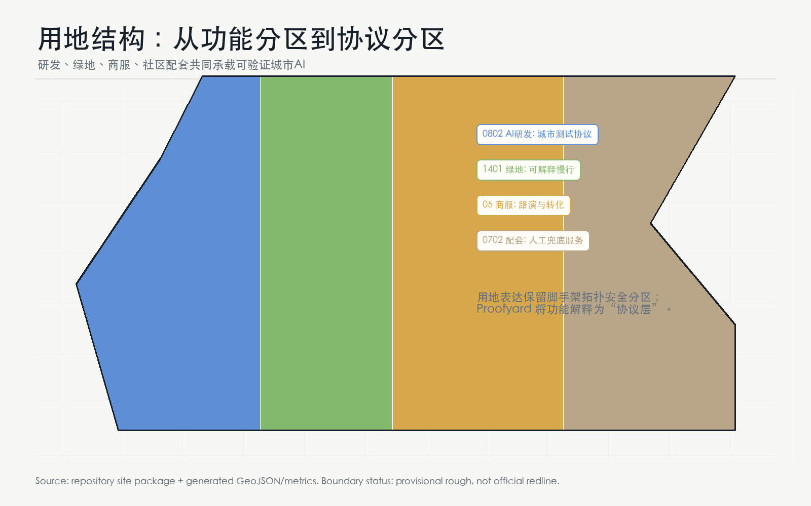
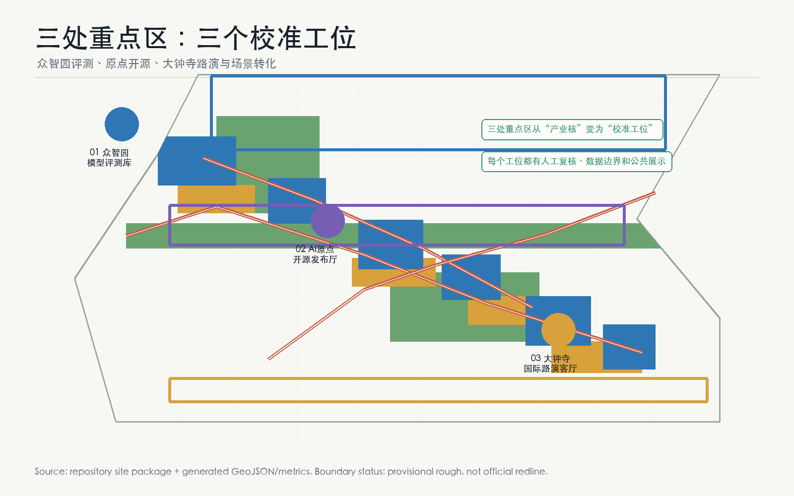
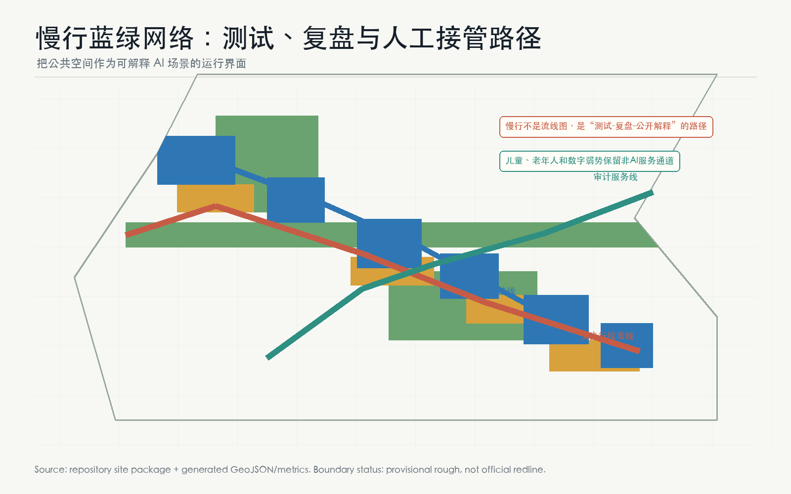
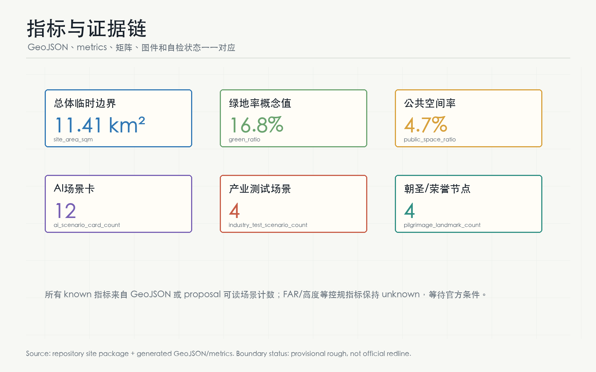

# 京张校准场：可验证城市AI原型场

## 设计依据与资料清单

本方案依据《百年京张AI创新带城市设计国际方案征集》公开任务、仓库 `brief/site-package/`、`agent_taskbook.json`、`data/source_registry.json` 与处理资料包组织成果 [source:OFFICIAL-ANNOUNCEMENT][source:SITE-PACKAGE][source:AGENT-TASKBOOK][source:SOURCE-REGISTRY][source:PROCESSED-FACT-PACK]。本方案遵守城市设计管理、控规深度、用地分类、建筑设计深度和智能体任务书边界 [standard:PROJECT-OFFICIAL-ANNOUNCEMENT][standard:PROJECT-AGENT-OPEN-CALL-TASKBOOK][standard:MOHURD-URBAN-DESIGN-MEASURES][standard:MOHURD-CONTROL-DETAILED-PLANNING][standard:MNR-LAND-USE-CLASSIFICATION-GUIDE][standard:MOHURD-ARCH-DESIGN-DEPTH-2016]。

当前仓库未提供正式红线和三处重点区官方 polygon。本提交采用 `brief/site-package/geometry/provisional_boundaries.geojson` 生成 [data:geometry/site_boundary.geojson#SITE-001] 与 [data:geometry/key_areas.geojson#PROV-KEY-001] 等临时边界 [source:BOUNDARY-SOURCE][source:KEY-AREA-SOURCE]。这些几何的 `official_boundary=false`、`geometry_role=provisional_constraint`、`boundary_precision=provisional_rough`，只能用于方案生成、图示、自检和讨论，不能作为 official redline、审批依据、地块权属或精确面积结论。总体临时边界复算面积为 11,412,825 m² [metric:site_area_sqm]；三处重点区数量为 3 [metric:key_area_count]，临时复算面积为 3,692,893 m² [metric:key_area_area_sqm]。正式 polygon 补齐后，所有 GeoJSON、metrics、图件、PDF、HTML 和矩阵均须重算 [depth:existing_conditions_diagnosis][depth:risk_missing_data]。

本方案的方法来源为 `PROOFYARD-METHOD`：把“AI创新带”理解为一个可验证城市原型场，而不是再造一条普通园区景观轴 [source:PROOFYARD-METHOD]。城市里每个 AI 场景先回答五个问题：要验证什么模型或服务，使用什么公开/授权数据，哪里可被公众理解，谁负责人工接管，失败后如何复盘。这个方法把创新、公共利益和监管可见性绑定在一起，回应 agent.1-agent.6 对命名、生态、场景、公共空间、文化叙事和长期运营的要求 [standard:PROJECT-AGENT-OPEN-CALL-TASKBOOK]。

## 三层范围工作框架

三层范围采用“战略校准、空间校准、场景校准”三步法 [depth:three_level_scope_framework]。统筹研究范围约 43.6 km²，负责识别世界级 AI 创新生态、三区两翼和长期运营机制；总体设计范围约 11.4 km²，负责把校准机制落到用地、建筑、慢行、蓝绿、公服和分期图层；重点区域范围约 368.4 ha，负责把众智园、AI原点社区、大钟寺变成三个不同类型的 Proofyard 工位 [source:OFFICIAL-ANNOUNCEMENT]。

空间结构不是“一条带+三个核”的复述，而是“**一条校准线、三个工位、两条服务翼、四类公共协议**” [depth:overall_spatial_structure]。一条校准线对应 [data:geometry/roads.geojson#ROAD-PY-01]，连接北段模型评测、中段开源发布、南段国际路演；三个工位对应 [data:geometry/buildings.geojson#BLDG-PY-01]、[data:geometry/buildings.geojson#BLDG-PY-03]、[data:geometry/buildings.geojson#BLDG-PY-05]；两条服务翼分别支持中关村科技服务与小月河场景赋能；四类协议是模型评测协议、数据授权协议、公共审计协议、人工接管协议。

| 层级 | Proofyard 任务 | 空间和证据 |
| --- | --- | --- |
| 统筹研究范围 | 建立“可验证 AI 城市”的品牌、生态和国际传播机制 | agent.1-agent.6、[source:AGENT-TASKBOOK]、[standard:PROJECT-AGENT-OPEN-CALL-TASKBOOK] |
| 总体设计范围 | 组织用地、建筑、道路、绿地、公服和新基建的校准网络 | [data:geometry/land_use.geojson#LU-001]、[data:geometry/public_space.geojson#PUBLIC-PY-01]、[metric:green_ratio] |
| 重点区域范围 | 对三处片区分别布置评测、开源、审计、路演和运营节点 | [data:geometry/key_areas.geojson#PROV-KEY-001]、[depth:three_key_area_detailed_design] |

## 统筹研究范围产业与未来城市研究

**命名与视觉识别（agent.1）**：主名称为“京张校准场”，英文名为 **Jing-Zhang Proofyard**。Proofyard 不是“验证 AI 正确”的单点实验室，而是一套城市尺度的公共校准制度：把 AI 研发、场景开放、公众体验、荣誉记忆和人工治理放在同一张空间图上。Logo 方向采用“铁路轨迹 + 勾稽校验点 + 开源节点”的图形语言，避免使用第三方商标、企业标识或未经授权字体；概念图见 `assets/proofyard-logo.png`。该命名回应百年京张文化带、都市 AI 生活体验带、AI 融合创新带三大定位 [source:AGENT-TASKBOOK]。

**全球生态案例（agent.2，7个）**：Kendall Square 提供近校创新经验，one-north 提供研发与公共空间混合经验，King's Cross 提供铁路遗产更新经验，Sidewalk Labs 的争议提醒本方案必须把数据授权和公共审计前置，Singapore AI Verify 提供模型测试框架启发，EU AI Act sandbox 提供监管沙盒启发，Hugging Face / GitHub 开源社区提供贡献可见性和声誉机制启发。以上案例只作为方法类参照，不作为外部事实评分依据；转化为本方案的七类机制：开源发布、模型红队、数据契约、公共审计、社区复盘、国际路演、贡献荣誉 [metric:ai_scenario_card_count]。

**三区两翼转译**：众智园不只承担研发办公，而承担“模型评测库”和“安全治理沙盒”；AI原点社区不只承担近校孵化，而承担“开源发布厅”和“贡献记忆”；大钟寺不只承担商业消费，而承担“国际路演客厅”和“智能体消费验证街”。中关村科技服务翼提供 IP、法务、投融资、标准和算力服务；小月河场景翼提供具身智能、健康服务、低速配送、慢行和公共空间复盘场景 [source:AGENT-TASKBOOK][depth:overall_spatial_structure]。

## 总体设计范围城市更新与控规深度城市设计

总体设计范围按 [standard:MOHURD-CONTROL-DETAILED-PLANNING] 和 [depth:land_use_layout] 组织。用地结构仍保持拓扑完整：`land_use.geojson` 覆盖临时边界，研发、绿地、商服和社区配套共同承担 Proofyard 协议层 [data:geometry/land_use.geojson#LU-001][metric:land_use_cover_ratio]。建筑图层不表达批准建设量，高度与体量只作为待深化风貌议题 [depth:height_massing_character]，而表达六个概念原型：模型评测库、端侧算力驿站、开源发布厅、数据契约馆、国际路演客厅和全球 AI 活动后台 [data:geometry/buildings.geojson#BLDG-PY-01][metric:building_footprint_area_sqm]。

城市更新策略为“少拆改、多校准、可撤回” [depth:retain_renovate_demolish]：优先利用既有园区、首层界面、公园节点、轨道站点和待更新商业空间布置轻量化原型；涉及建筑规模、容积率、高度、道路红线、消防、市政、权属和文保条件的事项均标为待确认 [metric:floor_area_ratio][metric:building_height_m][assumption:A-CONTROLS-001]。这使方案在可讨论阶段具备操作性，同时不越过法定审批边界 [standard:PROJECT-AGENT-OPEN-CALL-TASKBOOK]。

交通、市政和新基建采用“可解释慢行 + 可审计服务线” [depth:traffic_rail_slow_parking][depth:municipal_new_infrastructure]。`ROAD-PY-01` 是主步行校准线，串联三处重点区和京张遗址公园；`ROAD-PY-02` 是场景复核联络线；`ROAD-PY-03` 是东西两翼审计服务线 [data:geometry/roads.geojson#ROAD-PY-01]。这些线不是道路红线，而是给专业团队深化慢行、无障碍、接驳、服务车辆、活动安保和应急人工接管的参考框架。

## 重点区域详细设计

**众智园 AI 自主创新加速区：模型评测库**。本区对应 [data:geometry/key_areas.geojson#PROV-KEY-001]。设计定位是“全栈自主创新的可验证入口”：在 [data:geometry/buildings.geojson#BLDG-PY-01] 布置模型评测库，在 [data:geometry/public_space.geojson#PUBLIC-PY-01] 布置北段模型校准广场，在 [data:geometry/green_space.geojson#GREEN-PY-02] 布置清河低碳复核廊。核心动作包括模型红队测试、安全治理展示、标准制定工作坊、低碳算力体验和企业服务 Copilot。所有项目均为概念建议，需等待官方边界、园区实施计划、交通和市政条件深化 [depth:three_key_area_detailed_design]。

**北京 AI 原点社区：开源发布与贡献记忆**。本区对应 [data:geometry/key_areas.geojson#PROV-KEY-002]。设计定位是“近校型开源社区和成果转化街”：在 [data:geometry/buildings.geojson#BLDG-PY-03] 设置原点开源发布厅，在 [data:geometry/public_space.geojson#PUBLIC-PY-02] 设置开源庭院，在 [data:geometry/buildings.geojson#BLDG-PY-04] 设置城市数据契约馆。它把高校成果、社区活动、数据授权、知识产权和投融资服务合并成一条可步行的成果转化界面，同时保留非数字化服务窗口和人工咨询席 [standard:MOHURD-URBAN-DESIGN-MEASURES]。

**大钟寺 AI 产业聚集区：国际路演和智能体消费验证街**。本区对应 [data:geometry/key_areas.geojson#PROV-KEY-003]。设计定位是“城市型 AI 原生新业态的公开试演场”：在 [data:geometry/buildings.geojson#BLDG-PY-05] 布置国际路演客厅，在 [data:geometry/public_space.geojson#PUBLIC-PY-04] 布置路演前场，在 [data:geometry/buildings.geojson#BLDG-PY-06] 布置全球 AI 活动后台。重点不是打造网红装置，而是让智能体、智能终端、内容消费、数据要素和国际传播有可预约、可审计、可复盘的线下界面 [depth:three_key_area_detailed_design]。

## AI 创新生态、人才画像与 AI+ 场景

用户画像共 7 类 [metric:user_persona_count]：P1 开源开发者，P2 初创团队，P3 头部企业访客，P4 高校师生，P5 周边居民，P6 儿童/老年人/残障人士等公共服务对象，P7 国际访问者和活动组织者。每类画像都必须有非侵入式数据边界、人工服务替代和公共利益目标；本方案反对把城市空间变成无处不在的行为采集系统 [standard:PROJECT-AGENT-OPEN-CALL-TASKBOOK]。

| 场景 | 类型 | 空间载体 | 数据边界与人工复核 |
| --- | --- | --- | --- |
| S1 模型红队公开日 | 产业测试 | 众智园模型评测库 | 使用公开或授权测试集；结果人工复核 |
| S2 端侧算力低碳评测 | 产业测试 | 清河端侧算力驿站 | 只记录设备级能耗和匿名性能 |
| S3 具身智能慢行避让 | 产业测试 | 小月河/京张慢行线 | 测试准入、低速、现场安全员接管 |
| S4 AI+医疗导航沙盒 | 产业测试 | 社区服务节点 | 不采集病历；医疗机构人工复核 |
| S5 开源发布厅 | 公共创新 | 原点社区 | 贡献者自愿展示，可撤回 |
| S6 城市数据契约咨询 | 公共治理 | 数据契约馆 | 授权模板公开，敏感数据不入场 |
| S7 AI慢行无障碍导览 | 公共服务 | 京张校准线 | 本地化路径建议，保留人工导览 |
| S8 智能体消费试演 | 生活服务 | 大钟寺路演前场 | 不跨商户合并画像；运营方复核 |
| S9 AI法律/知识产权门诊 | 企业服务 | 科技服务翼 | 不保存案件隐私，专家复核 |
| S10 社区设施维护 Copilot | 公共治理 | 三处公共庭院 | 只处理设施报修，街道/物业复核 |
| S11 全球 AI 活动周路线 | 长期运营 | 一带公共空间 | 活动数据聚合统计，安全预案人工确认 |
| S12 贡献荣誉墙 | 朝圣地标 | 四处公共节点 | 贡献记录自愿授权，争议可申诉 |

至少 4 个场景属于产业测试验证 [metric:industry_test_scenario_count]，超过任务书要求的 3 个；12 张场景卡超过任务书要求的 10 张 [metric:ai_scenario_card_count]。场景卡均为概念建议，不构成运营许可、采购承诺或政府活动安排。

## 用地、建筑规模与拆改留方案

Proofyard 的用地策略不是提高建设强度，而是提高“可校准空间”的密度 [depth:development_intensity_controls]。研发、绿地、商服和社区配套四类用地共同承载模型评测、公共审计、开源活动和人工服务 [standard:MNR-LAND-USE-CLASSIFICATION-GUIDE]。建筑基底合计 1,013,594 m² [metric:building_footprint_area_sqm]，仅为概念原型量级；总建筑面积、容积率、高度、建筑密度和退线保持 unknown [metric:floor_area_ratio][metric:building_height_m]。

拆改留原则是“保留京张遗产与社区日常，改造可公开的首层界面，新增可撤回的轻量测试与运营设施” [depth:retain_renovate_demolish]。任何涉及具体地块拆除、地下空间、工程线位、市政容量、土地权属和投资安排的判断，都必须交由专业团队在 official boundary、控规和实施条件下深化 [standard:MOHURD-ARCH-DESIGN-DEPTH-2016]。

## 交通、轨道、市政与公共服务设施

交通系统的核心不是更复杂的路线，而是可解释的移动体验 [depth:traffic_rail_slow_parking]。`ROAD-PY-01` 组织公众从模型评测到开源发布再到国际路演的步行体验；`ROAD-PY-02` 连接三核内的场景复核；`ROAD-PY-03` 为东西两翼的法务、IP、数据授权、算力服务和活动运营提供服务联系 [data:geometry/roads.geojson#ROAD-PY-02]。所有线位均为概念慢行和服务联系，不作为道路红线或工程方案。

市政与公共服务采用“端侧算力 + 人工窗口 + 传统市政复核” [depth:municipal_new_infrastructure]。端侧算力驿站只处理低风险、授权、可解释的服务；医疗、法律、政务、公共安全等场景必须保留专业机构和人工复核。儿童、老年人、残障人士和不用智能终端的居民均有纸质导览、人工咨询和电话预约等替代路径 [assumption:A-DATA-GOV-001]。

## 蓝绿空间、公共空间与城市风貌

蓝绿空间承担 Proofyard 的公共信任界面 [depth:blue_green_public_space]。`GREEN-PY-01` 是京张遗址公园校准步道，`GREEN-PY-02` 是清河低碳复核廊，`GREEN-PY-03` 是小月河场景复盘廊 [data:geometry/green_space.geojson#GREEN-PY-01]；绿地概念面积为 1,912,519 m²，绿地率为 16.8% [metric:green_space_area_sqm][metric:green_ratio]。公共空间四个庭院承载模型校准、开源发布、公共审计和路演前场，概念面积为 536,074 m² [data:geometry/public_space.geojson#PUBLIC-PY-03][metric:public_space_area_sqm][metric:public_space_ratio]。低扰动约束带见 [data:geometry/constraints.geojson#CONSTRAINT-PY-01]。

AI 朝圣和荣誉展示节点共 4 个 [metric:pilgrimage_landmark_count]：北段“模型评测库”、中段“开源贡献墙”、中段“数据契约馆”、南段“大钟寺国际路演客厅”。它们不采用娱乐化地标，而采用可更新的贡献索引、争议申诉、版本记录和撤回机制。文化叙事从“百年铁路自主建造”转译为“AI 时代的公开校准”：铁轨让城市连接，校准让智能可信 [source:AGENT-TASKBOOK][standard:MOHURD-URBAN-DESIGN-MEASURES]。

## 更新项目清单、实施政策与分期计划

| 项目 | 分期 | 位置 | 深化前置 |
| --- | --- | --- | --- |
| JZ-PY-01 模型评测库与北段校准广场 | 近期 | 众智园 | official key area、园区运营、安全治理规则 |
| JZ-PY-02 端侧算力驿站与清河复核廊 | 近期 | 清河界面 | 能源、市政、防洪和数据安全审查 |
| JZ-PY-03 原点开源发布厅 | 中期 | AI原点社区 | 校区/园区权属、活动许可、IP服务机制 |
| JZ-PY-04 城市数据契约馆 | 中期 | 原点社区至服务翼 | 法律合规、公共参与和数据授权模板 |
| JZ-PY-05 大钟寺国际路演客厅 | 长期 | 大钟寺 | 站城一体、商业更新、活动安保 |
| JZ-PY-06 全球AI活动后台 | 长期 | 南段公共服务节点 | 国际传播、开发者社区和公共安全预案 |

分期图层对应 [data:geometry/phasing.geojson#PHASE-PY-01]、[data:geometry/phasing.geojson#PHASE-PY-02]、[data:geometry/phasing.geojson#PHASE-PY-03]。近期优先用轻量设施、协议发布、活动试点和小尺度 public beta 建立反馈；中期建设开源发布、数据契约和公共审计能力；长期形成全球 AI 活动周、开发者社区、公共体验路线和招引转化机制 [depth:renewal_project_list][depth:phasing_implementation]。所有活动均为概念建议，不代表已确定政府安排、预算或招商承诺。

## 指标体系、面积复算与合规矩阵

核心指标：临时边界面积 11,412,825 m² [metric:site_area_sqm]，三处重点区 [metric:key_area_count]，用地覆盖比 1.000001 [metric:land_use_cover_ratio]，建筑基底 1,013,594 m² [metric:building_footprint_area_sqm]，绿地率 16.8% [metric:green_ratio]，公共空间率 4.7% [metric:public_space_ratio]，12 张场景卡 [metric:ai_scenario_card_count]，4 个产业测试场景 [metric:industry_test_scenario_count]，7 类用户画像 [metric:user_persona_count]，4 个朝圣/荣誉节点 [metric:pilgrimage_landmark_count]。

合规矩阵覆盖公告 1.3、1.4、1.5 和 agent.1-agent.6 的 23 项必答任务；标准矩阵覆盖 6 项 mandatory 标准；设计深度矩阵覆盖 15 项 formal 深度 [depth:metrics_recalculation]。本方案正文明确引用所有机器证据链，避免只把任务完成状态藏在 JSON 里。FAR、高度、密度、退线、市政容量和权属等无法公开复算的指标保持 unknown，不参与伪精确评分 [assumption:A-CONTROLS-001]。

## 风险、版权与合规说明

本方案使用仓库公开或清权资料，不使用非公开地图、商业底图、新闻截图、企业内部数据、个人隐私数据或未经授权商标字体 [source:SOURCE-REGISTRY]。图件、PDF 和 HTML 均由本次提交从 GeoJSON、metrics 和 proposal 派生，作为解释层而非权威边界。`visual/index.html` 为离线静态页面，不加载远程脚本、远程字体、外部地图、iframe、API 或跟踪代码。版权与开放展示边界见 `report/copyright_statement.md`。

所有空间落地建议均为“概念建议”“参考方案”“可供专业团队深化研究”，不替代正式规划，不构成政府审定结论 [standard:PROJECT-AGENT-OPEN-CALL-TASKBOOK]。最重要的后续动作是获取 official boundary、key area、控规、交通、市政、文保、权属和公共服务附件，随后重新生成全部结构化数据、图件、PDF、HTML 和自检报告 [depth:risk_missing_data]。

## 参考资料

- `brief/site-package/design_brief.json`
- `brief/site-package/agent_taskbook.json`
- `brief/site-package/geometry/provisional_boundaries.geojson`
- `brief/site-package/standards/standards.json`
- `data/source_registry.json`
- `data/processed/agent_fact_pack.md`
- `docs/formal-submission-guide.md` [source:SITE-PACKAGE][metric:site_area_sqm]
