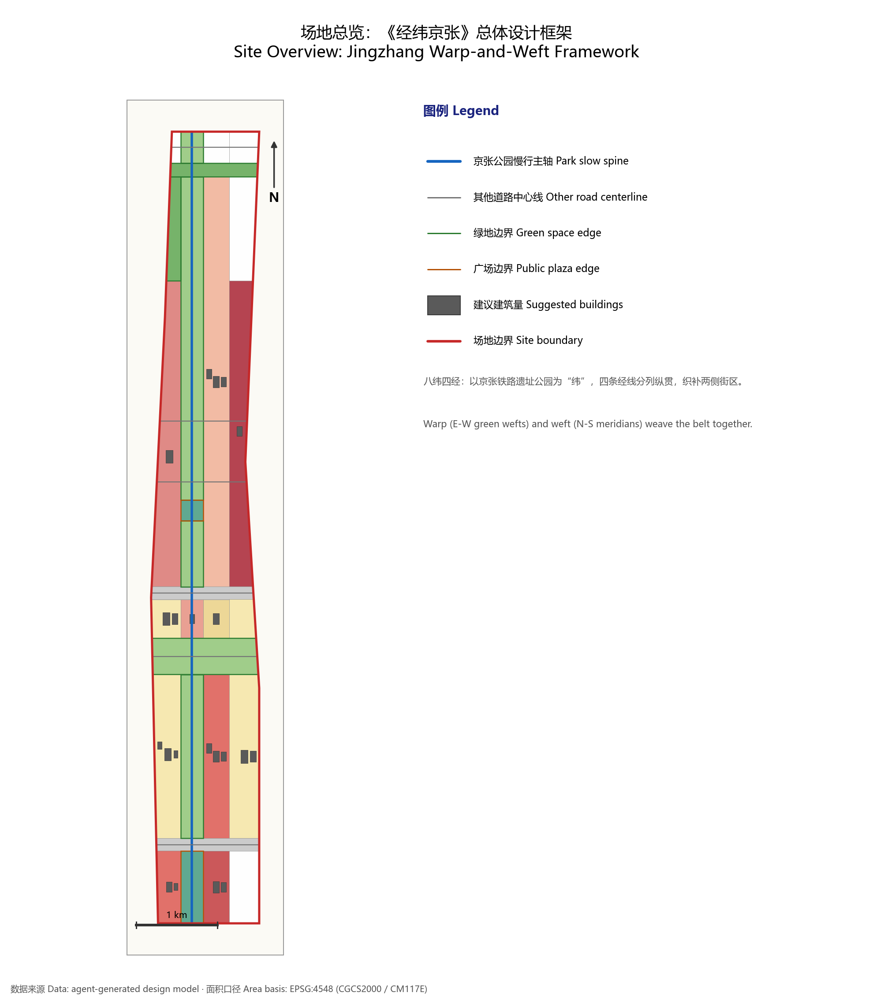
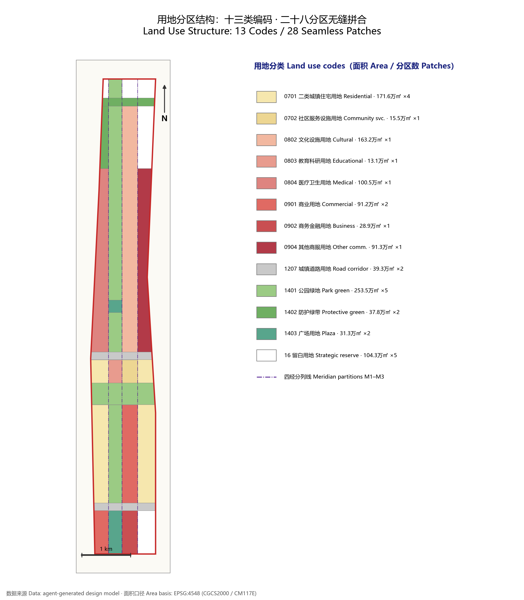
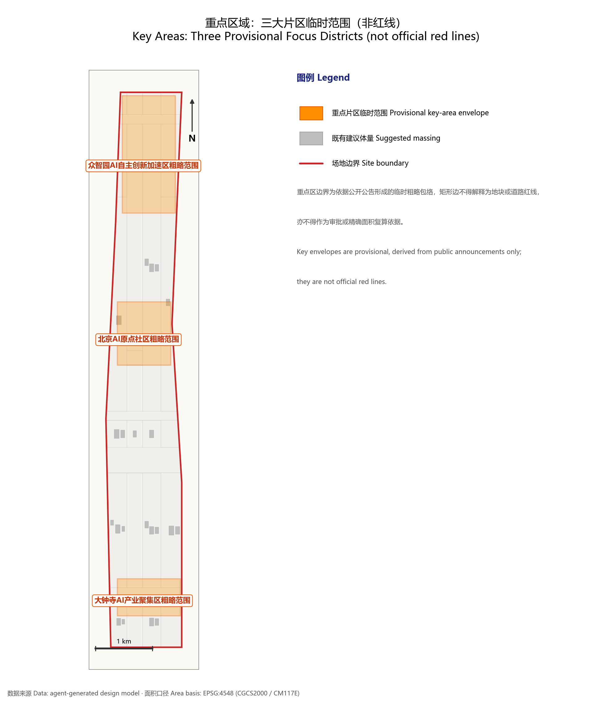
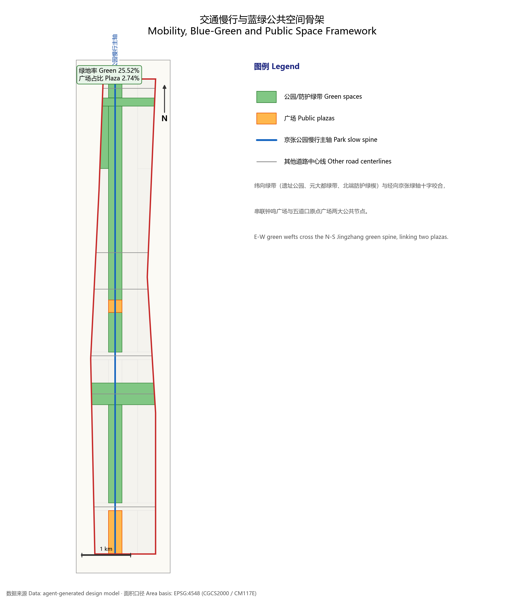
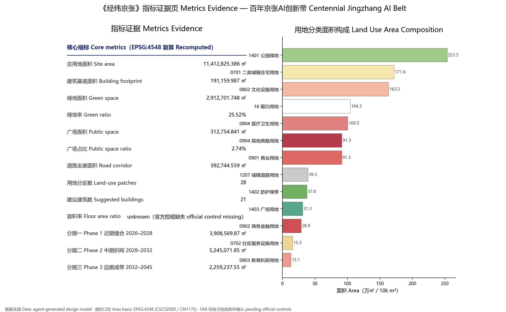

# Jingzhang Warp & Weft: Urban Design Concept for the Centenary Jingzhang AI Innovation Belt

## Design Basis and Evidence Inventory

This formal submission takes the *Prequalification Announcement of the International Urban Design Competition for the Centenary Jingzhang AI Innovation Belt*, issued by the Haidian Branch of the Beijing Municipal Planning and Natural Resources Commission, as its primary basis, together with the machine-readable provisional rough boundary, key areas, enumerations, metric ranges and source inventory registered by the maintainers under `brief/site-package/`. Before generating the design, the AI agent must read `design_brief.json`, `allowed_design_space.json`, `sources.json`, `enums/`, `ranges/`, `schemas/`, `data/source_registry.json` and `data/processed/agent_fact_pack.md`, and use `project_scope_summary.csv`, `agent_task_requirements.csv`, `source_use_matrix.csv` and `missing_data_checklist.csv` to build inventories of tasks, scope, evidence usage and gaps. Every design judgement must be decomposed into traceable sources, recomputable metrics, verifiable layers and human-reviewable assumptions. The announcement requires the proposal to reach the urban-design depth of regulatory detailed planning and of comprehensive planning implementation; narrative text therefore cannot substitute for GeoJSON layers, the metrics table, the A3 booklet, the A0 boards or the HTML electronic presentation.

The proposal is not a free-standing vision essay: its deliverables are organized from the announcement, the agent-facing taskbook and the site data. This section places only the most critical bases next to the judgements they support [source:OFFICIAL-ANNOUNCEMENT] [source:AGENT-TASKBOOK] [depth:existing_conditions_diagnosis]. Full source and standards coverage is kept in `sources.json`, `standard_matrix.json` and `design_depth_matrix.json`; the body text does not duplicate machine indexes.

The usage boundaries of the source registry are as follows [source:SOURCE-REGISTRY]:

- data/source_registry.json records the usage boundaries of public, rights-cleared and provisional materials.
- Current registry summary: 7 formal-usable sources, 1 background-only source, 1 provisional-only source.
- The agent must not upgrade background_only or provisional_only materials into official boundaries, statutory regulatory plans, formal scoring bases or government implementation commitments.

`data/processed/agent_fact_pack.md` is a reading-navigation layer for this proposal, not a new authoritative source [source:PROCESSED-FACT-PACK]. It helps the agent organize the three-level scope, three key areas, announcement tasks, agent.1-agent.6, data availability and missing-data items into a readable scheme; factual judgements must still return to the registered primary materials [source:OFFICIAL-ANNOUNCEMENT] [source:AGENT-TASKBOOK], and full source relations are kept in `sources.json`.

Because the official `SITE_BOUNDARY` and the three `KEY_AREA` polygons have not yet been released, this package uses `brief/site-package/geometry/provisional_boundaries.geojson` to produce a provisional formal submission. Both `geometry/site_boundary.geojson` and `geometry/key_areas.geojson` in the package are marked `provisional_constraint`, `official_boundary=false`; they may be used only for scheme generation, self-checks, visualization and design discussion, never as an official redline, an approval basis, a precise-area basis or a statutory control conclusion. The organizer-side data gap itself does not block content scoring; once official polygons replace them, the site boundary, key areas, land use, roads, green space, public space, buildings, phasing and metrics must all be recomputed.

The scorable state declared by this scaffold-generated package is: **provisional boundary, precision warnings retained, recomputation required once official data is published; content scoring not blocked**. Accordingly, the spatial structure, scenarios, projects and metrics in this document are written under the principle of "discussable, reviewable, re-computable after the official boundary replaces the provisional one". When official boundary and key-area polygons arrive, the agent must rerun the whole pipeline — geometry, self-check, drawings and HTML generation — rather than patching single files.

Boundary interpretation can be traced to the overall-scope layer and the area recomputation [data:geometry/site_boundary.geojson#SITE-001] [metric:site_area_sqm]. The three key areas are checked against their own layer and count metric [data:geometry/key_areas.geojson#PROV-KEY-001] [metric:key_area_count]. Readers can move from prose to evidence without first wading through machine identifiers.

## Three-Level Scope Working Framework

The work is organized into the three levels fixed by the announcement. The coordinated research scope addresses the 43.6 km² AI industry ecology, strategic positioning, innovation chain and future urban form; the overall design scope addresses the 11.4 km² urban districts and industrial areas within 1–2 km of the Jingzhang heritage park, requiring an overall urban-renewal framework, industrial spatial layout, mobility and utility support, and townscape controls; the key-area scope addresses the three detailed-design districts totalling 368.4 hectares, requiring defined functions and business formats, building scale, retain/renovate/demolish classification, public-space connectivity and traffic organization. All three levels are mapped item by item in `compliance_matrix.json`, so that every mandatory task of sections 1.3, 1.4, 1.5 of the announcement and of agent.1-agent.6 has chapters, layers, metrics, drawings and HTML evidence.

The depth items of the three-level framework are constrained by [depth:three_level_scope_framework] and [depth:overall_spatial_structure]; spatial evidence follows [data:geometry/site_boundary.geojson#SITE-001] and [data:geometry/key_areas.geojson#PROV-KEY-001]; task basis follows [standard:PROJECT-OFFICIAL-ANNOUNCEMENT]; scope navigation follows the three-level scope table in `project_scope_summary.csv` [source:PROCESSED-FACT-PACK].

The three levels are not isolated drawing sets. Coordinated research fixes the industry-chain and urban-form judgements; overall design grounds those judgements in renewal projects, spatial structure and facility capacity; key-area detailed design tests feasibility at the scale of specific parcels, buildings, traffic, public space and AI application scenarios. When generating the scheme the agent must first lock the official or provisional boundaries and constraints adopted by this submission, then generate land use, buildings, roads, green space, public space, phasing and AI service nodes, and finally recompute metrics from those layers and explain in the text which conclusions remain limited by the provisional boundary. Any area, ratio, scale or project count that cannot be recomputed from structured data must not enter formal conclusions.

The overall concept proposed here is **"Jingzhang Warp & Weft"**: it translates the railway's own engineering logic — "fixing the land by warp and weft" — into an urban-design method. Eight weft lines weave living fabric and green veins across the site; four meridians thread innovation functions north-south; together they darn a centenary AI innovation belt along the Jingzhang corridor. From south to north the weft system runs: Wenhuiyuan retail street band (SA), Wenhuiyuan weft corridor (r1), southern Jingzhang heritage park (SB), Yuandadatu green-belt weft (p1), Zhichun culture band (SC), Zhichun Road weft corridor (r2), Jingzhang park core band (SD), the northern shelter-green wedge (g2) and the northern reserve band (SE); r1/p1/r2/g2 are non-buildable "breathing corridors" reserved for green veins, slow traffic and utility corridors. The meridian system slices each band lengthwise into four columns: the western renewal wing (W), the Jingzhang green axis (K), the central innovation spine (C) and the eastern reserve wing (E); the K column is carried end-to-end by the linear green axis of the Jingzhang heritage park, forming an unbroken north-south public-space spine. The three key areas sit exactly on the three densest warp-weft knots: Dazhongsi = SA/SB × column C (consumption knot), Beijing AI Origin Community = SD × columns K/C (campus-adjacent incubation knot), Zhizhiyuan ("Wisdom Commons") = northern SD/g2 × column W facing the Qing River interface (full-stack autonomy knot). "Warp and weft" here draws no new redlines of its own; it is a working-method translation of the announcement's three-level scope: the wefts correspond to horizontally stitched living and blue-green systems, the meridians to vertically organized industry and innovation axes, and the knots are the priority implementation cells for AI scenarios and renewal projects.

| Level | Design question | Answer of this scheme | Data anchor |
| --- | --- | --- | --- |
| Coordinated research | How to organize the AI industry ecology and future urban form | An innovation chain of "university sourcing - open-source collaboration - enterprise translation - public experience - international communication" | compliance_matrix.json, standard_matrix.json |
| Overall design | How industry space, renewal, mobility/utilities and townscape land on the map | Expressed jointly by land-use, building, road, green-space, public-space and phasing layers | [data:geometry/land_use.geojson#LU-001], [data:geometry/roads.geojson#ROAD-001] |
| Key areas | How the three districts reach detailed-design depth | Positioning, spatial moves, AI scenarios and implementation dependencies for each | [data:geometry/key_areas.geojson#PROV-KEY-001], [data:geometry/key_areas.geojson#PROV-KEY-002], [data:geometry/key_areas.geojson#PROV-KEY-003] |

## Coordinated Research Scope: Industry and Future City Study

The core task of the coordinated research scope is to construct a world-class AI innovation ecosystem. The proposal should map Haidian's universities and research institutes, leading enterprises, computing-algorithm-data factors, incubation platforms, listed companies, unicorns and technology-service resources, and propose a spatially coordinated framework linking the AI innovation chain, industry chain, talent chain and urban service chain. The naming scheme and logo design should serve the overall identity of "centenary Jingzhang culture belt, metropolitan AI life-experience belt, AI-integrated innovation belt"; beyond slogans, they should state their connections with the industry ecology, public space and cultural resources. The agent taskbook further requires responses to the "five major functions" and the "three zones, two wings" coordination, yielding a nameable system, visual identity, overall spatial structure diagram, scenario openness and operating mechanisms that can be deepened later; this section must mark such requirements with [source:AGENT-TASKBOOK] and [standard:PROJECT-AGENT-OPEN-CALL-TASKBOOK] as coming from the agent open-call taskbook, not from statutory planning control.

Coordinated research adds no pseudo-precise redlines; through the townscape, public-space and built-form coordination required by [standard:MOHURD-URBAN-DESIGN-MEASURES], it returns to [data:geometry/land_use.geojson#LU-001], [data:geometry/public_space.geojson#PUBLIC-001] and [depth:overall_spatial_structure], showing that industrial strategy must finally land in visible, reviewable spatial structure.

Future-city research must answer how AI changes work, life, socializing, learning, mobility and public services. The proposal should ground AI transportation systems, continuous green space, innovation service facilities and an international living-working atmosphere in locatable functional zones, nodes, corridors and scenarios rather than vague technology visions. The agent should write industry-strategy indicators, an AI innovation index, talent density, spatial-supply types and priority areas of AI+ vertical applications into the metric system, marking which are official, which are design suggestions and which still await calibration against formal data. Any global AI innovation events, developer communities, open scenarios or pilgrimage routes should be written as "concept suggestions / reference schemes / material for professional teams", never as settled government events or implementation arrangements.

## Overall Design Scope: Urban Renewal and Regulatory-Depth Urban Design

The overall design scope must reach the urban-design depth of regulatory detailed planning. The proposal must present an overall renewal spatial structure, low-efficiency space identification, a renewal project list, implementation policy recommendations, industrial function ratios, spatial organization patterns, total building scale and a comprehensive carrying-capacity assessment. `geometry/land_use.geojson` must cover the design boundary completely without overlaps; `geometry/buildings.geojson` must express renewed or retained building footprints; `geometry/roads.geojson` must express micro-circulation, slow-traffic and rail-transfer relations; `metrics.json` must recompute core areas, ratios and layer counts. Under the Warp & Weft partition this submission delivers: `geometry/land_use.geojson` with **28 land-use districts (LU-001–LU-028, 13 land-use codes)** seamlessly and non-overlappingly covering the submission boundary; `geometry/buildings.geojson` with **21 suggested building footprints (BLDG-001–BLDG-021)** totalling [metric:building_footprint_area_sqm] square metres, all flagged as low-confidence massing suggestions; `geometry/roads.geojson` with **7 skeleton centerlines (ROAD-001–ROAD-007)**, where ROAD-001, the Jingzhang park slow-traffic main axis, is the south-north meridian axis and the other six are east-west weft arterials and connectors.

Following [standard:MOHURD-CONTROL-DETAILED-PLANNING], this section splits regulatory-depth content into reviewable objects: [data:geometry/land_use.geojson#LU-001] expresses land-use structure, [data:geometry/buildings.geojson#BLDG-001] building footprints, [data:geometry/roads.geojson#ROAD-001] traffic organization; [metric:building_footprint_area_sqm] serves cross-checking of footprint area; depth is bounded by [depth:land_use_layout] and [depth:development_intensity_controls].

Overall design must also support transport, rail, utilities and supporting facilities. Around rail-station integration, road micro-circulation, bicycle parking, parking supply, innovation service platforms, talent living services, new infrastructure, distributed energy and edge computing, the proposal should present spatial layout and implementation paths. Where building height, development intensity, road redlines, setback lines and facility standards lack official control conditions, they must be written as "pending confirmation by formal regulatory conditions"; agent estimates must never masquerade as approved indicators.

## Key-Area Detailed Design

Key-area detailed design is mandatory. For the Zhizhiyuan AI Autonomous-Innovation Acceleration Zone, detailed proposals should address the national AI platform, full-stack autonomous innovation, standards setting, safety governance, industry exhibition, external transport, Qing River culture, low-carbon green innovation-exchange environments, and AI scenarios in green space. For the Beijing AI Origin Community, proposals should address campus-adjacent innovation, achievement incubation and translation, talent-zone policies, the open-source system, brand events, building retain/renovate/demolish, achievement showcase and release, living amenities, campus-park slow-traffic links and rail-station integration. For the Dazhongsi AI Industry Cluster Zone, proposals should address leading enterprises, agents, smart terminals, content consumption, data elements, digital assets, business services, composite use of planned green space, Dazhongsi station integration and four-quadrant pedestrian connectivity at the grade crossing.

The three key-area designs must cite [data:geometry/key_areas.geojson#PROV-KEY-001], [data:geometry/key_areas.geojson#PROV-KEY-002], [data:geometry/key_areas.geojson#PROV-KEY-003], and be checked by [depth:three_key_area_detailed_design] for implementation-plan depth. Describing "building a demonstration zone" without functional, building, traffic, public-space and project evidence counts as incomplete.

The three key areas must appear in `geometry/key_areas.geojson`. Where official polygons exist in the repository they should be used as `official_constraint`; where missing, `provisional_constraint` may be used temporarily, but the text, HTML, sources, assumptions and self_check must state that they cannot serve as formal scoring or approval bases. `compliance_matrix.json` should cover announcement items 1.5.3.1, 1.5.3.2 and 1.5.3.3 respectively. Design expression should include business formats, building scale, architectural form, retain/renovate/demolish classification, public-space systems, traffic organization, slow-traffic connectivity and implementation projects. The HTML pages should allow switching among the three key areas, and the A3 booklet and A0 boards should include at least a key-area master plan, local detail views and metric notes.

| Key area | Design positioning | Spatial moves | AI industry & operations scenarios | Evidence |
| --- | --- | --- | --- | --- |
| Zhizhiyuan AI Autonomous-Innovation Acceleration Zone | Garden-type full-stack autonomy district | Strengthen the Qing River interface, industry exhibition, low-carbon exchange and external transport; host open testing and standards-governance displays in green space | Autonomous-model testing, standards workshops, safety-governance exhibits, low-carbon computing experience | [data:geometry/key_areas.geojson#PROV-KEY-001], [depth:three_key_area_detailed_design] |
| Beijing AI Origin Community | Campus-adjacent translation and talent community | Stitch campus, park and neighborhood by slow traffic; add release venues, talent services, housing amenities and open-source collaboration space | Open-source community, achievement releases, talent-zone services, campus-adjacent incubation | [data:geometry/key_areas.geojson#PROV-KEY-002], [source:AGENT-TASKBOOK] |
| Dazhongsi AI Industry Cluster Zone | Urban-type intelligent-economy and international-exchange district | Rail integration at Dazhongsi station, four-quadrant pedestrian loops, business services, public-realm renewal around key enterprises | Agent and terminal showcases, content consumption, data-element services, international roadshows | [data:geometry/key_areas.geojson#PROV-KEY-003], [metric:key_area_count] |

## AI Innovation Ecology, Talent Profiles and AI+ Scenarios

The proposal should build a spatial-demand profile of AI talent and enterprises, covering R&D offices, open-source collaboration, achievement releases, enterprise services, talent housing, social learning, consumer life, sports and leisure, and international exchange. AI+ scenarios should follow the directions named in the announcement — mobility, services, consumption, healthcare, education, legal aid, daily-life services — forming both industry-development scenarios and AI-enabled urban-function scenarios. Each scenario should state its users, spatial location, data sources, privacy boundaries, human-review mechanisms and operating entity.

AI scenarios must land in space and governance boundaries: public-space scenarios cite [data:geometry/public_space.geojson#PUBLIC-001], slow-traffic and mobility scenarios cite [data:geometry/roads.geojson#ROAD-001], open-space scenarios cite [data:geometry/green_space.geojson#GREEN-001] plus [metric:public_space_ratio] and [metric:green_ratio]. These citations show reviewers that scenarios are not slogans but design objects located in specific layers and metrics. The agent taskbook requires no fewer than 10 AI scenario cards, 3 industry test-validation scenarios and 5 user profiles; the scaffold provides structure only, and formal participants must write scenario cards, profile tables, privacy boundaries, human review and operating entities into the text, HTML, A3/A0 outputs and the compliance matrix.

| User profile | Typical needs | Spatial response | Self-check boundary |
| --- | --- | --- | --- |
| Open-source developers | Release, collaboration, testing, community reputation | Origin Community release hall, public code wall, night collaboration spaces | No personal trajectory collection; event data aggregated only |
| Startup teams | Low-cost offices, compute access, product proving grounds | Zhizhiyuan shared test field, edge-compute service points, standards-governance consulting | Compute and data services require separate authorization |
| Visiting enterprise delegations | Exhibitions, business meetings, international hosting, recruiting | Dazhongsi international roadshow salon, station transfer links, public realm around key enterprises | Corporate marks and cases require rights clearance |
| Local residents | Commuting, leisure, community services, low-disturbance renewal | Jingzhang park slow-traffic loop, embedded community services, graded night lighting and events | Resident profiles never used for commercial recommendation |
| University faculty & students | Achievement translation, cross-campus collaboration, daily slow traffic | Campus-park stitching paths, translation waystations, AI education experience points | Campus data and research results require authorization |

| Scenario card | Spatial carrier | Design note |
| --- | --- | --- |
| 01 Open-source release hall | Beijing AI Origin Community | Release stage, code-contribution display and small roadshow space for universities, open-source communities and startups |
| 02 Safety-governance sandbox | Zhizhiyuan | Standards setting, safety evaluation and model red-teaming translated into visitable, bookable, supervised display and collaboration nodes |
| 03 Edge-compute waystation | Nodes of the overall design scope | Combined with public services, enterprise services and low-carbon energy strategy as a new-infrastructure prototype awaiting deepening |
| 04 AI slow-traffic navigation | Jingzhang park vitality belt | Explainable wayfinding and low-intrusion sensing to identify slow-traffic breaks, crowding and accessibility needs |
| 05 Dazhongsi international roadshow salon | Dazhongsi AI cluster | Exhibition, negotiation, media release and international exchange for agent, terminal and content-consumption enterprises |
| 06 Qing River low-carbon innovation gallery | Zhizhiyuan riverfront interface | Green space, stormwater, walking-cycling and AI display combined as the district's public living room |
| 07 Campus-adjacent translation street | Beijing AI Origin Community | Incubation, display, legal, IP and investment services organizing university achievement translation |
| 08 Data-element reception hall | Dazhongsi area | A compliant, authorized, auditable urban-service interface demonstrating data-element and digital-asset circulation |
| 09 AI daily-life model street | Community-retail intersections | Healthcare, education, legal and daily-life AI+ services landed in operable fine-grain street space |
| 10 Global AI week route | Belt-wide public-space system | A walkable, communicable experience route from heritage culture through open-source community and industry display to international roadshows |

AI governance recommendations generated by the agent must follow data minimization, public sourcing, explainability and human review. A city agent may assist in identifying slow-traffic breaks, public-space heat, facility maintenance, enterprise-service demand and event-safety risk; it must not replace planning approval, output unauthorized personal profiles, or claim official implementation commitments. All AI scenario nodes should enter the structured layers or the compliance matrix so reviewers can see their relations to industry, space and the public interest.

## Land Use, Building Scale and Retain-Renovate-Demolish

The land-use plan should follow public standards of territorial survey, planning and use control, forming complete, closed, seamless districts. The building plan should distinguish retained, renovated, renewed, newly built and pending objects, with tiered suggestions on footprints, function, scale, character, roofs, massing and height control. Where existing buildings, ownership, regulatory plans and engineering conditions are missing, the plan may only offer methods and calibration checklists — never invented retain/renovate/demolish verdicts.

Land-use classification follows [standard:MNR-LAND-USE-CLASSIFICATION-GUIDE]; height, massing, frontage and character control is governed by [depth:height_massing_character]; the R/R/D method by [depth:retain_renovate_demolish]. Primary evidence: [data:geometry/land_use.geojson#LU-001], [data:geometry/buildings.geojson#BLDG-001] and [metric:building_footprint_area_sqm].

Scale and intensity metrics must agree with `metrics.json` and the layers. Where total floor area, FAR, height, coverage, green ratio, setbacks or building control lines lack official conditions, they uniformly carry `status=unknown`, with reasons and assumptions stated in `reason` / `assumptions` and a recomputation path once formal data lands — never fixed numbers manufacturing false precision. The A3 booklet should include a renewal-project list and metric verification table; the A0 boards should make the key spatial structure and key areas legible; the HTML page should provide linked viewing of metrics and layers.

## Traffic, Rail, Utilities and Public Service Facilities

The mobility plan should answer the announcement's demands on rail-station integration, micro-circulation, slow-traffic breaks, external connections, parking, bicycle parking and green transport, focusing on the North Fifth Ring Road, the Jingzhang park over-crossing node, Wudaokou, Tsinghua East Road West Gate, Dazhongsi station and access around key enterprises. Road and slow-traffic layers stay within the submission boundary and cross-check against public space, green space, industry nodes and key areas; where the boundary remains provisional, mobility conclusions likewise serve temporary design discussion only.

Professional depth of traffic and utilities is bounded by [depth:traffic_rail_slow_parking] and [depth:municipal_new_infrastructure]; layer evidence cites [data:geometry/roads.geojson#ROAD-001], [data:geometry/public_space.geojson#PUBLIC-001] and [data:geometry/constraints.geojson#CONSTRAINTS]. Where redlines, pipelines, fire access and utility conditions are missing, assumptions record the gap instead of writing strategy as approved condition.

Utilities and public-service facilities should cover AI industry service facilities, innovation service platforms, talent living services, new infrastructure, distributed energy, edge computing and the fusion with conventional municipal systems. The proposal should state facility standards, spatial layout, service radii, operation models and phasing logic. Missing pipeline, energy, drainage, flood-control and fire-engineering data must be listed as preconditions for formal deepening.

## Blue-Green Space, Public Space and Urban Character

The blue-green framework takes the Jingzhang park vitality belt as its spine, coordinating the Qing River, Xiaoyue River and the travel demand of surrounding universities, enterprises and communities into a north-south through-running, east-west connecting system of footpaths, cycle lanes and green space. It identifies slow-traffic breaks, ring-road over-crossings, and landscape nodes at the park's southern and northern ends, proposing composite-use strategies for parking, sports, innovation exchange, technology testing, application display and public services.

Blue-green public space is verified jointly by the depth item and the green/public layers [depth:blue_green_public_space] [data:geometry/green_space.geojson#GREEN-001] [data:geometry/public_space.geojson#PUBLIC-001]. The blue-green system is organized by warp and weft: weft-wise, park bands and shelter wedges SB, p1, SD-K (with SD-K-S/PLAZA/N segments) and g2 weave across; meridian-wise, the K-column axis threads through — submitting in total **7 green spaces (GREEN-001–GREEN-007)** and **2 plazas (PUBLIC-001–PUBLIC-002: Bell-Sound Plaza South Gateway, Wudaokoi Origin Plaza)**; recomputation yields a green ratio of [metric:green_ratio] (about 25.52%, 2,912,701.748 m²) and a plaza ratio of [metric:public_space_ratio] (about 2.74%, 312,754.841 m²). The text explains the design meaning of these ratios; full recomputation lives in `metrics.json`; coordination of townscape, public space and building control returns to the professional standards matrix [standard:MOHURD-URBAN-DESIGN-MEASURES].

The character plan should fuse Jingzhang railway heritage, Zhongguancun innovation culture and AI innovation culture, using cultural resources such as Qinghuayuan Railway Station and the Beijing Film Academy site, and propose citywide tone, architectural character, roofscape, massing, frontage and public-art guidance. The agent may also propose wayfinding, cultural symbols, international communication narratives, AI pilgrimage landmarks, contributor walls or honour-display systems — provided all brands, fonts, images, likenesses and corporate marks have cleared provenance. Character control must separate official regulation, design suggestion and pending conditions; pseudo-precise control lines without heritage or regulatory basis are strictly prohibited.

## Renewal Project List, Implementation Policy and Phasing

The implementation plan should form a reviewable renewal project list stating location, type, function, responsible entity, dependencies, stage, risks and evaluation metrics. Policy advice should cover coordinated renewal implementation, spatial supply, operation mechanisms, industry services, public participation, data governance and property coordination. `geometry/phasing.geojson` expresses phasing extents; `compliance_matrix.json` hooks every task to phases and drawings.

Project-list and phasing depth is governed by [depth:renewal_project_list] and [depth:phasing_implementation], with phase evidence at [data:geometry/phasing.geojson#PHASE-001]. Following the weft-stitching order, Warp & Weft submits three stages: **PHASE-001 Near-term stitching** (2026–2028, south section first, [metric:phase_1_area_sqm] m²), **PHASE-002 Mid-term netting** (2028–2032, middle sections meshed, [metric:phase_2_area_sqm] m²), **PHASE-003 Long-term belting** (2032–2045, north section belted, [metric:phase_3_area_sqm] m²). Where ownership, funding, implementation entities or approval paths are absent, they must be written as implementation risks — never as delivery promises.

| ID | Project | Type | Key dependencies | Evidence |
| --- | --- | --- | --- | --- |
| JZ-01 | Jingzhang park slow-traffic break stitching | Public space / traffic | Road redlines, under-bridge space, traffic organization review | [data:geometry/roads.geojson#ROAD-001] |
| JZ-02 | Zhizhiyuan Qing River innovation interface | Blue-green / industry display | River blue-line, ecological and flood conditions | [data:geometry/green_space.geojson#GREEN-001] |
| JZ-03 | Origin Community translation street | Urban renewal / industry services | Campus boundary, ownership, ground-floor uses | [data:geometry/buildings.geojson#BLDG-001] |
| JZ-04 | Dazhongsi four-quadrant pedestrian loop | Rail integration / slow traffic | Rail station, junction geometry, utility lines | [data:geometry/public_space.geojson#PUBLIC-001] |
| JZ-05 | AI public-service and edge-compute nodes | New infrastructure / public services | Energy, compute, safety and operating entity | [data:geometry/constraints.geojson#CONSTRAINTS] |
| JZ-06 | Global AI week public route | Operations / branding | Public-space permits, event safety, rights clearance | [data:geometry/phasing.geojson#PHASE-001] |

Phasing must stay distinct from the competition's 100-day design window: the window schedules submissions, the phasing schedules urban renewal and construction. The plan proposes near-term pilots, mid-term renewal and long-term governance, marking what can start with lightweight installations, operations events and service platforms, and what must wait for confirmed regulatory, utility, traffic and ownership conditions. For annual event systems, developer-community operations, open-scenario days, public experience routes and international communication mechanisms, the text states operating objects, frequency, responsibility boundaries, conversion paths and risks — never slogans alone.

## Metric System, Area Recomputation and Compliance Matrix

The metric system must at least include overall-scope area, key-area areas, green and public-space ratios, building footprints, renewal-project counts, AI scenario nodes, slow-traffic connectivity, industrial space, talent services and self-check status. All known metrics must be recomputable from GeoJSON or trusted sources; unknown metrics must give reasons and preconditions for formal submission. Results of `scripts/spatial_review.py` and `scripts/visual_review.py` are key evidence of the formal self-check.

Recomputation follows the unified depth requirement [depth:metrics_recalculation]. The text emphasizes design meaning — how the overall scope constrains allocation, how blue-green and public ratios support everyday encounter — while complete values, formulas, source files and confidence live in `metrics.json`.

Example key metrics verifiable from boundary and green data: [metric:site_area_sqm] (11,412,825.386 m²), [metric:green_space_area_sqm] (2,912,701.748 m²), [metric:public_space_area_sqm] (312,754.841 m²), [metric:land_use_patch_count]=28, [metric:building_count]=21 [data:geometry/site_boundary.geojson#SITE-001] [data:geometry/green_space.geojson#GREEN-001]. This `metrics.json` also carries per-code areas for the 13 land-use classes and the three weft corridors (road code 1207) [metric:road_corridor_area_sqm]; FAR stays `status=unknown` with reason attached, pending official control conditions.

The compliance matrix is the master file of task responsiveness. Every announcement task and taskbook task must map to report sections, layers, metrics, drawings, HTML pages, sources, assumptions and self-check items. Failing any mandatory task of 1.3, 1.4, 1.5 or agent.1-agent.6 bars the proposal from formal professional scoring.

For formal deepening the agent should classify metrics into three kinds: first, spatial metrics directly recomputable from submitted geometry — boundary area, green ratio, public ratio, footprint area, phase areas; second, control metrics needing official regulatory or taskbook attachments — FAR, height, coverage, setbacks, redlines, facility standards; third, performance metrics needing continuous operational or industrial data — AI innovation index, talent density, industry-service satisfaction, slow-traffic accessibility, event participation, scenario usage. The three kinds belong respectively in `metrics.json`, `assumptions.json` and `compliance_matrix.json`, so operational vision is never mistaken for approved planning condition.

## Risks, Copyright and Compliance Notes

**Bilingual requirement.** The primary proposal may be Chinese or English but must ship a complete counterpart via `proposal.en.md` or `proposal.zh.md`; the A3/A0 documents, the HTML page and any text-bearing graphics must also provide corresponding language copies, preferring the glossary recommended by `docs/terminology-glossary.md`. A v2 package missing any required translation, language mapping or valid file will be blocked by finalize and CI. All images, drawings, icons, data and code assets must state origin, licence and authorization in `sources.json` or `report/copyright_statement.md`. HTML pages must not load remote scripts, remote map tiles, remote fonts, iframes, forms or external APIs, and must not track reviewer behaviour.

Risk and missing-data lists are verified by the risk depth item, the constraints layer and the site package [depth:risk_missing_data] [data:geometry/constraints.geojson#CONSTRAINTS] [source:SITE-PACKAGE]. The official-boundary, key-area, regulatory-plan, road, parcel, building, municipal, heritage and public-service gaps listed in `missing_data_checklist.csv` must enter `assumptions.json`, the self-check and the risk section of the text. Any conclusion lacking official regulatory, redline, ownership, utility, fire or heritage conditions must downgrade to pending confirmation; full professional cross-check lives in the standards matrix.

This proposal claims no official approval, approved regulatory plan, final land ownership, final buildable scale or guaranteed implementation. The AI agent is accountable for facts, sources, copyright, spatial data, metrics and expression; maintainers and professional reviewers may require revisions or reject based on self-check results, spatial recomputation and the compliance matrix.

## References

- brief/public-brief.md
- brief/site-package/design_brief.json
- brief/site-package/allowed_design_space.json
- brief/site-package/enums/
- brief/site-package/ranges/planning_limits.json
- data/processed/agent_fact_pack.md
- data/processed/project_scope_summary.csv
- data/processed/agent_task_requirements.csv
- data/processed/source_use_matrix.csv
- data/processed/missing_data_checklist.csv
- Full machine indexes: see `sources.json`, `metrics.json`, `compliance_matrix.json`, `standard_matrix.json` and `design_depth_matrix.json`
- Bibliography entry points follow the site-package registry; complete provenance and licences are in the structured source list [source:SITE-PACKAGE]
