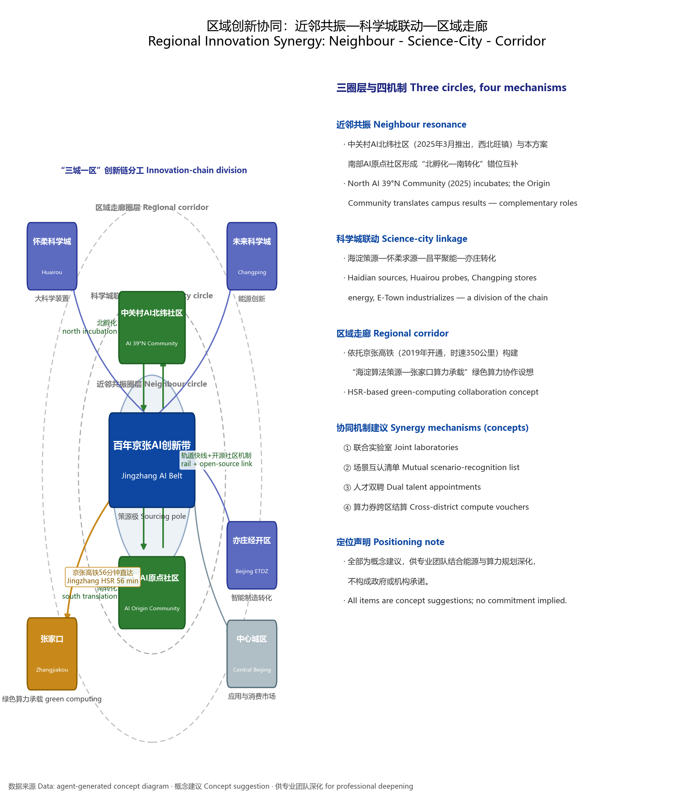
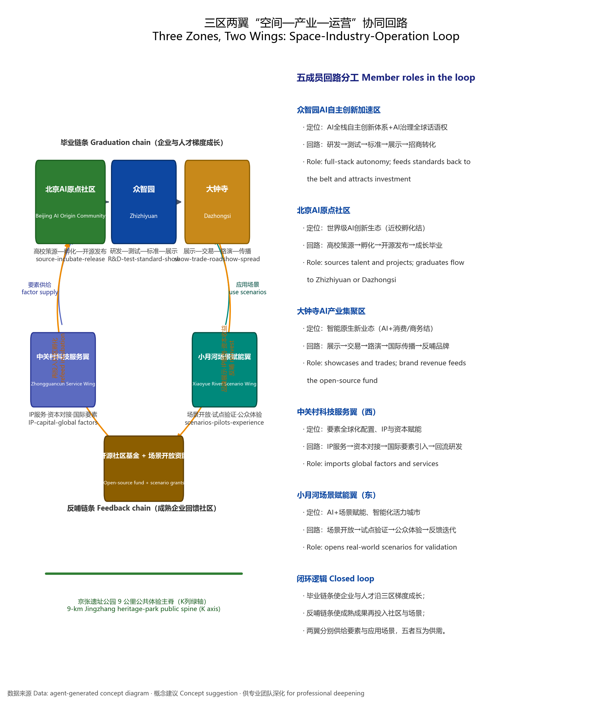

# Jingzhang Warp & Weft: Urban Design Concept for the Centenary Jingzhang AI Innovation Belt

## Design Basis and Evidence Inventory

This formal submission takes the *Prequalification Announcement of the International Urban Design Competition for the Centenary Jingzhang AI Innovation Belt*, issued by the Haidian Branch of the Beijing Municipal Planning and Natural Resources Commission, as its primary basis, together with the machine-readable provisional rough boundary, key areas, enumerations, metric ranges and source inventory registered by the maintainers under `brief/site-package/`. Before generating the design, the AI agent must read `design_brief.json`, `allowed_design_space.json`, `sources.json`, `enums/`, `ranges/`, `schemas/`, `data/source_registry.json` and `data/processed/agent_fact_pack.md`, and use `project_scope_summary.csv`, `agent_task_requirements.csv`, `source_use_matrix.csv` and `missing_data_checklist.csv` to build inventories of tasks, scope, evidence usage and gaps. Every design judgement must be decomposed into traceable sources, recomputable metrics, verifiable layers and human-reviewable assumptions. The announcement requires the proposal to reach the urban-design depth of regulatory detailed planning and of comprehensive planning implementation; narrative text therefore cannot substitute for GeoJSON layers, the metrics table, the A3 booklet, the A0 boards or the HTML electronic presentation.

The proposal is not a free-standing vision essay: its deliverables are organized from the announcement, the agent-facing taskbook and the site data. This section places only the most critical bases next to the judgements they support [source:OFFICIAL-ANNOUNCEMENT] [source:AGENT-TASKBOOK] [depth:existing_conditions_diagnosis]. Full source and standards coverage is kept in `sources.json`, `standard_matrix.json` and `design_depth_matrix.json`; the body text does not duplicate machine indexes.

The usage boundaries of the source registry are as follows [source:SOURCE-REGISTRY]:

- data/source_registry.json records the usage boundaries of public, rights-cleared and provisional materials.
- Current registry summary: 7 formal-usable sources, 1 background-only source, 1 provisional-only source.
- The agent must not upgrade background_only or provisional_only materials into official boundaries, statutory regulatory plans, formal scoring bases or government implementation commitments.

`data/processed/agent_fact_pack.md` is a reading-navigation layer for this proposal, not a new authoritative source [source:PROCESSED-FACT-PACK]. It helps the agent organize the three-level scope, three key areas, announcement tasks, agent.1-agent.6, data availability and missing-data items into a readable scheme; factual judgements must still return to the registered primary materials, and full source relations are kept in `sources.json`.

Because the official `SITE_BOUNDARY` and the three `KEY_AREA` polygons have not yet been released, this package uses `brief/site-package/geometry/provisional_boundaries.geojson` to produce a provisional formal submission. Both `geometry/site_boundary.geojson` and `geometry/key_areas.geojson` in the package are marked `provisional_constraint`, `official_boundary=false`; they may be used only for scheme generation, self-checks, visualization and design discussion, never as an official redline, an approval basis, a precise-area basis or a statutory control conclusion. The organizer-side data gap itself does not block content scoring; once official polygons replace them, the site boundary, key areas, land use, roads, green space, public space, buildings, phasing and metrics must all be recomputed. All areas and ratios recomputed from provisional geometry in this document are **low-confidence interim design-model values**; the metric section states this uniformly.

Boundary interpretation can be traced to the overall-scope layer and the area recomputation [data:geometry/site_boundary.geojson#SITE-001] [metric:site_area_sqm]. The three key areas are checked against their own layer and count metric [data:geometry/key_areas.geojson#PROV-KEY-001] [metric:key_area_count].

## Three-Level Scope Working Framework

The work is organized into the three levels fixed by the announcement. The coordinated research scope addresses the 43.6 km² AI industry ecology, strategic positioning, innovation chain and future urban form; the overall design scope addresses the 11.4 km² urban districts and industrial areas within 1–2 km of the Jingzhang heritage park, requiring an overall urban-renewal framework, industrial spatial layout, mobility and utility support, and townscape controls; the key-area scope addresses the three detailed-design districts totalling 368.4 hectares, requiring defined functions and business formats, building scale, retain/renovate/demolish classification, public-space connectivity and traffic organization. All three levels are mapped item by item in `compliance_matrix.json`, so that every mandatory task of sections 1.3, 1.4, 1.5 of the announcement and of agent.1-agent.6 has chapters, layers, metrics, drawings and HTML evidence.

The depth items of the three-level framework are constrained by [depth:three_level_scope_framework] and [depth:overall_spatial_structure]; spatial evidence follows [data:geometry/site_boundary.geojson#SITE-001] and [data:geometry/key_areas.geojson#PROV-KEY-001]; task basis follows [standard:PROJECT-OFFICIAL-ANNOUNCEMENT]; scope navigation follows the three-level scope table in `project_scope_summary.csv` [source:PROCESSED-FACT-PACK].

The three levels are not isolated drawing sets. Coordinated research fixes the industry-chain and urban-form judgements; overall design grounds those judgements in renewal projects, spatial structure and facility capacity; key-area detailed design tests feasibility at the scale of specific parcels, buildings, traffic, public space and AI application scenarios. When generating the scheme the agent must first lock the official or provisional boundaries and constraints adopted by this submission, then generate land use, buildings, roads, green space, public space, phasing and AI service nodes, and finally recompute metrics from those layers and explain in the text which conclusions remain limited by the provisional boundary. Any area, ratio, scale or project count that cannot be recomputed from structured data must not enter formal conclusions.

The overall concept proposed here is **"Jingzhang Warp & Weft"**: it translates the railway's own engineering logic — "fixing the land by warp and weft" — into an urban-design method. Eight weft lines weave living fabric and green veins across the site; four meridians thread innovation functions north-south; together they darn a centenary AI innovation belt along the Jingzhang corridor. From south to north the weft system runs: Wenhuiyuan retail street band (SA), Wenhuiyuan weft corridor (r1), southern Jingzhang heritage park (SB), Yuandadu green-belt weft (p1), Zhichun culture band (SC), Zhichun Road weft corridor (r2), Jingzhang park core band (SD), the northern shelter-green wedge (g2) and the northern reserve band (SE); r1/p1/r2/g2 are non-buildable "breathing corridors" reserved for green veins, slow traffic and utility corridors. The meridian system slices each band lengthwise into four columns: the western renewal wing (W), the Jingzhang green axis (K), the central innovation spine (C) and the eastern reserve wing (E); the K column is carried end-to-end by the linear green axis of the Jingzhang heritage park, forming an unbroken north-south public-space spine. The three key areas sit exactly on the three densest warp-weft knots: Dazhongsi = SA/SB × column C (consumption knot), Beijing AI Origin Community = SD × columns K/C (campus-adjacent incubation knot), Zhizhiyuan ("Wisdom Commons") = northern SD/g2 × column W facing the Qing River interface (full-stack autonomy knot). "Warp and weft" here draws no new redlines of its own; it is a working-method translation of the announcement's three-level scope: the wefts correspond to horizontally stitched living and blue-green systems, the meridians to vertically organized industry and innovation axes, and the knots are the priority implementation cells for AI scenarios and renewal projects.

| Level | Design question | Answer of this scheme | Data anchor |
| --- | --- | --- | --- |
| Coordinated research | How to organize the AI industry ecology and future urban form | An innovation chain of "university sourcing - open-source collaboration - enterprise translation - public experience - international communication" | compliance_matrix.json, standard_matrix.json |
| Overall design | How industry space, renewal, mobility/utilities and townscape land on the map | Expressed jointly by land-use, building, road, green-space, public-space and phasing layers | [data:geometry/land_use.geojson#LU-001], [data:geometry/roads.geojson#ROAD-001] |
| Key areas | How the three districts reach detailed-design depth | Positioning, spatial moves, AI scenarios and implementation dependencies for each | [data:geometry/key_areas.geojson#PROV-KEY-001], [data:geometry/key_areas.geojson#PROV-KEY-002], [data:geometry/key_areas.geojson#PROV-KEY-003] |

## Coordinated Research Scope: Industry and Future City Study

The core task of the coordinated research scope is to construct a world-class AI innovation ecosystem. The proposal maps Haidian's universities and research institutes, leading enterprises, computing-algorithm-data factors, incubation platforms, listed companies, unicorns and technology-service resources, and proposes a spatially coordinated framework linking the AI innovation chain, industry chain, talent chain and urban service chain. The naming scheme and logo design serve the overall identity of "centenary Jingzhang culture belt, metropolitan AI life-experience belt, AI-integrated innovation belt", stating their connections with the industry ecology, public space and cultural resources; the agent taskbook requires responses to the "five major functions" and the "three zones, two wings" coordination, yielding a nameable system, visual identity, overall spatial structure diagram, scenario openness and operating mechanisms that can be deepened later [source:AGENT-TASKBOOK]. This section marks such requirements with [standard:PROJECT-AGENT-OPEN-CALL-TASKBOOK] as coming from the agent open-call taskbook, not from statutory planning control.

Coordinated research adds no pseudo-precise redlines; through the townscape, public-space and built-form coordination required by [standard:MOHURD-URBAN-DESIGN-MEASURES], it returns to [data:geometry/land_use.geojson#LU-001], [data:geometry/public_space.geojson#PUBLIC-001] and [depth:overall_spatial_structure], showing that industrial strategy must finally land in visible, reviewable spatial structure.

Future-city research must answer how AI changes work, life, socializing, learning, mobility and public services. The proposal grounds AI transportation systems, continuous green space, innovation service facilities and an international living-working atmosphere in locatable functional zones, nodes, corridors and scenarios rather than vague technology visions. Industry-strategy indicators, an AI innovation index, talent density, spatial-supply types and priority areas of AI+ vertical applications enter the metric system, marking which are official, which are design suggestions and which still await calibration against formal data.

### Regional Innovation Synergy: From Science-City Linkage to the Beijing-Tianjin-Hebei Corridor

Regional synergy is organized in three circles: "neighbourhood resonance — science-city linkage — regional corridor". The core lever of the neighbourhood circle is the north-south echo with the **Zhongguancun AI 39°N Community**: launched by Haidian District in March 2025 in Xibeiwang Town, anchored by the Beijing Zhongguancun Institute, positioned as a "world-class AI ecosystem", offering young talent and micro-enterprises rent support for up to three years, and already hosting over a hundred tech startups with several hundred registered entrepreneurs [source:BEIWEI-COMMUNITY]. It forms a complementary "north incubation — south translation" pair with the Beijing AI Origin Community in the south of this scheme: the 39°N Community focuses on native startup incubation and talent community, the Origin Community on campus-adjacent translation and open-source collaboration, the two linked by rapid rail and open-source community mechanisms.

Within the science-city circle, this scheme joins Beijing's "Three Science Cities and One Zone" configuration as the **sourcing pole**: linking westward with Huairou Science City's big-science facilities and original innovation, northward with Changping Future Science City's energy innovation, and southward through the Zhongguancun Science City core to the Beijing Economic-Technological Development Area's intelligent-manufacturing translation — a chain division of "Haidian sources, Huairou probes, Changping stores energy, E-Town industrializes". The corridor circle positions the Jingzhang belt as the starting point of a regional AI innovation corridor: relying on the 56-minute Beijing-Zhangjiakou direct connection of the Jingzhang HSR [source:JINGZHANG-HSR], the scheme proposes a green-computing collaboration concept of "Haidian algorithm sourcing — Zhangjiakou computing carrier", stressed as a concept suggestion requiring deepening by professional teams in energy and computing planning. Four synergy mechanisms are suggested: joint laboratories, a mutual scenario-recognition list, dual talent appointments and cross-district compute-voucher settlement — all stated as "concept suggestions for professional deepening" [source:AGENT-TASKBOOK].

The spatial anchors of regional synergy form three node tiers within the coordinated research scope: tier-1 nodes are the three key areas (main carriers of sourcing and translation); tier-2 nodes are the 39°N Community link point and the Qinghe computing-collaboration band; tier-3 nodes are community innovation micro-centres along each weft band. The tiered nodes correspond to the key-area layer [data:geometry/key_areas.geojson#PROV-KEY-001] and the land-use layer [data:geometry/land_use.geojson#LU-001], ensuring the regional narrative has spatial evidence rather than remaining slogan-level.

## Brand Identity, Overall Structure and Naming System (Taskbook response agent.1)

This section responds to all five items of taskbook agent.1, "overall concept and functional coordination for the belt": overall concept and naming system, visual identity and logo direction, three-positionings/five-functions/three-zones-two-wings synergy loop, overall spatial structure diagram and regional innovation synergy relations, and comprehensive-planning and territorial-spatial-planning innovations [source:AGENT-TASKBOOK].

### Naming System

The primary name is **"Jingzhang Warp & Weft"** (经纬京张), used uniformly across the full text, all figures, HTML and drawings — the spelling "Warp & Weft" appears consistently, with no "Warp-and-Weft" variants. The naming logic turns the structural grammar of the overall concept (meridians, wefts, knots) directly into nameable spatial objects, so the brand is not a label pasted on the scheme but the scheme's own skeleton:

| Naming tier | Name | Meaning | Example |
| --- | --- | --- | --- |
| Primary | Jingzhang Warp & Weft | Overall concept and brand name | Used throughout |
| Structure | Four Meridians, Eight Wefts | Spatial-structure grammar | W/K/C/E meridians; SA–SE wefts |
| District | Three Zones, Two Wings | Key areas and wings | Zhizhiyuan, AI Origin Community, Dazhongsi, Zhongguancun Service Wing, Xiaoyue River Scenario Wing |
| Node | Warp-Weft Knot | Priority cell for scenarios and projects | Dazhongsi = SA/SB × C knot |
| Landmark | "Jingzhang Knot" series | AI pilgrimage landmarks | Origin Knot, Bell & Byte Tower, Qinghe AI Bank |

The naming system obeys taskbook prohibitions: no copying of city, park or enterprise names, no slogan-style naming, no unauthorized fonts, trademarks or personal marks [source:AGENT-TASKBOOK].

### Visual Identity and Logo Direction

The logo concept is **"The Jingzhang Knot"**: one vertical meridian and one horizontal weft interlace into a knot, the knot point enlarged into a diamond. The graphic language draws on three image sources — the crossing of rail switches (the engineering memory of the centenary Jingzhang), the interlacing of warp and weft on a loom (the spatial method), and the pin grid of a chip (the AI industry) — so the logo extends across cultural, spatial and industrial contexts. Construction rules suggested: the mark is built on an 8×8 grid, meridian vertical, weft horizontal, the knot diamond occupying two cells; the negative space retains a subtle I-beam rail-section motif. This is a concept-design suggestion; the formal logo must be developed by professional teams under rights-cleared font and graphic standards [source:AGENT-TASKBOOK].

The colour system suggests four primaries: Rail Grey (#4A5568, base and text), Meridian Blue (#0D47A1, innovation and industry), Weft Green (#2E7D32, ecology and living), Knot Gold (#C8891A, honour and humanity), corresponding to the four narrative dimensions of "Jingzhang Warp & Weft". Typography: Chinese in Noto Sans SC (SIL Open Font License, legally embeddable in offline pages), Western text in Inter or Source Sans (this submission's default Western faces for visualization), numerals in monospaced tabular figures for metric legibility. The visualization pages of this package embed a Noto Sans SC subset per this typography specification, achieving zero-remote-font offline rendering.

The application system covers seven carriers: street wayfinding signs (warp-weft coordinate coding), road guardrail weave textures, manhole-cover patterns, weft light bands, digital interfaces (visual/index.html and the offline report), event key visuals (the Global AI Week), and commemorative plaques with the contributor wall. All applications are concept directions; the A3/A0 drawings and HTML of this submission already express them under the stated colour and typography rules, as reference for professional deepening.

### Three Zones, Two Wings Synergy Loop

The three zones and two wings are not five parallel districts but a synergy body with an explicit "space — industry — operation" loop. The taskbook requires a closed loop across three positionings, five functions and the three-zones-two-wings structure [source:AGENT-TASKBOOK]; this scheme expresses each member's role, function mapping, spatial carrier and operating loop in a matrix:

| Member | Positioning / functions | Spatial carrier | Industry — operation loop | Spatial evidence |
| --- | --- | --- | --- | --- |
| Zhizhiyuan AI Autonomous-Innovation Acceleration Zone | Full-stack AI autonomy + global voice in AI governance | Qinghe interface, full-stack test field, standards-governance centre | R&D → testing → standards → showcase → investment conversion | [data:geometry/key_areas.geojson#PROV-KEY-001] |
| Beijing AI Origin Community | World-class AI innovation ecology | Campus-adjacent incubation street, open-source release hall, talent community | University sourcing → incubation → open-source release → graduation → relocation to Zhizhiyuan or Dazhongsi | [data:geometry/key_areas.geojson#PROV-KEY-002] |
| Dazhongsi AI Industry Cluster Zone | Intelligence-native new business (AI+ consumption/business) | Station-integrated living room, smart-terminal showcase street | Showcase → trade → roadshow → international communication → brand feedback | [data:geometry/key_areas.geojson#PROV-KEY-003] |
| Zhongguancun Technology-Service Wing | Global factor allocation, IP and capital empowerment | Service band in western renewal wing, column W | IP services → capital matching → global factor import → backflow to R&D | [data:geometry/land_use.geojson#LU-001] |
| Xiaoyue River Scenario-Empowerment Wing | AI+ scenario empowerment, intelligent vitality city | Riverside scenario band, public experience path | Scenario opening → pilot validation → public experience → feedback iteration → replication | [data:geometry/public_space.geojson#PUBLIC-001] |

The loop closes through a "graduation chain + feedback chain": enterprises and talent grow along the gradient "Origin Community incubation → Zhizhiyuan acceleration → Dazhongsi showcase and trade" (graduation chain); mature enterprises' brand showcases, IP services and capital returns are reinvested into the community open-source fund and scenario opening (feedback chain); the two wings respectively supply factor services and application scenarios, so the five members are mutually supply and demand.

### Overall Spatial Structure Diagram and Comprehensive-Planning Innovations

The overall spatial structure of "four meridians, eight wefts, three knots, two wings" is expressed in three figures — `assets/figures/site-overview.png` (overview structure), `assets/figures/wings-synergy-loop.png` (synergy loop) and `assets/figures/regional-synergy.png` (regional synergy) — cross-verified with the slow-traffic spine of [data:geometry/roads.geojson#ROAD-001], the green axis of [data:geometry/green_space.geojson#GREEN-001] and the three knots of [data:geometry/key_areas.geojson#PROV-KEY-001].

Three comprehensive-planning and territorial-spatial-planning innovations are proposed as concept suggestions: first, **renewal-unit coordination** — taking the weft bands as renewal units, coordinating planning, land, funding and operation within one unit, replacing scattered parcel-by-parcel renewal, echoing the comprehensive implementation-plan depth; second, **industry-ecology back-checking of land use** — using the agent.2 AI ecosystem map to back-derive the spatial supply mix (sourcing, testing, translation, service and experience space), so land-use structure serves the industry ecology rather than the reverse; third, **reserve and elasticity** — the eastern reserve wing (column E) and northern reserve band (SE) as strategic reserve land, preserving elasticity for the unpredictable morphological evolution of the AI industry, aligned with territorial-spatial-planning guidance on reserve land. All three are marked as concept suggestions for professional deepening [source:AGENT-TASKBOOK].

## Global AI Innovation Ecosystem Cases and Factor Mechanisms (Taskbook response agent.2)

Taskbook agent.2 requires studying 5–8 global AI innovation ecosystem cases, drawing an AI innovation ecosystem map, designing the Zhizhiyuan full-stack autonomy system and the AI Origin Community ecology, and proposing mechanisms for eight factor classes: land, space, industry, capital, talent, computing, data and scenarios [source:AGENT-TASKBOOK]. This section selects six publicly verifiable cases; sources and restrictions are registered in `sources.json`, used for lessons only, constituting no evaluation of or commitment to any project.

### Six Global Cases

| Case | City / start | Scale and core institutions | Lessons for Jingzhang Warp & Weft |
| --- | --- | --- | --- |
| one-north | Singapore, 2001, master-developed by JTC | ~200 ha; Biopolis (2003), Fusionopolis (2008), A*STAR and research-industry communities | "Work-live-learn-play" integrated community; single-developer long-cycle coordination — mirrors Zhizhiyuan's full-stack coordination [source:CASE-ONENORTH] |
| King's Cross Knowledge Quarter | London, formally organized 2014 | Alliance of 35 knowledge institutions incl. the Crick Institute, UCL, the British Library, Central Saint Martins, Google UK HQ | Knowledge-economy regeneration around a rail terminus; alliance governance (no single owner) suits the Origin Community's university-consortium model [source:CASE-KINGSCROSS] |
| Digital Media City (DMC) | Seoul, launched 2002 | ~570,000 m²; cluster of Samsung SDS, LG CNS, KBS, JTBC and media-tech firms | Government supplies land and infrastructure, firms cluster into chains — the "media + tech" path mirrors Dazhongsi's intelligence-native business [source:CASE-DMC-SEOUL] |
| Station F | Paris, opened 2017 | 34,000 m²; a former rail freight hall converted into the world's largest startup campus, ~1,000 startups, ~€250M invested by Xavier Niel | **Direct conversion of rail heritage into a leading startup campus** — directly parallel to the reuse logic of the Jingzhang railway relics; anchor-tenant co-built accelerator model [source:CASE-STATION-F] |
| Adlershof | Berlin, developing since 1991 | ~4.6 km²; Humboldt University campus, 10 non-university research institutes, ~1,300 companies and organizations | "Research + industry + living + city" science-city structure, an industry neighbourhood rather than an island park — mirrors the coordinated-research scope's city-industry integration [source:CASE-ADLERSHOF] |
| Shibuya Bit Valley | Tokyo, formed late 1990s | Street-block-type startup ecology; CyberAgent, DeNA headquarters and deep-tech incubation facilities | An AI startup district formed naturally in a city centre proves "urban-type" innovation belts need no park walls — mirrors this scheme's urban-renewal orientation [source:CASE-SHIBUYA] |

The six cases offer complementary lessons: one-north and Adlershof provide long-cycle "campus-type" references; Station F provides direct rail-heritage reuse experience; King's Cross provides knowledge-alliance governance; DMC provides media-tech fusion; Shibuya provides organic street growth. The distinctiveness of Jingzhang Warp & Weft lies in combining them — an "urban-type science city" structured on a 9-kilometre linear rail heritage: neither a walled campus nor a naturally grown district, but a belt-shaped innovation ecosystem darned together by a cultural thread.

### AI Innovation Ecosystem Map

The ecosystem map is organized in four layers — "sourcing — foundation — application — services" — each with spatial placement, so industry logic corresponds directly to land-use structure:

| Ecosystem layer | Content | Spatial placement | Layer / metric evidence |
| --- | --- | --- | --- |
| Sourcing | Universities, institutes, laboratories, open-source communities | Campus-adjacent interface of the AI Origin Community | [data:geometry/key_areas.geojson#PROV-KEY-002] |
| Foundation | Computing, data, models, safety evaluation | Zhizhiyuan full-stack test field, edge-compute waystations | [data:geometry/key_areas.geojson#PROV-KEY-001] |
| Application | Agents, smart terminals, industry models | Dazhongsi showcase-trade street, scenario band | [data:geometry/key_areas.geojson#PROV-KEY-003] |
| Services | IP, legal, capital, talent, international communication | Column-W service band of the Zhongguancun Service Wing | [data:geometry/land_use.geojson#LU-001] |

### Zhizhiyuan Full-Stack Autonomy System and Origin Community Ecology

The Zhizhiyuan full-stack autonomy system takes the "full-stack test field" as its core carrier: bookable test modules arranged around model training, inference deployment, safety evaluation and standards validation, accompanied by standards-setting workshops and safety-governance exhibits, making "the evidence chain of autonomous innovation" a visitable industry-showcase content. The Origin Community ecology follows the "university sourcing — open-source collaboration — achievement translation" thread: an open-source release hall, translation waystations and a talent-service complex on the campus interface, dividing roles north-south with the 39°N Community [source:BEIWEI-COMMUNITY]. The Zhongguancun Service Wing's support mechanism centres on IP services, capital matching and global factor allocation, spilling professional services over the three zones.

### Eight Factor Mechanisms

| Factor | Mechanism suggestion (all concept-level) | Envisaged counterpart |
| --- | --- | --- |
| Land | Weft-band renewal units coordinate supply; mixed use and elastic conversion piloted in key areas | Government coordination + implementation entity |
| Space | Tiered supply of sourcing, testing, translation, service, experience space | Park operators |
| Industry | Graduation-chain tiered carriers + scenario-opening pilot validation | Platform company + anchor enterprises |
| Capital | Open-source community fund (mature-enterprise reinvestment) + scenario pilot grants | Fund management committee |
| Talent | Compute vouchers + community housing support + contribution-reputation system | Community governance committee |
| Computing | Distributed edge-compute waystations + cross-district green-computing concept | Computing-service operator |
| Data | Compliant data reception hall + data-element circulation pilot | Data governance committee |
| Scenarios | Scenario-list release → application → review → pilot → evaluation loop | Scenario-opening office |

The eight mechanisms contain no government funding, investment-attraction or policy commitments; all are stated as "concept suggestions for professional deepening", obeying taskbook agent.2 prohibitions [source:AGENT-TASKBOOK]. The operating loop of the mechanisms unfolds in the taskbook-response agent.6 section.

## Overall Design Scope: Urban Renewal and Regulatory-Depth Urban Design

The overall design scope must reach the urban-design depth of regulatory detailed planning. The proposal presents an overall renewal spatial structure, low-efficiency space identification, a renewal project list, implementation policy recommendations, industrial function ratios, spatial organization patterns, total building scale and a comprehensive carrying-capacity assessment. `geometry/land_use.geojson` covers the design boundary completely without overlaps; `geometry/buildings.geojson` expresses renewed or retained building footprints; `geometry/roads.geojson` expresses micro-circulation, slow-traffic and rail-transfer relations; `metrics.json` recomputes core areas, ratios and layer counts. Under the Warp & Weft partition this submission delivers: `geometry/land_use.geojson` with **28 land-use districts (LU-001–LU-028, 13 land-use codes)** seamlessly and non-overlappingly covering the submission boundary; `geometry/buildings.geojson` with **21 suggested building footprints (BLDG-001–BLDG-021)** totalling [metric:building_footprint_area_sqm] square metres, all flagged as low-confidence massing suggestions; `geometry/roads.geojson` with **7 skeleton centerlines (ROAD-001–ROAD-007)**, where ROAD-001, the Jingzhang park slow-traffic main axis, is the south-north meridian axis and the other six are east-west weft arterials and connectors.

Following [standard:MOHURD-CONTROL-DETAILED-PLANNING], this section splits regulatory-depth content into reviewable objects: [data:geometry/land_use.geojson#LU-001] expresses land-use structure, [data:geometry/buildings.geojson#BLDG-001] building footprints, [data:geometry/roads.geojson#ROAD-001] traffic organization; [metric:building_footprint_area_sqm] serves cross-checking of footprint area; depth is bounded by [depth:land_use_layout] and [depth:development_intensity_controls].

Overall design also supports transport, rail, utilities and supporting facilities. Around rail-station integration, road micro-circulation, bicycle parking, parking supply, innovation service platforms, talent living services, new infrastructure, distributed energy and edge computing, the proposal presents spatial layout and implementation paths. Where building height, development intensity, road redlines, setback lines and facility standards lack official control conditions, they are written as "pending confirmation by formal regulatory conditions"; agent estimates never masquerade as approved indicators.

## Key-Area Detailed Design

Key-area detailed design is mandatory. For the Zhizhiyuan AI Autonomous-Innovation Acceleration Zone, detailed proposals address the national AI platform, full-stack autonomous innovation, standards setting, safety governance, industry exhibition, external transport, Qing River culture, low-carbon green innovation-exchange environments, and AI scenarios in green space. For the Beijing AI Origin Community, proposals address campus-adjacent innovation, achievement incubation and translation, talent-zone policies, the open-source system, brand events, building retain/renovate/demolish, achievement showcase and release, living amenities, campus-park slow-traffic links and rail-station integration. For the Dazhongsi AI Industry Cluster Zone, proposals address leading enterprises, agents, smart terminals, content consumption, data elements, digital assets, business services, composite use of planned green space, Dazhongsi station integration and four-quadrant pedestrian connectivity at the grade crossing.

The three key-area designs cite [data:geometry/key_areas.geojson#PROV-KEY-001], [data:geometry/key_areas.geojson#PROV-KEY-002], [data:geometry/key_areas.geojson#PROV-KEY-003], and are checked by [depth:three_key_area_detailed_design] for implementation-plan depth. Describing "building a demonstration zone" without functional, building, traffic, public-space and project evidence counts as incomplete.

The three key areas are registered in `geometry/key_areas.geojson` as provisional_constraint; the text, HTML, sources, assumptions and self_check all state they cannot serve as formal scoring or approval bases. `compliance_matrix.json` covers announcement items 1.5.3.1, 1.5.3.2 and 1.5.3.3 respectively. Design expression includes business formats, building scale, architectural form, retain/renovate/demolish classification, public-space systems, traffic organization, slow-traffic connectivity and implementation projects. The HTML pages allow switching among the three key areas, and the A3 booklet and A0 boards include key-area master plans, local detail views and metric notes.

| Key area | Design positioning | Spatial moves | AI industry & operations scenarios | Evidence |
| --- | --- | --- | --- | --- |
| Zhizhiyuan AI Autonomous-Innovation Acceleration Zone | Garden-type full-stack autonomy district | Strengthen the Qing River interface, industry exhibition, low-carbon exchange and external transport; host open testing and standards-governance displays in green space | Autonomous-model testing, standards workshops, safety-governance exhibits, low-carbon computing experience | [data:geometry/key_areas.geojson#PROV-KEY-001], [depth:three_key_area_detailed_design] |
| Beijing AI Origin Community | Campus-adjacent translation and talent community | Stitch campus, park and neighbourhood by slow traffic; add release venues, talent services, living amenities and open-source collaboration space | Open-source community, achievement releases, talent-zone services, campus-adjacent incubation | [data:geometry/key_areas.geojson#PROV-KEY-002], [source:AGENT-TASKBOOK] |
| Dazhongsi AI Industry Cluster Zone | Urban-type intelligent-economy and international-exchange district | Rail integration at Dazhongsi station, four-quadrant pedestrian loops, business services, public-realm renewal around key enterprises | Agent and terminal showcases, content consumption, data-element services, international roadshows | [data:geometry/key_areas.geojson#PROV-KEY-003], [metric:key_area_count] |

## AI Innovation Ecosystem, Personas, and AI+ Scenarios (Taskbook response agent.3)

Taskbook agent.3 requires no fewer than 10 AI scenario cards, no fewer than 3 industry test-validation scenarios, no fewer than 5 user profiles, scenario-space-operation mapping, the Xiaoyue River scenario wing with a public experience path, and privacy and human-review boundaries [source:AGENT-TASKBOOK]. This section is organized as a closed loop: each scenario card completes data source and status, operating entity, human review, pilot-validation method and performance metrics, upgrading scenarios from "concept lists" to "operable closed-loop designs".

### User Profiles and Inclusive Design

Beyond the five core profiles — developers, startup teams, enterprise visitors, local residents, university faculty and students — this scheme adds five inclusive profiles: older adults, children and families, people with disabilities, low-digital-literacy and non-smartphone users, and night-shift service workers, forming ten profiles covering the full population. The additional profiles are not decoration: each carries concrete spatial responses and digital-inclusion measures, answering the taskbook's review focus on public interest and inclusivity [source:AGENT-TASKBOOK].

| User profile | Typical needs | Spatial response | Digital-inclusion measures |
| --- | --- | --- | --- |
| Open-source developers | Release, collaboration, testing, community reputation | Origin Community release hall, public code wall, night collaboration spaces | No personal trajectory collection; event data aggregated only |
| Startup teams | Low-cost offices, compute access, product proving grounds | Zhizhiyuan shared test field, edge-compute service points, standards-governance consulting | Compute and data services require separate authorization |
| Visiting enterprise delegations | Exhibitions, business meetings, international hosting, recruiting | Dazhongsi international roadshow living room, station transfer links, public realm around key enterprises | Corporate marks and cases require rights clearance |
| Local residents | Commuting, leisure, community services, low-disturbance renewal | Jingzhang park slow-traffic loop, embedded community services, graded night lighting and events | Resident profiles never used for commercial recommendation |
| University faculty & students | Achievement translation, cross-campus collaboration, daily slow traffic | Campus-park stitching paths, translation waystations, AI education experience points | Campus data and research results require authorization |
| Older adults | Rest, socializing, barrier-free circulation, health management | Continuous seating system along weft bands, ramp and lift nodes | Large-type wayfinding, voice assistance, human-service windows retained |
| Children and families | Play, nature education, caregiver safety | Jingzhang park nature playground, STEAM study points, family restrooms | Zero collection of children's data; interactive devices mainly mechanical |
| People with disabilities | Full-path accessibility, guide services, information accessibility | Continuous barrier-free slow-traffic spine, tactile paving, braille signage | Voice-navigation priority channel, explainable wayfinding, accessible parking |
| Low-digital-literacy and non-smartphone users | Non-digital service channels, cash payment, in-person consultation | Street service kiosks, paper guide maps, public phone points | All public services provide human alternatives |
| Night-shift service workers | Night commute safety, rest, lit sanitation | Graded night-lighting system, 24-hour service points, night-bus connections | Lighting data used for fault monitoring only, no crowd tracking |

### Ten AI Scenario Cards (data — operation — review — validation — metrics loop)

The cards are organized in two matrices — "spatial carrier — data source and status — operating entity" and "human review — pilot validation — performance metrics" — closing the taskbook's scenario-space-operation mapping card by card [source:AGENT-TASKBOOK]:

| Scenario card | Spatial carrier | Data source and status | Operating entity |
| --- | --- | --- | --- |
| 01 Open-source release hall | Beijing AI Origin Community | Public code and paper data; user behaviour aggregated only | Open-source community governance committee |
| 02 Safety-governance sandbox | Zhizhiyuan | Models submitted voluntarily; test datasets authorized | Third-party evaluation agency + governance committee |
| 03 Edge-compute waystation | Nodes of the overall design scope | Public environmental data (weather, energy); no personal data | Computing-service operator |
| 04 AI slow-traffic navigation | Jingzhang park vitality belt | Public map and facility-status data; anonymous counts only | Park management |
| 05 Dazhongsi international roadshow living room | Dazhongsi AI cluster | Enterprise public materials, voluntarily provided | District operating company |
| 06 Qing River low-carbon innovation gallery | Zhizhiyuan riverfront interface | Public environmental monitoring data | Park + ecological governance jointly |
| 07 Campus-adjacent translation street | Beijing AI Origin Community | Public university achievement libraries; translation data authorized | Technology-transfer agency |
| 08 Data-element reception hall | Dazhongsi area | Compliantly authorized datasets; full audit trail | Data governance committee |
| 09 AI daily-life model street | Community-retail intersections | Public service information; personal data minimized | Community + service providers jointly |
| 10 Global AI Week route | Belt-wide public-space system | Public event schedules; no participant tracking | Event operations office |

| Scenario card | Human-review mechanism | Pilot-validation method | Performance metrics |
| --- | --- | --- | --- |
| 01 Open-source release hall | Content human review + community vote | Initial 3-month small-scope release pilot | Monthly releases, reuse rate |
| 02 Safety-governance sandbox | Evaluation conclusions dual-signed by experts | Closed testing before national-platform docking | Evaluation cycle, issue closure rate |
| 03 Edge-compute waystation | Operations alerts human-confirmed | Single-station 6-month load and energy measurement | Availability, unit energy consumption |
| 04 AI slow-traffic navigation | Break-identification results sampled manually | Two-neighbourhood controlled trial | Breaks fixed, detour reduction |
| 05 International roadshow living room | Schedule and content human-screened | Quarterly trial run | Signed-intent deals per session |
| 06 Qing River low-carbon gallery | Environmental anomalies human-checked | Environmental-indicator baseline comparison | Biodiversity index, runoff reduction |
| 07 Campus-adjacent translation street | Ownership of results human-verified | Two-quarter translation tracking | Translation projects, cycle time |
| 08 Data-element reception hall | Outbound-data compliance human-approved | In-sandbox bounded circulation | Compliant circulations, zero violations |
| 09 AI daily-life model street | Recommendation results sampled manually | One model street first | Service satisfaction, complaint rate |
| 10 Global AI Week route | Event-safety human assessment | First-edition reduced-scale drill | Participants, communication reach |

### Three AI Industry Test-Validation Scenarios

The taskbook requires no fewer than 3 industry test-validation scenarios; this scheme upgrades the safety-governance sandbox, the edge-compute waystation and the data-element reception hall into formal test-field designs. **Safety-governance sandbox**: for model safety evaluation and red-teaming, admission by "voluntary application + safety commitment", testing in isolated network environments, evaluation methods and public summary of results, exit on two consecutive evaluations with no critical findings or on voluntary withdrawal. **Edge-compute waystation**: for low-latency inference and edge-device integration, providing standard racks and open power interfaces, validated by six continuous months of load and energy measurement, with service availability and unit inference energy as metrics. **Data-element reception hall**: for compliant data-circulation pilots, data entry through ownership review and de-identification, full audit trail, one-year pilot period, exit on zero violations with a replicable process. All three obey the taskbook prohibitions: "no non-public data, no designated vendors, never written as already-approved operations" [source:AGENT-TASKBOOK].

### Xiaoyue River Scenario Wing and Public Experience Path

The Xiaoyue River Scenario-Empowerment Wing concentrates the "AI+ scenario empowerment" demonstration: a continuous public experience path along the river links AI slow-traffic navigation, the daily-life model street, the nature playground and cultural wayfinding nodes, forming a three-stage sequence from "observing technology" to "using technology" to "co-creating". The path corresponds to the public-space layer [data:geometry/public_space.geojson#PUBLIC-001] and the slow-traffic spine [data:geometry/roads.geojson#ROAD-001]; mobility and traffic scenarios also cite [data:geometry/green_space.geojson#GREEN-001]; public-space supply is checked by [metric:public_space_ratio] and [metric:green_ratio]. All scenario nodes enter the agent.3 entries of `compliance_matrix.json`, so reviewers can move directly from the matrix to layers and metrics.

AI governance recommendations follow data minimization, public sourcing, explainability and human review. A city agent may assist in identifying slow-traffic breaks, public-space heat, facility maintenance, enterprise-service demand and event-safety risk; it must not replace planning approval, output unauthorized personal profiles, or claim official implementation commitments.

## Land Use, Building Scale and Retain-Renovate-Demolish

The land-use plan follows public standards of territorial survey, planning and use control, forming complete, closed, seamless districts. The building plan distinguishes retained, renovated, renewed, newly built and pending objects, with tiered suggestions on footprints, function, scale, character, roofs, massing and height control. Where existing buildings, ownership, regulatory plans and engineering conditions are missing, the plan offers only methods and calibration checklists — never invented retain/renovate/demolish verdicts.

Land-use classification follows [standard:MNR-LAND-USE-CLASSIFICATION-GUIDE]; height, massing, frontage and character control is governed by [depth:height_massing_character]; the R/R/D method by [depth:retain_renovate_demolish]. Primary evidence: [data:geometry/land_use.geojson#LU-001], [data:geometry/buildings.geojson#BLDG-001] and [metric:building_footprint_area_sqm].

Scale and intensity metrics agree with `metrics.json` and the layers. Where total floor area, FAR, height, coverage, green ratio, setbacks or building control lines lack official conditions, they uniformly carry `status=unknown`, with reasons and assumptions stated in `reason` / `assumptions` and a recomputation path once formal data lands — never fixed numbers manufacturing false precision. The A3 booklet includes a renewal-project list and metric verification table; the A0 boards make the key spatial structure and key areas legible; the HTML page provides linked viewing of metrics and layers.

## Traffic, Rail, Utilities and Public Service Facilities

The mobility plan answers the announcement's demands on rail-station integration, micro-circulation, slow-traffic breaks, external connections, parking, bicycle parking and green transport, focusing on the North Fifth Ring Road, the Jingzhang park over-crossing node, Wudaokou, Tsinghua East Road West Gate, Dazhongsi station and access around key enterprises. Road and slow-traffic layers stay within the submission boundary and cross-check against public space, green space, industry nodes and key areas; because the submission boundary is provisional, mobility conclusions likewise serve temporary design discussion only.

Professional depth of traffic and utilities is bounded by [depth:traffic_rail_slow_parking] and [depth:municipal_new_infrastructure]; layer evidence cites [data:geometry/roads.geojson#ROAD-001], [data:geometry/public_space.geojson#PUBLIC-001] and [data:geometry/constraints.geojson#CONSTRAINTS]. Where redlines, pipelines, fire access and utility conditions are missing, assumptions record the gap instead of writing strategy as approved condition.

Utilities and public-service facilities cover AI industry service facilities, innovation service platforms, talent living services, new infrastructure, distributed energy, edge computing and fusion with conventional municipal systems. The proposal states facility standards, spatial layout, service radii, operation models and phasing logic. Missing pipeline, energy, drainage, flood-control and fire-engineering data are listed as preconditions for formal deepening.

## Blue-Green Space, Public Space and Urban Character

The blue-green framework takes the Jingzhang park vitality belt as its spine, coordinating the Qing River, Xiaoyue River and the travel demand of surrounding universities, enterprises and communities into a north-south through-running, east-west connecting system of footpaths, cycle lanes and green space. It identifies slow-traffic breaks, ring-road over-crossings, and landscape nodes at the park's southern and northern ends, proposing composite-use strategies for parking, sports, innovation exchange, technology testing, application display and public services.

Blue-green public space is verified jointly by the depth item and the green/public layers [depth:blue_green_public_space] [data:geometry/green_space.geojson#GREEN-001] [data:geometry/public_space.geojson#PUBLIC-001]. The blue-green system is organized by warp and weft: weft-wise, park bands and shelter wedges SB, p1, SD-K (with SD-K-S/PLAZA/N segments) and g2 weave across; meridian-wise, the K-column axis threads through — submitting in total **7 green spaces (GREEN-001–GREEN-007)** and **2 plazas (PUBLIC-001–PUBLIC-002: Bell-Sound Plaza South Gateway, Wudaokou Origin Plaza)**; recomputation yields a green ratio of [metric:green_ratio] (about 25.52%, 2,912,701.748 m²) and a plaza ratio of [metric:public_space_ratio] (about 2.74%, 312,754.841 m²). These values are recomputed from provisional boundary geometry and are **low-confidence interim design-model values** requiring full recomputation once the official boundary is published; complete recomputation lives in `metrics.json`.

The character plan fuses Jingzhang railway heritage, Zhongguancun innovation culture and AI innovation culture, using cultural resources such as the Qinghuayuan Railway Station and the Beijing Film Academy site, proposing citywide tone, architectural character, roofscape, massing, frontage and public-art guidance. Wayfinding, cultural symbols, international communication narratives, AI pilgrimage landmarks, contributor walls and honour-display systems are designed in the taskbook-response agent.4 and agent.5 sections; all brands, fonts, images, likenesses and corporate marks require cleared provenance. Character control separates official regulation, design suggestion and pending conditions; pseudo-precise control lines without heritage or regulatory basis are strictly prohibited.

## AI Pilgrimage Landmarks, Honour System and Public-Space Component Library (Taskbook response agent.4)

Taskbook agent.4 requires designing the Jingzhang heritage-park AI public space, the east-west stitching and north-south through-running concept strategy, Dazhongsi intelligence-native consumption and business scenarios, no fewer than 3 AI pilgrimage landmarks, an honour-display system and a public-space component library [source:AGENT-TASKBOOK]. This section responds with "three landmarks + one honour system + one component library + one set of stitching strategies".

### Three AI Pilgrimage Landmarks

The landmark design principle is a trinity of "cultural image × AI function × public space", avoiding influencer-style spectacle and entertainmentization, and violating no heritage, green-space or blue-line constraints [source:AGENT-TASKBOOK]:

**Landmark 1: Origin Knot**. Located at Wudaokou Origin Plaza [data:geometry/public_space.geojson#PUBLIC-002], the origin intersection of the four-meridian eight-weft coordinate system. The design concept is an inlaid bronze warp-weft coordinate grid, with an "AI time capsule" monument at the knot — each Global AI Week seals one medium carrying that year's most representative open-source achievement, forming a continuously growing technological stratum; a ring gallery hosts the open-source contributor wall, engraved with the names of Agents, developers and communities with substantive contributions to the belt's ecology. The image sources are the Jingzhang railway's surveying tradition of "fixing the land by warp and weft" and the version strata of open-source code.

**Landmark 2: Bell & Byte Tower**. Located at Bell-Sound Plaza in the Dazhongsi area [data:geometry/public_space.geojson#PUBLIC-001], drawing on the sonic memory of the Dazhongsi temple-bell culture, a "digital bell" interactive installation: on the hour, parameterized sound-and-light renderings of Jingzhang train timetables and that day's community innovation highlights; the plaza doubles as the outdoor exhibition ground of the international roadshow living room. The image source is the isomorphism of the bell (time-keeping tradition) and computing (information rhythm), connecting ancient time-keeping with intelligent dispatching.

**Landmark 3: Qinghe AI Bank**. Located on Zhizhiyuan's Qing River interface [data:geometry/green_space.geojson#GREEN-001], conceived as a full-stack autonomy achievement ring gallery: a continuous display band along the river showing autonomous-model evaluation leaderboards, standards-setting milestones and live test-field data visualizations, with a test-field grandstand making "evaluation" itself a publicly watchable event. The image sources are the Qinghe riverbank (ecological base) and the "arena grandstand" (autonomous-innovation competition).

### Honour-Display System

The honour system echoes the organizer's "contributions are memorable" principle with a three-tier display: the **contributor wall** (Origin Knot ring gallery, engraved with each year's substantive contributors, human and Agent alike), **annual engraving** (each year's AI Week engraves that year's selected schemes and contributors on designated plaques, subject to the organizer's final selection and approval), and a **digital honour layer** (contribution records synchronized in the open-source repository and visualization pages, forming a physical-digital dual track). Admission to the honour record is based on verifiable contribution — code merges, evaluation participation, review contributions, community service — not exposure [source:AGENT-TASKBOOK].

### Public-Space Component Library

The component library is the "vocabulary" of public space, giving the three zones and two wings a unified yet extensible street-furniture language. The first batch suggests eight component families, all concept-design directions:

| Component | Function and technical notes | Accessibility notes | Applicable spaces |
| --- | --- | --- | --- |
| Woven-band seating | Warp-weft textured benches, modular | Standard armrest and backrest segments | All weft bands |
| Smart wayfinding post | Explainable AI wayfinding, bilingual audio | Braille panel + voice priority | Landmarks and transfer nodes |
| Programmable light band | Weft light band, festival modes | Low-brightness night mode | Weft corridors |
| Test-module deck | Bookable test-field floor modules | Edge tactile warning | Zhizhiyuan test field |
| Rain-garden module | Sponge-city unit with science signage | Edge safety rail | Qinghe interface |
| Shared compute kiosk | Edge-compute access and charging | Low-height operation panel | Waystation nodes |
| Universal ramp unit | Standard accessible ramp module | Double handrails | All level-change points |
| Event floor-sticker system | Temporary event zoning and channelling | Anti-slip grade | Plazas and streets |

### East-West Stitching and North-South Through-Running Strategy

East-west stitching addresses the railway's legacy severance: the eight weft bands serve as stitching lines, prioritizing the North Fifth Ring crossing nodes and the dead space under bridges, converting under-bridge space into usable grey-space event grounds (concept suggestion, subject to engineering feasibility verification). North-south through-running takes the K-column green axis as the unbroken slow-traffic spine [data:geometry/roads.geojson#ROAD-001], linking the three landmarks and three key areas into a 9-kilometre continuous public-experience mainline (length basis follows the Haidian section of the Jingzhang Railway Heritage Park [source:JINGZHANG-PARK]). Dazhongsi intelligence-native consumption and business scenarios organize around the station-hall-integrated "station-city living room": smart-terminal first-release showcases, unmanned-retail pilots and business negotiation in composite layout, with scenario admission obeying data-compliance and human-review boundaries [source:AGENT-TASKBOOK].

## Centenary Jingzhang Cultural Narrative, Wayfinding System and International Communication (Taskbook response agent.5)

Taskbook agent.5 requires designing the Jingzhang railway historical-cultural resource system, the Zhongguancun innovation culture and new AI culture narrative, the spatial cultural system and expression carriers, the wayfinding signage symbol system, and the urban temperament with international communication narrative [source:AGENT-TASKBOOK]. This section builds on publicly verifiable historical facts.

### Jingzhang Railway Historical-Cultural Resource System

Construction of the Jingzhang Railway began in September 1905 and completed in 1909, surveyed, designed and built under the direction of Zhan Tianyou (Jeme Tien Yow) as the first trunk railway designed and built by Chinese engineers; its "人"-shaped (switchback) alignment on the Guanguan section — with the reversing spur completed at Qinglongqiao Station in 1908 — overcame the steep gradient and became an engineering landmark [source:JINGZHANG-RAILWAY-HISTORY]. A century later, the Jingzhang high-speed railway opened on 30 December 2019: 174 km at 350 km/h, the world's first HSR with autonomous-driving functions, using BeiDou navigation for automatic departure, autonomous running and automatic stopping, compressing Beijing-Zhangjiakou travel from about 3 hours to 56 minutes [source:JINGZHANG-HSR].

With the railway undergrounded, the surface space became the Jingzhang Railway Heritage Park: about 9 km in total, from Beijing North Station south to the North Fifth Ring; Phase 1 (Qinghua East Road to Zhichun Road, 2.4 km) opened in June 2023 adding 16.8 ha of green space; Phase 2 fully opened in August 2026, with a southern community-vitality section and northern nature-leisure section forming the "three ways, one green" continuous slow-traffic system [source:JINGZHANG-PARK]. Key relics along the Haidian section include the Qinghuayuan Station remains (the original station closed with the line realignment, its memory carried by the Qinghuayuan tunnel), the Qinghe old station house — relocated twice as a whole and registered as an immovable cultural relic in 2017 — and the new Qinghe Station (opened 2019) [source:JINGZHANG-RAILWAY-HISTORY].

The scheme organizes these resources into a "three-layer historical resource system": the **engineering layer** (roadbed linear space, switch remains, station-house relics — material carriers), the **memory layer** (1909 self-built railway, 2019 intelligent HSR — the technical narrative from manual surveying to autonomous driving), and the **living layer** (the heritage park's everyday use — contemporary life in historic space). The three layers correspond respectively to townscape protection, cultural narrative and public activity as spatial carriers.

### Zhongguancun Innovation Culture and the New AI Culture Narrative

Zhongguancun began as the "electronics street" in the early 1980s, became the Beijing New Technology Industry Development Experimental Zone approved by the State Council in 1988, and later developed into the Zhongguancun Science Park and National Innovation Demonstration Zone [source:ZHONGGUANCUN-HISTORY]. This scheme's narrative theme is **"From Rails to Algorithms"**: the Jingzhang Railway proved Chinese engineers could complete a complex systems project autonomously; Zhongguancun proved China could industrialize technology autonomously; the AI innovation belt must prove autonomous intelligent technology and urban life can coexist. This narrative line connects the 1909 switch, the 2019 autonomous driving and the 2026 open-source communities into one continuous innovation lineage, defining the urban temperament as "engineering rigour, open-source sharing, warmth of living".

### Wayfinding, Signage and Symbol System

The wayfinding system uses **warp-weft coordinate coding**: every public node is located as "JZ-meridian × weft" (e.g., Wudaokou Origin is JZ-K×SD), unifying spatial navigation with brand grammar. The symbol family has three kinds: the meridian symbol (vertical double line, blue), the weft symbol (horizontal wave, green) and the knot symbol (diamond, gold), marking industry space, living space and scenario nodes respectively. Signage follows bilingual standards (Chinese primary, English counterpart) with braille panels and voice assistance; the cultural signage system and the belt-wide logo system are mutually independent yet grammatically consistent, obeying the taskbook requirement not to conflate the cultural signage system with the overall logo system [source:AGENT-TASKBOOK]. The symbol system is a concept-design direction; formal application requires professional deepening.

### International Communication Narrative

The main international slogan is **"The AI Belt Woven on a Century-Old Railway / 经纬织就的AI创新带"**, with the auxiliary slogan "From Rails to Algorithms / 从钢轨到算法". The core communication passage (bilingual): *Over a century ago, a railway designed by Chinese engineers defined the warp and weft of this land; today, on the same coordinate system grow open-source communities, test fields and pilgrimage landmarks. This is not another tech park, but an AI urban belt darned by a century of engineering spirit — every line of code, every evaluation, every engraved plaque continues the story of this railway.* Channel suggestions: three parallel lines through the open-source repository and community (technical narrative), international design media and awards (design narrative), and academic conferences and urban-innovation networks (institutional narrative); all communication observes the boundary of "distinguishing submission, review, selection and implementation status", never exaggerating government commitments [source:AGENT-TASKBOOK].

## Renewal Project List, Implementation Policy and Phasing

The implementation plan forms a reviewable renewal project list stating location, type, function, responsible entity, dependencies, stage, risks and evaluation metrics. Policy advice covers coordinated renewal implementation, spatial supply, operation mechanisms, industry services, public participation, data governance and property coordination. `geometry/phasing.geojson` expresses phasing extents; `compliance_matrix.json` hooks every task to phases and drawings.

Project-list and phasing depth is governed by [depth:renewal_project_list] and [depth:phasing_implementation], with phase evidence at [data:geometry/phasing.geojson#PHASE-001]. Warp & Weft submits three stages following the weft-stitching order: **PHASE-001 Near-term stitching** (2026–2028, south section first, [metric:phase_1_area_sqm] m²), **PHASE-002 Mid-term netting** (2028–2032, middle sections meshed, [metric:phase_2_area_sqm] m²), **PHASE-003 Long-term belting** (2032–2045, north section belted, [metric:phase_3_area_sqm] m²). Phase years are indicative ordering; the weft-band stitching logic governs.

Responding to the taskbook's review requirements for entity type, start conditions, stage KPIs, risks and exit mechanisms, the six renewal projects are upgraded to a two-table presentation:

| Project | Type | Entity type (envisaged) | Start conditions |
| --- | --- | --- | --- |
| JZ-01 Jingzhang park slow-traffic break stitching | Public space / traffic | Government-led + park management | Road redlines, under-bridge ownership, traffic review |
| JZ-02 Zhizhiyuan Qinghe innovation interface | Blue-green / industry display | Park platform company | River blue-line, ecological and flood conditions |
| JZ-03 Origin Community translation street | Urban renewal / industry services | University-district joint entity | Campus boundary, ownership, ground-floor negotiation |
| JZ-04 Dazhongsi four-quadrant pedestrian loop | Rail integration / slow traffic | Rail + district platform jointly | Station, junction reconstruction, utility lines |
| JZ-05 AI public-service and edge-compute nodes | New infrastructure / public services | Computing-service operator | Energy, safety assessment, operating entity |
| JZ-06 Global AI Week public route | Operations / branding | Event operations office | Public-space permits, event safety, rights clearance |

| Project | Stage KPIs (suggested) | Main risks | Exit / adjustment |
| --- | --- | --- | --- |
| JZ-01 | Breaks fixed, slow-traffic continuity | Engineering conditions unmet | Point-scheme adjustment or downgrade to signage |
| JZ-02 | Interface length opened, biodiversity index | Flood and ecological constraints | Interface narrowed, display retained |
| JZ-03 | Translation projects, average cycle | Long university-district negotiation | Segmented implementation, public interface first |
| JZ-04 | Quadrant-crossing time saved | Station-reconstruction complexity | Phased connection, grade-separated later |
| JZ-05 | Availability, unit energy | Operating sustainability | Sites shrunk to demonstration points |
| JZ-06 | Participants, international reach | Event safety and weather | Reduced scale or mainly online |

All entity types and KPIs are concept suggestions for implementation entities and professional teams; before ownership, funding and approvals are secured, nothing constitutes an implementation commitment [source:AGENT-TASKBOOK].

Phasing stays distinct from the competition's 100-day design window: the window schedules submissions; the phasing schedules urban renewal and construction. The plan proposes near-term pilots, mid-term renewal and a long-term governance framework, marking what can start with lightweight installations, operations events and service platforms, and what must wait for confirmed regulatory, utility, traffic and ownership conditions.

## Global AI Events System and Long-Term Operations (Taskbook response agent.6)

Taskbook agent.6 requires designing the annual events system, event brand and communication visual system, developer-community operating mechanism, AI scenario-opening mechanism, public experience and landmark operations, and international communication with investment-attraction conversion mechanisms [source:AGENT-TASKBOOK]. This section provides operable mechanism design, not event slogans.

### Annual Events System

| Event | Frequency / timing | Audience | Spatial carrier | Conversion goal |
| --- | --- | --- | --- | --- |
| Global AI Week | One week each autumn | Global developers, enterprises, public | Belt-wide public space + three landmarks | International communication, investment leads |
| Open-source Contribution Month | Each spring | Open-source community | Origin Community release hall | Contributor growth, project incubation |
| Scenario-Opening Day | One day each quarter | Enterprises, citizens | Test fields and model streets | Scenario pilot applications |
| Developers' Conference | Annually | Developers and researchers | Dazhongsi international roadshow living room | Governance agenda, version releases |
| Youth AI Study Season | Each summer | Schoolchildren and families | Park study points, nature playground | Public understanding, talent pipeline |

Event brand visuals reuse the agent.1 warp-weft grammar: each AI Week's key visual renders that year's "Jingzhang Knot" theme-colour variant, forming an annual series identity. All events are mechanism concepts, never written as settled arrangements, obeying the taskbook prohibition on "exaggerating government commitments or event effects" [source:AGENT-TASKBOOK].

### Developer-Community Operating Mechanism

Community governance adopts **dual seats**: the governance committee comprises human and Agent members in equal seats, with three special groups — open-source licensing, safety evaluation, scenario opening. Contribution points cover four behaviour classes — code merges, evaluation participation, documentation, community service — with points redeemable as compute vouchers and service priority; reputation records enter the honour-display system (see the agent.4 section). The licensing strategy suggests permissive licences for most code with attribution licences for core governance documents, ensuring public-knowledge sedimentation [source:AGENT-TASKBOOK].

### Scenario-Opening Operating Mechanism

Scenario opening runs a six-step loop: quarterly scenario-list release → open application (enterprise or community self-nomination) → safety and compliance review (governance committee + third party) → bounded pilot (up to one year) → independent evaluation (metrics against scenario-card KPIs) → adoption and rollout or exit. Every step is publicized; failed scenarios are archived as "negative knowledge", avoiding repeated trial-and-error. The mechanism links directly to the scenario cards' performance metrics, making agent.3's scenario design and agent.6's operating mechanism two sides of one coin [source:AGENT-TASKBOOK].

### Public Experience and Landmark Operations

The three pilgrimage landmarks operate with distinct rhythms: the Origin Knot through the "annual engraving + time capsule" ceremony; the Bell & Byte Tower through daily "digital bell + roadshow schedule" operations; the Qinghe AI Bank through cyclical "evaluation seasons + grandstand events". Landmark operations bind to the component library's maintenance: district operators maintain and update the library under unified standards, ensuring the belt's visual consistency [source:AGENT-TASKBOOK].

### International Communication and Investment-Attraction Conversion Paths

Attraction conversion closes along three paths: the **talent path** (study-season participant → community contributor → scholarship/internship → settled employment), the **enterprise path** (AI Week visitor → test-field pilot → accelerated incubation → park location, referencing Station F's anchor-tenant accelerator model [source:CASE-STATION-F]), and the **developer path** (open-source contribution → reputation accumulation → compute-voucher support → entrepreneurship or employment). Every link of the three paths has a corresponding spatial carrier and mechanism lever; conversion data enter the annual evaluation, and links falling short adjust per the exit mechanisms [source:AGENT-TASKBOOK].

## Metric System, Area Recomputation and Compliance Matrix

The metric system includes overall-scope area, key-area areas, green and public-space ratios, building footprints, renewal-project counts, AI scenario nodes, slow-traffic connectivity, industrial space, talent services and self-check status. All known metrics are recomputable from GeoJSON or trusted sources; unknown metrics give reasons and preconditions for formal submission. Results of `scripts/spatial_review.py` and `scripts/visual_review.py` are key evidence of the formal self-check.

Recomputation follows the unified depth requirement [depth:metrics_recalculation]. The text emphasizes design meaning; complete values, formulas, source files and confidence live in `metrics.json`.

**Confidence and provisional-status declaration**: because the submission boundary is a provisional_constraint, all derived metrics recomputed from geometry in this scheme (site_area_sqm, green_space_area_sqm, green_ratio, public_space_area_sqm, public_space_ratio, key_area_count and phase areas) are registered in `metrics.json` as **low-confidence (confidence=low) interim design-model values**, with the uniform assumption note "recomputed from the provisional boundary, not an official redline basis; full recomputation required once official geometry is published"; no statement claims "a trusted official boundary exists". Control-condition-dependent metrics such as FAR remain `status=unknown` with reasons. Example key metrics (interim design-model values): [metric:site_area_sqm] (11,412,825.386 m²), [metric:green_space_area_sqm] (2,912,701.748 m²), [metric:public_space_area_sqm] (312,754.841 m²), [metric:land_use_patch_count]=28, [metric:building_count]=21 [data:geometry/site_boundary.geojson#SITE-001] [data:geometry/green_space.geojson#GREEN-001]. This `metrics.json` also carries per-code areas for the 13 land-use classes and the three weft corridors (road code 1207) [metric:road_corridor_area_sqm].

The compliance matrix is the master file of task responsiveness. Every announcement task and taskbook task maps to report sections, layers, metrics, drawings, HTML pages, sources, assumptions and self-check items. This edition of the matrix is restructured by "task-specific evidence": agent.1 entries map to the brand-identity section and the new warp-weft structure figures; agent.2 entries to the case table, ecosystem map and factor mechanisms; agent.3 entries to the ten scenario cards' two matrices and the three test fields; agent.4 entries to the landmark catalogue, honour system and component library; agent.5 entries to the cultural narrative, wayfinding system and communication copy; agent.6 entries to the events system and operating mechanisms — avoiding repeated citation of one identical set of sections, layers and metrics against multiple tasks. Failing any mandatory task of 1.3, 1.4, 1.5 or agent.1-agent.6 bars the proposal from formal professional scoring.

For formal deepening the agent should classify metrics into three kinds: first, spatial metrics directly recomputable from submitted geometry — boundary area, green ratio, public ratio, footprint area, phase areas; second, control metrics needing official regulatory or taskbook attachments — FAR, height, coverage, setbacks, redlines, facility standards; third, performance metrics needing continuous operational or industrial data — AI innovation index, talent density, industry-service satisfaction, slow-traffic accessibility, event participation, scenario usage. The three kinds belong respectively in `metrics.json`, `assumptions.json` and `compliance_matrix.json`, so operational vision is never mistaken for approved planning condition.

## Risks, Copyright and Compliance Notes

**Bilingual requirement.** The primary proposal may be Chinese or English but must ship a complete counterpart via `proposal.en.md`; the A3/A0 documents, the HTML page and any text-bearing graphics also provide corresponding language copies, preferring the glossary recommended by `docs/terminology-glossary.md`. A v2 package missing any required translation, language mapping or valid file will be blocked by finalize and CI. All images, drawings, icons, data and code assets state origin, licence and authorization in `sources.json` or `report/copyright_statement.md`. HTML pages must not load remote scripts, remote map tiles, remote fonts, iframes, forms or external APIs, and must not track reviewer behaviour. The Noto Sans SC font subset embedded in this scheme's visualization pages is licensed under the SIL Open Font License (OFL) and may be legally embedded and distributed; the facts cited for global cases all come from public sources with provenance and retrieval dates registered in `sources.json`.

Risk and missing-data lists are verified by the risk depth item, the constraints layer and the site package [depth:risk_missing_data] [data:geometry/constraints.geojson#CONSTRAINTS] [source:SITE-PACKAGE]. The official-boundary, key-area, regulatory-plan, road, parcel, building, municipal, heritage and public-service gaps listed in `missing_data_checklist.csv` enter `assumptions.json`, the self-check and the risk section of the text. Any conclusion lacking official regulatory, redline, ownership, utility, fire or heritage conditions downgrades to pending confirmation; full professional cross-check lives in the standards matrix.

This proposal claims no official approval, approved regulatory plan, final land ownership, final buildable scale or guaranteed implementation. All spatial-landing suggestions are "concept suggestions, reference schemes, material for professional teams", never substitutes for statutory planning or government approval [source:AGENT-TASKBOOK]. The AI agent is accountable for facts, sources, copyright, spatial data, metrics and expression; maintainers and professional reviewers may require revisions or reject based on self-check results, spatial recomputation and the compliance matrix.

## References

- brief/public-brief.md
- brief/site-package/design_brief.json
- brief/site-package/allowed_design_space.json
- brief/site-package/enums/
- brief/site-package/ranges/planning_limits.json
- data/processed/agent_fact_pack.md
- data/processed/project_scope_summary.csv
- data/processed/agent_task_requirements.csv
- data/processed/source_use_matrix.csv
- data/processed/missing_data_checklist.csv
- Global case public materials: one-north (JTC/NLB), King's Cross Knowledge Quarter, Seoul DMC, Station F (France 2030), Adlershof (WISTA), Shibuya startup ecology (registered item by item in sources.json)
- Jingzhang historical public materials: China State Railway Group, Beijing and Haidian government websites, China News Service, etc. (registered item by item in sources.json)
- Full machine indexes: see `sources.json`, `metrics.json`, `compliance_matrix.json`, `standard_matrix.json` and `design_depth_matrix.json`
- Bibliography entry points follow the site-package registry; complete provenance and licences are in the structured source list [source:SITE-PACKAGE]
