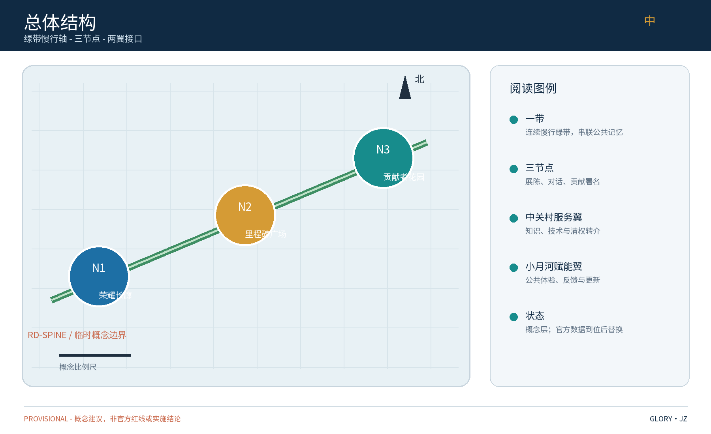
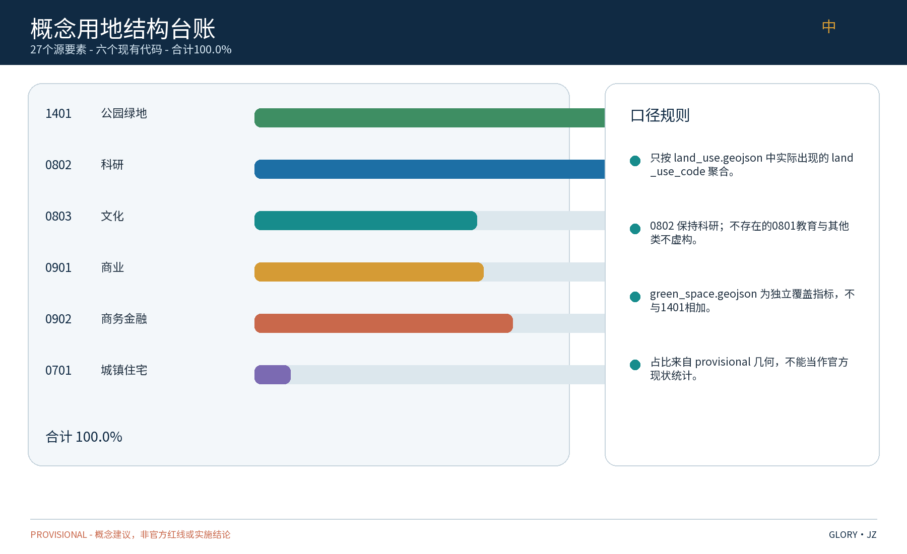
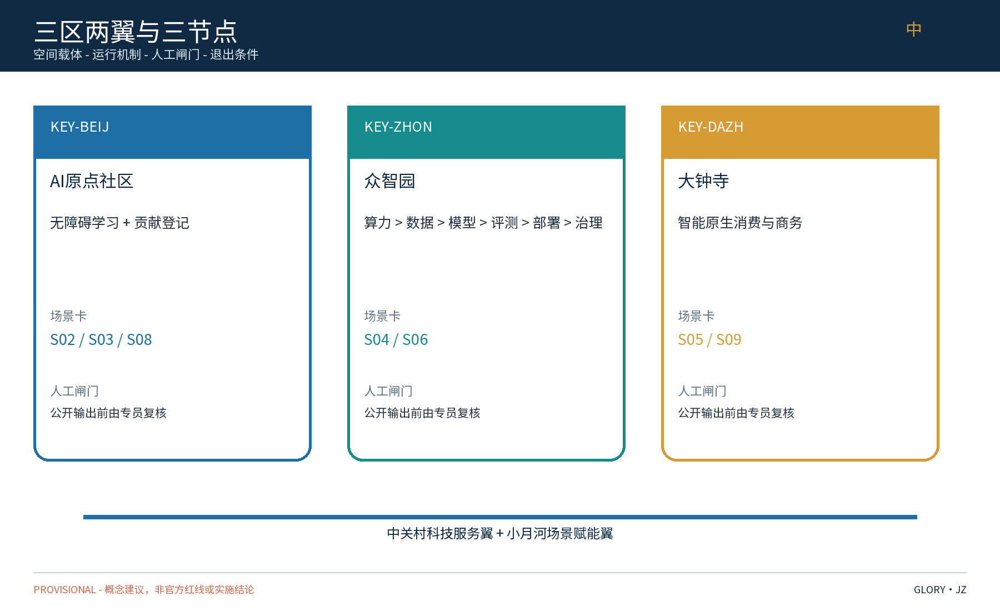
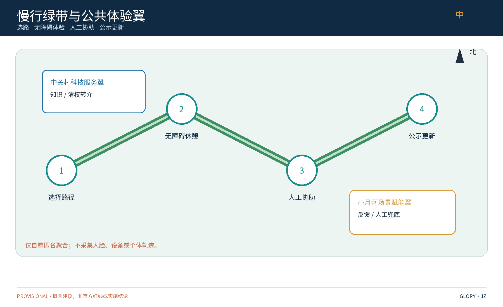
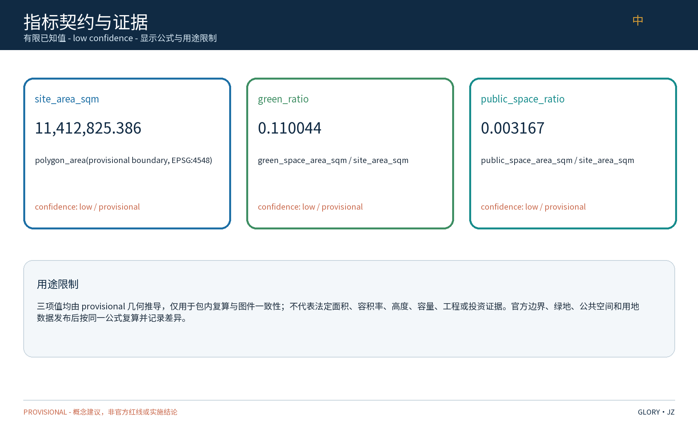

（英文：The Honor Belt — River of Merits，简称「荣耀带」；副题「百年京张，功勋长河」。原创命名，不含任何真实机构名称或商标；全部内容为概念建议。）

## 设计依据与资料清单
资料清单所列现场踏勘记录、公开史料与通则规范等均为概念工作依据清单，并非本包已获取的数据；本包实际使用的全部数据见 sources.json，未获取项已在风险与缺失数据说明中如实标注。
依据已登记的公开口径资料和任务书：北京市国土空间总体规划、海淀区分区规划（公开版）、城市设计与更新相关公开规范，以及京张铁路遗址公园与百年京张AI创新带的公开材料。现场照片、视廊和活动记录在资料清单中仅作为待核输入，本包未将其表述为已完成踏勘或已获取证据；本方案不引用未公开数据，不预设拆迁、容积率、高度、市政容量等结论。资料来源随文附注，标注公开出处与真实检索日期，供复核。

> **证据锚点**：[source:DATA-SRC-OFFICIAL-ANNOUNCEMENT-20260509]、[source:DATA-SRC-AGENT-TASKBOOK-20260518]（组织方公告与任务书为文本口径依据）。

## 三层范围工作框架
三层成果逐级传导：统筹研究输出的展示带与沿线片区协同判断约束总体设计，总体设计校核的用地兼容、绿带连续性与展示设施落位再落实到节点详设；每层均保留与任务书对应章节的机器可读证据锚点，便于评审对照。
采用"统筹研究—总体设计—重点设计"三层框架：第一层统筹研究范围，研判荣誉展示带与沿线科创片区、高校及国际化住区的协同关系；第二层总体设计范围，形成 concept-level urban-design framework 与控规接口清单，不等于达到控规深度；第三层重点区域详细设计，选取三个原创节点深化。三层共享一套指标体系与合规矩阵，逐层细化、可回溯、可校核；涉及现状、控规、强度、高度、体量、市政容量的内容均以 concept/limited/pending 标注，待官方资料和专业审查后替换。

> **证据锚点**：[source:DATA-SRC-AGENT-TASKBOOK-20260518]（三层范围划分依据任务书官方文本口径）。

## 统筹研究范围产业与未来城市研究
产业与城市研究识别展示带的「公共记忆」效应：以荣誉展陈与公共贡献叙事将开发者、机构与公众的认同有序导入沿线公共服务与产业空间，形成「展示带—片区—社区」三级联动结构，推动从陈列荣誉走向共建公共记忆；未来城市研究仅作方向性预判，不构成对用地与投资的承诺。
研究荣誉展示带与沿线科创片区、高校与国际化住区的协同。产业侧沿公开口径梳理人工智能、软件与信息服务等主导方向，识别创新成果发布与荣誉展示的需求；人才侧刻画高校师生、科研人员、创业者与国际人才的活动时段与半径；空间侧判断绿带作为"成果发布—荣誉纪念—日常交往"复合廊道的潜力，为总体设计提供支撑。

### 区域协同接口矩阵（概念提议，非合作或招商承诺）
下表只定义可被后续核验的接口，不声称与下列主体已有合作、数据交换、场地、资金或招商关系。五个区域的证据等级均为 **E0 / 待核**：本包未取得对应主体的书面确认、实时数据或设施清单；触发后由项目业主/规划统筹方先完成边界、权限和隐私审查，再决定是否发出公开征集或技术咨询。

|区域接口|可交换输入（待核）|拟议输出|触发条件|责任角色（待确认）|证据等级|非合作/非招商边界与建议接口|
|---|---|---|---|---|---|---|
|北纬社区|居民纸面意见、无障碍需求、已公示活动与路径信息|双语路线卡、人工服务板、反馈摘要与撤回记录|社区提出公开议题，且完成知情说明、最小化和人工复核|社区联络员；公共空间运营员；安全/无障碍复核员|E0/待核：仅为概念接口，不代表已取得社区数据|不暗示社区授权、居民画像、物业或运营合作；先用纸面/公开会议接口，由社区自愿决定是否参与|
|未来科学城|公开案例、可公开的技术说明、经许可的模型卡或测试需求|方法卡、测试结果卡、知识转介清单|公开征集或书面技术咨询成立，且输入权利和用途通过审查|技术服务翼接口人；数据管理员；评测员|E0/待核：未确认机构、设施或合作关系|不承诺联合实验室、算力、采购、落地或人才输送；先采用公开材料交换和一次性评测协议|
|怀柔科学城|公开科研议题、可发布的研究摘要、通用测试协议需求|双语科普/展示卡、可复核的测试协议模板|科研方公开发布且同意展示范围，完成署名、许可与事实核验|内容编辑；科研联络角色；权利复核员|E0/待核：不把区域品牌或机构当作已合作方|不代言科研成果、不索取非公开数据、不作招商导流；先走公开资料清单与匿名示范卡|
|经开区|公开产业场景、企业自愿提交的匿名聚合测试需求、公开安全要求|产业测试卡、停止/回滚记录、可公开经验条目|企业自愿报名并通过最小化、合规、人工评测和退出审查|产业测试管理员；安全审查员；运营方|E0/待核：无企业、订单或园区授权证据|不承诺企业入驻、政策、投资、订单或跨区调度；先用无敏感数据的桌面演练接口|
|京津冀|公开政策/案例、跨域活动日历、可公开的知识与路线信息|跨域案例索引、活动提示、证据等级和版本记录|多方均公开可用且完成版权、事实、隐私和责任边界审查|区域协同统筹员；内容/权利复核员；活动安全负责人|E0/待核：仅为方法层假设|不声称区域联盟、行政协同、客流互导或招商网络；先做公开案例索引，任何跨域活动须另行书面确认|

接口的共同退出条件是：无法确认权利、输入过期、出现隐私/安全/事实争议或未取得责任人确认时，停止自动输出，回退到人工公告并留下处理记录。该矩阵用于把区域协同从口号变成可审计的工作包，不构成区域关系事实。

> **证据锚点**：[source:DATA-SRC-PROVISIONAL-BOUNDARIES-20260605]（边界为 provisional，研究范围仅作概念示意）。

## 总体设计范围城市更新与控规深度城市设计
总体设计强调「以遗留绿带为骨架的组织模式」：依托任务书语境下的京张铁路原线遗留绿带作为连续骨架串联沿线节点，以模块化、可逆、可复用的公共空间组件库作为工具箱，使同一片场地平时可休闲、节事可办展办会；对控规指标只做接口核查建议，不预设数值结论。
以绿带为骨架组织荣誉展示总体设计：建立"一带串多点"总体结构，连续慢行轴贯通概念中的轨道站点、公园入口与社区界面；按节点分级配置荣誉展示、活动集会与休憩功能；预留年度活动弹性场地与临时装置接口。成果含概念总体平面、风貌导控方向、节点布局与指标复算说明，**不达到控规深度**，也不等同于法定更新单元、现状调查、道路红线、建筑强度/高度/体量或市政容量结论。上述事项分别标为 concept、limited 或 pending，须以官方 GIS/CAD、现状核查、专业交通/市政/消防/文保审查替换。

### 三大定位—五大功能—三区两翼—本方案响应
下表把任务书名词落实到空间、机制、场景和可复核证据；“响应”均为概念建议，不等于已经建成、批准或由特定机构承诺。

|层级|任务书项|空间载体|运行机制|场景/指标|证据锚点|
|---|---|---|---|---|---|
|三大定位|百年京张文化带|绿带及荣耀长廊、里程碑广场、贡献者花园|公开征集→权利核验→人工策展→轮换展陈→异议/撤回|五类公共空间AI场景；landmark_count=3、annual_program_count=3|`geometry/public_space.geojson`；[metric:landmark_count]|
|三大定位|都市AI生活体验带|RD-SPINE绿带、三地标与五个场景节点|平日/节事切换，双语导视、无障碍休憩点与人工安全服务|public_space_ratio=0.003167*；scenario_node_count=8；persona_count=8|`geometry/roads.geojson`；[metric:public_space_ratio]|
|三大定位|AI融合创新带|众智园、大钟寺及中关村科技服务翼/小月河场景赋能翼的接口|三条差异化测试回路均设角色、输入输出、人工闸门和退出|district_ai_matrix_count=3；industry_test_scenario_count=3|`compliance_matrix.json:district_ai_matrix`|
|五大功能|AI全栈自主创新体系|众智园AI自主创新加速区(KEY-ZHON)|算力→数据→模型→评测→部署→治理，数据台账和模型卡逐关留痕|部署前人工审查；失败即停止/回滚|`compliance_matrix.json:district_ai_matrix[0]`|
|五大功能|世界级AI创新生态|AI原点社区(KEY-BEIJ)+中关村科技服务翼|公开案例库、开放征集、知识资产与服务转介；不承诺企业/资金/政策|global_case_count=8；annual_program_count=3|`compliance_matrix.json`；[metric:global_case_count]|
|五大功能|AI+场景赋能新范式|一带三园及小月河公共体验路径|场景卡从匿名输入到可解释公共服务，经人工复核后发布，可撤回|industry_test_scenario_count=3；public_experience_path_count=1|`compliance_matrix.json:district_ai_matrix[2]`|
|五大功能|智能化AI活力城市|慢行轴、三地标组件与可转换活动场地|平日休憩/学习/贡献展示与节事模式切换，人工服务保底|green_ratio=0.110044*；annual_program_count=3|`geometry/green_space.geojson`；[metric:green_ratio]|
|五大功能|AI治理全球话语权|贡献者花园治理板、众智园治理日志、三节点|仅匿名聚合、关键决策人工复核、禁止过度监控；公示、申诉、撤回、退出记录|五场景均有人工复核与退出条件|`assumptions.json:A-PRIVACY-001`；`compliance_matrix.json`|
|三区两翼|AI原点社区|KEY-BEIJ概念重点区|学习与贡献接口将生态知识转成双语、可访问公共活动，不声称已有设施|persona_count=8；annual_program_count=3|`geometry/key_areas.geojson:KEY-BEIJ`|
|三区两翼|众智园AI自主创新加速区|KEY-ZHON概念重点区|可逆测试协议由数据管理员、模型负责人、评测员、治理审查员分工|district_ai_matrix[0]；function_count=5|`geometry/key_areas.geojson:KEY-ZHON`|
|三区两翼|大钟寺AI产业集聚区|KEY-DAZH概念重点区|智能原生消费/商务：时段建议、双语寻路、服务信息板；店铺/办公运营者人工校核|district_ai_matrix[1]；一条消费/商务测试回路|`geometry/key_areas.geojson:KEY-DAZH`|
|三区两翼|中关村科技服务翼|连接AI原点社区与节点的区域服务接口|公开征集、技术支持、知识资产、权利核验转介；不写招商、投资或机构承诺|global_case_count=4；area_wing_count=5|`compliance_matrix.json:alignment_matrix`|
|三区两翼|小月河场景赋能翼|RD-SPINE→场景节点→三地标的公共体验路径|选路→无障碍体验→人工协助→反馈→公示更新；社区联络员和安全负责人可暂停|public_experience_path_count=1；scenario_node_count=8|`geometry/roads.geojson`；`geometry/public_space.geojson`|

星号指标均为 provisional 概念值，统一见“指标体系、面积复算与合规矩阵”及 `compliance_matrix.json`，不作法定面积、容量或工程依据。

> **证据锚点**：[source:DATA-SRC-MOHURD-CONTROL-DETAILED-PLANNING]、[source:DATA-SRC-PROVISIONAL-BOUNDARIES-20260605]。

## 重点区域详细设计
三节点的设施选址均为概念点位，须经规划、文保与主管部门评估及专业审查后重新落位；节点间的绿带动线构成完整的荣誉叙事动线，详细平面与剖面以图册与 geometry 层表达。
节点一"荣耀长廊"：沿绿带布置模块化荣誉展陈带，展台、灯箱与信息屏可拆装、可按主题换展。节点二"里程碑广场"：以铁路里程碑为母题，与创新里程碑装置并置，形成"百年京张—当代创新"的对话式景观。节点三"贡献者花园"：将开源与公共贡献者署名转化为可生长的铭牌景观，按贡献期动态追加。三节点均预留AI场景接口与无障碍通道。

> **证据锚点**：[data:PACKAGE-GEOMETRY]（三节点示意多边形来自本包 geometry/key_areas.geojson）。

## AI 创新生态、人才画像与 AI+ 场景
荣誉内容AI策展与多语无障碍讲解为主干场景，每处均配置人工服务兜底；设施巡检维护AI、参与度匿名感知与内容审核复核为支撑场景；仅处理匿名聚合数据、关键决策人工复核双保险，不设过度监控。
面向沿线AI创新生态与五类人才画像，提出五个AI+场景：荣誉内容AI策展与去重；多语无障碍讲解；展陈设施巡检维护AI；参与度匿名感知与动线建议；内容审核人工复核。所有数据匿名聚合、仅用于改善公共体验，人工复核为最终把关，明确禁止身份识别与过度监控，并对外公示数据处理规则。

### 片区差异化AI架构与场景矩阵
三片区不是同一套“AI标签”的平移，而是三种空间—运营回路。角色均为可供后续专业团队确认的通用角色，不指向未核实企业或政策承诺。

|片区/路径|空间与运营主体|输入→输出|人工复核|退出条件|
|---|---|---|---|---|
|众智园AI自主创新加速区|KEY-ZHON概念测试室接口；数据管理员、模型负责人、评测员、部署管理员、治理审查员|经许可的公开/报送模型卡、匿名聚合测试请求、公开基准任务→版本化结果卡、评测日志、部署决定、通俗公示或停止记录；链条为算力→数据→模型→评测→部署→治理|数据管理员核用途；领域评测员核质量/偏差；治理审查员批准部署和公示|质量/安全阈值失败、撤回、未解决投诉或测试期结束：停端点、回滚、按记录归档/删除|
|大钟寺AI产业集聚区|KEY-DAZH、面向绿带的服务点；店铺/办公运营者、访客、片区运营安全员|自愿匿名请求、公开营业信息、人工排队/寻路观察、节事通知→双语寻路卡、建议时段、无障碍休憩点提示或人工服务板更新|运营者核文字；片区运营核安全/可达性；审查员可拒绝、编辑或保持旧公告|隐私投诉、不安全拥挤、无障碍故障或输入过期：暂停建议，回到人工公告|
|小月河场景赋能翼公共体验路径|RD-SPINE→五类场景节点→荣耀长廊/里程碑广场/贡献者花园；居民家庭、学生、访客、志愿者、社区联络员、安全负责人|自愿匿名脉冲反馈、无障碍需求、人工计数、已公示活动/路径信息→双语路线卡、休憩/无障碍点建议、散场提示、反馈公示；提供非数字替代|社区联络员核相关性/包容性；安全负责人核路况/节事冲突；现场人员提供人工帮助|无障碍投诉达到约定复核阈值、路况变化或活动结束：暂停路线建议，发布人工通知并记录修订|

这三条回路均以“仅匿名聚合、关键决策人工复核、禁止过度监控”为硬边界；上述输入均是拟议的公开/自愿/人工记录来源，当前不声称已有真实运营数据。

> **证据锚点**：[source:DATA-SRC-GENERATIVE-AI-INTERIM-MEASURES]（AI 生成内容治理表述的参照依据）。

### 十张 AI 场景卡（概念；S04—S06 为产业验证场景）
每张卡都把输入边界、空间载体、输出、运营主体、人工复核和退出条件写成可审查字段；卡片是试点前的设计协议，不表示已有系统或批准运营。

|卡片|输入边界|空间载体|输出|运营主体与人工复核|退出条件|
|---|---|---|---|---|---|
|S01 公开目录检索|仅依法可公开的活动/展陈目录|N1 荣耀长廊入口服务台|双语目录索引与来源卡|信息管理员复核来源和权利|来源失效、权利异议：撤下并留痕|
|S02 贡献登记提示|自愿提交的贡献摘要，不收集身份证明|N3 贡献者花园登记台|分级署名选项和纸质替代表|志愿协调员核同意范围，人工录入|撤回或未满授权年龄：不发布/删除|
|S03 文化讲解辅助|已清权文本与人工确认的术语|N2 里程碑广场讲解点|双语/无障碍音频文字稿与路线卡|文化编辑复核史实，服务员可离线讲解|翻译不确定、投诉未解：回退人工版本|
|S04 供给—需求匿名匹配（产业验证）|经许可的模型卡、匿名聚合测试需求、公开基准任务|KEY-ZHON 概念测试室接口|版本化匹配结果卡和评测日志|数据管理员核用途，评测员核偏差，治理审查员放行|阈值失败、撤回或测试期满：停端点/回滚|
|S05 消费/商务时段建议（产业验证）|自愿匿名请求、公开营业信息、人工观察|KEY-DAZH 绿带服务点|双语寻路卡、建议时段、人工服务板更新|店铺/办公运营者核文字，安全员核冲突|隐私投诉、拥挤或信息过期：暂停并回人工公告|
|S06 内容/模型质量复核（产业验证）|已清权展陈文本、模型卡与质量样本|KEY-ZHON 评测台与N1展陈后台|质量/偏差问题单、修订建议、停止记录|领域评测员复核，内容管理员决定是否重写|偏差未解、权利不清或复核不一致：不发布|
|S07 居民公共体验反馈|自愿匿名脉冲反馈、纸笔意见和人工计数|RD-SPINE 社区界面|休憩点建议、反馈公示摘要|社区联络员核相关性，人工提供非数字通道|投诉达到约定复核阈值：暂停推荐并公示处理|
|S08 儿童/老年纸面导览|监护人同意的非识别需求，或无数据人工服务|N1/N2 无障碍入口|大字版、图示版、人工带行路线卡|服务员核可读性与安全，监护人可撤回|监护人撤回、路径变化：销毁旧卡并改人工指引|
|S09 国际访客问答|公开展陈内容、访客自愿问题，不留身份|N2 多语讲解点|中英双语答复、术语表和反馈入口|双语编辑核译文，现场人员可直接回答|事实不确定或翻译投诉：标注待核并停用答复|
|S10 年度公示与申诉|已发布的匿名统计、意见和处理记录|N3 治理板及离线网页|年度公示、异议处理结果、下一年更新清单|治理审查员核最小化与匿名性，公众可申诉|无法匿名化、权利争议未解：不发布并归档|

三张产业卡 S04—S06 的最小验证指标为“评测记录完整率、人工复核一致性、投诉/退出关闭率”；具体阈值由试点前专业团队与参与方共同确认，当前不虚构结果。十张卡共享“仅匿名聚合、关键决策人工复核、禁止过度监控”的治理边界。

## 用地、建筑规模与拆改留方案
拆改留坚持留改拆并举：优先保留遗址绿带、历史价值站房与工业构筑物延续铁路记忆，低效厂房与园区建筑功能更新为展陈、办公、展示与配套空间，拆除仅限经个案论证的零星危旧建筑；全部面积为概念口径，官方数据发布后复算。
遵循"留改拆并举"的概念口径：以留为主，延续铁路遗址与既有公共空间记忆；以改为辅，推动消极空间功能置换；以拆为慎，仅对存在明确安全隐患的建构筑物作个案论证。本方案不预设用地比例与建筑规模数值，不给出拆迁结论，相关事项留待后续专项论证与法定程序确定。

本包的用地结构只采用 `geometry/land_use.geojson` 的 27 个要素，按 `land_use_code` 聚合；投影面积使用 EPSG:4548，分母为 `geometry/site_boundary.geojson` 的 provisional 边界面积 11,412,825.386 平方米。六类合计 100.0%，不再混入旧图件或文本口径：

|代码|中文/English|要素数|面积（sqm）|占比|
|---|---|---:|---:|---:|
|1401|公园绿地 / Park and green space|5|3,116,095.041|27.3%|
|0802|科研 / Scientific research|4|3,125,404.414|27.4%|
|0803|文化 / Culture|3|1,545,510.440|13.5%|
|0901|商业 / Commercial|4|1,583,428.401|13.9%|
|0902|商务金融 / Business and finance|6|1,796,422.322|15.7%|
|0701|城镇住宅 / Urban residential|5|245,964.767|2.2%|
|合计 / Total|—|27|11,412,825.386|100.0%|

教育科研/科研/其他的规则是“只显示源图层实际代码”：0802 保持科研单列；本层不存在 0801 教育或其他类，不新增、不虚构、不静默合并；0803 文化单列。`green_space.geojson` 是独立绿地覆盖层，不能与 1401 用地面积相加。图件、HTML和结构化记录均引用同一张表，百分比显示到一位小数，结构化记录保留精确值。

> **证据锚点**：[source:DATA-SRC-MNR-LAND-USE-CLASSIFICATION-202311]（用地分类名称参照现行国标口径）。

## 交通、轨道、市政与公共服务设施
以交通慢行优先为核心组织交通概念机制：绿带连续慢行轴贯通沿线节点、衔接公共空间而非被车行割裂，节事交通以轨道交通＋接驳为主（接驳专线、预约班车与共享单车调度区），散场分时分区疏导；市政按日常＋节事两档负荷校核供电、给排水、通信与临时电源接口；公共服务配置移动卫生间、母婴室、医疗点、寄存等可迁移标准化服务单元，AI决策均设人工复核。
坚持慢行优先：绿带连续慢行轴串联各节点与轨道站点，步行骑行全线贯通，过街与接驳以安全便捷为先。市政按概念预留原则，提出照明、排水与机电接口的模块化接入方式。公共服务设施结合绿带节点布置便民服务、卫生间、饮水与休憩点，兼顾无障碍与多语信息指引，服务绿带内人群与周边居民。

> **证据锚点**：[source:DATA-SRC-MOHURD-URBAN-DESIGN-MEASURES]（市政与慢行设计表述的方法参照）。

## 蓝绿空间、公共空间与城市风貌
构建「绿带为轴、节点公园为珠」的蓝绿公共空间体系：保留现状林带与场地肌理、结合雨水花园与透水铺装提升生态韧性；公共空间强调可转换性，展陈单元、装置广场与署名绿地可按需切换；临时设施采用模块化、可拆卸、可回收体系；风貌以道钉、轨枕、信号与机车符号等铁路工业记忆语汇克制使用、避免标语化包装。
构建"蓝绿为底、荣誉为魂"的公共空间体系：保留并连通既有绿带，丰富林荫、草坪与开敞节点；建立模块化可逆公共空间组件库，装置均可拆装、可迁移、可复用。荣誉展示风貌坚持克制不喧哗，以材质、光影与尺度的细腻表达替代大体量构筑，维护绿带宁静气质与周边建筑景观的和谐。

> **证据锚点**：[source:DATA-SRC-MOHURD-URBAN-DESIGN-MEASURES]（蓝绿空间组织的方法参照）。

## 更新项目清单、实施政策与分期计划
三阶段项目清单（近期1-3年/中期3-5年/远期5-10年）为概念清单，规模与投资估算均为建议性表述；政策建议（荣誉内容征集与展陈审批简化、弹性业态准入、多元主体参与运营）均须依法依规论证，不构成政府或运营方承诺。
形成更新项目清单与配套政策建议（公共空间共建共管、企业认养、内容准入与退出机制）。分期实施：近期1-3年启动荣耀长廊示范段、年度活动机制与AI场景试点；中期3-5年完成慢行轴贯通及里程碑广场、贡献者花园建设；远期5-10年完善全域体系。年度活动固定三项：荣誉发布日、开源贡献者感谢周、社区共创节。

> **证据锚点**：[source:DATA-SRC-AGENT-TASKBOOK-20260518]（分期与实施条目对应任务书要求）。

## 指标体系、面积复算与合规矩阵
展陈单元复用率、慢行可达性、绿带连续性、组件库覆盖率、公众参与度五类概念指标体系进入 metrics.json；面积复算以同一 provisional 几何公式为底，官方数据到位后整体复算并标注复算版本。
核心指标契约统一如下：`site_area_sqm=11,412,825.386 sqm*`，公式为 `polygon_area(provisional_site_boundary, EPSG:4548)`，confidence=low；`green_ratio=0.110044*`，公式为 `green_space_area_sqm/site_area_sqm`，confidence=low；`public_space_ratio=0.003167*`，公式为 `public_space_area_sqm/site_area_sqm`，confidence=low。星号表示概念值，仅用于包内复算、图件一致性和概念比较，不是法定面积、容量、工程或投资依据；官方边界发布后按相同公式复算并记录差异。三项核心值均为 known finite value，数值与 `visual/index.html`、中英文图件和 A0/A3 页脚同步。
建立可执行的概念指标体系：绿带连续率、节点步行可达率、组件可逆利用率、活动承载量、无障碍达标率、内容更新周期，并为AI测试保留质量/安全阈值、人工复核一致性、投诉数和退出记录字段。当前无真实运营基线，因此阈值由后续专业团队在试点前设定，不把空值伪装成验收结论。合规矩阵逐项对照上位规划、文物保护与公共空间管理规定，形成“依据—要求—响应”对照表，随设计深度同步更新；完整结构化闭环见 `compliance_matrix.json`。

> **证据锚点**：[metric:green_ratio]、[metric:public_space_ratio]、[source:PACKAGE-GEOMETRY]。

## 风险、版权与合规说明
本方案为概念研究性设计，不构成行政审批依据，也不构成容积率、建筑高度、拆改留或工程可行性结论；风险已按节事与日常使用冲突、客流安全、展示尺度争议与AI过度监控观感四维度如实登记于 risk.json（应对原则：匿名聚合、最小必要、人工复核、事前公示预案）。当前登记表中的来源和素材仅在各自条目明确的许可/权利边界内使用；未完成法律清权的名称、标识、荣誉对象与影像仅作内部概念方向，不宣称公共发布权。荣誉与贡献内容涉及姓名权与名誉权的，展示前须依法取得授权并设申诉通道；正式实施前须完成多部门联审、文物保护与安全评估。
主要风险：荣誉对象真实性、署名与肖像授权、隐私、开源许可、内容争议及设施维护。应对：所有荣誉与署名须经核验与授权，公示异议与撤销机制；AI数据匿名化并接受审计；文案与影像厘清版权归属，引用开源素材遵循相应许可。本方案为概念建议，不构成工程可行性或投资承诺，最终以法定程序为准。

> **证据锚点**：[source:DATA-SRC-OFFICIAL-ANNOUNCEMENT-20260509]（征集规则为权属与合规表述的依据）。

## 参考资料
参考资料以政府正式发布版本为准，按公开/待核分类存档并标注获取时间：京张铁路历史与遗址公园公开材料、沿线高校与科创园区公开信息、北京城市总体规划及分区规划公开口径、公共荣誉展示与公共艺术相关公开案例、无障碍与公共安全等通则规范。现场踏勘记录与自绘分析草图只是待核资料项，本项目未将其作为已采集证据；本包 sources.json 仅收录可查证条目，未虚构任何官方数据或链接。
列出本方案引用的公开资料类别：北京市国土空间总体规划（公开版）、海淀区分区规划（公开版）、京张铁路遗址公园建设与百年京张AI创新带公开报道、城市更新与步行系统相关研究文献，以及国际案例的官方资料与新闻报道。参考条目均注明名称、来源与检索日期，不引用未公开或难以核实的材料。

> **证据锚点**：[source:DATA-SRC-OFFICIAL-ANNOUNCEMENT-20260509]（本清单首条即组织方公开资料包）。

## 八类用户画像
|画像|真实需求与可访问性边界|对应卡片/空间|
|---|---|---|
|高校师生与科研人员|成果交流、开放研讨、术语准确；可使用评测台但不默认开放内部数据|S03/S04/S06，KEY-ZHON|
|科创园区从业者|午间休憩、短时交流、双语信息；不以工牌或轨迹识别|S05/S07，RD-SPINE|
|周边居民与家庭|日常休闲、遛娃、社区议事和安全散场；优先人工与纸面渠道|S07/S08，N1/N3|
|儿童与照护者|儿童友好、监护同意、大字/图示导览；不采集儿童身份|S02/S08，N1/N2|
|老年人与低数字能力者|适老、线下登记、口头讲解、人工陪行；数字服务永不作为唯一入口|S01/S08，N1|
|无障碍需求者|连续可达、休憩点与替代路线；路线建议必须人工复核|S07/S08，RD-SPINE|
|国际人士与访客|中英双语、文化解释和人工问答；仅处理自愿问题|S03/S09，N2|
|开源与公共贡献者|可选择署名层级、撤回和年度公示；公开贡献不等于永久授权|S02/S10，N3|

## 八个机制案例（仅作公开机制对照）
1. 纽约 High Line：铁路遗产线性公共空间与社区维护机制。
2. 巴黎 Promenade Plantée：废弃铁路步行绿道的连续空间转译。
3. 伦敦 Trafalgar Square Fourth Plinth：公共艺术轮换与公众参与。
4. 哥本哈根 Superkilen：跨文化物件征集、来源标注与公共叙事。
5. 阿姆斯特丹 Algorithm Register：公共算法登记与可解释性沟通机制。
6. 巴塞罗那 Decidim：开放式公共参与、提案与反馈闭环。
7. 新加坡 AI Verify：AI 治理测试工具与可复核记录思路。
8. NIST AI Risk Management Framework：风险识别、测量、管理与治理框架。

以上案例不代表本地合作、采购、政策采纳或绩效复制；仅借鉴可公开复核的机制结构，来源、许可与复用边界登记于 `sources.json`。
